This post will cover the steps to bring up a Kubernetes cluster in Ubuntu, then how to install and configure Antrea as CNI and how to install and configure NSX Advanced Load Balancer to use as a servicetype Load Balancer in the k8s environment with the use of Avi Kubernetes Operator.  

Abbreviations used in this post:  

- NSX Advanced Load Balancer = NSX ALB
- Avi Kubernetes Operator = AKO
- Kubernetes = k8s
- Container Network Interface = CNI
- Load Balancer = lb  
  

# Introduction to this post


When working with pods in a k8s cluster there is often the use of nodePort, clusterIP and LoadBalancer. In a three tiered application very often only one of the tier is necessary to expose to the "outside" (outside of the k8s cluster) world so clients can reach the application. There are several ways to do this, and one of them is using the service Load Balancer in k8s. The point of this post is to make use of NSX ALB to be the load balancer when you call for the service load balancer in your application. There are some steps needed to be done to get this up and running, as will be covered in this post, and when done you can enjoy the beauty of automatically provisioned lb's by just stating in your yaml that you want a lb for the specific service/pod/application and NSX ALB will take care of all the configuration needed to make your application available through a VIP. One of the steps involved in making this happen is deploying the AKO in your k8s cluster. AKO runs as a pod and is very easy to deploy and configure.

# Diagram over topology

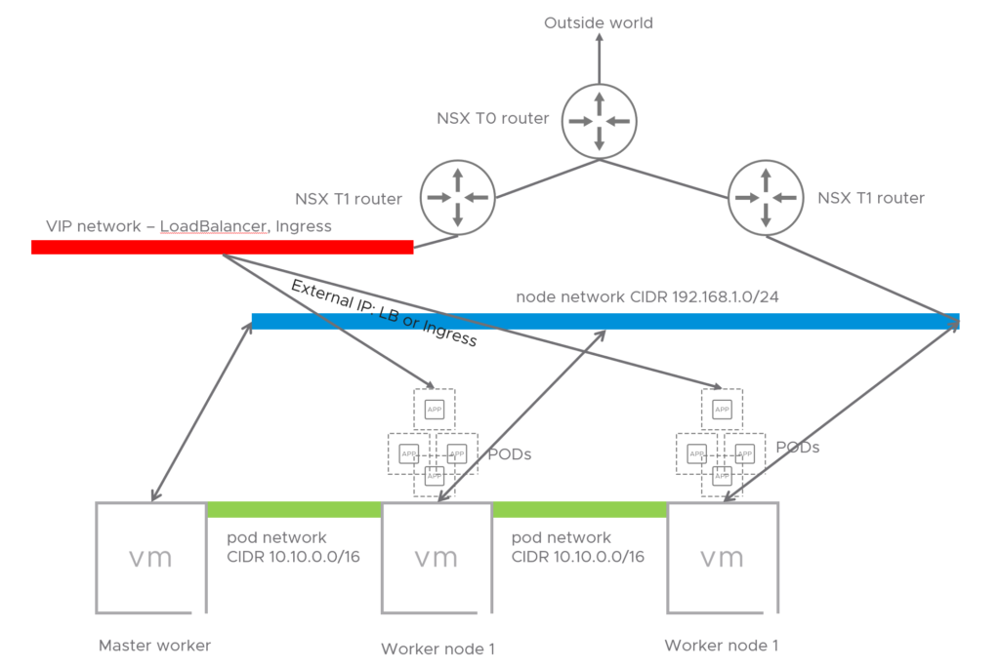

# **Deploy Kubernetes on Ubuntu 20.04**

## **Prepare the Worker and Master nodes.**

For this part the initial process was taken from [here](https://medium.com/@fromprasath/setup-kubernetes-cluster-using-kubeadm-in-vsphere-virtual-machines-985372ee5b97) with modifications from my side.

This will be a small 3-node cluster with 1 Master and 2 Worker Nodes.  
Install 3 Ubuntu VMs, or one and clone from that.

```
sudo hostnamectl set-hostname <hostname>
```

By using Ubuntu Server as image make sure openssh is installed.

**Disable Swap**

```
sudo swapoff -a
```

Edit _fstab_ and comment out the _swap_ entry.

Verify with the command:

```
free -h
```

### **Install packages on the master and worker nodes:**

### **On all nodes:**

```
sudo apt-get update && sudo apt-get install -y apt-transport-https curl
```

**Add Kubernetes repository:**  
Add key to Apt:

```
sudo curl -s https://packages.cloud.google.com/apt/doc/apt-key.gpg | sudo apt-key add -
```


Add repo:  

```
cat <<EOF | sudo tee /etc/apt/sources.list.d/kubernetes.list
deb https://apt.kubernetes.io/ kubernetes-xenial main
EOF
```

**Install Kubeadm, Kubelet and Kubectl**

```
sudo apt-get update

sudo apt-get install -y kubelet kubeadm kubectl
```

Note, this will install default Kubernetes release in apt repo from your distro, if you want to install a specific version, follow this:

Overview of differente Kubernets versions and dependices:  
_[https://packages.cloud.google.com/apt/dists/kubernetes-xenial/main/binary-arm64/Packages](https://packages.cloud.google.com/apt/dists/kubernetes-xenial/main/binary-arm64/Packages)  
_Lets say we want to install Kubeadmin 1.18.9:

```
sudo apt-get install kubelet=1.18.9-00 kubectl kubeadm=1.18.9-00
```


Check the below link if you can install a later version of _kubectl_ than kubeadmin  
[https://kubernetes.io/docs/setup/release/version-skew-policy/](https://kubernetes.io/docs/setup/release/version-skew-policy/)

The latter apt-get install command install kubelet version 1.18.9 and kubeadm 1.18.9 but kubectl will be the default release in apt (1.19.x for me).

**After the the three packages have been installed, set them on hold:**

```
sudo apt-mark hold kubelet kubeadm kubectl

kubelet set on hold.
kubeadm set on hold.
kubectl set on hold.
```

**Install Docker container runtime:**

```
sudo apt-get install docker.io -y
```

### **On the master-node init the Kubernetes master worker:**

```
sudo kubeadm init --pod-network-cidr=10.162.0.0/16 --apiserver-cert-extra-sans apihost.corp.local
```

Change the CIDR accordingly to match your defined pod-network. It comes down to if you want to do a routable or nat’ed toplogy.  And by using the –apiserver-cert-extra variable it will generate the certs to also reflect the dns-name, making it easier to expose this with a name instead of just the ip of the master worker.

### **On the worker-nodes, join the control plane of the master worker:**

```
sudo kubeadm join apihost.corp.local:6443 --token <toke> --discovery-token-ca-cert-hash <hash>
```

The token and hash is presented to you after you have init’d the master-node in the previous step above.

After you have joined all you worker nodes to the control-plane you have a working Kubernetes cluster, but without any pod-networking plugin (CNI), this will be explained a bit later and is also the reason for creating this guide.


To make it easier to access your cluster copy the kube config to your $HOME/.kube folder:

```
mkdir -p $HOME/.kube

sudo cp -i /etc/kubernetes/admin.conf $HOME/.kube/config
sudo chown $(id -u):$(id -g) $HOME/.kube/config
```

You can now to a _kubectl get pods --all-namespaces_ and notice that the coredns pods have status pending. That is because there is not pod networking up and running yet.

# **Install Antrea as the CNI**

**To read more about Antrea, go here:  
**[https://github.com/vmware-tanzu/antrea](https://github.com/antrea-io/antrea)

To get started with Antrea is very easy.  
[https://github.com/vmware-tanzu/antrea/blob/master/docs/getting-started.md](https://github.com/antrea-io/antrea/blob/main/docs/getting-started.md)

_I will post a dedicated post for Antrea, covering Antrea Policies and other features in Antrea._

On the master worker:

Decide first which version/release of Antrea you want (latest as of this writing is v1.1.1), this could depend on certain dependencies with other solutions you are going to be using. In my case I am using VMware Advanced LoadBalancer AKO v1.4.2 (Previously AVI Networks) as Service LB for my pods/apps. See this for compatibility guide: [https://avinetworks.com/docs/ako/1.4/ako-compatibility-guide/](https://avinetworks.com/docs/ako/1.4/ako-compatibility-guide/)

Tag the release you want to be installed of Antrea:  
_`TAG=v1.1.1`  
_Again, this is all done on the master-worker  
Then apply:  
_`kubectl apply -f [https://github.com/vmware-tanzu/antrea/releases/download/$TAG/antrea.yml](https://github.com/vmware-tanzu/antrea/releases/download/$TAG/antrea.yml)`_

This will automatically create the needed interfaces on all the workers. After a short time check your pods:  

```
Kubectl get pods --all-namespaces
kube-system   antrea-agent-bzdkx                       2/2     Running   0          23h
kube-system   antrea-agent-lvdxk                       2/2     Running   0          23h
kube-system   antrea-agent-zqp6d                       2/2     Running   0          23h
kube-system   antrea-controller-55946849c-hczkw        1/1     Running   0          23h
kube-system   antrea-octant-f59b76dd9-6gj82            1/1     Running   0          10h
kube-system   coredns-66bff467f8-6qz2q                 1/1     Running   0          23h
kube-system   coredns-66bff467f8-cd6dw                 1/1     Running   0          23h
```

Coredns is now running and antrea controller/agents have been installed.

If you look at your worker nodes, they have also been configured with some extra interfaces:

_4: ovs-system:_

_5: genev\_sys\_6081:_

_6: antrea-gw0:_

**You now have a working container network interface, what now?  
**Wouldn’t it be cool to utilize a service load balancer to easily scale and expose your frontends?

# Install AVI Kubernetes Operator

Here comes AKO (Avi Kubernetes Operator), VMware Advanced LoadBalancer  
To read more about AKO visit: [https://github.com/vmware/load-balancer-and-ingress-services-for-kubernetes](https://github.com/vmware/load-balancer-and-ingress-services-for-kubernetes) and [https://avinetworks.com/docs/ako/1.4/ako-release-notes/](https://avinetworks.com/docs/ako/1.4/ako-release-notes/)

To be able to install AKO there are some prereqs that needs to be done on both your k8s cluster and NSX-ALB controller.

## Prepare NSX-ALB for AKO

Lets start with the pre-reqs on the NSX-ALB controller side by logging into the controller GUI.

Disclaimer, I have followed some of the official documentation here: [https://avinetworks.com/docs/ako/1.2/ako-installation/](https://avinetworks.com/docs/ako/1.2/ako-installation/) but I couldn’t follow everything there as it did not work in my environment.

This guide assumes NSX-ALB has been configured with a default-cloud with vCenter and the networks for your VIP subnet, node-network already has been defined as vDS portgroups in vCenter. In additon to basic knowledge of NSX-ALB.

In the NSX-ALB Controller

Create a dedicated SE group for the K8s cluster you want to use with AVI, define it the way you would like:  

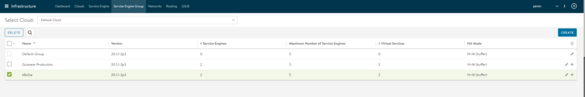

Create DNS and IPAM profiles  

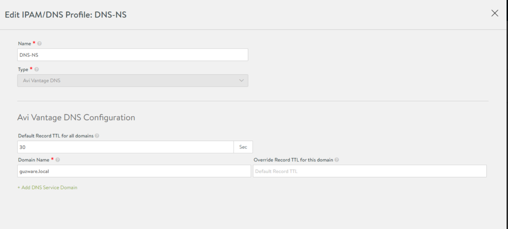

In IPAM define this:  

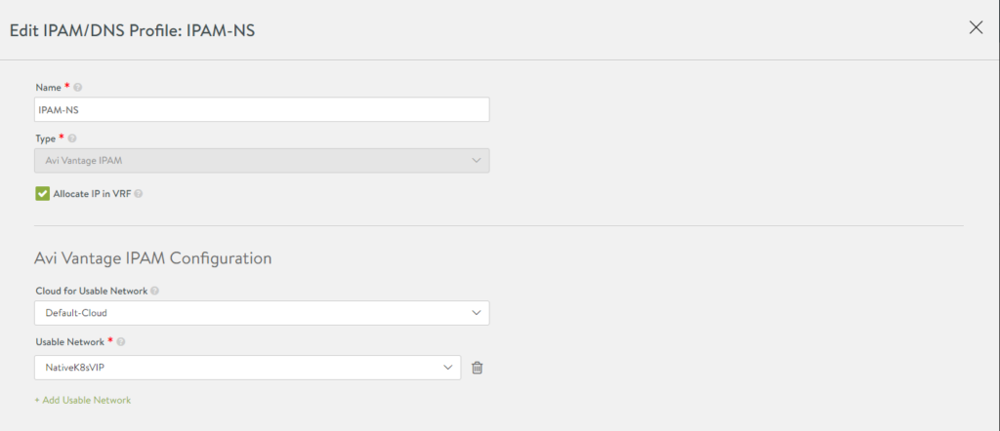

Name, cloud and the VIP network for the SEs frontend facing IP. The network that should be reachable outside the node-network.

Go to infrastructure and select your newly created IPAM/DNS profiles in your default-cloud:  

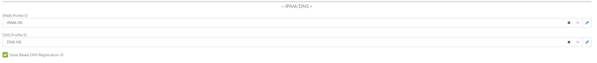

While you are editing the default-cloud also make sure you have configured these settings:  

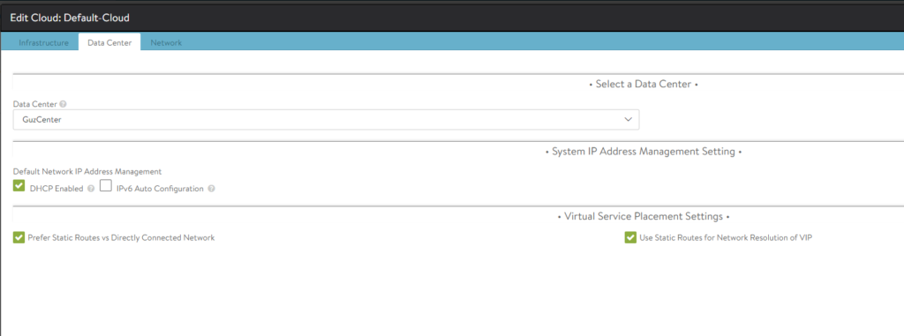

DHCP is for the management IP interface on the SEs. The two other options “Prefer Static” & Use Static” I have to use otherwise it will not work, the AKO pod refuses to start, crashloopbackoff. And I am not doing BGP on the Avi side, only from the T0 of NSX. One can use the default global routing context as it can be shared, no need to define a custom routing context.  
Under network select the management network and your SE group created for AKO SEs. And ofcourse enable DHCP:  

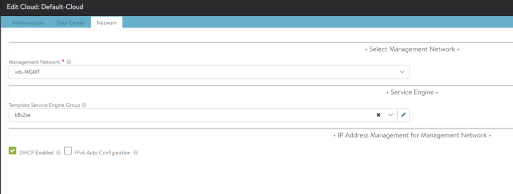

**Now we are done on the NSX-ALB controller side. Lets jump back to our K8s Master worker to install AKO.  
The initial steps here I have taken from:**

https://www.vrealize.it/2020/09/15/installing-antrea-container-networking-and-avi-kubernets-operator-ako-for-ingress/

## **Install AKO:**

AKO is installed with helm, so we need to install helm on our master worker:  
_`sudo snap install helm --classic`_  
Or whatever preferred way to install packages in Ubuntu.

**Create a namespace for the AKO pod:  
**

```
 kubectl create ns avi-system
```

**Add AKO incubator repository  
**

```
 helm repo add ako https://projects.registry.vmware.com/chartrepo/ako
```

**Search for available charts and find the version number:  
**

```
helm search repo
    
 NAME                 	CHART VERSION	    APP VERSION	        DESCRIPTION
 ako/ako              	1.4.2       	1.4.2      	A helm chart for Avi Kubernetes Operator
 
```

  

**Download AKO values.yaml**

```
 helm show values ako/ako --version 1.4.2 > values.yaml
```

This needs to be edited according to your needs. See the comments in the value.yaml and you will se whats needed to be updated.

I will publish my value.yaml file here and comment what I edited.  
I will remove the default comments and replace them with my own, just refer to de default comments by looking at the original yaml file here:  
[https://raw.githubusercontent.com/avinetworks/avi-helm-charts/master/charts/stable/ako/values.yaml](https://raw.githubusercontent.com/avinetworks/avi-helm-charts/master/charts/stable/ako/values.yaml)

```
# Default values for ako.
# This is a YAML-formatted file.
# Declare variables to be passed into your templates.

replicaCount: 1

image:
  repository: avinetworks/ako
  pullPolicy: IfNotPresent


### This section outlines the generic AKO settings
AKOSettings:
  logLevel: "INFO" #enum: INFO|DEBUG|WARN|ERROR
  fullSyncFrequency: "1800" # This frequency controls how often AKO polls the Avi controller to update itself with cloud configurations.
  apiServerPort: 8080 # Specify the port for the API server, default is set as 8080 // EmptyAllowed: false
  deleteConfig: "false" # Has to be set to true in configmap if user wants to delete AKO created objects from AVI 
  disableStaticRouteSync: "false" # If the POD networks are reachable from the Avi SE, set this knob to true.
  clusterName: "GuzK8s" # A unique identifier for the kubernetes cluster, that helps distinguish the objects for this cluster in the avi controller. // MUST-EDIT
  cniPlugin: "" # Set the string if your CNI is calico or openshift. enum: calico|canal|flannel|openshift 

### This section outlines the network settings for virtualservices. 
NetworkSettings:
  ## This list of network and cidrs are used in pool placement network for vcenter cloud.
  ## Node Network details are not needed when in nodeport mode / static routes are disabled / non vcenter clouds.
  # nodeNetworkList: [] 
  nodeNetworkList:
   - networkName: "Native-K8s-cluster"
     cidrs:
         - 192.168.0.0/24   # NODE network
  subnetIP: "10.150.4.0" # Subnet IP of the vip network
  subnetPrefix: "255.255.255.0" # Subnet Prefix of the vip network
  networkName: "NativeK8sVIP" # Network Name of the vip network

### This section outlines all the knobs  used to control Layer 7 loadbalancing settings in AKO.
L7Settings:
  defaultIngController: "true"
  l7ShardingScheme: "hostname"
  serviceType: "ClusterIP" #enum NodePort|ClusterIP
  shardVSSize: "SMALL" # Use this to control the layer 7 VS numbers. This applies to both secure/insecure VSes but does not apply for passthrough. ENUMs: LARGE, MEDIUM, SMALL
  passthroughShardSize: "SMALL" # Control the passthrough virtualservice numbers using this ENUM. ENUMs: LARGE, MEDIUM, SMALL

### This section outlines all the knobs  used to control Layer 4 loadbalancing settings in AKO.
L4Settings:
  defaultDomain: "" # If multiple sub-domains are configured in the cloud, use this knob to set the default sub-domain to use for L4 VSes.

### This section outlines settings on the Avi controller that affects AKO's functionality.
ControllerSettings:
  serviceEngineGroupName: "k8s2se" # Name of the ServiceEngine Group.
  controllerVersion: "20.1.1" # The controller API version
  cloudName: "Default-Cloud" # The configured cloud name on the Avi controller.
  controllerIP: "172.18.5.50"

nodePortSelector: # Only applicable if serviceType is NodePort
  key: ""
  value: ""

resources:
  limits:
    cpu: 250m
    memory: 300Mi
  requests:
    cpu: 100m
    memory: 75Mi

podSecurityContext: {}
  # fsGroup: 2000


avicredentials:
  username: "admin"
  password: "PASSWORD"


service:
  type: ClusterIP
  port: 80


persistentVolumeClaim: ""
mountPath: "/log"
logFile: "avi.log"


```

Remember that YAML’s are indentation sensitive.. so watch your spaces 😉

**Deploy the AKO controller:  
**_`helm install ako/ako --generate-name --version 1.4.2 -f avi-values.yaml --namespace=avi-system`_  


One can verify that it has been installed with the following command:  
_`helm list --namespace=avi-system`_  
and

_`Kubectl get pods --namespace=avi-system`_

_`NAME    READY   STATUS    RESTARTS   AGE`_

_`ako-0   1/1     Running   0          15h`_  


One can also check the logs of the pod:  
_`kubectl logs --namespace=avi-system ako-0`_  


If you experience a lot of restarts, go through your config again, I struggled a lot to get it running in my lab the first time after I figured out there were some configs I had to to. I suspected some issues with the pod itself, but the problem was on the NSX-ALB controller side and values.yaml parameters.

Now to test out the automatic creation of SE and ingress for your frontend install an application and change the service type to use _loadBalancer_. Everything is automagically created for you. Monitor progress in the NSX-ALB Controller and vCenter.  
NSX-ALB deploys the SE OVAs, as soon as they are up and running they will be automatically configured and you can access your application through the NSX-ALB VIP IP. You can of ofcourse scale the amount of SEs and so on from within the Avi controller.  

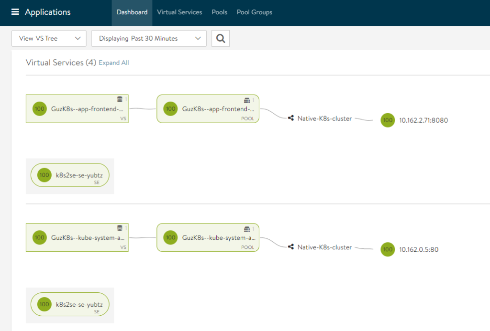

The ips on the right side is the pods, and my frontend/public facing IP is:  

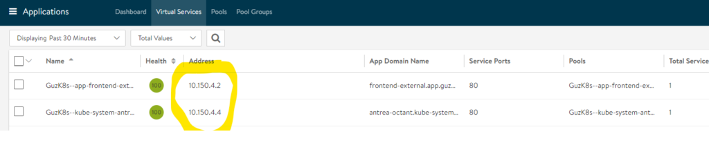

Which can also be received by using:  
`kubectl get service --namespace=app`

_`NAME                            TYPE                   CLUSTER-IP       EXTERNAL-IP   PORT(S)              AGE`_

_`frontend-external       LoadBalancer   10.96.131.185   10.150.4.2       80:31874/TCP   15h`_

Now we have all the power and features from NSX Advanced LoadBalancer, with full visibility and logging. What about monitoring and features of Antra, the CNI plugin?

# Install Octant - opensource dashboard for K8s

[https://github.com/vmware-tanzu/octant](https://github.com/vmware-tanzu/octant)

**Octant with Antrea Plugin as a POD**

https://github.com/vmware-tanzu/antrea/blob/master/docs/octant-plugin-installation.md  

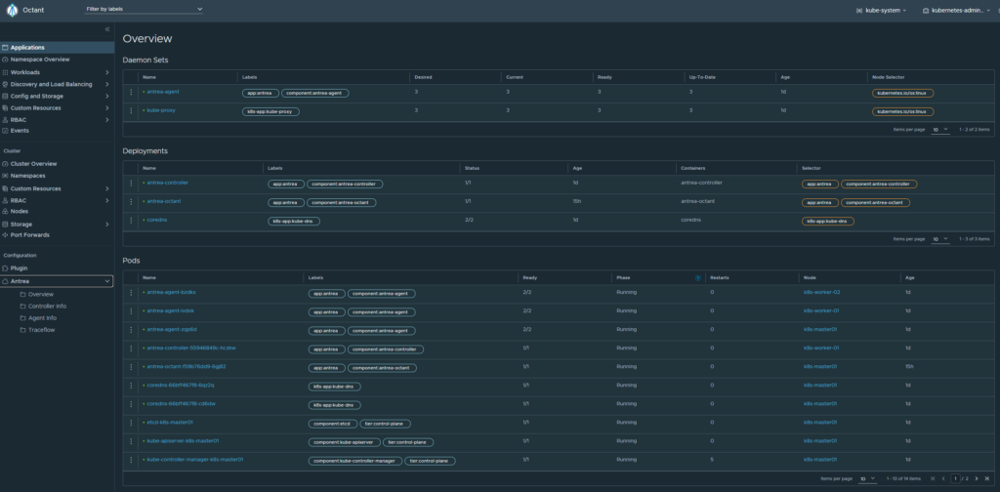

# **Upgrading the components used in this blog**

## Upgrade Antrea  

Say you are running Antrea version v0.9.1 and want to upgrade to v0.10.1. Do a rolling upgrade like this:

**First out is the Antrea-Controller!**

kubectl _set image deployments/antrea-controller antrea-controller=antrea/antrea-ubuntu:v0.10.1 --namespace=kube-system_

**Check status on upgrade:**

_kubectl rollout status deployments/antrea-controller --namespace=kube-system_

This upgrades the Antrea Controller, next up is the Antrea Agents.

**Upgrading the Antrea-agents:**

_kubectl set image daemonset/antrea-agent antrea-agent=antrea/antrea-ubuntu:v0.10.1 --namespace=kube-system_

As you are doing the rolling upgrades, one can monitor the process by following the pods or use Octant and get real-time updates when the agents have been upgraded.  

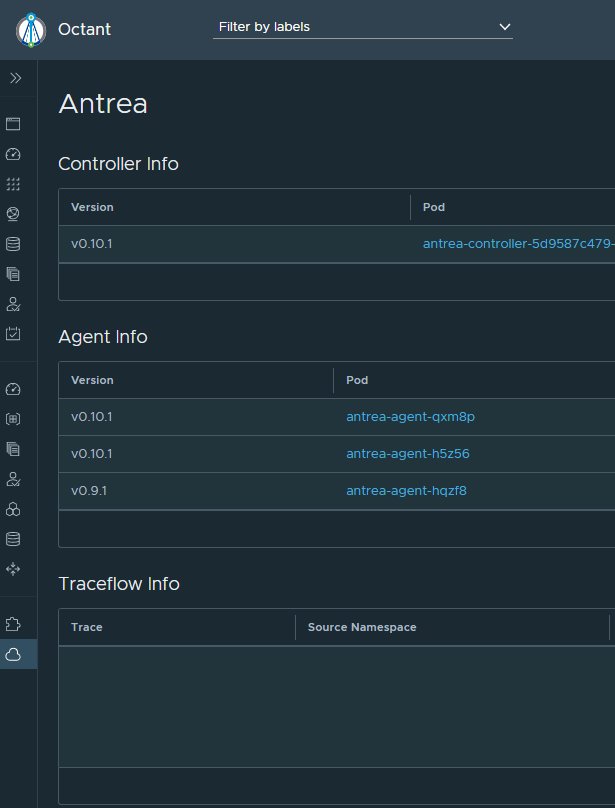

Doing changes in the antrea yaml file, if changes is not updated, do a rollut restart:

_kubectl rollout restart daemonset --namespace=kube-system antrea-agent_
