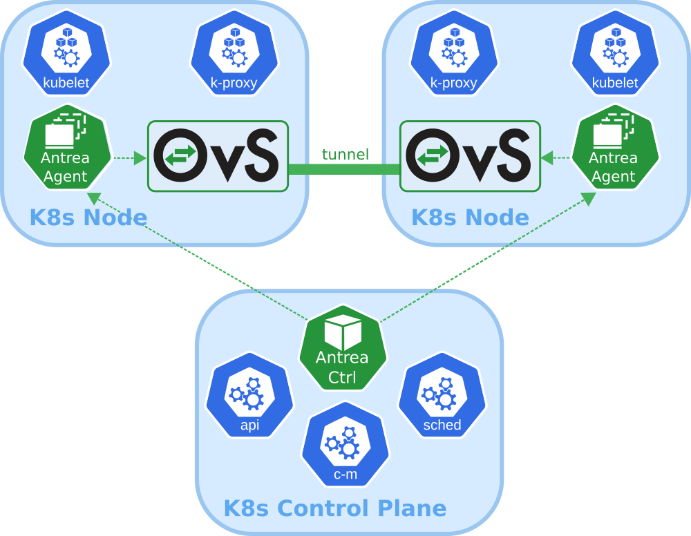

This is an introduction post to Antrea, what it is and which features it has.  
For more details head over to:  
[https://antrea.io/](https://antrea.io/) and [https://github.com/antrea-io/antrea](https://github.com/antrea-io/antrea)

First of, Antrea is a CNI. CNI stands for Container Network Interface. As the world moves into Kubernetes more and more, we need a good CNI to support everything from network to security within Kubernetes. Thats where Antrea comes into play.

Antrea has a rich set of features such as:

- **Kubernetes-native**: Antrea follows best practices to extend the Kubernetes APIs and provide familiar abstractions to users, while also leveraging Kubernetes libraries in its own implementation.
- **Powered by Open vSwitch**: Antrea relies on Open vSwitch to implement all networking functions, including Kubernetes Service load-balancing, and to enable hardware offloading in order to support the most demanding workloads.
- **Run everywhere**: Run Antrea in private clouds, public clouds and on bare metal, and select the appropriate traffic mode (with or without overlay) based on your infrastructure and use case.
- **Windows Node support**: Thanks to the portability of Open vSwitch, Antrea can use the same data plane implementation on both Linux and Windows Kubernetes Nodes.
- **Comprehensive policy model**: Antrea provides a comprehensive network policy model, which builds upon Kubernetes Network Policies with new features such as policy tiering, rule priorities and cluster-level policies.
- **Troubleshooting and monitoring tools**: Antrea comes with CLI and UI tools which provide visibility and diagnostics capabilities (packet tracing, policy analysis, flow inspection). It exposes Prometheus metrics and supports exporting network flow information which can be visualized in Kibana dashboards.
- **Encryption**: Encryption of inter-Node Pod traffic with IPsec tunnels when using an overlay Pod network.
- **Easy deployment**: Antrea is deployed by applying a single YAML manifest file.

As this blog page evolves, it will cover in more technical posts how to use and configure Antrea with examples. As how this webpage is both handled by Antrea network and security features (yes, this wordpress page is hosted on a native K8s cluster with Antrea as CNI)
