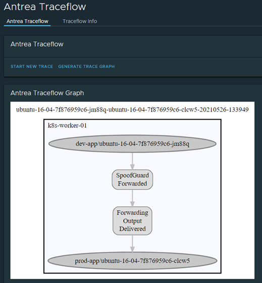
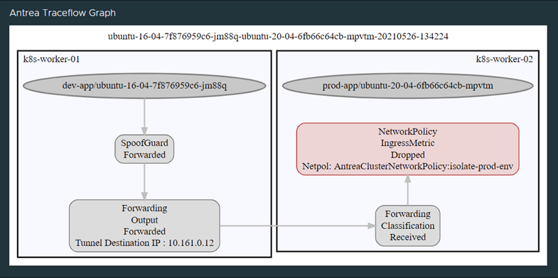
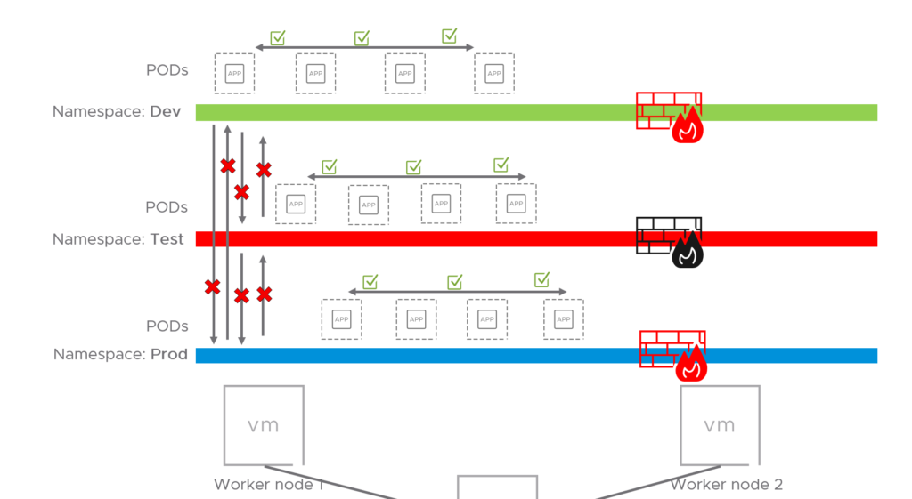
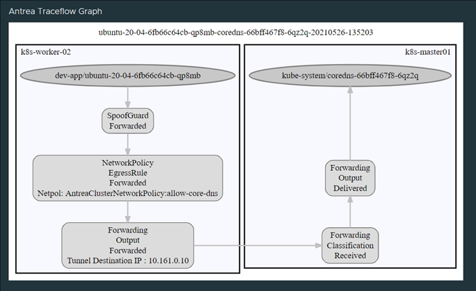
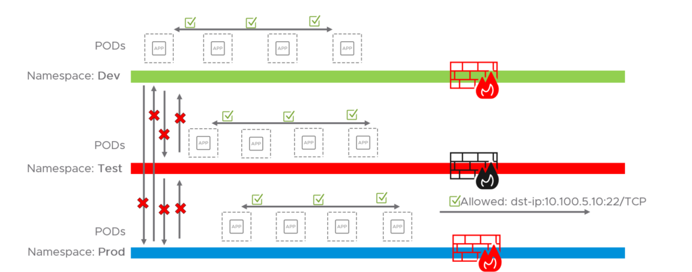
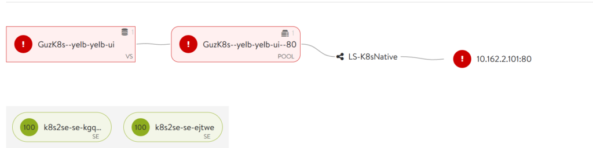
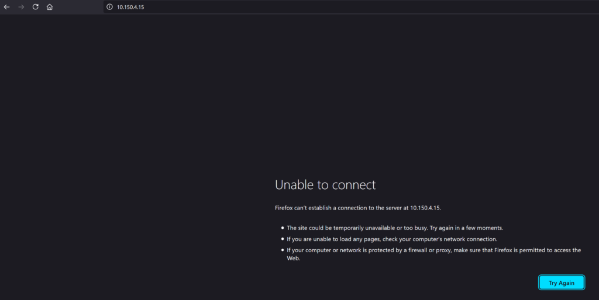
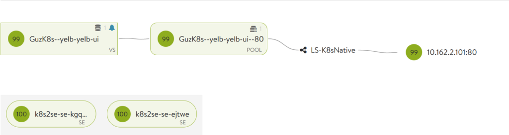
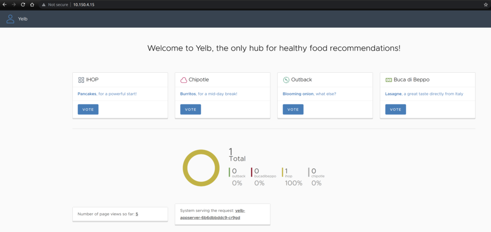
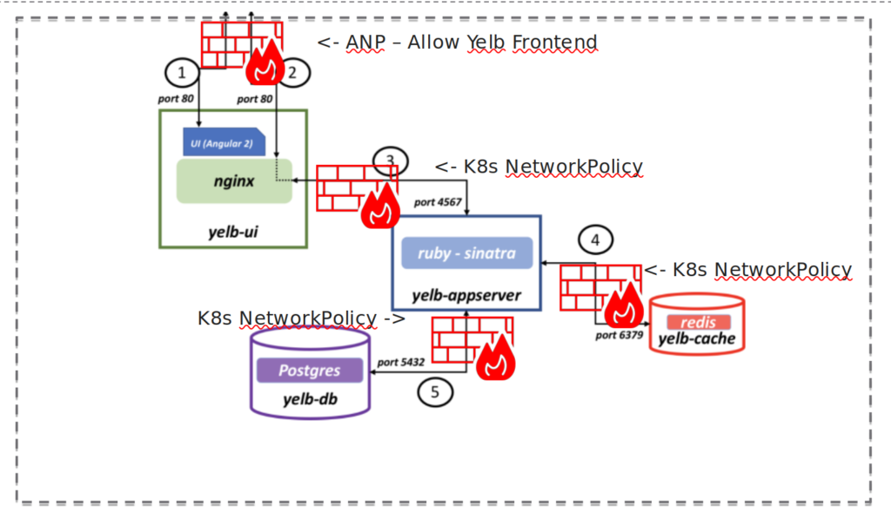

This post will go through the Antrea-native policy resources and how to use them to secure your Kubernetes environment combined with K8s network policies.

Abbreviations used in this article:  

- _Container Network Interface = CNI_
- _Antrea Cluster Network Policies = ACNP_
- _Antrea Network Policies = ANP_
- _Kubernetes Network Policies = K8s policies or KNP_

When it comes to securing your K8s infrastructure it can be done in several layers in the infrastructure as a whole. This post will focus on the possibilities within the K8s cluster with features in the Antrea CNI. I will go through the Antrea-native policies (Antrea and K8s policies), with examples of when, how and where to use them. As Antrea-native policy resources can be used together with K8s network policies I will show that also.  
This post will not cover the additional needs of security in your datacenter before reaching your K8s environment. I will cover this in a later post where I go through the use of NSX Distributed Firewall protecting your k8s clusters together with the security policies in Antrea.

# **Antrea-native policy resources** - short introduction

Antrea comes with a comprehensive policy model. We have the Antrea Cluster Network Policies and Antrea Network Policies. The difference being between those two is that the ACNP applies to all objects on the cluster, where ANP is namespaced meaning its applies to objects within the namespace defined in the policy.  
Antrea policies are tiered, meaning the rules will be following an order of precedence. This makes it very useful to divide the rules into the right categories, having different resources in the organization responsible for the security rules. Sec-ops will have their rules in the beginning setting the "ground" before the application owners can set their rules and finally some block all rules that rules out all that is left. Antrea-native policy resources is working together with K8s network policies where the latter is placed in the Application tier below the ANP and ACNP policies. Antrea comes with a set of default tiers as of installation of Antrea, but there is also possible to add custom tiers. Read more [here](https://github.com/antrea-io/antrea/blob/main/docs/antrea-network-policy.md). Here are the default tiers:  

```bash
Emergency   -> Tier name "emergency" with priority "50"
SecurityOps -> Tier name "securityops" with priority "100"
NetworkOps  -> Tier name "networkops" with priority "150"
Platform    -> Tier name "platform" with priority "200"
Application -> Tier name "application" with priority "250"
Baseline    -> Tier name "baseline" with priority "253"
```

Take a look at the diagram below and imagine your first rules is placed at the first left tier and more rules in the different tiers all the way to the right:  


## Making use of the Antrea-native policy resources

In this section I will describe a demo environment with some namespaces and applications and then go through one way of using Antrea-native policy resources together with K8s network policies. In some of my Antrea-native policies I will use namespace selection based on the actual name of the namespace, but in others I will use selection based on labels. The first example below will make use of labels as selection criteria. I will explain why below. To read more on namespace selection: [https://github.com/antrea-io/antrea/blob/main/docs/antrea-network-policy.md#select-namespace-by-name](https://github.com/antrea-io/antrea/blob/main/docs/antrea-network-policy.md#select-namespace-by-name)  

### Meet the demo environment

I will only use one K8s cluster in this example which is based on one master worker and two worker nodes.  
I will create three "environments" by using namespaces and label them according to which "environment" they belong to. The three namespaces will be "test-app", "dev-app" and "prod-app". I will then add a label on each namespace with the label env=test, env=dev and env=prod accordingly. Within each namespace I will spin up two pods (an Ubuntu 16.04 and Ubuntu 20.04 pod). What I would like to achieve is that each namespace represents their own environment to simulate scenarios where we do have prod, dev and test environments, where none of the environments are allowed to talk to each other. And by using labels, I can create several namespaces and place them into the correct environment by just "tagging" them with the correct labels (e.g env=dev).  


Now in the next section I will go through how I can isolate, and control those environments with Antrea-native policy resources.

### Antrea Cluster Network Policies (ACNP)

The first thing I would like to do is to create some kind of basic separation between those environments/namespaces so they cant communicate with each other, and when that is done I can continue to create more granular application policies within each namespace or environment.  
The first issue I meet is how to create as few rules as possible to just isolate what I know (the tree namespaces which are labeled with three different labels to create my "environments") without having to worry about additional namespaces being created and those getting access to the "environments". In this example I have already created three namespaces named "dev-app", "prod-app" and "test-app". I "tag" them in Kubernetes with their corresponding "env" labels: "dev", "prod" and "test". The reason I choose that approach is that I then can create several namespaces and choose which environment they belong to instead of doing the selection directly on the name of the namespace. I need to create an Antrea Cluster Network Policy as a "default" rule for each of my known environments so I can at a minimum guarantee that within each namespace or environment "intra-traffic" is allowed (traffic within the namespace or namespaces labeled with the same environment label). Meaning that when I do have a complete Antrea-native policy "framework" in place (with a blocking rule at the end taking care of all that is not specified) I can create new namespaces, but if they are not labeled correctly they will not be allowed to talk to any of my environments. This policy is applied at the SecurityOps tier:  

```yaml
apiVersion: crd.antrea.io/v1alpha1
kind: ClusterNetworkPolicy
metadata:
  name: isolate-dev-env
spec:
    priority: 5
    tier: SecurityOps
    appliedTo:
      - namespaceSelector:
          matchLabels:
            env: dev
    ingress:
      - action: Drop
        from:
          - namespaceSelector:
              matchExpressions:
              - key: env
                operator: NotIn
                values:
                  - dev
      - action: Allow
        from:
          - namespaceSelector:
              matchLabels:
                env: dev
    egress:
      - action: Allow
        to:
          - namespaceSelector:
              matchLabels:
                env: dev
```

What I am also doing with this ACNP is saying that if you are member of a namespace with the label "env=dev" you are allowed to ingress the namespace Dev, but not if you are not ("operator: NotIn" in the ingress namespaceSelector).  
Also note that I am allowing specifically an Action allow to the dev environment within the same policy, the reason being is that when I apply my block-all-else rule later on it will block intra traffic within the same environment if it is not specifically specified that it is allowed in this rule.  
Now I just have to recreate this policy for my other two namespaces.  
Also note that in the egress part I am only allowing traffic to namespace with the lavel "env=dev". That does not mean right now that I will only allow traffic to anything else, because I don't have any block rules in my cluster yet. Antrea-native policy resources works a bit different than K8s network policies which only supports creating allow policies. In Antrea one can specify both DROP and ALLOW on both INGRESS and EGRESS. I left this with purpose, because I later in will go ahead create a block all rule. Now lets demonstrate this rule:  

Before applying ACNP namespace isolation rule:

```bash
kubectl get pod -n dev-app -o wide
NAME                            READY   STATUS    RESTARTS   AGE   IP            NODE            NOMINATED NODE   READINESS GATES
ubuntu-16-04-7f876959c6-p5nxp   1/1     Running   0          9d    10.162.1.57   k8s-worker-01   <none>           <none>
ubuntu-20-04-6fb66c64cb-9qg2p   1/1     Running   0          9d    10.162.1.56   k8s-worker-01   <none>           <none>
```

```bash
kubectl get pod -n prod-app -o wide
NAME                            READY   STATUS    RESTARTS   AGE   IP            NODE            NOMINATED NODE   READINESS GATES
ubuntu-16-04-7f876959c6-sfdvf   1/1     Running   0          9d    10.162.1.64   k8s-worker-01   <none>           <none>
ubuntu-20-04-6fb66c64cb-z528m   1/1     Running   0          9d    10.162.1.65   k8s-worker-01   <none>           <none>
```

Above I list out the pods with IP addresses in my two namespaces "dev-app" and "prod-app"  
Now I enter bash of the Ubuntu20.04 pod in "dev-app" namespace and do a ping to the second pod in the same namespace and then ping another pod in the namespace Prod:

```bash
kubectl exec -it -n dev-app ubuntu-20-04-6fb66c64cb-9qg2p bash
```


```bash
root@ubuntu-20-04-6fb66c64cb-9qg2p:/# ping 10.162.1.57
PING 10.162.1.57 (10.162.1.57) 56(84) bytes of data.
64 bytes from 10.162.1.57: icmp_seq=1 ttl=64 time=0.896 ms
64 bytes from 10.162.1.57: icmp_seq=2 ttl=64 time=0.520 ms
64 bytes from 10.162.1.57: icmp_seq=3 ttl=64 time=0.248 ms

root@ubuntu-20-04-6fb66c64cb-9qg2p:/# ping 10.162.1.64
PING 10.162.1.64 (10.162.1.64) 56(84) bytes of data.
64 bytes from 10.162.1.64: icmp_seq=1 ttl=64 time=1.03 ms
64 bytes from 10.162.1.64: icmp_seq=2 ttl=64 time=0.584 ms
64 bytes from 10.162.1.64: icmp_seq=3 ttl=64 time=0.213 ms
```

I have also written about Octant in one of my posts, in Octant there is an Antrea plugin which gives us some graphical features such as traceflow, which is also a powerful tool to showcase/troubleshoot security policies. Below is a screenshot from Octant before the rule is applied:  



As you can see, this is allowed. Now I apply my "isolation" ACNP rules "prod", "dev" & "test". Also note; to list out the applied ACNP policies the command "_kubetcl get acnp_" can be used, without looking in a specific namespace as ACNP is clusterwide.

```bash
kubectl apply -f isolate.environment.prod.negated.yaml
clusternetworkpolicy.crd.antrea.io/isolate-prod-env created
kubectl apply -f isolate.environment.dev.negated.yaml
clusternetworkpolicy.crd.antrea.io/isolate-dev-env created
kubectl get acnp
NAME               TIER          PRIORITY   DESIRED NODES   CURRENT NODES   AGE
isolate-dev-env    SecurityOps   5          1               1               19s
isolate-prod-env   SecurityOps   6          1               1               25s
```

After they are applied I will try to do same as above:

```bash
ping 10.162.1.57
PING 10.162.1.57 (10.162.1.57) 56(84) bytes of data.
64 bytes from 10.162.1.57: icmp_seq=1 ttl=64 time=3.28 ms
64 bytes from 10.162.1.57: icmp_seq=2 ttl=64 time=0.473 ms
64 bytes from 10.162.1.57: icmp_seq=3 ttl=64 time=0.190 ms
64 bytes from 10.162.1.57: icmp_seq=4 ttl=64 time=0.204 ms

ping 10.162.1.64
PING 10.162.1.64 (10.162.1.64) 56(84) bytes of data.
```

Pinging within the same namespace works perfect, but to one of the other namespaces (here the Prod namespace) is not allowed. Works as intended.  
Doing the same traceflow with Octant again:  



So to recap, this is how it looks like now:  




Now that I have created myself some isolated environments, I also need to allow some basic needs from the environments/namespaces to things such as DNS. So I will go ahead and create such a rule. Also have in mind that I haven't yet applied the last block-all-rule (so they can still reach those services as of now). I will make that rule applied when all the necessary rules are in place beforehand. In a greenfield environment those "baseline" rules would probably be applied as the first thing before the k8s cluster is taken into use.

Going down one tier to NetworkOps I will apply this Antrea Policy:

```yaml
apiVersion: crd.antrea.io/v1alpha1
kind: ClusterNetworkPolicy
metadata:
  name: allow-core-dns
spec:
    priority: 10
    tier: NetworkOps
    appliedTo:
      - namespaceSelector: {}
    egress:
      - action: Allow
        to:
          - namespaceSelector:
              matchLabels:
                kubernetes.io/metadata.name: kube-system
        ports:
          - protocol: TCP
            port: 53
          - protocol: UDP
            port: 53
```

This policy is probably for some rather "wide" as it just does a "wildcard" selection of all namespaces available and gives them access to the backend kube-system (where the coredns pods are located) on protocol TCP and UDP port 53. But again, this post is just to showcase Antrea policies and how they _can_ be used and to give some insights in general.  
DNS allowed showed with Octant:  



Octant Traceflow

For now I am finished with the Cluster Policies and will head over to the Network Policies. This is the ACNP policies applied so far:  

```bash
kubectl get acnp
NAME               TIER          PRIORITY   DESIRED NODES   CURRENT NODES   AGE
allow-core-dns     NetworkOps    10         3               3               19h
isolate-dev-env    SecurityOps   5          1               1               22h
isolate-prod-env   SecurityOps   6          1               1               22h
isolate-test-env   SecurityOps   7          1               1               19h
```

### Antrea Network Policies (ANP)

Antrea Network Policies are namespaced. So one of the use cases for ANP could be to create rules specific for the services running in the namespace. It could be allowing ingress on certain selections (e.g label/frontend) which runs the application I want to expose or which makes sense for clients to talk to which is the frontend part of the application. Everything else is backend services which not necessary to expose to clients, but on the other hand it could be that those services needs access to other backend services or services in other namespaces. So with ANP one can create ingress/egress policies by using the different selection options defining what is allowed in and out of the namespace.

Before I continue I have now applied my ACNP block-rule in the "Baseline" tier which just blocks all else to make sense of the examples used here in this section. Below is the policy (Note that I have excluded some namespaces in this rule) :

```yaml
apiVersion: crd.antrea.io/v1alpha1
kind: ClusterNetworkPolicy
metadata:
  name: block-all-whitelist
spec:
    priority: 1000
    tier: baseline
    appliedTo:
      - namespaceSelector:
          matchExpressions:
          - key: ns
            operator: NotIn
            values:
              - kube-system
              - monitoring
    ingress:
      - action: Drop
        from:
          - namespaceSelector: {}
          - ipBlock:
              cidr: 0.0.0.0/0
    egress:
      - action: Drop
        to:
          - namespaceSelector: {}
          - ipBlock:
              cidr: 0.0.0.0/0

```

### Antrea Network Policies Egress rule

Now that I have applied my "whitelist" rule I must by now have all my necessary rules in place, otherwise things will stop working (such as access to DNS). I will now apply a policy which is "needed" by the "Prod" environment, which is access to SSH on a remote server. So the policy below is allowing Egress on TCP port 22 to this specific remote SSH server. Lets us apply this policy and test how this works out:

```yaml
apiVersion: crd.antrea.io/v1alpha1
kind: NetworkPolicy
metadata:
  name: allow-prod-env-ssh
  namespace: prod-app
spec:
    priority: 8
    tier: application
    appliedTo:
      - podSelector: {}
    egress:
      - action: Allow
        to:
          - namespaceSelector:
              matchLabels:
                kubernetes.io/metadata.name: prod-app
          - ipBlock:
              cidr: 10.100.5.10/32
        ports:
          - protocol: TCP
            port: 22
```

Just some sanity check before applying the above policy, I am still able to reach all pods within the same namespace due to my "isolation ACNP rules" even though I have my block all rule applied.  
But I am not allowed to reach anything outside except what is stated in my DNS rule. If I try to reach my remote SSH server from my "Prod" namespace I am not allowed. To illustrate this I have entered "remoted" myself into bash on one of my pods in the Prod namespace and trying to ssh the remote server 10.100.5.10, below is the current result:

```bash
root@ubuntu-20-04-6fb66c64cb-z528m:/# ssh andreasm@10.100.5.10
ssh: connect to host 10.100.5.10 port 22: Connection timed out
```

Ok, fine. What does my traceflow say about this also:  


Nope cant do it also says Traceflow. Great, everything works out as planned. Now I must apply my policy to allow this.

```bash
root@ubuntu-20-04-6fb66c64cb-z528m:/# ssh andreasm@10.100.5.10
andreasm@10.100.5.10's password:
```

Now I can finally reach my remote SSH server. To confirm again, lets check with Octant:  


Thank you very much, that was very kind of you.

To summarize so far what we have done. We have applied the ACNP rules/policies to create environment/namespace isolation

```bash
NAME                  TIER          PRIORITY   DESIRED NODES   CURRENT NODES   AGE
allow-core-dns        NetworkOps    10         3               3               21h
block-all-whitelist   baseline      20         2               2               25m
isolate-dev-env       SecurityOps   5          1               1               24h
isolate-prod-env      SecurityOps   6          1               1               31m
isolate-test-env      SecurityOps   7          1               1               21h
```

And we have applied a rule to allow some basic "needs" such as DNS with the rule allow-core-dns. And the "block-all-whitelist" policy as a "catch all rule" to block everything not specified in the tiers.  
And then we have applied a more application/namespace specific policy with Antrea Network Policy to allow Prod to egress 10.100.5.10 on port 22/TCP. But I have not specified any ingress rules allow access to any services in the namespace Prod coming from outside the namespace. So it is a very lonely/isolated environment for the moment. This is how it looks like now:  




In the next example I will create an ingress rule to another application that needs to be accessed from the outside.

### Antrea Network Policies Ingress rule

To make this section a bit more "understanding" I will use another application as example to easier illustrate the purpose. The example I will be using is a demo application I have been using for several years - Yelb [link](https://github.com/mreferre/yelb)

This application contains of four pods and looks like this:  


Yelb diagram

I already have the application up and running in my environment. But as this application is a bit more complex and contains a frontend which is useless if not exposed or reachable I am exposing this frontend with NSX Advanced Load Balancer. This makes it very easy for me to define the ingress rule as it means I only have to allow the load balancers IPs in my egress rule and not all potential IPs. The load balancers IP's is something I know. Some explanation around the load balancer IP's in my environment is that they are spun up on demand and just pick an IP from a pre-defined IP pool, so instead of pinning the ingress rule to the current IP they have I am bit wide and allow the IP range that is defined. Remember that this is a demo environment and does not represent a production environment. Lets take a look at the policy:  

```yaml
apiVersion: crd.antrea.io/v1alpha1
kind: NetworkPolicy
metadata:
  name: allow-yelb-frontend
  namespace: yelb
spec:
    priority: 5
    tier: application
    appliedTo:
      - podSelector:
          matchLabels:
            app: yelb-ui
    ingress:
      - action: Allow
        from:
          - ipBlock:
              cidr: 10.161.0.0/24
        ports:
          - protocol: TCP
            port: 80
            endPort: 80
        name: AllowInYelbFrontend
        enableLogging: false
    egress:
      - action: Allow
        to:
          - ipBlock:
              cidr: 10.161.0.0/24
        name: AllowOutYelbFrontend
        enableLogging: false

```

The CIDR in the rule above is the range my load balancers is "living" in. So instead to narrow it down too much in this demo I just allow the range 10.161.0.0/24 meaning I dont have to worry too much if they are getting new IP's within this range making my application inaccessible. When I apply this rule it will be placed in the tier "Application" (See one of the first diagrams in the beginning of this post) with a priority of 5. The basic policies for this application is already in place such as DNS and intra-communication (allowed to talk within the same namespace/environment which in this example is yelb-app/test).

Now lets see how it is before applying the rule from the perspective of the NSX Advanced Load Balancer which is being asked to expose the frontend of the application:  



From NSX Advanced Load Balancer GUI / application showing pool is down

As one can see from the above screenshot, the Service Engines (the actual load balancers) are up and running but the application yelb-ui is down because the pool is unreachable. The pool here is the actual pod containing the frontend part of the Yelb app. So I need to apply the Antrea Network Policy to allow the Service Engines to talk to my pod. If I try to access the frontend via the load balancer VIP its also inaccessible:  



Lets just apply the rule:  

```bash
kubectl apply -f yelb.frontend.allow.yaml
networkpolicy.crd.antrea.io/allow-yelb-frontend created
kubectl get anp -n yelb
NAME                  TIER          PRIORITY   DESIRED NODES   CURRENT NODES   AGE
allow-yelb-frontend   application   5          1               1               11s
```

And now check the NSX Advanced Load Balancer status page and try to access the application through the VIP:  



NSX ALB is showing green

Well that looks promising, green is a wonderful colour in IT.  
And the application is available:  



Yelb UI frontend

The rule above only gives the NSX Advanced Load Balancers access to the frontend pod on port 80 of the application Yelb. All the other pods are protected by the "environment" block rule and the default block rule. There is one catch though, we dont have any rules protecting traffic between the pods. Lets say the frontend pod (which is exposed to the outside world) is compromised, there is no rule stopping any traffic coming from this pod to the others within the same namespace/and or environment. That is something we should apply.

  

### Microsegmenting the application

What we shall do now is to make sure that the pods that make up the application Yelb is only allowed to talk to each other on the necessary ports and nothing else. Meaning we create a policy that does a selection of the pods and apply specific rules for each pod/service within the application, if one refer to the diagram above over the Yelb application one can also see that there is no need for the fronted pod to be allowed to talk to the redis or db pod at all so that should be completely blocked.  
I will go ahead and apply a rule that does all the selection for me, and only allow what is needed for the application to work. The policy I will make use of here is K8s Native Network Policy [kubernetes.io](https://kubernetes.io/docs/concepts/services-networking/network-policies/)  
Here is the rule:  

```yaml
apiVersion: networking.k8s.io/v1
kind: NetworkPolicy
metadata:
  name: yelb-cache
  namespace: yelb
spec:
  podSelector:
    matchLabels:
      tier: cache
  ingress:
  - from:
    - podSelector:
        matchLabels:
          tier: middletier
    - namespaceSelector:
        matchLabels:
          tier: middletier
    ports:
    - protocol: TCP
      port: 6379
  policyTypes:
  - Ingress
---
apiVersion: networking.k8s.io/v1
kind: NetworkPolicy
metadata:
  name: yelb-backend
  namespace: yelb
spec:
  podSelector:
    matchLabels:
      tier: backenddb
  ingress:
  - from:
    - podSelector:
        matchLabels:
          tier: middletier
    - namespaceSelector:
        matchLabels:
          tier: middletier
    ports:
    - protocol: TCP
      port: 5432
  policyTypes:
  - Ingress
---
apiVersion: networking.k8s.io/v1
kind: NetworkPolicy
metadata:
  name: yelb-middletier
  namespace: yelb
spec:
  podSelector:
    matchLabels:
      tier: middletier
  ingress:
  - from:
    - podSelector: {}
    - namespaceSelector:
        matchLabels:
          tier: frontend
    ports:
    - protocol: TCP
      port: 4567
  policyTypes:
  - Ingress
---
apiVersion: networking.k8s.io/v1
kind: NetworkPolicy
metadata:
  name: yelb-frontend
  namespace: yelb
spec:
  podSelector:
    matchLabels:
      tier: frontend
  ingress:
  - from:
    ports:
    - protocol: TCP
      port: 80
  egress:
  - to:
    ports:
    - protocol: TCP
      port: 30567
  policyTypes:
  - Ingress
  - Egress
```

As I have already illustrated above I will not go through showing that the pods can talk to each other on all kinds of port, as they can because they do not have any restriction within the same namespace/environment. What I will go through though is how the above policy affects my application.  
The rule applied:  

```bash
kubectl apply -f k8snp_yelb_policy.yaml 
networkpolicy.networking.k8s.io/yelb-cache created
networkpolicy.networking.k8s.io/yelb-backend created
networkpolicy.networking.k8s.io/yelb-middletier created
networkpolicy.networking.k8s.io/yelb-frontend created

kubectl get networkpolicies.networking.k8s.io -n yelb
NAME              POD-SELECTOR      AGE
yelb-backend      tier=backenddb    80s
yelb-cache        tier=cache        80s
yelb-frontend     tier=frontend     80s
yelb-middletier   tier=middletier   80s
```

So to illustrate I will paste a diagram with the rules applied, and go ahead an see if I am allowed and not allowed to reach pods on ports not specified.  



Yelb diagram with policies

The first thing I will try is to see if the frontend pod can reach the appserver on the specified port 4567:  


Octant Antrea Traceflow


And the result is in:  


Now, what if I just change the port to something else, say DNS 53... Will it succeed?  


