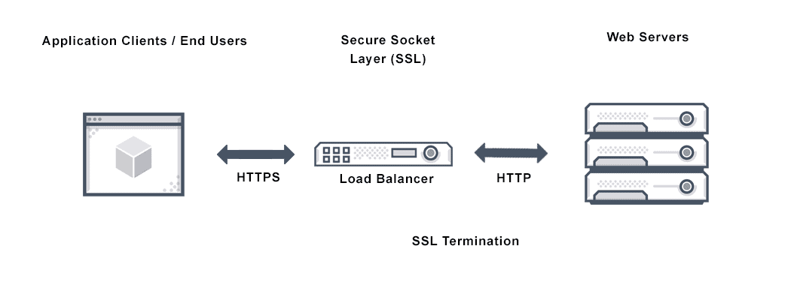

**Abbreviations used in this article:**  

- NSX Advanced Load Balancer = NSX-ALB
- K8s = Kubernetes (8 letters between the K and s in Kubernetes)
- SSL = Secure Sockets Layer
- AKO = Avi Kubernetes Operator (AVI now a VMware product called NSX Advanced Load Balancer)

In one of my previous [posts](https://blog.andreasm.io/2020/10/08/nsx-advanced-loadbalancer-with-antrea-on-native-k8s/) I wrote about how to install and configure AKO (Avi Kubernetes Operator) to use as Service type LoadBalancer.

This post will try to cover the basics of how to use NSX Advanced LoadBalancer by using AKO to handle our Ingress requests (ingress-controller).  
For more information on Ingress in [Kubernetes](https://kubernetes.io/docs/concepts/services-networking/ingress/)

> An API object that manages external access to the services in a cluster, typically HTTP.  
> Ingress may provide load balancing, SSL termination and name-based virtual hosting.

##   Ingress Load Balancer Kubernetes Definition

> Within Kubernetes or K8s, a collection of routing rules that control how Kubernetes cluster services are accessed by external users is called ingress. Managing ingress in Kubernetes can take one of several approaches.
>
> An application can be exposed to external users via a Kubernetes ingress resource; a Kubernetes NodePort service which exposes the application on a port across each node; or using an ingress load balancer for Kubernetes that points to a service in your cluster.
>
> An external load balancer routes external traffic to a Kubernetes service in your cluster and is associated with a specific IP address. Its precise implementation is controlled by which service types the cloud provider supports. Kubernetes deployments on bare metal may require custom [load balancer](https://avinetworks.com/glossary/load-balancer/) implementations.
>
> However, properly supported ingress load balancing for Kubernetes is the simplest, more secure way to route traffic. [link](https://avinetworks.com/glossary/ingress-load-balancer-for-kubernetes/)



## Getting AKO ready

While this post assumes AKO is already in place and working in your k8s clusters I will get straight to the parts that involve Ingress. If not head over [here](https://avinetworks.com/docs/ako/1.7/ako-installation/) to read the official docs how to install Avi Kubernetes Operator (AKO).
To verify that you AKO is ready to handle Ingress request, type in this and notice the output:

```bash
$ kubectl get ingressclasses.networking.k8s.io 
NAME     CONTROLLER              PARAMETERS   AGE
avi-lb   ako.vmware.com/avi-lb   <none>       50d

```


### Default secret for TLS Ingress

As AKO expects all ingresses with TLS termination to have a key and certificate specified, there is a couple of ways this can be done. We can go with a "pr service", meaning a dedicated set of keys and certs pr service or a default/common set of keys and certificates that AKO can use if nothing else is specified. 
To apply the common approach, one common key and certificate for one or more applications we need to add a secret for the AKO. Prepare your router-default.yaml definition file like this (the official docs wants you to put in your cert as is, that does not work so you need to base64 encode both keys and certs and paste in below):

```yaml
apiVersion: v1
kind: Secret
metadata:
  name: router-certs-default
  namespace: avi-system
type: kubernetes.io/tls
data:
  tls.key: "base64 encoded"
  tls.crt: "base64 encoded"
  alt.key: "base64 encoded"
  alt.crt: "base64 encoded"
  
```

To base64 encode your keys and certs this can be done like this:

If you have the keys and certs in a file, from whatever linux terminal type in:

```bash
cat cert.pem | base64 -w 0 
cat key.pem | base64 -w 0
```

Then paste into the above yaml accordingly (tls.key:key, tls.crt:crt)
If you have both ECDSA and RSA certs use the alt.key and alt.crt to apply both.
As soon as everything is pasted, apply the yaml file `kubectl apply -f router-defaults.yaml`

## Apply your ingress service

To create an ingress service you need to define this in yaml. An example below:

```yaml
apiVersion: networking.k8s.io/v1
kind: Ingress
metadata:
  name: "NameOfIngress-Service"
  namespace: "Namespaceofwhereyour-service-resides"
  labels:
    app: "ifyouwant"
  annotations:
    ako.vmware.com/enable-tls: "true" #"Indicates to Avi that you want to use TLS"
spec:
  ingressClassName: avi-lb #"The default class name for AVI"
  rules:
    - host: "FQDN"
      http:
        paths:
        - pathType: Prefix
          path: /
          backend:
            service:
              name: "which-service-to-point-to"
              port:
                number: 80

```


## Hostrules and HTTPrules

As I mentioned earlier, you can also define specific rules pr server such as certificates. Here we can use *Hostrules and HTTPrules* to further adjust granular settings pr service. One Hostrule example below:

```yaml
apiVersion: ako.vmware.com/v1alpha1
kind: HostRule
metadata:
  name: name-of-your-rule
  namespace: namespace-of-your-service
spec:
  virtualhost:
    fqdn: must-match-hostname-above # mandatory
    fqdnType: Exact
    enableVirtualHost: true
    tls: # optional
      sslKeyCertificate:
        name: "name-of-certificate" # This must be already defined in your AVI controller
        type: ref
        alternateCertificate:
          name: "name-of-alternate-cert" # This must be already defined in your AVI controller
          type: ref
      sslProfile: System-Standard-PFS
      termination: edge

```


To get all features available head over to the official docs site [here](https://avinetworks.com/docs/ako/1.7/custom-resource-definitions/)  

Hostrule example from the official docs:

```yaml
apiVersion: ako.vmware.com/v1alpha1
kind: HostRule
metadata:
  name: my-host-rule
  namespace: red
spec:
  virtualhost:
    fqdn: foo.region1.com # mandatory
    fqdnType: Exact
    enableVirtualHost: true
    tls: # optional
      sslKeyCertificate:
        name: avi-ssl-key-cert
        type: ref
        alternateCertificate:
          name: avi-ssl-key-cert2
          type: ref
      sslProfile: avi-ssl-profile
      termination: edge
    gslb:
      fqdn: foo.com
      includeAliases: false
    httpPolicy: 
      policySets:
      - avi-secure-policy-ref
      overwrite: false
    datascripts:
    - avi-datascript-redirect-app1
    wafPolicy: avi-waf-policy
    applicationProfile: avi-app-ref
    analyticsProfile: avi-analytics-ref
    errorPageProfile: avi-errorpage-ref
    analyticsPolicy: # optional
      fullClientLogs:
        enabled: true
        throttle: HIGH
      logAllHeaders: true
    tcpSettings:
      listeners:
      - port: 8081
      - port: 6443
        enableSSL: true
      loadBalancerIP: 10.10.10.1
    aliases: # optional
    -  bar.com
    -  baz.com
```


Httprule example from the official docs:

```
apiVersion: ako.vmware.com/v1alpha1
kind: HTTPRule
metadata:
   name: my-http-rule
   namespace: purple-l7
spec:
  fqdn: foo.avi.internal
  paths:
  - target: /foo
    healthMonitors:
    - my-health-monitor-1
    - my-health-monitor-2
    loadBalancerPolicy:
      algorithm: LB_ALGORITHM_CONSISTENT_HASH
      hash: LB_ALGORITHM_CONSISTENT_HASH_SOURCE_IP_ADDRESS
    tls: ## This is a re-encrypt to pool
      type: reencrypt # Mandatory [re-encrypt]
      sslProfile: avi-ssl-profile
      destinationCA:  |-
        -----BEGIN CERTIFICATE-----
        [...]
        -----END CERTIFICATE-----
```

