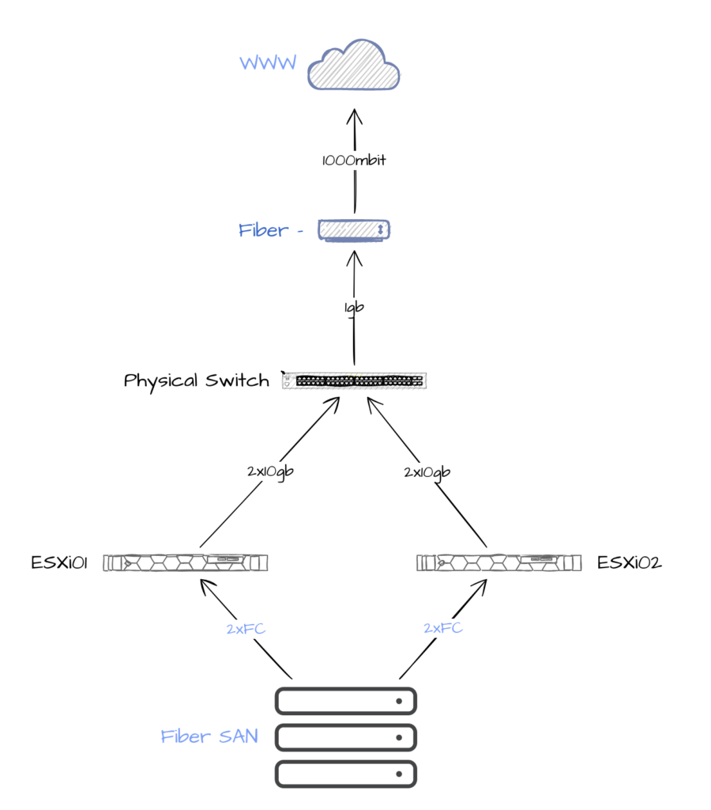
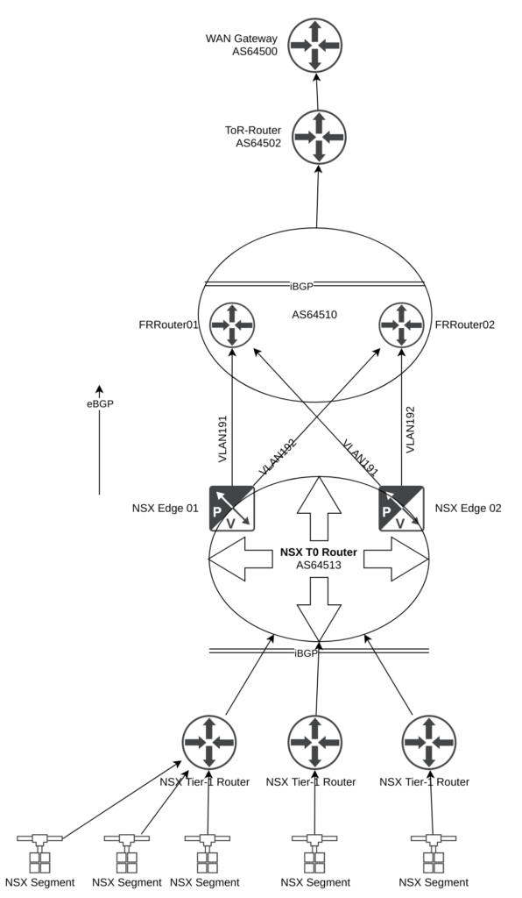

This page will explain my lab environment, which is used in all the examples, tutorials in this blog.

## Lab overview/connectivity - physical, logical and hybrid

It is nice to have an overview of how the underlying hardware looks like and when reading my different articles. So I decided to create some diagrams to illustrate this. Which hopefully will help understanding my blog posts further. First out is the physical components (which is relevant for the posts in this blog).

### Physical hardware

My lab consist of two ESXi hosts, one ToR switch (enterprise dc switch with many capabilities) and a fibrechannel SAN (storage).

### Logical overview

To make possible all the things I want to do in my lab I am running most of the networking and other features virtually on top of my physical hardware. This includes NSX-T, virtual routers (VM based) in additition to the router functionality in NSX-T and VM based "perimeter" firewall which is based on PfSense. Below is an logical overview of the network topology in my lab.  

