VMware NSX 3.2 is out and packed with new features. One of them is the NSX Application Platform which runs on Kubernetes to provide the NSX ATP (Advanced Threat Protection) functionality such as NSX Intelligence (covered in a previous post), NSX Network Detection and Response (NDR) and NSX Malware. This post will go through how to spin up a K8s cluster for this specific scenario covering the pre-reqs from start to finish. After that the features itself will be covered in separate posts. Through this post NSX Application Platform will be abbreviated into NAPP.

## Getting started

To get started with NAPP its important that one has read the prerequisites needed to be in place on the K8s cluster that is hosting NAPP. In short NAPP is currently validated to run on upstream K8s version 1.7 all the way up to version 1.21, VMware Tanzu (TKC) versions 1.17.17 to 1.21.2. In addtion to a K8s cluster itself NAPP also needs a Registry supporting images/helm charts. In this walkthrough Harbor will be used. I will also go with an upstream K8s cluster version 1.21.8 running on Ubuntu nodes.  
Sources being used to cover this post is mainly from VMware's official documentation. So I list them here as an easy way to reference as they are providing the necessary and important information on how, requirements and all the steps detailed to get NAPP up and running. The purpose of this post is to just go through the steps as a more step by step guide. If more information is needed, head over to our official documentation. Below are the links for the software/tools I have used in this post:  
[Deploying and Managing the VMware NSX Application Platform](https://docs.vmware.com/en/VMware-NSX-T-Data-Center/3.2/nsx-application-platform/GUID-658D30E1-64B3-40B8-8FD4-ED2AE2A6FF7A.html)  
[Harbor registry](https://goharbor.io/docs/2.4.0/install-config/)  
[VMware vSphere Container Storage Plugin](https://docs.vmware.com/en/VMware-vSphere-Container-Storage-Plug-in/index.html)  
[MetalLB](https://metallb.universe.tf/)   
[LetsEncrypt](https://letsencrypt.org/)

## Prerequisites/Context

First some context. In this post all K8s nodes are running as virtual machines on VMware vSphere. NSX-T is responsible for the underlaying network connectivity for the nodes and the persistent storage volumes in my K8s cluster is VMFS exposed through the vSphere Container Storage Plugin (CSI). The NSX manager cluster consists of 3 NSX managers and a cluster VIP address.  
The vSphere environment consists of two ESXi hosts with shared storage from a FC SAN and vCenter managing the ESXi hosts.  

A quick summary of what is needed, tools/software and what I have used in my setup:  

- A upstream kubernetes cluster running any of the supported versions stated in the official documentation. I am using 1.21.8
- A working CNI, I am using Antrea.
- A registry supporting images/helm charts using a signed trusted certificate (no support for self-signed certificates). I am using Harbor and LetsEncrypt certificates.
- A load balancer to expose the NAPP endpoint with a static ip. I am using MetalLB
- Persistent storage in K8s I am using the vSphere Container Storage Plugin (if you are running the nodes on vSphere).
- NSX 3.2 of course
- Required resources for the NAPP form factor you want to go with. The required resources for the K8s cluster supporting NAPP is outlined below (from the official docs page):  
  

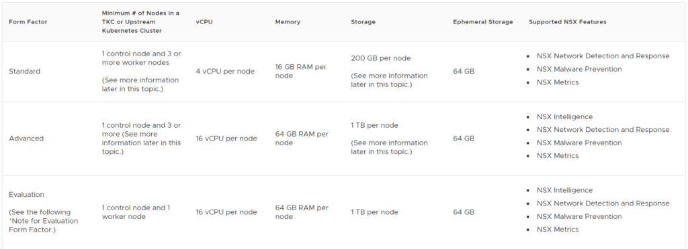

This post will cover the Advanced form factor where I went with the following node configuration:  
1 master worker/control plane node with 4 vCPUs, 8GB RAM and 200GB local disk (ephemeral storage). For the worker nodes: 3 worker nodes with 16vCPUs, 64GB RAM and 200GB (ephemeral storage) for the persistent storage (the 1TB disk requirement) I went with vSphere CSI to expose a VMFS datastore from vSphere for the persistent volume requirement.  

The next chapters will go trough the installation of Harbor (registry) and the configuration done there, then the K8s configuration specifically the CSI and MetalLB part as I am following the generic K8s installation covered earlier here: [Deploy Kubernetes on Ubuntu 20.04](https://yike.guzware.net/2020/10/08/ako-with-antrea-on-native-k8s-cluster/#Deploy_Kubernetes_on_Ubuntu_2004) .  
Lets get to it.

### Harbor (registry requirement)

Harbor can be run as a pod in Kubernetes or a pod in Docker. I went with the Docker approach and spun up a VM for this sole purpose.  
The VM is Ubuntu 20.4 with 4vCPU, 8GB RAM and 200GB disk.  
After Ubuntu is installed I installed the necessary dependencies to deploy Harbor in Docker by following the Harbor docs here: [Harbor Getting Started](https://goharbor.io/docs/2.4.0/install-config/)  

_I find it better to just link the steps below instead of copy/paste too much as the steps are very well documented and could also change over time._

- Docker Engine (latest Stable): [docker.com/ubuntu](https://docs.docker.com/engine/install/ubuntu/)
- Docker Compose (latest Stable): [docker.com/linux](https://docs.docker.com/compose/install/#install-compose-on-linux-systems)
- Prepare the signed cert (if its not already done) NB! The certificate needs to contain the full chain otherwise the Docker client will not accept it.
- Download the Harbor installer: [Harbor installer](https://github.com/goharbor/harbor/releases) (I went with 2.4.1)
- Extract the online installer: `tar -zxvf harbor-online-installer-v2.4.1.tgz`
- Edit the harbor.yaml: Go to the folder harbor (result of the extract above) cp the harbor.yml.tmpl to harbor.yml and use your favourite editor and change the following (snippet from the harbor.yml file):  
  

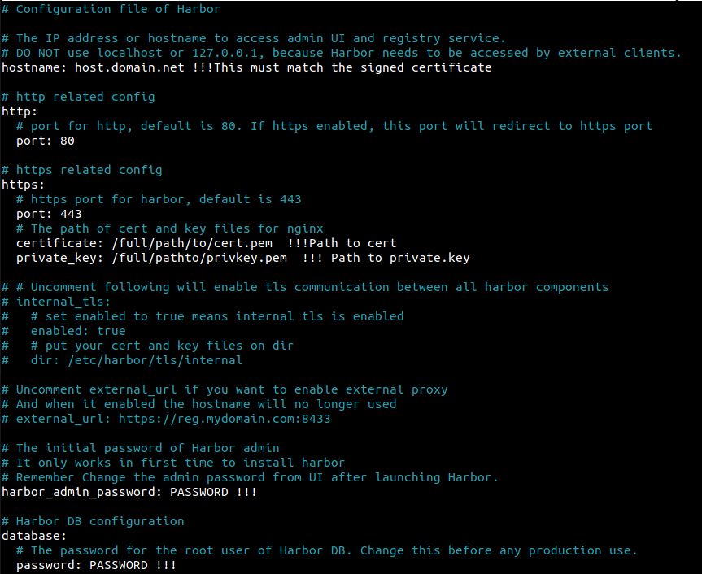

- Run the installer: `sudo ./install.sh --with-chartmuseum` The --with-chartmuseum flag is important (The installer is in the same folder as above and if it is not executable make it executable with `chmod +x install.sh`
- check/validate whether you are able to log in to your Harbor registry with the following command: `sudo docker login FQDNofHarbor --username admin --password` (password defined in harbor.yml). It should not complain about the certificate if the certificate is valid.
- Log in to the Harbor UI by opening a browser and enter your FQDN of your harbor with the use of admin/password. Create a project:  
  

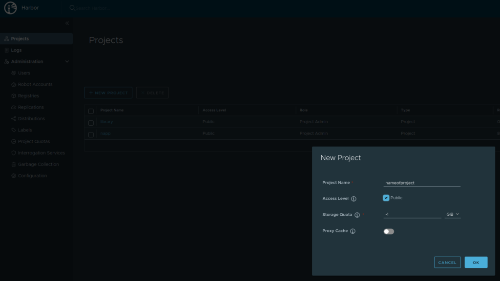

I made a public project

- Download the NAPP images from your my.vmware.com page: VMware-NSX-Application-Platform-3.2.0.0.0.19067744.tgz upload it to your Harbor VM or to another endpoint where you have a Docker client. "Untar" the tgz file
- Find and edit the `upload_artifacts_to_private_harbor.sh` by changing the following:  
  

`DOCKER_REPO=harborFQDN/napp (after the / is the project name you created)   DOCKER_USERNAME=admin   DOCKER_PASSWORD=Password-Defined-In-Harbor.yml`

- Save and run it `sudo ./upload_artifacts_to_private_harbor.sh` (same here make it executable with chmod +x if its not executable. This takes a long time, so sit back and enjoy or go do something useful like taking a 3km run in about 15 minutes.
- The end result shoul look something like this in the Harbor GUI:  
  

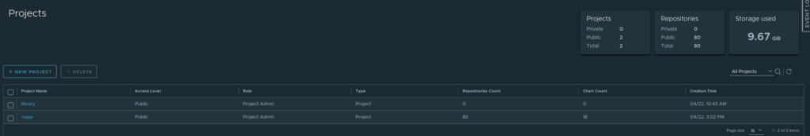

Thats it for Harbor, next up the K8s cluster

### The K8s cluster where NAPP is deployed

As stated in the official documentation for NAPP, K8s needs to be a specific version, it can be upstream K8s, VMware Tanzu (TKC) or other K8s managed platforms such as OpenShift. But the currently validated platforms are at the moment the above two mentioned platforms: upstream K8s and TKC.  
As I wrote initially I will go with upstream K8s for this. To get this going I prepared 4 VMs where I dedicate one master worker/control-plane node with the above given specifications and 3 worker nodes with the above given specifications. I follow my previous guide for preparing the Ubuntu os and installing K8s here: [K8s on Ubuntu](http://blog.andreasm.io/2020/10/08/ako-with-antrea-on-native-k8s-cluster/#Prepare_the_Worker_and_Master_nodes) so I will not cover this here but just continue from this with the specifics I did to get the CSI driver up, Antrea CNI and MetalLB. First out is the Antrea CNI.

- Assuming the K8s cluster is partially up, due to no CNI is installed. I download the downstream version of Antrea (one can also use the upstream version from the Antrea github repository) from my.vmware.com. One of the reason I want to use the downstream version from my.vmware.com version is that I want to integrate it to my NSX management plane (more on that in an separate post covering NSX-T with Antrea integration).
- Download the VMware Container Networking with Antrea (Advanced) from your my.vmware.page to your master worker. Unzip the zip file.
- Copy the antrea-advanced-debian-v1.2.3\_vmware.3.tar.gz to all your worker nodes (with scp for example). Found under the folder antrea-advanced-1.2.3+vmware.3.19009828/images (result of the extract previously).
- Load the antrea-advanced-debian-v1.2.3\_vmware.3.tar.gz image on all nodes, including the master worker, with the command `sudo docker load -i antrea-advanced-debian-v1.2.3_vmware.3.tar.gz`
- Apply the antrea-advanced-v1.2.3+vmware.3.yml found under the folder antrea-advanced-1.2.3+vmware.3.19009828/manifests from your master worker. A second or two later you should have a fully working Antrea CNI in your K8s cluster. Notice that your CoreDNS pods decided to go into a running state. Thats it for the Antrea CNI. Next up is MetalLB
- When the CNI is up, its time for MetalLB. Installation of MetalLB is easy and well explained here: [Install MetalLB](http://metallb.universe.tf/installation/). Next is the CSI for persistent volume.
- For step by step config of vSphere Container Storage Plugin head over the the following [link](https://docs.vmware.com/en/VMware-vSphere-Container-Storage-Plug-in/index.html) (Getting Started with VMware vSphere Container Storage Plug-in section) and follow the instructions there which are very well described. That is, if you are running the VMs on vSphere and want to utilize VMFS as the underlying storage for your persistent volumes. Works great and is fairly easy to deploy. _I might come back later and write up a short summary on this one._
- When you are done with the step above and have your Storage Class defined its over to NSX for deployment of NAPP - Yes!

## Deploy NAPP - NSX Application Platform

Its finally time to head over to the NSX manager and start deployment of NAPP  
To get this show started, I again must refer to the prerequisites page for NAPP. I will paste below and make some comments:

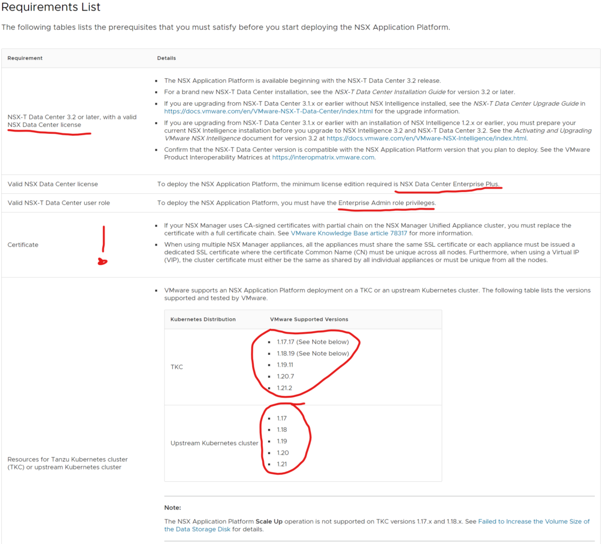

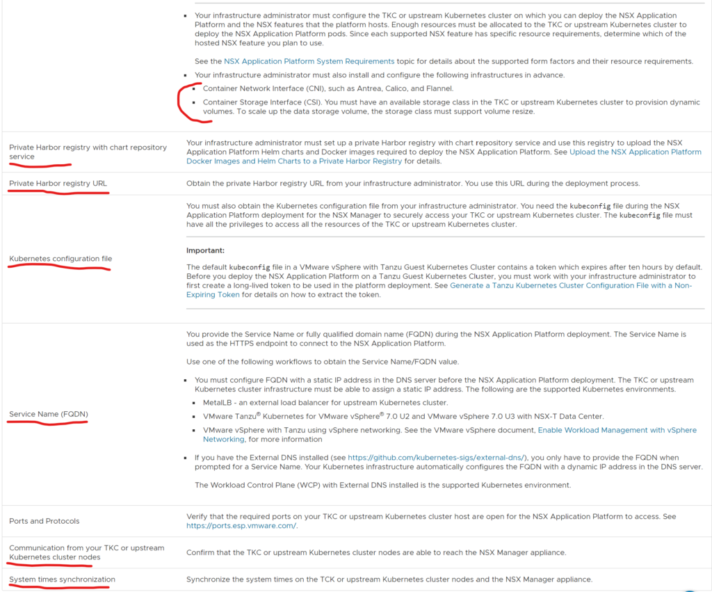

- First requirement: NSX version 3.2 (First release with NAPP). Pr now 3.2 is the one and only NSX-T release that supports NAPP.
- License ----------
- Certificate: The first statement with CA-signed certificates is ok to follow. But the second one could be something that needs to be checked. This is valid if you are using NSX-T Self-Signed certificates. Image that you started out with one NSX manager, enabled the VIP cluster address, then it may well be that this cluster IP gets the certificate of your first NSX manager. So its important to verify that all three NSX managers are using their own unique certificate and the VIP uses its own unique certificate. If not, one must update the certificates accordingly. In my environment I had unique certificates on all NSX manager nodes, but my VIP was using NSX manager 1's certificate. So I had to update the certificate on the VIP. I generated a new certificate from the NSX manager here:  
  

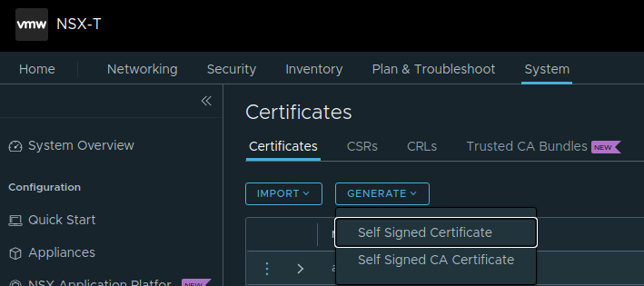

- And followed the instructions here to replace the VIP certificate: [Replace Certificates](https://docs.vmware.com/en/VMware-NSX-T-Data-Center/3.2/administration/GUID-50C36862-A29D-48FA-8CE7-697E64E10E37.html)
- The currently validated platforms NAPP is supported to run on, been through that earlier.
- Harbor is covered previously with a dedicated section. Harbor is not a strict requirement though. One can BYO registry if it supports image/helm charts
- When using upstream K8s, the config does not have a default token expiry. If using TKC one must generate a long-lived token so NAPP wont log out from the K8s cluster. Described in the docs
- Service Name FQDN is a dns record that is mapped to the IP the the endpoint service gets when deployed. Thats were I use MetalLB for this purpose. Just to initiate a type LoadBalancer.
- If there is a firewall between your NSX manager and the NAPP K8s cluster, one must do firewall openings accordingly.
- Time sync is important here also. The K8s cluster must be synced to the NSX Manager.  
  

### Going through the deployment of NAPP from the NSX manager GUI

Log in to the NSX manager GUI. Head over to System and find the new section on the left side called: NSX Application Platform  

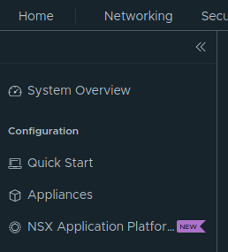

From there the first thing thats needed to populate is the urls to your Harbor registry (or other BYO registry). The urls goes like this:

- Helm Repository: _https://harbor.guzware.net/chartrepo/napp_ -> FQDN for the Harbor instance, then chartrepo and then the name of the projecy you created in Harbor
- Docker Registry: _harbor.guzware.net/napp/clustering_ without HTTPS, almost the same url just swap places on napp (project in Harbor) and clustering
- Click save url and it should validate ok and present you with this and the option to continue in the bottom right corner:  
  

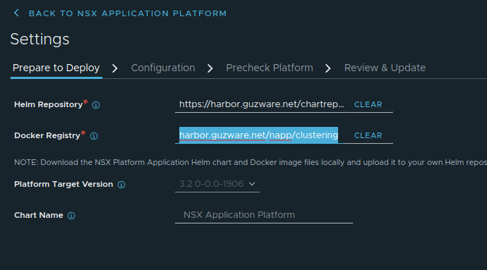

Next is the Form factor and kubeconfig:  

- The first thing is to upload your K8s kubeconfig file. Select upload and it will validate. Should you get a warning the the K8s version is newer than the kubectl client onboard the NSX manager upload a newer client from my.vmware.com  
  

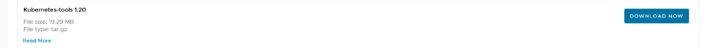

- The Cluster Type is only Standard for now.
- Storage Class is what you defined in K8s with the CSI (Persistent Volumes)
- Service Name (FQDN) registered in DNS
- Form Factor - Here you will have three choices: Standard, Advanced and Evaluation:  
  

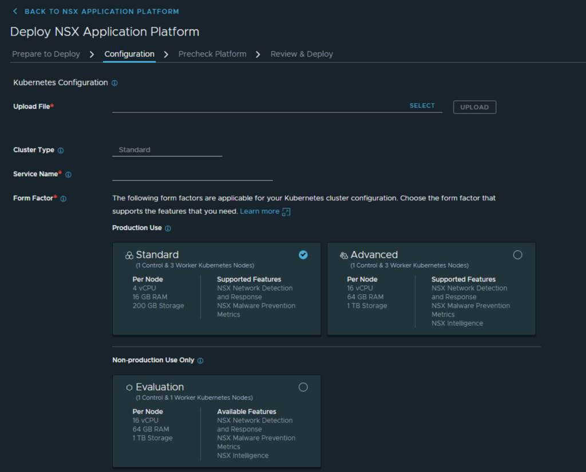

- I have gone with the Advanced form factor. The result should look like this:  
  

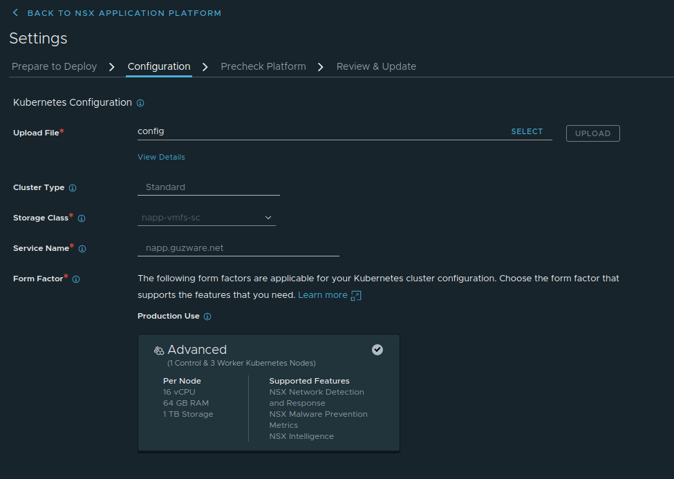

Now you should be able to click next to do the Precheck Platform for validation:

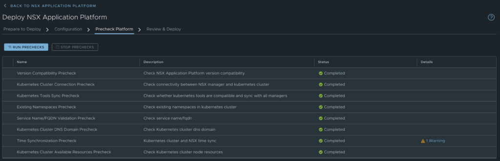

Finally Review & Update  

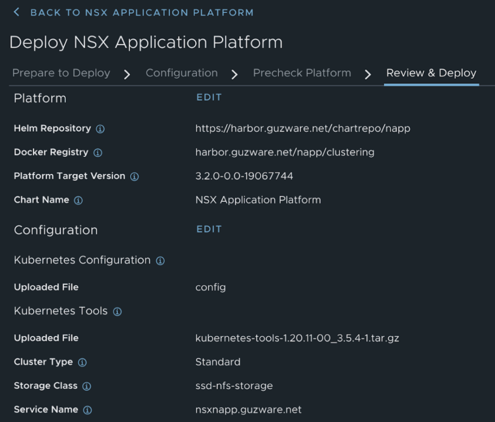

Installation starts  

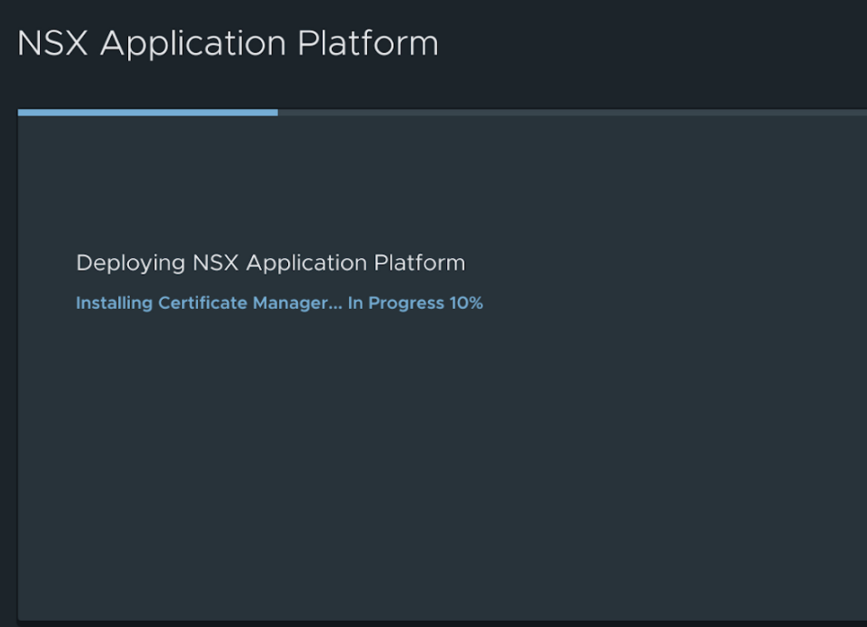

And after some eager waiting the end result should look like this:  

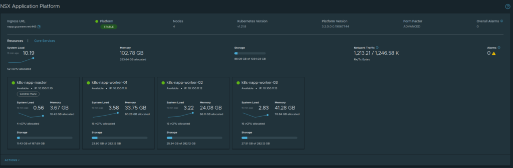

A brief summary from the K8s cluster:  

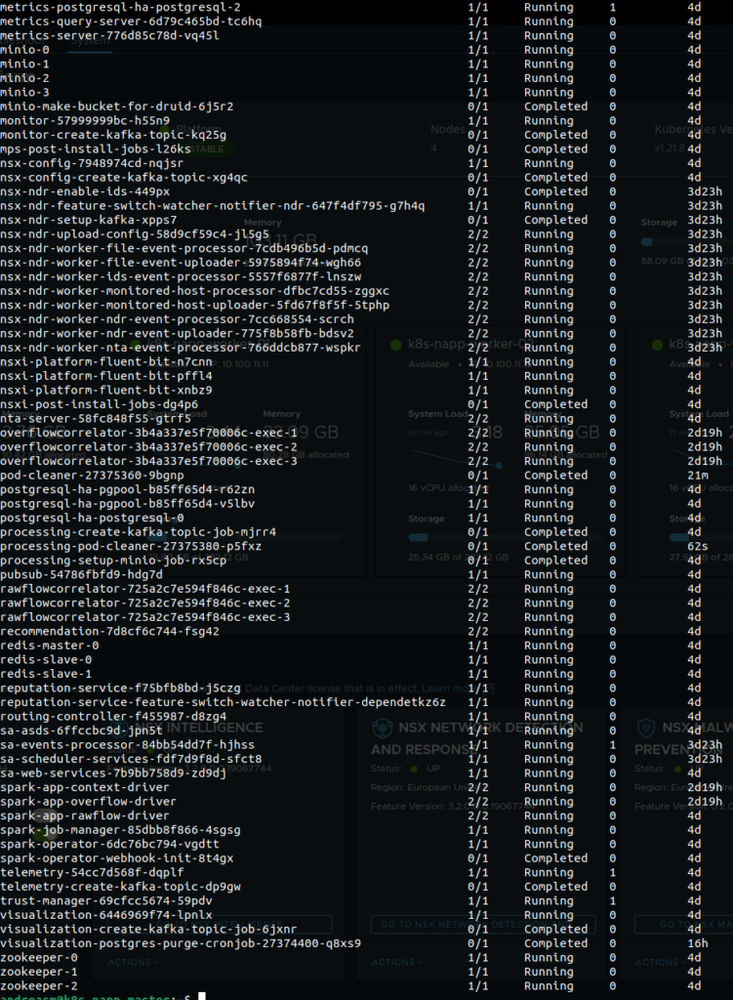

A bunch of pods - nice!

Thats it - next time I will continue with the features NAPP brings to the table: NSX Intelligence, Network Detection and Response and NSX Malware Prevention
