This week I was fortunate to get hold of a VMC on AWS environment and wanted to test out the possibility of managing my K8s security policies from my on-prem NSX manager by utilizing the integration of Antrea in NSX. I haven't covered that specific integration part in a blog yet, but in short: by using Antrea as your CNI and you are running NSX-T 3.2 you can manage all your K8s policies from the NSX manager GUI. Thats a big thing. Manage your k8s policies from the same place where you manage all your other critical security policies. Your K8s clusters does not have to be in the same datacenter as your NSX manager. You can utilize VMC on AWS as your scale-out, prod/test/dev platform and still manage your K8s security policies centrally from the same NSX manager.  
In this post I will go through how this is done and how it works.

## VMC on AWS

VMC on AWS comes with NSX, but it is not yet on the version that has the NSX-T integration. So what I wanted to do was to use the VMC NSX manager to cover all the vm-level microsegmentation and let my on-prem NSX manager handle the Antrea security policies. To illustrate want I want to achieve:  

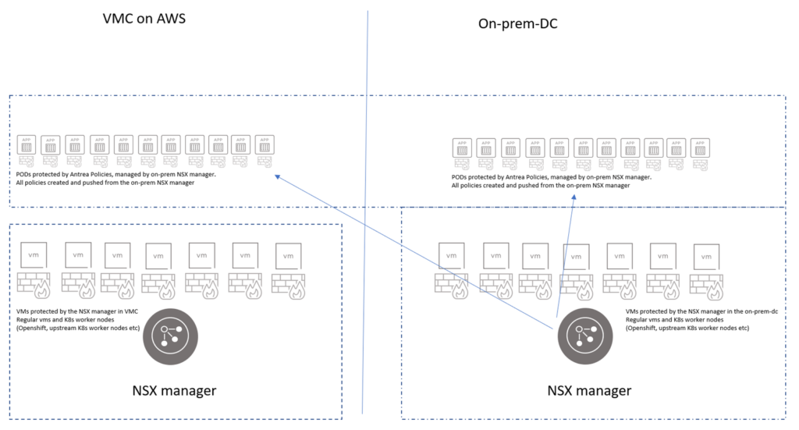

### VMC on AWS to on-prem connectivity

VMC on AWS supports a variety of connectivity options to your on-prem environment. I have gone with IPSec VPN. Where I configure IPsec on the VMC NSX manager to negotiate with my on-prem firewall to terminate the VPN connection. In VMC I have two networks: Management and Workload. I configured both subnets in my IPsec config as I wanted the flexibility to reach both subnets from my on-prem environment. To get the integration working I had to make sure that the subnet on my on-prem NSX manager resided on also was configured. So the IPsec configurations were done accordingly to support that: Two subnets from VMC and one from on-prem (where my NSX managers resides).  

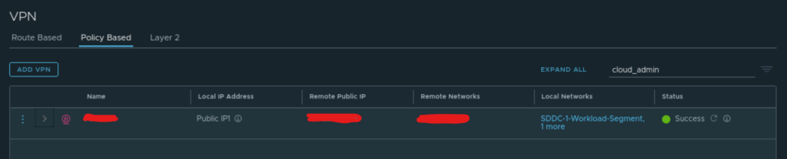

IPsec config from my VMC NSX manager

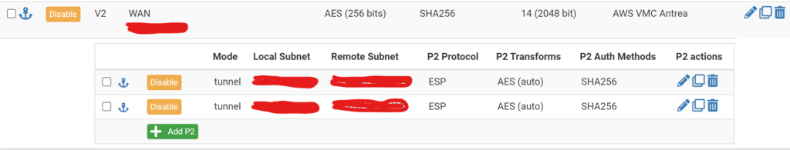

IPsec config from my on-prem firewall

When IPsec tunnel was up I logged on to the VMC NSX manager and configured the "North/South" security policies allowing my Workload segment to any. I created a NSX Security Group ("VMs") with membership criteria in place to grab my Workload Segment VMs (workload). This was just to make it convenient for myself during the test. We can of course (and should) be more granular in making these policies. But we also have the NSX Distributed Firewall which I will come to later.  

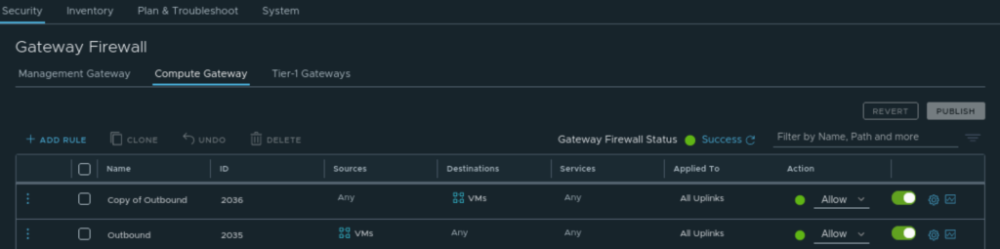

North/South policies

Now I had the necessary connectivity and security policies in place for me to log on to the VMC vCenter from my on-prem management jumpbox and deploy my k8s worker nodes.

### VMC on AWS K8s worker nodes

In VMC vCenter I deployed three Ubuntu worker nodes, and configured them to be one master worker and two worker nodes by following my previous blog post covering these steps:  
[http://yikes.guzware.net/2020/10/08/ako-with-antrea-on-native-k8s-cluster/#Deploy\_Kubernetes\_on\_Ubuntu\_2004](http://yikes.guzware.net/2020/10/08/ako-with-antrea-on-native-k8s-cluster/#Deploy_Kubernetes_on_Ubuntu_2004)  

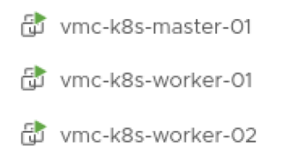

Three freshly deployed VMs in VMC to form my k8s cluster

```
NAME                STATUS   ROLES                  AGE     VERSION
vmc-k8s-master-01   Ready    control-plane,master   2d22h   v1.21.8
vmc-k8s-worker-01   Ready    <none>                 2d22h   v1.21.8
vmc-k8s-worker-02   Ready    <none>                 2d22h   v1.21.8
```

After the cluster was up I needed to install Antrea as my CNI.  
Download the Antrea release from here: [https://customerconnect.vmware.com/downloads/info/slug/networking\_security/vmware\_antrea/1\_0](https://customerconnect.vmware.com/downloads/info/slug/networking_security/vmware_antrea/1_0)  
After it has been downloaded, unpack it and upload the image to your k8s master and worker nodes by issuing the `docker load -i antrea-advanced-debian-v1.2.3_vmware.3.tar.gz`  
Then apply it by using the manifest `antrea-advanced-v1.2.3+vmware.3.yml` found under the `/antrea-advanced-1.2.3+vmware.3.19009828/manifests` folder. Like this: `kubectl apply -f antrea-advanced-v1.2.3+vmware.3.yml` and Antrea should spin right up and you have a fully working K8s cluster:  

```
NAME                                        READY   STATUS    RESTARTS   AGE
antrea-agent-2pdcr                          2/2     Running   0          2d22h
antrea-agent-6glpz                          2/2     Running   0          2d22h
antrea-agent-8zzc4                          2/2     Running   0          2d22h
antrea-controller-7bdcb9d657-ntwxm          1/1     Running   0          2d20h
coredns-558bd4d5db-2j7jf                    1/1     Running   0          2d22h
coredns-558bd4d5db-kd2db                    1/1     Running   0          2d22h
etcd-vmc-k8s-master-01                      1/1     Running   0          2d22h
kube-apiserver-vmc-k8s-master-01            1/1     Running   0          2d22h
kube-controller-manager-vmc-k8s-master-01   1/1     Running   0          2d22h
kube-proxy-rvzs6                            1/1     Running   0          2d22h
kube-proxy-tnkxv                            1/1     Running   0          2d22h
kube-proxy-xv77f                            1/1     Running   0          2d22h
kube-scheduler-vmc-k8s-master-01            1/1     Running   0          2d22h
```

### Antrea NSX integration

Next up is to configure the Antrea NSX integration. This is done by following this guide:  
[https://docs.vmware.com/en/VMware-NSX-T-Data-Center/3.2/administration/GUID-DFD8033B-22E2-4D7A-BD58-F68814ECDEB1.html](https://docs.vmware.com/en/VMware-NSX-T-Data-Center/3.2/administration/GUID-DFD8033B-22E2-4D7A-BD58-F68814ECDEB1.html)  
Its very well described and easy to follow. So instead of me rewriting it here I just point to it. But in general it makes up of a couple of steps needed.  
1\. Download the necessary Antrea Interworking parts, which is included in the Antrea-Advanced zip above  
2\. Create a certificate to use for the Principal ID User in your on-prem NSX manager.  
3\. Import image to your master and workers (`interworking-debian-0.2.0.tar`)  
4\. Edit the bootstrap-config.yaml ([https://docs.vmware.com/en/VMware-NSX-T-Data-Center/3.2/administration/GUID-1AC65601-8B35-442D-8613-D3C49F37D1CC.html](https://docs.vmware.com/en/VMware-NSX-T-Data-Center/3.2/administration/GUID-1AC65601-8B35-442D-8613-D3C49F37D1CC.html))  
5\. Apply the bootstrap-config-yaml and you should end up with this result in your k8s cluster and in your on-prem NSX manager:  

```
vmware-system-antrea   interworking-7889dc5494-clk97               4/4     Running   17         2d22h
```

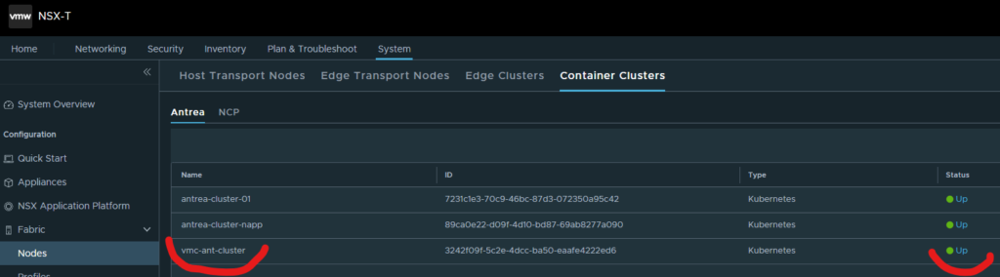

My VMC k8s cluster: vmc-ant-cluster (in addition to my other on-prem k8s-cluster)

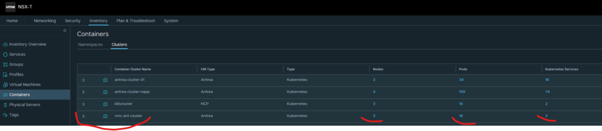

Inventory view from my on-prem NSX manager

One can immediately see useful information in the on-prem NSX manager about the "remote" VMC K8s cluster such as Nodes, Pods and Services in the Inventory view. If I click on the respective numbers I can dive into more useful information. By clicking on "Pods"  

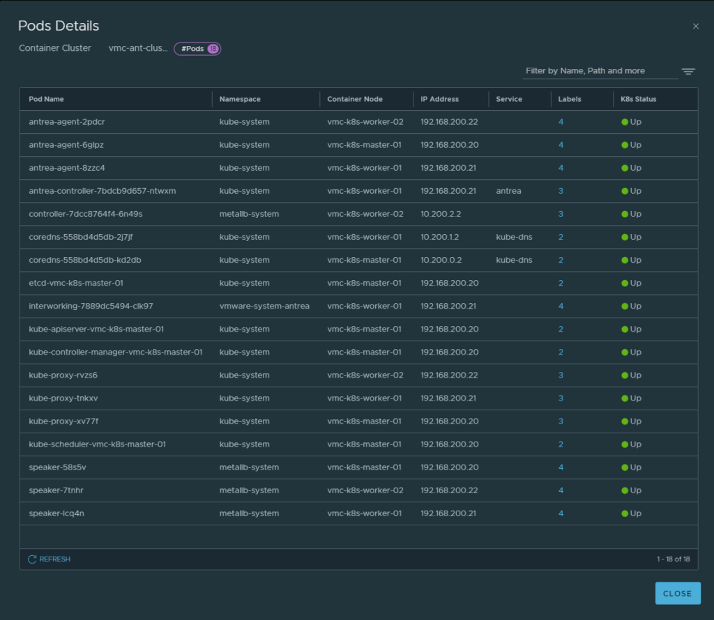

Pod state, ips, nodes they are residing on etc

Even in this view I can click on the labels links to get the lables NSX gets from kubernetes and Antrea:  

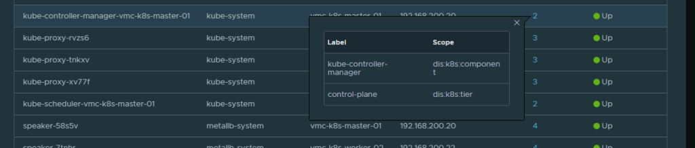

By clicking on Services I get all the services running in my VMC k8s cluster  

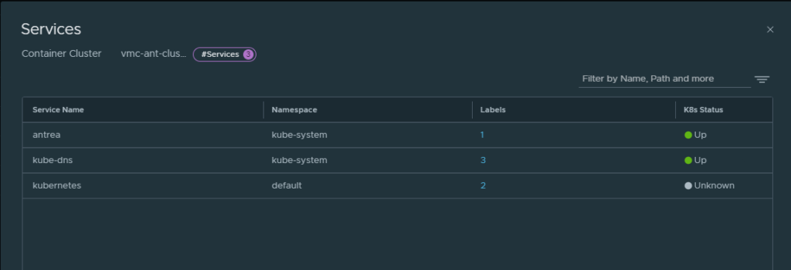

And the service labels:  

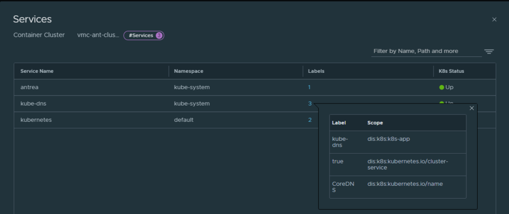

All this information is very useful, as they can be used to create the security groups in NSX and use those groups in security policies.  
Clicking on the Nodes I also get very useful information:  

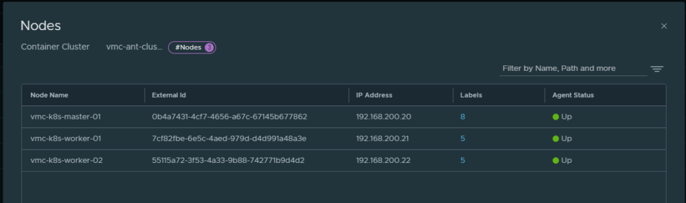

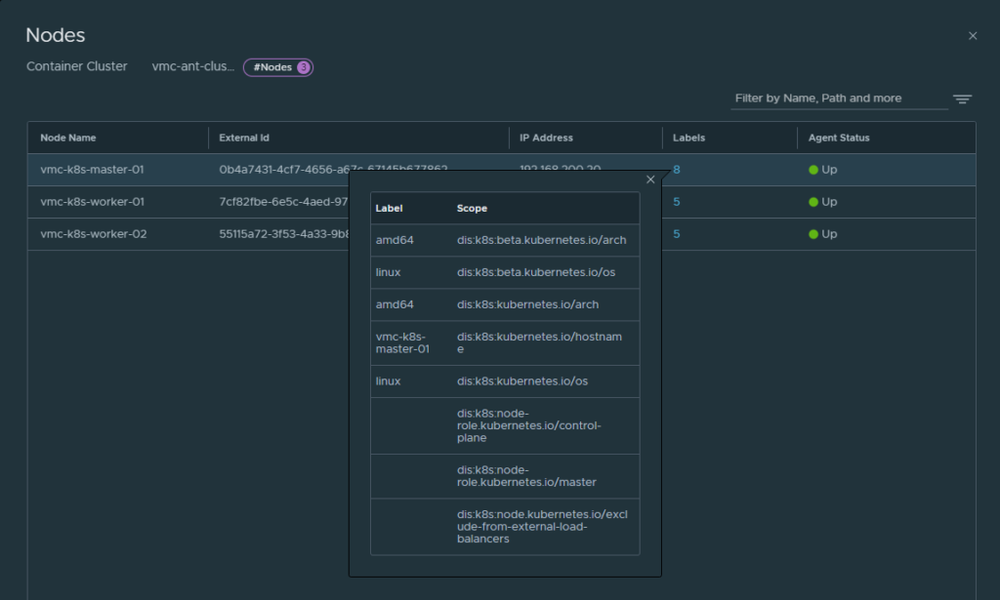

### VMC on AWS NSX distributed firewall

As I mentioned earlier VMC on AWS also comes with NSX and one should utilize this to segment/create security polices on your worker nodes there. I have just created some simple rules allowing the "basic" needs for my workers, and then created some specific rules for what they are allowed to where all unspecified traffic is blocked by a default block rule.  
Bare in mind that this is a demo environment and not representing any production environment as such, but some rules are in place to showcase that I am utilizing the NSX distributed firewall in VMC to microsegment my workload there.  
The "basic" needs rules are the following: Under "Infrastructure" I am allowing my master and worker nodes to "consume" NTP and DNS. In this environment I do not have any local DNS and NTP servers as they are all public. DNS I am using Google's public DNS servers 8.8.8.8 and 8.8.4.4 and NTP the workers are using "time.ubuntu.com". I have created a security group consisting of the known DNS servers ip, as I know what they are. But the NTP server's IP I do not know so I have created a security group with members only consisting of RFC1918 subnets and created a negated policy indicating that they are only allowed to reach NTP servers if they not reside on any RFC1918 subnet.  

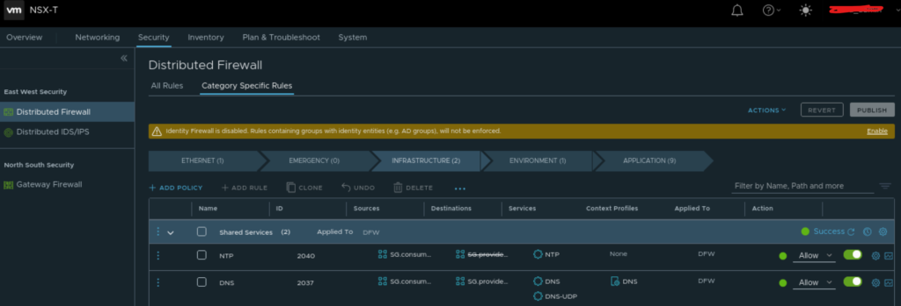

NTP and DNS allow rules under Infrastructure

Under "Environment" I have created a Jump to Application policy that matches my K8s master/worker nodes  

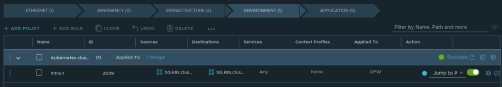

Jump to Application

Under "Application" I have a rule that is allowing internet access (could be done on the North/South Gateway Firewall section also) by indication that HTTP/HTTPS is allowed as long as it is not any RFC1918 subnet.  

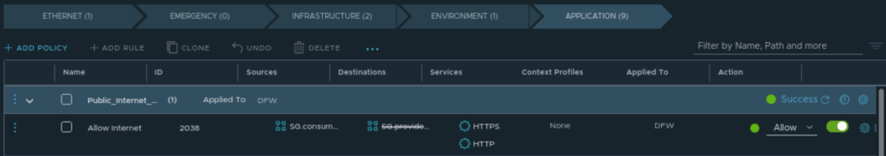

Allow "internet access"


Further under Application I am specifying a bit more granular rules for what the k8s cluster is allowed in/out. Again, this is just some simple rules restricting the k8s cluster to not allow any-any by utilizing the NSX DFW already in VMC on AWS. One can and should be more granular, but its to give you an idea.  
In the K8s-Backbone security policy section below I am allowing HTTP in to the k8s cluster as I am planning to run an k8s application there that uses HTTP where I allow a specific IP subnet/range as source and my loadbalancer IP range as the destination.  
Then I allow SSH to the master/workers for management purposes. Then I am creating some specific rules allowing the necessary ports needed for the Antrea control-plane to communicate with my on-prem NSX manager, which are: TCP 443, 1234 and 1235. Then I create an "Intra" rule allowing the master/workers to talk freely between each other. This should and can also be much more tightened down. When those rules are done processed they will hit a default block rule.  

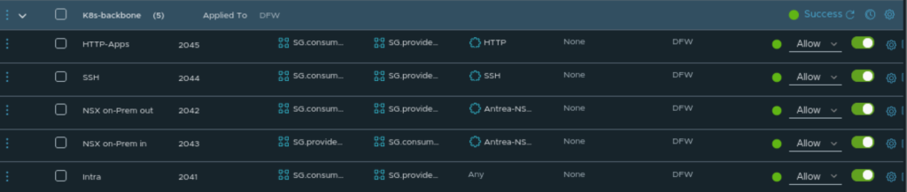

VMC k8s cluster policy

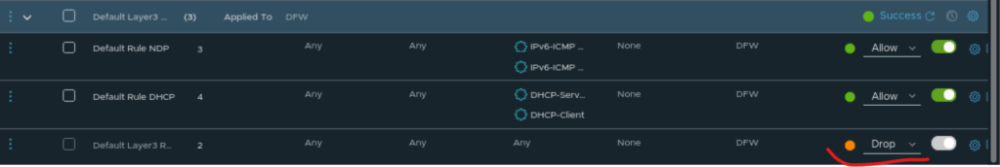

Default drop

## Antrea policies from on-prem NSX manager

Now when the "backbone" is ready configured and deployed its time to spin up some applications in my "VMC K8s cluster" and apply some Antrea security policies. Its now time for the magic to begin ;-)  
In my on-prem environment I already have a couple of Antrea enabled K8s clusters running. On them a couple of demo applications are already running and protected by Antrea security policies created from my on-prem NSX manager. I like to use an application called Yelb (which I have used in previous blog posts here). This application consist of 4 pods. All pods doing their separate thing for the application to work. I have a frontend pod which is hosting the web-page for the application, I have an application pod, db pod and a cache pod. The necessary connectivity between looks like this:  

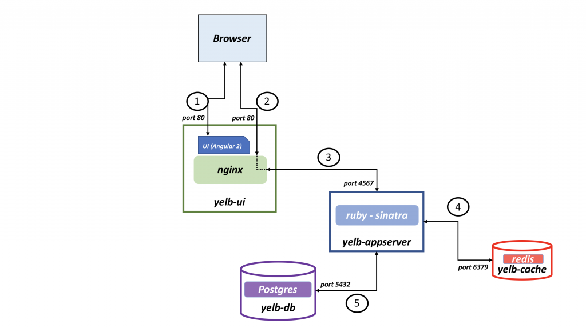

Yelb pods connectivity

To make security policy creation easy I make use of all the information I get from Antrea and Kubernetes in form of "Labels". These labels are translated into tags in NSX. Which makes it very easy to use, and for "non" developers to use as "human-readable" elements instead of IP adresses, pods unique names etc. In this example I want to microsegment the pods that makes up the application "Yelb".  

### Creating NSX Security Groups for Antrea Security Policy

Before I create the actual Antrea Security Policies I will create a couple of security groups based on the tags I use in K8s for the application Yelb. The Yelb manifest looks like this:  

```
apiVersion: v1
kind: Service
metadata:
  name: redis-server
  labels:
    app: redis-server
    tier: cache
  namespace: yelb
spec:
  type: ClusterIP
  ports:
  - port: 6379
  selector:
    app: redis-server
    tier: cache
---
apiVersion: v1
kind: Service
metadata:
  name: yelb-db
  labels:
    app: yelb-db
    tier: backenddb
  namespace: yelb
spec:
  type: ClusterIP
  ports:
  - port: 5432
  selector:
    app: yelb-db
    tier: backenddb
---
apiVersion: v1
kind: Service
metadata:
  name: yelb-appserver
  labels:
    app: yelb-appserver
    tier: middletier
  namespace: yelb
spec:
  type: ClusterIP
  ports:
  - port: 4567
  selector:
    app: yelb-appserver
    tier: middletier
---
apiVersion: v1
kind: Service
metadata:
  name: yelb-ui
  labels:
    app: yelb-ui
    tier: frontend
  namespace: yelb
spec:
  type: LoadBalancer
  ports:
  - port: 80
    protocol: TCP
    targetPort: 80
  selector:
    app: yelb-ui
    tier: frontend
---
apiVersion: v1
kind: ReplicationController
metadata:
  name: yelb-ui
  namespace: yelb
spec:
  replicas: 1
  template:
    metadata:
      labels:
        app: yelb-ui
        tier: frontend
    spec:
      containers:
      - name: yelb-ui
        image: mreferre/yelb-ui:0.3
        ports:
        - containerPort: 80
---
apiVersion: apps/v1
kind: Deployment
metadata:
  name: redis-server
  namespace: yelb
spec:
  selector:
    matchLabels:
      app: redis-server
  replicas: 1
  template:
    metadata:
      labels:
        app: redis-server
        tier: cache
    spec:
      containers:
      - name: redis-server
        image: redis:4.0.2
        ports:
        - containerPort: 6379
---
apiVersion: apps/v1
kind: Deployment
metadata:
  name: yelb-db
  namespace: yelb
spec:
  selector:
    matchLabels:
      app: yelb-db
  replicas: 1
  template:
    metadata:
      labels:
        app: yelb-db
        tier: backenddb
    spec:
      containers:
      - name: yelb-db
        image: mreferre/yelb-db:0.3
        ports:
        - containerPort: 5432
---
apiVersion: apps/v1
kind: Deployment
metadata:
  name: yelb-appserver
  namespace: yelb
spec:
  selector:
    matchLabels:
      app: yelb-appserver
  replicas: 1
  template:
    metadata:
      labels:
        app: yelb-appserver
        tier: middletier
    spec:
      containers:
      - name: yelb-appserver
        image: mreferre/yelb-appserver:0.3
        ports:
        - containerPort: 4567
```

As we can see there is a couple of labels that distinguish the different components in the application which I can map to the application topology above. I only want to allow the frontend to talk to the "app-server", and the app-server to the "db-server" and "cache-server". And only on the needed ports. All else should be dropped. On my on-prem NSX manager I have created these groups for the already running on-prem Yelb application. I have created four 5 groups for the Yelb application in total. One group for the frontend ("ui-server"), one for the middletier (app server), one for the backend-db ("db-server"), one for the cache-tier ("cache server") and one last for all the pods in this application:  

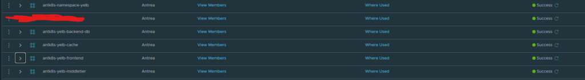

Security groups filtering out the Yelb pods


The membership criteria inside those groups are made up like this, where I am using the labels in my Yelb manifest (these labels are autopopulated so you dont have to guess). Tag equals label frontend and scope equals label dis:k8s:tier:  

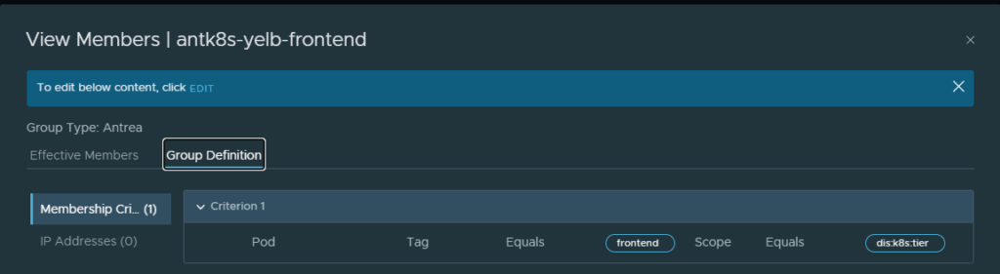

Group definition for the frontend

The same goes for the other groups just using their respective labels. The members should then look like this:  

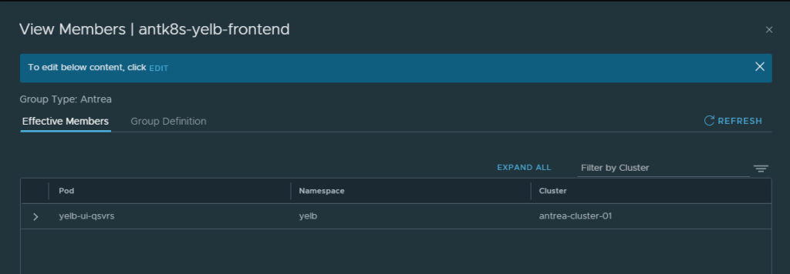

Only the frontend pod

Then I have created a security group that selects all pods in my namespace Yelb by using the label Yelb like this:  

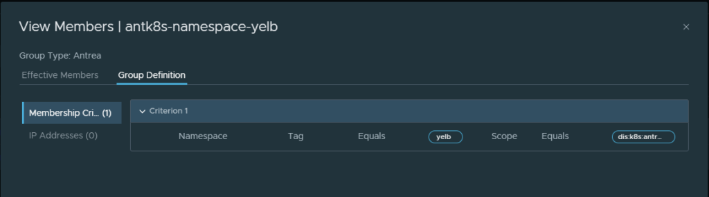

Which then selects all my pods in the namespace Yelb:  

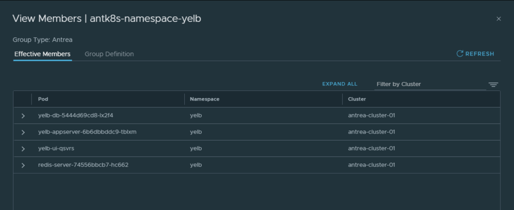

Now I have my security groups and can go on and create my security policies.

### Antrea security policies from NSX manager

Head over to Security, Distributed Firewall section in the on-prem NSX manager to start creating security policies based on your security groups. These are the rules I have created for my application Yelb:  

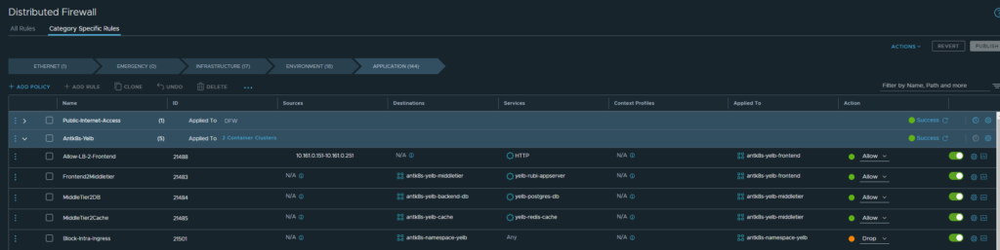

Antrea Security Policies from the NSX manager

First rule allows traffic from my Avi SE's that are being used to create the service loadbalancer for my application Yelb to the Yelb frontend on HTTP only. Notice that the source part here is in the "Applied to field" (goes for all rules in this example). Thee second rule allows traffic from the frontend to the middletier ("app-server") on port 4567 only. The third rule allows traffic from middletier to backend-db ("db-server" on port 5432 only. The fourth rule allows traffic from middletier to cache (redis cache) on port 6379 only. All rules according to the topology maps above. Then the last rule is where I am using the namespace selection to select all pods in the namespace Yelb to drop all else not specified above.  
To verify this I can use the Traceflow feature in Antrea from the NSX manager like this:  
(Head over to Plan & Troubleshoot, Traffic Analysis, Traceflow in your NSX manager)  

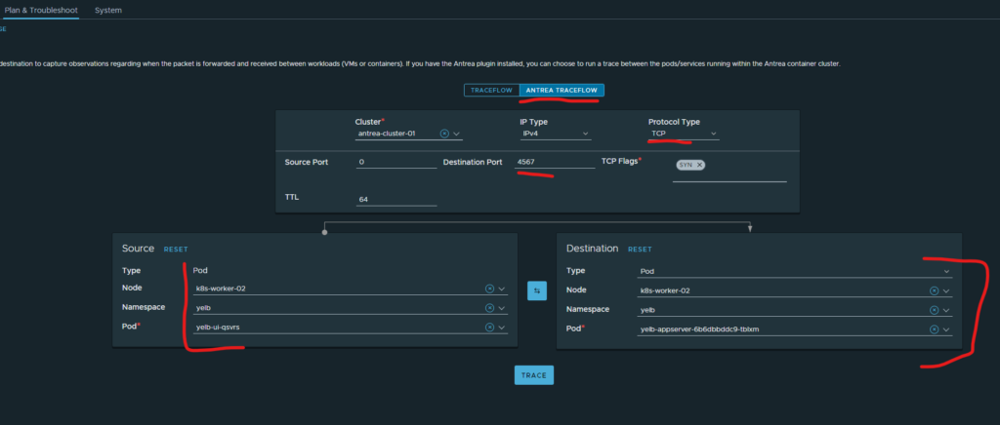

Choose Antrea Traceflow, choose the Antrea cluster where your application resides, then select TCP under Protocol type, type in Destination Port (4567) and choose where your pods are from the source and destination. In the screenshot above I want to verify that the needed ports are allowed between Frontend and middletier (application pod).  
Click trace:  

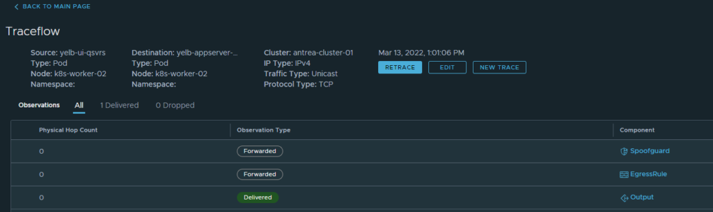

Well that worked, now if I change to port to something else like 4568, am I then still allowed to do that?  

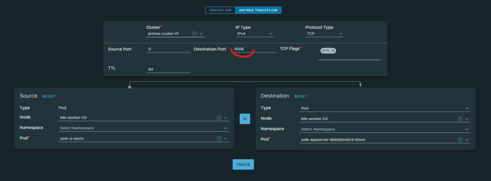

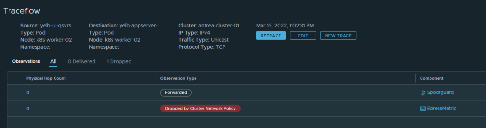

No, I am not. That is because I have my drop rule in place remember:  


I could go on and test all pod to pod connectivity (I have), but you can trust me their are doing their job. Just to save some screenshots. So that is it, I have microsegmented my Yelb application. But what if I want to scale out this application to my VMC environment. I want to achieve the same thing there. Why not, all our groundwork has already been done so lets head out and spin up the same applicaion on our VMC K8s cluster. Whats going to happen in my on-prem NSX manager. This is cool!

## Antrea security policies in my VMC k8s cluster managed by my on-prem NSX manager

Before I deploy my Yelb application in my VMC K8s cluster I want to refresh the memory by showing what my NSX manager knows about the VMC K8s cluster inventory. Lets take a look again. Head over to Inventory in my on-prem NSX manager and take a look at my VMC-ANT-CLUSTER:  


3 nodes you say, and 18 pods you say... Are any of them my Yelb pods?  

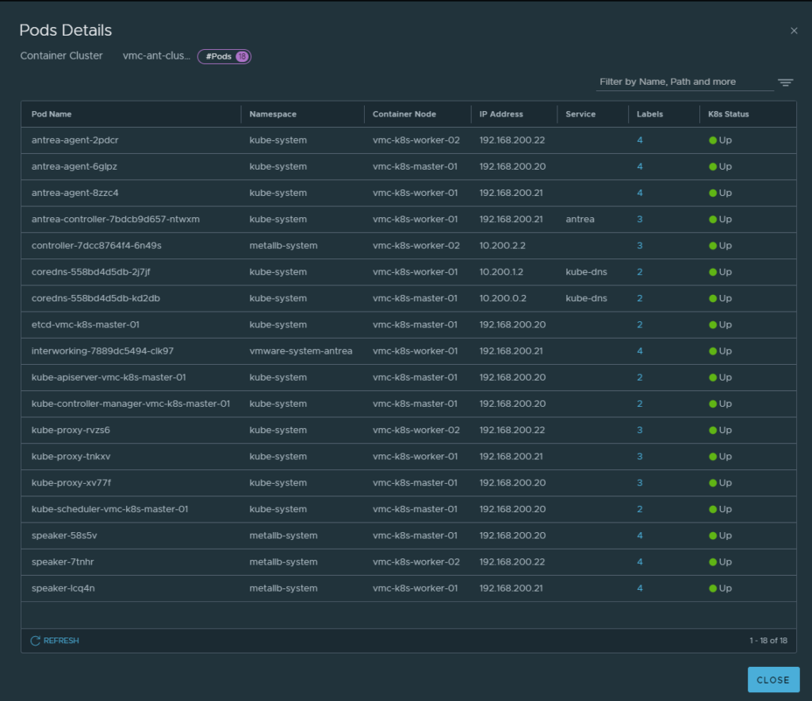

No Yelb pods here...

No, there are no yelb pods here. Lets make that a reality. Nothing reported in k8s either:

  

andreasm@vmc-k8s-master-01:~/pods$ kubectl get pods -A
NAMESPACE              NAME                                        READY   STATUS    RESTARTS   AGE
kube-system            antrea-agent-2pdcr                          2/2     Running   0          3d
kube-system            antrea-agent-6glpz                          2/2     Running   0          3d
kube-system            antrea-agent-8zzc4                          2/2     Running   0          3d
kube-system            antrea-controller-7bdcb9d657-ntwxm          1/1     Running   0          2d22h
kube-system            coredns-558bd4d5db-2j7jf                    1/1     Running   0          3d
kube-system            coredns-558bd4d5db-kd2db                    1/1     Running   0          3d
kube-system            etcd-vmc-k8s-master-01                      1/1     Running   0          3d
kube-system            kube-apiserver-vmc-k8s-master-01            1/1     Running   0          3d
kube-system            kube-controller-manager-vmc-k8s-master-01   1/1     Running   0          3d
kube-system            kube-proxy-rvzs6                            1/1     Running   0          3d
kube-system            kube-proxy-tnkxv                            1/1     Running   0          3d
kube-system            kube-proxy-xv77f                            1/1     Running   0          3d
kube-system            kube-scheduler-vmc-k8s-master-01            1/1     Running   0          3d
metallb-system         controller-7dcc8764f4-6n49s                 1/1     Running   0          2d23h
metallb-system         speaker-58s5v                               1/1     Running   0          2d23h
metallb-system         speaker-7tnhr                               1/1     Running   0          2d23h
metallb-system         speaker-lcq4n                               1/1     Running   0          2d23h
vmware-system-antrea   interworking-7889dc5494-clk97               4/4     Running   18         2d23h


Spin up the Yelb application in my VMC k8s cluster by using the same manifest:  
`kubectl apply -f yelb-lb.yaml`  
The result in my k8s cluster:

  

andreasm@vmc-k8s-master-01:~/pods$ kubectl get pods -A
NAMESPACE              NAME                                        READY   STATUS    RESTARTS   AGE
kube-system            antrea-agent-2pdcr                          2/2     Running   0          3d
kube-system            antrea-agent-6glpz                          2/2     Running   0          3d
kube-system            antrea-agent-8zzc4                          2/2     Running   0          3d
kube-system            antrea-controller-7bdcb9d657-ntwxm          1/1     Running   0          2d22h
kube-system            coredns-558bd4d5db-2j7jf                    1/1     Running   0          3d
kube-system            coredns-558bd4d5db-kd2db                    1/1     Running   0          3d
kube-system            etcd-vmc-k8s-master-01                      1/1     Running   0          3d
kube-system            kube-apiserver-vmc-k8s-master-01            1/1     Running   0          3d
kube-system            kube-controller-manager-vmc-k8s-master-01   1/1     Running   0          3d
kube-system            kube-proxy-rvzs6                            1/1     Running   0          3d
kube-system            kube-proxy-tnkxv                            1/1     Running   0          3d
kube-system            kube-proxy-xv77f                            1/1     Running   0          3d
kube-system            kube-scheduler-vmc-k8s-master-01            1/1     Running   0          3d
metallb-system         controller-7dcc8764f4-6n49s                 1/1     Running   0          2d23h
metallb-system         speaker-58s5v                               1/1     Running   0          2d23h
metallb-system         speaker-7tnhr                               1/1     Running   0          2d23h
metallb-system         speaker-lcq4n                               1/1     Running   0          2d23h
vmware-system-antrea   interworking-7889dc5494-clk97               4/4     Running   18         2d23h
yelb                   redis-server-74556bbcb7-fk85b               1/1     Running   0          4s
yelb                   yelb-appserver-6b6dbbddc9-9nkd4             1/1     Running   0          4s
yelb                   yelb-db-5444d69cd8-dcfcp                    1/1     Running   0          4s
yelb                   yelb-ui-f74hn                               1/1     Running   0          4s

What does my on-prem NSX manager reports?  


Hmm 22 pods

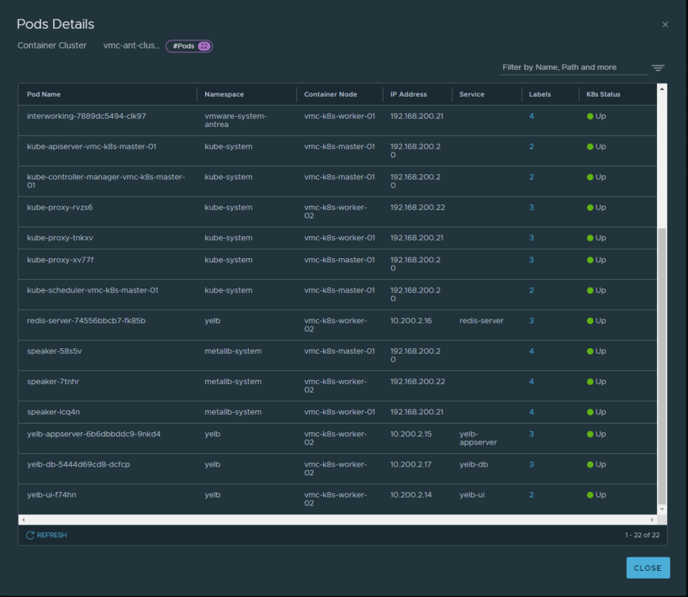

And a lot of yelb pods

Instantly my NSX manager shows them in my inventory that they are up.  
Now, are they being protected by any Antrea security policies? Lets us do the same test as above by using Antrea Traceflow from the on-prem NSX manager with same ports as above (frontend to app 4567 and 4568).  

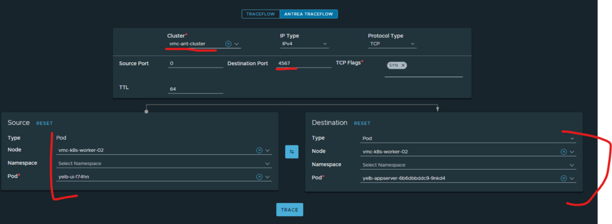

Traceflow from my on-prem NSX manager in the VMC k8s cluster

Notice the selection I have done, everything is the VMC k8s cluster.  

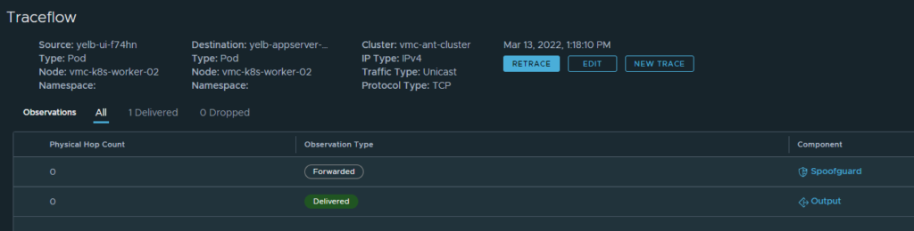

Need port is allowed

That is allowed, what about 4568 (which is not needed):  

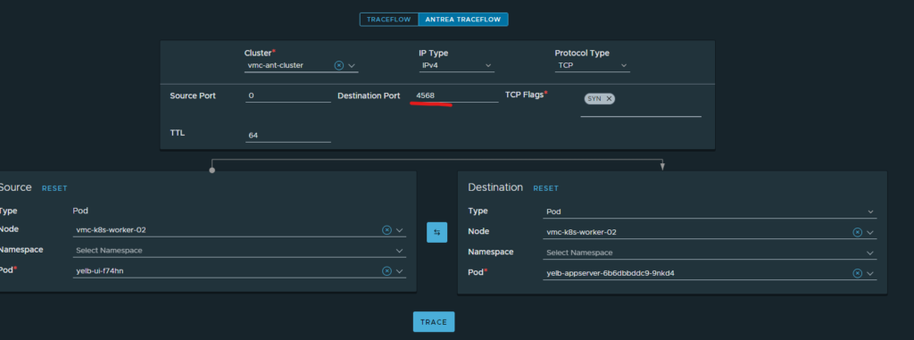

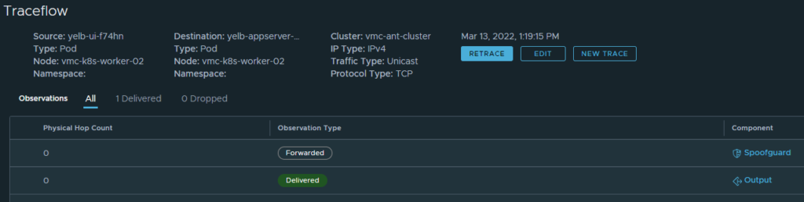

Also allowed

That is also allowed. I cant have that. How can I make use of my already created policy for this application as easy as possible instead of creating all the rules all over?  
Whell, lets test that. Head over to Security, Distributed firewall in my on-prem NSX manager.

Notice the Applied to field here:  

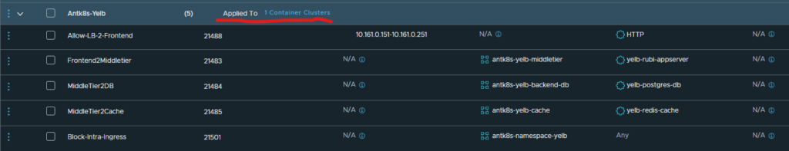

What happens if I click on it?  

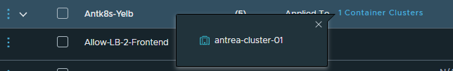

It only shows me my local Antrea k8s cluster. That is also visible if I list the members in the groups being used in the rules:  

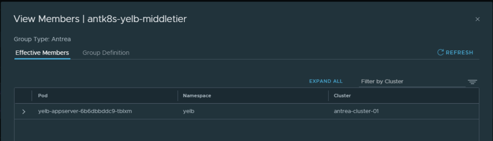

One pod from my local k8s cluster

What if I add the VMC Antrea cluster?  
Cick on the pencil and select your remote VMC K8s cluster:  

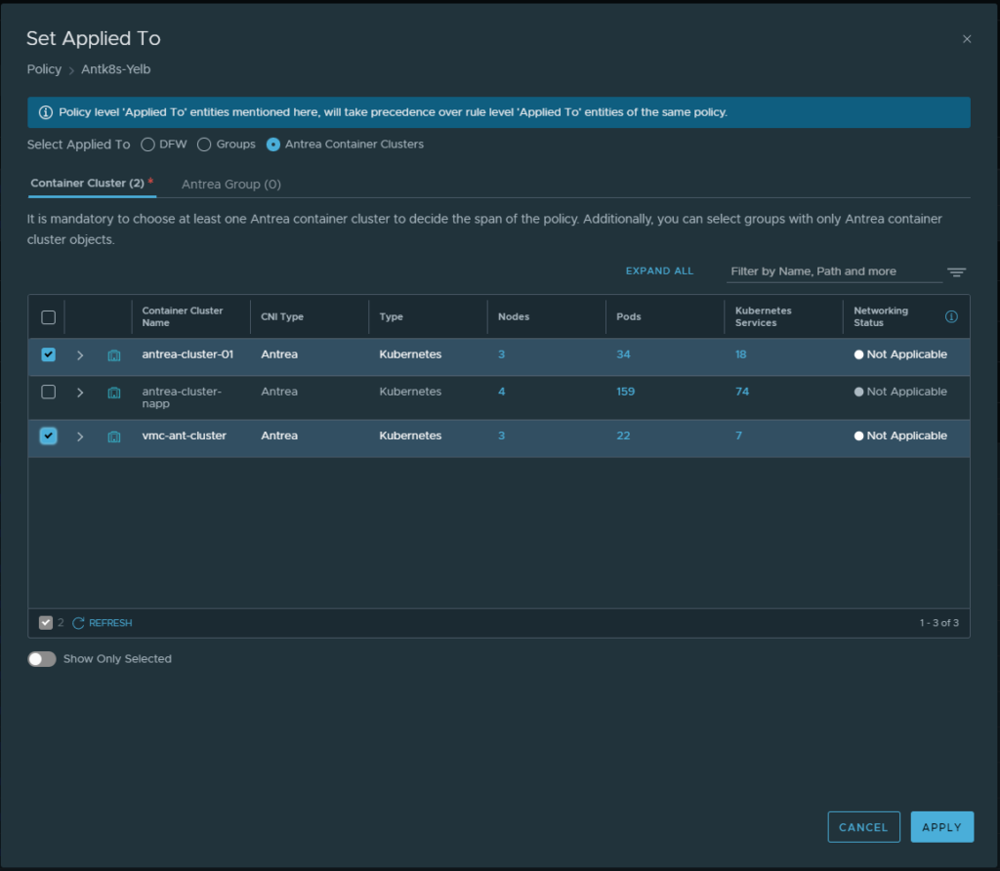

Apply and Publish:  

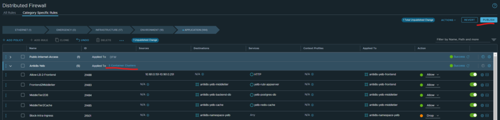

Now lets have a look inside our groups being used by our security policy:  

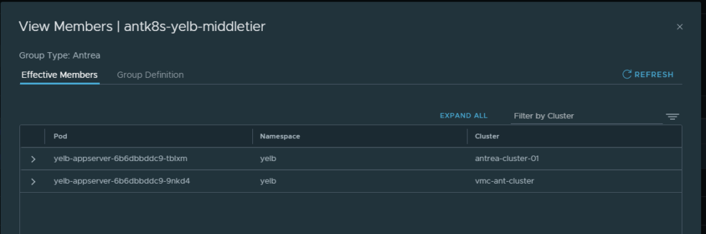

More pods

The Yelb namespace group:  

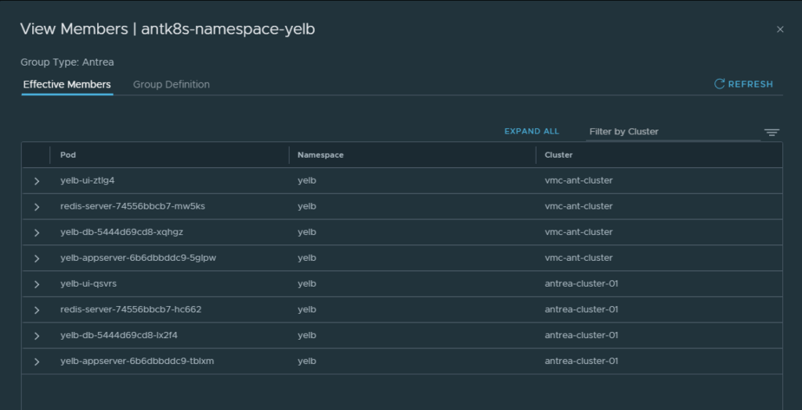

Instantly my security groups are being updated with more members!!!  
Remember how I created the membership criteria of the groups? Labels from my manifest, and labels for the namespace? Antrea is cluster aware, and dont have to specify a specific namespace to select labels from one specific namespace, it can select from all namespaces as long as the label matches. This is really cool.

Now what about my security policies in my VMC k8s cluster? Is it enforcing anything?

Lets check, doing a traceflow again. Now only on a disallowed port 4568:  

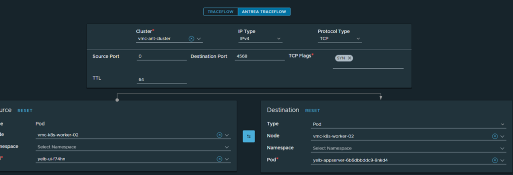

Result:  

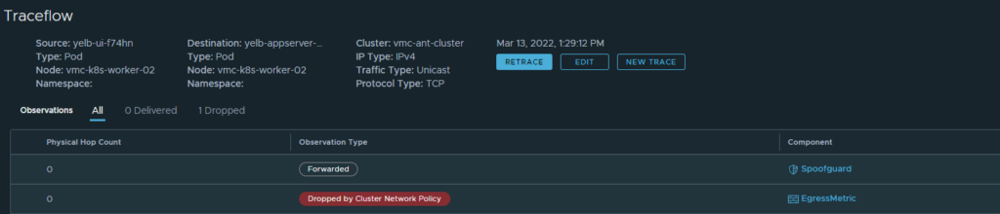

Dropped

The Security policy is in place, enforcing what it is told to do. The only thing I did in my local NSX manager was to add the VMC Antrea cluster in my Security Applied to section
