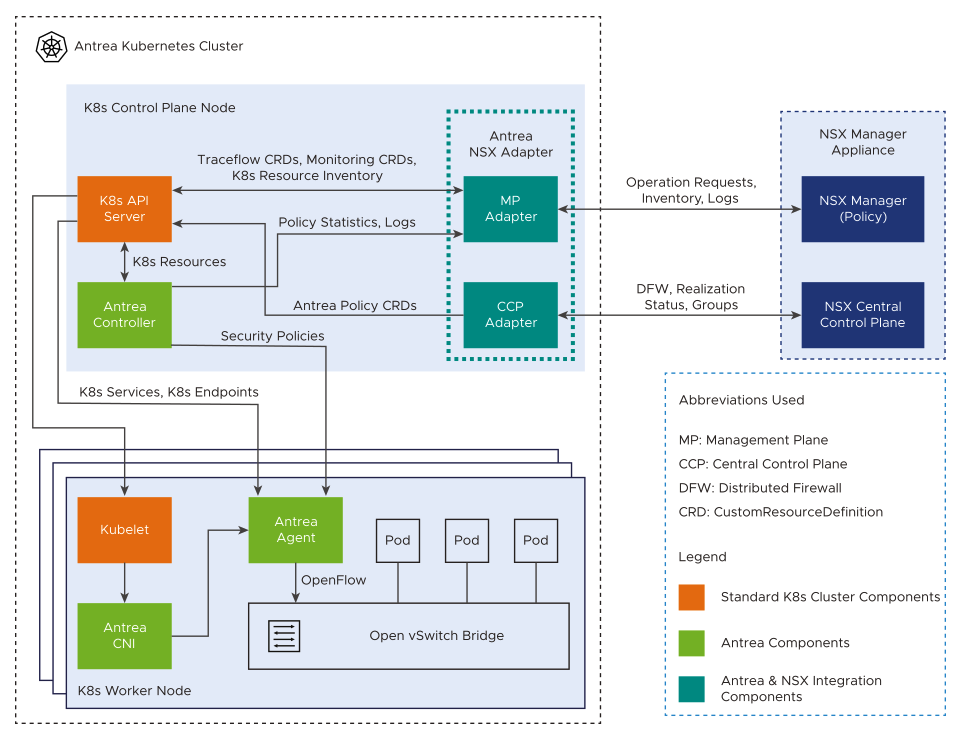

## What is the NSX Antrea integration 

 *Assumptions: I assume that the reader is aware of what Antrea is, and what a CNI is and also what NSX is. If not head over [here](http://antrea.io) to read more on Antrea and [here](https://www.vmware.com/products/nsx.html) to read more on NSX.* 

For many years VMware NSX has help many customer secure their workload by using the NSX Distributed Firewall. As NSX has evolved over the years the different platform it supports has also broadened, from virtual machines, bare metal server, cloud workload and kubernetes pods. NSX has had support for security policies in Kubernetes for a long time also with the CNI NCP [*Read about NCP here*](https://docs.vmware.com/en/VMware-NSX-T-Data-Center/3.2/ncp-kubernetes/GUID-52A92986-0FDF-43A5-A7BB-C037889F7559.html). Recently (almost a year ago since I wrote this article, so not so recent in the world of IT) it also got support for using the Antrea CNI.  What does that mean then. Well, it mean we can now "connect" our Antrea CNI enabled clusters to the NSX manager to manage Antrea Native Policies in combination with NSX Distributed Firewall policies. With this integration Antrea will report inventory, such as nodes, pods, services, ip addresses, k8s labels into the NSX manager. This opens up for a clever way of creating and managing security policies from the NSX manager inside the Antrea enabled clusters. Antrea is supported in almost all kinds of Kubernetes platforms, VMware Tanzu solutions, upstream k8s, ARM, public cloud etc so it is very flexible. And with the rich information NSX gets from Antrea we can create more clever security policies by using the native kubernetes labels to form security group membership based on these labels. 

From the official VMware NSX documentation:

> **Benefits of Integration**
>
> The integration of Antrea Kubernetes clusters to NSX enables the following capabilities:
>
> - View Antrea Kubernetes cluster resources in the NSX Manager UI (Policy mode).
> - Centrally manage groups and security policies in NSX that reference Antrea Kubernetes clusters and NSX resources (for example, VMs).
> - Distribute the NSX security policies to the Kubernetes clusters for enforcement in the cluster by the Antrea CNI.
> - Extend the NSX network diagnostic and troubleshooting features to the Antrea Kubernetes clusters, such as collecting support bundles, monitoring logs, and performing Traceflow operations.
> - Monitor the runtime state and health status of Antrea Kubernetes cluster components and Antrea Agents in the NSX Manager UI.

## Antrea NSX integration architecture

To understand a bit more how this works, we need to go through a couple of components that is in involved to get this integration in place. 

The official documentation has this part covered very well and I will just quote the information here. Or go directly to the source [here](https://docs.vmware.com/en/VMware-NSX/4.1/administration/GUID-311D36DA-7451-4E7C-93BF-E64155E7E342.html)

> The integration architecture explains the information exchanged between a Kubernetes cluster that uses Antrea CNI and the NSX Manager Appliance, which is deployed in NSX.
>
> This documentation does not explain the functions of Antrea components in a Kubernetes (K8s) cluster. To understand the Antrea architecture and the functions of Antrea components in a Kubernetes cluster, see the Antrea documentation portal at https://antrea.io/docs.
>
> This main objective of this documentation is to understand the functions of the Antrea NSX Adapter that integrates a Kubernetes cluster with Antrea CNI to the NSX Manager Appliance.

> **Antrea NSX Adapter**
>
> This component runs as a pod on one of the Kubernetes Control Plane nodes. Antrea NSX Adapter consists of the following two subcomponents:
>
> - Management Plane Adapter (MP Adapter)
> - Central Control Plane Adapter (CCP Adapter)
>
> Management Plane Adapter communicates with the NSX Management Plane (Policy), Kubernetes API Server, and Antrea Controller. Central Control Plane Adapter communicates with the NSX Central Control Plane (CCP) and Kubernetes API Server.
>
> **Functions of the Management Plane Adapter**
>
> - Watches the Kubernetes resource inventory from Kubernetes API and reports the inventory to NSX Manager. Resource inventory of an Antrea Kubernetes cluster includes resources, such as Pods, Ingress, Services, Network Policies, Namespaces, and Nodes.
> - Responds to the policy statistics query from NSX Manager. It receives the statistics from the Antrea Controller API or the statistics that are exported by the Antrea Agent on each K8s worker node, and reports the statistics to NSX Manager.
> - Receives troubleshooting operation requests from NSX Manager, sends the requests to Antrea Controller API server, collects the results, and returns the information to NSX Manager. Examples of troubleshooting operations include Traceflow requests, Support Bundle collection requests, log collection requests.
> - Watches the runtime state and health status of an Antrea Kubernetes cluster from the Antrea Monitoring CustomResourceDefinition (CRD) objects and reports the status to NSX Manager. The status is reported on a per cluster basis. For example, the health status of the following components is reported to the NSX Manager:
>   - Management Plane Adapter
>   - Central Control Plane Adapter
>   - Antrea Controller
>   - Antrea Agents
>
> **Functions of the Central Control Plane Adapter**
>
> - Receives the Distributed Firewall (DFW) rules and groups from NSX Central Control Plane, translates them to Antrea policies, and creates Antrea policy CRDs in K8s API.
> - Watches the policy realization status from both K8s network polices and native Antrea policy CRDs and reports the status to NSX Central Control Plane.
>
> **Stateless Nature of the Central Control Plane Adapter**
>
> The Central Control Plane Adapter is stateless. Each time the adapter restarts or reconnects to K8s API or NSX Manager, it always synchronizes the state with K8s API and NSX Central Control Plane. Resynchronization of the state ensures the following:
>
> - The latest Antrea policies are always pushed to K8s API as native Antrea policy CRDs.
> - The stale policy CRDs are removed if the corresponding security policies are deleted in NSX.

This [post](https://blog.andreasm.io/2023/06/01/managing-antrea-in-vsphere-with-tanzu/) will cover the installation steps of the Antrea/NSX integration. 

## Managing Antrea Native Policies from the NSX manager

For more information how to manage Antrea Polcies from the NSX manager I have created this [post](https://blog.andreasm.io/2022/03/13/managing-your-antrea-k8s-clusters-running-in-vmc-from-your-on-prem-nsx-manager/) and this [post](https://blog.andreasm.io/2023/06/01/managing-antrea-in-vsphere-with-tanzu/)
