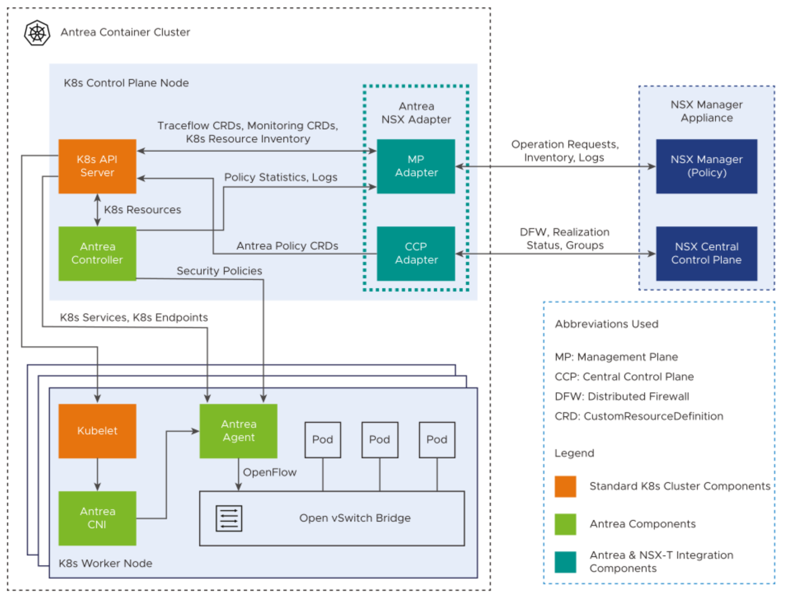

## What is the NSX Antrea integration 

 *Assumptions: I assume that the reader is aware of what Antrea is, and what a CNI is and also what NSX is. If not head over [here](http://antrea.io) to read more on Antrea and [here](https://www.vmware.com/products/nsx.html) to read more on NSX.* 

For many years VMware NSX has help many customer secure their workload by using the NSX Distributed Firewall. As NSX has evolved over the years the different platform it supports has also broadened, from virtual machines, bare metal server, cloud workload and kubernetes pods. NSX has had support for security policies in Kubernetes for a long time also with the CNI NCP [*Read about NCP here*](https://docs.vmware.com/en/VMware-NSX-T-Data-Center/3.2/ncp-kubernetes/GUID-52A92986-0FDF-43A5-A7BB-C037889F7559.html) recently (almost a year ago since I wrote this article, so not so recent in the world of IT) it also got support for using the Antrea CNI.  What does that mean then. Well, it mean we can now "add" our Antrea enabled clusters to NSX. With that Antrea will report their inventory, such as nodes, pods, services, ip addresses, k8s labels into the NSX manager. Another important feature is that we can also create and publish security policies from the NSX manager to the Antrea enabled clusters. Antrea is supported in almost all kinds of Kubernetes platforms, our own Tanzu solutions, upstream k8s, ARM, public cloud etc so it is very flexible. And with the rich information NSX gets from Antrea we can create more clever security policies by using the native kubernetes labels to form security group membership based on these labels. Will get into more of that later. Now lets move on to the components involved. 

## Antrea NSX Adapter

To understand a bit more how this works, we need to go through a couple of components that is in involved to get this integration in place. 

sdfsdfsdf

sdf

sdf

sdf

sdf
