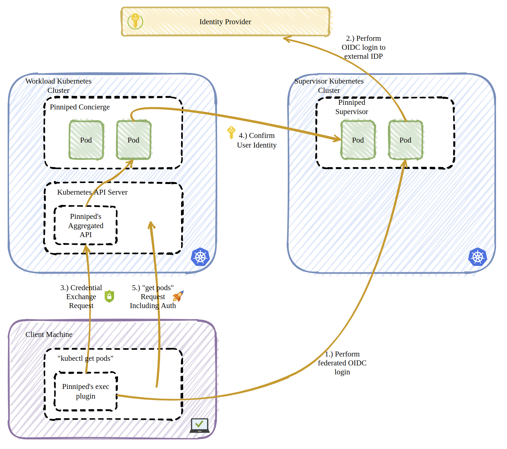

**How to use Pinniped as the authentication service in Kubernets with OpenLDAP**

Goal: Deploy an authentication service to handle RBAC in Kubernetes
Purpose: User/access management in Kubernetes 

## Pinniped introduction 

 

