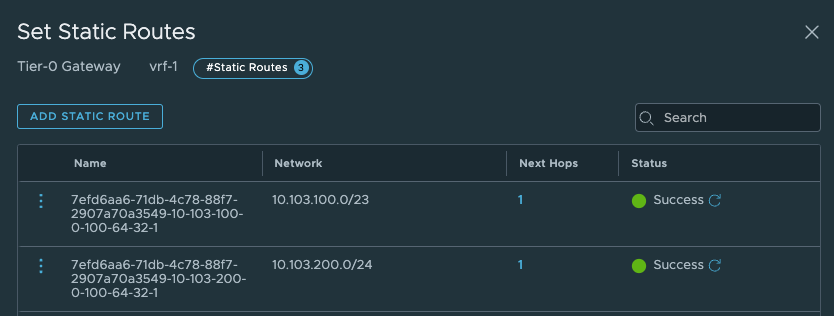

# Tanzu with vSphere using NSX with multiple T0s

In this post I will go through how to configure Tanzu with different T0 routers in NSX for separation and network isolation.
The first part will involve spinning up dedicated NSX Tier-0s by utlizing several NSX Edges and NSX Edge Clusters. The second part will involve using NSX VRF. Same needs, two different approaches, and some different configs in NSX. In vSphere with Tanzu with NSX we have the option to override network setting pr vSphere Namespace. That means we can place TKC clusters on different subnets/segments in NSX for ip separation, but we can also override and define separate NSX Tier-0 routers for separation all the way out to the physical infrastructure.  

The end-goal would be something like this (high level):


## NSX and Tanzu configurations with different individual Tier-0s

In this post I will assume a working NSX with the "first" T0 alredy peered and configured with BGP to its upstream router and Tanzu environment configured and running and maybe a couple of TKC clusters deployed in the "original/initial" Namespace/Workload Network. In other words a fully functional Tanzu with vSphere environment.
My lab is looking like this "networking wise":


In my lab I use the following IP addresses for the following components:

{}

- Tanzu Management network: 10.13.10.0/24 - connected to a NSX Overlay segment - manually created by me
- Tanzu Workload network (the initial Workload network): 10.13.96.0/20 (could be much smaller) - will be created automatically as a NSX overlay segment. 
- Ingress: 10.13.200.0/24
- Egress: 10.13.201.0/24 I am doing NAT on this network (important to have in mind for later)
- The first Tier-0 has been configured to use uplinks on vlan 1304 in the following cidr: 10.13.4.0/24 
- The second (new) Tier-0 will be using uplink on vlan 1305 in the follwing cidr: 10.13.5.0/24

{}

Using dedicated Tier-0 means we need to deploy additional edges, either in the same NSX edge cluster or a new edge cluster. This can generate some compute and admin overhead. But in some environments its not "allowed" to share two different network classifications over same devices. So we need separate edges for our different Tier-0s. But again, with TKGs we cant deploy our TKC clusters on other vSphere clusters than our Supervisor cluster has been configured on, so the different TKC cluster will end up on the same shared compute nodes (ESXi). But networking wise they are fully separated.  

### Deploy new Edge(s) to support a new Tier-0

As this is my lab, I will not deploy redundant amount of Edges, but will stick with one Edge just to get connectivity up and working. NSX Edge do not support more than 1 SR T0 pr Edge, so we need 1:1 mapping between the SR T0 and Edge. And take into consideration if running this in production we must accommodate potential edge failovers, so we should atleast have two edges responsible for a T0. If running two Tier-0 in an edge cluster we should have 4 edges (if one of them fail).  
The first thing we need to do is to deploy a new Edge vm from the NSX manager. The new edge will be part of my "common" overlay transportzone as I cant deploy any TKC cluster on other vSphere clusters than where my Supervisor cluster has been enabled. For the VLAN transportzones one can reuse the existing Edge vlan transportzone and the same profile so they get their correct TEP VLAN. For the Uplinks it can be same VLAN trunkport (VDS or NSX VLAN segment) if the vlan trunk range includes the VLAN for the new T0 uplink.

So my new edge for this second T0 will be deployed like this:


After the Edge has been deployed its time to create a Edge cluster. 


Now we need to create a new segment for the coming new Tier-0 router. 


The segment has been configured to use the edge-vlan-transportzone, and with the vlan I will be using to peer with the upstream router. 

Now we can go ahead and create the new Tier-0:


Give the Tier-0 a name, select your new Edge cluster. Save and go back to edit it.
We need to add a interface: 


Give the interface a name, IP address and select the segment we create above for the new Tier-0 uplink.
Select the Edge node and Save
Now we have a interface, to test if it is up and running you can ping it from your upstream router. 
Next configure BGP and the BGP peering with your upstream router:


The last thing we need to do in our newly created Tier-0 is to create a static route that can help us reach the Workload Network on the Supervisor Control Plane nodes. The TKC cluster need this connectivity.
Click on Routing -> Static Routes and add the following route (svc workload network): 


And the next-hop is defined with the ip of the other (first) Tier-0 interface on the "linknett" between the T0s (not configured yet):


Add and Save. In my lab I like to create these routes in the T0s themselves instead of in the physical router. It could be done from there also. 


Now on the first Tier-0 we need a second or two interface (depending on the number of edges) and create a static route there also. 
The second interface will need to be in the same segment as the new Tier-0 or a dedicated link-net/segment so the Tier-0s can exchange routes between each other there. I just took the lazy approach and reused the same uplink segment my new T0 is already been configured to use. Then I saved a couple of clicks. 
In the first Tier-0 this is the new interface:


Name it, ip address in the same range as the uplink for the new Tier-0 and same segment used in the new T0. 
Select the edge(s) that will have this/these new interface(s).
Save.

Next up is the route:
This route (dmz I have called it) should point to the TKC workload network cidr we decide to use. The correct cidr is something we get when we create the vSphere Namespace (it is base on the Subnet prefix you configure) 


And next-hop (yes you guessed correct) is the uplink interface on the new Tier-0.


So we should have something like this now:


As mentioned above, these routes is maybe easier to create after we have created the vSphere Network with the correct network definition as we can see them being realized in the NSX manager. 

{}

By adding these static routes on the T0 level as I have done, means this traffic will never leave the Tier-0s, it will go over the linknet between the Tier-0s

{}

{}

These routes are necessary for the Supervisor and the TKC cluster to be able to reach each others. If they cant, deployment of the TKC clusters will fail, it will just deploy the first Control Plane node and stop there)

{}


### Create a vSphere Namespace to use our new Tier-0

Head over to vCenter -Workload Management and create a new Namespace:


Give the NS a dns compliant name, select the *Override Supervisor network settings*. From the dropdown select our new Tier-0 router.
Uncheck NAT (dont need NAT). Fill in the IP addresses you want to use for the TKC worker nodes, and then the ingress cidr you want. 

Click Create. Wait a couple of second and head over to NSX and check what has been created there.

In the NSX Manager you should now see the following:

Network Topology:


Segments


This network is always created pr vSphere Namespace and is reserved for vSphere Pods/vSphere Services.
A second segment is created which is of our interest:


This is where our first TKC Nodes in this vSphere Namespace will be placed. And we can now get the correct cidr for our static routes created above. The subnet here is 10.13.51.32727 as NSX is showing is the GW address to be 10.13.51.33/27.

Under LoadBalancing we also got a new object:


This is our Ingress for the TKC API. 


Under Tier-1 gateways we have a new Tier-1 gateway:


(Strangely enough placed in the old Edge cluster). 

Now it is time to deploy your new TKC cluster with the new Tier-0. Its the same procedure as every other TKC cluster. Give it a name and place it in the correct Namespace:

```yaml
apiVersion: cluster.x-k8s.io/v1beta1
kind: Cluster
metadata:
  name: stc-tkc-cluster-dmz
  namespace: stc-ns-dmz
spec:
  clusterNetwork:
    services:
      cidrBlocks: ["20.30.0.0/16"]
    pods:
      cidrBlocks: ["20.40.0.0/16"]
    serviceDomain: "cluster.local"
  topology:
    class: tanzukubernetescluster
    version: v1.23.8---vmware.2-tkg.2-zshippable
    controlPlane:
      replicas: 1
      metadata:
        annotations:
          run.tanzu.vmware.com/resolve-os-image: os-name=ubuntu
    workers:
      machineDeployments:
        - class: node-pool
          name: node-pool-01
          replicas: 2
          metadata:
            annotations:
              run.tanzu.vmware.com/resolve-os-image: os-name=ubuntu
    variables:
      - name: vmClass
        value: best-effort-small #machineclass, get the available classes by running 'k get virtualmachineclass' in vSphere ns context
      - name: storageClass
        value: vsan-default-storage-policy
```


Then it is just running: 

```bash
kubectl apply -f yaml.file
```

And a couple of minutes later (if all preps have been done correctly) you should have a new TKC cluster using the new T0. 


## NSX and Tanzu configurations with NSX VRF

In NSX-T 3.0 VRF was a new feature, and configuring it was a bit cumbersome, but already from NSX-T 3.1 adding and configuring a VRF Tier-0 is very straightforward. The benefit of using VRF is that it does not dictate the requirement of additional NSX Edges, and we can create many VRF T0s. We can "reuse" the same Edges that has already been configured with a Tier-0. Instead a VRF T0 will be linked to that already existing Tier-0 which will then be the Parent Tier-0. Some settings will be inherited from the parent Tier-0 like BGP AS number. But we can achieve ip-separation by using individual uplinks on the VRF Tier-0s and peer to different upstream routers than our parent Tier-0. The VRF Tier0 will have its own Tier-1 linked to it. So all the way from the physical world to the VM we have a dedicated ip network. To be able to configure VRF Tier-0 we need to make sure the uplinks our Edges have been configured with have the correct vlan trunk range so we can create dedicated VRF Tier0 uplink segments in their respective vlan. The VRF Tier0 will use the same "physical" uplinks as the Edges have been configured with, but using different VLAN for the Tier-0 uplinks. I will go through how I configre VRF T0 in my environment. Pr default there is no route leakage between the parent Tier-0 and the VRF-T0 created, if you want to exhange routes between them we need to create those static routes ourselves. Read more about NSX VRF [here](https://docs.vmware.com/en/VMware-NSX/4.1/administration/GUID-8C060C35-1AD2-4B71-AB15-C551F392E528.html). 

In this part of my lab I use the following IP addresses for the following components:

{}

- Tanzu Management network: 172.21.103.0/24 - connected to a VDS port group - manually created by me
- Tanzu Workload network (the initial Workload network): 10.103.100.0/23 - will be created automatically as a NSX overlay segment. 
- Ingress: 10.103.200.0/24
- Egress: 10.103.201.0/24 I am doing NAT on this network (important to have in mind for later)
- The first Tier-0 has been configured to use uplinks on vlan 1034 in the following cidr: 10.103.4.0/24 
- The VRF Tier-0 will be using uplink on vlan 1035 in the follwing cidr: 10.103.5.0/24

{}

Here is a digram showing high-level how VRF-T0 looks like:


The Edge VM network config:


### Configure VRF Tier-0 in NSX

Head over the NSX manager -> Networking -> Tier-0 Gateways and click Add Gateway:


Then give it a name and select the parent Tier0:


Click save.

Now head over to Segments and create the VRF-Tier0 Uplink segment:


Give it a name, select the Edge VLAN Transportzone and enter the VLAN for the VRF T0-uplink (you can also create a vlan Trunk range here instead of creating two distinct segments for both uplinks). In my lab I will only use one uplink. 

Click save

Now head back to your VRF T0 again and add a interface:


Give it a name, select external, enter the IP for the uplink you will use to peer with your upstream router, then select the segment created earlier. Select the Edge that will get this interface. Notice also the Access VLAN ID field. There is no need to enter the VLAN here as we only defined one VLAN in our segment, had we created a VLAN range we need to define a VLAN here. It discovers the correct VLAN as we can see. Click save. Remember that for this VLAN to "come through" the Edge needs to be on a trunk-port that allows this VLAN. 

You can verify the L2 connectivity from your router:

```bash
root@cpodrouter-v7n31 [ ~ ]# ping 10.103.5.10
PING 10.103.5.10 (10.103.5.10) 56(84) bytes of data.
64 bytes from 10.103.5.10: icmp_seq=1 ttl=64 time=4.42 ms
64 bytes from 10.103.5.10: icmp_seq=2 ttl=64 time=0.627 ms
64 bytes from 10.103.5.10: icmp_seq=3 ttl=64 time=0.776 ms
^C
--- 10.103.5.10 ping statistics ---
3 packets transmitted, 3 received, 0% packet loss, time 10ms
rtt min/avg/max/mdev = 0.627/1.939/4.416/1.752 ms
```


Now that we have verified that its time for BGP to configured in our upstream router and in our VRF Tier-0. 
I have already configured my upstream router to accept my VRF T0 as a BGP neighbour, I just need to confgure BGP on my new VRF Tier-0.
In the VRF Tier-0 go to BGP and add a bgp neighbour (notice that we need to enable BGP, not enabled by default, and you cant change the BGP as number):


Click save.


```bash
Neighbor        V         AS MsgRcvd MsgSent   TblVer  InQ OutQ Up/Down  State/PfxRcd
10.103.4.10     4 66803     336     345        0    0    0 05:30:33        3
10.103.5.10     4 66803       2      19        0    0    0 00:01:38        0
172.20.0.1      4 65700     445     437        0    0    0 07:09:43       74
```


My new neighbour has jouined the party. Now just make sure it will advertise the needed networks. Lets configure that:
In the VRF T0, click *route re-distribution* and SET


Now my new VRF-Tier 0 is ready to route and accept new linked Tier-1s. How does it look like in the NSX map?


Looking good.

Let us get back to this picture when we have deployed a TKC cluster on it. 

### Create a vSphere Namespace to use our new VRF Tier-0

This will be the same approach as above [here](https://blog.andreasm.io/2023/04/14/tanzu-with-vsphere-and-different-tier-0s/#create-a-vsphere-namespace-to-use-our-new-tier-0) only difference is we are selecting a VRF Tier0 instead.


Here I have selected the VRF Tier-0 and defined the network for it. I have disabled NAT. 

Now what have happened in NSX? Lets have a look.
The network topology has been updated:


A new Tier-1 has been created:


And ofcourse the loadbalancer interface:


But the most interesting part is the static routes being created. Let us have a look at these.

In the VRF T0 it has created two additonal static routes: 



Those to routes above points to the Supervisor Workload network and the Supervisor Ingress network. Next hop is:


These are the Tier0-Tier-1 transit net interface:


What static routes have been configured on the parent Tier-0?


And next-hop is:


These routes are pointing to the new vSphere Namespace network, and Ingress network we defined to use the new VRF-Tier0. 

High-level overview of the static routes being created automatically by NCP:


When the TKC cluster is deployed the NSX map will look like this:


A new segment as been added (vnet-domain-c8:5135e3cc-aca4-4c99-8f9f-903e68496937-wdc-ns-1-vrf-wdc-cl-58aaa-0), which is the segment where the TKC workers have been placed. Notice that it is using a /27 subnet as defined in the Namespace Subnet Prefix above. The first segment (/27 chunk) (seg-domain-xxxxx) is always reserved for the Supervisor Services/vSphere Pods. As I decided not to use NAT I can reach the worker nodes IP addresses directly from my management jumpbox (if allowed routing/firewall wise). Note that ping is default disabled/blocked. So to test connectivity try port 22 with SSH/curl/telnet etc. 


```bash
andreasm@linuxvm01:~/tkgs_vsphere7$ ssh 10.103.51.34
The authenticity of host '10.103.51.34 (10.103.51.34)' can't be established.
ECDSA key fingerprint is SHA256:qonxA8ySCbic0YcCAg9i2pLM9Wpb+8+UGpAcU1qAXHs.
Are you sure you want to continue connecting (yes/no/[fingerprint])?
```

But before you can reach it directly you need to allow this with a firewall rule in NSX as there is a default block rule here:


In order to "override" this rule we need to create a rule earlier in the NSX Distributed Firewall. Below is just a test rule I created, its far to open/liberal of course:


The group membership in the above rules is just the vnet-domain-c8:5135e3cc-aca4-4c99-8f9f-903e68496937-wdc-ns-1-vrf-wdc-cl-58aaa-0 segment where my TKC workers in this namespace will reside. So if I scale down/up this cluster the content will be dynamically updated. I dont have to update the rule or security group, its done automatic. 


## Firewall openings - network diagram


I will get back and update this section with a table and update the diagram with more details.


## Troubleshooting

To troubleshoot networking scenarios with Tanzu it can sometimes help to SSH into the Supervisor Controlplane VMs and the TKC worker nodes. When I tested out this multi Tier-0 setup I had an issue that only the control plane node of my TKC cluster were being spun up, it never came to deploying the worker nodes. I knew it had to do with connectivity between the Supervisor and TKC.
I used NSX Traceflow to verify that connectivity worked as intended which my traceflow in NSX did show me, but still it did not work. So sometimes it is better to see whats going on from the workloads perspective themselves. 

### SSH Supervisor VM

To log in to the Supervisor VMs we need the root password. This password can be retreived from the vCenter server. SSH into the vCenter server:

```bash
root@vcsa [ /lib/vmware-wcp ]# ./decryptK8Pwd.py
Read key from file

Connected to PSQL

Cluster: domain-c35:dd5825a9-8f62-4823-9347-a9723b6800d5
IP: 172.21.102.81
PWD: PASSWORD-IS-HERE
------------------------------------------------------------

Cluster: domain-c8:dd5825a9-8f62-4823-9347-a9723b6800d5
IP: 10.101.10.21
PWD: PASSWORD-IS-HERE
------------------------------------------------------------
```

Now that we have the root password one can log into the Supervisor VM with SSH and password through the Management Interface (the Workload Interface IP is probably behind NAT so is not reachable OOB):

```bash
andreasm@andreasm:~/from_ubuntu_vm/tkgs/tkgs-stc-cpod$ ssh root@10.101.10.22
The authenticity of host '10.101.10.22 (10.101.10.22)' can't be established.
ED25519 key fingerprint is SHA256:vmeHlDgquXrZTK3yyevmY2QfISW1WNoTC5TZJblw1J4.
This key is not known by any other names
Are you sure you want to continue connecting (yes/no/[fingerprint])?
```

And from in here we can use some basic troubleshooting tools to verify if the different networks can be reached from the Supervisor VM. In the example below I try to verify if it can reach the K8s API VIP for the TKC cluster deployed behind the new Tier-0. I am adding *--interface eth1* as I want to specifically use the Workload Network interface on the SVM. 

```bash
curl --interface eth1 https://10.13.52.1:6443
```

 The respons should be immediate, if not you have network reachability issues:

```bash
curl: (28) Failed to connect to 10.13.52.1 port 6443 after 131108 ms: Couldn't connect to server
```

What you should see is this:

```bash
root@423470e48788edd2cd24398f794c5f7b [ ~ ]# curl --interface eth1 https://10.13.52.1:6443
curl: (60) SSL certificate problem: unable to get local issuer certificate
More details here: https://curl.se/docs/sslcerts.html

curl failed to verify the legitimacy of the server and therefore could not
establish a secure connection to it. To learn more about this situation and
how to fix it, please visit the web page mentioned above.
```

 

### SSH TKC nodes

The nodes in a TKC cluster can also be SSH'ed into. If you dont do NAT on your vSphere Namespace network they can be reach directly on their IPs (if from where your SSH jumpbox is allowed routing wise/firewall wise). But if you are NAT'ing then you have to place your SSH jumpbox in the same segment as the TKC nodes you want to SSH into. Or add a second interface on your jumpbox placed in this network. The segment is created in NSX and is called something like this:


To get the password for the TKC nodes you can get them with kubectl like this:
Put yourselves in the context of the namespace where your workload nodes is deployed:

```bash
andreasm@andreasm:~$ vsphere-kubectl login --server=10.101.11.2 --insecure-skip-tls-verify --vsphere-username=andreasm@cpod-nsxam-wdc.az-wdc.cloud-garage.net --tanzu-kubernetes-cluster-namespace ns-wdc-1-nat

```

```bash
andreasm@andreasm:~$ k config current-context
tkc-cluster-nat
```

Then get the SSH secret:

```bash
andreasm@andreasm:~$ k get secrets
NAME                                                   TYPE                                  DATA   AGE
default-token-fqvbp                                    kubernetes.io/service-account-token   3      127d
tkc-cluster-1-antrea-data-values                       Opaque                                1      127d
tkc-cluster-1-auth-svc-cert                            kubernetes.io/tls                     3      127d
tkc-cluster-1-ca                                       cluster.x-k8s.io/secret               2      127d
tkc-cluster-1-capabilities-package                     clusterbootstrap-secret               1      127d
tkc-cluster-1-encryption                               Opaque                                1      127d
tkc-cluster-1-etcd                                     cluster.x-k8s.io/secret               2      127d
tkc-cluster-1-extensions-ca                            kubernetes.io/tls                     3      127d
tkc-cluster-1-guest-cluster-auth-service-data-values   Opaque                                1      127d
tkc-cluster-1-kapp-controller-data-values              Opaque                                2      127d
tkc-cluster-1-kubeconfig                               cluster.x-k8s.io/secret               1      127d
tkc-cluster-1-metrics-server-package                   clusterbootstrap-secret               0      127d
tkc-cluster-1-node-pool-01-bootstrap-j2r7s-fgmm2       cluster.x-k8s.io/secret               2      42h
tkc-cluster-1-node-pool-01-bootstrap-j2r7s-r5lcm       cluster.x-k8s.io/secret               2      42h
tkc-cluster-1-node-pool-01-bootstrap-j2r7s-w96ft       cluster.x-k8s.io/secret               2      42h
tkc-cluster-1-pinniped-package                         clusterbootstrap-secret               1      127d
tkc-cluster-1-proxy                                    cluster.x-k8s.io/secret               2      127d
tkc-cluster-1-sa                                       cluster.x-k8s.io/secret               2      127d
tkc-cluster-1-secretgen-controller-package             clusterbootstrap-secret               0      127d
tkc-cluster-1-ssh                                      kubernetes.io/ssh-auth                1      127d
tkc-cluster-1-ssh-password                             Opaque                                1      127d
tkc-cluster-1-ssh-password-hashed                      Opaque                                1      127d
```

I am interested in this one:

```bash
tkc-cluster-1-ssh-password
```

 So I will go ahead and retrieve the content of it:

```bash
andreasm@andreasm:~$ k get secrets tkc-cluster-1-ssh-password -oyaml
apiVersion: v1
data:
  ssh-passwordkey: aSx--redacted---KJS=    #Here is the ssh password in base64
kind: Secret
metadata:
  creationTimestamp: "2022-12-08T10:52:28Z"
  name: tkc-cluster-1-ssh-password
  namespace: stc-tkc-ns-1
  ownerReferences:
  - apiVersion: cluster.x-k8s.io/v1beta1
    kind: Cluster
    name: tkc-cluster-1
    uid: 4a9c6137-0223-46d8-96d2-ab3564e375fc
  resourceVersion: "499590"
  uid: 75b163a3-4e62-4b33-93de-ae46ee314751
type: Opaque
```

Now I just need to decode the base64 encoded pasword:

```bash
andreasm@andreasm:~$ echo 'aSx--redacted---KJS=' |base64 --decode
passwordinplaintexthere=andreasm@andreasm:~$
```

Now we can use this password to log in to the TKC nodes with the user: vmware-system-user

```bash
ssh vmware-system-user@10.101.51.34
```


## DCLI - VMware Datacenter CLI

If you happen to find different tasks easier to perform from CLI instead of GUI I will show here how to create a new vSphere Namespace by using DCLI from the VCSA appliance (vCenter Server). For more information and reference on dcli look [here](https://developer.vmware.com/web/tool/3.0.0/vmware-datacenter-cli).

Log in to your vCenter hosting your Supervisor Cluster with SSH and enter shell:

```bash
andreasm@andreasm:~/$ ssh root@vcsa.cpod-v7n31.az-wdc.cloud-garage.net

VMware vCenter Server 7.0.3.01000

Type: vCenter Server with an embedded Platform Services Controller

(root@vcsa.cpod-v7n31.az-wdc.cloud-garage.net) Password:
Connected to service

    * List APIs: "help api list"
    * List Plugins: "help pi list"
    * Launch BASH: "shell"

Command> shell
Shell access is granted to root
root@vcsa [ ~ ]#
```

Type *dcli --help" to see some options:

```bash
root@vcsa [ ~ ]# dcli --help
usage: dcli [+server SERVER] [+vmc-server] [+nsx-server [NSX_SERVER]] [+org-id ORG_ID] [+sddc-id SDDC_ID] [+interactive] [+prompt PROMPT]
            [+skip-server-verification | +cacert-file CACERT_FILE] [+username USERNAME] [+password PASSWORD] [+logout] [+filter FILTER [FILTER ...]]
            [+formatter {yaml,yamlc,table,xml,xmlc,json,jsonc,jsonp,html,htmlc,csv}] [+verbose] [+log-level {debug,info,warning,error}] [+log-file LOG_FILE]
            [+generate-json-input] [+generate-required-json-input] [+json-input JSON_INPUT] [+credstore-file CREDSTORE_FILE]
            [+credstore-add | +credstore-list | +credstore-remove] [+session-manager SESSION_MANAGER] [+configuration-file CONFIGURATION_FILE] [+more]
            [args [args ...]]

VMware Datacenter Command Line Interface

positional arguments:
  args                  CLI command

optional arguments:
  +server SERVER        Specify VAPI Server IP address/DNS name (default: 'http://localhost/api')
  +vmc-server           Switch to indicate connection to VMC server (default VMC URL: 'https://vmc.vmware.com')
  +nsx-server [NSX_SERVER]
                        Specify NSX on VMC Server or on-prem instance IP address/DNS name (default: 'None')
  +org-id ORG_ID        Specify VMC organization id to connect to NSX instance. Works together with +sddc-id. (default: 'None')
  +sddc-id SDDC_ID      Specify VMC SDDC id to connect to NSX instance. Works together with +org-id. (default: 'None')
  +interactive          Open a CLI shell to invoke commands
  +prompt PROMPT        Prompt for cli shell (default: dcli> )
  +skip-server-verification
                        Skip server SSL verification process (default: False)
  +cacert-file CACERT_FILE
                        Specify the certificate authority certificates for validating SSL connections (format: PEM) (default: '')
  +username USERNAME    Specify the username for login (default: '')
  +password PASSWORD    Specify password explicitly (default: False)
  +logout               Requests delete session and remove from credentials store if stored. (default: False)
  +filter FILTER [FILTER ...]
                        Provide JMESPath expression to filter command output. More info on JMESPath here: http://jmespath.org
  +formatter {yaml,yamlc,table,xml,xmlc,json,jsonc,jsonp,html,htmlc,csv}
                        Specify the formatter to use to format the command output
  +verbose              Prints verbose output
  +log-level {debug,info,warning,error}
                        Specify the verbosity for log file. (default: 'info')
  +log-file LOG_FILE    Specify dcli log file (default: '/var/log/vmware/vapi/dcli.log')
  +generate-json-input  Generate command input template in json
  +generate-required-json-input
                        Generate command input template in json for required fields only
  +json-input JSON_INPUT
                        Specifies json value or a json file for command input
  +credstore-file CREDSTORE_FILE
                        Specify the dcli credential store file (default: '/root/.dcli/.dcli_credstore')
  +credstore-add        Store the login credentials in credential store without prompting
  +credstore-list       List the login credentials stored in credential store
  +credstore-remove     Remove login credentials from credential store
  +session-manager SESSION_MANAGER
                        Specify the session manager for credential store remove operation
  +configuration-file CONFIGURATION_FILE
                        Specify the dcli configuration store file (default: '/root/.dcli/.dcli_configuration')
  +more                 Flag for page-wise output
root@vcsa [ ~ ]#
```

Enter DCLI interactive mode:
**All commands in dcli have autocomplete**

```bash
root@vcsa [ ~ ]# dcli +i +server vcsa.cpod-nsxam-stc.az-stc.cloud-garage.net +skip-server-verification
Welcome to VMware Datacenter CLI (DCLI)

usage: <namespaces> <command>

To auto-complete and browse DCLI namespaces:   [TAB]
If you need more help for a command:           vcenter vm get --help
If you need more help for a namespace:         vcenter vm --help
To execute dcli internal command: env
For detailed information on DCLI usage visit:  http://vmware.com/go/dcli

dcli>
```

Below shows how autocomplete works:

```bash
root@vcsa [ ~ ]# dcli +i +server vcsa.cpod-nsxam-stc.az-stc.cloud-garage.net +skip-server-verification
Welcome to VMware Datacenter CLI (DCLI)

usage: <namespaces> <command>

To auto-complete and browse DCLI namespaces:   [TAB]
If you need more help for a command:           vcenter vm get --help
If you need more help for a namespace:         vcenter vm --help
To execute dcli internal command: env
For detailed information on DCLI usage visit:  http://vmware.com/go/dcli

dcli> com vmware vcenter n
                           > namespacemanagement
                           > namespaces
                           > network
```


```bash
dcli> com vmware vcenter namespaces instances list
                                               list
                                               getv2
                                               update
                                               delete
                                               listv2
                                               createv2
                                               set
```

We can tab to autocomplete and/or use the "dropdown" list to scroll through the different options. Nice feature.

Create a vSphere Namespace from DCLI, selecting a VRF T0, configure name, network etc (as you would do from the GUI of vCenter in Workload Management):

```bash
dcli> com vmware vcenter namespaces instances create --cluster domain-c8 --namespace stc-cluster-vrf2 --namespace-network-network-ingress-cidrs '[{"address": "10.13.54.
0", "prefix":24}]' --namespace-network-network-load-balancer-size SMALL --namespace-network-network-namespace-network-cidrs '[{"address": "10.13.53.0", "prefix":24}]' -
-namespace-network-network-provider NSXT_CONTAINER_PLUGIN --namespace-network-network-nsx-tier0-gateway vrf-1 --namespace-network-network-routed-mode true --namespace-n
etwork-network-subnet-prefix-length 28
dcli>
```

To get the --cluster domain id run this:

```bash
dcli> com vmware vcenter namespaces instances list
|---------|-----------------------------------|----------------|-----------|----------------------|-------------|
|cluster  |stats                              |namespace       |description|self_service_namespace|config_status|
|---------|-----------------------------------|----------------|-----------|----------------------|-------------|
|domain-c8||--------|-----------|------------||stc-cluster-vrf |           |False                 |RUNNING      |
|         ||cpu_used|memory_used|storage_used||                |           |                      |             |
|         ||--------|-----------|------------||                |           |                      |             |
|         ||0       |0          |0           ||                |           |                      |             |
|         ||--------|-----------|------------||                |           |                      |             |
|domain-c8||--------|-----------|------------||stc-cluster-vrf2|           |False                 |RUNNING      |
|         ||cpu_used|memory_used|storage_used||                |           |                      |             |
|         ||--------|-----------|------------||                |           |                      |             |
|         ||0       |0          |0           ||                |           |                      |             |
|         ||--------|-----------|------------||                |           |                      |             |
|---------|-----------------------------------|----------------|-----------|----------------------|-------------|
dcli>
```

And seconds later the vSphere Namespace is created


## vCenter API - with Postman

vCenter has a nice feature included, the API Explorer. This can be found here:

Click on the hamburger Menu, and find Developer Center:


And from here we have all the API available to us:


Its a looooong list of available APIs. 

To be able to authenticate against vCenter with Postman we must create an API Key. So the first we need to do is "login" with post using the following api (this uses a username and password with sufficient acces to vCenter): 

```bash
https://{{vcenter-fqdn}}/api/session
```

In Postman one should create an environment that contains the vCenter IP/FQDN, username and password. 
So the first action is to POST this API to get the API Key, making sure you set Authorization to Basic Auth from your environment:


The response from this POST should be a token. From now you need to use this token to interact with vCenter API. Change the authentication to API Key and use *vmware-api-session-id* as Key and Token as value. 


Now lets try a GET and see if it works:


That worked out fine :smile:

What about creating a vSphere Namespace from Postman? 

Thats very easy, below is an example to create a new vSphere Namespace, and pointing it to my VRF Tier-0 router:

```json
{
	"access_list": [
		{
			"domain": "cpod-nsxam-stc.az-stc.cloud-garage.net",
			"role": "OWNER",
			"subject": "andreasm",
			"subject_type": "USER"
		}
	],
	"cluster": "domain-c8",
	"namespace": "stc-cluster-vrf2",
	"namespace_network": {
		"network": {
			"ingress_cidrs": [
				{
					"address": "10.13.54.0",
					"prefix": 24
				}
			],
			"load_balancer_size": "SMALL",
			"namespace_network_cidrs": [
				{
					"address": "10.13.53.0",
					"prefix": 24
				}
			],
			"nsx_tier0_gateway": "vrf-1",
			"routed_mode": true,
			"subnet_prefix_length": 28
		},
		"network_provider": "NSXT_CONTAINER_PLUGIN"
	}
}
```

Paste this into Postman (Body - Raw) and POST it to the following path https://{{vcenter-fqdn}}/api/vcenter/namespaces/instances and the new vSphere Namespace should be created in a jiff.


And in vCenter our new Namespace:


For references to the APIs in vCenter and a whole lot of details and explanations have a look [here](https://developer.vmware.com/apis/vsphere-automation/v8.0.0/vcenter/)!

