# Tanzu with vSphere using NSX with multiple T0s

In this post I will go through how to configure Tanzu with different NSX T0 routers for IP separation use cases, network isolation and multi-tenancy.
The first part will involve spinning up dedicated NSX Tier-0 routers by utlizing several NSX Edges and NSX Edge Clusters. The second part will involve using NSX VRF-Tier0. Same needs, two different approaches, and some different configs in NSX.

Some background to why this is a useful feature: In vSphere with Tanzu with NSX we have the option to override network setting pr vSphere Namespace. That means we can place TKC/Workload clusters on different subnets/segments for ip separation and easy NSX Distributed Firewall policy creation (separation by environments DEV, TEST, PROD etc), but we can also override and define separate NSX Tier-0 routers for separation all the way out to the physical infrastructure. In some environments this is needed as there is guidelines/policies for certain network classifications to be separated, and filtered in physical firewall/security perimeters. Although NSX comes with a powerful and advanced distributed firewall, including Gateway firewall (on Tier1 and Tier0) there is nothing in the way for NSX to be combined in such environments, it just allows for more granular firewall policies before the traffic is eventually shipped out to the perimeter firewalls.    

The end-goal would be something like this (high level):

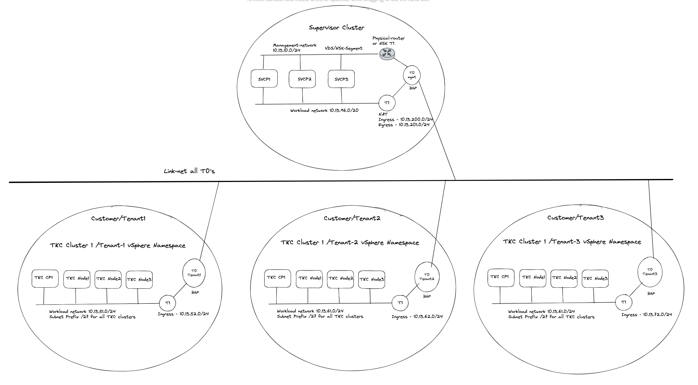


Before jumping into the actual configuration of this setup I will need to explain a couple of things, as there are some steps that needs to be involved in getting this to work. Lets continue this discussion/monologue in the chapter below.

## Routing considerations

Tanzu with vSphere consists of a Supervisor Controlplane VM cluster (3 nodes). These three are configured with two network interfaces, interface ETH0 is placed in the management network. This management network can be NSX overlay segments, or regular VLAN backed segments or VDS/vSwitch portgroups. Its main responsibility is to communicate with the vCenter server API for vm/node creation etc. The second interface (ETH1) on these Supervisor Controlpane VMs is the Workload network. This network's responsibilities are among a couple of things the Kubernetes API endpoint where we can interact with the Kubernetes API to create workload clusters, and here is an important note to remember: It is also used to communicate with the workload clusters being created. If there is no communication from this network to the workload cluster being created, workload cluster creation will fail. So needles to say, it is important that this communication works. 
When we deploy or enable the Workload Control Plane/Supervisor cluster on a fresh vCenter server and with NSX as the networking stack we are presented with a choice how the workload network can be configured, and the option I am interested in here is the NAT or no NAT option.


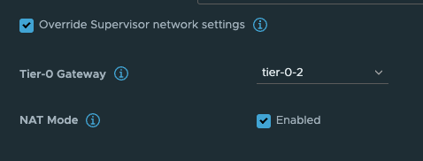

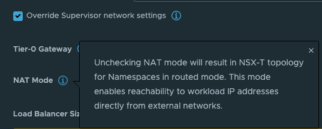 

This option is very easy to select (selected by default) and very easy to deselect, but the impact it does is big. Especially when we in this post are discussing TKG with multi-Tier-0/VRF-T0. 

What this option does is deciding whether the workload network in your vSphere Namespace will be routed or not. Meaning that the controlplane and worker nodes actual ip addresses will be directly reachable and exposed (routed) in your network or if it will be masked by NAT rules so they will not be exposed with their real ip addresses in the network. The same approach as a POD in Kubernetes, default it will be Source NAT'ed through its worker node it is running on when it is doing egress traffic (going out and wants to make contact with something). So with NAT enabled on the workload network in a vSphere Namespace the workers will not be using their real ip addresses when they are communicating out, they will be masked by a NAT rule created in NSX automatically. This is all fine, if you want to use NAT. But if you dont want to use NAT you will have to disable this option and prepare all your vSphere Namespace workoad networks to be of ip subnets you are prepared to route in your network. That is also very fine. And as long as you dont expect to be running 500000+ worker nodes you will have available routed RFC1918 addresses to your disposal. 

The reason I would like to touch upon the above subject is that it will define how we create our routing rules between a Supervisor cluster a vSphere Namespace workload network with NAT enabled or not. 

Now I get to the part where it really get interesting. If you decide to use the NAT'ed approach and NSX VRF-T0 when you create your first vSphere Namespace (not the default inital system vSphere Namespace, but the first vSphere Namespace you can create after WCP has been installed) NCP (NSX Container Plugin) will automatically create a couple of static routes so the Supervisor Cluster workload network can reach the workload networks in your vSphere Namespace placed under a different Tier-0 than the default workload network is placed, here a VRF Tier-0. These routes will be defined with VRF Route Leaking, meaning they will not go out of its parent Tier-0 to reach certain subnets. And with a NAT enabled workload cluster that is perfect as the we dont have care about the NAT rules created on the workload network, they can talk to each other with their real ip addresses. I will explain this a bit later on. Well that is fine and all, but sometimes VRF Tier-0 is not the best option, we need to use dedicated Tier-0 routers on different NSX edge cluster/edges then there is no automatic creation for these static routes. But where and how do I define these static routes manually? On the Tier-0s themselves? In the physical routers the Tier-0s are peering with (using static or BGP)? Yes, both options are possible. If we decide to create these rules in the Tier-0s themselves we need to create a linknet between the Tier-0s to they can point to each other with their respective subnet routes (can be a regular overlay segment used as L2 between the different Tier-0s).

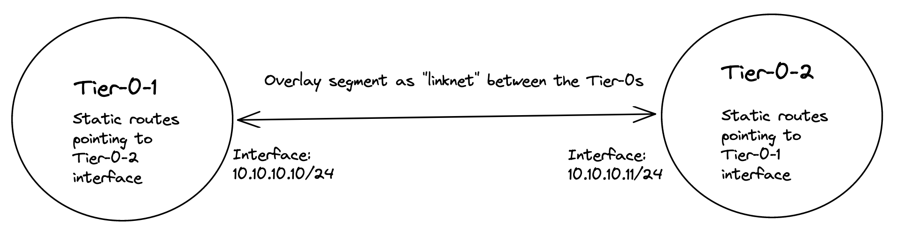

But, there is always a but :smile:. With a NAT enabled vSphere Namespace, the workload network is not allowed to use its own IP address when going out of the Tier-0, it will be using an IP address from the egress subnet defined, or will it?
First, when NAT is enabled on a vSphere Namespace, NCP will create a rule in NSX saying that if you want to talk to your other workload cluster network buddies, you dont have to hide your true identity, you are allowed to use your real name when you want to talk to your buddies. See below for how these rules looks like:


Wait a minute, what does this mean then? Exactly, this means that when it communicates with the other vSphere Namespace network destinations IP/Subnets (see above) it will not be NAT'ed. It will use its real ip address. 
And that ladies and gentlemen is why creating the static routes directly between the Tier-0s using a linknet between is an easy solution when using NAT in the vSphere Namespace network. Why, how etc, still dont understand? Ok, let me first show you an example below of two such static routes.

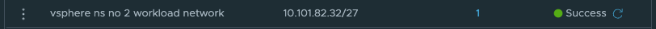

The above screenshot illustrates a static route defined on the Tier-0 where the Supervisor workload network is placed below behind a Tier-1 gateway. The ip subnet is the workload network cidr/subnet of a vSphere Namespace placed on a different Tier-0 router (its actual ip subnet, not the NAT ip addresses). 


The above static route is created on the second Tier-0 where the vSphere Namespace number 2 is created and placed. This route is pointing to the actual IP subnet/cidr of the Supervisor workload network, not the NAT address. 
Just to mention it, common for both these routes is that they are using the linknet interfaces of the Tier-0s respectively. 
But how? We have this no SNAT rule, but at the same time we have a route-map denying any segment used by a NAT enable vSphere Namespace workload network to be advertised/exposed outside the Tier-0. Yes, exactly, outside the Tier-0. By using the linknet between the Tier-0s for our static routes we are simply telling the Tier-0 routers to go to their respective Tier-0 when it needs to find the respective vSphere Namespace workload networks. The idea here is that the Tier-0s are the "all-seeing-eye" and they truly are. All the T1 gateways configured by NCP/WCP will enable 4 route advertisements, all connected segments, NAT IPs, LB VIPS and Static Routes. This means that all the Tier1 gateways will happily tell the Tier-0 about their networks/subnets/ip addresses they know of to the Tier-0. So when we just create a static route like the two above (e.g 10.101.82.32/27 via linknet interface) the Tier-0 router that is defined as next-hop know exactly where this network is located, which T1 gateway it needs to send it to regardless of NAT rules and route-maps. 

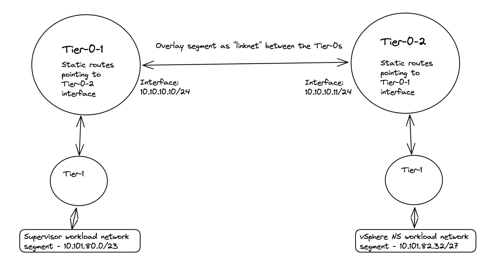

Nice, right?
This means we dont need to interfere with these static routes in the physical routers, they were supposed to be NAT'ed right? So we dont want them in our physical routers anyway. This traffic will then never leave the "outside" of the Tier-0s via their uplinks connected to their respective BGP/Upstream routers as we are using the "linknet" between them. 
And also, did I mention that there will be created a route-map on the Tier-0 for the vSphere Namespace Networks with corresponding IP-prefix lists prohibiting the workload networks ip subnets to be advertised through BGP/OSPF from the Tier-0 and its upstream bgp neigbours. 

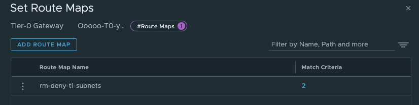

How will this go then, if we cant by any reason use a linknet between the Tier-0s for these static routes and need to define them in the physical routers? Well that is an interesting question. Let us try to dive into that topic also.
Did I mention that we can also decide to disable NAT completely? Well that is also a perfectly fine option. This could also give other benefits for the environments where it is is needed to have these routes in the physical network due to policies, requirements etc. We can create much more granular firewall policies in the perimeter firewalls when we know each node will egress with their actual IP instead of being masked by a NAT ip address. If being masked by a NAT ip address we cant for sure really know which node it is, we can only know that it potentially comes from any node in a vSphere Namespace where this egress subnet is defined (and that can potentially be a couple). Remember how the SNAT rules look like (maybe not as I haven't shown a screenshot of it yet :smile:)?


Also, we dont need to create any static routes, it will be auto advertised by BGP (if using BGP) each time we create a new vSphere Namespace.

But, there is a possibilty to still use static routes, or inject them via BGP in the physical network. We need to define the static routes with the correct subnets, pointing to the NAT'ed vSphere Namespace workload network and egress subnet/cidr. 
So in my physical router I would need to create these rules:


```bash
ip route 10.101.80.0/23 10.101.4.10 #Workload network Default vSphere Namespace via Tier-0 Uplink(s)
ip route 10.101.91.0/24 10.101.4.10 #Egress cidr Default vSphere Namespace via Tier-0 Uplink(s)
```

These are the needed static routes for the Supervisor Workload and egress network to be configured in the physical router, if you happen to create a vSphere Namespace which is not NAT'ed these are the only routes needed. If your other vSphere Namespace is also NAT'ed you need to create the routes accordingly for this Namespace also. 

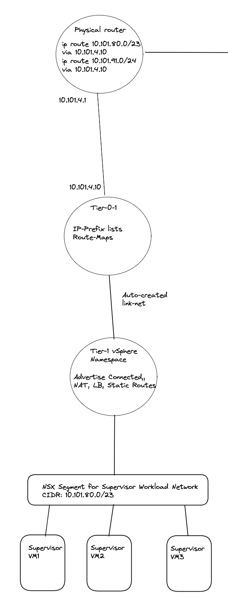

Illustration of static routes in the physical network between two Tier-0s and two NAT enabled vSphere Namespaces:

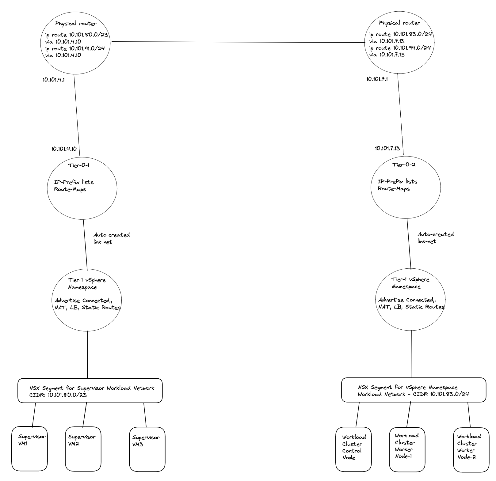

If using routed or a NAT disabled vSphere Namespace, the life will be much easier if using BGP on your Tier-0s.

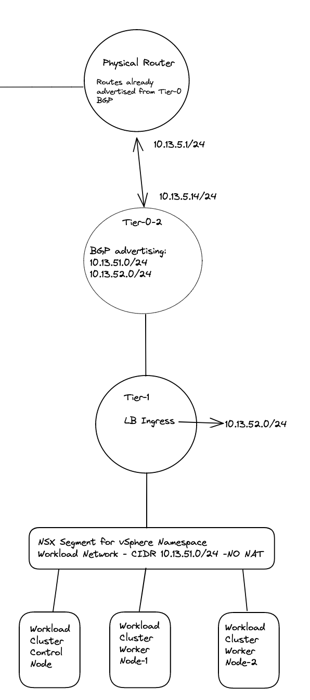


{}

There was a reason you decided to use NAT? When defining these static routes the network which are supposed to not be routed outside the Tier-0s will now suddenly be routed and exposed in your network. Is that something you want? Then you maybe should opt for no NAT anyway? 

{}

{}

Some notes on BFD with NSX and BGP/Static routes [here](https://docs.vmware.com/en/VMware-NSX/4.1/administration/GUID-E7CAD615-D96A-4DE4-811D-D8D743634F35.html?hWord=N4IghgNiBcIMoBcwIJYGMAEAlA9gVwQFMMAhAMQBEMAFQwgJxAF8g)

 

{}


This part can be a bit confusing if not fully understanding how network traffic works in Tanzu with vSphere and NSX. Hopefully I managed to explain it so its more understandable. 

As long as we are only using just one Tier-0 router for all our vSphere Namespaces, regardless of how many different subnets we decide to create pr vSphere Namespace they will be known by the same Tier-0 as the Tier-1 will be default configured to advertise to the Tier-0 its connected networks, yes it also advertise NAT IPs and LoadBalancer IPs but these are also configured on the Tier-0 to be further advertised to the outside world. Its only the Tier-0 that can be configured with BGP, as it is only the Tier-0 that can be configured to talk to the outside world (external network) by a SR T0 using interfaces on the NSX edges (VM or Bare-Metal). This means there is no need for us to create any routes either on the Tier-1 or Tier-0 when creating different vSphere Namespaces with different subnets. But I would not have anything to write about if we just decided to use only one Tier-0 router, would I? :grin:

Now when all this is clear as day, let us head over to the actual installation and configuration of this. 


## NSX and Tanzu configurations with different individual Tier-0s

I assume a fully functional  Tanzu environment is running with the default Workload network configured with NAT and NSX is the networking component. For this exercise I have prepared my lab to look like this "networking wise":

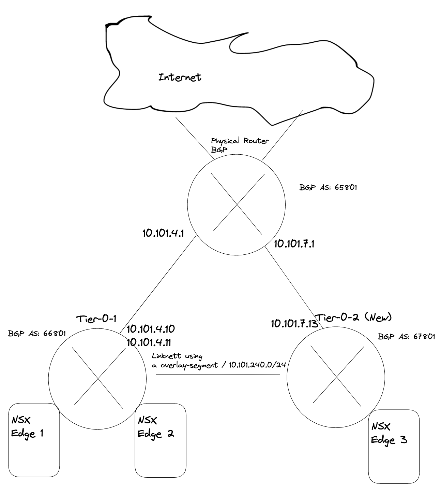


I will deploy two new vSphere Namespaces where I select override Supervisor Network and choose the Tier-0-2 which is another Tier-0 router than my  Supervisor workload network is on (this is using the first Tier-0 router)

In my lab I use the following IP addresses for the following components:

{}

- Tanzu Management network: 10.101.10.0/24 - connected to a NSX overlay segment - manually created by me
- Tanzu Workload network (the default Workload network): 10.101.80.0/23 (could be smaller) - will be created automatically as a NSX overlay segment. 
- Ingress: 10.101.90.0/24
- Egress: 10.101.91.0/24 I am doing NAT on this network (important to have in mind for later)
- The first Tier-0 has been configured to use uplinks on vlan 1014 in the following cidr: 10.101.4.0/24 
- The second Tier-0 (Tier-0-2) will be using uplink on vlan 1017 in the follwing cidr: 10.101.7.0/24
- Second vSphere Namespace - will be using Tier-0-2 and NAT disabled
- Second vSphere Namespace Workload network: 10.101.82.0/24
- Second vSphere Namespace ingress network: 10.101.92.0/24
- Third vSphere Namespace - will be using Tier-0-2 and NAT enabled
- Third vSphere Namespace Workload network: 10.101.83.0/24
- Third vSphere Namespace ingress network: 10.101.93.0/24
- Third vSphere Namespace egress network: 10.101.94.0/24 (where the NAT rules will be created)

{}

Using dedicated Tier-0 means we need to deploy additional edges, either in the same NSX edge cluster or a new edge cluster. This can generate some compute and admin overhead. But in some environments its not "allowed" to share two different network classifications over same devices. So we need separate edges for our different Tier-0s. But again, with TKGs we cannot deploy our TKC clusters on other vSphere clusters than our Supervisor cluster has been configured on, so the different TKC cluster will end up on the same shared compute nodes (ESXi). But networking wise they are fully separated.  

### Deploy new Edge(s) to support a new Tier-0

As this is my lab, I will not deploy redundant amount of Edges, but will stick with one Edge just to get connectivity up and working. NSX Edge do not support more than 1 SR T0 pr Edge, so we need 1:1 mapping between the SR T0 and Edge. And take into consideration if running this in production we must accommodate potential edge failovers, so we should atleast have two edges responsible for a T0. If running two Tier-0 in an edge cluster we should have 4 edges (if one of them fail).  
The first thing we need to do is to deploy a new Edge vm from the NSX manager. The new edge will be part of my "common" overlay transportzone as I cant deploy any TKC cluster on other vSphere clusters than where my Supervisor cluster has been enabled. For the VLAN transportzones one can reuse the existing Edge vlan transportzone and the same profile so they get their correct TEP VLAN. For the Uplinks it can be same VLAN trunkport (VDS or NSX VLAN segment) if the vlan trunk range includes the VLAN for the new T0 uplink.

So my new edge for this second T0 will be deployed like this:


After the Edge has been deployed its time to create a Edge cluster. 


Now we need to create a new segment for the coming new Tier-0 router and the Tier-0 linknet:

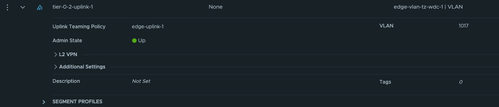

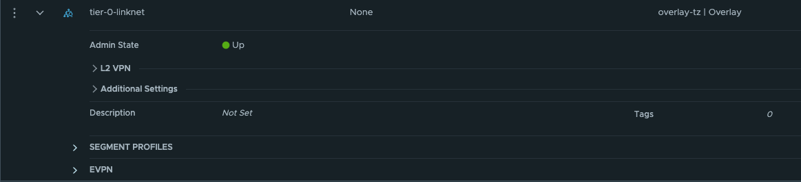

The first segment has been configured to use the edge-vlan-transportzone, and this vlan will be used to peer with the upstream router. The second segment is just a layer 2 overlay segment to be used for link between the two Tier-0s.

Now we can go ahead and create the new Tier-0:

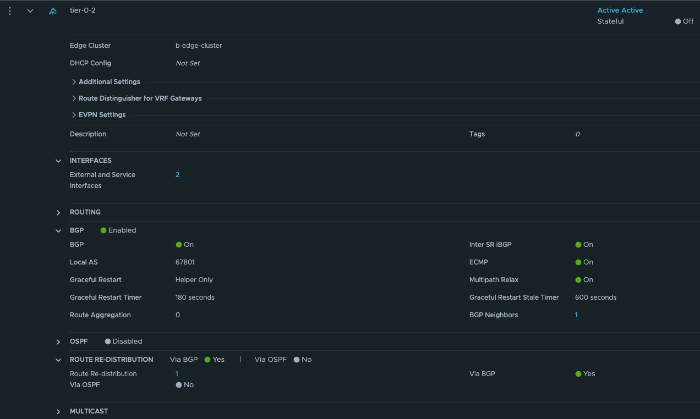


Give the Tier-0 a name, select your new Edge cluster. Save and go back to edit it.
We need to add the two interfaces uplink to upstream router and link interface between the two tier-0s: 
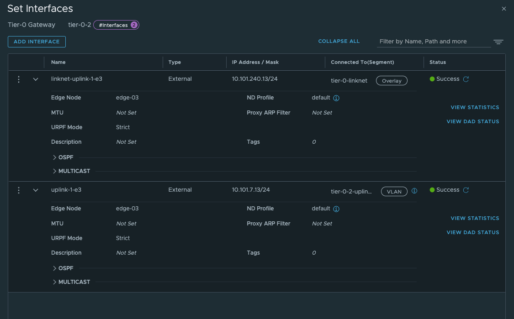

Give the interfaces a name, IP address and select the segments we created above for the new Tier-0 uplinks.
Select the Edge node and Save
Now we have the interfaces, to test if it is up and running you can ping it from your upstream router. The only interface that can be reached is the uplink interface 10.101.7.13. 
Next configure BGP and the BGP peering with your upstream router:

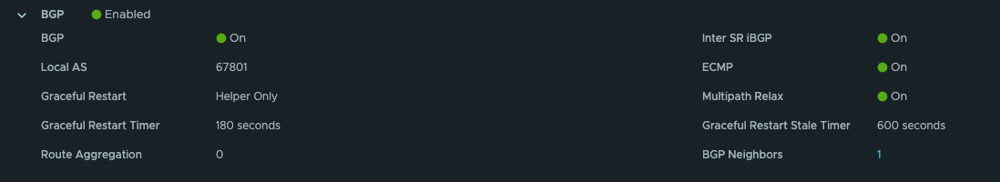

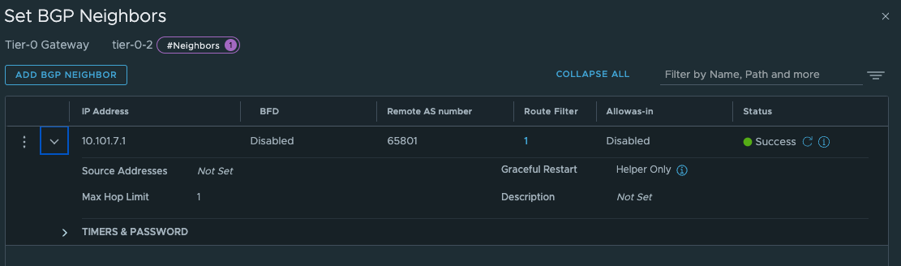

The last thing we need to do in our newly created Tier-0 is to create a static route that can help us reach the Workload Network on the Supervisor Control Plane nodes on their actual IP addresses (remember our talk above?). 
On the newly created Tier-0 (Tier-0-2) click on Routing -> Static Routes and add the following route (Supervisor workload network): 

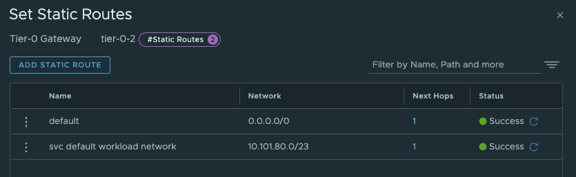


And the next-hop is defined with the ip of the other (first) Tier-0 interface on the "linknet" interface between the T0s (not configured on the first Titer-0 yet):

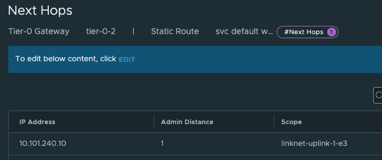

Add and Save.


Now on the first Tier-0 we need a second interface (or two depending on the amount of edges) in the linknet we created earlier. 

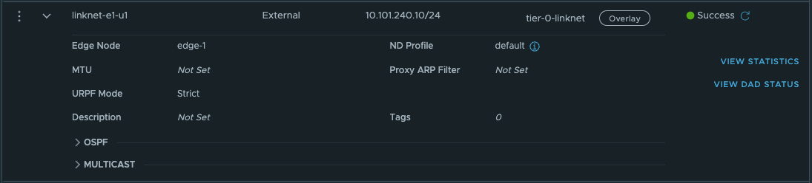 

Name it, ip address 
Select the edge(s) that will have this/these new interface(s).
Save.

Next up is the route:
These route should point to the vSphere workload network cidrs we defined when we created the vSphere Namespaces. The correct cidr is something we get when we create the vSphere Namespace (it is based on the Subnet prefix you configure) 

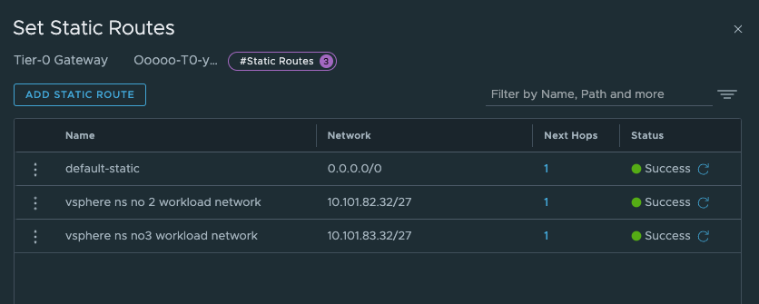


And next-hop (yes you guessed correct) is the linknet interface on the new Tier-0.

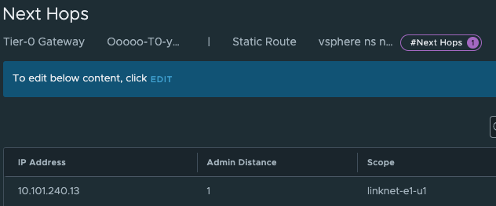

I create the static routes for both the vSphere Namespaces, and I know that it will start using the second /27 subnet in the /24 workload network cidr for the first cluster in each namespace.

So we should have something like this now:

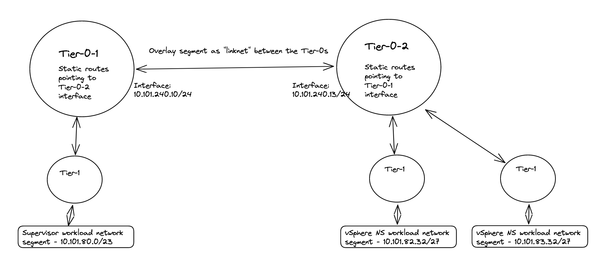


As mentioned above, these routes is maybe easier to create after we have created the vSphere Network with the correct network definition as we can see them being realized in the NSX manager. 

{}

By adding these static routes on the T0 level as I have done, means this traffic will never leave the Tier-0s, it will go over the linknet between the Tier-0s

{}

{}

These routes are necessary for the Supervisor and the TKC cluster to be able to reach each others. If they cant, deployment of the TKC clusters will fail, it will just deploy the first Control Plane node and stop there)

{}


### Create a vSphere Namespace to use our new Tier-0

Head over to vCenter -Workload Management and create a new Namespace:


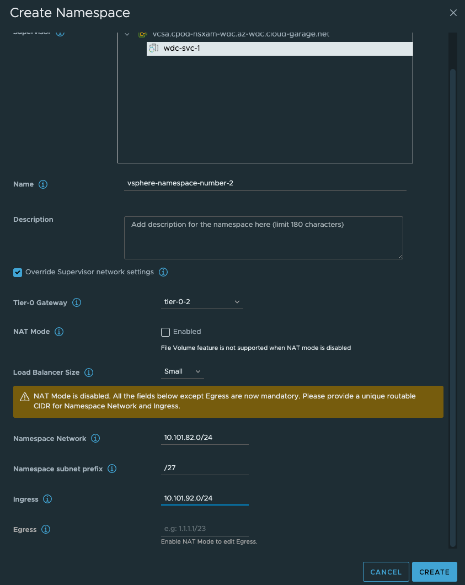

As soon as that is done, go ahead and create the third vSphere Namespace with NAT enabled:


Give the NS'es a dns compliant name, select the *Override Supervisor network settings*. From the dropdown select our new Tier-0 router.
Uncheck NAT on the vSphere NS number 2 (dont need NAT). Fill in the IP addresses you want to use for the TKC worker nodes, and then the ingress cidr you want. On the vSphere NS number 2 enable NAT and populate an egress cidr also. 

Click Create. Wait a couple of second and head over to NSX and check what has been created there.

In the NSX Manager you should now see the following:

Network Topology:

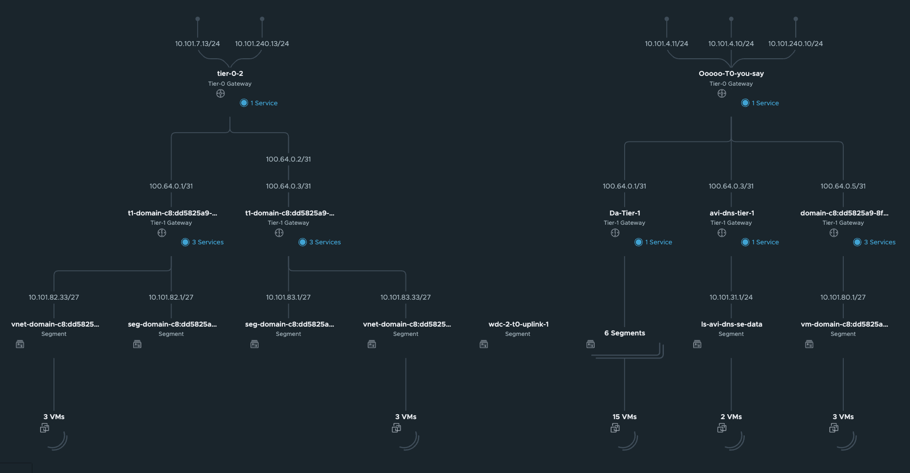


Segments

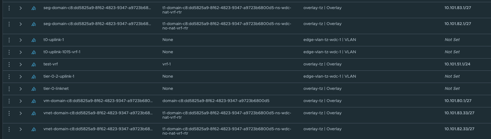

These network is automatically created by NCP, and the first /27 segment in all vSphere Namespace created will be reserved for Supervisor services, like vSphere pods etc.
The second /27 segment is the first available network for the workload clusters. This will in my case start at 10.101.82.32/27 and 10.101.83.32/27 accordingy. 

Under LoadBalancing we also got a couple of new objects:

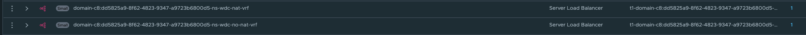

This is our ingress for the workload cluster Kubernetes API. 


Under Tier-1 gateways we have new Tier-1 gateways:

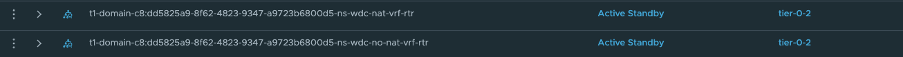

 

Now it is time to deploy your new TKC cluster with the new Tier-0. Its the same procedure as every other TKC cluster. Give it a name and place it in the correct Namespace:

```yaml
apiVersion: cluster.x-k8s.io/v1beta1
kind: Cluster
metadata:
  name: stc-tkc-cluster-dmz
  namespace: stc-ns-dmz
spec:
  clusterNetwork:
    services:
      cidrBlocks: ["20.30.0.0/16"]
    pods:
      cidrBlocks: ["20.40.0.0/16"]
    serviceDomain: "cluster.local"
  topology:
    class: tanzukubernetescluster
    version: v1.23.8---vmware.2-tkg.2-zshippable
    controlPlane:
      replicas: 1
      metadata:
        annotations:
          run.tanzu.vmware.com/resolve-os-image: os-name=ubuntu
    workers:
      machineDeployments:
        - class: node-pool
          name: node-pool-01
          replicas: 2
          metadata:
            annotations:
              run.tanzu.vmware.com/resolve-os-image: os-name=ubuntu
    variables:
      - name: vmClass
        value: best-effort-small #machineclass, get the available classes by running 'k get virtualmachineclass' in vSphere ns context
      - name: storageClass
        value: vsan-default-storage-policy
```


Then it is just running: 

```bash
kubectl apply -f yaml.file
```

And a couple of minutes later (if all preps have been done correctly) you should have a new TKC cluster using the new T0. 


## NSX and Tanzu configurations with NSX VRF

In NSX-T 3.0 VRF was a new feature, and configuring it was a bit cumbersome, but already from NSX-T 3.1 adding and configuring a VRF Tier-0 is very straightforward. The benefit of using VRF is that it does not dictate the requirement of additional NSX Edges, and we can create many VRF T0s. We can "reuse" the same Edges that has already been configured with a Tier-0. Instead a VRF T0 will be linked to that already existing Tier-0 which will then be the Parent Tier-0. Some settings will be inherited from the parent Tier-0 like BGP AS number for NSX-T versions before 4.1. From NSX-T 4.1 it is now also possible to override the BGP AS number in the VRF-T0, its no longer tied to the parent T0s BGP AS. We can achieve ip-separation by using individual uplinks on the VRF Tier-0s and peer to different upstream routers than our parent Tier-0. The VRF Tier0 will have its own Tier-1 linked to it. So all the way from the physical world to the VM we have a dedicated ip network. To be able to configure VRF Tier-0 we need to make sure the uplinks our Edges have been configured with have the correct vlan trunk range so we can create dedicated VRF Tier0 uplink segments in their respective vlan. The VRF Tier0 will use the same "physical" uplinks as the Edges have been configured with, but using different VLAN for the Tier-0 uplinks. I will go through how I configre VRF T0 in my environment. Pr default there is no route leakage between the parent Tier-0 and the VRF-T0 created, if you want to exhange routes between them we need to create those static routes ourselves. Read more about NSX VRF [here](https://docs.vmware.com/en/VMware-NSX/4.1/administration/GUID-8C060C35-1AD2-4B71-AB15-C551F392E528.html). 

{}

From NSX-T 4.1 it is now also possible to override the BGP AS number in the VRF-T0, its no longer tied to the parent T0s BGP AS

{}

In this part of my lab I use the following IP addresses for the following components:

{}

- Tanzu Management network: 172.21.103.0/24 - connected to a VDS port group - manually created by me
- Tanzu Workload network (the initial Workload network): 10.103.100.0/23 - will be created automatically as a NSX overlay segment. 
- Ingress: 10.103.200.0/24
- Egress: 10.103.201.0/24 I am doing NAT on this network (important to have in mind for later)
- The first Tier-0 has been configured to use uplinks on vlan 1034 in the following cidr: 10.103.4.0/24 
- The VRF Tier-0 will be using uplink on vlan 1035 in the follwing cidr: 10.103.5.0/24

{}

Here is a digram showing high-level how VRF-T0 looks like:


The Edge VM network config:


### Configure VRF Tier-0 in NSX

Head over the NSX manager -> Networking -> Tier-0 Gateways and click Add Gateway:


Then give it a name and select the parent Tier0:


Click save.

Now head over to Segments and create the VRF-Tier0 Uplink segment:


Give it a name, select the Edge VLAN Transportzone and enter the VLAN for the VRF T0-uplink (you can also create a vlan Trunk range here instead of creating two distinct segments for both uplinks). In my lab I will only use one uplink. 

Click save

Now head back to your VRF T0 again and add a interface:


Give it a name, select external, enter the IP for the uplink you will use to peer with your upstream router, then select the segment created earlier. Select the Edge that will get this interface. Notice also the Access VLAN ID field. There is no need to enter the VLAN here as we only defined one VLAN in our segment, had we created a VLAN range we need to define a VLAN here. It discovers the correct VLAN as we can see. Click save. Remember that for this VLAN to "come through" the Edge needs to be on a trunk-port that allows this VLAN. 

You can verify the L2 connectivity from your router:

```bash
root@cpodrouter-v7n31 [ ~ ]# ping 10.103.5.10
PING 10.103.5.10 (10.103.5.10) 56(84) bytes of data.
64 bytes from 10.103.5.10: icmp_seq=1 ttl=64 time=4.42 ms
64 bytes from 10.103.5.10: icmp_seq=2 ttl=64 time=0.627 ms
64 bytes from 10.103.5.10: icmp_seq=3 ttl=64 time=0.776 ms
^C
--- 10.103.5.10 ping statistics ---
3 packets transmitted, 3 received, 0% packet loss, time 10ms
rtt min/avg/max/mdev = 0.627/1.939/4.416/1.752 ms
```


Now that we have verified that its time for BGP to configured in our upstream router and in our VRF Tier-0. 
I have already configured my upstream router to accept my VRF T0 as a BGP neighbour, I just need to confgure BGP on my new VRF Tier-0.
In the VRF Tier-0 go to BGP and add a bgp neighbour (notice that we need to enable BGP, not enabled by default, and you cant change the BGP as number):


Click save.


```bash
Neighbor        V         AS MsgRcvd MsgSent   TblVer  InQ OutQ Up/Down  State/PfxRcd
10.103.4.10     4 66803     336     345        0    0    0 05:30:33        3
10.103.5.10     4 66803       2      19        0    0    0 00:01:38        0
172.20.0.1      4 65700     445     437        0    0    0 07:09:43       74
```


My new neighbour has jouined the party. Now just make sure it will advertise the needed networks. Lets configure that:
In the VRF T0, click *route re-distribution* and SET


Now my new VRF-Tier 0 is ready to route and accept new linked Tier-1s. How does it look like in the NSX map?


Looking good.

Let us get back to this picture when we have deployed a TKC cluster on it. 

### Create a vSphere Namespace to use our new VRF Tier-0

This will be the same approach as above [here](https://blog.andreasm.io/2023/04/14/tanzu-with-vsphere-and-different-tier-0s/#create-a-vsphere-namespace-to-use-our-new-tier-0) only difference is we are selecting a VRF Tier0 instead.


Here I have selected the VRF Tier-0 and defined the network for it. I have disabled NAT. 

Now what have happened in NSX? Lets have a look.
The network topology has been updated:


A new Tier-1 has been created:


And ofcourse the loadbalancer interface:


But the most interesting part is the static routes being created. Let us have a look at these.

In the VRF T0 it has created two additonal static routes: 


Those to routes above points to the Supervisor Workload network and the Supervisor Ingress network. Next hop is:


These are the Tier0-Tier-1 transit net interface:


What static routes have been configured on the parent Tier-0?


And next-hop is:


These routes are pointing to the new vSphere Namespace network, and Ingress network we defined to use the new VRF-Tier0. 

High-level overview of the static routes being created automatically by NCP:


When the TKC cluster is deployed the NSX map will look like this:


A new segment as been added (vnet-domain-c8:5135e3cc-aca4-4c99-8f9f-903e68496937-wdc-ns-1-vrf-wdc-cl-58aaa-0), which is the segment where the TKC workers have been placed. Notice that it is using a /27 subnet as defined in the Namespace Subnet Prefix above. The first segment (/27 chunk) (seg-domain-xxxxx) is always reserved for the Supervisor Services/vSphere Pods. As I decided not to use NAT I can reach the worker nodes IP addresses directly from my management jumpbox (if allowed routing/firewall wise). Note that ping is default disabled/blocked. So to test connectivity try port 22 with SSH/curl/telnet etc. 


```bash
andreasm@linuxvm01:~/tkgs_vsphere7$ ssh 10.103.51.34
The authenticity of host '10.103.51.34 (10.103.51.34)' can't be established.
ECDSA key fingerprint is SHA256:qonxA8ySCbic0YcCAg9i2pLM9Wpb+8+UGpAcU1qAXHs.
Are you sure you want to continue connecting (yes/no/[fingerprint])?
```

But before you can reach it directly you need to allow this with a firewall rule in NSX as there is a default block rule here:


In order to "override" this rule we need to create a rule earlier in the NSX Distributed Firewall. Below is just a test rule I created, its far to open/liberal of course:


The group membership in the above rules is just the vnet-domain-c8:5135e3cc-aca4-4c99-8f9f-903e68496937-wdc-ns-1-vrf-wdc-cl-58aaa-0 segment where my TKC workers in this namespace will reside. So if I scale down/up this cluster the content will be dynamically updated. I dont have to update the rule or security group, its done automatic. 


## Firewall openings - network diagram


I will get back and update this section with a table and update the diagram with more details.


## Troubleshooting

To troubleshoot networking scenarios with Tanzu it can sometimes help to SSH into the Supervisor Controlplane VMs and the TKC worker nodes. When I tested out this multi Tier-0 setup I had an issue that only the control plane node of my TKC cluster were being spun up, it never came to deploying the worker nodes. I knew it had to do with connectivity between the Supervisor and TKC.
I used NSX Traceflow to verify that connectivity worked as intended which my traceflow in NSX did show me, but still it did not work. So sometimes it is better to see whats going on from the workloads perspective themselves. 

### SSH Supervisor VM

To log in to the Supervisor VMs we need the root password. This password can be retreived from the vCenter server. SSH into the vCenter server:

```bash
root@vcsa [ /lib/vmware-wcp ]# ./decryptK8Pwd.py
Read key from file

Connected to PSQL

Cluster: domain-c35:dd5825a9-8f62-4823-9347-a9723b6800d5
IP: 172.21.102.81
PWD: PASSWORD-IS-HERE
------------------------------------------------------------

Cluster: domain-c8:dd5825a9-8f62-4823-9347-a9723b6800d5
IP: 10.101.10.21
PWD: PASSWORD-IS-HERE
------------------------------------------------------------
```

Now that we have the root password one can log into the Supervisor VM with SSH and password through the Management Interface (the Workload Interface IP is probably behind NAT so is not reachable OOB):

```bash
andreasm@andreasm:~/from_ubuntu_vm/tkgs/tkgs-stc-cpod$ ssh root@10.101.10.22
The authenticity of host '10.101.10.22 (10.101.10.22)' can't be established.
ED25519 key fingerprint is SHA256:vmeHlDgquXrZTK3yyevmY2QfISW1WNoTC5TZJblw1J4.
This key is not known by any other names
Are you sure you want to continue connecting (yes/no/[fingerprint])?
```

And from in here we can use some basic troubleshooting tools to verify if the different networks can be reached from the Supervisor VM. In the example below I try to verify if it can reach the K8s API VIP for the TKC cluster deployed behind the new Tier-0. I am adding *--interface eth1* as I want to specifically use the Workload Network interface on the SVM. 

```bash
curl --interface eth1 https://10.13.52.1:6443
```

 The respons should be immediate, if not you have network reachability issues:

```bash
curl: (28) Failed to connect to 10.13.52.1 port 6443 after 131108 ms: Couldn't connect to server
```

What you should see is this:

```bash
root@423470e48788edd2cd24398f794c5f7b [ ~ ]# curl --interface eth1 https://10.13.52.1:6443
curl: (60) SSL certificate problem: unable to get local issuer certificate
More details here: https://curl.se/docs/sslcerts.html

curl failed to verify the legitimacy of the server and therefore could not
establish a secure connection to it. To learn more about this situation and
how to fix it, please visit the web page mentioned above.
```

 

### SSH TKC nodes

The nodes in a TKC cluster can also be SSH'ed into. If you dont do NAT on your vSphere Namespace network they can be reach directly on their IPs (if from where your SSH jumpbox is allowed routing wise/firewall wise). But if you are NAT'ing then you have to place your SSH jumpbox in the same segment as the TKC nodes you want to SSH into. Or add a second interface on your jumpbox placed in this network. The segment is created in NSX and is called something like this:


To get the password for the TKC nodes you can get them with kubectl like this:
Put yourselves in the context of the namespace where your workload nodes is deployed:

```bash
andreasm@andreasm:~$ vsphere-kubectl login --server=10.101.11.2 --insecure-skip-tls-verify --vsphere-username=andreasm@cpod-nsxam-wdc.az-wdc.cloud-garage.net --tanzu-kubernetes-cluster-namespace ns-wdc-1-nat

```

```bash
andreasm@andreasm:~$ k config current-context
tkc-cluster-nat
```

Then get the SSH secret:

```bash
andreasm@andreasm:~$ k get secrets
NAME                                                   TYPE                                  DATA   AGE
default-token-fqvbp                                    kubernetes.io/service-account-token   3      127d
tkc-cluster-1-antrea-data-values                       Opaque                                1      127d
tkc-cluster-1-auth-svc-cert                            kubernetes.io/tls                     3      127d
tkc-cluster-1-ca                                       cluster.x-k8s.io/secret               2      127d
tkc-cluster-1-capabilities-package                     clusterbootstrap-secret               1      127d
tkc-cluster-1-encryption                               Opaque                                1      127d
tkc-cluster-1-etcd                                     cluster.x-k8s.io/secret               2      127d
tkc-cluster-1-extensions-ca                            kubernetes.io/tls                     3      127d
tkc-cluster-1-guest-cluster-auth-service-data-values   Opaque                                1      127d
tkc-cluster-1-kapp-controller-data-values              Opaque                                2      127d
tkc-cluster-1-kubeconfig                               cluster.x-k8s.io/secret               1      127d
tkc-cluster-1-metrics-server-package                   clusterbootstrap-secret               0      127d
tkc-cluster-1-node-pool-01-bootstrap-j2r7s-fgmm2       cluster.x-k8s.io/secret               2      42h
tkc-cluster-1-node-pool-01-bootstrap-j2r7s-r5lcm       cluster.x-k8s.io/secret               2      42h
tkc-cluster-1-node-pool-01-bootstrap-j2r7s-w96ft       cluster.x-k8s.io/secret               2      42h
tkc-cluster-1-pinniped-package                         clusterbootstrap-secret               1      127d
tkc-cluster-1-proxy                                    cluster.x-k8s.io/secret               2      127d
tkc-cluster-1-sa                                       cluster.x-k8s.io/secret               2      127d
tkc-cluster-1-secretgen-controller-package             clusterbootstrap-secret               0      127d
tkc-cluster-1-ssh                                      kubernetes.io/ssh-auth                1      127d
tkc-cluster-1-ssh-password                             Opaque                                1      127d
tkc-cluster-1-ssh-password-hashed                      Opaque                                1      127d
```

I am interested in this one:

```bash
tkc-cluster-1-ssh-password
```

 So I will go ahead and retrieve the content of it:

```bash
andreasm@andreasm:~$ k get secrets tkc-cluster-1-ssh-password -oyaml
apiVersion: v1
data:
  ssh-passwordkey: aSx--redacted---KJS=    #Here is the ssh password in base64
kind: Secret
metadata:
  creationTimestamp: "2022-12-08T10:52:28Z"
  name: tkc-cluster-1-ssh-password
  namespace: stc-tkc-ns-1
  ownerReferences:
  - apiVersion: cluster.x-k8s.io/v1beta1
    kind: Cluster
    name: tkc-cluster-1
    uid: 4a9c6137-0223-46d8-96d2-ab3564e375fc
  resourceVersion: "499590"
  uid: 75b163a3-4e62-4b33-93de-ae46ee314751
type: Opaque
```

Now I just need to decode the base64 encoded pasword:

```bash
andreasm@andreasm:~$ echo 'aSx--redacted---KJS=' |base64 --decode
passwordinplaintexthere=andreasm@andreasm:~$
```

Now we can use this password to log in to the TKC nodes with the user: vmware-system-user

```bash
ssh vmware-system-user@10.101.51.34
```


## DCLI - VMware Datacenter CLI

If you happen to find different tasks easier to perform from CLI instead of GUI I will show here how to create a new vSphere Namespace by using DCLI from the VCSA appliance (vCenter Server). For more information and reference on dcli look [here](https://developer.vmware.com/web/tool/3.0.0/vmware-datacenter-cli).

Log in to your vCenter hosting your Supervisor Cluster with SSH and enter shell:

```bash
andreasm@andreasm:~/$ ssh root@vcsa.cpod-v7n31.az-wdc.cloud-garage.net

VMware vCenter Server 7.0.3.01000

Type: vCenter Server with an embedded Platform Services Controller

(root@vcsa.cpod-v7n31.az-wdc.cloud-garage.net) Password:
Connected to service

    * List APIs: "help api list"
    * List Plugins: "help pi list"
    * Launch BASH: "shell"

Command> shell
Shell access is granted to root
root@vcsa [ ~ ]#
```

Type *dcli --help" to see some options:

```bash
root@vcsa [ ~ ]# dcli --help
usage: dcli [+server SERVER] [+vmc-server] [+nsx-server [NSX_SERVER]] [+org-id ORG_ID] [+sddc-id SDDC_ID] [+interactive] [+prompt PROMPT]
            [+skip-server-verification | +cacert-file CACERT_FILE] [+username USERNAME] [+password PASSWORD] [+logout] [+filter FILTER [FILTER ...]]
            [+formatter {yaml,yamlc,table,xml,xmlc,json,jsonc,jsonp,html,htmlc,csv}] [+verbose] [+log-level {debug,info,warning,error}] [+log-file LOG_FILE]
            [+generate-json-input] [+generate-required-json-input] [+json-input JSON_INPUT] [+credstore-file CREDSTORE_FILE]
            [+credstore-add | +credstore-list | +credstore-remove] [+session-manager SESSION_MANAGER] [+configuration-file CONFIGURATION_FILE] [+more]
            [args [args ...]]

VMware Datacenter Command Line Interface

positional arguments:
  args                  CLI command

optional arguments:
  +server SERVER        Specify VAPI Server IP address/DNS name (default: 'http://localhost/api')
  +vmc-server           Switch to indicate connection to VMC server (default VMC URL: 'https://vmc.vmware.com')
  +nsx-server [NSX_SERVER]
                        Specify NSX on VMC Server or on-prem instance IP address/DNS name (default: 'None')
  +org-id ORG_ID        Specify VMC organization id to connect to NSX instance. Works together with +sddc-id. (default: 'None')
  +sddc-id SDDC_ID      Specify VMC SDDC id to connect to NSX instance. Works together with +org-id. (default: 'None')
  +interactive          Open a CLI shell to invoke commands
  +prompt PROMPT        Prompt for cli shell (default: dcli> )
  +skip-server-verification
                        Skip server SSL verification process (default: False)
  +cacert-file CACERT_FILE
                        Specify the certificate authority certificates for validating SSL connections (format: PEM) (default: '')
  +username USERNAME    Specify the username for login (default: '')
  +password PASSWORD    Specify password explicitly (default: False)
  +logout               Requests delete session and remove from credentials store if stored. (default: False)
  +filter FILTER [FILTER ...]
                        Provide JMESPath expression to filter command output. More info on JMESPath here: http://jmespath.org
  +formatter {yaml,yamlc,table,xml,xmlc,json,jsonc,jsonp,html,htmlc,csv}
                        Specify the formatter to use to format the command output
  +verbose              Prints verbose output
  +log-level {debug,info,warning,error}
                        Specify the verbosity for log file. (default: 'info')
  +log-file LOG_FILE    Specify dcli log file (default: '/var/log/vmware/vapi/dcli.log')
  +generate-json-input  Generate command input template in json
  +generate-required-json-input
                        Generate command input template in json for required fields only
  +json-input JSON_INPUT
                        Specifies json value or a json file for command input
  +credstore-file CREDSTORE_FILE
                        Specify the dcli credential store file (default: '/root/.dcli/.dcli_credstore')
  +credstore-add        Store the login credentials in credential store without prompting
  +credstore-list       List the login credentials stored in credential store
  +credstore-remove     Remove login credentials from credential store
  +session-manager SESSION_MANAGER
                        Specify the session manager for credential store remove operation
  +configuration-file CONFIGURATION_FILE
                        Specify the dcli configuration store file (default: '/root/.dcli/.dcli_configuration')
  +more                 Flag for page-wise output
root@vcsa [ ~ ]#
```

Enter DCLI interactive mode:
**All commands in dcli have autocomplete**

```bash
root@vcsa [ ~ ]# dcli +i +server vcsa.cpod-nsxam-stc.az-stc.cloud-garage.net +skip-server-verification
Welcome to VMware Datacenter CLI (DCLI)

usage: <namespaces> <command>

To auto-complete and browse DCLI namespaces:   [TAB]
If you need more help for a command:           vcenter vm get --help
If you need more help for a namespace:         vcenter vm --help
To execute dcli internal command: env
For detailed information on DCLI usage visit:  http://vmware.com/go/dcli

dcli>
```

Below shows how autocomplete works:

```bash
root@vcsa [ ~ ]# dcli +i +server vcsa.cpod-nsxam-stc.az-stc.cloud-garage.net +skip-server-verification
Welcome to VMware Datacenter CLI (DCLI)

usage: <namespaces> <command>

To auto-complete and browse DCLI namespaces:   [TAB]
If you need more help for a command:           vcenter vm get --help
If you need more help for a namespace:         vcenter vm --help
To execute dcli internal command: env
For detailed information on DCLI usage visit:  http://vmware.com/go/dcli

dcli> com vmware vcenter n
                           > namespacemanagement
                           > namespaces
                           > network
```


```bash
dcli> com vmware vcenter namespaces instances list
                                               list
                                               getv2
                                               update
                                               delete
                                               listv2
                                               createv2
                                               set
```

We can tab to autocomplete and/or use the "dropdown" list to scroll through the different options. Nice feature.

Create a vSphere Namespace from DCLI, selecting a VRF T0, configure name, network etc (as you would do from the GUI of vCenter in Workload Management):

```bash
dcli> com vmware vcenter namespaces instances create --cluster domain-c8 --namespace stc-cluster-vrf2 --namespace-network-network-ingress-cidrs '[{"address": "10.13.54.
0", "prefix":24}]' --namespace-network-network-load-balancer-size SMALL --namespace-network-network-namespace-network-cidrs '[{"address": "10.13.53.0", "prefix":24}]' -
-namespace-network-network-provider NSXT_CONTAINER_PLUGIN --namespace-network-network-nsx-tier0-gateway vrf-1 --namespace-network-network-routed-mode true --namespace-n
etwork-network-subnet-prefix-length 28
dcli>
```

To get the --cluster domain id run this:

```bash
dcli> com vmware vcenter namespaces instances list
|---------|-----------------------------------|----------------|-----------|----------------------|-------------|
|cluster  |stats                              |namespace       |description|self_service_namespace|config_status|
|---------|-----------------------------------|----------------|-----------|----------------------|-------------|
|domain-c8||--------|-----------|------------||stc-cluster-vrf |           |False                 |RUNNING      |
|         ||cpu_used|memory_used|storage_used||                |           |                      |             |
|         ||--------|-----------|------------||                |           |                      |             |
|         ||0       |0          |0           ||                |           |                      |             |
|         ||--------|-----------|------------||                |           |                      |             |
|domain-c8||--------|-----------|------------||stc-cluster-vrf2|           |False                 |RUNNING      |
|         ||cpu_used|memory_used|storage_used||                |           |                      |             |
|         ||--------|-----------|------------||                |           |                      |             |
|         ||0       |0          |0           ||                |           |                      |             |
|         ||--------|-----------|------------||                |           |                      |             |
|---------|-----------------------------------|----------------|-----------|----------------------|-------------|
dcli>
```

And seconds later the vSphere Namespace is created


## vCenter API - with Postman

vCenter has a nice feature included, the API Explorer. This can be found here:

Click on the hamburger Menu, and find Developer Center:


And from here we have all the API available to us:


Its a looooong list of available APIs. 

To be able to authenticate against vCenter with Postman we must create an API Key. So the first we need to do is "login" with post using the following api (this uses a username and password with sufficient acces to vCenter): 

```bash
https://{{vcenter-fqdn}}/api/session
```

In Postman one should create an environment that contains the vCenter IP/FQDN, username and password. 
So the first action is to POST this API to get the API Key, making sure you set Authorization to Basic Auth from your environment:


The response from this POST should be a token. From now you need to use this token to interact with vCenter API. Change the authentication to API Key and use *vmware-api-session-id* as Key and Token as value. 


Now lets try a GET and see if it works:


That worked out fine :smile:

What about creating a vSphere Namespace from Postman? 

Thats very easy, below is an example to create a new vSphere Namespace, and pointing it to my VRF Tier-0 router:

```json
{
	"access_list": [
		{
			"domain": "cpod-nsxam-stc.az-stc.cloud-garage.net",
			"role": "OWNER",
			"subject": "andreasm",
			"subject_type": "USER"
		}
	],
	"cluster": "domain-c8",
	"namespace": "stc-cluster-vrf2",
	"namespace_network": {
		"network": {
			"ingress_cidrs": [
				{
					"address": "10.13.54.0",
					"prefix": 24
				}
			],
			"load_balancer_size": "SMALL",
			"namespace_network_cidrs": [
				{
					"address": "10.13.53.0",
					"prefix": 24
				}
			],
			"nsx_tier0_gateway": "vrf-1",
			"routed_mode": true,
			"subnet_prefix_length": 28
		},
		"network_provider": "NSXT_CONTAINER_PLUGIN"
	}
}
```

Paste this into Postman (Body - Raw) and POST it to the following path https://{{vcenter-fqdn}}/api/vcenter/namespaces/instances and the new vSphere Namespace should be created in a jiff.


And in vCenter our new Namespace:


For references to the APIs in vCenter and a whole lot of details and explanations have a look [here](https://developer.vmware.com/apis/vsphere-automation/v8.0.0/vcenter/)!

