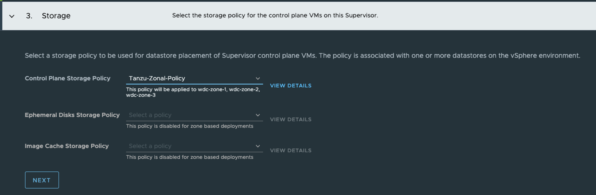
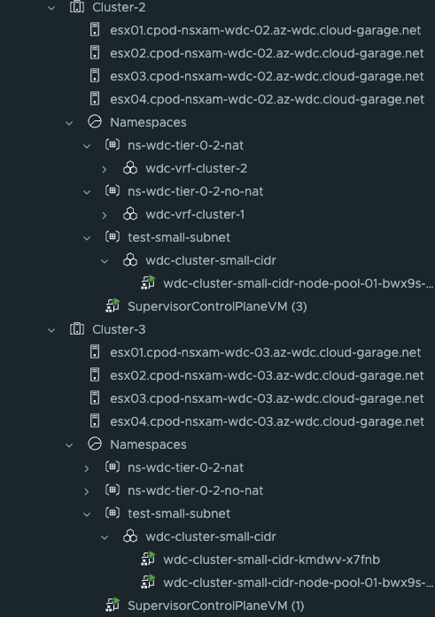

# vSphere with Tanzu and Multi-Zone 

This post will be a brief introduction of how we can deploy and configure vSphere with Tanzu on three vSphere clusters (vSphere Zones) to achieve better availability of the TKG clusters and Supervisor controlplane nodes. This feature came with Sphere 8, not available in vSphere 7.
There are some pre-reqs that needs to be in place for this to work in addition to the pre-reqs for deploying vSphere with Tanzu on a single vSphere cluster. I will list them below later.

From the official VMware [documentation](https://docs.vmware.com/en/VMware-vSphere/8.0/vsphere-with-tanzu-concepts-planning/GUID-3E4E6039-BD24-4C40-8575-5AA0EECBBBEC.html):

>  You can deploy a Supervisor on three vSphere Zones to provide cluster-level high-availability that protects your Kubernetes workloads against cluster-level failure. A vSphere Zone maps to one vSphere cluster that you can setup as an independent failure domain. In a three-zone deployment, all three vSphere clusters become one Supervisor. You can also deploy a Supervisor on one vSphere cluster, which will automatically create a vSphere Zone and map it to the cluster, unless you use a vSphere cluster that is already mapped to a zone. In a single cluster deployment, the Supervisor only has high availability on host level that is provided by vSphere HA. 


> On a three-zone Supervisor you can run Kubernetes workloads on Tanzu Kubernetes Grid clusters and VMs created by using the VM service. A three-zone Supervisor has the following components:
>
> - Supervisor control plane VM. Three Supervisor control plane VMs in total are created on the Supervisor. In a three-zone deployment, one control plane VM resides on each zone. The three Supervisor control plane VMs are load balanced as each one of them has its own IP address. Additionally, a floating IP address is assigned to one of the VMs and a 5th IP address is reserved for patching purposes. vSphere DRS determines the exact placement of the control plane VMs on the ESXi hosts part of the Supervisor and migrates them when needed.
> - Tanzu Kubernetes Grid and Cluster API. Modules running on the Supervisor and enable the provisioning and management of Tanzu Kubernetes Grid clusters.
> - Virtual Machine Service. A module that is responsible for deploying and running stand-alone VMs and VMs that make up Tanzu Kubernetes Grid clusters.


## Planning and deployment of a three-zone Supervisor

Before heading into the actual deployment, some pre-requirements needs to be in place. I will go through the important ones below such as storage, network and user-roles.

### vSphere ESXi clusters

A deployment of a three-zone Supervisor may also be referred to as multi-zone. This can maybe lead to the understanding that we may deploy vSphere with Tanzu multi-zone on 2 vSphere ESXi clusters or even 4 or higher number of vSphere clusters. The only number of vSphere clusters supported in a multi-zone Supervisor deployment (three-zone) is 3 vSphere clusters.

From the official documentation:

> - Create three vSphere clusters with at least 2 hosts. For storage with vSAN, the cluster must have 3 or 4 hosts.
> - Configure storage with vSAN or other shared storage solution for each cluster.
> - Enable vSphere HA and vSphere DRS on Fully Automate or Partially Automate mode.
> - Configure each cluster as an independent failure domain.
> - Configure networking with NSX or vSphere Distributed Switch (vDS) networking for the clusters.
>
>   


### Network

To be able to deploy a three-zone Supervisor an important requirement on the networking side is that all vSphere cluster to be used is connected to the same VDS. One VDS shared across all three vSphere clusters. 
From the official documentation:

>
> In a three-zone Supervisor configured with NSX as the networking stack, all hosts from all three vSphere clusters mapped to the zones must use be connected to the same VDS and participate in the same NSX Overlay Transport Zone. All hosts must be connected to the same L2 physical device.

Not sure what is meant with connecting to the same L2 physical device though...
But anyhow, this constraint can be a limiting factor and something to be aware of. Some explanations:

If you have an NSX environment with one common Overlay transportzone across all vSphere clusters, but configured with three individual VDS switches (1 specific VDS pr vSphere cluster) it is currently not supported. Having individual VDS switches pr cluster allows you to have only relevant portgroups in your vSphere clusters that are configured specifically for their respective clusters network, different vlans, placed in different racks and there is no L2 between them, only L3. The different vSphere clusters can be on different racks with different ToR switches, in a Spine-Leaf topology, different subnets/vlans configured for mgmt, vmotion, vSAN, Geneve tunnel VLAN, VM network and so on.

An example when having a dedicated VDS pr vSphere cluster:


the illustration above indicates that we have portgroups defined that is valid for the VLAN trunks configured to the attached ToR switches with the corresponding VLAN trunks. So there is no risk of using any of the portgroups defined in the respective VDS in any of the above two vSphere clusters to use VLAN portgoups that has not been defined in the ToR switches trunk-ports. That means you will not end up with any unrelevant portgroups not valid for the respective cluster they are being used in. All this depends on the vlan trunks configured in the ToR switches. There is no need to have portgroups spanning across different vSphere clusters with unrelevant vlan tags. They will just end up not getting anywhere, and create a lot of "noise" for the admin managing these portgroups. 

The example below illustrates one shared VDS across all vSphere clusters, where we have differentiating ToR VLAN trunks, configured pr rack. 


   

As we are using the same VDS across all clusters, all portgroups defined in this shared VDS is accessible and visible for all ESXi hosts participating in this VDS. This means they can easily be used, but they may not be the correct portgroups to be used for this cluster as the underlaying ToR switches may not have the correct vlan trunks for the ESXi hosts uplinks (pNICs).

That is just something to be aware of. If your ESXi hosts have been configured with more than two pNICs it is also possible to have one dedicated VDS pr cluster for services specificially for the respective ESXi clusters and one shared for services that are configured identically across the clusters. 

### Storage

From the official [documentation](https://docs.vmware.com/en/VMware-vSphere/8.0/vsphere-with-tanzu-concepts-planning/GUID-9F430B04-4427-416D-9B6E-FD879D4F88C0.html):

> When you prepare storage resources for the three-zone Supervisor, keep in mind the following considerations:
>
> - Storage in all three zones does not need to be of the same type. However, having uniform storage in all three clusters provides a consistent performance.
> - For the namespace on the three-zone Supervisor, use a storage policy that is compliant with the shared storage in each of the clusters. The storage policy must be topology aware.
> - Do not remove topology constraints from the storage policy after assigning it to the namespace.
> - Do not mount zonal datastores on other zones.
> - A three-zone Supervisor does not support the following items:
>   - Cross-zonal volumes
>   - vSAN File volumes (ReadWriteMany Volumes)
>   - Static volume provisioning using Register Volume API
>   - Workloads that use vSAN Data Persistence platform
>   - vSphere Pod
>   - vSAN Stretched Clusters
>   - VMs with vGPU and instance storage


### Permissions 

From the official documentation:

**vSphere Namespaces required privileges:**

| Privilege Name in the vSphere Client                         | Description                                                  | Required On                                                  | Privilege Name in the API     |
| :----------------------------------------------------------- | :----------------------------------------------------------- | :----------------------------------------------------------- | :---------------------------- |
| **Allows disk decommission operations**                      | Allows for decommissioning operations of data stores.        | Data stores                                                  | Namespaces.ManageDisks        |
| **Backup Workloads component files**                         | Allows for backing up the contents of the etcd cluster (used only in VMware Cloud on AWS). | Clusters                                                     | Namespaces.Backup             |
| **List accessible namespaces**                               | Allows listing the accessible vSphere Namespaces.            | Clusters                                                     | Namespaces.ListAccess         |
| **Modify cluster-wide configuration**                        | Allows modifying the cluster-wide configuration, and activating and deactivating cluster namespaces. | Clusters                                                     | Namespaces.ManageCapabilities |
| **Modify cluster-wide namespace self-service configuration** | Allows modifying the namespace self-service configuration.   | Clusters (for activating and deactivating)Templates(for modifying the configuration)vCenter Server(for creating a template) | Namespaces.SelfServiceManage  |
| **Modify namespace configuration**                           | Allows modifying namespace configuration options such as resource allocation and user permissions. | Clusters                                                     | Namespaces.Manage             |
| **Toggle cluster capabilities**                              | Allows manipulating the state of cluster capabilities (used internally only for VMware Cloud on AWS). | Clusters                                                     | NA                            |
| **Upgrade clusters to newer versions**                       | Allows initiation of the cluster upgrade.                    | Clusters                                                     | Namespaces.Upgrade            |

**vSphere Zones Privileges**

| Privilege Name in the vSphere Client                         | Description                                                  | Required On | Privilege Name in the API |
| :----------------------------------------------------------- | :----------------------------------------------------------- | :---------- | :------------------------ |
| **Attach and Detach vSphere objects for vSphere Zones**      | Allows for adding and removing clusters from a vSphere Zone. | Clusters    | Zone.ObjectAttachable     |
| **Create, Update and Delete vSphere Zones and their associations** | Allows for creating and deleting a vSphere Zone.             | Clusters    | Zone.Manage               |

**Supervisor Services Privileges**

| Privilege Name in the vSphere Client | Description                                                  | Required On | Privilege Name in the API |
| :----------------------------------- | :----------------------------------------------------------- | :---------- | :------------------------ |
| **Manage Supervisor Services**       | Allows for creating, updating, or deleting a Supervisor Service. Also allows for installing a Supervisor Service on a Supervisor, and creating or deleting a Supervisor Service version. | Clusters    | SupervisorServices.Manage |


## Deployment time

Now that we have gone through the requirements I will start det actual installation/deployment steps of vSphere with Tanzu in a three-zone setup. 
This post is assuming an already configured and working vSphere environment and NSX installation. Will only focus on the actual deployment of vSphere with Tanzu in a three-zone setup.

This is how my environment looks like on a vSphere level before enabling the three-zone Supervisor:


My vSphere cluster consists of three vSphere cluster with 4 esxi hosts each. They are all connected to the same Distributed Virtual Switch, but with different portgroups as their backend vlans is different between the clusters. The only common portgroups they share is all the overlay segments created from NSX (they are all part of the same Overlay TransportZone). Each cluster has its own VSAN datastore, not shared or stretched between the clusters. VSAN local to every vSphere cluster. 

## Enable three-zone Supervisor

### vSphere Zones

Before I can go ahead and enable a three-zone Supervisor I need to create the vSphere Zones which is done here:


Click on the vCenter in the inventory three -> Configure > vSphere Zones. 
From there I need to create three zones representing my three vSphere clusters. 
Click Add New vSphere Zone:


Then select the cluster it should apply to and finish. The end result looks like this:


### Storage policy

Now I need to create a storage policy for the Supervisor. This policy needs to be a zonal policy. Head over to *Policies and Profiles* here:


Click on VM Storage Policies:


And click *Create*:


Give it a name:


I am using VSAN so in the next step (2.) I select rules for VSAN storage and the important bit needed for three-zone deployment is the *Enable consumption domain*


Then on step 3. I will leave it default unless I have some special VSAN policies I want to apply. 


Under step 4 the *Storage topology type* is Zonal


In step 5 all the vSAN storages should be listed as compatible


Then it is just the review and finish


Now that the storage policy is in place next up is the actual deployment of the three-zone Supervisor.

### Deploy the three-zone Supervisor

When all the pre-requirements have been done, the actual enablement of the Supervisor is not so different from a regual Supervisor enablement, but let us go through the steps anyway.

Head over to *Workload Management*


Start the deployment wizard, I am using NSX so I am selecting NSX as the network stack


In step 2 I select vSphere Zone Deployment, select all my vSphere Zones, the give the Supervisor a name. 

{}

Step 2 is the only step that is done different from a single-zone deployment.

{}


In step I select my newly created "zonal" policy, notice that we only have to select the *Control Plane Storage Policy* 



Then in step it is the Supervisor management network configurations, here I am using my ls-mgmt NSX overlay segment which is common/shared across all esxi hosts/vSphere cluster.


In step 5 its the Supervisor Workload network configurations.


Then in the last step its finish time, or put in a dns name for the supervisor k8s api endpoint. 


It should start to deploy as soon as clicking the finish button:


Now let us head back to vCenter inventory view and check whats going on there.


As I can see from the screenshot above, the three supervisors will be distributed across my three vSphere clusters, one Supervisor pr vSphere cluster. 

This conclues the enabling of a three-zone Supervisor cluster. Next step is to deploy your TKC or guest clusters.

### Deploy a TKC/guest cluster in a three-zone

Deploying a TKC cluster in a three-zone is not any different than a single zone, but we need to create storage policy for the workload cluster to be used for deployment. 

The storage policy I have created look like this and is applied on the vSphere Namespace I create. I will quickly go through the step below:


Thats it, the same policy configuration used for the Supervisor deployment. Then it is all about creating a vSphere Namespace and apply a cluster to it. 

```yaml
apiVersion: cluster.x-k8s.io/v1beta1
kind: Cluster
metadata:
  name: wdc-cluster-small-cidr
  namespace: test-small-subnet
spec:
  clusterNetwork:
    services:
      cidrBlocks: ["20.30.0.0/16"]
    pods:
      cidrBlocks: ["20.40.0.0/16"]
    serviceDomain: "cluster.local"
  topology:
    class: tanzukubernetescluster
    version: v1.23.8---vmware.2-tkg.2-zshippable
    controlPlane:
      replicas: 1
      metadata:
        annotations:
          run.tanzu.vmware.com/resolve-os-image: os-name=ubuntu
    workers:
      machineDeployments:
        - class: node-pool
          name: node-pool-01
          replicas: 2
          metadata:
            annotations:
              run.tanzu.vmware.com/resolve-os-image: os-name=ubuntu
    variables:
      - name: vmClass
        value: best-effort-small #machineclass, get the available classes by running 'k get virtualmachineclass' in vSphere ns context
      - name: storageClass
        value: all-vsans
```


And the result should the same as for the Supervisor cluster, the workload clusters control plane and worker nodes should be distributed across your vSphere cluster.





Happy deployment

