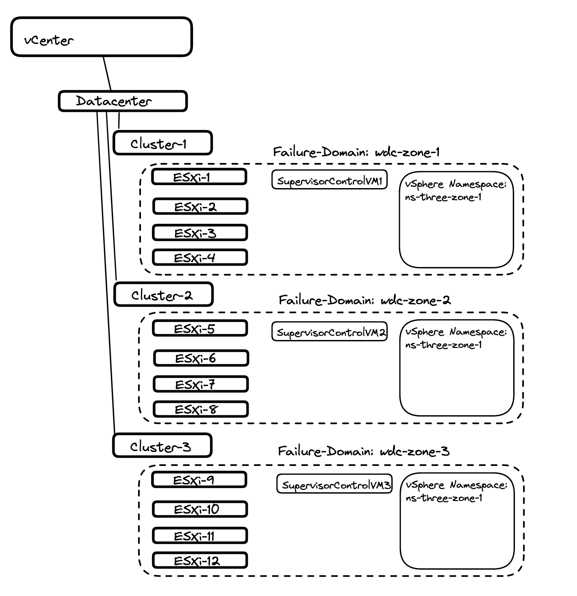
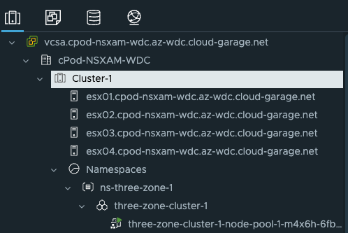
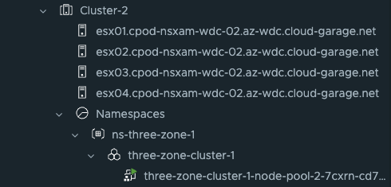
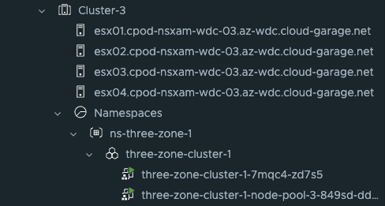
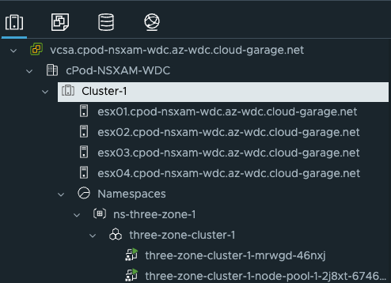
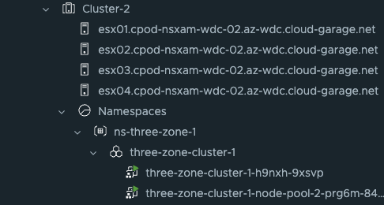
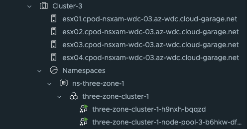
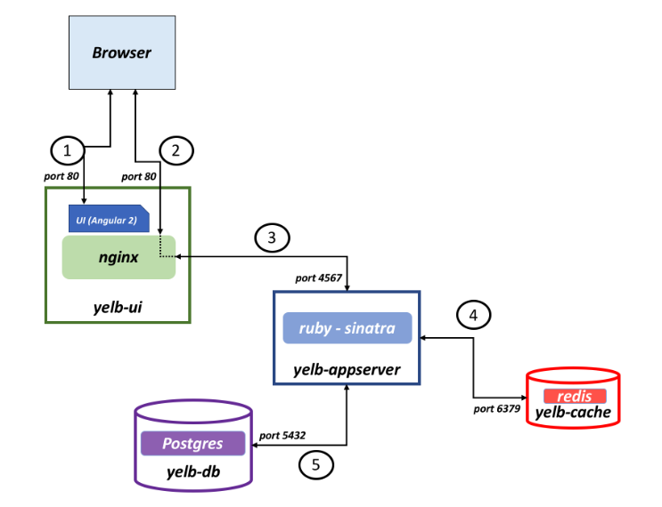

This post will explore a bit further how we can utilize the three-zone setup configured [here](https://blog.andreasm.io/2023/04/14/tanzu-with-vsphere-and-different-tier-0s/) for TKG cluster and application placement. It will not be a very long post, but showing how it can be done and which values to use.
In the "part 1" post I enabled a three-zone Supervisor deployment, meaning the three Supervisor Control Plane VMs will be distributed evenly across my three vSphere Clusters. To use a three-zone deployment we need to have three vSphere Zones defined. Each of these vSphere zones is described as a "Failure Domain" and becomes a value we can use when we decide the placement of both TKG clusters and applications inside our TKG clusters. So basically this post will describe how I can take advantage of this when I deploy my workload clusters and how can I decide where my applications will be placed.

## Workload cluster placement

My Supervisor cluster is already deployed in my three vSphere Zones, just waiting for me to give it something to do. I have created a vSphere Namespace for my TKG cluster called *ns-three-zone-1*. I want to use a different workload network than my Supervisor workload network is placed on, that is a benefit when using NSX-T. 

To give some context, this is how my environment is looking before deploying the TKG cluster:




Now I just need to log into the supervisor, prepare my TKG yaml manifest and deploy my TKG cluster. 

**Log in to Supervisor**

```bash
linuxvm01:~/$ kubectl vsphere login --server=10.101.90.2 --insecure-skip-tls-verify --vsphere-username=andreasm@cpod-nsxam-wdc.az-wdc.cloud-garage.net


KUBECTL_VSPHERE_PASSWORD environment variable is not set. Please enter the password below
Password:
Logged in successfully.

You have access to the following contexts:
   10.101.90.2

If the context you wish to use is not in this list, you may need to try
logging in again later, or contact your cluster administrator.

To change context, use `kubectl config use-context <workload name>`
linuxvm01:~/$
```

Now that I am logged in, I will check if my vSphere Zones are available by issuing the following command:

```bash
linuxvm01:~/three-zones$ k get vspherezones.topology.tanzu.vmware.com
NAME         AGE
wdc-zone-1   19d
wdc-zone-2   19d
wdc-zone-3   19d
linuxvm01:~/three-zones$
```

So it seems, now I need to use these names/labels in my TKG yaml manifest. In my first deployment I will use the example from the official VMware documentation [here](https://docs.vmware.com/en/VMware-vSphere/8.0/vsphere-with-tanzu-tkg/GUID-F7D1852D-0809-4B21-95EF-6D9853B59761.html) with some additions from my side like *run.tanzu.vmware.com/resolve-os-image: os-name=ubuntu*  I will be using the API v1beta1 with kubectl not Tanzu CLI.

Let us have a look at it and edit it accordingly:

```yaml
apiVersion: cluster.x-k8s.io/v1beta1
kind: Cluster
metadata:
  name: three-zone-cluster-1 #My own name on the cluster
  namespace: ns-three-zone-1 #My vSphere Namespace
spec:
  clusterNetwork:
    services:
      cidrBlocks: ["20.30.0.0/16"] #Edited by me
    pods:
      cidrBlocks: ["20.40.0.0/16"] #Edited by me
    serviceDomain: "cluster.local"
  topology:
    class: tanzukubernetescluster
    version: v1.24.9+vmware.1-tkg.4 #My latest available TKR version
    controlPlane:
      replicas: 1 # only one controlplane (saving resources and time)
      metadata:
        annotations:
          run.tanzu.vmware.com/resolve-os-image: os-name=ubuntu
    workers:
      #muliple node pools are used
      machineDeployments:
        - class: node-pool
          name: node-pool-1
          replicas: 1 #only 1 worker here
          metadata:
            annotations:
              run.tanzu.vmware.com/resolve-os-image: os-name=ubuntu
          #failure domain the machines will be created in
          #maps to a vSphere Zone; name must match exactly
          failureDomain: wdc-zone-1 #named after my vSphere zone
        - class: node-pool
          name: node-pool-2
          replicas: 1 #only 1 worker here
          metadata:
            annotations:
              run.tanzu.vmware.com/resolve-os-image: os-name=ubuntu
          #failure domain the machines will be created in
          #maps to a vSphere Zone; name must match exactly
          failureDomain: wdc-zone-2 #named after my vSphere zone
        - class: node-pool
          name: node-pool-3
          replicas: 1 #only 1 worker here
          metadata:
            annotations:
              run.tanzu.vmware.com/resolve-os-image: os-name=ubuntu
          #failure domain the machines will be created in
          #maps to a vSphere Zone; name must match exactly
          failureDomain: wdc-zone-3 #named after my vSphere zone
    variables:
      - name: vmClass
        value: best-effort-small
      - name: storageClass
        value: all-vsans #my zonal storageclass
```

Lets apply and see what happens. What I am expecting is the worker nodes should be placed according to the plan above, 1 worker pr vSphere cluster. The control plane node will be placed random.

```bash
linuxvm01:~/three-zones$ k apply -f three-zone-cluster-1.yaml
cluster.cluster.x-k8s.io/three-zone-cluster-1 created
```

And the results are in:







All three worker nodes were placed in their respective vSphere Zones (vSphere clusters) as configured in the yaml. The control plane node was just randomly placed in vSphere zone 3. 

Thats it for this task. Now I want to deploy nearly the same, but with 3 control plane nodes. Where will they be placed?

Here is the cluster definition:

```yaml
apiVersion: cluster.x-k8s.io/v1beta1
kind: Cluster
metadata:
  name: three-zone-cluster-1 #My own name on the cluster
  namespace: ns-three-zone-1 #My vSphere Namespace
spec:
  clusterNetwork:
    services:
      cidrBlocks: ["20.30.0.0/16"] #Edited by me
    pods:
      cidrBlocks: ["20.40.0.0/16"] #Edited by me
    serviceDomain: "cluster.local"
  topology:
    class: tanzukubernetescluster
    version: v1.24.9+vmware.1-tkg.4 #My latest available TKR version
    controlPlane:
      replicas: 3 # should be spread evenly across zones
      metadata:
        annotations:
          run.tanzu.vmware.com/resolve-os-image: os-name=ubuntu
    workers:
      #muliple node pools are used
      machineDeployments:
        - class: node-pool
          name: node-pool-1
          replicas: 1 #only 1 worker here
          metadata:
            annotations:
              run.tanzu.vmware.com/resolve-os-image: os-name=ubuntu
          #failure domain the machines will be created in
          #maps to a vSphere Zone; name must match exactly
          failureDomain: wdc-zone-1 #named after my vSphere zone
        - class: node-pool
          name: node-pool-2
          replicas: 1 #only 1 worker here
          metadata:
            annotations:
              run.tanzu.vmware.com/resolve-os-image: os-name=ubuntu
          #failure domain the machines will be created in
          #maps to a vSphere Zone; name must match exactly
          failureDomain: wdc-zone-2 #named after my vSphere zone
        - class: node-pool
          name: node-pool-3
          replicas: 1 #only 1 worker here
          metadata:
            annotations:
              run.tanzu.vmware.com/resolve-os-image: os-name=ubuntu
          #failure domain the machines will be created in
          #maps to a vSphere Zone; name must match exactly
          failureDomain: wdc-zone-3 #named after my vSphere zone
    variables:
      - name: vmClass
        value: best-effort-small
      - name: storageClass
        value: all-vsans #my zonal storageclass
```

 And in vCenter where is the control plane nodes placed:








## Application placement

After your workload cluster has been deployed as specified above you also want to utilize the different vSphere Zones for application placement. Start by switching into the context of your workload cluster:

```bash
linuxvm01:~/three-zones$ kubectl vsphere login --server=10.101.90.2 --insecure-skip-tls-verify --vsphere-username=andreasm@cpod-nsxam-wdc.az-wdc.cloud-garage.net --tanzu-kubernetes-cluster-namespace ns-three-zone-1 --tanzu-ku
bernetes-cluster-name three-zone-cluster-1
```

 

```bash
linuxvm01:~/three-zones$ k config current-context
three-zone-cluster-1
```


Now that I am in the correct context, lets check the nodes status, and specifically if there are any labels of interest or relevance to the vSphere Zones.

```bash
linuxvm01:~/three-zones$ k get nodes --show-labels
NAME                                                      STATUS   ROLES           AGE     VERSION            LABELS
three-zone-cluster-1-h9nxh-9xsvp                          Ready    control-plane   4m25s   v1.24.9+vmware.1   beta.kubernetes.io/arch=amd64,beta.kubernetes.io/os=linux,failure-domain.beta.kubernetes.io/zone=wdc-zone-2,kubernetes.io/arch=amd64,kubernetes.io/hostname=three-zone-cluster-1-h9nxh-9xsvp,kubernetes.io/os=linux,node-role.kubernetes.io/control-plane=,node.kubernetes.io/exclude-from-external-load-balancers=,run.tanzu.vmware.com/kubernetesDistributionVersion=v1.24.9---vmware.1-tkg.4,run.tanzu.vmware.com/tkr=v1.24.9---vmware.1-tkg.4,topology.kubernetes.io/zone=wdc-zone-2
three-zone-cluster-1-h9nxh-bqqzd                          Ready    control-plane   16m     v1.24.9+vmware.1   beta.kubernetes.io/arch=amd64,beta.kubernetes.io/os=linux,failure-domain.beta.kubernetes.io/zone=wdc-zone-3,kubernetes.io/arch=amd64,kubernetes.io/hostname=three-zone-cluster-1-h9nxh-bqqzd,kubernetes.io/os=linux,node-role.kubernetes.io/control-plane=,node.kubernetes.io/exclude-from-external-load-balancers=,run.tanzu.vmware.com/kubernetesDistributionVersion=v1.24.9---vmware.1-tkg.4,run.tanzu.vmware.com/tkr=v1.24.9---vmware.1-tkg.4,topology.kubernetes.io/zone=wdc-zone-3
three-zone-cluster-1-h9nxh-kkvkz                          Ready    control-plane   10m     v1.24.9+vmware.1   beta.kubernetes.io/arch=amd64,beta.kubernetes.io/os=linux,failure-domain.beta.kubernetes.io/zone=wdc-zone-1,kubernetes.io/arch=amd64,kubernetes.io/hostname=three-zone-cluster-1-h9nxh-kkvkz,kubernetes.io/os=linux,node-role.kubernetes.io/control-plane=,node.kubernetes.io/exclude-from-external-load-balancers=,run.tanzu.vmware.com/kubernetesDistributionVersion=v1.24.9---vmware.1-tkg.4,run.tanzu.vmware.com/tkr=v1.24.9---vmware.1-tkg.4,topology.kubernetes.io/zone=wdc-zone-1
three-zone-cluster-1-node-pool-1-7xsnp-75994d44d8-zxzsz   Ready    <none>          13m     v1.24.9+vmware.1   beta.kubernetes.io/arch=amd64,beta.kubernetes.io/os=linux,failure-domain.beta.kubernetes.io/zone=wdc-zone-1,kubernetes.io/arch=amd64,kubernetes.io/hostname=three-zone-cluster-1-node-pool-1-7xsnp-75994d44d8-zxzsz,kubernetes.io/os=linux,run.tanzu.vmware.com/kubernetesDistributionVersion=v1.24.9---vmware.1-tkg.4,run.tanzu.vmware.com/tkr=v1.24.9---vmware.1-tkg.4,topology.kubernetes.io/zone=wdc-zone-1
three-zone-cluster-1-node-pool-2-prg6m-84d45c4bd-vwhns    Ready    <none>          11m     v1.24.9+vmware.1   beta.kubernetes.io/arch=amd64,beta.kubernetes.io/os=linux,failure-domain.beta.kubernetes.io/zone=wdc-zone-2,kubernetes.io/arch=amd64,kubernetes.io/hostname=three-zone-cluster-1-node-pool-2-prg6m-84d45c4bd-vwhns,kubernetes.io/os=linux,run.tanzu.vmware.com/kubernetesDistributionVersion=v1.24.9---vmware.1-tkg.4,run.tanzu.vmware.com/tkr=v1.24.9---vmware.1-tkg.4,topology.kubernetes.io/zone=wdc-zone-2
three-zone-cluster-1-node-pool-3-b6hkw-df698b86d-8hdd6    Ready    <none>          11m     v1.24.9+vmware.1   beta.kubernetes.io/arch=amd64,beta.kubernetes.io/os=linux,failure-domain.beta.kubernetes.io/zone=wdc-zone-3,kubernetes.io/arch=amd64,kubernetes.io/hostname=three-zone-cluster-1-node-pool-3-b6hkw-df698b86d-8hdd6,kubernetes.io/os=linux,run.tanzu.vmware.com/kubernetesDistributionVersion=v1.24.9---vmware.1-tkg.4,run.tanzu.vmware.com/tkr=v1.24.9---vmware.1-tkg.4,topology.kubernetes.io/zone=wdc-zone-3
```

In both the worker nodes and control plane nodes we have the labels: 

```bash
linuxvm01:~/three-zones$ k get nodes --show-labels
NAME                                                      LABELS
three-zone-cluster-1-node-pool-1-7xsnp-75994d44d8-zxzsz   topology.kubernetes.io/zone=wdc-zone-1
three-zone-cluster-1-node-pool-2-prg6m-84d45c4bd-vwhns    topology.kubernetes.io/zone=wdc-zone-2
three-zone-cluster-1-node-pool-3-b6hkw-df698b86d-8hdd6    topology.kubernetes.io/zone=wdc-zone-3
```

These labels can then be used when we deploy our applications. I will be using node affinity in my example below. For more information on pod to node placement see [here](https://kubernetes.io/docs/concepts/scheduling-eviction/assign-pod-node/).

Now I want to deploy an application called *Yelb* that consist of four pods. 

 

I will define the yelp-db, yelp-appserver and yelb-cache pod to be placed in my vSphere Zone 3. The yelb-ui I will define to be placed in my vSphere Zone 1. 

Below is my yelp application yaml manifest.

```yaml
apiVersion: v1
kind: Service
metadata:
  name: redis-server
  labels:
    app: redis-server
    tier: cache
  namespace: yelb
spec:
  type: ClusterIP
  ports:
  - port: 6379
  selector:
    app: redis-server
    tier: cache
---
apiVersion: v1
kind: Service
metadata:
  name: yelb-db
  labels:
    app: yelb-db
    tier: backenddb
  namespace: yelb
spec:
  type: ClusterIP
  ports:
  - port: 5432
  selector:
    app: yelb-db
    tier: backenddb
---
apiVersion: v1
kind: Service
metadata:
  name: yelb-appserver
  labels:
    app: yelb-appserver
    tier: middletier
  namespace: yelb
spec:
  type: ClusterIP
  ports:
  - port: 4567
  selector:
    app: yelb-appserver
    tier: middletier
---
apiVersion: v1
kind: Service
metadata:
  name: yelb-ui
  labels:
    app: yelb-ui
    tier: frontend
  namespace: yelb
spec:
  type: LoadBalancer
  ports:
  - port: 80
    protocol: TCP
    targetPort: 80
  selector:
    app: yelb-ui
    tier: frontend
---
apiVersion: apps/v1
kind: Deployment
metadata:
  name: yelb-ui
  namespace: yelb
spec:
  selector:
    matchLabels:
      app: yelb-ui
  replicas: 1
  template:
    metadata:
      labels:
        app: yelb-ui
        tier: frontend
    spec:
      affinity:
        nodeAffinity:
          requiredDuringSchedulingIgnoredDuringExecution:
            nodeSelectorTerms:
            - matchExpressions:
              - key: topology.kubernetes.io/zone
                operator: In
                values:
                - wdc-zone-1
      containers:
      - name: yelb-ui
        image: registry.guzware.net/yelb/yelb-ui:0.3
        imagePullPolicy: Always
        ports:
        - containerPort: 80
---
apiVersion: apps/v1
kind: Deployment
metadata:
  name: redis-server
  namespace: yelb
spec:
  selector:
    matchLabels:
      app: redis-server
  replicas: 1
  template:
    metadata:
      labels:
        app: redis-server
        tier: cache
    spec:
      affinity:
        nodeAffinity:
          requiredDuringSchedulingIgnoredDuringExecution:
            nodeSelectorTerms:
            - matchExpressions:
              - key: topology.kubernetes.io/zone
                operator: In
                values:
                - wdc-zone-3
      containers:
      - name: redis-server
        image: registry.guzware.net/yelb/redis:4.0.2
        ports:
        - containerPort: 6379
---
apiVersion: apps/v1
kind: Deployment
metadata:
  name: yelb-db
  namespace: yelb
spec:
  selector:
    matchLabels:
      app: yelb-db
  replicas: 1
  template:
    metadata:
      labels:
        app: yelb-db
        tier: backenddb
    spec:
      affinity:
        nodeAffinity:
          requiredDuringSchedulingIgnoredDuringExecution:
            nodeSelectorTerms:
            - matchExpressions:
              - key: topology.kubernetes.io/zone
                operator: In
                values:
                - wdc-zone-3
      containers:
      - name: yelb-db
        image: registry.guzware.net/yelb/yelb-db:0.3
        ports:
        - containerPort: 5432
---
apiVersion: apps/v1
kind: Deployment
metadata:
  name: yelb-appserver
  namespace: yelb
spec:
  selector:
    matchLabels:
      app: yelb-appserver
  replicas: 1
  template:
    metadata:
      labels:
        app: yelb-appserver
        tier: middletier
    spec:
      affinity:
        nodeAffinity:
          requiredDuringSchedulingIgnoredDuringExecution:
            nodeSelectorTerms:
            - matchExpressions:
              - key: topology.kubernetes.io/zone
                operator: In
                values:
                - wdc-zone-3
      containers:
      - name: yelb-appserver
        image: registry.guzware.net/yelb/yelb-appserver:0.3
        ports:
        - containerPort: 4567
```


This is the section I define where the deployments should be placed:

```yaml
      affinity:
        nodeAffinity:
          requiredDuringSchedulingIgnoredDuringExecution:
            nodeSelectorTerms:
            - matchExpressions:
              - key: topology.kubernetes.io/zone
                operator: In
                values:
                - wdc-zone-X
```


And now I apply my application, and where will the different pods be placed:

```bash
linuxvm01:~/three-zones$ k apply -f yelb-lb-zone-affinity.yaml
service/redis-server created
service/yelb-db created
service/yelb-appserver created
service/yelb-ui created
deployment.apps/yelb-ui created
deployment.apps/redis-server created
deployment.apps/yelb-db created
deployment.apps/yelb-appserver created
```

Check pod information with *-o wide*

```bash
linuxvm01:~/three-zones$ k get pods -n yelb -o wide
NAME                              READY   STATUS    RESTARTS   AGE   IP           NODE                                                      NOMINATED NODE   READINESS GATES
redis-server-6cc65b47bd-sndht     1/1     Running   0          70s   20.40.3.8    three-zone-cluster-1-node-pool-3-b6hkw-df698b86d-8hdd6    <none>           <none>
yelb-appserver-84d4784595-jw7m5   1/1     Running   0          70s   20.40.3.10   three-zone-cluster-1-node-pool-3-b6hkw-df698b86d-8hdd6    <none>           <none>
yelb-db-7f888657dd-nt427          1/1     Running   0          70s   20.40.3.9    three-zone-cluster-1-node-pool-3-b6hkw-df698b86d-8hdd6    <none>           <none>
yelb-ui-6597db5d9b-972h7          1/1     Running   0          70s   20.40.1.6    three-zone-cluster-1-node-pool-1-7xsnp-75994d44d8-zxzsz   <none>           <none>
```

As I can see from this output all pods execpt my frontend-ui pod has been placed in vSphere Zone 3. 
Now, if you read the official documentation from [Kubernets.io](https://kubernetes.io/docs/concepts/scheduling-eviction/assign-pod-node/) pod placemement can be done in different ways according to different needs. Worth reading. 

This concludes this post. 

 
