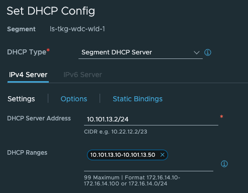

# Overview of what this post is about

In this post my goal is to use TKG (Tanzu Kubernetes Grid [here](https://docs.vmware.com/en/VMware-Tanzu-Kubernetes-Grid/index.html)) to manage and deploy workload clusters in remote datacenter's. The reason for such needs can be many like easier lifecycle management of workload clusters in environments where we have several datacenters, with different physical locations.  To lower the management overhead and simplify lifecycle management, like updates, being able to centrally manage these operations is sometimes key.

So in this post I have two datacenters, with vSphere clusters each being managed by their own vCenter Server. NSX is installed in both datacenters managing the network in their respective datacenter. NSX Advanced Loadbalancer (Avi) is deployed in datacenter 1 and is managing both datacenters (this post will not cover GSLB and having Avi controllers deployed in both datacenters and why this also could be a smart thing to consider). This Avi installation will be responsible for creating SE's (Service Engines) and virtual services for the datacenter it is deployed in as well as the remote datacenter (datacenter 2). This will be the only controller/manager that is being shared across the two datacenters. 

So trying to illustrate the above with the following diagram:


I will not go into how connectivity between these sites are established, I just assume that relevant connectivity between the sites are in place (as that is a requirement for this to work).

## Meet the "moving parts" involved

This section will quickly go through the components being used in their different datacenters. First out is the components used in the datacenter 1 environment.

### Datacenter 1

In datacenter 1 I have one vSphere cluster consisting of four ESXi hosts being managed by a vCenter server. This datacenter will be my managment datacenter where I will deploy my TKG management cluster. It is placed in physical location 1 with its own physical network and storage (using vSAN). 

This is vSphere cluster in datacenter 1:


In datacenter 1 I have also installed NSX-T to handle all the networking needs in this datacenter. There is no stretching of networks between the datacenters, the NSX environment is only responsible for the same datacenter it is installed in as you can see below:


It also has a 1:1 relationship to the vCenter Server in datacenter 1:


 This NSX environment has created the following networks to support my TKG managment cluster deployment:


And from the vCenter:


I will quickly just describe the different networks:

- ls-avi-dns-se-data: This is where I place the dataplane of my SE's used for the DNS service in Avi
- ls-avi-se-data: This is where I place the dataplane of my SE's used for my other virtual services (regular application needs, or if I happen to deploy services in my TKG mgmt cluster or a workload cluster in the same datacenter.) This network will not be used in this post. 
- ls-mgmt: is where I place the management interface of my SE's.
- ls-tkg-mgmt: This will be used in this post and is where my TKG management cluster nodes will be placed.  

The ls-tkg-mgmt network has also been configured with DHCP on the segment in NSX:


And last but not least component, the Avi controller.

This is the component in this post that has been configured to handle requests from both datacenters as a shared resource, whether it is regular layer-4 services like servicetype loadBalancer or layer-7 services like Ingress. As both datacenters are being managed by their own NSX-T I have configured the Avi controller to use both NSX-T environments as two different clouds:


Each cloud depicted above is reflecting the two different datacenters and have been configured accordingly to support the network settings in each datacenter respectively. 

Each cloud is a NSX-T cloud and have its own unique configurations that matches the configuration for the respective datacenter the cloud is in. Networks, IPAM/DNS profiles, routing contexts, service engine groups. Below is some screenshots from the Avi controller:


 


Service engine groups in the stc-nsx-cloud:


The above SE groups have been configured for placement in their respective vSphere clusters, folder, naming, datastore etc. 


The above networks have been configured to provision IP addresses using Avi IPAM to automate SE's dataplane creation.

The below networks are the vip networks configured in the stc-nsx-cloud:

 

Then the routing context (or VRF context) for the SE's to reach the backend


The same has been done for the wdc-nsx-cloud. I will not print them here, but just show that there's is also a wdc-cloud configured in these sections also:


Notice the difference in IP subnets. 

Then its the IPAM DNS profiles for both clouds:


Instead of going into too many details how to configure Avi, its all about to configure it to support the infrastructure settings in each datacenter. Then when the requests for virtual services come to the Avi controller it knows how to handle the requests and create the virtual services, the service engines and do the ip addressing correctly. Then this part will just work butter smooth. 

An overview of the components in datacenter 1:


### Datacenter 2

In datacenter 2 I have also one vSphere cluster consisting of four ESXi hosts being managed by a vCenter server. This datacenter will be my remote/edge datacenter where I will deploy my TKG workload clusters. It is placed in physical location 2 with its own physical network and storage (using vSAN). 

This is vSphere cluster in datacenter 2:


In datacenter 2 I have also installed NSX-T to handle all the networking needs in this datacenter. As mentioned above, there is no stretching of networks between the datacenters, the NSX environments is only responsible for the same datacenter it is installed in as you can see below:


It also has a 1:1 relationship to the vCenter Server in datacenter 1:


 This NSX environment has created the following networks to support my TKG managment cluster deployment:


And from the vCenter:


I will quickly just describe the different networks:

- ls-avi-dns-se-data: This is where I place the dataplane of my SE's used for the DNS service in Avi
- ls-avi-generic-se-data: This is where I place the dataplane of my SE's used for the virtual services created when I expose services from the workload clusters. This network will be used in this post. 
- ls-mgmt: is where I place the management interface of my SE's.
- ls-tkg-wdc-wlc-1: This will be used as placement for my TKG workload cluster nodes in this datacenter.  

The ls-tkg-wdc-wlc-1 network has also been configured with DHCP on the segment in NSX:




An overview again of the components in DC2:


Thats it for the "moving parts" involved in both datacenters for this practice. 

## TKG management cluster deployment

Now finally for the fun parts. Deployment. 
As I have mentioned in the previous chapters, I will deploy the TKG management cluster in datacenter 1. But before I do the actual deployment I will need to explain a little around how a TKG cluster is reached, whether its the management cluster or the workload clusters. 

### Kubernetes API endpoint - exposing services inside the kubernetes clusters (tkg clusters)

A Kubernetes cluster consist usually of 1 or 3 controlplane nodes. This is where the Kubernetes API endpoint lives. When interacting with Kubernetes we are using the exposed Kubernetes APIs to tell it declaratively (some say in a nice way) to realise something we want it to do. This api endpoint is usually exposed on port 6443, and will always be available on the control plane nodes, not on the worker nodes. So the first criteria to be met is connectivity to the control plane nodes on port 6443 (or ssh into the controlplane nodes themselves on port 22 and work with the kube-api from there, but not ideal). We want to reach the api from a remote workstation to be more flexible and effective in how we interact with the Kubernetes API. When having just 1 controlplane node it is probably just ok to reach this one controlplane node and send our api calls directly but with just one controlplane node this can create some issues down the road when we want to replace/upgrade this one node, it can change (most likely will) IP address. Meaning our kubeconfig context/automation tool needs to be updated accordingly. So what we want is a virtual ip address that will stay consistent across the lifetime of the Kubernetes cluster. The same is also when we have more than one controlplane node, 3 is a common number of controlplane nodes in production. We cant have an even number of controlplane nodes as we want quorum. We want to have 1 consistent IP address to reach either just the one controlplane node's Kubernetes API or 1 consistent IP address loadbalanced across all three controlplane nodes. To achieve that we need some kind of loadbalancer that can create this virtual ip address for us to expose the Kubernetes API consistently. In TKG we can use NSX Advanced Loabalancer for this purpose, or a simpler approach like Kube-VIP. 
I dont want to go into a big writeup on the difference between these two other than they are not comparable to each other. Kube-VIP will not loadbalance the Kubernetes API between the 3 control-plane nodes, it will just create a virtual ip in the same subnet as the controlplane nodes and be placed on one of the controlplane nodes, stay there until the node fails and move over to the other control-plane nodes. While NSX ALB will loadbalance the Kuberntes API endpoint between all three control-plane nodes and the IP address is automatically allocated on provisioning. Kube-VIP is statically assigned. 

{}

Why I am mentioning this? Why could I not just focus on NSX Advanced Loadbalancer that can cover all my needs? That is because in this specific post I am hitting a special use-case where I want to have my TKG cluster placed in one datacenter managed by its own NSX-T, while I want to deploy and manage my TKG workload clusters in a completely different datacenter also managed by its own NSX-T. And as of now I am not allowed to override the control-plane network, the network where I can place the virtual IP address for the Kubernetes endpoint of my TKG clusters. It is currently not possible to override the NSX-T Tier1 for the the control-plane network, as these are different due to two different NSX-T environments, I can name the Tier-1 routers identically  in both datacenters, but its not so easily fooled :smile:


{}

What about the services I want to expose from the different workload-clusters like servicetype loadBalancer and Ingress? That is a different story, there we can use NSX Advanced Loadbalancer as much as we want and in a very flexible way too. The reason for that is that the Kubernetes API endpoint VIP or controlplane network is something that is managed and controlled by the TKG management cluster while whats coming from the inside of a working TKG workload cluster is completely different. 
Using NSX Advanced Loadbalancer in TKG or in any other Kubernetes platform like native upstream Kubernetes we use a component called AKO (Avi Kubernetes Operator) that handles all the standard Kubernetes requests like servicetype loadBalancer and Ingress creation and forwards them to the NSX ALB controller to realize them. In TKG we have AKO running in the management cluster that is responsible for the services being exposed from inside the TKG management cluster, but also assigning the VIP for the workload clusters Kubernetes API (controlplane network). As soon as we have our first TKG workload cluster, this comes with its own AKO that is responsible for all the services in the workload cluster it runs it, it will not have anything to do with the controlplane network and the AKO running in the TKG management cluster. So we can actually adjust this AKO instance to match our needs there without being restricted to what the AKO instance in the TKG management cluster is configured with. 

In a TKG workload cluster there is a couple of ways to get AKO installed. One option is to use the AKO Operator running in the TKG management cluster to deploy it automatically on TKG workload cluster provisioning. This approach is best if you want TKG to handle the lifecycle of the AKO instance, like upgrades and it is very hands-off. We need to define an AkoDeploymentConfig in the TKG management cluster that defines the AKO settings for the respective TKG workload cluster or clusters if they can share the same settings. This is based on labels so its very easy to create the ADC for a series of clusters or specific cluster by applying the correct label on the cluster. 
The other option is to install AKO via Helm, this gives you full flexibility but is a manual process that needs to be done on all TKG workload clusters that needs AKO installed. I tend to lean on the ADC approach as I cant see any limitation this approach has compared to the AKO via Helm approach. ADC also supports AviInfraSettings which gives you further flexibility and options. 

With that out of the way let us get this TKG management cluster deployed already...

## TKG management cluster deployment - continued

I will not cover any of the pre-reqs to deploy TKG, for that have a look [here](https://blog.andreasm.io/2023/03/22/tanzu-kubernetes-grid-2.1/), I will just go straight to it. My TKG managment cluster bootstrap yaml manifest. Below I will paste my yaml for the TKG mgmt cluster with some comments that I have done to make use of Kube-VIP for the controlplane, aka Kubernetes API endpoint. 

```yaml
#! ---------------
#! Basic config
#! -------------
CLUSTER_NAME: tkg-stc-mgmt-cluster
CLUSTER_PLAN: dev
INFRASTRUCTURE_PROVIDER: vsphere
ENABLE_CEIP_PARTICIPATION: "false"
ENABLE_AUDIT_LOGGING: "false"
CLUSTER_CIDR: 100.96.0.0/11
SERVICE_CIDR: 100.64.0.0/13
TKG_IP_FAMILY: ipv4
DEPLOY_TKG_ON_VSPHERE7: "true"
CLUSTER_API_SERVER_PORT: 6443 #Added for Kube-VIP
VSPHERE_CONTROL_PLANE_ENDPOINT: 10.13.20.100 #Added for Kube-VIP - specify a static IP in same subnet as nodes
VSPHERE_CONTROL_PLANE_ENDPOINT_PORT: 6443 #Added for Kube-VIP
VIP_NETWORK_INTERFACE: "eth0" #Added for Kube-VIP
# VSPHERE_ADDITIONAL_FQDN:
AVI_CONTROL_PLANE_HA_PROVIDER: false #Set to false to use Kube-VIP instead
AVI_ENABLE: "true" #I still want AKO to be installed, but not used for controplane endpoint

#! ---------------
#! vSphere config
#! -------------
VSPHERE_DATACENTER: /cPod-NSXAM-STC
VSPHERE_DATASTORE: /cPod-NSXAM-STC/datastore/vsanDatastore
VSPHERE_FOLDER: /cPod-NSXAM-STC/vm/TKGm
VSPHERE_INSECURE: "false"
VSPHERE_NETWORK: /cPod-NSXAM-STC/network/ls-tkg-mgmt
VSPHERE_PASSWORD: "password"
VSPHERE_RESOURCE_POOL: /cPod-NSXAM-STC/host/Cluster/Resources
#VSPHERE_TEMPLATE: /Datacenter/vm/TKGm/ubuntu-2004-kube-v1.23.8+vmware.2
VSPHERE_SERVER: vcsa.cpod-nsxam-stc.az-stc.cloud-garage.net
VSPHERE_SSH_AUTHORIZED_KEY: ssh-rsa ssh-public key
VSPHERE_TLS_THUMBPRINT: vcenter SHA1
VSPHERE_USERNAME: username@domain.net

#! ---------------
#! Node config
#! -------------
OS_ARCH: amd64
OS_NAME: ubuntu
OS_VERSION: "20.04"
VSPHERE_CONTROL_PLANE_DISK_GIB: "20"
VSPHERE_CONTROL_PLANE_MEM_MIB: "4096"
VSPHERE_CONTROL_PLANE_NUM_CPUS: "2"
VSPHERE_WORKER_DISK_GIB: "20"
VSPHERE_WORKER_MEM_MIB: "4096"
VSPHERE_WORKER_NUM_CPUS: "2"
CONTROL_PLANE_MACHINE_COUNT: 1
WORKER_MACHINE_COUNT: 2

#! ---------------
#! Avi config
#! -------------
AVI_CA_DATA_B64: AVI Controller Base64 Certificate
AVI_CLOUD_NAME: stc-nsx-cloud
AVI_CONTROLLER: 172.24.3.50
# Network used to place workload clusters' endpoint VIPs
#AVI_CONTROL_PLANE_NETWORK: vip-tkg-wld-l4
#AVI_CONTROL_PLANE_NETWORK_CIDR: 10.13.102.0/24
# Network used to place workload clusters' services external IPs (load balancer & ingress services)
AVI_DATA_NETWORK: vip-tkg-wld-l7
AVI_DATA_NETWORK_CIDR: 10.13.103.0/24
# Network used to place management clusters' services external IPs (load balancer & ingress services)
AVI_MANAGEMENT_CLUSTER_VIP_NETWORK_CIDR: 10.13.101.0/24
AVI_MANAGEMENT_CLUSTER_VIP_NETWORK_NAME: vip-tkg-mgmt-l7
# Network used to place management clusters' endpoint VIPs
#AVI_MANAGEMENT_CLUSTER_CONTROL_PLANE_VIP_NETWORK_NAME: vip-tkg-mgmt-l4
#AVI_MANAGEMENT_CLUSTER_CONTROL_PLANE_VIP_NETWORK_CIDR: 10.13.100.0/24
AVI_NSXT_T1LR: Tier-1
AVI_CONTROLLER_VERSION: 22.1.2
AVI_LABELS: "{adc-enabled: 'true'}" #Added so I can select easily which workload cluster that will use this AKO config
AVI_PASSWORD: "password"
AVI_SERVICE_ENGINE_GROUP: stc-nsx
AVI_MANAGEMENT_CLUSTER_SERVICE_ENGINE_GROUP: tkgm-se-group
AVI_USERNAME: admin
AVI_DISABLE_STATIC_ROUTE_SYNC: false
AVI_INGRESS_DEFAULT_INGRESS_CONTROLLER: true
AVI_INGRESS_SHARD_VS_SIZE: SMALL
AVI_INGRESS_SERVICE_TYPE: NodePortLocal

#! ---------------
#! Proxy config
#! -------------
TKG_HTTP_PROXY_ENABLED: "false"

#! ---------------------------------------------------------------------
#! Antrea CNI configuration
#! ---------------------------------------------------------------------
# ANTREA_NO_SNAT: false
# ANTREA_TRAFFIC_ENCAP_MODE: "encap"
# ANTREA_PROXY: false
# ANTREA_POLICY: true
# ANTREA_TRACEFLOW: false
ANTREA_NODEPORTLOCAL: true
ANTREA_PROXY: true
ANTREA_ENDPOINTSLICE: true
ANTREA_POLICY: true
ANTREA_TRACEFLOW: true
ANTREA_NETWORKPOLICY_STATS: false
ANTREA_EGRESS: true
ANTREA_IPAM: false
ANTREA_FLOWEXPORTER: false
ANTREA_SERVICE_EXTERNALIP: false
ANTREA_MULTICAST: false

#! ---------------------------------------------------------------------
#! Machine Health Check configuration
#! ---------------------------------------------------------------------
ENABLE_MHC: "true"
ENABLE_MHC_CONTROL_PLANE: true
ENABLE_MHC_WORKER_NODE: true
MHC_UNKNOWN_STATUS_TIMEOUT: 5m
MHC_FALSE_STATUS_TIMEOUT: 12m

#! ---------------------------------------------------------------------
#! Identity management configuration
#! ---------------------------------------------------------------------

IDENTITY_MANAGEMENT_TYPE: none

```

All the configs above should match the datacenter 1 environment so the TKG management cluster can be deployed. Lets deploy it using Tanzu CLI from my TKG bootstrap client:

```bash
tanzu mc create -f tkg-mgmt-bootstrap.yaml
```

As soon as it is deployed grab the k8s config and add it to your context:

```bash
tanzu mc kubeconfig get --admin --export-file stc-tkgm-mgmt-cluster.yaml
```

The IP address used for the Kubernetes API endpoint is the controlplane IP defined above:

```yaml
VSPHERE_CONTROL_PLANE_ENDPOINT: 10.13.20.100
```

We can also see this IP being assigned to my one controlplane node in the vCenter view:


Now just have a quick look inside the TKG mgmt cluster and specifically after AKO and eventual ADC:

```bash
tkg-bootstrap-vm:~/Kubernetes-library/examples/ingress$ k get pods -A
NAMESPACE                           NAME                                                             READY   STATUS    RESTARTS     AGE
avi-system                          ako-0                                                            1/1     Running   0            8h
capi-kubeadm-bootstrap-system       capi-kubeadm-bootstrap-controller-manager-5fb8fbc6c7-rqkzf       1/1     Running   0            8h
capi-kubeadm-control-plane-system   capi-kubeadm-control-plane-controller-manager-78c559f48c-cj2dm   1/1     Running   0            8h
capi-system                         capi-controller-manager-84fbb669c-bhk4j                          1/1     Running   0            8h
capv-system                         capv-controller-manager-5f46567b86-pccf5                         1/1     Running   0            8h
cert-manager                        cert-manager-5d8d7b4dfb-gj6h2                                    1/1     Running   0            9h
cert-manager                        cert-manager-cainjector-7797ff666f-zxh5l                         1/1     Running   0            9h
cert-manager                        cert-manager-webhook-59969cbb8c-vpsgr                            1/1     Running   0            9h
kube-system                         antrea-agent-6xzvh                                               2/2     Running   0            8h
kube-system                         antrea-agent-gsfhc                                               2/2     Running   0            8h
kube-system                         antrea-agent-t5gzb                                               2/2     Running   0            8h
kube-system                         antrea-controller-74b468c659-hcrgp                               1/1     Running   0            8h
kube-system                         coredns-5d4666ccfb-qx5qt                                         1/1     Running   0            9h
kube-system                         coredns-5d4666ccfb-xj47b                                         1/1     Running   0            9h
kube-system                         etcd-tkg-stc-mgmt-cluster-sbptz-lkn58                            1/1     Running   0            9h
kube-system                         kube-apiserver-tkg-stc-mgmt-cluster-sbptz-lkn58                  1/1     Running   0            9h
kube-system                         kube-controller-manager-tkg-stc-mgmt-cluster-sbptz-lkn58         1/1     Running   0            9h
kube-system                         kube-proxy-9d7b9                                                 1/1     Running   0            9h
kube-system                         kube-proxy-kd8h8                                                 1/1     Running   0            9h
kube-system                         kube-proxy-n7zwx                                                 1/1     Running   0            9h
kube-system                         kube-scheduler-tkg-stc-mgmt-cluster-sbptz-lkn58                  1/1     Running   0            9h
kube-system                         kube-vip-tkg-stc-mgmt-cluster-sbptz-lkn58                        1/1     Running   0            9h
kube-system                         metrics-server-b468f4d5f-hvtbg                                   1/1     Running   0            8h
kube-system                         vsphere-cloud-controller-manager-fnsvh                           1/1     Running   0            8h
secretgen-controller                secretgen-controller-697cb6c657-lh9rr                            1/1     Running   0            8h
tanzu-auth                          tanzu-auth-controller-manager-d75d85899-d8699                    1/1     Running   0            8h
tkg-system-networking               ako-operator-controller-manager-5bbb9d4c4b-2bjsk                 1/1     Running   0            8h
tkg-system                          kapp-controller-9f9f578c7-dpzgk                                  2/2     Running   0            9h
tkg-system                          object-propagation-controller-manager-5cbb94894f-k56w5           1/1     Running   0            8h
tkg-system                          tanzu-addons-controller-manager-79f656b4c7-m72xw                 1/1     Running   0            8h
tkg-system                          tanzu-capabilities-controller-manager-5868c5f789-nbkgm           1/1     Running   0            8h
tkg-system                          tanzu-featuregates-controller-manager-6d567fffd6-647s5           1/1     Running   0            8h
tkg-system                          tkr-conversion-webhook-manager-6977bfc965-gjjbt                  1/1     Running   0            8h
tkg-system                          tkr-resolver-cluster-webhook-manager-5c8484ffd8-8xc8n            1/1     Running   0            8h
tkg-system                          tkr-source-controller-manager-57c56d55d9-x6vsz                   1/1     Running   0            8h
tkg-system                          tkr-status-controller-manager-55b4b845b9-77snb                   1/1     Running   0            8h
tkg-system                          tkr-vsphere-resolver-webhook-manager-6476749d5d-5pxlk            1/1     Running   0            8h
vmware-system-csi                   vsphere-csi-controller-585bf4dc75-wtlw2                          7/7     Running   0            8h
vmware-system-csi                   vsphere-csi-node-ldrs6                                           3/3     Running   2 (8h ago)   8h
vmware-system-csi                   vsphere-csi-node-rwgpw                                           3/3     Running   4 (8h ago)   8h
vmware-system-csi                   vsphere-csi-node-rx8f6                                           3/3     Running   4 (8h ago)   8h
```

There is an AKO pod running. Are there any ADCs created?

```bash
tkg-bootstrap-vm:~/Kubernetes-library/examples/ingress$ k get adc
NAME                                 AGE
install-ako-for-all                  8h
install-ako-for-management-cluster   8h
```

Lets have a look inside both of them, first out *install-aka-for-all* and then *install-ako-for-management-cluster*

```yaml
# Please edit the object below. Lines beginning with a '#' will be ignored,
# and an empty file will abort the edit. If an error occurs while saving this file will be
# reopened with the relevant failures.
#
apiVersion: networking.tkg.tanzu.vmware.com/v1alpha1
kind: AKODeploymentConfig
metadata:
  annotations:
    kapp.k14s.io/identity: v1;/networking.tkg.tanzu.vmware.com/AKODeploymentConfig/install-ako-for-all;networking.tkg.tanzu.vmware.com/v1alpha1
    kapp.k14s.io/original: '{"apiVersion":"networking.tkg.tanzu.vmware.com/v1alpha1","kind":"AKODeploymentConfig","metadata":{"labels":{"kapp.k14s.io/app":"1685446688101132090","kapp.k14s.io/association":"v1.8329c3602ed02133e324fc22d58dcf28"},"name":"install-ako-for-all"},"spec":{"adminCredentialRef":{"name":"avi-controller-credentials","namespace":"tkg-system-networking"},"certificateAuthorityRef":{"name":"avi-controller-ca","namespace":"tkg-system-networking"},"cloudName":"stc-nsx-cloud","clusterSelector":{"matchLabels":{"adc-enabled":"true"}},"controlPlaneNetwork":{"cidr":"10.13.101.0/24","name":"vip-tkg-mgmt-l7"},"controller":"172.24.3.50","dataNetwork":{"cidr":"10.13.103.0/24","name":"vip-tkg-wld-l7"},"extraConfigs":{"disableStaticRouteSync":false,"ingress":{"defaultIngressController":false,"disableIngressClass":true,"nodeNetworkList":[{"networkName":"ls-tkg-mgmt"}]},"networksConfig":{"nsxtT1LR":"Tier-1"}},"serviceEngineGroup":"stc-nsx"}}'
    kapp.k14s.io/original-diff-md5: c6e94dc94aed3401b5d0f26ed6c0bff3
  creationTimestamp: "2023-05-30T11:38:45Z"
  finalizers:
  - ako-operator.networking.tkg.tanzu.vmware.com
  generation: 2
  labels:
    kapp.k14s.io/app: "1685446688101132090"
    kapp.k14s.io/association: v1.8329c3602ed02133e324fc22d58dcf28
  name: install-ako-for-all
  resourceVersion: "4686"
  uid: 0cf0dd57-b193-40d5-bb03-347879157377
spec:
  adminCredentialRef:
    name: avi-controller-credentials
    namespace: tkg-system-networking
  certificateAuthorityRef:
    name: avi-controller-ca
    namespace: tkg-system-networking
  cloudName: stc-nsx-cloud
  clusterSelector:
    matchLabels:
      adc-enabled: "true"
  controlPlaneNetwork:
    cidr: 10.13.101.0/24
    name: vip-tkg-mgmt-l7
  controller: 172.24.3.50
  controllerVersion: 22.1.3
  dataNetwork:
    cidr: 10.13.103.0/24
    name: vip-tkg-wld-l7
  extraConfigs:
    disableStaticRouteSync: false
    ingress:
      defaultIngressController: false
      disableIngressClass: true
      nodeNetworkList:
      - networkName: ls-tkg-mgmt
    networksConfig:
      nsxtT1LR: Tier-1
  serviceEngineGroup: stc-nsx
```

This is clearly configured for my datacenter 1, and will not match my datacenter 2 environment. Also notice the label, if I do create cluster and apply this label I will get the "default" ADC applied which will not match what I have to use in datacenter 2. 

Lets have a look at the last one:

```yaml
# Please edit the object below. Lines beginning with a '#' will be ignored,
# and an empty file will abort the edit. If an error occurs while saving this file will be
# reopened with the relevant failures.
#
apiVersion: networking.tkg.tanzu.vmware.com/v1alpha1
kind: AKODeploymentConfig
metadata:
  annotations:
    kapp.k14s.io/identity: v1;/networking.tkg.tanzu.vmware.com/AKODeploymentConfig/install-ako-for-management-cluster;networking.tkg.tanzu.vmware.com/v1alpha1
    kapp.k14s.io/original: '{"apiVersion":"networking.tkg.tanzu.vmware.com/v1alpha1","kind":"AKODeploymentConfig","metadata":{"labels":{"kapp.k14s.io/app":"1685446688101132090","kapp.k14s.io/association":"v1.3012c3c8e0fa37b13f4916c7baca1863"},"name":"install-ako-for-management-cluster"},"spec":{"adminCredentialRef":{"name":"avi-controller-credentials","namespace":"tkg-system-networking"},"certificateAuthorityRef":{"name":"avi-controller-ca","namespace":"tkg-system-networking"},"cloudName":"stc-nsx-cloud","clusterSelector":{"matchLabels":{"cluster-role.tkg.tanzu.vmware.com/management":""}},"controlPlaneNetwork":{"cidr":"10.13.101.0/24","name":"vip-tkg-mgmt-l7"},"controller":"172.24.3.50","dataNetwork":{"cidr":"10.13.101.0/24","name":"vip-tkg-mgmt-l7"},"extraConfigs":{"disableStaticRouteSync":false,"ingress":{"defaultIngressController":false,"disableIngressClass":true,"nodeNetworkList":[{"networkName":"ls-tkg-mgmt"}]},"networksConfig":{"nsxtT1LR":"Tier-1"}},"serviceEngineGroup":"tkgm-se-group"}}'
    kapp.k14s.io/original-diff-md5: c6e94dc94aed3401b5d0f26ed6c0bff3
  creationTimestamp: "2023-05-30T11:38:45Z"
  finalizers:
  - ako-operator.networking.tkg.tanzu.vmware.com
  generation: 2
  labels:
    kapp.k14s.io/app: "1685446688101132090"
    kapp.k14s.io/association: v1.3012c3c8e0fa37b13f4916c7baca1863
  name: install-ako-for-management-cluster
  resourceVersion: "4670"
  uid: c41e6e39-2b0f-4fa4-9245-0eec1bcf6b5d
spec:
  adminCredentialRef:
    name: avi-controller-credentials
    namespace: tkg-system-networking
  certificateAuthorityRef:
    name: avi-controller-ca
    namespace: tkg-system-networking
  cloudName: stc-nsx-cloud
  clusterSelector:
    matchLabels:
      cluster-role.tkg.tanzu.vmware.com/management: ""
  controlPlaneNetwork:
    cidr: 10.13.101.0/24
    name: vip-tkg-mgmt-l7
  controller: 172.24.3.50
  controllerVersion: 22.1.3
  dataNetwork:
    cidr: 10.13.101.0/24
    name: vip-tkg-mgmt-l7
  extraConfigs:
    disableStaticRouteSync: false
    ingress:
      defaultIngressController: false
      disableIngressClass: true
      nodeNetworkList:
      - networkName: ls-tkg-mgmt
    networksConfig:
      nsxtT1LR: Tier-1
  serviceEngineGroup: tkgm-se-group
```

The same is true for this one. Configured for my datacenter 1, only major difference being a different *dataNetwork*. So if I decide to deploy a workload cluster in the same datacenter it would be fine, but I dont want that I want my workload cluster to be in a different datacenter.. Lets do that.. 

## TKG workload cluster deployment - with corresponding ADC

Before I deploy my workload cluster I will create a "custom" ADC specific for the datacenter 2 where I will deploy the workload cluster.
Lets paste my ADC for the dc 2 workload cluster:

```yaml
apiVersion: networking.tkg.tanzu.vmware.com/v1alpha1
kind: AKODeploymentConfig
metadata:
  name: ako-tkg-wdc-cloud
spec:
  adminCredentialRef:
    name: avi-controller-credentials
    namespace: tkg-system-networking
  certificateAuthorityRef:
    name: avi-controller-ca
    namespace: tkg-system-networking
  cloudName: wdc-nsx-cloud
  clusterSelector:
    matchLabels:
      avi-cloud: "wdc-nsx-cloud"
  controller: 172.24.3.50
  dataNetwork:
    cidr: 10.101.221.0/24
    name: tkg-wld-1-apps
  extraConfigs:
    cniPlugin: antrea
    disableStaticRouteSync: false                               # required
    ingress:
      defaultIngressController: true
      disableIngressClass: false                                # required
      nodeNetworkList:                                          # required
        - cidrs:
          - 10.101.13.0/24
          networkName: ls-tkg-wdc-wld-1
      serviceType: NodePortLocal                                # required
      shardVSSize: SMALL                                        # required
    l4Config:
      autoFQDN: default
    networksConfig:
      nsxtT1LR: /infra/tier-1s/Tier-1
  serviceEngineGroup: wdc-se-group
```

 

In this ADC I will configure the dataNetwork for the VIP network I have defined in the NSX ALB DC 2 cloud, pointing to the NSX-T Tier1 (yes they have the same name as in DC1, but they are not the same), nodeNetworkList matching where my workload cluster nodes will be placed in DC 2. And also notice the label, for my workload cluster to use this ADC I will need to apply this label either during provisioning or label it after creation. 
Apply the ADC:

```bash
k apply -f ako-wld-cluster-1.wdc.cloud.yaml
```

Is it there:

```bash
amarqvardsen@amarqvards1MD6T:~/Kubernetes-library/tkgm/stc-tkgm$ k get adc
NAME                                 AGE
ako-tkg-wdc-cloud                    20s
install-ako-for-all                  9h
install-ako-for-management-cluster   9h
```

Yes it is. 

Now prepare the TKG workload cluster manifest to match the DC 2 environment and apply it, also making sure *aviAPIServerHAProvider* is set to false.

```yaml
apiVersion: cpi.tanzu.vmware.com/v1alpha1
kind: VSphereCPIConfig
metadata:
  name: wdc-tkgm-wld-cluster-1
  namespace: ns-wdc-1
spec:
  vsphereCPI:
    ipFamily: ipv4
    mode: vsphereCPI
    tlsCipherSuites: TLS_ECDHE_ECDSA_WITH_AES_128_GCM_SHA256,TLS_ECDHE_RSA_WITH_AES_128_GCM_SHA256,TLS_ECDHE_ECDSA_WITH_CHACHA20_POLY1305,TLS_ECDHE_RSA_WITH_AES_256_GCM_SHA384,TLS_ECDHE_RSA_WITH_CHACHA20_POLY1305,TLS_ECDHE_ECDSA_WITH_AES_256_GCM_SHA384
    vmNetwork:
      excludeExternalSubnetCidr: 10.101.13.100/32
      excludeInternalSubnetCidr: 10.101.13.100/32
---
apiVersion: csi.tanzu.vmware.com/v1alpha1
kind: VSphereCSIConfig
metadata:
  name: wdc-tkgm-wld-cluster-1
  namespace: ns-wdc-1
spec:
  vsphereCSI:
    config:
      datacenter: /cPod-NSXAM-WDC
      httpProxy: ""
      httpsProxy: ""
      noProxy: ""
      region: null
      tlsThumbprint: vCenter SHA-1 of DC2
      useTopologyCategories: false
      zone: null
    mode: vsphereCSI
---
apiVersion: run.tanzu.vmware.com/v1alpha3
kind: ClusterBootstrap
metadata:
  annotations:
    tkg.tanzu.vmware.com/add-missing-fields-from-tkr: v1.25.7---vmware.2-tkg.1
  name: wdc-tkgm-wld-cluster-1
  namespace: ns-wdc-1
spec:
  additionalPackages:
  - refName: metrics-server*
  - refName: secretgen-controller*
  - refName: pinniped*
  cpi:
    refName: vsphere-cpi*
    valuesFrom:
      providerRef:
        apiGroup: cpi.tanzu.vmware.com
        kind: VSphereCPIConfig
        name: wdc-tkgm-wld-cluster-1
  csi:
    refName: vsphere-csi*
    valuesFrom:
      providerRef:
        apiGroup: csi.tanzu.vmware.com
        kind: VSphereCSIConfig
        name: wdc-tkgm-wld-cluster-1
  kapp:
    refName: kapp-controller*
---
apiVersion: v1
kind: Secret
metadata:
  name: wdc-tkgm-wld-cluster-1
  namespace: ns-wdc-1
stringData:
  password: password vCenter User
  username: user@vcenter.net
---
apiVersion: cluster.x-k8s.io/v1beta1
kind: Cluster
metadata:
  annotations:
    osInfo: ubuntu,20.04,amd64
    tkg.tanzu.vmware.com/cluster-controlplane-endpoint: 10.101.13.100 #here is the VIP for the workload k8s API - by Kube-VIP
    tkg/plan: dev
  labels:
    tkg.tanzu.vmware.com/cluster-name: wdc-tkgm-wld-cluster-1
    avi-cloud: "wdc-nsx-cloud"
  name: wdc-tkgm-wld-cluster-1
  namespace: ns-wdc-1
spec:
  clusterNetwork:
    pods:
      cidrBlocks:
      - 20.10.0.0/16
    services:
      cidrBlocks:
      - 20.20.0.0/16
  topology:
    class: tkg-vsphere-default-v1.0.0
    controlPlane:
      metadata:
        annotations:
          run.tanzu.vmware.com/resolve-os-image: image-type=ova,os-name=ubuntu
      replicas: 1
    variables:
    - name: cni
      value: antrea
    - name: controlPlaneCertificateRotation
      value:
        activate: true
        daysBefore: 90
    - name: auditLogging
      value:
        enabled: false
    - name: apiServerPort
      value: 6443
    - name: podSecurityStandard
      value:
        audit: baseline
        deactivated: false
        warn: baseline
    - name: apiServerEndpoint
      value: 10.101.13.100 #Here is the K8s API endpoint provided by Kube-VIP
    - name: aviAPIServerHAProvider
      value: false
    - name: vcenter
      value:
        cloneMode: fullClone
        datacenter: /cPod-NSXAM-WDC
        datastore: /cPod-NSXAM-WDC/datastore/vsanDatastore-wdc-01
        folder: /cPod-NSXAM-WDC/vm/TKGm
        network: /cPod-NSXAM-WDC/network/ls-tkg-wdc-wld-1
        resourcePool: /cPod-NSXAM-WDC/host/Cluster-1/Resources
        server: vcsa.cpod-nsxam-wdc.az-wdc.cloud-garage.net
        storagePolicyID: ""
        template: /cPod-NSXAM-WDC/vm/ubuntu-2004-efi-kube-v1.25.7+vmware.2
        tlsThumbprint: vCenter SHA1 DC2
    - name: user
      value:
        sshAuthorizedKeys:
        - ssh-rsa public key
    - name: controlPlane
      value:
        machine:
          diskGiB: 20
          memoryMiB: 4096
          numCPUs: 2
    - name: worker
      value:
        count: 2
        machine:
          diskGiB: 20
          memoryMiB: 4096
          numCPUs: 2
    version: v1.25.7+vmware.2-tkg.1
    workers:
      machineDeployments:
      - class: tkg-worker
        metadata:
          annotations:
            run.tanzu.vmware.com/resolve-os-image: image-type=ova,os-name=ubuntu
        name: md-0
        replicas: 2
```

Notice the label, it should match what you defined in the ADC.. *avi-cloud: "wdc-nsx-cloud"*

Now apply the cluster.

```bash
tanzu cluster create -f wdc-tkg-wld-cluster-1.yaml
```

After a cup of coffee it should be ready. 

Lets check the cluster from the mgmt cluster context:

```bash
linux-vm:~/Kubernetes-library/tkgm/stc-tkgm$ k get cluster -n ns-wdc-1 wdc-tkgm-wld-cluster-1
NAME                     PHASE         AGE   VERSION
wdc-tkgm-wld-cluster-1   Provisioned   13m    v1.25.7+vmware.2
```

Grab the k8s config and switch to the workload cluster context. 

```bash
tanzu cluster kubeconfig get wdc-tkgm-wld-cluster-1 --namespace ns-wdc-1 --admin --export-file wdc-tkgm-wld-cluster-1-k8s-config.yaml
```

Check the nodes:

```bash
linux-vm:~/Kubernetes-library/tkgm/stc-tkgm$ k get nodes -o wide
NAME                                                STATUS   ROLES           AGE   VERSION            INTERNAL-IP    EXTERNAL-IP    OS-IMAGE             KERNEL-VERSION      CONTAINER-RUNTIME
wdc-tkgm-wld-cluster-1-md-0-jkcjw-d7795fbb5-gxnpc   Ready    <none>          9h    v1.25.7+vmware.2   10.101.13.26   10.101.13.26   Ubuntu 20.04.6 LTS   5.4.0-144-generic   containerd://1.6.18-1-gdbc99e5b1
wdc-tkgm-wld-cluster-1-md-0-jkcjw-d7795fbb5-ph5j4   Ready    <none>          9h    v1.25.7+vmware.2   10.101.13.42   10.101.13.42   Ubuntu 20.04.6 LTS   5.4.0-144-generic   containerd://1.6.18-1-gdbc99e5b1
wdc-tkgm-wld-cluster-1-s49w2-mz85r                  Ready    control-plane   9h    v1.25.7+vmware.2   10.101.13.41   10.101.13.41   Ubuntu 20.04.6 LTS   5.4.0-144-generic   containerd://1.6.18-1-gdbc99e5b1
```

In my vCenter in DC 2?


Lets see them running pods:

```bash
linux-vm:~/Kubernetes-library/tkgm/stc-tkgm$ k get pods -A
NAMESPACE              NAME                                                         READY   STATUS    RESTARTS     AGE
avi-system             ako-0                                                        1/1     Running   0            8h
kube-system            antrea-agent-rhmsn                                           2/2     Running   0            8h
kube-system            antrea-agent-ttk6f                                           2/2     Running   0            8h
kube-system            antrea-agent-tw6t7                                           2/2     Running   0            8h
kube-system            antrea-controller-787994578b-7v2cl                           1/1     Running   0            8h
kube-system            coredns-5d4666ccfb-b2j85                                     1/1     Running   0            8h
kube-system            coredns-5d4666ccfb-lr97g                                     1/1     Running   0            8h
kube-system            etcd-wdc-tkgm-wld-cluster-1-s49w2-mz85r                      1/1     Running   0            8h
kube-system            kube-apiserver-wdc-tkgm-wld-cluster-1-s49w2-mz85r            1/1     Running   0            8h
kube-system            kube-controller-manager-wdc-tkgm-wld-cluster-1-s49w2-mz85r   1/1     Running   0            8h
kube-system            kube-proxy-9m2zh                                             1/1     Running   0            8h
kube-system            kube-proxy-rntv8                                             1/1     Running   0            8h
kube-system            kube-proxy-t7z49                                             1/1     Running   0            8h
kube-system            kube-scheduler-wdc-tkgm-wld-cluster-1-s49w2-mz85r            1/1     Running   0            8h
kube-system            kube-vip-wdc-tkgm-wld-cluster-1-s49w2-mz85r                  1/1     Running   0            8h
kube-system            metrics-server-c6d9969cb-7h5l7                               1/1     Running   0            8h
kube-system            vsphere-cloud-controller-manager-b2rkl                       1/1     Running   0            8h
secretgen-controller   secretgen-controller-cd678b84c-cdntv                         1/1     Running   0            8h
tkg-system             kapp-controller-6c5dfccc45-7nhl5                             2/2     Running   0            8h
tkg-system             tanzu-capabilities-controller-manager-5bf587dcd5-fp6t9       1/1     Running   0            8h
vmware-system-csi      vsphere-csi-controller-5459886d8c-5jzlz                      7/7     Running   0            8h
vmware-system-csi      vsphere-csi-node-6pfbj                                       3/3     Running   4 (8h ago)   8h
vmware-system-csi      vsphere-csi-node-cbcpm                                       3/3     Running   4 (8h ago)   8h
vmware-system-csi      vsphere-csi-node-knk8q                                       3/3     Running   2 (8h ago)   8h
```

There is an AKO pod running. So far so good. How does the AKO configmap look like?

```yaml
# Please edit the object below. Lines beginning with a '#' will be ignored,
# and an empty file will abort the edit. If an error occurs while saving this file will be
# reopened with the relevant failures.
#
apiVersion: v1
data:
  apiServerPort: "8080"
  autoFQDN: default
  cloudName: wdc-nsx-cloud
  clusterName: ns-wdc-1-wdc-tkgm-wld-cluster-1
  cniPlugin: antrea
  controllerIP: 172.24.3.50
  controllerVersion: 22.1.3
  defaultIngController: "true"
  deleteConfig: "false"
  disableStaticRouteSync: "false"
  fullSyncFrequency: "1800"
  logLevel: INFO
  nodeNetworkList: '[{"networkName":"ls-tkg-wdc-wld-1","cidrs":["10.101.13.0/24"]}]'
  nsxtT1LR: /infra/tier-1s/Tier-1
  serviceEngineGroupName: wdc-se-group
  serviceType: NodePortLocal
  shardVSSize: SMALL
  useDefaultSecretsOnly: "false"
  vipNetworkList: '[{"networkName":"tkg-wld-1-apps","cidr":"10.101.221.0/24"}]'
kind: ConfigMap
metadata:
  annotations:
    kapp.k14s.io/identity: v1;avi-system//ConfigMap/avi-k8s-config;v1
    kapp.k14s.io/original: '{"apiVersion":"v1","data":{"apiServerPort":"8080","autoFQDN":"default","cloudName":"wdc-nsx-cloud","clusterName":"ns-wdc-1-wdc-tkgm-wld-cluster-1","cniPlugin":"antrea","controllerIP":"172.24.3.50","controllerVersion":"22.1.3","defaultIngController":"true","deleteConfig":"false","disableStaticRouteSync":"false","fullSyncFrequency":"1800","logLevel":"INFO","nodeNetworkList":"[{\"networkName\":\"ls-tkg-wdc-wld-1\",\"cidrs\":[\"10.101.13.0/24\"]}]","nsxtT1LR":"/infra/tier-1s/Tier-1","serviceEngineGroupName":"wdc-se-group","serviceType":"NodePortLocal","shardVSSize":"SMALL","useDefaultSecretsOnly":"false","vipNetworkList":"[{\"networkName\":\"tkg-wld-1-apps\",\"cidr\":\"10.101.221.0/24\"}]"},"kind":"ConfigMap","metadata":{"labels":{"kapp.k14s.io/app":"1685448627039212099","kapp.k14s.io/association":"v1.ae838cced3b6caccc5a03bfb3ae65cd7"},"name":"avi-k8s-config","namespace":"avi-system"}}'
    kapp.k14s.io/original-diff-md5: c6e94dc94aed3401b5d0f26ed6c0bff3
  creationTimestamp: "2023-05-30T12:10:34Z"
  labels:
    kapp.k14s.io/app: "1685448627039212099"
    kapp.k14s.io/association: v1.ae838cced3b6caccc5a03bfb3ae65cd7
  name: avi-k8s-config
  namespace: avi-system
  resourceVersion: "2456"
  uid: 81bbe809-f5a1-45b8-aef2-a83ff36a3dd1
```

That looks good, the question now will it blend?

So far I dont have anything in my NSX ALB dashboard. What happens then if I create some servicetype loadBalancer or Ingresses? Lets have a look.
First check, do I have an IngressClass?

```bash
linux-vm:~/Kubernetes-library/tkgm/stc-tkgm$ k get ingressclasses.networking.k8s.io
NAME     CONTROLLER              PARAMETERS   AGE
avi-lb   ako.vmware.com/avi-lb   <none>       10m
```

I certainly do. I will now deploy an application with serviceType loadBalancer and an application using Ingress. 

Here they are:

```bash
linux-vm:~/Kubernetes-library/tkgm/stc-tkgm$ k get svc -n yelb
NAME             TYPE           CLUSTER-IP      EXTERNAL-IP     PORT(S)        AGE
redis-server     ClusterIP      20.20.103.179   <none>          6379/TCP       10s
yelb-appserver   ClusterIP      20.20.242.204   <none>          4567/TCP       10s
yelb-db          ClusterIP      20.20.202.153   <none>          5432/TCP       10s
yelb-ui          LoadBalancer   20.20.123.18    10.101.221.10   80:30119/TCP   10s
```

```bash
linux-vm:~/Kubernetes-library/tkgm/stc-tkgm$ k get ingress -n fruit
NAME              CLASS    HOSTS                                 ADDRESS         PORTS   AGE
ingress-example   avi-lb   fruit-tkg.you-have.your-domain.here   10.101.221.11   80      50s
```

Looking at the Ingres I can also see NSX ALB has been so kind to register DNS record for it also.

How does it look inside my NSX ALB in DC1?


And where are the above NSX ALB Service Engines deployed?


In my vCenter in DC-2.


Well that was it. Thanks for reading. 

