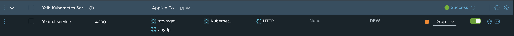
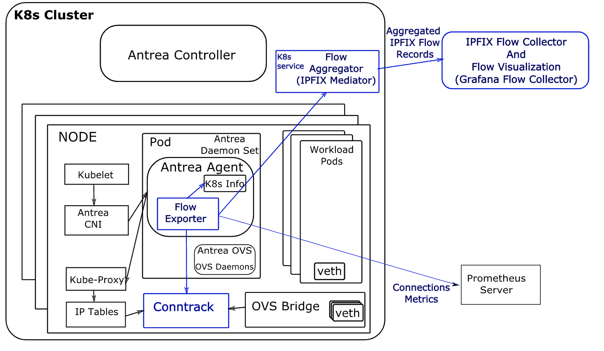

# Antrea in vSphere with Tanzu

Antrea is the default CNI being used in TKG 2.0 clusters. TKG 2.0 clusters are the workload clusters you deploy with the Supervisor deployed in vSphere 8. Antrea comes in to flavours, we have the open source edition of Antrea which can be found [here](https://github.com/antrea-io/antrea) and then we have the Antrea Advanced ("downstream") version which is being used in vSphere with Tanzu. This version is also needed when we want to integrate Antrea with NSX-T for policy management. The Antrea Advanced can be found in your VMware customer connect portal [here](https://customerconnect.vmware.com/downloads/info/slug/networking_security/vmware_antrea/1_x). Both version of Antrea has a very broad support Kubernetes platforms it can be used in. Antrea can be used for Windows worker nodes, Photon, Ubuntu, ARM, x86, VMware TKG, OpenShift, Rancher, AKS, EKS. the list is long see more info [here](https://antrea.io/). This post will be focusing on the Antrea Advanced edition and its features like (read more [here](https://antrea.io/docs/v1.12.0/docs/feature-gates/)):

- Central management of Antrea Security Policies with NSX
- Central troubleshooting with TraceFlow with NSX
- FQDN/L7 Security policies
- RBAC
- Tiered policies
- Flow Exporter
- Egress (Source NAT IP selection of PODs egressing)

 

## Managing Antrea settings and Feature Gates in TKG 2 clusters

When you deploy a TKG 2 cluster on vSphere with Tanzu and you dont specify a CNI Antrea will be de default CNI. Depending on the TKG version you are on a set of default Antrea features are enabled or disabled. You can easily check which features are enabled after a cluster has been provisioned by issuing the below command:
If you know already before you deploy a cluster that a specific feature should be enabled or disabled this can also be handled during bring-up of the cluster so it should come with the settings you want. More on that later. 

```bash
linux-vm:~/from_ubuntu_vm/tkgs/tkgs-stc-cpod$ k get configmaps -n kube-system antrea-config -oyaml
apiVersion: v1
data:
  antrea-agent.conf: |
    featureGates:
      AntreaProxy: true
      EndpointSlice: true
      Traceflow: true
      NodePortLocal: true
      AntreaPolicy: true
      FlowExporter: false
      NetworkPolicyStats: false
      Egress: true
      AntreaIPAM: false
      Multicast: false
      Multicluster: false
      SecondaryNetwork: false
      ServiceExternalIP: false
      TrafficControl: false
    trafficEncapMode: encap
    noSNAT: false
    tunnelType: geneve
    trafficEncryptionMode: none
    enableBridgingMode: false
    disableTXChecksumOffload: false
    wireGuard:
      port: 51820
    egress:
      exceptCIDRs: []
    serviceCIDR: 20.10.0.0/16
    nodePortLocal:
      enable: true
      portRange: 61000-62000
    tlsCipherSuites: TLS_ECDHE_ECDSA_WITH_AES_128_GCM_SHA256,TLS_ECDHE_RSA_WITH_AES_128_GCM_SHA256,TLS_ECDHE_RSA_WITH_AES_256_GCM_SHA384,TLS_ECDHE_ECDSA_WITH_AES_256_GCM_SHA384,TLS_RSA_WITH_AES_256_GCM_SHA384
    multicast: {}
    antreaProxy:
      proxyAll: false
      nodePortAddresses: []
      skipServices: []
      proxyLoadBalancerIPs: false
    multicluster: {}
  antrea-cni.conflist: |
    {
        "cniVersion":"0.3.0",
        "name": "antrea",
        "plugins": [
            {
                "type": "antrea",
                "ipam": {
                    "type": "host-local"
                }
            }
            ,
            {
                "type": "portmap",
                "capabilities": {"portMappings": true}
            }
            ,
            {
                "type": "bandwidth",
                "capabilities": {"bandwidth": true}
            }
        ]
    }
  antrea-controller.conf: |
    featureGates:
      Traceflow: true
      AntreaPolicy: true
      NetworkPolicyStats: false
      Multicast: false
      Egress: true
      AntreaIPAM: false
      ServiceExternalIP: false
    tlsCipherSuites: TLS_ECDHE_ECDSA_WITH_AES_128_GCM_SHA256,TLS_ECDHE_RSA_WITH_AES_128_GCM_SHA256,TLS_ECDHE_RSA_WITH_AES_256_GCM_SHA384,TLS_ECDHE_ECDSA_WITH_AES_256_GCM_SHA384,TLS_RSA_WITH_AES_256_GCM_SHA384
    nodeIPAM: null
kind: ConfigMap
metadata:
  annotations:
    kapp.k14s.io/identity: v1;kube-system//ConfigMap/antrea-config;v1
    kapp.k14s.io/original: '{"apiVersion":"v1","data":{"antrea-agent.conf":"featureGates:\n  AntreaProxy:
      true\n  EndpointSlice: true\n  Traceflow: true\n  NodePortLocal: true\n  AntreaPolicy:
      true\n  FlowExporter: false\n  NetworkPolicyStats: false\n  Egress: true\n  AntreaIPAM:
      false\n  Multicast: false\n  Multicluster: false\n  SecondaryNetwork: false\n  ServiceExternalIP:
      false\n  TrafficControl: false\ntrafficEncapMode: encap\nnoSNAT: false\ntunnelType:
      geneve\ntrafficEncryptionMode: none\nenableBridgingMode: false\ndisableTXChecksumOffload:
      false\nwireGuard:\n  port: 51820\negress:\n  exceptCIDRs: []\nserviceCIDR: 20.10.0.0/16\nnodePortLocal:\n  enable:
      true\n  portRange: 61000-62000\ntlsCipherSuites: TLS_ECDHE_ECDSA_WITH_AES_128_GCM_SHA256,TLS_ECDHE_RSA_WITH_AES_128_GCM_SHA256,TLS_ECDHE_RSA_WITH_AES_256_GCM_SHA384,TLS_ECDHE_ECDSA_WITH_AES_256_GCM_SHA384,TLS_RSA_WITH_AES_256_GCM_SHA384\nmulticast:
      {}\nantreaProxy:\n  proxyAll: false\n  nodePortAddresses: []\n  skipServices:
      []\n  proxyLoadBalancerIPs: false\nmulticluster: {}\n","antrea-cni.conflist":"{\n    \"cniVersion\":\"0.3.0\",\n    \"name\":
      \"antrea\",\n    \"plugins\": [\n        {\n            \"type\": \"antrea\",\n            \"ipam\":
      {\n                \"type\": \"host-local\"\n            }\n        }\n        ,\n        {\n            \"type\":
      \"portmap\",\n            \"capabilities\": {\"portMappings\": true}\n        }\n        ,\n        {\n            \"type\":
      \"bandwidth\",\n            \"capabilities\": {\"bandwidth\": true}\n        }\n    ]\n}\n","antrea-controller.conf":"featureGates:\n  Traceflow:
      true\n  AntreaPolicy: true\n  NetworkPolicyStats: false\n  Multicast: false\n  Egress:
      true\n  AntreaIPAM: false\n  ServiceExternalIP: false\ntlsCipherSuites: TLS_ECDHE_ECDSA_WITH_AES_128_GCM_SHA256,TLS_ECDHE_RSA_WITH_AES_128_GCM_SHA256,TLS_ECDHE_RSA_WITH_AES_256_GCM_SHA384,TLS_ECDHE_ECDSA_WITH_AES_256_GCM_SHA384,TLS_RSA_WITH_AES_256_GCM_SHA384\nnodeIPAM:
      null\n"},"kind":"ConfigMap","metadata":{"labels":{"app":"antrea","kapp.k14s.io/app":"1685607245932804320","kapp.k14s.io/association":"v1.c39c4aca919097e50452c3432329dd40"},"name":"antrea-config","namespace":"kube-system"}}'
    kapp.k14s.io/original-diff-md5: c6e94dc94aed3401b5d0f26ed6c0bff3
  creationTimestamp: "2023-06-01T08:14:14Z"
  labels:
    app: antrea
    kapp.k14s.io/app: "1685607245932804320"
    kapp.k14s.io/association: v1.c39c4aca919097e50452c3432329dd40
  name: antrea-config
  namespace: kube-system
  resourceVersion: "948"
  uid: fd18fd20-a82b-4df5-bb1a-686463b86f27
```

If you want to enable or disable any of these features its a matter of applying an AntreaConfig using the included AntreaConfig CRD in TKG 2.0. 

One can apply this AntreaConfig on an already provisioned TKG 2.0 cluster or apply before the cluster is provisioned so it will get the features enabled or disabled at creation. 
Below is an example of AntreaConfig:

```yaml
apiVersion: cni.tanzu.vmware.com/v1alpha1
kind: AntreaConfig
metadata:
  name: three-zone-cluster-2-antrea-package
  namespace: ns-three-zone-1
spec:
  antrea:
    config:
      featureGates:
        AntreaProxy: true
        EndpointSlice: false
        AntreaPolicy: true
        FlowExporter: true
        Egress: true #This needs to be enabled (an example)
        NodePortLocal: true
        AntreaTraceflow: true
        NetworkPolicyStats: true
```

This example is applied either before or after provisioning of the TKG 2.0 cluster. Just make sure the config has been applied to the correct NS, the same NS as the cluster is deployed in and the name of the config needs to start like this *CLUSTER-NAME-antrea-package*. In other words the name needs to start with the clustername of the TKG 2.0 cluster and end with *-antrea-package*. 

If it is being done after the cluster has provisioned we need to make sure the already running Antrea pods (agents and controller) are restarted so they can read the new configmap. 

If you need to check which version of Antrea is included in your TKR version (and other components for that sake) just run the following command:

```bash
linuxvm01:~/three-zones$ k get tkr v1.24.9---vmware.1-tkg.4 -o yaml
apiVersion: run.tanzu.vmware.com/v1alpha3
kind: TanzuKubernetesRelease
metadata:
  creationTimestamp: "2023-06-01T07:35:28Z"
  finalizers:
  - tanzukubernetesrelease.run.tanzu.vmware.com
  generation: 2
  labels:
    os-arch: amd64
    os-name: photon
    os-type: linux
    os-version: "3.0"
    v1: ""
    v1.24: ""
    v1.24.9: ""
    v1.24.9---vmware: ""
    v1.24.9---vmware.1: ""
    v1.24.9---vmware.1-tkg: ""
    v1.24.9---vmware.1-tkg.4: ""
  name: v1.24.9---vmware.1-tkg.4
  ownerReferences:
  - apiVersion: vmoperator.vmware.com/v1alpha1
    kind: VirtualMachineImage
    name: ob-21552850-ubuntu-2004-amd64-vmi-k8s-v1.24.9---vmware.1-tkg.4
    uid: 92d3d6af-53f8-4f9a-b262-f70dd33ad19b
  - apiVersion: vmoperator.vmware.com/v1alpha1
    kind: VirtualMachineImage
    name: ob-21554409-photon-3-amd64-vmi-k8s-v1.24.9---vmware.1-tkg.4
    uid: 6a0aa87a-63e3-475d-a52d-e63589f454e9
  resourceVersion: "12111"
  uid: 54db049e-fdf0-45a2-b4d1-46fa90a22b44
spec:
  bootstrapPackages:
  - name: antrea.tanzu.vmware.com.1.7.2+vmware.1-tkg.1-advanced
  - name: vsphere-pv-csi.tanzu.vmware.com.2.6.1+vmware.1-tkg.1
  - name: vsphere-cpi.tanzu.vmware.com.1.24.3+vmware.1-tkg.1
  - name: kapp-controller.tanzu.vmware.com.0.41.5+vmware.1-tkg.1
  - name: guest-cluster-auth-service.tanzu.vmware.com.1.1.0+tkg.1
  - name: metrics-server.tanzu.vmware.com.0.6.2+vmware.1-tkg.1
  - name: secretgen-controller.tanzu.vmware.com.0.11.2+vmware.1-tkg.1
  - name: pinniped.tanzu.vmware.com.0.12.1+vmware.3-tkg.3
  - name: capabilities.tanzu.vmware.com.0.28.0+vmware.2
  - name: calico.tanzu.vmware.com.3.24.1+vmware.1-tkg.1
  kubernetes:
    coredns:
      imageTag: v1.8.6_vmware.15
    etcd:
      imageTag: v3.5.6_vmware.3
    imageRepository: localhost:5000/vmware.io
    pause:
      imageTag: "3.7"
    version: v1.24.9+vmware.1
  osImages:
  - name: ob-21552850-ubuntu-2004-amd64-vmi-k8s-v1.24.9---vmware.1-tkg.4
  - name: ob-21554409-photon-3-amd64-vmi-k8s-v1.24.9---vmware.1-tkg.4
  version: v1.24.9+vmware.1-tkg.4
status:
  conditions:
  - lastTransitionTime: "2023-06-01T07:35:28Z"
    status: "True"
    type: Ready
  - lastTransitionTime: "2023-06-01T07:35:28Z"
    status: "True"
    type: Compatible
```

 So enabling and disabling Antrea Feature Gates is quite simple. 
To summarize, the feature gates that can be adjusted is these (as of TKR 1.24.9):

```yaml
spec:
  antrea:
    config:
      defaultMTU: ""
      disableUdpTunnelOffload: false
      featureGates:
        AntreaPolicy: true
        AntreaProxy: true
        AntreaTraceflow: true
        Egress: true
        EndpointSlice: true
        FlowExporter: false
        NetworkPolicyStats: false
        NodePortLocal: true
      noSNAT: false
      tlsCipherSuites: TLS_ECDHE_ECDSA_WITH_AES_128_GCM_SHA256,TLS_ECDHE_RSA_WITH_AES_128_GCM_SHA256,TLS_ECDHE_RSA_WITH_AES_256_GCM_SHA384,TLS_ECDHE_ECDSA_WITH_AES_256_GCM_SHA384,TLS_RSA_WITH_AES_256_GCM_SHA384
      trafficEncapMode: encap
```

### Getting the Antrea config "templates" for a specific TKR version

Usually with new TKR versions, a new version of Antrea is shipped. And with a new version of Antrea is shipped it most liley containt new and exciting features. So if you want to see which feature gates are being available in your latest and greatest TKR, run these commands from the Supervisor context:

```bash
# to get all the Antrea configs 
andreasm@ubuntu02:~/avi_nsxt_wcp$ k get antreaconfigs.cni.tanzu.vmware.com -A
NAMESPACE           NAME                                           TRAFFICENCAPMODE   DEFAULTMTU   ANTREAPROXY   ANTREAPOLICY   SECRETREF
ns-stc-1            cluster-1-antrea-package                       encap                           true          true           cluster-1-antrea-data-values
vmware-system-tkg   v1.23.15---vmware.1-tkg.4                      encap                           true          true
vmware-system-tkg   v1.23.15---vmware.1-tkg.4-routable             noEncap                         true          true
vmware-system-tkg   v1.23.8---vmware.2-tkg.2-zshippable            encap                           true          true
vmware-system-tkg   v1.23.8---vmware.2-tkg.2-zshippable-routable   noEncap                         true          true
vmware-system-tkg   v1.24.9---vmware.1-tkg.4                       encap                           true          true
vmware-system-tkg   v1.24.9---vmware.1-tkg.4-routable              noEncap                         true          true
vmware-system-tkg   v1.25.7---vmware.3-fips.1-tkg.1                encap                           true          true
vmware-system-tkg   v1.25.7---vmware.3-fips.1-tkg.1-routable       noEncap                         true          true
vmware-system-tkg   v1.26.5---vmware.2-fips.1-tkg.1                encap                           true          true
vmware-system-tkg   v1.26.5---vmware.2-fips.1-tkg.1-routable       noEncap                         true          true

# Get the content of a specific Antrea config
andreasm@ubuntu02:~/avi_nsxt_wcp$ k get antreaconfigs.cni.tanzu.vmware.com -n vmware-system-tkg v1.26.5---vmware.2-fips.1-tkg.1 -oyaml
apiVersion: cni.tanzu.vmware.com/v1alpha1
kind: AntreaConfig
metadata:
  annotations:
    tkg.tanzu.vmware.com/template-config: "true"
  creationTimestamp: "2023-09-24T17:49:37Z"
  generation: 1
  name: v1.26.5---vmware.2-fips.1-tkg.1
  namespace: vmware-system-tkg
  resourceVersion: "19483"
  uid: 8cdaa6ec-4059-4d35-a0d4-63711831edc8
spec:
  antrea:
    config:
      antreaProxy:
        proxyLoadBalancerIPs: true
      defaultMTU: ""
      disableTXChecksumOffload: false
      disableUdpTunnelOffload: false
      dnsServerOverride: ""
      enableBridgingMode: false
      enableUsageReporting: false
      featureGates:
        AntreaIPAM: false
        AntreaPolicy: true
        AntreaProxy: true
        AntreaTraceflow: true
        Egress: true
        EndpointSlice: true
        FlowExporter: false
        Multicast: false
        Multicluster: false
        NetworkPolicyStats: true
        NodePortLocal: true
        SecondaryNetwork: false
        ServiceExternalIP: false
        TopologyAwareHints: false
        TrafficControl: false
      flowExporter:
        activeFlowTimeout: 60s
        collectorAddress: flow-aggregator/flow-aggregator:4739:tls
      noSNAT: false
      tlsCipherSuites: TLS_ECDHE_ECDSA_WITH_AES_128_GCM_SHA256,TLS_ECDHE_RSA_WITH_AES_128_GCM_SHA256,TLS_ECDHE_RSA_WITH_AES_256_GCM_SHA384,TLS_ECDHE_ECDSA_WITH_AES_256_GCM_SHA384,TLS_RSA_WITH_AES_256_GCM_SHA384
      trafficEncapMode: encap
      tunnelCsum: false
      tunnelPort: 0
```

 With the above you can always get the latest config coming with the specific TKR release and use it as a template for your TKC cluster. 


## Integrating Antrea with NSX-T

To enable the NSX-T Antrea integration there is a couple of steps that needs to be prepared. All the steps can be followed [here](https://docs.vmware.com/en/VMware-NSX/4.1/administration/GUID-9197EF8A-7998-4D1B-B968-067007C56B5C.html). I have decided to create a script that automates all these steps. So if you dont want to go through all these steps manually by following the link above you can use this script instead and just enter the necesarry information as prompted, and have the pre-requisities in place before excecuting. Copy and paste the below script into a .sh file on your Linux jumpiest and make it executable with chmod +x. 

```bash
#!/bin/bash

# Echo information
echo "This script has some dependencies... make sure they are met before continuing. Otherwise click ctrl+c now
1. This script is adjusted for vSphere with Tanzu TKG clusters using Tanzu CLI
2. Have downloaded the antrea-interworking*.zip
3. This script is located in the root of where you have downloaded the zip file above
4. curl is installed
5. Need connectivity to the NSX manager
6. kubectl is installed
7. vsphere with tanzu cli is installed
8. That you are in the correct context of the cluster you want to integrate to NSX
9. If not in the correct context the script will put you in the correct context anyway
10. A big smile and good mood"

# Prompt the user to press a key to continue
echo "Press any key to continue..."
read -n 1 -s

# Continue with the script
echo "Continuing..."

# Prompt for name
read -p "Enter the name of the tkg cluster - will be used for certificates and name in NSX: " name

# Prompt for NSX_MGR
read -p "Enter NSX Manager ip or FQDN: " nsx_mgr

# Prompt for NSX_ADMIN
read -p "Enter NSX admin username: " nsx_admin

# Prompt for NSX_PASS
read -p "Enter NSX Password: " nsx_pass

# Prompt for Supervisor Endpoint IP or FQDN
read -p "Enter Supervisor API IP or FQDN: " svc_api_ip

# Prompt for vSphere Username
read -p "Enter vSphere Username: " vsphere_username

# Prompt for Tanzu Kubernetes Cluster Namespace
read -p "Enter Tanzu Kubernetes Cluster Namespace: " tanzu_cluster_namespace

# Prompt for Tanzu Kubernetes Cluster Name
read -p "Enter Tanzu Kubernetes Cluster Name: " tanzu_cluster_name

# Login to vSphere using kubectl
kubectl vsphere login --server="$svc_api_ip" --insecure-skip-tls-verify --vsphere-username="$vsphere_username" --tanzu-kubernetes-cluster-namespace="$tanzu_cluster_namespace" --tanzu-kubernetes-cluster-name="$tanzu_cluster_name"

key_name="${name}-private.key"
csr_output="${name}.csr"
crt_output="${name}.crt"

openssl genrsa -out "$key_name" 2048
openssl req -new -key "$key_name" -out "$csr_output" -subj "/C=US/ST=CA/L=Palo Alto/O=VMware/OU=Antrea Cluster/CN=$name"
openssl x509 -req -days 3650 -sha256 -in "$csr_output" -signkey "$key_name" -out "$crt_output"

# Convert the certificate file to a one-liner with line breaks
crt_contents=$(awk '{printf "%s\\n", $0}' "$crt_output")

# Replace the certificate and name in the curl body
curl_body='{
    "name": "'"$name"'",
    "node_id": "'"$name"'",
    "roles_for_paths": [
        {
            "path": "/",
            "roles": [
                {
                    "role": "enterprise_admin"
                }
            ]
        }
    ],
    "role": "enterprise_admin",
    "is_protected": "true",
    "certificate_pem" : "'"$crt_contents"'"
}'

# Make the curl request with the updated body
# curl -X POST -H "Content-Type: application/json" -d "$curl_body" https://example.com/api/endpoint
curl -ku "$nsx_admin":"$nsx_pass" -X POST https://"$nsx_mgr"/api/v1/trust-management/principal-identities/with-certificate -H "Content-Type: application/json" -d "$curl_body"

# Check if a subfolder starting with "antrea-interworking" exists
if ls -d antrea-interworking* &>/dev/null; then
    echo "Subfolder starting with 'antrea-interworking' exists. Skipping extraction."
else
    # Extract the zip file starting with "antrea-interworking"
    unzip "antrea-interworking"*.zip
fi

# Create a new folder with the name antrea-interworking-"from-name"
new_folder="antrea-interworking-$name"
mkdir "$new_folder"

# Copy all YAML files from the antrea-interworking subfolder to the new folder
cp antrea-interworking*/{*.yaml,*.yml} "$new_folder/"

# Replace the field after "image: vmware.io/antrea/interworking" with "image: projects.registry.vmware.com/antreainterworking/interworking-debian" in interworking.yaml
sed -i 's|image: vmware.io/antrea/interworking|image: projects.registry.vmware.com/antreainterworking/interworking-debian|' "$new_folder/interworking.yaml"

# Replace the field after "image: vmware.io/antrea/interworking" with "image: projects.registry.vmware.com/antreainterworking/interworking-debian" in deregisterjob.yaml
sed -i 's|image: vmware.io/antrea/interworking|image: projects.registry.vmware.com/antreainterworking/interworking-debian|' "$new_folder/deregisterjob.yaml"

# Edit the bootstrap.yaml file in the new folder
sed -i 's|clusterName:.*|clusterName: '"$name"'|' "$new_folder/bootstrap-config.yaml"
sed -i 's|NSXManagers:.*|NSXManagers: ["'"$nsx_mgr"'"]|' "$new_folder/bootstrap-config.yaml"
tls_crt_base64=$(base64 -w 0 "$crt_output")
sed -i 's|tls.crt:.*|tls.crt: '"$tls_crt_base64"'|' "$new_folder/bootstrap-config.yaml"
tls_key_base64=$(base64 -w 0 "$key_name")
sed -i 's|tls.key:.*|tls.key: '"$tls_key_base64"'|' "$new_folder/bootstrap-config.yaml"

# Interactive prompt to select Kubernetes context
kubectl config get-contexts
read -p "Enter the name of the Kubernetes context: " kubectl_context
kubectl config use-context "$kubectl_context"

# Apply the bootstrap-config.yaml and interworking.yaml files from the new folder
kubectl apply -f "$new_folder/bootstrap-config.yaml" -f "$new_folder/interworking.yaml"

# Run the last command to verify that something is happening
kubectl get pods -o wide -n vmware-system-antrea

echo "As it was written each time we ssh'ed into a Suse Linux back in the good old days - Have a lot of fun"
```

As soon as the script has been processed through it should not take long until you have your TKG cluster in the NSX manager:


Thats it for the NSX-T integration, as soon as that have been done its time to look into what we can do with this integration in the following chapters

## Antrea Security Policies

Antrea has two sets of security policies, Antrea Network Policies (ANP) and Antrea Cluster Network Policies (ACNP). The difference between these two is that ANP is applied on a Kubernetes Namespace and ACNP is cluster-wide. Both belongs to Antrea Native Policies. Both ANP and ACNP can work together with Kubernetes Network Policies.

There are many benefits of using Antrea Native Policies in combination or not in combination with Kubernetes Network Policies.

Some of the benefits of using Antrea Native Policies:

- Can be tiered
- Select both ingress and egress
- Support the following actions: allow, drop, reject and pass
- Support FQDN filtering in egress (to) with actions allow, drop and reject  

### Tiered policies

The benefit of having tiered policies is very useful when for example we have different parts of the organization are responsible for security at different levels/scopes in the platform. Antrea can have policies placed in different tiers where the tiers are evaluated in a given order. If we want some rules to be very early in the policy evaluation and enforced as soon as possible we can place rule in a tier that is considered first, then within the same tier the rules or policies are also being enforced in the order of a given priority, a number. The rule with the lowest number (higher priority) will be evaluated first and then when all rules in a tier has been processed it will go to the next tier. Antrea comes with a set of static tiers already defined. These tier can be shown by running the command:

```bash
linuxvm01:~$ k get tiers
NAME                          PRIORITY   AGE
application                   250        3h11m
baseline                      253        3h11m
emergency                     50         3h11m
networkops                    150        3h11m
platform                      200        3h11m
securityops                   100        3h11m
```

Below will show a diagram of how they look, notice also where the Kubernets network policies will be placed:


There is also the option to add custom tiers using the following CRD (taken from the offical Antrea docs [here](https://antrea.io/docs/v1.12.0/docs/antrea-network-policy/):

```yaml
apiVersion: crd.antrea.io/v1alpha1
kind: Tier
metadata:
  name: mytier
spec:
  priority: 10
  description: "my custom tier"
```

When doing the Antrea NSX integration some additional tiers are added automatically (they start with nsx*):

```bash
linuxvm01:~$ k get tiers
NAME                          PRIORITY   AGE
application                   250        3h11m
baseline                      253        3h11m
emergency                     50         3h11m
networkops                    150        3h11m
nsx-category-application      4          87m
nsx-category-emergency        1          87m
nsx-category-environment      3          87m
nsx-category-ethernet         0          87m
nsx-category-infrastructure   2          87m
platform                      200        3h11m
securityops                   100        3h11m
```


I can quickly show two examples where I create one rule as a "security-admin", where this security admin has to follow the company's compliance policy to block access to a certain FQDN. This must be enforced all over. So I need to create this policy in the *securityops* tier. I could have defined it in the *emergency* tier also but in this tier it makes more sense to have rules applied that are disabled/not-enforced/idle in case of an emergency and we need a way to quickly enable it and override rules later down the hierarchy. So *securityops* it is:

Lets apply this one:

```yaml
apiVersion: crd.antrea.io/v1alpha1
kind: ClusterNetworkPolicy
metadata:
  name: acnp-drop-yelb
spec:
  priority: 1
  tier: securityops
  appliedTo:
  - podSelector:
      matchLabels:
        app: ubuntu-20-04
  egress:
  - action: Drop
    to:
      - fqdn: "yelb-ui.yelb.carefor.some-dns.net"
    ports:
      - protocol: TCP
        port: 80
  - action: Allow  #Allow the rest
```

To check if it is applied and in use (notice under desired nodes and current nodes):

```bash
linuxvm01:~/antrea/policies$ k get acnp
NAME             TIER          PRIORITY   DESIRED NODES   CURRENT NODES   AGE
acnp-drop-yelb   securityops   1          1               1               5m33s
```

Now from a test pod I will try to curl the blocked fqdn and another one not in any block rule:

```bash
root@ubuntu-20-04-548545fc87-kkzbh:/# curl yelb-ui.yelb.cloudburst.somecooldomain.net
curl: (6) Could not resolve host: yelb-ui.yelb.cloudburst.somecooldomain.net

# Curling a FQDN that is allowed:
root@ubuntu-20-04-548545fc87-kkzbh:/# curl allowed-yelb.yelb-2.carefor.some-dns.net
<!doctype html>
<html>
<head>
    <meta charset="utf-8">
    <title>Yelb</title>
    <base href="/">
    <meta name="viewport" content="width=device-width, initial-scale=1">
    <link rel="icon" type="image/x-icon" href="favicon.ico?v=2">
</head>
<body>
<yelb>Loading...</yelb>
<script type="text/javascript" src="inline.bundle.js"></script><script type="text/javascript" src="styles.bundle.js"></script><script type="text/javascript" src="scripts.bundle.js"></script><script type="text/javascript" src="vendor.bundle.js"></script><script type="text/javascript" src="main.bundle.js"></script></body>
</html>
```

That works as expected. Now what happens then if another use with access to the Kubernetes cluster decide to create a rule later down in the hierarchy, lets go with the application tier, to create an allow rule for this FQDN that is currently being dropped? Lets see what happens

```yaml
apiVersion: crd.antrea.io/v1alpha1
kind: ClusterNetworkPolicy
metadata:
  name: acnp-allow-yelb
spec:
  priority: 1
  tier: application
  appliedTo:
  - podSelector:
      matchLabels:
        app: ubuntu-20-04
  egress:
  - action: Allow
    to:
      - fqdn: "yelb-ui.yelb.carefor.some-dns.net"
    ports:
      - protocol: TCP
        port: 80
  - action: Allow  #Allow the rest
```

I will apply this above rule and then try to curl the same fqdn which is supposed to be dropped.

```bash
linuxvm01:~/antrea/policies$ k get acnp
NAME              TIER          PRIORITY   DESIRED NODES   CURRENT NODES   AGE
acnp-allow-yelb   application   1          1               1               4s
acnp-drop-yelb    securityops   1          1               1               5h1m
```

From my test pod again:

```bash
kubectl exec [POD] [COMMAND] is DEPRECATED and will be removed in a future version. Use kubectl exec [POD] -- [COMMAND] instead.
root@ubuntu-20-04-548545fc87-kkzbh:/# curl yelb-ui.yelb.cloudburst.somecooldomain.net
curl: (6) Could not resolve host: yelb-ui.yelb.cloudburst.somecooldomain.net
root@ubuntu-20-04-548545fc87-kkzbh:/# curl allowed-yelb.yelb-2.carefor.some-dns.net
<!doctype html>
<html>
<head>
    <meta charset="utf-8">
    <title>Yelb</title>
    <base href="/">
    <meta name="viewport" content="width=device-width, initial-scale=1">
    <link rel="icon" type="image/x-icon" href="favicon.ico?v=2">
</head>
<body>
<yelb>Loading...</yelb>
<script type="text/javascript" src="inline.bundle.js"></script><script type="text/javascript" src="styles.bundle.js"></script><script type="text/javascript" src="scripts.bundle.js"></script><script type="text/javascript" src="vendor.bundle.js"></script><script type="text/javascript" src="main.bundle.js"></script></body>
</html>
```

That was expected. It is still being dropped by the first rule placed in the *securityops* tier. So far so good. But what if this user also has access to the tier where the first rule is applied? Well, then they can override it. That is why I we can now go to the next chapter.  

### Antrea RBAC

Antrea comes with a couple of CRDs that allow us to configure granular user permissions on the different objects, like the Policy Tiers. 
So to restrict "normal" users from applying and/or delete security polices created in the higher priority Tiers we need to apply some rolebindings, or to be exact ClusterRoleBindings. Let us see how we can achieve that. 

In my lab environment I have defined two users, my own admin user (andreasm) that is part of the `ClusterRole/cluster-admin` and a second user (User1) that is part of the the `ClusterRole/view`. The ClusterRole View has only read access, not to all objects in the cluster but many. To see what run the following command:

```yaml
linuxvm01:~/antrea/policies$ k get clusterrole view -oyaml
aggregationRule:
  clusterRoleSelectors:
  - matchLabels:
      rbac.authorization.k8s.io/aggregate-to-view: "true"
apiVersion: rbac.authorization.k8s.io/v1
kind: ClusterRole
metadata:
  annotations:
    rbac.authorization.kubernetes.io/autoupdate: "true"
  creationTimestamp: "2023-06-04T09:37:44Z"
  labels:
    kubernetes.io/bootstrapping: rbac-defaults
    rbac.authorization.k8s.io/aggregate-to-edit: "true"
  name: view
  resourceVersion: "1052"
  uid: c4784a81-4451-42af-9134-e141ccf8bc50
rules:
- apiGroups:
  - crd.antrea.io
  resources:
  - clustergroups
  verbs:
  - get
  - list
  - watch
- apiGroups:
  - crd.antrea.io
  resources:
  - clusternetworkpolicies
  - networkpolicies
  verbs:
  - get
  - list
  - watch
- apiGroups:
  - crd.antrea.io
  resources:
  - traceflows
  verbs:
  - get
  - list
  - watch
- apiGroups:
  - ""
  resources:
  - configmaps
  - endpoints
  - persistentvolumeclaims
  - persistentvolumeclaims/status
  - pods
  - replicationcontrollers
  - replicationcontrollers/scale
  - serviceaccounts
  - services
  - services/status
  verbs:
  - get
  - list
  - watch
- apiGroups:
  - ""
  resources:
  - bindings
  - events
  - limitranges
  - namespaces/status
  - pods/log
  - pods/status
  - replicationcontrollers/status
  - resourcequotas
  - resourcequotas/status
  verbs:
  - get
  - list
  - watch
- apiGroups:
  - ""
  resources:
  - namespaces
  verbs:
  - get
  - list
  - watch
- apiGroups:
  - discovery.k8s.io
  resources:
  - endpointslices
  verbs:
  - get
  - list
  - watch
- apiGroups:
  - apps
  resources:
  - controllerrevisions
  - daemonsets
  - daemonsets/status
  - deployments
  - deployments/scale
  - deployments/status
  - replicasets
  - replicasets/scale
  - replicasets/status
  - statefulsets
  - statefulsets/scale
  - statefulsets/status
  verbs:
  - get
  - list
  - watch
- apiGroups:
  - autoscaling
  resources:
  - horizontalpodautoscalers
  - horizontalpodautoscalers/status
  verbs:
  - get
  - list
  - watch
- apiGroups:
  - batch
  resources:
  - cronjobs
  - cronjobs/status
  - jobs
  - jobs/status
  verbs:
  - get
  - list
  - watch
- apiGroups:
  - extensions
  resources:
  - daemonsets
  - daemonsets/status
  - deployments
  - deployments/scale
  - deployments/status
  - ingresses
  - ingresses/status
  - networkpolicies
  - replicasets
  - replicasets/scale
  - replicasets/status
  - replicationcontrollers/scale
  verbs:
  - get
  - list
  - watch
- apiGroups:
  - policy
  resources:
  - poddisruptionbudgets
  - poddisruptionbudgets/status
  verbs:
  - get
  - list
  - watch
- apiGroups:
  - networking.k8s.io
  resources:
  - ingresses
  - ingresses/status
  - networkpolicies
  verbs:
  - get
  - list
  - watch
- apiGroups:
  - metrics.k8s.io
  resources:
  - pods
  - nodes
  verbs:
  - get
  - list
  - watch
- apiGroups:
  - policy
  resourceNames:
  - vmware-system-privileged
  resources:
  - podsecuritypolicies
  verbs:
  - use
```

On the other hand my own admin user has access to everything, get, list, create, patch, update, delete - the whole shabang. 
What I would like to demonstrate now is that user1 is a regular user and should only be allowed to create security policies in the Tier *application* while all other Tiers is restricted to the admins that have the responsibility to create policies there. User1 should also not be allowed to create any custom Tiers. 

So the first thing I need to create is an Antrea *TierEntitlement* and *TierEntitlementBinding* like this:

```yaml
apiVersion: crd.antrea.tanzu.vmware.com/v1alpha1
kind: TierEntitlement
metadata:
    name: secops-edit
spec:
    tiers:       # Accept list of Tier names. Tier may or may not exist yet.
    - emergency
    - securityops
    - networkops
    - platform
    - baseline
    permission: edit
---
apiVersion: crd.antrea.tanzu.vmware.com/v1alpha1
kind: TierEntitlementBinding
metadata:
    name: secops-bind
spec:
  subjects:                                       # List of users to grant this entitlement to
  -   kind: User
      name: sso:andreasm@cpod-nsxam-stc.az-stc.cloud-garage.net
      apiGroup: rbac.authorization.k8s.io
#  -   kind: Group
#      name: security-admins
#      apiGroup: rbac.authorization.k8s.io
#  -   kind: ServiceAccount
#      name: network-admins
#      namespace: kube-system
  tierEntitlement: secops-edit              # Reference to the TierEntitlement
```

Now, notice that I am listing the Tiers that should only be available for the users, groups, or ServiceAccounts in the TierEntitlementBinding (I am only using Kind: User in this example). This means that all unlisted tiers should be allowed for other users to place security policies in. 

Now apply it:

```bash
linuxvm01:~/antrea/policies$ k apply -f tierentitlement.yaml
tierentitlement.crd.antrea.tanzu.vmware.com/secops-edit created
tierentitlementbinding.crd.antrea.tanzu.vmware.com/secops-bind created
```

Next up is to add my User1 to the Antrea CRD "tiers" to be allowed to list and get the tiers:

```yaml
apiVersion: rbac.authorization.k8s.io/v1
kind: ClusterRole
metadata:
  name: tier-placement
rules:
- apiGroups: ["crd.antrea.io"]
  resources: ["tiers"]
  verbs: ["get","list"]
---
apiVersion: rbac.authorization.k8s.io/v1
kind: ClusterRoleBinding
metadata:
  name: tier-bind
subjects:
- kind: User
  name: sso:user1@cpod-nsxam-stc.az-stc.cloud-garage.net # Name is case sensitive
  apiGroup: rbac.authorization.k8s.io
roleRef:
  kind: ClusterRole
  name: tier-placement
  apiGroup: rbac.authorization.k8s.io
```

If you want some user to also add/create/delete custom Tiers this can be allowed by adding: `"create","patch","update","delete"`

Now apply the above yaml:

```bash
linuxvm01:~/antrea/policies$ k apply -f antrea-crd-tier-list.yaml
clusterrole.rbac.authorization.k8s.io/tier-placement created
clusterrolebinding.rbac.authorization.k8s.io/tier-bind created
```

I will now log in with the User1 and try to apply this network policy:

```yaml
apiVersion: crd.antrea.io/v1alpha1
kind: ClusterNetworkPolicy
metadata:
  name: override-rule-allow-yelb
spec:
  priority: 1
  tier: securityops
  appliedTo:
  - podSelector:
      matchLabels:
        app: ubuntu-20-04
  egress:
  - action: Allow
    to:
      - fqdn: "yelb-ui.yelb.carefor.some-dns.net"
    ports:
      - protocol: TCP
        port: 80
  - action: Allow
```

As User1:

```bash
linuxvm01:~/antrea/policies$ k apply -f fqdn-rule-secops-tier.test.yaml
Error from server (Forbidden): error when creating "fqdn-rule-secops-tier.test.yaml": clusternetworkpolicies.crd.antrea.io is forbidden: User "sso:user1@cpod-nsxam-stc.az-stc.cloud-garage.net" cannot create resource "clusternetworkpolicies" in API group "crd.antrea.io" at the cluster scope
```

First bump in the road.. This user is not allowed to create any security policies at all.

So I need to use my admin user and apply this ClusterRoleBinding:

```yaml
apiVersion: rbac.authorization.k8s.io/v1
kind: ClusterRole
metadata:
  name: clusternetworkpolicies-edit
rules:
- apiGroups: ["crd.antrea.io"]
  resources: ["clusternetworkpolicies"]
  verbs: ["get","list","create","patch","update","delete"]
---
apiVersion: rbac.authorization.k8s.io/v1
kind: ClusterRoleBinding
metadata:
  name: clusternetworkpolicies-bind
subjects:
- kind: User
  name: sso:user1@cpod-nsxam-stc.az-stc.cloud-garage.net # Name is case sensitive
  apiGroup: rbac.authorization.k8s.io
roleRef:
  kind: ClusterRole
  name: clusternetworkpolicies-edit
  apiGroup: rbac.authorization.k8s.io
```

Now the user1 has access to create policies... Lets try again:

```bash
linuxvm01:~/antrea/policies$ k apply -f fqdn-rule-secops-tier.test.yaml
Error from server: error when creating "fqdn-rule-secops-tier.test.yaml": admission webhook "acnpvalidator.antrea.io" denied the request: user not authorized to access Tier securityops
```

There it is, I am not allowed to place any security policies in the tier *securityops*. That is what I wanted to achieve, so thats good. 
What if user1 tries to apply a policy in the *application* tier? Lets see:

```yaml
apiVersion: crd.antrea.io/v1alpha1
kind: ClusterNetworkPolicy
metadata:
  name: override-attempt-failed-allow-yelb
spec:
  priority: 1
  tier: application
  appliedTo:
  - podSelector:
      matchLabels:
        app: ubuntu-20-04
  egress:
  - action: Allow
    to:
      - fqdn: "yelb-ui.yelb.carefor.some-dns.net"
    ports:
      - protocol: TCP
        port: 80
  - action: Allow
```

```bash
linuxvm01:~/antrea/policies$ k apply -f fqdn-rule-baseline-tier.test.yaml
clusternetworkpolicy.crd.antrea.io/override-attempt-failed-allow-yelb created
linuxvm01:~/antrea/policies$ k get acnp
NAME                                 TIER          PRIORITY   DESIRED NODES   CURRENT NODES   AGE
acnp-allow-yelb                      application   1          1               1               147m
acnp-drop-yelb                       securityops   1          1               1               18h
override-attempt-failed-allow-yelb   application   1          1               1               11s
```

That worked, even though the above rule is trying to allow access to *yelb* it will not allow it due to the Drop rule in the *securityops* Tier. So how much the User1 tries to get this access it will be blocked. 

These users.... 

What if user1 tries to apply the same policy without stating any Tier in in the policy? Lets see:

```yaml
apiVersion: crd.antrea.io/v1alpha1
kind: ClusterNetworkPolicy
metadata:
  name: override-attempt-failed-allow-yelb
spec:
  priority: 1
  appliedTo:
  - podSelector:
      matchLabels:
        app: ubuntu-20-04
  egress:
  - action: Allow
    to:
      - fqdn: "yelb-ui.yelb.carefor.some-dns.net"
    ports:
      - protocol: TCP
        port: 80
  - action: Allow
```

```bash
linuxvm01:~/antrea/policies$ k apply -f fqdn-rule-no-tier.yaml
clusternetworkpolicy.crd.antrea.io/override-attempt-failed-allow-yelb created
linuxvm01:~/antrea/policies$ k get acnp
NAME                                 TIER          PRIORITY   DESIRED NODES   CURRENT NODES   AGE
acnp-allow-yelb                      application   1          1               1               151m
acnp-drop-yelb                       securityops   1          1               1               18h
override-attempt-failed-allow-yelb   application   1          1               1               10s
```

The rule will be placed in the *application* Tier, even though the user has permission to create clusternetworkpolicies...

With this the network or security admins have full control of the network policies before and after the *application* Tier (ref the Tier diagram above).

This example has only shown how to do this on Cluster level, one can also add more granular permission on Namespace level.

So far I have gone over how to manage the Antrea FeatureGates in TKG, how to configure the Antrea-NSX integration, Antrea Policies in general and how to manage RBAC. In the the two next chapters I will cover two different ways how we can apply the Antrea Policies. Lets get into it

## How to manage the Antrea Native Policies

As mentioned previously Antrea Native Policies can be applied from inside the Kubernetes cluster using yaml manifests, but there is also another way to manage them using the NSX manager. As not mentioned previously this opens up for a whole new way of managing security policies. Centrally managed across multiple clusters wherever located, easier adoption of roles and responsibilities. If NSX is already in place, chances are that NSX security policies are already in place and being managed by the network or security admins. Now they can continue doing that but also take into consideration pod network security across the different TKG/Kubernetes clusters. 

### Antrea Security policies from the NSX manager

After you have connected your TKG clusters to the NSX manager (as shown earlier in this post) you will see the status of these connections in the NSX manager under System -> Fabric -> Nodes:


The status indicator is also a benefit of this integration as it will show you the status of Antrea Controller, and the components responsible for the Antrea-NSX integration.


Under inventory we can get all the relevant info from the TKG clusters:


Where in the screenshot above stc-tkg-cluster 1 and 2 are my TKG Antrea clusters. 
I can get all kinds of information like namespaces, pods, labels, ip addresses, names, services. This informaton is relevant as I can use them in my policy creation, but it also gives me status on whether pods, services are up.


### Antrea Cluster Network Policies - Applied from the NSX manager

With the NSX manager we can create and manage the Antrea Native Policies from the NSX graphical user interface instead of CLI. Using NSX security groups and labels make it also much more fun, but also very easy to maintain know what we do as we can see the policies. 

Lets create some policies from the NSX manager microsegmenting my demo application Yelb. This is my demo application, it consists of four pods, and a service called yelb-ui where the webpage is exposed. 


I know the different parts of the application (e.g pods) are using labels so I will use them. First let us list them from cli and then get them from the NSX manager.

```bash
linuxvm01:~/antrea/policies$ k get pods -n yelb --show-labels
NAME                              READY   STATUS    RESTARTS   AGE   LABELS
redis-server-69846b4888-5m757     1/1     Running   0          22h   app=redis-server,pod-template-hash=69846b4888,tier=cache
yelb-appserver-857c5c76d5-4cgbq   1/1     Running   0          22h   app=yelb-appserver,pod-template-hash=857c5c76d5,tier=middletier
yelb-db-6bd4fc5d9b-92rkf          1/1     Running   0          22h   app=yelb-db,pod-template-hash=6bd4fc5d9b,tier=backenddb
yelb-ui-6df49457d6-4bktw          1/1     Running   0          20h   app=yelb-ui,pod-template-hash=6df49457d6,tier=frontend
```

Ok, there I have the labels. Fine, just for the sake of it I will find the same labels in the NSX manager also:


Now I need to create some security groups in NSX using these labels. 

First group is called acnp-yelb-frontend-ui and are using these membership criterias:
(I am also adding the namespace criteria, to exclude any other applications using the same labels in other namespaces).


Now hurry back to the security group and check whether there are any members.... Disappointment. Just empty:


Fear not, let us quickly create a policy with this group:

Create a new policy and set Antrea Container Clusters in the applied to field:


The actual rule:


The rule above allows my AVI Service Engines to reach the web-port on my yelb-ui pod on port 80 (http) as they are the loadbalancer for my application. 

Any members in the group now?


Yes :smiley:

Now go ahead and create similar groups and rules (except the ports) for the other pods using their respective label. 

End result:


Do they work? Let us find that out a bit later as I need something to put in my TraceFlow chapter :smile:

The rules I have added above was just for the application in the namespace Yelb. If I wanted to extend this ruleset to also include the same application from other clusters its just adding the Kubernetes cluster in the Applied field like this:


### NSX Distributed Firewall - Kubernetes objects Policies

In additon to managing the Antrea Native Policies from the NSX manager as above, in the recent NSX release additional features have been added to support security policies enforced in the NSX Distributed Firewall to also cover these components:


With this we can create security policies in NSX using the distributed firewall to cover the above components using security groups. With this feature its no longer necessary to investigate to get the information about the above components as they are already reported into the NSX manager. Let is do an example of how such a rule can be created and work. 

I will create a security policy based on this feature where I will use Kubernetes Service in my example. I will create a security group as above, but this time I will do some different selections. First grab the labels from the service, I will use the yelb-ui service in my example:

```bash
linuxvm01:~/antrea/policies$ k get svc -n yelb --show-labels
NAME             TYPE           CLUSTER-IP      EXTERNAL-IP    PORT(S)        AGE   LABELS
redis-server     ClusterIP      20.10.102.8     <none>         6379/TCP       23h   app=redis-server,tier=cache
yelb-appserver   ClusterIP      20.10.247.130   <none>         4567/TCP       23h   app=yelb-appserver,tier=middletier
yelb-db          ClusterIP      20.10.44.17     <none>         5432/TCP       23h   app=yelb-db,tier=backenddb
yelb-ui          LoadBalancer   20.10.194.179   10.13.210.10   80:30912/TCP   21h   app=yelb-ui,tier=frontend
```


I can either decide to use *app=yelb-ui* or *tier=frontend*. Now that I have my labels I will create my security group like this:


I used the name of the service itself and the name of the namespace. This gives me this member:


Which is right... 

Now create a security policy using this group where source is another group where I have defined a VM running in the same NSX environment. I have also created a any group which contains just 0.0.0.0/0. Remember that this policy is enforced in the DFW, so there must be something that is running in NSX for this to work, which in my environments is not only the the TKG cluster, but also the Avi Service Engines which acts as LoadBalancer and Ingress for my exposed services. This is kind of important to think of, as the Avi Service Engines communicates with the TKG cluster nodes using NodePortLocal in the default portrange 61000-62000 (if not changed in the Antrea configmap).   

Lets see if the below rule works then:


I will adjust it to Action Drop:




Test Yelb ui access from my linux vm via curl and my physical laptop's browser, and the results are in:

```bash
ubuntu02:~$ curl yelb-ui.yelb.carefor.some-dns.net
curl: (28) Failed to connect to yelb-ui.yelb.carefor.some-dns.net port 80: Connection timed out
```

From my physical laptop browser:


This will be dropped even though I still have these rules in place from earlier (remember):


Now, what about the Avi Service Engines?

If we just look at the rules above, the NSX Kubernetes Service rule and the Antrea Policies rules we are doing the firewall enforcing at two different levels. When creating policies with the Antrea Native Policies, like the one just above, we are applying and enforcing inside the Kubernetes cluster, with the NSX Kubernetes Service rule we are applying and enforcing on the DFW layer. So the Avi Service Engines will first need a policy that is allowing them to communicate to the TKG worker nodes on specific ports/protocol, in my exampe above with Yelb it is port 61002 and TCP. We can see that by looking in Avi UI:


Regardless of the Avi SE's are using the same DFW as the worker nodes, we need to create this policy for the SE to reach the worker nodes to allow this connection. These policies can either be very "lazy" allowing the SEs on everyting TCP with a range of 61000-62000 to the worker nodes or can be made very granual pr service. The Avi SEs are automatically being grouped in NSX security groups if using Avi with NSX Cloud, explore that. 

If we are not allowing the SEs this traffic, we will se this in the Avi UI:


Why is that though, I dont have a default block-all rule in my NSX environment... Well this is because of a set of default rules being created by NCP from TKG. 
Have a look at this rule:


What is the membership in the group used in this Drop rule?


That is all my TKG nodes including the Supervisor Control Plane nodes (the workload interface).

Now in the Antrea Policies, we need to allow the IP addresses the SEs are using to reach the yelb-ui, as its not the actual client-ip that is being used, it is the SEs dataplane network. 


The above diagram tries to explain the traffic flow and how it will be enforced. 
First the user want to access the VIP of the Yelb UI service. This is allowed by the NSX Firewall saying, yes Port 80 on IP 10.13.210.10 is OK to pass. As this VIP is realized by the Avi SEs, and are on NSX this rule will be enforced by the NSX firewall. Then the Avi SEs will forward (loadbalance) the traffic to the worker node(s) using NodePortLocal ranges between 61000-62000(default) where the worker nodes are also on the same NSX DFW, so we need to allow the SEs to forward this traffic. When all above is allowed, we will get "into" the actual TKG (Kubernetes) cluster and need to negiotiate the Antrea Native Policies that have been applied. These rules remember are allowing the SE dataplane IPs to reach the pod yelb-ui on port 80. And thats it. 

Just before we end up this chapter and head over to the next, let us quickly see how the policies created from the NSX manager look like inside the TKG cluster:

```bash
linuxvm01:~/antrea/policies$ k get acnp
NAME                                   TIER                          PRIORITY             DESIRED NODES   CURRENT NODES   AGE
823fca6f-88ee-4032-8150-ac8cf22f1c93   nsx-category-infrastructure   1.000000017763571    3               3               23h
9ae2599a-3bd3-4413-849e-06f53f467559   nsx-category-application      1.0000000532916369   2               2               24h
```

The policies will be placed according to the NSX tiers from the UI:


If I describe one of the policies I will get the actual yaml manifest:

```yaml
linuxvm01:~/antrea/policies$ k get acnp 9ae2599a-3bd3-4413-849e-06f53f467559 -oyaml
apiVersion: crd.antrea.io/v1alpha1
kind: ClusterNetworkPolicy
metadata:
  annotations:
    ccp-adapter.antrea.tanzu.vmware.com/display-name: Yelb-Zero-Trust
  creationTimestamp: "2023-06-05T12:12:14Z"
  generation: 6
  labels:
    ccp-adapter.antrea.tanzu.vmware.com/managedBy: ccp-adapter
  name: 9ae2599a-3bd3-4413-849e-06f53f467559
  resourceVersion: "404591"
  uid: 6477e785-fde4-46ba-b0a1-5ff5f784db8c
spec:
  ingress:
  - action: Allow
    appliedTo:
    - group: 6f39fadf-04e8-4f49-be77-da0d4005ff37
    enableLogging: false
    from:
    - ipBlock:
        cidr: 10.13.11.101/32
    - ipBlock:
        cidr: 10.13.11.100/32
    name: "4084"
    ports:
    - port: 80
      protocol: TCP
  - action: Allow
    appliedTo:
    - group: 31cf5eab-8bcd-4305-b72d-f1a44843fd8e
    enableLogging: false
    from:
    - group: 6f39fadf-04e8-4f49-be77-da0d4005ff37
    name: "4085"
    ports:
    - port: 4567
      protocol: TCP
  - action: Allow
    appliedTo:
    - group: 672f4d75-c83b-4fa1-b0ab-ae414c2e8e8c
    enableLogging: false
    from:
    - group: 31cf5eab-8bcd-4305-b72d-f1a44843fd8e
    name: "4087"
    ports:
    - port: 5432
      protocol: TCP
  - action: Allow
    appliedTo:
    - group: 52c3548b-4758-427f-bcde-b25d36613de6
    enableLogging: false
    from:
    - group: 31cf5eab-8bcd-4305-b72d-f1a44843fd8e
    name: "4088"
    ports:
    - port: 6379
      protocol: TCP
  - action: Drop
    appliedTo:
    - group: d250b7d7-3041-4f7f-8fdf-c7360eee9615
    enableLogging: false
    from:
    - group: d250b7d7-3041-4f7f-8fdf-c7360eee9615
    name: "4089"
  priority: 1.0000000532916369
  tier: nsx-category-application
status:
  currentNodesRealized: 2
  desiredNodesRealized: 2
  observedGeneration: 6
  phase: Realized
```


### Antrea Security policies from kubernetes api

I have already covered this topic in another post [here](https://blog.andreasm.io/2021/07/10/antrea-network-policies/). Head over and have look, also its worth reading the official documentation page from Antrea [here](https://antrea.io/docs/v1.12.0/docs/antrea-network-policy/) as it contains examples and is updated on new features. 

One thing I would like to use this chapter for though is trying to apply a policy on the NSX added Tiers when doing the integration (explained above). Remember the Tiers?

```bash
linuxvm01:~/antrea/policies$ k get tiers
NAME                          PRIORITY   AGE
application                   250        2d2h
baseline                      253        2d2h
emergency                     50         2d2h
networkops                    150        2d2h
nsx-category-application      4          2d
nsx-category-emergency        1          2d
nsx-category-environment      3          2d
nsx-category-ethernet         0          2d
nsx-category-infrastructure   2          2d
platform                      200        2d2h
securityops                   100        2d2h
```

These nsx* tiers are coming from the NSX manager, but can I as a cluster-owner/editor place rules in here by default? If you look at the PRIORITY of these, they are pretty low.

Let us apply the same rule as used earlier in this post, by just editing in the tier placement:

```yaml
apiVersion: crd.antrea.io/v1alpha1
kind: ClusterNetworkPolicy
metadata:
  name: acnp-nsx-tier-from-kubectl
spec:
  priority: 1
  tier: nsx-category-environment
  appliedTo:
  - podSelector:
      matchLabels:
        app: ubuntu-20-04
  egress:
  - action: Allow
    to:
      - fqdn: "yelb-ui.yelb.carefor.some-dns.net"
    ports:
      - protocol: TCP
        port: 80
  - action: Allow
```


```bash
linuxvm01:~/antrea/policies$ k apply -f fqdn-rule-nsx-tier.yaml
Error from server: error when creating "fqdn-rule-nsx-tier.yaml": admission webhook "acnpvalidator.antrea.io" denied the request: user not authorized to access Tier nsx-category-environment
```

Even though I am the cluster-owner/admin/superuser I am not allowed to place any rules in these nsx tiers. So this just gives us further control and mechanisms to support both NSX created Antrea policies and Antrea policies from kubectl. This allows for a good control of security enforcement by roles in the organization.


## Antrea Dashboard

As the Octant dashboard is no more, Antrea now has its own dashboard. Its very easy to deploy. Let me quickly go through it. Read more about it [here](https://github.com/antrea-io/antrea-ui/blob/main/docs/getting-started.md) 

```bash
# Add the helm charts
helm repo add antrea https://charts.antrea.io
helm repo update
```

Install it:

```bash
helm install antrea-ui antrea/antrea-ui --namespace kube-system
```

```bash
linuxvm01:~/antrea/policies$ helm repo add antrea https://charts.antrea.io
"antrea" has been added to your repositories
linuxvm01:~/antrea/policies$ helm repo update
Hang tight while we grab the latest from your chart repositories...
...Successfully got an update from the "ako" chart repository
...Successfully got an update from the "antrea" chart repository
...Successfully got an update from the "bitnami" chart repository
Update Complete. Happy Helming!
linuxvm01:~/antrea/policies$ helm install antrea-ui antrea/antrea-ui --namespace kube-system
NAME: antrea-ui
LAST DEPLOYED: Tue Jun  6 12:56:21 2023
NAMESPACE: kube-system
STATUS: deployed
REVISION: 1
TEST SUITE: None
NOTES:
The Antrea UI has been successfully installed

You are using version 0.1.1

To access the UI, forward a local port to the antrea-ui service, and connect to
that port locally with your browser:

  $ kubectl -n kube-system port-forward service/antrea-ui 3000:3000

After running the command above, access "http://localhost:3000" in your browser.For the Antrea documentation, please visit https://antrea.io
```

This will spin up a new pod, and a clusterip service. 

```bash
linuxvm01:~/antrea/policies$ k get pods -n kube-system
NAME                                                                    READY   STATUS    RESTARTS   AGE
antrea-agent-9rvqc                                                      2/2     Running   0          2d16h
antrea-agent-m7rg7                                                      2/2     Running   0          2d16h
antrea-agent-wvpp8                                                      2/2     Running   0          2d16h
antrea-controller-6d56b6d664-vlmh2                                      1/1     Running   0          2d16h
antrea-ui-9c89486f4-msw6m                                               2/2     Running   0          62s
```

```bash
linuxvm01:~/antrea/policies$ k get svc -n kube-system
NAME             TYPE        CLUSTER-IP      EXTERNAL-IP   PORT(S)                  AGE
antrea           ClusterIP   20.10.96.45     <none>        443/TCP                  2d16h
antrea-ui        ClusterIP   20.10.228.144   <none>        3000/TCP                 95s
```

Now instead of exposing the service as nodeport, I am just creating a serviceType loadBalancer for it like this:

```yaml
apiVersion: v1
kind: Service
metadata:
  name: antrea-dashboard-ui
  labels:
    app: antrea-ui
  namespace: kube-system
spec:
  loadBalancerClass: ako.vmware.com/avi-lb
  type: LoadBalancer
  ports:
  - port: 80
    protocol: TCP
    targetPort: 3000
  selector:
    app: antrea-ui
```

Apply it:

```bash
linuxvm01:~/antrea$ k apply -f antrea-dashboard-lb-yaml
service/antrea-dashboard-ui created
linuxvm01:~/antrea$ k get svc -n kube-system
NAME                  TYPE           CLUSTER-IP      EXTERNAL-IP    PORT(S)                  AGE
antrea                ClusterIP      20.10.96.45     <none>         443/TCP                  2d16h
antrea-dashboard-ui   LoadBalancer   20.10.76.243    10.13.210.12   80:31334/TCP             7s
antrea-ui             ClusterIP      20.10.228.144   <none>         3000/TCP                 8m47s
```

Now access it through my browser:


Default password is *admin*

Good overview:


The option to do Traceflow:


Oops, dropped by a NetworkPolicy... Where does that come from :thinking: ... More on this later.


## Antrea Network Monitoring

Being able to know what's going on is crucial when planning security policies, but also to know if the policies are working and being enforced. With that information available we can know if we are compliant with the policies apllied. Without any network flow information we are kind of in the blind. Luckily Antrea is fully capable of report full flow information, and export it. 
To be able to export the flow information we need to enable the FeatureGate FlowExporter:

```yaml
apiVersion: cni.tanzu.vmware.com/v1alpha1
kind: AntreaConfig
metadata:
  name: stc-tkg-cluster-1-antrea-package
  namespace: ns-stc-1
spec:
  antrea:
    config:
      featureGates:
        AntreaProxy: true
        EndpointSlice: false
        AntreaPolicy: true
        FlowExporter: true #This needs to be enabled
        Egress: true
        NodePortLocal: true
        AntreaTraceflow: true
        NetworkPolicyStats: true
```


### Flow-Exporter - IPFIX

From the offical Antrea documentation:

> [Antrea](https://antrea.io/docs/v1.12.0/docs/design/architecture/) is a Kubernetes network plugin that provides network connectivity and security features for Pod workloads. Considering the scale and dynamism of Kubernetes workloads in a cluster, Network Flow Visibility helps in the management and configuration of Kubernetes resources such as Network Policy, Services, Pods etc., and thereby provides opportunities to enhance the performance and security aspects of Pod workloads.
>
> For visualizing the network flows, Antrea monitors the flows in Linux conntrack module. These flows are converted to flow records, and then flow records are post-processed before they are sent to the configured external flow collector. High-level design is given below:



From the Antrea official documentation again:

> **Flow Exporter**
>
> In Antrea, the basic building block for the Network Flow Visibility is the **Flow Exporter**. Flow Exporter operates within Antrea Agent; it builds and maintains a connection store by polling and dumping flows from conntrack module periodically. Connections from the connection store are exported to the [Flow Aggregator Service](https://antrea.io/docs/v1.12.0/docs/network-flow-visibility/#flow-aggregator) using the IPFIX protocol, and for this purpose we use the IPFIX exporter process from the [go-ipfix](https://github.com/vmware/go-ipfix) library.


Read more Network Flow Visibility in Antrea [here](https://antrea.io/docs/v1.12.0/docs/network-flow-visibility/). 

### Traceflow

When troubleshooting network issues or even firewall rules (is my traffic being blocked or allowed?) it is very handy to have the option to do Traceflow. Antrea supports Traceflow. To be able to use Traceflow, the AntreaTraceFlow FeatureGate needs to be enabled if not already. 

```yaml
apiVersion: cni.tanzu.vmware.com/v1alpha1
kind: AntreaConfig
metadata:
  name: stc-tkg-cluster-1-antrea-package
  namespace: ns-stc-1
spec:
  antrea:
    config:
      featureGates:
        AntreaProxy: true
        EndpointSlice: false
        AntreaPolicy: true
        FlowExporter: true
        Egress: true
        NodePortLocal: true
        AntreaTraceflow: true #This needs to be enabled
        NetworkPolicyStats: true
```

Now that it is enabled, how can we perform Traceflow?

We can do Traceflow using kubectl, Antrea UI or even from the NSX manager if using the NSX/Antrea integration.

Traceflow in Antrea supports the following:

- Source: pod, protocol (TCP/UDP/ICMP) and port numbers
- Destination: pod, service, ip, protocol (TCP/UDP/ICMP) and port numbers
- One time Traceflow or live

Now to get back to my Antrea policies created earlier I want to test if they are actually being in use and enforced. So let me do a Traceflow form my famous Yelb-ui pod and see if it can reach the application pod on its allowed port. Remember that the UI pod needed to communicate with the appserver pod on TCP 4567 and that I created a rule that only allows this, all else is blocked. 

If I want to do Traceflow from kubectl, this is an example to test if port 4567 is allowed from ui pod to appserver pod:

```yaml
apiVersion: crd.antrea.io/v1alpha1
kind: Traceflow
metadata:
  name: tf-test
spec:
  source:
    namespace: yelb
    pod: yelb-ui-6df49457d6-m5clv
  destination:
    namespace: yelb
    pod: yelb-appserver-857c5c76d5-4cd86
    # destination can also be an IP address ('ip' field) or a Service name ('service' field); the 3 choices are mutually exclusive.
  packet:
    ipHeader: # If ipHeader/ipv6Header is not set, the default value is IPv4+ICMP.
      protocol: 6 # Protocol here can be 6 (TCP), 17 (UDP) or 1 (ICMP), default value is 1 (ICMP)
    transportHeader:
      tcp:
        srcPort: 0 # Source port needs to be set when Protocol is TCP/UDP.
        dstPort: 4567 # Destination port needs to be set when Protocol is TCP/UDP.
        flags: 2 # Construct a SYN packet: 2 is also the default value when the flags field is omitted.
```

Now apply it and get the output:

```bash
linuxvm01:~/antrea/policies$ k apply -f traceflow.yaml
traceflow.crd.antrea.io/tf-test created
```

```yaml
linuxvm01:~/antrea/policies$ k get traceflows.crd.antrea.io -n yelb tf-test -oyaml
apiVersion: crd.antrea.io/v1alpha1
kind: Traceflow
metadata:
  annotations:
    kubectl.kubernetes.io/last-applied-configuration: |
      {"apiVersion":"crd.antrea.io/v1alpha1","kind":"Traceflow","metadata":{"annotations":{},"name":"tf-test"},"spec":{"destination":{"namespace":"yelb","pod":"yelb-appserver-857c5c76d5-4cd86"},"packet":{"ipHeader":{"protocol":6},"transportHeader":{"tcp":{"dstPort":4567,"flags":2,"srcPort":0}}},"source":{"namespace":"yelb","pod":"yelb-ui-6df49457d6-m5clv"}}}
  creationTimestamp: "2023-06-07T12:47:14Z"
  generation: 1
  name: tf-test
  resourceVersion: "904386"
  uid: c550596b-ed43-4bab-a6f1-d23e90d35f84
spec:
  destination:
    namespace: yelb
    pod: yelb-appserver-857c5c76d5-4cd86
  packet:
    ipHeader:
      protocol: 6
    transportHeader:
      tcp:
        dstPort: 4567
        flags: 2
        srcPort: 0
  source:
    namespace: yelb
    pod: yelb-ui-6df49457d6-m5clv
status:
  phase: Succeeded
  results:
  - node: stc-tkg-cluster-1-node-pool-01-p6nms-84c55d4574-5r8gj
    observations:
    - action: Received
      component: Forwarding
    - action: Forwarded
      component: NetworkPolicy
      componentInfo: IngressRule
      networkPolicy: AntreaClusterNetworkPolicy:9ae2599a-3bd3-4413-849e-06f53f467559
    - action: Delivered
      component: Forwarding
      componentInfo: Output
    timestamp: 1686142036
  - node: stc-tkg-cluster-1-node-pool-01-p6nms-84c55d4574-bpx7s
    observations:
    - action: Forwarded
      component: SpoofGuard
    - action: Forwarded
      component: Forwarding
      componentInfo: Output
      tunnelDstIP: 10.13.82.39
    timestamp: 1686142036
  startTime: "2023-06-07T12:47:14Z"
```

That was a success. *- action: Forwarded*

Now I want to run it again but with another port. So I change the above yaml to use port 4568 (which should not be allowed):

```yaml
linuxvm01:~/antrea/policies$ k get traceflows.crd.antrea.io -n yelb tf-test -oyaml
apiVersion: crd.antrea.io/v1alpha1
kind: Traceflow
metadata:
  annotations:
    kubectl.kubernetes.io/last-applied-configuration: |
      {"apiVersion":"crd.antrea.io/v1alpha1","kind":"Traceflow","metadata":{"annotations":{},"name":"tf-test"},"spec":{"destination":{"namespace":"yelb","pod":"yelb-appserver-857c5c76d5-4cd86"},"packet":{"ipHeader":{"protocol":6},"transportHeader":{"tcp":{"dstPort":4568,"flags":2,"srcPort":0}}},"source":{"namespace":"yelb","pod":"yelb-ui-6df49457d6-m5clv"}}}
  creationTimestamp: "2023-06-07T12:53:59Z"
  generation: 1
  name: tf-test
  resourceVersion: "905571"
  uid: d76ec419-3272-4595-98a5-72a49adce9d3
spec:
  destination:
    namespace: yelb
    pod: yelb-appserver-857c5c76d5-4cd86
  packet:
    ipHeader:
      protocol: 6
    transportHeader:
      tcp:
        dstPort: 4568
        flags: 2
        srcPort: 0
  source:
    namespace: yelb
    pod: yelb-ui-6df49457d6-m5clv
status:
  phase: Succeeded
  results:
  - node: stc-tkg-cluster-1-node-pool-01-p6nms-84c55d4574-bpx7s
    observations:
    - action: Forwarded
      component: SpoofGuard
    - action: Forwarded
      component: Forwarding
      componentInfo: Output
      tunnelDstIP: 10.13.82.39
    timestamp: 1686142441
  - node: stc-tkg-cluster-1-node-pool-01-p6nms-84c55d4574-5r8gj
    observations:
    - action: Received
      component: Forwarding
    - action: Dropped
      component: NetworkPolicy
      componentInfo: IngressMetric
      networkPolicy: AntreaClusterNetworkPolicy:9ae2599a-3bd3-4413-849e-06f53f467559
    timestamp: 1686142441
  startTime: "2023-06-07T12:53:59Z"
```

That was also a success, as it was dropped by design: *- action: Dropped*

Its great being able to do this from kubectl, if one quickly need to check this before starting to look somewhere else and create a support ticket :smiley: or one dont have access to other tools like the Antrea UI or even the NSX manager, speaking of NSX manager. Let us do the exact same trace from the NSX manager gui:

Head over Plan&Troubleshoot -> Traffic Analysis:


Results:


Now I change it to another port again and test it again:


Dropped again. 

The same procedure can also be done from the Antrea UI as shown above, now with a port that is allowed:


To read more on Traceflow in Antrea, head over [here](https://antrea.io/docs/v1.12.0/docs/traceflow-guide/).


### Theia

Now that we have know it's possible to export all flows using IPFIX, I thought it would be interesting to just showcase how the flow information can be presented with a solution called Theia. 
From the official [docs](https://github.com/antrea-io/theia):

> Theia is a network observability and analytics platform for Kubernetes. It is built on top of [Antrea](https://github.com/antrea-io/antrea), and consumes [network flows exported by Antrea](https://github.com/antrea-io/antrea/blob/main/docs/network-flow-visibility.md) to provide fine-grained visibility into the communication and NetworkPolicies among Pods and Services in a Kubernetes cluster.


To install Theia I have followed the instructions from [here](https://github.com/antrea-io/theia/blob/main/docs/getting-started.md) which is also a greate place to read more about Theia.  

Theia is installed using Helm, start by adding the charts, do an update and deploy:

```bash
linuxvm01:~/antrea$ helm repo add antrea https://charts.antrea.io
"antrea" already exists with the same configuration, skipping
linuxvm01:~/antrea$ helm repo update
Hang tight while we grab the latest from your chart repositories...
...Successfully got an update from the "antrea" chart repository
Update Complete. Happy Helming!
```


Make sure that FlowExporter has been enabled, if not apply an AntreaConfig that enables it:

```yaml
apiVersion: cni.tanzu.vmware.com/v1alpha1
kind: AntreaConfig
metadata:
  name: stc-tkg-cluster-1-antrea-package
  namespace: ns-stc-1
spec:
  antrea:
    config:
      featureGates:
        AntreaProxy: true
        EndpointSlice: false
        AntreaPolicy: true
        FlowExporter: true #Enable this!
        Egress: true
        NodePortLocal: true
        AntreaTraceflow: true
        NetworkPolicyStats: true
```

After the config has been enabled, delete the Antrea agents and controller so these will read the new configMap:

```
linuxvm01:~/antrea/theia$ k delete pod -n kube-system -l app=antrea
pod "antrea-agent-58nn2" deleted
pod "antrea-agent-cnq9p" deleted
pod "antrea-agent-sx6vr" deleted
pod "antrea-controller-6d56b6d664-km64t" deleted
```

After the Helm charts have been added, I start by installing the Flow Aggregator

```bash
helm install flow-aggregator antrea/flow-aggregator --set clickHouse.enable=true,recordContents.podLabels=true -n flow-aggregator --create-namespace

```

As usual with Helm charts, if there is any specific settings you would like to change get the helm chart values for your specific charts first and refer to them by using -f values.yaml.. 

```bash
linuxvm01:~/antrea/theia$ helm show values antrea/flow-aggregator > flow-agg-values.yaml
```

I dont have any specifics I need to change for this one, so I will just deploy using the defaults:

```bash
linuxvm01:~/antrea/theia$ helm install flow-aggregator antrea/flow-aggregator --set clickHouse.enable=true,recordContents.podLabels=true -n flow-aggregator --create-namespace
NAME: flow-aggregator
LAST DEPLOYED: Tue Jun  6 21:28:49 2023
NAMESPACE: flow-aggregator
STATUS: deployed
REVISION: 1
TEST SUITE: None
NOTES:
The Antrea Flow Aggregator has been successfully installed

You are using version 1.12.0

For the Antrea documentation, please visit https://antrea.io
```

Now what has happened in my TKG cluster:

```bash
linuxvm01:~/antrea/theia$ k get pods -n flow-aggregator
NAME                               READY   STATUS    RESTARTS      AGE
flow-aggregator-5b4c69885f-mklm5   1/1     Running   1 (10s ago)   22s
linuxvm01:~/antrea/theia$ k get pods -n flow-aggregator
NAME                               READY   STATUS    RESTARTS      AGE
flow-aggregator-5b4c69885f-mklm5   1/1     Running   1 (13s ago)   25s
linuxvm01:~/antrea/theia$ k get pods -n flow-aggregator
NAME                               READY   STATUS   RESTARTS      AGE
flow-aggregator-5b4c69885f-mklm5   0/1     Error    1 (14s ago)   26s
linuxvm01:~/antrea/theia$ k get pods -n flow-aggregator
NAME                               READY   STATUS   RESTARTS      AGE
flow-aggregator-5b4c69885f-mklm5   0/1     CrashLoopBackOff    3 (50s ago)   60s
```

Well, that did'nt go so well... 

The issue is that Flow Aggregator is looking for a service that is not created yet and will just fail until this is deployed. This is our next step.

```bash
linuxvm01:~/antrea/theia$ helm install theia antrea/theia --set sparkOperator.enable=true,theiaManager.enable=true -n flow-visibility --create-namespace

NAME: theia
LAST DEPLOYED: Tue Jun  6 22:02:37 2023
NAMESPACE: flow-visibility
STATUS: deployed
REVISION: 1
TEST SUITE: None
NOTES:
Theia has been successfully installed

You are using version 0.6.0

For the Antrea documentation, please visit https://antrea.io
```


What has been created now:

```
linuxvm01:~/antrea/theia$ k get pods -n flow-visibility
NAME                                    READY   STATUS    RESTARTS   AGE
chi-clickhouse-clickhouse-0-0-0         2/2     Running   0          8m52s
grafana-684d8948b-c6wzn                 1/1     Running   0          8m56s
theia-manager-5d8d6b86b7-cbxrz          1/1     Running   0          8m56s
theia-spark-operator-54d9ddd544-nqhqd   1/1     Running   0          8m56s
zookeeper-0                             1/1     Running   0          8m56s
```

Now flow-aggreator should also be in a runing state, if not just delete the pod and it should get back on its feet.

```
linuxvm01:~/antrea/theia$ k get pods -n flow-aggregator
NAME                               READY   STATUS    RESTARTS   AGE
flow-aggregator-5b4c69885f-xhdkx   1/1     Running   0          5m2s
```

So, now its all about getting access to the Grafana dashboard. I will just expose this with serviceType loadBalancer as it "out-of-the-box" is only exposed with NodePort:

```
linuxvm01:~/antrea/theia$ k get svc -n flow-visibility
NAME                            TYPE        CLUSTER-IP      EXTERNAL-IP   PORT(S)                      AGE
chi-clickhouse-clickhouse-0-0   ClusterIP   None            <none>        8123/TCP,9000/TCP,9009/TCP   8m43s
clickhouse-clickhouse           ClusterIP   20.10.136.211   <none>        8123/TCP,9000/TCP            10m
grafana                         NodePort    20.10.172.165   <none>        3000:30096/TCP               10m
theia-manager                   ClusterIP   20.10.156.217   <none>        11347/TCP                    10m
zookeeper                       ClusterIP   20.10.219.137   <none>        2181/TCP,7000/TCP            10m
zookeepers                      ClusterIP   None            <none>        2888/TCP,3888/TCP            10m
```

So let us create a LoadBalancer service for this:

```yaml
apiVersion: v1
kind: Service
metadata:
  name: theia-dashboard-ui
  labels:
    app: grafana
  namespace: flow-visibility
spec:
  loadBalancerClass: ako.vmware.com/avi-lb
  type: LoadBalancer
  ports:
  - port: 80
    protocol: TCP
    targetPort: 3000
  selector:
    app: grafana
```

```bash
linuxvm01:~/antrea/theia$ k get svc -n flow-visibility
NAME                            TYPE           CLUSTER-IP      EXTERNAL-IP    PORT(S)                      grafana                         NodePort       20.10.172.165   <none>         3000:30096/TCP               15m
theia-dashboard-ui              LoadBalancer   20.10.24.174    10.13.210.13   80:32075/TCP                 13s
```

Lets try to access it through the browser:


Great. Theia comes with a couple of predefined dashobards that is interesting to start out with. So let me list some of the screenshots from the predefined dashboards below:

The homepage:


List of dashboards:


Flow_Records_Dashboard:


Network_Topology_Dashboard:


### Network Policy Recommendation

From the official [docs](https://github.com/antrea-io/theia/blob/main/docs/networkpolicy-recommendation.md): 

> Theia NetworkPolicy Recommendation recommends the NetworkPolicy configuration to secure Kubernetes network and applications. It analyzes the network flows collected by [Grafana Flow Collector](https://github.com/antrea-io/theia/blob/main/docs/network-flow-visibility.md#grafana-flow-collector) to generate [Kubernetes NetworkPolicies](https://kubernetes.io/docs/concepts/services-networking/network-policies/) or [Antrea NetworkPolicies](https://github.com/antrea-io/antrea/blob/main/docs/antrea-network-policy.md). This feature assists cluster administrators and app developers in securing their applications according to Zero Trust principles.

I like the sound of that. Let us try it out. 

The first I need to install inst the Theia CLI, this can be found and the instructions from [here](https://github.com/antrea-io/theia/blob/main/docs/theia-cli.md)

**Theia CLI**

```bash
curl -Lo ./theia "https://github.com/antrea-io/theia/releases/download/v0.6.0/theia-$(uname)-x86_64"
chmod +x ./theia
mv ./theia /usr/local/bin/theia
theia help
```

```bash
linuxvm01:~/antrea/theia$ curl -Lo ./theia "https://github.com/antrea-io/theia/releases/download/v0.6.0/theia-$(uname)-x86_64"
  % Total    % Received % Xferd  Average Speed   Time    Time     Time  Current
                                 Dload  Upload   Total   Spent    Left  Speed
  0     0    0     0    0     0      0      0 --:--:-- --:--:-- --:--:--     0
100 37.9M  100 37.9M    0     0  11.6M      0  0:00:03  0:00:03 --:--:-- 17.2M
linuxvm01:~/antrea/theia$ chmod +x ./theia
linuxvm01:~/antrea/theia$ sudo cp theia /usr/local/bin/theia
linuxvm01:~/antrea/theia$ theia help
theia is the command line tool for Theia which provides access
to Theia network flow visibility capabilities

Usage:
  theia [command]

Available Commands:
  clickhouse                   Commands of Theia ClickHouse feature
  completion                   Generate the autocompletion script for the specified shell
  help                         Help about any command
  policy-recommendation        Commands of Theia policy recommendation feature
  supportbundle                Generate support bundle
  throughput-anomaly-detection Commands of Theia throughput anomaly detection feature
  version                      Show Theia CLI version

Flags:
  -h, --help                help for theia
  -k, --kubeconfig string   absolute path to the k8s config file, will use $KUBECONFIG if not specified
  -v, --verbose int         set verbose level

Use "theia [command] --help" for more information about a command.

```


These are the following commands when running the policy-recommendation option:

```bash
andreasm@linuxvm01:~/antrea/theia$ theia policy-recommendation --help
Command group of Theia policy recommendation feature.
Must specify a subcommand like run, status or retrieve.

Usage:
  theia policy-recommendation [flags]
  theia policy-recommendation [command]

Aliases:
  policy-recommendation, pr

Available Commands:
  delete      Delete a policy recommendation job
  list        List all policy recommendation jobs
  retrieve    Get the recommendation result of a policy recommendation job
  run         Run a new policy recommendation job
  status      Check the status of a policy recommendation job


Use "theia policy-recommendation [command] --help" for more information about a command.
```

These are the options for the *run* command:

```bash@
linuxvm01:~/antrea/theia$ theia policy-recommendation run --help
Run a new policy recommendation job.
Must finish the deployment of Theia first

Usage:
  theia policy-recommendation run [flags]

Examples:
Run a policy recommendation job with default configuration
$ theia policy-recommendation run
Run an initial policy recommendation job with policy type anp-deny-applied and limit on last 10k flow records
$ theia policy-recommendation run --type initial --policy-type anp-deny-applied --limit 10000
Run an initial policy recommendation job with policy type anp-deny-applied and limit on flow records from 2022-01-01 00:00:00 to 2022-01-31 23:59:59.
$ theia policy-recommendation run --type initial --policy-type anp-deny-applied --start-time '2022-01-01 00:00:00' --end-time '2022-01-31 23:59:59'
Run a policy recommendation job with default configuration but doesn't recommend toServices ANPs
$ theia policy-recommendation run --to-services=false


Flags:
      --driver-core-request string     Specify the CPU request for the driver Pod. Values conform to the Kubernetes resource quantity convention.
                                       Example values include 0.1, 500m, 1.5, 5, etc. (default "200m")
      --driver-memory string           Specify the memory request for the driver Pod. Values conform to the Kubernetes resource quantity convention.
                                       Example values include 512M, 1G, 8G, etc. (default "512M")
  -e, --end-time string                The end time of the flow records considered for the policy recommendation.
                                       Format is YYYY-MM-DD hh:mm:ss in UTC timezone. No limit of the end time of flow records by default.
      --exclude-labels                 Enable this option will exclude automatically generated Pod labels including 'pod-template-hash',
                                       'controller-revision-hash', 'pod-template-generation' during policy recommendation. (default true)
      --executor-core-request string   Specify the CPU request for the executor Pod. Values conform to the Kubernetes resource quantity convention.
                                       Example values include 0.1, 500m, 1.5, 5, etc. (default "200m")
      --executor-instances int32       Specify the number of executors for the Spark application. Example values include 1, 2, 8, etc. (default 1)
      --executor-memory string         Specify the memory request for the executor Pod. Values conform to the Kubernetes resource quantity convention.
                                       Example values include 512M, 1G, 8G, etc. (default "512M")
  -f, --file string                    The file path where you want to save the result. It can only be used when wait is enabled.
  -h, --help                           help for run
  -l, --limit int                      The limit on the number of flow records read from the database. 0 means no limit.
  -n, --ns-allow-list string           List of default allow Namespaces.
                                       If no Namespaces provided, Traffic inside Antrea CNI related Namespaces: ['kube-system', 'flow-aggregator',
                                       'flow-visibility'] will be allowed by default.
  -p, --policy-type string             Types of generated NetworkPolicy.
                                       Currently we have 3 generated NetworkPolicy types:
                                       anp-deny-applied: Recommending allow ANP/ACNP policies, with default deny rules only on Pods which have an allow rule applied.
                                       anp-deny-all: Recommending allow ANP/ACNP policies, with default deny rules for whole cluster.
                                       k8s-np: Recommending allow K8s NetworkPolicies. (default "anp-deny-applied")
  -s, --start-time string              The start time of the flow records considered for the policy recommendation.
                                       Format is YYYY-MM-DD hh:mm:ss in UTC timezone. No limit of the start time of flow records by default.
      --to-services                    Use the toServices feature in ANP and recommendation toServices rules for Pod-to-Service flows,
                                       only works when option is anp-deny-applied or anp-deny-all. (default true)
  -t, --type string                    {initial|subsequent} Indicates this recommendation is an initial recommendion or a subsequent recommendation job. (default "initial")
      --wait                           Enable this option will hold and wait the whole policy recommendation job finishes.

Global Flags:
  -k, --kubeconfig string   absolute path to the k8s config file, will use $KUBECONFIG if not specified
      --use-cluster-ip      Enable this option will use ClusterIP instead of port forwarding when connecting to the Theia
                            Manager Service. It can only be used when running in cluster.
  -v, --verbose int         set verbose level
```

I will just run the following *theia policy-recommendation run --type initial --policy-type anp-deny-applied --limit 10000* to generate some output. 

```bash
linuxvm01:~/antrea/theia$ theia policy-recommendation run --type initial --policy-type anp-deny-applied --limit 10000
Successfully created policy recommendation job with name pr-e81a42e4-013a-4cf6-be43-b1ee48ea9a18
```

Lets check the status:

```bash
# First I will list all the runs to get the name
linuxvm01:~/antrea/theia$ theia policy-recommendation list
CreationTime        CompletionTime Name                                    Status
2023-06-08 07:50:28 N/A            pr-e81a42e4-013a-4cf6-be43-b1ee48ea9a18 SCHEDULED
# Then I will check the status on the specific run
linuxvm01:~/antrea/theia$ theia policy-recommendation status pr-e81a42e4-013a-4cf6-be43-b1ee48ea9a18
Status of this policy recommendation job is SCHEDULED
```

Seems like I have to wait some, time to grab a coffee.

Just poured my coffee, wanted to check again:

```bash
linuxvm01:~/antrea/theia$ theia policy-recommendation status pr-e81a42e4-013a-4cf6-be43-b1ee48ea9a18
Status of this policy recommendation job is RUNNING: 0/1 (0%) stages completed
```

Alright, it is running.

Now time to drink the coffee. 

Lets check in on it again:

```bash
linuxvm01:~/antrea/theia$ theia policy-recommendation status pr-e81a42e4-013a-4cf6-be43-b1ee48ea9a18
Status of this policy recommendation job is COMPLETED
```

Oh yes, now I am excited which policies it recommends:

```yaml
linuxvm01:~/antrea/theia$ theia policy-recommendation retrieve pr-e81a42e4-013a-4cf6-be43-b1ee48ea9a18
apiVersion: crd.antrea.io/v1alpha1
kind: ClusterNetworkPolicy
metadata:
  name: recommend-reject-acnp-9np4b
spec:
  appliedTo:
  - namespaceSelector:
      matchLabels:
        kubernetes.io/metadata.name: yelb
    podSelector:
      matchLabels:
        app: traffic-generator
  egress:
  - action: Reject
    to:
    - podSelector: {}
  ingress:
  - action: Reject
    from:
    - podSelector: {}
  priority: 5
  tier: Baseline
---
apiVersion: crd.antrea.io/v1alpha1
kind: ClusterNetworkPolicy
metadata:
  name: recommend-reject-acnp-ega4b
spec:
  appliedTo:
  - namespaceSelector:
      matchLabels:
        kubernetes.io/metadata.name: avi-system
    podSelector:
      matchLabels:
        app.kubernetes.io/instance: ako-1685884771
        app.kubernetes.io/name: ako
        statefulset.kubernetes.io/pod-name: ako-0
  egress:
  - action: Reject
    to:
    - podSelector: {}
  ingress:
  - action: Reject
    from:
    - podSelector: {}
  priority: 5
  tier: Baseline
---
apiVersion: crd.antrea.io/v1alpha1
kind: NetworkPolicy
metadata:
  name: recommend-allow-anp-nl6re
  namespace: yelb
spec:
  appliedTo:
  - podSelector:
      matchLabels:
        app: traffic-generator
  egress:
  - action: Allow
    ports:
    - port: 80
      protocol: TCP
    to:
    - ipBlock:
        cidr: 10.13.210.10/32
  ingress: []
  priority: 5
  tier: Application
---
apiVersion: crd.antrea.io/v1alpha1
kind: NetworkPolicy
metadata:
  name: recommend-allow-anp-2ifjo
  namespace: avi-system
spec:
  appliedTo:
  - podSelector:
      matchLabels:
        app.kubernetes.io/instance: ako-1685884771
        app.kubernetes.io/name: ako
        statefulset.kubernetes.io/pod-name: ako-0
  egress:
  - action: Allow
    ports:
    - port: 443
      protocol: TCP
    to:
    - ipBlock:
        cidr: 172.24.3.50/32
  ingress: []
  priority: 5
  tier: Application
---
apiVersion: crd.antrea.io/v1alpha1
kind: ClusterNetworkPolicy
metadata:
  name: recommend-allow-acnp-kube-system-kaoh6
spec:
  appliedTo:
  - namespaceSelector:
      matchLabels:
        kubernetes.io/metadata.name: kube-system
  egress:
  - action: Allow
    to:
    - podSelector: {}
  ingress:
  - action: Allow
    from:
    - podSelector: {}
  priority: 5
  tier: Platform
---
apiVersion: crd.antrea.io/v1alpha1
kind: ClusterNetworkPolicy
metadata:
  name: recommend-allow-acnp-flow-aggregator-dnvhc
spec:
  appliedTo:
  - namespaceSelector:
      matchLabels:
        kubernetes.io/metadata.name: flow-aggregator
  egress:
  - action: Allow
    to:
    - podSelector: {}
  ingress:
  - action: Allow
    from:
    - podSelector: {}
  priority: 5
  tier: Platform
---
apiVersion: crd.antrea.io/v1alpha1
kind: ClusterNetworkPolicy
metadata:
  name: recommend-allow-acnp-flow-visibility-sqjwf
spec:
  appliedTo:
  - namespaceSelector:
      matchLabels:
        kubernetes.io/metadata.name: flow-visibility
  egress:
  - action: Allow
    to:
    - podSelector: {}
  ingress:
  - action: Allow
    from:
    - podSelector: {}
  priority: 5
  tier: Platform
---
apiVersion: crd.antrea.io/v1alpha1
kind: ClusterNetworkPolicy
metadata:
  name: recommend-reject-acnp-hmjt8
spec:
  appliedTo:
  - namespaceSelector:
      matchLabels:
        kubernetes.io/metadata.name: yelb-2
    podSelector:
      matchLabels:
        app: yelb-ui
        tier: frontend
  egress:
  - action: Reject
    to:
    - podSelector: {}
  ingress:
  - action: Reject
    from:
    - podSelector: {}
  priority: 5
  tier: Baseline
```

Ok, well. I appreciate the output, but I would need to do some modifications to it before I would apply it. As my lab is not generating that much traffic, it does not create all the flows needed to generate a better recommendation. For it to generate better recommendations, the flows also needs to be there. My traffic-generator is not doing a good job to achieve this. 
I will need to generate some more activity for the recommendation engine to get enough flows to consider. 


### Throughput Anomaly Detection

From the offical [docs](https://github.com/antrea-io/theia/blob/main/docs/throughput-anomaly-detection.md):

> From Theia v0.5, Theia supports Throughput Anomaly Detection. Throughput Anomaly Detection (TAD) is a technique for understanding and reporting the throughput abnormalities in the network traffic. It analyzes the network flows collected by [Grafana Flow Collector](https://github.com/antrea-io/theia/blob/main/docs/network-flow-visibility.md#grafana-flow-collector) to report anomalies in the network. TAD uses three algorithms to find the anomalies in network flows such as ARIMA, EWMA, and DBSCAN. These anomaly analyses help the user to find threats if present.

Lets try it out. I already have the dependencies and Theia CLI installed. 

What is the different commands available:

```bash
linuxvm01:~/antrea/theia$ theia throughput-anomaly-detection --help
Command group of Theia throughput anomaly detection feature.
	Must specify a subcommand like run, list, delete, status or retrieve

Usage:
  theia throughput-anomaly-detection [flags]
  theia throughput-anomaly-detection [command]

Aliases:
  throughput-anomaly-detection, tad

Available Commands:
  delete      Delete a anomaly detection job
  list        List all anomaly detection jobs
  retrieve    Get the result of an anomaly detection job
  run         throughput anomaly detection using Algo
  status      Check the status of a anomaly detection job

Flags:
  -h, --help             help for throughput-anomaly-detection
      --use-cluster-ip   Enable this option will use ClusterIP instead of port forwarding when connecting to the Theia
                         Manager Service. It can only be used when running in cluster.

Global Flags:
  -k, --kubeconfig string   absolute path to the k8s config file, will use $KUBECONFIG if not specified
  -v, --verbose int         set verbose level

Use "theia throughput-anomaly-detection [command] --help" for more information about a command.
```

```bash
linuxvm01:~/antrea/theia$ theia throughput-anomaly-detection run --help
throughput anomaly detection using algorithms, currently supported algorithms are EWMA, ARIMA and DBSCAN

Usage:
  theia throughput-anomaly-detection run [flags]

Examples:
Run the specific algorithm for throughput anomaly detection
	$ theia throughput-anomaly-detection run --algo ARIMA --start-time 2022-01-01T00:00:00 --end-time 2022-01-31T23:59:59
	Run throughput anomaly detection algorithm of type ARIMA and limit on flow records from '2022-01-01 00:00:00' to '2022-01-31 23:59:59'
	Please note, algo is a mandatory argument'

Flags:
  -a, --algo string                    The algorithm used by throughput anomaly detection.
                                       		Currently supported Algorithms are EWMA, ARIMA and DBSCAN.
      --driver-core-request string     Specify the CPU request for the driver Pod. Values conform to the Kubernetes resource quantity convention.
                                       Example values include 0.1, 500m, 1.5, 5, etc. (default "200m")
      --driver-memory string           Specify the memory request for the driver Pod. Values conform to the Kubernetes resource quantity convention.
                                       Example values include 512M, 1G, 8G, etc. (default "512M")
  -e, --end-time string                The end time of the flow records considered for the anomaly detection.
                                       Format is YYYY-MM-DD hh:mm:ss in UTC timezone. No limit of the end time of flow records by default.
      --executor-core-request string   Specify the CPU request for the executor Pod. Values conform to the Kubernetes resource quantity convention.
                                       Example values include 0.1, 500m, 1.5, 5, etc. (default "200m")
      --executor-instances int32       Specify the number of executors for the Spark application. Example values include 1, 2, 8, etc. (default 1)
      --executor-memory string         Specify the memory request for the executor Pod. Values conform to the Kubernetes resource quantity convention.
                                       Example values include 512M, 1G, 8G, etc. (default "512M")
  -h, --help                           help for run
  -n, --ns-ignore-list string          List of default drop Namespaces. Use this to ignore traffic from selected namespaces
                                       If no Namespaces provided, Traffic from all namespaces present in flows table will be allowed by default.
  -s, --start-time string              The start time of the flow records considered for the anomaly detection.
                                       Format is YYYY-MM-DD hh:mm:ss in UTC timezone. No limit of the start time of flow records by default.

Global Flags:
  -k, --kubeconfig string   absolute path to the k8s config file, will use $KUBECONFIG if not specified
      --use-cluster-ip      Enable this option will use ClusterIP instead of port forwarding when connecting to the Theia
                            Manager Service. It can only be used when running in cluster.
  -v, --verbose int         set verbose level
```

I will use the example above:

```bash
linuxvm01:~/antrea/theia$ theia throughput-anomaly-detection run --algo ARIMA --start-time 2023-06-06T00:00:00 --end-time 2023-06-08T09:00:00
Successfully started Throughput Anomaly Detection job with name: tad-2ecb054a-8c0d-4ae1-8444-c3493e7bb6d9
```

```bash
linuxvm01:~/antrea/theia$ theia throughput-anomaly-detection list
CreationTime        CompletionTime Name                                     Status
2023-06-08 08:25:10 N/A            tad-2ecb054a-8c0d-4ae1-8444-c3493e7bb6d9 RUNNING
linuxvm01:~/antrea/theia$ theia throughput-anomaly-detection status tad-2ecb054a-8c0d-4ae1-8444-c3493e7bb6d9
Status of this anomaly detection job is RUNNING: 0/0 (0%) stages completed
```

Lets wait for it to finish...

```bash
linuxvm01:~$ theia throughput-anomaly-detection list
CreationTime        CompletionTime      Name                                     Status
2023-06-08 08:25:10 2023-06-08 08:40:03 tad-2ecb054a-8c0d-4ae1-8444-c3493e7bb6d9 COMPLETED
```

Now check the output:

```bash
# It is a long list so I am piping it to a text file
linuxvm01:~$ theia throughput-anomaly-detection retrieve tad-2ecb054a-8c0d-4ae1-8444-c3493e7bb6d9 > anomaly-detection-1.txt
```

A snippet from the output:

```bash
id                                      sourceIP        sourceTransportPort     destinationIP   destinationTransportPort        flowStartSeconds        flowEndSeconds          throughput      algoCalc                anomaly
2ecb054a-8c0d-4ae1-8444-c3493e7bb6d9    20.20.3.12      59448                   20.20.0.12      2181                            2023-06-06T22:04:43Z    2023-06-07T21:41:38Z    54204           65355.16485680155       true
2ecb054a-8c0d-4ae1-8444-c3493e7bb6d9    20.20.3.12      59448                   20.20.0.12      2181                            2023-06-06T22:04:43Z    2023-06-08T07:09:32Z    49901           54713.50251767502       true
2ecb054a-8c0d-4ae1-8444-c3493e7bb6d9    20.20.3.12      59448                   20.20.0.12      2181                            2023-06-06T22:04:43Z    2023-06-08T03:33:48Z    50000           53550.532983008845      true
2ecb054a-8c0d-4ae1-8444-c3493e7bb6d9    20.20.3.12      59448                   20.20.0.12      2181                            2023-06-06T22:04:43Z    2023-06-08T00:52:48Z    59725           52206.69079880149       true
2ecb054a-8c0d-4ae1-8444-c3493e7bb6d9    20.20.3.12      59448                   20.20.0.12      2181                            2023-06-06T22:04:43Z    2023-06-07T18:49:03Z    48544           53287.107990749006      true
2ecb054a-8c0d-4ae1-8444-c3493e7bb6d9    20.20.3.12      59448                   20.20.0.12      2181                            2023-06-06T22:04:43Z    2023-06-07T22:06:43Z    61832           53100.99541753638       true
2ecb054a-8c0d-4ae1-8444-c3493e7bb6d9    20.20.3.12      59448                   20.20.0.12      2181                            2023-06-06T22:04:43Z    2023-06-07T20:57:28Z    58295           54168.70924924757       true
2ecb054a-8c0d-4ae1-8444-c3493e7bb6d9    20.20.3.12      59448                   20.20.0.12      2181                            2023-06-06T22:04:43Z    2023-06-08T07:36:38Z    47309           53688.236655529385      true
2ecb054a-8c0d-4ae1-8444-c3493e7bb6d9    20.20.3.12      59448                   20.20.0.12      2181                            2023-06-06T22:04:43Z    2023-06-08T08:05:43Z    59227           52623.71668244673       true
2ecb054a-8c0d-4ae1-8444-c3493e7bb6d9    20.20.3.12      59448                   20.20.0.12      2181                            2023-06-06T22:04:43Z    2023-06-08T05:22:12Z    58217           53709.42205164235       true
2ecb054a-8c0d-4ae1-8444-c3493e7bb6d9    20.20.3.12      59448                   20.20.0.12      2181                            2023-06-06T22:04:43Z    2023-06-08T02:19:03Z    48508           55649.8819138477        true
2ecb054a-8c0d-4ae1-8444-c3493e7bb6d9    20.20.3.12      59448                   20.20.0.12      2181                            2023-06-06T22:04:43Z    2023-06-07T23:27:28Z    53846           48125.33491950862       true
2ecb054a-8c0d-4ae1-8444-c3493e7bb6d9    20.20.3.12      59448                   20.20.0.12      2181                            2023-06-06T22:04:43Z    2023-06-08T00:09:38Z    59562           52143.367660610136      true
2ecb054a-8c0d-4ae1-8444-c3493e7bb6d9    20.20.3.12      59448                   20.20.0.12      2181                            2023-06-06T22:04:43Z    2023-06-08T02:44:08Z    50966           57119.323329628125      true
2ecb054a-8c0d-4ae1-8444-c3493e7bb6d9    20.20.3.12      59448                   20.20.0.12      2181                            2023-06-06T22:04:43Z    2023-06-08T08:24:17Z    55553           50480.7443391562        true
2ecb054a-8c0d-4ae1-8444-c3493e7bb6d9    20.20.3.12      59448                   20.20.0.12      2181                            2023-06-06T22:04:43Z    2023-06-08T00:02:38Z    44172           53694.11880964807       true
2ecb054a-8c0d-4ae1-8444-c3493e7bb6d9    20.20.3.12      59448                   20.20.0.12      2181                            2023-06-06T22:04:43Z    2023-06-08T04:07:57Z    53612           49714.00885995446       true
2ecb054a-8c0d-4ae1-8444-c3493e7bb6d9    20.20.3.12      59448                   20.20.0.12      2181                            2023-06-06T22:04:43Z    2023-06-08T01:54:58Z    59089           51972.42465384903       true
```


## Antrea Egress

This chapter is also covered in another post I have done [here](https://blog.andreasm.io/2023/02/20/antrea-egress/) with some tweaks :smiley:

From the offical [docs](https://antrea.io/docs/v1.12.0/docs/egress/)

> `Egress` is a CRD API that manages external access from the Pods in a cluster. It supports specifying which egress (SNAT) IP the traffic from the selected Pods to the external network should use. When a selected Pod accesses the external network, the egress traffic will be tunneled to the Node that hosts the egress IP if its different from the Node that the Pod runs on and will be SNATed to the egress IP when leaving that Node.
>
> You may be interested in using this capability if any of the following apply:
>
> - A consistent IP address is desired when specific Pods connect to services outside of the cluster, for source tracing in audit logs, or for filtering by source IP in external firewall, etc.
> - You want to force outgoing external connections to leave the cluster via certain Nodes, for security controls, or due to network topology restrictions.
