# Some context... 

I have written a couple of post previously on the topic Antrea Policies, this time I will try to put it more into a context, how we can use and create Antrea Policies in different scenarios and with some "frameworks" from different perspectives in the organization. 

What if, and how, can we deliver a already secured Kubernetes cluster, like an out of the box experience, with policies applied that meets certain guidelines for what is allowed and not allowed in the organization for certain Kubernetes clusters. Whether they are manually provisioned, or provisined on demand. So in this post a will try to be a bit specific on how to achieve this, with a simulated requirement as context, will get back to this context a further down. The following products will be used in this post: vSphere with Tanzu and TKG workload clusters, Antrea as the CNI, Tanzu Mission Control and VMware NSX.

As usual, for more details on the above mentioned product head over to the below links

- [Antrea](https://antrea.io/) for detailed and updated documentation.
- [vSphere with Tanzu](https://docs.vmware.com/en/VMware-vSphere/index.html) for detailed and updated documentation.
- [Tanzu Mission Control](https://docs.vmware.com/en/VMware-Tanzu-Mission-Control/index.html) for detailed and updated documentation.
- [VMware NSX](https://docs.vmware.com/en/VMware-NSX/index.html) for detailed and updated documentation.


## Different layers of security, different personas, different enforcement points

This post will mostly be focusing in on the Kubernetes perspective, using specifically Antrea Network policies to restrict traffic inside the Kubernetes cluster. A Kubernetes cluster is just one infrastructure component in the organization, but contains many moving parts with applications and services inside. Even inside a Kubernetes cluster there can be different classifications for what should be allowed and not. Therefore a Kubernetes cluster is also in need to be to be secured with a set of tools and policies to satisfy the security policy guidelines in the organization. A Kubernetes cluster is another layer in the infrastructure that needs to be controlled. In a typical datacenter we have several security mechanisms in place like AV agents, physical firewall, virtual firewall, NSX distributed firewall. All these play an important role in the different layers of the datacenter/organization. Assuming the Kubernetes worker nodes are running as virtual machines on VMware vSphere the below illustration describes two layers of security using NSX distributed firewall securing the VM workers, and Antrea Network Policies securing pods, services inside the Kubernetes cluster.

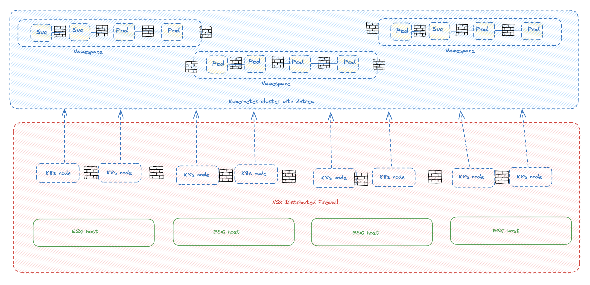

 With the illustration above in mind it is fully possible to create a very strict environment with no unwanted lateral movement. Meaning only the strict necessary firewall openings inside the kubernetes cluster between pods, namespaces and services, but also between workers in same subnet and across several several Kubernetes clusters. But the above two layers, VMs in vSphere protected by the NSX distributed firewall and apps running Kubernetes clusters and protected by Antrea Network policies, are often managed by different personas in the organization. We have the vSphere admins, Network admins, Security Admins, App Operators and App Developers. Security is crucial in a modern datacenter, so, again, the correct tools needs to be in place for the organization's security-framework to be implemented all the way down the "stack" to be compliant. Very often there is a decided theoretical security framework/design in place, but that plan is not always so straightforward to implement. 

Going back to Kubernetes again and Antrea Network policies. Antrea feature several static (and optional custom) [Tiers](https://antrea.io/docs/v1.12.0/docs/antrea-network-policy/#tier) where different types of network policies can be applied. As all the Antrea Network policies are evaluated "top-down" it is very handy to be able to place some strict rules very early in the "chain" of firewall policies to ensure the organization's security compliance is met. Being able to place these rules at the top prohibits the creation of rules further down that contradicts these top rules, they will not be evaluated. Then there is room to create a framework that gives some sense of "flexibility" to support the environment's workload according to the type of classification (prod, dev, test, dmz, trust, untrust). Other policies can be applied to further restrict movement before hitting a default block rule that takes care of anything that is not specified earlier in the "chain" of policies. The illustration below is an example of whom and where these personas can take charge and apply their needed policies.       

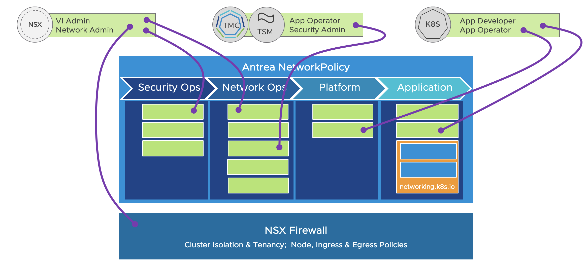

Then the next illustration is the default Static Tiers that comes with Antrea. These Tiers makes it easier to categorize the different policies in a Kubernetes cluster, but also provides a great way to delegate responsibility/permissions by using RBAC to control access to the Tiers. This means we can have some admins to apply policies in specific Tiers, and no one else can overwrite these.

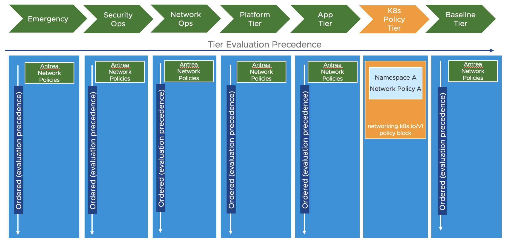 

Now, how can the different personas make sure their policies are applied? This is what I will go through next.

## Managing and making sure the required Antrea Policies are applied

Lets start out by bringing some light on the simulated requirement I mentioned above. Customer Andreas have some strict security guidelines they need to follow to ensure compliance before anyone can do anything in the Kubernetes platforms.
To be compliant according to the strict security guidelines the following must be in place:

- All Kubernetes workload clusters are considered isolated and not allowed to reach nothing more than themselves, including pods and services (all nodes in the same cluster)
- Only necessary backend functions such as DNS/NTP are allowed.
- Certain management tools need access to the clusters
- All non-system namespaces should be considered "untrusted" and isolated by default.
- RBAC needs to be in place to ensure no tampering on applied security policies.  

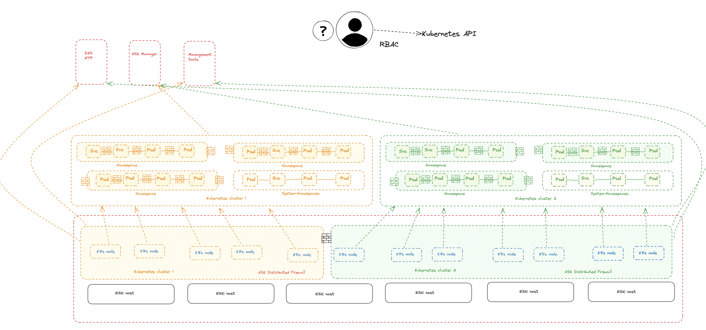

The above diagram is what customer Andreas needs to have in place. Lets go ahead and apply them. In the next sub-chapters I will show how to apply and manage the policies in three different ways to acheive this. I assume the NSX personas has done their part and applied the correct distributed firewall rules isolating the worker nodes. 

## Applying Antrea policies with kubectl

This process involves logging into a newly provisioned Kubernetes cluster (TKG cluster in my environment) that someone has provisioned, could be the vSphere admin persona, or via a self-service. Then the security admin will be using *kubectl* to log in and apply some yaml definitions to acheive the above requirements. This operation will typically be the security admin responsibilities. The definitions the security admin is applying will all be configured in the static Tier "*securityops*" with different priorities.
Here is the demo-environment I will be using in the following chapters:
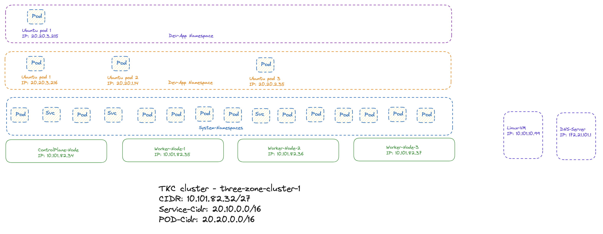


The first requirement is a "no-trust" in any non-system namespaces, where I want to achieve full isolation between namespace. No communication from one namespace to another. In the Antrea [homepage](https://antrea.io/docs/v1.12.0/docs/antrea-network-policy/) there are several examples, and I will use one of the examples that suits my need perfectly. It looks like this:

```yaml
apiVersion: crd.antrea.io/v1alpha1
kind: ClusterNetworkPolicy
metadata:
  name: strict-ns-isolation-except-system-ns
spec:
  priority: 9
  tier: securityops
  appliedTo:
    - namespaceSelector:          # Selects all non-system Namespaces in the cluster
        matchExpressions:
          - {key:  kubernetes.io/metadata.name, operator: NotIn, values: [avi-system,default,kube-node-lease,kube-public,kube-system,secretgen-controller,tanzu-continuousdelivery-resources,tanzu-fluxcd-packageinstalls,tanzu-kustomize-controller,tanzu-source-controller,tkg-system,vmware-system-auth,vmware-system-cloud-provider,vmware-system-csi,vmware-system-tkg,vmware-system-tmc]}
  ingress:
    - action: Pass
      from:
        - namespaces:
            match: Self           # Skip ACNP evaluation for traffic from Pods in the same Namespace
      name: PassFromSameNS
    - action: Drop
      from:
        - namespaceSelector: {}   # Drop from Pods from all other Namespaces
      name: DropFromAllOtherNS
  egress:
    - action: Pass
      to:
        - namespaces:
            match: Self           # Skip ACNP evaluation for traffic to Pods in the same Namespace
      name: PassToSameNS
    - action: Drop
      to:
        - namespaceSelector: {}   # Drop to Pods from all other Namespaces
      name: DropToAllOtherNS
```

  The only modifications I have done is adding all my system-namespaces.
Then I will apply it. 

```bash
# Verifying no policies in place:
andreasm@linuxvm01:~/antrea/policies/groups$ k get acnp
No resources found
andreasm@linuxvm01:~/antrea/policies/groups$ k apply -f acnp-ns-isolation-except-system-ns.yaml
clusternetworkpolicy.crd.antrea.io/strict-ns-isolation-except-system-ns created
andreasm@linuxvm01:~/antrea/policies/groups$ k get acnp
NAME                                   TIER          PRIORITY   DESIRED NODES   CURRENT NODES   AGE
strict-ns-isolation-except-system-ns   securityops   9          0               0               15s
```

Notice the 0 under *Desired Nodes* and *Current Nodes*. The reason is that this cluster is completely new, and there is no workload in any non-system namespaces yet. Here are the current namespaces:

```bash
andreasm@linuxvm01:~/antrea/policies/groups$ k get ns
NAME                                 STATUS   AGE
default                              Active   28d
kube-node-lease                      Active   28d
kube-public                          Active   28d
kube-system                          Active   28d
secretgen-controller                 Active   28d
tkg-system                           Active   28d
vmware-system-auth                   Active   28d
vmware-system-cloud-provider         Active   28d
vmware-system-csi                    Active   28d
vmware-system-tkg                    Active   28d
```

Now if I apply a couple of namespaces and deploy some workload in them:

```bash
andreasm@linuxvm01:~/antrea/policies/groups$ k apply -f dev-app.yaml -f dev-app2.yaml
namespace/dev-app created
deployment.apps/ubuntu-20-04 created
namespace/dev-app2 created
deployment.apps/ubuntu-dev-app2 created
```

How does the policy look like now?

```bash
andreasm@linuxvm01:~/antrea/policies/groups$ k get acnp
NAME                                   TIER          PRIORITY   DESIRED NODES   CURRENT NODES   AGE
strict-ns-isolation-except-system-ns   securityops   9          1               1               6s
# Why only one
andreasm@linuxvm01:~/antrea/policies/groups$ k get pods -n dev-app -owide
NAME                            READY   STATUS    RESTARTS   AGE   IP            NODE                                                      NOMINATED NODE   READINESS GATES
ubuntu-20-04-548545fc87-t2lg2   1/1     Running   0          82s   20.20.3.216   three-zone-cluster-1-node-pool-3-6r8c2-6c8d48656c-wntwc   <none>           <none>
andreasm@linuxvm01:~/antrea/policies/groups$ k get pods -n dev-app2 -owide
NAME                               READY   STATUS    RESTARTS   AGE   IP            NODE                                                      NOMINATED NODE   READINESS GATES
ubuntu-dev-app2-564f46785c-g8vb6   1/1     Running   0          86s   20.20.3.215   three-zone-cluster-1-node-pool-3-6r8c2-6c8d48656c-wntwc   <none>           <none>
```

Both workloads ended up on same node...

So far so good. Now I need to verify if it is actually enforcing anything. From one of the dev-app pods I will execute into bash and try ping another pod in one for the system-namespaces, a pod in the the other dev-app namespace and try to a dns lookup. 

```bash
andreasm@linuxvm01:~/antrea/policies/groups$ k exec -it -n dev-app ubuntu-20-04-548545fc87-t2lg2 bash
kubectl exec [POD] [COMMAND] is DEPRECATED and will be removed in a future version. Use kubectl exec [POD] -- [COMMAND] instead.
root@ubuntu-20-04-548545fc87-t2lg2:/# ping 20.20.1.7
PING 20.20.1.7 (20.20.1.7) 56(84) bytes of data.
^C
--- 20.20.1.7 ping statistics ---
170 packets transmitted, 0 received, 100% packet loss, time 173033ms
```

The ping above was from my dev-app pod to the *coredns* pod in kube-system.
Ping to the other dev-app pod in the other dev-app namespace. 

```bash
root@ubuntu-20-04-548545fc87-t2lg2:/# ping 20.20.3.215
PING 20.20.3.215 (20.20.3.215) 56(84) bytes of data.
^C
--- 20.20.3.215 ping statistics ---
9 packets transmitted, 0 received, 100% packet loss, time 8181ms
```

Is also blocked.

Now DNS lookup:

```bash
root@ubuntu-20-04-548545fc87-t2lg2:/# ping google.com
ping: google.com: Temporary failure in name resolution
#So much empty
```

DNS was also one of the requirements, so I will have to fix this also. I mean, the security admin will have to fix this otherwise going to lunch will not be such a great place to be...

As the security admin have applied the above policy in the securityops tier with a priority of 9 he need to open up for DNS with policies in a higher tier or within same tier with a lower priority number (lower equals higher priority).

This is the policy he needs to apply:

```yaml
apiVersion: crd.antrea.io/v1alpha1
kind: ClusterNetworkPolicy
metadata:
  name: allow-all-egress-dns-service
spec:
  priority: 8
  tier: securityops
  appliedTo:
    - namespaceSelector: {}
#        matchLabels:
#          k8s-app: kube-dns
  egress:
    - action: Allow
      toServices:
        - name: kube-dns
          namespace: kube-system
      name: "allowdnsegress-service"
```

A simple one, and the requirement is satisfied. Company Andreas allowed necessay functions such as DNS.. This policy will allow any namespace to reach the *kube-dns* service. 

The rule applied:

```bash
andreasm@linuxvm01:~/antrea/policies/groups$ k get acnp
NAME                                   TIER          PRIORITY   DESIRED NODES   CURRENT NODES   AGE
allow-all-egress-dns-service           securityops   8          4               4               2m24s
strict-ns-isolation-except-system-ns   securityops   9          1               1               24m
```

What about DNS lookup now:

```bash
root@ubuntu-20-04-548545fc87-t2lg2:/# ping google.com
PING google.com (172.217.12.110) 56(84) bytes of data.
64 bytes from 172.217.12.110 (172.217.12.110): icmp_seq=1 ttl=105 time=33.0 ms
64 bytes from 172.217.12.110 (172.217.12.110): icmp_seq=2 ttl=104 time=29.8 ms
64 bytes from 172.217.12.110 (172.217.12.110): icmp_seq=3 ttl=105 time=30.2 ms
64 bytes from 172.217.12.110 (172.217.12.110): icmp_seq=4 ttl=104 time=30.3 ms
64 bytes from 172.217.12.110 (172.217.12.110): icmp_seq=5 ttl=105 time=30.4 ms
^C
--- google.com ping statistics ---
5 packets transmitted, 5 received, 0% packet loss, time 4003ms
rtt min/avg/max/mdev = 29.763/30.733/32.966/1.138 ms
```

Works. 

Thats one more requirement met. Now one of the requirements was also to restrict access to services in other kubernetes clusters. Even though we trust that the NSX admins have created these isolation rules for us we need to make sure we are not allowed from the current kubernetes cluster also. 

So to acheive this the security admin needs to create *ClusterGroup* containing the CIDR for its own worker nodes. Then apply a policy using the ClusterGroup. 
Here is the ClusterGroup definition (containing the cidr for the worker nodes):

```yaml
apiVersion: crd.antrea.io/v1alpha3
kind: ClusterGroup
metadata:
  name: tz-cluster-1-node-cidr
spec:
  # ipBlocks cannot be set along with podSelector, namespaceSelector or serviceReference.
  ipBlocks:
    - cidr: 10.101.82.32/27
```

And I also need to define another ClusterGroup for all the RFC1918 subnets I need to block (this will include the cidr above):

```yaml
apiVersion: crd.antrea.io/v1alpha3
kind: ClusterGroup
metadata:
  name: tz-cluster-1-drop-cidr
spec:
  # ipBlocks cannot be set along with podSelector, namespaceSelector or serviceReference.
  ipBlocks:
    - cidr: 10.0.0.0/8
    - cidr: 172.16.0.0/12
    - cidr: 192.168.0.0/16
```

Apply them:

```bash
andreasm@linuxvm01:~/antrea/policies/groups$ k apply -f tz-cluster-1-group-node-cidr.yaml
clustergroup.crd.antrea.io/tz-cluster-1-node-cidr created
andreasm@linuxvm01:~/antrea/policies/groups$ k apply -f tz-cluster-1-drop-cidr.yaml
clustergroup.crd.antrea.io/tz-cluster-1-drop-cidr created
andreasm@linuxvm01:~/antrea/policies/groups$ k get clustergroup
NAME                     AGE
tz-cluster-1-drop-cidr   6s
tz-cluster-1-node-cidr   5s
```

And the policy to deny anything except the own kubernetes worker nodes:

```yaml
apiVersion: crd.antrea.io/v1alpha1
kind: ClusterNetworkPolicy
metadata:
  name: acnp-drop-except-own-cluster-node-cidr
spec:
  priority: 8
  tier: securityops
  appliedTo:
    - namespaceSelector:          # Selects all non-system Namespaces in the cluster
        matchExpressions:
          - {key:  kubernetes.io/metadata.name, operator: NotIn, values: [avi-system,default,kube-node-lease,kube-public,kube-system,secretgen-controller,tanzu-continuousdelivery-resources,tanzu-fluxcd-packageinstalls,tanzu-kustomize-controller,tanzu-source-controller,tkg-system,vmware-system-auth,vmware-system-cloud-provider,vmware-system-csi,vmware-system-tkg,vmware-system-tmc]}
  egress:
    - action: Allow
      to:
        - group: "tz-cluster-1-node-cidr"
    - action: Drop
      to:
        - group: "tz-cluster-1-drop-cidr"
```

Applied:

```bash
andreasm@linuxvm01:~/antrea/policies/groups$ k apply -f tz-cluster-1-drop-anything-but-own-nodes.yaml
clusternetworkpolicy.crd.antrea.io/acnp-drop-except-own-cluster-node-cidr created
andreasm@linuxvm01:~/antrea/policies/groups$ k get acnp
NAME                                     TIER          PRIORITY   DESIRED NODES   CURRENT NODES   AGE
acnp-drop-except-own-cluster-node-cidr   securityops   8          1               1               3m39s
allow-all-egress-dns-service             securityops   8          4               4               28m
strict-ns-isolation-except-system-ns     securityops   9          1               1               50m
```

From the dev-app pod again I will verify if I am allowed to SSH to a worker node in "own" Kubernetes cluster, and another Linux machine not in the ClusterGroup cidr I have applied. 

```bash
root@ubuntu-20-04-548545fc87-t2lg2:/# ssh vmware-system-user@10.101.82.34 #A worker node in the current k8s cluster
vmware-system-user@10.101.82.34's password:
#This is allowed
What about other machines outside the cidr:
root@ubuntu-20-04-548545fc87-t2lg2:/# ssh 10.101.10.99
ssh: connect to host 10.101.10.99 port 22: Connection timed out

```

That is very close to achieving this requirement also, but I should be allowed to reach pods inside same namespace regardless of which node they reside on. 
Here are my dev-app namespace with pods on all three nodes:

```bash
andreasm@linuxvm01:~/antrea/policies/groups$ k get pods -n dev-app -o wide
NAME                            READY   STATUS    RESTARTS   AGE    IP            NODE                                                      NOMINATED NODE   READINESS GATES
ubuntu-20-04-548545fc87-75nsm   1/1     Running   0          116s   20.20.2.35    three-zone-cluster-1-node-pool-2-kbzvq-6846d5cc5b-6hdmj   <none>           <none>
ubuntu-20-04-548545fc87-hhnv2   1/1     Running   0          116s   20.20.1.14    three-zone-cluster-1-node-pool-1-dgcpq-656c75f4f4-nsr2r   <none>           <none>
ubuntu-20-04-548545fc87-t2lg2   1/1     Running   0          66m    20.20.3.216   three-zone-cluster-1-node-pool-3-6r8c2-6c8d48656c-wntwc   <none>           <none>
```


```bash
root@ubuntu-20-04-548545fc87-t2lg2:/# ping 20.20.1.14
PING 20.20.1.14 (20.20.1.14) 56(84) bytes of data.
64 bytes from 20.20.1.14: icmp_seq=1 ttl=62 time=20.6 ms
64 bytes from 20.20.1.14: icmp_seq=2 ttl=62 time=2.87 ms
^C
--- 20.20.1.14 ping statistics ---
2 packets transmitted, 2 received, 0% packet loss, time 1002ms
rtt min/avg/max/mdev = 2.869/11.735/20.601/8.866 ms
root@ubuntu-20-04-548545fc87-t2lg2:/# ping 20.20.2.35
PING 20.20.2.35 (20.20.2.35) 56(84) bytes of data.
64 bytes from 20.20.2.35: icmp_seq=1 ttl=62 time=3.49 ms
64 bytes from 20.20.2.35: icmp_seq=2 ttl=62 time=2.09 ms
64 bytes from 20.20.2.35: icmp_seq=3 ttl=62 time=1.00 ms
^C
--- 20.20.2.35 ping statistics ---
3 packets transmitted, 3 received, 0% packet loss, time 2003ms
rtt min/avg/max/mdev = 1.000/2.194/3.494/1.020 ms
```


From the Antrea UI, lets do some tests there also:

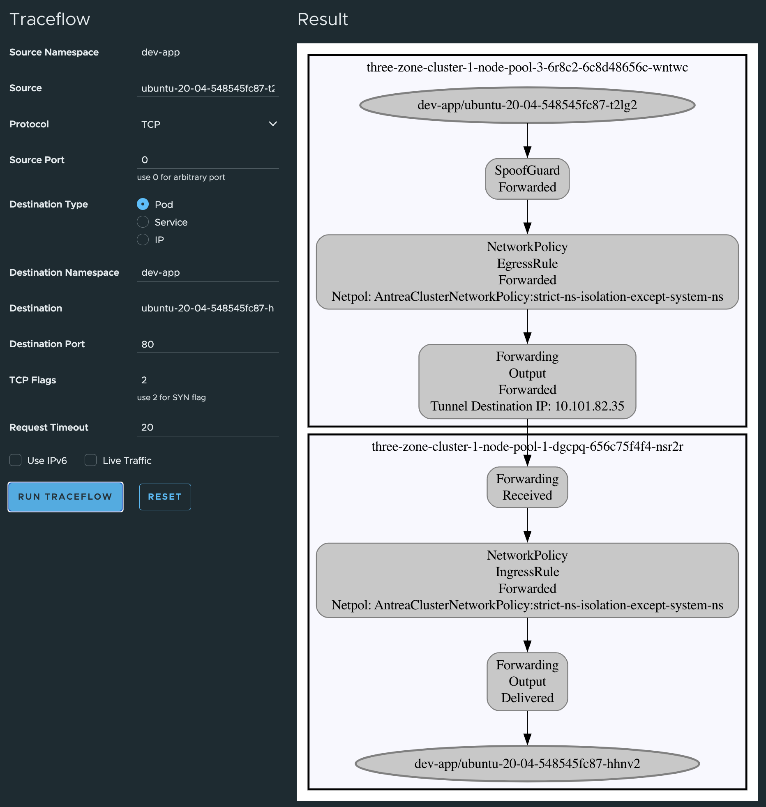

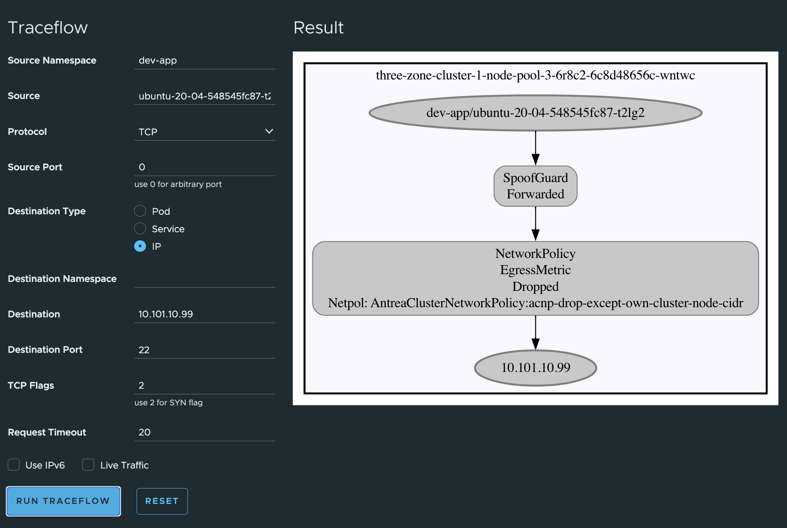

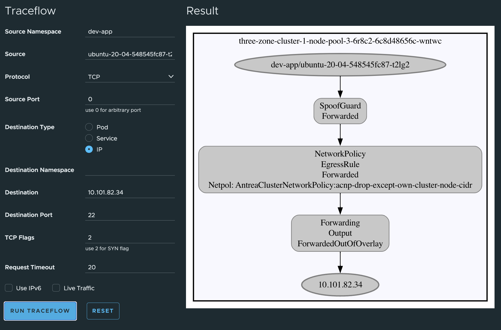


Note that I have not created any default-block-all-else-rule. There is always room for improvement, and this was just an excercise to show what is possible, not an final answer on how things should be done. Some of the policies can be even more granular like specifying only ports/protocol/FQDN etc.. 

So just to summarize what I have done:

These are the applied rules:

```bash
NAME                                     TIER          PRIORITY   DESIRED NODES   CURRENT NODES   AGE
acnp-drop-except-own-cluster-node-cidr   securityops   8          3               3               23h
allow-all-egress-dns-service             securityops   8          4               4               23h
strict-ns-isolation-except-system-ns     securityops   9          3               3               23h
```

The first rule is allowing only traffic to the nodes in its own cluster - matches this requirement "*All Kubernetes workload clusters are considered isolated and not allowed to reach nothing more than themselves, including pods and services (all nodes in the same cluster)*"

The second rule is allowing all namespaces to access the *kube-dns* service in the *kube-system* namespace - matches this requirement "*Only necessary backend functions such as DNS/NTP are allowed*"

The third rule is dropping all traffic between namespaces, except the "system"-namespaces I have defined. But it allows intra communication inside each namespace - matches this requirement "*All non-system namespaces should be considered "untrusted" and isolated by default*" 

Then I have not done anything with RBAC yet, will come later in this post. And the requirement: "*Certain management tools need access to the clusters*" I can assume the NSX admins have covered, as I am not blocking any ingress traffic to the "system"-namespaces, same is true for egress from the system-namespaces. But it could be, if adjusted to allow the necessary traffic from these namespaces to the certain management tools.  

## Applying Antrea policies using TMC - Tanzu Mission Control

This section will not create any new scenario, it will re-use all the policies created and applied in the above section. The biggest difference is how the policies are being applied. 

Not that I dont think any security admin dont want to log in to a Kubernetes cluster and apply these security policies, but it can be a bit tedious each time a new cluster is applied. What wouldnt be better then if we can auto-deploy them each time a new cluster is being deployed? Like an out-of-the-box experience? Yes, excactly. If we already have defined a policy scope for the different Kubernetes cluster in our environment, we could just apply the correct policies to each cluster respectively each time they are provisioned. This saves a lot of time. We can be sure each time a new cluster is provisioned, it is being applied with the correct set of policies. With the abiltiy to auto apply these required policies on creation or directly after creation will make provisioning out-of-the-box compliant clusters a joy. 

Now this sounds interesting, how can I do that?

....*Into the door comes TMC*.... Hello Tanzu Mission Control,  short TMC. 
With TMC we can administer Tanzu with vSphere in addition to a lot of other Kubernetes platforms. 
From the TMC official [docs](https://docs.vmware.com/en/VMware-Tanzu-Mission-Control/index.html) :

> VMware Tanzu Mission Control™ is a centralized management platform for consistently operating and securing your Kubernetes infrastructure and modern applications across multiple teams and clouds.
>
> Available through VMware Cloud™ services, Tanzu Mission Control provides operators with a single control point to give developers the independence they need to drive business forward, while ensuring consistent management and operations across environments for increased security and governance.
>
> Tanzu Mission Control provides instances of the service in regions around the world, including Australia, Canada, India, Ireland, Japan, and USA. For a list of the regions in which the Tanzu Mission Control is hosted, go to the Cloud Management Services Availability page at https://www.vmware.com/global-infrastructure.html and select **VMware Tanzu Mission Control**.
>
> Use Tanzu Mission Control to manage your entire Kubernetes footprint, regardless of where your clusters reside.


Lets cut to the chase and make my cluster compliant with the above rules. 

### Preparing TMC

In my TMC dashboard I need two thing in place: 

- A Git repository where I host my yamls, specifically my Antrea policy yamls.
- A configured Kustomization using the above Git repo

### Git repository

I will create a dedicated Git repo called tmc-cd-repo, and a folder structure. Here is my Github repo for this purpose:


Now push the yamls to this repo's subfolder antrea-baseline-policies:

```bash
andreasm:~/github_repos/tmc-cd-repo (main)$ git add .
andreasm:~/github_repos/tmc-cd-repo (main)$ git commit -s -m "ready-to-lockdown"
[main 4ab93a7] ready-to-lockdown
 4 files changed, 53 insertions(+)
 create mode 100644 antrea/antrea-baseline-policies/acnp-allow-egress-all-coredns-service.yaml
 create mode 100644 antrea/antrea-baseline-policies/tz-cluster-1-drop-anything-but-own-nodes.yaml
 create mode 100644 antrea/antrea-baseline-policies/tz-cluster-1-drop-cidr.yaml
 create mode 100644 antrea/antrea-baseline-policies/tz-cluster-1-group-node-cidr.yaml
andreasm:~/github_repos/tmc-cd-repo (main)$ git push
Enumerating objects: 11, done.
Counting objects: 100% (11/11), done.
Delta compression using up to 16 threads
Compressing objects: 100% (7/7), done.
Writing objects: 100% (8/8), 1.43 KiB | 733.00 KiB/s, done.
Total 8 (delta 1), reused 0 (delta 0), pack-reused 0
remote: Resolving deltas: 100% (1/1), done.
To github.com:andreasm80/tmc-cd-repo.git
   5c9ba04..4ab93a7  main -> main
andreasm:~/github_repos/tmc-cd-repo (main)$
```


And here they are:

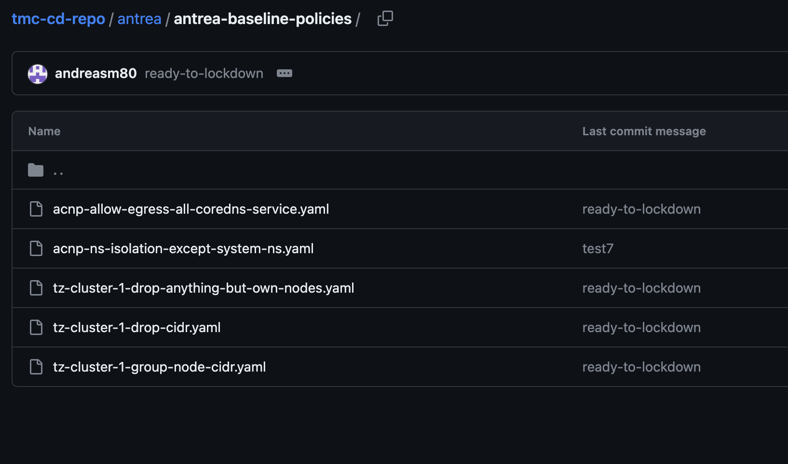

### TMC Kustomization

Now in my TMC dashboard configure Git repo:

I can choose to add the Git repo per cluster that is managed by TMC or in a cluster group. I will go with adding the Git repo on my cluster called *three-zone-cluster-1* for the moment. The benefit with adding it at the group is that it can be shared across multiple clusters. 
In TMC click Clusters and find your already managed and added cluster then click on it to "enter it". 

In your cluster group click on the tab Add-ons
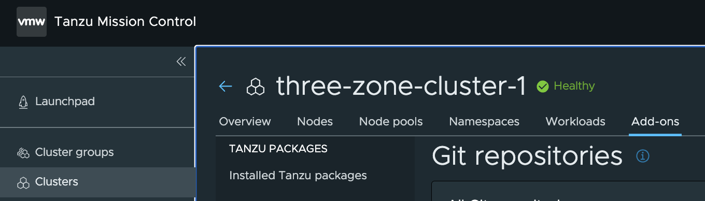


Then find Git repositories and Add Git Repository 
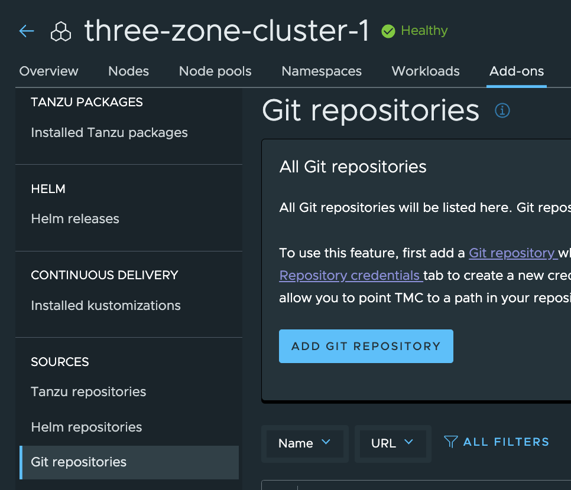


Fill in the needed fields. Make sure to expand advanced settings to update the branch to your branch or main branch. Can also adjust the sync intervall to higher or smaller. Default is 5, I have sat mine to 1. The repository url points to the actual repository, no subfolders. This is because in the Kustomization later we can have multiple pointing to the respective subfolder which can then be unique pr cluster etc. Make sure you also choose "no credentials needed" under Repository Credentials if using a public Git repo as I am.
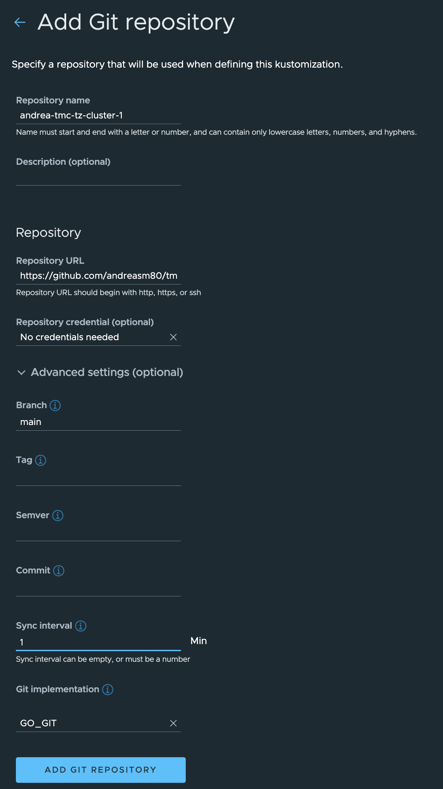


After save you should see a green status:
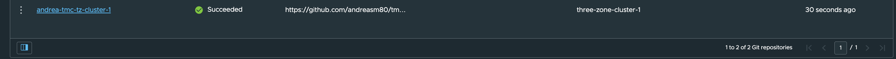


Now, we need to add a Kustomization. This can also be done in either a group or pr cluster. I will start with adding it directly to my specific cluster. 
In TMC click Cluster and select your cluster.
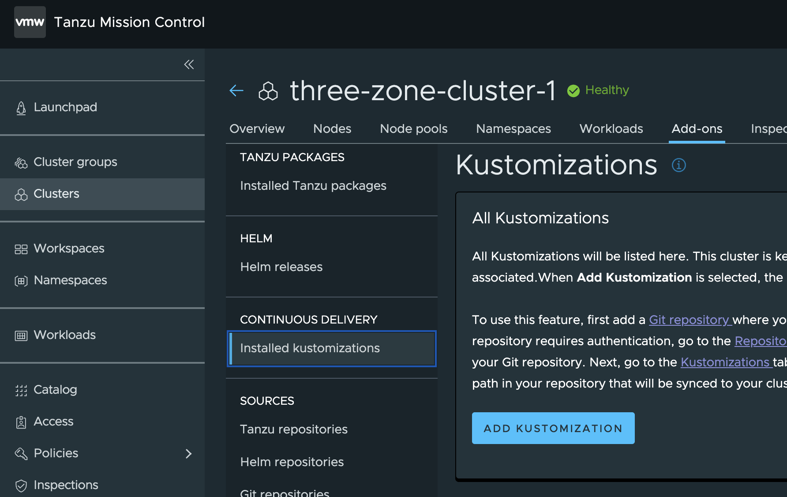

Click Add-ons, Under Continuous Delivery click Installed Kustomizations. Add Kustomization.

Before I add my Kustomization, I have made sure I have deleted all the policies and groups in my test-cluster three-zone-cluster-1:

```bash
andreasm@linuxvm01:~/antrea/policies/groups$ k get acnp
No resources found
andreasm@linuxvm01:~/antrea/policies/groups$ k get clustergroups
No resources found
```

Then I will continue and add the Kustomization:


Make sure to point to the correct subfolder in the Git repo. I have enabled the Prune option so I everything deployed via Kustomization will be deleted in my cluster if I decide to remove the Kustomization. 

Click add. 

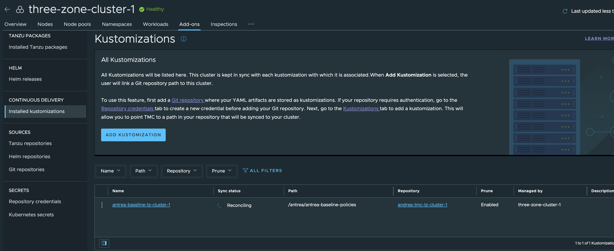

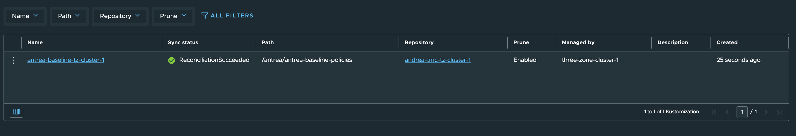

Click refresh in the top right corner, and it should be green. Lets check the policies and groups in the cluster itself.. 

```bash
andreasm@linuxvm01:~/antrea/policies/groups$ k get acnp
NAME                                     TIER          PRIORITY   DESIRED NODES   CURRENT NODES   AGE
acnp-drop-except-own-cluster-node-cidr   securityops   8          3               3               70s
allow-all-egress-dns-service             securityops   8          4               4               70s
strict-ns-isolation-except-system-ns     securityops   9          3               3               70s
andreasm@linuxvm01:~/antrea/policies/groups$ k get clustergroups
NAME                     AGE
tz-cluster-1-drop-cidr   73s
tz-cluster-1-node-cidr   73s
```

The Antrea Policies have been applied. 

### Deploy TKC cluster from TMC - auto apply security policies

The above section enabled Kustomization on a already managed TKC cluster in TMC. In this section I will apply a TKC cluster from TMC and let the Antrea policies be automatically be applied. 

In TMC I will create two Cluster Groups, one called *andreas-dev-clusters* and one called *andreas-prod-clusters*. 
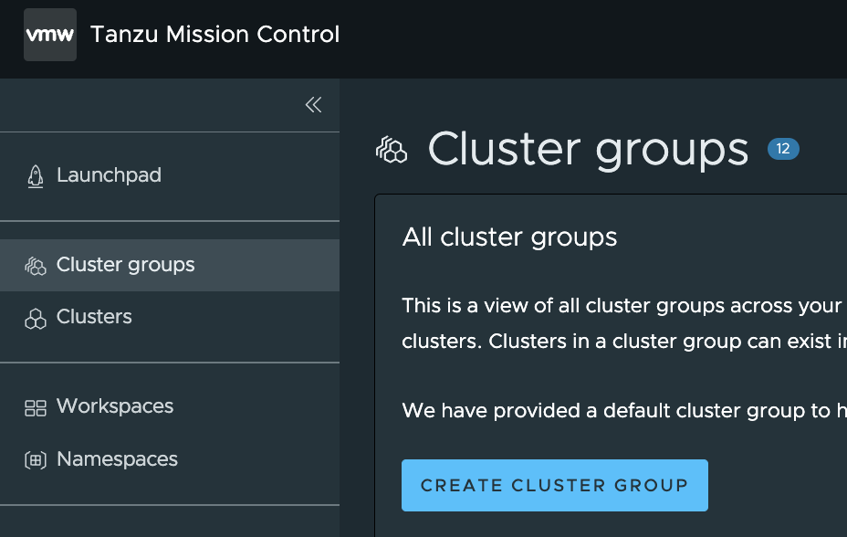

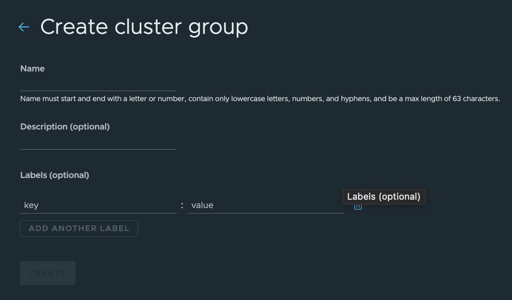

After I have added the two cluster groups I will configure *Add-ons*. Same as in previous section, adding the the Git reop but this time I will point to the different subfolders I created in my Git repo. I have created two different sub-folders in my Git repo called: *tmc-cd-repo/antrea/antrea-baseline-policies/**dev-clusters***  and *tmc-cd-repo/antrea/antrea-baseline-policies/**prod-clusters***. The reason I have done that is because I want the option to apply different Antrea policies for certain clusters, different environments different needs. 

Before adding the Git repo on the two new Cluster groups in TMC I need to enable continuous delivere by clicking on this blue button. 
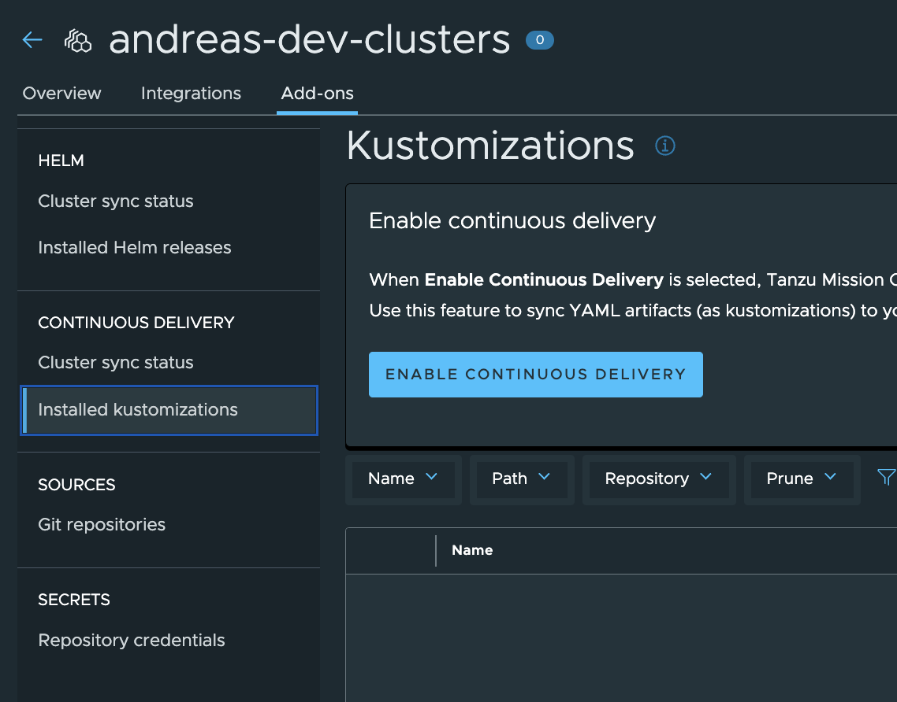

 

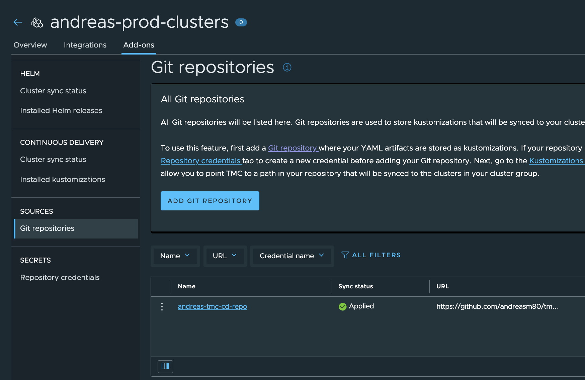

The Git repo has been added two both my new cluster groups. Now I just need to add the Kustomization pointing to my new Git repo subfolders **dev-clusters** and **prod-clusters**.

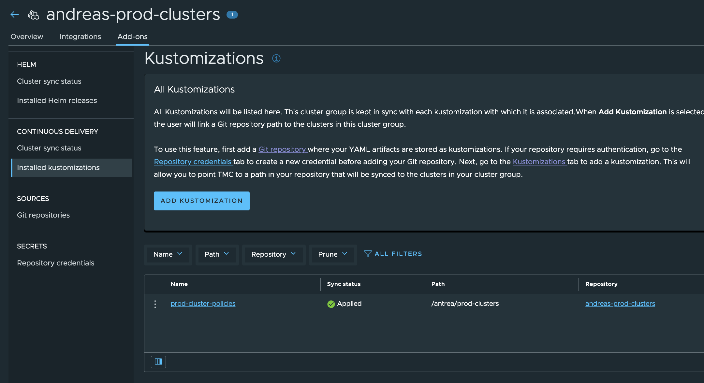

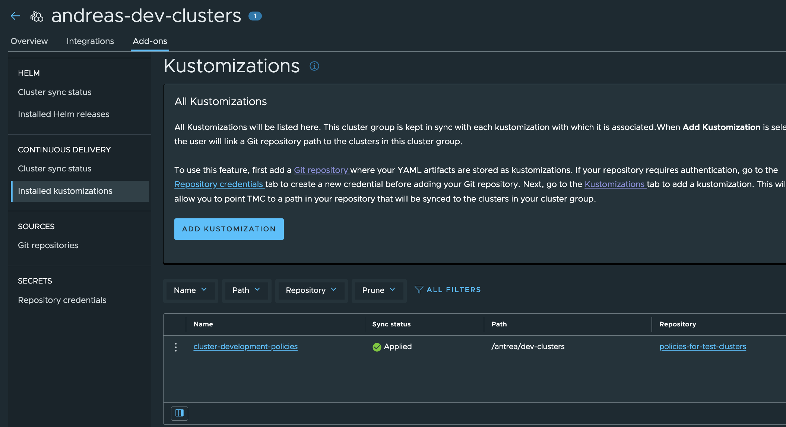


Now the preparations have been done in TMC, it is time to deploy the two TKC clusters from TMC and see if my policies are automatically applied. One "prod-cluster" and one "dev-cluster".

Lets start with the "prod-cluster"
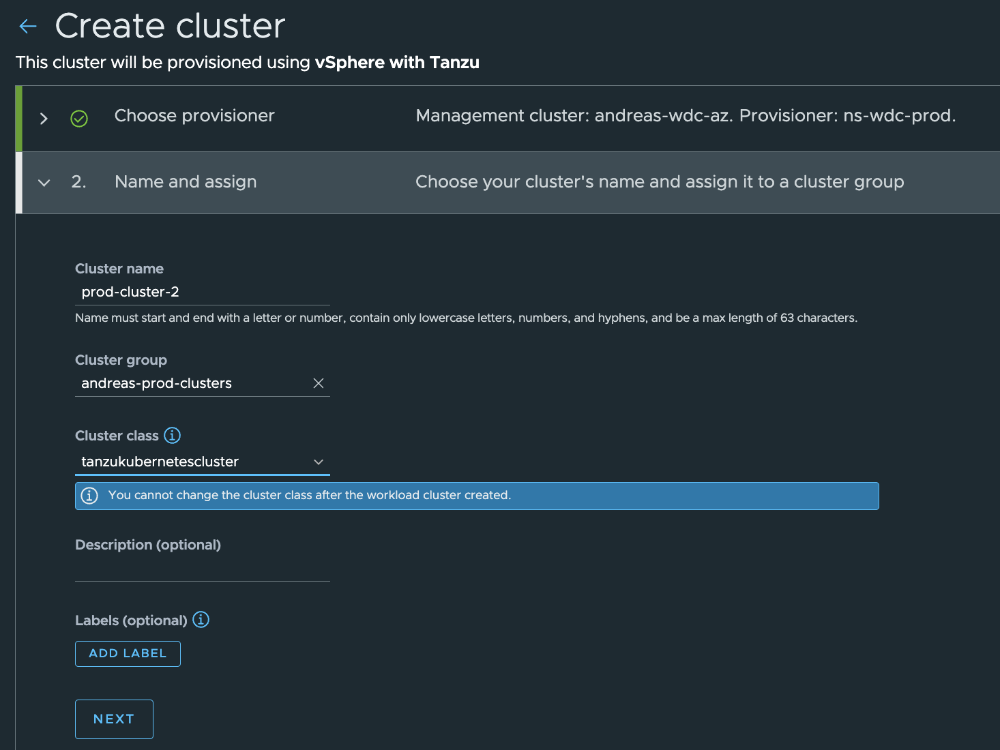

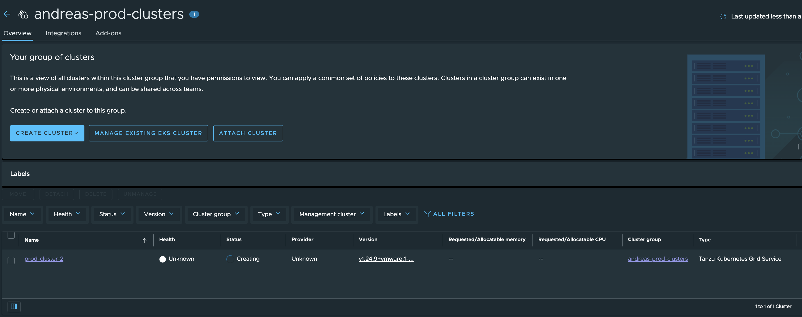

Creating the dev-cluster
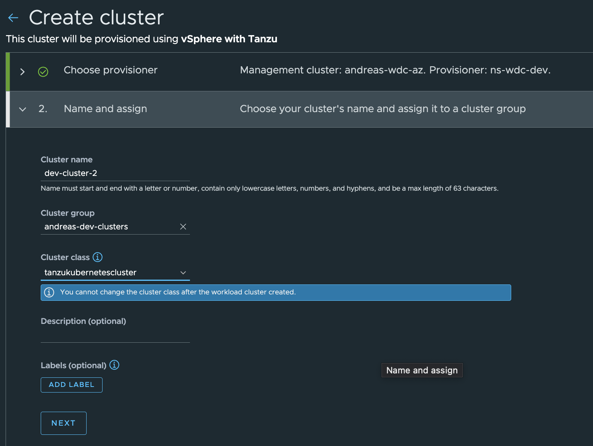

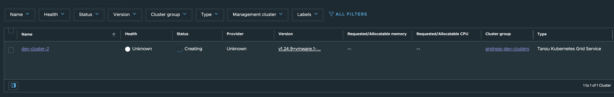

The clusters are ready:
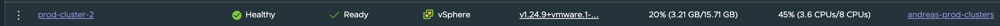


Let us check the sync status of my Kustomizations.
Prod-Cluster Group:
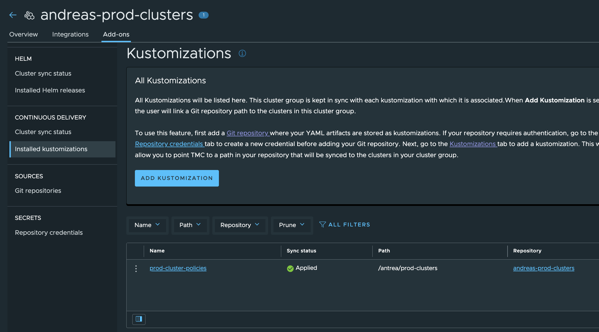

Dev-Cluster Group:
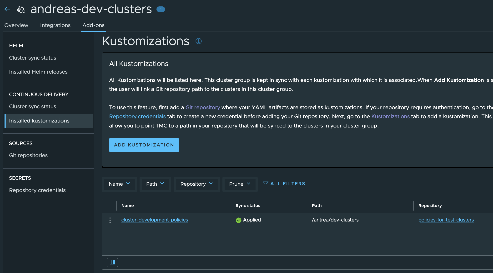

Still applied.

Lets have a look inside the two TKC cluster using kubectl.
Prod-Cluster-2:

```bash
andreasm@linuxvm01:~/antrea/policies/groups$ k config current-context
prod-cluster-2
andreasm@linuxvm01:~/antrea/policies/groups$ k get acnp
NAME                                                   TIER          PRIORITY   DESIRED NODES   CURRENT NODES   AGE
allow-all-egress-dns-service                           securityops   8          2               2               35m
prod-clusters-acnp-drop-except-own-cluster-node-cidr   securityops   8          0               0               35m
prod-clusters-strict-ns-isolation-except-system-ns     securityops   9          0               0               35m
```


Dev-Cluster-2:

```bash
andreasm@linuxvm01:~/antrea/policies/groups$ k config current-context
dev-cluster-2
andreasm@linuxvm01:~/antrea/policies/groups$ k get acnp
NAME                                                  TIER          PRIORITY   DESIRED NODES   CURRENT NODES   AGE
dev-clusters-strict-ns-isolation-except-system-ns     securityops   9          0               0               45s
dev-clusters-acnp-drop-except-own-cluster-node-cidr   securityops   8          0               0               45s
dev-clusters-allow-all-egress-dns-service             securityops   8          2               2               45s
```

 

Thats it then, if I need to change the policies I can just edit policies, git add, commit and push and they will be applied to all clusters in the group. 
By enabling this feature in TMC its just all about adding or attaching your clusters in the respective group in TMC and they will automatically get all the needed yamls applied. 
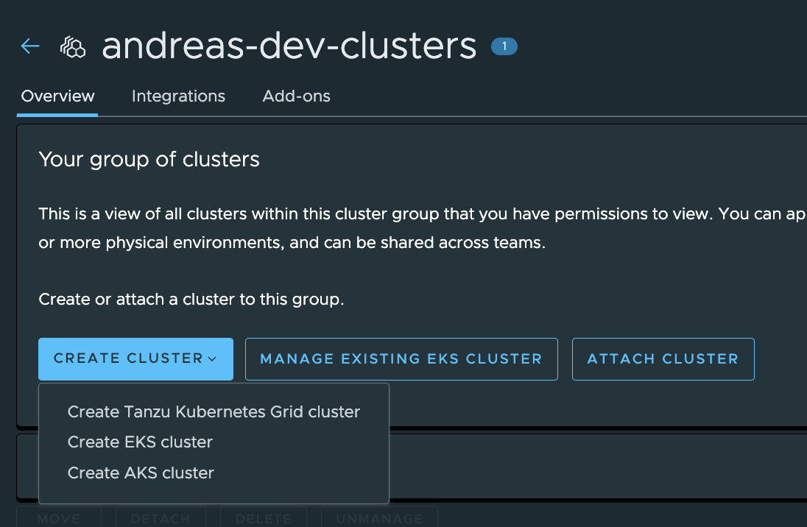


## Applying Antrea policies with NSX

With NSX one can also manage the native Antrea policies inside each TKC cluster (or any other Kubernetes cluster Antrea supports for that matter). I have written about this [here](https://blog.andreasm.io/2023/06/01/managing-antrea-in-vsphere-with-tanzu/#integrating-antrea-with-nsx-t). NSX can also create security policies "outside" the TKC cluster by using the inventory information it gets from Antrea and enforce them in the NSX Distributed firewall, a short section on this below. 

### Applying Antrea native policies from the NSX manager 

So in this section I will quickly go through using the same "framework" as above using NSX as the "management-plane". 
Just a reminder, we have these three policies:

```bash
NAME                                     TIER          PRIORITY   DESIRED NODES   CURRENT NODES   AGE
acnp-drop-except-own-cluster-node-cidr   securityops   8          3               3               23h
allow-all-egress-dns-service             securityops   8          4               4               23h
strict-ns-isolation-except-system-ns     securityops   9          3               3               23h
```

The first rule is allowing only traffic to the nodes in its own cluster - matches this requirement "*All Kubernetes workload clusters are considered isolated and not allowed to reach nothing more than themselves, including pods and services (all nodes in the same cluster)*"

The second rule is allowing all namespaces to access the *kube-dns* service in the *kube-system* namespace - matches this requirement "*Only necessary backend functions such as DNS/NTP are allowed*"

The third rule is dropping all traffic between namespaces, except the "system"-namespaces I have defined. But it allows intra communication inside each namespace - matches this requirement "*All non-system namespaces should be considered "untrusted" and isolated by default*"

In NSX I will need to create some Security Groups, then use these groups in a Security Policy. So I will start by creating the Security Group for the concerning kube-dns service:

One can either define the service kube-dns: 

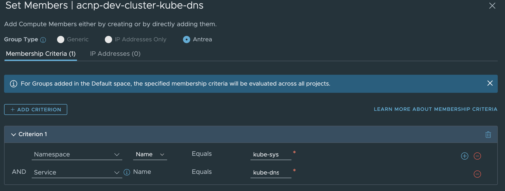

Or the pods that is responsible for the DNS service (CoreDNS:

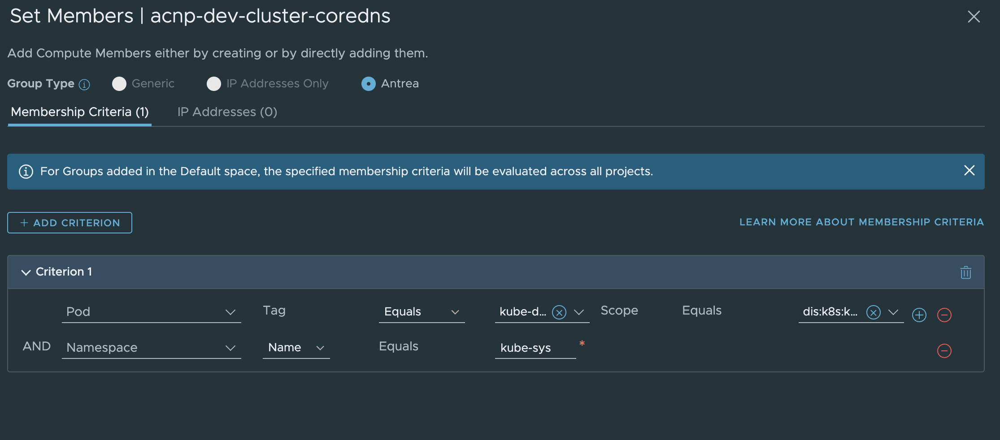

This depends on how we define the policy in NSX. I have gone with the pod selection group.

AS the requirement supports all services to access DNS, I dont have to create a security group for the source. Then the policy will look like this in NSX:

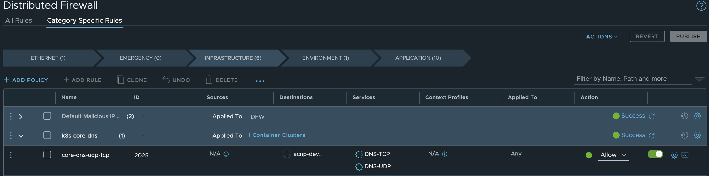

Notice also that I have placed the policy in the *Infrastructrue* Tier in NSX. 

This is how it looks like in the Kubernetes clusters:

```yaml
andreasm@linuxvm01:~/antrea/policies/groups$ k get acnp 933e463e-c061-4e80-80b3-eff3402e41a9 -oyaml
apiVersion: crd.antrea.io/v1alpha1
kind: ClusterNetworkPolicy
metadata:
  annotations:
    ccp-adapter.antrea.tanzu.vmware.com/display-name: k8s-core-dns
  creationTimestamp: "2023-06-27T11:15:30Z"
  generation: 11
  labels:
    ccp-adapter.antrea.tanzu.vmware.com/managedBy: ccp-adapter
  name: 933e463e-c061-4e80-80b3-eff3402e41a9
  resourceVersion: "2248486"
  uid: a5d7378d-ede0-4f8c-848b-413c10ce5602
spec:
  egress:
  - action: Allow
    appliedTo:
    - podSelector: {}
    enableLogging: false
    name: "2025"
    ports:
    - port: 53
      protocol: TCP
    - port: 53
      protocol: UDP
    to:
    - group: c7e96b35-1961-4659-8a62-688a0e98fe63
  priority: 1.0000000177635693
  tier: nsx-category-infrastructure
status:
  currentNodesRealized: 4
  desiredNodesRealized: 4
  observedGeneration: 11
  phase: Realized
```

```bash
andreasm@linuxvm01:~/antrea/policies/groups$ k get tiers
NAME                          PRIORITY   AGE
application                   250        6d1h
baseline                      253        6d1h
emergency                     50         6d1h
networkops                    150        6d1h
nsx-category-application      4          6d
nsx-category-emergency        1          6d
nsx-category-environment      3          6d
nsx-category-ethernet         0          6d
nsx-category-infrastructure   2          6d
platform                      200        6d1h
securityops                   100        6d1h
```

For the next policy, allowing only node in same cluster, I will need to create two groups with "ip-blocks" containing all RFC1918 in one group and the actual node range in the second:
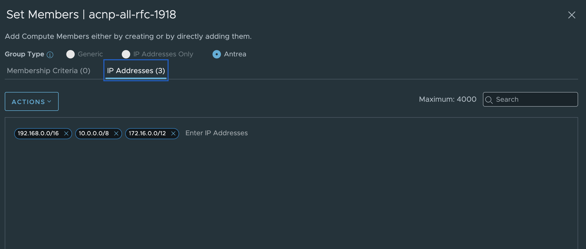

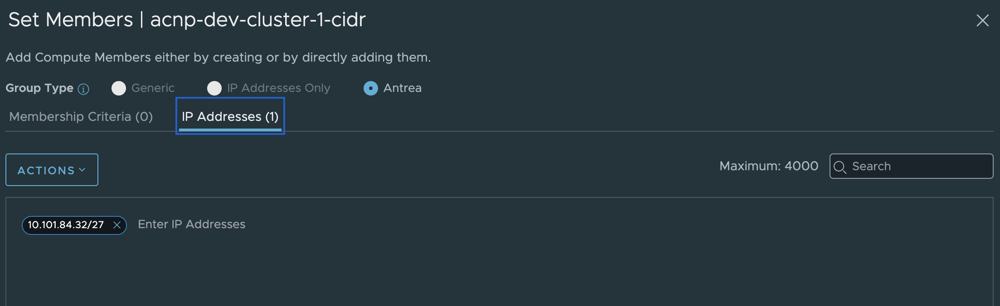

The policy in NSX will then look like this:
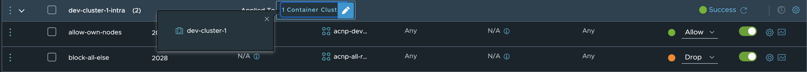

This is how it looks like in the Kubernetes clusters:

```yaml
apiVersion: crd.antrea.io/v1alpha1
kind: ClusterNetworkPolicy
metadata:
  annotations:
    ccp-adapter.antrea.tanzu.vmware.com/display-name: dev-cluster-1-intra
  creationTimestamp: "2023-07-03T12:27:13Z"
  generation: 2
  labels:
    ccp-adapter.antrea.tanzu.vmware.com/managedBy: ccp-adapter
  name: 17dbadce-06cf-4d1e-9747-3e888f0f58e0
  resourceVersion: "2257468"
  uid: 73814a58-2da8-44c2-ba85-2522865430d1
spec:
  egress:
  - action: Allow
    appliedTo:
    - podSelector: {}
    enableLogging: false
    name: "2027"
    to:
    - group: 2051f64c-8c65-46a2-8397-61c926c8c4ce
  - action: Drop
    appliedTo:
    - podSelector: {}
    enableLogging: false
    name: "2028"
    to:
    - group: 5bfc16b1-08f3-48bd-91f9-fee3d66762b1
  priority: 1.000000017763571
  tier: nsx-category-infrastructure
status:
  currentNodesRealized: 4
  desiredNodesRealized: 4
  observedGeneration: 2
  phase: Realized
```

Where the groups contain this:

```yaml
apiVersion: crd.antrea.io/v1alpha3
kind: ClusterGroup
metadata:
  annotations:
    ccp-adapter.antrea.tanzu.vmware.com/createdFrom: nestdbGroupMsg
    ccp-adapter.antrea.tanzu.vmware.com/display-name: 2051f64c-8c65-46a2-8397-61c926c8c4ce
  creationTimestamp: "2023-07-03T12:27:13Z"
  generation: 1
  labels:
    ccp-adapter.antrea.tanzu.vmware.com/managedBy: ccp-adapter
  name: 2051f64c-8c65-46a2-8397-61c926c8c4ce
  resourceVersion: "2257281"
  uid: 18009c1b-c44f-4c75-a9f2-8a30e2415859
spec:
  childGroups:
  - 2051f64c-8c65-46a2-8397-61c926c8c4ce-0
status:
  conditions:
  - lastTransitionTime: "2023-07-03T12:27:13Z"
    status: "True"
    type: GroupMembersComputed
andreasm@linuxvm01:~/nsx-antrea-integration$ k get clustergroup 2051f64c-8c65-46a2-8397-61c926c8c4ce-0 -oyaml
apiVersion: crd.antrea.io/v1alpha3
kind: ClusterGroup
metadata:
  annotations:
    ccp-adapter.antrea.tanzu.vmware.com/createdFrom: nestdbGroupMsg
    ccp-adapter.antrea.tanzu.vmware.com/display-name: 2051f64c-8c65-46a2-8397-61c926c8c4ce-0
    ccp-adapter.antrea.tanzu.vmware.com/parent: 2051f64c-8c65-46a2-8397-61c926c8c4ce
  creationTimestamp: "2023-07-03T12:27:13Z"
  generation: 1
  labels:
    ccp-adapter.antrea.tanzu.vmware.com/managedBy: ccp-adapter
  name: 2051f64c-8c65-46a2-8397-61c926c8c4ce-0
  resourceVersion: "2257278"
  uid: b1d4a59b-0557-4f6c-a08c-7b76af6bca8c
spec:
  ipBlocks:
  - cidr: 10.101.84.32/27
status:
  conditions:
  - lastTransitionTime: "2023-07-03T12:27:13Z"
    status: "True"
    type: GroupMembersComputed
```

```yaml
andreasm@linuxvm01:~/nsx-antrea-integration$ k get clustergroup 5bfc16b1-08f3-48bd-91f9-fee3d66762b1 -oyaml
apiVersion: crd.antrea.io/v1alpha3
kind: ClusterGroup
metadata:
  annotations:
    ccp-adapter.antrea.tanzu.vmware.com/createdFrom: nestdbGroupMsg
    ccp-adapter.antrea.tanzu.vmware.com/display-name: 5bfc16b1-08f3-48bd-91f9-fee3d66762b1
  creationTimestamp: "2023-07-03T12:27:13Z"
  generation: 1
  labels:
    ccp-adapter.antrea.tanzu.vmware.com/managedBy: ccp-adapter
  name: 5bfc16b1-08f3-48bd-91f9-fee3d66762b1
  resourceVersion: "2257282"
  uid: 6782589e-8488-47df-a750-04432c3c2f18
spec:
  childGroups:
  - 5bfc16b1-08f3-48bd-91f9-fee3d66762b1-0
status:
  conditions:
  - lastTransitionTime: "2023-07-03T12:27:13Z"
    status: "True"
    type: GroupMembersComputed
andreasm@linuxvm01:~/nsx-antrea-integration$ k get clustergroup 5bfc16b1-08f3-48bd-91f9-fee3d66762b1-0 -oyaml
apiVersion: crd.antrea.io/v1alpha3
kind: ClusterGroup
metadata:
  annotations:
    ccp-adapter.antrea.tanzu.vmware.com/createdFrom: nestdbGroupMsg
    ccp-adapter.antrea.tanzu.vmware.com/display-name: 5bfc16b1-08f3-48bd-91f9-fee3d66762b1-0
    ccp-adapter.antrea.tanzu.vmware.com/parent: 5bfc16b1-08f3-48bd-91f9-fee3d66762b1
  creationTimestamp: "2023-07-03T12:27:13Z"
  generation: 1
  labels:
    ccp-adapter.antrea.tanzu.vmware.com/managedBy: ccp-adapter
  name: 5bfc16b1-08f3-48bd-91f9-fee3d66762b1-0
  resourceVersion: "2257277"
  uid: fd2a1c32-1cf8-4ca8-8dad-f5420f57e55c
spec:
  ipBlocks:
  - cidr: 192.168.0.0/16
  - cidr: 10.0.0.0/8
  - cidr: 172.16.0.0/12
status:
  conditions:
  - lastTransitionTime: "2023-07-03T12:27:13Z"
    status: "True"
    type: GroupMembersComputed
```


Now the last rule is blocking all non-system namespaces to any other namespace than themselves. 

First I need to create a Security Group with the namespace as sole member, then a Security Group with the criteria not-equals.
Group for the namespace:
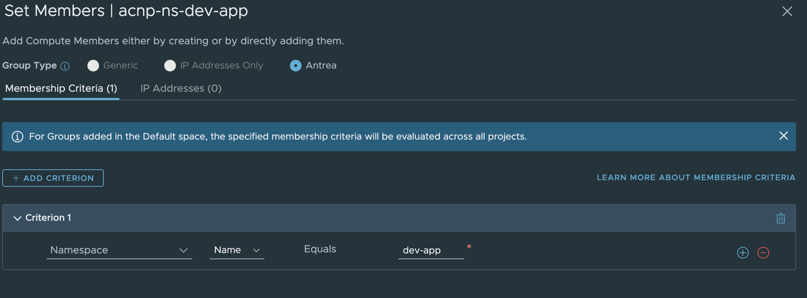

Negated Security Group, selecting all pods which does not have the same label as any pods in the namespace "dev-app".
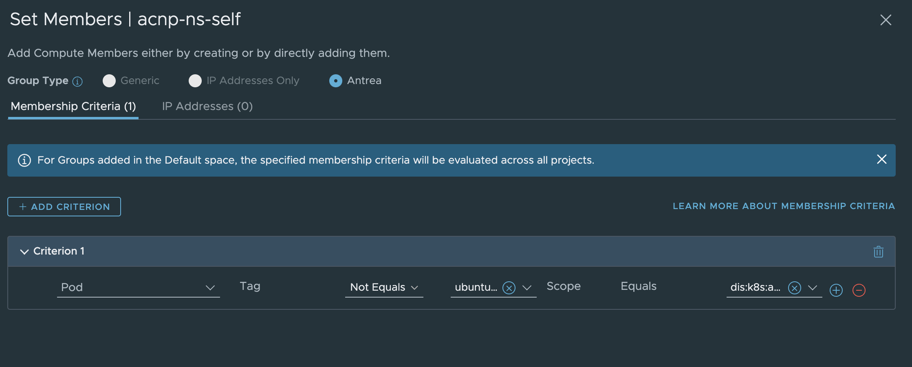

Then the Security Policy looks like this:
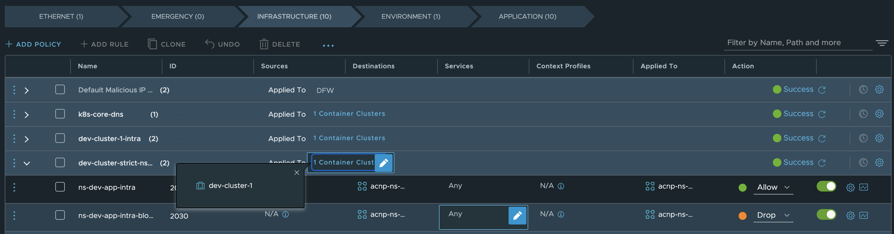

This is how it looks like in the Kubernetes clusters:

```yaml
apiVersion: crd.antrea.io/v1alpha1
kind: ClusterNetworkPolicy
metadata:
  annotations:
    ccp-adapter.antrea.tanzu.vmware.com/display-name: dev-cluster-strict-ns-islolation
  creationTimestamp: "2023-07-03T13:00:40Z"
  generation: 3
  labels:
    ccp-adapter.antrea.tanzu.vmware.com/managedBy: ccp-adapter
  name: cfbe3754-c365-4697-b124-5fbaddd87b57
  resourceVersion: "2267847"
  uid: 47949441-a69b-47e5-ae9b-1d5760d5c195
spec:
  egress:
  - action: Allow
    appliedTo:
    - group: beed7011-4fc7-49e6-b7ed-d521095eb293
    enableLogging: false
    name: "2029"
    to:
    - group: beed7011-4fc7-49e6-b7ed-d521095eb293
  - action: Drop
    appliedTo:
    - group: beed7011-4fc7-49e6-b7ed-d521095eb293
    enableLogging: false
    name: "2030"
    to:
    - group: f240efd5-3a95-49d3-9252-058cc80bc0c0
  priority: 1.0000000177635728
  tier: nsx-category-infrastructure
status:
  currentNodesRealized: 3
  desiredNodesRealized: 3
  observedGeneration: 3
  phase: Realized
```

Where the cluster groups look like this:

```yaml
andreasm@linuxvm01:~/nsx-antrea-integration$ k get clustergroup beed7011-4fc7-49e6-b7ed-d521095eb293 -oyaml
apiVersion: crd.antrea.io/v1alpha3
kind: ClusterGroup
metadata:
  annotations:
    ccp-adapter.antrea.tanzu.vmware.com/createdFrom: nestdbGroupMsg
    ccp-adapter.antrea.tanzu.vmware.com/display-name: beed7011-4fc7-49e6-b7ed-d521095eb293
  creationTimestamp: "2023-07-03T13:00:40Z"
  generation: 1
  labels:
    ccp-adapter.antrea.tanzu.vmware.com/managedBy: ccp-adapter
  name: beed7011-4fc7-49e6-b7ed-d521095eb293
  resourceVersion: "2266125"
  uid: 7bf8d0f4-d719-47d5-98a9-5fba3b5da7b9
spec:
  childGroups:
  - beed7011-4fc7-49e6-b7ed-d521095eb293-0
status:
  conditions:
  - lastTransitionTime: "2023-07-03T13:00:41Z"
    status: "True"
    type: GroupMembersComputed
andreasm@linuxvm01:~/nsx-antrea-integration$ k get clustergroup beed7011-4fc7-49e6-b7ed-d521095eb293-0 -oyaml
apiVersion: crd.antrea.io/v1alpha3
kind: ClusterGroup
metadata:
  annotations:
    ccp-adapter.antrea.tanzu.vmware.com/createdFrom: nestdbGroupMsg
    ccp-adapter.antrea.tanzu.vmware.com/display-name: beed7011-4fc7-49e6-b7ed-d521095eb293-0
    ccp-adapter.antrea.tanzu.vmware.com/parent: beed7011-4fc7-49e6-b7ed-d521095eb293
  creationTimestamp: "2023-07-03T13:00:40Z"
  generation: 1
  labels:
    ccp-adapter.antrea.tanzu.vmware.com/managedBy: ccp-adapter
  name: beed7011-4fc7-49e6-b7ed-d521095eb293-0
  resourceVersion: "2266123"
  uid: 4b393674-981a-488c-a2e2-d794f0b0a312
spec:
  namespaceSelector:
    matchExpressions:
    - key: kubernetes.io/metadata.name
      operator: In
      values:
      - dev-app
status:
  conditions:
  - lastTransitionTime: "2023-07-03T13:00:41Z"
    status: "True"
    type: GroupMembersComputed
```

```yaml
andreasm@linuxvm01:~/nsx-antrea-integration$ k get clustergroup f240efd5-3a95-49d3-9252-058cc80bc0c0 -oyaml
apiVersion: crd.antrea.io/v1alpha3
kind: ClusterGroup
metadata:
  annotations:
    ccp-adapter.antrea.tanzu.vmware.com/createdFrom: nestdbGroupMsg
    ccp-adapter.antrea.tanzu.vmware.com/display-name: f240efd5-3a95-49d3-9252-058cc80bc0c0
  creationTimestamp: "2023-07-03T13:06:59Z"
  generation: 1
  labels:
    ccp-adapter.antrea.tanzu.vmware.com/managedBy: ccp-adapter
  name: f240efd5-3a95-49d3-9252-058cc80bc0c0
  resourceVersion: "2267842"
  uid: cacd1386-a434-4c42-8739-6813dd1d475b
spec:
  childGroups:
  - f240efd5-3a95-49d3-9252-058cc80bc0c0-0
status:
  conditions:
  - lastTransitionTime: "2023-07-03T13:07:00Z"
    status: "True"
    type: GroupMembersComputed
andreasm@linuxvm01:~/nsx-antrea-integration$ k get clustergroup f240efd5-3a95-49d3-9252-058cc80bc0c0-0 -oyaml
apiVersion: crd.antrea.io/v1alpha3
kind: ClusterGroup
metadata:
  annotations:
    ccp-adapter.antrea.tanzu.vmware.com/createdFrom: nestdbGroupMsg
    ccp-adapter.antrea.tanzu.vmware.com/display-name: f240efd5-3a95-49d3-9252-058cc80bc0c0-0
    ccp-adapter.antrea.tanzu.vmware.com/parent: f240efd5-3a95-49d3-9252-058cc80bc0c0
  creationTimestamp: "2023-07-03T13:06:59Z"
  generation: 5
  labels:
    ccp-adapter.antrea.tanzu.vmware.com/managedBy: ccp-adapter
  name: f240efd5-3a95-49d3-9252-058cc80bc0c0-0
  resourceVersion: "2269597"
  uid: bd7f4526-2be9-4a4e-860e-0bb85ea30516
spec:
  podSelector:
    matchExpressions:
    - key: app
      operator: NotIn
      values:
      - ubuntu-20-04
status:
  conditions:
  - lastTransitionTime: "2023-07-03T13:07:00Z"
    status: "True"
    type: GroupMembersComputed
```

With all three policies applied, they look like this in the TKC cluster:

```bash
andreasm@linuxvm01:~/antrea/policies/groups$ k get acnp
NAME                                   TIER                          PRIORITY             DESIRED NODES   CURRENT NODES   AGE
17dbadce-06cf-4d1e-9747-3e888f0f58e0   nsx-category-infrastructure   1.000000017763571    4               4               18h
933e463e-c061-4e80-80b3-eff3402e41a9   nsx-category-infrastructure   1.0000000177635702   4               4               18h
cfbe3754-c365-4697-b124-5fbaddd87b57   nsx-category-infrastructure   1.0000000177635728   3               3               17h
```


By using NSX managing the Antrea policies there is also a very easy way to verify if the policies are working or not by using the Traffic Analysis tool in NSX:
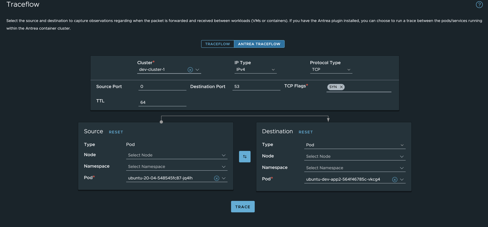

This tools will also inform you of any policies applied by using kubectl inside the cluster, in other words it can also show you policies not created or applied from the NSX manager. 

I have applied a Antrea Policy directly in the TKC cluster using kubectl called *block-ns-app3-app4*.

```bash
andreasm@linuxvm01:~/antrea/policies/groups$ k get acnp
NAME                                   TIER                          PRIORITY             DESIRED NODES   CURRENT NODES   AGE
17dbadce-06cf-4d1e-9747-3e888f0f58e0   nsx-category-infrastructure   1.000000017763571    4               4               20h
933e463e-c061-4e80-80b3-eff3402e41a9   nsx-category-infrastructure   1.0000000177635702   4               4               20h
block-ns-app3-app4   #this             securityops                   4                    1               1               3s
cfbe3754-c365-4697-b124-5fbaddd87b57   nsx-category-infrastructure   1.0000000177635728   3               3               20h
```

If I do a traceroute from within NSX from a pod in ns Dev-App3 to a pod in ns Dev-App4 and hit this rule, the NSX manager will show me this:
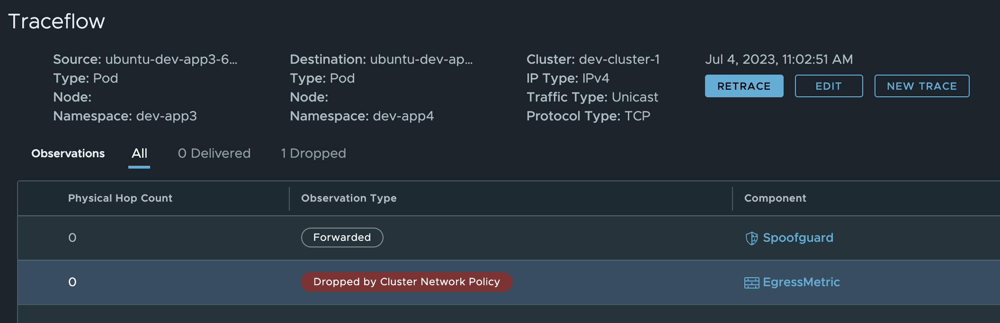

Its clearly doing its job and blocking the traffic, but which rule is it?
Click on EgressMetric, copy the rule id and paste it in the search field in NSX:
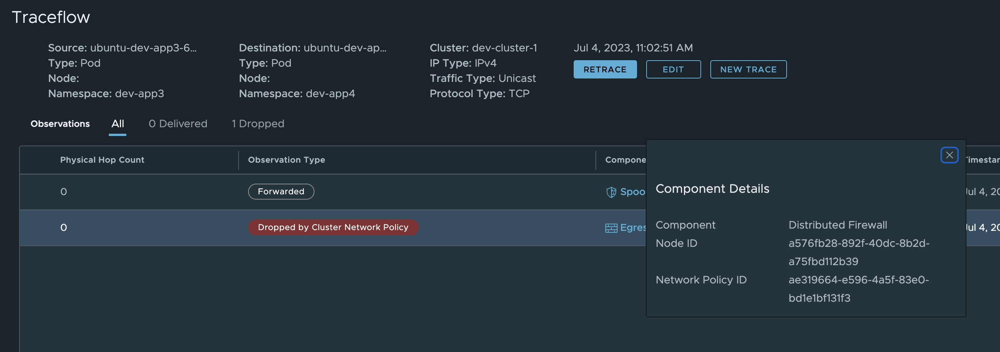

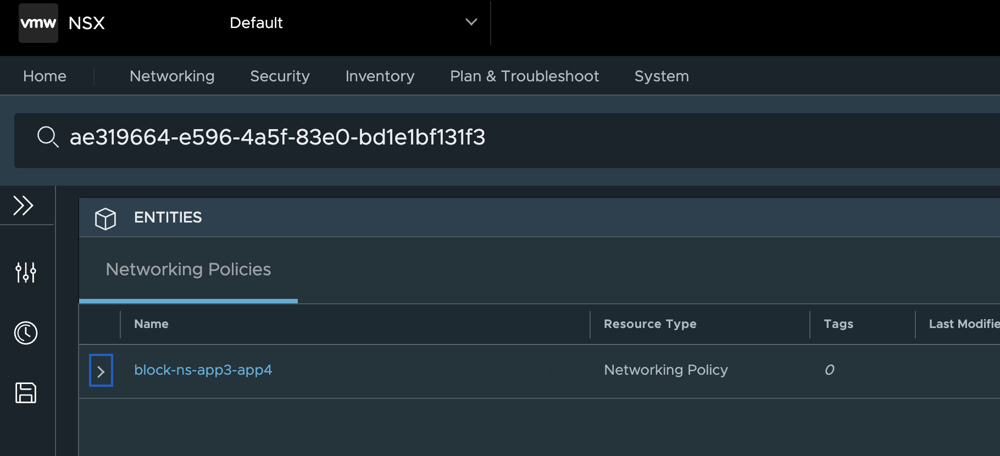

### Applying Kubernetes related policies using inventory information from Antrea

As mentioned above, NSX can also utilize the information from TKC cluster (or any Kubernetes cluster that uses Antrea) to enforce them in the Distributed firewall. The information NSX is currently:

- Kubernetes Cluster - Used to create security group containing Kubernetes clusters by name, not used alone but in combination with the below ->
- Kubernetes Namespace - Used to create security group containing Kubernetes clusters namespace by name or tag, not used alone but in combination from a Kubernetes cluster defined above. 
- Kubernetes Service - Used to create security group containing Kubernetes Services  by name or tag, not used alone but in combination with any of the above ->
- Kubernetes Ingress - Used to create security group containing Kubernetes Ingresses by name or tag, not used alone but in combination with any of the above Kubernetes Cluster or Kubernetes Namespace.
- Antrea Egress - Used to create security group containing Antrea Egress IP in use by name or tag, not used alone but in combination with only Kubernetes Cluster.
- Antrea IP Pool - Used to create security group containing Antrea Egress IP Pool by name or tag, not used alone but in combination with only Kubernetes Cluster.
- Kubernetes Node - Used to create security group containing Kubernetes Node IPs or POD CIDRs by node IP address or POD CIDR, not used alone but in combination with only Kubernetes Cluster.
- Kubernetes Gateway - Used to create security group containing Kubernetes Gateways by name or tag, not used alone but in combination with only Kubernetes Cluster.

An example of a Security group in NSX using the contexts above, Kubernetes Cluster with name *dev-cluster* and Kubernetes Node IP address:
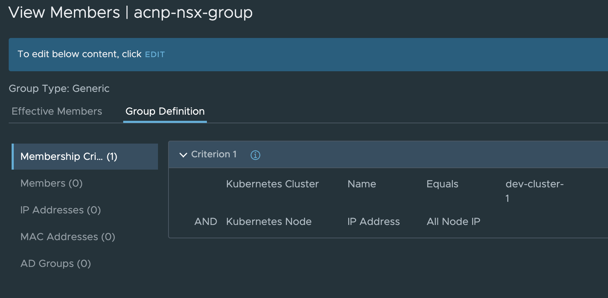

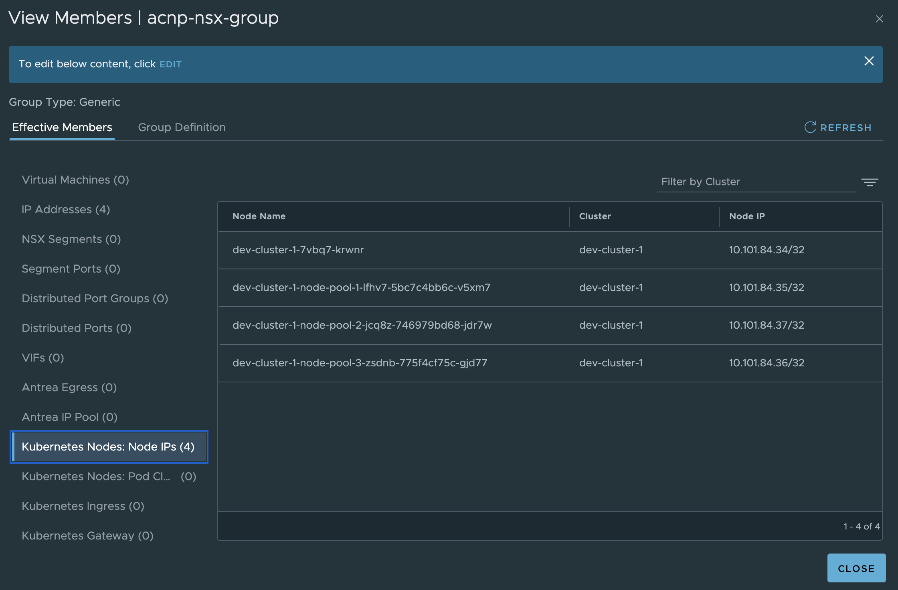

Now, if I want to create a NSX firewall policy isolating two Kubernetes clusters from each other using the constructs above:

I will simply create two security groups like the one above, selection the two different cluster in each group. Then the policy will be like this:


Now if I do a traceflow from any node in dev-cluster-1 to any node in dev-cluster-2 it will dropped.

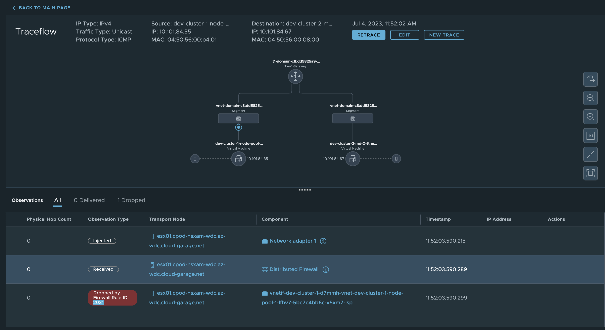

The Firewall Rule ID is:
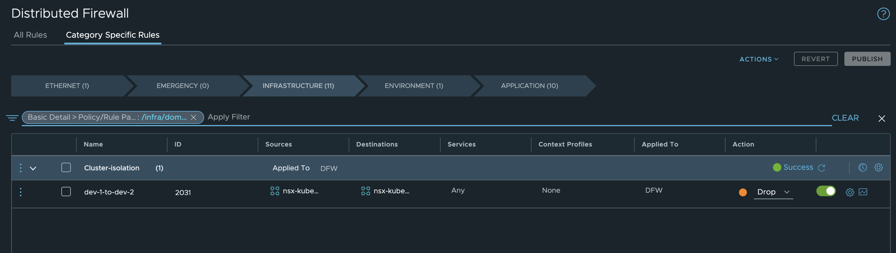

With this approach, its very easy to isolate complete clusters from each other with some really simple rules. We could even create a negated rule, saying you are allowed to reach any workers from same cluster but nothing else with one blocking rule (using a negated selection where source is dev-cluster-1 and destination is also dev-cluster-1:
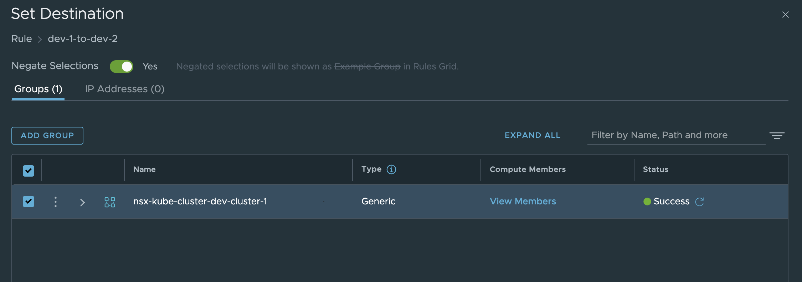

The policy:


This is just one rule blocing everything except its own Kubernetes nodes.


 

## RBAC - making sure no one can overwrite/override existing rules. 

How to manage RBAC, or Tier Entitlement with Antrea I have already covered [here](https://blog.andreasm.io/2023/06/01/managing-antrea-in-vsphere-with-tanzu/#antrea-rbac)


## Outro...

I have in this post shown three different ways to manage and apply Antrea Network policies. Three different approaches, the first approach was all manual, the second automatic but the policies still needs to be defined. The last one with the NSX manager a bit different approach as not all the Antrea Network policy features are available and some policies have to be defined different. But, the NSX manager can also be used to automate some of the policies by just adding the clusters to existing policies. Then they will be applied at once. 

The Antrea policies used and how they are defined in this post is by all means not the final answer or best practice. They were just used as simple examples to have something to "work with" during this post. As I have mentioned, one could utilise the different tiers to delegate administration of the policies to the right set of responsibilities (security admins, vSphere operators, Dev-ops etc). If the target is zero-trust also inside your TKC clusters, this can be achieved by utilizing the tiers and place a drop-all-else rule dead last in the Antrea policy chain (baseline tier e.g).


