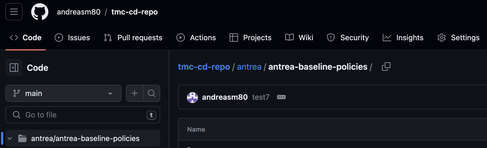
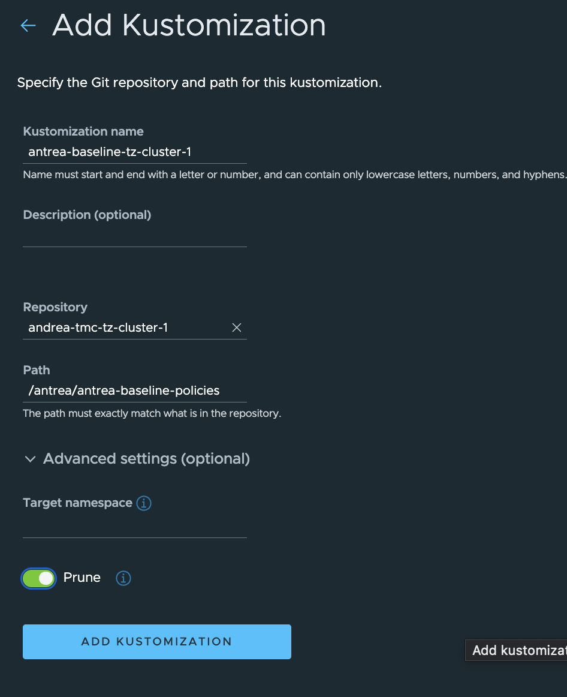

# Some context... 

I have written a couple of post previously on the topic Antrea Policies, this time I will try to put it more into a context, how we can use and create Antrea Policies in different scenarios and with some "frameworks" from different perspectives in the organization. 

What if, and how, can we deliver a already secured Kubernetes cluster, like an out of the box experience, with policies applied that meets certain guidelines for what is allowed and not allowed in the organization for certain Kubernetes clusters. Whether they are manually provisioned, or provisined on demand. So in this post a will try to be a bit specific on how to achieve this, with a simulated requirement as context, will get back to this context a further down. The following products will be used in this post: vSphere with Tanzu and TKG workload clusters, Antrea as the CNI, Tanzu Mission Control and VMware NSX.

As usual, for more details on the above mentioned product head over to the below links

- [Antrea](https://antrea.io/) for detailed and updated documentation.
- [vSphere with Tanzu](https://docs.vmware.com/en/VMware-vSphere/index.html) for detailed and updated documentation.
- [Tanzu Mission Control](https://docs.vmware.com/en/VMware-Tanzu-Mission-Control/index.html) for detailed and updated documentation.
- [VMware NSX](https://docs.vmware.com/en/VMware-NSX/index.html) for detailed and updated documentation.


## Different layers of security, different personas, different enforcement points

This post will mostly be focusing in on the Kubernetes perspective, using specifically Antrea Network policies to restrict traffic inside the Kubernetes cluster. A Kubernetes cluster is just one infrastructure solution in the organization, but for many a very important one so it needs to be secured with a set of tools to satisfy the security policy guidelines in the organization. In a typical datacenter we have several security mechanisms in place like AV agents, physical firewall, virtual firewall, NSX distributed firewall. All these play an important role in the different layers of the datacenter/organization. Assuming the Kubernetes worker nodes are running virtual machines on VMware vSphere the below illustration describes two layers of security using NSX distributed firewall securing the VM workers, and Antrea Network Policies securing pods, services inside the Kubernetes cluster.


 With the illustration above in mind it is fully possible to create a very strict environment with no unwanted lateral movement. Meaning only the strict necessary firewall openings inside the kubernetes cluster between pods, namespaces services, but also between workers in same subnet and across several several Kubernetes clusters. But the above two layers, VMs in vSphere protected by the NSX distributed firewall and apps running Kubernetes clusters and protected by Antrea Network policies, are often managed by different personas in the organization. We have the vSphere admins, Network admins, Security Admins, App Operators and App Developers. Security is crucial in a modern datacenter, so, again, the correct tools needs to be in place for the organizations security-framework to be implemented all the way down the "stack" to be compliant. Very often there is a decided theoretical security framework/design in place, but that plan is not always so straightforward to implement. 

Going back to Kubernetes again and Antrea Network policies. Antrea feature several static (and optional custom) [Tiers](https://antrea.io/docs/v1.12.0/docs/antrea-network-policy/#tier) where different types of network policies can be applied. As all the Antrea Network policies are evaluated "top-down" it is very handy to be able to place some strict rules very early in the "chain" of firewall policies to ensure the organization's security compliance is met. Being able to place these rules at the top prohibits the creation of rules further down that contradicts these top rules, they will not be evaluated. Then there is room to create a framework that gives some sense of "flexibility" to support the environment's workload according to the type of classification (prod, dev, test, dmz, trust, untrust). Other policies can be applied to further restrict movement before hitting a default block rule that takes care of anything that is not specified earlier in the "chain" of policies. The illustration below is an example of whom and where these personas can take charge and apply their needed policies.       


Then the next illustration is the default Static Tiers that comes with Antrea. These Tiers makes it easier to categorize the different policies in a Kubernetes cluster, but also provides a great way to delegate responsibility/permissions by using RBAC to control access to the Tiers. This means we can have some admins to apply policies in specific Tiers, and no one else can overwrite these.

 

Now, how can the different personas make sure their policies are applied? This is what I will go through next.

## Managing and making sure the required Antrea Policies are applied

Lets start out by bringing some light on the simulated requirement I mentioned above. Customer Andreas have some strict security guidelines they need to follow to ensure compliance before anyone can do anything in the Kubernetes platforms.
To be compliant according to the strict security guidelines the following must be in place:

- All Kubernetes workload clusters are considered isolated and not allowed to reach nothing more than themselves, including pods and services (all nodes in the same cluster)
- Only necessary backend functions such as DNS/NTP are allowed.
- Certain management tools need access to the clusters
- All non-system namespaces should be considered "untrusted" and isolated by default.
- RBAC needs to be in place to ensure no tampering on applied security policies.  


The above diagram is what customer Andreas needs to have in place. Lets go ahead and apply them. In the next sub-chapters I will show how to apply and manage the policies in three different ways to acheive this. I assume the NSX personas has done their part and applied the correct distributed firewall rules isolating the worker nodes. 

## Applying Antrea policies with kubectl

This process involves logging into a newly provisioned Kubernetes cluster (TKG cluster in my environment) that someone has provisioned, could be the vSphere admin persona, or via a self-service. Then the security admin will be using *kubectl* to log in and apply some yaml definitions to acheive the above requirements. This operation will typically be the security admin responsibilities. The definitions the security admin is applying will all be configured in the static Tier "*securityops*" with different priorities.
Here is the demo-environment I will be using in the following chapters:


The first requirement is a "no-trust" in any non-system namespaces, where I want to achieve full isolation between namespace. No communication from one namespace to another. In the Antrea [homepage](https://antrea.io/docs/v1.12.0/docs/antrea-network-policy/) there are several examples, and I will use one of the examples that suits my need perfectly. It looks like this:

```yaml
apiVersion: crd.antrea.io/v1alpha1
kind: ClusterNetworkPolicy
metadata:
  name: strict-ns-isolation-except-system-ns
spec:
  priority: 9
  tier: securityops
  appliedTo:
    - namespaceSelector:          # Selects all non-system Namespaces in the cluster
        matchExpressions:
          - {key:  kubernetes.io/metadata.name, operator: NotIn, values: [avi-system,default,kube-node-lease,kube-public,kube-system,secretgen-controller,tanzu-continuousdelivery-resources,tanzu-fluxcd-packageinstalls,tanzu-kustomize-controller,tanzu-source-controller,tkg-system,vmware-system-auth,vmware-system-cloud-provider,vmware-system-csi,vmware-system-tkg,vmware-system-tmc]}
  ingress:
    - action: Pass
      from:
        - namespaces:
            match: Self           # Skip ACNP evaluation for traffic from Pods in the same Namespace
      name: PassFromSameNS
    - action: Drop
      from:
        - namespaceSelector: {}   # Drop from Pods from all other Namespaces
      name: DropFromAllOtherNS
  egress:
    - action: Pass
      to:
        - namespaces:
            match: Self           # Skip ACNP evaluation for traffic to Pods in the same Namespace
      name: PassToSameNS
    - action: Drop
      to:
        - namespaceSelector: {}   # Drop to Pods from all other Namespaces
      name: DropToAllOtherNS
```

  The only modifications I have done is adding all my system-namespaces.
Then I will apply it. 

```bash
# Verifying no policies in place:
andreasm@linuxvm01:~/antrea/policies/groups$ k get acnp
No resources found
andreasm@linuxvm01:~/antrea/policies/groups$ k apply -f acnp-ns-isolation-except-system-ns.yaml
clusternetworkpolicy.crd.antrea.io/strict-ns-isolation-except-system-ns created
andreasm@linuxvm01:~/antrea/policies/groups$ k get acnp
NAME                                   TIER          PRIORITY   DESIRED NODES   CURRENT NODES   AGE
strict-ns-isolation-except-system-ns   securityops   9          0               0               15s
```

Notice the 0 under *Desired Nodes* and *Current Nodes*. The reason is that this cluster is completely new, and there is no workload in any non-system namespaces yet. Here are the current namespaces:

```bash
andreasm@linuxvm01:~/antrea/policies/groups$ k get ns
NAME                                 STATUS   AGE
default                              Active   28d
kube-node-lease                      Active   28d
kube-public                          Active   28d
kube-system                          Active   28d
secretgen-controller                 Active   28d
tkg-system                           Active   28d
vmware-system-auth                   Active   28d
vmware-system-cloud-provider         Active   28d
vmware-system-csi                    Active   28d
vmware-system-tkg                    Active   28d
```

Now if I apply a couple of namespaces and deploy some workload in them:

```bash
andreasm@linuxvm01:~/antrea/policies/groups$ k apply -f dev-app.yaml -f dev-app2.yaml
namespace/dev-app created
deployment.apps/ubuntu-20-04 created
namespace/dev-app2 created
deployment.apps/ubuntu-dev-app2 created
```

How does the policy look like now?

```bash
andreasm@linuxvm01:~/antrea/policies/groups$ k get acnp
NAME                                   TIER          PRIORITY   DESIRED NODES   CURRENT NODES   AGE
strict-ns-isolation-except-system-ns   securityops   9          1               1               6s
# Why only one
andreasm@linuxvm01:~/antrea/policies/groups$ k get pods -n dev-app -owide
NAME                            READY   STATUS    RESTARTS   AGE   IP            NODE                                                      NOMINATED NODE   READINESS GATES
ubuntu-20-04-548545fc87-t2lg2   1/1     Running   0          82s   20.20.3.216   three-zone-cluster-1-node-pool-3-6r8c2-6c8d48656c-wntwc   <none>           <none>
andreasm@linuxvm01:~/antrea/policies/groups$ k get pods -n dev-app2 -owide
NAME                               READY   STATUS    RESTARTS   AGE   IP            NODE                                                      NOMINATED NODE   READINESS GATES
ubuntu-dev-app2-564f46785c-g8vb6   1/1     Running   0          86s   20.20.3.215   three-zone-cluster-1-node-pool-3-6r8c2-6c8d48656c-wntwc   <none>           <none>
```

Both workloads ended up on same node...

So far so good. Now I need to verify if it is actually enforcing anything. From one of the dev-app pods I will execute into bash and try ping another pod in one for the system-namespaces, a pod in the the other dev-app namespace and try to a dns lookup. 

```bash
andreasm@linuxvm01:~/antrea/policies/groups$ k exec -it -n dev-app ubuntu-20-04-548545fc87-t2lg2 bash
kubectl exec [POD] [COMMAND] is DEPRECATED and will be removed in a future version. Use kubectl exec [POD] -- [COMMAND] instead.
root@ubuntu-20-04-548545fc87-t2lg2:/# ping 20.20.1.7
PING 20.20.1.7 (20.20.1.7) 56(84) bytes of data.
^C
--- 20.20.1.7 ping statistics ---
170 packets transmitted, 0 received, 100% packet loss, time 173033ms
```

The ping above was from my dev-app pod to the *coredns* pod in kube-system.
Ping to the other dev-app pod in the other dev-app namespace. 

```bash
root@ubuntu-20-04-548545fc87-t2lg2:/# ping 20.20.3.215
PING 20.20.3.215 (20.20.3.215) 56(84) bytes of data.
^C
--- 20.20.3.215 ping statistics ---
9 packets transmitted, 0 received, 100% packet loss, time 8181ms
```

Is also blocked.

Now DNS lookup:

```bash
root@ubuntu-20-04-548545fc87-t2lg2:/# ping google.com
ping: google.com: Temporary failure in name resolution
#So much empty
```

DNS was also one of the requirements, so I will have to fix this also. I mean, the security admin will have to fix this otherwise going to lunch will not be such a great place to be...

As the security admin have applied the above policy in the securityops tier with a priority of 9 he need to open up for DNS with policies in a higher tier or within same tier with a lower priority number (lower equals higher priority).

This is the policy he needs to apply:

```yaml
apiVersion: crd.antrea.io/v1alpha1
kind: ClusterNetworkPolicy
metadata:
  name: allow-all-egress-dns-service
spec:
  priority: 8
  tier: securityops
  appliedTo:
    - namespaceSelector: {}
#        matchLabels:
#          k8s-app: kube-dns
  egress:
    - action: Allow
      toServices:
        - name: kube-dns
          namespace: kube-system
      name: "allowdnsegress-service"
```

A simple one, and the requirement is satisfied. Company Andreas allowed necessay functions such as DNS.. This policy will allow any namespace to reach the *kube-dns* service. 

The rule applied:

```bash
andreasm@linuxvm01:~/antrea/policies/groups$ k get acnp
NAME                                   TIER          PRIORITY   DESIRED NODES   CURRENT NODES   AGE
allow-all-egress-dns-service           securityops   8          4               4               2m24s
strict-ns-isolation-except-system-ns   securityops   9          1               1               24m
```

What about DNS lookup now:

```bash
root@ubuntu-20-04-548545fc87-t2lg2:/# ping google.com
PING google.com (172.217.12.110) 56(84) bytes of data.
64 bytes from 172.217.12.110 (172.217.12.110): icmp_seq=1 ttl=105 time=33.0 ms
64 bytes from 172.217.12.110 (172.217.12.110): icmp_seq=2 ttl=104 time=29.8 ms
64 bytes from 172.217.12.110 (172.217.12.110): icmp_seq=3 ttl=105 time=30.2 ms
64 bytes from 172.217.12.110 (172.217.12.110): icmp_seq=4 ttl=104 time=30.3 ms
64 bytes from 172.217.12.110 (172.217.12.110): icmp_seq=5 ttl=105 time=30.4 ms
^C
--- google.com ping statistics ---
5 packets transmitted, 5 received, 0% packet loss, time 4003ms
rtt min/avg/max/mdev = 29.763/30.733/32.966/1.138 ms
```

Works. 

Thats one more requirement met. Now one of the requirements was also to restrict access to services in other kubernetes clusters. Even though we trust that the NSX admins have created these isolation rules for us we need to make sure we are not allowed from the current kubernetes cluster also. 

So to acheive this the security admin needs to create *ClusterGroup* containing the CIDR for its own worker nodes. Then apply a policy using the ClusterGroup. 
Here is the ClusterGroup definition (containing the cidr for the worker nodes):

```yaml
apiVersion: crd.antrea.io/v1alpha3
kind: ClusterGroup
metadata:
  name: tz-cluster-1-node-cidr
spec:
  # ipBlocks cannot be set along with podSelector, namespaceSelector or serviceReference.
  ipBlocks:
    - cidr: 10.101.82.32/27
```

And I also need to define another ClusterGroup for all the RFC1918 subnets I need to block (this will include the cidr above):

```yaml
apiVersion: crd.antrea.io/v1alpha3
kind: ClusterGroup
metadata:
  name: tz-cluster-1-drop-cidr
spec:
  # ipBlocks cannot be set along with podSelector, namespaceSelector or serviceReference.
  ipBlocks:
    - cidr: 10.0.0.0/8
    - cidr: 172.16.0.0/12
    - cidr: 192.168.0.0/16
```

Apply them:

```bash
andreasm@linuxvm01:~/antrea/policies/groups$ k apply -f tz-cluster-1-group-node-cidr.yaml
clustergroup.crd.antrea.io/tz-cluster-1-node-cidr created
andreasm@linuxvm01:~/antrea/policies/groups$ k apply -f tz-cluster-1-drop-cidr.yaml
clustergroup.crd.antrea.io/tz-cluster-1-drop-cidr created
andreasm@linuxvm01:~/antrea/policies/groups$ k get clustergroup
NAME                     AGE
tz-cluster-1-drop-cidr   6s
tz-cluster-1-node-cidr   5s
```

And the policy to deny anything except the own kubernetes worker nodes:

```yaml
apiVersion: crd.antrea.io/v1alpha1
kind: ClusterNetworkPolicy
metadata:
  name: acnp-drop-except-own-cluster-node-cidr
spec:
  priority: 8
  tier: securityops
  appliedTo:
    - namespaceSelector:          # Selects all non-system Namespaces in the cluster
        matchExpressions:
          - {key:  kubernetes.io/metadata.name, operator: NotIn, values: [avi-system,default,kube-node-lease,kube-public,kube-system,secretgen-controller,tanzu-continuousdelivery-resources,tanzu-fluxcd-packageinstalls,tanzu-kustomize-controller,tanzu-source-controller,tkg-system,vmware-system-auth,vmware-system-cloud-provider,vmware-system-csi,vmware-system-tkg,vmware-system-tmc]}
  egress:
    - action: Allow
      to:
        - group: "tz-cluster-1-node-cidr"
    - action: Drop
      to:
        - group: "tz-cluster-1-drop-cidr"
```

Applied:

```bash
andreasm@linuxvm01:~/antrea/policies/groups$ k apply -f tz-cluster-1-drop-anything-but-own-nodes.yaml
clusternetworkpolicy.crd.antrea.io/acnp-drop-except-own-cluster-node-cidr created
andreasm@linuxvm01:~/antrea/policies/groups$ k get acnp
NAME                                     TIER          PRIORITY   DESIRED NODES   CURRENT NODES   AGE
acnp-drop-except-own-cluster-node-cidr   securityops   8          1               1               3m39s
allow-all-egress-dns-service             securityops   8          4               4               28m
strict-ns-isolation-except-system-ns     securityops   9          1               1               50m
```

From the dev-app pod again I will verify if I am allowed to SSH to a worker node in "own" Kubernetes cluster, and another Linux machine not in the ClusterGroup cidr I have applied. 

```bash
root@ubuntu-20-04-548545fc87-t2lg2:/# ssh vmware-system-user@10.101.82.34 #A worker node in the current k8s cluster
vmware-system-user@10.101.82.34's password:
#This is allowed
What about other machines outside the cidr:
root@ubuntu-20-04-548545fc87-t2lg2:/# ssh 10.101.10.99
ssh: connect to host 10.101.10.99 port 22: Connection timed out

```

That is very close to achieving this requirement also, but I should be allowed to reach pods inside same namespace regardless of which node they reside on. 
Here are my dev-app namespace with pods on all three nodes:

```bash
andreasm@linuxvm01:~/antrea/policies/groups$ k get pods -n dev-app -o wide
NAME                            READY   STATUS    RESTARTS   AGE    IP            NODE                                                      NOMINATED NODE   READINESS GATES
ubuntu-20-04-548545fc87-75nsm   1/1     Running   0          116s   20.20.2.35    three-zone-cluster-1-node-pool-2-kbzvq-6846d5cc5b-6hdmj   <none>           <none>
ubuntu-20-04-548545fc87-hhnv2   1/1     Running   0          116s   20.20.1.14    three-zone-cluster-1-node-pool-1-dgcpq-656c75f4f4-nsr2r   <none>           <none>
ubuntu-20-04-548545fc87-t2lg2   1/1     Running   0          66m    20.20.3.216   three-zone-cluster-1-node-pool-3-6r8c2-6c8d48656c-wntwc   <none>           <none>
```


```bash
root@ubuntu-20-04-548545fc87-t2lg2:/# ping 20.20.1.14
PING 20.20.1.14 (20.20.1.14) 56(84) bytes of data.
64 bytes from 20.20.1.14: icmp_seq=1 ttl=62 time=20.6 ms
64 bytes from 20.20.1.14: icmp_seq=2 ttl=62 time=2.87 ms
^C
--- 20.20.1.14 ping statistics ---
2 packets transmitted, 2 received, 0% packet loss, time 1002ms
rtt min/avg/max/mdev = 2.869/11.735/20.601/8.866 ms
root@ubuntu-20-04-548545fc87-t2lg2:/# ping 20.20.2.35
PING 20.20.2.35 (20.20.2.35) 56(84) bytes of data.
64 bytes from 20.20.2.35: icmp_seq=1 ttl=62 time=3.49 ms
64 bytes from 20.20.2.35: icmp_seq=2 ttl=62 time=2.09 ms
64 bytes from 20.20.2.35: icmp_seq=3 ttl=62 time=1.00 ms
^C
--- 20.20.2.35 ping statistics ---
3 packets transmitted, 3 received, 0% packet loss, time 2003ms
rtt min/avg/max/mdev = 1.000/2.194/3.494/1.020 ms
```


From the Antrea UI, lets do some tests there also:


Note that I have not created any default-block-all-else-rule. There is always room for improvement, and this was just an excercise to show what is possible, not an final answer on how things should be done. Some of the policies can be even more granular like specifying only ports/protocol/FQDN etc.. 

So just to summarize what I have done:

These are the applied rules:

```bash
NAME                                     TIER          PRIORITY   DESIRED NODES   CURRENT NODES   AGE
acnp-drop-except-own-cluster-node-cidr   securityops   8          3               3               23h
allow-all-egress-dns-service             securityops   8          4               4               23h
strict-ns-isolation-except-system-ns     securityops   9          3               3               23h
```

The first rule is allowing only traffic to the nodes in its own cluster - matches this requirement "*All Kubernetes workload clusters are considered isolated and not allowed to reach nothing more than themselves, including pods and services (all nodes in the same cluster)*"

The second rule is allowing all namespaces to access the *kube-dns* service in the *kube-system* namespace - matches this requirement "*Only necessary backend functions such as DNS/NTP are allowed*"

The third rule is dropping all traffic between namespaces, except the "system"-namespaces I have defined. But it allows intra communication inside each namespace - matches this requirement "*All non-system namespaces should be considered "untrusted" and isolated by default*" 

Then I have not done anything with RBAC yet, will come later in this post. And the requirement: "*Certain management tools need access to the clusters*" I can assume the NSX admins have covered, as I am not blocking any ingress traffic to the "system"-namespaces, same is true for egress from the system-namespaces. But it could be, if adjusted to allow the necessary traffic from these namespaces to the certain management tools.  

## Applying Antrea policies using TMC - Tanzu Mission Control

This section will not create any new scenario, it will re-use all the policies created and applied in the above section. The biggest difference is how the policies are being applied. 

Not that I dont think any security admin dont want to log in to a Kubernetes cluster and apply these security policies, but it can be a bit tedious each time a new cluster is applied. What wouldnt be better then if we can auto-deploy them each time a new cluster is being deployed? Like an out-of-the-box experience? Yes, excactly. If we already have defined a policy scope for the different Kubernetes cluster in our environment, we could just apply the correct policies to each cluster respectively each time they are provisioned. This saves a lot of time. We can be sure each time a new cluster is provisioned, it is being applied with the correct set of policies. With the abiltiy to auto apply these required policies on creation or directly after creation will make provisioning out-of-the-box compliant clusters a joy. 

Now this sounds interesting, how can I do that?

....*Into the door comes TMC*.... Hello Tanzu Mission Control,  short TMC. 
With TMC we can administer Tanzu with vSphere in addition to a lot of other Kubernetes platforms. 
From the TMC official [docs](https://docs.vmware.com/en/VMware-Tanzu-Mission-Control/index.html) :

> VMware Tanzu Mission Control™ is a centralized management platform for consistently operating and securing your Kubernetes infrastructure and modern applications across multiple teams and clouds.
>
> Available through VMware Cloud™ services, Tanzu Mission Control provides operators with a single control point to give developers the independence they need to drive business forward, while ensuring consistent management and operations across environments for increased security and governance.
>
> Tanzu Mission Control provides instances of the service in regions around the world, including Australia, Canada, India, Ireland, Japan, and USA. For a list of the regions in which the Tanzu Mission Control is hosted, go to the Cloud Management Services Availability page at https://www.vmware.com/global-infrastructure.html and select **VMware Tanzu Mission Control**.
>
> Use Tanzu Mission Control to manage your entire Kubernetes footprint, regardless of where your clusters reside.


Lets cut to the chase and make my cluster compliant with the above rules. 

### Preparing TMC

In my TMC dashboard I need two thing in place: 

- A Git repository where I host my yamls, specifically my Antrea policy yamls.
- A configured Kustomization using the above Git repo

### Git repository

I will create a dedicated Git repo called tmc-cd-repo, and a folder structure. Here is my Github repo for this purpose:


Now push the yamls to this repo's subfolder antrea-baseline-policies:

```bash
andreasm:~/github_repos/tmc-cd-repo (main)$ git add .
andreasm:~/github_repos/tmc-cd-repo (main)$ git commit -s -m "ready-to-lockdown"
[main 4ab93a7] ready-to-lockdown
 4 files changed, 53 insertions(+)
 create mode 100644 antrea/antrea-baseline-policies/acnp-allow-egress-all-coredns-service.yaml
 create mode 100644 antrea/antrea-baseline-policies/tz-cluster-1-drop-anything-but-own-nodes.yaml
 create mode 100644 antrea/antrea-baseline-policies/tz-cluster-1-drop-cidr.yaml
 create mode 100644 antrea/antrea-baseline-policies/tz-cluster-1-group-node-cidr.yaml
andreasm:~/github_repos/tmc-cd-repo (main)$ git push
Enumerating objects: 11, done.
Counting objects: 100% (11/11), done.
Delta compression using up to 16 threads
Compressing objects: 100% (7/7), done.
Writing objects: 100% (8/8), 1.43 KiB | 733.00 KiB/s, done.
Total 8 (delta 1), reused 0 (delta 0), pack-reused 0
remote: Resolving deltas: 100% (1/1), done.
To github.com:andreasm80/tmc-cd-repo.git
   5c9ba04..4ab93a7  main -> main
andreasm:~/github_repos/tmc-cd-repo (main)$
```


And here they are:


### TMC Kustomization

Now in my TMC dashboard configure Git repo:

I can choose to add the Git repo per cluster that is managed by TMC or in a cluster group. I will go with adding the Git repo on my cluster called *three-zone-cluster-1* for the moment. The benefit with adding it at the group is that it can be shared across multiple clusters. 
In TMC click Clusters and find your already managed and added cluster then click on it to "enter it". 

In your cluster group click on the tab Add-ons


Then find Git repositories and Add Git Repository 


Fill in the needed fields. Make sure to expand advanced settings to update the branch to your branch or main branch. Can also adjust the sync intervall to higher or smaller. Default is 5, I have sat mine to 1. The repository url points to the actual repository, no subfolders. This is because in the Kustomization later we can have multiple pointing to the respective subfolder which can then be unique pr cluster etc. Make sure you also choose "no credentials needed" under Repository Credentials if using a public Git repo as I am.


After save you should see a green status:


Now, we need to add a Kustomization. This can also be done in either a group or pr cluster. I will start with adding it directly to my specific cluster. 
In TMC click Cluster and select your cluster.


Click Add-ons, Under Continuous Delivery click Installed Kustomizations. Add Kustomization.

Before I add my Kustomization, I have made sure I have deleted all the policies and groups in my test-cluster three-zone-cluster-1:

```bash
andreasm@linuxvm01:~/antrea/policies/groups$ k get acnp
No resources found
andreasm@linuxvm01:~/antrea/policies/groups$ k get clustergroups
No resources found
```

Then I will continue and add the Kustomization:



Make sure to point to the correct subfolder in the Git repo. I have enabled the Prune option so I everything deployed via Kustomization will be deleted in my cluster if I decide to remove the Kustomization. 

Click add. 


Click refresh in the top right corner, and it should be green. Lets check the policies and groups in the cluster itself.. 

```bash
andreasm@linuxvm01:~/antrea/policies/groups$ k get acnp
NAME                                     TIER          PRIORITY   DESIRED NODES   CURRENT NODES   AGE
acnp-drop-except-own-cluster-node-cidr   securityops   8          3               3               70s
allow-all-egress-dns-service             securityops   8          4               4               70s
strict-ns-isolation-except-system-ns     securityops   9          3               3               70s
andreasm@linuxvm01:~/antrea/policies/groups$ k get clustergroups
NAME                     AGE
tz-cluster-1-drop-cidr   73s
tz-cluster-1-node-cidr   73s
```

The Antrea Policies have been applied. 

### Deploy TKC cluster from TMC - auto apply security policies

The above section enabled Kustomization on a already managed TKC cluster in TMC. In this section I will apply a TKC cluster from TMC and let the Antrea policies be automatically be applied. 

In TMC I will create two Cluster Groups, one called *andreas-dev-clusters* and one called *andreas-prod-clusters*. 


After I have added the two cluster groups I will configure *Add-ons*. Same as in previous section, adding the the Git reop but this time I will point to the different subfolders I created in my Git repo. I have created two different sub-folders in my Git repo called: *tmc-cd-repo/antrea/antrea-baseline-policies/**dev-clusters***  and *tmc-cd-repo/antrea/antrea-baseline-policies/**prod-clusters***. The reason I have done that is because I want the option to apply different Antrea policies for certain clusters, different environments different needs. 

Before adding the Git repo on the two new Cluster groups in TMC I need to enable continuous delivere by clicking on this blue button. 


 


The Git repo has been added two both my new cluster groups. Now I just need to add the Kustomization pointing to my new Git repo subfolders **dev-clusters** and **prod-clusters**.


Now the preparations have been done in TMC, it is time to deploy the two TKC clusters from TMC and see if my policies are automatically applied. One "prod-cluster" and one "dev-cluster".

Lets start with the "prod-cluster"


Creating the dev-cluster


The clusters are ready:


Let us check the sync status of my Kustomizations.
Prod-Cluster Group:


Dev-Cluster Group:


Still applied.

Lets have a look inside the two TKC cluster using kubectl.
Prod-Cluster-2:

```bash
andreasm@linuxvm01:~/antrea/policies/groups$ k config current-context
prod-cluster-2
andreasm@linuxvm01:~/antrea/policies/groups$ k get acnp
NAME                                                   TIER          PRIORITY   DESIRED NODES   CURRENT NODES   AGE
allow-all-egress-dns-service                           securityops   8          2               2               35m
prod-clusters-acnp-drop-except-own-cluster-node-cidr   securityops   8          0               0               35m
prod-clusters-strict-ns-isolation-except-system-ns     securityops   9          0               0               35m
```


Dev-Cluster-2:

```bash
andreasm@linuxvm01:~/antrea/policies/groups$ k config current-context
dev-cluster-2
andreasm@linuxvm01:~/antrea/policies/groups$ k get acnp
NAME                                                  TIER          PRIORITY   DESIRED NODES   CURRENT NODES   AGE
dev-clusters-strict-ns-isolation-except-system-ns     securityops   9          0               0               45s
dev-clusters-acnp-drop-except-own-cluster-node-cidr   securityops   8          0               0               45s
dev-clusters-allow-all-egress-dns-service             securityops   8          2               2               45s
```

 

Thats it then, if I need to change the policies I can just edit policies, git add, commit and push and they will be applied to all clusters in the group. 
By enabling this feature in TMC its just all about adding or attaching your clusters in the respective group in TMC and they will automatically get all the needed yamls applied. 


## Applying Antrea policies with NSX

NSX Searc policy id traceflow.. will show real rule. 


L7 services and or FQDN.. 

## RBAC - making sure no one can overwrite/override existing rules. 

