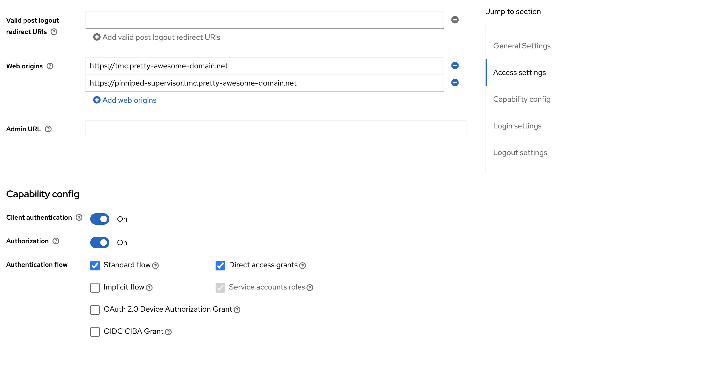

# TMC local or TMC-SM

TMC, Tanzu Mission Control, has always been a SaaS offering. But now it has also been released as a installable product you can deploy in your own environment. 
Throughout this post I will most likely refer to it as TMC SM or TMC local. TMC SM stands for Self Managed. 
For all official documentation and updated content head over [here](https://docs.vmware.com/en/VMware-Tanzu-Mission-Control/1.0/tanzumc-sm-install/prepare-cluster.html) including the installation process.

## Pre-requirements

There is always some pre-requirements to be in place. Why should it always be pre-requirements? Well there is no need create any cars if there is no roads for them to drive on, will it? Thats enough humour for today. 
Instead of listing a detailed list of the requirements here, head over to the official page [here](https://docs.vmware.com/en/VMware-Tanzu-Mission-Control/1.0/tanzumc-sm-install/prepare-cluster.html) and get familiar with it.
In this post I have already deployed a Kubernetes cluster in my vSphere with Tanzu environment, that meets the requirements. More on that later. Then I will cover the certificate requirement deploying Cert-Manager and configure a ClusterIssuer. The image registry I will not cover as I already have a registry up and running and will be using that. I will not cover the loadbalancer/Ingress installation as I am assuming the following is already in place:

- A working vSphere 8 Environment
- A working Tanzu with vSphere Supervisor deployment
- A working NSX-ALB configuration to support both L4 and L7 services (meaning AKO is installed on the cluster for TMC-SM)
- A working image registry with a valid signed certificate, I will be using Harbor Registry. 

I will be using NSX ALB in combination with Contour that is being installed with TMC-SM, I will cover the specifics in configuring NSX-ALB, more specifically AKO, to support Keycloak via Ingress. Then I will cover the installation and configuration of Keycloak as the OIDC requirement. Then I will show how I handle my DNS zone for the TMC installation.
As a final note, remember that the certificate I  going to use needs to be trusted by the components that will be consuming them and DNS is important. Well lets go through it step by step.


In this order the following steps will be done:


And, according to the official documentation:

{}

Deploying TMC Self-Managed 1.0 on a Tanzu Kubernetes Grid (TKG) 2.0 workload cluster running in vSphere with Tanzu on vSphere version 8.x is for tech preview only. Initiate deployments only in pre-production environments or production environments where support for the integration is not required. [vSphere 8u1](https://docs.vmware.com/en/VMware-vSphere/8.0/rn/vmware-vsphere-with-tanzu-80-release-notes/index.html#What's%20New-What's%2[%E2%80%A6]%20April%2018,%202023) or later is required in order to test the tech preview integration.

{}

I will use vSphere 8 U1 in this post, and is by no means meant as a guideline to a production ready setup of TMC-SM. 

## The TKG cluster - where TMC will be deployed

I have used this configuration to deploy my TKG cluster, I have used the VM class guaranteed-large, it will work with 4CPU and 8GB ram on the nodes also. Oh, and by the way. This installation is done on a vSphere with Tanzu multi-zone setup:

```yaml
apiVersion: cluster.x-k8s.io/v1beta1
kind: Cluster
metadata:
  name: tmc-sm-cluster #My own name on the cluster
  namespace: ns-wdc-prod #My vSphere Namespace
spec:
  clusterNetwork:
    services:
      cidrBlocks: ["20.10.0.0/16"] #Edited by me
    pods:
      cidrBlocks: ["20.20.0.0/16"] #Edited by me
    serviceDomain: "cluster.local"
  topology:
    class: tanzukubernetescluster
    version: v1.24.9+vmware.1-tkg.4 #My latest available TKR version
    controlPlane:
      replicas: 1 # only one controlplane (saving resources and time)
      metadata:
        annotations:
          run.tanzu.vmware.com/resolve-os-image: os-name=ubuntu
    workers:
      #muliple node pools are used
      machineDeployments:
        - class: node-pool
          name: node-pool-1
          replicas: 1 #only 1 worker here
          metadata:
            annotations:
              run.tanzu.vmware.com/resolve-os-image: os-name=ubuntu
          #failure domain the machines will be created in
          #maps to a vSphere Zone; name must match exactly
          failureDomain: wdc-zone-1 #named after my vSphere zone
        - class: node-pool
          name: node-pool-2
          replicas: 2 #only 1 worker here
          metadata:
            annotations:
              run.tanzu.vmware.com/resolve-os-image: os-name=ubuntu
          #failure domain the machines will be created in
          #maps to a vSphere Zone; name must match exactly
          failureDomain: wdc-zone-2 #named after my vSphere zone
        - class: node-pool
          name: node-pool-3
          replicas: 1 #only 1 worker here
          metadata:
            annotations:
              run.tanzu.vmware.com/resolve-os-image: os-name=ubuntu
          #failure domain the machines will be created in
          #maps to a vSphere Zone; name must match exactly
          failureDomain: wdc-zone-3 #named after my vSphere zone
    variables:
      - name: vmClass
        value: guaranteed-large
      - name: storageClass
        value: all-vsans #my zonal storageclass
      - name: defaultStorageClass
        value: all-vsans
      - name: controlPlaneVolumes
        value:
          - name: etcd
            capacity:
              storage: 10Gi
            mountPath: /var/lib/etcd
            storageClass: all-vsans
      - name: nodePoolVolumes
        value:
          - name: containerd
            capacity:
              storage: 50Gi
            mountPath: /var/lib/containerd
            storageClass: all-vsans
          - name: kubelet
            capacity:
              storage: 50Gi
            mountPath: /var/lib/kubelet
            storageClass: all-vsans
```

As soon as the cluster is ready and deployed I will log into it and change my context using *kubectl vsphere login ....* and apply my clusterrole policy:

```yaml
apiVersion: rbac.authorization.k8s.io/v1
kind: ClusterRole
metadata:
  name: psp:privileged
rules:
- apiGroups: ['policy']
  resources: ['podsecuritypolicies']
  verbs:     ['use']
  resourceNames:
  - vmware-system-privileged
---
apiVersion: rbac.authorization.k8s.io/v1
kind: ClusterRoleBinding
metadata:
  name: all:psp:privileged
roleRef:
  kind: ClusterRole
  name: psp:privileged
  apiGroup: rbac.authorization.k8s.io
subjects:
- kind: Group
  name: system:serviceaccounts
  apiGroup: rbac.authorization.k8s.io
```

## ClusterIssuer

To support dynamically creating/issuing certificates I will deploy and install Cert-Manager. The approach I am using to deploy Cert-Manager is to use the provided Cert-Manager Packages available in Tanzu. 

### Tanzu Cert-Manager Package

I will have to add the package repository where I can download and install Cert-Manager from and a namespace for the packages themselves. Before I can approach with this I need the Tanzu CLI. The official approach can be found [here](https://docs.vmware.com/en/VMware-vSphere/8.0/vsphere-with-tanzu-tkg/GUID-CE91CB2F-0ADA-429C-B99A-5429C4719F6E.html?hWord=N4IghgNiBcIC5gHYC8CuACAxhAliAvkA)
Download the Tanzu CLI from [here](https://customerconnect.vmware.com/downloads/details?downloadGroup=TKG-220&productId=1400&rPId=105436)

Extract it:

```bash
tar -zxvf tanzu-cli-bundle-linux-amd64.tar.gz
```

Enter into the cli folder and copy or move to a folder in your paht:

```bash
andreasm@linuxvm01:~/tanzu-cli/cli/core/v0.29.0$ cp tanzu-core-linux_amd64 /usr/local/bin/tanzu
```

Run tanzu init and tanzu plugin sync:

```bash
tanzu init
tanzu plugin sync
```

When that is done, go ahead dreate the namespace:

```bash
kubectl create ns tanzu-package-repo-global
```

Then add the the repository:

```bash
tanzu package repository add tanzu-standard --url projects.registry.vmware.com/tkg/packages/standard/repo:v2.2.0 -n tanzu-package-repo-global
```

Then installing the Cert-Manager package:

```bash
tanzu package install cert-manager --package cert-manager.tanzu.vmware.com --version 1.7.2+vmware.3-tkg.3 -n tanzu-package-repo-global
```


## CA Issuer

Now it is time to configure Cert-Manager with a CA certifcate so it can act as a CA ClusterIssuer. To do that lets start by creating a CA certificate.

Create the certificate, without passphrase:

```bash
andreasm@linuxvm01:~/tmc-sm$ openssl req -nodes -x509 -sha256 -days 1825 -newkey rsa:2048 -keyout rootCA.key -out rootCA.crt
Generating a RSA private key
..........................................................................+++++
.+++++
writing new private key to 'rootCA.key'
-----
You are about to be asked to enter information that will be incorporated
into your certificate request.
What you are about to enter is what is called a Distinguished Name or a DN.
There are quite a few fields but you can leave some blank
For some fields there will be a default value,
If you enter '.', the field will be left blank.
-----
Country Name (2 letter code) [AU]:US
State or Province Name (full name) [Some-State]:punxsutawney
Locality Name (eg, city) []:Groundhog
Organization Name (eg, company) [Internet Widgits Pty Ltd]:Day
Organizational Unit Name (eg, section) []:SameDay
Common Name (e.g. server FQDN or YOUR name) []:tmc.pretty-awesome-domain.net
Email Address []:
```

This should give me two files:

```bash
1407 Jul 12 14:21 rootCA.crt
1704 Jul 12 14:19 rootCA.key
```

Then I will go ahead and create a secret for Cert-Manager using these two above files in Base64 format:

```bash
andreasm@linuxvm01:~/tmc-sm$ cat rootCA.crt | base64 -w0
LS0tLS1CRUdJTiBDRVJUSUZJQ0FURS0tLS0tCk1JSUQ0ekNDQXN1Z0F3SUJBZ0lVSFgyak5rbysvdnNlcjc0dGpxS2R3U1ZMQlhVd0RRWUpLb1pJaHZjTkFRRUwKQlFBd2dZQXhDekFKQmdOVkJBWVRBbFZUTVJVd0V3WURWUVFJREF4d2RXNTRjM1YwWVhkdVpYa3hFakFRQmdOVgpCQWNNQ1VkeWIzVnVaR2h2WnpFTU1Bb0dBMVVFQ2d3RFJHRjVNUkF3RGdZRFZRUUxEQWRUWVcxbFJHRjVNU1l3CkpBWURWUVFEREIxMGJX
andreasm@linuxvm01:~/tmc-sm$ cat rootCA.key | base64 -w0
LS0tLS1CRUdJTiBQUklWQVRFIEtFWS0tLS0tCk1JSUV2Z0lCQURBTkJna3Foa2lHOXcwQkFRRUZBQVNDQktnd2dnU2tBZ0VBQW9JQkFRREFSR2RCSWwreUVUbUsKOGI0N2l4NUNJTDlXNVh2dkZFY0Q3KzZMbkxxQ3ZVTWdyNWxhNGFjUU8vZUsxUFdIV0YvWk9UN0ZyWUY0QVpmYgpFbzB5ejFxL3pGT3AzQS9sMVNqN3lUeHY5WmxYRU9DbWI4dGdQVm9Ld3drUHFiQ0RtNVZ5Ri9HaGUvMDFsbXl6CnEyMlpGM0M4
```

Put the above content into my secret.yaml file below

```yaml
apiVersion: v1
kind: Secret
metadata:
  name: ca-key-pair
  namespace: cert-manager
data:
  tls.crt: LS0tLS1CRUdJTiBDRVJUSUZJQ0FURS0tLS0tCk1JSUQvekNDQ....
  tls.key: LS0tLS1CRUdJTiBQUklWQVRFIEtFWS0tLS0tCk1JSUV2UUlCQUR...
```

Then apply it:

```bash
andreasm@linuxvm01:~/tmc-sm$ k apply -f secret.yaml
secret/ca-key-pair configured
```

Now create the ClusterIssuer yaml definition:

```yaml
apiVersion: cert-manager.io/v1
kind: ClusterIssuer
metadata:
  name: ca-issuer
spec:
  ca:
    secretName: ca-key-pair
```

This points to the secret created in the previous step. And apply it:

```bash
andreasm@linuxvm01:~/tmc-sm$ k apply -f secret-key-pair.yaml
clusterissuer.cert-manager.io/ca-issuer configured
```

Now check the status of the clusterissuer. It can take a couple of seconds. If it does not go to a Ready state, check the logs of the cert-manager pod.

```bash
andreasm@linuxvm01:~/tmc-sm$ k get clusterissuers.cert-manager.io
NAME        READY   AGE
ca-issuer   True    20s
```

Now, we have a ClusterIssuer we can use to provide us with self-signed certificates. 

## DNS-Zone

In my environment I am using dnsmasq as my backend DNS server for all my clients, servers etc to handle dns records and zones. So in my dnsmasq config I will need to create a "forward" zone for my specific *tmc.pretty-awesome-domain.net* which will forward all requests to the DNS service I have configured in Avi. 
Here is the dnsmasq.conf:

```bash
server=/.tmc.pretty-awesome-domain.net/10.101.211.9
```

The IP 10.101.211.9 is my NSX ALB DNS VS.
Now in my NSX ALB DNS service I need to create an entry that points to *tmc.pretty-awesome-domain.net* where the IP is the Contour IP. In the later stage of this post we need to define a value yaml file. In there we can specify a certain IP the Contour service should get. This IP is being used by the NSX ALB dns to forward all the wildcard requests to the *tmc.pretty-awesome-domain.net*. To configure that in NSX ALB:

Edit the the DNS VS, add a static DNS record, point to the ip of the Contour service (not there yet, but will come when we start deploying TMC-SM). Also remeber to check *Enable wild-card match*:


So what is going on now. 
I have configured my NSX ALB DNS servide to be responsible for a domain called *pretty-awesome-domain.net* by adding this domain to my DNS Profile template which the NSX ALB Cloud is configured with. Each time a Kubernetes service requests a DNS record in this domain NSX ALB will create this entry with correct fqdn/IP mapping. Then I have also created a static entry for the subdomain *tmc.pretty-awesome-domain.net* in the NSX ALB provider which will forward all wildcard requests to the Contour service which holds these actual records: 

- `<my-tmc-dns-zone>`
- `alertmanager.<my-tmc-dns-zone>`
- `auth.<my-tmc-dns-zone>`
- `blob.<my-tmc-dns-zone>`
- `console.s3.<my-tmc-dns-zone>`
- `gts-rest.<my-tmc-dns-zone>`
- `gts.<my-tmc-dns-zone>`
- `landing.<my-tmc-dns-zone>`
- `pinniped-supervisor.<my-tmc-dns-zone>`
- `prometheus.<my-tmc-dns-zone>`
- `s3.<my-tmc-dns-zone>`
- `tmc-local.s3.<my-tmc-dns-zone>`

So I dont have to manually create these dns records, they will just happily be handed over to the Contour ingress records. 
This is how my DNS lookups look like:


## Keycloak - OIDC/ID provider - using AKO as Ingress controller

One of the requirements for TMC local is also an OIDC provider. My colleague Alex gave me the tip to test out Keycloak as it also work as a standalone provider, without any backend ldap service. So this section will be divided into two sub-sections, one section covers the actual installation of Keycloak using Helm, and the other section covers the Keycloak authentication settings that is required for TMC local. 

### Keycloak installation

I am using Helm to install Keycloak in my cluster. That means we need Helm installed, the Helm repository that contains the Keycloak charts. I will be using the Bitnami repo for this purpose. So first add the Bitnami repo:

```bash
andreasm@linuxvm01:~$  helm repo add bitnami https://charts.bitnami.com/bitnami
"bitnami" has been added to your repositories
```


Then do a Helm search repo to see if it has been added (look for a long list of bitnami/xxxx):

```bash
andreasm@linuxvm01:~$ helm search repo
NAME                                        	CHART VERSION	APP VERSION  	DESCRIPTION
bitnami/airflow                             	14.3.1       	2.6.3        	Apache Airflow is a tool to express and execute...
bitnami/apache                              	9.6.4        	2.4.57       	Apache HTTP Server is an open-source HTTP serve...
bitnami/apisix                              	2.0.3        	3.3.0        	Apache APISIX is high-performance, real-time AP...
bitnami/appsmith                            	0.3.9        	1.9.25       	Appsmith is an open source platform for buildin...
bitnami/argo-cd                             	4.7.14       	2.7.7        	Argo CD is a continuous delivery tool for Kuber...
bitnami/argo-workflows                      	5.3.6        	3.4.8        	Argo Workflows is meant to orchestrate Kubernet...
bitnami/aspnet-core                         	4.3.3        	7.0.9        	ASP.NET Core is an open-source framework for we...
bitnami/cassandra                           	10.4.3       	4.1.2        	Apache Cassandra is an open source distributed ...
bitnami/cert-manager                        	0.11.5       	1.12.2       	cert-manager is a Kubernetes add-on to automate...
bitnami/clickhouse                          	3.5.4        	23.6.2       	ClickHouse is an open-source column-oriented OL...
bitnami/common                              	2.6.0        	2.6.0        	A Library Helm Chart for grouping common logic ...
bitnami/concourse                           	2.2.3        	7.9.1        	Concourse is an automation system written in Go...
bitnami/consul                              	10.12.4      	1.16.0       	HashiCorp Consul is a tool for discovering and ...
bitnami/contour                             	12.1.1       	1.25.0       	Contour is an open source Kubernetes ingress co...
bitnami/contour-operator                    	4.2.1        	1.24.0       	DEPRECATED The Contour Operator extends the Kub...
bitnami/dataplatform-bp2                    	12.0.5       	1.0.1        	DEPRECATED This Helm chart can be used for the ...
bitnami/discourse                           	10.3.4       	3.0.4        	Discourse is an open source discussion platform...
bitnami/dokuwiki                            	14.1.4       	20230404.1.0 	DokuWiki is a standards-compliant wiki optimize...
bitnami/drupal                              	14.1.5       	10.0.9       	Drupal is one of the most versatile open source...
bitnami/ejbca                               	7.1.3        	7.11.0       	EJBCA is an enterprise class PKI Certificate Au...
bitnami/elasticsearch                       	19.10.3      	8.8.2        	Elasticsearch is a distributed search and analy...
bitnami/etcd                                	9.0.4        	3.5.9        	etcd is a distributed key-value store designed ...
bitnami/external-dns                        	6.20.4       	0.13.4       	ExternalDNS is a Kubernetes addon that configur...
bitnami/flink                               	0.3.3        	1.17.1       	Apache Flink is a framework and distributed pro...
bitnami/fluent-bit                          	0.4.6        	2.1.6        	Fluent Bit is a Fast and Lightweight Log Proces...
bitnami/fluentd                             	5.8.5        	1.16.1       	Fluentd collects events from various data sourc...
bitnami/flux                                	0.3.5        	0.36.1       	Flux is a tool for keeping Kubernetes clusters ...
bitnami/geode                               	1.1.8        	1.15.1       	DEPRECATED Apache Geode is a data management pl...
bitnami/ghost                               	19.3.23      	5.54.0       	Ghost is an open source publishing platform des...
bitnami/gitea                               	0.3.5        	1.19.4       	Gitea is a lightweight code hosting solution. W...
bitnami/grafana                             	9.0.1        	10.0.1       	Grafana is an open source metric analytics and ...
bitnami/grafana-loki                        	2.10.0       	2.8.2        	Grafana Loki is a horizontally scalable, highly...
bitnami/grafana-mimir                       	0.5.4        	2.9.0        	Grafana Mimir is an open source, horizontally s...
bitnami/grafana-operator                    	3.0.2        	5.1.0        	Grafana Operator is a Kubernetes operator that ...
bitnami/grafana-tempo                       	2.3.4        	2.1.1        	Grafana Tempo is a distributed tracing system t...
bitnami/haproxy                             	0.8.4        	2.8.1        	HAProxy is a TCP proxy and a HTTP reverse proxy...
bitnami/haproxy-intel                       	0.2.11       	2.7.1        	DEPRECATED HAProxy for Intel is a high-performa...
bitnami/harbor                              	16.7.0       	2.8.2        	Harbor is an open source trusted cloud-native r...
bitnami/influxdb                            	5.7.1        	2.7.1        	InfluxDB(TM) is an open source time-series data...
bitnami/jaeger                              	1.2.6        	1.47.0       	Jaeger is a distributed tracing system. It is u...
bitnami/jasperreports                       	15.1.3       	8.2.0        	JasperReports Server is a stand-alone and embed...
bitnami/jenkins                             	12.2.4       	2.401.2      	Jenkins is an open source Continuous Integratio...
bitnami/joomla                              	14.1.5       	4.3.3        	Joomla! is an award winning open source CMS pla...
bitnami/jupyterhub                          	4.1.6        	4.0.1        	JupyterHub brings the power of notebooks to gro...
bitnami/kafka                               	23.0.2       	3.5.0        	Apache Kafka is a distributed streaming platfor...
bitnami/keycloak                            	15.1.6       	21.1.2       	Keycloak is a high performance Java-based ident...
```


And in the list above we can see the bitnami/keycloak charts. So far so good. 
Now grab the default keycloak chart values file:

```bash
helm show values bitnami/keycloak > keycloak-values.yaml
```

This should provide you with a file called keycloak-values.yaml. 
We need to do some basic changes in here. My values file below is snippets from the full values file where I have edited with comments on what I have changed:

```yaml
## Keycloak authentication parameters
## ref: https://github.com/bitnami/containers/tree/main/bitnami/keycloak#admin-credentials
##
auth:
  ## @param auth.adminUser Keycloak administrator user
  ##
  adminUser: admin # I have changed the user to admin
  ## @param auth.adminPassword Keycloak administrator password for the new user
  ##
  adminPassword: "PASSWORD" # I have entered my password here
  ## @param auth.existingSecret Existing secret containing Keycloak admin password
  ##
  existingSecret: ""
  ## @param auth.passwordSecretKey Key where the Keycloak admin password is being stored inside the existing secret.
  ##
  passwordSecretKey: ""
  ...
  ## @param production Run Keycloak in production mode. TLS configuration is required except when using proxy=edge.
##
production: false
## @param proxy reverse Proxy mode edge, reencrypt, passthrough or none
## ref: https://www.keycloak.org/server/reverseproxy
##
proxy: edge # I am using AKO to terminate the SSL cert at the Service Engine side. So set this to edge
## @param httpRelativePath Set the path relative to '/' for serving resources. Useful if you are migrating from older version which were using '/auth/'
## ref: https://www.keycloak.org/migration/migrating-to-quarkus#_default_context_path_changed
##
...
postgresql:
  enabled: true
  auth:
    postgresPassword: "PASSWORD" # I have added my own password here
    username: bn_keycloak
    password: "PASSWORD" # I have added my own password here
    database: bitnami_keycloak
    existingSecret: ""
  architecture: standalone

  
```


In short, the places I have done changes is adjusting the adminUser, password for the adminUser. Then I changed the proxy setting to edge, and adjusted the PostgreSQL password as I dont want to use the auto-generated passwords. 

Then I can deploy Keycloak with this value yaml file:

```bash
andreasm@linuxvm01:~/tmc-sm/keycloak$ k create ns keycloak
andreasm@linuxvm01:~/tmc-sm/keycloak$ helm upgrade -i -n keycloak keycloak bitnami/keycloak -f keycloak-values.yaml
Release "keycloak" has been upgraded. Happy Helming!
NAME: keycloak
LAST DEPLOYED: Wed Jul 12 21:34:32 2023
NAMESPACE: keycloak
STATUS: deployed
REVISION: 4
TEST SUITE: None
NOTES:
CHART NAME: keycloak
CHART VERSION: 15.1.6
APP VERSION: 21.1.2

** Please be patient while the chart is being deployed **

Keycloak can be accessed through the following DNS name from within your cluster:

    keycloak.keycloak.svc.cluster.local (port 80)

To access Keycloak from outside the cluster execute the following commands:

1. Get the Keycloak URL by running these commands:

    export HTTP_SERVICE_PORT=$(kubectl get --namespace keycloak -o jsonpath="{.spec.ports[?(@.name=='http')].port}" services keycloak)
    kubectl port-forward --namespace keycloak svc/keycloak ${HTTP_SERVICE_PORT}:${HTTP_SERVICE_PORT} &

    echo "http://127.0.0.1:${HTTP_SERVICE_PORT}/"

2. Access Keycloak using the obtained URL.
3. Access the Administration Console using the following credentials:

  echo Username: admin
  echo Password: $(kubectl get secret --namespace keycloak keycloak -o jsonpath="{.data.admin-password}" | base64 -d)
  

```

I am using the helm command upgrade -i, which means if it is not installed it will, if it is installed it will upgrade the existing installation with the content in the values yaml file.

Keeping the values.yaml as default as possible it will not create any serviceType loadBalancer or Ingress. That is something I would like to handle my self after the actual Keycloak deployment is up and running. More on that later. 

Any pods running:

```bash
andreasm@linuxvm01:~/tmc-sm/keycloak$ k get pods -n keycloak
NAME                    READY   STATUS    RESTARTS   AGE
keycloak-0              0/1     Running   0          14s
keycloak-postgresql-0   1/1     Running   0          11h
```

Almost. Give it a couple of seconds more and it should be ready. 

```bash
andreasm@linuxvm01:~/tmc-sm/keycloak$ k get pods -n keycloak
NAME                    READY   STATUS    RESTARTS   AGE
keycloak-0              1/1     Running   0          2m43s
keycloak-postgresql-0   1/1     Running   0          11h
```

 The Keycloak is running. Then I need to expose it with a serviceType loadBalancer or Ingress. I have opted to use Ingress as I feel it is much easier to managed the certificates in NSX-ALB and also let the NSX-ALB SEs handle the TLS termination, instead of in the pod itself. So now I need to confige the Ingress for the ClusterIP service that is automatically created by the Helm chart above. Lets check the service:

```bash
andreasm@linuxvm01:~/tmc-sm/keycloak$ k get svc -n keycloak
NAME                     TYPE        CLUSTER-IP     EXTERNAL-IP   PORT(S)    AGE
keycloak                 ClusterIP   20.10.61.222   <none>        80/TCP     31h
keycloak-headless        ClusterIP   None           <none>        80/TCP     31h
keycloak-postgresql      ClusterIP   20.10.8.129    <none>        5432/TCP   31h
keycloak-postgresql-hl   ClusterIP   None           <none>        5432/TCP   31h
```

The one I am interested in is the *keycloak* ClusterIP service. Next step is to configure the Ingress for this service.
I will post the yaml I am using for this Ingress, and explain a bit more below. This step assumes Avi is installed and configured, and AKO has been deployed and ready to provision Ingress requests. For details on how to install AKO in TKG read [here](https://blog.andreasm.io/2022/10/26/vsphere-8-with-tanzu-using-vds-and-avi-loadbalancer/) and [here](https://blog.andreasm.io/2022/10/26/vsphere-8-with-tanzu-using-nsx-t-avi-loadbalancer/).

Just a quick comment before we go through the Ingress, what I want to achieve is an Ingress that is handling the client requests and TLS termination at the "loadbalancer" side. Traffic from the "loadbalancer" (the Avi SEs) to the Keycloak pod is pure http, no SSL. I trust my infra between the SEs and Keycloak pods. 

The Ingress for Keycloak:

```yaml
apiVersion: networking.k8s.io/v1
kind: Ingress
metadata:
  name: keycloak
  namespace: keycloak
  annotations:
    cert-manager.io/cluster-issuer: ca-issuer
    cert-manager.io/common-name: keycloak.tmc.pretty-awesome-domain.net
#    ako.vmware.com/enable-tls: "true"

spec:
  ingressClassName: avi-lb
  rules:
    - host: keycloak.tmc.pretty-awesome-domain.net
      http:
        paths:
        - path: /
          pathType: Prefix
          backend:
            service:
              name: keycloak
              port:
                number: 80
  tls:
  - hosts:
      - keycloak.tmc.pretty-awesome-domain.net
    secretName: keycloak-ingress-secret
```

In the above yaml I am creating the Ingress to expose my Keycloak instance externally. I am also kindly asking my ca-issuer to issue a fresh new certificate for this Ingress to use. This is done by adding the annotation *cert-manager.io/cluster-issuer: ca-issuer* which would be sufficient enough in other scenarios, but I also needed to add this section:

```yaml
  tls:
  - hosts:
      - keycloak.tmc.pretty-awesome-domain.net
    secretName: keycloak-ingress-secret
```

Now I just need to apply it:

```bash
andreasm@linuxvm01:~/tmc-sm/keycloak$ k apply -f keycloak-ingress.yaml
ingress.networking.k8s.io/keycloak created
```

Now, what is created on the Avi side:


There is my Ingress for Keycloak. Lets check the certificate it is using:


It is using my new freshly created certificate. I will go ahead and open the ui of Keycloak in my browser:


Whats this? The certificate is the correct one... Remember that I am using Cert-Manager to issue self-signed certificates? I need to trust the root of the CA in my client to make this certificate trusted. Depending on your client's operating system I will not go through how this is done. But I have now added my rootCA.crt certificate created earlier (the same rootCA.crt I generated for my ClusterIssuer) as a trusted root certificate in my client.
Let me try again now. 


Now it is looking much better :smile:

Lets try to log in:


Using the username and password provided in the value yaml file.


Seems to be something wrong here.. My login is just "looping" somehow.. Lets check the Keycloak pod logs :

```bash
andreasm@linuxvm01:~/tmc-sm/keycloak$ k logs -n keycloak keycloak-0
keycloak 21:34:34.96
keycloak 21:34:34.97 Welcome to the Bitnami keycloak container
keycloak 21:34:34.97 Subscribe to project updates by watching https://github.com/bitnami/containers
keycloak 21:34:34.97 Submit issues and feature requests at https://github.com/bitnami/containers/issues
keycloak 21:34:34.97
keycloak 21:34:34.97 INFO  ==> ** Starting keycloak setup **
keycloak 21:34:34.98 INFO  ==> Validating settings in KEYCLOAK_* env vars...
keycloak 21:34:35.00 INFO  ==> Trying to connect to PostgreSQL server keycloak-postgresql...
keycloak 21:34:35.01 INFO  ==> Found PostgreSQL server listening at keycloak-postgresql:5432
keycloak 21:34:35.02 INFO  ==> Configuring database settings
keycloak 21:34:35.05 INFO  ==> Enabling statistics
keycloak 21:34:35.06 INFO  ==> Configuring http settings
keycloak 21:34:35.08 INFO  ==> Configuring hostname settings
keycloak 21:34:35.09 INFO  ==> Configuring cache count
keycloak 21:34:35.10 INFO  ==> Configuring log level
keycloak 21:34:35.11 INFO  ==> Configuring proxy
keycloak 21:34:35.12 INFO  ==> ** keycloak setup finished! **

keycloak 21:34:35.14 INFO  ==> ** Starting keycloak **
Appending additional Java properties to JAVA_OPTS: -Djgroups.dns.query=keycloak-headless.keycloak.svc.cluster.local
Updating the configuration and installing your custom providers, if any. Please wait.
2023-07-12 21:34:38,622 WARN  [org.keycloak.services] (build-6) KC-SERVICES0047: metrics (org.jboss.aerogear.keycloak.metrics.MetricsEndpointFactory) is implementing the internal SPI realm-restapi-extension. This SPI is internal and may change without notice
2023-07-12 21:34:39,163 WARN  [org.keycloak.services] (build-6) KC-SERVICES0047: metrics-listener (org.jboss.aerogear.keycloak.metrics.MetricsEventListenerFactory) is implementing the internal SPI eventsListener. This SPI is internal and may change without notice
2023-07-12 21:34:51,024 INFO  [io.quarkus.deployment.QuarkusAugmentor] (main) Quarkus augmentation completed in 14046ms
2023-07-12 21:34:52,578 INFO  [org.keycloak.quarkus.runtime.hostname.DefaultHostnameProvider] (main) Hostname settings: Base URL: <unset>, Hostname: <request>, Strict HTTPS: false, Path: <request>, Strict BackChannel: false, Admin URL: <unset>, Admin: <request>, Port: -1, Proxied: true
2023-07-12 21:34:54,013 WARN  [io.quarkus.agroal.runtime.DataSources] (main) Datasource <default> enables XA but transaction recovery is not enabled. Please enable transaction recovery by setting quarkus.transaction-manager.enable-recovery=true, otherwise data may be lost if the application is terminated abruptly
2023-07-12 21:34:54,756 INFO  [org.infinispan.SERVER] (keycloak-cache-init) ISPN005054: Native IOUring transport not available, using NIO instead: io.netty.incubator.channel.uring.IOUring
2023-07-12 21:34:54,961 WARN  [org.infinispan.CONFIG] (keycloak-cache-init) ISPN000569: Unable to persist Infinispan internal caches as no global state enabled
2023-07-12 21:34:54,987 WARN  [io.quarkus.vertx.http.runtime.VertxHttpRecorder] (main) The X-Forwarded-* and Forwarded headers will be considered when determining the proxy address. This configuration can cause a security issue as clients can forge requests and send a forwarded header that is not overwritten by the proxy. Please consider use one of these headers just to forward the proxy address in requests.
2023-07-12 21:34:54,990 WARN  [org.infinispan.PERSISTENCE] (keycloak-cache-init) ISPN000554: jboss-marshalling is deprecated and planned for removal
2023-07-12 21:34:55,005 INFO  [org.infinispan.CONTAINER] (keycloak-cache-init) ISPN000556: Starting user marshaller 'org.infinispan.jboss.marshalling.core.JBossUserMarshaller'
2023-07-12 21:34:55,450 INFO  [org.infinispan.CLUSTER] (keycloak-cache-init) ISPN000078: Starting JGroups channel `ISPN`
2023-07-12 21:34:55,455 INFO  [org.jgroups.JChannel] (keycloak-cache-init) local_addr: 148671ea-e4a4-4b1f-9ead-78c598924c94, name: keycloak-0-45065
2023-07-12 21:34:55,466 INFO  [org.jgroups.protocols.FD_SOCK2] (keycloak-cache-init) server listening on *.57800
2023-07-12 21:34:57,471 INFO  [org.jgroups.protocols.pbcast.GMS] (keycloak-cache-init) keycloak-0-45065: no members discovered after 2002 ms: creating cluster as coordinator
2023-07-12 21:34:57,480 INFO  [org.infinispan.CLUSTER] (keycloak-cache-init) ISPN000094: Received new cluster view for channel ISPN: [keycloak-0-45065|0] (1) [keycloak-0-45065]
2023-07-12 21:34:57,486 INFO  [org.infinispan.CLUSTER] (keycloak-cache-init) ISPN000079: Channel `ISPN` local address is `keycloak-0-45065`, physical addresses are `[20.20.2.68:7800]`
2023-07-12 21:34:57,953 INFO  [org.keycloak.connections.infinispan.DefaultInfinispanConnectionProviderFactory] (main) Node name: keycloak-0-45065, Site name: null
2023-07-12 21:34:57,962 INFO  [org.keycloak.broker.provider.AbstractIdentityProviderMapper] (main) Registering class org.keycloak.broker.provider.mappersync.ConfigSyncEventListener
2023-07-12 21:34:59,149 INFO  [io.quarkus] (main) Keycloak 21.1.2 on JVM (powered by Quarkus 2.13.8.Final) started in 7.949s. Listening on: http://0.0.0.0:8080
2023-07-12 21:34:59,150 INFO  [io.quarkus] (main) Profile dev activated.
2023-07-12 21:34:59,150 INFO  [io.quarkus] (main) Installed features: [agroal, cdi, hibernate-orm, jdbc-h2, jdbc-mariadb, jdbc-mssql, jdbc-mysql, jdbc-oracle, jdbc-postgresql, keycloak, logging-gelf, micrometer, narayana-jta, reactive-routes, resteasy, resteasy-jackson, smallrye-context-propagation, smallrye-health, vertx]
2023-07-12 21:34:59,160 ERROR [org.keycloak.services] (main) KC-SERVICES0010: Failed to add user 'admin' to realm 'master': user with username exists
2023-07-12 21:34:59,161 WARN  [org.keycloak.quarkus.runtime.KeycloakMain] (main) Running the server in development mode. DO NOT use this configuration in production.
2023-07-12 22:04:22,511 WARN  [org.keycloak.events] (executor-thread-4) type=REFRESH_TOKEN_ERROR, realmId=6944b0b7-3592-4ef3-ad40-4b1a7b64543d, clientId=security-admin-console, userId=null, ipAddress=172.18.6.141, error=invalid_token, grant_type=refresh_token, client_auth_method=client-secret
2023-07-12 22:04:27,809 WARN  [org.keycloak.events] (executor-thread-6) type=REFRESH_TOKEN_ERROR, realmId=6944b0b7-3592-4ef3-ad40-4b1a7b64543d, clientId=security-admin-console, userId=null, ipAddress=172.18.6.141, error=invalid_token, grant_type=refresh_token, client_auth_method=client-secret
2023-07-12 22:04:33,287 WARN  [org.keycloak.events] (executor-thread-3) type=REFRESH_TOKEN_ERROR, realmId=6944b0b7-3592-4ef3-ad40-4b1a7b64543d, clientId=security-admin-console, userId=null, ipAddress=172.18.6.141, error=invalid_token, grant_type=refresh_token, client_auth_method=client-secret
2023-07-12 22:04:44,105 WARN  [org.keycloak.events] (executor-thread-7) type=REFRESH_TOKEN_ERROR, realmId=6944b0b7-3592-4ef3-ad40-4b1a7b64543d, clientId=security-admin-console, userId=null, ipAddress=172.18.6.141, error=invalid_token, grant_type=refresh_token, client_auth_method=client-secret
2023-07-12 22:04:55,303 WARN  [org.keycloak.events] (executor-thread-5) type=REFRESH_TOKEN_ERROR, realmId=6944b0b7-3592-4ef3-ad40-4b1a7b64543d, clientId=security-admin-console, userId=null, ipAddress=172.18.6.141, error=invalid_token, grant_type=refresh_token, client_auth_method=client-secret
2023-07-12 22:05:00,707 WARN  [org.keycloak.events] (executor-thread-6) type=REFRESH_TOKEN_ERROR, realmId=6944b0b7-3592-4ef3-ad40-4b1a7b64543d, clientId=security-admin-console, userId=null, ipAddress=172.18.6.141, error=invalid_token, grant_type=refresh_token, client_auth_method=client-secret
2023-07-12 22:05:06,861 WARN  [org.keycloak.events] (executor-thread-4) type=REFRESH_TOKEN_ERROR, realmId=6944b0b7-3592-4ef3-ad40-4b1a7b64543d, clientId=security-admin-console, userId=null, ipAddress=172.18.6.141, error=invalid_token, grant_type=refresh_token, client_auth_method=client-secret
2023-07-12 22:05:12,484 WARN  [org.keycloak.events] (executor-thread-4) type=REFRESH_TOKEN_ERROR, realmId=6944b0b7-3592-4ef3-ad40-4b1a7b64543d, clientId=security-admin-console, userId=null, ipAddress=172.18.6.141, error=invalid_token, grant_type=refresh_token, client_auth_method=client-secret
2023-07-12 22:05:18,351 WARN  [org.keycloak.events] (executor-thread-6) type=REFRESH_TOKEN_ERROR, realmId=6944b0b7-3592-4ef3-ad40-4b1a7b64543d, clientId=security-admin-console, userId=null, ipAddress=172.18.6.141, error=invalid_token, grant_type=refresh_token, client_auth_method=client-secret
2023-07-12 22:05:28,509 WARN  [org.keycloak.events] (executor-thread-4) type=REFRESH_TOKEN_ERROR, realmId=6944b0b7-3592-4ef3-ad40-4b1a7b64543d, clientId=security-admin-console, userId=null, ipAddress=172.18.6.141, error=invalid_token, grant_type=refresh_token, client_auth_method=client-secret
2023-07-12 22:05:37,438 WARN  [org.keycloak.events] (executor-thread-7) type=REFRESH_TOKEN_ERROR, realmId=6944b0b7-3592-4ef3-ad40-4b1a7b64543d, clientId=security-admin-console, userId=null, ipAddress=172.18.6.141, error=invalid_token, grant_type=refresh_token, client_auth_method=client-secret
2023-07-12 22:05:42,742 WARN  [org.keycloak.events] (executor-thread-5) type=REFRESH_TOKEN_ERROR, realmId=6944b0b7-3592-4ef3-ad40-4b1a7b64543d, clientId=security-admin-console, userId=null, ipAddress=172.18.6.141, error=invalid_token, grant_type=refresh_token, client_auth_method=client-secret
2023-07-12 22:05:47,750 WARN  [org.keycloak.events] (executor-thread-5) type=REFRESH_TOKEN_ERROR, realmId=6944b0b7-3592-4ef3-ad40-4b1a7b64543d, clientId=security-admin-console, userId=null, ipAddress=172.18.6.141, error=invalid_token, grant_type=refresh_token, client_auth_method=client-secret
2023-07-12 22:05:53,019 WARN  [org.keycloak.events] (executor-thread-3) type=REFRESH_TOKEN_ERROR, realmId=6944b0b7-3592-4ef3-ad40-4b1a7b64543d, clientId=security-admin-console, userId=null, ipAddress=172.18.6.141, error=invalid_token, grant_type=refresh_token, client_auth_method=client-secret
2023-07-12 22:05:58,020 WARN  [org.keycloak.events] (executor-thread-3) type=REFRESH_TOKEN_ERROR, realmId=6944b0b7-3592-4ef3-ad40-4b1a7b64543d, clientId=security-admin-console, userId=null, ipAddress=172.18.6.141, error=invalid_token, grant_type=refresh_token, client_auth_method=client-secret
```

Hmm, error=invalid_token... type=REFRESH_TOKEN_ERROR...
Well after some investigating, after some Sherlock Holmsing, I managed to figure out what caused this. I need to deselect a setting in my Avi Application profile selected default for this Ingress. So first I need to create an Application Profile, with most of the setting, but unselect the *HTTP-only Cookies*. So head over to the Avi guy, create a new application profile:


Click create, select under Type: HTTP:


Then scroll down under Security and make these selections:


Give it a name at the top and click save at the bottom right corner:


Now we need to tell our Ingress to use this Application profile. To be able to do that I need to use an AKO crd called *HostRule*. So I will go ahead and create a yaml using this HostRule crd like this:

```yaml
apiVersion: ako.vmware.com/v1alpha1
kind: HostRule
metadata:
  name: keycloak-host-rule
  namespace: keycloak
spec:
  virtualhost:
    fqdn: keycloak.tmc.pretty-awesome-domain.net # mandatory
    fqdnType: Exact
    enableVirtualHost: true
    tls: # optional
      sslKeyCertificate:
        name: keycloak-ingress-secret
        type: secret
      termination: edge
    applicationProfile: keycloak-http
```

The TLS section is optional, but I have decided to keep it in regardless. The important piece is the *applicationProfile* where I enter the name of my newly created application profile above. 
Save it and apply:

```bash
andreasm@linuxvm01:~/tmc-sm/keycloak$ k apply -f keycloak-hostrule.yaml
hostrule.ako.vmware.com/keycloak-host-rule created
```

Now, has my application profile changed in my Keycloak Ingress?


It has.. So far so good. Will I be able to log in to Keycloak now then?


So it seems. Wow, cool. Now lets head over to the section where I configure Keycloak settings to support TMC local authentication.

### Keycloak authentication settings for TMC local

One of the recommendations from Keycloak is to create a new realm. So when logged in, head over to the top left corner where you have a dropdown menu:


Click Create Realm:


Give it a name and click CREATE.
Select the newly created realm in the top left corners drop-down menu:


The first thing I will create is a new Client. Click on Clients in the left menu and click on Create client:


Fill in the below information, according to your environment:





Click save at the bottom:


Later on we will need the Client ID and Client Secret, these can be found here:


Next head over to the Client scopes section on the left side click Create client scope:


Make the following selection as below:


Click save.

Find the newly create Client scope called *groups* and click on its name.
From there click on the tab *Mappers* and click the blue button *Add mapper* and select *From predefined mappers*. In the list below select the newly created Client scope named *groups" and add it.


Head back to Clients menu again, select your tmc-sm application. In there click on the tab *Client scopes* and click *Add client scope* and select the *groups* mapper. It will be the only available in the list to select from. After it has been added, it shoul be in the list below.


Next head over to the left menu and click *Realm roles*, In there click on *Create role*


give it the name *tmc:admin* and save. Nothing more to be done with this role. 


Now head over to Users in the left menu, and click *Add user*


Here it is important to add an email-address and select *Email-verified*. Otherwise we will get an error status when trying to log in to TMC later. 
Click create.

After the user has been created select the *Credentials* tab and click on *Set password*


Set Temporary to OFF

Next up and final steps is to create a group and and my user to this group and add the role mapping tmc:admin to the group:


Now Keycloak has been configured to work with TMC. Next step is to prepare the packages for TMC local. 


## Installing TMC local

The actual Installation of TMC local involves a couple of steps. First its the packages, the source files for the application TMC, they need to be downloaded and uploaded to a registry. A defined value file, the cli tools *tanzu* and *tmc-sm*.  

### Download and upload the TMC packages

To begin the actuall installation of TMC local we need to download the needed packages from [my.vmware.com](my.vmware.com) [here](https://customerconnect.vmware.com/downloads/info/slug/infrastructure_operations_management/vmware_tanzu_mission_control_self_managed/1_0_0)


Move the downloaded *tmc-self-managed-1.0.0.tar* file to your jumphost, where you also have access to a registry. 
Create a folder called *sourcefiles*.
Then extract the the *tmc-self-managed-1.0.0.tar* with the following command enter the dir where files have been extracted. Inside this folder there is a cli called *tmc-sm* you will use to upload the images to your registry.

```bash
# create dir
andreasm@linuxvm01:~/tmc-sm$ mkdir sourcefiles
# extract the downloaded tmc tar file from my.vmware.com
andreasm@linuxvm01:~/tmc-sm$ tar -xf tmc-self-managed-1.0.0.tar -C ./tanzumc
# cd into the folder sourcefiles
andreasm@linuxvm01:~/tmc-sm$ cd sourcefiles
# upload the images to your registry
andreasm@linuxvm01:~/tmc-sm$ tmc-sm push-images harbor --project registry.some-domain.net/project --username <USERNAME> --password <PASSWORD>
# if using special characters in password use 'passw@rd' (single quote) before and after
```

Have a cup of coffee and wait for the images to be uploaded to the registry.

### Add package repository using the tanzu cli

```bash
# create a new namespace for the tmc-local installation
andreasm@linuxvm01:~/tmc-sm/sourcefiles$ k create ns tmc-local
namespace/tmc-local created
# add the package repo for tmc-local
andreasm@linuxvm01:~/tmc-sm/sourcefiles$ tanzu package repository add tanzu-mission-control-packages --url "registry.some-domain.net/project/package-repository:1.0.0" --namespace tmc-local
Waiting for package repository to be added

7:22:48AM: Waiting for package repository reconciliation for 'tanzu-mission-control-packages'
7:22:48AM: Fetch started (5s ago)
7:22:53AM: Fetching
	    | apiVersion: vendir.k14s.io/v1alpha1
	    | directories:
	    | - contents:
	    |   - imgpkgBundle:
	    |       image: registry.some-domain.net/project/package-repository@sha256:3e19259be2der8d05a342d23dsd3f902c34ffvac4b3c4e61830e27cf0245159e
	    |       tag: 1.0.0
	    |     path: .
	    |   path: "0"
	    | kind: LockConfig
	    |
7:22:53AM: Fetch succeeded
7:22:54AM: Template succeeded
7:22:54AM: Deploy started (2s ago)
7:22:56AM: Deploying
	    | Target cluster 'https://20.10.0.1:443'
	    | Changes
	    | Namespace  Name                                                      Kind             Age  Op      Op st.  Wait to  Rs  Ri
	    | tmc-local  contour.bitnami.com                                       PackageMetadata  -    create  ???     -        -   -
	    | ^          contour.bitnami.com.12.1.0                                Package          -    create  ???     -        -   -
	    | ^          kafka-topic-controller.tmc.tanzu.vmware.com               PackageMetadata  -    create  ???     -        -   -
	    | ^          kafka-topic-controller.tmc.tanzu.vmware.com.0.0.21        Package          -    create  ???     -        -   -
	    | ^          kafka.bitnami.com                                         PackageMetadata  -    create  ???     -        -   -
	    | ^          kafka.bitnami.com.22.1.3                                  Package          -    create  ???     -        -   -
	    | ^          minio.bitnami.com                                         PackageMetadata  -    create  ???     -        -   -
	    | ^          minio.bitnami.com.12.6.4                                  Package          -    create  ???     -        -   -
	    | ^          monitoring.tmc.tanzu.vmware.com                           PackageMetadata  -    create  ???     -        -   -
	    | ^          monitoring.tmc.tanzu.vmware.com.0.0.13                    Package          -    create  ???     -        -   -
	    | ^          pinniped.bitnami.com                                      PackageMetadata  -    create  ???     -        -   -
	    | ^          pinniped.bitnami.com.1.2.1                                Package          -    create  ???     -        -   -
	    | ^          postgres-endpoint-controller.tmc.tanzu.vmware.com         PackageMetadata  -    create  ???     -        -   -
	    | ^          postgres-endpoint-controller.tmc.tanzu.vmware.com.0.1.43  Package          -    create  ???     -        -   -
	    | ^          s3-access-operator.tmc.tanzu.vmware.com                   PackageMetadata  -    create  ???     -        -   -
	    | ^          s3-access-operator.tmc.tanzu.vmware.com.0.1.22            Package          -    create  ???     -        -   -
	    | ^          tmc-local-postgres.tmc.tanzu.vmware.com                   PackageMetadata  -    create  ???     -        -   -
	    | ^          tmc-local-postgres.tmc.tanzu.vmware.com.0.0.46            Package          -    create  ???     -        -   -
	    | ^          tmc-local-stack-secrets.tmc.tanzu.vmware.com              PackageMetadata  -    create  ???     -        -   -
	    | ^          tmc-local-stack-secrets.tmc.tanzu.vmware.com.0.0.17161    Package          -    create  ???     -        -   -
	    | ^          tmc-local-stack.tmc.tanzu.vmware.com                      PackageMetadata  -    create  ???     -        -   -
	    | ^          tmc-local-stack.tmc.tanzu.vmware.com.0.0.17161            Package          -    create  ???     -        -   -
	    | ^          tmc-local-support.tmc.tanzu.vmware.com                    PackageMetadata  -    create  ???     -        -   -
	    | ^          tmc-local-support.tmc.tanzu.vmware.com.0.0.17161          Package          -    create  ???     -        -   -
	    | ^          tmc.tanzu.vmware.com                                      PackageMetadata  -    create  ???     -        -   -
	    | ^          tmc.tanzu.vmware.com.1.0.0                                Package          -    create  ???     -        -   -
	    | Op:      26 create, 0 delete, 0 update, 0 noop, 0 exists
	    | Wait to: 0 reconcile, 0 delete, 26 noop
	    | 7:22:55AM: ---- applying 26 changes [0/26 done] ----
	    | 7:22:55AM: create packagemetadata/postgres-endpoint-controller.tmc.tanzu.vmware.com (data.packaging.carvel.dev/v1alpha1) namespace: tmc-local
	    | 7:22:55AM: create packagemetadata/tmc.tanzu.vmware.com (data.packaging.carvel.dev/v1alpha1) namespace: tmc-local
	    | 7:22:55AM: create package/postgres-endpoint-controller.tmc.tanzu.vmware.com.0.1.43 (data.packaging.carvel.dev/v1alpha1) namespace: tmc-local
	    | 7:22:55AM: create packagemetadata/s3-access-operator.tmc.tanzu.vmware.com (data.packaging.carvel.dev/v1alpha1) namespace: tmc-local
	    | 7:22:55AM: create package/s3-access-operator.tmc.tanzu.vmware.com.0.1.22 (data.packaging.carvel.dev/v1alpha1) namespace: tmc-local
	    | 7:22:55AM: create package/tmc-local-postgres.tmc.tanzu.vmware.com.0.0.46 (data.packaging.carvel.dev/v1alpha1) namespace: tmc-local
	    | 7:22:55AM: create packagemetadata/tmc-local-postgres.tmc.tanzu.vmware.com (data.packaging.carvel.dev/v1alpha1) namespace: tmc-local
	    | 7:22:55AM: create packagemetadata/tmc-local-stack-secrets.tmc.tanzu.vmware.com (data.packaging.carvel.dev/v1alpha1) namespace: tmc-local
	    | 7:22:55AM: create package/tmc-local-stack-secrets.tmc.tanzu.vmware.com.0.0.17161 (data.packaging.carvel.dev/v1alpha1) namespace: tmc-local
	    | 7:22:55AM: create packagemetadata/tmc-local-stack.tmc.tanzu.vmware.com (data.packaging.carvel.dev/v1alpha1) namespace: tmc-local
	    | 7:22:55AM: create package/tmc-local-stack.tmc.tanzu.vmware.com.0.0.17161 (data.packaging.carvel.dev/v1alpha1) namespace: tmc-local
	    | 7:22:55AM: create package/tmc-local-support.tmc.tanzu.vmware.com.0.0.17161 (data.packaging.carvel.dev/v1alpha1) namespace: tmc-local
	    | 7:22:55AM: create packagemetadata/tmc-local-support.tmc.tanzu.vmware.com (data.packaging.carvel.dev/v1alpha1) namespace: tmc-local
	    | 7:22:55AM: create package/tmc.tanzu.vmware.com.1.0.0 (data.packaging.carvel.dev/v1alpha1) namespace: tmc-local
	    | 7:22:55AM: create packagemetadata/contour.bitnami.com (data.packaging.carvel.dev/v1alpha1) namespace: tmc-local
	    | 7:22:55AM: create packagemetadata/kafka-topic-controller.tmc.tanzu.vmware.com (data.packaging.carvel.dev/v1alpha1) namespace: tmc-local
	    | 7:22:55AM: create package/contour.bitnami.com.12.1.0 (data.packaging.carvel.dev/v1alpha1) namespace: tmc-local
	    | 7:22:55AM: create packagemetadata/monitoring.tmc.tanzu.vmware.com (data.packaging.carvel.dev/v1alpha1) namespace: tmc-local
	    | 7:22:55AM: create package/minio.bitnami.com.12.6.4 (data.packaging.carvel.dev/v1alpha1) namespace: tmc-local
	    | 7:22:55AM: create packagemetadata/kafka.bitnami.com (data.packaging.carvel.dev/v1alpha1) namespace: tmc-local
	    | 7:22:55AM: create package/kafka-topic-controller.tmc.tanzu.vmware.com.0.0.21 (data.packaging.carvel.dev/v1alpha1) namespace: tmc-local
	    | 7:22:55AM: create packagemetadata/minio.bitnami.com (data.packaging.carvel.dev/v1alpha1) namespace: tmc-local
	    | 7:22:55AM: create packagemetadata/pinniped.bitnami.com (data.packaging.carvel.dev/v1alpha1) namespace: tmc-local
	    | 7:22:55AM: create package/monitoring.tmc.tanzu.vmware.com.0.0.13 (data.packaging.carvel.dev/v1alpha1) namespace: tmc-local
	    | 7:22:55AM: create package/pinniped.bitnami.com.1.2.1 (data.packaging.carvel.dev/v1alpha1) namespace: tmc-local
	    | 7:22:56AM: create package/kafka.bitnami.com.22.1.3 (data.packaging.carvel.dev/v1alpha1) namespace: tmc-local
	    | 7:22:56AM: ---- waiting on 26 changes [0/26 done] ----
	    | 7:22:56AM: ok: noop package/kafka.bitnami.com.22.1.3 (data.packaging.carvel.dev/v1alpha1) namespace: tmc-local
	    | 7:22:56AM: ok: noop packagemetadata/tmc-local-support.tmc.tanzu.vmware.com (data.packaging.carvel.dev/v1alpha1) namespace: tmc-local
	    | 7:22:56AM: ok: noop packagemetadata/kafka.bitnami.com (data.packaging.carvel.dev/v1alpha1) namespace: tmc-local
	    | 7:22:56AM: ok: noop packagemetadata/contour.bitnami.com (data.packaging.carvel.dev/v1alpha1) namespace: tmc-local
	    | 7:22:56AM: ok: noop packagemetadata/kafka-topic-controller.tmc.tanzu.vmware.com (data.packaging.carvel.dev/v1alpha1) namespace: tmc-local
	    | 7:22:56AM: ok: noop package/contour.bitnami.com.12.1.0 (data.packaging.carvel.dev/v1alpha1) namespace: tmc-local
	    | 7:22:56AM: ok: noop packagemetadata/monitoring.tmc.tanzu.vmware.com (data.packaging.carvel.dev/v1alpha1) namespace: tmc-local
	    | 7:22:56AM: ok: noop package/minio.bitnami.com.12.6.4 (data.packaging.carvel.dev/v1alpha1) namespace: tmc-local
	    | 7:22:56AM: ok: noop package/tmc-local-postgres.tmc.tanzu.vmware.com.0.0.46 (data.packaging.carvel.dev/v1alpha1) namespace: tmc-local
	    | 7:22:56AM: ok: noop packagemetadata/postgres-endpoint-controller.tmc.tanzu.vmware.com (data.packaging.carvel.dev/v1alpha1) namespace: tmc-local
	    | 7:22:56AM: ok: noop packagemetadata/tmc.tanzu.vmware.com (data.packaging.carvel.dev/v1alpha1) namespace: tmc-local
	    | 7:22:56AM: ok: noop package/postgres-endpoint-controller.tmc.tanzu.vmware.com.0.1.43 (data.packaging.carvel.dev/v1alpha1) namespace: tmc-local
	    | 7:22:56AM: ok: noop packagemetadata/s3-access-operator.tmc.tanzu.vmware.com (data.packaging.carvel.dev/v1alpha1) namespace: tmc-local
	    | 7:22:56AM: ok: noop package/s3-access-operator.tmc.tanzu.vmware.com.0.1.22 (data.packaging.carvel.dev/v1alpha1) namespace: tmc-local
	    | 7:22:56AM: ok: noop packagemetadata/pinniped.bitnami.com (data.packaging.carvel.dev/v1alpha1) namespace: tmc-local
	    | 7:22:56AM: ok: noop package/kafka-topic-controller.tmc.tanzu.vmware.com.0.0.21 (data.packaging.carvel.dev/v1alpha1) namespace: tmc-local
	    | 7:22:56AM: ok: noop packagemetadata/minio.bitnami.com (data.packaging.carvel.dev/v1alpha1) namespace: tmc-local
	    | 7:22:56AM: ok: noop package/tmc-local-stack-secrets.tmc.tanzu.vmware.com.0.0.17161 (data.packaging.carvel.dev/v1alpha1) namespace: tmc-local
	    | 7:22:56AM: ok: noop packagemetadata/tmc-local-postgres.tmc.tanzu.vmware.com (data.packaging.carvel.dev/v1alpha1) namespace: tmc-local
	    | 7:22:56AM: ok: noop packagemetadata/tmc-local-stack-secrets.tmc.tanzu.vmware.com (data.packaging.carvel.dev/v1alpha1) namespace: tmc-local
	    | 7:22:56AM: ok: noop package/tmc-local-stack.tmc.tanzu.vmware.com.0.0.17161 (data.packaging.carvel.dev/v1alpha1) namespace: tmc-local
	    | 7:22:56AM: ok: noop packagemetadata/tmc-local-stack.tmc.tanzu.vmware.com (data.packaging.carvel.dev/v1alpha1) namespace: tmc-local
	    | 7:22:56AM: ok: noop package/tmc-local-support.tmc.tanzu.vmware.com.0.0.17161 (data.packaging.carvel.dev/v1alpha1) namespace: tmc-local
	    | 7:22:56AM: ok: noop package/monitoring.tmc.tanzu.vmware.com.0.0.13 (data.packaging.carvel.dev/v1alpha1) namespace: tmc-local
	    | 7:22:56AM: ok: noop package/pinniped.bitnami.com.1.2.1 (data.packaging.carvel.dev/v1alpha1) namespace: tmc-local
	    | 7:22:56AM: ok: noop package/tmc.tanzu.vmware.com.1.0.0 (data.packaging.carvel.dev/v1alpha1) namespace: tmc-local
	    | 7:22:56AM: ---- applying complete [26/26 done] ----
	    | 7:22:56AM: ---- waiting complete [26/26 done] ----
	    | Succeeded
7:22:56AM: Deploy succeeded
```

Check the status of the package repository added:

```bash
andreasm@linuxvm01:~/tmc-sm$ k get packagerepositories.packaging.carvel.dev  -n tmc-local
NAME                             AGE   DESCRIPTION
tanzu-mission-control-packages   31s   Reconcile succeeded
```


### Install the TMC-SM package

Before one can execute the package installation, there is a values-yaml file that needs to be created and edited according to your environment. So I will start with the values-yaml file. Create a file called something like tmc-values.yaml and open with your favourite editor. Below is the content I am using, reflecting the setting in my environment:

```yaml
harborProject: registry.some-domain.net/project # I am using Harbor registry, pointing it to my url/project
dnsZone: tmc.pretty-awesome-domain.net.net # my tmc DNS zone
clusterIssuer: ca-issuer # the clusterissuer created earlier
postgres:
  userPassword: password # my own password
  maxConnections: 300
minio:
  username: root
  password: password # my own password
contourEnvoy:
  serviceType: LoadBalancer 
#  serviceAnnotations: # needed only when specifying load balancer controller specific config like preferred IP
#    ako.vmware.com/load-balancer-ip: "10.12.2.17"
  # when using an auto-assigned IP instead of a preferred IP, please use the following key instead of the serviceAnnotations above
  loadBalancerClass: ako.vmware.com/avi-lb # I am using this class as I want NSX ALB to provide me the L4 IP for the Contour Ingress being deployed. 
oidc:
  issuerType: pinniped
  issuerURL: https://keycloak.tmc.pretty-awesome-domain.net/realms/tmc-sm # url for my keycloak instance and realm tmc-sm
  clientID: tmc-sm-application # Id of the client created in keycloak earlier
  clientSecret: bcwefg3rgrg444ffHH44HHtTTQTnYN # the secret for the client
trustedCAs:
  local-ca.pem: | # this is rootCA.crt, created under ClusterIssuer using openssl
    -----BEGIN CERTIFICATE-----
    -----END CERTIFICATE-----
```

When the value yaml file has been edited, its time to spin off the installation of TMC-SM. 

Execute the following command:

```bash
andreasm@linuxvm01:~/tmc-sm$ tanzu package install tanzu-mission-control -p tmc.tanzu.vmware.com --version "1.0.0" --values-file tmc-values.yaml --namespace tmc-local


```

Then you will get a long list of outputs:

```bash
7:38:02AM: Creating service account 'tanzu-mission-control-tmc-local-sa'
7:38:02AM: Creating cluster admin role 'tanzu-mission-control-tmc-local-cluster-role'
7:38:02AM: Creating cluster role binding 'tanzu-mission-control-tmc-local-cluster-rolebinding'
7:38:02AM: Creating secret 'tanzu-mission-control-tmc-local-values'
7:38:02AM: Creating overlay secrets
7:38:02AM: Creating package install resource
7:38:02AM: Waiting for PackageInstall reconciliation for 'tanzu-mission-control'
7:38:03AM: Fetch started (4s ago)
7:38:07AM: Fetching
	    | apiVersion: vendir.k14s.io/v1alpha1
	    | directories:
	    | - contents:
	    |   - imgpkgBundle:
	    |       image: registry.some-domain.net/project/package-repository@sha256:30ca40e2d5bb63ab5b3ace796c87b5358e85b8fe129d4d145d1bac5633a81cca
	    |     path: .
	    |   path: "0"
	    | kind: LockConfig
	    |
7:38:07AM: Fetch succeeded
7:38:07AM: Template succeeded
7:38:07AM: Deploy started (2s ago)
7:38:09AM: Deploying
	    | Target cluster 'https://20.10.0.1:443' (nodes: tmc-sm-cluster-node-pool-3-ctgxg-5f76bd48d8-hzh7h, 4+)
	    | Changes
	    | Namespace  Name                                       Kind                Age  Op      Op st.  Wait to    Rs  Ri
	    | (cluster)  tmc-install-cluster-admin-role             ClusterRole         -    create  -       reconcile  -   -
	    | ^          tmc-install-cluster-admin-role-binding     ClusterRoleBinding  -    create  -       reconcile  -   -
	    | tmc-local  contour                                    PackageInstall      -    create  -       reconcile  -   -
	    | ^          contour-values-ver-1                       Secret              -    create  -       reconcile  -   -
	    | ^          kafka                                      PackageInstall      -    create  -       reconcile  -   -
	    | ^          kafka-topic-controller                     PackageInstall      -    create  -       reconcile  -   -
	    | ^          kafka-topic-controller-values-ver-1        Secret              -    create  -       reconcile  -   -
	    | ^          kafka-values-ver-1                         Secret              -    create  -       reconcile  -   -
	    | ^          minio                                      PackageInstall      -    create  -       reconcile  -   -
	    | ^          minio-values-ver-1                         Secret              -    create  -       reconcile  -   -
	    | ^          monitoring-values-ver-1                    Secret              -    create  -       reconcile  -   -
	    | ^          pinniped                                   PackageInstall      -    create  -       reconcile  -   -
	    | ^          pinniped-values-ver-1                      Secret              -    create  -       reconcile  -   -
	    | ^          postgres                                   PackageInstall      -    create  -       reconcile  -   -
	    | ^          postgres-endpoint-controller               PackageInstall      -    create  -       reconcile  -   -
	    | ^          postgres-endpoint-controller-values-ver-1  Secret              -    create  -       reconcile  -   -
	    | ^          postgres-values-ver-1                      Secret              -    create  -       reconcile  -   -
	    | ^          s3-access-operator                         PackageInstall      -    create  -       reconcile  -   -
	    | ^          s3-access-operator-values-ver-1            Secret              -    create  -       reconcile  -   -
	    | ^          tmc-install-sa                             ServiceAccount      -    create  -       reconcile  -   -
	    | ^          tmc-local-monitoring                       PackageInstall      -    create  -       reconcile  -   -
	    | ^          tmc-local-stack                            PackageInstall      -    create  -       reconcile  -   -
	    | ^          tmc-local-stack-secrets                    PackageInstall      -    create  -       reconcile  -   -
	    | ^          tmc-local-stack-values-ver-1               Secret              -    create  -       reconcile  -   -
	    | ^          tmc-local-support                          PackageInstall      -    create  -       reconcile  -   -
	    | ^          tmc-local-support-values-ver-1             Secret              -    create  -       reconcile  -   -
	    | Op:      26 create, 0 delete, 0 update, 0 noop, 0 exists
	    | Wait to: 26 reconcile, 0 delete, 0 noop
	    | 7:38:07AM: ---- applying 13 changes [0/26 done] ----
	    | 7:38:08AM: create secret/pinniped-values-ver-1 (v1) namespace: tmc-local
	    | 7:38:08AM: create secret/minio-values-ver-1 (v1) namespace: tmc-local
	    | 7:38:08AM: create serviceaccount/tmc-install-sa (v1) namespace: tmc-local
	    | 7:38:08AM: create secret/kafka-values-ver-1 (v1) namespace: tmc-local
	    | 7:38:08AM: create secret/contour-values-ver-1 (v1) namespace: tmc-local
	    | 7:38:08AM: create secret/kafka-topic-controller-values-ver-1 (v1) namespace: tmc-local
	    | 7:38:08AM: create secret/s3-access-operator-values-ver-1 (v1) namespace: tmc-local
	    | 7:38:08AM: create secret/monitoring-values-ver-1 (v1) namespace: tmc-local
	    | 7:38:08AM: create secret/postgres-values-ver-1 (v1) namespace: tmc-local
	    | 7:38:08AM: create secret/postgres-endpoint-controller-values-ver-1 (v1) namespace: tmc-local
	    | 7:38:08AM: create secret/tmc-local-support-values-ver-1 (v1) namespace: tmc-local
	    | 7:38:08AM: create secret/tmc-local-stack-values-ver-1 (v1) namespace: tmc-local
	    | 7:38:08AM: create clusterrole/tmc-install-cluster-admin-role (rbac.authorization.k8s.io/v1) cluster
	    | 7:38:08AM: ---- waiting on 13 changes [0/26 done] ----
	    | 7:38:08AM: ok: reconcile serviceaccount/tmc-install-sa (v1) namespace: tmc-local
	    | 7:38:08AM: ok: reconcile secret/pinniped-values-ver-1 (v1) namespace: tmc-local
	    | 7:38:08AM: ok: reconcile clusterrole/tmc-install-cluster-admin-role (rbac.authorization.k8s.io/v1) cluster
	    | 7:38:08AM: ok: reconcile secret/contour-values-ver-1 (v1) namespace: tmc-local
	    | 7:38:08AM: ok: reconcile secret/kafka-values-ver-1 (v1) namespace: tmc-local
	    | 7:38:08AM: ok: reconcile secret/minio-values-ver-1 (v1) namespace: tmc-local
	    | 7:38:08AM: ok: reconcile secret/kafka-topic-controller-values-ver-1 (v1) namespace: tmc-local
	    | 7:38:08AM: ok: reconcile secret/s3-access-operator-values-ver-1 (v1) namespace: tmc-local
	    | 7:38:08AM: ok: reconcile secret/monitoring-values-ver-1 (v1) namespace: tmc-local
	    | 7:38:08AM: ok: reconcile secret/postgres-values-ver-1 (v1) namespace: tmc-local
	    | 7:38:08AM: ok: reconcile secret/tmc-local-support-values-ver-1 (v1) namespace: tmc-local
	    | 7:38:08AM: ok: reconcile secret/tmc-local-stack-values-ver-1 (v1) namespace: tmc-local
	    | 7:38:08AM: ok: reconcile secret/postgres-endpoint-controller-values-ver-1 (v1) namespace: tmc-local
	    | 7:38:08AM: ---- applying 1 changes [13/26 done] ----
	    | 7:38:08AM: create clusterrolebinding/tmc-install-cluster-admin-role-binding (rbac.authorization.k8s.io/v1) cluster
	    | 7:38:08AM: ---- waiting on 1 changes [13/26 done] ----
	    | 7:38:08AM: ok: reconcile clusterrolebinding/tmc-install-cluster-admin-role-binding (rbac.authorization.k8s.io/v1) cluster
	    | 7:38:08AM: ---- applying 2 changes [14/26 done] ----
	    | 7:38:08AM: create packageinstall/contour (packaging.carvel.dev/v1alpha1) namespace: tmc-local
	    | 7:38:08AM: create packageinstall/tmc-local-stack-secrets (packaging.carvel.dev/v1alpha1) namespace: tmc-local
	    | 7:38:08AM: ---- waiting on 2 changes [14/26 done] ----
	    | 7:38:08AM: ongoing: reconcile packageinstall/tmc-local-stack-secrets (packaging.carvel.dev/v1alpha1) namespace: tmc-local
	    | 7:38:08AM:  ^ Waiting for generation 1 to be observed
	    | 7:38:08AM: ongoing: reconcile packageinstall/contour (packaging.carvel.dev/v1alpha1) namespace: tmc-local
	    | 7:38:08AM:  ^ Waiting for generation 1 to be observed
	    | 7:38:09AM: ongoing: reconcile packageinstall/contour (packaging.carvel.dev/v1alpha1) namespace: tmc-local
	    | 7:38:09AM:  ^ Reconciling
	    | 7:38:09AM: ongoing: reconcile packageinstall/tmc-local-stack-secrets (packaging.carvel.dev/v1alpha1) namespace: tmc-local
	    | 7:38:09AM:  ^ Reconciling
	    | 7:38:14AM: ok: reconcile packageinstall/tmc-local-stack-secrets (packaging.carvel.dev/v1alpha1) namespace: tmc-local
	    | 7:38:14AM: ---- waiting on 1 changes [15/26 done] ----
	    | 7:38:43AM: ok: reconcile packageinstall/contour (packaging.carvel.dev/v1alpha1) namespace: tmc-local
	    | 7:38:43AM: ---- applying 2 changes [16/26 done] ----
	    | 7:38:43AM: create packageinstall/tmc-local-support (packaging.carvel.dev/v1alpha1) namespace: tmc-local
	    | 7:38:43AM: create packageinstall/pinniped (packaging.carvel.dev/v1alpha1) namespace: tmc-local
	    | 7:38:43AM: ---- waiting on 2 changes [16/26 done] ----
	    | 7:38:43AM: ongoing: reconcile packageinstall/pinniped (packaging.carvel.dev/v1alpha1) namespace: tmc-local
	    | 7:38:43AM:  ^ Waiting for generation 1 to be observed
	    | 7:38:43AM: ongoing: reconcile packageinstall/tmc-local-support (packaging.carvel.dev/v1alpha1) namespace: tmc-local
	    | 7:38:43AM:  ^ Waiting for generation 1 to be observed
	    | 7:38:44AM: ongoing: reconcile packageinstall/pinniped (packaging.carvel.dev/v1alpha1) namespace: tmc-local
	    | 7:38:44AM:  ^ Reconciling
	    | 7:38:44AM: ongoing: reconcile packageinstall/tmc-local-support (packaging.carvel.dev/v1alpha1) namespace: tmc-local
	    | 7:38:44AM:  ^ Reconciling
	    | 7:38:51AM: ok: reconcile packageinstall/tmc-local-support (packaging.carvel.dev/v1alpha1) namespace: tmc-local
	    | 7:38:51AM: ---- applying 4 changes [18/26 done] ----
	    | 7:38:51AM: create packageinstall/kafka-topic-controller (packaging.carvel.dev/v1alpha1) namespace: tmc-local
	    | 7:38:51AM: create packageinstall/kafka (packaging.carvel.dev/v1alpha1) namespace: tmc-local
	    | 7:38:51AM: create packageinstall/postgres (packaging.carvel.dev/v1alpha1) namespace: tmc-local
	    | 7:38:51AM: create packageinstall/minio (packaging.carvel.dev/v1alpha1) namespace: tmc-local
	    | 7:38:51AM: ---- waiting on 5 changes [17/26 done] ----
	    | 7:38:51AM: ongoing: reconcile packageinstall/postgres (packaging.carvel.dev/v1alpha1) namespace: tmc-local
	    | 7:38:51AM:  ^ Waiting for generation 1 to be observed
	    | 7:38:51AM: ongoing: reconcile packageinstall/minio (packaging.carvel.dev/v1alpha1) namespace: tmc-local
	    | 7:38:51AM:  ^ Waiting for generation 1 to be observed
	    | 7:38:51AM: ongoing: reconcile packageinstall/kafka (packaging.carvel.dev/v1alpha1) namespace: tmc-local
	    | 7:38:51AM:  ^ Waiting for generation 1 to be observed
	    | 7:38:51AM: ongoing: reconcile packageinstall/kafka-topic-controller (packaging.carvel.dev/v1alpha1) namespace: tmc-local
	    | 7:38:51AM:  ^ Waiting for generation 1 to be observed
	    | 7:38:52AM: ongoing: reconcile packageinstall/postgres (packaging.carvel.dev/v1alpha1) namespace: tmc-local
	    | 7:38:52AM:  ^ Reconciling
	    | 7:38:52AM: ongoing: reconcile packageinstall/minio (packaging.carvel.dev/v1alpha1) namespace: tmc-local
	    | 7:38:52AM:  ^ Reconciling
	    | 7:38:52AM: ongoing: reconcile packageinstall/kafka-topic-controller (packaging.carvel.dev/v1alpha1) namespace: tmc-local
	    | 7:38:52AM:  ^ Reconciling
	    | 7:38:52AM: ongoing: reconcile packageinstall/kafka (packaging.carvel.dev/v1alpha1) namespace: tmc-local
	    | 7:38:52AM:  ^ Reconciling
```

You can monitor the progress using this command:

```bash
andreasm@linuxvm01:~$ k get pods -n tmc-local -w
NAME                                            READY   STATUS              RESTARTS      AGE
contour-contour-67b48bff88-fqvwk                1/1     Running             0             107s
contour-contour-certgen-kt6hk                   0/1     Completed           0             108s
contour-envoy-9r4nm                             2/2     Running             0             107s
contour-envoy-gzkdf                             2/2     Running             0             107s
contour-envoy-hr8lj                             2/2     Running             0             108s
contour-envoy-m95qh                             2/2     Running             0             107s
kafka-0                                         0/1     ContainerCreating   0             66s
kafka-exporter-6b4c74b596-k4crf                 0/1     CrashLoopBackOff    3 (18s ago)   66s
kafka-topic-controller-7bc498856b-sj5jw         1/1     Running             0             66s
minio-7dbcffd86-w4rv9                           1/1     Running             0             54s
minio-provisioning-tsb6q                        0/1     Completed           0             54s
pinniped-supervisor-55c575555-shzjh             1/1     Running             0             74s
postgres-endpoint-controller-5c784cd44d-gfg55   1/1     Running             0             23s
postgres-postgresql-0                           2/2     Running             0             57s
s3-access-operator-68b6485c9b-jdbww             0/1     ContainerCreating   0             15s
s3-access-operator-68b6485c9b-jdbww             1/1     Running             0             16s
kafka-0                                         0/1     Running             0             72s
```

There will be stages where several of the pods enters CrashLoopBackOff, Error, etc. Just give it time. If the package reconciliation fails. There is time to do some troubleshooting. And most likely it is DNS, certificate or the OIDC configuration. 
Check the progress on the package reconciliation:

```bash
andreasm@linuxvm01:~$ k get pkgi -n tmc-local
NAME                           PACKAGE NAME                                        PACKAGE VERSION   DESCRIPTION           AGE
contour                        contour.bitnami.com                                 12.1.0            Reconcile succeeded   7m20s
kafka                          kafka.bitnami.com                                   22.1.3            Reconcile succeeded   6m37s
kafka-topic-controller         kafka-topic-controller.tmc.tanzu.vmware.com         0.0.21            Reconcile succeeded   6m37s
minio                          minio.bitnami.com                                   12.6.4            Reconcile succeeded   6m37s
pinniped                       pinniped.bitnami.com                                1.2.1             Reconcile succeeded   6m45s
postgres                       tmc-local-postgres.tmc.tanzu.vmware.com             0.0.46            Reconcile succeeded   6m37s
postgres-endpoint-controller   postgres-endpoint-controller.tmc.tanzu.vmware.com   0.1.43            Reconcile succeeded   5m58s
s3-access-operator             s3-access-operator.tmc.tanzu.vmware.com             0.1.22            Reconcile succeeded   5m46s
tanzu-mission-control          tmc.tanzu.vmware.com                                1.0.0             Reconciling           7m26s
tmc-local-stack                tmc-local-stack.tmc.tanzu.vmware.com                0.0.17161         Reconciling           5m5s
tmc-local-stack-secrets        tmc-local-stack-secrets.tmc.tanzu.vmware.com        0.0.17161         Reconcile succeeded   7m20s
tmc-local-support              tmc-local-support.tmc.tanzu.vmware.com              0.0.17161         Reconcile succeeded   6m45s
```

In the meantime, also check some of the required dns records such as tmc.pretty-awesome-domain.net and pinniped-supervisor.tmc.pretty-awesome-domain.net if they can be resolved:

```bash
andreasm@linuxvm01:~$ ping pinniped-supervisor.tmc.pretty-awesome-domain.net
```

If this error:

```bash
ping: pinniped-supervisor.tmc.pretty-awesome-domain.net: Temporary failure in name resolution
```

I need to troubleshoot my dns-zone.

If I get this:

```bash
andreasm@linuxvm01:~$ ping tmc.pretty-awesome-domain.net
PING tmc.pretty-awesome-domain.net (10.101.210.12) 56(84) bytes of data.
64 bytes from 10.101.210.12 (10.101.210.12): icmp_seq=13 ttl=61 time=7.31 ms
64 bytes from 10.101.210.12 (10.101.210.12): icmp_seq=14 ttl=61 time=6.47 ms
andreasm@linuxvm01:~$ ping pinniped-supervisor.tmc.pretty-awesome-domain.net
PING pinniped-supervisor.tmc.pretty-awesome-domain.net (10.101.210.12) 56(84) bytes of data.
64 bytes from 10.101.210.12 (10.101.210.12): icmp_seq=1 ttl=61 time=3.81 ms
64 bytes from 10.101.210.12 (10.101.210.12): icmp_seq=2 ttl=61 time=9.28 ms
```

I am good :smile:

After waiting a while, the package installation process finished, either 100% successfully or with errors. In my environment it fails on step 25/26 on the tmc-local-monitoring. This turns out to be the alertmanager. But luckily, its the only pod that fails, and I dont have time to troubleshoot it right now, I want to login to my new TMC-SM instance. 

Here is the pod that is failing:

```bash
andreasm@linuxvm01:~$ k get pods -n tmc-local
NAME                                                 READY   STATUS             RESTARTS      AGE
account-manager-server-84b4758ccd-5zx7n              1/1     Running            0             14m
account-manager-server-84b4758ccd-zfqlj              1/1     Running            0             14m
agent-gateway-server-bf4f6c67-mvq2m                  1/1     Running            1 (14m ago)   14m
agent-gateway-server-bf4f6c67-zlj9d                  1/1     Running            1 (14m ago)   14m
alertmanager-tmc-local-monitoring-tmc-local-0        1/2     CrashLoopBackOff   7 (46s ago)   12m
api-gateway-server-679b8478f9-57ss5                  1/1     Running            1 (14m ago)   14m
api-gateway-server-679b8478f9-t6j9s                  1/1     Running            1 (14m ago)   14m
audit-service-consumer-7bbdd4f55f-bjc5x              1/1     Running            0             14m
```

But its not bad considering all the services and pods being deployed by TMC, one failed out of MANY:

```bash
andreasm@linuxvm01:~$ k get pods -n tmc-local
NAME                                                 READY   STATUS             RESTARTS      AGE
account-manager-server-84b4758ccd-5zx7n              1/1     Running            0             14m
account-manager-server-84b4758ccd-zfqlj              1/1     Running            0             14m
agent-gateway-server-bf4f6c67-mvq2m                  1/1     Running            1 (14m ago)   14m
agent-gateway-server-bf4f6c67-zlj9d                  1/1     Running            1 (14m ago)   14m
alertmanager-tmc-local-monitoring-tmc-local-0        1/2     CrashLoopBackOff   7 (46s ago)   12m
api-gateway-server-679b8478f9-57ss5                  1/1     Running            1 (14m ago)   14m
api-gateway-server-679b8478f9-t6j9s                  1/1     Running            1 (14m ago)   14m
audit-service-consumer-7bbdd4f55f-bjc5x              1/1     Running            0             14m
audit-service-consumer-7bbdd4f55f-h6h8c              1/1     Running            0             14m
audit-service-server-898c98dc5-97s8l                 1/1     Running            0             14m
audit-service-server-898c98dc5-qvc9k                 1/1     Running            0             14m
auth-manager-server-79d7567986-7699w                 1/1     Running            0             14m
auth-manager-server-79d7567986-bbrg8                 1/1     Running            0             14m
auth-manager-server-79d7567986-tbdww                 1/1     Running            0             14m
authentication-server-695fd77f46-8p67m               1/1     Running            0             14m
authentication-server-695fd77f46-ttd4l               1/1     Running            0             14m
cluster-agent-service-server-599cf966f4-4ndkl        1/1     Running            0             14m
cluster-agent-service-server-599cf966f4-h4g9l        1/1     Running            0             14m
cluster-config-server-7c5f5f8dc6-99prt               1/1     Running            1 (13m ago)   14m
cluster-config-server-7c5f5f8dc6-z4rvg               1/1     Running            0             14m
cluster-object-service-server-7bc8f7c45c-fw97r       1/1     Running            0             14m
cluster-object-service-server-7bc8f7c45c-k8bwc       1/1     Running            0             14m
cluster-reaper-server-5f94f8dd6b-k2pxd               1/1     Running            0             14m
cluster-secret-server-9fc44564f-g5lv5                1/1     Running            1 (14m ago)   14m
cluster-secret-server-9fc44564f-vnbck                1/1     Running            0             14m
cluster-service-server-6f7c657d7-ls9t7               1/1     Running            0             14m
cluster-service-server-6f7c657d7-xvz7z               1/1     Running            0             14m
cluster-sync-egest-f96d9b6bb-947c2                   1/1     Running            0             14m
cluster-sync-egest-f96d9b6bb-q22sg                   1/1     Running            0             14m
cluster-sync-ingest-798c88467d-c2pgj                 1/1     Running            0             14m
cluster-sync-ingest-798c88467d-pc2z7                 1/1     Running            0             14m
contour-contour-certgen-gdnns                        0/1     Completed          0             17m
contour-contour-ffddc764f-k25pb                      1/1     Running            0             17m
contour-envoy-4ptk4                                  2/2     Running            0             17m
contour-envoy-66v8r                                  2/2     Running            0             17m
contour-envoy-6shc8                                  2/2     Running            0             17m
contour-envoy-br4nk                                  2/2     Running            0             17m
dataprotection-server-58c6c9bd8d-dplbs               1/1     Running            0             14m
dataprotection-server-58c6c9bd8d-hp2nz               1/1     Running            0             14m
events-service-consumer-76bd756879-49bpb             1/1     Running            0             14m
events-service-consumer-76bd756879-jnlkw             1/1     Running            0             14m
events-service-server-694648bcc8-rjg27               1/1     Running            0             14m
events-service-server-694648bcc8-trtm2               1/1     Running            0             14m
fanout-service-server-7c6d9559b7-g7mvg               1/1     Running            0             14m
fanout-service-server-7c6d9559b7-nhcjc               1/1     Running            0             14m
feature-flag-service-server-855756576c-zltgh         1/1     Running            0             14m
inspection-server-695b778b48-29s8q                   2/2     Running            0             14m
inspection-server-695b778b48-7hzf4                   2/2     Running            0             14m
intent-server-566dd98b76-dhcrx                       1/1     Running            0             14m
intent-server-566dd98b76-pjdpb                       1/1     Running            0             14m
kafka-0                                              1/1     Running            0             16m
kafka-exporter-745d578567-5vhgq                      1/1     Running            4 (15m ago)   16m
kafka-topic-controller-5cf4d8c559-lxpcb              1/1     Running            0             15m
landing-service-server-7ddd9774f-szx8v               1/1     Running            0             14m
minio-764b688f5f-p7lrx                               1/1     Running            0             16m
minio-provisioning-5vsqs                             0/1     Completed          1             16m
onboarding-service-server-5ff888758f-bnzp5           1/1     Running            0             14m
onboarding-service-server-5ff888758f-fq9dg           1/1     Running            0             14m
package-deployment-server-79dd4b896d-9rv8z           1/1     Running            0             14m
package-deployment-server-79dd4b896d-txq2x           1/1     Running            0             14m
pinniped-supervisor-677578c495-jqbq4                 1/1     Running            0             16m
policy-engine-server-6bcbddf747-jks25                1/1     Running            0             14m
policy-engine-server-6bcbddf747-vhxlm                1/1     Running            0             14m
policy-insights-server-6878c9c8f-64ggn               1/1     Running            0             14m
policy-sync-service-server-7699f47d65-scl5f          1/1     Running            0             14m
policy-view-service-server-86bb698454-bvclh          1/1     Running            0             14m
policy-view-service-server-86bb698454-zpkg9          1/1     Running            0             14m
postgres-endpoint-controller-9d4fc9489-kgdf4         1/1     Running            0             15m
postgres-postgresql-0                                2/2     Running            0             16m
prometheus-server-tmc-local-monitoring-tmc-local-0   2/2     Running            0             12m
provisioner-service-server-84c4f9dc8f-khv2b          1/1     Running            0             14m
provisioner-service-server-84c4f9dc8f-xl6gr          1/1     Running            0             14m
resource-manager-server-8567f7cbbc-pl2fz             1/1     Running            0             14m
resource-manager-server-8567f7cbbc-pqkxp             1/1     Running            0             14m
s3-access-operator-7f4d77647b-xnnb2                  1/1     Running            0             15m
schema-service-schema-server-85cb7c7796-prjq7        1/1     Running            0             14m
telemetry-event-service-consumer-7d6f8cc4b7-ffjcd    1/1     Running            0             14m
telemetry-event-service-consumer-7d6f8cc4b7-thf44    1/1     Running            0             14m
tenancy-service-server-57898676cd-9lpjl              1/1     Running            0             14m
ui-server-6994bc9cd6-gtm6r                           1/1     Running            0             14m
ui-server-6994bc9cd6-xzxbv                           1/1     Running            0             14m
wcm-server-5c95c8d587-7sc9l                          1/1     Running            1 (13m ago)   14m
wcm-server-5c95c8d587-r2kbf                          1/1     Running            1 (12m ago)   14m
```

What about the services created, httpproxies and Ingress?

Get the Services:

```bash
andreasm@linuxvm01:~$ k get svc -n tmc-local
NAME                                               TYPE           CLUSTER-IP      EXTERNAL-IP     PORT(S)                      AGE
account-manager-grpc                               ClusterIP      20.10.134.215   <none>          443/TCP                      18m
account-manager-service                            ClusterIP      20.10.6.142     <none>          443/TCP,7777/TCP             18m
agent-gateway-service                              ClusterIP      20.10.111.64    <none>          443/TCP,8443/TCP,7777/TCP    18m
alertmanager-tmc-local-monitoring-tmc-local        ClusterIP      20.10.113.103   <none>          9093/TCP                     15m
api-gateway-service                                ClusterIP      20.10.241.28    <none>          443/TCP,8443/TCP,7777/TCP    18m
audit-service-consumer                             ClusterIP      20.10.183.29    <none>          7777/TCP                     18m
audit-service-grpc                                 ClusterIP      20.10.94.221    <none>          443/TCP                      18m
audit-service-rest                                 ClusterIP      20.10.118.27    <none>          443/TCP                      18m
audit-service-service                              ClusterIP      20.10.193.140   <none>          443/TCP,8443/TCP,7777/TCP    18m
auth-manager-server                                ClusterIP      20.10.86.230    <none>          443/TCP                      18m
auth-manager-service                               ClusterIP      20.10.136.164   <none>          443/TCP,7777/TCP             18m
authentication-grpc                                ClusterIP      20.10.32.80     <none>          443/TCP                      18m
authentication-service                             ClusterIP      20.10.69.22     <none>          443/TCP,7777/TCP             18m
cluster-agent-service-grpc                         ClusterIP      20.10.55.122    <none>          443/TCP                      18m
cluster-agent-service-installer                    ClusterIP      20.10.185.105   <none>          80/TCP                       18m
cluster-agent-service-service                      ClusterIP      20.10.129.243   <none>          443/TCP,80/TCP,7777/TCP      18m
cluster-config-service                             ClusterIP      20.10.237.148   <none>          443/TCP,7777/TCP             18m
cluster-object-service-grpc                        ClusterIP      20.10.221.128   <none>          443/TCP                      18m
cluster-object-service-service                     ClusterIP      20.10.238.0     <none>          443/TCP,8443/TCP,7777/TCP    18m
cluster-reaper-grpc                                ClusterIP      20.10.224.97    <none>          443/TCP                      18m
cluster-reaper-service                             ClusterIP      20.10.65.179    <none>          443/TCP,7777/TCP             18m
cluster-secret-service                             ClusterIP      20.10.17.122    <none>          443/TCP,7777/TCP             18m
cluster-service-grpc                               ClusterIP      20.10.152.204   <none>          443/TCP                      18m
cluster-service-rest                               ClusterIP      20.10.141.159   <none>          443/TCP                      18m
cluster-service-service                            ClusterIP      20.10.40.169    <none>          443/TCP,8443/TCP,7777/TCP    18m
cluster-sync-egest                                 ClusterIP      20.10.47.77     <none>          443/TCP,7777/TCP             18m
cluster-sync-egest-grpc                            ClusterIP      20.10.219.9     <none>          443/TCP                      18m
cluster-sync-ingest                                ClusterIP      20.10.223.205   <none>          443/TCP,7777/TCP             18m
cluster-sync-ingest-grpc                           ClusterIP      20.10.196.7     <none>          443/TCP                      18m
contour                                            ClusterIP      20.10.5.59      <none>          8001/TCP                     21m
contour-envoy                                      LoadBalancer   20.10.72.121    10.101.210.12   80:31964/TCP,443:31350/TCP   21m
contour-envoy-metrics                              ClusterIP      None            <none>          8002/TCP                     21m
dataprotection-grpc                                ClusterIP      20.10.47.233    <none>          443/TCP                      18m
dataprotection-service                             ClusterIP      20.10.73.15     <none>          443/TCP,8443/TCP,7777/TCP    18m
events-service-consumer                            ClusterIP      20.10.38.207    <none>          7777/TCP                     18m
events-service-grpc                                ClusterIP      20.10.65.181    <none>          443/TCP                      18m
events-service-service                             ClusterIP      20.10.34.169    <none>          443/TCP,7777/TCP             18m
fanout-service-grpc                                ClusterIP      20.10.77.108    <none>          443/TCP                      18m
fanout-service-service                             ClusterIP      20.10.141.34    <none>          443/TCP,7777/TCP             18m
feature-flag-service-grpc                          ClusterIP      20.10.171.161   <none>          443/TCP                      18m
feature-flag-service-service                       ClusterIP      20.10.112.195   <none>          443/TCP,7777/TCP             18m
inspection-grpc                                    ClusterIP      20.10.20.119    <none>          443/TCP                      18m
inspection-service                                 ClusterIP      20.10.85.86     <none>          443/TCP,7777/TCP             18m
intent-grpc                                        ClusterIP      20.10.213.53    <none>          443/TCP                      18m
intent-service                                     ClusterIP      20.10.19.196    <none>          443/TCP,7777/TCP             18m
kafka                                              ClusterIP      20.10.135.162   <none>          9092/TCP                     20m
kafka-headless                                     ClusterIP      None            <none>          9092/TCP,9094/TCP,9093/TCP   20m
kafka-metrics                                      ClusterIP      20.10.175.161   <none>          9308/TCP                     20m
landing-service-metrics                            ClusterIP      None            <none>          7777/TCP                     18m
landing-service-rest                               ClusterIP      20.10.37.157    <none>          443/TCP                      18m
landing-service-server                             ClusterIP      20.10.28.110    <none>          443/TCP                      18m
minio                                              ClusterIP      20.10.234.32    <none>          9000/TCP,9001/TCP            20m
onboarding-service-metrics                         ClusterIP      None            <none>          7777/TCP                     18m
onboarding-service-rest                            ClusterIP      20.10.66.85     <none>          443/TCP                      18m
package-deployment-service                         ClusterIP      20.10.40.90     <none>          443/TCP,7777/TCP             18m
pinniped-supervisor                                ClusterIP      20.10.138.177   <none>          443/TCP                      20m
pinniped-supervisor-api                            ClusterIP      20.10.218.242   <none>          443/TCP                      20m
policy-engine-grpc                                 ClusterIP      20.10.114.38    <none>          443/TCP                      18m
policy-engine-service                              ClusterIP      20.10.85.191    <none>          443/TCP,7777/TCP             18m
policy-insights-grpc                               ClusterIP      20.10.95.196    <none>          443/TCP                      18m
policy-insights-service                            ClusterIP      20.10.119.38    <none>          443/TCP,7777/TCP             18m
policy-sync-service-service                        ClusterIP      20.10.32.72     <none>          7777/TCP                     18m
policy-view-service-grpc                           ClusterIP      20.10.4.163     <none>          443/TCP                      18m
policy-view-service-service                        ClusterIP      20.10.41.172    <none>          443/TCP,7777/TCP             18m
postgres-endpoint-controller                       ClusterIP      20.10.3.234     <none>          9876/TCP                     18m
postgres-postgresql                                ClusterIP      20.10.10.197    <none>          5432/TCP                     20m
postgres-postgresql-hl                             ClusterIP      None            <none>          5432/TCP                     20m
postgres-postgresql-metrics                        ClusterIP      20.10.79.247    <none>          9187/TCP                     20m
prometheus-server-tmc-local-monitoring-tmc-local   ClusterIP      20.10.152.45    <none>          9090/TCP                     15m
provisioner-service-grpc                           ClusterIP      20.10.138.198   <none>          443/TCP                      18m
provisioner-service-service                        ClusterIP      20.10.96.47     <none>          443/TCP,7777/TCP             18m
resource-manager-grpc                              ClusterIP      20.10.143.168   <none>          443/TCP                      18m
resource-manager-service                           ClusterIP      20.10.238.70    <none>          443/TCP,8443/TCP,7777/TCP    18m
s3-access-operator                                 ClusterIP      20.10.172.230   <none>          443/TCP,8080/TCP             19m
schema-service-grpc                                ClusterIP      20.10.237.93    <none>          443/TCP                      18m
schema-service-service                             ClusterIP      20.10.99.167    <none>          443/TCP,7777/TCP             18m
telemetry-event-service-consumer                   ClusterIP      20.10.196.48    <none>          7777/TCP                     18m
tenancy-service-metrics-headless                   ClusterIP      None            <none>          7777/TCP                     18m
tenancy-service-tenancy-service                    ClusterIP      20.10.80.23     <none>          443/TCP                      18m
tenancy-service-tenancy-service-rest               ClusterIP      20.10.200.153   <none>          443/TCP                      18m
ui-server                                          ClusterIP      20.10.233.160   <none>          8443/TCP,7777/TCP            18m
wcm-grpc                                           ClusterIP      20.10.19.188    <none>          443/TCP                      18m
wcm-service                                        ClusterIP      20.10.175.206   <none>          443/TCP,8443/TCP,7777/TCP    18m
```

Get the Ingresses:

```bash
andreasm@linuxvm01:~$ k get ingress -n tmc-local
NAME                                                       CLASS       HOSTS                                        ADDRESS         PORTS     AGE
alertmanager-tmc-local-monitoring-tmc-local-ingress        tmc-local   alertmanager.tmc.pretty-awesome-domain.net   10.101.210.12   80        16m
landing-service-ingress-global                             tmc-local   landing.tmc.pretty-awesome-domain.net        10.101.210.12   80, 443   19m
minio                                                      tmc-local   console.s3.tmc.pretty-awesome-domain.net     10.101.210.12   80        20m
minio-api                                                  tmc-local   s3.tmc.pretty-awesome-domain.net             10.101.210.12   80, 443   20m
prometheus-server-tmc-local-monitoring-tmc-local-ingress   tmc-local   prometheus.tmc.pretty-awesome-domain.net     10.101.210.12   80        16m
```

Ah, there is my dns records :smile:

Get the HTTPProxies

```bash
andreasm@linuxvm01:~$ k get httpproxies -n tmc-local
NAME                              FQDN                                                TLS SECRET   STATUS   STATUS DESCRIPTION
auth-manager-server               auth.tmc.pretty-awesome-domain.net                  server-tls   valid    Valid HTTPProxy
minio-api-proxy                   s3.tmc.pretty-awesome-domain.net                    minio-tls    valid    Valid HTTPProxy
minio-bucket-proxy                tmc-local.s3.tmc.pretty-awesome-domain.net          minio-tls    valid    Valid HTTPProxy
minio-console-proxy               console.s3.tmc.pretty-awesome-domain.net            minio-tls    valid    Valid HTTPProxy
pinniped-supervisor               pinniped-supervisor.tmc.pretty-awesome-domain.net                valid    Valid HTTPProxy
stack-http-proxy                  tmc.pretty-awesome-domain.net                       stack-tls    valid    Valid HTTPProxy
tenancy-service-http-proxy        gts.tmc.pretty-awesome-domain.net                                valid    Valid HTTPProxy
tenancy-service-http-proxy-rest   gts-rest.tmc.pretty-awesome-domain.net                           valid    Valid HTTPProxy
```

Ah.. More DNS records. 


Unfortunately my tmc-sm deployement gave me this error in the end:

```bash
	    | 8:32:35AM: ---- waiting on 1 changes [25/26 done] ----
	    | 8:32:36AM: ongoing: reconcile packageinstall/tmc-local-monitoring (packaging.carvel.dev/v1alpha1) namespace: tmc-local
	    | 8:32:36AM:  ^ Reconciling
8:33:30AM: Deploy failed
	    | kapp: Error: Timed out waiting after 15m0s for resources: [packageinstall/tmc-local-monitoring (packaging.carvel.dev/v1alpha1) namespace: tmc-local]
	    | Deploying: Error (see .status.usefulErrorMessage for details)
8:33:30AM: Error tailing app: Reconciling app: Deploy failed

8:33:30AM: packageinstall/tanzu-mission-control (packaging.carvel.dev/v1alpha1) namespace: tmc-local: ReconcileFailed
Error: packageinstall/tanzu-mission-control (packaging.carvel.dev/v1alpha1) namespace: tmc-local: Reconciling: kapp: Error: Timed out waiting after 15m0s for resources: [packageinstall/tmc-local-monitoring (packaging.carvel.dev/v1alpha1) namespace: tmc-local]. Reconcile failed: Error (see .status.usefulErrorMessage for details)
```

But its only the Alertmanager service, so I will take that for what it is and call it kind of a success. Remember also the note in the official documentation:

{}

Deploying TMC Self-Managed 1.0 on a Tanzu Kubernetes Grid (TKG) 2.0 workload cluster running in vSphere with Tanzu on vSphere version 8.x is for tech preview only. Initiate deployments only in pre-production environments or production environments where support for the integration is not required. [vSphere 8u1](https://docs.vmware.com/en/VMware-vSphere/8.0/rn/vmware-vsphere-with-tanzu-80-release-notes/index.html#What's%20New-What's%2[%E2%80%A6]%20April%2018,%202023) or later is required in order to test the tech preview integration.

{}

Now its time to log in to the TMC-SM UI.. 

### Uninstall tmc-sm packages

To uninstall, after a failed deployement or other reasons. Issue this command:

```bash
andreasm@linuxvm01:~/tmc-sm$ tanzu package installed delete tanzu-mission-control -n tmc-local
Delete package install 'tanzu-mission-control' from namespace 'tmc-local'

Continue? [yN]: y


7:55:19AM: Deleting package install 'tanzu-mission-control' from namespace 'tmc-local'
7:55:19AM: Waiting for deletion of package install 'tanzu-mission-control' from namespace 'tmc-local'
7:55:19AM: Waiting for generation 2 to be observed
7:55:19AM: Delete started (2s ago)
7:55:21AM: Deleting
	    | Target cluster 'https://20.10.0.1:443' (nodes: tmc-sm-cluster-node-pool-3-ctgxg-5f76bd48d8-hzh7h, 4+)
	    | Changes
	    | Namespace  Name                                       Kind                Age  Op      Op st.  Wait to  Rs       Ri
	    | (cluster)  tmc-install-cluster-admin-role             ClusterRole         17m  delete  -       delete   ok       -
	    | ^          tmc-install-cluster-admin-role-binding     ClusterRoleBinding  17m  delete  -       delete   ok       -
	    | tmc-local  contour                                    PackageInstall      17m  delete  -       delete   ok       -
	    | ^          contour-values-ver-1                       Secret              17m  delete  -       delete   ok       -
	    | ^          kafka                                      PackageInstall      16m  delete  -       delete   ok       -
	    | ^          kafka-topic-controller                     PackageInstall      16m  delete  -       delete   ok       -
	    | ^          kafka-topic-controller-values-ver-1        Secret              17m  delete  -       delete   ok       -
	    | ^          kafka-values-ver-1                         Secret              17m  delete  -       delete   ok       -
	    | ^          minio                                      PackageInstall      16m  delete  -       delete   ok       -
	    | ^          minio-values-ver-1                         Secret              17m  delete  -       delete   ok       -
	    | ^          monitoring-values-ver-1                    Secret              17m  delete  -       delete   ok       -
	    | ^          pinniped                                   PackageInstall      16m  delete  -       delete   ok       -
	    | ^          pinniped-values-ver-1                      Secret              17m  delete  -       delete   ok       -
	    | ^          postgres                                   PackageInstall      16m  delete  -       delete   ok       -
	    | ^          postgres-endpoint-controller               PackageInstall      15m  delete  -       delete   ok       -
	    | ^          postgres-endpoint-controller-values-ver-1  Secret              17m  delete  -       delete   ok       -
	    | ^          postgres-values-ver-1                      Secret              17m  delete  -       delete   ok       -
	    | ^          s3-access-operator                         PackageInstall      15m  delete  -       delete   ok       -
	    | ^          s3-access-operator-values-ver-1            Secret              17m  delete  -       delete   ok       -
	    | ^          tmc-install-sa                             ServiceAccount      17m  delete  -       delete   ok       -
	    | ^          tmc-local-monitoring                       PackageInstall      4m   delete  -       delete   ongoing  Reconciling
	    | ^          tmc-local-stack                            PackageInstall      14m  delete  -       delete   fail     Reconcile failed:  (message: Error
	    |                                                                                                                  (see .status.usefulErrorMessage for
	    |                                                                                                                  details))
	    | ^          tmc-local-stack-secrets                    PackageInstall      17m  delete  -       delete   ok       -
	    | ^          tmc-local-stack-values-ver-1               Secret              17m  delete  -       delete   ok       -
	    | ^          tmc-local-support                          PackageInstall      16m  delete  -       delete   ok       -
	    | ^          tmc-local-support-values-ver-1             Secret              17m  delete  -       delete   ok       -
	    | Op:      0 create, 26 delete, 0 update, 0 noop, 0 exists
	    | Wait to: 0 reconcile, 26 delete, 0 noop
	    | 7:55:19AM: ---- applying 23 changes [0/26 done] ----
	    | 7:55:19AM: delete secret/monitoring-values-ver-1 (v1) namespace: tmc-local
	    | 7:55:19AM: delete secret/s3-access-operator-values-ver-1 (v1) namespace: tmc-local
	    | 7:55:19AM: delete secret/contour-values-ver-1 (v1) namespace: tmc-local
	    | 7:55:19AM: delete packageinstall/tmc-local-stack (packaging.carvel.dev/v1alpha1) namespace: tmc-local
	    | 7:55:19AM: delete secret/kafka-values-ver-1 (v1) namespace: tmc-local
	    | 7:55:19AM: delete packageinstall/tmc-local-stack-secrets (packaging.carvel.dev/v1alpha1) namespace: tmc-local
	    | 7:55:19AM: delete secret/kafka-topic-controller-values-ver-1 (v1) namespace: tmc-local
	    | 7:55:19AM: delete packageinstall/pinniped (packaging.carvel.dev/v1alpha1) namespace: tmc-local
	    | 7:55:20AM: delete packageinstall/tmc-local-support (packaging.carvel.dev/v1alpha1) namespace: tmc-local
	    | 7:55:20AM: delete secret/tmc-local-support-values-ver-1 (v1) namespace: tmc-local
	    | 7:55:20AM: delete packageinstall/kafka-topic-controller (packaging.carvel.dev/v1alpha1) namespace: tmc-local
	    | 7:55:20AM: delete secret/postgres-values-ver-1 (v1) namespace: tmc-local
	    | 7:55:20AM: delete secret/postgres-endpoint-controller-values-ver-1 (v1) namespace: tmc-local
	    | 7:55:20AM: delete secret/minio-values-ver-1 (v1) namespace: tmc-local
	    | 7:55:20AM: delete packageinstall/kafka (packaging.carvel.dev/v1alpha1) namespace: tmc-local
	    | 7:55:20AM: delete secret/tmc-local-stack-values-ver-1 (v1) namespace: tmc-local
	    | 7:55:20AM: delete packageinstall/postgres-endpoint-controller (packaging.carvel.dev/v1alpha1) namespace: tmc-local
	    | 7:55:20AM: delete packageinstall/postgres (packaging.carvel.dev/v1alpha1) namespace: tmc-local
	    | 7:55:20AM: delete packageinstall/tmc-local-monitoring (packaging.carvel.dev/v1alpha1) namespace: tmc-local
	    | 7:55:20AM: delete secret/pinniped-values-ver-1 (v1) namespace: tmc-local
	    | 7:55:20AM: delete packageinstall/minio (packaging.carvel.dev/v1alpha1) namespace: tmc-local
	    | 7:55:20AM: delete packageinstall/contour (packaging.carvel.dev/v1alpha1) namespace: tmc-local
	    | 7:55:20AM: delete packageinstall/s3-access-operator (packaging.carvel.dev/v1alpha1) namespace: tmc-local
	    | 7:55:20AM: ---- waiting on 23 changes [0/26 done] ----
	    | 7:55:20AM: ok: delete secret/monitoring-values-ver-1 (v1) namespace: tmc-local
	    | 7:55:20AM: ok: delete secret/s3-access-operator-values-ver-1 (v1) namespace: tmc-local
	    | 7:55:20AM: ok: delete secret/contour-values-ver-1 (v1) namespace: tmc-local
	    | 7:55:20AM: ongoing: delete packageinstall/tmc-local-stack (packaging.carvel.dev/v1alpha1) namespace: tmc-local
	    | 7:55:20AM:  ^ Waiting on finalizers: finalizers.packageinstall.packaging.carvel.dev/delete
	    | 7:55:20AM: ongoing: delete packageinstall/s3-access-operator (packaging.carvel.dev/v1alpha1) namespace: tmc-local
	    | 7:55:20AM:  ^ Waiting on finalizers: finalizers.packageinstall.packaging.carvel.dev/delete
	    | 7:55:20AM: ok: delete secret/kafka-topic-controller-values-ver-1 (v1) namespace: tmc-local
	    | 7:55:20AM: ok: delete secret/kafka-values-ver-1 (v1) namespace: tmc-local
	    | 7:55:20AM: ongoing: delete packageinstall/pinniped (packaging.carvel.dev/v1alpha1) namespace: tmc-local
	    | 7:55:20AM:  ^ Waiting on finalizers: finalizers.packageinstall.packaging.carvel.dev/delete
	    | 7:55:20AM: ongoing: delete packageinstall/tmc-local-stack-secrets (packaging.carvel.dev/v1alpha1) namespace: tmc-local
	    | 7:55:20AM:  ^ Waiting on finalizers: finalizers.packageinstall.packaging.carvel.dev/delete
	    | 7:55:20AM: ok: delete secret/tmc-local-support-values-ver-1 (v1) namespace: tmc-local
	    | 7:55:20AM: ongoing: delete packageinstall/tmc-local-support (packaging.carvel.dev/v1alpha1) namespace: tmc-local
	    | 7:55:20AM:  ^ Waiting on finalizers: finalizers.packageinstall.packaging.carvel.dev/delete
	    | 7:55:20AM: ok: delete secret/postgres-values-ver-1 (v1) namespace: tmc-local
	    | 7:55:20AM: ongoing: delete packageinstall/kafka-topic-controller (packaging.carvel.dev/v1alpha1) namespace: tmc-local
	    | 7:55:20AM:  ^ Waiting on finalizers: finalizers.packageinstall.packaging.carvel.dev/delete
	    | 7:55:20AM: ok: delete secret/postgres-endpoint-controller-values-ver-1 (v1) namespace: tmc-local
	    | 7:55:20AM: ok: delete secret/minio-values-ver-1 (v1) namespace: tmc-local
	    | 7:55:20AM: ongoing: delete packageinstall/postgres-endpoint-controller (packaging.carvel.dev/v1alpha1) namespace: tmc-local
	    | 7:55:20AM:  ^ Waiting on finalizers: finalizers.packageinstall.packaging.carvel.dev/delete
	    | 7:55:20AM: ongoing: delete packageinstall/kafka (packaging.carvel.dev/v1alpha1) namespace: tmc-local
	    | 7:55:20AM:  ^ Waiting on finalizers: finalizers.packageinstall.packaging.carvel.dev/delete
	    | 7:55:20AM: ok: delete secret/tmc-local-stack-values-ver-1 (v1) namespace: tmc-local
	    | 7:55:20AM: ok: delete secret/pinniped-values-ver-1 (v1) namespace: tmc-local
	    | 7:55:20AM: ongoing: delete packageinstall/tmc-local-monitoring (packaging.carvel.dev/v1alpha1) namespace: tmc-local
	    | 7:55:20AM:  ^ Waiting on finalizers: finalizers.packageinstall.packaging.carvel.dev/delete
	    | 7:55:20AM: ongoing: delete packageinstall/contour (packaging.carvel.dev/v1alpha1) namespace: tmc-local
	    | 7:55:20AM:  ^ Waiting on finalizers: finalizers.packageinstall.packaging.carvel.dev/delete
	    | 7:55:20AM: ongoing: delete packageinstall/minio (packaging.carvel.dev/v1alpha1) namespace: tmc-local
	    | 7:55:20AM:  ^ Waiting on finalizers: finalizers.packageinstall.packaging.carvel.dev/delete
	    | 7:55:20AM: ongoing: delete packageinstall/postgres (packaging.carvel.dev/v1alpha1) namespace: tmc-local
	    | 7:55:20AM:  ^ Waiting on finalizers: finalizers.packageinstall.packaging.carvel.dev/delete
	    | 7:55:20AM: ---- waiting on 12 changes [11/26 done] ----
	    | 7:55:27AM: ok: delete packageinstall/kafka-topic-controller (packaging.carvel.dev/v1alpha1) namespace: tmc-local
	    | 7:55:27AM: ---- waiting on 11 changes [12/26 done] ----
	    | 7:55:28AM: ok: delete packageinstall/tmc-local-support (packaging.carvel.dev/v1alpha1) namespace: tmc-local
	    | 7:55:28AM: ---- waiting on 10 changes [13/26 done] ----
	    | 7:55:59AM: ok: delete packageinstall/postgres (packaging.carvel.dev/v1alpha1) namespace: tmc-local
	    | 7:55:59AM: ---- waiting on 9 changes [14/26 done] ----
	    | 7:56:03AM: ok: delete packageinstall/minio (packaging.carvel.dev/v1alpha1) namespace: tmc-local
	    | 7:56:03AM: ---- waiting on 8 changes [15/26 done] ----
	    | 7:56:20AM: ongoing: delete packageinstall/s3-access-operator (packaging.carvel.dev/v1alpha1) namespace: tmc-local
	    | 7:56:20AM:  ^ Waiting on finalizers: finalizers.packageinstall.packaging.carvel.dev/delete
	    | 7:56:20AM: ongoing: delete packageinstall/contour (packaging.carvel.dev/v1alpha1) namespace: tmc-local
	    | 7:56:20AM:  ^ Waiting on finalizers: finalizers.packageinstall.packaging.carvel.dev/delete
	    | 7:56:20AM: ongoing: delete packageinstall/tmc-local-stack (packaging.carvel.dev/v1alpha1) namespace: tmc-local
	    | 7:56:20AM:  ^ Waiting on finalizers: finalizers.packageinstall.packaging.carvel.dev/delete
	    | 7:56:20AM: ongoing: delete packageinstall/pinniped (packaging.carvel.dev/v1alpha1) namespace: tmc-local
	    | 7:56:20AM:  ^ Waiting on finalizers: finalizers.packageinstall.packaging.carvel.dev/delete
	    | 7:56:20AM: ongoing: delete packageinstall/postgres-endpoint-controller (packaging.carvel.dev/v1alpha1) namespace: tmc-local
	    | 7:56:20AM:  ^ Waiting on finalizers: finalizers.packageinstall.packaging.carvel.dev/delete
	    | 7:56:20AM: ongoing: delete packageinstall/tmc-local-monitoring (packaging.carvel.dev/v1alpha1) namespace: tmc-local
	    | 7:56:20AM:  ^ Waiting on finalizers: finalizers.packageinstall.packaging.carvel.dev/delete
	    | 7:56:20AM: ongoing: delete packageinstall/tmc-local-stack-secrets (packaging.carvel.dev/v1alpha1) namespace: tmc-local
	    | 7:56:20AM:  ^ Waiting on finalizers: finalizers.packageinstall.packaging.carvel.dev/delete
	    | 7:56:20AM: ongoing: delete packageinstall/kafka (packaging.carvel.dev/v1alpha1) namespace: tmc-local
	    | 7:56:20AM:  ^ Waiting on finalizers: finalizers.packageinstall.packaging.carvel.dev/delete
	    | 7:56:37AM: ok: delete packageinstall/pinniped (packaging.carvel.dev/v1alpha1) namespace: tmc-local
	    | 7:56:37AM: ---- waiting on 7 changes [16/26 done] ----
	    | 7:56:38AM: ok: delete packageinstall/tmc-local-stack-secrets (packaging.carvel.dev/v1alpha1) namespace: tmc-local
	    | 7:56:38AM: ---- waiting on 6 changes [17/26 done] ----
	    | 7:56:40AM: ok: delete packageinstall/tmc-local-monitoring (packaging.carvel.dev/v1alpha1) namespace: tmc-local
	    | 7:56:40AM: ---- waiting on 5 changes [18/26 done] ----
	    | 7:56:43AM: ok: delete packageinstall/s3-access-operator (packaging.carvel.dev/v1alpha1) namespace: tmc-local
	    | 7:56:43AM: ---- waiting on 4 changes [19/26 done] ----
	    | 7:56:48AM: ok: delete packageinstall/kafka (packaging.carvel.dev/v1alpha1) namespace: tmc-local
	    | 7:56:48AM: ---- waiting on 3 changes [20/26 done] ----
	    | 7:56:54AM: ok: delete packageinstall/contour (packaging.carvel.dev/v1alpha1) namespace: tmc-local
	    | 7:56:54AM: ---- waiting on 2 changes [21/26 done] ----
	    | 7:57:21AM: ongoing: delete packageinstall/postgres-endpoint-controller (packaging.carvel.dev/v1alpha1) namespace: tmc-local
	    | 7:57:21AM:  ^ Waiting on finalizers: finalizers.packageinstall.packaging.carvel.dev/delete
	    | 7:57:21AM: ongoing: delete packageinstall/tmc-local-stack (packaging.carvel.dev/v1alpha1) namespace: tmc-local
	    | 7:57:21AM:  ^ Waiting on finalizers: finalizers.packageinstall.packaging.carvel.dev/delete
	    | 7:57:40AM: ok: delete packageinstall/tmc-local-stack (packaging.carvel.dev/v1alpha1) namespace: tmc-local
	    | 7:57:40AM: ---- waiting on 1 changes [22/26 done] ----
7:57:43AM: App 'tanzu-mission-control' in namespace 'tmc-local' deleted
7:57:44AM: packageinstall/tanzu-mission-control (packaging.carvel.dev/v1alpha1) namespace: tmc-local: DeletionSucceeded
7:57:44AM: Deleting 'Secret': tanzu-mission-control-tmc-local-values
7:57:44AM: Deleting 'ServiceAccount': tanzu-mission-control-tmc-local-sa
7:57:44AM: Deleting 'ClusterRole': tanzu-mission-control-tmc-local-cluster-role
7:57:44AM: Deleting 'ClusterRoleBinding': tanzu-mission-control-tmc-local-cluster-rolebinding
```


There may be reasons you need to remove the namespace tmc-local also has it contains a lot of configmaps, secret and pvc volumes. So if you want to completeley and easily remove everything TMC-SM related, delete the namespace.
From the official documentation:

> To remove Tanzu Mission Control Self-Managed and its artifacts from you cluster, use the `tanzu` cli.
>
> 1. Back up any data that you do not want to lose.
>
> 2. Run the following commands:
>
>    ```
>    tanzu package installed delete tanzu-mission-control --namespace tmc-local
>    tanzu package repository delete tanzu-mission-control-packages --namespace tmc-local
>    ```
>
> 3. If necessary, delete residual resources.
>
>    The above commands clean up most of the resources that were created by the `tanzu-mission-control` Tanzu package. However, there are some resources that you have to remove manually. The resources include:
>    \- persistent volumes - internal TLS certificates - configmaps
>
>    Alternatively, you can delete the `tmc-local` namespace. When you delete the `tmc-local` namespace, the persistent volume claims associated with the namespace are deleted. Make sure you have already backed up any data that you dont want to lose.


## First time login TMC-SM

If everything above went after plan (not for me, just a minor issue), I should now be able to login to my TMC-SM console.

Using my regular client from a web-browser enter https://tmc.pretty-awesome-domain.net


And :drum: I am logged into TMC-SM.

I will end this post here. Will create a second post on working with TMC-SM. Thanks for reading. 

## Credits where credit's due

In this post its necessary to give credits again for making this post. This time it goes to my manager Antonio and colleague Jose that helped out with the initial configs, then my colleague Alex that helped out with the Keycloak authentication related settings.

 
