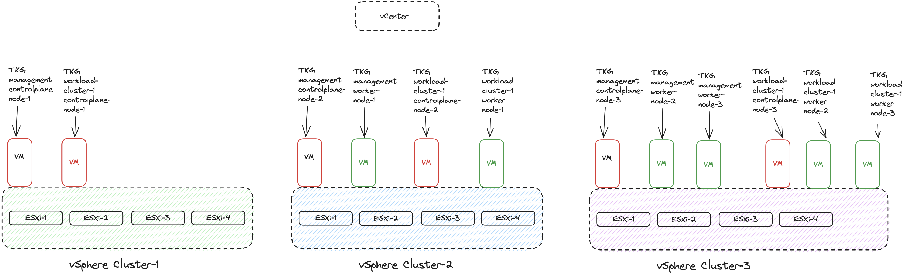

# Tanzu Kubernetes Grid 2.3 and availability zones

TKG 2.3 brings support for multiple availability zones (AZs) in the [stable](https://docs.vmware.com/en/VMware-Tanzu-Kubernetes-Grid/2/about-tkg/support-policies.html#states) feature set. So I wanted to explore this possibility and how to configure it. I will go through the configuratuons steps needed before deployment of a new TKG management cluster and TKG workload cluster using different availability zones. This post's primary focus is the multi availability zone feature, so I will not go into details in general TKG configurations such networking, loadbalancing as I already have a post covering a "standard" installation of TKG. 

I will start by deploying the TKG management worker nodes on two of my three vSphere clusters (Cluster-2 and 3) and control-plane nodes in my vSphere Cluster-1, just to illustrate that with TKG 2.3 I can control where the respective type of nodes will be placed. Then I will deploy a TKG workload cluster (tkg-cluster-1) using the same zone-placement as the TKG management cluster. Both the TKG management cluster deployment and first workload cluster will be using vSphere clusters as availability zones. It will end up looking like this:


When I have deployed my tkg-cluster-1 (workload cluster) I will apply another zone-config using vSphere DRS host-groups and provision a second TKG workload cluster (tkg-cluster-2-hostgroups) using a zone config configured to use vSphere DRS host-groups where I will define DRS rules on Cluster-3 dividing the four hosts into two zones, something like this:


This post will be using a vSphere as the TKG infrastructure provider. The vSphere environment consists of 1 vCenter server, 3 vSphere clusters with 4 hosts in each ( a total of 12 ESXi hosts equally distributed across 3 vSphere clusters). All vSphere clusters are providing their own vSAN datastore local to their vSphere cluster. There is no stretched vSAN nor any datastore replication going on. NSX is the underlaying network infrastructure and NSX-ALB for all loadbalancing needs. To get started there is some steps that needs to be done in vCenter, a prepared linux jumphost/bootstrap client with necessary cli tools. So lets start with the preparations.

## Preparations

This section will cover all the needed preparations to get TKG 2.3 up and running in multiple availability zones. First out is the Linux jumphost, then vCenter configurations before doing the deployment. For more details on all requirements I dont cover in this post, head over to the offical documentation [here](https://docs.vmware.com/en/VMware-Tanzu-Kubernetes-Grid/2.3/tkg-deploy-mc/mgmt-reqs-prep-vsphere.html)


### Linux jumphost with necessary Tanzu CLI tools

The Linux jumphost needs to be configured with the following specifications:

- A Linux, Windows, or macOS operating system running on a physical or virtual machine that has the following hardware:
  - At least 8 GB of RAM. VMware recommends 16 GB of RAM.
  - A disk with 50 GB of available storage.
  - 2 or 4 2-core CPUs.
  - Docker installed and running.

 When that is sorted, log into the jumphost and start by grabbing the Tanzu CLI. This has become very easy compared to earlier. 
My Linux jumphost is running Ubuntu, so I just need to add the repository for the Tanzu CLI like this:

```bash
sudo apt update
sudo apt install -y ca-certificates curl gpg
sudo mkdir -p /etc/apt/keyrings
curl -fsSL https://packages.vmware.com/tools/keys/VMWARE-PACKAGING-GPG-RSA-KEY.pub | sudo gpg --dearmor -o /etc/apt/keyrings/tanzu-archive-keyring.gpg
echo "deb [signed-by=/etc/apt/keyrings/tanzu-archive-keyring.gpg] https://storage.googleapis.com/tanzu-cli-os-packages/apt tanzu-cli-jessie main" | sudo tee /etc/apt/sources.list.d/tanzu.list
sudo apt update
sudo apt install -y tanzu-cli
```

 If not using Ubuntu, or you prefer another method of installation, read [here](https://docs.vmware.com/en/VMware-Tanzu-Kubernetes-Grid/2.3/tkg-deploy-mc/install-cli.html) for more options.

Then I need to install the necessary Tanzu CLI plugins like this:

```bash
andreasm@tkg-bootstrap:~$ tanzu plugin group get vmware-tkg/default:v2.3.0 # to list them
[i] Reading plugin inventory for "projects.registry.vmware.com/tanzu_cli/plugins/plugin-inventory:latest", this will take a few seconds.
Plugins in Group:  vmware-tkg/default:v2.3.0
  NAME                TARGET      VERSION
  isolated-cluster    global      v0.30.1
  management-cluster  kubernetes  v0.30.1
  package             kubernetes  v0.30.1
  pinniped-auth       global      v0.30.1
  secret              kubernetes  v0.30.1
  telemetry           kubernetes  v0.30.1
andreasm@tkg-bootstrap:~/.config$ tanzu plugin install --group vmware-tkg/default:v2.3.0 # to install them
[i] The tanzu cli essential plugins have not been installed and are being installed now. The install may take a few seconds.

[i] Installing plugin 'isolated-cluster:v0.30.1' with target 'global'
[i] Installing plugin 'management-cluster:v0.30.1' with target 'kubernetes'
[i] Installing plugin 'package:v0.30.1' with target 'kubernetes'
[i] Installing plugin 'pinniped-auth:v0.30.1' with target 'global'
[i] Installing plugin 'secret:v0.30.1' with target 'kubernetes'
[i] Installing plugin 'telemetry:v0.30.1' with target 'kubernetes'
[ok] successfully installed all plugins from group 'vmware-tkg/default:v2.3.0'
```

Then I need the Kubernetes CLI, "kubectl cli v1.26.5 for Linux" for TKG 2.3 which can be found [here](https://customerconnect.vmware.com/en/downloads/info/slug/infrastructure_operations_management/vmware_tanzu_kubernetes_grid/2_x). After I have downloaded it, I copy it over to the Linux jumphost, extract it and place the binary *kubectl* in the folder */usr/local/bin* so its in my path.

To verify the CLI tools and plugins are in place, I will run these commands:

```bash
# Verify Tanzu CLI version:
andreasm@tkg-bootstrap:~/.config$ tanzu version
version: v1.0.0
buildDate: 2023-08-08
sha: 006d0429
```

```bash
# Verify Tanzu CLI plugins:
andreasm@tkg-bootstrap:~/.config$ tanzu plugin list
Standalone Plugins
  NAME                DESCRIPTION                                                        TARGET      VERSION  STATUS
  isolated-cluster    Prepopulating images/bundle for internet-restricted environments   global      v0.30.1  installed
  pinniped-auth       Pinniped authentication operations (usually not directly invoked)  global      v0.30.1  installed
  telemetry           configure cluster-wide settings for vmware tanzu telemetry         global      v1.1.0   installed
  management-cluster  Kubernetes management cluster operations                           kubernetes  v0.30.1  installed
  package             Tanzu package management                                           kubernetes  v0.30.1  installed
  secret              Tanzu secret management                                            kubernetes  v0.30.1  installed
  telemetry           configure cluster-wide settings for vmware tanzu telemetry         kubernetes  v0.30.1  installed
```

```bash
# verify kubectl version - look for "Client Version"
andreasm@tkg-bootstrap:~/.config$ kubectl version
WARNING: This version information is deprecated and will be replaced with the output from kubectl version --short.  Use --output=yaml|json to get the full version.
Client Version: version.Info{Major:"1", Minor:"26", GitVersion:"v1.26.5+vmware.2", GitCommit:"83112f368344a8ff6d13b89f120d5e646cd3bf19", GitTreeState:"clean", BuildDate:"2023-06-26T06:47:19Z", GoVersion:"go1.19.9", Compiler:"gc", Platform:"linux/amd64"}
Kustomize Version: v4.5.7
```


Next up is some preparations that needs to be done in vCenter. 

## vSphere preparations

As vSphere is the platform where I deploy TKG there are a couple of things that needs to be done to prepare for the deployment of TKG in general but also how the different availability zones will be configured. Apart from the necessary functions such as networking and storage to support a TKG deployment.  

### vCenter TKG Kubernetes OVA template

A small but important part is the OVA template to be used for the controlplane/worker nodes. I need to upload the right Kubernetes OVA template, it needs to be version 1.26.5, where I am using the latest Ubuntu 2004 Kubernetes v1.26.5 OVA. This I have downloaded from [here]([the Tanzu Kubernetes Grid downloads page](https://customerconnect.vmware.com/en/downloads/info/slug/infrastructure_operations_management/vmware_tanzu_kubernetes_grid/2_x)), uploaded it to my vCenter server, then converted it to a template, not changing anything on it, name etc. 

## vSphere/vCenter availability zones

With TKG 2.3 running on vSphere there is two ways to define the availability zones. There is the option to use vSphere clusters as availability zones or vSphere DRS host-groups. This gives flexibility and the possibility to define the availability zones according to how the underlaying vSphere environment has been configured. We can potentially have many availability zones for TKG to consume, some using host-groups, some using vSphere clusters and even different vCenter servers. It all depends on the needs and where it makes sense. Regardless of using vSphere clusters or DRS host-groups we need to define define a region and a zone for TKG to use. In vCenter we need to create tag associated with a category. The category can be whatever you want to call it, they just need to be reflected correctly when defining the vSphereFailureDomain later on. You may end up with several vSphere tag-categories as this depend on the environment and how you want to use the availability zones.  These tag and categories are defined a bit different between vSphere clusters and DRS host-groups. When using vSphere clusters the region is defined on the Datacenter object and the zone is the actual vsphere cluster. When using DRS host-groups the vSphere cluster is defined as the the regions and the host-group as the zone. 


### vSphere DRS Host-Groups

The option to use host-groups (DRS objects) is to create "logical" zones based on host-groups/vm-groups affinity rules to place the TKG nodes in their respective host-groups inside same vSphere Cluster. This done by creating the host-groups, place the corresponding esxi hosts in the respective host-group and use vCenter *Tags & Custom Attributes* specifying tags on these objects respectively. This can be a good use case if the vSphere hosts are in the same vSphere cluster but spread across several racks. That means I can create a host-group pr rack, and define these host-groups as my availability zones for TKG to place the nodes accordingly. Lets pretend I have 12 ESXi hosts, equally divided and placed in their own rack. I can then create 3 host-groups called *rack-1*, *rack-2* and *rack-3*. 


### vSphere Clusters

Using the vSphere clusters option we define the vCenter Datacenter object as the region and the vSphere clusters as the zones. We define that easily by using the vCenter *Tags & Custom Attributes* specifying tags on these objects respectively. We tag the specific vSphere Datacenter to become a region and we tag the vSphere clusters to be a specific zone. In mye lab I have vSphere hosts in three different vSphere clusters. With that I have defined my vCenter Server's only Datacenter object to be a region, and all my three vSphere clusters as three different zones within that one region. In short that means if I have only one Datacenter object in my vCenter that is a region. In this Datecenter object I have my three vSphere host clusters which will be three different zones for TKG to be aware of for potential placement of the TKG nodes. 


For more information on multiple availability zones head over to the offical docs [here](https://docs.vmware.com/en/VMware-Tanzu-Kubernetes-Grid/2.3/using-tkg/workload-clusters-multi-az-vsphere.html).

Next up is how configured the AZs in vCenter using vSphere clusters and DRS host-groups

### vCenter Tags - using vSphere cluster and datacenter

As I am using vSphere Clusters as my zones and vSphere Datacenter it is very straight forward. The first thing that needs to be done is to create two categories under Tags & Custom Attributes here:


The two categories is the *region* and *zone*. These two categories are created like this.

Region category:


Then the Zone category:


The categories can also be created using a cli tool called [govc](https://github.com/vmware/govmomi/tree/main/govc) like this:

```bash
andreasm@tkg-bootstrap:~$ govc tags.category.create -t Datacenter k8s-region
urn:vmomi:InventoryServiceCategory:a0248c5d-7050-4891-9635-1b5cbcb89f29:GLOBAL
```


```bash
andreasm@tkg-bootstrap:~$ govc tags.category.create -t ClusterComputeResource k8s-zone
urn:vmomi:InventoryServiceCategory:1d13b59d-1d2c-433a-b3ac-4f6528254f98:GLOBAL
```

I should now see the categories like this in my vCenter UI:


Now when I have created the categories, I need to create the tags using the newly created categories respectively.

The k8s-region category is used on the vCenter/vSphere Datacenter object. I will create a tag using the category *k8s-region* with some kind of meaningful name for the Datacenter object, and then attach this tag to the Datacenter object. 

Create Datacenter Tag:


Then attach it to the Datacenter object:


Or using govc to attach/assign the tag:

```bash
andreasm@tkg-bootstrap:~$ govc tags.attach -c k8s-region wdc-region /cPod-NSXAM-WDC
# There is no output after execution of this command...
```

Next up is the tags using the *k8s-zone* category. I am creating three tags for this as I have three vSphere clusters I want to use a three different Availability Zones. The tags are created the same as before only using the category *k8s-zone* instead.

I will end up with three tags called *wdc-zone-1*,*wdc-zone-2*, and *wdc-zone-3*. 


And here they are:


Now I need to attach them to my vSphere clusters respectively, Cluster-1 = wdc-zone-1, Cluster-2 = wdc-zone-2 and Cluster-3 = wdc-zone-3.


Again, the creation of the tags and attaching them can be done using *govc*:

```bash
# Creating the tags using the correct category
andreasm@tkg-bootstrap:~$ govc tags.create -c k8s-zone wdc-zone-1
andreasm@tkg-bootstrap:~$ govc tags.create -c k8s-zone wdc-zone-2
andreasm@tkg-bootstrap:~$ govc tags.create -c k8s-zone wdc-zone-3
# Attaching the tags to the respective clusters
andreasm@tkg-bootstrap:~$ govc tags.attach -c k8s-zone wdc-zone-1 /cPod-NSXAM-WDC/host/Cluster-1
andreasm@tkg-bootstrap:~$ govc tags.attach -c k8s-zone wdc-zone-2 /cPod-NSXAM-WDC/host/Cluster-2
andreasm@tkg-bootstrap:~$ govc tags.attach -c k8s-zone wdc-zone-3 /cPod-NSXAM-WDC/host/Cluster-3
```

### vCenter Tags - using vSphere DRS host-groups

If using vSphere DRS host-groups this how how we can confgure vCenter using DRS host-groups as availability zones for TKG. In this section I will "simulate" that my vSphere Cluster-3 with 4 ESXi hosts is equally divided into two "racks" (2 ESXi hosts in each host-group). So I will create two host-groups, to reflect two availability zones inside Cluster-3. 


First I need to create two host-groups where I add my corresponding ESXi hosts. Group-1 will contain ESXi-9 and ESXi-12 and Group-2 will contain ESXi-11 and ESXi-12.
From the vCenter UI: 


Click add:
I am naming the host-groups *rack-1* and *rack-2* respectively, adding two hosts in each group.


The two host-groups:


When the host-groups have been created and defined with the esxi host membership, I need to define two DRS VM-groups. 
From the same place as I created the host-groups, I click add and create a VM group instead.


I need to add a "dummy" vm to be allowed to save and create the group. This is only when creating the group via the vCenter UI.


Both vm groups created:


To create these groups with cli using *govc*:

```bash
# Create Host Groups
andreasm@tkg-bootstrap:~$ govc cluster.group.create -cluster=Cluster-3 -name=rack-1 -host esx01 esx02
[31-08-23 08:49:30] Reconfigure /cPod-NSXAM-WDC/host/Cluster-3...OK
andreasm@tkg-bootstrap:~$ govc cluster.group.create -cluster=Cluster-3 -name=rack-2 -host esx03 esx04
[31-08-23 08:48:30] Reconfigure /cPod-NSXAM-WDC/host/Cluster-3...OK
# Create VM groups
andreasm@tkg-bootstrap:~$ govc cluster.group.create -cluster=Cluster-3 -name=rack-1-vm-group -vm
[31-08-23 08:52:00] Reconfigure /cPod-NSXAM-WDC/host/Cluster-3...OK
andreasm@tkg-bootstrap:~$ govc cluster.group.create -cluster=Cluster-3 -name=rack-2-vm-group -vm
[31-08-23 08:52:04] Reconfigure /cPod-NSXAM-WDC/host/Cluster-3...OK
```

Now I need to create affinity rules restricting the corresponding vm-group to only reside in the correct host-group. 

Group-1 rule


and group 2 rule


Now its just creating the corresponding tag categories k8s-region and k8s-zone and the respective tags pr cluster and host-groups that have been created. Lets start by creating the categories, first from the vCenter UI then later using cli with *govc*.
Note that these DRS host-groups are not the objects being tagged as the actual zones later on, they are just the logical boundary used in vCenter for vm placement. The ESXi hosts themselves will be the ones that are tagged with the zone tag, where the ESXi hosts are part of a host-group with a VM affinity rule.  

Category *k8s-region*:

I already have the k8s-region category from earlier, I just need to update it to also allow cluster.


Category *k8s-zone*:

I already have the *k8s-zone* category from earlier, I just need to update it to also allow Host.


Then I need to create the tag using the correct category, starting with the region tag.
Create tag called *room1* (in lack of own fantasy) 


Then the two tags pr zone/host-group:

Rack1


Rack2


Now I need to attach the above tags to the correct objects in vCenter. The region tag will be used on the Cluster-3 object, the k8s-zone tags will be used on the ESXi host objects. 
The region *room1* tag:


Then the zone tag *rack1* and *rack2*

Rack1


Rack2


Now I have tagged the region and the zones, and should now have 2 availability zones for TKG to use. 

To configure the categories, tags and attachment from cli using *govc*:

``` bash
# Creating the categories if not already created, if already created run the tags.category.update
andreasm@tkg-bootstrap:~$ govc tags.category.create -t ClusterComputeResource k8s-region
andreasm@tkg-bootstrap:~$ govc tags.category.create -t HostSystem k8s-zone
# Create the region tag
andreasm@tkg-bootstrap:~$ govc tags.create -c k8s-region room1
# Create the zone tag
andreasm@tkg-bootstrap:~$ govc tags.create -c k8s-zone rack1
andreasm@tkg-bootstrap:~$ govc tags.create -c k8s-zone rack2
# Attach the region tag to vSphere Cluster-3
andreasm@tkg-bootstrap:~$ govc tags.attach -c k8s-region room1 /cPod-NSXAM-WDC/host/Cluster-3
# Attach the zone tag to the ESXi hosts
andreasm@tkg-bootstrap:~$ govc tags.attach -c k8s-zone rack1 /cPod-NSXAM-WDC/host/Cluster-3/esxi-01.fqdn
andreasm@tkg-bootstrap:~$ govc tags.attach -c k8s-zone rack1 /cPod-NSXAM-WDC/host/Cluster-3/esxi-02.fqdn
andreasm@tkg-bootstrap:~$ govc tags.attach -c k8s-zone rack2 /cPod-NSXAM-WDC/host/Cluster-3/esxi-03.fqdn
andreasm@tkg-bootstrap:~$ govc tags.attach -c k8s-zone rack2 /cPod-NSXAM-WDC/host/Cluster-3/esxi-04.fqdn
```

Now that the necessary tags and categories have been created and assigned in vCenter, I can continue to prepare the necessary configs for TKG to use them.  

{}

If the categories are already in place from previous installations, and you want to add these AZs also - Create new categories as the CSI installation will fail complaining on this error:
*"plugin registration failed with err: rpc error: code = Internal desc = failed to retrieve topology information for Node: "". Error: "failed to fetch topology information for the nodeVM \"\". Error: duplicate values detected for category k8s-zone as \"rack1\" and \"wdc-zone-3\"", restarting registration container."* 

These new categories must be updated accordingly in the multi-az.yaml file and tkg-workload cluster manifest before deployment. It can also make sense to have different categories to distinguish the different environments better. 

{}


## TKG - Management Cluster

Before I can deploy a TKG management cluster I need to prepare a bootstrap yaml file and a multi-zone file so it knows about how the cluster should be configured and the availability zones. 
For TKG to use the tags created in vCenter we need to define these as Kubernetes FailureDomain and Deployment-Zone objects. This is done by creating a separate yaml file describing this. In this multi-zone file I need to define the *region*, *zone* and *topology*. The category and zone tags created in vCenter and the ones I have used in this post is only to keep it simple. We can have several categories depending on the environment you deploy it on. For more information on this head over [here](https://docs.vmware.com/en/VMware-Tanzu-Kubernetes-Grid/2.3/using-tkg/workload-clusters-multi-az-vsphere.html#create-failuredomain-and-deployment-zone-objects-in-kubernetes-4).
Here it is also possible to define different networks and storage.
A short explanation of the two CRDs in the example below: vSphereFailureDomain is where you provide the necessary information about the region/zones defined in vCenter such as the tags pr region/zone aka Datacenter/Clusters, networks and datastore. 
The vSphereDeploymentZone is used for placement constraints, using the vSphereFailureDomains and makes it possible mapping them using labels like I am doing below. A bit more on that later when I come to the actual deployment.  

### TKG multi-az config file - using vCenter DRS host-groups

Below is the yaml file I have prepared to deploy my TKG Management cluster when using vCenter DRS host-groups as availability zones. Comments inline:

```yaml
---
apiVersion: infrastructure.cluster.x-k8s.io/v1beta1
kind: VSphereFailureDomain
metadata:
    name: rack1 # A name for this specifc zone, does not have to be the same as the tag used in vCenter
spec:
    region:
        name: room1 # The specific tag created and assigned to the Datacenter object in vCenter
        type: ComputeCluster
        tagCategory: k8s-region # The specific tag category created earlier in vCenter
    zone:
        name: rack1 # The specific tag created and assigned to the cluster object in vCenter
        type: HostGroup
        tagCategory: k8s-zone # The specific tag category created earlier in vCenter
    topology:
        datacenter: /cPod-NSXAM-WDC # Specifies which Datacenter in vCenter
        computeCluster: Cluster-3 # Specifices which Cluster in vCenter
        hosts:
          vmGroupName: rack-1-vm-group # The vm group name created earlier in vCenter
          hostGroupName: rack-1 # The host group name created earlier in vCenter
        networks:
            - /cPod-NSXAM-WDC/network/ls-tkg-mgmt # Specify the network the nodes shall use in this region/cluster
        datastore: /cPod-NSXAM-WDC/datastore/vsanDatastore-wdc-3 # Specify the datastore the nodes shall use in this region/cluster
---
apiVersion: infrastructure.cluster.x-k8s.io/v1beta1
kind: VSphereFailureDomain
metadata:
    name: rack2 # A name for this specifc zone, does not have to be the same as the tag used in vCenter
spec:
    region:
        name: room1 # The specific tag created and assigned to the Datacenter object in vCenter
        type: ComputeCluster
        tagCategory: k8s-region # The specific tag category created earlier in vCenter
    zone:
        name: rack2 # The specific tag created and assigned to the cluster object in vCenter
        type: HostGroup
        tagCategory: k8s-zone # The specific tag category created earlier in vCenter
    topology:
        datacenter: /cPod-NSXAM-WDC # Specifies which Datacenter in vCenter
        computeCluster: Cluster-3 # Specifices which Cluster in vCenter
        hosts:
          vmGroupName: rack-2-vm-group # The vm group name created earlier in vCenter
          hostGroupName: rack-2 # The host group name created earlier in vCenter
        networks:
            - /cPod-NSXAM-WDC/network/ls-tkg-mgmt # Specify the network the nodes shall use in this region/cluster
        datastore: /cPod-NSXAM-WDC/datastore/vsanDatastore-wdc-3 # Specify the datastore the nodes shall use in this region/cluster
---
apiVersion: infrastructure.cluster.x-k8s.io/v1beta1
kind: VSphereDeploymentZone
metadata:
  name: rack1 # Give the deploymentzone a name
  labels:
    region: room1 # For controlplane placement
    tkg-cp: allowed # For controlplane placement 
spec:
    server: vcsa.fqdn
    failureDomain: rack1 # Calls on the vSphereFailureDomain defined above
    placementConstraint:
        resourcePool: /cPod-NSXAM-WDC/host/Cluster-3/Resources
        folder: /cPod-NSXAM-WDC/vm/TKGm
---
apiVersion: infrastructure.cluster.x-k8s.io/v1beta1
kind: VSphereDeploymentZone
metadata:
  name: rack2 # Give the deploymentzone a name
  labels:
    region: room1
    tkg-cp: allowed
spec:
    server: vcsa.fqdn
    failureDomain: rack2 # Calls on the vSphereFailureDomain defined above
    placementConstraint:
        resourcePool: /cPod-NSXAM-WDC/host/Cluster-3/Resources
        folder: /cPod-NSXAM-WDC/vm/TKGm
---

```


### TKG multi-az config file - using vSphere cluster and datacenter

Below is the yaml file I have prepared to deploy my TKG Management cluster with when using vSphere clusters as availability zones. Comments inline:

```yaml
---
apiVersion: infrastructure.cluster.x-k8s.io/v1beta1
kind: VSphereFailureDomain
metadata:
    name: wdc-zone-1 # A name for this specifc zone, does not have to be the same as the tag used in vCenter
spec:
    region:
        name: wdc-region # The specific tag created and assigned to the Datacenter object in vCenter
        type: Datacenter
        tagCategory: k8s-region # The specific tag category created earlier in vCenter
    zone:
        name: wdc-zone-1 # The specific tag created and assigned to the cluster object in vCenter
        type: ComputeCluster
        tagCategory: k8s-zone # The specific tag category created earlier in vCenter
    topology:
        datacenter: /cPod-NSXAM-WDC # Specifies which Datacenter in vCenter
        computeCluster: Cluster-1 # Specifices which Cluster in vCenter
        networks:
            - /cPod-NSXAM-WDC/network/ls-tkg-mgmt # Specify the network the nodes shall use in this region/cluster
        datastore: /cPod-NSXAM-WDC/datastore/vsanDatastore-wdc-01 # Specify the datastore the nodes shall use in this region/cluster
---
apiVersion: infrastructure.cluster.x-k8s.io/v1beta1
kind: VSphereFailureDomain
metadata:
    name: wdc-zone-2
spec:
    region:
        name: wdc-region
        type: Datacenter
        tagCategory: k8s-region
    zone:
        name: wdc-zone-2
        type: ComputeCluster
        tagCategory: k8s-zone
    topology:
        datacenter: /cPod-NSXAM-WDC
        computeCluster: Cluster-2
        networks:
            - /cPod-NSXAM-WDC/network/ls-tkg-mgmt
        datastore: /cPod-NSXAM-WDC/datastore/vsanDatastore-wdc-02
---
apiVersion: infrastructure.cluster.x-k8s.io/v1beta1
kind: VSphereFailureDomain
metadata:
    name: wdc-zone-3
spec:
    region:
        name: wdc-region
        type: Datacenter
        tagCategory: k8s-region
    zone:
        name: wdc-zone-3
        type: ComputeCluster
        tagCategory: k8s-zone
    topology:
        datacenter: /cPod-NSXAM-WDC
        computeCluster: Cluster-3
        networks:
            - /cPod-NSXAM-WDC/network/ls-tkg-mgmt
        datastore: /cPod-NSXAM-WDC/datastore/vsanDatastore-wdc-3
---
apiVersion: infrastructure.cluster.x-k8s.io/v1beta1
kind: VSphereDeploymentZone
metadata:
    name: wdc-zone-1 # A name for the DeploymentZone. Does not have to be the same as above
    labels:
        region: wdc-region # A specific label to be used for placement restriction, allowing flexibility of node placement.
        tkg-cp: allowed # A specific label to be used for placement restriction, allowing flexibility of node placement.
spec:
    server: vcsa.fqdn # Specifies the vCenter IP or FQDN
    failureDomain: wdc-zone-1 # Calls on the respective vSphereFailureDomain defined above
    placementConstraint:
        resourcePool: /cPod-NSXAM-WDC/host/Cluster-1/Resources # Specify which ResourcePool or Cluster directly
        folder: /cPod-NSXAM-WDC/vm/TKGm # Specify which folder in vCenter to use for node placement
---
apiVersion: infrastructure.cluster.x-k8s.io/v1beta1
kind: VSphereDeploymentZone
metadata:
    name: wdc-zone-2
    labels:
        region: wdc-region
        tkg-cp: allowed
        worker: allowed
spec:
    server: vcsa.fqdn
    failureDomain: wdc-zone-2
    placementConstraint:
        resourcePool: /cPod-NSXAM-WDC/host/Cluster-2/Resources
        folder: /cPod-NSXAM-WDC/vm/TKGm
---
apiVersion: infrastructure.cluster.x-k8s.io/v1beta1
kind: VSphereDeploymentZone
metadata:
    name: wdc-zone-3
    labels:
        region: wdc-region
        tkg-cp: allowed
        worker: allowed
spec:
    server: vcsa.fqdn
    failureDomain: wdc-zone-3
    placementConstraint:
        resourcePool: /cPod-NSXAM-WDC/host/Cluster-3/Resources
        folder: /cPod-NSXAM-WDC/vm/TKGm
```

 

The *multi-az* yaml file above is now ready to be used deploying my TKG mgmt cluster in a multi-az environment using vSphere Clusters as the Availability Zones.  I have added a label in my multi-az configuration under the vSphereDeploymentZones: *tkg-cp: allowed*. This custom label is used for the placement of the TKG controlplane nodes. I only want the worker nodes to be placed on AZ-2 and AZ-3 (wdc-zone-2 and wdc-zone-3) where AZ-1 or wdc-zone-1 is only for Control Plane node placement. This is one usecase for the vSphereDeploymentZone, placement constraints. Using these labels to specify the control-plane placement. The worker nodes placement for both TKG management cluster and workload cluster is defined in the bootstrap yaml or the cluster-class manifest for workload cluster. 

### TKG bootstrap yaml - common for both vSphere cluster and DRS host-groups

In additon to the regular settings that is needed in the bootstrap yaml file I need to add these lines to take into consideration the Availability zones. 

```yaml
#! ---------------------------------------------------------------------
#! Multi-AZ configuration
#! ---------------------------------------------------------------------
USE_TOPOLOGY_CATEGORIES: "true"
VSPHERE_REGION: k8s-region
VSPHERE_ZONE: k8s-zone
VSPHERE_AZ_0: wdc-zone-2 # Here I am defining the zone placement for the workers that ends with md-0
VSPHERE_AZ_1: wdc-zone-3 # Here I am defining the zone placement for the workers that ends with md-1
VSPHERE_AZ_2: wdc-zone-3 # Here I am defining the zone placement for the workers that ends with md-2
VSPHERE_AZ_CONTROL_PLANE_MATCHING_LABELS: "region=wdc-region,tkg-cp=allowed" #This defines and uses the vSphereDeploymentsZone labels I have added to instruct the control-plane node placement
```

**Note!** The Zone names under vSphere_AZ_0-2 needs to reflect the correct zone tag/label used in your corresponding multi-az.yaml file pr vSphereDeploymentZone. The same goes for the VSPHERE_AZ_CONTROL_PLANE_MATCHING_LABELS: the values needs to reflect the labels used/added. 

Now my full bootstrap.yaml below:

```yaml
#! ---------------
#! Basic config
#! -------------
CLUSTER_NAME: tkg-wdc-az-mgmt
CLUSTER_PLAN: prod
INFRASTRUCTURE_PROVIDER: vsphere
ENABLE_CEIP_PARTICIPATION: "false"
ENABLE_AUDIT_LOGGING: "false"
CLUSTER_CIDR: 100.96.0.0/11
SERVICE_CIDR: 100.64.0.0/13
TKG_IP_FAMILY: ipv4
DEPLOY_TKG_ON_VSPHERE7: "true"

#! ---------------
#! vSphere config
#! -------------
VSPHERE_DATACENTER: /cPod-NSXAM-WDC
VSPHERE_DATASTORE: /cPod-NSXAM-WDC/datastore/vsanDatastore-wdc-01
VSPHERE_FOLDER: /cPod-NSXAM-WDC/vm/TKGm
VSPHERE_INSECURE: "false"
VSPHERE_NETWORK: /cPod-NSXAM-WDC/network/ls-tkg-mgmt
VSPHERE_CONTROL_PLANE_ENDPOINT: ""
VSPHERE_PASSWORD: "password"
VSPHERE_RESOURCE_POOL: /cPod-NSXAM-WDC/host/Cluster-1/Resources
VSPHERE_SERVER: vcsa.fqdn
VSPHERE_SSH_AUTHORIZED_KEY: ssh-rsa 
VSPHERE_TLS_THUMBPRINT: F:::::::::E
VSPHERE_USERNAME: andreasm@vsphereSSOdomain.net

#! ---------------------------------------------------------------------
#! Multi-AZ configuration
#! ---------------------------------------------------------------------
USE_TOPOLOGY_CATEGORIES: "true"
VSPHERE_REGION: k8s-region
VSPHERE_ZONE: k8s-zone
VSPHERE_AZ_0: wdc-zone-2
VSPHERE_AZ_1: wdc-zone-3
VSPHERE_AZ_2: wdc-zone-3
VSPHERE_AZ_CONTROL_PLANE_MATCHING_LABELS: "region=wdc-region,tkg-cp=allowed"
AZ_FILE_PATH: /home/andreasm/tanzu-v-2.3/multi-az/multi-az.yaml

#! ---------------
#! Node config
#! -------------
OS_ARCH: amd64
OS_NAME: ubuntu
OS_VERSION: "20.04"
VSPHERE_CONTROL_PLANE_DISK_GIB: "20"
VSPHERE_CONTROL_PLANE_MEM_MIB: "4096"
VSPHERE_CONTROL_PLANE_NUM_CPUS: "2"
VSPHERE_WORKER_DISK_GIB: "20"
VSPHERE_WORKER_MEM_MIB: "4096"
VSPHERE_WORKER_NUM_CPUS: "2"
#CONTROL_PLANE_MACHINE_COUNT: 3
#WORKER_MACHINE_COUNT: 3

#! ---------------
#! Avi config
#! -------------
AVI_CA_DATA_B64: BASE64ENC
AVI_CLOUD_NAME: wdc-1-nsx
AVI_CONTROL_PLANE_HA_PROVIDER: "true"
AVI_CONTROLLER: 172.21.101.50
# Network used to place workload clusters' endpoint VIPs
AVI_CONTROL_PLANE_NETWORK: vip-tkg-wld-l4
AVI_CONTROL_PLANE_NETWORK_CIDR: 10.101.114.0/24
# Network used to place workload clusters' services external IPs (load balancer & ingress services)
AVI_DATA_NETWORK: vip-tkg-wld-l7
AVI_DATA_NETWORK_CIDR: 10.101.115.0/24
# Network used to place management clusters' services external IPs (load balancer & ingress services)
AVI_MANAGEMENT_CLUSTER_VIP_NETWORK_CIDR: 10.101.113.0/24
AVI_MANAGEMENT_CLUSTER_VIP_NETWORK_NAME: vip-tkg-mgmt-l7
# Network used to place management clusters' endpoint VIPs
AVI_MANAGEMENT_CLUSTER_CONTROL_PLANE_VIP_NETWORK_NAME: vip-tkg-mgmt-l4
AVI_MANAGEMENT_CLUSTER_CONTROL_PLANE_VIP_NETWORK_CIDR: 10.101.112.0/24
AVI_NSXT_T1LR: Tier-1
AVI_CONTROLLER_VERSION: 22.1.2
AVI_ENABLE: "true"
AVI_LABELS: ""
AVI_PASSWORD: "password"
AVI_SERVICE_ENGINE_GROUP: nsx-se-generic-group
AVI_MANAGEMENT_CLUSTER_SERVICE_ENGINE_GROUP: nsx-se-generic-group
AVI_USERNAME: admin
AVI_DISABLE_STATIC_ROUTE_SYNC: true
AVI_INGRESS_DEFAULT_INGRESS_CONTROLLER: true
AVI_INGRESS_SHARD_VS_SIZE: SMALL
AVI_INGRESS_SERVICE_TYPE: NodePortLocal


#! ---------------
#! Proxy config
#! -------------
TKG_HTTP_PROXY_ENABLED: "false"

#! ---------------------------------------------------------------------
#! Antrea CNI configuration
#! ---------------------------------------------------------------------
ANTREA_NODEPORTLOCAL: true
ANTREA_PROXY: true
ANTREA_ENDPOINTSLICE: true
ANTREA_POLICY: true
ANTREA_TRACEFLOW: true
ANTREA_NETWORKPOLICY_STATS: false
ANTREA_EGRESS: true
ANTREA_IPAM: false
ANTREA_FLOWEXPORTER: false
ANTREA_SERVICE_EXTERNALIP: false
ANTREA_MULTICAST: false


#! ---------------------------------------------------------------------
#! Machine Health Check configuration
#! ---------------------------------------------------------------------
ENABLE_MHC: "true"
ENABLE_MHC_CONTROL_PLANE: true
ENABLE_MHC_WORKER_NODE: true
MHC_UNKNOWN_STATUS_TIMEOUT: 5m
MHC_FALSE_STATUS_TIMEOUT: 12m


```

One last thing to do before heading over to the actual deployment is to add the following to my current Linux jumphost session:

```bash
andreasm@tkg-bootstrap:~$ export SKIP_MULTI_AZ_VERIFY="true"
```

This is needed as there is no mgmt cluster yet, and there is no way for anything that's not there to verify anything :smiley_cat:


## TKG Deployment

Now that I have done all the needed preparations it is time to do the actual deployment and see if my Availability Zones are being used as I wanted. When the TKG management cluster has been deployed I should end up with all the Control Plane (3) nodes distributed across all my 3 AZs. Then the worker nodes should only be placed in the AZ-2 and AZ-3. 

### TKG Mgmt Cluster deployment with multi-availability-zones

From my Linux jumphost where I have all the CLI tools in place I am now ready to execute the following command to deploy the mgmt cluster. 3 Control Plane Nodes and 3 Worker Nodes. 

```bash
andreasm@tkg-bootstrap:~$ tanzu mc create -f my-tkg-mgmt-bootstrap.yaml --az-file my-multi-az-file.yaml
```

```bash
Validating the pre-requisites...

vSphere 8 with Tanzu Detected.

You have connected to a vSphere 8 with Tanzu environment that includes an integrated Tanzu Kubernetes Grid Service which
turns a vSphere cluster into a platform for running Kubernetes workloads in dedicated resource pools. Configuring Tanzu
Kubernetes Grid Service is done through the vSphere HTML5 Client.

Tanzu Kubernetes Grid Service is the preferred way to consume Tanzu Kubernetes Grid in vSphere 8 environments. Alternatively you may
deploy a non-integrated Tanzu Kubernetes Grid instance on vSphere 8.
Deploying TKG management cluster on vSphere 8 ...
Identity Provider not configured. Some authentication features won't work.
Using default value for CONTROL_PLANE_MACHINE_COUNT = 3. Reason: CONTROL_PLANE_MACHINE_COUNT variable is not set
Using default value for WORKER_MACHINE_COUNT = 3. Reason: WORKER_MACHINE_COUNT variable is not set

Setting up management cluster...
Validating configuration...
Using infrastructure provider vsphere:v1.7.0
Generating cluster configuration...
Setting up bootstrapper...
```

Sit back and enjoy while the kind cluster is being deployed locally and hopefully provisioned in your vCenter server..

When you see the below: *Start creating management cluster* something should start to happen in the vCenter server.

```bash
Management cluster config file has been generated and stored at: '/home/andreasm/.config/tanzu/tkg/clusterconfigs/tkg-wdc-az-mgmt.yaml'
Start creating management cluster...
```


And by just clicking on the respective TKG VM so far I can see that they are respecting my zone placement. 


That is very well. Now just wait for the two last control plane nodes also. 

```bash
You can now access the management cluster tkg-wdc-az-mgmt by running 'kubectl config use-context tkg-wdc-az-mgmt-admin@tkg-wdc-az-mgmt'

Management cluster created!


You can now create your first workload cluster by running the following:

  tanzu cluster create [name] -f [file]


Some addons might be getting installed! Check their status by running the following:

  kubectl get apps -A
```

Exciting, lets have a look at the control plane nodes placement:


They have been distributed across my three cluster as wanted. Perfect.

Now next step is to deploy a workload cluster to achieve the same placement constraints there. 

### Adding or adjusting the vSphereFailureDomains and vSphereDeploymentZone

In my TKG management cluster deployment above I have used the vSphereFailureDomains and vSphereDeploymentZones for vSphere clusters as my availability zones. If I want to have workload clusters deployed in other availability zones, different zones or even new zones I can add these to the management cluster. In the example below I will add the availability zones configured to use vCenter DRS host-groups using the vsphere-zones yaml config [here](#tkg-multi-az-config-file---using-vcenter-drs-host-groups). 

To check which zones are available  for the management cluster:

```bash
# vSphereFailureDomains
andreasm@tkg-bootstrap:~$ k get vspherefailuredomains.infrastructure.cluster.x-k8s.io -A
NAME         AGE
wdc-zone-1   24h
wdc-zone-2   24h
wdc-zone-3   24h
# vSphereDeploymentZones
andreasm@tkg-bootstrap:~$ k get vspheredeploymentzones.infrastructure.cluster.x-k8s.io -A
NAME         AGE
wdc-zone-1   24h
wdc-zone-2   24h
wdc-zone-3   24h
# I have defined both FailureDomains and DeploymentsZone with the same name
```

Now, let me add the DRS host-groups zones.

```bash
andreasm@tkg-bootstrap:~$ kubectl apply -f multi-az-host-groups.yaml #The file containing host-groups definition
vspherefailuredomain.infrastructure.cluster.x-k8s.io/rack1 created
vspherefailuredomain.infrastructure.cluster.x-k8s.io/rack2 created
vspheredeploymentzone.infrastructure.cluster.x-k8s.io/rack1 created
vspheredeploymentzone.infrastructure.cluster.x-k8s.io/rack2 created
# Or
andreasm@tkg-bootstrap:~$ tanzu mc az set -f multi-az-host-groups.yaml
# This command actually validate the settings if the export SKIP_MULTI_AZ_VERIFY="true" is not set ofcourse
```

Now check the failuredomains and placementzones:

```bash
andreasm@tkg-bootstrap:~$ k get vspherefailuredomains.infrastructure.cluster.x-k8s.io -A
NAME         AGE
rack1        13s
rack2        13s
wdc-zone-1   24h
wdc-zone-2   24h
wdc-zone-3   24h
```

```bash
andreasm@tkg-bootstrap:~$ k get vspheredeploymentzones.infrastructure.cluster.x-k8s.io -A
NAME         AGE
rack1        2m44s
rack2        2m44s
wdc-zone-1   24h
wdc-zone-2   24h
wdc-zone-3   24h
```

```bash
andreasm@tkg-bootstrap:~$ tanzu mc available-zone list -a
  AZNAME      ZONENAME    ZONETYPE        REGIONNAME  REGIONTYPE      DATASTORE                                       NETWORK                              OWNERCLUSTER   STATUS
  rack1       rack1       HostGroup       room1       ComputeCluster  /cPod-NSXAM-WDC/datastore/vsanDatastore-wdc-01  /cPod-NSXAM-WDC/network/ls-tkg-mgmt                 not ready
  rack2       rack2       HostGroup       room1       ComputeCluster  /cPod-NSXAM-WDC/datastore/vsanDatastore-wdc-01  /cPod-NSXAM-WDC/network/ls-tkg-mgmt                 not ready
  wdc-zone-1  wdc-zone-1  ComputeCluster  wdc-region  Datacenter      /cPod-NSXAM-WDC/datastore/vsanDatastore-wdc-01  /cPod-NSXAM-WDC/network/ls-tkg-mgmt                 ready
  wdc-zone-2  wdc-zone-2  ComputeCluster  wdc-region  Datacenter      /cPod-NSXAM-WDC/datastore/vsanDatastore-wdc-02  /cPod-NSXAM-WDC/network/ls-tkg-mgmt  tkg-cluster-1  ready
  wdc-zone-3  wdc-zone-3  ComputeCluster  wdc-region  Datacenter      /cPod-NSXAM-WDC/datastore/vsanDatastore-wdc-3   /cPod-NSXAM-WDC/network/ls-tkg-mgmt  tkg-cluster-1  ready
```

I had the variable *export SKIP_MULTI_AZ_VERIFY="true"* set so it did not validate my settings and just applied it. Therefore I have the two new zones/AZs in a not ready state. Deleting them, updated the config so it was correct. Sat the *export SKIP_MULTI_AZ_VERIFY="false"*. Reapplied using the mc set command it came out ready:

```bash
andreasm@tkg-bootstrap:~$ tanzu mc az set -f multi-az-host-groups.yaml
andreasm@tkg-bootstrap:~$ tanzu mc available-zone list -a
  AZNAME      ZONENAME    ZONETYPE        REGIONNAME  REGIONTYPE      DATASTORE                                       NETWORK                              OWNERCLUSTER   STATUS
  rack1       rack1       HostGroup       room1       ComputeCluster  /cPod-NSXAM-WDC/datastore/vsanDatastore-wdc-3   /cPod-NSXAM-WDC/network/ls-tkg-mgmt                 ready
  rack2       rack2       HostGroup       room1       ComputeCluster  /cPod-NSXAM-WDC/datastore/vsanDatastore-wdc-3   /cPod-NSXAM-WDC/network/ls-tkg-mgmt                 ready
  wdc-zone-1  wdc-zone-1  ComputeCluster  wdc-region  Datacenter      /cPod-NSXAM-WDC/datastore/vsanDatastore-wdc-01  /cPod-NSXAM-WDC/network/ls-tkg-mgmt                 ready
  wdc-zone-2  wdc-zone-2  ComputeCluster  wdc-region  Datacenter      /cPod-NSXAM-WDC/datastore/vsanDatastore-wdc-02  /cPod-NSXAM-WDC/network/ls-tkg-mgmt  tkg-cluster-1  ready
  wdc-zone-3  wdc-zone-3  ComputeCluster  wdc-region  Datacenter      /cPod-NSXAM-WDC/datastore/vsanDatastore-wdc-3   /cPod-NSXAM-WDC/network/ls-tkg-mgmt  tkg-cluster-1  ready
```


### TKG Workload Cluster deployment with multi-availability-zones - using vSphere clusters as AZs

At this stage I will use the values already provided earlier, like the multi-az config, network, vCenter folder placements and so on. If I like I could have added a specific multi-az file for the workload cluster, changed the network settings, folder etc. But I am just using the config already in place from the management cluster for now.

We have already done the hard work. So the workload cluster deployment is now more or less walk in the park. To generate the necessary workload-cluster yaml definition I execute the following command (*this will accommodate the necessary AZs setting, so if you already have a class-based cluster yaml file from previous TKG clusters make sure to add this or just run the command below*):

```bash
andreasm@tkg-bootstrap:~$ tanzu cluster create tkg-cluster-1 --namespace tkg-ns-1 --file tkg-mgmt-bootstrap-for-wld.az.yaml --dry-run > workload-cluster/tkg-cluster-1.yaml
# tanzu cluster create tkg-cluster-1 gives the cluster the name tkg-cluster-1
# --namespace is the namespace I have created in my management cluster to place this workload cluster in
# --file points to the bootstrap.yaml file used to deploy the management cluster
# --dry-run > generates my workload-cluster.yaml file called tkg-cluster-1.yaml under the folder workload-cluster
```

This process convert the flat bootstrap.yaml file to a cluster-class config-file.  

The most interesting part in this file is whether the placement constraints have been considered. Lets have a look:

```yaml
    - name: controlPlane
      value:
        machine:
          diskGiB: 20
          memoryMiB: 4096
          numCPUs: 2
    - name: worker
      value:
        machine:
          diskGiB: 20
          memoryMiB: 4096
          numCPUs: 2
    - name: controlPlaneZoneMatchingLabels # check
      value:
        region: k8s-region # check - will place my control planes only in the zones with the correct label
        tkg-cp: allowed # check - will place my control planes only in the zones with the correct label
    - name: security
      value:
        fileIntegrityMonitoring:
          enabled: false
        imagePolicy:
          pullAlways: false
          webhook:
            enabled: false
            spec:
              allowTTL: 50
              defaultAllow: true
              denyTTL: 60
              retryBackoff: 500
        kubeletOptions:
          eventQPS: 50
          streamConnectionIdleTimeout: 4h0m0s
        systemCryptoPolicy: default
    version: v1.26.5+vmware.2-tkg.1
    workers:
      machineDeployments:
      - class: tkg-worker
        failureDomain: wdc-zone-2 # check - worker in zone-2
        metadata:
          annotations:
            run.tanzu.vmware.com/resolve-os-image: image-type=ova,os-name=ubuntu
        name: md-0
        replicas: 1
        strategy:
          type: RollingUpdate
      - class: tkg-worker
        failureDomain: wdc-zone-3 # check - worker in zone-3
        metadata:
          annotations:
            run.tanzu.vmware.com/resolve-os-image: image-type=ova,os-name=ubuntu
        name: md-1
        replicas: 1
        strategy:
          type: RollingUpdate
      - class: tkg-worker
        failureDomain: wdc-zone-3 # check - worker in zone-3
        metadata:
          annotations:
            run.tanzu.vmware.com/resolve-os-image: image-type=ova,os-name=ubuntu
        name: md-2
        replicas: 1
        strategy:
          type: RollingUpdate
```

The file  looks good. Lets deploy it. 

```bash
andreasm@tkg-bootstrap:~$ tanzu cluster create --file tkg-cluster-1.yaml
Validating configuration...
cluster class based input file detected, getting tkr version from input yaml
input TKR Version: v1.26.5+vmware.2-tkg.1
TKR Version v1.26.5+vmware.2-tkg.1, Kubernetes Version v1.26.5+vmware.2-tkg.1 configured
Warning: Pinniped configuration not found; Authentication via Pinniped will not be set up in this cluster. If you wish to set up Pinniped after the cluster is created, please refer to the documentation.
Skip checking VIP overlap when the VIP is empty. Cluster's endpoint VIP will be allocated by NSX ALB IPAM.
creating workload cluster 'tkg-cluster-1'...
```

After a couple of minutes or cups of coffee (depends on your environment):

```bash
Workload cluster 'tkg-cluster-1' created
```

Now lets go the same with the nodes here also, where are they placed in my vSphere environment. 

Control plane nodes placement:


Worker nodes placemement:


Nice, just according to plan. 

### TKG Workload Cluster deployment with multi-availability-zones - using vCenter host-groups as AZs

In the first workload cluster deployment above I deployed the cluster to use my availability zones configured to use vSphere clusters as AZs. Now I will deploy a second workload cluster using the zones [here](#tkg-multi-az-config-file---using-vcenter-drs-host-groups) added after the TKG management cluster was deployed. I will just reuse the workload-cluster.yaml from the first cluster, edit the names, namespaces and zones/regions accordingly. 

Lets deploy it:

```bash
andreasm@tkg-bootstrap:~$ tanzu cluster create --file tkg-cluster-2-host-groups.yaml
Validating configuration...
cluster class based input file detected, getting tkr version from input yaml
input TKR Version: v1.26.5+vmware.2-tkg.1
TKR Version v1.26.5+vmware.2-tkg.1, Kubernetes Version v1.26.5+vmware.2-tkg.1 configured
Warning: Pinniped configuration not found; Authentication via Pinniped will not be set up in this cluster. If you wish to set up Pinniped after the cluster is created, please refer to the documentation.
Skip checking VIP overlap when the VIP is empty. Clusters endpoint VIP will be allocated by NSX ALB IPAM.
creating workload cluster 'tkg-cluster-2-hostgroup'...
waiting for cluster to be initialized...
cluster control plane is still being initialized: ScalingUp
waiting for cluster nodes to be available...
unable to get the autoscaler deployment, maybe it is not exist
waiting for addons core packages installation...

Workload cluster 'tkg-cluster-2-hostgroup' created
```

This cluster should now only be deployed to Cluster 3, using the DRS host-group based Availability Zones.

And here the cluster has been deployed in Cluster-3, using the AZs *rack1* and *rack2* (nodes *tkg-cluster-2-hostgroup-xxxx*)


Next up is to deploy a test application in the workload cluster utilizing the availability zones.

## Deploy applications on workload cluster in a multi-az environment

In my scenario so far I have placed all the control plane nodes evenly distributed across all the vSphere Clusters/AZs. The worker nodes on the other hand is placed only on AZ-2 and AZ-3. Now I want to deploy an application in my workload cluster where I do a placement decision on where the different pods will be placed, according to the available zones the workload cluster is in.

### Application/pod placement using nodeAffinity

When a TKG workload cluster or TKG management cluster has been deployed with availability zones, the nodes will get updated label information that is referencing the availability zone the worker and control-plane nodes have been deployed in. This information can be used if one want to deploy the application in a specific zone. So in this chapter I will do exactly that. Deploy an application consisting of 4 pods, define the placement of the pods using the zone information available on the nodes. 

To find the labels for the different placements I need to have a look at the nodes. There should be some labels indicating where they reside. I will clean up the output as I am only looking for something that starts with *topology* and define the zones, and the worker nodes only. So the output below gives me this:

```bash
andreasm@tkg-bootstrap:~$ k get nodes --show-labels
NAME                                              STATUS   ROLES           AGE   VERSION            LABELS
tkg-cluster-1-md-0-b4pfl-6d66f94fcdxnjnf6-t57dj   Ready    <none>          82m   v1.26.5+vmware.2   topology.kubernetes.io/zone=wdc-zone-2
tkg-cluster-1-md-1-vfzhk-5b6bbbbc5cxqk85x-tj4df   Ready    <none>          82m   v1.26.5+vmware.2   topology.kubernetes.io/zone=wdc-zone-3
tkg-cluster-1-md-2-rpk4z-78466846fdxkdjsp-vfd9h   Ready    <none>          82m   v1.26.5+vmware.2   topology.kubernetes.io/zone=wdc-zone-3

```

One can also see the failuredomain  placement using the following commands:

```bash
andreasm@tkg-bootstrap:~$ kubectl get machinedeployment -n tkg-ns-1  -o=custom-columns=NAME:.metadata.name,FAILUREDOMAIN:.spec.template.spec.failureDomain
NAME                       FAILUREDOMAIN
tkg-cluster-1-md-0-b4pfl   wdc-zone-2
tkg-cluster-1-md-1-vfzhk   wdc-zone-3
tkg-cluster-1-md-2-rpk4z   wdc-zone-3
```

```bash
andreasm@tkg-bootstrap:~$ kubectl get machine -n tkg-ns-1 -o=custom-columns=NAME:.metadata.name,FAILUREDOMAIN:.spec.failureDomain
NAME                                              FAILUREDOMAIN
tkg-cluster-1-md-0-b4pfl-6d66f94fcdxnjnf6-t57dj   wdc-zone-2
tkg-cluster-1-md-1-vfzhk-5b6bbbbc5cxqk85x-tj4df   wdc-zone-3
tkg-cluster-1-md-2-rpk4z-78466846fdxkdjsp-vfd9h   wdc-zone-3
tkg-cluster-1-znr8h-4v2tm                         wdc-zone-2
tkg-cluster-1-znr8h-d72g5                         wdc-zone-1
tkg-cluster-1-znr8h-j6899                         wdc-zone-3
```


Now I need to update my application deployment adding a section where I can define the placement information, this is done by using *affinity*.

```yaml
      affinity:
        nodeAffinity:
          requiredDuringSchedulingIgnoredDuringExecution:
            nodeSelectorTerms:
            - matchExpressions:
              - key: topology.kubernetes.io/zone
                operator: In
                values:
                - wdc-zone-X
```

My example application has been updated with the relevant information below. With this deployment I am allowing deployment in the wdc-zone-2 and wdc-zone-3 for the yelb-ui deployment, the 3 other deployments are only allowed to be placed in wdc-zone-3.

```yaml
apiVersion: v1
kind: Service
metadata:
  name: redis-server
  labels:
    app: redis-server
    tier: cache
  namespace: yelb
spec:
  type: ClusterIP
  ports:
  - port: 6379
  selector:
    app: redis-server
    tier: cache
---
apiVersion: v1
kind: Service
metadata:
  name: yelb-db
  labels:
    app: yelb-db
    tier: backenddb
  namespace: yelb
spec:
  type: ClusterIP
  ports:
  - port: 5432
  selector:
    app: yelb-db
    tier: backenddb
---
apiVersion: v1
kind: Service
metadata:
  name: yelb-appserver
  labels:
    app: yelb-appserver
    tier: middletier
  namespace: yelb
spec:
  type: ClusterIP
  ports:
  - port: 4567
  selector:
    app: yelb-appserver
    tier: middletier
---
apiVersion: v1
kind: Service
metadata:
  name: yelb-ui
  labels:
    app: yelb-ui
    tier: frontend
  namespace: yelb
spec:
  loadBalancerClass: ako.vmware.com/avi-lb
  type: LoadBalancer
  ports:
  - port: 80
    protocol: TCP
    targetPort: 80
  selector:
    app: yelb-ui
    tier: frontend
---
apiVersion: apps/v1
kind: Deployment
metadata:
  name: yelb-ui
  namespace: yelb
spec:
  selector:
    matchLabels:
      app: yelb-ui
  replicas: 1
  template:
    metadata:
      labels:
        app: yelb-ui
        tier: frontend
    spec:
      affinity:
        nodeAffinity:
          requiredDuringSchedulingIgnoredDuringExecution:
            nodeSelectorTerms:
            - matchExpressions:
              - key: topology.kubernetes.io/zone
                operator: In
                values:
                - wdc-zone-2
                - wdc-zone-3
      containers:
      - name: yelb-ui
        image: registry.guzware.net/yelb/yelb-ui:0.3
        imagePullPolicy: Always
        ports:
        - containerPort: 80
---
apiVersion: apps/v1
kind: Deployment
metadata:
  name: redis-server
  namespace: yelb
spec:
  selector:
    matchLabels:
      app: redis-server
  replicas: 1
  template:
    metadata:
      labels:
        app: redis-server
        tier: cache
    spec:
      affinity:
        nodeAffinity:
          requiredDuringSchedulingIgnoredDuringExecution:
            nodeSelectorTerms:
            - matchExpressions:
              - key: topology.kubernetes.io/zone
                operator: In
                values:
                - wdc-zone-3
      containers:
      - name: redis-server
        image: registry.guzware.net/yelb/redis:4.0.2
        ports:
        - containerPort: 6379
---
apiVersion: apps/v1
kind: Deployment
metadata:
  name: yelb-db
  namespace: yelb
spec:
  selector:
    matchLabels:
      app: yelb-db
  replicas: 1
  template:
    metadata:
      labels:
        app: yelb-db
        tier: backenddb
    spec:
      affinity:
        nodeAffinity:
          requiredDuringSchedulingIgnoredDuringExecution:
            nodeSelectorTerms:
            - matchExpressions:
              - key: topology.kubernetes.io/zone
                operator: In
                values:
                - wdc-zone-3
      containers:
      - name: yelb-db
        image: registry.guzware.net/yelb/yelb-db:0.3
        ports:
        - containerPort: 5432
---
apiVersion: apps/v1
kind: Deployment
metadata:
  name: yelb-appserver
  namespace: yelb
spec:
  selector:
    matchLabels:
      app: yelb-appserver
  replicas: 1
  template:
    metadata:
      labels:
        app: yelb-appserver
        tier: middletier
    spec:
      affinity:
        nodeAffinity:
          requiredDuringSchedulingIgnoredDuringExecution:
            nodeSelectorTerms:
            - matchExpressions:
              - key: topology.kubernetes.io/zone
                operator: In
                values:
                - wdc-zone-3
      containers:
      - name: yelb-appserver
        image: registry.guzware.net/yelb/yelb-appserver:0.3
        ports:
        - containerPort: 4567
```


Now to apply it and check the outcome.

```bash
andreasm@tkg-bootstrap:~$ k get pods -n yelb -o wide
NAME                            READY   STATUS    RESTARTS   AGE   IP            NODE                                              NOMINATED NODE   READINESS GATES
redis-server-5997cbfdf7-f7wgh   1/1     Running   0          10m   100.96.3.16   tkg-cluster-1-md-1-vfzhk-5b6bbbbc5cxqk85x-tj4df   <none>           <none>
yelb-appserver-6d65cc8-xt82g    1/1     Running   0          10m   100.96.3.17   tkg-cluster-1-md-1-vfzhk-5b6bbbbc5cxqk85x-tj4df   <none>           <none>
yelb-db-7d4c56597f-58zd4        1/1     Running   0          10m   100.96.2.3    tkg-cluster-1-md-2-rpk4z-78466846fdxkdjsp-vfd9h   <none>           <none>
yelb-ui-6c6fdfc66f-ngjnm        1/1     Running   0          10m   100.96.2.2    tkg-cluster-1-md-2-rpk4z-78466846fdxkdjsp-vfd9h   <none>           <none>
```

If I compare this to the nodes below:

```bash
NAME                                              FAILUREDOMAIN
tkg-cluster-1-md-0-b4pfl-6d66f94fcdxnjnf6-t57dj   wdc-zone-2
tkg-cluster-1-md-1-vfzhk-5b6bbbbc5cxqk85x-tj4df   wdc-zone-3
tkg-cluster-1-md-2-rpk4z-78466846fdxkdjsp-vfd9h   wdc-zone-3
```

So far eveything looks good. All pods have been deployed in wdc-zone-3. The ui-pod is also allowed to be placed in wdc-zone-2. 
What happens if I scale it up with a couple of pods. 

```bash
andreasm@tkg-bootstrap:~$ k scale deployment -n yelb --replicas 5 yelb-ui
deployment.apps/yelb-ui scaled
NAME                            READY   STATUS    RESTARTS   AGE    IP            NODE                                              NOMINATED NODE   READINESS GATES
redis-server-5997cbfdf7-f7wgh   1/1     Running   0          22m    100.96.3.16   tkg-cluster-1-md-1-vfzhk-5b6bbbbc5cxqk85x-tj4df   <none>           <none>
yelb-appserver-6d65cc8-xt82g    1/1     Running   0          22m    100.96.3.17   tkg-cluster-1-md-1-vfzhk-5b6bbbbc5cxqk85x-tj4df   <none>           <none>
yelb-db-7d4c56597f-58zd4        1/1     Running   0          22m    100.96.2.3    tkg-cluster-1-md-2-rpk4z-78466846fdxkdjsp-vfd9h   <none>           <none>
yelb-ui-6c6fdfc66f-59zqs        1/1     Running   0          5m2s   100.96.1.5    tkg-cluster-1-md-0-b4pfl-6d66f94fcdxnjnf6-t57dj   <none>           <none>
yelb-ui-6c6fdfc66f-8w48g        1/1     Running   0          5m2s   100.96.2.4    tkg-cluster-1-md-2-rpk4z-78466846fdxkdjsp-vfd9h   <none>           <none>
yelb-ui-6c6fdfc66f-mprxx        1/1     Running   0          5m2s   100.96.1.4    tkg-cluster-1-md-0-b4pfl-6d66f94fcdxnjnf6-t57dj   <none>           <none>
yelb-ui-6c6fdfc66f-n9slz        1/1     Running   0          5m2s   100.96.3.19   tkg-cluster-1-md-1-vfzhk-5b6bbbbc5cxqk85x-tj4df   <none>           <none>
yelb-ui-6c6fdfc66f-ngjnm        1/1     Running   0          22m    100.96.2.2    tkg-cluster-1-md-2-rpk4z-78466846fdxkdjsp-vfd9h   <none>           <none>
```

Two of the ui-pods has been placed in wdc-zone-2

Now that I have full control of the app placement, lets test some failure scenarios. 

## Failure simulations

In this chapter I will quickly simulate an outage of Zone-2 or vSphere Cluster-2 where the 1 of the TKG mgmt control plane is residing, 1 of the workload Cluster-1 is residing plus 1 worker node for both the management cluster and tkg-cluster-1:

```bash
# TKG management cluster placement in my vSphere environment
Nodes in the cluster with the 'node.cluster.x-k8s.io/esxi-host' label:

Node: tkg-wdc-az-mgmt-hgt2v-hb7vj | ESXi Host: esx04.cpod-nsxam-wdc #controlplane node on Zone-1
Node: tkg-wdc-az-mgmt-hgt2v-w6r64 | ESXi Host: esx03.cpod-nsxam-wdc-03 #controlplane node on Zone-3
Node: tkg-wdc-az-mgmt-hgt2v-zl5k9 | ESXi Host: esx04.cpod-nsxam-wdc-02 #controlplane node on Zone-2
Node: tkg-wdc-az-mgmt-md-0-xn6cg-79f97555c7x45h4b-6ghbg | ESXi Host: esx04.cpod-nsxam-wdc-02 #worker node on Zone 2
Node: tkg-wdc-az-mgmt-md-1-zmr4d-56ff586997xxndn8-hzs7f | ESXi Host: esx01.cpod-nsxam-wdc-03 #worker node on Zone-3
Node: tkg-wdc-az-mgmt-md-2-67dm4-64f79b7dd7x6f56s-76qhv | ESXi Host: esx02.cpod-nsxam-wdc-03 #worker node on Zone-3
```

```bash
# TKG workload cluster (tkg-cluster-1) placement in my vSphere environment
Nodes in the cluster with the 'node.cluster.x-k8s.io/esxi-host' label:

Node: tkg-cluster-1-md-0-b4pfl-6d66f94fcdxnjnf6-t57dj | ESXi Host: esx03.cpod-nsxam-wdc-02 #worker node on Zone-2
Node: tkg-cluster-1-md-1-vfzhk-5b6bbbbc5cxqk85x-tj4df | ESXi Host: esx02.cpod-nsxam-wdc-03 #worker node on Zone-3
Node: tkg-cluster-1-md-2-rpk4z-78466846fdxkdjsp-vfd9h | ESXi Host: esx03.cpod-nsxam-wdc-03 #worker node on Zone-3
Node: tkg-cluster-1-znr8h-4v2tm | ESXi Host: esx03.cpod-nsxam-wdc-02 #controlplane node on Zone-2
Node: tkg-cluster-1-znr8h-d72g5 | ESXi Host: esx04.cpod-nsxam-wdc.az-wdc #controlplane node on Zone-1
Node: tkg-cluster-1-znr8h-j6899 | ESXi Host: esx04.cpod-nsxam-wdc-03.az-wdc #controlplane node on Zone-3
```

The Yelb application pods placement:

```bash
NAME                            READY   STATUS    RESTARTS   AGE     IP            NODE                                              NOMINATED NODE   READINESS GATES
redis-server-5997cbfdf7-f7wgh   1/1     Running   0          2d22h   100.96.3.16   tkg-cluster-1-md-1-vfzhk-5b6bbbbc5cxqk85x-tj4df   <none>           <none>
yelb-appserver-6d65cc8-xt82g    1/1     Running   0          2d22h   100.96.3.17   tkg-cluster-1-md-1-vfzhk-5b6bbbbc5cxqk85x-tj4df   <none>           <none>
yelb-db-7d4c56597f-58zd4        1/1     Running   0          2d22h   100.96.2.3    tkg-cluster-1-md-2-rpk4z-78466846fdxkdjsp-vfd9h   <none>           <none>
yelb-ui-6c6fdfc66f-59zqs        1/1     Running   0          2d22h   100.96.1.5    tkg-cluster-1-md-0-b4pfl-6d66f94fcdxnjnf6-t57dj   <none>           <none>
yelb-ui-6c6fdfc66f-8w48g        1/1     Running   0          2d22h   100.96.2.4    tkg-cluster-1-md-2-rpk4z-78466846fdxkdjsp-vfd9h   <none>           <none>
yelb-ui-6c6fdfc66f-mprxx        1/1     Running   0          2d22h   100.96.1.4    tkg-cluster-1-md-0-b4pfl-6d66f94fcdxnjnf6-t57dj   <none>           <none>
yelb-ui-6c6fdfc66f-n9slz        1/1     Running   0          2d22h   100.96.3.19   tkg-cluster-1-md-1-vfzhk-5b6bbbbc5cxqk85x-tj4df   <none>           <none>
yelb-ui-6c6fdfc66f-ngjnm        1/1     Running   0          2d22h   100.96.2.2    tkg-cluster-1-md-2-rpk4z-78466846fdxkdjsp-vfd9h   <none>           <none>
```

What I want to achieve is an available TKG mgmt cluster control plane, TKG workload tkg-cluster-1 control plane, and the Yelb application still up and running. The simple test I will do is to just go into vCenter power off all the nodes for these TKG cluster in Zone-2/vSphere Cluster-2. I could also shutdown the whole ESXi hosts but I have other services running there depending on this cluster also. 

One last observation to see status of the two control planes, or K8s API endpoints is from my NSX-ALB dashboard for both TKG mgmt cluster and TKG-cluster-1. 

The TKG mgmt cluster controlplanes/k8s-api endpoint:


Before shutting down I have full access to both the mgmt and tkg-cluster-1 k8s api, and the yelb-app ui is accessible. 

Now, powering off the nodes:


Some observations after power off:

From NSX-ALB


Yelb app is still available:


Is the k8s api available?

```bash
NAME                                                STATUS     ROLES           AGE     VERSION
tkg-wdc-az-mgmt-hgt2v-hb7vj                         Ready      control-plane   4d23h   v1.26.5+vmware.2
tkg-wdc-az-mgmt-hgt2v-w6r64                         Ready      control-plane   4d23h   v1.26.5+vmware.2
tkg-wdc-az-mgmt-hgt2v-zl5k9                         NotReady   control-plane   4d23h   v1.26.5+vmware.2
tkg-wdc-az-mgmt-md-0-xn6cg-79f97555c7x45h4b-6ghbg   NotReady   <none>          4d23h   v1.26.5+vmware.2
tkg-wdc-az-mgmt-md-1-zmr4d-56ff586997xxndn8-hzs7f   Ready      <none>          4d23h   v1.26.5+vmware.2
tkg-wdc-az-mgmt-md-2-67dm4-64f79b7dd7x6f56s-76qhv   Ready      <none>          4d23h   v1.26.5+vmware.2
```

The management cluster is, though complaining on the two nodes above as not ready. (They are powered off).
The workload cluster k8s api available?

```
NAME                                              STATUS     ROLES           AGE     VERSION
tkg-cluster-1-md-0-b4pfl-6d66f94fcdxnjnf6-t57dj   Ready      <none>          4d22h   v1.26.5+vmware.2
tkg-cluster-1-md-1-vfzhk-5b6bbbbc5cxqk85x-tj4df   Ready      <none>          4d22h   v1.26.5+vmware.2
tkg-cluster-1-md-2-rpk4z-78466846fdxkdjsp-vfd9h   Ready      <none>          4d22h   v1.26.5+vmware.2
tkg-cluster-1-znr8h-4v2tm                         NotReady   control-plane   4d21h   v1.26.5+vmware.2
tkg-cluster-1-znr8h-d72g5                         Ready      control-plane   4d21h   v1.26.5+vmware.2
tkg-cluster-1-znr8h-j6899                         Ready      control-plane   4d22h   v1.26.5+vmware.2
```

It is. though a control plane node is down. 

The Yelb pods:

```bash
NAME                            READY   STATUS    RESTARTS        AGE     IP            NODE                                              NOMINATED NODE   READINESS GATES
redis-server-5997cbfdf7-f7wgh   1/1     Running   0               2d22h   100.96.3.16   tkg-cluster-1-md-1-vfzhk-5b6bbbbc5cxqk85x-tj4df   <none>           <none>
yelb-appserver-6d65cc8-xt82g    1/1     Running   0               2d22h   100.96.3.17   tkg-cluster-1-md-1-vfzhk-5b6bbbbc5cxqk85x-tj4df   <none>           <none>
yelb-db-7d4c56597f-58zd4        1/1     Running   0               2d22h   100.96.2.3    tkg-cluster-1-md-2-rpk4z-78466846fdxkdjsp-vfd9h   <none>           <none>
yelb-ui-6c6fdfc66f-59zqs        1/1     Running   1 (6m24s ago)   2d22h   100.96.1.5    tkg-cluster-1-md-0-b4pfl-6d66f94fcdxnjnf6-t57dj   <none>           <none>
yelb-ui-6c6fdfc66f-8w48g        1/1     Running   0               2d22h   100.96.2.4    tkg-cluster-1-md-2-rpk4z-78466846fdxkdjsp-vfd9h   <none>           <none>
yelb-ui-6c6fdfc66f-mprxx        1/1     Running   1 (6m23s ago)   2d22h   100.96.1.2    tkg-cluster-1-md-0-b4pfl-6d66f94fcdxnjnf6-t57dj   <none>           <none>
yelb-ui-6c6fdfc66f-n9slz        1/1     Running   0               2d22h   100.96.3.19   tkg-cluster-1-md-1-vfzhk-5b6bbbbc5cxqk85x-tj4df   <none>           <none>
yelb-ui-6c6fdfc66f-ngjnm        1/1     Running   0               2d22h   100.96.2.2    tkg-cluster-1-md-2-rpk4z-78466846fdxkdjsp-vfd9h   <none>           <none>
```

So it seems everything is still reacheable still after loosing Zone-2. When I did power off the nodes the first time it took around a minute before they were powered back on. I powered them down again and now it seems they are not being powered on again. Will wait a bit and see, otherwise I will try to power them on manually. 
After a longer while the tkg-cluster-1 nodes have now this status:

```bash
NAME                                              STATUS                        ROLES           AGE     VERSION
tkg-cluster-1-md-0-b4pfl-6d66f94fcdxnjnf6-t57dj   NotReady,SchedulingDisabled   <none>          4d22h   v1.26.5+vmware.2
tkg-cluster-1-md-1-vfzhk-5b6bbbbc5cxqk85x-tj4df   Ready                         <none>          4d22h   v1.26.5+vmware.2
tkg-cluster-1-md-2-rpk4z-78466846fdxkdjsp-vfd9h   Ready                         <none>          4d22h   v1.26.5+vmware.2
tkg-cluster-1-znr8h-4v2tm                         NotReady,SchedulingDisabled   control-plane   4d21h   v1.26.5+vmware.2
tkg-cluster-1-znr8h-d72g5                         Ready                         control-plane   4d22h   v1.26.5+vmware.2
tkg-cluster-1-znr8h-j6899                         Ready                         control-plane   4d22h   v1.26.5+vmware.2
```

I will try to manually power the nodes back on. I did not have the chance to do that, they are now being deleted and recreated! Wow, cool


## Update existing TKG cluster to use new Availability Zones

For details on how to update existing cluster to use new availabilty zones follow the official documentation [here](https://docs.vmware.com/en/VMware-Tanzu-Kubernetes-Grid/2.3/using-tkg/workload-clusters-multi-az-vsphere.html#update-existing-clusters-to-use-multiple-or-different-availability-zones-6)


## Wrapping up

This finishes the exploration of this useful feature in TKG 2.3. It is very flexible and allows for very robust design of node placement. Opens up for designs with high availability requirements. I do like very much the choice to use vSphere clusters, vCenter servers and DRS host-groups as the different objects in vCenter to use. 


