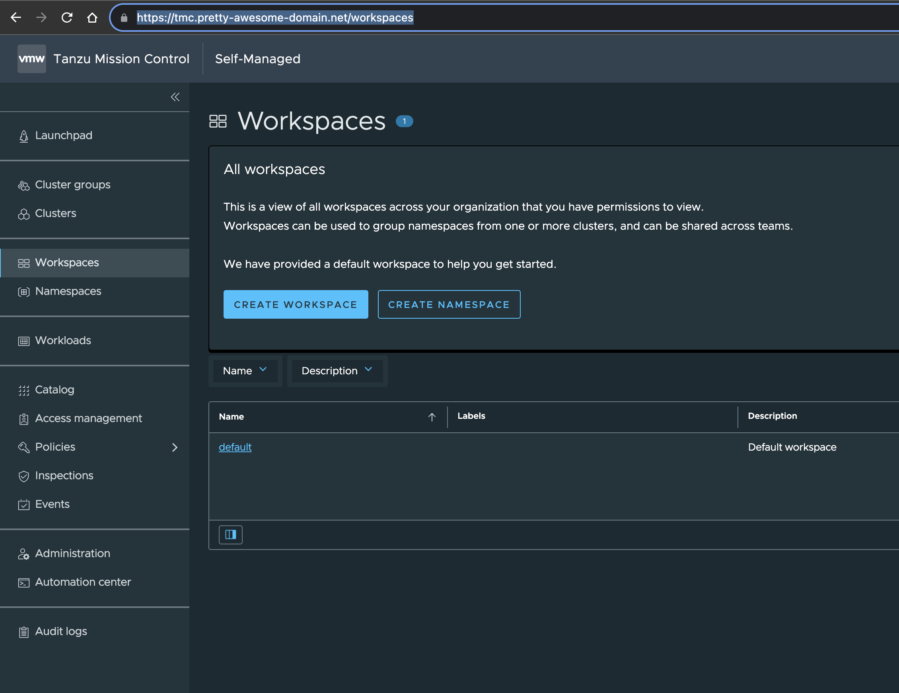

# TMC Self-Managed version 1.0.1

Not that long ago I published an article where I went through how to deploy TMC-SM in my lab, the post can be found [here](https://blog.andreasm.io/2023/07/12/installing-tmc-local-on-vsphere-8-with-tanzu-using-keycloak-as-oidc-provider/). That post were based on the first release of TMC local, version 1.0. Now version 1.0.1 is out and I figured I wanted to create a post how I upgrade my current TMC local installation to the latest version 1.0.1. And who knows, maybe this will be a short and snappy post from me for a change :smile:


## Whats new in TMC-SM 1.0.1

Taken from the official documentaion page [here](https://docs.vmware.com/en/VMware-Tanzu-Mission-Control/1.0/rn/tanzumc-selfmanaged-10-release-notes/index.html) where you can find more details, like information about issues that have been resolved.

Tanzu Mission Control Self-Managed now supports deployment to and lifecycle management of the following Tanzu Kubernetes Grid clusters:

| Cluster type                                                 | Environment                                                |
| :----------------------------------------------------------- | :--------------------------------------------------------- |
| TKG 2.2.x (Kubernetes 1.25.x)                                | vSphere 8.0 and vSphere 7.0                                |
| TKG 2.1.x (Kubernetes 1.24.x)                                | vSphere 8.0 and vSphere 7.0                                |
| TKG 1.6.x (Kubernetes 1.23.x)                                | vSphere 7.0                                                |
| Tanzu Kubernetes Grid Service clusters running in vSphere with Tanzu (Kubernetes 1.24.x and 1.23.x) | vSphere 8.0 Update 0 or Update 2 vSphere 7.0 latest update |


New Features and Improvements

- **Added lifecycle management support for vSphere 8**

  You can now manage Tanzu Kubernetes Grid Service clusters running in vSphere with Tanzu 8u1b. Tanzu Mission Control Self-Managed allows you to register your vSphere with Tanzu Supervisor to perform lifecycle management operations on your Tanzu Kubernetes Grid service clusters.

- **Added Terraform provider support for Tanzu Mission Control Self-Managed**

  Tanzu Mission Control Self-Managed can now be managed and automated using Hashicorp Terraform platform.

  The Tanzu Mission Control provider v1.2.1 in Terraform implements support for managing your fleet of Kubernetes clusters by connecting with Tanzu Mission Control Self-Managed.

  You can use the Tanzu Mission Control provider for Terraform to:

  - Connect to Tanzu Mission Control Self-Managed.

  - Attach conformant Kubernetes clusters.

  - Manage the lifecycle of workload clusters.

  - Manage cluster security using policies - access, image registry, security, network, custom, namespace quota.

## Upgrade TMC-SM to 1.0.1

I am using the steps describing how to upgrade TMC-SM in this chapter from the official TMC documentation page [here](https://docs.vmware.com/en/VMware-Tanzu-Mission-Control/1.0/tanzumc-sm-install/upgrading-tmc-sm.html). 
Before executing the actual upgrade process there are some necessary steps that needs to be done first. I will go through them here in their own little chapters/sections below. I will reuse the same bootstrap machine and container registry I used in this [post](https://blog.andreasm.io/2023/07/12/installing-tmc-local-on-vsphere-8-with-tanzu-using-keycloak-as-oidc-provider/) in all the steps described. 

### Download the latest packages

First I need to download the latest packages from the VMware Customer Connect portal [here](https://customerconnect.vmware.com/en/downloads/details?downloadGroup=TMC-SM-100&productId=1441&rPId=107082). The file I will be downloading is this:


This file will be landing on my laptop where I will copy it over to my bootstrap machine as soon as it is downloaded. 

```bash
andreasm:~/Downloads/TMC$ scp bundle-1.0.1.tar andreasm@10.101.10.99:/home/andreasm/tmc-sm
andreasm@10.101.10.99's password:
bundle-1.0.1.tar                                                             15%  735MB   5.3MB/s   13:05 ETA
```

###  Extract and push images to registry

From my bootstrap machine I need to extract the newly downloaded bundle-1.0.1.tar file, and put it in a new folder:

```bash
andreasm@linuxvm01:~/tmc-sm$ mkdir tmc-sm-1.0.1
andreasm@linuxvm01:~/tmc-sm$ tar -xf bundle-1.0.1.tar -C ./tmc-sm-1.0.1/
```

Then I will push them to my registry, the same registry and project used in the first installation of TMC-SM.

```bash
andreasm@linuxvm01:~/tmc-sm/tmc-sm-1.0.1$ ./tmc-sm push-images harbor --project registry.some-domain.net/tmcproject --username username --password password
```

After some waiting, the below should be the output if everything went successfully.

```bash
INFO[0171] Pushing PackageRepository                     uri=registry.some-domain.net/tmc-project/package-repository
Image Staging Complete. Next Steps:
Setup Kubeconfig (if not already done) to point to cluster:
export KUBECONFIG={YOUR_KUBECONFIG}

Create 'tmc-local' namespace: kubectl create namespace tmc-local

Download Tanzu CLI from Customer Connect (If not already installed)

Update TMC Self Managed Package Repository:
Run: tanzu package repository add tanzu-mission-control-packages --url "registry.some-domain.net/tmc-project/package-repository:1.0.1" --namespace tmc-local

Create a values based on the TMC Self Managed Package Schema:
View the Values Schema: tanzu package available get "tmc.tanzu.vmware.com/1.0.1" --namespace tmc-local --values-schema
Create a Values file named values.yaml matching the schema

Install the TMC Self Managed Package:
Run: tanzu package install tanzu-mission-control -p tmc.tanzu.vmware.com --version "1.0.1" --values-file values.yaml --namespace tmc-local
```

I should also have a file called *pushed-package-repository.json* in my tmc-sm-1.0.1 folder:

```bash
andreasm@linuxvm01:~/tmc-sm/tmc-sm-1.0.1$ ls
agent-images  dependencies  packages  pushed-package-repository.json  tmc-sm
```

The content of this file:

```bash
andreasm@linuxvm01:~/tmc-sm/tmc-sm-1.0.1$ cat pushed-package-repository.json
{"repositoryImage":"registry.some-domain.net/tmc-project/package-repository","version":"1.0.1"}
```

This information is needed in the next step.

### Update tanzu package repository

This step will update the already installed tmc-sm package repository to contain version 1.0.1. Make sure to be logged into the correct context, the kubernetes cluster where the TMC installation is running before doing the below.

```bash
#Using the information above from the pushed-package-repository file, execute the following command:
tanzu package repository update tanzu-mission-control-packages --url "registry.some-domain.net/tmc-project/package-repository:1.0.1" --namespace tmc-local

```

 

```bash
Waiting for package repository to be updated

11:10:20AM: Waiting for package repository reconciliation for 'tanzu-mission-control-packages'
11:10:25AM: Waiting for generation 2 to be observed
11:10:29AM: Fetching
	    | apiVersion: vendir.k14s.io/v1alpha1
	    | directories:
	    | - contents:
	    |   - imgpkgBundle:
	    |       image: registry.some-domain.net/tmc-project/package-repository@sha256:89e53c26a9184580c2778a3bf08c45392e1d09773f0e8d1c22052dfb
	    |       tag: 1.0.1
	    |     path: .
	    |   path: "0"
	    | kind: LockConfig
	    |
11:10:29AM: Fetch succeeded
11:10:30AM: Template succeeded
11:10:30AM: Deploy started (3s ago)
11:10:33AM: Deploying
	    | Target cluster 'https://20.10.0.1:443'
	    | Changes
	    | Namespace  Name                                                      Kind     Age  Op      Op st.  Wait to  Rs  Ri
	    | tmc-local  contour.bitnami.com.12.1.0                                Package  51d  delete  -       -        ok  -
	    | ^          contour.bitnami.com.12.2.6                                Package  -    create  ???     -        -   -
	    | ^          kafka-topic-controller.tmc.tanzu.vmware.com.0.0.21        Package  51d  delete  -       -        ok  -
	    | ^          kafka-topic-controller.tmc.tanzu.vmware.com.0.0.22        Package  -    create  ???     -        -   -
	    | ^          kafka.bitnami.com.22.1.3                                  Package  51d  delete  -       -        ok  -
	    | ^          kafka.bitnami.com.23.0.7                                  Package  -    create  ???     -        -   -
	    | ^          minio.bitnami.com.12.6.12                                 Package  -    create  ???     -        -   -
	    | ^          minio.bitnami.com.12.6.4                                  Package  51d  delete  -       -        ok  -
	    | ^          monitoring.tmc.tanzu.vmware.com.0.0.13                    Package  51d  delete  -       -        ok  -
	    | ^          monitoring.tmc.tanzu.vmware.com.0.0.14                    Package  -    create  ???     -        -   -
	    | ^          pinniped.bitnami.com.1.2.1                                Package  51d  delete  -       -        ok  -
	    | ^          pinniped.bitnami.com.1.2.8                                Package  -    create  ???     -        -   -
	    | ^          postgres-endpoint-controller.tmc.tanzu.vmware.com.0.1.43  Package  51d  delete  -       -        ok  -
	    | ^          postgres-endpoint-controller.tmc.tanzu.vmware.com.0.1.47  Package  -    create  ???     -        -   -
	    | ^          s3-access-operator.tmc.tanzu.vmware.com.0.1.22            Package  51d  delete  -       -        ok  -
	    | ^          s3-access-operator.tmc.tanzu.vmware.com.0.1.24            Package  -    create  ???     -        -   -
	    | ^          tmc-local-postgres.tmc.tanzu.vmware.com.0.0.46            Package  51d  delete  -       -        ok  -
	    | ^          tmc-local-postgres.tmc.tanzu.vmware.com.0.0.67            Package  -    create  ???     -        -   -
	    | ^          tmc-local-stack-secrets.tmc.tanzu.vmware.com.0.0.17161    Package  51d  delete  -       -        ok  -
	    | ^          tmc-local-stack-secrets.tmc.tanzu.vmware.com.0.0.21880    Package  -    create  ???     -        -   -
	    | ^          tmc-local-stack.tmc.tanzu.vmware.com.0.0.17161            Package  51d  delete  -       -        ok  -
	    | ^          tmc-local-stack.tmc.tanzu.vmware.com.0.0.21880            Package  -    create  ???     -        -   -
	    | ^          tmc-local-support.tmc.tanzu.vmware.com.0.0.17161          Package  51d  delete  -       -        ok  -
	    | ^          tmc-local-support.tmc.tanzu.vmware.com.0.0.21880          Package  -    create  ???     -        -   -
	    | ^          tmc.tanzu.vmware.com.1.0.0                                Package  51d  delete  -       -        ok  -
	    | ^          tmc.tanzu.vmware.com.1.0.1                                Package  -    create  ???     -        -   -
	    | Op:      13 create, 13 delete, 0 update, 0 noop, 0 exists
	    | Wait to: 0 reconcile, 0 delete, 26 noop
	    | 11:10:32AM: ---- applying 26 changes [0/26 done] ----
	    | 11:10:32AM: delete package/tmc.tanzu.vmware.com.1.0.0 (data.packaging.carvel.dev/v1alpha1) namespace: tmc-local
	    | 11:10:32AM: delete package/monitoring.tmc.tanzu.vmware.com.0.0.13 (data.packaging.carvel.dev/v1alpha1) namespace: tmc-local
	    | 11:10:32AM: create package/tmc.tanzu.vmware.com.1.0.1 (data.packaging.carvel.dev/v1alpha1) namespace: tmc-local
	    | 11:10:32AM: delete package/s3-access-operator.tmc.tanzu.vmware.com.0.1.22 (data.packaging.carvel.dev/v1alpha1) namespace: tmc-local
	    | 11:10:32AM: delete package/tmc-local-postgres.tmc.tanzu.vmware.com.0.0.46 (data.packaging.carvel.dev/v1alpha1) namespace: tmc-local
	    | 11:10:32AM: delete package/pinniped.bitnami.com.1.2.1 (data.packaging.carvel.dev/v1alpha1) namespace: tmc-local
	    | 11:10:32AM: delete package/tmc-local-stack.tmc.tanzu.vmware.com.0.0.17161 (data.packaging.carvel.dev/v1alpha1) namespace: tmc-local
	    | 11:10:32AM: delete package/tmc-local-stack-secrets.tmc.tanzu.vmware.com.0.0.17161 (data.packaging.carvel.dev/v1alpha1) namespace: tmc-local
	    | 11:10:32AM: delete package/minio.bitnami.com.12.6.4 (data.packaging.carvel.dev/v1alpha1) namespace: tmc-local
	    | 11:10:32AM: delete package/tmc-local-support.tmc.tanzu.vmware.com.0.0.17161 (data.packaging.carvel.dev/v1alpha1) namespace: tmc-local
	    | 11:10:32AM: delete package/contour.bitnami.com.12.1.0 (data.packaging.carvel.dev/v1alpha1) namespace: tmc-local
	    | 11:10:32AM: delete package/postgres-endpoint-controller.tmc.tanzu.vmware.com.0.1.43 (data.packaging.carvel.dev/v1alpha1) namespace: tmc-local
	    | 11:10:32AM: delete package/kafka-topic-controller.tmc.tanzu.vmware.com.0.0.21 (data.packaging.carvel.dev/v1alpha1) namespace: tmc-local
	    | 11:10:32AM: create package/kafka-topic-controller.tmc.tanzu.vmware.com.0.0.22 (data.packaging.carvel.dev/v1alpha1) namespace: tmc-local
	    | 11:10:32AM: delete package/kafka.bitnami.com.22.1.3 (data.packaging.carvel.dev/v1alpha1) namespace: tmc-local
	    | 11:10:32AM: create package/minio.bitnami.com.12.6.12 (data.packaging.carvel.dev/v1alpha1) namespace: tmc-local
	    | 11:10:32AM: create package/pinniped.bitnami.com.1.2.8 (data.packaging.carvel.dev/v1alpha1) namespace: tmc-local
	    | 11:10:32AM: create package/tmc-local-postgres.tmc.tanzu.vmware.com.0.0.67 (data.packaging.carvel.dev/v1alpha1) namespace: tmc-local
	    | 11:10:32AM: create package/contour.bitnami.com.12.2.6 (data.packaging.carvel.dev/v1alpha1) namespace: tmc-local
	    | 11:10:32AM: create package/monitoring.tmc.tanzu.vmware.com.0.0.14 (data.packaging.carvel.dev/v1alpha1) namespace: tmc-local
	    | 11:10:32AM: create package/postgres-endpoint-controller.tmc.tanzu.vmware.com.0.1.47 (data.packaging.carvel.dev/v1alpha1) namespace: tmc-local
	    | 11:10:32AM: create package/tmc-local-stack-secrets.tmc.tanzu.vmware.com.0.0.21880 (data.packaging.carvel.dev/v1alpha1) namespace: tmc-local
	    | 11:10:32AM: create package/tmc-local-stack.tmc.tanzu.vmware.com.0.0.21880 (data.packaging.carvel.dev/v1alpha1) namespace: tmc-local
	    | 11:10:32AM: create package/s3-access-operator.tmc.tanzu.vmware.com.0.1.24 (data.packaging.carvel.dev/v1alpha1) namespace: tmc-local
	    | 11:10:32AM: create package/tmc-local-support.tmc.tanzu.vmware.com.0.0.21880 (data.packaging.carvel.dev/v1alpha1) namespace: tmc-local
	    | 11:10:33AM: create package/kafka.bitnami.com.23.0.7 (data.packaging.carvel.dev/v1alpha1) namespace: tmc-local
	    | 11:10:33AM: ---- waiting on 26 changes [0/26 done] ----
	    | 11:10:33AM: ok: noop package/kafka.bitnami.com.23.0.7 (data.packaging.carvel.dev/v1alpha1) namespace: tmc-local
	    | 11:10:33AM: ok: noop package/kafka-topic-controller.tmc.tanzu.vmware.com.0.0.21 (data.packaging.carvel.dev/v1alpha1) namespace: tmc-local
	    | 11:10:33AM: ok: noop package/monitoring.tmc.tanzu.vmware.com.0.0.13 (data.packaging.carvel.dev/v1alpha1) namespace: tmc-local
	    | 11:10:33AM: ok: noop package/tmc.tanzu.vmware.com.1.0.1 (data.packaging.carvel.dev/v1alpha1) namespace: tmc-local
	    | 11:10:33AM: ok: noop package/s3-access-operator.tmc.tanzu.vmware.com.0.1.22 (data.packaging.carvel.dev/v1alpha1) namespace: tmc-local
	    | 11:10:33AM: ok: noop package/tmc-local-postgres.tmc.tanzu.vmware.com.0.0.46 (data.packaging.carvel.dev/v1alpha1) namespace: tmc-local
	    | 11:10:33AM: ok: noop package/pinniped.bitnami.com.1.2.1 (data.packaging.carvel.dev/v1alpha1) namespace: tmc-local
	    | 11:10:33AM: ok: noop package/tmc-local-stack.tmc.tanzu.vmware.com.0.0.17161 (data.packaging.carvel.dev/v1alpha1) namespace: tmc-local
	    | 11:10:33AM: ok: noop package/tmc-local-stack-secrets.tmc.tanzu.vmware.com.0.0.17161 (data.packaging.carvel.dev/v1alpha1) namespace: tmc-local
	    | 11:10:33AM: ok: noop package/minio.bitnami.com.12.6.4 (data.packaging.carvel.dev/v1alpha1) namespace: tmc-local
	    | 11:10:33AM: ok: noop package/tmc-local-support.tmc.tanzu.vmware.com.0.0.17161 (data.packaging.carvel.dev/v1alpha1) namespace: tmc-local
	    | 11:10:33AM: ok: noop package/contour.bitnami.com.12.1.0 (data.packaging.carvel.dev/v1alpha1) namespace: tmc-local
	    | 11:10:33AM: ok: noop package/postgres-endpoint-controller.tmc.tanzu.vmware.com.0.1.43 (data.packaging.carvel.dev/v1alpha1) namespace: tmc-local
	    | 11:10:33AM: ok: noop package/contour.bitnami.com.12.2.6 (data.packaging.carvel.dev/v1alpha1) namespace: tmc-local
	    | 11:10:33AM: ok: noop package/kafka-topic-controller.tmc.tanzu.vmware.com.0.0.22 (data.packaging.carvel.dev/v1alpha1) namespace: tmc-local
	    | 11:10:33AM: ok: noop package/kafka.bitnami.com.22.1.3 (data.packaging.carvel.dev/v1alpha1) namespace: tmc-local
	    | 11:10:33AM: ok: noop package/minio.bitnami.com.12.6.12 (data.packaging.carvel.dev/v1alpha1) namespace: tmc-local
	    | 11:10:33AM: ok: noop package/pinniped.bitnami.com.1.2.8 (data.packaging.carvel.dev/v1alpha1) namespace: tmc-local
	    | 11:10:33AM: ok: noop package/tmc-local-postgres.tmc.tanzu.vmware.com.0.0.67 (data.packaging.carvel.dev/v1alpha1) namespace: tmc-local
	    | 11:10:33AM: ok: noop package/tmc-local-stack-secrets.tmc.tanzu.vmware.com.0.0.21880 (data.packaging.carvel.dev/v1alpha1) namespace: tmc-local
	    | 11:10:33AM: ok: noop package/monitoring.tmc.tanzu.vmware.com.0.0.14 (data.packaging.carvel.dev/v1alpha1) namespace: tmc-local
	    | 11:10:33AM: ok: noop package/postgres-endpoint-controller.tmc.tanzu.vmware.com.0.1.47 (data.packaging.carvel.dev/v1alpha1) namespace: tmc-local
	    | 11:10:33AM: ok: noop package/s3-access-operator.tmc.tanzu.vmware.com.0.1.24 (data.packaging.carvel.dev/v1alpha1) namespace: tmc-local
	    | 11:10:33AM: ok: noop package/tmc-local-stack.tmc.tanzu.vmware.com.0.0.21880 (data.packaging.carvel.dev/v1alpha1) namespace: tmc-local
	    | 11:10:33AM: ok: noop package/tmc-local-support.tmc.tanzu.vmware.com.0.0.21880 (data.packaging.carvel.dev/v1alpha1) namespace: tmc-local
	    | 11:10:33AM: ok: noop package/tmc.tanzu.vmware.com.1.0.0 (data.packaging.carvel.dev/v1alpha1) namespace: tmc-local
	    | 11:10:33AM: ---- applying complete [26/26 done] ----
	    | 11:10:33AM: ---- waiting complete [26/26 done] ----
	    | Succeeded
11:10:33AM: Deploy succeeded
```

If everything went well, lets check the package version:

```bash
andreasm@linuxvm01:~/tanzu package repository list --namespace tmc-local

  NAME                            SOURCE                                                                    STATUS
  tanzu-mission-control-packages  (imgpkg) registry.some-domain.net/tmc-project/package-repository:1.0.1  Reconcile succeeded

```


After the steps above, we are now ready to start the actual upgrade of the TMC-SM deployment.

### Upgrade TMC-SM deployment

To upgrade TMC execute the below command, where values.yaml is the value.yaml file I used in the previous installation:

```bash
andreasm@linuxvm01:~/tanzu package installed update tanzu-mission-control -p tmc.tanzu.vmware.com --version "1.0.1" --values-file values.yaml --namespace tmc-local
```

Now some output:

```bash
11:19:14AM: Pausing reconciliation for package installation 'tanzu-mission-control' in namespace 'tmc-local'
11:19:15AM: Updating secret 'tanzu-mission-control-tmc-local-values'
11:19:15AM: Creating overlay secrets
11:19:15AM: Updating package install for 'tanzu-mission-control' in namespace 'tmc-local'
11:19:15AM: Resuming reconciliation for package installation 'tanzu-mission-control' in namespace 'tmc-local'
11:19:15AM: Waiting for PackageInstall reconciliation for 'tanzu-mission-control'
11:19:15AM: Waiting for generation 9 to be observed
11:19:15AM: ReconcileFailed: kapp: Error: waiting on reconcile packageinstall/kafka-topic-controller (packaging.carvel.dev/v1alpha1) namespace: tmc-local:
  Finished unsuccessfully (Reconcile failed:  (message: Expected to find at least one version, but did not (details: all=1 -> after-prereleases-filter=1 -> after-kapp-controller-version-check=1 -> after-constraints-filter=0)))
11:19:15AM: Error tailing app: Reconciling app: ReconcileFailed: kapp: Error: waiting on reconcile packageinstall/kafka-topic-controller (packaging.carvel.dev/v1alpha1) namespace: tmc-local:
  Finished unsuccessfully (Reconcile failed:  (message: Expected to find at least one version, but did not (details: all=1 -> after-prereleases-filter=1 -> after-kapp-controller-version-check=1 -> after-constraints-filter=0)))

11:19:16AM: packageinstall/tanzu-mission-control (packaging.carvel.dev/v1alpha1) namespace: tmc-local: Reconciling
11:19:46AM: packageinstall/tanzu-mission-control (packaging.carvel.dev/v1alpha1) namespace: tmc-local: Reconciling
11:20:17AM: packageinstall/tanzu-mission-control (packaging.carvel.dev/v1alpha1) namespace: tmc-local: Reconciling
11:20:47AM: packageinstall/tanzu-mission-control (packaging.carvel.dev/v1alpha1) namespace: tmc-local: Reconciling
11:21:17AM: packageinstall/tanzu-mission-control (packaging.carvel.dev/v1alpha1) namespace: tmc-local: Reconciling
11:21:48AM: packageinstall/tanzu-mission-control (packaging.carvel.dev/v1alpha1) namespace: tmc-local: Reconciling
11:22:19AM: packageinstall/tanzu-mission-control (packaging.carvel.dev/v1alpha1) namespace: tmc-local: Reconciling
11:22:49AM: packageinstall/tanzu-mission-control (packaging.carvel.dev/v1alpha1) namespace: tmc-local: Reconciling
11:23:19AM: packageinstall/tanzu-mission-control (packaging.carvel.dev/v1alpha1) namespace: tmc-local: Reconciling
11:23:49AM: packageinstall/tanzu-mission-control (packaging.carvel.dev/v1alpha1) namespace: tmc-local: Reconciling
11:24:19AM: packageinstall/tanzu-mission-control (packaging.carvel.dev/v1alpha1) namespace: tmc-local: Reconciling
11:24:49AM: packageinstall/tanzu-mission-control (packaging.carvel.dev/v1alpha1) namespace: tmc-local: Reconciling
11:25:20AM: packageinstall/tanzu-mission-control (packaging.carvel.dev/v1alpha1) namespace: tmc-local: Reconciling
11:25:50AM: packageinstall/tanzu-mission-control (packaging.carvel.dev/v1alpha1) namespace: tmc-local: Reconciling
11:26:20AM: packageinstall/tanzu-mission-control (packaging.carvel.dev/v1alpha1) namespace: tmc-local: Reconciling
11:26:51AM: packageinstall/tanzu-mission-control (packaging.carvel.dev/v1alpha1) namespace: tmc-local: Reconciling
11:27:22AM: packageinstall/tanzu-mission-control (packaging.carvel.dev/v1alpha1) namespace: tmc-local: Reconciling
11:27:49AM: packageinstall/tanzu-mission-control (packaging.carvel.dev/v1alpha1) namespace: tmc-local: ReconcileSucceeded
```

I did experience some error issues like the ones above *Error tailing app: Reconciling app: ReconcileFailed: kapp: Error: waiting on reconcile, (Reconcile failed:  (message: Expected to find at least one version, but did not*

I monitored the progress with this command:

```bash
kubectl get pkgi -n tmc-local
```

Which first gave me this:

```bash
NAME                           PACKAGE NAME                                        PACKAGE VERSION   DESCRIPTION                                                                           AGE
contour                        contour.bitnami.com                                 12.2.6            Reconciling                                                                           51d
kafka                          kafka.bitnami.com                                   22.1.3            Reconcile failed: Expected to find at least one version, but did not (details: a...   51d
kafka-topic-controller         kafka-topic-controller.tmc.tanzu.vmware.com         0.0.21            Reconcile failed: Expected to find at least one version, but did not (details: a...   51d
minio                          minio.bitnami.com                                   12.6.4            Reconcile failed: Expected to find at least one version, but did not (details: a...   51d
pinniped                       pinniped.bitnami.com                                1.2.1             Reconcile failed: Expected to find at least one version, but did not (details: a...   51d
postgres                       tmc-local-postgres.tmc.tanzu.vmware.com             0.0.46            Reconcile failed: Expected to find at least one version, but did not (details: a...   51d
postgres-endpoint-controller   postgres-endpoint-controller.tmc.tanzu.vmware.com   0.1.43            Reconcile failed: Expected to find at least one version, but did not (details: a...   51d
s3-access-operator             s3-access-operator.tmc.tanzu.vmware.com             0.1.22            Reconcile failed: Expected to find at least one version, but did not (details: a...   51d
tanzu-mission-control          tmc.tanzu.vmware.com                                1.0.1             Reconciling                                                                           51d
tmc-local-monitoring           monitoring.tmc.tanzu.vmware.com                     0.0.13            Reconcile failed: Expected to find at least one version, but did not (details: a...   51d
tmc-local-stack                tmc-local-stack.tmc.tanzu.vmware.com                0.0.17161         Reconcile failed: Expected to find at least one version, but did not (details: a...   51d
tmc-local-stack-secrets        tmc-local-stack-secrets.tmc.tanzu.vmware.com        0.0.21880         Reconcile succeeded                                                                   51d
tmc-local-support              tmc-local-support.tmc.tanzu.vmware.com              0.0.17161         Reconcile failed: Expected to find at least one version, but did not (details: a...   51d
```

But after a little while I tried it again and now it looked much better:

```bash
NAME                           PACKAGE NAME                                        PACKAGE VERSION   DESCRIPTION           AGE
contour                        contour.bitnami.com                                 12.2.6            Reconcile succeeded   51d
kafka                          kafka.bitnami.com                                   23.0.7            Reconcile succeeded   51d
kafka-topic-controller         kafka-topic-controller.tmc.tanzu.vmware.com         0.0.22            Reconcile succeeded   51d
minio                          minio.bitnami.com                                   12.6.12           Reconcile succeeded   51d
pinniped                       pinniped.bitnami.com                                1.2.8             Reconcile succeeded   51d
postgres                       tmc-local-postgres.tmc.tanzu.vmware.com             0.0.67            Reconcile succeeded   51d
postgres-endpoint-controller   postgres-endpoint-controller.tmc.tanzu.vmware.com   0.1.47            Reconcile succeeded   51d
s3-access-operator             s3-access-operator.tmc.tanzu.vmware.com             0.1.24            Reconcile succeeded   51d
tanzu-mission-control          tmc.tanzu.vmware.com                                1.0.1             Reconciling           51d
tmc-local-monitoring           monitoring.tmc.tanzu.vmware.com                     0.0.14            Reconciling           51d
tmc-local-stack                tmc-local-stack.tmc.tanzu.vmware.com                0.0.21880         Reconcile succeeded   51d
tmc-local-stack-secrets        tmc-local-stack-secrets.tmc.tanzu.vmware.com        0.0.21880         Reconcile succeeded   51d
tmc-local-support              tmc-local-support.tmc.tanzu.vmware.com              0.0.21880         Reconcile succeeded   51d
```

And if I look at the pods for the deployment:

```bash
NAME                                                 READY   STATUS      RESTARTS        AGE
account-manager-server-dd4cb648-mhwsr                1/1     Running     2 (8m35s ago)   51d
account-manager-server-dd4cb648-s6n52                1/1     Running     2 (8m34s ago)   51d
agent-gateway-server-ffbd987f9-79p4v                 1/1     Running     0               7m48s
agent-gateway-server-ffbd987f9-7ggg4                 1/1     Running     0               7m48s
alertmanager-tmc-local-monitoring-tmc-local-0        2/2     Running     0               51d
api-gateway-server-6ccff88f7c-5wjm7                  1/1     Running     0               7m48s
api-gateway-server-6ccff88f7c-c6srd                  1/1     Running     0               7m48s
audit-service-consumer-6665d4968-mq5k7               1/1     Running     0               7m52s
audit-service-consumer-6665d4968-nbmcp               1/1     Running     0               7m52s
audit-service-server-58f8cb48b-cwjd2                 1/1     Running     0               7m51s
audit-service-server-58f8cb48b-drgjq                 1/1     Running     0               7m51s
auth-manager-server-777cff744d-9whfl                 1/1     Running     1 (51d ago)     51d
auth-manager-server-777cff744d-hbqrl                 1/1     Running     1 (51d ago)     51d
auth-manager-server-777cff744d-xxq4w                 1/1     Running     2 (51d ago)     51d
authentication-server-555cd5b896-k7lb7               1/1     Running     0               51d
authentication-server-555cd5b896-nvhtm               1/1     Running     0               51d
cluster-agent-service-server-596cdb5968-5dnjz        1/1     Running     0               51d
cluster-agent-service-server-596cdb5968-p2629        1/1     Running     0               51d
cluster-config-server-7b5c95f48b-rsvv8               1/1     Running     2 (51d ago)     51d
cluster-config-server-7b5c95f48b-t89bm               1/1     Running     2 (51d ago)     51d
cluster-object-service-server-844fc87799-9jjcp       1/1     Running     0               51d
cluster-object-service-server-844fc87799-mkvvv       1/1     Running     0               51d
cluster-reaper-server-68b94fdcc6-l4nk4               1/1     Running     0               51d
cluster-secret-server-6cdc68c88c-2ntj2               1/1     Running     1 (51d ago)     51d
cluster-secret-server-6cdc68c88c-7vld7               1/1     Running     1 (51d ago)     51d
cluster-service-server-76d9cc4845-mbmxj              1/1     Running     0               7m51s
cluster-service-server-76d9cc4845-tl6dg              1/1     Running     0               7m51s
cluster-sync-egest-5946d85c48-5zzfh                  1/1     Running     0               51d
cluster-sync-egest-5946d85c48-jstjl                  1/1     Running     0               51d
cluster-sync-ingest-b8b4b4f7b-b7t2t                  1/1     Running     0               51d
cluster-sync-ingest-b8b4b4f7b-vjrr7                  1/1     Running     0               51d
contour-contour-certgen-9nhxm                        0/1     Completed   0               13m
contour-contour-f99f8c554-hhl45                      1/1     Running     0               13m
contour-envoy-dkgmp                                  2/2     Running     0               12m
contour-envoy-knpcp                                  2/2     Running     0               13m
contour-envoy-mdw4l                                  2/2     Running     0               11m
contour-envoy-w4wl6                                  2/2     Running     0               10m
dataprotection-server-7bd8f57c9c-2b6vc               1/1     Running     0               7m51s
dataprotection-server-7bd8f57c9c-bxzt2               1/1     Running     0               7m51s
events-service-consumer-75d7bfbc4f-dkdgt             1/1     Running     0               51d
events-service-consumer-75d7bfbc4f-hmc4c             1/1     Running     0               51d
events-service-server-57cb555cc6-6tc27               1/1     Running     0               51d
events-service-server-57cb555cc6-7jp92               1/1     Running     0               51d
fanout-service-server-5d854fdcb9-shmsm               1/1     Running     0               51d
fanout-service-server-5d854fdcb9-z4wb9               1/1     Running     0               51d
feature-flag-service-server-58cb8b8967-bw8nw         1/1     Running     0               7m49s
inspection-server-84fbb9f554-8kjll                   2/2     Running     0               51d
inspection-server-84fbb9f554-b4kwq                   2/2     Running     0               51d
intent-server-79db6f6cc8-5bb64                       1/1     Running     0               51d
intent-server-79db6f6cc8-wq46l                       1/1     Running     0               51d
kafka-0                                              1/1     Running     0               9m37s
kafka-exporter-f665b6bc5-g6bfg                       1/1     Running     4 (8m13s ago)   9m40s
kafka-topic-controller-7745b56c4c-jxfbv              1/1     Running     0               9m57s
landing-service-server-86987d87b9-rgxtj              1/1     Running     0               7m49s
minio-676cfff6d6-pk5m4                               1/1     Running     0               8m50s
minio-provisioning-4wx4j                             0/1     Completed   0               8m52s
onboarding-service-server-7dfd944785-6p4qs           1/1     Running     0               7m49s
onboarding-service-server-7dfd944785-fknhq           1/1     Running     0               7m49s
package-deployment-server-5446696ff4-l4phd           1/1     Running     0               51d
package-deployment-server-5446696ff4-w8sl4           1/1     Running     0               51d
pinniped-supervisor-f44756bc7-bwtz6                  1/1     Running     0               10m
policy-engine-server-6455f7db8f-748mk                1/1     Running     0               51d
policy-engine-server-6455f7db8f-pnpr8                1/1     Running     0               51d
policy-insights-server-6cc68b7d7f-5w9c6              1/1     Running     2 (51d ago)     51d
policy-sync-service-server-8687654cc9-q98bm          1/1     Running     0               7m49s
policy-view-service-server-7659f84d-qxdkc            1/1     Running     0               51d
policy-view-service-server-7659f84d-v95w4            1/1     Running     0               51d
postgres-endpoint-controller-99987dc75-s2xzv         1/1     Running     0               9m15s
postgres-postgresql-0                                2/2     Running     0               9m32s
prometheus-server-tmc-local-monitoring-tmc-local-0   2/2     Running     0               6m
provisioner-service-server-85fb5dc6bc-7n7jh          1/1     Running     0               51d
provisioner-service-server-85fb5dc6bc-lw8pm          1/1     Running     0               51d
resource-manager-server-5d69d9fd88-5q97d             1/1     Running     0               7m52s
resource-manager-server-5d69d9fd88-fw75m             1/1     Running     0               7m52s
s3-access-operator-7ddb9d9695-l5nx4                  1/1     Running     0               9m8s
schema-service-schema-server-7cc9696fc5-mmv5t        1/1     Running     0               7m51s
telemetry-event-service-consumer-699db98fc7-kfpht    1/1     Running     0               51d
telemetry-event-service-consumer-699db98fc7-pg2xg    1/1     Running     0               51d
tenancy-service-server-6db748f79-pqfzx               1/1     Running     0               7m48s
ui-server-75ccd455b8-55tkg                           1/1     Running     0               7m50s
ui-server-75ccd455b8-nzw6f                           1/1     Running     0               7m50s
wcm-server-6b4f9c6-c6944                             1/1     Running     0               7m51s
wcm-server-6b4f9c6-wbdm9                             1/1     Running     0               7m51s
```

It looks good, all pods in a running or completed state. Now the logging into the UI:




Thats it. This concludes this post of how to upgrade TMC Self-Managed


