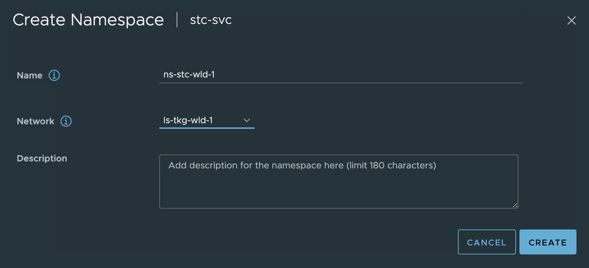

# vSphere with Tanzu and HAProxy

Using HAProxy is an option if in need of a an easy and quick way to deploy vSphere with Tanzu. There is no redundancy built into this approach as the HAProxy appliance only consist of one appliance. A support contract is directly with HAProxy not VMware. I would probably recommend this approach for poc, smaller environments, test environments etc. In production environments I would highly recommend NSX Advanced Loadbalancer for many many reasons like resiliency, scalbility and a whole bunch of enterprise features. See my post covering vSphere with Tanzu and NSX-ALB [here](https://blog.andreasm.io/2022/10/26/vsphere-8-with-tanzu-using-vds-and-avi-loadbalancer/) and [here](https://blog.andreasm.io/2022/10/26/vsphere-8-with-tanzu-using-nsx-t-avi-loadbalancer/)

Before I begin this post I will just quickly go through the two different ways HAProxy can be deployed to support a vSphere with Tanzu deployment. The two options are called **Default** and **Frontend**. The difference being how the HAProxy network is configured. 
Lets start with the **Default** option:
The **Default** option basically means you will deploy the HAProxy appliance using only 2 network interfaces. One network interface is being used for management and the second one will be a combined interface for both VIP(frontend) and data-network(workload network).


I dont like this approach as it does not give me the option to have a separation between the workload network and the frontend network, meaning there is no distinction networking/firewall wise when restricting traffic from any to the VIP of the kubernetes api. For more information on this topology have a look [here](https://docs.vmware.com/en/VMware-vSphere/8.0/vsphere-with-tanzu-concepts-planning/GUID-1F885AAE-92FF-41E6-BF04-0F0FD4173BD9.html#supervisor-topology-with-one-workload-network-and-haproxy-with-two-virtual-nics-3) in the VMware official documentation.

So I will opt for the second option, **Frontend**, when using HAProxy in vSphere with Tanzu. 


This option will deploy the HAProxy appliance with three network interfaces. A separate interface for management, workload and frontend (VIP/Kubernetes API). When users hit the VIP or the frontend network assigned it is a separate network interface on the HAProxy appliance, and will forward the traffic (using routes internally in the HAProxy) to forward the requests to the correct kubernetes api in the workload network. It also supports any additional workload networks which I will show later. 
For more information on the **Frontend** topology head over [here](https://docs.vmware.com/en/VMware-vSphere/8.0/vsphere-with-tanzu-concepts-planning/GUID-1F885AAE-92FF-41E6-BF04-0F0FD4173BD9.html#supervisor-topology-with-multiple-workload-networks-and-ha-proxy-with-three-virtual-nics-6)

Thats it for the introduction, lets do the actual implementation of this. 

## Install HAProxy

First thing first, prepare the three network in vCenter using either VDS portgroups or NSX backed overlay segments. 1 portgroup for the management interface, one for the default workload network and one for the HAProxy frontend network. In my setup I will be using this IP information:

- Management network - NSX backed overlay segment: Network = 10.13.10.0/24, GW = 10.13.10.1, HAProxy Interface IP = 10.13.10.199. Routed
- Workload network - VLAN backed VDS portgroup: Network = 10.13.201.0/24, GW = 10.13.201.1, HAProxy Interface IP = 10.13.201.10. Routed
- Frontend network - VLAN backed VDS portgroup: Network = 10.13.200.0/24, GW = 10.13.200.1, HAProxy Interface IP = 10.13.200.10. Routed

When the networks is ready it is time to deploy the HAProxy appliance/vm itself. To deploy the HAProxy I will use the OVA approach described [here](https://github.com/haproxytech/vmware-haproxy).
Then it is getting hold of the HAProxy OVA to be used for this purpose which can be found [here](https://github.com/haproxytech/vmware-haproxy/releases), or directly to the OVA version 0.2.0 [here](https://cdn.haproxy.com/download/haproxy/vsphere/ova/haproxy-v0.2.0.ova).

Before deploying the OVA prepare the additional information below:

- DNS server = 172.24.3.1
- LoadBalancer IP Range = 10.13.200.32/27 - this is just a range I have defined inside the HAProxy frontend network. The Frontend network is 10.13.200.0/24 (where my HAProxy will use 10.13.200.10) and the range I will make available for HAProxy to use is 10.13.200.32/27 which gives me 30 usable addresses x.x.x.33-x.x.x.62. There is also the option to add more ranges e.g 10.13.200.64/27 and so on.

To save some time I will skip directly to the actual ova deployment from my vCenter server.

### HAProxy OVA deployment


The next step below is where I select the network topology, I will here choose **Frontend**


In the step below I will select my three prepared networks accordingly. 


Enter the root password for the appliance/os itself, check Permit Root Login (useful for troubleshooting and for this demo), leave the TLS sections default blank.


Fill in hostname if wanted, DNS server(s) the appliance management ip in CIDR format 10.13.10.199/24 and the gateway 10.13.10.1. 


Then it is the workload related network settings. Workload IP 10.13.201.10/24 and gateway 10.13.201.1. The **Additional Workload Networks** can be ignored (it does not seem to have any effect), I will go through that later adding additional workload networks. Then it is the Frontend IP = 10.13.200.10/24. It does say optional, but its only optional if doing the **Default** setup with only two nics.  


Frontend gateway = 10.13.200.1. Not optional when doing the **Frontend** setup. Then it is the range you want HAProxy to use for VIP. I have defined a range of 30 usable address by filling in the CIDR 10.13.200.32/27 as below. This can be one of many ranges if you want. Leave the port as default, if not in need of changing it. Then I define a custom API username for the Supervisor to use against the HAProxy, in my case *admin*.


Then it is the password for the API admin user. The password I have chosen is ..... .... .. 


Then do a quick review and make sure everything is there. Click finish and wait. 


### SSH into the HAProxy appliance

When the appliance has been deployed and powered on, ssh into the HAProxy appliance using its IP address in the management network and using root as username and password defined above. 

```bash
ssh root@10.13.10.199
The authenticity of host '10.13.10.199 (10.13.10.199)' can't be established.
ED25519 key fingerprint is SHA256:Asefsdfgsdfsdgsdg5kyKHX0.
This key is not known by any other names
Are you sure you want to continue connecting (yes/no/[fingerprint])? yes
Warning: Permanently added '10.13.10.199' (ED25519) to the list of known hosts.
(root@10.13.10.199) Password:
 12:06:48 up 2 min,  0 users,  load average: 0.15, 0.12, 0.05
tdnf update info not available yet!
root@haproxy [ ~ ]#
```

The reason I want to log in here is because I need the CA.CRT generated so I can tell the Supervisor to use that later on, but also to do some information dump on certain config files that will be good to know about. 

The most important part, the certificate. When enabling the Supervisor later I will need the certificate. Grab this by using this command:

```bash
root@haproxy [ ~ ]# cat /etc/haproxy/ca.crt
-----BEGIN CERTIFICATE-----
MIIDJ6HD6qCAn3KyQ0KNTJiqT7HgwRvFgZoHcG9vWXjvZy2
.....................................
qUOOIbrvQStRTqJl/DjEKi0FyR3lJ1OTOHAbD4YJltSixLkVHRqEH/PY0CbwUNib
wEkCcibnNLMVLvqvXmyvj0x/Hg==
-----END CERTIFICATE-----
```

Then there is a couple of config files that is relevant to know about, it would be interesting to have a look at them now before enabling the supervisor and another look after it has been enabled. So lets have a look now.

I will just run all of them in the same window:

```bash
########## haproxy.cfg ################
root@haproxy [ ~ ]# cat /etc/haproxy/haproxy.cfg
global
  log stdout format raw local0 info
  chroot /var/lib/haproxy
  stats socket /run/haproxy.sock user haproxy group haproxy mode 660 level admin expose-fd listeners
  stats timeout 30s
  user haproxy
  group haproxy
  master-worker
  # Setting maxconn in the global section is what successfully sets the ulimit on the
  # host, otherwise we run out of file descriptors (defaulted at 4096).
  maxconn 60000
  # This property indicates the number of maximum number of reloads a worker
  # will survive before being forcefully killed. This number is required to control
  # the rate at which processes can scale due to the number of reloads outscaling
  # the rate processes are reaped when all of their connections have been cleaned up.
  # This number was derived by taking the average virtual memory consumption for a
  # single HA Proxy process under load, ~28MB, and allocating HA Proxy 3GB out of 4GB
  # of the total virtual memory space.
  mworker-max-reloads 100

  # Default SSL material locations
  ca-base /etc/ssl/certs
  crt-base /etc/ssl/private

  # Default ciphers to use on SSL-enabled listening sockets.
  # For more information, see ciphers(1SSL). This list is from:
  #  https://hynek.me/articles/hardening-your-web-servers-ssl-ciphers/
  # An alternative list with additional directives can be obtained from
  #  https://mozilla.github.io/server-side-tls/ssl-config-generator/?server=haproxy
  ssl-default-bind-ciphers ECDH+AESGCM:DH+AESGCM:ECDH+AES256:DH+AES256:ECDH+AES128:DH+AES:RSA+AESGCM:RSA+AES:!aNULL:!MD5:!DSS
  ssl-default-bind-options no-sslv3

defaults
  mode    tcp
  log     global
  option  tcplog
  option  dontlognull
  option  tcp-smart-accept
  timeout check       5s
  timeout connect     9s
  timeout client      10s
  timeout queue       5m
  timeout server      10s
  # tunnel timeout needs to be set at a lowish value to deal with the frequent
  # reloads invoked by dataplaneapi at scale. With a higher value set, established
  # connections will hang around and prevent haproxy from killing all off older processes
  # because those old processes won't terminate those established connections unless
  # it is told to do so. Having these processes linger for too long can eventually
  # starve the system of resources as the spawn rate of processes exceeds the death rate.
  timeout tunnel      5m
  timeout client-fin  10s

# Stats are disabled by default because enabling them on a non-local IP address
# would result in allocating a port that could result in a conflict with one
# of the binds programmed at runtime.
#
# To enable stats, uncomment the following section and replace SYSTEM_IP_ADDR
# with the IP address of the HAProxy host.
#frontend stats
#  mode  http
#  bind  SYSTEM_IP_ADDR:8404
#  stats enable
#  stats uri     /stats
#  stats refresh 500ms
#  stats hide-version
#  stats show-legends

userlist controller
  user admin password $dfsdfsdf/mdsfsdfb$6/xsdfsdfsdf379dfsdfMOJ/W1
##################### haproxy.cfg - no entries yet for any virtual services ###############################

##################### any-ip-routes ###########################
root@haproxy [ ~ ]# cat /etc/vmware/anyip-routes.cfg
#
# Configuration file that contains a line-delimited list of CIDR values
# that define the network ranges used to bind the load balancer's frontends
# to virtual IP addresses.
#
# * Lines beginning with a comment character, #, are ignored
# * This file is used by the anyip-routes service
#
10.13.200.32/27
################### any-ip-routes #########################

################## route-tables #######################
root@haproxy [ ~ ]# cat /etc/vmware/route-tables.cfg
#
# Configuration file that contains a line-delimited list of values used to
# create route tables on which default gateways are defined. This enables
# the use of IP policy to ensure traffic to interfaces that do not use the
# default gateway is routed correctly.
#
# * Lines beginning with a comment character, #, are ignored
# * This file is used by the route-tables service
#
# Each line that contains a value must adhere to the following,
# comma-separated format:
#
#   <TableID>,<TableName>,<MACAddress>,<NetworkCIDR>,<Gateway4>
#
# The fields in the above format are as follows:
#
# * TableID      The route table ID. This value should be an integer between
#                2-250. Please see /etc/iproute2/rt_tables for a list of the
#                route table IDs currently in use, including reserved IDs.
#
# * TableName    The name of the route table. This value will be appended
#                to a constant prefix, used to identify route tables managed
#                by the route-tables service.
#
# * MACAddress   The MAC address of the interface connected to the network
#                specified by NetworkCIDR
#
# * NetworkCIDR  The CIDR of the network to which the interface by MACAddress
#                is connected
#
# * Gateway4     The IPv4 address of the gateway used by the network specified
#                by NetworkCIDR
#
# For example, the following lines are valid values:
#
#   2,frontend,00:00:00:ab:cd:ef,192.168.1.0/24,192.168.1.1
#   3,workload,00:00:00:12:34:56,192.168.2.0/24,192.168.2.1
#

2,workload,00:50:56:b4:ca:fd,10.13.201.10/24,10.13.201.1
2,workload,00:50:56:b4:ca:fd,10.13.201.10/24
3,frontend,00:50:56:b4:ef:d1,10.13.200.10/24,10.13.200.1
3,frontend,00:50:56:b4:ef:d1,10.13.200.10/24
#################################### route-tables ####################

########### iproute2 tables ##################
root@haproxy [ ~ ]# cat /etc/iproute2/rt_tables
#
# reserved values
#
255	local
254	main
253	default
0	unspec
#
# local
#
#1	inr.ruhep
2	rtctl_workload
2	rtctl_workload
3	rtctl_frontend
3	rtctl_frontend
################ iproute2 tables ##################
```

One can also view the current configuration of the HAProxy appliance under vApp Settings in vCenter like this:


This concludes the deployment of the HAProxy appliance, next step is to enable the Supervisor using this HAProxy appliance for the L4 VIPs. 


## Enable Supervisor in vSphere using HAProxy

Head over to workload management in vCenter and click *get started*


Sit back and wait.... and wait..... 

And after some waiting it should be green and ready and the Supervisor Control Plane IP should be an IP address from the LoadBalancer range:


Now I just want to check the HAProxy config (/etc/haproxy/haproxy.cfg) to see if there has been any update there:

```bash
haproxy.cfg ->
frontend domain-c8:5071d9d4-373d-49aa-a202-4c4ed81adc3b-kube-system-kube-apiserver-lb-svc
  mode tcp
  bind 10.13.200.34:443 name domain-c8:5071d9d4-373d-49aa-a202-4c4ed81adc3b-kube-system-kube-apiserver-lb-svc-10.13.200.34:nginx
  bind 10.13.200.34:6443 name domain-c8:5071d9d4-373d-49aa-a202-4c4ed81adc3b-kube-system-kube-apiserver-lb-svc-10.13.200.34:kube-apiserver
  log-tag domain-c8:5071d9d4-373d-49aa-a202-4c4ed81adc3b-kube-system-kube-apiserver-lb-svc
  option tcplog
  use_backend domain-c8:5071d9d4-373d-49aa-a202-4c4ed81adc3b-kube-system-kube-apiserver-lb-svc-kube-apiserver if { dst_port 6443 }
  use_backend domain-c8:5071d9d4-373d-49aa-a202-4c4ed81adc3b-kube-system-kube-apiserver-lb-svc-nginx if { dst_port 443 }

frontend domain-c8:5071d9d4-373d-49aa-a202-4c4ed81adc3b-vmware-system-csi-vsphere-csi-controller
  mode tcp
  bind 10.13.200.33:2112 name domain-c8:5071d9d4-373d-49aa-a202-4c4ed81adc3b-vmware-system-csi-vsphere-csi-controller-10.13.200.33:ctlr
  bind 10.13.200.33:2113 name domain-c8:5071d9d4-373d-49aa-a202-4c4ed81adc3b-vmware-system-csi-vsphere-csi-controller-10.13.200.33:syncer
  log-tag domain-c8:5071d9d4-373d-49aa-a202-4c4ed81adc3b-vmware-system-csi-vsphere-csi-controller
  option tcplog
  use_backend domain-c8:5071d9d4-373d-49aa-a202-4c4ed81adc3b-vmware-system-csi-vsphere-csi-controller-syncer if { dst_port 2113 }
  use_backend domain-c8:5071d9d4-373d-49aa-a202-4c4ed81adc3b-vmware-system-csi-vsphere-csi-controller-ctlr if { dst_port 2112 }

backend domain-c8:5071d9d4-373d-49aa-a202-4c4ed81adc3b-kube-system-kube-apiserver-lb-svc-kube-apiserver
  mode tcp
  balance roundrobin
  option tcp-check
  log-tag domain-c8:5071d9d4-373d-49aa-a202-4c4ed81adc3b-kube-system-kube-apiserver-lb-svc-kube-apiserver
  server domain-c8:5071d9d4-373d-49aa-a202-4c4ed81adc3b-kube-system-kube-apiserver-lb-svc-10.13.201.20:6443 10.13.201.20:6443 check weight 100 verify none
  server domain-c8:5071d9d4-373d-49aa-a202-4c4ed81adc3b-kube-system-kube-apiserver-lb-svc-10.13.201.21:6443 10.13.201.21:6443 check weight 100 verify none
  server domain-c8:5071d9d4-373d-49aa-a202-4c4ed81adc3b-kube-system-kube-apiserver-lb-svc-10.13.201.22:6443 10.13.201.22:6443 check weight 100 verify none

backend domain-c8:5071d9d4-373d-49aa-a202-4c4ed81adc3b-kube-system-kube-apiserver-lb-svc-nginx
  mode tcp
  balance roundrobin
  option tcp-check
  log-tag domain-c8:5071d9d4-373d-49aa-a202-4c4ed81adc3b-kube-system-kube-apiserver-lb-svc-nginx
  server domain-c8:5071d9d4-373d-49aa-a202-4c4ed81adc3b-kube-system-kube-apiserver-lb-svc-10.13.201.20:443 10.13.201.20:443 check weight 100 verify none
  server domain-c8:5071d9d4-373d-49aa-a202-4c4ed81adc3b-kube-system-kube-apiserver-lb-svc-10.13.201.21:443 10.13.201.21:443 check weight 100 verify none
  server domain-c8:5071d9d4-373d-49aa-a202-4c4ed81adc3b-kube-system-kube-apiserver-lb-svc-10.13.201.22:443 10.13.201.22:443 check weight 100 verify none

backend domain-c8:5071d9d4-373d-49aa-a202-4c4ed81adc3b-vmware-system-csi-vsphere-csi-controller-ctlr
  mode tcp
  balance roundrobin
  option tcp-check
  log-tag domain-c8:5071d9d4-373d-49aa-a202-4c4ed81adc3b-vmware-system-csi-vsphere-csi-controller-ctlr
  server domain-c8:5071d9d4-373d-49aa-a202-4c4ed81adc3b-vmware-system-csi-vsphere-csi-controller-10.13.201.20:2112 10.13.201.20:2112 check weight 100 verify none
  server domain-c8:5071d9d4-373d-49aa-a202-4c4ed81adc3b-vmware-system-csi-vsphere-csi-controller-10.13.201.21:2112 10.13.201.21:2112 check weight 100 verify none
  server domain-c8:5071d9d4-373d-49aa-a202-4c4ed81adc3b-vmware-system-csi-vsphere-csi-controller-10.13.201.22:2112 10.13.201.22:2112 check weight 100 verify none

backend domain-c8:5071d9d4-373d-49aa-a202-4c4ed81adc3b-vmware-system-csi-vsphere-csi-controller-syncer
  mode tcp
  balance roundrobin
  option tcp-check
  log-tag domain-c8:5071d9d4-373d-49aa-a202-4c4ed81adc3b-vmware-system-csi-vsphere-csi-controller-syncer
  server domain-c8:5071d9d4-373d-49aa-a202-4c4ed81adc3b-vmware-system-csi-vsphere-csi-controller-10.13.201.20:2113 10.13.201.20:2113 check weight 100 verify none
  server domain-c8:5071d9d4-373d-49aa-a202-4c4ed81adc3b-vmware-system-csi-vsphere-csi-controller-10.13.201.21:2113 10.13.201.21:2113 check weight 100 verify none
  server domain-c8:5071d9d4-373d-49aa-a202-4c4ed81adc3b-vmware-system-csi-vsphere-csi-controller-10.13.201.22:2113 10.13.201.22:2113 check weight 100 verify none
```

So it seems. All the virtual services for the Supervisor Cluster entries has been added. I should now be able to reach the Kubernetes API endpoint and log-in using the loadbalancer/external ip provided by HAProxy 10.13.200.34

```bash
vsphere-kubectl login --server="10.13.200.34" --insecure-skip-tls-verify --vsphere-username=andreasm@cpod-domain.net

KUBECTL_VSPHERE_PASSWORD environment variable is not set. Please enter the password below
Password:
Logged in successfully.

You have access to the following contexts:
   10.13.200.34

If the context you wish to use is not in this list, you may need to try
logging in again later, or contact your cluster administrator.

To change context, use `kubectl config use-context <workload name>`
```

Now I can just go ahead and deploy my first workload cluster and get started doing some Kubernetes'ing using the default Workload Network defined. Then it will be like the diagram below:


But instead I want to create a new vSphere Namespace in a new subnet/workload network and deploy a workload cluster there. Lets see how this works out. 

## Add additional workload network

Assuming I have certain requirement that some Workload Clusters needs to be in separate IP subnets, such as exhausted existing default workload network, ip separation, security zones etc. I need to have the ability to define and add additional workload networks. 

I already have a new workload network defined. Its configured using NSX overlay segment has the following CIDR: 10.13.21.0/24. The only requirement seems to be needed for HAProxy to use this new network I just need to make sure the Workload network can reach the additional networks I add. So routing between the defautl workload network and any additional workload networks added needs to be in place. No other configuration is needed on the HAProxy side. The diagram below tries to illustrate a second workload network:


When a new workload cluster is provisioned in the new workload network the VIP/LoadBalancer range will be the same, but instead HAProxy needs to route the traffic from its Workload network to the new workload network. Its not HAProxy that is responsible for the actual routing, that is something that needs to be in place in the infrastructure. HAProxy receives the traffic on the Frontend/LoadBalancer network interface, forwards it to the workload interface which then uses its configured gateway to forward the traffic to the new workload network where there is a router in between that knows about those network and can forward it to the correct destination and back again. 

Lets try to deploy a workload cluster in the new workload network above, creating a new vSphere Namespace with this network. 


Click ADD and populate the necessary fields


Create the namespace using and select the new network:




Now, deploy a cluster in this namespace:


```yaml
apiVersion: cluster.x-k8s.io/v1beta1
kind: Cluster
metadata:
  name: cluster-2
  namespace: ns-stc-wld-1
spec:
  clusterNetwork:
    services:
      cidrBlocks: ["20.30.0.0/16"]
    pods:
      cidrBlocks: ["20.40.0.0/16"]
    serviceDomain: "cluster.local"
  topology:
    class: tanzukubernetescluster
    version: v1.26.5---vmware.2-fips.1-tkg.1
    controlPlane:
      replicas: 1
      metadata:
        annotations:
          run.tanzu.vmware.com/resolve-os-image: os-name=ubuntu
    workers:
      machineDeployments:
        - class: node-pool
          name: node-pool-01
          replicas: 2
          metadata:
            annotations:
              run.tanzu.vmware.com/resolve-os-image: os-name=ubuntu
    variables:
      - name: vmClass
        value: best-effort-small
      - name: storageClass
        value: vsan-default-storage-policy
```

```bash
kubectl apply -f cluster-2.yaml
cluster.cluster.x-k8s.io/cluster-2 created
```

And here the cluster has been deployed:


This looks very promising, as the first indicator of something not working is it only deploys the first control plane and stops. Let me log into the cluster and check the Kubernetes API access also.

```bash
andreasm@ubuntu02:~$ k get nodes -o wide
NAME                                           STATUS   ROLES           AGE   VERSION                   INTERNAL-IP   EXTERNAL-IP   OS-IMAGE             KERNEL-VERSION      CONTAINER-RUNTIME
cluster-2-8tq8q-mvj5d                          Ready    control-plane   15m   v1.26.5+vmware.2-fips.1   10.13.21.20   <none>        Ubuntu 20.04.6 LTS   5.4.0-155-generic   containerd://1.6.18-1-gdbc99e5b1
cluster-2-node-pool-01-jqdms-b8fd8b5bb-7mjkh   Ready    <none>          11m   v1.26.5+vmware.2-fips.1   10.13.21.22   <none>        Ubuntu 20.04.6 LTS   5.4.0-155-generic   containerd://1.6.18-1-gdbc99e5b1
cluster-2-node-pool-01-jqdms-b8fd8b5bb-cxjqn   Ready    <none>          11m   v1.26.5+vmware.2-fips.1   10.13.21.21   <none>        Ubuntu 20.04.6 LTS   5.4.0-155-generic   containerd://1.6.18-1-gdbc99e5b1
```

The nodes are using IP address in the new workload network (10.13.21.0/24) and below we can see the loadbalanced kubernetes api for this workload cluster has been assigned the ip 10.13.200.35 from the HAProxy loadbalancer range. 

And a quick look at the haproxy.cfg file again:

```bash
frontend domain-c8:5071d9d4-373d-49aa-a202-4c4ed81adc3b-ns-stc-wld-1-cluster-2-control-plane-service
  mode tcp
  bind 10.13.200.35:6443 name domain-c8:5071d9d4-373d-49aa-a202-4c4ed81adc3b-ns-stc-wld-1-cluster-2-control-plane-service-10.13.200.35:apiserver
  log-tag domain-c8:5071d9d4-373d-49aa-a202-4c4ed81adc3b-ns-stc-wld-1-cluster-2-control-plane-service
  option tcplog
  use_backend domain-c8:5071d9d4-373d-49aa-a202-4c4ed81adc3b-ns-stc-wld-1-cluster-2-control-plane-service-apiserver if { dst_port 6443 }
```

The entry for the new Cluster-2 has been added. 

## Restore from a deleted/crashed/killed HAProxy appliance

This exercise will involve deleting my existing HAProxy appliance. In the meantime I will loose access to my Supervisor cluster and any other workload cluster that has been deployed. I will have to re-deploy the HAProxy again, following the exact same deployment procedure as described above and update my Supervisor so it can reconfigure it back as it was before I deleted the old HAProxy deployment. So lets start by deleting the existing HAProxy appliance. 


Recent task


Now that is gone.

Lets check my access to the Supervisor API:

```bash
andreasm@ubuntu02:~$ k get pods -A
Unable to connect to the server: dial tcp 10.13.200.34:6443: connect: no route to host
```

Not good. So lets redeploy the HAProxy

Its deployed


Power it on, can I reach the Supervisor API?

```bash
andreasm@ubuntu02:~$ k get pods -A
The connection to the server 10.13.200.34:6443 was refused - did you specify the right host or port?
```

No luck yet.

Log in with SSH and check the HAProxy config:

```bash
aandreasm@linuxvm02:~/.ssh$ ssh root@10.13.10.199
The authenticity of host '10.13.10.199 (10.13.10.199)' can't be established.
ED25519 key fingerprint is SHA256:BJGSoo5icUWW7+s2FIKBQV+bg33ZOhk10s9+LFoQgXs.
This key is not known by any other names
Are you sure you want to continue connecting (yes/no/[fingerprint])? yes
Warning: Permanently added '10.13.10.199' (ED25519) to the list of known hosts.
(root@10.13.10.199) Password:
 08:09:36 up 0 min,  0 users,  load average: 0.09, 0.03, 0.01
tdnf update info not available yet!
root@haproxy [ ~ ]#
root@haproxy [ ~ ]# cat /etc/haproxy/haproxy.cfg
global
  log stdout format raw local0 info
  chroot /var/lib/haproxy
  stats socket /run/haproxy.sock user haproxy group haproxy mode 660 level admin expose-fd listeners
  stats timeout 30s
  user haproxy
  group haproxy
  master-worker
  # Setting maxconn in the global section is what successfully sets the ulimit on the
  # host, otherwise we run out of file descriptors (defaulted at 4096).
  maxconn 60000
  # This property indicates the number of maximum number of reloads a worker
  # will survive before being forcefully killed. This number is required to control
  # the rate at which processes can scale due to the number of reloads outscaling
  # the rate processes are reaped when all of their connections have been cleaned up.
  # This number was derived by taking the average virtual memory consumption for a
  # single HA Proxy process under load, ~28MB, and allocating HA Proxy 3GB out of 4GB
  # of the total virtual memory space.
  mworker-max-reloads 100

  # Default SSL material locations
  ca-base /etc/ssl/certs
  crt-base /etc/ssl/private

  # Default ciphers to use on SSL-enabled listening sockets.
  # For more information, see ciphers(1SSL). This list is from:
  #  https://hynek.me/articles/hardening-your-web-servers-ssl-ciphers/
  # An alternative list with additional directives can be obtained from
  #  https://mozilla.github.io/server-side-tls/ssl-config-generator/?server=haproxy
  ssl-default-bind-ciphers ECDH+AESGCM:DH+AESGCM:ECDH+AES256:DH+AES256:ECDH+AES128:DH+AES:RSA+AESGCM:RSA+AES:!aNULL:!MD5:!DSS
  ssl-default-bind-options no-sslv3

defaults
  mode    tcp
  log     global
  option  tcplog
  option  dontlognull
  option  tcp-smart-accept
  timeout check       5s
  timeout connect     9s
  timeout client      10s
  timeout queue       5m
  timeout server      10s
  # tunnel timeout needs to be set at a lowish value to deal with the frequent
  # reloads invoked by dataplaneapi at scale. With a higher value set, established
  # connections will hang around and prevent haproxy from killing all off older processes
  # because those old processes won't terminate those established connections unless
  # it is told to do so. Having these processes linger for too long can eventually
  # starve the system of resources as the spawn rate of processes exceeds the death rate.
  timeout tunnel      5m
  timeout client-fin  10s

# Stats are disabled by default because enabling them on a non-local IP address
# would result in allocating a port that could result in a conflict with one
# of the binds programmed at runtime.
#
# To enable stats, uncomment the following section and replace SYSTEM_IP_ADDR
# with the IP address of the HAProxy host.
#frontend stats
#  mode  http
#  bind  SYSTEM_IP_ADDR:8404
#  stats enable
#  stats uri     /stats
#  stats refresh 500ms
#  stats hide-version
#  stats show-legends

#  ###No entries.....
```

Certainly a new appliance, not the same authenticity fingerprint. But no entries.. Now I will head over to the Workload Management in vCenter and update the certificate under the LoadBalancer section with the new certificate from the newly deployed HAProxy. 

Note.. If I had copied out the cert and key from the old one I could have imported them back again during deployment.


Click save. I still cant reach the my kubernetes api endpoints. The next I need to to is just restart the WCP service from the vCenter VAMI.


Scroll all the way down to find the WCP service, select it, scroll all the way up again.


Click restart.


After the service has been restarted having a look inside tha haproxy.cfg file again now:

```bash
frontend domain-c8:5071d9d4-373d-49aa-a202-4c4ed81adc3b-kube-system-kube-apiserver-lb-svc
  mode tcp
  bind 10.13.200.34:443 name domain-c8:5071d9d4-373d-49aa-a202-4c4ed81adc3b-kube-system-kube-apiserver-lb-svc-10.13.200.34:nginx
  bind 10.13.200.34:6443 name domain-c8:5071d9d4-373d-49aa-a202-4c4ed81adc3b-kube-system-kube-apiserver-lb-svc-10.13.200.34:kube-apiserver
  log-tag domain-c8:5071d9d4-373d-49aa-a202-4c4ed81adc3b-kube-system-kube-apiserver-lb-svc
  option tcplog
  use_backend domain-c8:5071d9d4-373d-49aa-a202-4c4ed81adc3b-kube-system-kube-apiserver-lb-svc-nginx if { dst_port 443 }
  use_backend domain-c8:5071d9d4-373d-49aa-a202-4c4ed81adc3b-kube-system-kube-apiserver-lb-svc-kube-apiserver if { dst_port 6443 }

frontend domain-c8:5071d9d4-373d-49aa-a202-4c4ed81adc3b-ns-stc-wld-1-cluster-2-control-plane-service
  mode tcp
  bind 10.13.200.35:6443 name domain-c8:5071d9d4-373d-49aa-a202-4c4ed81adc3b-ns-stc-wld-1-cluster-2-control-plane-service-10.13.200.35:apiserver
  log-tag domain-c8:5071d9d4-373d-49aa-a202-4c4ed81adc3b-ns-stc-wld-1-cluster-2-control-plane-service
  option tcplog
  use_backend domain-c8:5071d9d4-373d-49aa-a202-4c4ed81adc3b-ns-stc-wld-1-cluster-2-control-plane-service-apiserver if { dst_port 6443 }

frontend domain-c8:5071d9d4-373d-49aa-a202-4c4ed81adc3b-vmware-system-csi-vsphere-csi-controller
  mode tcp
  bind 10.13.200.33:2112 name domain-c8:5071d9d4-373d-49aa-a202-4c4ed81adc3b-vmware-system-csi-vsphere-csi-controller-10.13.200.33:ctlr
  bind 10.13.200.33:2113 name domain-c8:5071d9d4-373d-49aa-a202-4c4ed81adc3b-vmware-system-csi-vsphere-csi-controller-10.13.200.33:syncer
  log-tag domain-c8:5071d9d4-373d-49aa-a202-4c4ed81adc3b-vmware-system-csi-vsphere-csi-controller
  option tcplog
  use_backend domain-c8:5071d9d4-373d-49aa-a202-4c4ed81adc3b-vmware-system-csi-vsphere-csi-controller-syncer if { dst_port 2113 }
  use_backend domain-c8:5071d9d4-373d-49aa-a202-4c4ed81adc3b-vmware-system-csi-vsphere-csi-controller-ctlr if { dst_port 2112 }

backend domain-c8:5071d9d4-373d-49aa-a202-4c4ed81adc3b-kube-system-kube-apiserver-lb-svc-kube-apiserver
  mode tcp
  balance roundrobin
  option tcp-check
  log-tag domain-c8:5071d9d4-373d-49aa-a202-4c4ed81adc3b-kube-system-kube-apiserver-lb-svc-kube-apiserver
  server domain-c8:5071d9d4-373d-49aa-a202-4c4ed81adc3b-kube-system-kube-apiserver-lb-svc-10.13.201.20:6443 10.13.201.20:6443 check weight 100 verify none
  server domain-c8:5071d9d4-373d-49aa-a202-4c4ed81adc3b-kube-system-kube-apiserver-lb-svc-10.13.201.21:6443 10.13.201.21:6443 check weight 100 verify none
  server domain-c8:5071d9d4-373d-49aa-a202-4c4ed81adc3b-kube-system-kube-apiserver-lb-svc-10.13.201.22:6443 10.13.201.22:6443 check weight 100 verify none

backend domain-c8:5071d9d4-373d-49aa-a202-4c4ed81adc3b-kube-system-kube-apiserver-lb-svc-nginx
  mode tcp
  balance roundrobin
  option tcp-check
  log-tag domain-c8:5071d9d4-373d-49aa-a202-4c4ed81adc3b-kube-system-kube-apiserver-lb-svc-nginx
  server domain-c8:5071d9d4-373d-49aa-a202-4c4ed81adc3b-kube-system-kube-apiserver-lb-svc-10.13.201.20:443 10.13.201.20:443 check weight 100 verify none
  server domain-c8:5071d9d4-373d-49aa-a202-4c4ed81adc3b-kube-system-kube-apiserver-lb-svc-10.13.201.21:443 10.13.201.21:443 check weight 100 verify none
  server domain-c8:5071d9d4-373d-49aa-a202-4c4ed81adc3b-kube-system-kube-apiserver-lb-svc-10.13.201.22:443 10.13.201.22:443 check weight 100 verify none

backend domain-c8:5071d9d4-373d-49aa-a202-4c4ed81adc3b-ns-stc-wld-1-cluster-2-control-plane-service-apiserver
  mode tcp
  balance roundrobin
  option tcp-check
  log-tag domain-c8:5071d9d4-373d-49aa-a202-4c4ed81adc3b-ns-stc-wld-1-cluster-2-control-plane-service-apiserver
  server domain-c8:5071d9d4-373d-49aa-a202-4c4ed81adc3b-ns-stc-wld-1-cluster-2-control-plane-service-10.13.21.20:6443 10.13.21.20:6443 check weight 100 verify none

backend domain-c8:5071d9d4-373d-49aa-a202-4c4ed81adc3b-vmware-system-csi-vsphere-csi-controller-ctlr
  mode tcp
  balance roundrobin
  option tcp-check
  log-tag domain-c8:5071d9d4-373d-49aa-a202-4c4ed81adc3b-vmware-system-csi-vsphere-csi-controller-ctlr
  server domain-c8:5071d9d4-373d-49aa-a202-4c4ed81adc3b-vmware-system-csi-vsphere-csi-controller-10.13.201.20:2112 10.13.201.20:2112 check weight 100 verify none
  server domain-c8:5071d9d4-373d-49aa-a202-4c4ed81adc3b-vmware-system-csi-vsphere-csi-controller-10.13.201.21:2112 10.13.201.21:2112 check weight 100 verify none
  server domain-c8:5071d9d4-373d-49aa-a202-4c4ed81adc3b-vmware-system-csi-vsphere-csi-controller-10.13.201.22:2112 10.13.201.22:2112 check weight 100 verify none

backend domain-c8:5071d9d4-373d-49aa-a202-4c4ed81adc3b-vmware-system-csi-vsphere-csi-controller-syncer
  mode tcp
  balance roundrobin
  option tcp-check
  log-tag domain-c8:5071d9d4-373d-49aa-a202-4c4ed81adc3b-vmware-system-csi-vsphere-csi-controller-syncer
  server domain-c8:5071d9d4-373d-49aa-a202-4c4ed81adc3b-vmware-system-csi-vsphere-csi-controller-10.13.201.20:2113 10.13.201.20:2113 check weight 100 verify none
  server domain-c8:5071d9d4-373d-49aa-a202-4c4ed81adc3b-vmware-system-csi-vsphere-csi-controller-10.13.201.21:2113 10.13.201.21:2113 check weight 100 verify none
  server domain-c8:5071d9d4-373d-49aa-a202-4c4ed81adc3b-vmware-system-csi-vsphere-csi-controller-10.13.201.22:2113 10.13.201.22:2113 check weight 100 verify none
root@haproxy [ ~ ]#
```

All my entries are back, and I can reach my kubernetes cluster again:

```bash
andreasm@ubuntu02:~$ k get nodes
NAME                                           STATUS   ROLES                  AGE   VERSION
42344c0c03ff6c1cf443328504169cbe               Ready    control-plane,master   19h   v1.25.6+vmware.wcp.2
4234cc01880600b11de8b894be0c2a30               Ready    control-plane,master   19h   v1.25.6+vmware.wcp.2
4234d1cd346addba50a751b3cbdfd5ed               Ready    control-plane,master   19h   v1.25.6+vmware.wcp.2
esx01.cpod.domain.net                          Ready    agent                  18h   v1.25.6-sph-cf2e16c
esx02.cpod.domain.net                          Ready    agent                  18h   v1.25.6-sph-cf2e16c
esx03.cpod.domain.net                          Ready    agent                  18h   v1.25.6-sph-cf2e16c
esx04.cpod.domain.net                          Ready    agent                  18h   v1.25.6-sph-cf2e16c

andreasm@ubuntu02:~$ k config use-context cluster-2
Switched to context "cluster-2".
andreasm@ubuntu02:~$ k get nodes -o wide
NAME                                           STATUS   ROLES           AGE     VERSION                   INTERNAL-IP   EXTERNAL-IP   OS-IMAGE             KERNEL-VERSION      CONTAINER-RUNTIME
cluster-2-8tq8q-mvj5d                          Ready    control-plane   17h     v1.26.5+vmware.2-fips.1   10.13.21.20   <none>        Ubuntu 20.04.6 LTS   5.4.0-155-generic   containerd://1.6.18-1-gdbc99e5b1
cluster-2-node-pool-01-jqdms-b8fd8b5bb-klqff   Ready    <none>          5m18s   v1.26.5+vmware.2-fips.1   10.13.21.23   <none>        Ubuntu 20.04.6 LTS   5.4.0-155-generic   containerd://1.6.18-1-gdbc99e5b1
cluster-2-node-pool-01-jqdms-b8fd8b5bb-m76rf   Ready    <none>          5m18s   v1.26.5+vmware.2-fips.1   10.13.21.22   <none>        Ubuntu 20.04.6 LTS   5.4.0-155-generic   containerd://1.6.18-1-gdbc99e5b1
```

All services back up again. 


This concludes this post. Thanks for reading. 

