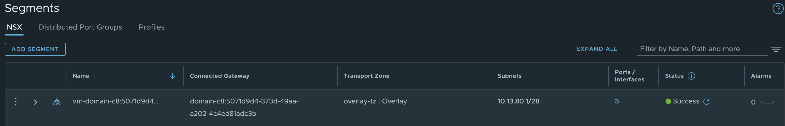

# NSX and NSX Advanced Loadbalancer with TKG

Before vSphere 8 U2 it was not possible to use the NSX Advanced Loadbalancer loadbalancing the Kubernetes control plane nodes when configuring Tanzu or TKG in vSphere using NSX as the networking stack. I am talking about using NSX as an integrated part of the TKG installation (enabling Workload Management and selecting NSX as the network stack). It was of course possible to use NSX as a pure network "underlay" for TKG, and then use NSX ALB as both L4 and L7 (using AKO) provider. But then one misses out of the "magic" using NSX as the integrated network provider for TKG like automatic network creation, vrf/ip separation support, NSX policies, vSphere pods etc. One could expose services using servicetype loadBalancer (L4) from the workload clusters with NSX ALB in combination with NSX as the integrated networking stack, but one had to specify the loadBalancerClass to specify NSX-ALB for this, and not all services could be configured with this crd. The control plane nodes or the Kubernetes api endpoint was always exposed/managed by the built-in NSX-T loadbalancer. Now with the release of vSphere 8 U2 it seems like we finally can use NSX and NSX-ALB in combination where all loadbalancing needs are being managed by NSX-ALB, including the control plane nodes/kubernetes api endpoint. 

So I am very excited to give this a try and see how it works out, the steps needed to be configured for this to work and how it look like during the installation and after. What happens in the NSX-ALB controller, what happens in the NSX environment.  

{}

To enable this feature in this release is only for greenfield deployments.

{}

What we should end up with in this release is using NSX for all networking and security features, NSX Advanced Loadbalancer for all loadbalancing needs.


From the official release [notes](https://docs.vmware.com/en/VMware-vSphere/8.0/rn/vmware-vsphere-with-tanzu-80-release-notes/index.html) I have pasted below two features I will discuss in this post. The first one is the major topic of this post of course, but the second one is also a very nice feature that I actually have used a lot in this post. For the full list of new features head over to the official release notes for vSphere 8 U2 [here](https://docs.vmware.com/en/VMware-vSphere/8.0/rn/vmware-vsphere-80-release-notes/index.html) and for all the Tanzu related features [here](https://docs.vmware.com/en/VMware-vSphere/8.0/rn/vmware-vsphere-with-tanzu-80-release-notes/index.html)

The major topic of this post:

> - **Support of NSX Advanced Load Balancer for a Supervisor configured with NSX networking** - You can now enable a Supervisor with NSX Advanced Load Balancer (Avi Networks) for L4 load balancing, as well as load balancing for the control plane nodes of Supervisor and Tanzu Kubernetes Grid clusters with NSX networking. Checkout the [documentation page](https://docs.vmware.com/en/VMware-vSphere/8.0/vsphere-with-tanzu-installation-configuration/GUID-7EE247EB-4736-4BC8-A6B0-0123B6ECC812.html) for guidance on configuring the NSX Advanced Load Balancer with NSX.

And the nice feature:

> - **Import and export the Supervisor configuration** - In previous versions, activating the Supervisor was a manual step-wise process without the ability to save any configurations. In the current release, you can now export and share the Supervisor configuration with peers in a human-readable format or within a source control system, import configurations to a new Supervisor, and replicate a standard configuration across multiple Supervisors. Checkout the [documentation](https://docs.vmware.com/en/VMware-vSphere/8.0/vsphere-with-tanzu-installation-configuration/GUID-1AC6E8ED-51E3-4AA5-9331-6E13731A8507.html) for details on how to export and import the Supervisor configuration.


## Pre-requisites and assumptions

Before getting started with the installation/enabling TKG in vSphere 8 U2 using NSX-ALB in combination with NSX some requirments need to be met. 

- vSphere 8 U2 - kind of obvious but nice to mention
- NSX version 4.1.1 or higher
- NSX-ALB version 22.1.4 or higher (yes it is stated in the release notes of vSphere with Tanzu that version 22.1.3 is the supported release)
- NSX-ALB Enterprise license


And the usual assumptions (mostly to save some time, as I have covered many of these topics several times before, saving digital ink is saving the environment :smile:
I already have my vSphere 8 U2 environment running, I already have my NSX 4.1.1 environment configured and lastly I already have my NSX-ALB controller 22.1.4 deployed and working. My lab is used for many things so I am not deploying NSX and NSX-ALB from scratch just for this post, they are already running a bunch of other stuff including the NSX-LAB controller. In the next chapters I will go through what I had to prepare on the NSX side (if any) and the NSX-ALB side (there are a couple of steps there).

## vSphere preparations - requirements

I only needed to upgrade my current vSphere 8 U1 environment to vSphere 8 U2, as always starting with the vCenter server using the VAMI interface, then updated the ESXi image in LCM to do a rolling upgrade of the ESXi hosts to 8 U2. 

## NSX-T preparations

For information how to install NSX, see my post [here](https://blog.andreasm.io/2022/10/26/vsphere-8-with-tanzu-using-nsx-t-avi-loadbalancer/)

## NSX-ALB preparations - requirements

Instead of going through all the steps in configuring the NSX-ALB I will only post the settings that is specific/or needed for the NSX+NSX-ALB feature to work. As I already have a working NSX-ALB environment running and in use for other needs, its not that many changes I had to do. So I will show them here in their own section starting with the cloud. For reference how to install NSX-ALB I have done a post on that [here](https://blog.andreasm.io/2022/10/26/vsphere-8-with-tanzu-using-nsx-t-avi-loadbalancer/#configure-nsx-cloud-in-avi---network-preparations). 

### NSX cloud

In my NSX-ALB I already have two clouds configured, both of them are NSX clouds. If you start from scratch all the necessary config needs to be done of course. See my posts [here](https://blog.andreasm.io/2022/10/26/vsphere-8-with-tanzu-using-nsx-t-avi-loadbalancer/#configure-nsx-cloud-in-avi---network-preparations). In the NSX cloud I will be using for this I need to enable DHCP. That is done by editing your specific cloud and checking the box DHCP:


{}

If you happen to have multiple clouds configured it will figure out wich cloud it will use. The NSX manager knows which NSX cloud it must use, most likely because it will use the cloud that is the same NSX the API comes from. In my lab I have two NSX clouds configured, and it will select the correct cloud. My two NSX clouds are two unique NSX instances, if having two NSX clouds of same NSX instance I am not sure how it can select the right cloud. 

{} 

### IPAM profile

You need to make sure that you have configured an IPAM profile. Again, I already have that configured. The deployment will use this IPAM profile to configure the new usable VIP networks you define as the ingress cidr in TKG. 


{}

In your IPAM profile it is very important to **not** have the **Allocate ip in VRF** option selected. This must be de-selected.

{} 


Then make sure your NSX cloud has this IPAM profile select:


### Default Service-Engine Group

The Default-Service Engine Group in your NSX Cloud will be used as a "template" group. This means you should configure this default se-group how you want your SEs to be provisioned. From the official documentation:

> The AKO creates one Service Engine Group for each vSphere with Tanzu cluster. The Service Engine Group configuration is derived from the **Default-Group** configuration. Once the **Default-Group** is configured with the required values, any new Service Engine Group created by the AKO will have the same settings. However, changes made to the **Default-Group** configuration will not reflect in an already created Service Engine Group. You must modify the configuration for an existing Service Engine Group separately.

So in my Default SE-Group I have this configuration:


Under Scope I have confgured the vSphere cluster, and shared datastore placement. 


When I am satisified the the settings that suits my need, save and I am done with the Default group configurations. 

### Custom Certificate

Another requirement is to change the default certificate to a custom one. One can follow the official documentation [here](https://docs.vmware.com/en/VMware-vSphere/8.0/vsphere-with-tanzu-installation-configuration/GUID-5417D45D-62B2-4D50-A20C-7B5551EA5594.html#GUID-D2508827-EF05-40E8-807F-5A34B3C18D6F__GUID-23F40B44-A46F-47B6-A457-C9FF1220E50C). For now it is sufficient to just prepare the certificate, dont change the settings in the UI to use the new certificate yet, that is done after the step where you register the NSX-ALB endpoint to the NSX manager.


### Summary of NSX-ALB pre-requisites 

- Need to have configured a NSX Cloud with the DHCP option enabled
- Created a custom certificate (not configured to be used yet)
- Created and configured an IPAM profile, updated the NSX cloud to use this profile, in the IPAM profile *Allocate IP in VRF* i de-selected.


## NSX preparations - requirements - adding the NSX-ALB controller endpoint using API

I already have a working NSX 4.1.1 environment. The only thing I need to to here is to add the NSX-ALB controller (alb endpoint) so my NSX environment is aware of my NSX-ALB controller. The reason for this is that some configurations in NSX-ALB will be automatically done by NCP during TKG deployment using api. So the NSX manager will need to know the username and password of the NSX-ALB controller or controller-cluster.


### Adding the NSX-ALB to the NSX manager

To add NSX-ALB to the NSX manager I will need to do an API call to the NSX manager using curl (or Postman or whatever preferred tool), the below is the call I will be issuing:

```bash
curl -k --location --request PUT 'https://172.24.3.10/policy/api/v1/infra/alb-onboarding-workflow' \ #IP NSX manager cluster IP
--header 'X-Allow-Overwrite: True' \
-u admin:password \  #password and username to the NSX manager in the format username:password
--header 'Content-Type: application/json' \
--data-raw '{
"owned_by": "LCM",
"cluster_ip": "172.24.3.50", # IP NSX-ALB controller or controller cluster IP
"infra_admin_username" : "admin", #username
"infra_admin_password" : "password", #password
"dns_servers": ["172.24.3.1"], #not sure why I need to add this - my ALB is already configured with this
"ntp_servers": ["172.24.3.1"] #not sure why I need to add this - my ALB is already configured with this
}'
```

The offical documentation is using this example:

```bash
curl -k --location --request PUT 'https://<nsx-mgr-ip>/policy/api/v1/infra/alb-onboarding-workflow' \
--header 'X-Allow-Overwrite: True' \
--header 'Authorization: Basic <base64 encoding of username:password of NSX Mgr>' \
--header 'Content-Type: application/json' \
--data-raw '{
"owned_by": "LCM",
"cluster_ip": "<nsx-alb-controller-cluster-ip>",
"infra_admin_username" : "username",
"infra_admin_password" : "password",
"dns_servers": ["<dns-servers-ips>"],
"ntp_servers": ["<ntp-servers-ips>"]
}'
```

I had issues authenticating using header, and I did not want to use time to troubleshoot why. I think one of the reasons is that I need to genereate some auth token etc... 

Anyway, after a successful api call. You should get this output:

```bash
{
  "connection_info" : {
    "username" : "\u0000\u0000\u0000\u0000\u0000\u0000\u0000\u0000",
    "tenant" : "admin",
    "expires_at" : "2023-09-22T18:22:22.627Z",
    "managed_by" : "LCM",
    "status" : "DEACTIVATE_PROVIDER",
    "certificate" : "-----BEGIN CERTIFICATE-----\nMIIDRTCCAi2gAwIBAgIUCcOSYBrBybt6zHfJKojPnX/fZ8xD8azd9mWp4oksVA1vHXzbWdsY\nw/Tdr3zTOEgEjn9mflE/aBhsahEhhaZfKtZtLO/OnvSZZtaMlHvlsHgfl8nOqhLh\nGBJzNNwIS8sjzi8E1/y3TI3kVshoCclL9A==\n-----END CERTIFICATE-----\n",
    "enforcement_point_address" : "172.24.3.50",
    "resource_type" : "AviConnectionInfo"
  },
  "auto_enforce" : true,
  "resource_type" : "EnforcementPoint",
  "id" : "alb-endpoint",
  "display_name" : "alb-endpoint",
  "path" : "/infra/sites/default/enforcement-points/alb-endpoint",
  "relative_path" : "alb-endpoint",
  "parent_path" : "/infra/sites/default",
  "remote_path" : "",
  "unique_id" : "8ef2126e-9311-40ff-bd6d-08c51017326c",
  "realization_id" : "8ef2126e-9311-40ff-bd6d-08c51017326c",
  "owner_id" : "4b04712e-498d-42d0-ad90-7ab06c398c60",
  "marked_for_delete" : false,
  "overridden" : false,
  "_create_time" : 1695385329242,
  "_create_user" : "admin",
  "_last_modified_time" : 1695385329242,
  "_last_modified_user" : "admin",
  "_system_owned" : false,
  "_protection" : "NOT_PROTECTED",
  "_revision" : 0
```

 You can also do the following API call to verify if the NSX-ALB controller has been added:

```bash
andreasm@ubuntu02:~$ curl -s -k -u admin:password https://172.24.3.10/policy/api/v1/infra/sites/default/enforcement-points/alb-endpoint
{
  "connection_info" : {
    "username" : "\u0000\u0000\u0000\u0000\u0000\u0000\u0000\u0000",
    "tenant" : "admin",
    "expires_at" : "2023-09-24T02:00:05.362Z",
    "managed_by" : "LCM",
    "status" : "DEACTIVATE_PROVIDER",
    "certificate" : "-----BEGIN CERTIFICATE-----\nMIIGy2k9O+hp6fX+iG5BGDurG8hP8A\nKI96AUNxV39pXOBIqBr/sL3v/24DVz85ObAvIzoWnTak9ZhZyP4jUfZD/w21xdXz\nKaTJ5ioC+M6RLRKVVJ159lrm3A==\n-----END CERTIFICATE-----\n",
    "enforcement_point_address" : "172.24.3.50",
    "resource_type" : "AviConnectionInfo"
  },
  "auto_enforce" : true,
  "resource_type" : "EnforcementPoint",
  "id" : "alb-endpoint",
  "display_name" : "alb-endpoint",
  "path" : "/infra/sites/default/enforcement-points/alb-endpoint",
  "relative_path" : "alb-endpoint",
  "parent_path" : "/infra/sites/default",
  "remote_path" : "",
  "unique_id" : "8ef2126e-9311-40ff-bd6d-08c51017326c",
  "realization_id" : "8ef2126e-9311-40ff-bd6d-08c51017326c",
  "owner_id" : "4b04712e-498d-42d0-ad90-7ab06c398c60",
  "marked_for_delete" : false,
  "overridden" : false,
  "_create_time" : 1695385329242,
  "_create_user" : "admin",
  "_last_modified_time" : 1695499205391,
  "_last_modified_user" : "system",
  "_system_owned" : false,
  "_protection" : "NOT_PROTECTED",
  "_revision" : 7
```

The "certificate" you get back should be the current certificate on the NSX-ALB controller. More on that later. 

Thats it on the NSX manager side. 

{}

After you a have done the above operation and you log back into the NSX-ALB controller this *welcome* wizard pops up. Just click cancel on it. 

{}


I figured out a way to disable this initial setup-wizard instead fo going through it via the UI. 
SSH into the NSX-ALB controller, enter into **shell** and enter the following commands:

```bash
### Show the current systemconfiguration
[admin:172-24-3-50]: > show systemconfiguration
+----------------------------------+------------------------------------+
| Field                            | Value                              |
+----------------------------------+------------------------------------+
| uuid                             | default                            |
| dns_configuration                |                                    |
|   server_list[1]                 | 172.24.3.1                         |
| ntp_configuration                |                                    |
|   ntp_servers[1]                 |                                    |
|     server                       | 172.24.3.1                         |
| portal_configuration             |                                    |
|   enable_https                   | True                               |
|   redirect_to_https              | True                               |
|   enable_http                    | True                               |
|   sslkeyandcertificate_refs[1]   | tkgm-cert-controller               |
|   use_uuid_from_input            | False                              |
|   sslprofile_ref                 | System-Standard-Portal             |
|   enable_clickjacking_protection | True                               |
|   allow_basic_authentication     | True                               |
|   password_strength_check        | False                              |
|   disable_remote_cli_shell       | False                              |
|   disable_swagger                | False                              |
|   api_force_timeout              | 24 hours                           |
|   minimum_password_length        | 8                                  |
| global_tenant_config             |                                    |
|   tenant_vrf                     | False                              |
|   se_in_provider_context         | True                               |
|   tenant_access_to_provider_se   | True                               |
| email_configuration              |                                    |
|   smtp_type                      | SMTP_LOCAL_HOST                    |
|   from_email                     | admin@avicontroller.net            |
|   mail_server_name               | localhost                          |
|   mail_server_port               | 25                                 |
|   disable_tls                    | False                              |
| docker_mode                      | False                              |
| ssh_ciphers[1]                   | aes128-ctr                         |
| ssh_ciphers[2]                   | aes256-ctr                         |
| ssh_hmacs[1]                     | hmac-sha2-512-etm@openssh.com      |
| ssh_hmacs[2]                     | hmac-sha2-256-etm@openssh.com      |
| ssh_hmacs[3]                     | hmac-sha2-512                      |
| default_license_tier             | ENTERPRISE                         |
| secure_channel_configuration     |                                    |
|   sslkeyandcertificate_refs[1]   | System-Default-Secure-Channel-Cert |
| welcome_workflow_complete        | False                               |
| fips_mode                        | False                              |
| enable_cors                      | False                              |
| common_criteria_mode             | False                              |
| host_key_algorithm_exclude       |                                    |
| kex_algorithm_exclude            |                                    |
+----------------------------------+------------------------------------+
```

Notice the **welcome_workflow_complete** is set to *False*. Set this to true using the following command:

```bash
[admin:172-24-3-50]: > configure systemconfiguration welcome_workflow_complete 1
```

Or 

```bash
[admin:172-24-3-50]: > configure systemconfiguration
[admin:172-24-3-50-configure]: > welcome_workflow_complete (hit henter)
```

If you show the systemconfiguration again now it should be changed to True...  Logout and back in to the NSX-ALB gui and you should not be asked to do the initial setup wizard. 


### Custom certificate in the NSX-ALB controller

After adding the NSX-ALB endpoint, configure NSX-ALB to use the newly created custom certificate created earlier. Head over to Administration -> System Settings:


Click edit and adjust the settings accordingly, and make sure to select the custom certificate. 


Check the option **Allow Basic Authentication** and update the field **SSL/TLS Certificate** with the custom certificate. Click save. 


Now the pre-requisities has been done, and its time to get started with the WCP installation.

## My NSX and NSX-ALB environment before WCP installation

Before I head over and do the actual WCP installation, I will first just take a couple of screenshots from my NSX environment as a *before and after*.

### NSX environment before WCP installation

I have three Tier-0s configured, whereas I will only use the **stc-tier-0** (the one with most objects connected to it) in this post. 


### NSX-ALB environment before WCP installation

One Virtual Service (my DNS service).


IPAM and DNS profile (IPAM only needed for WCP)


Content of my current IPAM profile


My clouds configured


Current networks configured in my stc-nsx-cloud


Current running Service Engines


My Service Engine Groups


My configured Network Profiles


Then my VRF contexts, only configured for the other services I have been running. 


Now that we have all the before screenshots, lets do the vSphere with Tanzu installation and see how it goes. 

## vSphere with Tanzu installation

There is nothing different in the UI when it comes to this specific feature, I select NSX as the networkl and populate the fields as normal. But I will list the steps here any way.

{}

I will use the new Import and Export feature as I already have done this installation several times. The first time I filled everything in manually then at the end of the wizard I clicked **Export configuration** and saved my config. So now I just have to import the config and go through all the fiels using next, and change something if needed, then finish.  

{}

Here is how to choose the export, select it and a download dialog will pop up. To use it later for import extract the content and select the file called **wcp-config.json**


Get Started


Import Config


Import, and now all fields are populated. 

The wcp-config.json file content:

```json
{"specVersion":"1.0","supervisorSpec":{"supervisorName":"stc-svc"},"envSpec":{"vcenterDetails":{"vcenterAddress":"vcsa.cpod-nsxam-stc.az-stc.cloud-garage.net","vcenterCluster":"Cluster"}},"tkgsComponentSpec":{"tkgsStoragePolicySpec":{"masterStoragePolicy":"vSAN Default Storage Policy","imageStoragePolicy":"vSAN Default Storage Policy","ephemeralStoragePolicy":"vSAN Default Storage Policy"},"tkgsMgmtNetworkSpec":{"tkgsMgmtNetworkName":"ls-mgmt","tkgsMgmtIpAssignmentMode":"STATICRANGE","tkgsMgmtNetworkStartingIp":"10.13.10.20","tkgsMgmtNetworkGatewayCidr":"10.13.10.1/24","tkgsMgmtNetworkDnsServers":["172.24.3.1"],"tkgsMgmtNetworkSearchDomains":["cpod-nsxam-stc.az-stc.cloud-garage.net"],"tkgsMgmtNetworkNtpServers":["172.24.3.1"]},"tkgsNcpClusterNetworkInfo":{"tkgsClusterDistributedSwitch":"VDSwitch","tkgsNsxEdgeCluster":"SomeEdgeCluster","tkgsNsxTier0Gateway":"stc-tier-0","tkgsNamespaceSubnetPrefix":28,"tkgsRoutedMode":true,"tkgsNamespaceNetworkCidrs":["10.13.80.0/23"],"tkgsIngressCidrs":["10.13.90.0/24"],"tkgsEgressCidrs":[],"tkgsWorkloadDnsServers":["172.24.3.1"],"tkgsWorkloadServiceCidr":"10.96.0.0/23"},"apiServerDnsNames":[],"controlPlaneSize":"SMALL"}}
```


I am deselecting NAT as I dont need that. 


Now, its just clicking finish and monitor the progress.


One will soon see two new Virtual Services being created, two new service engines (according to my default-service-engine group config) being deployed. 


When everything is ready and available the virtual services will become yellow/green (fully green after a while as it depends on how long the VS is down before it becomes available/up):


And in vCenter the Workload Management progress:


Can I reach it?


Yes!

This is really really nice. 

Now next chapters will go through what has been done in my NSX environment and the NSX-ALB environment. 


## My NSX and NSX-ALB environment **after** WCP installation

Now that everything is green and joy. Let us have a check inside and see what has been configured. 

### NSX environment **after** WCP installation

Topology view:


A new Tier-1 I can see, with two new segments, with some VMs in each. 

Below I can see the new Tier-1


In the new Tier-1 router it has also automatically added the static routes for the VIP to the SEs:


These static routes needs to be either advertised by the Tier-0 using either BGP or OSPF, or manually created static routes in the network infrastructure. I am using BGP. 


The two new segments:

Avi-domain-c8:507... This segment is where my NSX-ALB Service Engines Dataplane network is located.


and the second segment vm-domain-c8:507.. is where the default workload network for my Supervisor Control Plane nodes is placed. 



Now, what is under Loadbalancing:


It has created a distributed loadbalancer where all virtual servers are kubernetes services using the services CIDR:


The NSX Distributed Loadbalancer is used for the ClusterIP services running inside the Supervisor, the ones that are running on the ESXi hosts. The LoadBalancer services is handled by NSX-ALB. 

```bash
andreasm@ubuntu02:~/avi_nsxt_wcp$ k get svc -A
NAMESPACE                                   NAME                                                             TYPE           CLUSTER-IP    EXTERNAL-IP   PORT(S)                         AGE
default                                     kubernetes                                                       ClusterIP      10.96.0.1     <none>        443/TCP                         15h
kube-system                                 docker-registry                                                  ClusterIP      10.96.0.37    <none>        5000/TCP                        15h
kube-system                                 kube-apiserver-authproxy-svc                                     ClusterIP      10.96.0.243   <none>        8443/TCP                        14h
kube-system                                 kube-apiserver-lb-svc                                            LoadBalancer   10.96.0.201   10.13.90.1    443:32163/TCP,6443:31957/TCP    15h
kube-system                                 kube-dns                                                         ClusterIP      10.96.0.10    <none>        53/UDP,53/TCP,9153/TCP          15h
kube-system                                 snapshot-validation-service                                      ClusterIP      10.96.0.128   <none>        443/TCP                         15h
ns-stc-1                                    cluster-1-76996f5b17a254b02e55a                                  LoadBalancer   10.96.0.239   10.13.92.2    80:30165/TCP                    12h
ns-stc-1                                    cluster-1-control-plane-service                                  LoadBalancer   10.96.1.157   10.13.92.1    6443:30363/TCP                  13h
vmware-system-appplatform-operator-system   packaging-api                                                    ClusterIP      10.96.0.87    <none>        443/TCP                         14h
vmware-system-appplatform-operator-system   vmware-system-appplatform-operator-controller-manager-service    ClusterIP      None          <none>        <none>                          15h
vmware-system-appplatform-operator-system   vmware-system-psp-operator-k8s-cloud-operator-service            ClusterIP      10.96.1.101   <none>        29002/TCP                       15h
vmware-system-appplatform-operator-system   vmware-system-psp-operator-service                               ClusterIP      None          <none>        <none>                          15h
vmware-system-appplatform-operator-system   vmware-system-psp-operator-webhook-service                       ClusterIP      10.96.1.84    <none>        443/TCP                         15h
vmware-system-capw                          capi-controller-manager-metrics-service                          ClusterIP      10.96.1.47    <none>        9844/TCP                        15h
vmware-system-capw                          capi-kubeadm-bootstrap-controller-manager-metrics-service        ClusterIP      10.96.1.67    <none>        9845/TCP                        15h
vmware-system-capw                          capi-kubeadm-bootstrap-webhook-service                           ClusterIP      10.96.0.170   <none>        443/TCP                         15h
vmware-system-capw                          capi-kubeadm-control-plane-controller-manager-metrics-service    ClusterIP      10.96.1.48    <none>        9848/TCP                        15h
vmware-system-capw                          capi-kubeadm-control-plane-webhook-service                       ClusterIP      10.96.0.102   <none>        443/TCP                         15h
vmware-system-capw                          capi-webhook-service                                             ClusterIP      10.96.1.248   <none>        443/TCP                         15h
vmware-system-capw                          capv-webhook-service                                             ClusterIP      10.96.1.124   <none>        443/TCP                         15h
vmware-system-capw                          capw-controller-manager-metrics-service                          ClusterIP      10.96.1.252   <none>        9846/TCP                        15h
vmware-system-capw                          capw-webhook-service                                             ClusterIP      10.96.0.101   <none>        443/TCP                         15h
vmware-system-cert-manager                  cert-manager                                                     ClusterIP      10.96.0.158   <none>        9402/TCP                        15h
vmware-system-cert-manager                  cert-manager-webhook                                             ClusterIP      10.96.0.134   <none>        443/TCP                         15h
vmware-system-csi                           vmware-system-csi-webhook-service                                ClusterIP      10.96.1.130   <none>        443/TCP                         15h
vmware-system-csi                           vsphere-csi-controller                                           LoadBalancer   10.96.0.108   10.13.90.2    2112:30383/TCP,2113:31530/TCP   15h
vmware-system-imageregistry                 vmware-system-imageregistry-controller-manager-metrics-service   ClusterIP      10.96.0.47    <none>        9857/TCP                        14h
vmware-system-imageregistry                 vmware-system-imageregistry-webhook-service                      ClusterIP      10.96.1.108   <none>        443/TCP                         14h
vmware-system-license-operator              vmware-system-license-operator-webhook-service                   ClusterIP      10.96.1.51    <none>        443/TCP                         15h
vmware-system-netop                         vmware-system-netop-controller-manager-metrics-service           ClusterIP      10.96.0.234   <none>        9851/TCP                        15h
vmware-system-nsop                          vmware-system-nsop-webhook-service                               ClusterIP      10.96.1.73    <none>        443/TCP                         15h
vmware-system-nsx                           nsx-operator                                                     ClusterIP      10.96.0.150   <none>        8093/TCP                        15h
vmware-system-pinniped                      pinniped-concierge-api                                           ClusterIP      10.96.1.204   <none>        443/TCP                         14h
vmware-system-pinniped                      pinniped-supervisor                                              ClusterIP      10.96.1.139   <none>        12001/TCP                       14h
vmware-system-pinniped                      pinniped-supervisor-api                                          ClusterIP      10.96.1.94    <none>        443/TCP                         14h
vmware-system-tkg                           tanzu-addons-manager-webhook-service                             ClusterIP      10.96.1.18    <none>        443/TCP                         14h
vmware-system-tkg                           tanzu-featuregates-webhook-service                               ClusterIP      10.96.0.160   <none>        443/TCP                         14h
vmware-system-tkg                           tkgs-plugin-service                                              ClusterIP      10.96.1.31    <none>        8099/TCP                        14h
vmware-system-tkg                           tkr-conversion-webhook-service                                   ClusterIP      10.96.0.249   <none>        443/TCP                         14h
vmware-system-tkg                           tkr-resolver-cluster-webhook-service                             ClusterIP      10.96.1.146   <none>        443/TCP                         14h
vmware-system-tkg                           vmware-system-tkg-controller-manager-metrics-service             ClusterIP      10.96.1.147   <none>        9847/TCP                        14h
vmware-system-tkg                           vmware-system-tkg-state-metrics-service                          ClusterIP      10.96.1.174   <none>        8443/TCP                        14h
vmware-system-tkg                           vmware-system-tkg-webhook-service                                ClusterIP      10.96.0.167   <none>        443/TCP                         14h
vmware-system-vmop                          vmware-system-vmop-controller-manager-metrics-service            ClusterIP      10.96.0.71    <none>        9848/TCP                        15h
vmware-system-vmop                          vmware-system-vmop-web-console-validator                         ClusterIP      10.96.0.41    <none>        80/TCP                          15h
vmware-system-vmop                          vmware-system-vmop-webhook-service                               ClusterIP      10.96.0.182   <none>        443/TCP                         15h
andreasm@ubuntu02:~/avi_nsxt_wcp$ k get nodes
NAME                                           STATUS   ROLES                  AGE   VERSION
4234784dcf1b9d8d15d541fab8855b55               Ready    control-plane,master   15h   v1.26.4+vmware.wcp.0
4234e1920ede3cad62bcd3ce8bd2f2dc               Ready    control-plane,master   15h   v1.26.4+vmware.wcp.0
4234f25d5bdc9796ce1e247a4190bb58               Ready    control-plane,master   15h   v1.26.4+vmware.wcp.0
esx01.cpod-nsxam-stc.az-stc.cloud-garage.net   Ready    agent                  15h   v1.26.4-sph-79b2bd9
esx02.cpod-nsxam-stc.az-stc.cloud-garage.net   Ready    agent                  15h   v1.26.4-sph-79b2bd9
esx03.cpod-nsxam-stc.az-stc.cloud-garage.net   Ready    agent                  15h   v1.26.4-sph-79b2bd9
esx04.cpod-nsxam-stc.az-stc.cloud-garage.net   Ready    agent                  15h   v1.26.4-sph-79b2bd9
```

 


 

And lastly it has also created a DHCP server for the Service Engines Dataplane interfaces.


### NSX-ALB environment **after** WCP installation

Two new Virtual Services, one for the the Supervisor Kubernetes API and the other for the CSI controller (monitoring?)


The content of my IPAM profile:

It has added a new usable network there. 


It has added a new Data Network in my NSX cloud


Two new Service Engines


Dataplane network for these two new SEs


One new Service Engine Group


Two new Network Profiles

(notice the ingress cidr network profile (VIP) is placed in the global vrf)


One new VRF context


Now I can consume my newly provisioned Supervisor cluster through NSX-ALB - In the next chapters I have provisioned a workload cluster in a different network, different from the default workload network of the Supervisor. Then I will provision some L4 services (serviceType loadBalancer) and Ingress (L7) inside this cluster. Lets see what happens

 

## Creating vSphere Namespaces in other networks - override supervisor workload network

I went ahead and created a new vSphere Namespace with these settings:


Immediately after, it also created some new objects in NSX like a new Tier-1, segments etc similar to what it does before vSphere 8 U2. Then in NSX-ALB new network profiles and VRF context, creating the network profile for the SE in the new VRF *t1-domain-xxxxxx-xxxxx-xxx-xxx-x-ns-stc-1*.

The ingress cidr (VIP) network profile *vcf-ako-net-domain-c8:5071d9d4-373d-49aa-a202-4c4ed81adc3b-ns-stc-1* was created using the global vrf.
If you remember I deselected the option in my IPAM profile **Allocate ip in VRF**, so it will use the global vrf here.


Now I can deploy my workload cluster in the newly create vSphere namespace. 

```bash
andreasm@ubuntu02:~/avi_nsxt_wcp$ k apply -f cluster-1-default.yaml
cluster.cluster.x-k8s.io/cluster-1 created
```

In NSX-ALB shortly after a new VS is created


The already exisiting Service Engines has been reconfigured adding a second dataplane interface, using same subnet, but in two different VRF contexts. So it should work just fine. 


Now I just need to wait for the nodes to be provisioned. 

In the meantime I checked the T1 created for this workload cluster and it has been so kind to create the static routes for me there also:


Virtual service is now green, so the control plane vm is up and running. 


Cluster ready, and I can test some services from it.

```bash
andreasm@ubuntu02:~/avi_nsxt_wcp$ k get nodes
NAME                                            STATUS   ROLES           AGE     VERSION
cluster-1-f82lv-fdvw8                           Ready    control-plane   12m     v1.26.5+vmware.2-fips.1
cluster-1-node-pool-01-tb4tw-555756bd56-76qv6   Ready    <none>          8m39s   v1.26.5+vmware.2-fips.1
cluster-1-node-pool-01-tb4tw-555756bd56-klgcs   Ready    <none>          8m39s   v1.26.5+vmware.2-fips.1
```


## L4 services inside the workload clusters

This test is fairly straightforward. I have deployed my test application Yelb. This creates a web-frontend and exposes it via serviceType loadBalancer. As soon as I deploy it NSX-ALB will create the virtual service using the same VIP range or Ingress range defined in the vSphere Namespace:


```bash
andreasm@ubuntu02:~/examples$ k get pods -n yelb
NAME                              READY   STATUS    RESTARTS   AGE
redis-server-56d97cc8c-f42fr      1/1     Running   0          7m2s
yelb-appserver-65855b7ffd-p74r8   1/1     Running   0          7m2s
yelb-db-6f78dc6f8f-qbj2v          1/1     Running   0          7m2s
yelb-ui-5c5b8d8887-bbwxl          1/1     Running   0          79s
andreasm@ubuntu02:~/examples$ k get svc -n yelb
NAME             TYPE           CLUSTER-IP      EXTERNAL-IP   PORT(S)        AGE
redis-server     ClusterIP      20.10.173.143   <none>        6379/TCP       7m10s
yelb-appserver   ClusterIP      20.10.215.161   <none>        4567/TCP       7m9s
yelb-db          ClusterIP      20.10.208.242   <none>        5432/TCP       7m9s
yelb-ui          LoadBalancer   20.10.120.42    10.13.92.2    80:30917/TCP   87s
```


This works fine, now my diagram can look like this:


Next step is to deploy an Ingress


## L7 services inside the workload clusters

If I check my newly deployed workload cluster, there is no AKO pod running. 

```bash
andreasm@ubuntu02:~/avi_nsxt_wcp$ k get pods -A
NAMESPACE                      NAME                                                            READY   STATUS      RESTARTS        AGE
kube-system                    antrea-agent-4fzbm                                              2/2     Running     0               7m15s
kube-system                    antrea-agent-v94js                                              2/2     Running     0               7m16s
kube-system                    antrea-agent-w6fqr                                              2/2     Running     0               8m20s
kube-system                    antrea-controller-797ffdc4df-2p4km                              1/1     Running     0               8m20s
kube-system                    coredns-794978f977-4pjvl                                        1/1     Running     0               7m8s
kube-system                    coredns-794978f977-xz76z                                        1/1     Running     0               10m
kube-system                    docker-registry-cluster-1-f82lv-fdvw8                           1/1     Running     0               11m
kube-system                    docker-registry-cluster-1-node-pool-01-tb4tw-555756bd56-76qv6   1/1     Running     0               5m59s
kube-system                    docker-registry-cluster-1-node-pool-01-tb4tw-555756bd56-klgcs   1/1     Running     0               5m58s
kube-system                    etcd-cluster-1-f82lv-fdvw8                                      1/1     Running     0               11m
kube-system                    kube-apiserver-cluster-1-f82lv-fdvw8                            1/1     Running     0               11m
kube-system                    kube-controller-manager-cluster-1-f82lv-fdvw8                   1/1     Running     0               11m
kube-system                    kube-proxy-2mch7                                                1/1     Running     0               7m16s
kube-system                    kube-proxy-dd2hm                                                1/1     Running     0               7m15s
kube-system                    kube-proxy-pmc2c                                                1/1     Running     0               11m
kube-system                    kube-scheduler-cluster-1-f82lv-fdvw8                            1/1     Running     0               11m
kube-system                    metrics-server-6cdbbbf775-kqbfm                                 1/1     Running     0               8m15s
kube-system                    snapshot-controller-59d996bd4c-m7dqv                            1/1     Running     0               8m23s
secretgen-controller           secretgen-controller-b68787489-js8dj                            1/1     Running     0               8m5s
tkg-system                     kapp-controller-b4dfc4659-kggg7                                 2/2     Running     0               9m
tkg-system                     tanzu-capabilities-controller-manager-7c8dc68b84-7mv9v          1/1     Running     0               7m38s
vmware-system-antrea           register-placeholder-9n4kk                                      0/1     Completed   0               8m20s
vmware-system-auth             guest-cluster-auth-svc-rxt9v                                    1/1     Running     0               7m18s
vmware-system-cloud-provider   guest-cluster-cloud-provider-844cdc6ffc-54957                   1/1     Running     0               8m25s
vmware-system-csi              vsphere-csi-controller-7db59f4569-lxzkc                         7/7     Running     0               8m23s
vmware-system-csi              vsphere-csi-node-2pmlj                                          3/3     Running     3 (6m2s ago)    7m15s
vmware-system-csi              vsphere-csi-node-9kr82                                          3/3     Running     4 (6m10s ago)   8m23s
vmware-system-csi              vsphere-csi-node-9pxc8                                          3/3     Running     3 (6m2s ago)    7m16s
```

So what will happen if I try to deploy an Ingress?

Nothing, as there is no IngressClass available.

```bash
andreasm@ubuntu02:~/examples$ k get ingressclasses.networking.k8s.io
No resources found
```

So this means we still need to deploy AKO to be able to use Ingress. I have a post of how that is done [here](https://blog.andreasm.io/2022/10/26/vsphere-8-with-tanzu-using-nsx-t-avi-loadbalancer/#configure-avi-as-ingress-controller-l7-with-nsx-as-l4-lb) where NSX is providing the IP addresses for the Ingress, but I expect now it will be NSX-ALB providing the IP addresses using the ingress cidr configured in the namespace. So the only difference is NSX-ALB is providing it instead of NSX. 

This concludes this post. 


##  Credits

A big thanks goes to Tom Schwaller, Container Networking TPM @VMware, (Twitter/X handle @tom_schwaller), for getting me started on this post, and for providing useful insights on the requirements for getting this to work. 
