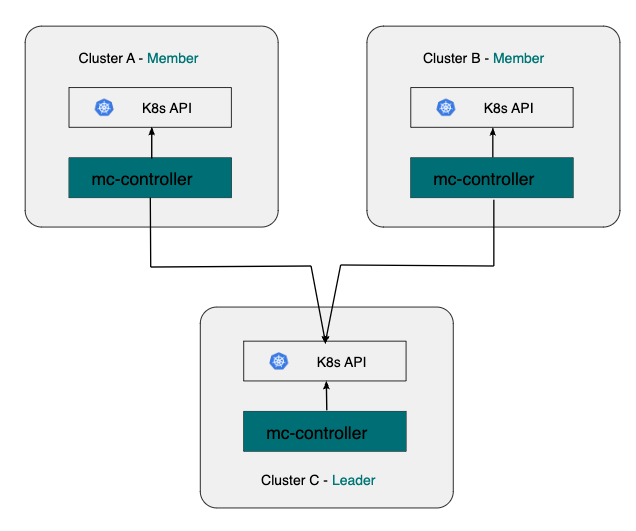
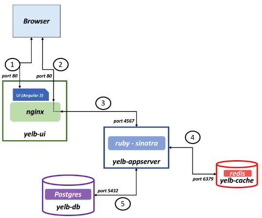
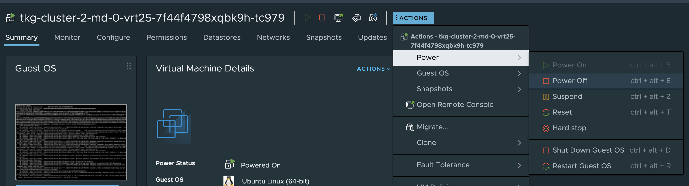
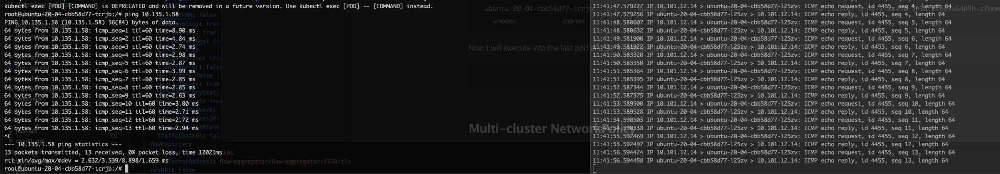
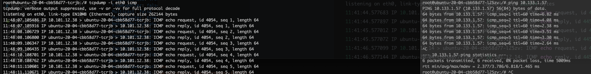

# Antrea Multi-cluster

 From the official [Antrea.io]() documentation:

> Antrea Multi-cluster implements [Multi-cluster Service API](https://github.com/kubernetes/enhancements/tree/master/keps/sig-multicluster/1645-multi-cluster-services-api), which allows users to create multi-cluster Services that can be accessed cross clusters in a ClusterSet. Antrea Multi-cluster also supports Antrea ClusterNetworkPolicy replication. Multi-cluster admins can define ClusterNetworkPolicies to be replicated across the entire ClusterSet, and enforced in all member clusters.
>
> An Antrea Multi-cluster ClusterSet includes a leader cluster and multiple member clusters. Antrea Multi-cluster Controller needs to be deployed in the leader and all member clusters. A cluster can serve as the leader, and meanwhile also be a member cluster of the ClusterSet.
>
> The diagram below depicts a basic Antrea Multi-cluster topology with one leader cluster and two member clusters.

 


In this post I will go through how to configure Antrea Multi-cluster in TKG 2.3 and Tanzu with vSphere. As of the time I am writing this post (end of September begining of October 2023) Tanzu with vSphere does not have all the feature gates available right now to be able to configure Antrea Multi-cluster, so this will be added later. After the initial configuration and installation of Antrea Multi-cluster I will go through the different possibilities (features) with Antrea Multi-cluster, with configuration and examples in each of their own sections. The first sections involving how to enable Antrea Multi-cluster feature gate is specific for the Kubernetes "distribution" it is enabled on (TKG, vSphere with Tanzu, upstream Kubernetes etc). After this initial config the rest is generic and can be re-used for all types of Kubernetes platforms. I will go through everything step by step to learn what the different "moving" parts are doing and how they work. At the end I have a *bonus chapter* where I have created a menu driven script that automates or simplify the whole process.

## Antrea Feature Gates

Antrea has a set of Feature Gates that can be enabled or disabled on both the Antrea Controller and Antrea Agent, depending on the feature. These are configured using the corresponding **antrea-config** configMap. For a list of available features head over to the [antrea.io](https://antrea.io/docs/v1.13.1/) documentation page [here](https://antrea.io/docs/v1.13.1/docs/feature-gates/). Depending on the Kubernetes platform, and when the settings are applied, these features may be enabled in different ways. This post will specifically cover how to enable the Antrea Multi-cluster Feature Gate in Tanzu Kubernetes Grid and vSphere with Tanzu (not available yet).  

## Configuring Antrea Multi-cluster in TKG 2.3 with Antrea v1.11.1

{}

The following procedure may not at the time writing this post be officially supported - will get back and confirm this 

{}

Using Tanzu Kubernetes Grid the Antrea Feature Gates can be configured during provisioning of the workload clusters or post cluster provision. I will be enabling the Antrea Multi-cluster feature gate during cluster provisioning. If one need to enable these feature gates post cluster provision one **must** edit the **antreaconfigs** crd at the Management cluster level for the corresponding TKG cluster. See below. 

```bash
 k get antreaconfigs.cni.tanzu.vmware.com -n tkg-ns-1
NAME            TRAFFICENCAPMODE   DEFAULTMTU   ANTREAPROXY   ANTREAPOLICY   SECRETREF
tkg-cluster-1   encap                           true          true           tkg-cluster-1-antrea-data-values
tkg-cluster-2   encap                           true          true           tkg-cluster-2-antrea-data-values
tkg-cluster-3   encap                           true          true           tkg-cluster-3-antrea-data-values
```

If I take a look at the yaml values for any of these **antreaconfigs**:

```yaml
apiVersion: cni.tanzu.vmware.com/v1alpha1
kind: AntreaConfig
metadata:
  annotations:
    kubectl.kubernetes.io/last-applied-configuration: |
      {"apiVersion":"cni.tanzu.vmware.com/v1alpha1","kind":"AntreaConfig","metadata":{"annotations":{},"name":"tkg-cluster-1","namespace":"tkg-ns-1"},"spec":{"antrea":{"config":{"antreaProxy":{"nodePortAddresses":[],"proxyAll":false,"proxyLoadBalancerIPs":true,"skipServices":[]},"cloudProvider":{"name":""},"disableTXChecksumOffload":false,"disableUdpTunnelOffload":false,"dnsServerOverride":"","egress":{"exceptCIDRs":[],"maxEgressIPsPerNode":255},"enableBridgingMode":null,"enableUsageReporting":false,"featureGates":{"AntreaIPAM":false,"AntreaPolicy":true,"AntreaProxy":true,"AntreaTraceflow":true,"Egress":true,"EndpointSlice":true,"FlowExporter":false,"L7NetworkPolicy":false,"Multicast":false,"Multicluster":true,"NetworkPolicyStats":false,"NodePortLocal":true,"SecondaryNetwork":false,"ServiceExternalIP":false,"SupportBundleCollection":false,"TopologyAwareHints":false,"TrafficControl":false},"flowExporter":{"activeFlowTimeout":"60s","idleFlowTimeout":"15s","pollInterval":"5s"},"kubeAPIServerOverride":null,"multicast":{"igmpQueryInterval":"125s"},"multicastInterfaces":[],"multicluster":{"enable":true,"enablePodToPodConnectivity":true,"enableStretchedNetworkPolicy":true,"namespace":"antrea-multicluster"},"noSNAT":false,"nodePortLocal":{"enabled":true,"portRange":"61000-62000"},"serviceCIDR":"10.132.0.0/16","trafficEncapMode":"encap","trafficEncryptionMode":"none","transportInterface":null,"transportInterfaceCIDRs":[],"tunnelCsum":false,"tunnelPort":0,"tunnelType":"geneve","wireGuard":{"port":51820}}}}}
  creationTimestamp: "2023-09-28T19:49:11Z"
  generation: 1
  labels:
    tkg.tanzu.vmware.com/cluster-name: tkg-cluster-1
    tkg.tanzu.vmware.com/package-name: antrea.tanzu.vmware.com.1.11.1---vmware.4-tkg.1-advanced
  name: tkg-cluster-1
  namespace: tkg-ns-1
  ownerReferences:
  - apiVersion: cluster.x-k8s.io/v1beta1
    kind: Cluster
    name: tkg-cluster-1
    uid: f635b355-e094-471f-bfeb-63e1c10443cf
  - apiVersion: run.tanzu.vmware.com/v1alpha3
    blockOwnerDeletion: true
    controller: true
    kind: ClusterBootstrap
    name: tkg-cluster-1
    uid: 83b5bdd6-27c3-4c65-a9bc-f665e99c0670
  resourceVersion: "14988446"
  uid: 7335854b-49ca-44d9-bded-2d4a09aaf5de
spec:
  antrea:
    config:
      antreaProxy:
        nodePortAddresses: []
        proxyAll: false
        proxyLoadBalancerIPs: true
        skipServices: []
      cloudProvider:
        name: ""
      defaultMTU: ""
      disableTXChecksumOffload: false
      disableUdpTunnelOffload: false
      dnsServerOverride: ""
      egress:
        exceptCIDRs: []
        maxEgressIPsPerNode: 255
      enableBridgingMode: false
      enableUsageReporting: false
      featureGates:
        AntreaIPAM: false
        AntreaPolicy: true
        AntreaProxy: true
        AntreaTraceflow: true
        Egress: true
        EndpointSlice: true
        FlowExporter: false
        L7NetworkPolicy: false
        Multicast: false
        Multicluster: true
        NetworkPolicyStats: false
        NodePortLocal: true
        SecondaryNetwork: false
        ServiceExternalIP: false
        SupportBundleCollection: false
        TopologyAwareHints: false
        TrafficControl: false
      flowExporter:
        activeFlowTimeout: 60s
        idleFlowTimeout: 15s
        pollInterval: 5s
      multicast:
        igmpQueryInterval: 125s
      multicastInterfaces: []
      multicluster:
        enable: true
        enablePodToPodConnectivity: true
        enableStretchedNetworkPolicy: true
        namespace: antrea-multicluster
      noSNAT: false
      nodePortLocal:
        enabled: true
        portRange: 61000-62000
      serviceCIDR: 10.132.0.0/16
      tlsCipherSuites: TLS_ECDHE_ECDSA_WITH_AES_128_GCM_SHA256,TLS_ECDHE_RSA_WITH_AES_128_GCM_SHA256,TLS_ECDHE_RSA_WITH_AES_256_GCM_SHA384,TLS_ECDHE_ECDSA_WITH_AES_256_GCM_SHA384,TLS_RSA_WITH_AES_256_GCM_SHA384
      trafficEncapMode: encap
      trafficEncryptionMode: none
      transportInterfaceCIDRs: []
      tunnelCsum: false
      tunnelPort: 0
      tunnelType: geneve
      wireGuard:
        port: 51820
status:
  secretRef: tkg-cluster-1-antrea-data-values
```

I have all the Antrea Feature Gates avaible for Antrea to use in the current version of TKG. What I dont have is the **antrea-agent.conf** and **antrea-controller.conf** sections. But enabling the Feature Gates here will enable the corresponding setting under the correct section in the native Antrea configMap.  

The required settings or Antrea Feature-Gates that needs to be enabled are the following:

```yaml
kind: ConfigMap
apiVersion: v1
metadata:
  name: antrea-config
  namespace: kube-system
data:
  antrea-agent.conf: |
    featureGates:
      Multicluster: true
    multicluster:
      enableGateway: true
      namespace: ""
```

Then I know which Feature Gates that must be enabled, but in TKG I dont have **antrea-agent.conf** nor **antrea-controller.conf**. 

Using a class based yaml for my workload clusters in TKG the Antrea specific section look like this and to enable Antrea Multi-cluster (including two optional features) I need to enable these features (redacted):

```yaml
apiVersion: cni.tanzu.vmware.com/v1alpha1
kind: AntreaConfig
metadata:
  name: tkg-cluster-1
  namespace: tkg-ns-1
spec:
  antrea:
    config:
      antreaProxy:
      cloudProvider:
      egress:
      featureGates:
        Multicluster: true # set to true
      multicluster:
        enable: true # set to true
        enablePodToPodConnectivity: true # set to true
        enableStretchedNetworkPolicy: true # set to true
        namespace: "antrea-multicluster" #optional

```

Below is the full workload cluster manifest I use, beginning with the Antrea specific settings (see my inline comments again). This will enable the Multi-cluster feature gate, and the two additional Multi-cluster features *PodToPodConnectivity* and *StretchedNetworkPolicy* upon cluster creation. 

```yaml
apiVersion: cni.tanzu.vmware.com/v1alpha1
kind: AntreaConfig
metadata:
  name: tkg-cluster-1
  namespace: tkg-ns-1
spec:
  antrea:
    config:
      antreaProxy:
        nodePortAddresses: []
        proxyAll: false
        proxyLoadBalancerIPs: true
        skipServices: []
      cloudProvider:
        name: ""
      disableTXChecksumOffload: false
      disableUdpTunnelOffload: false
      dnsServerOverride: ""
      egress:
        exceptCIDRs: []
        maxEgressIPsPerNode: 255
      enableBridgingMode: null
      enableUsageReporting: false
      featureGates:
        AntreaIPAM: false
        AntreaPolicy: true
        AntreaProxy: true
        AntreaTraceflow: true
        Egress: true
        EndpointSlice: true
        FlowExporter: false
        L7NetworkPolicy: false
        Multicast: false
        Multicluster: true # set to true
        NetworkPolicyStats: false
        NodePortLocal: true
        SecondaryNetwork: false
        ServiceExternalIP: false
        SupportBundleCollection: false
        TopologyAwareHints: false
        TrafficControl: false
      flowExporter:
        activeFlowTimeout: 60s
        idleFlowTimeout: 15s
        pollInterval: 5s
      kubeAPIServerOverride: null
      multicast:
        igmpQueryInterval: 125s
      multicastInterfaces: []
      multicluster:
        enable: true # set to true
        enablePodToPodConnectivity: true # set to true
        enableStretchedNetworkPolicy: true # set to true
        namespace: "antrea-multicluster"
      noSNAT: false
      nodePortLocal:
        enabled: true
        portRange: 61000-62000
      serviceCIDR: 10.132.0.0/16 # if you forget to update this CIDR it will be updated according to the services cidr below
      trafficEncapMode: encap
      trafficEncryptionMode: none
      transportInterface: null
      transportInterfaceCIDRs: []
      tunnelCsum: false
      tunnelPort: 0
      tunnelType: geneve
      wireGuard:
        port: 51820
---
apiVersion: cpi.tanzu.vmware.com/v1alpha1
kind: VSphereCPIConfig
metadata:
  name: tkg-cluster-1
  namespace: tkg-ns-1
spec:
  vsphereCPI:
    ipFamily: ipv4
    mode: vsphereCPI
    region: k8s-region
    tlsCipherSuites: TLS_ECDHE_ECDSA_WITH_AES_128_GCM_SHA256,TLS_ECDHE_RSA_WITH_AES_128_GCM_SHA256,TLS_ECDHE_ECDSA_WITH_CHACHA20_POLY1305,TLS_ECDHE_RSA_WITH_AES_256_GCM_SHA384,TLS_ECDHE_RSA_WITH_CHACHA20_POLY1305,TLS_ECDHE_ECDSA_WITH_AES_256_GCM_SHA384
    zone: k8s-zone
---
apiVersion: csi.tanzu.vmware.com/v1alpha1
kind: VSphereCSIConfig
metadata:
  name: tkg-cluster-1
  namespace: tkg-ns-1
spec:
  vsphereCSI:
    config:
      datacenter: /cPod-NSXAM-WDC
      httpProxy: ""
      httpsProxy: ""
      insecureFlag: false
      noProxy: ""
      region: k8s-region
      tlsThumbprint: <SHA>
      useTopologyCategories: true
      zone: k8s-zone
    mode: vsphereCSI
---
apiVersion: run.tanzu.vmware.com/v1alpha3
kind: ClusterBootstrap
metadata:
  annotations:
    tkg.tanzu.vmware.com/add-missing-fields-from-tkr: v1.26.5---vmware.2-tkg.1
  name: tkg-cluster-1
  namespace: tkg-ns-1
spec:
  additionalPackages:
  - refName: metrics-server*
  - refName: secretgen-controller*
  - refName: pinniped*
  cni:
    refName: antrea*
    valuesFrom:
      providerRef:
        apiGroup: cni.tanzu.vmware.com
        kind: AntreaConfig
        name: tkg-cluster-1
  cpi:
    refName: vsphere-cpi*
    valuesFrom:
      providerRef:
        apiGroup: cpi.tanzu.vmware.com
        kind: VSphereCPIConfig
        name: tkg-cluster-1
  csi:
    refName: vsphere-csi*
    valuesFrom:
      providerRef:
        apiGroup: csi.tanzu.vmware.com
        kind: VSphereCSIConfig
        name: tkg-cluster-1
  kapp:
    refName: kapp-controller*
---
apiVersion: v1
kind: Secret
metadata:
  name: tkg-cluster-1
  namespace: tkg-ns-1
stringData:
  password: password
  username: andreasm@cpod-nsxam-wdc.domain.net
---
apiVersion: cluster.x-k8s.io/v1beta1
kind: Cluster
metadata:
  annotations:
    osInfo: ubuntu,20.04,amd64
    tkg/plan: dev
  labels:
    tkg.tanzu.vmware.com/cluster-name: tkg-cluster-1
  name: tkg-cluster-1
  namespace: tkg-ns-1
spec:
  clusterNetwork:
    pods:
      cidrBlocks:
      - 10.131.0.0/16
    services:
      cidrBlocks:
      - 10.132.0.0/16
  topology:
    class: tkg-vsphere-default-v1.1.0
    controlPlane:
      metadata:
        annotations:
          run.tanzu.vmware.com/resolve-os-image: image-type=ova,os-name=ubuntu
      replicas: 1
    variables:
    - name: cni
      value: antrea
    - name: controlPlaneCertificateRotation
      value:
        activate: true
        daysBefore: 90
    - name: auditLogging
      value:
        enabled: false
    - name: podSecurityStandard
      value:
        audit: restricted
        deactivated: false
        warn: restricted
    - name: apiServerEndpoint
      value: ""
    - name: aviAPIServerHAProvider
      value: true
    - name: vcenter
      value:
        cloneMode: fullClone
        datacenter: /cPod-NSXAM-WDC
        datastore: /cPod-NSXAM-WDC/datastore/vsanDatastore-wdc-01
        folder: /cPod-NSXAM-WDC/vm/TKGm
        network: /cPod-NSXAM-WDC/network/ls-tkg-mgmt
        resourcePool: /cPod-NSXAM-WDC/host/Cluster-1/Resources
        server: vcsa.cpod-nsxam-wdc.az-wdc.domain.net
        storagePolicyID: ""
        tlsThumbprint: <SHA>
    - name: user
      value:
        sshAuthorizedKeys:
        - ssh-rsa 2UEBx235bVRSxQ==
    - name: controlPlane
      value:
        machine:
          diskGiB: 20
          memoryMiB: 4096
          numCPUs: 2
    - name: worker
      value:
        machine:
          diskGiB: 20
          memoryMiB: 4096
          numCPUs: 2
    - name: controlPlaneZoneMatchingLabels
      value:
        region: k8s-region
        tkg-cp: allowed
    - name: security
      value:
        fileIntegrityMonitoring:
          enabled: false
        imagePolicy:
          pullAlways: false
          webhook:
            enabled: false
            spec:
              allowTTL: 50
              defaultAllow: true
              denyTTL: 60
              retryBackoff: 500
        kubeletOptions:
          eventQPS: 50
          streamConnectionIdleTimeout: 4h0m0s
        systemCryptoPolicy: default
    version: v1.26.5+vmware.2-tkg.1
    workers:
      machineDeployments:
      - class: tkg-worker
        failureDomain: wdc-zone-2
        metadata:
          annotations:
            run.tanzu.vmware.com/resolve-os-image: image-type=ova,os-name=ubuntu
        name: md-0
        replicas: 1
        strategy:
          type: RollingUpdate
      - class: tkg-worker
        failureDomain: wdc-zone-3
        metadata:
          annotations:
            run.tanzu.vmware.com/resolve-os-image: image-type=ova,os-name=ubuntu
        name: md-1
        replicas: 1
        strategy:
          type: RollingUpdate
```


In addition I am also setting these three additional settings:

```yaml
        enablePodToPodConnectivity: true # set to true
        enableStretchedNetworkPolicy: true # set to true
        namespace: "antrea-multicluster" # the namespace will be created later, and I am not sure its even required to define anything here. Leave it blank ""
```

As I will test out the Multi-cluster NetworkPolicy and routing pod traffic through Multi-cluster Gateways, more on that later. In the workload cluster manifest make sure the services and pod CIDR does not overlap between your clusters that will be joined to the same Multi-cluster ClusterSet.

The namespace section is not mandatory.

{}

The services CIDRs can not overlap

The pod CIDR can not overlap if enabling PodToPodConnectivity

{}

After my TKG workload cluster has been provisioned with the above yaml, this will give me the following AntreaConfig in my workload cluster:

```yaml
andreasm@tkg-bootstrap:~$ k get configmaps -n kube-system antrea-config -oyaml
apiVersion: v1
data:
  antrea-agent.conf: |
    featureGates:
      AntreaProxy: true
      EndpointSlice: true
      TopologyAwareHints: false
      Traceflow: true
      NodePortLocal: true
      AntreaPolicy: true
      FlowExporter: false
      NetworkPolicyStats: false
      Egress: true
      AntreaIPAM: false
      Multicast: false
      Multicluster: true #enabled
      SecondaryNetwork: false
      ServiceExternalIP: false
      TrafficControl: false
      SupportBundleCollection: false
      L7NetworkPolicy: false
    trafficEncapMode: encap
    noSNAT: false
    tunnelType: geneve
    tunnelPort: 0
    tunnelCsum: false
    trafficEncryptionMode: none
    enableBridgingMode: false
    disableTXChecksumOffload: false
    wireGuard:
      port: 51820
    egress:
      exceptCIDRs: []
      maxEgressIPsPerNode: 255
    serviceCIDR: 10.132.0.0/16
    nodePortLocal:
      enable: true
      portRange: 61000-62000
    tlsCipherSuites: TLS_ECDHE_ECDSA_WITH_AES_128_GCM_SHA256,TLS_ECDHE_RSA_WITH_AES_128_GCM_SHA256,TLS_ECDHE_RSA_WITH_AES_256_GCM_SHA384,TLS_ECDHE_ECDSA_WITH_AES_256_GCM_SHA384,TLS_RSA_WITH_AES_256_GCM_SHA384
    multicast: {}
    antreaProxy:
      proxyAll: false
      nodePortAddresses: []
      skipServices: []
      proxyLoadBalancerIPs: true
    multicluster:
      enableGateway: true #enabled
      namespace: antrea-multicluster
      enableStretchedNetworkPolicy: true #enabled
      enablePodToPodConnectivity: true #enabled
  antrea-cni.conflist: |
    {
        "cniVersion":"0.3.0",
        "name": "antrea",
        "plugins": [
            {
                "type": "antrea",
                "ipam": {
                    "type": "host-local"
                }
            }
            ,
            {
                "type": "portmap",
                "capabilities": {"portMappings": true}
            }
            ,
            {
                "type": "bandwidth",
                "capabilities": {"bandwidth": true}
            }
        ]
    }
  antrea-controller.conf: |
    featureGates:
      Traceflow: true
      AntreaPolicy: true
      NetworkPolicyStats: false
      Multicast: false
      Egress: true
      AntreaIPAM: false
      ServiceExternalIP: false
      SupportBundleCollection: false
      L7NetworkPolicy: false
      Multicluster: true
    tlsCipherSuites: TLS_ECDHE_ECDSA_WITH_AES_128_GCM_SHA256,TLS_ECDHE_RSA_WITH_AES_128_GCM_SHA256,TLS_ECDHE_RSA_WITH_AES_256_GCM_SHA384,TLS_ECDHE_ECDSA_WITH_AES_256_GCM_SHA384,TLS_RSA_WITH_AES_256_GCM_SHA384
    nodeIPAM: null
    multicluster:
      enableStretchedNetworkPolicy: true
    cloudProvider:
      name: ""
kind: ConfigMap
metadata:
  annotations:
    kapp.k14s.io/identity: v1;kube-system//ConfigMap/antrea-config;v1
    kapp.k14s.io/original: '{"apiVersion":"v1","data":{"antrea-agent.conf":"featureGates:\n  AntreaProxy:
      true\n  EndpointSlice: true\n  TopologyAwareHints: false\n  Traceflow: true\n  NodePortLocal:
      true\n  AntreaPolicy: true\n  FlowExporter: false\n  NetworkPolicyStats: false\n  Egress:
      true\n  AntreaIPAM: false\n  Multicast: false\n  Multicluster: true\n  SecondaryNetwork:
      false\n  ServiceExternalIP: false\n  TrafficControl: false\n  SupportBundleCollection:
      false\n  L7NetworkPolicy: false\ntrafficEncapMode: encap\nnoSNAT: false\ntunnelType:
      geneve\ntunnelPort: 0\ntunnelCsum: false\ntrafficEncryptionMode: none\nenableBridgingMode:
      false\ndisableTXChecksumOffload: false\nwireGuard:\n  port: 51820\negress:\n  exceptCIDRs:
      []\n  maxEgressIPsPerNode: 255\nserviceCIDR: 100.20.0.0/16\nnodePortLocal:\n  enable:
      true\n  portRange: 61000-62000\ntlsCipherSuites: TLS_ECDHE_ECDSA_WITH_AES_128_GCM_SHA256,TLS_ECDHE_RSA_WITH_AES_128_GCM_SHA256,TLS_ECDHE_RSA_WITH_AES_256_GCM_SHA384,TLS_ECDHE_ECDSA_WITH_AES_256_GCM_SHA384,TLS_RSA_WITH_AES_256_GCM_SHA384\nmulticast:
      {}\nantreaProxy:\n  proxyAll: false\n  nodePortAddresses: []\n  skipServices:
      []\n  proxyLoadBalancerIPs: true\nmulticluster:\n  enableGateway: true\n  enableStretchedNetworkPolicy:
      true\n  enablePodToPodConnectivity: true\n","antrea-cni.conflist":"{\n    \"cniVersion\":\"0.3.0\",\n    \"name\":
      \"antrea\",\n    \"plugins\": [\n        {\n            \"type\": \"antrea\",\n            \"ipam\":
      {\n                \"type\": \"host-local\"\n            }\n        }\n        ,\n        {\n            \"type\":
      \"portmap\",\n            \"capabilities\": {\"portMappings\": true}\n        }\n        ,\n        {\n            \"type\":
      \"bandwidth\",\n            \"capabilities\": {\"bandwidth\": true}\n        }\n    ]\n}\n","antrea-controller.conf":"featureGates:\n  Traceflow:
      true\n  AntreaPolicy: true\n  NetworkPolicyStats: false\n  Multicast: false\n  Egress:
      true\n  AntreaIPAM: false\n  ServiceExternalIP: false\n  SupportBundleCollection:
      false\n  L7NetworkPolicy: false\n  Multicluster: true\ntlsCipherSuites: TLS_ECDHE_ECDSA_WITH_AES_128_GCM_SHA256,TLS_ECDHE_RSA_WITH_AES_128_GCM_SHA256,TLS_ECDHE_RSA_WITH_AES_256_GCM_SHA384,TLS_ECDHE_ECDSA_WITH_AES_256_GCM_SHA384,TLS_RSA_WITH_AES_256_GCM_SHA384\nnodeIPAM:
      null\nmulticluster:\n  enableStretchedNetworkPolicy: true\ncloudProvider:\n  name:
      \"\"\n"},"kind":"ConfigMap","metadata":{"labels":{"app":"antrea","kapp.k14s.io/app":"1695711779258641591","kapp.k14s.io/association":"v1.c39c4aca919097e50452c3432329dd40"},"name":"antrea-config","namespace":"kube-system"}}'
    kapp.k14s.io/original-diff-md5: c6e94dc94aed3401b5d0f26ed6c0bff3
  creationTimestamp: "2023-09-26T07:03:04Z"
  labels:
    app: antrea
    kapp.k14s.io/app: "1695711779258641591"
    kapp.k14s.io/association: v1.c39c4aca919097e50452c3432329dd40
  name: antrea-config
  namespace: kube-system
  resourceVersion: "902"
  uid: 49aea43b-4f8e-4f60-9d54-b299a73bdba8
```

Notice that the features have been enabled under the corresponding **antrea-agent.conf** and **antrea-controller.conf** sections. 

```yaml
apiVersion: v1
data:
  antrea-agent.conf: |
    featureGates:
      Multicluster: true #enabled
    multicluster:
      enableGateway: true #enabled
      namespace: antrea-multicluster
      enableStretchedNetworkPolicy: true #enabled
      enablePodToPodConnectivity: true #enabled
  antrea-controller.conf: |
    featureGates:
      Multicluster: true #enabled
    multicluster:
      enableStretchedNetworkPolicy: true #enabled
```

That's it for enabling Antrea Multi-cluster in TKG workload clusters.

## Tanzu in vSphere and Antrea Multi-cluster 

Coming later - stay tuned

## Install and Configure Antrea Multi-cluster

All the instructions for this exercise has been taken from the offial [antrea.io](https://antrea.io/docs/v1.11.1/docs/multicluster/user-guide/) and the Antrea [Github](https://github.com/antrea-io/antrea/blob/release-1.11/docs/multicluster/user-guide.md) pages.
My TKG Cluster-1 (Leader cluster) is up and running with the required Antrea Multi-cluster settings (see above) enabled. Now I will follow the user-guide which will involve installing the Antrea Multi-cluster controller in the leader cluster, create ClusterSet, Multi-cluster Gateway configuration. I will start doing all the steps that can be done on the Leader cluster, then take the member clusters next. I will be following the yaml approach. There is also another approach using **antctl** I may add that also or update the post at a later stage to involve these steps. 

{}

It is important to follow the documentation according to the version of Antrea being used. This is due to updates in api, and general configuration settings. An example. If I am on Antrea v1.11.1 I would be using the following github or antrea url:
https://github.com/antrea-io/antrea/blob/release-1.11/docs/multicluster/user-guide.md
https://antrea.io/docs/v1.11.1/docs/multicluster/user-guide/ 

If using Antrea v1.13.1 I would be using the following url: 

https://github.com/antrea-io/antrea/blob/release-1.13/docs/multicluster/user-guide.md
https://antrea.io/docs/v1.13.1/docs/multicluster/user-guide/ 

{}


{}

Antrea Multi-cluster can be configured in different topologies

Read more here: https://github.com/antrea-io/antrea/blob/main/docs/multicluster/user-guide.md#deploy-antrea-multi-cluster-controller

{}

### Install the Antrea Multi-cluster controller in the dedicated leader cluster

I will start by creating an enviroment variable, exporting the Antrea version I am using, for the following yaml manifests commands to use. Just to be certain I will first check the actual Antrea version by issuing the **antctl version** command inside the Antrea controller pod:

```bash
k exec -it -n kube-system antrea-controller-75b85cf45b-hvhq4 bash
kubectl exec [POD] [COMMAND] is DEPRECATED and will be removed in a future version. Use kubectl exec [POD] -- [COMMAND] instead.
root@tkg-cluster-1-btnn5-vzq5n:/# antctl version
antctlVersion: v1.11.1-4776f66
controllerVersion: v1.11.1-4776f66
root@tkg-cluster-1-btnn5-vzq5n:/#
```

```bash
andreasm@tkg-bootstrap:~$ export TAG=v1.11.1
```

Install the Multi-cluster controller in the namespace *antrea-multicluster* issuing the following **two** yamls:

```bash
kubectl apply -f https://github.com/antrea-io/antrea/releases/download/$TAG/antrea-multicluster-leader-global.yml
kubectl apply -f https://github.com/antrea-io/antrea/releases/download/$TAG/antrea-multicluster-leader-namespaced.yml
```

Creating the namespace antrea-multicluster:

```
andreasm@tkg-bootstrap:~$ kubectl create ns antrea-multicluster
namespace/antrea-multicluster created
```

Applying the antrea-multicluster-leader-global.yaml:

```bash
## Apply the antrea-multicluster-leader-global.yaml
andreasm@tkg-bootstrap:~$ kubectl apply -f https://github.com/antrea-io/antrea/releases/download/$TAG/antrea-multicluster-leader-global.yml
## applied
customresourcedefinition.apiextensions.k8s.io/clusterclaims.multicluster.crd.antrea.io created
customresourcedefinition.apiextensions.k8s.io/clustersets.multicluster.crd.antrea.io created
customresourcedefinition.apiextensions.k8s.io/memberclusterannounces.multicluster.crd.antrea.io created
customresourcedefinition.apiextensions.k8s.io/resourceexports.multicluster.crd.antrea.io created
customresourcedefinition.apiextensions.k8s.io/resourceimports.multicluster.crd.antrea.io created
```


Applying the antrea-multicluster-leader-namespaced.yaml:

```bash
## Apply the antrea-multicluster-leader-namespaced.yaml
andreasm@tkg-bootstrap:~$ kubectl apply -f https://github.com/antrea-io/antrea/releases/download/$TAG/antrea-multicluster-leader-namespaced.yml
## applied

serviceaccount/antrea-mc-controller created
serviceaccount/antrea-mc-member-access-sa created
role.rbac.authorization.k8s.io/antrea-mc-controller-role created
role.rbac.authorization.k8s.io/antrea-mc-member-cluster-role created
clusterrole.rbac.authorization.k8s.io/antrea-multicluster-antrea-mc-controller-webhook-role created
rolebinding.rbac.authorization.k8s.io/antrea-mc-controller-rolebinding created
rolebinding.rbac.authorization.k8s.io/antrea-mc-member-cluster-rolebinding created
clusterrolebinding.rbac.authorization.k8s.io/antrea-multicluster-antrea-mc-controller-webhook-rolebinding created
configmap/antrea-mc-controller-config created
service/antrea-mc-webhook-service created
Warning: would violate PodSecurity "restricted:v1.24": host namespaces (hostNetwork=true), hostPort (container "antrea-mc-controller" uses hostPort 9443), unrestricted capabilities (container "antrea-mc-controller" must set securityContext.capabilities.drop=["ALL"]), runAsNonRoot != true (pod or container "antrea-mc-controller" must set securityContext.runAsNonRoot=true), seccompProfile (pod or container "antrea-mc-controller" must set securityContext.seccompProfile.type to "RuntimeDefault" or "Localhost")
deployment.apps/antrea-mc-controller created
mutatingwebhookconfiguration.admissionregistration.k8s.io/antrea-multicluster-antrea-mc-mutating-webhook-configuration created
validatingwebhookconfiguration.admissionregistration.k8s.io/antrea-multicluster-antrea-mc-validating-webhook-configuration created
```


```bash
andreasm@tkg-bootstrap:~$ k get pods -n antrea-multicluster
NAME                                    READY   STATUS    RESTARTS   AGE
antrea-mc-controller-7697c8b776-dqtzp   1/1     Running   0          58s
```


And the Antrea CRDs including the additional CRDs from the Multi-cluster installation:

```bash
aandreasm@tkg-bootstrap:~$ k get crd -A
NAME                                                     CREATED AT
antreaagentinfos.crd.antrea.io                           2023-09-26T07:03:02Z
antreacontrollerinfos.crd.antrea.io                      2023-09-26T07:03:02Z
clusterclaims.multicluster.crd.antrea.io                 2023-09-27T06:59:07Z
clustergroups.crd.antrea.io                              2023-09-26T07:03:04Z
clusternetworkpolicies.crd.antrea.io                     2023-09-26T07:03:02Z
clustersets.multicluster.crd.antrea.io                   2023-09-27T06:59:07Z
egresses.crd.antrea.io                                   2023-09-26T07:03:02Z
externalentities.crd.antrea.io                           2023-09-26T07:03:02Z
externalippools.crd.antrea.io                            2023-09-26T07:03:02Z
externalnodes.crd.antrea.io                              2023-09-26T07:03:02Z
groups.crd.antrea.io                                     2023-09-26T07:03:04Z
ippools.crd.antrea.io                                    2023-09-26T07:03:02Z
memberclusterannounces.multicluster.crd.antrea.io        2023-09-27T06:59:08Z
multiclusteringresses.ako.vmware.com                     2023-09-26T07:03:51Z
networkpolicies.crd.antrea.io                            2023-09-26T07:03:02Z
resourceexports.multicluster.crd.antrea.io               2023-09-27T06:59:12Z
resourceimports.multicluster.crd.antrea.io               2023-09-27T06:59:15Z
supportbundlecollections.crd.antrea.io                   2023-09-26T07:03:03Z
tierentitlementbindings.crd.antrea.tanzu.vmware.com      2023-09-26T07:03:04Z
tierentitlements.crd.antrea.tanzu.vmware.com             2023-09-26T07:03:02Z
tiers.crd.antrea.io                                      2023-09-26T07:03:03Z
traceflows.crd.antrea.io                                 2023-09-26T07:03:03Z
trafficcontrols.crd.antrea.io                            2023-09-26T07:03:03Z
```

### Install the Antrea Multi-cluster controller in the member clusters

Next up is to deploy the Antrea Multi-cluster in both of my member clusters, tkg-cluster-2 and tkg-cluster-3. They have also been configured to enable the Multi-cluster feature gate. This operation involves applying the antrea-multicluster-member.yaml

```bash
andreasm@tkg-bootstrap:~$ k config current-context
tkg-cluster-2-admin@tkg-cluster-2
# Show running pods
NAMESPACE              NAME                                                     READY   STATUS      RESTARTS      AGE
avi-system             ako-0                                                    1/1     Running     0             19h
kube-system            antrea-agent-grq68                                       2/2     Running     0             18h
kube-system            antrea-agent-kcbc8                                       2/2     Running     0             18h
kube-system            antrea-agent-zvgcc                                       2/2     Running     0             18h
kube-system            antrea-controller-bc584bbcd-7hw7n                        1/1     Running     0             18h
kube-system            coredns-75f565d4dd-48sgb                                 1/1     Running     0             19h
kube-system            coredns-75f565d4dd-wr8pl                                 1/1     Running     0             19h
kube-system            etcd-tkg-cluster-2-jzmpk-w2thj                           1/1     Running     0             19h
kube-system            kube-apiserver-tkg-cluster-2-jzmpk-w2thj                 1/1     Running     0             19h
kube-system            kube-controller-manager-tkg-cluster-2-jzmpk-w2thj        1/1     Running     0             19h
kube-system            kube-proxy-dmcb5                                         1/1     Running     0             19h
kube-system            kube-proxy-kr5hl                                         1/1     Running     0             19h
kube-system            kube-proxy-t7qqp                                         1/1     Running     0             19h
kube-system            kube-scheduler-tkg-cluster-2-jzmpk-w2thj                 1/1     Running     0             19h
kube-system            metrics-server-5666ffccb9-p7qqw                          1/1     Running     0             19h
kube-system            vsphere-cloud-controller-manager-6b8v2                   1/1     Running     0             19h
secretgen-controller   secretgen-controller-69cbc65949-2x8nv                    1/1     Running     0             19h
tkg-system             kapp-controller-5776b48998-7rkzf                         2/2     Running     0             19h
tkg-system             tanzu-capabilities-controller-manager-77d8ffcd57-9tgzn   1/1     Running     0             19h
vmware-system-antrea   register-placeholder-m5bj8                               0/1     Completed   0             8m41s
vmware-system-csi      vsphere-csi-controller-67799db966-qnfv2                  7/7     Running     1 (19h ago)   19h
vmware-system-csi      vsphere-csi-node-dkcf7                                   3/3     Running     2 (19h ago)   19h
vmware-system-csi      vsphere-csi-node-w8dqw                                   3/3     Running     3 (31m ago)   19h
vmware-system-csi      vsphere-csi-node-zxpmz                                   3/3     Running     4 (19h ago)   19h
```

Apply the multicluster-member.yaml

```bash
andreasm@tkg-bootstrap:~$ kubectl apply -f https://github.com/antrea-io/antrea/releases/download/$TAG/antrea-multicluster-member.yml
## applied
customresourcedefinition.apiextensions.k8s.io/clusterclaims.multicluster.crd.antrea.io created
customresourcedefinition.apiextensions.k8s.io/clusterinfoimports.multicluster.crd.antrea.io created
customresourcedefinition.apiextensions.k8s.io/clustersets.multicluster.crd.antrea.io created
customresourcedefinition.apiextensions.k8s.io/gateways.multicluster.crd.antrea.io created
customresourcedefinition.apiextensions.k8s.io/labelidentities.multicluster.crd.antrea.io created
customresourcedefinition.apiextensions.k8s.io/serviceexports.multicluster.x-k8s.io created
customresourcedefinition.apiextensions.k8s.io/serviceimports.multicluster.x-k8s.io created
serviceaccount/antrea-mc-controller created
clusterrole.rbac.authorization.k8s.io/antrea-mc-controller-role created
clusterrolebinding.rbac.authorization.k8s.io/antrea-mc-controller-rolebinding created
configmap/antrea-mc-controller-config created
service/antrea-mc-webhook-service created
deployment.apps/antrea-mc-controller created
mutatingwebhookconfiguration.admissionregistration.k8s.io/antrea-mc-mutating-webhook-configuration created
validatingwebhookconfiguration.admissionregistration.k8s.io/antrea-mc-validating-webhook-configuration created
```

```bash
NAMESPACE              NAME                                                     READY   STATUS      RESTARTS      AGE
kube-system            antrea-mc-controller-5bb945f87f-xk287                    1/1     Running     0             64s
```

 The controller is running, and it is running in the kube-system namespace.

Now I will repeat the same operation for my tkg-cluster-3...

## Create ClusterSet

Creating ClusterSet involves a couple of steps on both Leader cluster and member clusters.

### On the Leader Cluster - Create ServiceAccounts

First I will configure a ServiceAccount for each member to access the Leader cluster's API. 

In my **Leader cluster** I will apply the following yaml:

Member 1, tkg-cluster-2, will be called **member-blue**

```yaml
## This the yaml for creating the Service Account for member-blue
apiVersion: v1
kind: ServiceAccount
metadata:
  name: member-blue
  namespace: antrea-multicluster
---
apiVersion: v1
kind: Secret
metadata:
  name: member-blue-token
  namespace: antrea-multicluster
  annotations:
    kubernetes.io/service-account.name: member-blue
type: kubernetes.io/service-account-token
---
apiVersion: rbac.authorization.k8s.io/v1
kind: RoleBinding
metadata:
  name: member-blue
  namespace: antrea-multicluster
roleRef:
  apiGroup: rbac.authorization.k8s.io
  kind: Role
  name: antrea-mc-member-cluster-role
subjects:
  - kind: ServiceAccount
    name: member-blue
    namespace: antrea-multicluster
```

Apply it:

```bash
andreasm@tkg-bootstrap:~$ k apply -f sa-member-blue.yaml
## applied
serviceaccount/member-blue created
secret/member-blue-token created
rolebinding.rbac.authorization.k8s.io/member-blue created
```

Now create a token yaml file for member blue:

```bash
kubectl get secret member-blue-token -n antrea-multicluster -o yaml | grep -w -e '^apiVersion' -e '^data' -e '^metadata' -e '^ *name:'  -e   '^kind' -e '  ca.crt' -e '  token:' -e '^type' -e '  namespace' | sed -e 's/kubernetes.io\/service-account-token/Opaque/g' -e 's/antrea-multicluster/kube-system/g' >  member-blue-token.yml
```

This should create the file **member-blue-token.yaml** and the content of the file:

```yaml
# cat member-blue-token.yml
cat member-blue-token.yml
## output
apiVersion: v1
data:
  ca.crt: LS0tLS1CRUdJ0tCk1JSUM2akNDQWRLZ0F3SUJBZ0lCQURBTkJna3Foa2lHOXcwQkFRc0ZBREFWTVJNd0VRWURWUVFERXdwcmRXSmwKY201bGRHVnpNQjRYRFRJek1Ea3lOakEyTlRReU5Wb1hEVE16TURreU16QTJOVGt5TlZvd0ZURVRNQkVHQTFVRQpBeE1LYTNWaVpYSnVaWFJsY3pDQ0FTSXdEUVlKS29aSWh2Y05BUUVCQlFBRGdnRVBBRENDQVFvQ2dnRUJBTDh2Ck1iWHc0MFM2NERZc2dnMG9qSEVwUHlOOC93MVBkdFE2cGxSSThvbUVuWW1ramc5TThIN3NrTDhqdHR1WXRxQVkKYnorZEFsVmJBcWRrWCtkL3Q5MTZGOWRBYmRveW9Qc3pwREIraVVQdDZ5Nm5YbDhPK0xEV2JWZzdEWTVXQ3lYYQpIeEJBM1I4NUUxRkhvYUxBREZ6OFRsZ2lKR3RZYktROFJYTWlIMk1xczRaNU9Mblp3Qy9rSTNVNEEzMVFlcXl3Cm1VMjd2SDdzZjlwK0tiTE5wZldtMDJoV3hZNzlMS1hCNE1LOStLaXAyVkt4VUlQbHl6bGpXTjQrcngyclN4bVEKbnpmR3NpT0JQTWpOanpQOE44cWJub01hL2Jd1haOHJpazhnenJGN05sQQp6R1BvdC84S2Q5UXZ2Q2doVVlNQ0F3RUFBYU5GTUVNd0RnWURWUjBQQVFIL0JBUURBZ0trTUJJR0ExVWRFd0VCCi93UUlNQVlCQWY4Q0FRQXdIUVlEVlIwT0JCWUVGQk9PWHcrb1o1VGhLQ3I5RnBMWm9ySkZZWW1wTUEwR0NTcUcKU0liM0RRRUJDd1VBQTRJQkFRQ2Rpa2lWYi9pblk1RVNIdVVIcTY2YnBLK1RTQXI5eTFERnN0Qjd2eUt3UGduVAp2bGdEZnZnN1o3UTVOaFhzcFBnV1Y4NEZMMU80UUQ1WmtTYzhLcDVlM1V1ZFFvckRQS3VEOWkzNHVXVVc0TVo5ClR2UUJLNS9sRUlsclBONG5XYmEyazYrOE9tZitmWWREd3JsZTVaa3JUOHh6UnhEbEtXdE5vNVRHMWgrMElUOVgKcVMwL1hzNFpISlU2NGd5dlRsQXlwR2pPdFdxMUc0MEZ5U3dydFJLSE52a3JjTStkeDdvTEM1d003ZTZSTHg1cApnb0Y5dGZZV3ZyUzJWWjl2RUR5QllPN1RheFhEMGlaV2V1VEh0ZFJxTWVLZVAvei9lYnZJMUkvRkWS9NNGdxYjdXbGVqM0JNS051TVc2Q1AwUmFYcXJnUmpnVTAKLS0tLS1FTkQgQ0VSVElGSUNBVEUtLS0tLQu=
  namespace: YW50cmVhLW11bHRpY2x1c3Rlcg==
  token: WXlKaGJHY2lPaUpTVXpJMCUVRGaWNIUlJTR0Z1VnpkTU1GVjVOalF3VWpKcVNFVXdYMFkzZDFsNmJqWXpUa3hzVUc4aWZRLmV5SnBjM01pT2lKcmRXSmxjbTVsZEdWekwzTmxjblpwWTJWaFkyTnZkVzUwSWl3aWEzVmlaWEp1WlhSbGN5NXBieTl6WlhKMmFXTmxZV05qYjNWdWRDOXVZVzFsYzNCaFkyVWlPaUpoYm5SeVpXRXRiWFZzZEdsamJIVnpkR1Z5SWl3aWEzVmlaWEp1WlhSbGN5NXBieTl6WlhKMmFXTmxZV05qYjNWdWRDOXpaV055WlhRdWJtRnRaU0k2SW0xbGJXSmxjaTFpYkhWbExYUnZhMlZ1SWl3aWEzVmlaWEp1WlhSbGN5NXBieTl6WlhKMmFXTmxZV05qY5RdWJtRnRaU0k2SW0xbGJXSmxjaTFpYkhWbElpd2lhM1ZpWlhKdVpYUmxjeTVwYnk5elpYSjJhV05sWVdOamIzVnVkQzl6WlhKMmFXTmxMV0ZqWTI5MWJuUXVkV2xrSWpvaU1XSTVaVGd4TUdVdE5tTTNaQzAwTjJZekxXRTVaR1F0TldWbU4yTXpPVEE0T0dNNElpd2ljM1ZpSWpvaWMzbHpkR1Z0T25ObGNuWnBZMlZoWTJOdmRXNTBPbUZ1ZEhKbFlTMXRkV3gwYVdOc2RYTjBaWEk2YldWdFltVnlMV0pzZFdVaWZRLmNyU29sN0JzS2JyR2lhUVYyWmJ2OG8tUVl1eVBfWGlnZ1hfcDg2UGs0ZEpVOTBwWk1XYUZTUkFUR1ptQnBCUUJnajI5eVJHbkdvajVHRWN3YVNxWlZaV3FySk9jVTM1QXFlWHhpWm1fUl9LWDB4VUR1Y0wxQTVxNdWhOYTBGUkxmU2FKWUNOME1NTHNKVTBDU3pHUVg1dHlzTXBUN0YwVG0weS1mZFpVOE9IQmJoY0ZDWXkyYk5WdC0weU9pQUlYOHR2TVNrb2NzaHpWUm5ha1A5dmtMaXNVUGh2Vm9xMVROZ2RVRmtjc0lPRjl4ZFo5Ul9PX3NlT1ZLay1hNkhJbjB3THQzZ3FEZHRHU09Ub3BfMUh0djgxeEZQdF9zNlVRNmpldjZpejh3aFAzX1BkSGhwTlNCWFBEc3hZbEhyMlVaUK==
kind: Secret
metadata:
  name: member-blue-token
  namespace: kube-system
type: Opaque
```

**Repeating the steps for my member cluster 2 (tkg-cluster-3)**

Member 2, tkg-cluster-3, will be called **member-red** (yes you guessed it right)

```yaml
## This the yaml for creating the Service Account for member-blue
apiVersion: v1
kind: ServiceAccount
metadata:
  name: member-red
  namespace: antrea-multicluster
---
apiVersion: v1
kind: Secret
metadata:
  name: member-red-token
  namespace: antrea-multicluster
  annotations:
    kubernetes.io/service-account.name: member-red
type: kubernetes.io/service-account-token
---
apiVersion: rbac.authorization.k8s.io/v1
kind: RoleBinding
metadata:
  name: member-red
  namespace: antrea-multicluster
roleRef:
  apiGroup: rbac.authorization.k8s.io
  kind: Role
  name: antrea-mc-member-cluster-role
subjects:
  - kind: ServiceAccount
    name: member-red
    namespace: antrea-multicluster
```

Apply it:

```bash
andreasm@tkg-bootstrap:~$ k apply -f sa-member-red.yaml
## applied
serviceaccount/member-red created
secret/member-red-token created
rolebinding.rbac.authorization.k8s.io/member-red created
```

Now create a token yaml file for member red:

```bash
kubectl get secret member-red-token -n antrea-multicluster -o yaml | grep -w -e '^apiVersion' -e '^data' -e '^metadata' -e '^ *name:'  -e   '^kind' -e '  ca.crt' -e '  token:' -e '^type' -e '  namespace' | sed -e 's/kubernetes.io\/service-account-token/Opaque/g' -e 's/antrea-multicluster/kube-system/g' >  member-blue-token.yml
```

This should create the file **member-red-token.yaml** and the content of the file:

```yaml
# cat member-red-token.yml
cat member-red-token.yml
## output
apiVersion: v1
data:
  ca.crt: LS0tLS1CRUdJ0tCk1JSUM2akNDQWRLZ0F3SUJBZ0lCQURBTkJna3Foa2lHOXcwQkFRc0ZBREFWTVJNd0VRWURWUVFERXdwcmRXSmwKY201bGRHVnpNQjRYRFRJek1Ea3lOakEyTlRReU5Wb1hEVE16TURreU16QTJOVGt5TlZvd0ZURVRNQkVHQTFVRQpBeE1LYTNWaVpYSnVaWFJsY3pDQ0FTSXdEUVlKS29aSWh2Y05BUUVCQlFBRGdnRVBBRENDQVFvQ2dnRUJBTDh2Ck1iWHc0MFM2NERZc2dnMG9qSEVwUHlOOC93MVBkdFE2cGxSSThvbUVuWW1ramc5TThIN3NrTDhqdHR1WXRxQVkKYnorZEFsVmJBcWRrWCtkL3Q5MTZGOWRBYmRveW9Qc3pwREIraVVQdDZ5Nm5YbDhPK0xEV2JWZzdEWTVXQ3lYYQpIeEJBM1I4NUUxRkhvYUxBREZ6OFRsZ2lKR3RZYktROFJYTWlIMk1xczRaNU9Mblp3Qy9rSTNVNEEzMVFlcXl3Cm1VMjd2SDdzZjlwK0tiTE5wZldtMDJoV3hZNzlMS1hCNE1LOStLaXAyVkt4VUlQbHl6bGpXTjQrcngyclN4bVEKbnpmR3NpT0JQTWpOanpQOE44cWJub01hL2Jd1haOHJpazhnenJGN05sQQp6R1BvdC84S2Q5UXZ2Q2doVVlNQ0F3RUFBYU5GTUVNd0RnWURWUjBQQVFIL0JBUURBZ0trTUJJR0ExVWRFd0VCCi93UUlNQVlCQWY4Q0FRQXdIUVlEVlIwT0JCWUVGQk9PWHcrb1o1VGhLQ3I5RnBMWm9ySkZZWW1wTUEwR0NTcUcKU0liM0RRRUJDd1VBQTRJQkFRQ2Rpa2lWYi9pblk1RVNIdVVIcTY2YnBLK1RTQXI5eTFERnN0Qjd2eUt3UGduVAp2bGdEZnZnN1o3UTVOaFhzcFBnV1Y4NEZMMU80UUQ1WmtTYzhLcDVlM1V1ZFFvckRQS3VEOWkzNHVXVVc0TVo5ClR2UUJLNS9sRUlsclBONG5XYmEyazYrOE9tZitmWWREd3JsZTVaa3JUOHh6UnhEbEtXdE5vNVRHMWgrMElUOVgKcVMwL1hzNFpISlU2NGd5dlRsQXlwR2pPdFdxMUc0MEZ5U3dydFJLSE52a3JjTStkeDdvTEM1d003ZTZSTHg1cApnb0Y5dGZZV3ZyUzJWWjl2RUR5QllPN1RheFhEMGlaV2V1VEh0ZFJxTWVLZVAvei9lYnZJMUkvRkWS9NNGdxYjdXbGVqM0JNS051TVc2Q1AwUmFYcXJnUmpnVTAKLS0tLS1FTkQgQ0VSVElGSUNBVEUtLS0tLQu=
  namespace: YW50cmVhLW11bHRpY2x1c3Rlcg==
  token: WXlKaGJHY2lPaUpTVXpJMCUVRGaWNIUlJTR0Z1VnpkTU1GVjVOalF3VWpKcVNFVXdYMFkzZDFsNmJqWXpUa3hzVUc4aWZRLmV5SnBjM01pT2lKcmRXSmxjbTVsZEdWekwzTmxjblpwWTJWaFkyTnZkVzUwSWl3aWEzVmlaWEp1WlhSbGN5NXBieTl6WlhKMmFXTmxZV05qYjNWdWRDOXVZVzFsYzNCaFkyVWlPaUpoYm5SeVpXRXRiWFZzZEdsamJIVnpkR1Z5SWl3aWEzVmlaWEp1WlhSbGN5NXBieTl6WlhKMmFXTmxZV05qYjNWdWRDOXpaV055WlhRdWJtRnRaU0k2SW0xbGJXSmxjaTFpYkhWbExYUnZhMlZ1SWl3aWEzVmlaWEp1WlhSbGN5NXBieTl6WlhKMmFXTmxZV05qY5RdWJtRnRaU0k2SW0xbGJXSmxjaTFpYkhWbElpd2lhM1ZpWlhKdVpYUmxjeTVwYnk5elpYSjJhV05sWVdOamIzVnVkQzl6WlhKMmFXTmxMV0ZqWTI5MWJuUXVkV2xrSWpvaU1XSTVaVGd4TUdVdE5tTTNaQzAwTjJZekxXRTVaR1F0TldWbU4yTXpPVEE0T0dNNElpd2ljM1ZpSWpvaWMzbHpkR1Z0T25ObGNuWnBZMlZoWTJOdmRXNTBPbUZ1ZEhKbFlTMXRkV3gwYVdOc2RYTjBaWEk2YldWdFltVnlMV0pzZFdVaWZRLmNyU29sN0JzS2JyR2lhUVYyWmJ2OG8tUVl1eVBfWGlnZ1hfcDg2UGs0ZEpVOTBwWk1XYUZTUkFUR1ptQnBCUUJnajI5eVJHbkdvajVHRWN3YVNxWlZaV3FySk9jVTM1QXFlWHhpWm1fUl9LWDB4VUR1Y0wxQTVxNdWhOYTBGUkxmU2FKWUNOME1NTHNKVTBDU3pHUVg1dHlzTXBUN0YwVG0weS1mZFpVOE9IQmJoY0ZDWXkyYk5WdC0weU9pQUlYOHR2TVNrb2NzaHpWUm5ha1A5dmtMaXNVUGh2Vm9xMVROZ2RVRmtjc0lPRjl4ZFo5Ul9PX3NlT1ZLay1hNkhJbjB3THQzZ3FEZHRHU09Ub3BfMUh0djgxeEZQdF9zNlVRNmpldjZpejh3aFAzX1BkSGhwTlNCWFBEc3hZbEhyMlVaUK==
kind: Secret
metadata:
  name: member-red-token
  namespace: kube-system
type: Opaque
```

### On the Member Cluster apply tokens

Now on both members apply the corresponding token yaml, member-1 applies the **member-blue-token.yaml** and member-2 applies the **member-red-token.yaml**.

```bash
## tkg-cluster-2
andreasm@tkg-bootstrap:~$ k apply -f member-blue-token.yml
secret/member-blue-token created
## tkg-cluster-3
andreasm@tkg-bootstrap:~$ k apply -f member-red-token.yml
secret/member-red-token created
```

### On the Leader Cluster - ClusterSet Initialization

I am using Antrea version 1.11.1 (that comes with TKG 2.3) so in this step we need to use the v1alpha1 api.

First I need to create a ClusterSet in the Leader cluster by applying the below yaml:

```yaml
apiVersion: multicluster.crd.antrea.io/v1alpha2
kind: ClusterClaim
metadata:
  name: id.k8s.io
  namespace: antrea-multicluster
value: tkg-cluster-leader
---
apiVersion: multicluster.crd.antrea.io/v1alpha2
kind: ClusterClaim
metadata:
  name: clusterset.k8s.io
  namespace: antrea-multicluster
value: andreasm-clusterset
---
apiVersion: multicluster.crd.antrea.io/v1alpha1
kind: ClusterSet
metadata:
  name: andreasm-clusterset
  namespace: antrea-multicluster
spec:
  leaders:
    - clusterID: tkg-cluster-leader
```

```bash
## apply it
andreasm@tkg-bootstrap:~$ k apply -f clusterset-leader.yaml
### applied
clusterclaim.multicluster.crd.antrea.io/id.k8s.io created
clusterclaim.multicluster.crd.antrea.io/clusterset.k8s.io created
clusterset.multicluster.crd.antrea.io/andreasm-clusterset created

```

```bash
andreasm@tkg-bootstrap:~$ k get clustersets.multicluster.crd.antrea.io -A
NAMESPACE             NAME                  LEADER CLUSTER NAMESPACE   TOTAL CLUSTERS   READY CLUSTERS   AGE
antrea-multicluster   andreasm-clusterset                                                                84s
andreasm@tkg-bootstrap:~$ k get clusterclaims.multicluster.crd.antrea.io -A
NAMESPACE             NAME                VALUE                 AGE
antrea-multicluster   clusterset.k8s.io   andreasm-clusterset   118s
antrea-multicluster   id.k8s.io           tkg-cluster-leader    119s
```

### On the Member Clusters - ClusterSet Initialization

Next step is to deploy the corresponding yaml on both my member clusters (tkg-cluster-2=member-cluster-blue and tkg-cluster-3=member-cluster-red):

```yaml
apiVersion: multicluster.crd.antrea.io/v1alpha2
kind: ClusterClaim
metadata:
  name: id.k8s.io
  namespace: kube-system
value: member-cluster-blue
---
apiVersion: multicluster.crd.antrea.io/v1alpha2
kind: ClusterClaim
metadata:
  name: clusterset.k8s.io
  namespace: kube-system
value: andreasm-clusterset
---
apiVersion: multicluster.crd.antrea.io/v1alpha1
kind: ClusterSet
metadata:
  name: andreasm-clusterset
  namespace: kube-system
spec:
  leaders:
    - clusterID: tkg-cluster-leader
      secret: "member-blue-token" # secret/token created earlier
      server: "https://10.101.114.100:6443" # reflect the correct endpoint IP for leader cluster
  namespace: antrea-multicluster
```


```yaml
apiVersion: multicluster.crd.antrea.io/v1alpha2
kind: ClusterClaim
metadata:
  name: id.k8s.io
  namespace: kube-system
value: member-cluster-red
---
apiVersion: multicluster.crd.antrea.io/v1alpha2
kind: ClusterClaim
metadata:
  name: clusterset.k8s.io
  namespace: kube-system
value: andreasm-clusterset
---
apiVersion: multicluster.crd.antrea.io/v1alpha1
kind: ClusterSet
metadata:
  name: andreasm-clusterset
  namespace: kube-system
spec:
  leaders:
    - clusterID: tkg-cluster-leader
      secret: "member-red-token" # secret/token created earlier
      server: "https://10.101.114.100:6443" # reflect the correct endpoint IP for leader cluster
  namespace: antrea-multicluster
```


```bash
## tkg-cluster-2
andreasm@tkg-bootstrap:~$ k apply -f clusterclaim-member-blue.yaml
## applied
clusterclaim.multicluster.crd.antrea.io/id.k8s.io created
clusterclaim.multicluster.crd.antrea.io/clusterset.k8s.io created
clusterset.multicluster.crd.antrea.io/andreasm-clusterset created
## tkg-cluster-3
andreasm@tkg-bootstrap:~$ k apply -f clusterclaim-member-red.yaml
## applied
clusterclaim.multicluster.crd.antrea.io/id.k8s.io created
clusterclaim.multicluster.crd.antrea.io/clusterset.k8s.io created
clusterset.multicluster.crd.antrea.io/andreasm-clusterset created
```


### On the Member Clusters - Multi-cluster Gateway configuration

From the docs:

> Multi-cluster Gateways are required to support multi-cluster Service access across member clusters. Each member cluster should have one Node served as its Multi-cluster Gateway. Multi-cluster Service traffic is routed among clusters through the tunnels between Gateways.
>
> After a member cluster joins a ClusterSet, and the `Multicluster` feature is enabled on `antrea-agent`, you can select a Node of the cluster to serve as the Multi-cluster Gateway by adding an annotation: `multicluster.antrea.io/gateway=true` to the K8s Node. 
>
> You can annotate multiple Nodes in a member cluster as the candidates for Multi-cluster Gateway, but only one Node will be selected as the active Gateway. Before Antrea v1.9.0, the Gateway Node is just randomly selected and will never change unless the Node or its `gateway` annotation is deleted. Starting with Antrea v1.9.0, Antrea Multi-cluster Controller will guarantee a "ready" Node is selected as the Gateway, and when the current Gateway Node's status changes to not "ready", Antrea will try selecting another "ready" Node from the candidate Nodes to be the Gateway.

I will annotate both my worker nodes in both my member clusters, blue and red.

```bash
andreasm@tkg-bootstrap:~/Kubernetes-library/tkgm/antrea-multicluster$ k annotate node tkg-cluster-2-md-0-qhqgb-58df8c59f4xxb5q8-s7w2z multicluster.antrea.io/gateway=true
node/tkg-cluster-2-md-0-qhqgb-58df8c59f4xxb5q8-s7w2z annotated

## Will repeat this for both nodes in both clusters
```

Then check which node that has been decided in both clusters:

```bash
## tkg cluster 2 - member blue
andreasm@tkg-bootstrap:~$ k get gateway -n kube-system
NAME                                              GATEWAY IP     INTERNAL IP    AGE
tkg-cluster-2-md-0-qhqgb-58df8c59f4xxb5q8-s7w2z   10.101.12.24   10.101.12.24   4m18s
## tkg cluster 3 - member red
andreasm@tkg-bootstrap:~$ k get gateway -n kube-system
NAME                                              GATEWAY IP     INTERNAL IP    AGE
tkg-cluster-3-md-0-82gh2-6dcf989cbcxnc8lc-z5c8g   10.101.12.26   10.101.12.26   116s
```

And the logs from the Antrea MC controller after adding the gateway annotation:

```bash
I0928 09:46:01.599697       1 clusterset_controller.go:111] "Received ClusterSet add/update" clusterset="kube-system/andreasm-clusterset"
I0928 09:46:01.599772       1 controller_utils.go:40] "Validating ClusterClaim" namespace="kube-system"
I0928 09:46:01.701456       1 controller_utils.go:52] "Processing ClusterClaim" name="id.k8s.io" value="member-cluster-blue"
I0928 09:46:01.701484       1 controller_utils.go:52] "Processing ClusterClaim" name="clusterset.k8s.io" value="andreasm-clusterset"
I0928 09:46:01.701907       1 clusterset_controller.go:204] "Creating RemoteCommonArea" cluster=tkg-cluster-leader
I0928 09:46:02.236829       1 remote_common_area.go:111] "Create a RemoteCommonArea" cluster=tkg-cluster-leader
I0928 09:46:02.237004       1 clusterset_controller.go:251] "Created RemoteCommonArea" cluster=tkg-cluster-leader
I0928 09:46:02.237064       1 remote_common_area.go:293] "Starting MemberAnnounce to RemoteCommonArea" cluster=tkg-cluster-leader
I0928 09:46:02.388473       1 remote_common_area.go:236] "Updating RemoteCommonArea status" cluster=tkg-cluster-leader connected=true
```

```bash
I0928 09:49:17.663979       1 clusterset_controller.go:111] "Received ClusterSet add/update" clusterset="kube-system/andreasm-clusterset"
I0928 09:49:17.664066       1 controller_utils.go:40] "Validating ClusterClaim" namespace="kube-system"
I0928 09:49:17.764734       1 controller_utils.go:52] "Processing ClusterClaim" name="id.k8s.io" value="member-cluster-red"
I0928 09:49:17.764778       1 controller_utils.go:52] "Processing ClusterClaim" name="clusterset.k8s.io" value="andreasm-clusterset"
I0928 09:49:17.764855       1 clusterset_controller.go:204] "Creating RemoteCommonArea" cluster=tkg-cluster-leader
I0928 09:49:18.251398       1 remote_common_area.go:111] "Create a RemoteCommonArea" cluster=tkg-cluster-leader
I0928 09:49:18.251475       1 clusterset_controller.go:251] "Created RemoteCommonArea" cluster=tkg-cluster-leader
I0928 09:49:18.251588       1 remote_common_area.go:293] "Starting MemberAnnounce to RemoteCommonArea" cluster=tkg-cluster-leader
I0928 09:49:18.363564       1 remote_common_area.go:236] "Updating RemoteCommonArea status" cluster=tkg-cluster-leader connected=true
```

Now on both member clusters, they should have received and be aware of their fellow member clusters network information. This can be verified with the following command on both member clusters:

```bash
## member-red - tkg-cluster-3
andreasm@tkg-bootstrap:~$ k get clusterinfoimports.multicluster.crd.antrea.io -n kube-system
NAME                              CLUSTER ID            SERVICE CIDR    AGE
member-cluster-blue-clusterinfo   member-cluster-blue   10.134.0.0/16   69s
```

```bash
## member-blue - tkg-cluster-2
andreasm@tkg-bootstrap:~$ k get clusterinfoimports.multicluster.crd.antrea.io -n kube-system
NAME                             CLUSTER ID           SERVICE CIDR    AGE
member-cluster-red-clusterinfo   member-cluster-red   10.136.0.0/16   3m10s
```


Now that Antrea Multi-cluster has been configured, its time to head over to the section on what we can use this for. 

This his how my environment looks like now:


Member cluster blue is exchanging information to member cluster red via the leader cluster using their gateway currently active on worker-node-md-0 in both member clusters. 

## Using antctl

For now I will just link to the GitHub docs of Antrea how to use the **antctl** approach.

For how to use the antctl approach, click [here](https://github.com/antrea-io/antrea/blob/release-1.11/docs/multicluster/quick-start.md#steps-with-antctl)

To use the **antctl** cli tool download the corresponding Antrea version of antctl [here](https://github.com/antrea-io/antrea/releases/)


## Multi-cluster Service

Imagine you have an application that consists of a frontend and a backend. The frontend must run on a dedicated cluster or multiple clusters for scalability, easier exposure, and security posture reasons. The backend services should be running in a more controlled "inner" cluster. Using Antrea Multi-cluster that is possible. Lets go through how to configure this. 

First I will deploy an application called Yelb [source](https://github.com/mreferre/yelb). This consists of a frontend service "*yelb-ui*"and three backend applications "*application, redis and PostgreSQL*".

This is how the architecture of Yelb looks like:




I want the *yelb-ui* to only run in the member cluster blue, and I want all the backends to run in the member cluster red. Like this:


I will start with deploying the backend part of the Yelb application in my member cluster red:

```bash
## Backend pods running in member-red
andreasm@tkg-bootstrap:~$ k get pods -n yelb -o wide
NAME                              READY   STATUS    RESTARTS   AGE     IP             NODE                                              NOMINATED NODE   READINESS GATES
redis-server-56d97cc8c-dzbg7      1/1     Running   0          5m38s   100.10.2.157   tkg-cluster-3-md-0-82gh2-6dcf989cbcxnc8lc-z5c8g   <none>           <none>
yelb-appserver-65855b7ffd-nggg9   1/1     Running   0          5m36s   100.10.2.159   tkg-cluster-3-md-0-82gh2-6dcf989cbcxnc8lc-z5c8g   <none>           <none>
yelb-db-6f78dc6f8f-5dgpv          1/1     Running   0          5m37s   100.10.2.158   tkg-cluster-3-md-0-82gh2-6dcf989cbcxnc8lc-z5c8g   <none>           <none>
## Backend services running in member-red
andreasm@tkg-bootstrap:~$ k get svc -n yelb
NAME             TYPE        CLUSTER-IP       EXTERNAL-IP   PORT(S)    AGE
redis-server     ClusterIP   100.20.176.130   <none>        6379/TCP   2m29s
yelb-appserver   ClusterIP   100.20.111.133   <none>        4567/TCP   2m27s
yelb-db          ClusterIP   100.20.7.160     <none>        5432/TCP   2m28s
```

Now I will deploy the frontend service in the member cluster blue

```bash
andreasm@tkg-bootstrap:~$ k get pods -n yelb
NAME                       READY   STATUS             RESTARTS      AGE
yelb-ui-5c5b8d8887-wkchd   0/1     CrashLoopBackOff   3 (20s ago)   2m49s
```

its deployed, but not running. It cant reach the backend service **yelb-appserver** as this is running on a completely different cluster.

```bash
andreasm@tkg-bootstrap:~$ k logs -n yelb yelb-ui-7bc645756b-qmtbp
2023/09/29 06:16:17 [emerg] 10#10: host not found in upstream "antrea-mc-yelb-appserver" in /etc/nginx/conf.d/default.conf:5
nginx: [emerg] host not found in upstream "antrea-mc-yelb-appserver" in /etc/nginx/conf.d/default.conf:5
```

Its also red in my NSX-ALB environment.


Now I will export the **yelb-appserver** service using Antrea Multi-cluster Service, so any pods running in member-blue can also use this service running on member-red. For the Yelb UI to work it needs to talk to the appserver service (yelb-appserver).

From the source, where the yelb-appserver service is defined locally and running, I need to define a ServiceExport which is just using the name of the original service and the namespace where the service is located:

```yaml
apiVersion: multicluster.x-k8s.io/v1alpha1
kind: ServiceExport
metadata:
  name: yelb-appserver ## name of service you want to export
  namespace: yelb ## namespace of the service
```

Apply it

```bash
andreasm@tkg-bootstrap:~$ k apply -f yelb-app-service-export.yaml
serviceexport.multicluster.x-k8s.io/yelb-appserver created
```

From the leader-cluster I can check all the resourceexports and resourceimports:

```bash
andreasm@tkg-bootstrap:~$ k get resourceexports.multicluster.crd.antrea.io -n antrea-multicluster
NAME                                               CLUSTER ID            KIND          NAMESPACE     NAME                  AGE
member-cluster-blue-clusterinfo                    member-cluster-blue   ClusterInfo   kube-system   member-cluster-blue   53m
member-cluster-red-clusterinfo                     member-cluster-red    ClusterInfo   kube-system   member-cluster-red    51m
member-cluster-red-yelb-yelb-appserver-endpoints   member-cluster-red    Endpoints     yelb          yelb-appserver        2m59s
member-cluster-red-yelb-yelb-appserver-service     member-cluster-red    Service       yelb          yelb-appserver        2m59s
```

```bash
andreasm@tkg-bootstrap:~$ k get resourceimports.multicluster.crd.antrea.io -n antrea-multicluster
NAME                              KIND            NAMESPACE             NAME                              AGE
member-cluster-blue-clusterinfo   ClusterInfo     antrea-multicluster   member-cluster-blue-clusterinfo   55m
member-cluster-red-clusterinfo    ClusterInfo     antrea-multicluster   member-cluster-red-clusterinfo    53m
yelb-yelb-appserver-endpoints     Endpoints       yelb                  yelb-appserver                    4m41s
yelb-yelb-appserver-service       ServiceImport   yelb                  yelb-appserver                    4m41s
```

So my **yelb-appserver** service has been exported. 

What happens now in my member cluster blue? For the service to be imported into my member blue cluster it needs to have the namespace **yelb** created, otherwise it will not be imported. I have the ns yelb created as the yelb-ui is already deployed in this namespace. In my member cluster blue I can now see that I have the service **yelb-appserver** imported. Its there. Yay. 

```bash
andreasm@tkg-bootstrap:~$ k get serviceimports.multicluster.x-k8s.io -A
NAMESPACE   NAME             TYPE           IP                   AGE
yelb        yelb-appserver   ClusterSetIP   ["100.40.224.145"]   15m
andreasm@tkg-bootstrap:~$ k get serviceimports.multicluster.x-k8s.io -n yelb
NAME             TYPE           IP                   AGE
yelb-appserver   ClusterSetIP   ["100.40.224.145"]   17m
```

```bash
andreasm@tkg-bootstrap:~$ k get svc -n yelb
NAME                       TYPE           CLUSTER-IP       EXTERNAL-IP      PORT(S)        AGE
antrea-mc-yelb-appserver   ClusterIP      100.40.224.145   <none>           4567/TCP       19m
yelb-ui                    LoadBalancer   100.40.136.62    10.101.115.100   80:30425/TCP   26m
```

Will my yelb-ui pod figure this out then? 

The yelb-ui pod is running:

```bash
amarqvardsen@amarqvards1MD6T:~/Kubernetes-library/tkgm/antrea-multicluster/yelb$ k get pods -n yelb
NAME                       READY   STATUS    RESTARTS       AGE
yelb-ui-5c5b8d8887-wkchd   1/1     Running   5 (5m5s ago)   8m17s
```

The VS is green:


And inside the application itself I can also see the app server it is currently using:


And doing a quick sanity check. Where are my pods running.
The yelb-ui pod is running in member cluster blue:

```bash
NAME                       READY   STATUS    RESTARTS       AGE    IP            NODE                                              NOMINATED NODE   READINESS GATES
yelb-ui-7bc645756b-qmtbp   1/1     Running   5 (121m ago)   124m   10.133.1.56   tkg-cluster-2-md-1-wmxhd-5998fcf669x64b9h-z7mnw   <none>           <none>
```

And the appserver pod is running:

```bash
NAME                             READY   STATUS    RESTARTS   AGE    IP            NODE                                              NOMINATED NODE   READINESS GATES
redis-server-56d97cc8c-wvc4q     1/1     Running   0          126m   10.135.1.53   tkg-cluster-3-md-1-824bx-5bdb559f7bxqgbb8-bqwnr   <none>           <none>
yelb-appserver-d9ddcdd97-z8gt9   1/1     Running   0          126m   10.135.1.55   tkg-cluster-3-md-1-824bx-5bdb559f7bxqgbb8-bqwnr   <none>           <none>
yelb-db-749c784cb8-f6wx8         1/1     Running   0          126m   10.135.1.54   tkg-cluster-3-md-1-824bx-5bdb559f7bxqgbb8-bqwnr   <none>           <none>
```

Notice the name from the ui of the app above on the name of the pod listed. Its the same pod.


### Recap of Multi-cluster service. 

- In member cluster red I deployed the three backends needed for the Yelb application. These consists of 3 PODs and their corresponding services. As of now they are just local and accessible internally in the same k8s cluster. 


- In member cluster blue I deployed the Yelb UI service, in a CrashLoopBackOff as it cant reach the necessary appserver service.


- Then I exported the **yelb-appserver** using Antrea Multi-cluster Services


And the Yelb application lived happily ever after :cool:


### Quick troubleshooting

Just to add an easy way to verify the exported services work. I deployed a simple nginx pod in member cluster red. Exported the nginx ClusterIP service, from my member cluster blue I have deployed a Ubuntu pod. From this pod I will do a curl to the exported nginx service to see if I can reach it and if it works. 

```bash
## nginx pod running in member cluster red
NAME                        READY   STATUS    RESTARTS   AGE    IP            NODE                                              NOMINATED NODE   READINESS GATES
nginx-ui-59c956b95b-qhz8n   1/1     Running   0          151m   10.135.1.56   tkg-cluster-3-md-1-824bx-5bdb559f7bxqgbb8-bqwnr   <none>           <none>
## nginx local clusterip service
NAME              TYPE        CLUSTER-IP       EXTERNAL-IP   PORT(S)   AGE
nginx             ClusterIP   10.136.40.246    <none>        80/TCP    152m
## the exported nginx service in my member cluster blue
NAME              TYPE        CLUSTER-IP      EXTERNAL-IP   PORT(S)   AGE
antrea-mc-nginx   ClusterIP   10.134.30.220   <none>        80/TCP    147m
## from my ubuntu pod in member cluster blue
root@ubuntu-20-04-cbb58d77-tcrjb:/# nslookup 10.134.30.220
220.30.134.10.in-addr.arpa	name = antrea-mc-nginx.nginx.svc.cluster.local.

## curl the dns name
root@ubuntu-20-04-cbb58d77-tcrjb:/# curl http://antrea-mc-nginx.nginx.svc.cluster.local
<!DOCTYPE html>
<html>
<head>
<title>Welcome to nginx!</title>
<style>
html { color-scheme: light dark; }
body { width: 35em; margin: 0 auto;
font-family: Tahoma, Verdana, Arial, sans-serif; }
</style>
</head>
<body>
<h1>Welcome to nginx!</h1>
<p>If you see this page, the nginx web server is successfully installed and
working. Further configuration is required.</p>

<p>For online documentation and support please refer to
<a href="http://nginx.org/">nginx.org</a>.<br/>
Commercial support is available at
<a href="http://nginx.com/">nginx.com</a>.</p>

<p><em>Thank you for using nginx.</em></p>
</body>
</html>

```

### Failure scenario

What happens if a node which currently holds the active gateway goes down?


Lets test that. Currently these are my active gateways in member-cluster-blue and red respectively:

```bash
## get the current gateway in member-cluster blue
k get gateway -A
NAMESPACE     NAME                                             GATEWAY IP     INTERNAL IP    AGE
kube-system   tkg-cluster-2-md-0-vrt25-7f44f4798xqbk9h-tc979   10.101.12.14   10.101.12.14   37h
## list all nodes in my member-cluster blue
k get nodes -owide
NAME                                              STATUS   ROLES           AGE   VERSION            INTERNAL-IP    EXTERNAL-IP    OS-IMAGE             KERNEL-VERSION      CONTAINER-RUNTIME
tkg-cluster-2-md-0-vrt25-7f44f4798xqbk9h-tc979    Ready    <none>          46h   v1.26.5+vmware.2   10.101.12.14   10.101.12.14   Ubuntu 20.04.6 LTS   5.4.0-152-generic   containerd://1.6.18-1-gdbc99e5b1
tkg-cluster-2-md-1-wmxhd-5998fcf669x64b9h-z7mnw   Ready    <none>          46h   v1.26.5+vmware.2   10.101.12.13   10.101.12.13   Ubuntu 20.04.6 LTS   5.4.0-152-generic   containerd://1.6.18-1-gdbc99e5b1
tkg-cluster-2-x2fqj-fxswx                         Ready    control-plane   46h   v1.26.5+vmware.2   10.101.12.33   10.101.12.33   Ubuntu 20.04.6 LTS   5.4.0-152-generic   containerd://1.6.18-1-gdbc99e5b1
```

```bash
## get the current gateway in member-cluster red
k get gateway -A
NAMESPACE     NAME                                             GATEWAY IP     INTERNAL IP    AGE
kube-system   tkg-cluster-3-md-0-h5ppw-9db445579xq45bn-nsq98   10.101.12.38   10.101.12.38   37h
## list all nodes in my member-cluster red
k get nodes -o wide
NAME                                              STATUS   ROLES           AGE   VERSION            INTERNAL-IP    EXTERNAL-IP    OS-IMAGE             KERNEL-VERSION      CONTAINER-RUNTIME
tkg-cluster-3-krrwq-p588j                         Ready    control-plane   46h   v1.26.5+vmware.2   10.101.12.28   10.101.12.28   Ubuntu 20.04.6 LTS   5.4.0-152-generic   containerd://1.6.18-1-gdbc99e5b1
tkg-cluster-3-md-0-h5ppw-9db445579xq45bn-nsq98    Ready    <none>          46h   v1.26.5+vmware.2   10.101.12.38   10.101.12.38   Ubuntu 20.04.6 LTS   5.4.0-152-generic   containerd://1.6.18-1-gdbc99e5b1
tkg-cluster-3-md-1-824bx-5bdb559f7bxqgbb8-bqwnr   Ready    <none>          46h   v1.26.5+vmware.2   10.101.12.17   10.101.12.17   Ubuntu 20.04.6 LTS   5.4.0-152-generic   containerd://1.6.18-1-gdbc99e5b1

```

Now I will shutdown the node that currently is the active gateway in my member-cluster blue. I will from my vCenter just do a "Power off" operation.



And I will even delete it.. 


Remember I annotated my two nodes as potential Gateway candidates?

Well look what happened after my active gateway disappeared. It selects the next available candidate automatically. Gateway up again and all services up. 

```bash
k get gateway -A
NAMESPACE     NAME                                              GATEWAY IP     INTERNAL IP    AGE
kube-system   tkg-cluster-2-md-1-wmxhd-5998fcf669x64b9h-z7mnw   10.101.12.13   10.101.12.13   37s
```


The deleted node will be taken care of by TKG and recreated.

## Routing pod traffic through Multi-cluster Gateways

Next neat feature of Antrea Multi-cluster is the ability to allow pods from the different member clusters to reach each other on their respective pod IP addresses. Say I have POD-A running in member-cluster blue and are depending on connecting to POD-B running in member-cluster red. To achieve this a couple of steps is needed to be configured. 

- The agent.conf Feature Gate **enablePodToPodConnectivity: true** must be set to **true** (This is already done as explained in the initial chapter)
- Need to configure the **antrea-mc-controller** configMap 

There are two ways to edit the **antrea-mc-controller** configmap, edit the yaml antrea-multicluster-member.yml that was used to install the antrea-mc-controller in the member clusters or edit the configMap antrea-mc-controller-config directly in the ns kube-system. I will edit it directly and the only thing that needs to be added is the cluster configured pod CIDR. 

{}

If editing directly, one have to restart the pod **antrea-mc-controller** for it to read the new configMap.

The POD CIDRS between the clusters can NOT overlap

{}

Editing the configMap

```yaml
## member-cluster-blue (tkg-cluster-2)
## Get the pod or cluster cidr of the cluster you are editing the configMap
k cluster-info dump | grep -m 1 cluster-cidr
"--cluster-cidr=10.133.0.0/16",
## edit the configmap
k edit configmaps -n kube-system antrea-mc-controller-config
## the configmap
# Please edit the object below. Lines beginning with a '#' will be ignored,
# and an empty file will abort the edit. If an error occurs while saving this file will be
# reopened with the relevant failures.
#
apiVersion: v1
data:
  controller_manager_config.yaml: |
    apiVersion: multicluster.crd.antrea.io/v1alpha1
    kind: MultiClusterConfig
    health:
      healthProbeBindAddress: :8080
    metrics:
      bindAddress: "0"
    webhook:
      port: 9443
    leaderElection:
      leaderElect: false
    serviceCIDR: ""
    podCIDRs:
      - "10.133.0.0/16"  ## Add the cidr here from the range above
    gatewayIPPrecedence: "private"
    endpointIPType: "ClusterIP"
    enableStretchedNetworkPolicy: false
kind: ConfigMap
metadata:
  annotations:
    kubectl.kubernetes.io/last-applied-configuration: |
      {"apiVersion":"v1","data":{"controller_manager_config.yaml":"apiVersion: multicluster.crd.antrea.io/v1alpha1\nkind: MultiClusterConfig\nhealth:\n  healthProbeBindAddress: :8080\nmetrics:\n  bindAddress: \"0\"\nwebhook:\n  port: 9443\nleaderElection:\n  leaderElect: false\nserviceCIDR: \"\"\npodCIDRs:\n  - \"\"\ngatewayIPPrecedence: \"private\"\nendpointIPType: \"ClusterIP\"\nenableStretchedNetworkPolicy: false\n"},"kind":"ConfigMap","metadata":{"annotations":{},"labels":{"app":"antrea"},"name":"antrea-mc-controller-config","namespace":"kube-system"}}
  creationTimestamp: "2023-09-29T05:57:12Z"
  labels:
    app: antrea
  name: antrea-mc-controller-config
  namespace: kube-system
  resourceVersion: "98622"
  uid: fd760052-a18e-4623-b217-d9b96ae36cac
  
  
  ## :wq
  configmap/antrea-mc-controller-config edited
  
```

Restart antrea-mc-controller pod

```bash
k delete pod -n kube-system antrea-mc-controller-5bb945f87f-nfd97
pod "antrea-mc-controller-5bb945f87f-nfd97" deleted
```

Repeat on the other clusters

Now testing time

I have a pod running in member-cluster red (tkg-cluster-3) with the following IP:

```bash
NAME                          READY   STATUS    RESTARTS   AGE     IP            NODE                                              NOMINATED NODE   READINESS GATES
ubuntu-20-04-cbb58d77-l25zv   1/1     Running   0          5h18m   10.135.1.58   tkg-cluster-3-md-1-824bx-5bdb559f7bxqgbb8-bqwnr   <none>           <none>
```

I also have another POD running in my member-cluster blue with this information:

```bash
NAME                          READY   STATUS    RESTARTS   AGE     IP            NODE                                              NOMINATED NODE   READINESS GATES
ubuntu-20-04-cbb58d77-tcrjb   1/1     Running   0          5h24m   10.133.1.57   tkg-cluster-2-md-1-wmxhd-5998fcf669x64b9h-z7mnw   <none>           <none>
```

Now I will execute into the last pod and do a ping to the pod in member-cluster red using the POD IP. 

```bash
root@ubuntu-20-04-cbb58d77-tcrjb:/# ping 10.135.1.58
PING 10.135.1.58 (10.135.1.58) 56(84) bytes of data.
```

On the destination pod I have started tcpdump to listen on icmp, and on the screenshot below I have the ping from the source on the left side to the destination on the right. Notice the IP addresses being reported by tcpdump in the destination pod. 



```bash
root@ubuntu-20-04-cbb58d77-l25zv:/# tcpdump -i eth0 icmp
tcpdump: verbose output suppressed, use -v or -vv for full protocol decode
listening on eth0, link-type EN10MB (Ethernet), capture size 262144 bytes
11:41:44.577683 IP 10.101.12.14 > ubuntu-20-04-cbb58d77-l25zv: ICMP echo request, id 4455, seq 1, length 64
11:41:44.577897 IP ubuntu-20-04-cbb58d77-l25zv > 10.101.12.14: ICMP echo reply, id 4455, seq 1, length 64
11:41:45.577012 IP 10.101.12.14 > ubuntu-20-04-cbb58d77-l25zv: ICMP echo request, id 4455, seq 2, length 64
11:41:45.577072 IP ubuntu-20-04-cbb58d77-l25zv > 10.101.12.14: ICMP echo reply, id 4455, seq 2, length 64
11:41:46.577099 IP 10.101.12.14 > ubuntu-20-04-cbb58d77-l25zv: ICMP echo request, id 4455, seq 3, length 64
11:41:46.577144 IP ubuntu-20-04-cbb58d77-l25zv > 10.101.12.14: ICMP echo reply, id 4455, seq 3, length 64
11:41:47.579227 IP 10.101.12.14 > ubuntu-20-04-cbb58d77-l25zv: ICMP echo request, id 4455, seq 4, length 64
11:41:47.579256 IP ubuntu-20-04-cbb58d77-l25zv > 10.101.12.14: ICMP echo reply, id 4455, seq 4, length 64
11:41:48.580607 IP 10.101.12.14 > ubuntu-20-04-cbb58d77-l25zv: ICMP echo request, id 4455, seq 5, length 64
11:41:48.580632 IP ubuntu-20-04-cbb58d77-l25zv > 10.101.12.14: ICMP echo reply, id 4455, seq 5, length 64
11:41:49.581900 IP 10.101.12.14 > ubuntu-20-04-cbb58d77-l25zv: ICMP echo request, id 4455, seq 6, length 64
```

The source IP address here is the gateway IP from the source member-cluster:

```bash
andreasm@tkg-bootstrap:~$ k get gateway -A
NAMESPACE     NAME                                             GATEWAY IP     INTERNAL IP    AGE
kube-system   tkg-cluster-2-md-0-vrt25-7f44f4798xqbk9h-tc979   10.101.12.14   10.101.12.14   5h37m
```

And if I do the same operation just change the direction:



The source IP is the gateway IP from the source cluster:

```bash
NAMESPACE     NAME                                             GATEWAY IP     INTERNAL IP    AGE
kube-system   tkg-cluster-3-md-0-h5ppw-9db445579xq45bn-nsq98   10.101.12.38   10.101.12.38   5h41m
```

Using antctl traceflow:

```bash
andreasm@tkg-bootstrap:~$ antctl traceflow -S prod/ubuntu-20-04-cbb58d77-tcrjb -D 10.135.1.58
name: prod-ubuntu-20-04-cbb58d77-tcrjb-to-10.135.1.58-5b8l7ms8
phase: Running
source: prod/ubuntu-20-04-cbb58d77-tcrjb
destination: 10.135.1.58
results:
- node: tkg-cluster-2-md-1-wmxhd-5998fcf669x64b9h-z7mnw
  timestamp: 1696064979
  observations:
  - component: SpoofGuard
    action: Forwarded
  - component: Forwarding
    componentInfo: Output
    action: Forwarded
    tunnelDstIP: 10.101.12.14
Error: timeout waiting for Traceflow done
```

I know it is forwarded and delivered as I can see it on the destination pod using tcpdump while doing the traceflow:

```bash
root@ubuntu-20-04-cbb58d77-l25zv:/# tcpdump -i eth0 icmp
tcpdump: verbose output suppressed, use -v or -vv for full protocol decode
listening on eth0, link-type EN10MB (Ethernet), capture size 262144 bytes
09:09:39.161140 IP 10.101.12.14 > ubuntu-20-04-cbb58d77-l25zv: ICMP echo request, id 0, seq 0, length 8
09:09:39.161411 IP ubuntu-20-04-cbb58d77-l25zv > 10.101.12.14: ICMP echo reply, id 0, seq 0, length 8
```

Next up is how Antrea Policies can be used with Antrea Multi-cluster

## Multi-cluster NetworkPolicy (ANP and ACNP)

This feature is about the possibility to create policies using ClusterSet objects as selector for ingress or egress, like exported Multi-cluster services or namespaces across the clusters in a ClusterSet. For this to work the **enableStretchedNetworkPolicy** Feature Gate must be set to true on both controller.conf and agent.conf. I already enabled this at cluster provisioning, but to check take a look at the antrea-config configMap:

```yaml
andreasm@tkg-bootstrap:~$ k get configmaps -n kube-system antrea-config -oyaml
apiVersion: v1
data:
  antrea-agent.conf: |
    featureGates:
      Multicluster: true
    multicluster:
      enableGateway: true
      enableStretchedNetworkPolicy: true
      enablePodToPodConnectivity: true
  ...
  antrea-controller.conf: |
    featureGates: 
      Multicluster: true
    multicluster:
      enableStretchedNetworkPolicy: true

```

Following the GitHub [docs](https://github.com/antrea-io/antrea/blob/release-1.11/docs/multicluster/user-guide.md#multi-cluster-networkpolicy) I will use the examples there to make some policies and demonstrate them. 

Starting with the first example, an egress rule to a Multi-cluster service. 

**Egress rule to Multi-cluster service**

Below is an example taken from the official docs creating a policy that will **Drop** traffic to a specific Multi-cluster service from a specific pod using label selector (adjusted to fit my environment):

```yaml
apiVersion: crd.antrea.io/v1alpha1
kind: ClusterNetworkPolicy
metadata:
  name: acnp-drop-ubuntu-pod-to-nginx-mc-service
spec:
  priority: 1
  tier: securityops
  appliedTo:
    - podSelector:
        matchLabels:
          role: no-nginx
  egress:
    - action: Drop
      toServices:
        - name: nginx   # an exported Multi-cluster Service
          namespace: nginx
          scope: ClusterSet
```

I will now apply it on the member-cluster-blue, where my source test pod Ubuntu is running. I can also apply it on the source cluster where service originates from and it will have the same effect:

```bash
k apply -f egress-nginx-mc.yaml
clusternetworkpolicy.crd.antrea.io/acnp-drop-ubuntu-pod-to-nginx-mc-service created
```

```bash
k get acnp
NAME                                       TIER          PRIORITY   DESIRED NODES   CURRENT NODES   AGE
acnp-drop-ubuntu-pod-to-nginx-mc-service   securityops   1          0               0               32s
```

Its applied, but not in effect as I dont have the correct labels applied yet on my test pod. 

So from my Ubuntu test pod, I can still reach the service nginx. But I will now label the pod according to the yaml above. 

```bash
k label pod -n prod ubuntu-20-04-cbb58d77-tcrjb role=no-nginx
pod/ubuntu-20-04-cbb58d77-tcrjb labeled
```

```bash
k get acnp
NAME                                       TIER          PRIORITY   DESIRED NODES   CURRENT NODES   AGE
acnp-drop-ubuntu-pod-to-nginx-mc-service   securityops   1          1               1               39s
```

Something is in effect... Now from my test Ubuntu pod I will try to curl the nginx service.

```bash
root@ubuntu-20-04-cbb58d77-tcrjb:/# nslookup 10.134.30.220
220.30.134.10.in-addr.arpa	name = antrea-mc-nginx.nginx.svc.cluster.local.
root@ubuntu-20-04-cbb58d77-tcrjb:/# curl http://antrea-mc-nginx.nginx.svc.cluster.local
curl: (28) Failed to connect to antrea-mc-nginx.nginx.svc.cluster.local port 80: Connection timed out
root@ubuntu-20-04-cbb58d77-tcrjb:/#
```

Then I can do a Antrea traceflow:

```bash
andreasm@tkg-bootstrap:~$ antctl traceflow -S prod/ubuntu-20-04-cbb58d77-tcrjb -D nginx/antrea-mc-nginx -f tcp,tcp_dst=80
name: prod-ubuntu-20-04-cbb58d77-tcrjb-to-nginx-antrea-mc-nginx-l55dnhvf
phase: Succeeded
source: prod/ubuntu-20-04-cbb58d77-tcrjb
destination: nginx/antrea-mc-nginx
results:
- node: tkg-cluster-2-md-1-wmxhd-5998fcf669x64b9h-z7mnw
  timestamp: 1696065339
  observations:
  - component: SpoofGuard
    action: Forwarded
  - component: LB
    action: Forwarded
    translatedDstIP: 10.136.40.246
  - component: NetworkPolicy
    componentInfo: EgressMetric
    action: Dropped
    networkPolicy: AntreaClusterNetworkPolicy:acnp-drop-ubuntu-pod-to-nginx-mc-service
```

No need to troubleshoot connectivity issues, is being dropped by the above policy. :no_pedestrians:


This policy will drop all outgoing (egress) from any pods with label **role=no-nginx** to the exported/imported service using Multi-cluster. Pod selection is done regardless of namespace as my selection is done using pod labels and I am using a Antrea ClusterNetworkPolicy.

Such a policy is applied on the "source" cluster where you want to define strict egress policies. Another way is to define ingress policies on the destination cluster (source cluster of the exported service). 

**Ingress rule** 

{}

Before getting started on this chapter we need to enable the **enableStretchedNetworkPolicy" feature in the configMap of ALL antrea-mc-controllers in the ClusterSet (including the leader cluster). 
It is shown below...

{}

 I will have to edit the configMap in both member clusters and leader-cluster setting `enableStretchedNetworkPolicy:` to *true*

```yaml
# Please edit the object below. Lines beginning with a '#' will be ignored,
# and an empty file will abort the edit. If an error occurs while saving this file will be
# reopened with the relevant failures.
#
apiVersion: v1
data:
  controller_manager_config.yaml: |
    apiVersion: multicluster.crd.antrea.io/v1alpha1
    kind: MultiClusterConfig
    health:
      healthProbeBindAddress: :8080
    metrics:
      bindAddress: "0"
    webhook:
      port: 9443
    leaderElection:
      leaderElect: false
    serviceCIDR: ""
    podCIDRs:
      - "10.133.0.0/16"
    gatewayIPPrecedence: "private"
    endpointIPType: "ClusterIP"
    enableStretchedNetworkPolicy: true #set to true
kind: ConfigMap
metadata:
  annotations:
    kubectl.kubernetes.io/last-applied-configuration: |
      {"apiVersion":"v1","data":{"controller_manager_config.yaml":"apiVersion: multicluster.crd.antrea.io/v1alpha1\nkind: MultiClusterConfig\nhealth:\n  healthProbeBindAddress: :8080\nmetrics:\n  bindAddress: \"0\"\nwebhook:\n  port: 9443\nleaderElection:\n  leaderElect: false\nserviceCIDR: \"\"\npodCIDRs:\n  - \"\"\ngatewayIPPrecedence: \"private\"\nendpointIPType: \"ClusterIP\"\nenableStretchedNetworkPolicy: false\n"},"kind":"ConfigMap","metadata":{"annotations":{},"labels":{"app":"antrea"},"name":"antrea-mc-controller-config","namespace":"kube-system"}}
  creationTimestamp: "2023-09-29T05:57:12Z"
  labels:
    app: antrea
  name: antrea-mc-controller-config
  namespace: kube-system
  resourceVersion: "415934"
  uid: fd760052-a18e-4623-b217-d9b96ae36cac
```

Restart the antrea-mc-controller after editing the above configMap.

Again I will be taking the two examples from the Antrea Gitub doc pages, adjust them to suit my environment. 
The first policy example will apply to namespaces with the label *environment=protected* where ingress will be denied/dropped from the selected pods in any namespace with the label *environment=untrust* where the scope is ClusterSet. This means it should filter on any traffic coming from any of the namespaces having the label *environment=untrust* in any member cluster in the ClusterSet. So lets see how this works. 

```yaml
apiVersion: crd.antrea.io/v1alpha1
kind: ClusterNetworkPolicy
metadata:
  name: drop-untrust-access-to-protected-namespace
spec:
  appliedTo:
  - namespaceSelector:
      matchLabels:
        environment: protected
  priority: 1
  tier: securityops
  ingress:
  - action: Drop
    from:
    # Select all Pods in environment=untrust Namespaces in the ClusterSet
    - scope: ClusterSet
      namespaceSelector:
        matchLabels:
          environment: untrust
```

This policy will be applied on the the member clusters where I do have such "protected" namespaces and want to ensure no incoming (ingress) from any "untrust" environments.  


Lets start with applying the policy, and check if it has been applied:

```bash
andreasm@tkg-bootstrap:~$ k apply -f drop-untrust-to-protected.yaml
clusternetworkpolicy.crd.antrea.io/drop-untrust-access-to-protected-namespace created
## check it
andreasm@tkg-bootstrap:~$ k get acnp
NAME                                         TIER          PRIORITY   DESIRED NODES   CURRENT NODES   AGE
drop-untrust-access-to-protected-namespace   securityops   1          0               0               54s
```

Nothing enforced yet. 

Back to my ubuntu pod again which resided in the namespace prod in member-cluster blue (tkg-cluster-2). I will label til namespace with environment=protected. 

```bash
andreasm@tkg-bootstrap:~$ k label namespaces prod environment=protected
namespace/prod labeled
## checking the policy now
andreasm@tkg-bootstrap:~$ k get acnp
NAME                                         TIER          PRIORITY   DESIRED NODES   CURRENT NODES   AGE
drop-untrust-access-to-protected-namespace   securityops   1          1               1               3m10s
```

In my other member cluster, red, I will create a new namespace, spin up another ubuntu pod there, label the namespace environment=untrust.

```bash
andreasm@tkg-bootstrap:~$ k get pods -n untrust-ns -owide
NAME                          READY   STATUS    RESTARTS   AGE   IP             NODE                                              NOMINATED NODE   READINESS GATES
ubuntu-20-04-cbb58d77-bl5w5   1/1     Running   0          43s   10.135.1.228   tkg-cluster-3-md-1-824bx-5bdb559f7bxqgbb8-bqwnr   <none>           <none>
```

Is now running in the *untrust-ns*

From the pod I will try to ping the "protected" pod in the member-cluster-blue before I label the namespace with untrust. 

```bash
root@ubuntu-20-04-cbb58d77-bl5w5:/# ping 10.133.1.57
PING 10.133.1.57 (10.133.1.57) 56(84) bytes of data.
64 bytes from 10.133.1.57: icmp_seq=1 ttl=60 time=7.93 ms
64 bytes from 10.133.1.57: icmp_seq=2 ttl=60 time=4.17 ms
64 bytes from 10.133.1.57: icmp_seq=3 ttl=60 time=2.99 ms
```

This "protected" pod is also running an nginx instance, so lets see if I can curl it from my untrust pod:

```bash
root@ubuntu-20-04-cbb58d77-bl5w5:/# curl 10.133.1.57
<!DOCTYPE html>
<html>
<head>
<title>Welcome to nginx!</title>
<style>
    body {
        width: 35em;
        margin: 0 auto;
        font-family: Tahoma, Verdana, Arial, sans-serif;
    }
</style>
</head>
<body>
<h1>Welcome to nginx!</h1>
<p>If you see this page, the nginx web server is successfully installed and
working. Further configuration is required.</p>

<p>For online documentation and support please refer to
<a href="http://nginx.org/">nginx.org</a>.<br/>
Commercial support is available at
<a href="http://nginx.com/">nginx.com</a>.</p>

<p><em>Thank you for using nginx.</em></p>
</body>
</html>
```

This works also. Now I will label the namespace accordingly. 

```bash
andreasm@tkg-bootstrap:~$ k get ns untrust-ns --show-labels
NAME         STATUS   AGE    LABELS
untrust-ns   Active   9m3s   environment=untrust,kubernetes.io/metadata.name=untrust-ns
```

Can I now both curl and ping the protected pod from the untrust pod?

```bash
root@ubuntu-20-04-cbb58d77-bl5w5:/# ping 10.133.1.57
PING 10.133.1.57 (10.133.1.57) 56(84) bytes of data.
^C
--- 10.133.1.57 ping statistics ---
96 packets transmitted, 0 received, 100% packet loss, time 97275ms
## curl
root@ubuntu-20-04-cbb58d77-bl5w5:/# curl 10.133.1.57
curl: (28) Failed to connect to 10.133.1.57 port 80: Connection timed out
```

Thats a no...

How about that. Now I would like to see the resourceImport/Exports in the leader cluster:

```bash
andreasm@tkg-bootstrap:~$ k get resourceimports.multicluster.crd.antrea.io -A
NAMESPACE             NAME                              KIND            NAMESPACE             NAME                              AGE
antrea-multicluster   07114e55523175d2                  LabelIdentity                                                           7m4s
antrea-multicluster   085dd73c98e1d875                  LabelIdentity                                                           7m4s
antrea-multicluster   0c56bac2726cdc89                  LabelIdentity                                                           7m4s
antrea-multicluster   0f8eaa8d1ed0d024                  LabelIdentity                                                           7m4s
antrea-multicluster   1742a902fef9ecf2                  LabelIdentity                                                           7m4s
antrea-multicluster   1a7d18d61d0c0ee1                  LabelIdentity                                                           7m4s
antrea-multicluster   1f395d26ddf2e628                  LabelIdentity                                                           7m4s
antrea-multicluster   23f00caa60df7444                  LabelIdentity                                                           7m4s
antrea-multicluster   2ae09744db3c2971                  LabelIdentity                                                           7m4s
antrea-multicluster   2de39d651a0361e9                  LabelIdentity                                                           7m4s
antrea-multicluster   2ef5bcdb8443a24c                  LabelIdentity                                                           7m4s
antrea-multicluster   339dbb049e2e9a92                  LabelIdentity                                                           7m4s
antrea-multicluster   430e80a9621c621a                  LabelIdentity                                                           7m4s
antrea-multicluster   4c9c7b4329d0e128                  LabelIdentity                                                           3m55s
antrea-multicluster   5629f9c0856c3bab                  LabelIdentity                                                           7m4s
antrea-multicluster   593cb26f6e1ae9e3                  LabelIdentity                                                           7m4s
antrea-multicluster   66b072b8efc1faa7                  LabelIdentity                                                           7m4s
antrea-multicluster   67410707ad7a9908                  LabelIdentity                                                           7m4s
antrea-multicluster   7468af4ac6f5dfa7                  LabelIdentity                                                           7m4s
antrea-multicluster   7c59020a5dcbb1b9                  LabelIdentity                                                           7m4s
antrea-multicluster   7dac813f5932e57e                  LabelIdentity                                                           7m4s
antrea-multicluster   7f43c50b4566cd91                  LabelIdentity                                                           7m4s
antrea-multicluster   8327de14325c06f9                  LabelIdentity                                                           7m4s
antrea-multicluster   9227dd1f8d5eef10                  LabelIdentity                                                           7m4s
antrea-multicluster   9a2e5dbff4effe99                  LabelIdentity                                                           7m4s
antrea-multicluster   9a4b2085e53f890c                  LabelIdentity                                                           7m4s
antrea-multicluster   9b5c3a1ff3c1724f                  LabelIdentity                                                           7m4s
antrea-multicluster   9ba8fb64d35434a6                  LabelIdentity                                                           7m4s
antrea-multicluster   a59e6e24ceaabe76                  LabelIdentity                                                           7m4s
antrea-multicluster   a642d62a95b68860                  LabelIdentity                                                           7m4s
antrea-multicluster   afe73316119e5beb                  LabelIdentity                                                           7m4s
antrea-multicluster   b07efcf6d7df9ecc                  LabelIdentity                                                           7m4s
antrea-multicluster   b0ef5ea4e6654296                  LabelIdentity                                                           7m4s
antrea-multicluster   b4ab02dcfded7a88                  LabelIdentity                                                           7m4s
antrea-multicluster   b9f26e2c922bdfce                  LabelIdentity                                                           7m4s
antrea-multicluster   be152630c03e5d6b                  LabelIdentity                                                           7m4s
antrea-multicluster   c316283f47088c45                  LabelIdentity                                                           7m4s
antrea-multicluster   c7703628c133a9ae                  LabelIdentity                                                           7m4s
antrea-multicluster   db564a4a19f62e39                  LabelIdentity                                                           7m4s
antrea-multicluster   db672f99c9b13343                  LabelIdentity                                                           7m4s
antrea-multicluster   db674d682cb5db88                  LabelIdentity                                                           7m4s
antrea-multicluster   ef097265c27216d2                  LabelIdentity                                                           7m4s
antrea-multicluster   f8e5f6fba3fb9a5c                  LabelIdentity                                                           7m4s
antrea-multicluster   fc0e44265f8dce47                  LabelIdentity                                                           7m4s
antrea-multicluster   fc156481c7b8ebf2                  LabelIdentity                                                           7m4s
antrea-multicluster   member-cluster-blue-clusterinfo   ClusterInfo     antrea-multicluster   member-cluster-blue-clusterinfo   31h
antrea-multicluster   member-cluster-red-clusterinfo    ClusterInfo     antrea-multicluster   member-cluster-red-clusterinfo    31h
antrea-multicluster   nginx-nginx-endpoints             Endpoints       nginx                 nginx                             31h
antrea-multicluster   nginx-nginx-service               ServiceImport   nginx                 nginx                             31h
antrea-multicluster   yelb-yelb-appserver-endpoints     Endpoints       yelb                  yelb-appserver                    31h
antrea-multicluster   yelb-yelb-appserver-service       ServiceImport   yelb                  yelb-appserver                    31h
andreasm@tkg-bootstrap:~$ k get resourceexports.multicluster.crd.antrea.io -A
NAMESPACE             NAME                                               CLUSTER ID            KIND            NAMESPACE     NAME                  AGE
antrea-multicluster   member-cluster-blue-085dd73c98e1d875               member-cluster-blue   LabelIdentity                                       11m
antrea-multicluster   member-cluster-blue-0f8eaa8d1ed0d024               member-cluster-blue   LabelIdentity                                       11m
antrea-multicluster   member-cluster-blue-23f00caa60df7444               member-cluster-blue   LabelIdentity                                       11m
antrea-multicluster   member-cluster-blue-2ae09744db3c2971               member-cluster-blue   LabelIdentity                                       11m
antrea-multicluster   member-cluster-blue-2de39d651a0361e9               member-cluster-blue   LabelIdentity                                       11m
antrea-multicluster   member-cluster-blue-2ef5bcdb8443a24c               member-cluster-blue   LabelIdentity                                       11m
antrea-multicluster   member-cluster-blue-5629f9c0856c3bab               member-cluster-blue   LabelIdentity                                       11m
antrea-multicluster   member-cluster-blue-593cb26f6e1ae9e3               member-cluster-blue   LabelIdentity                                       11m
antrea-multicluster   member-cluster-blue-7c59020a5dcbb1b9               member-cluster-blue   LabelIdentity                                       11m
antrea-multicluster   member-cluster-blue-9a4b2085e53f890c               member-cluster-blue   LabelIdentity                                       11m
antrea-multicluster   member-cluster-blue-9b5c3a1ff3c1724f               member-cluster-blue   LabelIdentity                                       11m
antrea-multicluster   member-cluster-blue-a642d62a95b68860               member-cluster-blue   LabelIdentity                                       11m
antrea-multicluster   member-cluster-blue-afe73316119e5beb               member-cluster-blue   LabelIdentity                                       11m
antrea-multicluster   member-cluster-blue-b07efcf6d7df9ecc               member-cluster-blue   LabelIdentity                                       11m
antrea-multicluster   member-cluster-blue-b0ef5ea4e6654296               member-cluster-blue   LabelIdentity                                       11m
antrea-multicluster   member-cluster-blue-b4ab02dcfded7a88               member-cluster-blue   LabelIdentity                                       11m
antrea-multicluster   member-cluster-blue-b9f26e2c922bdfce               member-cluster-blue   LabelIdentity                                       11m
antrea-multicluster   member-cluster-blue-c7703628c133a9ae               member-cluster-blue   LabelIdentity                                       11m
antrea-multicluster   member-cluster-blue-clusterinfo                    member-cluster-blue   ClusterInfo     kube-system   member-cluster-blue   31h
antrea-multicluster   member-cluster-blue-db672f99c9b13343               member-cluster-blue   LabelIdentity                                       11m
antrea-multicluster   member-cluster-blue-fc156481c7b8ebf2               member-cluster-blue   LabelIdentity                                       11m
antrea-multicluster   member-cluster-red-07114e55523175d2                member-cluster-red    LabelIdentity                                       11m
antrea-multicluster   member-cluster-red-1742a902fef9ecf2                member-cluster-red    LabelIdentity                                       11m
antrea-multicluster   member-cluster-red-1a7d18d61d0c0ee1                member-cluster-red    LabelIdentity                                       11m
antrea-multicluster   member-cluster-red-1f395d26ddf2e628                member-cluster-red    LabelIdentity                                       11m
antrea-multicluster   member-cluster-red-339dbb049e2e9a92                member-cluster-red    LabelIdentity                                       11m
antrea-multicluster   member-cluster-red-430e80a9621c621a                member-cluster-red    LabelIdentity                                       11m
antrea-multicluster   member-cluster-red-4c9c7b4329d0e128                member-cluster-red    LabelIdentity                                       4m23s
antrea-multicluster   member-cluster-red-66b072b8efc1faa7                member-cluster-red    LabelIdentity                                       11m
antrea-multicluster   member-cluster-red-67410707ad7a9908                member-cluster-red    LabelIdentity                                       11m
antrea-multicluster   member-cluster-red-7468af4ac6f5dfa7                member-cluster-red    LabelIdentity                                       11m
antrea-multicluster   member-cluster-red-7dac813f5932e57e                member-cluster-red    LabelIdentity                                       11m
antrea-multicluster   member-cluster-red-7f43c50b4566cd91                member-cluster-red    LabelIdentity                                       11m
antrea-multicluster   member-cluster-red-8327de14325c06f9                member-cluster-red    LabelIdentity                                       11m
antrea-multicluster   member-cluster-red-9227dd1f8d5eef10                member-cluster-red    LabelIdentity                                       11m
antrea-multicluster   member-cluster-red-9a2e5dbff4effe99                member-cluster-red    LabelIdentity                                       11m
antrea-multicluster   member-cluster-red-9ba8fb64d35434a6                member-cluster-red    LabelIdentity                                       11m
antrea-multicluster   member-cluster-red-a59e6e24ceaabe76                member-cluster-red    LabelIdentity                                       11m
antrea-multicluster   member-cluster-red-be152630c03e5d6b                member-cluster-red    LabelIdentity                                       11m
antrea-multicluster   member-cluster-red-c316283f47088c45                member-cluster-red    LabelIdentity                                       11m
antrea-multicluster   member-cluster-red-clusterinfo                     member-cluster-red    ClusterInfo     kube-system   member-cluster-red    31h
antrea-multicluster   member-cluster-red-db564a4a19f62e39                member-cluster-red    LabelIdentity                                       11m
antrea-multicluster   member-cluster-red-db674d682cb5db88                member-cluster-red    LabelIdentity                                       11m
antrea-multicluster   member-cluster-red-ef097265c27216d2                member-cluster-red    LabelIdentity                                       11m
antrea-multicluster   member-cluster-red-f8e5f6fba3fb9a5c                member-cluster-red    LabelIdentity                                       11m
antrea-multicluster   member-cluster-red-fc0e44265f8dce47                member-cluster-red    LabelIdentity                                       11m
antrea-multicluster   member-cluster-red-nginx-nginx-endpoints           member-cluster-red    Endpoints       nginx         nginx                 31h
antrea-multicluster   member-cluster-red-nginx-nginx-service             member-cluster-red    Service         nginx         nginx                 31h
antrea-multicluster   member-cluster-red-yelb-yelb-appserver-endpoints   member-cluster-red    Endpoints       yelb          yelb-appserver        31h
antrea-multicluster   member-cluster-red-yelb-yelb-appserver-service     member-cluster-red    Service         yelb          yelb-appserver        31h
```

And if I describe one of them:

```bash
k describe resourceimports.multicluster.crd.antrea.io -n antrea-multicluster 07114e55523175d2
Name:         07114e55523175d2
Namespace:    antrea-multicluster
Labels:       <none>
Annotations:  <none>
API Version:  multicluster.crd.antrea.io/v1alpha1
Kind:         ResourceImport
Metadata:
  Creation Timestamp:  2023-09-30T13:33:02Z
  Generation:          1
  Resource Version:    442986
  UID:                 4157d671-6c4d-4653-b97f-554bdfa705d9
Spec:
  Kind:  LabelIdentity
  Label Identity:
    Id:     35
    Label:  ns:kubernetes.io/metadata.name=nginx&pod:app=nginx-ui,pod-template-hash=59c956b95b,tier=frontend
Events:     <none>
```

The leader cluster is now aware of all labels, namespaces and pods, from the other member clusters which will allow us to create this ingress rule with namespace or pod selection from the other clusters. The applyTo field is only relevant for the cluster the policy is applied in. 

The second ingress policy example below is using a "namespaced" policy (Antrea NetworkPolicy). It will be applied to a specific namespace in the "destination" cluster, using podSelector with labels *app=db* to select specific pods. The policy will be placed in the Application Tier, it will allow sources coming from any pods in the ClusterSet matching the label *app=client* to the pods in the specified namesapace with label *app=db* and dropping everything else. 

```yaml
apiVersion: crd.antrea.io/v1alpha1
kind: AntreaNetworkPolicy
metadata:
  name: db-svc-allow-ingress-from-client-only
  namespace: prod-us-west
spec:
  appliedTo:
  - podSelector:
      matchLabels:
        app: db
  priority: 1
  tier: application
  ingress:
  - action: Allow
    from:
    # Select all Pods in Namespace "prod-us-west" from all clusters in the ClusterSet (if the
    # Namespace exists in that cluster) whose labels match app=client
    - scope: ClusterSet
      podSelector:
        matchLabels:
          app: client
  - action: Deny
```

I will not test this, as it will work similarly as the first example, the only difference being is that it is applied on a namespace, not clusterwide (using Antrea ClusterNetworkPolicy).

Next up is creating a ClusterNetworkPolicy that is replicated across all clusters. 


## Multi-cluster ClusterNetworkPolicy replication (ACNP)

In this last chapter I will test out the possibility with Multi-cluster to replicate a ClusterNetworkPolicy across each members in my ClusterSet, member-cluster-blue and red. 

I will just take the example from the official Antrea Github docs page and use it as it is. Before I apply it I will just quickly check whether I have any policies applied in any of my member clusters:

```bash
## tkg-cluster-2 - member-blue
k config current-context
tkg-cluster-2-admin@tkg-cluster-2
## Any policies?
k get acnp
No resources found
k get anp -A
No resources found
## tkg-cluster-3 - member-red
k config current-context
tkg-cluster-3-admin@tkg-cluster-3
## Any policies?
k get acnp
No resources found
k get anp -A
No resources found

```

No policies.

To replicate a policy to all members I will switch context to the leader-cluster and create a **ResourceExport** and the ClusterNetworkPolicy itself and apply it on the leader-cluster. 

{}

The namespace for the Kind: ResourceExport needs to be in the same namespace as where the antrea-mc-controller is running!!

{}

Below is the example I will be using, taken from the Antrea Github doc page:

```yaml
apiVersion: multicluster.crd.antrea.io/v1alpha1
kind: ResourceExport
metadata:
  name: strict-namespace-isolation-for-test-clusterset
  namespace: antrea-multicluster # Namespace that Multi-cluster Controller is deployed
spec:
  kind: AntreaClusterNetworkPolicy
  name: strict-namespace-isolation # In each importing cluster, an ACNP of name antrea-mc-strict-namespace-isolation will be created with the spec below
  clusterNetworkPolicy:
    priority: 1
    tier: securityops
    appliedTo:
      - namespaceSelector: {} # Selects all Namespaces in the member cluster
    ingress:
      - action: Pass
        from:
          - namespaces:
              match: Self # Skip drop rule for traffic from Pods in the same Namespace
          - podSelector:
              matchLabels:
                k8s-app: kube-dns # Skip drop rule for traffic from the core-dns components
      - action: Drop
        from:
          - namespaceSelector: {} # Drop from Pods from all other Namespaces
```

Now apply it in my leader-cluster:

```bash
## tkg-cluster-1 - leader-cluster
k config current-context
tkg-cluster-1-admin@tkg-cluster-1
## apply
k apply -f acnp-replicated.yaml
resourceexport.multicluster.crd.antrea.io/strict-namespace-isolation-for-test-clusterset created
```

Now I will switch over to the contexts of my member clusters and check what has happened there:

```bash
## tkg-cluster-2 - member-blue
k get acnp
NAME                                   TIER          PRIORITY   DESIRED NODES   CURRENT NODES   AGE
antrea-mc-strict-namespace-isolation   securityops   1          3               3               47s
```

```bash
## tkg-cluster-3 - member-red
k get acnp
NAME                                   TIER          PRIORITY   DESIRED NODES   CURRENT NODES   AGE
antrea-mc-strict-namespace-isolation   securityops   1          3               3               108s
```

This is really great!! Both my member cluster has gotten the policy applied. 

On the leader-cluster?

```bash
## tkg-cluster-1
k get acnp
No resources found
```

Nothing. 

The only bad thing now is that this policy broke my Yelb application as my Yelb-ui can no longer reach the backends in the other cluster :smile: so will have to add some additional policies to support this application also. Which is perfectly normal, and I have covered a bunch of Antrea policies in this [post](https://blog.andreasm.io/2023/06/21/securing-kubernetes-clusters-with-antrea-network-policies/) and this [post](https://blog.andreasm.io/2023/06/01/managing-antrea-in-vsphere-with-tanzu/) that can be re-used for this purpose. 


Now I will just do a last thing an check the status of my replicated policy from the leader-cluster if there are any alert on any of the member cluster, why they have not applied the policy etc.. 

```bash
k get resourceexports.multicluster.crd.antrea.io -A
NAMESPACE             NAME                                               CLUSTER ID            KIND                         NAMESPACE     NAME                         AGE

antrea-multicluster   strict-namespace-isolation-for-test-clusterset                           AntreaClusterNetworkPolicy                 strict-namespace-isolation   8m39s
```

```bash
k describe resourceexports.multicluster.crd.antrea.io -n antrea-multicluster strict-namespace-isolation-for-test-clusterset
Name:         strict-namespace-isolation-for-test-clusterset
Namespace:    antrea-multicluster
Labels:       sourceKind=AntreaClusterNetworkPolicy
              sourceName=strict-namespace-isolation
              sourceNamespace=
Annotations:  <none>
API Version:  multicluster.crd.antrea.io/v1alpha1
Kind:         ResourceExport
Metadata:
  Creation Timestamp:  2023-09-30T14:02:42Z
  Finalizers:
    resourceexport.finalizers.antrea.io
  Generation:        1
  Resource Version:  448359
  UID:               3d7111dd-eecc-46bb-8307-c95d747474b0
Spec:
  Cluster Network Policy:
    Applied To:
      Namespace Selector:
    Ingress:
      Action:          Pass
      Enable Logging:  false
      From:
        Namespaces:
          Match:  Self
        Pod Selector:
          Match Labels:
            k8s-app:   kube-dns
      Action:          Drop
      Enable Logging:  false
      From:
        Namespace Selector:
    Priority:  1
    Tier:      securityops
  Kind:        AntreaClusterNetworkPolicy
  Name:        strict-namespace-isolation
Status:
  Conditions:
    Last Transition Time:  2023-09-30T14:02:42Z
    Status:                True
    Type:                  Succeeded
Events:                    <none>
```

Looks good. 

## Bonus content

With the help from my friend ChatGPT I created a menu driven "automated" way of deploying all of the above steps.

The pre-requisities for this script is that it expects all your Kubernetes clusters already deployed and the Antrea Multi-cluster feature gates enabled. Then the script should be executed from a machine that has all the kubernetes clusters contexts added. It will prompt for the different contexts in some of the menus and will change to these context to execute specific commands in selected contexts. 

I will just quickly go through the script/menus. When script is executed it will bring up this menu:

```bash
Main Menu:
1. Select Antrea version
2. Install Antrea Multi-cluster on leader cluster
3. Install Antrea Multi-cluster on member cluster
4. Create member-cluster secrets
5. Apply member tokens
6. Create ClusterSet on the leader cluster
7. Create ClusterClaim on member cluster
8. Create Multi-cluster Gateway
9. Create a Multi-cluster service
10. Exit
Enter your choice:
```

Explanation of the different menu selections and what it does:

1. This will prompt you for the specific Antrea version you are using and use that as a tag for downloading and applying the correct yaml files

2. This will let you select your "Leader Cluster", create the namespace antrea-multicluster, deploy the leader yaml manifests and deploy the antrea-mc-controller in the cluster. 

3. This will let you select a member cluster to install the member yaml and the antrea-mc-controller. This needs to be done for each of the member cluster you want to install it on.

4. This will create the member-cluster secrets, asking for the leader-cluster contexts for them to be created in. And the export the token.yamls to be applied in next step

   ```bash
   Enter your choice: 4
   Creating member-cluster secrets...
   1) 10.13.90.1
   2) cluster-1
   3) ns-stc-1
   4) Back to Main Menu
   Select a context as the leader cluster: 2
   Switched to context "cluster-1".
   Enter the name for Member Cluster (e.g., member-blue): member-red
   ```

   

5. This will ask you for the context for the respective token.yamls created to be applied in. It will list all the yaml files created in the current folder for you to choose which token to be applied.

   ```bash
   Enter your choice: 5
   Applying member tokens...
   1) 10.13.90.1
   2) cluster-1
   3) ns-stc-1
   4) Back to Main Menu
   Select a context to switch to: 2
   Switched to context "cluster-1".
   1) member-blue-token.yaml
   2) Back to Main Menu
   Select a YAML file to apply:
   ```

   

6. This will create the clusterset prompting for the leader cluster context and ask for the ClusterID and ClusterSet name

   ```bash
   Enter your choice: 6
   Creating ClusterSet on the leader cluster...
   1) 10.13.90.1
   2) cluster-1
   3) ns-stc-1
   4) Back to Main Menu
   Select the leader cluster context: 2
   Switched to context "cluster-1".
   Enter ClusterID (e.g., tkg-cluster-leader): leader-cluster
   Enter ClusterSet name (e.g., andreasm-clusterset): super-clusterset
   ```

   

7. This will create the clusterclaim on the member cluster to join the cluster leader/clusterset 

   ```bash
   Enter your choice: 7
   Creating ClusterClaim on member cluster...
   1) 10.13.90.1
   2) cluster-1
   3) ns-stc-1
   4) Back to Main Menu
   Select a context to switch to: 2
   Switched to context "cluster-1".
   Enter member-cluster-name (e.g., member-cluster-red): member-cluster-blue
   Enter ClusterSet name (e.g., andreasm-clusterset): super-clusterset
   Enter Leader ClusterID (e.g., tkg-cluster-leader): leader-cluster
   Enter Member Token to use: member-blue-token
   Enter Leader cluster API endpoint (e.g., https://10.101.114.100:6443): https://10.101.115.120:6443
   ```

8. This will create the Multi-cluster Gateway by letting you select the which node in which cluster to annotate

   ```bash
   Enter your choice: 8
   Creating Multi-cluster Gateway...
   1) 10.13.90.1
   2) cluster-1
   3) ns-stc-1
   4) Back to Main Menu
   Select a context to switch to: 2
   Switched to context "cluster-1".
   1) cluster-1-f82lv-fdvw8			  3) cluster-1-node-pool-01-tb4tw-555756bd56-klgcs
   2) cluster-1-node-pool-01-tb4tw-555756bd56-76qv6  4) Back to Context Menu
   Select a node to annotate as Multi-cluster Gateway: 2
   node/cluster-1-node-pool-01-tb4tw-555756bd56-76qv6 annotated
   Annotated cluster-1-node-pool-01-tb4tw-555756bd56-76qv6 as Multi-cluster Gateway.
   Select a node to annotate as Multi-cluster Gateway: 4
   Do you want to annotate another node? (yes/no): # Selecting yes brings up the node list again. Selecting no takes you back to main menu. This needs to be done on all member clusters you need to define a gateway node
   ```

9. This will let you select a context, list all services defined in this cluster, let you select it from a menu then export is as a Multi-cluster service.

   ```bash
   Enter your choice: 9
   Creating a Multi-cluster service...
   1) 10.13.90.1
   2) cluster-1
   3) ns-stc-1
   4) Back to Main Menu
   Select a context to switch to: 2
   Switched to context "cluster-1".
   1) antrea-multicluster		   5) kube-public		     9) vmware-system-antrea	      13) vmware-system-tkg
   2) default			   6) kube-system		    10) vmware-system-auth	      14) yelb
   3) fruit			   7) secretgen-controller	    11) vmware-system-cloud-provider  15) Back to Context Menu
   4) kube-node-lease		   8) tkg-system		    12) vmware-system-csi
   Select a namespace to list services from: 14
   1) redis-server
   2) yelb-appserver
   3) yelb-db
   4) yelb-ui
   5) Back to Namespace Menu
   Select a service to export as Multi-cluster service: 2
   ServiceExport created for yelb-appserver in namespace yelb.
   serviceexport.multicluster.x-k8s.io/yelb-appserver unchanged
   Multi-cluster service applied.
   Select a service to export as Multi-cluster service: # hit enter to bring up menu
   1) antrea-multicluster		   5) kube-public		     9) vmware-system-antrea	      13) vmware-system-tkg
   2) default			   6) kube-system		    10) vmware-system-auth	      14) yelb
   3) fruit			   7) secretgen-controller	    11) vmware-system-cloud-provider  15) Back to Context Menu
   4) kube-node-lease		   8) tkg-system		    12) vmware-system-csi
   Select a service to export as Multi-cluster service: 15
   ```

   

Here is the script:

```bash
#!/bin/bash

# Function to create member-cluster secrets
create_member_cluster_secrets() {
    echo "Creating member-cluster secrets..."

    # List available contexts and create a menu
    contexts=($(kubectl config get-contexts -o=name))

    # Display the menu for selecting a context as the leader cluster
    PS3="Select a context as the leader cluster: "
    select LEADER_CONTEXT in "${contexts[@]}" "Back to Main Menu"; do
        if [[ -n "$LEADER_CONTEXT" ]]; then
            if [ "$LEADER_CONTEXT" == "Back to Main Menu" ]; then
                break
            fi

            # Set the selected context as the leader cluster context
            kubectl config use-context "$LEADER_CONTEXT"

            read -p "Enter the name for Member Cluster (e.g., member-blue): " MEMBER_CLUSTER_NAME

            # Create YAML content for the member cluster
            cat <<EOF > member-cluster.yml
apiVersion: v1
kind: ServiceAccount
metadata:
  name: $MEMBER_CLUSTER_NAME
  namespace: antrea-multicluster
---
apiVersion: v1
kind: Secret
metadata:
  name: ${MEMBER_CLUSTER_NAME}-token
  namespace: antrea-multicluster
  annotations:
    kubernetes.io/service-account.name: $MEMBER_CLUSTER_NAME
type: kubernetes.io/service-account-token
---
apiVersion: rbac.authorization.k8s.io/v1
kind: RoleBinding
metadata:
  name: $MEMBER_CLUSTER_NAME
  namespace: antrea-multicluster
roleRef:
  apiGroup: rbac.authorization.k8s.io
  kind: Role
  name: antrea-mc-member-cluster-role
subjects:
  - kind: ServiceAccount
    name: $MEMBER_CLUSTER_NAME
    namespace: antrea-multicluster
EOF

            # Apply the YAML content for the member cluster
            kubectl apply -f member-cluster.yml

            # Create the member cluster secret file
            kubectl get secret ${MEMBER_CLUSTER_NAME}-token -n antrea-multicluster -o yaml | grep -w -e '^apiVersion' -e '^data' -e '^metadata' -e '^ *name:'  -e   '^kind' -e '  ca.crt' -e '  token:' -e '^type' -e '  namespace' | sed -e 's/kubernetes.io\/service-account-token/Opaque/g' -e "s/antrea-multicluster/kube-system/g" > "${MEMBER_CLUSTER_NAME}-token.yaml"

            echo "Member cluster secrets created and YAML file generated: ${MEMBER_CLUSTER_NAME}-token.yaml."
            sleep 2
            break
        else
            echo "Invalid selection. Please choose a context or 'Back to Main Menu'."
        fi
    done
}

# Function to apply member tokens
apply_member_tokens() {
    echo "Applying member tokens..."

    # List available contexts and create a menu
    contexts=($(kubectl config get-contexts -o=name))

    # Display the menu for selecting a context to switch to
    PS3="Select a context to switch to: "
    select SWITCH_CONTEXT in "${contexts[@]}" "Back to Main Menu"; do
        if [[ -n "$SWITCH_CONTEXT" ]]; then
            if [ "$SWITCH_CONTEXT" == "Back to Main Menu" ]; then
                break
            fi

            kubectl config use-context "$SWITCH_CONTEXT"

            # List YAML files in the current folder and create a menu
            yaml_files=($(ls *.yaml))

            # Display the menu for selecting a YAML file to apply
            PS3="Select a YAML file to apply: "
            select SELECTED_YAML in "${yaml_files[@]}" "Back to Main Menu"; do
                if [[ -n "$SELECTED_YAML" ]]; then
                    if [ "$SELECTED_YAML" == "Back to Main Menu" ]; then
                        break
                    fi

                    kubectl apply -f "$SELECTED_YAML"

                    echo "Applied $SELECTED_YAML in context $SWITCH_CONTEXT."
                    sleep 2
                    break
                else
                    echo "Invalid selection. Please choose a YAML file or 'Back to Main Menu'."
                fi
            done
            break
        else
            echo "Invalid selection. Please choose a context or 'Back to Main Menu'."
        fi
    done
}

# Function to create ClusterSet on the leader cluster
create_clusterset_on_leader() {
    echo "Creating ClusterSet on the leader cluster..."

    # List available contexts and create a menu
    contexts=($(kubectl config get-contexts -o=name))

    # Display the menu for selecting the leader cluster context
    PS3="Select the leader cluster context: "
    select LEADER_CONTEXT in "${contexts[@]}" "Back to Main Menu"; do
        if [[ -n "$LEADER_CONTEXT" ]]; then
            if [ "$LEADER_CONTEXT" == "Back to Main Menu" ]; then
                break
            fi

            kubectl config use-context "$LEADER_CONTEXT"

            # Prompt for ClusterID and ClusterSet name
            read -p "Enter ClusterID (e.g., tkg-cluster-leader): " CLUSTER_ID
            read -p "Enter ClusterSet name (e.g., andreasm-clusterset): " CLUSTERSET_NAME

            # Create YAML content for ClusterSet
            cat <<EOF > clusterset.yaml
apiVersion: multicluster.crd.antrea.io/v1alpha2
kind: ClusterClaim
metadata:
  name: id.k8s.io
  namespace: antrea-multicluster
value: $CLUSTER_ID
---
apiVersion: multicluster.crd.antrea.io/v1alpha2
kind: ClusterClaim
metadata:
  name: clusterset.k8s.io
  namespace: antrea-multicluster
value: $CLUSTERSET_NAME
---
apiVersion: multicluster.crd.antrea.io/v1alpha1
kind: ClusterSet
metadata:
  name: $CLUSTERSET_NAME
  namespace: antrea-multicluster
spec:
  leaders:
    - clusterID: $CLUSTER_ID
EOF

            # Apply the ClusterSet YAML
            kubectl apply -f clusterset.yaml

            echo "ClusterSet created on the leader cluster."
            sleep 2
            break
        else
            echo "Invalid selection. Please choose a context or 'Back to Main Menu'."
        fi
    done
}

# Function to create ClusterClaim on member cluster
create_clusterclaim_on_member() {
    echo "Creating ClusterClaim on member cluster..."

    # List available contexts and create a menu
    contexts=($(kubectl config get-contexts -o=name))

    # Display the menu for selecting a context to switch to
    PS3="Select a context to switch to: "
    select MEMBER_CONTEXT in "${contexts[@]}" "Back to Main Menu"; do
        if [[ -n "$MEMBER_CONTEXT" ]]; then
            if [ "$MEMBER_CONTEXT" == "Back to Main Menu" ]; then
                break
            fi

            kubectl config use-context "$MEMBER_CONTEXT"

            # Prompt for ClusterClaim values
            read -p "Enter member-cluster-name (e.g., member-cluster-red): " MEMBER_CLUSTER_NAME
            read -p "Enter ClusterSet name (e.g., andreasm-clusterset): " CLUSTERSET_NAME
            read -p "Enter Leader ClusterID (e.g., tkg-cluster-leader): " LEADER_CLUSTER_ID
            read -p "Enter Member Token to use: " MEMBER_TOKEN
            read -p "Enter Leader cluster API endpoint (e.g., https://10.101.114.100:6443): " LEADER_ENDPOINT

            # Create YAML content for ClusterClaim
            cat <<EOF > "${MEMBER_CLUSTER_NAME}-clusterclaim.yaml"
apiVersion: multicluster.crd.antrea.io/v1alpha2
kind: ClusterClaim
metadata:
  name: id.k8s.io
  namespace: kube-system
value: $MEMBER_CLUSTER_NAME
---
apiVersion: multicluster.crd.antrea.io/v1alpha2
kind: ClusterClaim
metadata:
  name: clusterset.k8s.io
  namespace: kube-system
value: $CLUSTERSET_NAME
---
apiVersion: multicluster.crd.antrea.io/v1alpha1
kind: ClusterSet
metadata:
  name: $CLUSTERSET_NAME
  namespace: kube-system
spec:
  leaders:
    - clusterID: $LEADER_CLUSTER_ID
      secret: "$MEMBER_TOKEN"
      server: "$LEADER_ENDPOINT"
  namespace: antrea-multicluster
EOF

            # Apply the ClusterClaim YAML
            kubectl apply -f "${MEMBER_CLUSTER_NAME}-clusterclaim.yaml"

            echo "ClusterClaim created on member cluster."
            sleep 2
            break
        else
            echo "Invalid selection. Please choose a context or 'Back to Main Menu'."
        fi
    done
}

# Function to create Multi-cluster Gateway
create_multi_cluster_gateway() {
    echo "Creating Multi-cluster Gateway..."

    # List available contexts and create a menu
    contexts=($(kubectl config get-contexts -o=name))

    # Display the menu for selecting a context to switch to
    PS3="Select a context to switch to: "
    select GATEWAY_CONTEXT in "${contexts[@]}" "Back to Main Menu"; do
        if [[ -n "$GATEWAY_CONTEXT" ]]; then
            if [ "$GATEWAY_CONTEXT" == "Back to Main Menu" ]; then
                break
            fi

            kubectl config use-context "$GATEWAY_CONTEXT"

            while true; do
                # List nodes and create a menu
                nodes=($(kubectl get nodes -o custom-columns=NAME:.metadata.name --no-headers))

                # Display the menu for selecting a node to annotate
                PS3="Select a node to annotate as Multi-cluster Gateway: "
                select SELECTED_NODE in "${nodes[@]}" "Back to Context Menu"; do
                    if [[ -n "$SELECTED_NODE" ]]; then
                        if [ "$SELECTED_NODE" == "Back to Context Menu" ]; then
                            break
                        fi

                        # Annotate the selected node
                        kubectl annotate node "$SELECTED_NODE" multicluster.antrea.io/gateway=true

                        echo "Annotated $SELECTED_NODE as Multi-cluster Gateway."
                        sleep 2
                    else
                        echo "Invalid selection. Please choose a node or 'Back to Context Menu'."
                    fi
                done

                read -p "Do you want to annotate another node? (yes/no): " ANNOTATE_ANOTHER
                if [ "$ANNOTATE_ANOTHER" != "yes" ]; then
                    break
                fi
            done
            break
        else
            echo "Invalid selection. Please choose a context or 'Back to Main Menu'."
        fi
    done
}

# Function to create a Multi-cluster service
create_multi_cluster_service() {
    echo "Creating a Multi-cluster service..."

    # List available contexts and create a menu
    contexts=($(kubectl config get-contexts -o=name))

    # Display the menu for selecting a context to switch to
    PS3="Select a context to switch to: "
    select SELECT_CONTEXT in "${contexts[@]}" "Back to Main Menu"; do
        if [[ -n "$SELECT_CONTEXT" ]]; then
            if [ "$SELECT_CONTEXT" == "Back to Main Menu" ]; then
                break
            fi

            kubectl config use-context "$SELECT_CONTEXT"

            # List namespaces and create a menu
            namespaces=($(kubectl get namespaces -o custom-columns=NAME:.metadata.name --no-headers))

            # Display the menu for selecting a namespace
            PS3="Select a namespace to list services from: "
            select SELECTED_NAMESPACE in "${namespaces[@]}" "Back to Context Menu"; do
                if [[ -n "$SELECTED_NAMESPACE" ]]; then
                    if [ "$SELECTED_NAMESPACE" == "Back to Context Menu" ]; then
                        break
                    fi

                    # List services in the selected namespace and create a menu
                    services=($(kubectl get services -n "$SELECTED_NAMESPACE" -o custom-columns=NAME:.metadata.name --no-headers))

                    # Display the menu for selecting a service
                    PS3="Select a service to export as Multi-cluster service: "
                    select SELECTED_SERVICE in "${services[@]}" "Back to Namespace Menu"; do
                        if [[ -n "$SELECTED_SERVICE" ]]; then
                            if [ "$SELECTED_SERVICE" == "Back to Namespace Menu" ]; then
                                break
                            fi

                            # Create YAML content for ServiceExport
                            cat <<EOF > "${SELECTED_SERVICE}-multi-cluster-service.yaml"
apiVersion: multicluster.x-k8s.io/v1alpha1
kind: ServiceExport
metadata:
  name: $SELECTED_SERVICE
  namespace: $SELECTED_NAMESPACE
EOF

                            echo "ServiceExport created for $SELECTED_SERVICE in namespace $SELECTED_NAMESPACE."

                            # Apply the Multi-cluster service
                            kubectl apply -f "${SELECTED_SERVICE}-multi-cluster-service.yaml"
                            echo "Multi-cluster service applied."

                            sleep 2
                            break
                        else
                            echo "Invalid selection. Please choose a service or 'Back to Namespace Menu'."
                        fi
                    done
                else
                    echo "Invalid selection. Please choose a namespace or 'Back to Context Menu'."
                fi
            done
            break
        else
            echo "Invalid selection. Please choose a context or 'Back to Main Menu'."
        fi
    done
}


# Main menu
while true; do
    clear
    echo "Main Menu:"
    echo "1. Select Antrea version"
    echo "2. Install Antrea Multi-cluster on leader cluster"
    echo "3. Install Antrea Multi-cluster on member cluster"
    echo "4. Create member-cluster secrets"
    echo "5. Apply member tokens"
    echo "6. Create ClusterSet on the leader cluster"
    echo "7. Create ClusterClaim on member cluster"
    echo "8. Create Multi-cluster Gateway"
    echo "9. Create a Multi-cluster service"
    echo "10. Exit"

    read -p "Enter your choice: " choice

    case $choice in
        1)
            read -p "Enter Antrea version (e.g., v1.11.1): " TAG
            ;;
        2)
            echo "Installing Antrea Multi-cluster on leader cluster..."

            # List available contexts and create a menu
            contexts=($(kubectl config get-contexts -o=name))

            # Display the menu
            PS3="Select a context to switch to: "
            select SWITCH_CONTEXT in "${contexts[@]}" "Back to Main Menu"; do
                if [[ -n "$SWITCH_CONTEXT" ]]; then
                    if [ "$SWITCH_CONTEXT" == "Back to Main Menu" ]; then
                        break
                    fi

                    kubectl config use-context "$SWITCH_CONTEXT"

                    # Create namespace if it does not exist
                    kubectl create namespace antrea-multicluster --dry-run=client -o yaml | kubectl apply -f -

                    # Apply leader cluster YAMLs
                    kubectl apply -f "https://github.com/antrea-io/antrea/releases/download/$TAG/antrea-multicluster-leader-global.yml"
                    kubectl apply -f "https://github.com/antrea-io/antrea/releases/download/$TAG/antrea-multicluster-leader-namespaced.yml"

                    echo "Antrea Multi-cluster installed on leader cluster."
                    sleep 2
                    break
                else
                    echo "Invalid selection. Please choose a context or 'Back to Main Menu'."
                fi
            done
            ;;
        3)
            echo "Installing Antrea Multi-cluster on member cluster..."

            # List available contexts and create a menu
            contexts=($(kubectl config get-contexts -o=name))

            # Display the menu
            PS3="Select a context to switch to: "
            select SWITCH_CONTEXT in "${contexts[@]}" "Back to Main Menu"; do
                if [[ -n "$SWITCH_CONTEXT" ]]; then
                    if [ "$SWITCH_CONTEXT" == "Back to Main Menu" ]; then
                        break
                    fi

                    kubectl config use-context "$SWITCH_CONTEXT"

                    # Apply member cluster YAML
                    kubectl apply -f "https://github.com/antrea-io/antrea/releases/download/$TAG/antrea-multicluster-member.yml"

                    echo "Antrea Multi-cluster installed on member cluster."
                    sleep 2
                    break
                else
                    echo "Invalid selection. Please choose a context or 'Back to Main Menu'."
                fi
            done
            ;;
        4)
            create_member_cluster_secrets
            ;;
        5)
            apply_member_tokens
            ;;
        6)
            create_clusterset_on_leader
            ;;
        7)
            create_clusterclaim_on_member
            ;;
        8)
            create_multi_cluster_gateway
            ;;
        9)
            create_multi_cluster_service
            ;;
        10)
            echo "Exiting..."
            exit 0
            ;;
        *)
            echo "Invalid choice. Please choose a valid option."
            sleep 2
            ;;
    esac
done
```


Thats it for this post. Thanks for reading.

