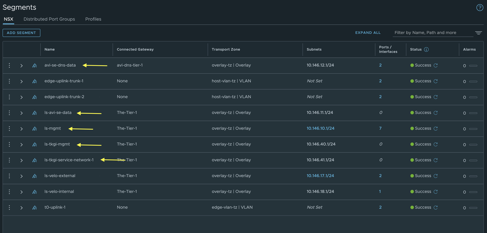
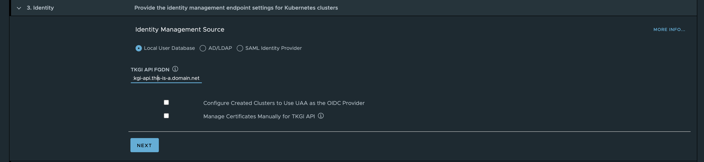

# TKGi

I realized I have not covered any posts around TKGi, so it is about high time to cover TKGi also. TKGi for me has a special place in my IT heart. Back in the days when it was called PKS I was all over the place doing a lot of PoCs and some production installations on TKGi. It was, and is, a very good Kubernetes platform very integrated with NSX. Back then NSX Advanced Loadbalancer, or Avi Networks, were not part of VMware. TKGi relied 100% on NSX-T providing both L4 and L7 loadbalancer services and it had a very tight integration with NCP (NSX Container Plugin) as the CNI for the Kubernetes clusters. Now we can also use Antrea as the CNI and we can also use NSX Advanced LoadBalancer for both Layer 4 and Layer 7 services in combination with NSX (different ways how NSX is being used, more on that later) as the underlaying network platform. So this will be an exiting post for me to go through. TKGi is very much alive and keeps going forward.

## Installing TKGi

TKGi involves several components like vSphere, vCenter, NSX, and now also NSX Advanced LoadBalancer and the actual TKGi components themselves. The actual installing of TKGi can be done a couple of ways. One way (the method I prefer) is to use the TKGi Management Console. The MC is a rather large OVA image that contains all the binaries needed to install TKGi, and provides a nice UI. More on that later. The other approach is to build TKGi by downloading all the binaries from the Ops Manager, Bosh Stemcells, TGKi, etc. But before we can deploy TKGi there is some preparations that needs to be done. A note on how NSX can be prepared for use in TKGi. NSX can be the underlaying network provider for TKGi in three ways. We can use NSX as a regular underlay, no integration with TKGi, we will create the NSX networks as for regular VM workload with segments, gateway IPs and select them to be used respectively in TKGi. The other option is to use fully automated way where TKGi creates and configures all the needed NSX network components on demand and the third option is to *Bring Your Own Topology* meaning we have created some components like Tier-0 ourselves, and TKGi will use these objects and attach its own created Tier1s and segments according to the config. I will go through  both of these two options to to show the differencem where the Antrea approach just leverage NSX as the underlaying network stack with no TKGi integration and the "BYOT" will automate many of the networking tasks. I will not show how the "fully" automated NSX network integrations works, this also configures the Tier-0 which I already have in place in my infra.  

I will be basing this post on TKGi version 1.18.0. This version supports the NSX Policy API, but is not so relevant when selecting the Antrea approach. I was not able to deploy TKGi using NSX Policy API in my lab so it to use Manager API. But the biggest difference is just how to NSX objects are being created in NSX, and for the sake of it probably some support statements that may differ. 


So this post will cover to two ways of deplying TKGI where the first is using the EPMC, BYOT with NSX-T using NSX manager API, then the Antrea approach (still using TKGiMC) with NSX-T as just a network fabric managed completely outside of TKGi. Both approaches will incorporate the use of NSX Advanced Loadbalancer for both L4 services and L7 services inside my Kubernetes clusters. In the Antrea approach I will also configure Virtual Services in NSX Advanced Loadbalancer to provide the Kubernetes APi endpoint. 

### Preparations before deploying TKGi

- A fully functioning vSphere cluster with vCenter
- NSX installed and configured with required network topology(see drawing below)
- NSX-ALB controller deployed, configured and NSX-T cloud configured. 
- Downloaded the TKGi Management Console from my.vmware.com (13GB)

Network topology 


### NSX configurations

Within NSX I have configured my Tier-0, then a Tier-1 for a couple of segments like a "management segment" and "avi-se-generic-data" for SE "generic" datanic, then a second Tier for my Avi DNS service where the DNS SE data nic will be placed. If BYOT then the T1s and segments for TKGi will be created by TKGi, for the Antrea approach, you need to manually or create the segments/Tier1s in NSX yourselves, these segments is at a minumun the management network for TKGi management components (OpsMan, Bosh) and a service network for the Kubernetes nodes. By using network profiles you can add more service networks to accommodate different networks for different Kubernetes clusters.  

Tier-0


Tier-1s


Segments




IP Pools/Blocks


### NSX-ALB configurations

In my NSX-ALB controller I have done the following configurations

Clouds:


Service Engine Group


I have created two SE groups, one for all "usecases" (se-group-generic) and one for the Avi DNS service (se-dns-group). 


Networks


Here I have defined networks for the SE data and different VIP networks. All these have been added to the IPAM template used by my NSX cloud. 
The SE data networks are only defining SE vNICS, the VIP networks are defined as only VIP networks. 

VRF Contexts


Here I have configured a static route under the global VRF for my mgmt subnet using the gateway for the the SE mgmt network as nextop. The other two VRFs has been configured with a default route using the gateway in their respective datanetworks gateway.

IPAM/DNS profiles


Then my DNS service


In system settings DNS service is configured to use my deployed DNS VS. 

I have configured my backend DNS server to forward requests to this service (10.146.100.53) for my dns sones configured in my NSX ALB DNS service.


### Deploy the TKGi Management Console (Formerly the EPMC for Enterprise PKS Management Console)

After downloading the ova, I will deploy it in my vCenter server as all other OVA deployments. I just want to point out a setting that one should be aware of and that is the docker-network. In the initial days of this EPMC installer it just took for granted that we could use the default docker network inside the EPMC appliance. But not every customer are using 192.168.0.0/16 or 10.0.0.0/16 they may use 172.16.0.0/12.. And the Docker default network is using 172.16.0.0/17. If your client network that interacts with the deployed MC appliance happens to be on this subnet also, you are unable to reach the installer as the container network will not try to route outside. 
I made the EPMC developers aware of this back then, created a guide how to override it manually by adjusting the docker network inside the appliance itself, and shortly after they added the field in the OVA for you to select your own Docker network during provisioning. 
Below is the deployment of the EPMC OVA.


Selecting my mgmt network created in NSX. 


Enter password for the root user of the epmc appliance, then leave SSH selected for troubleshooting scenarios. 


Here it is important to change the docker network to something that does not conflict with subnet your are coming from when interacting with the EPMC appliance. 

Then Next and FINISH

Sit back and wait, as soon as it is deployed power on and wat a couple more minutes. Then it is time to enter the IP address in our browser to start the TKGi installation... 

## Installing TKGi using the Management Console

Open your preferred browser and enter the given IP address.


Login with username root and the password provided in the OVA deployment process. 


I want to do a new install, so I will select INSTALL, but first I will change the theme to dark. Much nicer on my eyes. 


Here I can import an already existing config, or start creating a new one. I dont have an existing so I will do a new one selection Start Configuration


Enter my relevant vCenter info, click connect.


vCenter connected, selecting my Datacenter, then Next.

And its here we can do our topology choices. I will start with the BYOT approach, NSX-T Bring Your Own Topology.

### NSX-T Bring Your Own Topology


In this topology I will point to my existing Tier0, then my already created segment ls-tkgi-mgmt, the floating IP pool (api endpoints), ip blocks for node and pod. I deselect NAT as I want to keep the Kubernetes nodes routable. This also mean the POD network is not NAT'ed, be aware of this otherwise you may end up advertising a bunch of subnets you may not want to re-distribute. 

{}

According to the official documentation [here](https://docs.vmware.com/en/VMware-Tanzu-Kubernetes-Grid-Integrated-Edition/1.18/tkgi/GUID-nsxt-topologies.html) NO NAT should give me routable management VMs (Bosh, OpsMan etc) and routable Kubernetes Nodes, but I discovered it also gave me routable pods, so my pod cidr was exposed in my network via BGP. 
To keep this network inside NSX I had to add a route-map on my Tier-0 blocking this cidr. This only stop my POD cidr from being advertised outside NSX (Tier0) but not inside NSX. I would like to have the option to at least place the nat rules on the Tier1 for only the pod CIDR.

[Here](https://docs.vmware.com/en/VMware-Tanzu-Kubernetes-Grid-Integrated-Edition/1.18/tkgi/GUID-nsxt-topologies.html) is the topology diagrams, the Cluster Network (I assume is the pod-cidr) is following the kubernetes nodes topology.


More on that later. 

{}

Also I was not able to enable the NSX-T Policy API using the TKGI MC, it could not find any of my NSX objects created using Policy API, so I decided to continue using manager api. Maybe using Ops Man, the manual approach, will make this easier. But again, this is my lab and there may be some small config it does not like there. In other real world environments it may behave different.   


This is because it requires the T1 where I connect my tkgi-mgmt segment to be centralised, and placed on an edge cluster. That is most likely because it needs the option to create stateful objects like NAT rules.. 


After creating my new Tier1 router as active standby, selecting my edge cluster repoint my tkgi mgmt segment to the new Tier1 router it validates fine. 


### Antrea Topology


Here I will select Antrea. I will do that because I want to use NSX ALB as the loadbalancer provider and Antrea as the CNI. I know I will not get the benefit from NCP automatically creating the networks for me in NSX and some other NCP features as bridging, easy choice whether I want to NAT or no NAT etc. But this blog post is about running TKGi together with NSX, NSX ALB and Antrea. NSX will still be my main network provider in this setup as networks are easily created in NSX and I have the benefit of using the DFW for my worker nodes and the Antrea NSX Integration I have written about [here](https://blog.andreasm.io/2023/06/01/managing-antrea-in-vsphere-with-tanzu/#integrating-antrea-with-nsx-t). 

For more information on the differnet network topologies have a look [here](https://docs.vmware.com/en/VMware-Tanzu-Kubernetes-Grid-Integrated-Edition/1.18/tkgi/GUID-console-deploy-wizard.html#networking)

This first installation of TKGi can be called a foundation, that means we can have several TKGi installations with their own Ops Managers, Bosh instances etc, sharing some common components as NSX (not using same Tier0 but dedicated Tier0s pr foundation). The benefits of running multiple TKGi foundations is that we can have unique configurations done pr foundation. See more [here](https://docs.vmware.com/en/VMware-Tanzu-Kubernetes-Grid-Integrated-Edition/1.18/tkgi/GUID-nsxt-multi.html?hWord=N4IghgNiBcIGYHsCuA7AJmALgSwSkAvkA)

Now that I have selected the Topology Antrea, I will fill out the necessary network information accordingly. The Deployment Network Resource is for the TKGi management components and the Service Network Resource is for the Kubernetes Cluster nodes.


### Common settings independent of topology choice

Click next



add a name to the TKGi API endpoint.

Before I populate the next section, I have already created four resource pools in my vCenter to "simulate" 3 availability zones and one for management. 


Next

Under Resources and Storage I have enabled vSphere CSI Driver Integration. Selected my vSAN Storage for Ephemeral and permanent as it will default used if not specifying otherwise. 


Plans

Here I have only adjusted the worker nodes in the medium and large plans to have 2 cpu 8gb ram and 4 cpus and 16gb ram respectively. 


Next


I dont have any integrations


I already have a Harbor instance running.. So I disable it here. 


Generate Configuration


Now I can Apply the config, but before that I will export the config. 


Continue... Sit back and well... It will take some time. 


As soon as the OpsMgr has been deployed it is possible to monitor the deployment process further. Like when it gets to this step below, and begin to wonder if it has stopped completely. 


As soon as I logged into OpsManager I could see it was still doing a lot of things. 


Grab the password from here:


 Now after some waiting the TKGi Management Console reports a successful deployment


Now the fun starts.


## Deploy workload clusters using NSX-T BYOT (Manager API)

From the TKGI Management Console click continue and you should get to the "welcome page" for your TKGi foundation with all the details of the components installed. 


Notice that the NSX Policy API is *disabled*. I could not get the TKGi MC to use Policy API during deployment in my lab. So I decided to leave that unchecked. The biggest impact of this is that certain objects created in NSX by TKGi (NCP) will be created using Manager API. 

The plan now is to to deploy a workload cluster using the plan *Small*. but before I do that I will create a Network Profile from the TKGi MC that disables the NSX-T loadbalancer for both L4 and L7 for the Kubernetes cluster. What this means is that NSX-T loadbalancer will be used only to provide a loadbalanced API endpoint for my workload cluster control planes. But from within the workload clusters themselves (Kubernetes clusters) I will need to provide my own layer4 and layer7 provider. And guess what that will be.. Yes, the NSX Advanced LoadBalancer.  

### Create Network Profile from TKGi MC

I will go to Profiles in the TKGi MC left menu and create a new Network Profile like this:


Click *create profile*

Then I will give the profile the name *ako-provider*


Then I will expand the Container Network section, and set *Use NSX-T L4 Virtual Server For K8s LoadBalancer* to *No* and *Use NSX-T L7 Virtual Server As The Ingress Controller For K8s Cluster* to *No*


This is done as I only want NSX ALB AKO to provide L4 and L7 services from my Kubernetes Clusters. 

Scroll all the way down and click save as there are no more settings I want to adjust now. 


### Deploy workload cluster/Kubernetes cluster

I prefer the easy way to deploy the clusters, so from the TKGi MC I will head here and create a cluster:


Click create cluster:


Here I will give the cluster a name, then I will use the same cluster name also in my fqdn name. I will go with 3 Worker Nodes. Then the important step is to select my newly created ako-provider Network Profile. 
If one want to see what its in the network profile click on show more on the right side under *Network Profile Parameters* 


Then click Create and another session of waiting. 


It will now start to deploy the vms in my vCenter. Then moving them to the correct Resource Groups and network (Using the Node pool I created earlier)


After a little while (depending on fast the underlaying hardware is) it should be ready:


Now next step is to log into the newly created cluster and deploy AKO for the L4 and L7 parts inside that cluster

{}

As I did deploy this cluster using NSX Manager API, the only way of configuring the Cloud in the NSX Advanced Loadbalancer is vCenter Cloud. According to the offical documentation found [here](https://docs.vmware.com/en/VMware-NSX-Advanced-Load-Balancer/1.11/Avi-Kubernetes-Operator-Guide/GUID-2778C485-E48F-4C5E-8EC7-CB96F6CA5CBB.html#cloud-configuration-5). I will use a NSX Cloud anyway, so consider this a non-supported approach. I will not use the NCP/TKGi created Segments using Manager API for any of the Avi components, I have created my own T1 and segments for my Avi cloud using Policy API. So this would be interesting to explorer further. But with TKGi in Policy mode it is supported. 
In the link above one of the concerns is that SEs needs to traverse the Tier-0 to reach the backends. But this will be the case even if using policy api as the T1s created by TKGi/NCP will be created as centralized tier1s and will be handled by the NSX Edges, so I am not so sure how this can be done differently. 

{}

### NSX objects created by the manager API

Now that my first Kubernetes cluster is up and running, lets have a look inside NSX and see what is has created. For that I need to switch my NSX UI into Manager


Then I will first have a look at the Tier 1


Then the segments:


This one is interesting. If you are used to any other CNIs than NCP you will notice here that all the Kubernetes Namespaces created in your Kubernetes clusters reflects a NSX segment. Example the segment *pks-0b7d0725-c67b-4e14-b6d0-52f799cb3556-kube-system*, contains all the pods as logical ports in that namespace. A nice feature of NCP. This is really useful in strict IPAM cases, isolation and maintaning control of any pod in the Kubernetes clusters. All Logical ports are enforced by the NSX Distributed Firewall also.

 NAT rules:


Here is a bunch of SNAT rules translating all the pod cidrs in use to ip addresses from the Floating IP pool. 

Distributed Firewall rules


These are the major objects being created in manager mode in NSX by NCP. 


Speaking of loadbalancing, lets get some loadbalancing done from the Kubernetes cluster I just created. Isnt this post about TKGi and NSX Advanced Loadbalancer? ... :smile:


### Configure NSX Advanced Loadbalancer as Layer 4 and Layer 7 provider inside workload clusters. 

I have already configured my NSX Advanced Loadbalancer using a NSX cloud, configured a Tier1 for both generic SE data and my DNS SEs using the policy API. But again according to the official documentation [here](https://docs.vmware.com/en/VMware-NSX-Advanced-Load-Balancer/1.11/Avi-Kubernetes-Operator-Guide/GUID-2778C485-E48F-4C5E-8EC7-CB96F6CA5CBB.html#cloud-configuration-5) this is not supported. But as I will not be putting any of my SEs on the segments created by TKGi, and I am doing a BYOT installation where I have created some NSX objects myself) I dont feel this should be an issue. What this approach will do though is forcing SE traffic to reach the backend (Kubernetes nodes on the NCP created segments using manager API) via the T0. This could potentially reduce performance, as the T1s may be centralized. If the T1 for the SEs are distributed they will just use the DR T0, not via the Edges. Another statement from the official documentation around this scenario where the SE datanics needs to traverse the T0 to reach the backends [here](https://avinetworks.com/docs/22.1/nsx-t-design-guide/#pool-configuration):

> For a given virtual service, the logical segment of the pool servers and the logical segment of the VIP must belong to the same tier-1 router. If the VIP and the pool are connected to different tier-1, the traffic may pass through the tier-0 and hence through the NSX-T edge (depending on the NSX-T services configured by admin). This reduces the data path performance and hence must be avoided.

So, lets see how the traffic goes when all this is up and running. 

 First I need to grab the config for my Kubernetes cluster so I can interact with it. I will just grab the config from the TKGI MC here:


This assumes we have configured a DNS record for the FQDN I entered when I created the cluster. Have I done that, yes of course. 

Now I will just paste this in my linux machine where I have kubectl installed. 

```bash
andreasm@ubuntu02:~/tkgi/cluster-1$ kubectl config set-cluster tkgi-cluster-1 --server=https://tkgi-cluster-1.this-is-a.domain.net:8443 && \
kubectl config set clusters.tkgi-cluster-1.certificate-authority-data Ci0tLS0tQkVHSU4gQ0VSVElGSUNBVEUtLS0tLQpNSUlET3pDQ0FpT2dBd0lCQWdJVU9EQXNVemVuRk1JYVBhajhoZWpOZ21FL2JXOHdEUVlKS29aSWh2Y05BUUVMCkJRQXdMVEVMTUFrR0ExVUVBeE1DUTBFeERUQUxCZ05WQkFzVEJGUkxSMGt4RHpBTkJnTlZCQW9UQmxaTmQyRnkKWlRBZUZ3MHlNekV4TWpjd09ETTVORFJhRncweU56RXhNamN3T0RNNU5EUmFNQzB4Q3pBSkJnTlZCQU1UQWtOQgpNUTB3Q3dZRFZRUUxFd1JVUzBkSk1ROHdEUVlEVlFRS0V3WldUWGRoY21Vd2dnRWlNQTBHQ1NxR1NJYjNEUUVCCkFRVUFBNElCRHdBd2dnRUtBb0lCQVFEaURlVTBaOXF3MVFDblltNDRUNnFmOWJDeVA5YXJPd2ltZjFaL09paVoKRFhDYzhMT214YTRWbHh1NXB0OGVzMEt5QmdLd1hjMEVnVDl2NmluV083RWpsZmNHYy9ySThPdjFkOEFuT0tzWQpiRXUzQlo5VS9KOGZNNnpGV3M5bGdzZVBsOURldEFLWXZpcFgzV28yVHpkbjhOVnU5NlJKTmNNdTlNVGNZU05DCjNUbUpVMWdFOVRVak45TXpyRWpsNVo3RkFaMVZnMXl3ZmpCU3h4WlpJcUN6UDFhaWw3OFZBR2VHLzhoN3VXUVIKd0oyTFM5Vm90bTlGQ0FFMlN1ZzUzQVEyUzNPalNBMExNWVI2d0dBeGk0a0xhcld3TjU1d2owcm9zWnBKREJzcQo4OURHYkI5YjdNaHZYcWhMQ3dOT2NiUFppVFFCUkJUZnVOZTRFQjhvTFZxcEFnTUJBQUdqVXpCUk1CMEdBMVVkCkRnUVdCQlFLVEV0d3ZVZEdRMVAzU01aNWtCV0xOcTJWOWpBZkJnTlZIU01FR0RBV2dCUUtURXR3dlVkR1ExUDMKU01aNWtCV0xOcTJWOWpBUEJnTlZIUk1CQWY4RUJUQURBUUgvTUEwR0NTcUdTSWIzRFFFQkN3VUFBNElCQVFCNQpoT3Q3aW5GZy94Vkg5d0prY3M0QVlNQnJpT2tabkl5RHBzQWl0MmJqMkNlUzdEMHdlNE5saWUrNmxzdFhHQ1B4ClU5YmFRTld0a3EwWERxNEhKT0hJd0lXUTE1V2N0ZFZmYks4SFo2QWtZN2QvTWNaTEJUeEZPc2JtSVJnRTZMVW4Kc1BBMHcyRkloMWk5TFkrVE5lV2l2K1YrZi9kZmpVaWh4citzZFRkOHhUSmdxZldjSUl2TmVpcitNZmg2YW1IcgpUVDhDK1dRSm5xc29SMjBLdTU4VGNPbzFsQmYyUjNKZUNJeXIwZExpSnJZV2RZckxteHpORU4xRndjVU9MMHAyCnI4dXl5RkZqYWUyNXp0VFFIR09YU3lzV2xSSHJ2MmdqSW03MlFGZnVUdGhzOVpKRGtYSFhKdnBYcEdoelhqZVgKLzQwVnhzR3Qwd3dwa2c2b2dqUTkKLS0tLS1FTkQgQ0VSVElGSUNBVEUtLS0tLQo= && \
kubectl config set-credentials c3905e0f-b588-40d9-973f-fba55b6dd6a0 --token=eyJhbGciOiJSUzI1NiIsImtpZCI6IlJNWU5pdFdwV3RZUDE2dk9RSHFkQ3p3VnFZV0ttTFJPYllMYmMyM1BkQzAifQ.eyJpc3MiOiJrdWJlcm5ldGVzL3NlcnZpY2VhY2NvdW50Iiwia3ViZXJuZXRlcy5pby9zZXJ2aWNlYWNjb3VudC9uYW1lc3BhY2UiOiJkZWZhdWx0Iiwia3ViZXJuZXRlcy5pby9zZXJ2aWNlYWNjb3VudC9zZWNyZXQubmFtZSI6ImMzOTA1ZTBmLWI1ODgtNDBkOS05NzNmLWZiYTU1YjZkZDZhMCIsImt1YmVybmV0ZXMuaW8vc2VydmljZWFjY291bnQvc2VydmljZS1hY2NvdW50Lm5hbWUiOiJjMzkwNWUwZi1iNTg4LTQwZDktOTczZi1mYmE1NWI2ZGQ2YTAiLCJrdWJlcm5ldGVzLmlvL3NlcnZpY2VhY2NvdW50L3NlcnZpY2UtYWNjb3VudC51aWQiOiI2YzIxNDRmNi1iNTRjLTQ4NmItOTU3NS0yNDk4YTQ5YzZjZmIiLCJzdWIiOiJzeXN0ZW06c2VydmljZWFjY291bnQ6ZGVmYXVsdDpjMzkwNWUwZi1iNTg4LTQwZDktOTczZi1mYmE1NWI2ZGQ2YTAifQ.K9qjIqBUMlwag_-XCK9kbiGjdXflKSRLmOol2AvWlu3HV5yEOAdh7B4-CrTDsk-RA1ajBqUerc8IngbyaWELN2APTKoe2gQoVqvszw4sBqL_VnmNGL9zBl1AyEB8EuUSY17W3XGTWjVRaDskqOkyB36vx3nksnM07du7tRa6evQlvAqPQFuWaX-d7yeTTRRurxzhycPL_AdKFry7V8XSFxvLFaAK93EvWsKQbknxmq7YT4HM7HbGnBzBceUz2ZCjQ_ilMpup-Rxvu1y7Fgf4-dx09PVQXT_SqSaqfSN2sxesNZOFESW-EFEgXytDO4VNQjKVgEv0SBHNwzhhAl8wNw && \
kubectl config set-context tkgi-cluster-1 --cluster=tkgi-cluster-1 --user=c3905e0f-b588-40d9-973f-fba55b6dd6a0 && \
kubectl config use-context tkgi-cluster-1
Cluster "tkgi-cluster-1" set.
Property "clusters.tkgi-cluster-1.certificate-authority-data" set.
User "c3905e0f-b588-40d9-973f-fba55b6dd6a0" set.
Context "tkgi-cluster-1" created.
Switched to context "tkgi-cluster-1".
```

Lets test connectivity

```bash
andreasm@ubuntu02:~/tkgi/cluster-1-nsx-manager-api$ k get nodes
NAME                                   STATUS   ROLES    AGE     VERSION
a0e22550-80fe-40d8-9b0f-0dcb2d92c58a   Ready    <none>   4h16m   v1.27.5+vmware.1
bc69d2aa-4ddc-41b8-8ede-b8a94929496b   Ready    <none>   4h12m   v1.27.5+vmware.1
d90a5da4-343a-4040-bef3-1f2f148159e0   Ready    <none>   4h9m    v1.27.5+vmware.1
```

There are my worker nodes. You have to wonder where the control plane nodes is.. Well a quick question to my friend Robert Guske the simple explanation is that the kubelet is not running on the control plane nodes in TKGi. To view the control plane nodes we need to use bosh. See [here](https://docs.vmware.com/en/VMware-Tanzu-Kubernetes-Grid-Integrated-Edition/1.18/tkgi/GUID-verify-health.html).


Now I just need to deploy AKO and create some test applications. But before I do that I will need to check if there are any ingress or loadbalancer classes available in my cluster.

```bash
andreasm@ubuntu02:~/tkgi/cluster-1-nsx-manager-api$ k get ingressclasses.networking.k8s.io
No resources found


## There is no loadbalancerclass crd available...

```

Now I will grab the values for AKO

```bash
andreasm@ubuntu02:~/tkgi/cluster-1-nsx-manager-api$  helm show values oci://projects.registry.vmware.com/ako/helm-charts/ako --version 1.10.3 > values.yaml
```

Then I will edit the values.yaml according to my environment:

```yaml
# Default values for ako.
# This is a YAML-formatted file.
# Declare variables to be passed into your templates.

replicaCount: 1

image:
  repository: projects.registry.vmware.com/ako/ako
  pullPolicy: IfNotPresent

### This section outlines the generic AKO settings
AKOSettings:
  primaryInstance: true # Defines AKO instance is primary or not. Value `true` indicates that AKO instance is primary. In a multiple AKO deployment in a cluster, only one AKO instance should be primary. Default value: true.
  enableEvents: 'true' # Enables/disables Event broadcasting via AKO
  logLevel: WARN   # enum: INFO|DEBUG|WARN|ERROR
  fullSyncFrequency: '1800' # This frequency controls how often AKO polls the Avi controller to update itself with cloud configurations.
  apiServerPort: 8080 # Internal port for AKO's API server for the liveness probe of the AKO pod default=8080
  deleteConfig: 'false' # Has to be set to true in configmap if user wants to delete AKO created objects from AVI
  disableStaticRouteSync: 'false' # If the POD networks are reachable from the Avi SE, set this knob to true.
  clusterName: tkgi-cluster-1   # A unique identifier for the kubernetes cluster, that helps distinguish the objects for this cluster in the avi controller. // MUST-EDIT
  cniPlugin: 'ncp' # Set the string if your CNI is calico or openshift or ovn-kubernetes. For Cilium CNI, set the string as cilium only when using Cluster Scope mode for IPAM and leave it empty if using Kubernetes Host Scope mode for IPAM. enum: calico|canal|flannel|openshift|antrea|ncp|ovn-kubernetes|cilium
  enableEVH: false # This enables the Enhanced Virtual Hosting Model in Avi Controller for the Virtual Services
  layer7Only: false # If this flag is switched on, then AKO will only do layer 7 loadbalancing.
  # NamespaceSelector contains label key and value used for namespacemigration
  # Same label has to be present on namespace/s which needs migration/sync to AKO
  namespaceSelector:
    labelKey: ''
    labelValue: ''
  servicesAPI: false # Flag that enables AKO in services API mode: https://kubernetes-sigs.github.io/service-apis/. Currently implemented only for L4. This flag uses the upstream GA APIs which are not backward compatible
                     # with the advancedL4 APIs which uses a fork and a version of v1alpha1pre1
  vipPerNamespace: 'false' # Enabling this flag would tell AKO to create Parent VS per Namespace in EVH mode
  istioEnabled: false # This flag needs to be enabled when AKO is be to brought up in an Istio environment
  # This is the list of system namespaces from which AKO will not listen any Kubernetes or Openshift object event.
  blockedNamespaceList: []
  # blockedNamespaceList:
  #   - kube-system
  #   - kube-public
  ipFamily: '' # This flag can take values V4 or V6 (default V4). This is for the backend pools to use ipv6 or ipv4. For frontside VS, use v6cidr
  useDefaultSecretsOnly: 'false' # If this flag is set to true, AKO will only handle default secrets from the namespace where AKO is installed.
                                 # This flag is applicable only to Openshift clusters.

### This section outlines the network settings for virtualservices.
NetworkSettings:
  ## This list of network and cidrs are used in pool placement network for vcenter cloud.
  ## Node Network details are not needed when in nodeport mode / static routes are disabled / non vcenter clouds.
  ## Either networkName or networkUUID should be specified.
  ## If duplicate networks are present for the network name, networkUUID should be used for appropriate network.
  nodeNetworkList:
    - networkName: "pks-0b7d0725-c67b-4e14-b6d0-52f799cb3556"
      cidrs:
        - 10.146.42.0/24
  #       - 11.0.0.1/24
  enableRHI: false # This is a cluster wide setting for BGP peering.
  nsxtT1LR: '/infra/tier-1s/The-Tier-1' # T1 Logical Segment mapping for backend network. Only applies to NSX-T cloud.
  bgpPeerLabels: [] # Select BGP peers using bgpPeerLabels, for selective VsVip advertisement.
  # bgpPeerLabels:
  #   - peer1
  #   - peer2

  # Network information of the VIP network. Multiple networks allowed only for AWS Cloud.
  # Either networkName or networkUUID should be specified.
  # If duplicate networks are present for the network name, networkUUID should be used for appropriate network.
  vipNetworkList:
   - networkName: vip-l4-incluster-tkgi
     cidr: 10.146.102.0/24
  #    v6cidr: 2002::1234:abcd:ffff:c0a8:101/64 # Setting this will enable the VS networks to use ipv6

### This section outlines all the knobs  used to control Layer 7 loadbalancing settings in AKO.
L7Settings:
  defaultIngController: 'true'
  noPGForSNI: false # Switching this knob to true, will get rid of poolgroups from SNI VSes. Do not use this flag, if you don't want http caching. This will be deprecated once the controller support caching on PGs.
  serviceType: ClusterIP # enum NodePort|ClusterIP|NodePortLocal
  shardVSSize: SMALL   # Use this to control the layer 7 VS numbers. This applies to both secure/insecure VSes but does not apply for passthrough. ENUMs: LARGE, MEDIUM, SMALL, DEDICATED
  passthroughShardSize: SMALL   # Control the passthrough virtualservice numbers using this ENUM. ENUMs: LARGE, MEDIUM, SMALL
  enableMCI: 'false' # Enabling this flag would tell AKO to start processing multi-cluster ingress objects.

### This section outlines all the knobs  used to control Layer 4 loadbalancing settings in AKO.
L4Settings:
  defaultDomain: '' # If multiple sub-domains are configured in the cloud, use this knob to set the default sub-domain to use for L4 VSes.
  autoFQDN: default   # ENUM: default(<svc>.<ns>.<subdomain>), flat (<svc>-<ns>.<subdomain>), "disabled" If the value is disabled then the FQDN generation is disabled.

### This section outlines settings on the Avi controller that affects AKO's functionality.
ControllerSettings:
  serviceEngineGroupName: se-group-generic   # Name of the ServiceEngine Group.
  controllerVersion: '22.1.4' # The controller API version
  cloudName: nsx-t-lhr   # The configured cloud name on the Avi controller.
  controllerHost: '172.60.146.50' # IP address or Hostname of Avi Controller
  tenantName: admin   # Name of the tenant where all the AKO objects will be created in AVI.

nodePortSelector: # Only applicable if serviceType is NodePort
  key: ''
  value: ''

resources:
  limits:
    cpu: 350m
    memory: 400Mi
  requests:
    cpu: 200m
    memory: 300Mi

securityContext: {}

podSecurityContext: {}

rbac:
  # Creates the pod security policy if set to true
  pspEnable: false


avicredentials:
  username: ''
  password: ''
  authtoken:
  certificateAuthorityData:


persistentVolumeClaim: ''
mountPath: /log
logFile: avi.log
```

Now when I am done editing the values file its time to deploy AKO.

```yaml
andreasm@ubuntu02:~/tkgi/cluster-1-nsx-manager-api$ helm install --generate-name oci://projects.registry.vmware.com/ako/helm-charts/ako --version 1.10.3 -f ako-values.1.10.3.yaml --namespace avi-system
Pulled: projects.registry.vmware.com/ako/helm-charts/ako:1.10.3
Digest: sha256:1f2f9b89f4166737ed0d0acf4ebfb5853fb6f67b08ca1c8dae48e1dd99d31ab6
NAME: ako-1701092267
LAST DEPLOYED: Mon Nov 27 13:37:48 2023
NAMESPACE: avi-system
STATUS: deployed
REVISION: 1
TEST SUITE: None
```


Its up and running and no errors in the logs. So far so good

```bash
andreasm@ubuntu02:~/tkgi/cluster-1-nsx-manager-api$ k get pods -n avi-system
NAME    READY   STATUS    RESTARTS   AGE
ako-0   1/1     Running   0          81s

andreasm@ubuntu02:~/tkgi/cluster-1-nsx-manager-api$ k logs -n avi-system ako-0
2023-11-27T13:38:04.192Z	INFO	api/api.go:52	Setting route for GET /api/status
2023-11-27T13:38:04.193Z	INFO	ako-main/main.go:72	AKO is running with version: v1.10.3
2023-11-27T13:38:04.193Z	INFO	ako-main/main.go:82	We are running inside kubernetes cluster. Won't use kubeconfig files.
2023-11-27T13:38:04.193Z	INFO	api/api.go:110	Starting API server at :8080
2023-11-27T13:38:04.278Z	INFO	ako-main/main.go:157	Kubernetes cluster apiserver version 1.27
2023-11-27T13:38:04.285Z	INFO	utils/utils.go:168	Initializing configmap informer in avi-system
2023-11-27T13:38:04.285Z	INFO	lib/dynamic_client.go:137	Skipped initializing dynamic informers for cniPlugin ncp
2023-11-27T13:38:05.660Z	INFO	utils/avi_rest_utils.go:116	Overwriting the controller version 22.1.4 to max Avi version 22.1.3
2023-11-27T13:38:05.660Z	INFO	utils/avi_rest_utils.go:119	Setting the client version to the current controller version 22.1.3
2023-11-27T13:38:06.849Z	INFO	cache/controller_obj_cache.go:2345	Avi cluster state is CLUSTER_UP_NO_HA
2023-11-27T13:38:07.019Z	INFO	cache/controller_obj_cache.go:3116	Setting cloud vType: CLOUD_NSXT
2023-11-27T13:38:07.019Z	INFO	cache/controller_obj_cache.go:3119	Setting cloud uuid: cloud-b739e6b0-f0c8-4259-b36b-450d227c633c
2023-11-27T13:38:07.019Z	INFO	lib/lib.go:291	Setting AKOUser: ako-tkgi-cluster-1 for Avi Objects
2023-11-27T13:38:07.019Z	INFO	cache/controller_obj_cache.go:2855	Skipping the check for SE group labels
2023-11-27T13:38:07.019Z	INFO	cache/controller_obj_cache.go:3395	Skipping the check for Node Network
2023-11-27T13:38:07.134Z	INFO	cache/controller_obj_cache.go:3526	Setting VRF The-Tier-1 found from network vip-l4-incluster-tkgi
2023-11-27T13:38:07.135Z	INFO	record/event.go:282	Event(v1.ObjectReference{Kind:"Pod", Namespace:"avi-system", Name:"ako-0", UID:"e0a321af-42c9-49cb-a3b5-cba17cf41805", APIVersion:"v1", ResourceVersion:"65342", FieldPath:""}): type: 'Normal' reason: 'ValidatedUserInput' User input validation completed.
2023-11-27T13:38:07.139Z	INFO	lib/lib.go:230	Setting Disable Sync to: false
2023-11-27T13:38:07.143Z	INFO	k8s/ako_init.go:271	avi k8s configmap created
2023-11-27T13:38:08.007Z	WARN	rest/dequeue_nodes.go:65	key: admin/DummyVSForStaleData, msg: no model found for the key
```

Do I have an Ingressclass now?

```bash
andreasm@ubuntu02:~/tkgi/examples$ k get ingressclasses.networking.k8s.io
NAME     CONTROLLER              PARAMETERS   AGE
avi-lb   ako.vmware.com/avi-lb   <none>       13m
```

Yes I do :smile:


Time to deploy some test applications, first out my favourite demo app, *Yelb*.

This just need a servicetype loadbalancer.

Backend

```bash
andreasm@ubuntu02:~/tkgi/examples$ k apply -f yelb-lb-backend.yaml
service/redis-server created
service/yelb-db created
service/yelb-appserver created
deployment.apps/redis-server created
deployment.apps/yelb-db created
deployment.apps/yelb-appserver created
andreasm@ubuntu02:~/tkgi/examples$ k get pods -n yelb
NAME                             READY   STATUS              RESTARTS   AGE
redis-server-6cf478df95-vf7t8    0/1     ContainerCreating   0          5s
yelb-appserver-bf75dbb5b-g6bmf   0/1     ContainerCreating   0          5s
yelb-db-d4c64d9c-687sb           0/1     ContainerCreating   0          5s
```

Frontend,  where the request for a loadbalancer comes from. 

```bash
andreasm@ubuntu02:~/tkgi/examples$ k apply -f yelb-lb-frontend.yaml
service/yelb-ui created
deployment.apps/yelb-ui created

andreasm@ubuntu02:~/tkgi/examples$ k get svc -n yelb
NAME             TYPE           CLUSTER-IP       EXTERNAL-IP      PORT(S)        AGE
redis-server     ClusterIP      10.100.200.110   <none>           6379/TCP       8m46s
yelb-appserver   ClusterIP      10.100.200.170   <none>           4567/TCP       8m46s
yelb-db          ClusterIP      10.100.200.84    <none>           5432/TCP       8m46s
yelb-ui          LoadBalancer   10.100.200.123   10.146.102.100   80:30400/TCP   31s
```

There it is.. 

Now what happens in the NSX ALB ui?


In vCenter the first SE has been deployed.


And the Service is UP


Can I access it?


Let me just use the automatically dns record created by the AKO integration with NSX ALB DNS service. 
This means I have enabled the DNS service in NSX ALB to auto create DNS records for me whenever I create servicetype Loabalancer or Ingress objects. So I dont have to think about that.

In this case the FQDN of my yelb ui service is *yelb-ui-yelb.this-is-a.domain.net*


I will grab the ip of the service and do a curl

```bash
andreasm@ubuntu02:~/tkgi/examples$ curl yelb-ui-yelb.this-is-a.domain.net
<!doctype html>
<html>
<head>
    <meta charset="utf-8">
    <title>Yelb</title>
    <base href="/">
    <meta name="viewport" content="width=device-width, initial-scale=1">
    <link rel="icon" type="image/x-icon" href="favicon.ico?v=2">
</head>
<body>
<yelb>Loading...</yelb>
<script type="text/javascript" src="inline.bundle.js"></script><script type="text/javascript" src="styles.bundle.js"></script><script type="text/javascript" src="scripts.bundle.js"></script><script type="text/javascript" src="vendor.bundle.js"></script><script type="text/javascript" src="main.bundle.js"></script></body>
</html>
```

Nice


Now lets test the Ingress.

I will deploy two pods with corresponding ClusterIP services that has one purpose in life and that is displaying apple and banana respectively. Then I will deploy an Ingress pointing to these two services. 

```bash
andreasm@ubuntu02:~/tkgi/examples$ k apply -f apple.yaml -f banana.yaml
pod/apple-app created
service/apple-service created
pod/banana-app created
service/banana-service created
andreasm@ubuntu02:~/tkgi/examples$ k get svc -n fruit
NAME             TYPE        CLUSTER-IP       EXTERNAL-IP   PORT(S)    AGE
apple-service    ClusterIP   10.100.200.33    <none>        5678/TCP   26s
banana-service   ClusterIP   10.100.200.231   <none>        5678/TCP   26s

andreasm@ubuntu02:~/tkgi/examples$ k apply -f ingress-example-generic.yaml
ingress.networking.k8s.io/ingress-example created
andreasm@ubuntu02:~/tkgi/examples$ k get ingress -n fruit
NAME              CLASS    HOSTS                             ADDRESS          PORTS   AGE
ingress-example   avi-lb   fruit-tkgi.this-is-a.domain.net   10.146.102.101   80      7s
```

And in my NSX ALB UI


Now can I reach it? Lets test using the FQDN:

```bash
andreasm@ubuntu02:~/tkgi/examples$ curl fruit-tkgi.this-is-a.domain.net/apple
apple
andreasm@ubuntu02:~/tkgi/examples$ curl fruit-tkgi.this-is-a.domain.net/banana
banana
```

Works like a charm...


Now back to my notice above about doing this in an unsupported way and placing the SEs on different T1s (which I cant understand how is possible to do anyway). By just doing a traceflow from one of the SEs data nic to the worker nodes of my Kubernetes cluster, it will involve the Edge cluster as the destination T1 is centralised (being active/passive and placed on an Edge cluster). But when using products like TKGi, TKGs the auto created Tier1 routers tend to be created as centralized routers, so we will alway have this issue when traffic is going through the Tier-0/Edges. 


A quick diagram of how this topology looks like networking wise:


Here my Tier1 routers for the PKS segments will be created by TKGi and I cant configre Avi to use somehting that does not exist. 

Well, it was a nice test. It worked.. Let me tear it all down and go ahead with an installation using Antrea as the CNI. 


## Deploy workload clusters using Antrea

In this approach there will be no automatic assignement of a L4 loadbalancer for the Kubernetes API endpoints, that is something I need to manually provide myself, and I will be using NSX ALB for that purpose also. 

Here is my TKGi installation for this section:


First I will need to create a Kubernetes cluster. I will not use the TKGi MC to deploy the cluster now, I will use the TKGi CLI to to that, just to make it a bit more interesting. I still have the option to use TKGi MC, but I have already used that approach above.  More info on TKGi CLI [here](https://docs.vmware.com/en/VMware-Tanzu-Kubernetes-Grid-Integrated-Edition/1.18/tkgi/GUID-cli-index.html)

Login to the TKGi API

```bash
andreasm@ubuntu02:~/tkgi$ tkgi login -a tkgi-api.this-is-a.domain.net -u admin -p 'password' --ca-cert ca/tkgi-ca.crt

API Endpoint: tkgi-api.this-is-a.domain.net
User: admin
Login successful.
```

All the relevant information can be found in the TKGi MC Deployment Metadata page.


Now its just all about creating the same cluster as I did in TKGi MC just using cli instead. There is no need to create any network profiles this time as there is no NSX-T that provides any loadbalancer functionality. It is a "vanilla" Kubernetes cluster with Antrea as the CNI, so I will need to add the services I need. I will start by listing the plans available. I will go with the medium plan, deploy 3 control plane nodes and 3 worker nodes. The reason for three control plane nodes is because I would like to utilize the Avi LB for the the Kubernetes API endpoint and the it is much more interesting to have more than 1 cp node as the loadbalancer should have something to loadbalance. The purpose of a loadbalancer....

```bash
andreasm@ubuntu02:~/tkgi/cluster-1-antrea$ tkgi network-profiles

Name  Description
# No profiles as its not needed

andreasm@ubuntu02:~/tkgi/cluster-1-antrea$ tkgi plans

Name    ID                                    Description
Small   8A0E21A8-8072-4D80-B365-D1F502085560  This plan will configure a lightweight Kubernetes cluster. Not recommended for production workloads.
Medium  58375a45-17f7-4291-acf1-455bfdc8e371  Example: This plan will configure a medium sized Kubernetes cluster, suitable for more pods.
Large   241118e5-69b2-4ef9-b47f-4d2ab071aff5  Example: This plan will configure a large Kubernetes cluster for resource heavy workloads, or a high number of workloads.

```

Now, lets create a cluster

```bash
andreasm@ubuntu02:~/tkgi/cluster-1-antrea$ tkgi create-cluster tkgi-cluster-1-antrea --external-hostname tkgi-cluster-1-antrea.this-is-a.domain.net --plan Medium --num-nodes 3

PKS Version:              1.18.0-build.46
Name:                     tkgi-cluster-1-antrea
K8s Version:              1.27.5
Plan Name:                Medium
UUID:                     518d850c-ca34-4163-85cb-dda5d915abda
Last Action:              CREATE
Last Action State:        in progress
Last Action Description:  Creating cluster
Kubernetes Master Host:   tkgi-cluster-1-antrea.this-is-a.domain.net
Kubernetes Master Port:   8443
Worker Nodes:             3
Kubernetes Master IP(s):  In Progress
Network Profile Name:
Kubernetes Profile Name:
Compute Profile Name:
NSX Policy:               false
Tags:

Use 'tkgi cluster tkgi-cluster-1-antrea' to monitor the state of your cluster
```

In vCenter I can see that TKGi has been so kind to spread my Kubernetes cluster across all three availability zones:


And in my TKGi MC:


After a while it is ready:

```bash
andreasm@ubuntu02:~/tkgi/cluster-1-antrea$ tkgi clusters

PKS Version      Name                   k8s Version  Plan Name  UUID                                  Status     Action
1.18.0-build.46  tkgi-cluster-1-antrea  1.27.5       Medium     518d850c-ca34-4163-85cb-dda5d915abda  succeeded  CREATE

andreasm@ubuntu02:~/tkgi/cluster-1-antrea$ tkgi cluster tkgi-cluster-1-antrea

PKS Version:              1.18.0-build.46
Name:                     tkgi-cluster-1-antrea
K8s Version:              1.27.5
Plan Name:                Medium
UUID:                     518d850c-ca34-4163-85cb-dda5d915abda
Last Action:              CREATE
Last Action State:        succeeded
Last Action Description:  Instance provisioning completed
Kubernetes Master Host:   tkgi-cluster-1-antrea.this-is-a.domain.net
Kubernetes Master Port:   8443
Worker Nodes:             3
Kubernetes Master IP(s):  10.146.41.4, 10.146.41.2, 10.146.41.3
Network Profile Name:
Kubernetes Profile Name:
Compute Profile Name:
NSX Policy:               false
Tags:
```


In TKGiMC


Now as I can see from the output above, I can reach my cluster using any of my 3 control plane nodes. I would like to reach them using one singe entry, and with the real external name. I will now go ahead and create the Virtual Service in NSX Advanced Loadbalancer.

### Configure NSX Advanced Loadbalancer as Kuberntes API endpoint provider

In NSX ALB, go to Virtual Services and create a new Virtual Sevice, and select advanced.


Then I will configure my Virtual Service accordingly below:


The Virtual Service Settings:


The pool containing my Control Plane nodes (notice the control plane nodes dont use the defaul Kubernetes 6443 port, it is using 8443):


Then it is the VS VIP. Here I will also add a FQDN/DNS entry called tkgi-cluster-1-antrea.this-is-a.domain.net


Last step I just select the SE group I want to use.


Finish. 

And my Virtual Service should now be green and I can use this entrypoint to reach my newly created Kubernetes Cluster.


The FQDN/DNS record is being automatically created by the Avi DNS service. So I should be able to use DNS instead of ip:

```bash
andreasm@ubuntu02:~/tkgi/cluster-1-antrea$ ping tkgi-cluster-1-antrea.this-is-a.domain.net
PING tkgi-cluster-1-antrea.this-is-a.domain.net (10.146.101.10) 56(84) bytes of data.
64 bytes from 10.146.101.10 (10.146.101.10): icmp_seq=1 ttl=63 time=0.562 ms
64 bytes from 10.146.101.10 (10.146.101.10): icmp_seq=2 ttl=63 time=0.602 ms
```

Getting the Kubernetes context and logging in:


```bash
andreasm@ubuntu02:~/tkgi/cluster-1-antrea$ kubectl config set-cluster tkgi-cluster-1-antrea --server=https://tkgi-cluster-1-antrea.this-is-a.domain.net:8443 && \
kubectl config set clusters.tkgi-cluster-1-antrea.certificate-authority-data Ci0tLS0tQkVHSU4gQ0VSVElGSUNBVEUtLS0tLQpNSUlET3pDQ0FpT2dBd0lCQWdJVVlGdDNxVFJLYXQ5T3hxOS9kYzdzbkNnSXRMa3dEUVlKS29aSWh2Y05BUUVMCkJRQXdMVEVMTUFrR0ExVUVBeE1DUTBFeERUQUxCZ05WQkFzVEJGUkxSMGt4RHpBTkJnTlZCQW9UQmxaTmQyRnkKWlRBZUZ3MHlNekV5TURFd09URXpNREZhRncweU56RXlNREV3T1RFek1ERmFNQzB4Q3pBSkJnTlZCQU1UQWtOQgpNUTB3Q3dZRFZRUUxFd1JVUzBkSk1ROHdEUVlEVlFRS0V3WldUWGRoY21Vd2dnRWlNQTBHQ1NxR1NJYjNEUUVCCkFRVUFBNElCRHdBd2dnRUtBb0lCQVFDNS9lcDdFLzFQOXJPanpxNlNJVkRaN2dDTEJ0L21GZW5oQVNNQUM0WUEKUUVmUnlzWlloZUhxRkZxVENEcEpRZzFuUDFmZzNEdDhhVWNpaGR6VEEremJvS0R6WStjWk9EVy9yM1YvR2Y1bwpIdHd2SDIrWkEyT1lydlVrOGExVUwvb1hKNHdlWFBsWUdndWJoeXcrSU44WUdGdEVQQnlmaTQrSEFQdDFveWlTCnN5VUF1bHFiOUwyU29xQ3Zmc3cwY2cyN0l5RktvN1FUSmFiTnd1MXdQbnhnWCtwa2M4dTdsSnZucWJnMm1OeUYKYVpxZGRqMHN1YmplSG9VN0Z3b3U5ZHN4SVVCYlZSbWxQVkc1S1JSN3pVdWNSTjdLKzYyS1p2ZWMwRGNsaW13SApONEhqUFJSczN4OEpVRXFEajU5MWcrT0NUTnFqK0pIVm9sQnFJbi9RcUlOVkFnTUJBQUdqVXpCUk1CMEdBMVVkCkRnUVdCQlRUMVRleVlMcGtaRzZnZGxXU05pVXlIaURUeURBZkJnTlZIU01FR0RBV2dCVFQxVGV5WUxwa1pHNmcKZGxXU05pVXlIaURUeURBUEJnTlZIUk1CQWY4RUJUQURBUUgvTUEwR0NTcUdTSWIzRFFFQkN3VUFBNElCQVFBdApqY09iOFFjUmxWM2h6YXc2R2YzdnpxeFRXYXl4b1NiK1ZFSCtUTEFuZERRaVZQMjR2OS9uektYVUl5M0pPQnlQCnVmNnJJQ2Viekt6WUtDNC9hb2JpRmJBcmRiajd3c1UyNGMvUHdPdUgya0l2SnY0Q3lwOHZ3Umh3aUdnZUZCNFoKMEdLNkJ0VGdKVW9QblhuZnYreGZrRzFMN0Jod0Z6aC9YM2lNSmp4S21tenpLcXRBZG5aajMvbFhaUlAzVUFSbgpuQTlBakVDbkpxSU5ENGhLK1p4cjhaVy81a0NtM2xWL3BRMHZMSXF6czBmN1RMS2hHYXhieFExeDBpRmxwS3JoCkIzU1lhTDdQTmJCUzYzWE50ZjlZQnNPYmFmNFErbFFlVlRMQ2ZkZGwxN0ZzaXJ5T0xQK09aK2pmUnJQSmdPbmcKR281VU8xZ0RyR1dkWHpYK1NRZmgKLS0tLS1FTkQgQ0VSVElGSUNBVEUtLS0tLQo= && \
kubectl config set-credentials 93a89395-658d-4058-b1f2-5a47a50b51f9 --token=eyJhbGciOiJSUzI1NiIsImtpZCI6IkVCUzkyVFExNktOTzV5bF9ITG1aYWNiYzMxQk9IZnVXMHF2MFNMQ1FqU2cifQ.eyJpc3MiOiJrdWJlcm5ldGVzL3NlcnZpY2VhY2NvdW50Iiwia3ViZXJuZXRlcy5pby9zZXJ2aWNlYWNjb3VudC9uYW1lc3BhY2UiOiJkZWZhdWx0Iiwia3ViZXJuZXRlcy5pby9zZXJ2aWNlYWNjb3VudC9zZWNyZXQubmFtZSI6IjkzYTg5Mzk1LTY1OGQtNDA1OC1iMWYyLTVhNDdhNTBiNTFmOSIsImt1YmVybmV0ZXMuaW8vc2VydmljZWFjY291bnQvc2VydmljZS1hY2NvdW50Lm5hbWUiOiI5M2E4OTM5NS02NThkLTQwNTgtYjFmMi01YTQ3YTUwYjUxZjkiLCJrdWJlcm5ldGVzLmlvL3NlcnZpY2VhY2NvdW50L3NlcnZpY2UtYWNjb3VudC51aWQiOiI4NDk0YjZjNi03OTU0LTRiMWMtOWMwMC0yYTdjODFiMDkzZTIiLCJzdWIiOiJzeXN0ZW06c2VydmljZWFjY291bnQ6ZGVmYXVsdDo5M2E4OTM5NS02NThkLTQwNTgtYjFmMi01YTQ3YTUwYjUxZjkifQ.CJg_eMksCi9eaEaKsB1tjy083owleoBH9tYM2olEpRyU5GQOc3tkRE0r9SqUhe67FB9JWruyuA6QwgyOGxGfJvi1r_spoQeQg7Xzn50N1OtKPocdTDlWUVgxXeqR1OBgPE3pfSIyvX7Hhf9TN-5oM7GSrCmwtVGhFyI3SH1VukYg63PjwrsBMlwi1l-WvOkKgDmishC7-bn2sep2z0GEGMZHC6eipt7kYOVsK19QSq-U9Z2yDWfOgctmRShZx0V0BbvqXonHFej8yD79nFEasX5BsrWhUXEldjU2teKB-cQjPFju-GjSKJEOybtRf_Pu0XBjJngaHOpjMzX-s9Xolg && \
kubectl config set-context tkgi-cluster-1-antrea --cluster=tkgi-cluster-1-antrea --user=93a89395-658d-4058-b1f2-5a47a50b51f9 && \
kubectl config use-context tkgi-cluster-1-antrea
Cluster "tkgi-cluster-1-antrea" set.
Property "clusters.tkgi-cluster-1-antrea.certificate-authority-data" set.
User "93a89395-658d-4058-b1f2-5a47a50b51f9" set.
Context "tkgi-cluster-1-antrea" created.
Switched to context "tkgi-cluster-1-antrea".
andreasm@ubuntu02:~/tkgi/cluster-1-antrea$ k config current-context
tkgi-cluster-1-antrea
andreasm@ubuntu02:~/tkgi/cluster-1-antrea$ k get nodes
NAME                                   STATUS   ROLES    AGE   VERSION
7c0f802f-0ecf-47c7-adc6-2dbf3f8b3ccb   Ready    <none>   54m   v1.27.5+vmware.1
9b83d6a1-402a-46b2-9645-cebfe5db5f23   Ready    <none>   58m   v1.27.5+vmware.1
dac2d224-22cb-4254-be93-bebf131f40e7   Ready    <none>   50m   v1.27.5+vmware.1
```

Now I just need to do the same steps as in the section where I used NSX/NCP to configure NSX ALB as my L4 and L7 provider in my Kubernetes cluster 

### Configure NSX Advanced Loadbalancer as Layer 4 and Layer 7 provider inside Kubernetes cluster

I am logged into my Kubernetes cluster *tkgi-cluster-1-antrea*

I need to check whether a certain Antrea feature is enabled, the NodePortLocal. So I will check the configmap of Antrea and confirm whether this is enabled or not. I do think it is default enabled from a certain Antrea version and up, but its good to be sure. 

```bash
andreasm@ubuntu02:~/tkgi/cluster-1-antrea$ k get configmaps -n kube-system antrea-config -oyaml
    # Enable NodePortLocal feature to make the Pods reachable externally through NodePort
      NodePortLocal: true
```

  The reason I want to know this is because I can then configure AKO to use NPL instead of NodePort or ClusterIP. NPL has some benefits over the two. 

Now, prepare my AKO value yaml. Below is the the value yaml I will use when deploying AKO for this cluster:

```yaml
# Default values for ako.
# This is a YAML-formatted file.
# Declare variables to be passed into your templates.

replicaCount: 1

image:
  repository: projects.registry.vmware.com/ako/ako
  pullPolicy: IfNotPresent

### This section outlines the generic AKO settings
AKOSettings:
  primaryInstance: true # Defines AKO instance is primary or not. Value `true` indicates that AKO instance is primary. In a multiple AKO deployment in a cluster, only one AKO instance should be primary. Default value: true.
  enableEvents: 'true' # Enables/disables Event broadcasting via AKO
  logLevel: WARN   # enum: INFO|DEBUG|WARN|ERROR
  fullSyncFrequency: '1800' # This frequency controls how often AKO polls the Avi controller to update itself with cloud configurations.
  apiServerPort: 8080 # Internal port for AKO's API server for the liveness probe of the AKO pod default=8080
  deleteConfig: 'false' # Has to be set to true in configmap if user wants to delete AKO created objects from AVI
  disableStaticRouteSync: 'false' # If the POD networks are reachable from the Avi SE, set this knob to true.
  clusterName: tkgi-cluster-1-antrea   # A unique identifier for the kubernetes cluster, that helps distinguish the objects for this cluster in the avi controller. // MUST-EDIT
  cniPlugin: 'antrea' # Set the string if your CNI is calico or openshift or ovn-kubernetes. For Cilium CNI, set the string as cilium only when using Cluster Scope mode for IPAM and leave it empty if using Kubernetes Host Scope mode for IPAM. enum: calico|canal|flannel|openshift|antrea|ncp|ovn-kubernetes|cilium
  enableEVH: false # This enables the Enhanced Virtual Hosting Model in Avi Controller for the Virtual Services
  layer7Only: false # If this flag is switched on, then AKO will only do layer 7 loadbalancing.
  # NamespaceSelector contains label key and value used for namespacemigration
  # Same label has to be present on namespace/s which needs migration/sync to AKO
  namespaceSelector:
    labelKey: ''
    labelValue: ''
  servicesAPI: false # Flag that enables AKO in services API mode: https://kubernetes-sigs.github.io/service-apis/. Currently implemented only for L4. This flag uses the upstream GA APIs which are not backward compatible
                     # with the advancedL4 APIs which uses a fork and a version of v1alpha1pre1
  vipPerNamespace: 'false' # Enabling this flag would tell AKO to create Parent VS per Namespace in EVH mode
  istioEnabled: false # This flag needs to be enabled when AKO is be to brought up in an Istio environment
  # This is the list of system namespaces from which AKO will not listen any Kubernetes or Openshift object event.
  blockedNamespaceList: []
  # blockedNamespaceList:
  #   - kube-system
  #   - kube-public
  ipFamily: '' # This flag can take values V4 or V6 (default V4). This is for the backend pools to use ipv6 or ipv4. For frontside VS, use v6cidr
  useDefaultSecretsOnly: 'false' # If this flag is set to true, AKO will only handle default secrets from the namespace where AKO is installed.
                                 # This flag is applicable only to Openshift clusters.

### This section outlines the network settings for virtualservices.
NetworkSettings:
  ## This list of network and cidrs are used in pool placement network for vcenter cloud.
  ## Node Network details are not needed when in nodeport mode / static routes are disabled / non vcenter clouds.
  ## Either networkName or networkUUID should be specified.
  ## If duplicate networks are present for the network name, networkUUID should be used for appropriate network.
  nodeNetworkList:
    - networkName: "ls-tkgi-service-network"
      cidrs:
        - 10.146.41.0/24
  #       - 11.0.0.1/24
  enableRHI: false # This is a cluster wide setting for BGP peering.
  nsxtT1LR: '/infra/tier-1s/The-Tier-1' # T1 Logical Segment mapping for backend network. Only applies to NSX-T cloud.
  bgpPeerLabels: [] # Select BGP peers using bgpPeerLabels, for selective VsVip advertisement.
  # bgpPeerLabels:
  #   - peer1
  #   - peer2

  # Network information of the VIP network. Multiple networks allowed only for AWS Cloud.
  # Either networkName or networkUUID should be specified.
  # If duplicate networks are present for the network name, networkUUID should be used for appropriate network.
  vipNetworkList:
   - networkName: vip-l4-incluster-tkgi
     cidr: 10.146.102.0/24
  #    v6cidr: 2002::1234:abcd:ffff:c0a8:101/64 # Setting this will enable the VS networks to use ipv6

### This section outlines all the knobs  used to control Layer 7 loadbalancing settings in AKO.
L7Settings:
  defaultIngController: 'true'
  noPGForSNI: false # Switching this knob to true, will get rid of poolgroups from SNI VSes. Do not use this flag, if you don't want http caching. This will be deprecated once the controller support caching on PGs.
  serviceType: NodePortLocal # enum NodePort|ClusterIP|NodePortLocal
  shardVSSize: SMALL   # Use this to control the layer 7 VS numbers. This applies to both secure/insecure VSes but does not apply for passthrough. ENUMs: LARGE, MEDIUM, SMALL, DEDICATED
  passthroughShardSize: SMALL   # Control the passthrough virtualservice numbers using this ENUM. ENUMs: LARGE, MEDIUM, SMALL
  enableMCI: 'false' # Enabling this flag would tell AKO to start processing multi-cluster ingress objects.

### This section outlines all the knobs  used to control Layer 4 loadbalancing settings in AKO.
L4Settings:
  defaultDomain: '' # If multiple sub-domains are configured in the cloud, use this knob to set the default sub-domain to use for L4 VSes.
  autoFQDN: flat   # ENUM: default(<svc>.<ns>.<subdomain>), flat (<svc>-<ns>.<subdomain>), "disabled" If the value is disabled then the FQDN generation is disabled.

### This section outlines settings on the Avi controller that affects AKO's functionality.
ControllerSettings:
  serviceEngineGroupName: se-group-generic   # Name of the ServiceEngine Group.
  controllerVersion: '22.1.4' # The controller API version
  cloudName: nsx-t-lhr   # The configured cloud name on the Avi controller.
  controllerHost: '172.60.146.50' # IP address or Hostname of Avi Controller
  tenantName: admin   # Name of the tenant where all the AKO objects will be created in AVI.

nodePortSelector: # Only applicable if serviceType is NodePort
  key: ''
  value: ''

resources:
  limits:
    cpu: 350m
    memory: 400Mi
  requests:
    cpu: 200m
    memory: 300Mi

securityContext: {}

podSecurityContext: {}

rbac:
  # Creates the pod security policy if set to true
  pspEnable: false
```

Now its time do deploy AKO

```bash
andreasm@ubuntu02:~/tkgi/cluster-1-antrea$ k create ns avi-system
namespace/avi-system created

andreasm@ubuntu02:~/tkgi/cluster-1-antrea$ helm install --generate-name oci://projects.registry.vmware.com/ako/helm-charts/ako --version 1.10.3 -f ako-values.1.10.3.yaml --namespace avi-system
Pulled: projects.registry.vmware.com/ako/helm-charts/ako:1.10.3
Digest: sha256:1f2f9b89f4166737ed0d0acf4ebfb5853fb6f67b08ca1c8dae48e1dd99d31ab6
NAME: ako-1701427075
LAST DEPLOYED: Fri Dec  1 10:38:03 2023
NAMESPACE: avi-system
STATUS: deployed
REVISION: 1
TEST SUITE: None

andreasm@ubuntu02:~/tkgi/cluster-1-antrea$ k get ingressclasses.networking.k8s.io
NAME     CONTROLLER              PARAMETERS   AGE
avi-lb   ako.vmware.com/avi-lb   <none>       19s

andreasm@ubuntu02:~/tkgi/cluster-1-antrea$ k get pods -n avi-system
NAME    READY   STATUS    RESTARTS   AGE
ako-0   1/1     Running   0          36s

andreasm@ubuntu02:~/tkgi/cluster-1-antrea$ k logs -n avi-system ako-0
2023-12-01T10:38:15.457Z	INFO	api/api.go:52	Setting route for GET /api/status
2023-12-01T10:38:15.458Z	INFO	ako-main/main.go:72	AKO is running with version: v1.10.3
2023-12-01T10:38:15.458Z	INFO	ako-main/main.go:82	We are running inside kubernetes cluster. Won't use kubeconfig files.
2023-12-01T10:38:15.458Z	INFO	api/api.go:110	Starting API server at :8080
2023-12-01T10:38:15.540Z	INFO	ako-main/main.go:157	Kubernetes cluster apiserver version 1.27
2023-12-01T10:38:15.551Z	INFO	utils/utils.go:168	Initializing configmap informer in avi-system
2023-12-01T10:38:15.551Z	INFO	lib/dynamic_client.go:137	Skipped initializing dynamic informers for cniPlugin antrea
2023-12-01T10:38:16.029Z	INFO	utils/avi_rest_utils.go:116	Overwriting the controller version 22.1.4 to max Avi version 22.1.3
2023-12-01T10:38:16.030Z	INFO	utils/avi_rest_utils.go:119	Setting the client version to the current controller version 22.1.3
2023-12-01T10:38:17.176Z	INFO	cache/controller_obj_cache.go:2345	Avi cluster state is CLUSTER_UP_NO_HA
2023-12-01T10:38:17.337Z	INFO	cache/controller_obj_cache.go:3116	Setting cloud vType: CLOUD_NSXT
2023-12-01T10:38:17.337Z	INFO	cache/controller_obj_cache.go:3119	Setting cloud uuid: cloud-b739e6b0-f0c8-4259-b36b-450d227c633c
2023-12-01T10:38:17.337Z	INFO	lib/lib.go:291	Setting AKOUser: ako-tkgi-cluster-1-antrea for Avi Objects
2023-12-01T10:38:17.337Z	INFO	cache/controller_obj_cache.go:2855	Skipping the check for SE group labels
2023-12-01T10:38:17.337Z	INFO	cache/controller_obj_cache.go:3395	Skipping the check for Node Network
2023-12-01T10:38:17.442Z	INFO	cache/controller_obj_cache.go:3526	Setting VRF The-Tier-1 found from network vip-l4-incluster-tkgi
2023-12-01T10:38:17.443Z	INFO	record/event.go:282	Event(v1.ObjectReference{Kind:"Pod", Namespace:"avi-system", Name:"ako-0", UID:"3891605f-8d92-43ed-8b4f-a03b7bf3e0d4", APIVersion:"v1", ResourceVersion:"21070", FieldPath:""}): type: 'Normal' reason: 'ValidatedUserInput' User input validation completed.
2023-12-01T10:38:17.449Z	INFO	lib/lib.go:230	Setting Disable Sync to: false
2023-12-01T10:38:17.456Z	INFO	k8s/ako_init.go:271	avi k8s configmap created
```


Thats it.. Now its time for some test applications. Exact same procedure as previous. The Yelb app and the Banana/Apple Ingress application. First out the L4 ServiceType Loadbalancer (Yelb). 

```bash
andreasm@ubuntu02:~/tkgi$ k create ns yelb
namespace/yelb created
andreasm@ubuntu02:~/tkgi$ cd examples/
andreasm@ubuntu02:~/tkgi/examples$ k apply -f yelb-lb-backend.yaml
service/redis-server created
service/yelb-db created
service/yelb-appserver created
deployment.apps/redis-server created
deployment.apps/yelb-db created
deployment.apps/yelb-appserver created
```

Waiting for them to be downloaded and started, then the frontend and I should get an service in NSX ALB created for me.

```bash
andreasm@ubuntu02:~/tkgi/examples$ k get pods -n yelb
NAME                             READY   STATUS    RESTARTS   AGE
redis-server-6cf478df95-t96fn    1/1     Running   0          48s
yelb-appserver-bf75dbb5b-vdrr5   1/1     Running   0          48s
yelb-db-d4c64d9c-mmfbz           1/1     Running   0          48s

andreasm@ubuntu02:~/tkgi/examples$ k apply -f yelb-lb-frontend
yelb-lb-frontend-w-lb.class.yaml  yelb-lb-frontend.yaml
andreasm@ubuntu02:~/tkgi/examples$ k apply -f yelb-lb-frontend.yaml
service/yelb-ui created
deployment.apps/yelb-ui created
andreasm@ubuntu02:~/tkgi/examples$ k get svc -n yelb
NAME             TYPE           CLUSTER-IP      EXTERNAL-IP      PORT(S)        AGE
redis-server     ClusterIP      10.20.99.56     <none>           6379/TCP       93s
yelb-appserver   ClusterIP      10.20.190.198   <none>           4567/TCP       93s
yelb-db          ClusterIP      10.20.241.6     <none>           5432/TCP       93s
yelb-ui          LoadBalancer   10.20.150.139   10.146.102.100   80:32498/TCP   4s
```


Anything in NSX ALB?


Yes it is, does it work?

```html
andreasm@ubuntu02:~/tkgi/examples$ curl yelb-ui-yelb.this-is-a.domain.net
<!doctype html>
<html>
<head>
    <meta charset="utf-8">
    <title>Yelb</title>
    <base href="/">
    <meta name="viewport" content="width=device-width, initial-scale=1">
    <link rel="icon" type="image/x-icon" href="favicon.ico?v=2">
</head>
<body>
<yelb>Loading...</yelb>
<script type="text/javascript" src="inline.bundle.js"></script><script type="text/javascript" src="styles.bundle.js"></script><script type="text/javascript" src="scripts.bundle.js"></script><script type="text/javascript" src="vendor.bundle.js"></script><script type="text/javascript" src="main.bundle.js"></script></body>
</html>
```

Yes it does. Now the last step is an Ingress. 

Same procedure as previous there also.

```bash
andreasm@ubuntu02:~/tkgi/examples$ k create ns fruit
namespace/fruit created
andreasm@ubuntu02:~/tkgi/examples$ k apply  -f apple.yaml -f banana.yaml
pod/apple-app created
service/apple-service created
pod/banana-app created
service/banana-service created

andreasm@ubuntu02:~/tkgi/examples$ k get svc -n fruit
NAME             TYPE        CLUSTER-IP      EXTERNAL-IP   PORT(S)    AGE
apple-service    ClusterIP   10.20.143.112   <none>        5678/TCP   21s
banana-service   ClusterIP   10.20.184.169   <none>        5678/TCP   21s
```

Now the Ingress

```bash
andreasm@ubuntu02:~/tkgi/examples$ k apply -f ingress-example-generic.yaml
ingress.networking.k8s.io/ingress-example created
andreasm@ubuntu02:~/tkgi/examples$ k get ingress -n fruit
NAME              CLASS    HOSTS                             ADDRESS          PORTS   AGE
ingress-example   avi-lb   fruit-tkgi.this-is-a.domain.net   10.146.102.102   80      5s
```

Anything in NSX-ALB?


Yes it is, notice even the ports and the backend IPs.. It is using NodeportLocal and pointing to the nodes holding the pods apple and banana. 


Does it work?

```bash
andreasm@ubuntu02:~/tkgi/examples$ curl fruit-tkgi.this-is-a.domain.net/banana
banana
andreasm@ubuntu02:~/tkgi/examples$ curl fruit-tkgi.this-is-a.domain.net/apple
apple
```

Yes it does. This concludes this excercise. Continue for the closout section...

## A note on the VIP

A often get the question on how the VIP is being realized. In NSX ALB we can configure the VIP to arp'ed (in lack of other words) in the same network as the SEs dataplane nic. Or it can be something completely different. It is the SEs that are responsible of "advertising" the VIP for a VS. So one way or the other the network overall needs to know where this VIP is coming from. 
The simplest method (if not having the benefit of using NSX) is advertising the VIP inside the same network as the SE dataplane network. That means the VIP will be part of the same subnet as the SEs actual dataplane ip. This dont require any routes configured in the the network as the VIP will be arp'ed by the responsible SEs in that same network using the same subnet. 


But what if one does not want to use the same network as the SE dataplane network. Well, that can be done also. But then we suddenly need to consider how to advertise this VIP. It can be done using a specific nic on the SE only used for VIPs (this also consumes the available nics on the SEs) or it can be used by just creating a VIP address and advertise/inform the network where it comes from and how to reach it. This approach is what I have been using in this whole post. I will quickly explain how this can be done with NSX ALB configured with a NSX-T cloud. Very basic explained. This way I will configure the SEs with min 2 nics. One for the management, to NSX ALB controller connectivity, and one as a dedicated dataplane nic. When I create a VIP IP profile in NSX-ALB I can create Virtual Services to use these VIP IP profiles as ip addresses for my VS VIPs. The benefit of using a NSX cloud here is that Avi will automatically inject static routes on the Tier-1 router to announce where this VIP comes from, where the static route is a host route /32 pointng to the SEs that are realising the VIP. So the Tier will advertise this to the Tier-0 (if confiugured in NSX to do so) and the Tier-0 will further advertise it to its BGP peer and out in the "wild" (physical network). 

If not using NSX, Avi also supports BGP natively and can advertise the vips on its own. Meaning the SEs needs to be confgured to peer with BGP neighbours or one can use static routes. In terms of redundancy, availability BGP is the preferred method. 


A diagram using NSX cloud and VIPs not tied to any SE nic or network, but a VIP true to its name (Virtual IP). 


Thats it for me..


Lets see what I will write about the next time. Something completely different maybe... who knows what the future might bring. 


