# About Cilium

Instead of me using my own words I will just copy the text from the official Cilium [website](https://cilium.io/):

> # eBPF-based Networking, Observability, Security
>
> Cilium is an open source, cloud native solution for providing, securing, and observing network connectivity between workloads, fueled by the revolutionary Kernel technology eBPF  
>
> 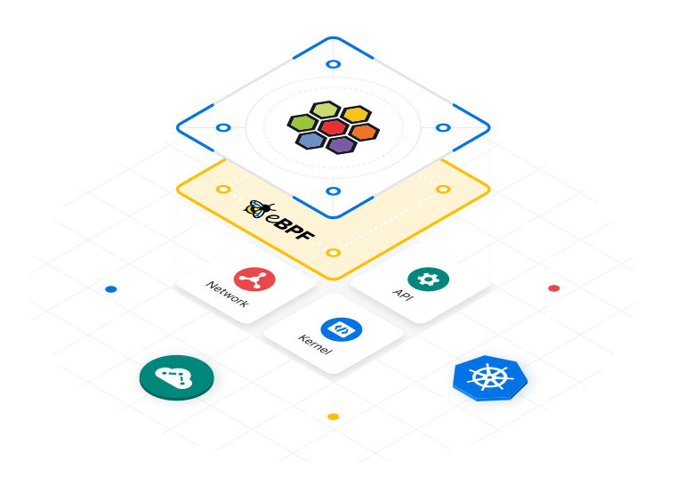

Now what is eBPF?

From [ebpf.io](https://ebpf.io/what-is-ebpf/)

> # Dynamically program the kernel for efficient networking, observability, tracing, and security
>
> ## [What is eBPF?](https://ebpf.io/what-is-ebpf/#what-is-ebpf)
>
> eBPF is a revolutionary technology with origins in the Linux kernel that can run sandboxed programs in a privileged context such as the operating system kernel. It is used to safely and efficiently extend the capabilities of the kernel without requiring to change kernel source code or load kernel modules.
>
> 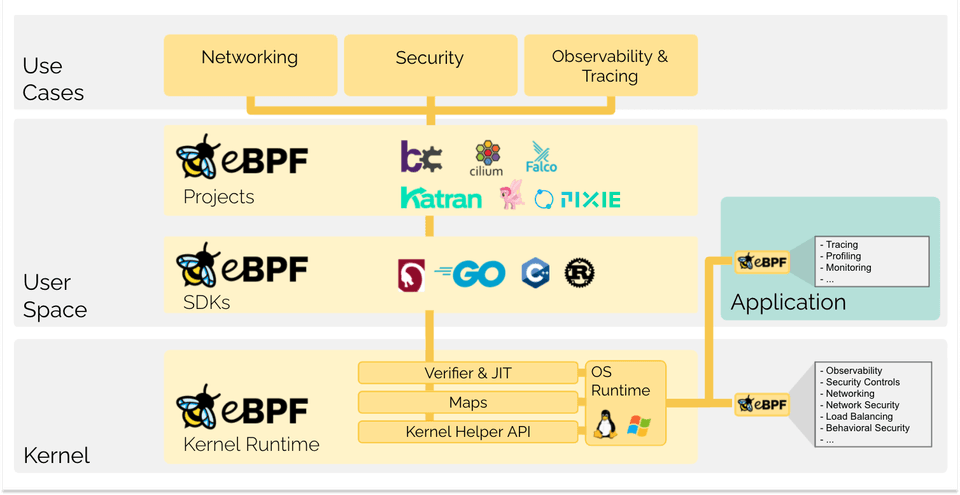
>
> 


As it is always interesting to learn new technology I thought writing a post about Cilium was about time. At first look Cilium is kind of a Swiss Army knife with a lot interesting features. I will go through this post beginning with a basic installation of Cilium on a new cluster (upstream K8s based on Ubuntu nodes). Then I will continune with some of the features I found interesting, and needed myself in my lab, and how to enable and configure them. 

This post will be divided into dedicated sections for the installtion part and the different features respectively, starting with the installation of Cilium as the CNI in my Kubernetes cluster. 

## Preparations

This post assumes the following:

- Already prepared the Kubernetes nodes with all the software installed ready to do the kubeadm init. 
- A jumphost or Linux mgmt vm/server to operate from
- Helm installed and configured on the Linux jumphost
- Kubectl installed on the Linux jumphost
- Cilium CLI installed on the Linux jumphost

Cilium-cli is installed using this command:

```bash
CILIUM_CLI_VERSION=$(curl -s https://raw.githubusercontent.com/cilium/cilium-cli/main/stable.txt)
CLI_ARCH=amd64
if [ "$(uname -m)" = "aarch64" ]; then CLI_ARCH=arm64; fi
curl -L --fail --remote-name-all https://github.com/cilium/cilium-cli/releases/download/${CILIUM_CLI_VERSION}/cilium-linux-${CLI_ARCH}.tar.gz{,.sha256sum}
sha256sum --check cilium-linux-${CLI_ARCH}.tar.gz.sha256sum
sudo tar xzvfC cilium-linux-${CLI_ARCH}.tar.gz /usr/local/bin
rm cilium-linux-${CLI_ARCH}.tar.gz{,.sha256sum}

```

For more information have a look [here](https://docs.cilium.io/en/stable/gettingstarted/k8s-install-default/)

Below is my lab's topology for this post:

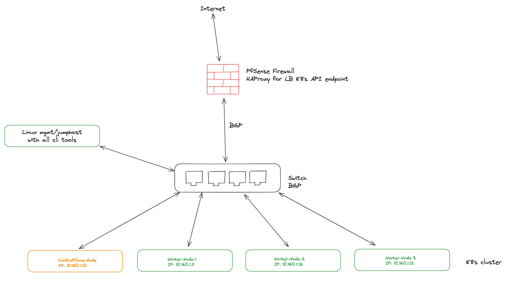

## Installation of Cilium

Cililum can be installed using Helm or using Ciliums nifty *cilium-cli* tool.


{}

One can use Helm to configure/install features but also the Cilium cli tool. In my post I will mostly use Helm when adding some features or changing certain settings and cilium-cli for others just to showcase how easy it is to use cilium cli for certain features/tasks.

According to the official docs:

> Install the latest version of the Cilium CLI. The Cilium CLI can be used to install Cilium, inspect the state of a Cilium installation, and enable/disable various features (e.g. clustermesh, Hubble).

{}

The first feature of Cilium in this post is how it can fully replace kube-proxy by providing distributed load balancing using eBPF. Naturally I would like to use this feature. This means I need to deploy my Kubernetes cluster without kube-proxy. That is easiest done during the initial upbringing of the Kubernetes cluster. It can be done post-upringing also, see more info [here](https://docs.cilium.io/en/stable/network/kubernetes/kubeproxy-free/#kubeproxy-free)

### kubeadm init with no-kube-proxy

To bring up my Kubernetes cluster without kube-proxy, this is the command I will use on my first control-plane node:

```bash
sudo kubeadm init --pod-network-cidr=10.22.0.0/16 --service-cidr=10.23.0.0/16  --control-plane-endpoint "test-cluster-1.my-doamin.net" --upload-certs --skip-phases=addon/kube-proxy --cri-socket unix:///var/run/containerd/containerd.sock
```

> This is the parameter to disable kube-proxy *--skip-phases=addon/kube-proxy* 

```bash
I1219 14:08:17.376790   13327 version.go:256] remote version is much newer: v1.29.0; falling back to: stable-1.28
[init] Using Kubernetes version: v1.28.4
[preflight] Running pre-flight checks
[preflight] Pulling images required for setting up a Kubernetes cluster
[preflight] This might take a minute or two, depending on the speed of your internet connection
[preflight] You can also perform this action in beforehand using 'kubeadm config images pull'
W1219 14:08:33.520592   13327 checks.go:835] detected that the sandbox image "registry.k8s.io/pause:3.5" of the container runtime is inconsistent with that used by kubeadm. It is recommended that using "registry.k8s.io/pause:3.9" as the CRI sandbox image.
[certs] Using certificateDir folder "/etc/kubernetes/pki"
[certs] Generating "ca" certificate and key
[certs] Generating "apiserver" certificate and key
[certs] apiserver serving cert is signed for DNS names [k8s-master-01 kubernetes kubernetes.default kubernetes.default.svc kubernetes.default.svc.cluster.local test-cluster-1.my-domain.net] and IPs [10.23.0.1 10.160.1.10]
[certs] Generating "apiserver-kubelet-client" certificate and key
[certs] Generating "front-proxy-ca" certificate and key
[certs] Generating "front-proxy-client" certificate and key
[certs] Generating "etcd/ca" certificate and key
[certs] Generating "etcd/server" certificate and key
[certs] etcd/server serving cert is signed for DNS names [k8s-master-01 localhost] and IPs [10.160.1.10 127.0.0.1 ::1]
[certs] Generating "etcd/peer" certificate and key
[certs] etcd/peer serving cert is signed for DNS names [k8s-master-01 localhost] and IPs [10.160.1.10 127.0.0.1 ::1]
[certs] Generating "etcd/healthcheck-client" certificate and key
[certs] Generating "apiserver-etcd-client" certificate and key
[certs] Generating "sa" key and public key
[kubeconfig] Using kubeconfig folder "/etc/kubernetes"
[kubeconfig] Writing "admin.conf" kubeconfig file
[kubeconfig] Writing "kubelet.conf" kubeconfig file
[kubeconfig] Writing "controller-manager.conf" kubeconfig file
[kubeconfig] Writing "scheduler.conf" kubeconfig file
[etcd] Creating static Pod manifest for local etcd in "/etc/kubernetes/manifests"
[control-plane] Using manifest folder "/etc/kubernetes/manifests"
[control-plane] Creating static Pod manifest for "kube-apiserver"
[control-plane] Creating static Pod manifest for "kube-controller-manager"
[control-plane] Creating static Pod manifest for "kube-scheduler"
[kubelet-start] Writing kubelet environment file with flags to file "/var/lib/kubelet/kubeadm-flags.env"
[kubelet-start] Writing kubelet configuration to file "/var/lib/kubelet/config.yaml"
[kubelet-start] Starting the kubelet
[wait-control-plane] Waiting for the kubelet to boot up the control plane as static Pods from directory "/etc/kubernetes/manifests". This can take up to 4m0s
[kubelet-check] Initial timeout of 40s passed.
[apiclient] All control plane components are healthy after 106.047476 seconds
[upload-config] Storing the configuration used in ConfigMap "kubeadm-config" in the "kube-system" Namespace
[kubelet] Creating a ConfigMap "kubelet-config" in namespace kube-system with the configuration for the kubelets in the cluster
[upload-certs] Storing the certificates in Secret "kubeadm-certs" in the "kube-system" Namespace
[upload-certs] Using certificate key:
3c9fa959a7538baaaf484e931ade45fbad07934dc40d456cae54839a7d888715
[mark-control-plane] Marking the node k8s-master-01 as control-plane by adding the labels: [node-role.kubernetes.io/control-plane node.kubernetes.io/exclude-from-external-load-balancers]
[mark-control-plane] Marking the node k8s-master-01 as control-plane by adding the taints [node-role.kubernetes.io/control-plane:NoSchedule]
[bootstrap-token] Using token: q495cj.apdasczda14j87tc
[bootstrap-token] Configuring bootstrap tokens, cluster-info ConfigMap, RBAC Roles
[bootstrap-token] Configured RBAC rules to allow Node Bootstrap tokens to get nodes
[bootstrap-token] Configured RBAC rules to allow Node Bootstrap tokens to post CSRs in order for nodes to get long term certificate credentials
[bootstrap-token] Configured RBAC rules to allow the csrapprover controller automatically approve CSRs from a Node Bootstrap Token
[bootstrap-token] Configured RBAC rules to allow certificate rotation for all node client certificates in the cluster
[bootstrap-token] Creating the "cluster-info" ConfigMap in the "kube-public" namespace
[kubelet-finalize] Updating "/etc/kubernetes/kubelet.conf" to point to a rotatable kubelet client certificate and key
[addons] Applied essential addon: CoreDNS

Your Kubernetes control-plane has initialized successfully!

To start using your cluster, you need to run the following as a regular user:

  mkdir -p $HOME/.kube
  sudo cp -i /etc/kubernetes/admin.conf $HOME/.kube/config
  sudo chown $(id -u):$(id -g) $HOME/.kube/config

Alternatively, if you are the root user, you can run:

  export KUBECONFIG=/etc/kubernetes/admin.conf

You should now deploy a pod network to the cluster.
Run "kubectl apply -f [podnetwork].yaml" with one of the options listed at:
  https://kubernetes.io/docs/concepts/cluster-administration/addons/

You can now join any number of the control-plane node running the following command on each as root:

  kubeadm join test-cluster-1.my-domain.net:6443 --token q4da14j87tc \
	--discovery-token-ca-cert-hash sha256: \
	--control-plane --certificate-key 

Please note that the certificate-key gives access to cluster sensitive data, keep it secret!
As a safeguard, uploaded-certs will be deleted in two hours; If necessary, you can use
"kubeadm init phase upload-certs --upload-certs" to reload certs afterward.

Then you can join any number of worker nodes by running the following on each as root:

kubeadm join test-cluster-1.my-domain.net:6443 --token q4aczda14j87tc \
	--discovery-token-ca-cert-hash sha256:
```

NB, notice that it "complains" *No kubeproxy.config.k8s.io/v1alpha1 config is loaded. Continuing without it: configmaps "kube-proxy"* 

Now on my worker nodes:

```bash
kubeadm join test-cluster-1.my-domain.net:6443 --token q414j87tc \
	--discovery-token-ca-cert-hash sha256:edf4d18883f94f0b5aa646001606147
```

```bash
[preflight] Running pre-flight checks
[preflight] Reading configuration from the cluster...
[preflight] FYI: You can look at this config file with 'kubectl -n kube-system get cm kubeadm-config -o yaml'
W1219 16:25:57.203844    1279 configset.go:78] Warning: No kubeproxy.config.k8s.io/v1alpha1 config is loaded. Continuing without it: configmaps "kube-proxy" is forbidden: User "system:bootstrap:q495cj" cannot get resource "configmaps" in API group "" in the namespace "kube-system"
[kubelet-start] Writing kubelet configuration to file "/var/lib/kubelet/config.yaml"
[kubelet-start] Writing kubelet environment file with flags to file "/var/lib/kubelet/kubeadm-flags.env"
[kubelet-start] Starting the kubelet
[kubelet-start] Waiting for the kubelet to perform the TLS Bootstrap...

This node has joined the cluster:
* Certificate signing request was sent to apiserver and a response was received.
* The Kubelet was informed of the new secure connection details.

Run 'kubectl get nodes' on the control-plane to see this node join the cluster.

```

NB, notice that it "complains" *No kubeproxy.config.k8s.io/v1alpha1 config is loaded. Continuing without it: configmaps "kube-proxy"* 

When all worker nodes has been joined:

```bash
andreasm@linuxmgmt01:~/test-cluster-1$ k get nodes
NAME            STATUS   ROLES           AGE     VERSION
k8s-master-01   Ready    control-plane   135m    v1.28.2
k8s-worker-01   Ready    <none>          12s     v1.28.2
k8s-worker-02   Ready    <none>          38s     v1.28.2
k8s-worker-03   Ready    <none>          4m28s   v1.28.2
```

Notice they are not ready. CoreDNS is pending and there is no CNI in place to cover IPAM etc.. 

```bash
andreasm@linuxmgmt01:~/test-cluster-1$ k get pods -A
NAMESPACE     NAME                                    READY   STATUS    RESTARTS      AGE
kube-system   coredns-5dd5756b68-c5xml                0/1     Pending   0             35m
kube-system   coredns-5dd5756b68-fgdzj                0/1     Pending   0             35m
kube-system   etcd-k8s-master-01                      1/1     Running   0             35m
kube-system   kube-apiserver-k8s-master-01            1/1     Running   0             35m
kube-system   kube-controller-manager-k8s-master-01   1/1     Running   1 (19m ago)   35m
kube-system   kube-scheduler-k8s-master-01            1/1     Running   1 (19m ago)   35m
```

Now its time to jump over to my jumphost where I will do all the remaining configurations/interactions with my test-cluster-1. 

## Install Cilium CNI

From my jumphost I already have all the tools I need to deploy Cilium. To install the Cilium CNI I will just use the cilium-cli tool as it is so easy. With a very short command it will automatically install Cilium on all my worker/control-plane nodes. The cilium-cli will act according to the kube context you are in, so make sure you are in the correct context (the context that needs Cilium to be installed):

```bash
andreasm@linuxmgmt01:~/test-cluster-1$ k config current-context
test-cluster-1-admin@kubernetes

andreasm@linuxmgmt01:~/test-cluster-1$ cilium install --version 1.14.5
ℹ️  Using Cilium version 1.14.5
🔮 Auto-detected cluster name: test-cluster-1
🔮 Auto-detected kube-proxy has not been installed
ℹ️  Cilium will fully replace all functionalities of kube-proxy

```

Thats it.... :smile:

Version 1.14.5 is the latest stable at the writing of this post. 

Now, whats inside my Kubernetes cluster now:

```bash
andreasm@linuxmgmt01:~/test-cluster-1$ k get pods -A
NAMESPACE     NAME                                    READY   STATUS    RESTARTS       AGE
kube-system   cilium-6gx5b                            1/1     Running   0              11m
kube-system   cilium-bsqzw                            1/1     Running   1              11m
kube-system   cilium-ct8n4                            1/1     Running   0              53s
kube-system   cilium-operator-545dc68d55-fsh6s        1/1     Running   1              11m
kube-system   cilium-v7rdz                            1/1     Running   0              5m9s
kube-system   coredns-5dd5756b68-j9vwm                1/1     Running   0              77s
kube-system   coredns-5dd5756b68-mjbzk                1/1     Running   0              78s
kube-system   etcd-k8s-master-01                      1/1     Running   0              136m
kube-system   hubble-relay-d478c79c8-pbn4v            1/1     Running   0              16m
kube-system   kube-apiserver-k8s-master-01            1/1     Running   0              136m
kube-system   kube-controller-manager-k8s-master-01   1/1     Running   1 (120m ago)   136m
kube-system   kube-scheduler-k8s-master-01            1/1     Running   1 (120m ago)   136m
```

Everything is up and running. 
The Cilium cli contains a lot of useful features. Like checking the status of Cilium. Lets test that:

```bash
andreasm@linuxmgmt01:~/test-cluster-1$ cilium status
    /¯¯\
 /¯¯\__/¯¯\    Cilium:             OK
 \__/¯¯\__/    Operator:           OK
 /¯¯\__/¯¯\    Envoy DaemonSet:    disabled (using embedded mode)
 \__/¯¯\__/    Hubble Relay:       disabled
    \__/       ClusterMesh:        disabled

DaemonSet              cilium             Desired: 4, Ready: 4/4, Available: 4/4
Deployment             cilium-operator    Desired: 1, Ready: 1/1, Available: 1/1
Containers:            cilium             Running: 4
                       cilium-operator    Running: 1
Cluster Pods:          2/2 managed by Cilium
Helm chart version:    1.14.5
Image versions         cilium-operator    quay.io/cilium/operator-generic:v1.14.5@sha256:303f9076bdc73b3fc32aaedee64a14f6f44c8bb08ee9e3956d443021103ebe7a: 1
                       cilium             quay.io/cilium/cilium:v1.14.5@sha256:d3b287029755b6a47dee01420e2ea469469f1b174a2089c10af7e5e9289ef05b: 4
```

Looks great

Did you notice above that the Cilium installer discovered there was no kube-proxy and that it told me it will replace all the feature of kube-proxy? Well it did.. Lets check the config of Cilium and see if that is also reflected there. Look after this key-value:

`kube-proxy-replacement                            strict`


```bash
andreasm@linuxmgmt01:~/test-cluster-1$ cilium config view
agent-not-ready-taint-key                         node.cilium.io/agent-not-ready
arping-refresh-period                             30s
auto-direct-node-routes                           false
bpf-lb-external-clusterip                         false
bpf-lb-map-max                                    65536
bpf-lb-sock                                       false
bpf-map-dynamic-size-ratio                        0.0025
bpf-policy-map-max                                16384
bpf-root                                          /sys/fs/bpf
cgroup-root                                       /run/cilium/cgroupv2
cilium-endpoint-gc-interval                       5m0s
cluster-id                                        0
cluster-name                                      test-cluster-1
cluster-pool-ipv4-cidr                            10.0.0.0/8
cluster-pool-ipv4-mask-size                       24
cni-exclusive                                     true
cni-log-file                                      /var/run/cilium/cilium-cni.log
cnp-node-status-gc-interval                       0s
custom-cni-conf                                   false
debug                                             false
debug-verbose
disable-cnp-status-updates                        true
egress-gateway-reconciliation-trigger-interval    1s
enable-auto-protect-node-port-range               true
enable-bgp-control-plane                          false
enable-bpf-clock-probe                            false
enable-endpoint-health-checking                   true
enable-health-check-nodeport                      true
enable-health-checking                            true
enable-hubble                                     true
enable-ipv4                                       true
enable-ipv4-big-tcp                               false
enable-ipv4-masquerade                            true
enable-ipv6                                       false
enable-ipv6-big-tcp                               false
enable-ipv6-masquerade                            true
enable-k8s-networkpolicy                          true
enable-k8s-terminating-endpoint                   true
enable-l2-neigh-discovery                         true
enable-l7-proxy                                   true
enable-local-redirect-policy                      false
enable-policy                                     default
enable-remote-node-identity                       true
enable-sctp                                       false
enable-svc-source-range-check                     true
enable-vtep                                       false
enable-well-known-identities                      false
enable-xt-socket-fallback                         true
external-envoy-proxy                              false
hubble-disable-tls                                false
hubble-listen-address                             :4244
hubble-socket-path                                /var/run/cilium/hubble.sock
hubble-tls-cert-file                              /var/lib/cilium/tls/hubble/server.crt
hubble-tls-client-ca-files                        /var/lib/cilium/tls/hubble/client-ca.crt
hubble-tls-key-file                               /var/lib/cilium/tls/hubble/server.key
identity-allocation-mode                          crd
identity-gc-interval                              15m0s
identity-heartbeat-timeout                        30m0s
install-no-conntrack-iptables-rules               false
ipam                                              cluster-pool
ipam-cilium-node-update-rate                      15s
k8s-client-burst                                  10
k8s-client-qps                                    5
kube-proxy-replacement                            strict
kube-proxy-replacement-healthz-bind-address
mesh-auth-enabled                                 true
mesh-auth-gc-interval                             5m0s
mesh-auth-queue-size                              1024
mesh-auth-rotated-identities-queue-size           1024
monitor-aggregation                               medium
monitor-aggregation-flags                         all
monitor-aggregation-interval                      5s
node-port-bind-protection                         true
nodes-gc-interval                                 5m0s
operator-api-serve-addr                           127.0.0.1:9234
preallocate-bpf-maps                              false
procfs                                            /host/proc
proxy-connect-timeout                             2
proxy-max-connection-duration-seconds             0
proxy-max-requests-per-connection                 0
proxy-prometheus-port                             9964
remove-cilium-node-taints                         true
routing-mode                                      tunnel
set-cilium-is-up-condition                        true
set-cilium-node-taints                            true
sidecar-istio-proxy-image                         cilium/istio_proxy
skip-cnp-status-startup-clean                     false
synchronize-k8s-nodes                             true
tofqdns-dns-reject-response-code                  refused
tofqdns-enable-dns-compression                    true
tofqdns-endpoint-max-ip-per-hostname              50
tofqdns-idle-connection-grace-period              0s
tofqdns-max-deferred-connection-deletes           10000
tofqdns-proxy-response-max-delay                  100ms
tunnel-protocol                                   vxlan
unmanaged-pod-watcher-interval                    15
vtep-cidr
vtep-endpoint
vtep-mac
vtep-mask
write-cni-conf-when-ready                         /host/etc/cni/net.d/05-cilium.conflist
```

One can also verify with this command:

```bash
andreasm@linuxmgmt01:~/test-cluster-1$ kubectl -n kube-system exec ds/cilium -- cilium status | grep KubeProxyReplacement
Defaulted container "cilium-agent" out of: cilium-agent, config (init), mount-cgroup (init), apply-sysctl-overwrites (init), mount-bpf-fs (init), clean-cilium-state (init), install-cni-binaries (init)
KubeProxyReplacement:    Strict   [ens18 10.160.1.11 (Direct Routing)]
```

The feature to easily list all features and the status on them is valuable and a really helpful feature. 

It took a couple of seconds and Cilium CNI was installed. Now the fun begins to explore some of the features. Lets tag along


### Enabling features using Helm

When I installed Cilium using the cilium-cli tool, it actually deploys using Helm in the background. Lets see if there is a Helm manifest in the kube-system:

```bash
andreasm@linuxmgmt01:~/test-cluster-1$ helm list -n kube-system
NAME  	NAMESPACE  	REVISION	UPDATED                                	STATUS  	CHART        	APP VERSION
cilium	kube-system	1       	2023-12-19 13:50:40.121866679 +0000 UTC	deployed	cilium-1.14.5	1.14.5
```

Well there it is.. 

That makes it all more interesting. As I will use Helm to update certain parameters going forward in this post I will take a "snapshot" of the current values in the manifest above and altered in the next sections when I enabel additional features. How does the values look like now?

```yaml
From the configMap cilium-config
apiVersion: v1
data:
  agent-not-ready-taint-key: node.cilium.io/agent-not-ready
  arping-refresh-period: 30s
  auto-direct-node-routes: "false"
  bpf-lb-external-clusterip: "false"
  bpf-lb-map-max: "65536"
  bpf-lb-sock: "false"
  bpf-map-dynamic-size-ratio: "0.0025"
  bpf-policy-map-max: "16384"
  bpf-root: /sys/fs/bpf
  cgroup-root: /run/cilium/cgroupv2
  cilium-endpoint-gc-interval: 5m0s
  cluster-id: "0"
  cluster-name: test-cluster-1
  cluster-pool-ipv4-cidr: 10.0.0.0/8
  cluster-pool-ipv4-mask-size: "24"
  cni-exclusive: "true"
  cni-log-file: /var/run/cilium/cilium-cni.log
  cnp-node-status-gc-interval: 0s
  custom-cni-conf: "false"
  debug: "false"
  debug-verbose: ""
  disable-cnp-status-updates: "true"
  egress-gateway-reconciliation-trigger-interval: 1s
  enable-auto-protect-node-port-range: "true"
  enable-bgp-control-plane: "false"
  enable-bpf-clock-probe: "false"
  enable-endpoint-health-checking: "true"
  enable-health-check-nodeport: "true"
  enable-health-checking: "true"
  enable-hubble: "true"
  enable-ipv4: "true"
  enable-ipv4-big-tcp: "false"
  enable-ipv4-masquerade: "true"
  enable-ipv6: "false"
  enable-ipv6-big-tcp: "false"
  enable-ipv6-masquerade: "true"
  enable-k8s-networkpolicy: "true"
  enable-k8s-terminating-endpoint: "true"
  enable-l2-neigh-discovery: "true"
  enable-l7-proxy: "true"
  enable-local-redirect-policy: "false"
  enable-policy: default
  enable-remote-node-identity: "true"
  enable-sctp: "false"
  enable-svc-source-range-check: "true"
  enable-vtep: "false"
  enable-well-known-identities: "false"
  enable-xt-socket-fallback: "true"
  external-envoy-proxy: "false"
  hubble-disable-tls: "false"
  hubble-listen-address: :4244
  hubble-socket-path: /var/run/cilium/hubble.sock
  hubble-tls-cert-file: /var/lib/cilium/tls/hubble/server.crt
  hubble-tls-client-ca-files: /var/lib/cilium/tls/hubble/client-ca.crt
  hubble-tls-key-file: /var/lib/cilium/tls/hubble/server.key
  identity-allocation-mode: crd
  identity-gc-interval: 15m0s
  identity-heartbeat-timeout: 30m0s
  install-no-conntrack-iptables-rules: "false"
  ipam: cluster-pool
  ipam-cilium-node-update-rate: 15s
  k8s-client-burst: "10"
  k8s-client-qps: "5"
  kube-proxy-replacement: strict
  kube-proxy-replacement-healthz-bind-address: ""
  mesh-auth-enabled: "true"
  mesh-auth-gc-interval: 5m0s
  mesh-auth-queue-size: "1024"
  mesh-auth-rotated-identities-queue-size: "1024"
  monitor-aggregation: medium
  monitor-aggregation-flags: all
  monitor-aggregation-interval: 5s
  node-port-bind-protection: "true"
  nodes-gc-interval: 5m0s
  operator-api-serve-addr: 127.0.0.1:9234
  preallocate-bpf-maps: "false"
  procfs: /host/proc
  proxy-connect-timeout: "2"
  proxy-max-connection-duration-seconds: "0"
  proxy-max-requests-per-connection: "0"
  proxy-prometheus-port: "9964"
  remove-cilium-node-taints: "true"
  routing-mode: tunnel
  set-cilium-is-up-condition: "true"
  set-cilium-node-taints: "true"
  sidecar-istio-proxy-image: cilium/istio_proxy
  skip-cnp-status-startup-clean: "false"
  synchronize-k8s-nodes: "true"
  tofqdns-dns-reject-response-code: refused
  tofqdns-enable-dns-compression: "true"
  tofqdns-endpoint-max-ip-per-hostname: "50"
  tofqdns-idle-connection-grace-period: 0s
  tofqdns-max-deferred-connection-deletes: "10000"
  tofqdns-proxy-response-max-delay: 100ms
  tunnel-protocol: vxlan
  unmanaged-pod-watcher-interval: "15"
  vtep-cidr: ""
  vtep-endpoint: ""
  vtep-mac: ""
  vtep-mask: ""
  write-cni-conf-when-ready: /host/etc/cni/net.d/05-cilium.conflist
kind: ConfigMap
metadata:
  annotations:
    meta.helm.sh/release-name: cilium
    meta.helm.sh/release-namespace: kube-system
  creationTimestamp: "2023-12-19T13:50:42Z"
  labels:
    app.kubernetes.io/managed-by: Helm
  name: cilium-config
  namespace: kube-system
  resourceVersion: "4589"
  uid: f501a3d0-8b33-43af-9fae-63625dcd6df1
```


These are the two settings that have been changed from being completely default:

```yaml
  cluster-name: test-cluster-1
  kube-proxy-replacement: strict
```

I prefer editing the changes in a dedicated value.yaml file and run *helm upgrade -f value.yaml* each time I want to do a change so going forward I will be the adding/changing certain settings in this value.yaml file to update the settings in Cilium. 

I grabbed the default value yaml from the Helm repo and use that to alter the settings in the next sections. 


### Enabling features using Cilium cli

The cilium-cli can also be used to enable disable features certain features like Hubble and clustermesh. An example on how to install Hubble with cilium-cli is shown below in the next chapter, but I can also use Helm to achieve the same. I enable Hubble using cilium-cli just to show how easy it is.

But as I mention above, I prefer using the Helm method as I can keep better track of the settings and have them consistent each time I alter an update and refering to my value.yaml file.

## Observability and flow-monitoring - Hubble Observability

Cilium comes with a very neat monitor tool out of the box called Hubble. It is enabled by default but I need to enable the Hubble Relay and Hubble UI feature to get the information from my nodes, pods etc available in a nice dashboard (Hubble UI), so this is a feature I certainly want to enable as one of the first features to test out. 

More details [here](https://docs.cilium.io/en/stable/gettingstarted/hubble/) and [here](https://docs.cilium.io/en/stable/gettingstarted/hubble_setup/)

If I do a quick check with cilium cli now I can see the Hubble Relay is disabled. 

```bash
andreasm@linuxmgmt01:~/test-cluster-1$ cilium status
    /¯¯\
 /¯¯\__/¯¯\    Cilium:             OK
 \__/¯¯\__/    Operator:           OK
 /¯¯\__/¯¯\    Envoy DaemonSet:    disabled (using embedded mode)
 \__/¯¯\__/    Hubble Relay:       disabled
    \__/       ClusterMesh:        disabled

DaemonSet              cilium             Desired: 4, Ready: 4/4, Available: 4/4
Deployment             cilium-operator    Desired: 1, Ready: 1/1, Available: 1/1
Containers:            cilium             Running: 4
                       cilium-operator    Running: 1
Cluster Pods:          2/2 managed by Cilium
Helm chart version:    1.14.5
Image versions         cilium             quay.io/cilium/cilium:v1.14.5@sha256:d3b287029755b6a47dee01420e2ea469469f1b174a2089c10af7e5e9289ef05b: 4
                       cilium-operator    quay.io/cilium/operator-generic:v1.14.5@sha256:303f9076bdc73b3fc32aaedee64a14f6f44c8bb08ee9e3956d443021103ebe7a: 1

andreasm@linuxmgmt01:~/test-cluster-1$ k get svc -n kube-system
NAME          TYPE        CLUSTER-IP      EXTERNAL-IP   PORT(S)                  AGE
hubble-peer   ClusterIP   10.23.182.223   <none>        443/TCP                  69m
kube-dns      ClusterIP   10.23.0.10      <none>        53/UDP,53/TCP,9153/TCP   109m
```

To enable it, it is as simple as running this command:

```bash
andreasm@linuxmgmt01:~/test-cluster-1$ cilium hubble enable
```

This command enables the Hubble Relay.

Lets check the stats of Cilium:

```bash
andreasm@linuxmgmt01:~/test-cluster-1$ cilium status
    /¯¯\
 /¯¯\__/¯¯\    Cilium:             OK
 \__/¯¯\__/    Operator:           OK
 /¯¯\__/¯¯\    Envoy DaemonSet:    disabled (using embedded mode)
 \__/¯¯\__/    Hubble Relay:       OK
    \__/       ClusterMesh:        disabled

DaemonSet              cilium             Desired: 4, Ready: 4/4, Available: 4/4
Deployment             cilium-operator    Desired: 1, Ready: 1/1, Available: 1/1
Deployment             hubble-relay       Desired: 1, Ready: 1/1, Available: 1/1
Containers:            cilium             Running: 4
                       cilium-operator    Running: 1
                       hubble-relay       Running: 1
Cluster Pods:          3/3 managed by Cilium
Helm chart version:    1.14.5
Image versions         cilium             quay.io/cilium/cilium:v1.14.5@sha256:d3b287029755b6a47dee01420e2ea469469f1b174a2089c10af7e5e9289ef05b: 4
                       cilium-operator    quay.io/cilium/operator-generic:v1.14.5@sha256:303f9076bdc73b3fc32aaedee64a14f6f44c8bb08ee9e3956d443021103ebe7a: 1
                       hubble-relay       quay.io/cilium/hubble-relay:v1.14.5@sha256:dbef89f924a927043d02b40c18e417c1ea0e8f58b44523b80fef7e3652db24d4: 1
```

Hubble Relay OK

Now I need to enable the Hubble UI.

Again, uisng Cilium-CLI its a very quick and simple operation:

```bash
andreasm@linuxmgmt01:~$ cilium hubble enable --ui
```

Lets check the services in my cluster:

```bash
andreasm@linuxmgmt01:~$ k get svc -n kube-system
NAME           TYPE        CLUSTER-IP      EXTERNAL-IP   PORT(S)                  AGE
hubble-peer    ClusterIP   10.23.182.223   <none>        443/TCP                  6h19m
hubble-relay   ClusterIP   10.23.182.76    <none>        80/TCP                   4h34m
hubble-ui      ClusterIP   10.23.31.4      <none>        80/TCP                   42s
kube-dns       ClusterIP   10.23.0.10      <none>        53/UDP,53/TCP,9153/TCP   6h59m
```


Hubble Relay and Hubble UI service is enabled. The issue though is that they are exposed using clusterIP, I need to reach them from the outside of my cluster. Lets continue with the next feature to test: LB-IPAM.

**Using Helm to enable Hubble Relay and Hubble-UI**

Instead of using clilium cli I would have enabled the Relay and UI in my value.yaml file and run the following command:

```bash
andreasm@linuxmgmt01:~/test-cluster-1$ helm upgrade -n kube-system cilium cilium/cilium --version 1.14.5 -f cilium-values-feature-by-feature.yaml
Release "cilium" has been upgraded. Happy Helming!
NAME: cilium
LAST DEPLOYED: Tue Dec 19 20:32:12 2023
NAMESPACE: kube-system
STATUS: deployed
REVISION: 13
TEST SUITE: None
NOTES:
You have successfully installed Cilium with Hubble Relay and Hubble UI.

Your release version is 1.14.5.

For any further help, visit https://docs.cilium.io/en/v1.14/gettinghelp
```

Where I have changed these settings in the value.yaml:

```yaml
 relay:
    # -- Enable Hubble Relay (requires hubble.enabled=true)
    enabled: true
 ......
   ui:
    # -- Whether to enable the Hubble UI.
    enabled: true
 ........
 hubble:
  # -- Enable Hubble (true by default).
  enabled: true
............
  # -- Buffer size of the channel Hubble uses to receive monitor events. If this
  # value is not set, the queue size is set to the default monitor queue size.
  # eventQueueSize: ""

  # -- Number of recent flows for Hubble to cache. Defaults to 4095.
  # Possible values are:
  #   1, 3, 7, 15, 31, 63, 127, 255, 511, 1023,
  #   2047, 4095, 8191, 16383, 32767, 65535
  # eventBufferCapacity: "4095"

  # -- Hubble metrics configuration.
  # See https://docs.cilium.io/en/stable/observability/metrics/#hubble-metrics
  # for more comprehensive documentation about Hubble metrics.
  metrics:
    # -- Configures the list of metrics to collect. If empty or null, metrics
    # are disabled.
    # Example:
    #
    #   enabled:
    #   - dns:query;ignoreAAAA
    #   - drop
    #   - tcp
    #   - flow
    #   - icmp
    #   - http
    #
    # You can specify the list of metrics from the helm CLI:
    #
    #   --set metrics.enabled="{dns:query;ignoreAAAA,drop,tcp,flow,icmp,http}"
    #
    enabled:
    - dns:query;ignoreAAAA  ### added these
    - drop                  ### added these
    - tcp                   ### added these
    - flow                  ### added these
    - icmp                  ### added these
    - http                  ### added these
 .........
 
 
```


```bash
andreasm@linuxmgmt01:~/test-cluster-1$ cilium status
    /¯¯\
 /¯¯\__/¯¯\    Cilium:             OK
 \__/¯¯\__/    Operator:           OK
 /¯¯\__/¯¯\    Envoy DaemonSet:    disabled (using embedded mode)
 \__/¯¯\__/    Hubble Relay:       OK
    \__/       ClusterMesh:        disabled

Deployment             cilium-operator    Desired: 2, Ready: 2/2, Available: 2/2
DaemonSet              cilium             Desired: 4, Ready: 4/4, Available: 4/4
Deployment             hubble-ui          Desired: 1, Ready: 1/1, Available: 1/1
Deployment             hubble-relay       Desired: 1, Ready: 1/1, Available: 1/1
Containers:            cilium             Running: 4
                       hubble-ui          Running: 1
                       hubble-relay       Running: 1
                       cilium-operator    Running: 2
Cluster Pods:          4/4 managed by Cilium
Helm chart version:    1.14.5
Image versions         cilium             quay.io/cilium/cilium:v1.14.5@sha256:d3b287029755b6a47dee01420e2ea469469f1b174a2089c10af7e5e9289ef05b: 4
                       hubble-ui          quay.io/cilium/hubble-ui:v0.12.1@sha256:9e5f81ee747866480ea1ac4630eb6975ff9227f9782b7c93919c081c33f38267: 1
                       hubble-ui          quay.io/cilium/hubble-ui-backend:v0.12.1@sha256:1f86f3400827a0451e6332262467f894eeb7caf0eb8779bd951e2caa9d027cbe: 1
                       hubble-relay       quay.io/cilium/hubble-relay:v1.14.5@sha256:dbef89f924a927043d02b40c18e417c1ea0e8f58b44523b80fef7e3652db24d4: 1
                       cilium-operator    quay.io/cilium/operator-generic:v1.14.5@sha256:303f9076bdc73b3fc32aaedee64a14f6f44c8bb08ee9e3956d443021103ebe7a: 2
```


I will get back to the Hubble UI later... 


## LB-IPAM

Exposing a service from Kubernetes to be accessible from outside the cluster can be done in a couple of ways:

- Exporting the service by binding it to a node using NodePort (not scalable and manageable).
- Exporting the service using a servicetype of loadBalancer, only Layer4, though scalable. Usually requires external load balancer installed or some additional component installed and configured to support your Kubernetes platform.
- Exporting using Ingress, Layer7, requires a loadbalancer to provide exernal IP address
- Exporting using GatewayAPI (Ingress successor), requires a loadbalancer to provide exernal IP address. 

Cilium has really made it simple here, it comes with a built in LoadBalancer-IPAM. More info [here](https://docs.cilium.io/en/stable/network/lb-ipam/).

This is already enabled, no feature to install or enable. The only thing I need to do is to configure an IP pool that will provide ip addresses from a defined subnet when I request a serviceType loadBalancer, Ingress or Gateway. We can configure multiple pools with different subnets,  and configure a serviceSelector matching on labels or expressions. 

In my lab I have already configured a couple of IP pools, using different subnets and different serviceSelectors so I can control which service gets IP addresses from which pool. 

A couple of example pools from my lab:

```yaml
apiVersion: "cilium.io/v2alpha1"
kind: CiliumLoadBalancerIPPool
metadata:
  name: "gateway-api-pool-10.150.14.x"
spec:
  cidrs:
  - cidr: "10.150.14.0/24"
  serviceSelector:
    matchExpressions:
      - {key: io.kubernetes.service.namespace, operator: In, values: [harbor, booking]}
---
apiVersion: "cilium.io/v2alpha1"
kind: CiliumLoadBalancerIPPool
metadata:
  name: "lb-pool-prod.10.150.11.x"
spec:
  cidrs:
  - cidr: "10.150.11.0/24"
  serviceSelector:
    matchExpressions:
      - {key: env, operator: In, values: [prod]}
```

The first pool will only provide IP addresses to services being deployed in any of the two namespaces "harbor" or "booking". This is an "OR" selection, not AND, meaning it can be deployed in any of the namespaces, not both. The second will use lablels and match on the key-value: env=prod.

{}

Bear in mind that these IP Pools will only listen for services (serviceType loadBalancer) not Ingress pr say. That means each time you create an Ingress or a Gateway the serviceType loadBalancer will be auto-created as a reaction to the Ingress/Gateway creation. So if you try to create labels on the Ingress/Gatewat object it will not be noticed by the LB-IPAM pool. Instead you can adjust the selection based on the namespace you know it will be created in, or use this label that is auto-created on the svc: "Labels:                   io.cilium.gateway/owning-gateway="name-of-gateway""

{}

As soon as you have created an ip-pool, applied it, it will immediately start to serve requests by providing IP addresses to them. This is very nice. 
There is a small catch though. If I create IP Pools, as above, which is outside of my nodes subnet how does my network know how to reach these subnets? Creating static routes and pointing to my nodes that potentially holds these ip addresses? Nah.. Not scalable, nor manageable.  Some kind of dynamic routing protocol would be best here,  BGP or OSPF. 
Did I mention that Cilium also includes support for BGP out of the box?

## BGP Control Plane

Yes, you guessed it, Cilium includes BGP. A brilliant way of advertising all my IP pools. Creating many IP pools with a bunch of subnets have never been more fun. This is the same concept as I write about [here](https://blog.andreasm.io/2023/02/20/antrea-egress/), the biggest difference is that with Cilium this only needs to be enabled as a feature and then define a yaml to confgure the bgp settings. Nothing additional to install, just Plug'nPlay.

For more info on the BGP control plane, read [here](https://docs.cilium.io/en/stable/network/bgp-control-plane/).

First out, enable the BGP control plane feature. To enable it I will alter my Helm value.yaml file with this setting:

```yaml
# -- This feature set enables virtual BGP routers to be created via
# CiliumBGPPeeringPolicy CRDs.
bgpControlPlane:
  # -- Enables the BGP control plane.
  enabled: true
```

Then run the command:

```bash
helm upgrade -n kube-system cilium cilium/cilium --version 1.14.5 -f cilium-values-feature-by-feature.yaml
```

This will enable the bgp control plane feature:

```yaml
andreasm@linuxmgmt01:~/test-cluster-1$ cilium config view
agent-not-ready-taint-key                         node.cilium.io/agent-not-ready
arping-refresh-period                             30s
auto-direct-node-routes                           false
bpf-lb-external-clusterip                         false
bpf-lb-map-max                                    65536
bpf-lb-sock                                       false
bpf-map-dynamic-size-ratio                        0.0025
bpf-policy-map-max                                16384
bpf-root                                          /sys/fs/bpf
cgroup-root                                       /run/cilium/cgroupv2
cilium-endpoint-gc-interval                       5m0s
cluster-id                                        0
cluster-name                                      test-cluster-1
cluster-pool-ipv4-cidr                            10.0.0.0/8
cluster-pool-ipv4-mask-size                       24
cni-exclusive                                     true
cni-log-file                                      /var/run/cilium/cilium-cni.log
cnp-node-status-gc-interval                       0s
custom-cni-conf                                   false
debug                                             false
disable-cnp-status-updates                        true
egress-gateway-reconciliation-trigger-interval    1s
enable-auto-protect-node-port-range               true
enable-bgp-control-plane                          true #### Here it is
```


Now I need to create a yaml that contains the BGP peering info I need for my workers to peer to my upstream router. For reference I will paste my lab topology here again:


When I apply my below BGPPeeringPolicy yaml, my nodes will enable a BGP peering session to the switch (their upstream bgp neighbor) they are connected to in the diagram above. This switch has also been configured to allow them as BGP neigbors. Please take into consideration creating some ip-prefix/route-maps so we dont accidentally advertise routes that confilcts, or should not be advertised into the network to prevent BGP blackholes etc... 

Here is my BGP config I apply on my cluster:

```yaml
apiVersion: "cilium.io/v2alpha1"
kind: CiliumBGPPeeringPolicy
metadata:
 name: 01-bgp-peering-policy
spec:
 nodeSelector:
   matchLabels:
     bgp-policy: worker-nodes
 virtualRouters:
 - localASN: 64520
   serviceSelector:
     matchExpressions:
        - {key: somekey, operator: NotIn, values: ['never-used-value']}
   exportPodCIDR: false
   neighbors:
    - peerAddress: '10.160.1.1/24'
      peerASN: 64512
      eBGPMultihopTTL: 10
      connectRetryTimeSeconds: 120
      holdTimeSeconds: 12
      keepAliveTimeSeconds: 4
      gracefulRestart:
        enabled: true
        restartTimeSeconds: 120
```

Here we can also configure a serviceSelector to prevent services we dont want to be advertised. I used used the example from the official docs to allow everything. If I also have a good BGP route-map config on my switch side or upstream bgp neighbour subnets that are not allowed will never be advertised. 

Now that I have applied it I can check the bgp peering status using the Cilium cli:

```bash
andreasm@linuxmgmt01:~/prod-cluster-1/cilium$ cilium bgp peers
Node               Local AS   Peer AS   Peer Address   Session State   Uptime     Family         Received   Advertised
k8s-prod-node-01   64520      64512     10.160.1.1     established     13h2m53s   ipv4/unicast   47         6
                                                                                  ipv6/unicast   0          0
k8s-prod-node-02   64520      64512     10.160.1.1     established     13h2m25s   ipv4/unicast   45         6
                                                                                  ipv6/unicast   0          0
k8s-prod-node-03   64520      64512     10.160.1.1     established     13h2m27s   ipv4/unicast   43         6
                                                                                  ipv6/unicast   0          0
```

I can see some prefixes being Advertised and some being Received and the Session State is Established. I can also confirm that on my switch, and the routes they advertise:

```bash
GUZ-SW-01# show ip bgp summary

 Peer Information

  Remote Address  Remote-AS Local-AS State         Admin Status
  --------------- --------- -------- ------------- ------------
  10.160.1.114    64520     64512    Established   Start
  10.160.1.115    64520     64512    Established   Start
  10.160.1.116    64520     64512    Established   Start
  172.18.1.1      64500     64512    Established   Start
GUZ-SW-01# show ip bgp

  Local AS            : 64512         Local Router-id  : 172.18.1.2
  BGP Table Version   : 1706

  Status codes: * - valid, > - best, i - internal, e - external, s - stale
  Origin codes: i - IGP, e - EGP, ? - incomplete

     Network            Nexthop         Metric     LocalPref  Weight AsPath
     ------------------ --------------- ---------- ---------- ------ ---------
* e  10.150.11.10/32    10.160.1.114    0                     0      64520    i
*>e  10.150.11.10/32    10.160.1.115    0                     0      64520    i
* e  10.150.11.10/32    10.160.1.116    0                     0      64520    i
* e  10.150.11.199/32   10.160.1.114    0                     0      64520    i
* e  10.150.11.199/32   10.160.1.115    0                     0      64520    i
*>e  10.150.11.199/32   10.160.1.116    0                     0      64520    i
* e  10.150.12.4/32     10.160.1.114    0                     0      64520    i
* e  10.150.12.4/32     10.160.1.115    0                     0      64520    i
*>e  10.150.12.4/32     10.160.1.116    0                     0      64520    i
* e  10.150.14.32/32    10.160.1.114    0                     0      64520    i
* e  10.150.14.32/32    10.160.1.115    0                     0      64520    i
*>e  10.150.14.32/32    10.160.1.116    0                     0      64520    i
* e  10.150.14.150/32   10.160.1.114    0                     0      64520    i
*>e  10.150.14.150/32   10.160.1.115    0                     0      64520    i
* e  10.150.14.150/32   10.160.1.116    0                     0      64520    i
* e  10.150.15.100/32   10.160.1.114    0                     0      64520    i
* e  10.150.15.100/32   10.160.1.115    0                     0      64520    i
*>e  10.150.15.100/32   10.160.1.116    0                     0      64520    i
```

Now I can just create my IP Pools, create some services and they should be immediately advertised and reachable in my network (unless they are being stopped by some route-maps ofcourse). 

Note, it will only advertise ip-addresses in use by a service, not the whole subnet I define in my IP-Pools. That means I will only see host-routes advertised (as seen above).  


## LB-IPAM - does it actually loadbalance?

It says LoadBalancer IPAM, but does it actually loadbalance? Let me quicly put that to a test. 

I have exposed a web service using serviceType loadBalancer consisting of three simple nginx web pods.

Here is the yaml I am using (think I grabbed it from the offical Cilium docs)

```yaml
apiVersion: v1
kind: Service
metadata:
  name: test-lb
  namespace: example
  labels:
     env: prod #### added this label to match with my ip pool
spec:
  type: LoadBalancer
  ports:
  - port: 80
    targetPort: 80
    protocol: TCP
    name: http
  selector:
    svc: test-lb
---
apiVersion: apps/v1
kind: Deployment
metadata:
  name: nginx
  namespace: example
spec:
  selector:
    matchLabels:
      svc: test-lb
  template:
    metadata:
      labels:
        svc: test-lb
    spec:
      containers:
      - name: web
        image: nginx
        imagePullPolicy: IfNotPresent
        ports:
        - containerPort: 80
        readinessProbe:
          httpGet:
            path: /
            port: 80

```

Initially it deploys one pod, I will scale it up to three

They are running here, perfectly distributed across all my worker nodes:

```bash
andreasm@linuxmgmt01:~/prod-cluster-1/cilium$ k get pods -n example -owide
NAME                     READY   STATUS    RESTARTS   AGE    IP           NODE               NOMINATED NODE   READINESS GATES
nginx-698447f456-5xczj   1/1     Running   0          18s    10.0.0.239   k8s-prod-node-01   <none>           <none>
nginx-698447f456-plknk   1/1     Running   0          117s   10.0.4.167   k8s-prod-node-02   <none>           <none>
nginx-698447f456-xs4jq   1/1     Running   0          18s    10.0.5.226   k8s-prod-node-03   <none>           <none>
```

And here is the LB service:

```bash
example        test-lb                             LoadBalancer   10.21.69.190    10.150.11.48    80:31745/TCP
```

 

Now let me do a curl against the LoadBalancer IP and see if something changes:

```bash
Every 0.5s: curl http://10.150.11.48                                               linuxmgmt01: Wed Dec 20 07:58:14 2023

  % Total    % Received % Xferd  Average Speed   Time    Time     Time  Current
                                 Dload  Upload   Total   Spent    Left  Speed
   0     0    0     0    0     0      0      0 --:--:-- --:--:-- --:--:--     0 100   567  100   567    0     0   184k
    0 --:--:-- --:--:-- --:--:--  276k
<!DOCTYPE html>
<html>
<head>
Pod 2   ##### Notice this 
<style>
html { color-scheme: light dark; }
body { width: 35em; margin: 0 auto;
font-family: Tahoma, Verdana, Arial, sans-serif; }
</style>
</head>
<body>
Pod 2
<p>If you see this page, the nginx web server is successfully installed and
working. Further configuration is required.</p>

<p>For online documentation and support please refer to
<a href="http://nginx.org/">nginx.org</a>.<br/>
Commercial support is available at
<a href="http://nginx.com/">nginx.com</a>.</p>

<p><em>Thank you for using nginx.</em></p>
</body>
</html>
```

```bash
Every 0.5s: curl http://10.150.11.48                                               linuxmgmt01: Wed Dec 20 07:59:15 2023

  % Total    % Received % Xferd  Average Speed   Time    Time     Time  Current
                                 Dload  Upload   Total   Spent    Left  Speed
   0     0    0     0    0     0      0      0 --:--:-- --:--:-- --:--:--     0 100   567  100   567    0     0   110k
    0 --:--:-- --:--:-- --:--:--  138k
<!DOCTYPE html>
<html>
<head>
Pod 1     ##### Notice this
<style>
html { color-scheme: light dark; }
body { width: 35em; margin: 0 auto;
font-family: Tahoma, Verdana, Arial, sans-serif; }
</style>
</head>
<body>
Pod 1
<p>If you see this page, the nginx web server is successfully installed and
working. Further configuration is required.</p>

<p>For online documentation and support please refer to
<a href="http://nginx.org/">nginx.org</a>.<br/>
Commercial support is available at
<a href="http://nginx.com/">nginx.com</a>.</p>

<p><em>Thank you for using nginx.</em></p>
</body>
</html>
```


```bash
Every 0.5s: curl http://10.150.11.48                                               linuxmgmt01: Wed Dec 20 08:01:02 2023

  % Total    % Received % Xferd  Average Speed   Time    Time     Time  Current
                                 Dload  Upload   Total   Spent    Left  Speed
   0     0    0     0    0     0      0      0 --:--:-- --:--:-- --:--:--     0 100   567  100   567    0     0   553k
    0 --:--:-- --:--:-- --:--:--  553k
<!DOCTYPE html>
<html>
<head>
Pod 3    ##### Notice this
<style>
html { color-scheme: light dark; }
body { width: 35em; margin: 0 auto;
font-family: Tahoma, Verdana, Arial, sans-serif; }
</style>
</head>
<body>
Pod 3
<p>If you see this page, the nginx web server is successfully installed and
working. Further configuration is required.</p>

<p>For online documentation and support please refer to
<a href="http://nginx.org/">nginx.org</a>.<br/>
Commercial support is available at
<a href="http://nginx.com/">nginx.com</a>.</p>

<p><em>Thank you for using nginx.</em></p>
</body>
</html>


```


Well, it is actually load-balancing the requests to the three different pods, running on three different nodes. 
And it took me about 5 seconds to apply the ip-pool yaml and the bgppeeringpolicy yaml and I had a fully functioning load-balancer. 

A bit more info on this feature from the offical Cilium docs:

> LB IPAM works in conjunction with features like the [Cilium BGP Control Plane (Beta)](https://docs.cilium.io/en/stable/network/bgp-control-plane/#bgp-control-plane). Where LB IPAM is responsible for allocation and assigning of IPs to Service objects and other features are responsible for load balancing and/or advertisement of these IPs.

So I assume the actual loadbalancing is done by BGP here. 


## Cilium Ingress

As I covered above serviceType loadBalancer, let me quickly cover how to enable Cilium IngressController. 
More info can be found [here](https://docs.cilium.io/en/stable/network/servicemesh/ingress/#gs-ingress)

I will head into my Helm value.yaml and edit the following:

```yaml
ingressController:
  # -- Enable cilium ingress controller
  # This will automatically set enable-envoy-config as well.
  enabled: true

  # -- Set cilium ingress controller to be the default ingress controller
  # This will let cilium ingress controller route entries without ingress class set
  default: false

  # -- Default ingress load balancer mode
  # Supported values: shared, dedicated
  # For granular control, use the following annotations on the ingress resource
  # ingress.cilium.io/loadbalancer-mode: shared|dedicated,
  loadbalancerMode: dedicated
```

The Cilium Ingress controller can be dedicated or shared, meaning that it can support a shared IP for multiple Ingress objects. Nice if we are IP limited etc. Additionally we can edit the shared Ingress to configured with a specific IP like this:

```yaml
  # -- Load-balancer service in shared mode.
  # This is a single load-balancer service for all Ingress resources.
  service:
    # -- Service name
    name: cilium-ingress
    # -- Labels to be added for the shared LB service
    labels: {}
    # -- Annotations to be added for the shared LB service
    annotations: {}
    # -- Service type for the shared LB service
    type: LoadBalancer
    # -- Configure a specific nodePort for insecure HTTP traffic on the shared LB service
    insecureNodePort: ~
    # -- Configure a specific nodePort for secure HTTPS traffic on the shared LB service
    secureNodePort : ~
    # -- Configure a specific loadBalancerClass on the shared LB service (requires Kubernetes 1.24+)
    loadBalancerClass: ~
    # -- Configure a specific loadBalancerIP on the shared LB service
    loadBalancerIP : 10.150.11.100 ### Set your preferred IP here
    # -- Configure if node port allocation is required for LB service
    # ref: https://kubernetes.io/docs/concepts/services-networking/service/#load-balancer-nodeport-allocation
    allocateLoadBalancerNodePorts: ~
```

This will dictate that the shared Ingress object will get this IP address. 

Now save changes and run the helm upgrade command:

```bash
andreasm@linuxmgmt01:~/test-cluster-1$ helm upgrade -n kube-system cilium cilium/cilium --version 1.14.5 -f cilium-values-feature-by-feature.yaml
Release "cilium" has been upgraded. Happy Helming!
NAME: cilium
LAST DEPLOYED: Wed Dec 20 08:18:58 2023
NAMESPACE: kube-system
STATUS: deployed
REVISION: 15
TEST SUITE: None
NOTES:
You have successfully installed Cilium with Hubble Relay and Hubble UI.

Your release version is 1.14.5.

For any further help, visit https://docs.cilium.io/en/v1.14/gettinghelp
```

Now is also a good time to restart the Cilium Operator and Cilium Agents to re-read the new configMap. 

```bash
andreasm@linuxmgmt01:~/test-cluster-1$ kubectl -n kube-system rollout restart deployment/cilium-operator
deployment.apps/cilium-operator restarted
andreasm@linuxmgmt01:~/test-cluster-1$ kubectl -n kube-system rollout restart ds/cilium
daemonset.apps/cilium restarted
```

Also check the Cilium status by running this:

```bash
andreasm@linuxmgmt01:~/test-cluster-1$ cilium status
    /¯¯\
 /¯¯\__/¯¯\    Cilium:             OK
 \__/¯¯\__/    Operator:           OK
 /¯¯\__/¯¯\    Envoy DaemonSet:    disabled (using embedded mode)
 \__/¯¯\__/    Hubble Relay:       OK
    \__/       ClusterMesh:        disabled

Deployment             hubble-ui          Desired: 1, Ready: 1/1, Available: 1/1
DaemonSet              cilium             Desired: 4, Ready: 4/4, Available: 4/4
Deployment             cilium-operator    Desired: 2, Ready: 2/2, Available: 2/2
Deployment             hubble-relay       Desired: 1, Ready: 1/1, Available: 1/1
Containers:            cilium             Running: 4
                       hubble-ui          Running: 1
                       cilium-operator    Running: 2
                       hubble-relay       Running: 1
Cluster Pods:          4/4 managed by Cilium
Helm chart version:    1.14.5
Image versions         hubble-ui          quay.io/cilium/hubble-ui:v0.12.1@sha256:9e5f81ee747866480ea1ac4630eb6975ff9227f9782b7c93919c081c33f38267: 1
                       hubble-ui          quay.io/cilium/hubble-ui-backend:v0.12.1@sha256:1f86f3400827a0451e6332262467f894eeb7caf0eb8779bd951e2caa9d027cbe: 1
                       cilium-operator    quay.io/cilium/operator-generic:v1.14.5@sha256:303f9076bdc73b3fc32aaedee64a14f6f44c8bb08ee9e3956d443021103ebe7a: 2
                       hubble-relay       quay.io/cilium/hubble-relay:v1.14.5@sha256:dbef89f924a927043d02b40c18e417c1ea0e8f58b44523b80fef7e3652db24d4: 1
                       cilium             quay.io/cilium/cilium:v1.14.5@sha256:d3b287029755b6a47dee01420e2ea469469f1b174a2089c10af7e5e9289ef05b: 4
```

As soon as I enable the Ingress controller it will create this object for me, and provide an IngressClass in my cluster. 

```bash
andreasm@linuxmgmt01:~/test-cluster-1$ k get ingressclasses.networking.k8s.io
NAME     CONTROLLER                     PARAMETERS   AGE
cilium   cilium.io/ingress-controller   <none>       86s
```

Now I suddenly have an IngressController also. Let me deploy a test app to test this. 

First I deploy two pods with their corresponding clusterIP services:

```yaml
kind: Pod
apiVersion: v1
metadata:
  name: apple-app
  labels:
    app: apple
  namespace: fruit
spec:
  containers:
    - name: apple-app
      image: hashicorp/http-echo
      args:
        - "-text=apple"

---

kind: Service
apiVersion: v1
metadata:
  name: apple-service
  namespace: fruit
spec:
  selector:
    app: apple
  ports:
    - port: 5678 # Default port for image
```

```yaml
kind: Pod
apiVersion: v1
metadata:
  name: banana-app
  labels:
    app: banana
  namespace: fruit
spec:
  containers:
    - name: banana-app
      image: hashicorp/http-echo
      args:
        - "-text=banana"

---

kind: Service
apiVersion: v1
metadata:
  name: banana-service
  namespace: fruit
spec:
  selector:
    app: banana
  ports:
    - port: 5678 # Default port for image
```

And then the Ingress pointing to the two services apple and banana:

```yaml
apiVersion: networking.k8s.io/v1
kind: Ingress
metadata:
  name: ingress-example
  namespace: fruit
  labels:
    env: test
  annotations:
    ingress.cilium.io/loadbalancer-mode: dedicated
spec:
  ingressClassName: cilium
  rules:
    - host: fruit.my-domain.net
      http:
        paths:
        - path: /apple
          pathType: Prefix
          backend:
            service:
              name: apple-service
              port:
                number: 5678
        - path: /banana
          pathType: Prefix
          backend:
            service:
              name: banana-service
              port:
                number: 5678
```

Notice the only annotation I have used is the loadbalancer-mode: dedicated. The other value that is accepted is *shared*. By using this annotation I can choose on specific Ingresses whether they should be using the ip from the shared Ingress object or if I want it to be a dedicated one with its own IP address.  If I dont want this Ingress to consume a specific IP address I will use *shared*, if I want to create a dedicated IP for this Ingress I can use *dedicated*. The shared service for Ingress object is automatically created when enabling the IngressController. You can see this here:

```bash
andreasm@linuxmgmt01:~$ k get svc -n kube-system
NAME                    TYPE           CLUSTER-IP      EXTERNAL-IP     PORT(S)                      AGE
cilium-shared-ingress   LoadBalancer   10.21.104.15    10.150.15.100   80:30810/TCP,443:31104/TCP   46h
```

I have configured this shared-ingress to use a specific ip-address.
When using dedicated it will create a cilium-ingress-name-of-Ingress on a new IP address (as can be seen below).

As soon as this has been applied Cilium will automatically take care of the serviceType loadBalancer object by getting an IP address from one of the IP pools that matches my serviceSelections (depending on shared or dedicated ofcourse). Then BGP will automatically advertise the host-route to my BGP router. And the Ingress object should now be listening on HTTP requests on this IP. 
Here is the services/objects created:

```bash
andreasm@linuxmgmt01:~/prod-cluster-1/cilium$ k get ingress -n fruit
NAME              CLASS    HOSTS               ADDRESS       PORTS   AGE
ingress-example   cilium   fruit.my-domain.net   10.150.12.4   80      44h
andreasm@linuxmgmt01:~/prod-cluster-1/cilium$ k get svc -n fruit
NAME                             TYPE           CLUSTER-IP      EXTERNAL-IP   PORT(S)                      AGE
apple-service                    ClusterIP      10.21.243.103   <none>        5678/TCP                     4d9h
banana-service                   ClusterIP      10.21.124.111   <none>        5678/TCP                     4d9h
cilium-ingress-ingress-example   LoadBalancer   10.21.50.107    10.150.12.4   80:30792/TCP,443:31553/TCP   43h
```


Let me see if the Ingress responds to my http requests (I have registered the IP above with a DNS record so I can resolve it):

```bash
andreasm@linuxmgmt01:~$ curl http://fruit.my-domain.net/apple
apple
andreasm@linuxmgmt01:~$ curl http://fruit.my-domain.net/banana
banana
```

The Ingress works. 
Again for more information on Cilium IngressController (like supported annotations etc) head over [here](https://docs.cilium.io/en/stable/network/servicemesh/ingress/#gs-ingress)


## Cilium Gateway API

Another ingress solution to use is Gateway API, read more about that [here](https://gateway-api.sigs.k8s.io/)

Gateway API is an "evolution" of the regular Ingress, so it would be natural to take this into consideration going forward. Again Cilium supports Gateway API out of the box, I will use Helm to enable it and it just needs a couple of CRDs to be installed. 
Read more on Cilium API support [here](https://docs.cilium.io/en/stable/network/servicemesh/gateway-api/gateway-api/).


To enable Cilium Gateway API I did the following:

- Edit my Helm value.yaml with the following setting:

```yaml
gatewayAPI:
  # -- Enable support for Gateway API in cilium
  # This will automatically set enable-envoy-config as well.
  enabled: true
```

- Installed these CRDs before I ran the Helm upgrade command

```bash
$ kubectl apply -f https://raw.githubusercontent.com/kubernetes-sigs/gateway-api/v0.7.0/config/crd/standard/gateway.networking.k8s.io_gatewayclasses.yaml
$ kubectl apply -f https://raw.githubusercontent.com/kubernetes-sigs/gateway-api/v0.7.0/config/crd/standard/gateway.networking.k8s.io_gateways.yaml
$ kubectl apply -f https://raw.githubusercontent.com/kubernetes-sigs/gateway-api/v0.7.0/config/crd/standard/gateway.networking.k8s.io_httproutes.yaml
$ kubectl apply -f https://raw.githubusercontent.com/kubernetes-sigs/gateway-api/v0.7.0/config/crd/standard/gateway.networking.k8s.io_referencegrants.yaml
$ kubectl apply -f https://raw.githubusercontent.com/kubernetes-sigs/gateway-api/v0.7.0/config/crd/experimental/gateway.networking.k8s.io_tlsroutes.yaml

```


- Run the helm upgrade command:

```bash
andreasm@linuxmgmt01:~/test-cluster-1$ helm upgrade -n kube-system cilium cilium/cilium --version 1.14.5 -f cilium-values-feature-by-feature.yaml
Release "cilium" has been upgraded. Happy Helming!
NAME: cilium
LAST DEPLOYED: Wed Dec 20 11:12:55 2023
NAMESPACE: kube-system
STATUS: deployed
REVISION: 16
TEST SUITE: None
NOTES:
You have successfully installed Cilium with Hubble Relay and Hubble UI.

Your release version is 1.14.5.

For any further help, visit https://docs.cilium.io/en/v1.14/gettinghelp

andreasm@linuxmgmt01:~/test-cluster-1$ kubectl -n kube-system rollout restart deployment/cilium-operator
deployment.apps/cilium-operator restarted
andreasm@linuxmgmt01:~/test-cluster-1$ kubectl -n kube-system rollout restart ds/cilium
daemonset.apps/cilium restarted
```


{}

It is very important to install the above CRDs first before attempting to enable the GatewayAPI in Cilium. Otherwise it will create any gatewayclass, aka no GatewayAPI realized. 

{}


Now I should have a gatewayClass:

```bash
andreasm@linuxmgmt01:~/test-cluster-1$ k get gatewayclasses.gateway.networking.k8s.io
NAME     CONTROLLER                     ACCEPTED   AGE
cilium   io.cilium/gateway-controller   True       96s
```


Now I can just go ahead and create a gateway and some httproutes. When it comes to providing an external IP address for my gateway, this is provided by my ip-pools the same way as for the IngressController.

Lets go ahead and create a gateway, and for this excercise  I will be creating a gateway with corresponding httproutes to support my Harbor registry installation. 

Below is the config I have used, this has also been configured to do a https redirect (from http to https):

```yaml
apiVersion: gateway.networking.k8s.io/v1beta1
kind: Gateway
metadata:
  name: harbor-tls-gateway
  namespace: harbor
spec:
  gatewayClassName: cilium
  listeners:
  - name: http
    protocol: HTTP
    port: 80
    hostname: "registry.my-domain.net"
  - name: https
#    allowedRoutes:
#      namespaces:
#        from: Same
    protocol: HTTPS
    port: 443
    hostname: "registry.my-domain.net"
#    allowedRoutes:
#      namespaces:
#        from: Same
    tls:
      mode: Terminate
      certificateRefs:
      - kind: Secret
        name: harbor-tls-prod
        namespace: harbor

---
apiVersion: gateway.networking.k8s.io/v1beta1
kind: HTTPRoute
metadata:
  name: harbor-tls-redirect
  namespace: harbor
spec:
  parentRefs:
  - name: harbor-tls-gateway
    sectionName: http
    namespace: harbor
  hostnames:
  - registry.my-domain.net
  rules:
  - filters:
    - type: RequestRedirect
      requestRedirect:
        scheme: https
        port: 443

---
apiVersion: gateway.networking.k8s.io/v1beta1
kind: HTTPRoute
metadata:
  name: harbor-api-route
  namespace: harbor
spec:
  parentRefs:
  - name: harbor-tls-gateway
    sectionName: https
    namespace: harbor
  hostnames:
  - registry.my-domain.net
  rules:
  - matches:
    - path:
        type: PathPrefix
        value: /api/
    backendRefs:
    - name: harbor
      port: 80
  - matches:
    - path:
        type: PathPrefix
        value: /service/
    backendRefs:
    - name: harbor
      port: 80
  - matches:
    - path:
        type: PathPrefix
        value: /v2/
    backendRefs:
    - name: harbor
      port: 80
  - matches:
    - path:
        type: PathPrefix
        value: /chartrepo/
    backendRefs:
    - name: harbor
      port: 80
  - matches:
    - path:
        type: PathPrefix
        value: /c/
    backendRefs:
    - name: harbor
      port: 80
  - matches:
    - path:
        type: PathPrefix
        value: /
    backendRefs:
    - name: harbor-portal
      port: 80
```

I have already created the certificate as the secret I refer to in the yaml above. 

Lets have a look at the gateway, httproutes and the svc that provides the external IP address , also the Harbor services the httproutes refer to:

```bash
#### gateway created #####
andreasm@linuxmgmt01:~/prod-cluster-1/harbor$ k get gateway -n harbor
NAME                 CLASS    ADDRESS        PROGRAMMED   AGE
harbor-tls-gateway   cilium   10.150.14.32   True         28h
```

```bash
#### HTTPROUTES ####
andreasm@linuxmgmt01:~/prod-cluster-1/harbor$ k get httproutes.gateway.networking.k8s.io -n harbor
NAME                  HOSTNAMES                  AGE
harbor-api-route      ["registry.my-domain.net"]   28h
harbor-tls-redirect   ["registry.my-domain.net"]   28h
```


```bash
andreasm@linuxmgmt01:~/prod-cluster-1/harbor$ k get svc -n harbor
NAME                                TYPE           CLUSTER-IP      EXTERNAL-IP    PORT(S)                      AGE
cilium-gateway-harbor-tls-gateway   LoadBalancer   10.21.27.25     10.150.14.32   80:32393/TCP,443:31932/TCP   28h
```

Then the services that Harbor installs:

```bash
andreasm@linuxmgmt01:~/prod-cluster-1/harbor$ k get svc -n harbor
NAME                                TYPE           CLUSTER-IP      EXTERNAL-IP    PORT(S)                      AGE
harbor                              ClusterIP      10.21.101.75    <none>         80/TCP                       40h
harbor-core                         ClusterIP      10.21.1.68      <none>         80/TCP                       40h
harbor-database                     ClusterIP      10.21.193.216   <none>         5432/TCP                     40h
harbor-jobservice                   ClusterIP      10.21.120.54    <none>         80/TCP                       40h
harbor-portal                       ClusterIP      10.21.64.138    <none>         80/TCP                       40h
harbor-redis                        ClusterIP      10.21.213.160   <none>         6379/TCP                     40h
harbor-registry                     ClusterIP      10.21.212.118   <none>         5000/TCP,8080/TCP            40h
harbor-trivy                        ClusterIP      10.21.138.224   <none>         8080/TCP                     40h
```


Now I can reach my Harbor using the UI and docker cli all through the Gateway API... 

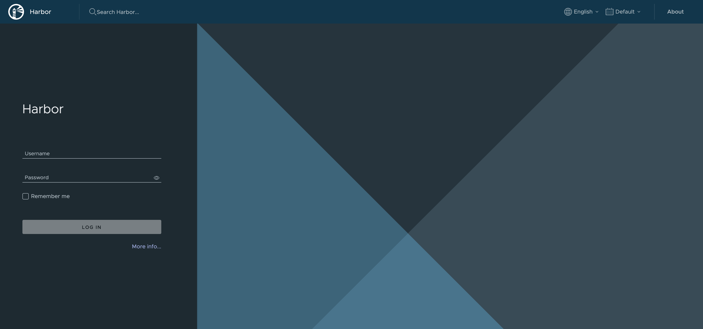

I will use Harbor in the next chapter with Hubble UI.. 


## Hubble UI

As you may recall, I did enable the two features Hubble Relay and Hubble UI as we can se below:

```bash
andreasm@linuxmgmt01:~$ k get svc -n kube-system
NAME             TYPE           CLUSTER-IP      EXTERNAL-IP     PORT(S)                      AGE
hubble-metrics   ClusterIP      None            <none>          9965/TCP                     35h
hubble-peer      ClusterIP      10.23.182.223   <none>          443/TCP                      42h
hubble-relay     ClusterIP      10.23.182.76    <none>          80/TCP                       40h
hubble-ui        ClusterIP      10.23.31.4      <none>          80/TCP                       36h
```

It is not exposed so I can reach from outside the Kubernetes cluster. So let me first start by just creating a serviceType loadBalancer service to expose the Hubble UI clusterIP service. Below is the yaml I use for that:

```yaml
apiVersion: v1
kind: Service
metadata:
  name: hubble-ui-lb
  namespace: kube-system
  labels:
    env: prod
  annotations:
    "io.cilium/lb-ipam-ips": "10.150.11.10"
spec:
  type: LoadBalancer
  ports:
  - port: 8081
    targetPort: 8081
    protocol: TCP
    name: http
  selector:
    k8s-app: hubble-ui
```

Apply it and I should see the service:

```bash
andreasm@linuxmgmt01:~/prod-cluster-1/cilium/services$ k get svc -n kube-system
NAME                    TYPE           CLUSTER-IP      EXTERNAL-IP     PORT(S)                      AGE
hubble-ui-lb            LoadBalancer   10.21.47.47     10.150.11.10    8081:32328/TCP               3d11h

```

There it is, now open my browser and point to this ip:port

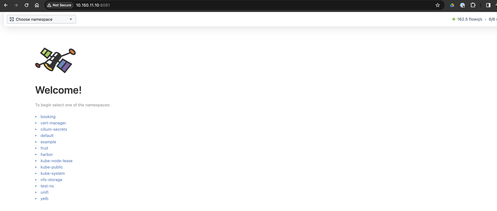

Now let me go to a test application I have deployed in the yelb namespace. Click on it from the list or the dropdown top left corner:


Soo much empty...

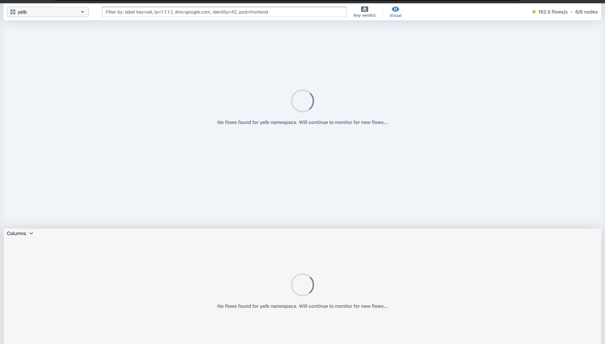

I can see the pods are running:

```bash
andreasm@linuxmgmt01:~/prod-cluster-1/cilium/services$ k get pods -n yelb
NAME                            READY   STATUS    RESTARTS   AGE
redis-server-84f4bf49b5-fq26l   1/1     Running   0          5d18h
yelb-appserver-6dc7cd98-s6kt7   1/1     Running   0          5d18h
yelb-db-84d6f6fc6c-m7xvd        1/1     Running   0          5d18h
```

They are probably not so interested in talking to each other unless they have to. Let me deploy the Fronted service and create some interactions. 

```bash
andreasm@linuxmgmt01:~/prod-cluster-1/cilium$ k apply -f yelb-lb-frontend.yaml
service/yelb-ui created
deployment.apps/yelb-ui created
andreasm@linuxmgmt01:~/prod-cluster-1/cilium$ k get svc -n yelb
NAME             TYPE           CLUSTER-IP      EXTERNAL-IP     PORT(S)        AGE
redis-server     ClusterIP      10.21.67.23     <none>          6379/TCP       5d18h
yelb-appserver   ClusterIP      10.21.81.95     <none>          4567/TCP       5d18h
yelb-db          ClusterIP      10.21.188.43    <none>          5432/TCP       5d18h
yelb-ui          LoadBalancer   10.21.207.114   10.150.11.221   80:32335/TCP   49s

```

I will now open the Yelb UI and do some quick "votes"

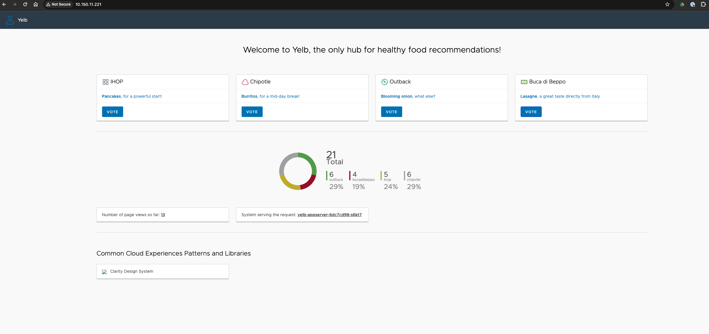

Instantly, even by just opening the yelb webpage I get a lot of flow information in Hubble. And not only that, it automatically creates a "service-map" so I can see the involved services in the Yelb app.


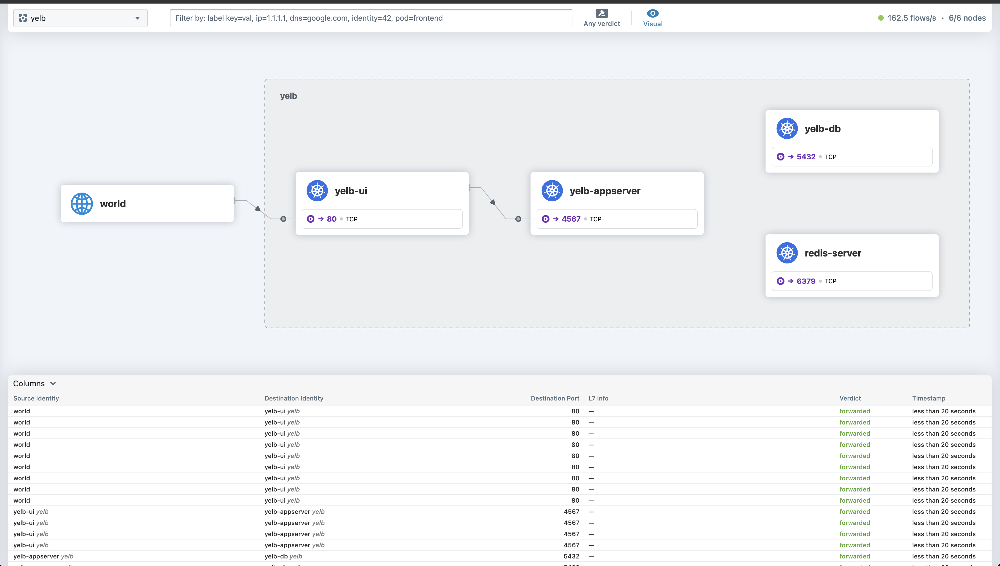

This will only show me L4 information. What about Layer 7? Lets test that also by heading over to Harbor


In Hubble I will switch to the namespace *harbor*

A nice diagram with all involced services, but no L7 Information yet. Well there is, but I have no recent interactions to Harbor using the Gateway API, as soon as I use docker or web-ui against harbor what happens then?

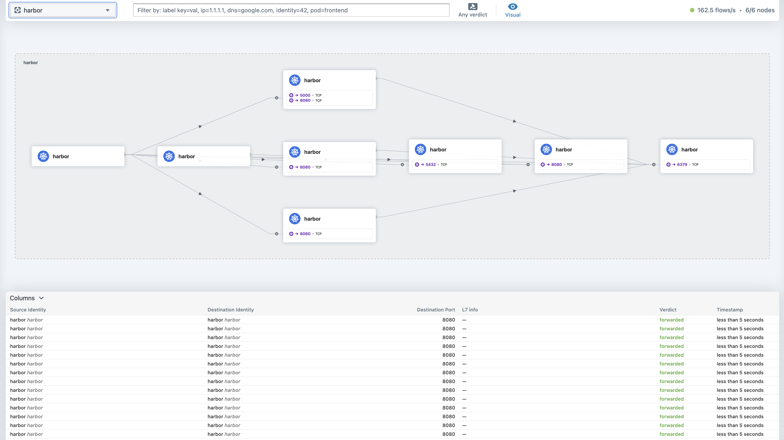

Whats this, an ingress object?

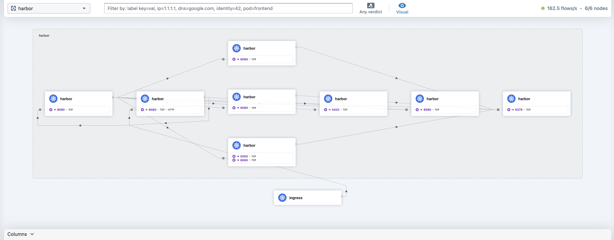

Now when I click on the ingress object:

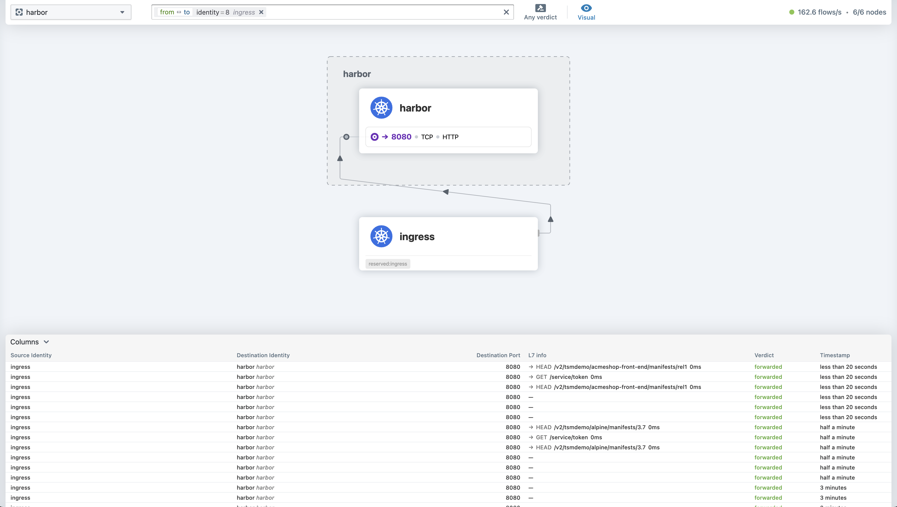

Look at the L7 info coming there. 

I logged out from Harbor:

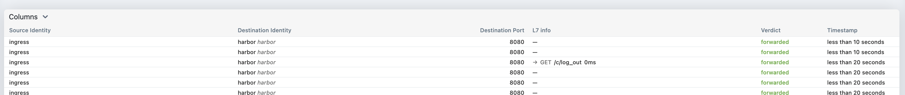

Logged back in:


Browsing the Harbor Projects/repositories:

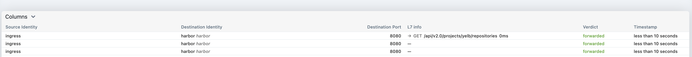

Very rich set of information presented in a very snappy and responsive dashbord. Its instantly updated as soon as there is a request coming. 

For now, this concludes this post.

It has been a nice experience getting a bit more under the hood of Cilium, and so far I must say it looks very good. 


## Things I have not covered yet wich I will at a later stage

I will update this post with some other features at a later stage. Some of the features I am interested looking at is:

- Security policies with Cilium - just have quick look [here](https://docs.cilium.io/en/stable/security/) many interesting [topics](https://docs.cilium.io/en/stable/security/), Host Firewall? 
- Egress
- Cilium Multi-Cluster

