# Traefik ('træfik') Proxy

First thing first, this is probably the first time in any of my blog posts that I can use a letter that is part of my native alphabet, namely the "æ". I tried to look up whether I should stick to Træfik or not, so I ended up on this [post](https://traefik.io/blog/how-to-pronounce-traefik-d06696a3f026/) by Traefik themselves, its not the letter "Æ" itself that is the reason behind the use of it, but it is the phonetic pronunciation of Traefik = 'træfik'. Nice that the letter "æ" has some use internationally though :smile: A fun and nice post though. 
For the rest of the post I will stick to using Traefik instead of Træfik as Træfik is just the logo and how Traefik is pronounced, it is called Traefik (and to be kind to the non native "æ" speakers out there).

From the offical Traefik homepage:

> 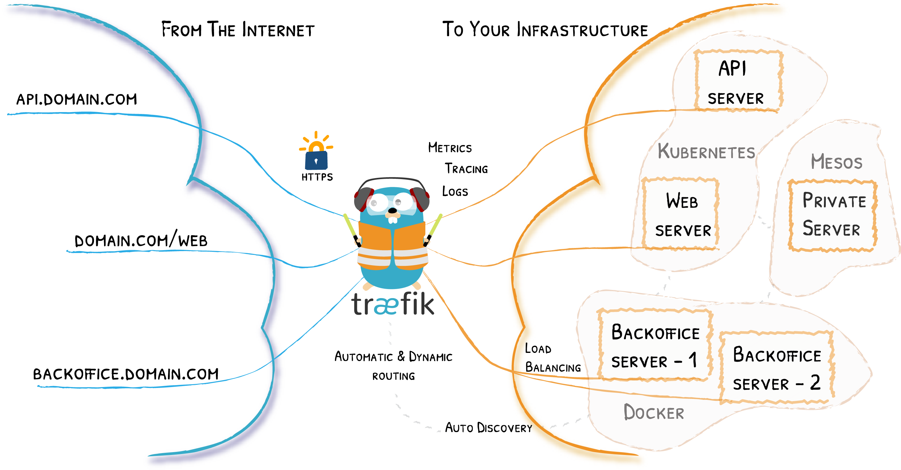
>
> Traefik is an [open-source](https://github.com/traefik/traefik) *Edge Router* that makes publishing your services a fun and easy experience. It receives requests on behalf of your system and finds out which components are responsible for handling them.
>
> What sets Traefik apart, besides its many features, is that it automatically discovers the right configuration for your services. The magic happens when Traefik inspects your infrastructure, where it finds relevant information and discovers which service serves which request.
>
> Traefik is natively compliant with every major cluster technology, such as Kubernetes, Docker, Docker Swarm, AWS, Mesos, Marathon, and [the list goes on](https://doc.traefik.io/traefik/providers/overview/); and can handle many at the same time. (It even works for legacy software running on bare metal.)


Why Traefik...

I needed an advanced reverse proxy for my lab that could cover all kinds of backends, from Kubernetes services, services running in regular workload such as virtual machines. I wanted it to be highly available and to solve one of my challenges when exposing services on the the Internet with one public IP and multiple services using the same port. After some quick research I ended up with Traefik. I am not sure why I exactly landed on Traefik, it could have been Nginx or HAProxy just to mention some of the bigger ones out there, or was it the "Æ"? Traefik offers both paid Enterprise editions, and free open source alternatives. I did not want to use time on a product that has some basic features included in their free open source edition and as soon as I wanted a more advanced feature I had to upgrade to a enterprise solution. After some reading Traefik seemed to have all the features I wanted in their open source product *Traefik Proxy*. 

I decided to write this post as I wanted to document all the configurations I have done so far with Traefik. By searching in different forums, blog pages etc some say it is very easy to manage Traefik. I cant say I found it very easy to begin with, but as with everything new one need to learn how to master it. The official Traefik documentation is very good at describing and explaining all the possibilites with Traefik, but several times I was missing some "real life" example configs. But with the help of the great community out there I managed to solve the challenges I had and make them work with Traefik. So thanks to all the blog pages, forums with people asking questions and people willing to answer and explain. This is much appreciated as always.   

So lets begin this post wth some high level explanations on some terminology used in Traefik, then the installation and how I have configured Traefik to serve as a reverse proxy for some of my services. 

## Important terminology used in Traefik Proxy


### Entrypoints

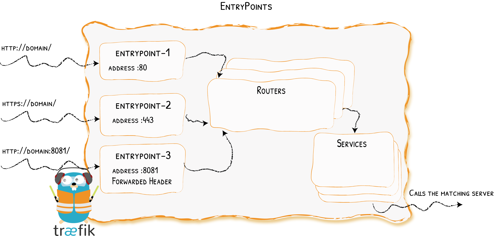

> EntryPoints are the network entry points into Traefik. They define the port which will receive the packets, and whether to listen for TCP or UDP.

In other words either an externally exposed service (NodePort or loadBalancer) or internal service (ClusterIP) defined, the destination endpoints for these entrypoints will here be the Traefik pods responsible for listening to any requests coming their way and do something useful with the traffic if configured. 

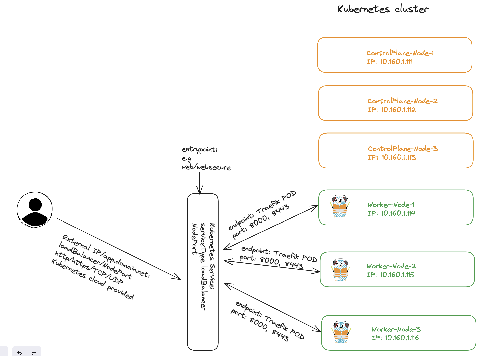

See more [here](https://doc.traefik.io/traefik/routing/entrypoints/)

### Routers

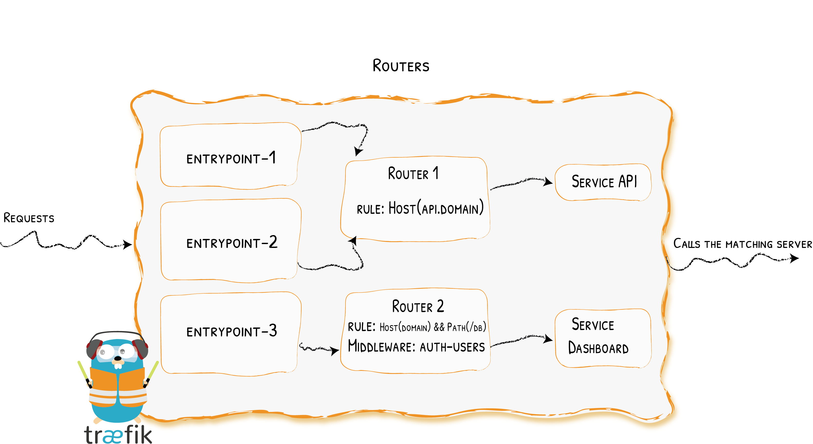

> A router is in charge of connecting incoming requests to the services that can handle them. In the process, routers may use pieces of [middleware](https://doc.traefik.io/traefik/middlewares/overview/) to update the request, or act before forwarding the request to the service.

So this is the actual component that knows which service to forward the requests to based on for example host header.

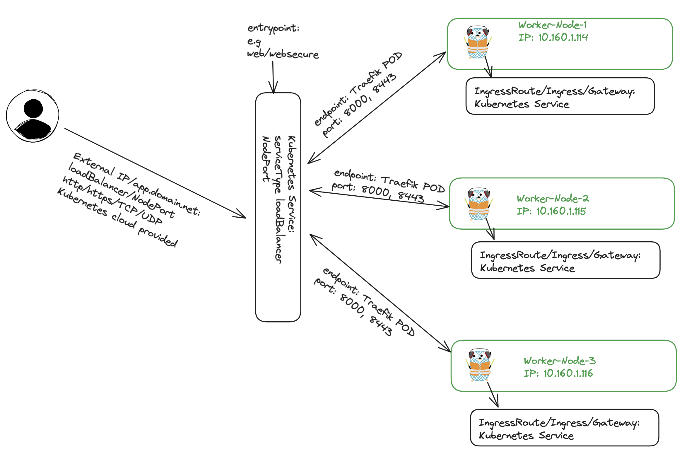

See more [here](https://doc.traefik.io/traefik/routing/routers/)

### Middleware

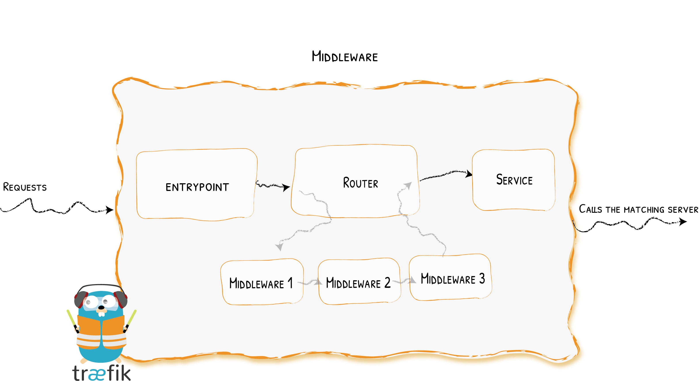

> Attached to the routers, pieces of middleware are a means of tweaking the requests before they are sent to your [service](https://doc.traefik.io/traefik/routing/services/) (or before the answer from the services are sent to the clients).

An example can be the *redirectscheme* to redirect all http requests to https. For a full list of options, hava a look [here](https://doc.traefik.io/traefik/middlewares/overview/)

### Services

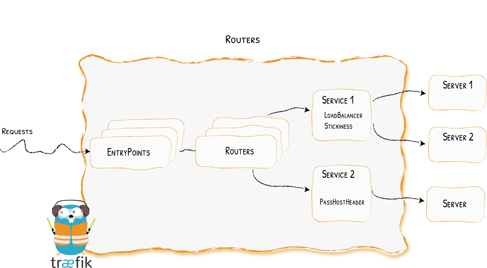

> The `Services` are responsible for configuring how to reach the actual services that will eventually handle the incoming requests.

Services here can be of servicetype loadBalancer, ClusterIP, ExternalName etc

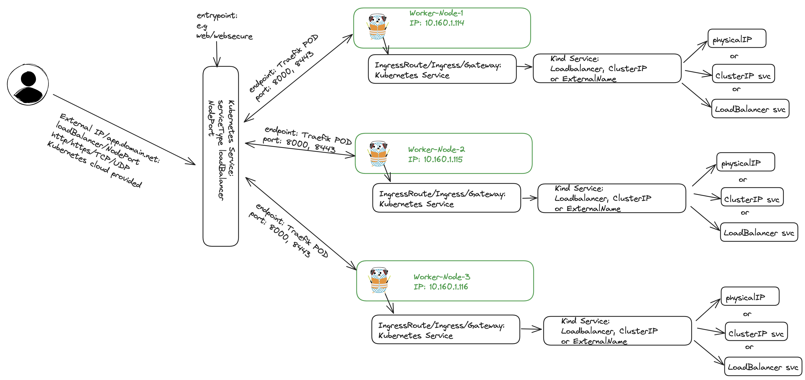


### Providers

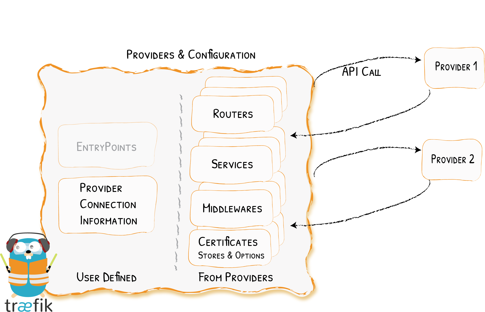

> Configuration discovery in Traefik is achieved through *Providers*.
>
> The *providers* are infrastructure components, whether orchestrators, container engines, cloud providers, or key-value stores. The idea is that Traefik queries the provider APIs in order to find relevant information about routing, and when Traefik detects a change, it dynamically updates the routes.

More info on providers can be found [here](https://doc.traefik.io/traefik/providers/overview/)


## My lab

Before getting into the actual installaton and configuration of Traefik, a quick context.
My lab in this post:

- A physical server running Proxmox
- A physical switch with VLAN and routing support
- Virtual PfSense firewall
- Kubernetes version 1.28.2
- 3x Control Plane nodes (Ubuntu)
- 3x Worker nodes (Ubuntu)
- A management Ubuntu VM (also running on Proxmox) with all tools needed like Helm and kubectl 
- Cert-Manager configured and installed with LetsEncrypt provider
- Cilium has been configured with BGP, LB IPAM pools have been defined an provide external ip addresses to servicetype loadBalancer requests in the Kubernetes cluster

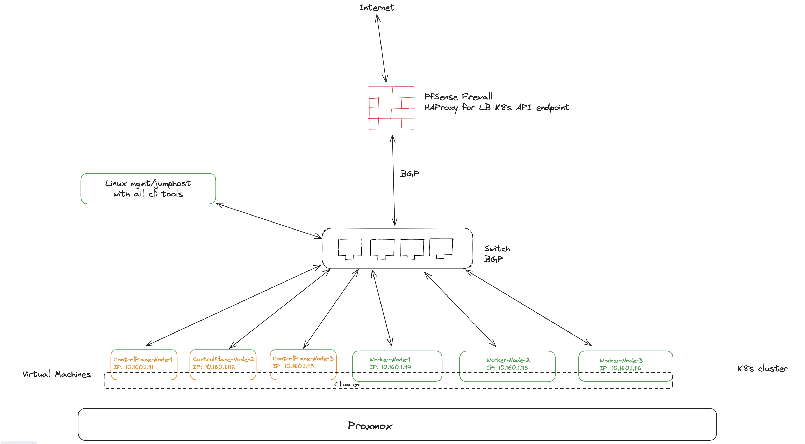

## Deploying Traefik

Traefik can be deployed in Kubernetes using Helm. First I need to add the Traefik Helm repo:

```bash
helm repo add traefik https://traefik.github.io/charts
helm repo update

```

 Now it would be as simple as just installing Traefik using helm install traefik traefik/traefik -n traefik, but I have done some adjustements in the values. So before I install Traefik I have adjusted the chart values for Traefik to use this config. See comments inline below. Note that I have removed all the comments from the default value.yaml and just added my own comments. The value yaml can be fetched by issuing this command: `helm show values traefik/traefik > traefik-values.yaml`

```yaml
image:
  registry: docker.io
  repository: traefik
  tag: ""
  pullPolicy: IfNotPresent

commonLabels: {}

deployment:
  enabled: true
  kind: Deployment
  replicas: 3 ### Adjusted to three for high availability
  terminationGracePeriodSeconds: 60
  minReadySeconds: 0
  annotations: {}
  labels: {}
  podAnnotations: {}
  podLabels: {}
  additionalContainers: []
  additionalVolumes: []
  initContainers:
  # The "volume-permissions" init container is required if you run into permission issues.
  # Related issue: https://github.com/traefik/traefik-helm-chart/issues/396
    - name: volume-permissions
      image: busybox:latest
      command: ["sh", "-c", "touch /data/acme.json; chmod -v 600 /data/acme.json"]
      securityContext:
        runAsNonRoot: true
        runAsGroup: 65532
        runAsUser: 65532
      volumeMounts:
        - name: data
          mountPath: /data
  shareProcessNamespace: false
  dnsConfig: {}
  imagePullSecrets: []
  lifecycle: {}

podDisruptionBudget:
  enabled: false

ingressClass:
  enabled: true
  isDefaultClass: false # I have set this to false as I also have Cilium IngressController

experimental:
  plugins: {}
  kubernetesGateway:
    enabled: false
ingressRoute:
  dashboard:
    enabled: false # I will enable this later
    annotations: {}
    labels: {}
    matchRule: PathPrefix(`/dashboard`) || PathPrefix(`/api`)
    entryPoints: ["traefik"]
    middlewares: []
    tls: {}
  healthcheck:
    enabled: false
    annotations: {}
    labels: {}
    matchRule: PathPrefix(`/ping`)
    entryPoints: ["traefik"]
    middlewares: []
    tls: {}

updateStrategy:
  type: RollingUpdate
  rollingUpdate:
    maxUnavailable: 0
    maxSurge: 1

readinessProbe:
  failureThreshold: 1
  initialDelaySeconds: 2
  periodSeconds: 10
  successThreshold: 1
  timeoutSeconds: 2
livenessProbe:
  failureThreshold: 3
  initialDelaySeconds: 2
  periodSeconds: 10
  successThreshold: 1
  timeoutSeconds: 2

startupProbe:

providers:
  kubernetesCRD:
    enabled: true # set to true
    allowCrossNamespace: true # set to true
    allowExternalNameServices: true # set to true also
    allowEmptyServices: false
    namespaces: []

  kubernetesIngress:
    enabled: true # set to true
    allowExternalNameServices: true # set to true
    allowEmptyServices: false
    namespaces: []
    publishedService:
      enabled: false

  file:
    enabled: false
    watch: true
    content: ""
volumes: []
additionalVolumeMounts: []

logs:
  general:
    level: ERROR
  access:
    enabled: false
    filters: {}
    fields:
      general:
        defaultmode: keep
        names: {}
      headers:
        defaultmode: drop
        names: {}

metrics:
  prometheus:
    entryPoint: metrics
    addEntryPointsLabels: true # set to true
    addRoutersLabels: true # set to true
    addServicesLabels: true # set to true
    buckets: "0.1,0.3,1.2,5.0,10.0" # adjusted according to the official docs

tracing: {}
globalArguments:
- "--global.checknewversion"
- "--global.sendanonymoususage"

additionalArguments: []
env:
- name: POD_NAME
  valueFrom:
    fieldRef:
      fieldPath: metadata.name
- name: POD_NAMESPACE
  valueFrom:
    fieldRef:
      fieldPath: metadata.namespace
envFrom: []

ports: # these are the entrypoints
  traefik:
    port: 9000
    expose: false
    exposedPort: 9000
    protocol: TCP
  web:
    port: 8000
    expose: true
    exposedPort: 80
    protocol: TCP
  websecure:
    port: 8443
    expose: true
    exposedPort: 443
    protocol: TCP
    http3:
      enabled: false
    tls:
      enabled: true
      options: ""
      certResolver: ""
      domains: []
    middlewares: []
  metrics:
    port: 9100
    expose: true
    exposedPort: 9100
    protocol: TCP

tlsOptions: {}

tlsStore: {}

service:
  enabled: false # I will create this later, set to false, all values below will be ignored
  single: true
  type: LoadBalancer
  annotations: {}
  annotationsTCP: {}
  annotationsUDP: {}
  labels:
    env: prod
  spec:
    loadBalancerIP: "10.150.11.11"
  loadBalancerSourceRanges: []
  externalIPs: []


autoscaling:
  enabled: false #This is interesting, need to test


persistence:
  enabled: true
  resourcePolicy: "keep" # I have added this to keep the PVC even after uninstall
  name: data
  accessMode: ReadWriteOnce
  size: 128Mi
  path: /data
  annotations: {}

certResolvers: {}

hostNetwork: false

rbac:
  enabled: true

  namespaced: false
podSecurityPolicy:
  enabled: false

serviceAccount:
  name: ""

serviceAccountAnnotations: {}


resources: {}

nodeSelector: {}

tolerations: []
topologySpreadConstraints: []

priorityClassName: ""


securityContext:
  capabilities:
    drop: [ALL]
  readOnlyRootFilesystem: true
  allowPrivilegeEscalation: false

podSecurityContext:
  fsGroupChangePolicy: "OnRootMismatch"
  runAsGroup: 65532
  runAsNonRoot: true
  runAsUser: 65532
extraObjects: []


```

Now I can install Traefik using the following command:

```bash
helm install traefik traefik/traefik -f traefik-values.yaml -n traefik
# or 
helm upgrade -i traefik traefik/traefik -f traefik-values.yaml -n traefik
When updating changes etc. or just use from the start. 
```

After a successful installation we should see this message:

```bash
Release "traefik" has been upgraded. Happy Helming!
NAME: traefik
LAST DEPLOYED: Wed Dec 27 20:36:23 2023
NAMESPACE: traefik
STATUS: deployed
REVISION: 15
TEST SUITE: None
NOTES:
Traefik Proxy v2.10.6 has been deployed successfully on traefik namespace !

🚨 When enabling persistence for certificates, permissions on acme.json can be
lost when Traefik restarts. You can ensure correct permissions with an
initContainer. See https://github.com/traefik/traefik-helm-chart/issues/396 for
more info. 🚨
```

Now I should also have a bunch of CRDs, an additional IngressClass (if you have a couple from before as I did).

```bash
andreasm@linuxmgmt01:~/prod-cluster-1/traefik$ k get crd
NAME                                         CREATED AT
ingressroutes.traefik.containo.us            2023-12-24T08:53:45Z
ingressroutes.traefik.io                     2023-12-24T08:53:45Z
ingressroutetcps.traefik.containo.us         2023-12-24T08:53:45Z
ingressroutetcps.traefik.io                  2023-12-24T08:53:45Z
ingressrouteudps.traefik.containo.us         2023-12-24T08:53:45Z
ingressrouteudps.traefik.io                  2023-12-24T08:53:45Z
middlewares.traefik.containo.us              2023-12-24T08:53:45Z
middlewares.traefik.io                       2023-12-24T08:53:45Z
middlewaretcps.traefik.containo.us           2023-12-24T08:53:45Z
middlewaretcps.traefik.io                    2023-12-24T08:53:46Z
serverstransports.traefik.containo.us        2023-12-24T08:53:45Z
serverstransports.traefik.io                 2023-12-24T08:53:46Z
serverstransporttcps.traefik.io              2023-12-24T08:53:46Z
tlsoptions.traefik.containo.us               2023-12-24T08:53:45Z
tlsoptions.traefik.io                        2023-12-24T08:53:46Z
tlsstores.traefik.containo.us                2023-12-24T08:53:45Z
tlsstores.traefik.io                         2023-12-24T08:53:46Z
traefikservices.traefik.containo.us          2023-12-24T08:53:45Z
traefikservices.traefik.io                   2023-12-24T08:53:46Z
```

A note on this list of CRDs above. The former Traefik APIs used the *traefik.containo.us* but from version Traefik 2.x they are now using the APIs *traefik.io* the former APIs are there for backward compatibility.

Below I can see the new Traefik Ingress controller.

```bash
andreasm@linuxmgmt01:~/prod-cluster-1/traefik$ k get ingressclasses.networking.k8s.io
NAME      CONTROLLER                      PARAMETERS   AGE
cilium    cilium.io/ingress-controller    <none>       10d
traefik   traefik.io/ingress-controller   <none>       59s
```

Deployment info:


```bash
andreasm@linuxmgmt01:~/prod-cluster-1/traefik$ k get all -n traefik
NAME                           READY   STATUS    RESTARTS   AGE
pod/traefik-59657c9c59-75cxg   1/1     Running   0          27h
pod/traefik-59657c9c59-p2kdv   1/1     Running   0          27h
pod/traefik-59657c9c59-tqcrm   1/1     Running   0          27h

NAME                             TYPE           CLUSTER-IP     EXTERNAL-IP    PORT(S)                      AGE
# No services...
NAME                      READY   UP-TO-DATE   AVAILABLE   AGE
deployment.apps/traefik   3/3     3            3           2d11h

NAME                                 DESIRED   CURRENT   READY   AGE
replicaset.apps/traefik-59657c9c59   3         3         3       27h

```


Now it is all about configuring Traefik to receieve the requests, configure routes, middleware and services. I will start by getting the Traefik dashboard up. 

## EntryPoints

As I have disabled all the services in the Helm value yaml none are created, therefore I need to create these entrypoints before anything can reach Traefik.

A quick explanation why wanted to create these myself. One can have multiple entrypoints to Traefik, even in the same Kubernetes cluster. Assume I want to use different IP addresses and subnets for certain services, some may even call it VIPs, for IP separation, easier physical firewall creation etc. Then I need to create these services to expose the entrypoints I want to use. The Helm chart enables 4 entrypoints by default: web port 8000 (http), websecure port 8443 (https), traefik port 9000 and metrics port 9100 TCP. But these are only configured on the Traefik pods themselves, there is no service to expose them either internally in the cluster or outside. So I need to create these external or internal services to expose these entrypoints. 

Describe the pod to see the ports and labels:

```bash
  andreasm@linuxmgmt01:~/prod-cluster-1/traefik$ k describe pod -n traefik traefik-59657c9c59-75cxg
Name:             traefik-59657c9c59-75cxg
Namespace:        traefik
Priority:         0
Service Account:  traefik
Node:             k8s-prod-node-01/10.160.1.114
Start Time:       Tue, 26 Dec 2023 17:03:23 +0000
Labels:           app.kubernetes.io/instance=traefik-traefik
                  app.kubernetes.io/managed-by=Helm
                  app.kubernetes.io/name=traefik
  traefik:
    Container ID:  containerd://b6059c9c6cdf45469403fb153ee8ddd263a870d3e5917a79e0181f543775a302
    Image:         docker.io/traefik:v2.10.6
    Image ID:      docker.io/library/traefik@sha256:1957e3314f435c85b3a19f7babd53c630996aa1af65d1f479d75539251b1e112
    Ports:         9100/TCP, 9000/TCP, 8000/TCP, 8443/TCP
    Host Ports:    0/TCP, 0/TCP, 0/TCP, 0/TCP
    Args:
      --global.checknewversion
      --global.sendanonymoususage
      --entrypoints.metrics.address=:9100/tcp
      --entrypoints.traefik.address=:9000/tcp
      --entrypoints.web.address=:8000/tcp
      --entrypoints.websecure.address=:8443/tcp
      --api.dashboard=true
      --ping=true
      --metrics.prometheus=true
      --metrics.prometheus.entrypoint=metrics
      --metrics.prometheus.addRoutersLabels=true
      --metrics.prometheus.addEntryPointsLabels=true
      --metrics.prometheus.addServicesLabels=true
      --metrics.prometheus.buckets=0.1,0.3,1.2,5.0,10.0
      --providers.kubernetescrd
      --providers.kubernetescrd.allowCrossNamespace=true
      --providers.kubernetescrd.allowExternalNameServices=true
      --providers.kubernetesingress
      --providers.kubernetesingress.allowExternalNameServices=true
      --entrypoints.websecure.http.tls=true
```

My first service I define and apply will primarily be used for management, interacting with Traefik internal services using the correct label selector to select the Traefik pods and refering to the two entrypoint *web* and *websecure*. This is how the first entrypoint is defined:

```yaml
apiVersion: v1
kind: Service
metadata:
  annotations:
    io.cilium/lb-ipam-ips: "10.150.11.11"
  name: traefik-mgmt
  labels:
    env: prod
  namespace: traefik
spec:
  ports:
  - name: web
    port: 80
    protocol: TCP
    targetPort: web
  - name: websecure
    port: 443
    protocol: TCP
    targetPort: websecure
  selector:
    app.kubernetes.io/name: traefik
  type: LoadBalancer
```

This will create a servicetype LoadBalancer, the IP address is fixed by using the annotation and my confiigured Cilium LB-IPAM pool will provide the IP address for the service and BGP control plane will take care of advertising the IP address for me. 

Lets apply the above yaml and check the service:

```bash
andreasm@linuxmgmt01:~/prod-cluster-1/traefik$ k get svc -n traefik
NAME                     TYPE           CLUSTER-IP     EXTERNAL-IP    PORT(S)                      AGE
traefik-mgmt             LoadBalancer   10.21.183.19   10.150.11.11   80:30343/TCP,443:30564/TCP   49s
```

 This means I can now start registering relevant DNS records to this external IP and Traefik will receieve requests coming to this address/service. 

But as I would like to separate out services by type/function using different ip addresses I have created another service using the same entrypoints but with a different external-ip.

```yaml
apiVersion: v1
kind: Service
metadata:
  annotations:
    io.cilium/lb-ipam-ips: "10.150.16.10"
  name: traefik-exposed-pool-1
  labels:
    env: traefik-pool-1
  namespace: traefik
spec:
  ports:
  - name: web
    port: 80
    protocol: TCP
    targetPort: web
  - name: websecure
    port: 443
    protocol: TCP
    targetPort: websecure
  selector:
    app.kubernetes.io/name: traefik
  type: LoadBalancer
```

I can go ahead and register DNS records against this IP address also and they will be forwarded to Traefik to handle. 

The beauty of this is that I can create as many services I want, using different external-ip addresses, and even specify different Traefik entrypoints. In my physical firewall I can more easily create firewall rules allowing or denying which source is allowed to reach these ip-addresses and then separate out apps from apps, services from services. Like in the next chapter when I expose the Traefik Dashboard. 


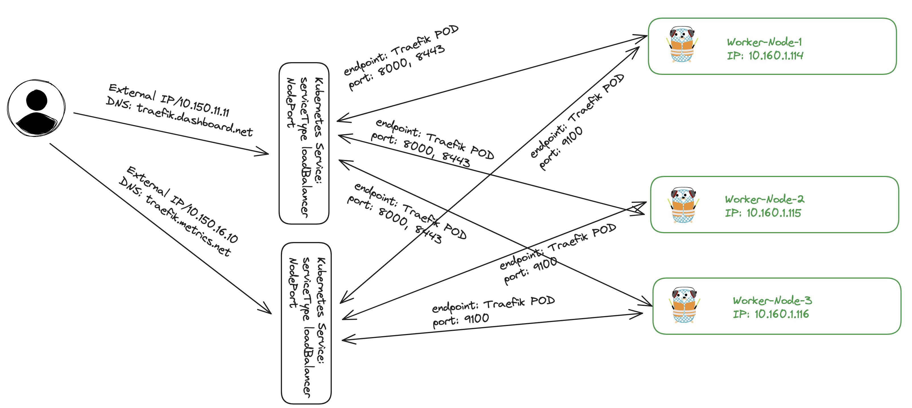


## Traefik Dashbord

Traffic comes with a nice dashboard which gives a quick overview of services enabled, status and detailed information:

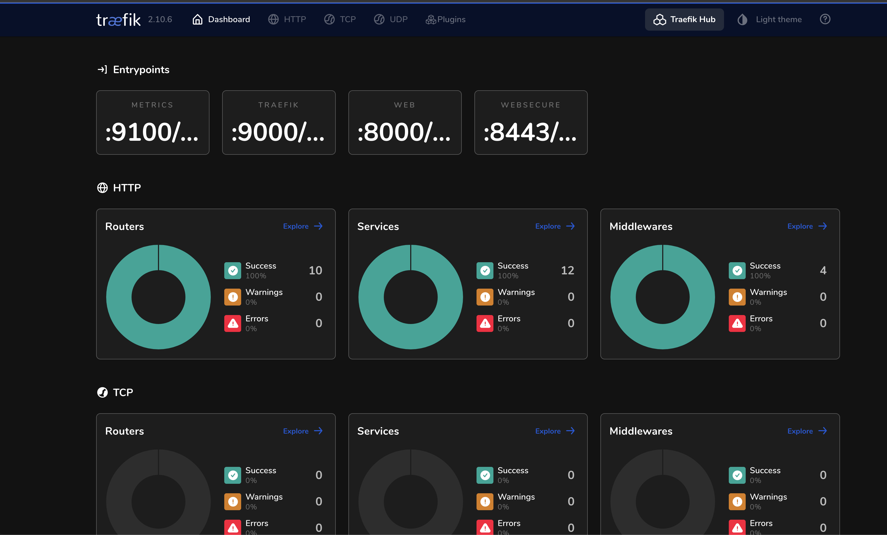

As I have not enabled any services I will need to define these to make the Dashboard accessible. I also want it accessible from outside my Kubernetes cluster using basic authentication.

I will prepare three yaml files. The first one will be the secret for the authentication part, the second the middleware config to enable basic authentication and the third and final the actual IngressRoute. 

For the secret I used the following command to generate a base64 encoded string containing both username and password:

```bash
andreasm@linuxmgmt01:~/temp$ htpasswd -nb admin 'password' | openssl base64
YWRtaW46JGFwcjEkmlBejdSYnZW5uN1oualB1Lm1LOUo0dVhqVDB3LgoK
```

Then I created the 01-secret.yaml and pasted the bas64 output above

```yaml
apiVersion: v1
kind: Secret
metadata:
  name: traefik-dashboard-auth
  namespace: traefik

data:
  users: YWRtaW4JGFwcEkdmlBejdSYnEkZW5uN1oualB1Lm1LOUo0dVhqVDB3LgoK
```


The second yaml, the 02-middleware.yaml, to enable basic authentication:

```yaml
apiVersion: traefik.io/v1alpha1
kind: Middleware
metadata:
  name: traefik-dashboard-basicauth
  namespace: traefik

spec:
  basicAuth:
    secret: traefik-dashboard-auth
```

Then the last yaml, the dashboard IngressRoute:


```yaml
apiVersion: traefik.io/v1alpha1
kind: IngressRoute
metadata:
  name: traefik-dashboard
  namespace: traefik

spec:
  entryPoints:
    - websecure

  routes:
    - match: Host(`traefik-ui.my-domain.net`)
      kind: Rule
      middlewares:
        - name: traefik-dashboard-basicauth
          namespace: traefik
      services:
#        - name: traefik-mgmt
        - name: api@internal
          kind: TraefikService
  tls:
    secretName: my-doamin-net-tls-prod
```

 

Notice I refer to a tls secret? More on this just a tad later.

Lets see the three objects created. 

```bash
andreasm@linuxmgmt01:~/prod-cluster-1/traefik/traefik-dashboard$ k get secrets -n traefik
NAME                             TYPE                 DATA   AGE
traefik-dashboard-auth           Opaque               1      39s
andreasm@linuxmgmt01:~/prod-cluster-1/traefik/traefik-dashboard$ k get middleware.traefik.io -n traefik
NAME                          AGE
traefik-dashboard-basicauth   55s
andreasm@linuxmgmt01:~/prod-cluster-1/traefik/traefik-dashboard$ k get ingressroutes.traefik.io -n traefik
NAME                         AGE
traefik-dashboard            1m
```


I have created a DNS record to point to external-ip of the traefik-mgmt service and made sure the Host definition in the IngressRoute matches this dns. 

Now the dashboard is available and prompting for username and password. 

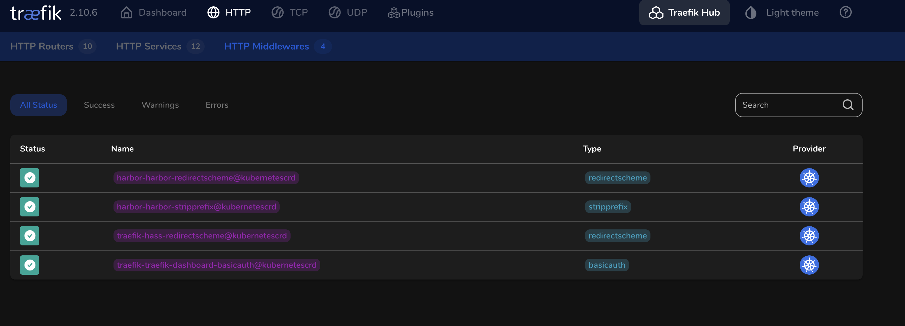

The official doc [here](https://doc.traefik.io/traefik/getting-started/install-traefik/#exposing-the-traefik-dashboard) for more info.

## Cert-Manager

Instead of configuring Traefik to generate the certificates I need for my HTTPS services I have already configured Cert-Manager to create the certificates I need, you can read how I have done it [here](https://blog.andreasm.io/2022/10/11/cert-manager-and-letsencrypt/). I use mostly wildcard certificates, and dont see the need to request certificates all the time.

Then I use reflector to share/sync the certificates across namespaces. Read more on reflector [here](https://cert-manager.io/v1.8-docs/faq/sync-secrets/#using-reflector) and [here](https://github.com/emberstack/kubernetes-reflector/blob/main/README.md).


## Monitoring with Prometheus and Grafana

Another nice feature is Traefik's built in Prometheus metrics. These Prometheus metrics can then be used as datasource in Grafana. So here is how I configured Prometheus and Grafana. 

I followed these two blog's [here](https://traefik.io/blog/capture-traefik-metrics-for-apps-on-kubernetes-with-prometheus/) and [here](https://roundly-consulting.com/blog/grafana-with-prometheus-for-traefik-in-minikube), used them in combination to configure Traefik with Prometheus.

### Prometheus

I will start by getting Prometheus up and running, then Grafana

In my Traefik value.yaml I made these changes before I ran helm upgrade on the Traefik installation:

```yaml
metrics:
  ## -- Prometheus is enabled by default.
  ## -- It can be disabled by setting "prometheus: null"
  prometheus:
    # -- Entry point used to expose metrics.
    entryPoint: metrics
    ## Enable metrics on entry points. Default=true
    addEntryPointsLabels: true
    ## Enable metrics on routers. Default=false
    addRoutersLabels: true
    ## Enable metrics on services. Default=true
    addServicesLabels: true
    ## Buckets for latency metrics. Default="0.1,0.3,1.2,5.0"
    buckets: "0.1,0.3,1.2,5.0,10.0"
```

First I registered a DNS record on the external-ip service below with the name prometheus-traefik.my-domain.net as I consider this also a service that belongs within the management category. Now I have two dns records pointing to the same IP (the traefik-ui above included). 

```bash
NAME                      TYPE           CLUSTER-IP      EXTERNAL-IP    PORT(S)
traefik-mgmt              LoadBalancer   10.21.183.19    10.150.11.11   80:30343/TCP,443:30564/TCP
```

I will prepare 6 different yaml files. All files will be explained below. 
First yaml *traefik-metrics-service*:

```yaml
apiVersion: v1
kind: Service
metadata:
  name: traefik-metrics
  namespace: traefik
spec:
  ports:
    - name: metrics
      protocol: TCP
      port: 9100
      targetPort: metrics
  selector:
    app.kubernetes.io/instance: traefik-traefik
    app.kubernetes.io/name: traefik
  type: ClusterIP
```

As I followed the two blogs above there is a couple of approaches to make this work, and this first file is kind of optional if you dont want to expose the metrics through an IngressRoute or other means outside your Kubernetes cluster. 

But for an easy way to just check whether there is metrics coming one can temporarily expose this information. Again as I have not enabled any services in the Helm values during installation of Traefik I need to create a service that expose the metrics entrypoint using ClusterIP. I am using ClusterIP as I am not planning on making it available outside the same Kubernetes cluster as Traefik is running in.

Then the second file is the Prometheus configMap telling Promethus what to scrape. I found that the information covered in the Traefik blog [post](https://traefik.io/blog/capture-traefik-metrics-for-apps-on-kubernetes-with-prometheus/) gave more information in Prometheus so I used that one:

```yaml
apiVersion: v1
kind: ConfigMap
metadata:
  name: prometheus-config
  namespace: prometheus
data:
  prometheus.yml: |
    global:
      scrape_interval: 5s
      evaluation_interval: 5s
    scrape_configs:
    - job_name: 'traefik'
      kubernetes_sd_configs:
        - role: pod
          selectors:
            - role: pod
              label: "app.kubernetes.io/name=traefik"
      relabel_configs:
        - source_labels: [__meta_kubernetes_pod_annotation_prometheus_io_scrape]
          action: keep
          regex: true
        - source_labels: [__meta_kubernetes_pod_annotation_prometheus_io_path]
          action: replace
          target_label: __metrics_path__
          regex: (.+)
        - source_labels: [__address__, __meta_kubernetes_pod_annotation_prometheus_io_port]
          action: replace
          regex: ([^:]+)(?::\\d+)?;(\\d+)
          replacement: $1:$2
          target_label: __address__
        - source_labels: [__meta_kubernetes_service_annotation_prometheus_io_scheme]
          action: replace
          target_label: __scheme__
          regex: (https?)
```

This approach will scrape the metrics from the relevant Traefik pods, using annotation. But it also means I need to give the Prometheus pod access to scrape pods not in its own namespace. So I will go ahead and create a service account, role and role binding for that:

```bash
andreasm@linuxmgmt01:~/prod-cluster-1/traefik/traefik-dashboard$ kubectl -n prometheus create serviceaccount prometheus
serviceaccount/prometheus created
andreasm@linuxmgmt01:~/prod-cluster-1/traefik/traefik-dashboard$ k create clusterrole prometheus --verb=get,list,watch --resource=pods,services,endpoints
clusterrole.rbac.authorization.k8s.io/prometheus created
andreasm@linuxmgmt01:~/prod-cluster-1/traefik/traefik-dashboard$ kubectl create clusterrolebinding prometheus --clusterrole=prometheus --serviceaccount=prometheus:prometheus
clusterrolebinding.rbac.authorization.k8s.io/prometheus created 
```

Then I created the third yaml file that creates the PersistentVolumeClaim for my Prometheus instance:

```yaml
apiVersion: v1
kind: PersistentVolumeClaim
metadata:
  name: prometheus-storage-persistence
  namespace: prometheus
spec:
  accessModes:
    - ReadWriteOnce
  resources:
    requests:
      storage: 10Gi
```

The fourth file is the actual Promethus deployment, refering to the objects created in the previous yamls:

```yaml
apiVersion: apps/v1
kind: Deployment
metadata:
  name: prometheus
  namespace: prometheus
spec:
  selector:
    matchLabels:
      app: prometheus
  replicas: 1
  template:
    metadata:
      labels:
        app: prometheus
    spec:
      serviceAccountName: prometheus # Remember to add the serviceaccount for scrape access
      containers:
      - name: prometheus
        image: prom/prometheus:latest
        ports:
        - containerPort: 9090
          name: default
        volumeMounts:
        - name: prometheus-storage
          mountPath: /prometheus
        - name: config-volume
          mountPath: /etc/prometheus
      volumes:
        - name: prometheus-storage
          persistentVolumeClaim:
            claimName: prometheus-storage-persistence
        - name: config-volume
          configMap:
            name: prometheus-config
```


The fifth yaml file is the Prometheus service where I expose Prometheus internally in the cluster:

```yaml
kind: Service
apiVersion: v1
metadata:
  name: prometheus
  namespace: prometheus
spec:
  selector:
    app: prometheus
  type: ClusterIP
  ports:
  - protocol: TCP
    port: 9090
    targetPort: 9090
```

The last yaml is the IngressRoute if I want to access Promethus outside my Kubernetes Cluster. Strictly optional if Grafana is also deployed in the same cluster as it can then just use the previously created ClusterIP service. But nice to have if in need to troubleshoot etc. 

```yaml
apiVersion: traefik.io/v1alpha1
kind: IngressRoute
metadata:
  name: prometheus
  namespace: prometheus
spec:
  entryPoints:
    - websecure
  routes:
    - kind: Rule
      match: Host(`prometheus-traefik.my-domain.net`)
      services:
        - kind: Service
          name: prometheus
          port: 9090
```

Here comes the DNS record into play, the record I created earlier. Now after I have applied all the above yaml Prometheus should be up and running and I can use the IngressRoute to access the Prometheus Dashboard from my laptop.

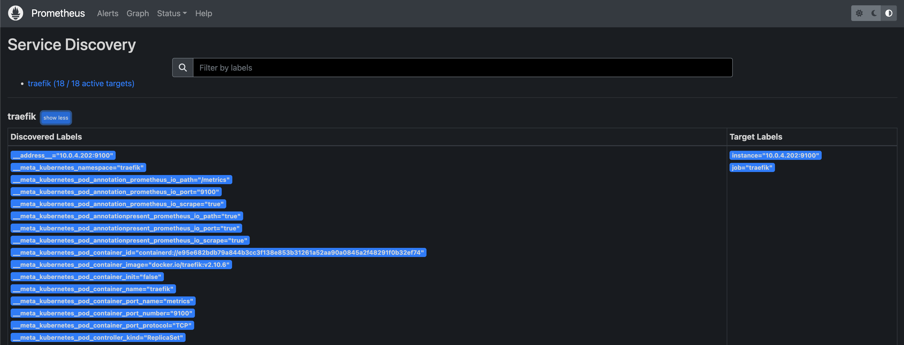

### Grafana

Now I more or less just need to install Grafana, add the Prometheus ClusterIP as datasource. To install Grafana, that is easily done by using Helm. Below is the steps I did to install Grafana:

```bash
helm repo add grafana https://grafana.github.io/helm-charts
helm repo update
## grabbing the default values
helm show values grafana/grafana > grafana-values.yaml

```

Below is the changes I have done in the value.yaml I am using to install Grafana:

```yaml
## Configure grafana datasources
## ref: http://docs.grafana.org/administration/provisioning/#datasources
##
datasources:
  datasources.yaml:
    apiVersion: 1
    datasources:
    - name: Prometheus-traefik
      type: prometheus
      url: http://prometheus.prometheus.svc.cluster.local:9090
      access: proxy
      editable: true
      orgId: 1
      version: 1
      isDefault: true
ingress:
  enabled: false
persistence:
#  type: pvc
  enabled: true
#  resourcePolicy: "keep"
  # storageClassName: default
  accessModes:
    - ReadWriteOnce
  size: 10Gi
  annotations:
    helm.sh/resource-policy: "keep"
  finalizers:
    - kubernetes.io/pvc-protection
  # selectorLabels: {}
  ## Sub-directory of the PV to mount. Can be templated.
  # subPath: ""
  ## Name of an existing PVC. Can be templated.
  # existingClaim:
  ## Extra labels to apply to a PVC.
  extraPvcLabels: {}
## Expose the grafana service to be accessed from outside the cluster (LoadBalancer service).
## or access it from within the cluster (ClusterIP service). Set the service type and the port to serve it.
## ref: http://kubernetes.io/docs/user-guide/services/
##
service:
  enabled: true
  type: ClusterIP
  port: 80
  targetPort: 3000
    # targetPort: 4181 To be used with a proxy extraContainer
  ## Service annotations. Can be templated.
  annotations: {}
  labels: {}
  portName: service
  # Adds the appProtocol field to the service. This allows to work with istio protocol selection. Ex: "http" or "tcp"
  appProtocol: ""
# Administrator credentials when not using an existing secret (see below)
adminUser: admin
adminPassword: 'password'
```

This will deploy Grafana with a pvc, not deleted if the Helm installation of Grafana is uninstalled, it will create a ClusterIP exposing the Grafana UI internally in the cluster. So I need to create an IngressRoute to expose it outside the cluster using Traefik. 

Below is the IngressRoute for this:

```yaml
apiVersion: traefik.io/v1alpha1
kind: IngressRoute
metadata:
  name: grafana-ingressroute
  namespace: grafana
spec:
  entryPoints:                      
    - web
  routes:                           
  - kind: Rule
    match: Host(`grafana-prod.my-domain.net`) 
    services:                       
    - kind: Service
      name: grafana
      passHostHeader: true
      namespace: grafana
      port: 80                      
```

Again, the match Host DNS is already registered using the same ExternalIP as the Prometheus one.

Now Grafana should be  up and running.

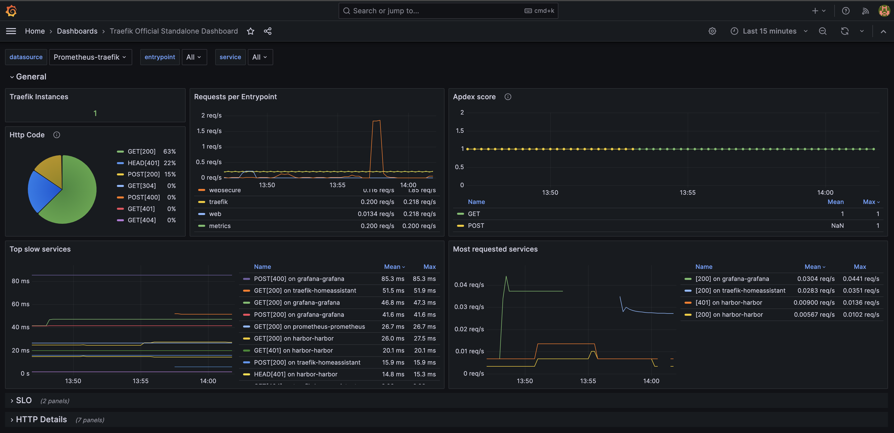

Dashboard depicted above is the *Traefik Official Standalone Dashboard* which can be imported from [here](https://grafana.com/grafana/dashboards/17346-traefik-official-standalone-dashboard/) or use the following ID: 17346. 

Thats it for monitoring with Prometheus and Grafana. Now onto just a simple web application.

## Test application Yelb

I wanted to just expose my test application Yelb deployed twice, but using two different DNS records. I also wanted these services to be exposed using a completely different subnet, to create the IP separation I have mentioned a couple of times. 
I have already deployed the Yelb application twice in my cluster in their own respective namespaces:

```bash
andreasm@linuxmgmt01:~/prod-cluster-1/traefik/grafana$ k get pods -n yelb
NAME                            READY   STATUS    RESTARTS   AGE
redis-server-84f4bf49b5-fq26l   1/1     Running   0          13d
yelb-appserver-6dc7cd98-s6kt7   1/1     Running   0          13d
yelb-db-84d6f6fc6c-m7xvd        1/1     Running   0          13d
yelb-ui-6fbbcc4c87-qjdzg        1/1     Running   0          2d20h
```

```bash
andreasm@linuxmgmt01:~/prod-cluster-1/traefik/grafana$ k get pods -n yelb-2
NAME                            READY   STATUS    RESTARTS   AGE
redis-server-84f4bf49b5-4sx7f   1/1     Running   0          2d16h
yelb-appserver-6dc7cd98-tqkkh   1/1     Running   0          2d16h
yelb-db-84d6f6fc6c-t4td2        1/1     Running   0          2d16h
yelb-ui-2-84cc897d6d-64r9x      1/1     Running   0          2d16h
```

I want to expose the yelb-ui in both namespaces on their different DNS records using IngressRoutes. I also want to use a completely different external IP address than what I have been using so far under the management category. So this time I will be using this external-ip:

```yaml
apiVersion: v1
kind: Service
metadata:
  annotations:
    io.cilium/lb-ipam-ips: "10.150.16.10"
  name: traefik-exposed-pool-1
  labels:
    env: traefik-pool-1
  namespace: traefik
spec:
  ports:
  - name: web
    port: 80
    protocol: TCP
    targetPort: web
  - name: websecure
    port: 443
    protocol: TCP
    targetPort: websecure
  selector:
    app.kubernetes.io/name: traefik
  type: LoadBalancer
```

So I will need to register two DNS records against the IP above: 10.150.16.10 with the following names: 
*yellb-1.my-domain-net" and yelb-2.my-domain.net*

Then I can expose the Yelb UI services from both the namespaces yelb and yelb-2 with the following IngressRoutes:

```yaml
apiVersion: traefik.io/v1alpha1
kind: IngressRoute
metadata:
  name: yelb-ingressroute-1
  namespace: yelb
spec:
  entryPoints:                      
    - web
  routes:                           
  - kind: Rule
    match: Host(`yelb-1.my-domain.net`) 
    services:                       
    - kind: Service
      name: yelb-ui-1
      passHostHeader: true
      namespace: yelb
      port: 80                      
```


```yaml
apiVersion: traefik.io/v1alpha1
kind: IngressRoute
metadata:
  name: yelb-ingressroute-2
  namespace: yelb-2
spec:
  entryPoints:                      
    - web
  routes:                           
  - kind: Rule
    match: Host(`yelb-2.my-domain.net`) 
    services:                       
    - kind: Service
      name: yelb-ui-2
      passHostHeader: true
      namespace: yelb-2
      port: 80                      
```

The two IngressRoutes applied:

```bash
andreasm@linuxmgmt01:~/prod-cluster-1/cilium/test-apps/yelb$ k get ingressroutes.traefik.io -n yelb
NAME                  AGE
yelb-ingressroute-1   2d20h
andreasm@linuxmgmt01:~/prod-cluster-1/cilium/test-apps/yelb$ k get ingressroutes.traefik.io -n yelb-2
NAME                  AGE
yelb-ingressroute-2   2d16h
```

Now I can access both of them using their own dns records:

Yelb-1

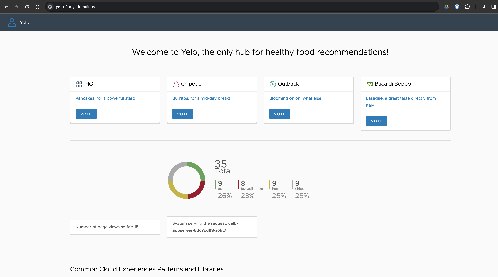

Yelb-2

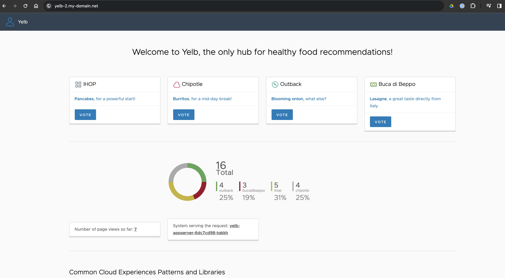


## Traefik in front of my Home Assistant server

Another requirement I had was to expose my Home Assistant server using Traefik, including MQTT. This is how I configured Traefik to handle this.

### Home Assistant port 8123

As Home Assistant is running outside my Kubernetes cluster I needed to create an ExternalName service in my Kubernetes cluster for Traefik to use when forwarding requests to my "external" Home Assistant server. 

```yaml
kind: Service
apiVersion: v1
metadata:
  labels:
    k8s-app: external-homeassistant
  name: external-homeassistant
  namespace: traefik
spec:
  type: ExternalName
  ports:
    - name: homeassistant
      port: 8123
      targetPort: 8123
      protocol: TCP
  externalName: 10.100.2.14
  selector:
    app.kubernetes.io/instance: traefik
    app.kubernetes.io/name: traefik
```

The IP is the IP of my Home Assistant server and the port it is listening on. I decided to place the service in the same namespace as Traefik as Home Assistant is not residing in any namespaces in my Kubernetes cluster. 

For this to work I needed to make sure my Traefik installation had this value enabled in my value.yaml config before running the helm upgrade of the Traefik installation:

```yaml
providers:
  kubernetesCRD:
      # -- Allows to reference ExternalName services in IngressRoute
    allowExternalNameServices: true
  
```

Here is the service after it has been applied:

```bash
andreasm@linuxmgmt01:~/prod-cluster-1/traefik/hass$ k get svc -n traefik
NAME                      TYPE           CLUSTER-IP      EXTERNAL-IP    PORT(S)                                     AGE
external-homeassistant    ExternalName   <none>          10.100.2.14    8123/TCP                                    42h
```

Now I needed to create a middleware to redirect all http requests to https:

```yaml
apiVersion: traefik.io/v1alpha1
kind: Middleware
metadata:
  name: hass-redirectscheme
  namespace: traefik
spec:
  redirectScheme:
    scheme: https
    permanent: true
```

And finally the IngressRoute which routes the requests to the HomeAssistant Externalname service and TLS termination using my wildcard certificate:

```yaml
apiVersion: traefik.io/v1alpha1
kind: IngressRoute
metadata:
  name: homeassistant-ingressroute
  namespace: traefik

spec:
  entryPoints:
    - websecure

  routes:
    - match: Host(`hass.my-domain.net`)
      kind: Rule
      middlewares:
        - name: hass-redirectscheme
          namespace: traefik
      services:
        - name: external-homeassistant
          kind: Service
          port: 8123
  tls:
    secretName: net-tls-prod
```

Thats it, now I can access my Home Assistant over Traefik with TLS termination. And I dont have to worry about certificate expiration as the certificate will be automatically updated by Cert-Manager. 

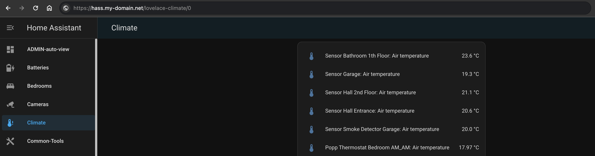

The DNS record is pointing to the ip I have decided to use for this purpose. Same concept as earlier. 

### Home Assistant MQTT 1883

I am also running MQTT in Home Assistant to support a bunch of devices, even remote devices (not in the same house). So I wanted to use Traefik for that also. This is how I configured Traefik to handle that:


I needed to create a new entrypoint in Traefik with port 1883 called mqtt. So I edited the Traefik value yaml and updated it accordingly. Then ran Helm upgrade on the Traefik installation. Below is te config I added:

```yaml
ports:
  mqtt:
    port: 1883
    protocol: TCP
    expose: true
    exposedPort: 1883
```

Now my Traefik pods also includes the port 1883:

```yaml
Containers:
  traefik:
    Container ID:  containerd://edf07e67ade4b005e7a7f8ac8a0991b2793c9320cabc35b6a5ea3c6271d63e6d
    Image:         docker.io/traefik:v2.10.6
    Image ID:      docker.io/library/traefik@sha256:1957e3314f435c85b3a19f7babd53c630996aa1af65d1f479d75539251b1e112
    Ports:         9100/TCP, 1883/TCP, 9000/TCP, 8000/TCP, 8443/TCP
    Host Ports:    0/TCP, 0/TCP, 0/TCP, 0/TCP, 0/TCP
    Args:
      --global.checknewversion
      --global.sendanonymoususage
      --entrypoints.metrics.address=:9100/tcp
      --entrypoints.mqtt.address=:1883/tcp
      --entrypoints.traefik.address=:9000/tcp
      --entrypoints.web.address=:8000/tcp
      --entrypoints.websecure.address=:8443/tcp
      --api.dashboard=true
      --ping=true
      --metrics.prometheus=true
      --metrics.prometheus.entrypoint=metrics
      --metrics.prometheus.addRoutersLabels=true
      --metrics.prometheus.addEntryPointsLabels=true
      --metrics.prometheus.addServicesLabels=true
      --metrics.prometheus.buckets=0.1,0.3,1.2,5.0,10.0
      --providers.kubernetescrd
      --providers.kubernetescrd.allowCrossNamespace=true
      --providers.kubernetescrd.allowExternalNameServices=true
      --providers.kubernetesingress
      --providers.kubernetesingress.allowExternalNameServices=true
      --entrypoints.websecure.http.tls=true
```


This service is not exposed to the internet, so I decided to create a third Service using another subnet for internal services, that is services within my network, but not exposed to the internet. 

I then created a DNS record for the mqtt service in this IP address. Below is the service I am using for mqtt:

```yaml
apiVersion: v1
kind: Service
metadata:
  annotations:
    io.cilium/lb-ipam-ips: "10.150.20.10"
  name: traefik-internal-pool-2
  labels:
    env: traefik-pool-2
  namespace: traefik
spec:
  ports:
  - name: web
    port: 80
    protocol: TCP
    targetPort: web
  - name: websecure
    port: 443
    protocol: TCP
    targetPort: websecure
  - name: mqtt
    port: 1883
    protocol: TCP
    targetPort: mqtt
  selector:
    app.kubernetes.io/name: traefik
  type: LoadBalancer
```

This Service includes the entrypoints web 80, websecure 443 AND the newly created entrypoiint mqtt 1883. Then I can reuse it for other internal purposes also. 

Now I can go ahead and create another ExternalName:

```yaml
kind: Service
apiVersion: v1
metadata:
  labels:
    k8s-app: mqtt-homeassistant
  name: mqtt-homeassistant
  namespace: traefik
spec:
  type: ExternalName
  ports:
    - name: mqtt-homeassistant
      port: 1883
      targetPort: 1883
      protocol: TCP
  externalName: 10.100.2.14
  selector:
    app.kubernetes.io/instance: traefik
    app.kubernetes.io/name: traefik
```

This is also pointing to the IP of my Home Assistant server but using port 1883 instead. 

Last step is to create a TCP IngressRoute like this:

```yaml
apiVersion: traefik.io/v1alpha1
kind: IngressRouteTCP
metadata:
  name: homeassistant-mqtt-ingressroute
  namespace: traefik

spec:
  entryPoints:
    - mqtt

  routes:
    - match: ClientIP(`172.20.1.0/24`)
      services:
        - name: mqtt-homeassistant
          port: 1883
```

I can now go ahead and repoint all my mqtt clients to point to the DNS record I have created using the external IP above. 

## Traefik and Harbor Registry

The last usecase I had for Traefik this round is my Harbor registry. I will quickly show how I done that here.

I deploy Harbor using Helm, below is the steps to add the repo and my value.yaml  I am using:

```bash
helm repo add harbor https://helm.goharbor.io
helm repo update

```

Here is my Harbor Helm value yaml file:

```yaml
expose:
  type: clusterIP
  tls:
    enabled: false
    certSource: secret
    secret:
      secretName: "net-tls-prod"
    auto:
      commonName: registry.my-domain.net
  clusterIP:
    name: harbor
    ports:
      httpPort: 80
      httpsPort: 443
externalURL: "https://registry.my-domain.net"
harborAdminPassword: "password"
persistence:
  enabled: true
  # Setting it to "keep" to avoid removing PVCs during a helm delete
  # operation. Leaving it empty will delete PVCs after the chart deleted
  # (this does not apply for PVCs that are created for internal database
  # and redis components, i.e. they are never deleted automatically)
  resourcePolicy: "keep"
  persistentVolumeClaim:
    registry:
      # Use the existing PVC which must be created manually before bound,
      # and specify the "subPath" if the PVC is shared with other components
      existingClaim: ""
      # Specify the "storageClass" used to provision the volume. Or the default
      # StorageClass will be used (the default).
      # Set it to "-" to disable dynamic provisioning
      storageClass: "nfs-client"
      subPath: ""
      accessMode: ReadWriteOnce
      size: 50Gi
      annotations: {}
    database:
      existingClaim: ""
      storageClass: "nfs-client"
      subPath: "postgres-storage"
      accessMode: ReadWriteOnce
      size: 1Gi
      annotations: {}

portal:
  tls:
    existingSecret: net-tls-prod

```

Then I install Harbor using Helm, and it should end up like this, only ClusterIP services:

```bash
andreasm@linuxmgmt01:~/prod-cluster-1/traefik/harbor$ k get svc -n harbor
NAME                TYPE        CLUSTER-IP      EXTERNAL-IP   PORT(S)             AGE
harbor              ClusterIP   10.21.152.146   <none>        80/TCP              29h
harbor-core         ClusterIP   10.21.89.119    <none>        80/TCP              29h
harbor-database     ClusterIP   10.21.174.146   <none>        5432/TCP            29h
harbor-jobservice   ClusterIP   10.21.191.45    <none>        80/TCP              29h
harbor-portal       ClusterIP   10.21.71.241    <none>        80/TCP              29h
harbor-redis        ClusterIP   10.21.131.55    <none>        6379/TCP            29h
harbor-registry     ClusterIP   10.21.90.29     <none>        5000/TCP,8080/TCP   29h
harbor-trivy        ClusterIP   10.21.6.124     <none>        8080/TCP            29h
```

I want to expose my Harbor registry to the Internet so I will be using the Service with the corresponding externalIP I am using to expose things to Internet. This will also be the same externalIP as I am using for my Home Automation exposure. This means I can expose several services to Internet using the same port, like 443, no need to create custom ports etc. Traefik will happily handle the requests coming to the respective DNS records as long as I have configured it to listen :smile:

Now I just need to create a middleware to redirect all http to https and the IngressRoute itself. 

```yaml
apiVersion: traefik.io/v1alpha1
kind: Middleware
metadata:
  name: harbor-redirectscheme
  namespace: harbor
spec:
  redirectScheme:
    scheme: https
    permanent: true
```

Then the IngressRoute:

```yaml
apiVersion: traefik.io/v1alpha1
kind: IngressRoute
metadata:
  name: harbor-ingressroute
  namespace: harbor

spec:
  entryPoints:
    - websecure

  routes:
    - match: Host(`registry.my-domain.net`)
      kind: Rule
      middlewares:
        - name: harbor-redirectscheme
          namespace: harbor
      services:
        - name: harbor-portal
          kind: Service
          port: 80
    - match: Host(`registry.my-domain.net`) && PathPrefix(`/api/`, `/c/`, `/chartrepo/`, `/service/`, `/v2/`)
      kind: Rule
      middlewares:
        - name: harbor-redirectscheme
          namespace: harbor
      services:
        - name: harbor
          kind: Service
          port: 80
  tls:
    secretName: net-tls-prod
```

Now, let me see if I can reach Harbor:

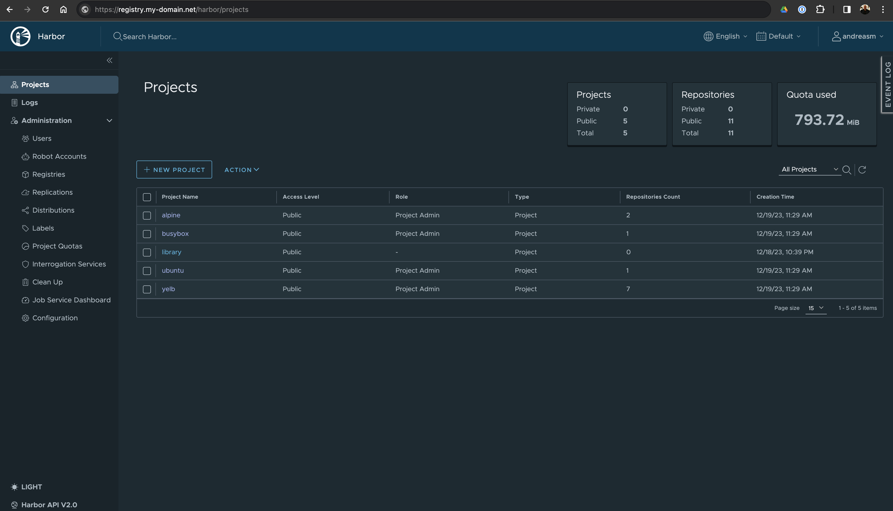

And can I login via Docker?

```bash
andreasm@linuxmgmt01:~/prod-cluster-1/traefik/harbor$ docker login registry.my-domain.net
Username: andreasm
Password:
WARNING! Your password will be stored unencrypted in /home/andreasm/.docker/config.json.
Configure a credential helper to remove this warning. See
https://docs.docker.com/engine/reference/commandline/login/#credentials-store

Login Succeeded
```


## Summary

I found Traefik in combination with Cilium a very pleasant experience. The ease of creating IP Pools in Cilium and using BGP to advertise the host routes. How I could configure and manage Traefik to use different external IP entrypoints covering my needs like ip separation. The built-in Traefik dashboard, using Grafana for dashboard creation using Prometheus metrics was very nice. I feel very confident that Traefik is one of my go-to reverse proxies going forward. By deploying Traefik on my Kubernetes cluster I also achieved high-availability and scalability. 
When I started out with Traefik I found it a bit "difficult",  as I mention in the beginning of this post also, but after playing around with it for a while and got the terminology under my skin I find Traefik to be quite easy to manage and operate. Traefik has a good community out there, which also helped out getting the help I needed when I was stuck. 

This post is not meant to be an exhaustive list of Traefik capabilities, this post is just scraping the surface of what Traefik is capable of, so I will most likely create a follow up post when I dive into more deeper and advanced topics with Traefik. 


