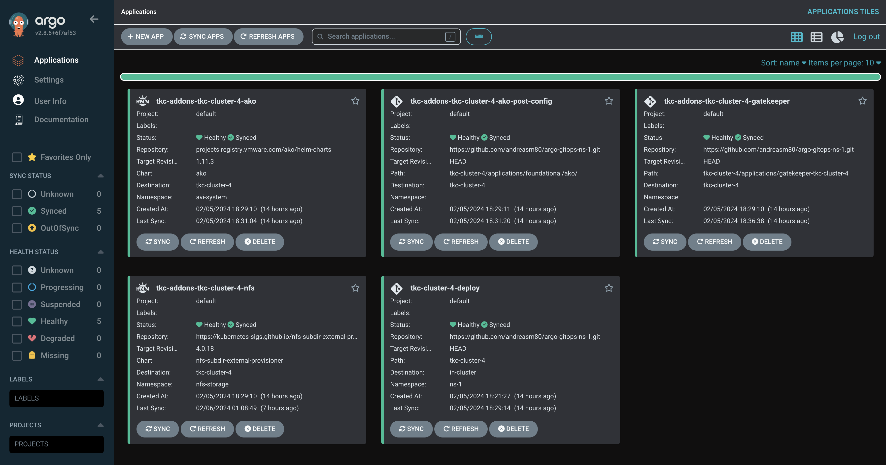
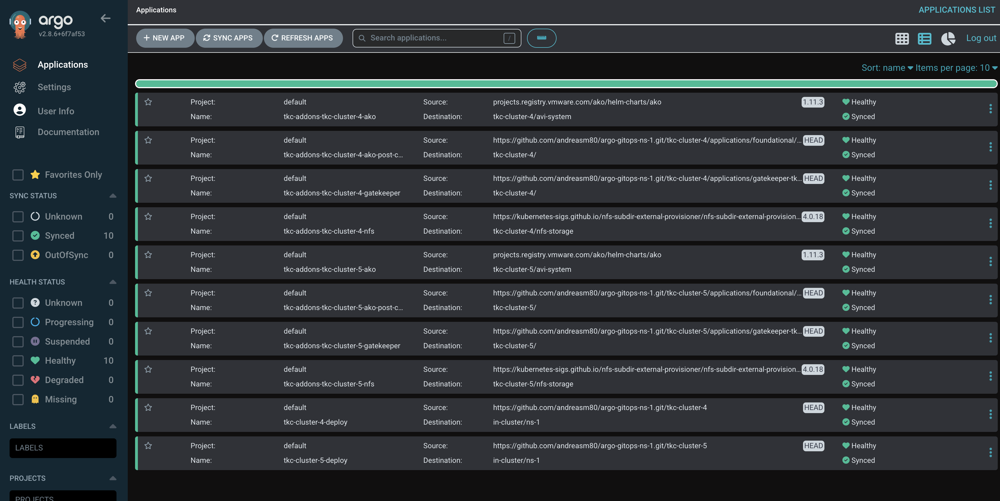
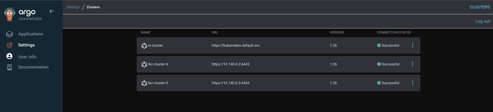
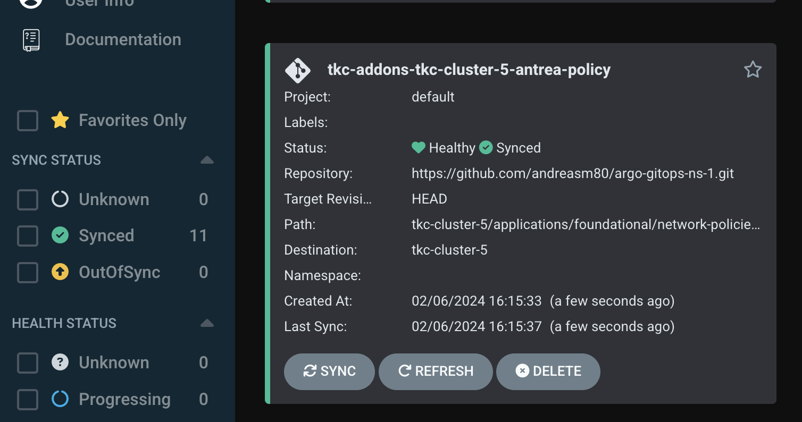

# Argo CD as a Supervisor service in vSphere with Tanzu

I was really motivated to create this post after I read my colleague Navneet's two blog posts [Authoring and Installing ArgoCD-Operator as a Supervisor Service on vCenter](https://navneet-verma.medium.com/authoring-and-installing-argocd-operator-as-a-supervisor-service-on-vcenter-9c175b15d251) where he creates an Argo CD Supervisor service using Argo CD Operator and [Tanzu Kubernetes Cluster lifecycle on vSphere Supervisor with ArgoCD](https://navneet-verma.medium.com/tanzu-kubernetes-cluster-lifecycle-on-vsphere-supervisor-with-argocd-7a6a977c8579) where he uses the Argo CD supervisor service he created in the first post to provision and lifecycle a Tanzu Kubernetes Cluster with a set of applications.

The idea of using a Argo CD as a vSphere with Tanzu Supervisor service is just brilliant so I just had to test this out myself. A big thanks to Navneet for making this possible and all credits for my post goes to Navneet. Without his effort and help (*yes I did have some calls with him to help me get started and help me with some troubleshooting*) this post would not have been possible. 

Navneet's two blog posts above is very much a pre-requisite to have read and performed if you want to follow what I do in this post as I am basing this whole post on his work. 

As I am very often involved in PoCs on vSphere with Tanzu involving products like Antrea, Avi with AKO and NSX I wanted to explore how I could utilize Navneet's work to deploy and lifecycle Tanzu Kubernetes Clusters including Antrea and AKO as part of the tkc deployment. The goal was to make the Antrea and AKO configuration easy and part of the TKC bringup. So in this post I will go through how I did it and if I succeeded in making it easier. 

Using a declarative approach is Kubernetes nature, and managing all the configs and applications declaratively from one place using gitops is not only fun but a single place of truth when it comes to keeping a cluster in the defined state at all time. 

I am not saying this is a definitive guide on how to do this. There is certainly room for improvement, like I how I handle the secret (more on the below), but hopefully it triggers some ideas whats possible. 

## The goal

The goal of this post is to: 

- Use Argo CD/gitops to deploy and maintain a TKC cluster in my vSphere with Tanzu environment.
- Use Argo CD/gitops to deploy and maintain Antrea Feature Gates by adding the AntreaConfig as part of the deployment
- Use Argo CD/gitops to deploy and maintain AKO installation and AKO Tunables by adding AKO value yaml as part of the deployment
- Use Argo CD/gitops to add and manage Antrea Network Policies
- A menu-driven approach to dynamically create all the needed deployment manifests to form my "basic-tkc-cluster" that can be sent to Argo CD.

This is just what I wanted to add into the mix as a "basic" for my TKC clusters, one could very easily add Antrea Security Policies as an example into the mix also so that all deployed TKC clusters comes with a predefined set of minimum security policies applied. Not only does this give the comfort of securing a cluster before anyone has started consuming it, but it also adds an easy way to manage the security policies in general. I will in the last sections of this post quickly go through how easy it is to add more applications in form of Antrea security policies.

Lets get started

## My github repo

This post is relying on my Github repo: https://github.com/andreasm80/argo-gitops-ns-1

I have created my Github repo [here](https://github.com/andreasm80/argo-gitops-ns-1) that contains the folder structure for all my Argo CD manifests, including a script to generate the tkc-cluster deployment manifests. I have tried to keep it as simple, logic and manageable as possible. At least for me :smile:. 

Below is the initial folder structure, this will change ofcourse when adding new clusters, applications etc as it is a live repo during the lifetime of a tkc cluster.

```bash
.
├── README.md
├── setup-cluster.sh
├── argocd
│   ├── argo-tkc-cluster-1-deployment.yaml
│   ├── argo-tkc-cluster-2-deployment.yaml
│   └── projects
│       └── myproject.yaml
├── tkc-cluster-template
│   ├── antrea-config-1.yaml
│   ├── kustomization.yaml
│   ├── tkgs-cluster-class-noaz-2.yaml
│   ├── argocd-tkc-1-base-app-env-3.yaml
│   ├── argocd-tkc-1-base-app-cm-5.yaml
│   └── applications
│       ├── gatekeeper-tkc-1
│       │   ├── create-ns.yaml
│       │   ├── gatekeeper.yaml
│       │   ├── kustomization.ya
│       │   └── mutation-psa-policy.yaml
│       └── foundational
│           ├── ako
│           │   ├── ako-inject-secret-5.yaml
│           │   ├── ako-secret-role-2.yaml
│           │   ├── ako-secret-rolebinding-3.yaml
│           │   ├── ako-secret-sa-1.yaml
│           │   ├── kustomization.yaml
│           │   └── tkc-pv-pvc-4.yaml
│           └── repos
│               ├── argocd-ako-repo.yaml
│               └── argocd-nfs-repo.yaml
├── tkc-cluster-1
│   ├── antrea-config-1.yaml
│   ├── kustomization.yaml
│   ├── tkgs-cluster-class-noaz-2.yaml
│   ├── argocd-tkc-1-base-app-env-3.yaml
│   ├── argocd-tkc-1-base-app-cm-5.yaml
│   └── applications
│       ├── gatekeeper-tkc-1
│       │   ├── create-ns.yaml
│       │   ├── gatekeeper.yaml
│       │   ├── kustomization.ya
│       │   └── mutation-psa-policy.yaml
│       └── foundational
│           ├── ako
│           │   ├── ako-inject-secret-5.yaml
│           │   ├── ako-secret-role-2.yaml
│           │   ├── ako-secret-rolebinding-3.yaml
│           │   ├── ako-secret-sa-1.yaml
│           │   ├── kustomization.yaml
│           │   └── tkc-pv-pvc-4.yaml
│           └── repos
│               ├── argocd-ako-repo.yaml
│               └── argocd-nfs-repo.yaml
```

 

To get a better understanding of the folder structure I will go through them below.

### The root folder

```bash
.
├── README.md
├── setup-cluster.sh
```

The only relevant files located here is the `setup-cluster.sh` and the `README.md`. The `setup-cluster.sh` is the file that allows me to easily create new TKC deployments by issuing a couple of prompts relevant for the deployment like cluster name, vSphere Namespace, AKO settings etc.

```bash
andreasm@linuxmgmt01:~/github_repos/argo-gitops-ns-1 (main)$ ./setup-cluster.sh
What is the cluster name?
tkc-cluster-5
What is the vSphere Namespace Name?
ns-1
What is the path to your NSX Tier-1 router for AKO configuration - (full path eg "/infra/tier-1s/tier-x")
/infra/tier-1s/tier-1
What is the VIP network name configured in Avi?
vip-l7
What is the VIP network cidr?
10.141.1.0/24
Do you want AKO to be the default ingress controller? true/false
true
What is the Service Engine Group name
domain-c1006:5de34cdc-8b14-46a3-b1c9-b627d574cdf0
What is the Cloud name in Avi you want to use?
nsx-t
What is the controller IP/DNS?
172.18.5.51
Updated antrea-config-1.yaml
Updated argocd-tkc-base-app-env-3.yaml
Updated tkgs-cluster-class-2.yaml
Updated argocd-tkc-base-app-cm-5.yaml including AKO configuration
Created and updated argo-tkc-cluster-5-deployment.yaml based on cluster name and namespace inputs in the 'argocd' folder.
Renamed gatekeeper folder to gatekeeper-tkc-cluster-5 within the 'tkc-cluster-5/applications' directory.
Updated the name field in argocd-ako-repo.yaml to avi-ako-helm-repo-tkc-cluster-5.
Updated the name field in argocd-nfs-repo.yaml to nfs-helm-repo-tkc-cluster-5.
```

The script copies the content from the `tkc-cluster-template` including all the yaml files I have defined to be part of my "basic" tkc deployment to a folder with the same name as the input from the prompt "What is the cluster name". It then update all the relevant yaml files with unique values depending on the inputs from the corresponding prompts. Then it creates an application yaml for Argo CD I can use to create the application/tkc-cluster and place it in the folder argocd.  And this takes me to the first folder `argocd`.

### The argocd folder 

```bash
.
├── README.md
├── argocd
│   ├── argo-tkc-cluster-1-deployment.yaml
│   ├── argocd-instance.ns-1.yaml
│   ├── argocd-sup-svc-manifest.yaml
│   ├── argocd-tkc-deploy.yaml
│   ├── projects
│       ├── my-projects.yaml

```

In the argocd folder I am keeping all the yaml files related to ArgoCD itself. Lets start with the first file, the argo-tkc-cluster-1-deployment. This file is created by the `setup-cluster.sh` script using the file `argocd-tkc-deploy.yaml` as a template file. 

The file `argocd-sup-svc-manifest.yaml` is the ArgoCD Operator Supervisor Service generated by following Navneet's blog [here](https://navneet-verma.medium.com/authoring-and-installing-argocd-operator-as-a-supervisor-service-on-vcenter-9c175b15d251). 
The file `argocd-instance.ns-1.yaml` is my ArgoCD server instance defining in which vSphere Namespace I want to deploy it in and how I want to expose it.

The projects folder should contain the yamls that define ArgoCD projects, more on that [here](https://argo-cd.readthedocs.io/en/stable/user-guide/projects/). 

The files in this folder are applied in-cluster or local-cluster from a ArgoCD perspective (more on that later).

###  The tkc-cluster-template folder

```bash
├── tkc-cluster-template
│   ├── antrea-config-1.yaml
│   ├── kustomization.yaml
│   ├── tkgs-cluster-class-noaz-2.yaml
│   ├── argocd-tkc-1-base-app-env-3.yaml
│   ├── argocd-tkc-1-base-app-cm-5.yaml
│   └── applications
│       ├── gatekeeper-tkc-1
│       │   ├── create-ns.yaml
│       │   ├── gatekeeper.yaml
│       │   ├── kustomization.ya
│       │   └── mutation-psa-policy.yaml
│       └── foundational
│           ├── ako
│           │   ├── ako-inject-secret-5.yaml
│           │   ├── ako-secret-role-2.yaml
│           │   ├── ako-secret-rolebinding-3.yaml
│           │   ├── ako-secret-sa-1.yaml
│           │   ├── kustomization.yaml
│           │   └── tkc-pv-pvc-4.yaml
│           └── repos
│               ├── argocd-ako-repo.yaml
│               └── argocd-nfs-repo.yaml
```


I will not go through every file in this folder by detail as they are readily available for inspection in my Github repo, instead I will quickly go through what they do. 

- *Kustomization.yaml:* This first instance of kustomization.yaml refers to all the yamls that should be applied in-cluster (on the vSphere Namespace) like ArgoCD secrets, configmaps, the tkc-cluster itself. All objects that needs to run and be applied at the vSphere NS level (antreconfig etc). On top of that it is very easy to customize/override specific values by using Kustomize. This file is placed in the root of the `tkc-cluster-template` folder and this folder in turn is being referred to in the argo-deployment.yaml generated by the `setup-cluster.sh` script. All the files in the root of the `tkc-cluster-template` folder is being referenced in the kustomize.yaml file, including a couple of other files that needs to be applied in the same vSphere NS. 
- *antrea-config-1.yaml*: This file contains the Antrea specific feature gates currently available in the latest TKR of vSphere 8 U2. By adding this into the tkc-creation makes it very easy before deployment and during the lifecycle of the TKC cluster to adjust and manage the Antrea Feature Gates. One may have specific requirements in a TKC cluster that requires a specific feature enabled in Antrea. One may also discover during the lifecycle of the TKC cluster that a specific Antrea Feature needs to be enabled or disabled. 
- *tkgs-cluster-class-noaz-2.yaml*: This file contains the actual TKC cluster definition.
- *argocd-tkc-1-base-app-env-3.yaml*: This file contains a job that runs a script to get the TKC cluster's secret, generates and applies a secret for ArgoCD to add the TKC cluster as a Kubernetes cluster in ArgoCD. 
- *argocd-tkc-1-base-app-cm-5.yaml*: This file creates the configmap for ArgoCD for which applications to be installed in the TKC cluster. In other words, everything you want to deploy in the TKC cluster itself (remote cluster for ArgoCD). The *argocd-tkc-1-base-app-cm-5.yaml* itself will be applied in-cluster (or in the vSphere NS) but the configmap itself contains references to the remote cluster (the TKC cluster) for where to perform the actions/applications inside the configmap. This could be other yamls, helm installs or folders containing other kustomization.yamls. Like Gatekeeper as I will go show next.


### The application folder

```bash
│   └── applications
│       ├── gatekeeper-tkc-1
│       │   ├── create-ns.yaml
│       │   ├── gatekeeper.yaml
│       │   ├── kustomization.ya
│       │   └── mutation-psa-policy.yaml
│       └── foundational
│           ├── ako
│           │   ├── ako-inject-secret-5.yaml
│           │   ├── ako-secret-role-2.yaml
│           │   ├── ako-secret-rolebinding-3.yaml
│           │   ├── ako-secret-sa-1.yaml
│           │   ├── kustomization.yaml
│           │   └── tkc-pv-pvc-4.yaml
│           └── repos
│               ├── argocd-ako-repo.yaml
│               └── argocd-nfs-repo.yaml
```

This folder should be considered a "top-folder" for all the required applications and the corresponding applications dependencies for your specifc TKC cluster. In this folder I have three subfolders called: 
`gatekeeper-tkc-1`, `foundational`and `repos`. 
The gatekeeper folder contains a kustomization.yaml that in turn refers to the files inside the gatekeeper folder. Gatekeeper here is used to manage the admission controller so I am allowed to something in the cluster when it is applied. 

The `foundational`folder contains the subfolders for the specific applications, like in my case AKO and everything involved in getting AKO deployed in my TKC cluster. This folder also contains a kustomization.yaml that refers to all the fles inside the AKO folder. Why so many files in the AKO folder as AKO is easily installed using Helm. Well, as I hinted to initially this most likely will and can be handled much better but this is how I solved it right now. The reason is, when I deploy AKO using Helm the Helm chart expects me to populate the field `username`and `password`or `authtoken`. And during the Helm installation of AKO a avi-secret is generated based upon that information for AKO to use to interact with my Avi controller. As this is a public repo I dont want to expose any sensitive information, so what I do is mounting a PVC located on a NFS share with a predefined secret. As soon as the AKO installation is done, it will complain about having a secret without username and password. Then I have job defined to read the secret on the PVC and apply a new avi-secret containing the correct username and password. Then it will reboot th AKO pod for it to read the new secret, and voila the AKO pod is running and happy to serve. 

**Note**: The AKO settings being prompted is just the most important settings to get AKO up and running. There are several parametes that can be adjusted and configured. Have a look at the AKO Helm values.yaml for more information.

**Note**: If the ako application should overwrite the avi-secret, I just need to delete the job that is dormant in my TKC cluster and it will automatically be synced back to a working state again.

```bash
andreasm@linuxmgmt01:~/github_repos/argo-gitops-ns-1 (main)$ k get jobs -n avi-system
NAME               COMPLETIONS   DURATION   AGE
apply-secret-job   1/1           80s        7h12m
```

The last folder `repo` contains all the Helm repos I need for my applications to be deployed in my TKC cluster. 

Why this folder structure and all the kustomize.yamls? Well it makes my ArgoCD configmap "lighter" as I can just point the configmap in Argo CD for my application referencing the folder for where my specific app kustomization.yaml is located. Then in turn I will have kustomize to refer the needed yamls that build up my application. Easier to change/manage applications individually.  

**Note** I have included the NFS provisioner as part of my TKC cluster bringup, but it is merely optional as long as you already have a PVC created and defined before upbringing. In my deployment this PVC containing the avi-secret is needed.

## Deploying my TKC cluster with Argo CD

Now that I have gone through how I have my folder structure for Argo CD to deploy and manage my TKC clusters its time to create a TKC cluster using Argo CD. 

But before I quickly go through the steps of deploying my TKC cluster using ArgoCD I need to explain the two levels where things are being applied, the different folders/yamls explained aboive. 

From a Argo CD perspective, Argo CD can be deployed in the same cluster as the applications it is managing, or it can be installed on a different Kubernetes cluster. When managing applications with ArgoCD on the same cluster as ArgoCD itself this is being refered to as "in-cluster" or "cluster-local". So that means all destinations defined in ArgoCD will reference actual namespaces inside that cluster not a defined cluster-ip or Kubernetes API endpoint as ArgoCD is already running in the same cluster. If ArgoCD is running on a dedicated cluster and the defined ArgoCD managed applications are being applied to another cluster, this cluster is then referred to as a "remote-cluster". 

In my environment I will be using both "in-cluster" and "remote-cluster" as Argo CD is running as a instance (vSphere Pods in my Supervisor Cluster) in my vSphere Namespace "NS-1" where some of the yamls needs to be applied (explained above) and when my TKC cluster is up and running the applications that is is supposed to be installed in my TKC cluster is then a remote-cluster and I need to define a destination using:

```yaml
      destination:
        server: ${CLUSTER_IP}
```

Where ${CLUSTER_IP} is the Kubernetes API endpoint of my TKC cluster. Then in my application yaml definition itself I will be referencing the correct Kubernetes namespace inside my TKC cluster (${CLUSTER_IP} destination).

This is just something to have in mind that there is two "layers" where ArgoCD configs needs to be applied. The way ArgoCD is deployed using the Operator from Navneet, it is not supposed to manage other TKC clusters in different vSphere Namespaces. ArgoCD will only manage TKC clusters in its own vSphere Namespace. That can also be tied to a RBAC constraint where I can define in the vSphere Namespace easily what and which personas are allowed to do.

### TKC-Cluster deployment

To get things started I will go to the root folder of my Github repo https://github.com/andreasm80/argo-gitops-ns-1 on my workstation and execute the `setup-cluster.sh` answering the prompts to create a new tkc-cluster-x folder:

```bash
andreasm@linuxmgmt01:~/github_repos/argo-gitops-ns-1 (main)$ ./setup-cluster.sh
What is the cluster name?
tkc-cluster-4
What is the vSphere Namespace Name?
ns-1
What is the path to your NSX Tier-1 router for AKO configuration - (full path eg "/infra/tier-1s/tier-x")
/infra/tier-1s/tier-1
What is the VIP network name configured in Avi?
vip-l7
What is the VIP network cidr?
10.141.1.0/24
Do you want AKO to be the default ingress controller? true/false
true
What is the Service Engine Group name
domain-c1006:5de34cdc-8b14-46a3-b1c9-b627d574cdf0
What is the Cloud name in Avi you want to use?
nsx-t
What is the controller IP/DNS?
172.18.5.51
Updated antrea-config-1.yaml
Updated argocd-tkc-base-app-env-3.yaml
Updated tkgs-cluster-class-2.yaml
Updated argocd-tkc-base-app-cm-5.yaml including AKO configuration
Created and updated argo-tkc-cluster-4-deployment.yaml based on cluster name and namespace inputs in the 'argocd' folder.
Renamed gatekeeper folder to gatekeeper-tkc-cluster-4 within the 'tkc-cluster-4/applications' directory.
Updated the name field in argocd-ako-repo.yaml to avi-ako-helm-repo-tkc-cluster-4.
Updated the name field in argocd-nfs-repo.yaml to nfs-helm-repo-tkc-cluster-4.
```

Then I need to do a git add, commit and push:

```bash
andreasm@linuxmgmt01:~/github_repos/argo-gitops-ns-1 (main)$ git add .
andreasm@linuxmgmt01:~/github_repos/argo-gitops-ns-1 (main)$ git commit -s -m "tkc-cluster-4"
[main 1af9b40] tkc-cluster-4
 19 files changed, 4662 insertions(+)
 create mode 100644 argocd/argo-tkc-cluster-4-deployment.yaml
 create mode 100644 tkc-cluster-4/antrea-config-1.yaml
 create mode 100644 tkc-cluster-4/applications/foundational/ako/ako-inject-secret-5.yaml
 create mode 100644 tkc-cluster-4/applications/foundational/ako/ako-secret-role-2.yaml
 create mode 100644 tkc-cluster-4/applications/foundational/ako/ako-secret-rolebinding-3.yaml
 create mode 100644 tkc-cluster-4/applications/foundational/ako/ako-secret-sa-1.yaml
 create mode 100644 tkc-cluster-4/applications/foundational/ako/kustomization.yaml
 create mode 100644 tkc-cluster-4/applications/foundational/ako/tkc-pv-pvc-4.yaml
 create mode 100644 tkc-cluster-4/applications/foundational/repos/argocd-ako-repo.yaml
 create mode 100644 tkc-cluster-4/applications/foundational/repos/argocd-nfs-repo.yaml
 create mode 100644 tkc-cluster-4/applications/gatekeeper-tkc-cluster-4/create-ns.yaml
 create mode 100644 tkc-cluster-4/applications/gatekeeper-tkc-cluster-4/gatekeeper.yaml
 create mode 100644 tkc-cluster-4/applications/gatekeeper-tkc-cluster-4/kustomization.yaml
 create mode 100644 tkc-cluster-4/applications/gatekeeper-tkc-cluster-4/mutation-psa-policy.yaml
 create mode 100644 tkc-cluster-4/argocd-tkc-base-app-cm-5.yaml
 create mode 100644 tkc-cluster-4/argocd-tkc-base-app-env-3.yaml
 create mode 100644 tkc-cluster-4/kustomization.yaml
 create mode 100644 tkc-cluster-4/tkgs-cluster-class-2.yaml
andreasm@linuxmgmt01:~/github_repos/argo-gitops-ns-1 (main)$ git push
Enumerating objects: 30, done.
Counting objects: 100% (30/30), done.
Delta compression using up to 16 threads
Compressing objects: 100% (28/28), done.
Writing objects: 100% (28/28), 20.83 KiB | 1.60 MiB/s, done.
Total 28 (delta 3), reused 0 (delta 0), pack-reused 0
remote: Resolving deltas: 100% (3/3), completed with 2 local objects.
To github.com:andreasm80/argo-gitops-ns-1.git
   b933ff5..1af9b40  main -> main
```

Now I need to to the `argocd` folder and execute the following command (requring me to be logged into my correct ArgoCD instance):

```bash
andreasm@linuxmgmt01:~/github_repos/argo-gitops-ns-1/argocd (main)$ argocd app create -f argo-tkc-cluster-4-deployment.yaml
application 'tkc-cluster-4-deploy' created
```

After a few seconds in my ArgoCD web UI I should see my application being deployed. And after a very small coffee cup (depending on the underlaying hardware ofcourse) my newly created TKC cluster should be up and running:



Brilliant, 100% hands of. Just one command to deploy my TKC cluster with all the "required" settings and tools ready to use. If I want to create another cluster I just repeat the same tasks above, give it a new name, and other values you want to change (also vSphere namespace if managed by another ArgoCD instance in another vSphere NS).

Two clusters up and running:





Now I can start consuming my newly created TKC clusters. In the next chapters I will go through how I can manage and add "features" aka applications to an already deployed cluster.


## Manage my TKC cluster using gitops

By using gitops its all about doing a change in my git repo that holds the entire state of my system and commit. ArgoCD will then notice the change and act accordingly, update the previous declared state to the new declared state. My git repo will always be the place to define how my system should look like. This means how my applications in my TKC clusters are configured, but also how my TKC clusters are configured. If I try to do it another way around, changing something directly in the cluster or the application, Argo will notice this change, complain that it differs from the source of truth (my git repo) and reconcile back to the defined state. And dont forget the other benefits of using gitops like, auditing, revison control, compliance.

So the gitops approach gives me one place to manage and configure my whole estate. Lets do one simple test. Scale my `tkc-cluster-5`.

### Scale TKC cluster's worker nodes

Lets first have a look at the cluster in its current state:

```bash
andreasm@linuxmgmt01:~$ k config use-context tkc-cluster-5
Switched to context "tkc-cluster-5".
andreasm@linuxmgmt01:~$ k get nodes
NAME                                               STATUS   ROLES           AGE     VERSION
tkc-cluster-5-node-pool-1-5fdrj-67755499fc-cq92c   Ready    <none>          6h10m   v1.26.5+vmware.2-fips.1
tkc-cluster-5-tjtnw-mm62h                          Ready    control-plane   6h20m   v1.26.5+vmware.2-fips.1
```

 Ok, one control plane node and one worker. 

Now I will head over to my git repo that holds the config for this TKC cluster and adjust it from 1 worker node to 2 worker nodes. 

```yaml
andreasm@linuxmgmt01:~/github_repos/argo-gitops-ns-1/tkc-cluster-5 (main)$ vim tkgs-cluster-class-2.yaml
---
apiVersion: cluster.x-k8s.io/v1beta1
kind: Cluster
metadata:
  name: tkc-cluster-5
  annotations:
    argocd.argoproj.io/sync-wave: "-1"
  namespace: ns-1
spec:
  clusterNetwork:
    services:
      cidrBlocks: ["192.168.32.0/20"]
    pods:
      cidrBlocks: ["192.168.0.0/20"]
    serviceDomain: "cluster.local"
  topology:
    class: tanzukubernetescluster
    version: v1.26.5---vmware.2-fips.1-tkg.1
    controlPlane:
      replicas: 1
      metadata:
        annotations:
          run.tanzu.vmware.com/resolve-os-image: os-name=ubuntu
    workers:
      machineDeployments:
        - class: node-pool
          name: node-pool-1
          replicas: 2 # from 1 to 2
      
```

Save and quit VIM, git add, commit and push:

```bash
andreasm@linuxmgmt01:~/github_repos/argo-gitops-ns-1 (main)$ git commit -s -m "scale-tkc-5"
[main f7aae3c] scale-tkc-5
 4 files changed, 27 insertions(+), 66 deletions(-)
 delete mode 100644 argocd/argocd.yaml
 delete mode 100644 argocd/tkc-cluster-1.yaml
andreasm@linuxmgmt01:~/github_repos/argo-gitops-ns-1 (main)$ git push
Enumerating objects: 11, done.
Counting objects: 100% (11/11), done.
Delta compression using up to 16 threads
Compressing objects: 100% (6/6), done.
Writing objects: 100% (6/6), 602 bytes | 602.00 KiB/s, done.
Total 6 (delta 5), reused 0 (delta 0), pack-reused 0
remote: Resolving deltas: 100% (5/5), completed with 5 local objects.
To github.com:andreasm80/argo-gitops-ns-1.git
   1af9b40..f7aae3c  main -> main
```


And after a couple of minutes (polls every three minutes):


It starts to change my TKC cluster according to the change I have done in my cluster manifest. 

My second worker node on its way up:

```bash
andreasm@linuxmgmt01:~$ k get nodes
NAME                                               STATUS     ROLES           AGE     VERSION
tkc-cluster-5-node-pool-1-5fdrj-67755499fc-cq92c   Ready      <none>          6h23m   v1.26.5+vmware.2-fips.1
tkc-cluster-5-node-pool-1-5fdrj-848b6875bf-26hq5   NotReady   <none>          4s      v1.26.5+vmware.2-fips.1
tkc-cluster-5-tjtnw-mm62h                          Ready      control-plane   6h32m   v1.26.5+vmware.2-fips.1
```


I can do a edit on every yaml/file/setting in my git repo that involves my Argo managed clusters/application. This was just quick and easy example. What about adding something completely new to my TKC cluster?

### Add Antrea Network Policies

I need security in my TKC cluster, and as a minimum it should treat every Kubernetes "non-system" namespaces as "not-trusted". That means I need to apply a Antrea Cluster Network policy that implies no communication between namespaces allowed by default unless stated otherwise. So let me update my git repo to accommodate this policy.

This piece could as well be part of the "basic" deployment of my TKC clusters, as it provide a set of security out of the box without any manual intervening before handing over the TKC cluster to the users consuming the TKC cluster. 

This step involves editing the ArgoCD configmap adding a new application. I will create a new folder under ./applications/foundational/ called `network policies`. Create a `kustomization.yaml`referencing my needed Antrea policy definition files. Git add, commit and push. 

So lets do this.

First check my cluster for any existing network policies:

```bash
andreasm@linuxmgmt01:~$ k get acnp
No resources found
andreasm@linuxmgmt01:~$ k get anp -A
No resources found
```

 Lets create the folder, the Antrea policies and the kustomization.yaml in the folder mentioned above.

```bash
andreasm@linuxmgmt01:~/github_repos/argo-gitops-ns-1/tkc-cluster-5/applications/foundational (main)$ ls
ako              network-policies repos
```

Add my Antrea policy block any Kubernetes namespace "interaction". 

```yaml
apiVersion: crd.antrea.io/v1alpha1
kind: ClusterNetworkPolicy
metadata:
  name: strict-ns-isolation-except-system-ns
spec:
  priority: 9
  tier: securityops
  appliedTo:
    - namespaceSelector:          # Selects all non-system Namespaces in the cluster
        matchExpressions:
          - {key:  kubernetes.io/metadata.name, operator: NotIn, values: [nfs-storage,gatekeeper-system,avi-system,default,kube-node-lease,kube-public,kube-system,secretgen-controller,tanzu-continuousdelivery-resources,tanzu-fluxcd-packageinstalls,tanzu-kustomize-controller,tanzu-source-controller,tkg-system,vmware-system-antrea,vmware-system-auth,vmware-system-cloud-provider,vmware-system-csi,vmware-system-tkg,vmware-system-tmc]}
  ingress:
    - action: Pass
      from:
        - namespaces:
            match: Self           # Skip ACNP evaluation for traffic from Pods in the same Namespace
      name: PassFromSameNS
    - action: Drop
      from:
        - namespaceSelector: {}   # Drop from Pods from all other Namespaces
      name: DropFromAllOtherNS
  egress:
    - action: Pass
      to:
        - namespaces:
            match: Self           # Skip ACNP evaluation for traffic to Pods in the same Namespace
      name: PassToSameNS
    - action: Drop
      to:
        - namespaceSelector: {}   # Drop to Pods from all other Namespaces
      name: DropToAllOtherNS

```

I will be saving this yaml as `antrea-block-ns.yaml`blo

Then the `kustomization.yaml`:

```bash
apiVersion: kustomize.config.k8s.io/v1beta1
kind: Kustomization

resources:
- antrea-block-ns.yaml

```

Now the last file to configure is the `argocd-tkc-base-app-cm-5.yaml` in the root folder of my `tkc-cluster-5`:

I will add this section at the end:

```yaml
    apiVersion: argoproj.io/v1alpha1
    kind: Application
    metadata:
      name: tkc-addons-${CLUSTER_NAME}-antrea-policy
    spec:
      project: default
      source:
        repoURL: 'https://github.com/andreasm80/argo-gitops-ns-1.git'
        path: tkc-cluster-5/applications/foundational/network-policies/
        targetRevision: HEAD
      destination:
        server: ${CLUSTER_IP}
      syncPolicy:
        automated:
          prune: true
```

And the last step:

```bash
andreasm@linuxmgmt01:~/github_repos/argo-gitops-ns-1/tkc-cluster-5 (main)$ cd ..
andreasm@linuxmgmt01:~/github_repos/argo-gitops-ns-1 (main)$ git add .
andreasm@linuxmgmt01:~/github_repos/argo-gitops-ns-1 (main)$ git commit -s -m "antrea-policy-tkc-5"
[main 653d451] antrea-policy-tkc-5
 3 files changed, 52 insertions(+)
 create mode 100644 tkc-cluster-5/applications/foundational/network-policies/antrea-block-ns.yaml
 create mode 100644 tkc-cluster-5/applications/foundational/network-policies/kustomization.yaml
amarqvardsen@amarqvards1MD6T:~/github_repos/argo-gitops-ns-1 (main)$ git push
Enumerating objects: 14, done.
Counting objects: 100% (14/14), done.
Delta compression using up to 16 threads
Compressing objects: 100% (9/9), done.
Writing objects: 100% (9/9), 1.39 KiB | 710.00 KiB/s, done.
Total 9 (delta 3), reused 0 (delta 0), pack-reused 0
remote: Resolving deltas: 100% (3/3), completed with 3 local objects.
To github.com:andreasm80/argo-gitops-ns-1.git
   f7aae3c..653d451  main -> main
```

Now its just waiting for Argo to apply my change (Antrea policy)...

A change has been detected:


And I got a new application deployed:



Has the Antrea policies been applied in my cluster?

```bash
andreasm@linuxmgmt01:~/github_repos/argo-gitops-ns-1 (main)$ k get acnp
NAME                                   TIER          PRIORITY   DESIRED NODES   CURRENT NODES   AGE
strict-ns-isolation-except-system-ns   securityops   9          0               0               3m50s
```

As there is no namespace actually affected by this policy yet. Lets create two namespaces and apply a pod in each:

```bash
andreasm@linuxmgmt01:~/github_repos/argo-gitops-ns-1 (main)$ k run dev-pod --image nginx/nginx -n dev
pod/dev-pod created
amarqvardsen@amarqvards1MD6T:~/github_repos/argo-gitops-ns-1 (main)$ k run prod-pod --image nginx/nginx -n prod
pod/prod-pod created
amarqvardsen@amarqvards1MD6T:~/github_repos/argo-gitops-ns-1 (main)$ k get acnp
NAME                                   TIER          PRIORITY   DESIRED NODES   CURRENT NODES   AGE
strict-ns-isolation-except-system-ns   securityops   9          1               1               7m23s
```

The policy is now in effect and drops all attempts between these two namespaces `dev`and `prod`.

Outstanding. As mentioned this could also be part of the initial tkc-deployment, not necessarily being added post tkc creation. But it was nice and easy to add it post tkc creation also. Now when I have added it though it is very easy to just continue add additional Antrea policy yaml definitions in the folder network-policies commit and the changes are applied.

 


## Conclusion

Did I succeed in making it easier to maintain a TKC cluster, AntreaConfigs, AKO installation and post-adding *and* managing Antrea Security Policies?

Yes, I think so. Everything is defined in my respective tkc-cluster-x folder in my gitrepo, its very easy to change any of the settings in any of the files as they are available and easy accessible. Argo CD will detect any update and ensure it is being applied. It even gives me a nice overview at all times whether there is something wrong with my cluster, my applications. I always maintain the source of truth in my Github repo, and if there are any configuration drifts, they will be reverted back. 

I am exposing the AntreaConfig for easier management of the respective Antrea Feature Gates, I am exposing AKO values for easier installation and configuration settings. I am exposing Antrea Network Policies for easier deployment and management of security policies. All changes are registered, all version changes are tracked so I know exactly whom, when and what has been changed. And if something goes wrong.. I can rollback to the last working state. 

Thanks to Navneet for not only providing the Supervisor Service ArgoCD Operator, but also the tools how to create it and other Supervisor Services, read more on his blog post [here](https://navneet-verma.medium.com/authoring-and-installing-argocd-operator-as-a-supervisor-service-on-vcenter-9c175b15d251). 

