# Introduction:

What if I only have 1 NSX manager cluster and 1 Avi controller cluster managing several several vSphere clusters, and dont want to install additional NSX/Avi manager clusters, but I want to deploy  2 or more vSphere with Tanzu/Supervisor deployments? And I also want to use the new integration between NSX and Avi where I can combine NSX as the networking stack for vSphere with Tanzu and Avi as the Load Balancer? To add a bit more complexity to it I also want to have separate AVI Service Engines managing my different Supervisor Cluster API endpoints, in other words I do not want them to share the Service Engines between different Supervisor installations. In this post I will go through how to accomplish this. Including some explanations how the components involved makes the decision which NSX cloud in Avi to use for the respective Supervisor Cluster. 
My lab consist of the following:

- 1x NSX manager cluster, managing both my vSphere clusters
- 1x vCenter Server, managing both my vSphere clusters
- 2x vSphere clusters, Supervisor installed on both of them 
- 1x Avi controller cluster

The plan is to have vSphere with Tanzu enabled on both my vSphere clusters, but I dont want them to share any Avi Service Engines or NSX Edge clusters. The only thing they have in common is that they are being managed by the same vCenter Server, NSX manager and Avi controller. So lets dig in to it and see how that goes. The keyword is as much separation on compute and network as possible where sharing some common management instances like NSX manager cluster, vCenter Server and Avi controller cluster.

*To make this post a bit shorter I am skipping all the necessary requirements/preparation/installation of NSX and Avi and will just refer to my previous posts how to do that:*

[vSphere with Tanzu - NSX and Avi](https://blog.andreasm.io/2023/09/23/vsphere-with-tanzu-8-u2-using-nsx-and-nsx-advanced-loadbalancer/) 

[NSX and vSphere with Tanzu](https://blog.andreasm.io/2022/10/26/vsphere-8-with-tanzu-using-nsx-t-avi-loadbalancer/)

Before jumping in, this is a diagram of what I want to end up with:

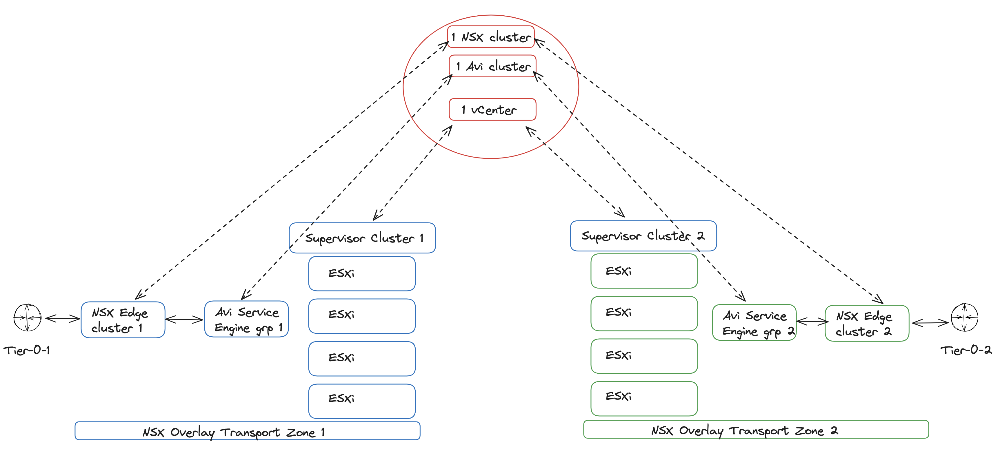

## Preparations in NSX

In NSX the important part is to configure each vSphere Clusters that will have their own instance of vSphere with Tanzu or Supervisor with their own unique NSX Overlay Transportzone.

So in my lab I have two vSphere Cluster, both configured with NSX, but using two different NSX Overlay Transportzone. It does not matter if they are utilizing the same TEP VLAN, but the logical boundary, as an overlay transportzone is, is limited to only involve the clusters isolated. Like this:

In my NSX Environment I have it configured like this.

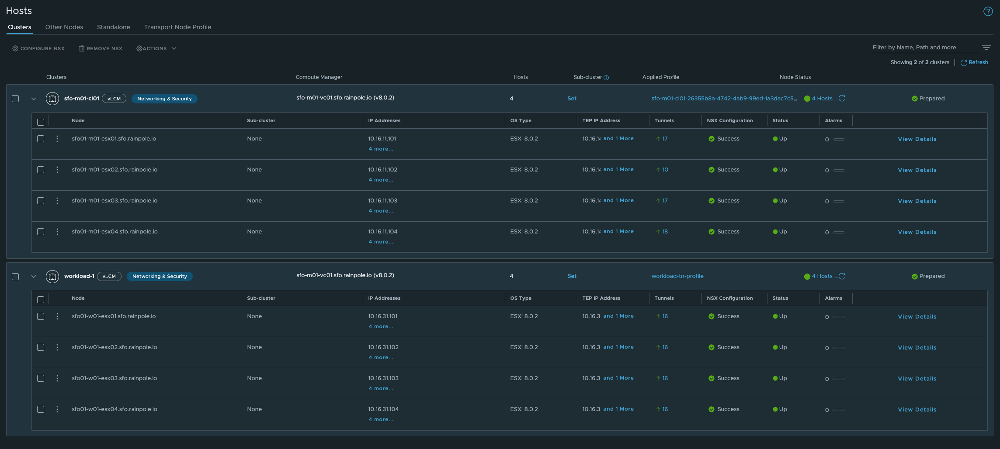

Using two different Transport Node Profiles:

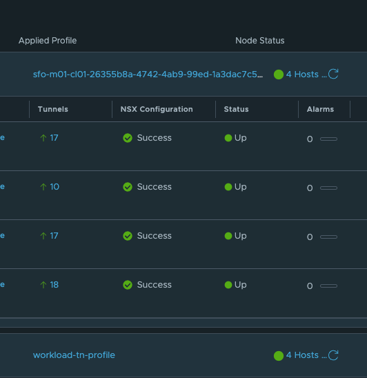

Where in the respective transport node profiles two different overlay transport zones have been defined:

Cluster-1:

Cluster-2:

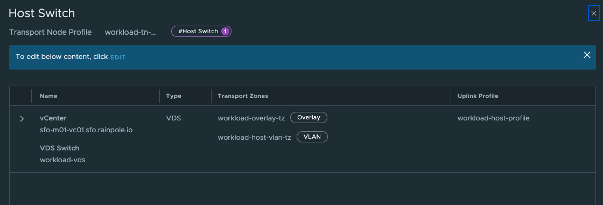

### NSX Edge Clusters

For many customers they have reasons to separate not only the compute part (different vSphere clusters for different departments, environments, customers (tenancy) but also network separation). So I decided to deploy a dedicated Edge cluster pr vSphere compute cluster. So I am in full controll of the traffic coming in and out of my different vSphere cluster, not only logical but also physical. What I end up with is one Tier-0 router pr vSphere Cluster/Supervisor Cluster (at a minimum as vSphere with Tanzu supports multiple Tier-0 routers even in the same Supervisor Cluster see this [post](https://blog.andreasm.io/2023/04/14/tanzu-with-vsphere-and-different-tier-0s/) how to configure vSphere with Tanzu using different Tier-0 routers).

So here is my network topology in NSX:

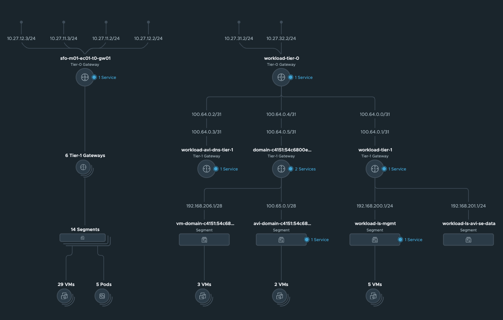

In the picture above, I have my Cluster 1 on the left where the **sfo-m01-ec01-to-gw01** is managing ingress and egress for my NSX overlay networks and on the right the **workload-tier-0** managing ingress and egress for my Cluster-2. 

Thats it for the NSX preparations. Next up is the Avi preparations.

## AVI preparations

In Avi, I need to configure two NSX clouds, using the same NSX manager cluster, but for Avi it is two different clouds. **The reason for that is because the Supervisor installation is using the NSX Overlay Transportzone as an identifier** for which NSX cloud to use when it sends request to Avi to create a Virtual Service to provide my K8s Api Endpoint. 

### AVI Clouds

In my Avi controller I have configured my two NSX clouds, using the same NSX manager, but as two different clouds in Avi.

If we take a quick peek inside both of them, starting with the *nsx-m01* cloud, we will find some common values and some unique. 

**nsx-m01**

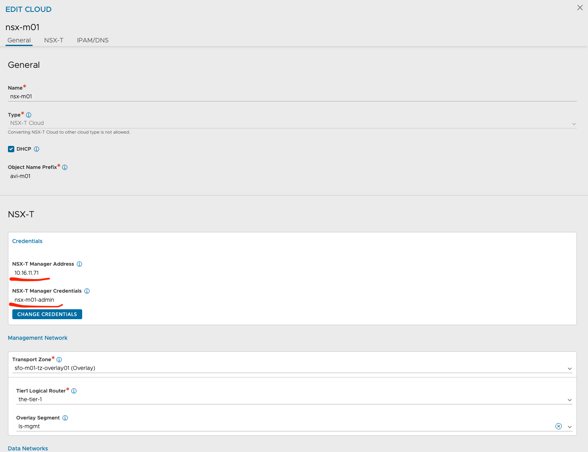

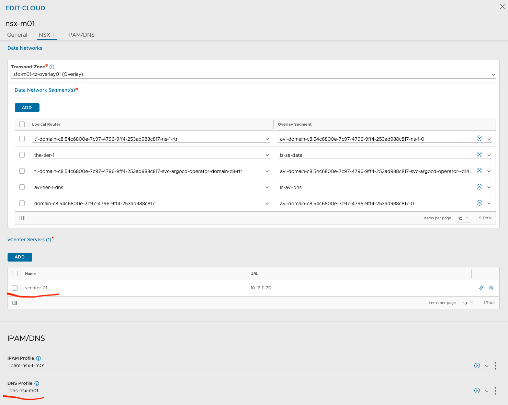

The fields in red are common settings between the two clouds. The other values are unique. Under DNS Profile one could also define a custom DNS profile ofcourse, I just went with the same DNS profile in my lab. It would make sense to have two different DNS profiles also to keep the red line of separation complete.

**nsx-m01-2**

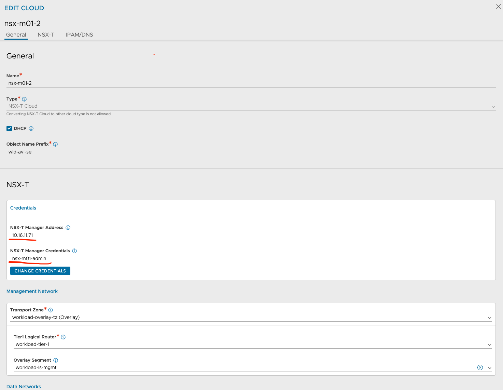

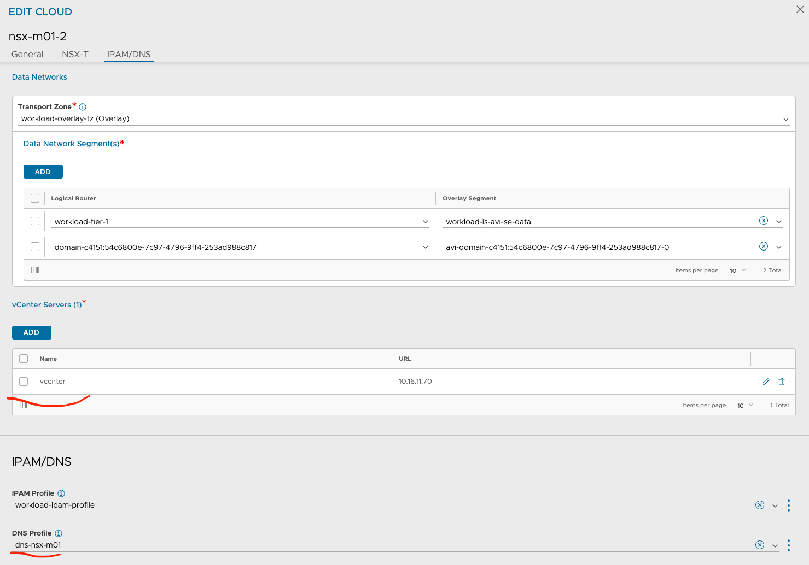

### Avi Cloud Resource - Service Engine Group and Networks

Under Avi Cloud Resources I have defined the Default Service Engine group according to the vSphere Clusters/NSX clouds they belong to. Cloud **nsx-m01** is using cluster **sfo-m01-cl01** so I have configured the Default SE group accordingly so they take SE placement into consideration. Meaning the SEs will be placed in the right vSphere Cluster. This is important as the Default Service Engine Group will be used as a template for vSphere with Tanzu to create a Service Engine group.

**Cloud nsx-m01**

The important factor is under **Scope** here:
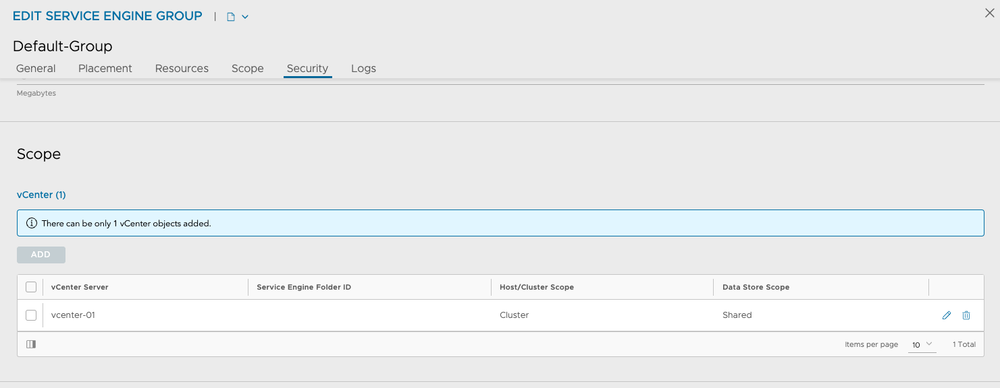

Here I have defined the scope for where the SEs should be placed for the Supervisor cluster deployed in my vSphere Cluster **sfo-m01-cl01**.

**Cloud nsx-m01-2**

On my next **nsx-m01-2** cloud I have configured the placement for this vSphere Cluster, which is the vSphere Cluster 

Its the same vCenter again, but different vSphere Cluster:

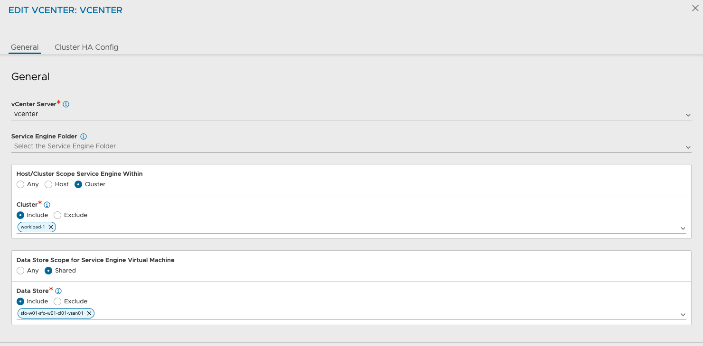

Under networks I have configured the necessary mgmt network and data network for my SEs accordingly. Meaning I have dedicated mgmt network and data network for my SEs in the **nsx-m01** cloud and **nsx-m01-2** cloud. The data network is only if you decide to also share or use the same SEs for other services, like Layer 7 from the TKC clusters. The vSphere with Tanzu installation will create its own data network name something like avi-domain-xxx.

**nsx-m01**

Management network is provided with DHCP, therefore empty in here. And I also have my Avi DNS service configured in this cloud.

**nsx-m01-2**

Thats it for the Avi configs. 

## vSphere with Tanzu setup

In my vCenter I have two vSphere clusters, where I have enabled the Workload Management, or the Supervisor using the above config to support my needs. This is how it looks, whith some explanations. 

### vSphere cluster sfo-m01-cl01

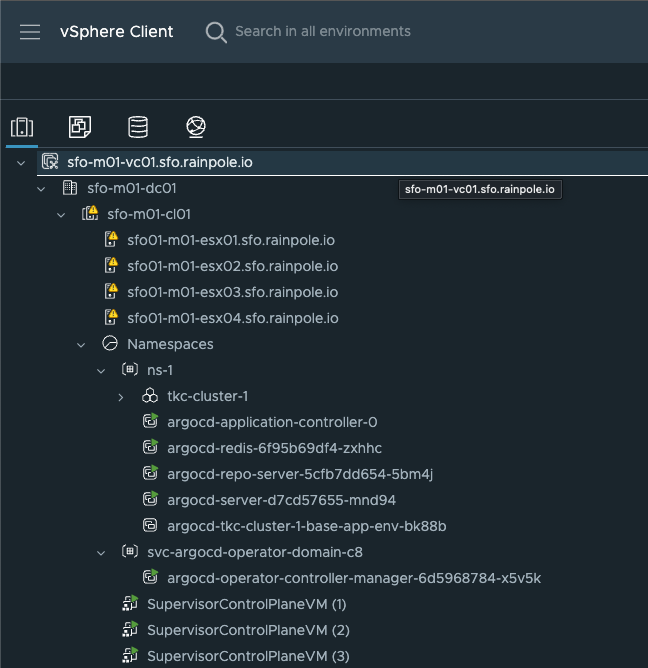

### vSphere cluster workload-1

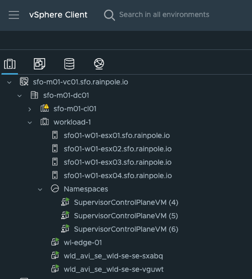

### Supervisors

### AVI virtual services for my k8s api endpoints

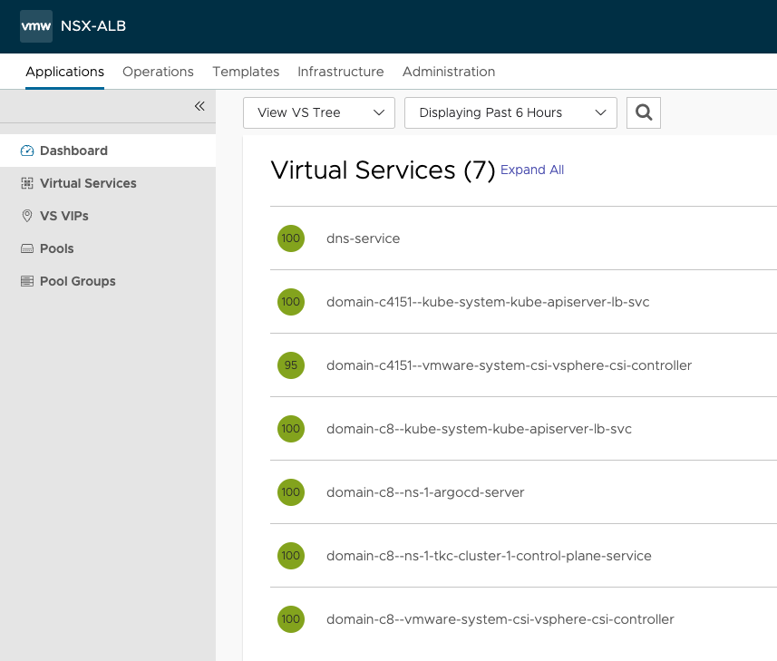

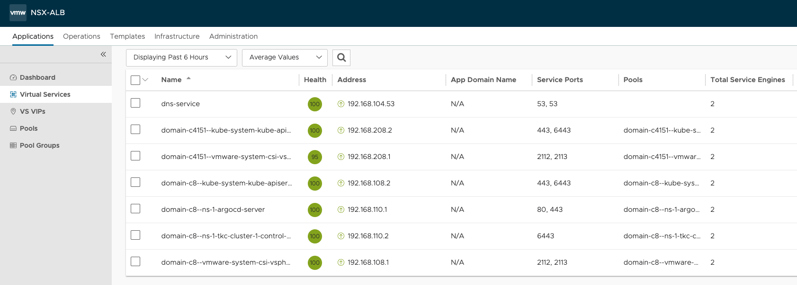

Notice the domain-cXXX ids. They reflect my respective vSphere cluster domain ids. All managed by the same Avi controller. 

They are provisioned with different VIPs, not using the same VIP (or ingress as defined when installing vSphere with Tanzu). Lets have a look at the Service Engines, and inspect the networking for them as well. 

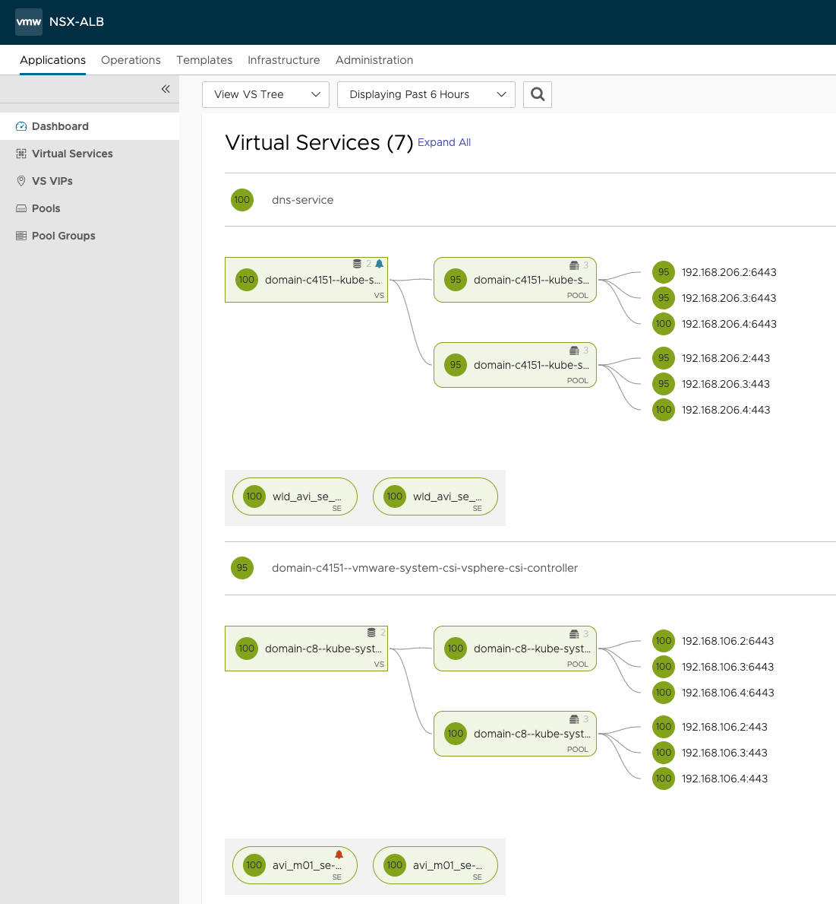

As we can see, they are being handled by two different pairs of Service Engines. We see that in vCenter also, see screenshot above.

For my vSphere Cluster **sfo-m01-cl01** 

And the vSphere Cluster **workload-1**

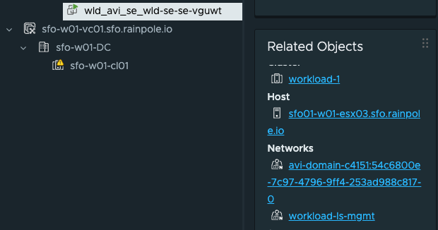

### NSX 

In NSX I can see two Distributed loadbalancers being created to serve as a **kube-proxy** replacement for the services internal to the Supervisor cluster itself (the Supervisor Controle Plane and ESXi worker nodes).

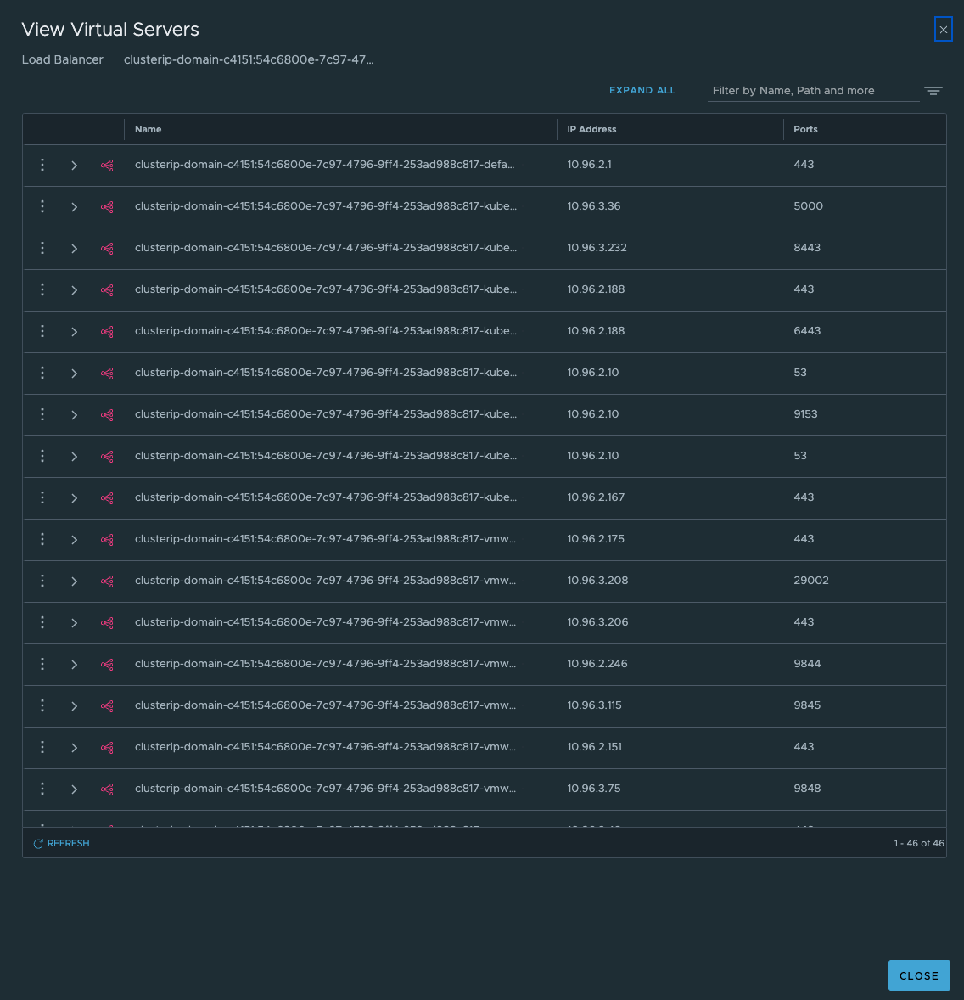

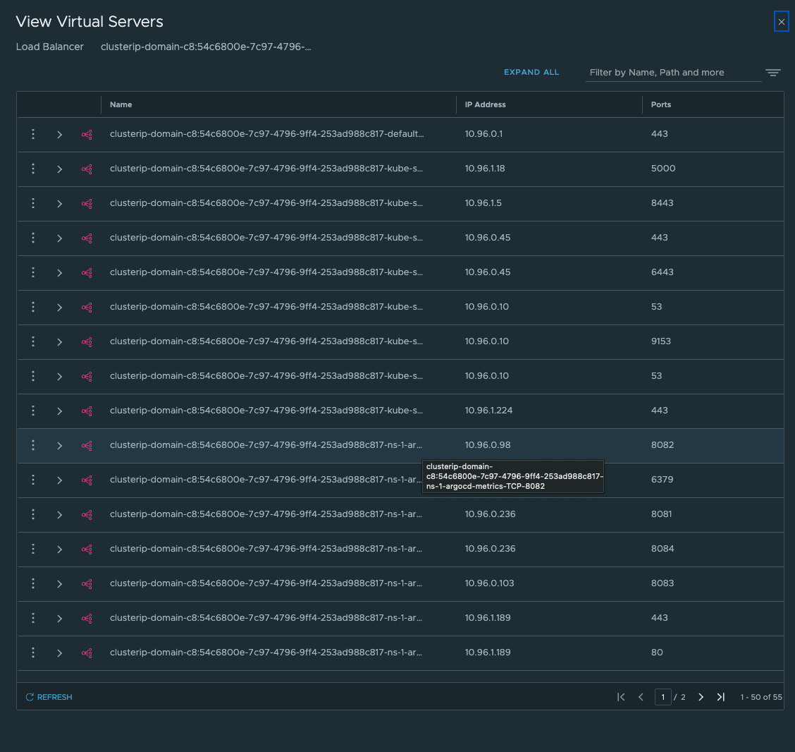

**Note**

When I provisioned my second Supervisor Cluster I did not overlap the Services CIDR by using the same range as defined in my first Supervisor Cluster. See screenshot below:

From my **svc-1**

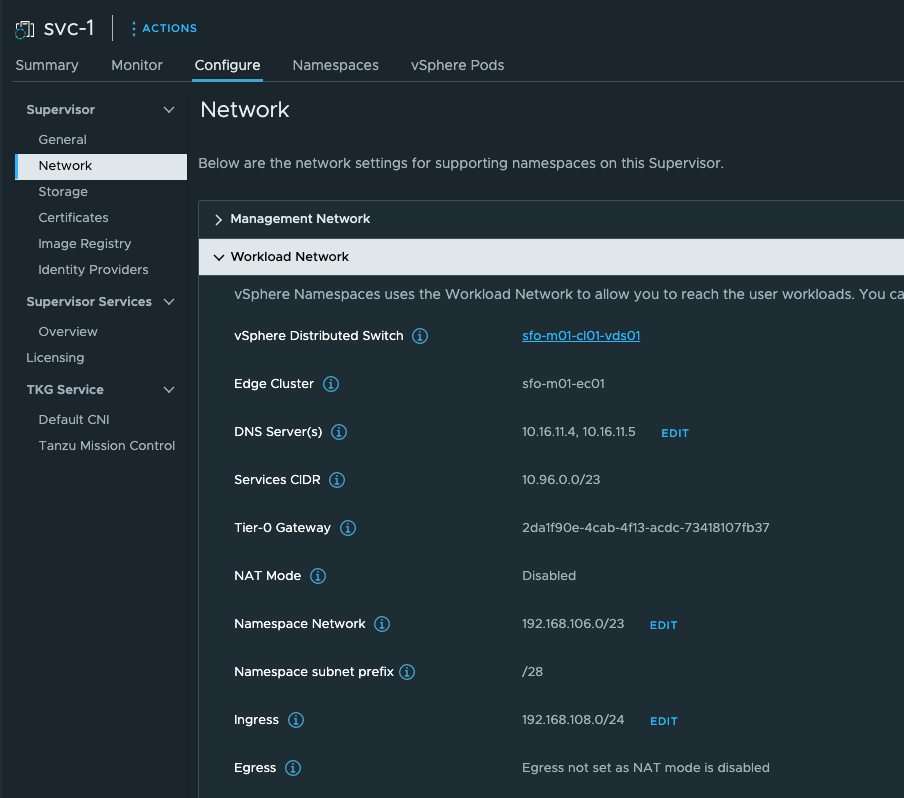

From my **svc-2**

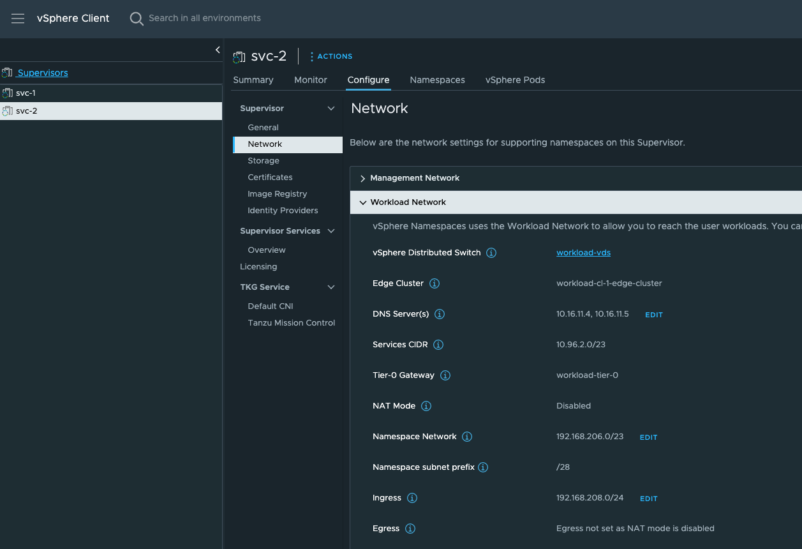

## Outro

Thats it, it is possible to use 1 NSX manager cluster, 1 vCenter Server and 1 AVI controller cluster to manage multiple Supervisor Clusters, and still maintain a high level of separation, except on the mgmt layer. If that is a requirement, then one have to install these components separately also. But that was not the point of this post.

