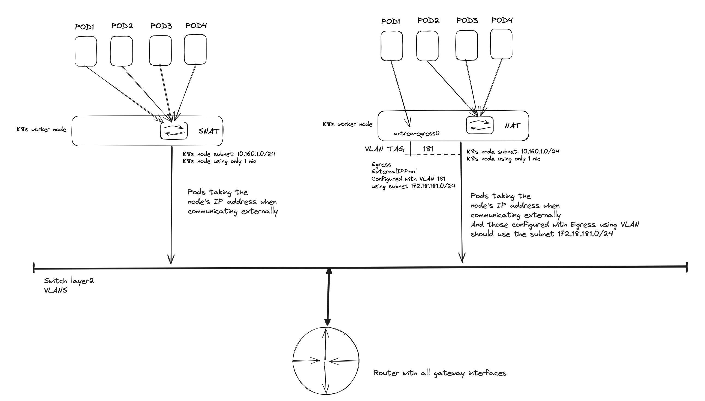

# Antrea FeatureGates

In this post, I will highlight a couple of Antrea features that I'd like to discuss. I will explain how to configure them, why they are useful, and how to use them. Below is some of the features I will cover

- Egress using VLAN
- AntreaProxy
- ServiceExternalIP
- L7FLowExporter
- Node Policy
- NodeNetwork Policy
- ExternalNode Policy
- TopologyAwareHints
- LodaBalancerModeDSR
- TrafficControl

As usual, head over to the official Antrea [documentation](https://antrea.io/docs/v1.15.1/) and Antrea [Github](https://github.com/antrea-io/antrea/blob/main/docs/feature-gates.md) repo for more information. This post will focus on the upstream version v1.15.1 of Antrea available on Github.

## Antrea Egress using VLAN - new in Antrea v.1.15.0

I have already covered Antrea Egress in another post [here](https://blog.andreasm.io/2023/02/20/antrea-egress/), where I use Daemonset to install FRR on the worker nodes. This allowed me to advertise the Egress addresses using BGP using a different subnet than the nodes themselves. Back then Antrea did not have support for Egress subnets in different network than the nodes. Now, in Antrea [v1.15.0](https://github.com/antrea-io/antrea/releases/tag/v1.15.0) there is support in Antrea Egress to use different subnets by using VLAN. This is a welcome update in Antrea.  

Before configuring Antrea Egress, the default behaviour for a pod when "egressing" or communicating externally outside its Kubernetes cluster is that its source address (POD CIDR) is translated using SNAT to the Kubernetes node the pod is currently running on. See below diagram:


Each time a pod needs to communicate outside its k8s node it will get the IP address from the node it is currently residing on.

With Antrea Egress I can specify a specific IP address from a pool I confgure for the PODS to use (for the ones I need Egress configured on). Before Antrea v1.15.0 I could only use the same subnet as the Kubernetes nodes were using, meaning I had to reserve a range inside that subnet for Egress usage to avoid IP overlap, unless I did some DIY stuff like static routes or as in my post [here](https://blog.andreasm.io/2023/02/20/antrea-egress/). Now with Antrea v1.15.0 I can achieve something like this:


The last image illustrates Antrea Egress using the new option to use VLAN and specifying different subnets for my Egresses. In simple terms, what it does is creating a vlan interface on the nodes I decide to use as Egress nodes. Like this:

```bash
11: antrea-ext.181@eth0: <BROADCAST,MULTICAST,UP,LOWER_UP> mtu 1500 qdisc noqueue state UP mode DEFAULT group default
    link/ether bc:24:11:1d:82:f5 brd ff:ff:ff:ff:ff:ff 
```

This then gives me the option create Antrea Egress IP Pools with different subnets, separating them using VLAN, for my pods to use when in need of reaching out externally. **This means I can have my nodes residing on its own VLAN, and my Antrea Egress pools separated on completely different VLANs than my nodes. **

In the diagram below I have configured Antrea Egress with an ExternalIPPool using VLAN and a subnet defined to be 172.18.181.0/24. The nodes themselves reside on the subnet 10.160.1.0/24. So when I apply the Egress resource on a pod (using label selectors) it will grab a free IP from the ExternalIPPool and use an address from that subnet (172.18.181.0/24) when exiting the node. The other pods not configured with Egress resources will still use SNAT and translate their IP into the residing pods ip address (10.160.1.0/24).  This gives me great flexibility not only to control which pods needs to use Egress, but also the flexibility to specify dedicated IP addresses for certain pods to use when egressing, and I can even specify multiple different subnets (see note [here]((which may incur additional management overhead))) using several Antrea Egress IP pools and achieve additional separation to meet different requirements. Controlling access via my firewall makes life much easier as I can allow a specific pod/IP to reach certain services in one part of my environment, where another pod with another subnet defined reach other parts of my environment. Using VLAN also eliminate the need of configuring BGP from my worker nodes to my BGP routers (which may incur additional management overhead), a VLAN is often simpler to create and manage.  


A very simple illustration on how my network is configured, for better context.



All my nodes are configured on a virtual port group using VLAN 216, using subnet 10.160.1.0/24 and my Egress pool is configured using VLAN 181. My switch is both L2 and L3, its configured with gateway interfaces for some of my networks and routes between the networks configured on the switch. All networks outside the switch is routed to my firewall using BGP.

### How to configure Antrea Egress using VLAN

Now that I have explained how this new Antrea Egress works, its time to show how to configure it in my Kubernetes cluster. 

The first requirement is that Antrea is on version 1.15.x. To check that execute the following command:

```bash
andreasm@linuxmgmt01:~$ k exec -it -n kube-system antrea-controller-c47585dbf-6vdsl antctl version
kubectl exec [POD] [COMMAND] is DEPRECATED and will be removed in a future version. Use kubectl exec [POD] -- [COMMAND] instead.
antctlVersion: v1.15.1
controllerVersion: v1.15.1
```

 Then make sure you have configured the following feature gates in the Antrea configMap:

```yaml
apiVersion: v1
kind: ConfigMap
metadata:
  name: antrea-config
  namespace: kube-system
data:
  antrea-agent.conf: |
    featureGates:
      Egress: true
      EgressSeparateSubnet: true
  antrea-controller.conf: |
    featureGates:
      Egress: true
```

 After editing the Antrea configMap, restart the Antrea controller and agents so they can fetch the updated configMap:

```bash
k rollout restart -n kube-system deployment/antrea-controller
k delete pods -n kube-system -l component=antrea-agent
```

Now I need to create and apply an ExternalIPPool:

```yaml
apiVersion: crd.antrea.io/v1beta1
kind: ExternalIPPool
metadata:
  name: egress-vlan-external-ip-pool
spec:
  ipRanges:
  - start: 172.18.181.40
    end: 172.18.181.50
  subnetInfo:
    gateway: 172.18.181.1
    prefixLength: 24
    vlan: 181 # notice the VLAN setting here - this is a different VLAN than my nodes are using.
  nodeSelector:
    matchLabels:
      egress-role: egress-node
```

I am using a nodeSelector matching on the label egress-role=egress-node. So I will need to label the nodes I want to be used as Egress nodes, or all of them. The Egress object will failover to the next available node if the active one fails and if I have more than one node labeled accordingly. I can quickly showcase that a bit later. 

If I check for any ExternalIPPools I should have one applied now:

```bash
andreasm@linuxmgmt01:~/prod-cluster-2$ k get externalippools.crd.antrea.io
NAME                           TOTAL   USED   AGE
egress-vlan-external-ip-pool   11      0      23h
```

Then I will label my nodes:

```bash
k label nodes k8s-node-vm-1-cl-02 egress-role=egress-node
k label nodes k8s-node-vm-2-cl-02 egress-role=egress-node
k label nodes k8s-node-vm-3-cl-02 egress-role=egress-node
```

Now my three control plane nodes can be used as Egress nodes.

I can now apply the Egress resource itself, refering to my ExternalIPPool above, where I will select an Ubuntu pod I already have running:

```yaml
apiVersion: crd.antrea.io/v1beta1
kind: Egress
metadata:
  name: egress-vlan
spec:
  appliedTo:
    podSelector:
      matchLabels:
        app: egress-1
  externalIPPool: egress-vlan-external-ip-pool
status:
  egressNode: k8s-node-vm-2-cl-02
```

In the appliedTo field I am using podSelector without namespace, so it is a clusterwide selection for any pods using the label app=egress-1. Then I select which ExternalIPPool to use. I am also specifying the preferred node as the Egress node, but as we will see later, if that one becomes unavailable it will failover to next available node. 

```bash
andreasm@linuxmgmt01:~/prod-cluster-2$ k get egress
NAME          EGRESSIP        AGE   NODE
egress-vlan   172.18.181.40   23h   k8s-node-vm-2-cl-02
```

And the ExternalIPPool now shows me:

```bash
andreasm@linuxmgmt01:~/prod-cluster-2$ k get externalippools.crd.antrea.io
NAME                           TOTAL   USED   AGE
egress-vlan-external-ip-pool   11      1      23h
```

If I enter bash of my Ubuntu pod now and ping an external vm, it will use the IP address above (172.18.181.40).

Lets see:


And just to show that my nodes are using subnet 10.160.1.0/24:

```bash
andreasm@linuxmgmt01:~/prod-cluster-2$ k get nodes -o wide
NAME                  STATUS   ROLES           AGE   VERSION   INTERNAL-IP   EXTERNAL-IP   OS-IMAGE             KERNEL-VERSION       CONTAINER-RUNTIME
k8s-cp-vm-1-cl-02     Ready    control-plane   66d   v1.28.5   10.160.1.21   <none>        Ubuntu 22.04.3 LTS   5.15.0-102-generic   containerd://1.7.13
k8s-cp-vm-2-cl-02     Ready    control-plane   66d   v1.28.5   10.160.1.22   <none>        Ubuntu 22.04.3 LTS   5.15.0-102-generic   containerd://1.7.13
k8s-cp-vm-3-cl-02     Ready    control-plane   66d   v1.28.5   10.160.1.23   <none>        Ubuntu 22.04.3 LTS   5.15.0-102-generic   containerd://1.7.13
k8s-node-vm-1-cl-02   Ready    <none>          66d   v1.28.5   10.160.1.25   <none>        Ubuntu 22.04.3 LTS   5.15.0-102-generic   containerd://1.7.13
k8s-node-vm-2-cl-02   Ready    <none>          66d   v1.28.5   10.160.1.26   <none>        Ubuntu 22.04.3 LTS   5.15.0-102-generic   containerd://1.7.13
k8s-node-vm-3-cl-02   Ready    <none>          66d   v1.28.5   10.160.1.27   <none>        Ubuntu 22.04.3 LTS   5.15.0-102-generic   containerd://1.7.13

andreasm@linuxmgmt01:~/prod-cluster-2$ k get pod -n egress -owide
NAME                            READY   STATUS    RESTARTS   AGE   IP           NODE                  NOMINATED NODE   READINESS GATES
ubuntu-20-04-59d474f9df-dv9ms   1/1     Running   0          28h   10.30.67.5   k8s-node-vm-1-cl-02   <none>           <none>
```


Thats it. Works beautifully.

On the node that is currently my Egress node, I will now have a interface called **antrea-ext.181@eth0**:

```bash
ubuntu@k8s-node-vm-2-cl-02:~$ ip link
1: lo: <LOOPBACK,UP,LOWER_UP> mtu 65536 qdisc noqueue state UNKNOWN mode DEFAULT group default qlen 1000
    link/loopback 00:00:00:00:00:00 brd 00:00:00:00:00:00
2: eth0: <BROADCAST,MULTICAST,UP,LOWER_UP> mtu 1500 qdisc fq_codel state UP mode DEFAULT group default qlen 1000
    link/ether bc:24:11:1d:82:f5 brd ff:ff:ff:ff:ff:ff
    altname enp0s18
3: kube-ipvs0: <BROADCAST,NOARP> mtu 1500 qdisc noop state DOWN mode DEFAULT group default
    link/ether d6:a1:1d:13:12:8e brd ff:ff:ff:ff:ff:ff
4: ovs-system: <BROADCAST,MULTICAST> mtu 1500 qdisc noop state DOWN mode DEFAULT group default qlen 1000
    link/ether 6a:31:ff:05:ab:b1 brd ff:ff:ff:ff:ff:ff
5: genev_sys_6081: <BROADCAST,MULTICAST,UP,LOWER_UP> mtu 65000 qdisc noqueue master ovs-system state UNKNOWN mode DEFAULT group default qlen 1000
    link/ether 1a:53:a9:d8:ba:e2 brd ff:ff:ff:ff:ff:ff
6: antrea-gw0: <BROADCAST,MULTICAST,UP,LOWER_UP> mtu 1450 qdisc noqueue state UNKNOWN mode DEFAULT group default qlen 1000
    link/ether 62:d1:4b:2d:7b:4d brd ff:ff:ff:ff:ff:ff
7: antrea-egress0: <BROADCAST,NOARP> mtu 1500 qdisc noop state DOWN mode DEFAULT group default
    link/ether 72:a2:89:52:08:32 brd ff:ff:ff:ff:ff:ff
9: yelb-db--81d702@if2: <BROADCAST,MULTICAST,UP,LOWER_UP> mtu 1450 qdisc noqueue master ovs-system state UP mode DEFAULT group default
    link/ether e6:8d:cb:ac:21:66 brd ff:ff:ff:ff:ff:ff link-netns cni-28ac3a0f-cfd6-4823-286a-2334edb7a11c
10: yelb-app-1534fc@if2: <BROADCAST,MULTICAST,UP,LOWER_UP> mtu 1450 qdisc noqueue master ovs-system state UP mode DEFAULT group default
    link/ether c6:97:db:c1:97:dd brd ff:ff:ff:ff:ff:ff link-netns cni-3fd6788c-d5e8-8a41-4a2b-e9d622c43a9e
11: antrea-ext.181@eth0: <BROADCAST,MULTICAST,UP,LOWER_UP> mtu 1500 qdisc noqueue state UP mode DEFAULT group default
    link/ether bc:24:11:1d:82:f5 brd ff:ff:ff:ff:ff:ff
```

```bash
ubuntu@k8s-node-vm-2-cl-02:~$ ip addr
1: lo: <LOOPBACK,UP,LOWER_UP> mtu 65536 qdisc noqueue state UNKNOWN group default qlen 1000
    link/loopback 00:00:00:00:00:00 brd 00:00:00:00:00:00
    inet 127.0.0.1/8 scope host lo
       valid_lft forever preferred_lft forever
    inet6 ::1/128 scope host
       valid_lft forever preferred_lft forever
2: eth0: <BROADCAST,MULTICAST,UP,LOWER_UP> mtu 1500 qdisc fq_codel state UP group default qlen 1000
    link/ether bc:24:11:1d:82:f5 brd ff:ff:ff:ff:ff:ff
    altname enp0s18
    inet 10.160.1.26/24 brd 10.160.1.255 scope global eth0
       valid_lft forever preferred_lft forever
    inet6 fe80::be24:11ff:fe1d:82f5/64 scope link
       valid_lft forever preferred_lft forever
8: antrea-ext.181@eth0: <BROADCAST,MULTICAST,UP,LOWER_UP> mtu 1500 qdisc noqueue state UP group default
    link/ether bc:24:11:1d:82:f5 brd ff:ff:ff:ff:ff:ff
    inet 172.18.181.40/24 brd 172.18.181.255 scope global antrea-ext.181
       valid_lft forever preferred_lft forever
    inet6 fe80::be24:11ff:fe1d:82f5/64 scope link
       valid_lft forever preferred_lft forever

```

{}

This interface uses a real VLAN tag. So the port group and the underlaying switch this node is connected to must allow VLAN tags. 

{}

Just a comment to the above. In my environment I am using Proxmox to host my Kubernetes nodes. I am tagging the "port-group" the actual VM is residing on, but I am also allowing certain other VLANs as trunks on the same port. So if I do "guest" tagging, aka tagging inside the VM the port group needs to respect and forward that tag. The way I solved this with Proxmox was to edit the VM config adding the "trunks=181;216" in the line below: 

```bash
net0: virtio=BC:24:11:1D:82:F5,bridge=vmbr0,firewall=0,tag=216,trunks=181;216
```

The VM needs to be powercycled for this to take effect. 

### Antrea Egress failover

As mentioned above, if my current Egress node fails the Egress gateway will move over to next available node. Let me poweroff the current Egress node and see what happens:

```bash
# Before powering off
andreasm@linuxmgmt01:~/prod-cluster-2$ k get egress
NAME          EGRESSIP        AGE   NODE
egress-vlan   172.18.181.40   23h   k8s-node-vm-2-cl-02
# After powered off
andreasm@linuxmgmt01:~/prod-cluster-2$ k get egress
NAME          EGRESSIP        AGE   NODE
egress-vlan   172.18.181.40   23h   k8s-node-vm-3-cl-02

# Node status
andreasm@linuxmgmt01:~/prod-cluster-2$ k get nodes
NAME                  STATUS     ROLES           AGE   VERSION
k8s-cp-vm-1-cl-02     Ready      control-plane   66d   v1.28.5
k8s-cp-vm-2-cl-02     Ready      control-plane   66d   v1.28.5
k8s-cp-vm-3-cl-02     Ready      control-plane   66d   v1.28.5
k8s-node-vm-1-cl-02   Ready      <none>          66d   v1.28.5
k8s-node-vm-2-cl-02   NotReady   <none>          66d   v1.28.5
k8s-node-vm-3-cl-02   Ready      <none>          66d   v1.28.5

```

The failover is pretty quick too.

As soon as the node-2 is back online again the Egress will revert back again, because I have declared it to be on the node-2 in my ExternalIPPool config:

```bash
andreasm@linuxmgmt01:~/prod-cluster-2$ k get egress -w
NAME          EGRESSIP        AGE   NODE
egress-vlan   172.18.181.40   23h   k8s-node-vm-3-cl-02
egress-vlan   172.18.181.40   23h   k8s-node-vm-2-cl-02
```


 

 

## Kube-Proxy vs Antrea Proxy

This chapter is kind of important to cover before I continue with the next Antrea features as this may have impact on how some of these features operate, and can operate. One should have some understanding of Kube-Proxy and Antrea-Proxy

Comparing kube-proxy and AntreaProxy involves looking at how each handles service traffic management within a Kubernetes cluster. 

**Kube-Proxy**

* Kube-proxy is running in the Kubernetes cluster as Daemonsets - Kube-Proxy runs in Userspace

- Kube-proxy is a default component in Kubernetes responsible for IP address translation and load balancing services within the cluster.
- It can use iptables or IPVS (nftables alpha in k8s 1.29), each with different performance characteristics.

- The iptables mode is commonly used due to its reliability and moderate performance, managing rules that route traffic to backend pods. IPtables runs in userspace.
- IPVS mode is known for better performance in large-scale environments because it handles traffic at the kernel level with less overhead than iptables. IPVS runs in Kernelspace

- While kube-proxy is suitable for many Kubernetes environments, its performance can degrade as the number of services and endpoints increases, especially in iptables mode.

- Deeply integrated into Kubernetes, kube-proxy watches the Kubernetes API for changes to services and endpoints and updates its rules accordingly.

**AntreaProxy**

- AntreaProxy is part of the Antrea CNI, designed to handle all Kubernetes service traffic using Open vSwitch (OVS) for more efficient packet processing.
- When enabled, it can completely replace kube-proxy by managing service traffic routing directly at the data plane level within each node.

- Handles traffic using OVS, which can be more efficient in packet processing compared to traditional iptables. This is beneficial for high-throughput and low-latency network environments.

- Designed to offer better scalability and performance in large-scale Kubernetes deployments due to its efficient handling of traffic at the OVS level.

- Integrates with Kubernetes but requires Antrea as the CNI. It monitors the Kubernetes API for changes to services and endpoints, similar to kube-proxy, but uses OVS flow rules instead of IPVS or iptables.

**Key Differences**

- **Traffic Handling**: Kube-proxy can use iptables or IPVS to manage traffic, which involves modifying Linux networking rules. AntreaProxy uses OVS to direct traffic, which can bypass some of the overhead associated with iptables or IPVS.
- **Dependency**: Kube-proxy is a standalone component within Kubernetes, while AntreaProxy is part of the Antrea CNI and requires its installation.
- **Performance and Scalability**: AntreaProxy generally offers better performance and scalability due to its use of OVS, particularly in environments with high numbers of services and endpoints.

The choice between kube-proxy and AntreaProxy often comes down to the specific requirements of a Kubernetes deployment, such as scale, performance, and the preferred networking approach. 

### AntreaProxy AND Kube-Proxy together

AntreaProxy is enabled by default since Antrea version v0.11. When the Antrea feature gate *antreaProxy* is set to *true* Antrea will provide service loadbalancing for ClusterIP services in OVS instead of using kube-proxy and only applies to traffic coming from pods to ClusterIP services. This means we still need to have Kube-Proxy for other services, such as NodePort (external to cluster service) and node to all cluster services (including hostNetwork pods). This is a default setup. Antrea can also act as the only proxy in a Kubernetes cluster, more on that in a chapter later.

When traffic enters the Kubernetes cluster, eg serviceType Loadbalancer or NodePort, or node to service it will be handled by kube-proxy. Traffic originating from a pod to a cluster-service will be handled by AntreaProxy.

An illustration of what AntreaProxy handles when the feature gate AntreaProxy is set to true:


The below diagrams explains what kube-proxy handles when the AntreaProxy is enabled:

**Node to service**


**External to service**


### AntreaProxy All

As mentioned above, there is no need to have both kube-proxy and AntreaProxy. One can remove kube-proxy completely. AntreaProxy can handle all services, external and internal, node to service, external to service, NodePort etc. 

To enable AntreaProxy all the following feature-gate needs to be enabled:

```yaml
kind: ConfigMap
apiVersion: v1
metadata:
  name: antrea-config
  namespace: kube-system
data:
    antreaProxy:
      proxyAll: true
```

With AntreaProxy all enabled kube-proxy is not automatically removed (if one have a Kubernetes cluster with kube-proxy deployed). So in a cluster with kube-proxy already running, there is a couple of steps that needs to be done to remove kube-proxy and enable AntreaProxy all. 

If one enables AntreaProxy:all and Kube-Proxy is still there, Kube-Proxy will take precedence. There is two ways to delete kube-proxy, during cluster bootstrap (`kubeadm init --skip-phases=addon/kube-proxy`) or post cluster bootstrap. Below I will go through how to delete kube-proxy on a already running cluster with kube-proxy already deployed. 

I will follow the offical documentation from Antrea Github repo [here](kubectl -n kube-system delete ds/kube-proxy):

```bash
# Delete the kube-proxy DaemonSet
andreasm@linuxmgmt01:~/prod-cluster-2$ kubectl -n kube-system delete ds/kube-proxy
daemonset.apps "kube-proxy" deleted
# Delete the kube-proxy ConfigMap to prevent kube-proxy from being re-deployed
# by kubeadm during "upgrade apply". This workaround will not take effect for
# kubeadm versions older than v1.19 as the following patch is required:
# https://github.com/kubernetes/kubernetes/pull/89593
andreasm@linuxmgmt01:~/prod-cluster-2$ kubectl -n kube-system delete cm/kube-proxy
configmap "kube-proxy" deleted
# Delete existing kube-proxy rules; there are several options for doing that
# Option 1 (if using kube-proxy in iptables mode), run the following on each Node:
iptables-save | grep -v KUBE | iptables-restore
# This option is not valid for me as I use IPVS
# Option 2 (any mode), restart all Nodes # I chose this option
# Option 3 (any mode), run the following on each Node:
kube-proxy --cleanup 
# You can create a DaemonSet to easily run the above command on all Nodes, using
# the kube-proxy container image
```


After the steps above I will need to edit the Antrea ConfigMap with the following:

```yaml
kind: ConfigMap
apiVersion: v1
metadata:
  name: antrea-config
  namespace: kube-system
data:
  antrea-agent.conf: |
    kubeAPIServerOverride: "https://k8s-dev-cluster-3.domain.int"
    antreaProxy:
      proxyAll: true
```

Last step is to restart the Antrea controller and Antrea agents and see if they come up again.

```bash
k rollout restart -n kube-system deployment/antrea-controller
k delete pods -n kube-system -l component=antrea-agent

```

```bash
andreasm@linuxmgmt01:~/prod-cluster-2$ k get pods -A
NAMESPACE     NAME                                        READY   STATUS    RESTARTS        AGE
kube-system   antrea-agent-7pc6r                          2/2     Running   0               37s
kube-system   antrea-agent-b6c58                          2/2     Running   0               37s
kube-system   antrea-agent-pj62z                          2/2     Running   0               37s
kube-system   antrea-agent-rcckh                          2/2     Running   0               37s
kube-system   antrea-agent-tftv5                          2/2     Running   0               37s
kube-system   antrea-agent-twpfs                          2/2     Running   0               38s
kube-system   antrea-controller-6bd6b9569c-vhx7n          1/1     Running   0               50s
```

No kube-proxy pods:

```bash
andreasm@linuxmgmt01:~/prod-cluster-2$ k get pods -A
NAMESPACE     NAME                                        READY   STATUS    RESTARTS        AGE
kube-system   antrea-agent-7pc6r                          2/2     Running   0               72s
kube-system   antrea-agent-b6c58                          2/2     Running   0               72s
kube-system   antrea-agent-pj62z                          2/2     Running   0               72s
kube-system   antrea-agent-rcckh                          2/2     Running   0               72s
kube-system   antrea-agent-tftv5                          2/2     Running   0               72s
kube-system   antrea-agent-twpfs                          2/2     Running   0               73s
kube-system   antrea-controller-6bd6b9569c-vhx7n          1/1     Running   0               85s
kube-system   coredns-77f7cc69db-jnh6m                    1/1     Running   1 (9m36s ago)   21h
kube-system   coredns-77f7cc69db-wb5qs                    1/1     Running   1 (9m3s ago)    21h
kube-system   dns-autoscaler-8576bb9f5b-5n7hv             1/1     Running   1 (9m36s ago)   21h
kube-system   kube-apiserver-k8s-cp-vm-1-cl-03            1/1     Running   3 (8m55s ago)   21h
kube-system   kube-apiserver-k8s-cp-vm-2-cl-03            1/1     Running   2 (9m36s ago)   21h
kube-system   kube-apiserver-k8s-cp-vm-3-cl-03            1/1     Running   2 (9m3s ago)    21h
kube-system   kube-controller-manager-k8s-cp-vm-1-cl-03   1/1     Running   4 (9m16s ago)   21h
kube-system   kube-controller-manager-k8s-cp-vm-2-cl-03   1/1     Running   4 (9m36s ago)   21h
kube-system   kube-controller-manager-k8s-cp-vm-3-cl-03   1/1     Running   4 (9m3s ago)    21h
kube-system   kube-scheduler-k8s-cp-vm-1-cl-03            1/1     Running   3 (8m45s ago)   21h
kube-system   kube-scheduler-k8s-cp-vm-2-cl-03            1/1     Running   2 (9m36s ago)   21h
kube-system   kube-scheduler-k8s-cp-vm-3-cl-03            1/1     Running   3 (9m3s ago)    21h
```


No "kube-ipvs0" interface:

```bash
ubuntu@k8s-node-vm-1-cl-03:~$ ip addr
1: lo: <LOOPBACK,UP,LOWER_UP> mtu 65536 qdisc noqueue state UNKNOWN group default qlen 1000
    link/loopback 00:00:00:00:00:00 brd 00:00:00:00:00:00
    inet 127.0.0.1/8 scope host lo
       valid_lft forever preferred_lft forever
    inet6 ::1/128 scope host
       valid_lft forever preferred_lft forever
2: eth0: <BROADCAST,MULTICAST,UP,LOWER_UP> mtu 1500 qdisc fq_codel state UP group default qlen 1000
    link/ether bc:24:11:f4:ee:ef brd ff:ff:ff:ff:ff:ff
    altname enp0s18
    inet 10.160.1.35/24 brd 10.160.1.255 scope global eth0
       valid_lft forever preferred_lft forever
    inet6 fe80::be24:11ff:fef4:eeef/64 scope link
       valid_lft forever preferred_lft forever
3: ovs-system: <BROADCAST,MULTICAST> mtu 1500 qdisc noop state DOWN group default qlen 1000
    link/ether ee:a3:e7:de:7d:3c brd ff:ff:ff:ff:ff:ff
4: genev_sys_6081: <BROADCAST,MULTICAST,UP,LOWER_UP> mtu 65000 qdisc noqueue master ovs-system state UNKNOWN group default qlen 1000
    link/ether e6:09:e7:ee:1f:fc brd ff:ff:ff:ff:ff:ff
    inet6 fe80::64c1:4aff:fe4d:f8b2/64 scope link
       valid_lft forever preferred_lft forever
5: antrea-gw0: <BROADCAST,MULTICAST,UP,LOWER_UP> mtu 1450 qdisc noqueue state UNKNOWN group default qlen 1000
    link/ether 62:78:99:77:56:60 brd ff:ff:ff:ff:ff:ff
    inet 10.40.68.1/24 brd 10.40.68.255 scope global antrea-gw0
       valid_lft forever preferred_lft forever
    inet6 fe80::6078:99ff:fe77:5660/64 scope link
       valid_lft forever preferred_lft forever
6: antrea-egress0: <BROADCAST,NOARP> mtu 1500 qdisc noop state DOWN group default
    link/ether 3e:77:85:e2:e2:1a brd ff:ff:ff:ff:ff:ff
```


Now with no kube-proxy and AntreaProxy all enabled we can do some more magic.

With that out of the way, lets continue on the Antrea features (which happen to involve AntreaProxy).


## Antrea ServiceExternalIP - from Antrea v1.5.x

ServiceExternalIP is a feature in Antrea to provide external IP addresses for serviceType LoadBalancer. This feature is useful when there is no external/cloud/3rd party loadbalancer available to provide these external IP addresses. 

Today ServiceExternalIP supports ip addresses allocated from the same subnet (L2) as the Kubernetes nodes, by reserving a range of addresses for this use. It also supports a different subnet (L3) than the Kubernetes nodes themselves but one have to define static routes (host routes x.x.x.x/32) in the underlaying router/gateway to one or several of the nodes in your Kubernetes Cluster.  After I apply a service using ServiceExternalIP all nodes will be aware of this IP address. 

```bash
# worker node 2
ubuntu@k8s-node-vm-2-cl-02:~$ ip addr
3: kube-ipvs0: <BROADCAST,NOARP> mtu 1500 qdisc noop state DOWN group default
    link/ether d6:a1:1d:13:12:8e brd ff:ff:ff:ff:ff:ff
    inet 10.169.1.40/32 scope global kube-ipvs0 # IP from my ExternalIPPool
       valid_lft forever preferred_lft forever
```

```bash
# worker node 1
ubuntu@k8s-node-vm-1-cl-02:~$ ip addr
3: kube-ipvs0: <BROADCAST,NOARP> mtu 1500 qdisc noop state DOWN group default
    link/ether a6:bf:87:cc:53:cc brd ff:ff:ff:ff:ff:ff
    inet 10.169.1.40/32 scope global kube-ipvs0
       valid_lft forever preferred_lft forever # IP from my ExternalIPPool
```

 And here one can clearly see IPVS is handling this IP and is available on all nodes (if using kube-proxy with IPVS). So creating a static route and pointing to any of my Kubernetes nodes will get me to the service. 


{}

When it comes to failure of a node and this happens to be the node you defined as the nexthop you will ofcourse loose access. One could add several routes using cost/distance, but this will not always solve the issue as the router/switch does not really know that the node is gone. It will be kept in the ARP table, and as long as its there (it may be drained after a while), the switch will continue forward traffic to it. This may ofcourse depend on router/switch also which features are implemented and can be used using static routes. There is no BFD, and a VM is not actually disconnecting anything if it goes down.

{}


ServiceExternalIP will work with Kube-Proxy using IPVS or IPTables and AntreaProxy where there is no Kube-Proxy.  If using Kube-Proxy with IPVS *strictARP* must be enabled in the kube-proxy config:

```yaml
# configMap kube-proxy
apiVersion: v1
data:
  config.conf: |-
    apiVersion: kubeproxy.config.k8s.io/v1alpha1
    ipvs:
      excludeCIDRs: []
      minSyncPeriod: 0s
      scheduler: rr
      strictARP: true # set to true
      syncPeriod: 30s
      tcpFinTimeout: 0s
      tcpTimeout: 0s
      udpTimeout: 0s
```


Below I will go through ServiceExternalIP using kube-proxy and only AntreaProxy


### ServiceExternalIP using Kube-Proxy and IPVS (IP Virtual Server)

In this section I am on a cluster using kube-proxy with IPVS (not IPTables). When using kube-proxy with IPVS kube-proxy sets up and manage the IPVS rules. IPVS residing in the Linux Kernel is then responsible for directing incoming traffic to backend pods, as in my digram below the Yelb-UI pods. 


Kube-proxy listens on incoming traffic, IPVS forwards the traffic to the corresponding backend-pods. 

The service and corresponding endpoints:

```bash
andreasm@linuxmgmt01:~/prod-cluster-2$ k describe svc -n yelb yelb-ui
Name:                     yelb-ui
Namespace:                yelb
Labels:                   app=yelb-ui
                          tier=frontend
Annotations:              service.antrea.io/external-ip-pool: service-external-ip-pool
Selector:                 app=yelb-ui,tier=frontend
Type:                     LoadBalancer
IP Family Policy:         SingleStack
IP Families:              IPv4
IP:                       10.30.48.237
IPs:                      10.30.48.237
LoadBalancer Ingress:     10.169.1.40
Port:                     <unset>  80/TCP
TargetPort:               80/TCP
NodePort:                 <unset>  32611/TCP
Endpoints:                10.30.67.5:80,10.30.68.6:80,10.30.69.2:80
Session Affinity:         None
External Traffic Policy:  Cluster
Events:                   <none>
```

The pods, representing the endpoints:

```bash
andreasm@linuxmgmt01:~/prod-cluster-2$ k get pods -n yelb -owide
NAME                            READY   STATUS    RESTARTS      AGE     IP           NODE                  NOMINATED NODE   READINESS GATES
yelb-ui-f544fc74f-mb5m6         1/1     Running   0             41m     10.30.68.6   k8s-node-vm-2-cl-02   <none>           <none>
yelb-ui-f544fc74f-pztht         1/1     Running   0             2m37s   10.30.67.5   k8s-node-vm-1-cl-02   <none>           <none>
yelb-ui-f544fc74f-r48rx         1/1     Running   0             2m37s   10.30.69.2   k8s-node-vm-3-cl-02   <none>           <none>
```


The IPVS loadbalancing in action:

```bash
ubuntu@k8s-node-vm-1-cl-02:~$ sudo ipvsadm -l
IP Virtual Server version 1.2.1 (size=4096)
Prot LocalAddress:Port Scheduler Flags
  -> RemoteAddress:Port           Forward Weight ActiveConn InActConn
TCP  k8s-node-vm-1-cl-02:32611 rr
  -> 10-30-67-5.yelb-ui.yelb.svc. Masq    1      0          0
  -> 10-30-68-6.yelb-ui.yelb.svc. Masq    1      0          0
  -> 10-30-69-2.yelb-ui.yelb.svc. Masq    1      0          0
TCP  k8s-node-vm-1-cl-02.cluster. rr
  -> 10-30-67-5.yelb-ui.yelb.svc. Masq    1      0          0
  -> 10-30-68-6.yelb-ui.yelb.svc. Masq    1      0          0
  -> 10-30-69-2.yelb-ui.yelb.svc. Masq    1      0          0
TCP  k8s-node-vm-1-cl-02:http rr
  -> 10-30-67-5.yelb-ui.yelb.svc. Masq    1      0          0
  -> 10-30-68-6.yelb-ui.yelb.svc. Masq    1      0          0
  -> 10-30-69-2.yelb-ui.yelb.svc. Masq    1      0          0

```


```bash
# All IPs involved in the yelb-ui service, pod, service etc
ubuntu@k8s-node-vm-3-cl-02:~$ sudo ipvsadm -L -n
IP Virtual Server version 1.2.1 (size=4096)
Prot LocalAddress:Port Scheduler Flags
  -> RemoteAddress:Port           Forward Weight ActiveConn InActConn
TCP  10.30.63.48:80 rr
  -> 10.30.68.3:80                Masq    1      0          0
TCP  10.30.69.1:31925 rr
  -> 10.30.68.3:80                Masq    1      0          0
TCP  10.160.1.27:31925 rr
  -> 10.30.68.3:80                Masq    1      0          0
TCP  10.169.1.40:80 rr
  -> 10.30.68.3:80                Masq    1      0          0
UDP  10.30.0.3:53 rr
  -> 10.30.65.3:53                Masq    1      0          1
  -> 10.30.66.2:53                Masq    1      0          1
```

```bash
andreasm@linuxmgmt01:~/prod-cluster-2$ k get pods -n yelb -owide
NAME                            READY   STATUS    RESTARTS      AGE    IP           NODE                  NOMINATED NODE   READINESS GATES
redis-server-84f4bf49b5-lstpm   1/1     Running   2 (4d ago)    71d    10.30.67.4   k8s-node-vm-1-cl-02   <none>           <none>
yelb-appserver-6dc7cd98-4c6s5   1/1     Running   5 (98m ago)   71d    10.30.68.4   k8s-node-vm-2-cl-02   <none>           <none>
yelb-db-84d6f6fc6c-dlp68        1/1     Running   5 (98m ago)   71d    10.30.68.2   k8s-node-vm-2-cl-02   <none>           <none>
yelb-ui-f544fc74f-vm2b2         1/1     Running   1 (98m ago)   123m   10.30.68.3   k8s-node-vm-2-cl-02   <none>           <none>
```


Next chapter will cover how this looks with AntreaProxy all. 

### ServiceExternalIP using only AntreaProxy. 


Lets go through how this works


Using different subnets, challenge when active node goes down. Static routes failover. What about failover in general?

Using same L2 subnet as the nodes, failover will be handled automatically as it will broadcast the ARP? 

Lets try


Kyverno

Loadbalancer using VLAN?
