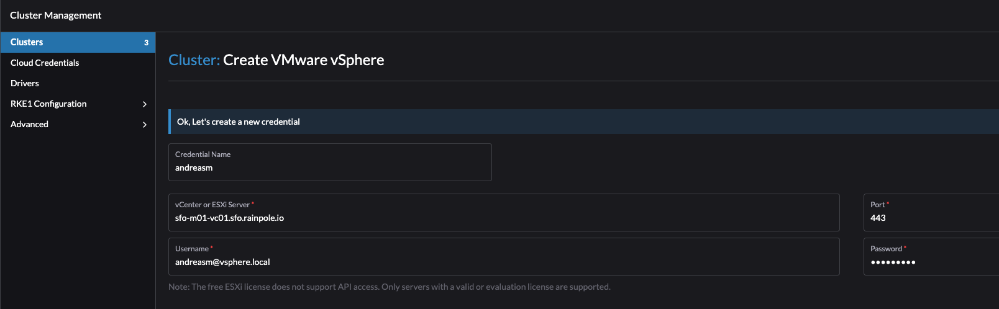
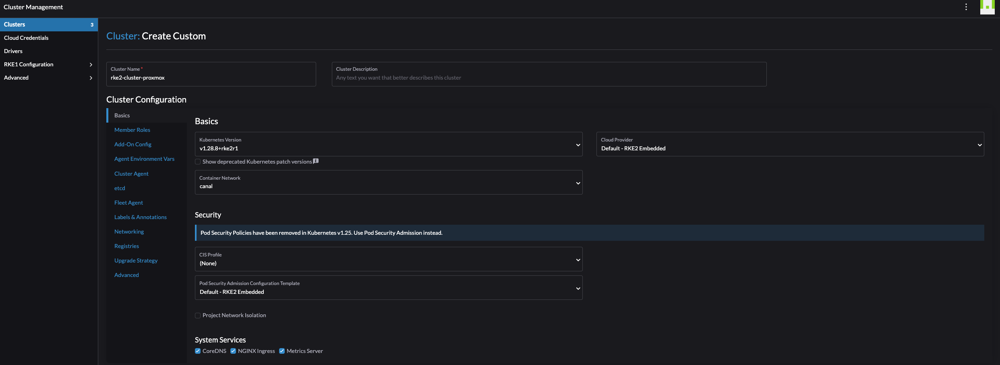

# Rancher by Suse - short introduction


## Installing Rancher on an existing Kubernetes Cluster using Helm

Before I can start using Rancher I need to install it. Rancher can be deployed using Docker for poc/testing purposes and on (more or less any) Kubernetes platform for production use. *If one started out testing Rancher on Docker one can actually [migrate](https://ranchermanager.docs.rancher.com/getting-started/installation-and-upgrade/other-installation-methods) from Docker to Kubernetes at a later stage also.* In this post I will deploy Rancher on Kubernetes. I have already deployed a Kubernetes cluster I intend to deploy Rancher on. The Kubernetes cluster that will be used is provisioned on vSphere with Tanzu, running in my vSphere cluster using the method I describe in this [post](https://blog.andreasm.io/2024/02/04/argo-cd-vsphere-with-tanzu/). vSphere with Tanzu is also its own Kubernetes management platform ofcourse. I have deployed 3 control plane nodes and 3 worker nodes. All persistent storage will be handled by the the vSphere Cluster VSAN storage. Ingress will be taken care of by VMware Avi loadbalancer. 

Here is my TKC cluster I will install rancher on:


The cluster is ready, I have the ingress class installed by Avi. I need to add the Helm repo then deploy Rancher:

```bash
# latest - recommended for testing the newest features
andreasm@linuxmgmt01:~$ helm repo add rancher-latest https://releases.rancher.com/server-charts/latest
"rancher-latest" has been added to your repositories

```

  Create a namespace for Rancher:

```bash
andreasm@linuxmgmt01:~$ kubectl create namespace cattle-system

namespace/cattle-system created
```

I will bring my own Certificate, so skipping Cert-Manager. This is my Rancher Helm value yaml:

```yaml
# Additional Trusted CAs.
# Enable this flag and add your CA certs as a secret named tls-ca-additional in the namespace.
# See README.md for details.
additionalTrustedCAs: false

antiAffinity: preferred
topologyKey: kubernetes.io/hostname

# Audit Logs https://rancher.com/docs/rancher/v2.x/en/installation/api-auditing/
# The audit log is piped to the console of the rancher-audit-log container in the rancher pod.
# https://rancher.com/docs/rancher/v2.x/en/installation/api-auditing/
# destination stream to sidecar container console or hostPath volume
# level: Verbosity of logs, 0 to 3. 0 is off 3 is a lot.
auditLog:
  destination: sidecar
  hostPath: /var/log/rancher/audit/
  level: 0
  maxAge: 1
  maxBackup: 1
  maxSize: 100

  # Image for collecting rancher audit logs.
  # Important: update pkg/image/export/resolve.go when this default image is changed, so that it's reflected accordingly in rancher-images.txt generated for air-gapped setups.
  image:
    repository: "rancher/mirrored-bci-micro"
    tag: 15.4.14.3
    # Override imagePullPolicy image
    # options: Always, Never, IfNotPresent
    pullPolicy: "IfNotPresent"

# As of Rancher v2.5.0 this flag is deprecated and must be set to 'true' in order for Rancher to start
addLocal: "true"

# Add debug flag to Rancher server
debug: false

# When starting Rancher for the first time, bootstrap the admin as restricted-admin
restrictedAdmin: false

# Extra environment variables passed to the rancher pods.
# extraEnv:
# - name: CATTLE_TLS_MIN_VERSION
#   value: "1.0"

# Fully qualified name to reach your Rancher server
hostname: rancher-01.my.domain.net

## Optional array of imagePullSecrets containing private registry credentials
## Ref: https://kubernetes.io/docs/tasks/configure-pod-container/pull-image-private-registry/
imagePullSecrets: []
# - name: secretName

### ingress ###
# Readme for details and instruction on adding tls secrets.
ingress:
  # If set to false, ingress will not be created
  # Defaults to true
  # options: true, false
  enabled: true
  includeDefaultExtraAnnotations: true
  extraAnnotations: {}
  ingressClassName: "avi-lb"
  # Certain ingress controllers will will require the pathType or path to be set to a different value.
  pathType: ImplementationSpecific
  path: "/"
  # backend port number
  servicePort: 80

  # configurationSnippet - Add additional Nginx configuration. This example statically sets a header on the ingress.
  # configurationSnippet: |
  #   more_set_input_headers "X-Forwarded-Host: {{ .Values.hostname }}";

  tls:
    # options: rancher, letsEncrypt, secret
    source: secret
    secretName: tls-rancher-ingress

### service ###
# Override to use NodePort or LoadBalancer service type - default is ClusterIP
service:
  type: ""
  annotations: {}

### LetsEncrypt config ###
# ProTip: The production environment only allows you to register a name 5 times a week.
#         Use staging until you have your config right.
letsEncrypt:
  # email: none@example.com
  environment: production
  ingress:
    # options: traefik, nginx
    class: ""
# If you are using certs signed by a private CA set to 'true' and set the 'tls-ca'
# in the 'rancher-system' namespace. See the README.md for details
privateCA: false

# http[s] proxy server passed into rancher server.
# proxy: http://<username>@<password>:<url>:<port>

# comma separated list of domains or ip addresses that will not use the proxy
noProxy: 127.0.0.0/8,10.0.0.0/8,172.16.0.0/12,192.168.0.0/16,.svc,.cluster.local

# Override rancher image location for Air Gap installs
rancherImage: rancher/rancher
# rancher/rancher image tag. https://hub.docker.com/r/rancher/rancher/tags/
# Defaults to .Chart.appVersion
# rancherImageTag: v2.0.7

# Override imagePullPolicy for rancher server images
# options: Always, Never, IfNotPresent
# Defaults to IfNotPresent
# rancherImagePullPolicy: <pullPolicy>

# Number of Rancher server replicas. Setting to negative number will dynamically between 0 and the abs(replicas) based on available nodes.
# of available nodes in the cluster
replicas: 3

# Set priorityClassName to avoid eviction
priorityClassName: rancher-critical

# Set pod resource requests/limits for Rancher.
resources: {}

#
# tls
#   Where to offload the TLS/SSL encryption
# - ingress (default)
# - external
tls: ingress

systemDefaultRegistry: ""

# Set to use the packaged system charts
useBundledSystemChart: false

# Certmanager version compatibility
certmanager:
  version: ""

# Rancher custom logos persistence
customLogos:
  enabled: false
  volumeSubpaths:
    emberUi: "ember"
    vueUi: "vue"
  ## Volume kind to use for persistence: persistentVolumeClaim, configMap
  volumeKind: persistentVolumeClaim
  ## Use an existing volume. Custom logos should be copied to the volume by the user
  # volumeName: custom-logos
  ## Just for volumeKind: persistentVolumeClaim
  ## To disables dynamic provisioning, set storageClass: "" or storageClass: "-"
  # storageClass: "-"
  accessMode: ReadWriteOnce
  size: 1Gi

# Rancher post-delete hook
postDelete:
  enabled: true
  image:
    repository: rancher/shell
    tag: v0.1.23
  namespaceList:
    - cattle-fleet-system
    - cattle-system
    - rancher-operator-system
  # Number of seconds to wait for an app to be uninstalled
  timeout: 120
  # by default, the job will fail if it fail to uninstall any of the apps
  ignoreTimeoutError: false

# Set a bootstrap password. If leave empty, a random password will be generated.
bootstrapPassword: "MyPassword"

livenessProbe:
  initialDelaySeconds: 60
  periodSeconds: 30
readinessProbe:
  initialDelaySeconds: 5
  periodSeconds: 30

global:
  cattle:
    psp:
      # will default to true on 1.24 and below, and false for 1.25 and above
      # can be changed manually to true or false to bypass version checks and force that option
      enabled: ""

# helm values to use when installing the rancher-webhook chart.
# helm values set here will override all other global values used when installing the webhook such as priorityClassName and systemRegistry settings.
webhook: ""

# helm values to use when installing the fleet chart.
# helm values set here will override all other global values used when installing the fleet chart.
fleet: ""
```


I choose secret under TLS, so before I install Rancher I can create the secret with my own certificate.

```bash
andreasm@linuxmgmt01:~$ k create secret -n cattle-system tls tls-rancher-ingress --cert=tls.crt --key=tls.key
secret/tls-rancher-ingress created
```

Now I can deploy Rancher with my value.yaml above.

~~~bash
helm install -n cattle-system rancher rancher-latest/rancher -f rancher.values.yaml
NAME: rancher
LAST DEPLOYED: Mon May  6 08:24:36 2024
NAMESPACE: cattle-system
STATUS: deployed
REVISION: 1
TEST SUITE: None
NOTES:
Rancher Server has been installed.

NOTE: Rancher may take several minutes to fully initialize. Please standby while Certificates are being issued, Containers are started and the Ingress rule comes up.

Check out our docs at https://rancher.com/docs/

If you provided your own bootstrap password during installation, browse to https://rancher-01.my-domain.net to get started.

If this is the first time you installed Rancher, get started by running this command and clicking the URL it generates:

```
echo https://rancher-01.my-domain.net/dashboard/?setup=$(kubectl get secret --namespace cattle-system bootstrap-secret -o go-template='{{.data.bootstrapPassword|base64decode}}')
```

To get just the bootstrap password on its own, run:

```
kubectl get secret --namespace cattle-system bootstrap-secret -o go-template='{{.data.bootstrapPassword|base64decode}}{{ "\n" }}'
```


Happy Containering!
~~~


Now its time to log into the the url mentioned above using the provided bootstrap password (if entered):


By entering the bootstrap password above will log you in. If logging out, next time it will look like this:


Before going to the next chapter, in my Kubernetes cluster now I will have some additional namespaces created, services and deployments. Below is some of them:

```bash
# Namespaces
NAME                                     STATUS   AGE
cattle-fleet-clusters-system             Active   3h9m
cattle-fleet-local-system                Active   3h8m
cattle-fleet-system                      Active   3h10m
cattle-global-data                       Active   3h10m
cattle-global-nt                         Active   3h10m
cattle-impersonation-system              Active   3h9m
cattle-provisioning-capi-system          Active   3h8m
cattle-system                            Active   3h24m
cluster-fleet-local-local-1a3d67d0a899   Active   3h8m
fleet-default                            Active   3h10m
fleet-local                              Active   3h10m
local                                    Active   3h10m
p-4s8sk                                  Active   3h10m
p-n8cmn                                  Active   3h10m
# Deployments and services
NAME                                   READY   STATUS      RESTARTS   AGE
pod/helm-operation-9bzv8               0/2     Completed   0          3m22s
pod/helm-operation-bvjrq               0/2     Completed   0          8m10s
pod/helm-operation-njvlg               0/2     Completed   0          8m22s
pod/rancher-5498b85476-bpfcn           1/1     Running     0          9m25s
pod/rancher-5498b85476-j6ggn           1/1     Running     0          9m25s
pod/rancher-5498b85476-xg247           1/1     Running     0          9m25s
pod/rancher-webhook-7d876fccc8-6m8tk   1/1     Running     0          8m7s

NAME                      TYPE        CLUSTER-IP     EXTERNAL-IP   PORT(S)          AGE
service/rancher           ClusterIP   10.10.227.75   <none>        80/TCP,443/TCP   9m26s
service/rancher-webhook   ClusterIP   10.10.81.6     <none>        443/TCP          8m8s

NAME                              READY   UP-TO-DATE   AVAILABLE   AGE
deployment.apps/rancher           3/3     3            3           9m27s
deployment.apps/rancher-webhook   1/1     1            1           8m9s

NAME                                         DESIRED   CURRENT   READY   AGE
replicaset.apps/rancher-5498b85476           3         3         3       9m26s
replicaset.apps/rancher-webhook-7d876fccc8   1         1         1       8m8s

NAME      CLASS    HOSTS                        ADDRESS          PORTS     AGE
rancher   avi-lb   rancher-01.my-domain.net   192.168.121.10   80, 443   9m47s
```


Throughout this post I will be using two Rancher deployments, one deployed in the Kubernetes cluster deployed above running on vSphere with Tanzu and one running on an Upstream Kubernetes cluster deployed with Terraform and Ansible running on Proxmox. 


Now its time to get started using Rancher...

## Create clusters

As soon as I have logged in the first thing I would like to do is to create a Kubernetes cluster. Rancher supports many methods of creating a Kubernetes cluster. Rancher can create clusters in a hosted Kubernetes provider such as Amazon EKS, Azure AKS, Google GKE and more. Rancher can create clusters and provision the nodes on Amazon EC2, Azure, DigitalOcean, Harvester, Linode, VMware vSphere and more. If you dont use any of them, it can create clusters on exisiting nodes like VMs deployed with a Linux os waiting to be confgured to do something (I will go through that later) or using [Elemental](https://elemental.docs.rancher.com/) (more on that later also). 


Under drivers, see the list of possible Cluster Drivers and Node Drivers:


I happen to have vSphere as my virtualization platform which is natively supported by Rancher and will start by provisioning a Kubernetes cluster using the vSphere "provider".  

## Create cluster using vSphere

### vSphere VM template creation

For Rancher to spin up and create RKE2 clusters on vSphere I need to create a VM template using the OS of choice in my vSphere cluster. So I went ahead deployed an Ubuntu 22.04 server, minimal configurations and converted it to a template. Tried to create a cluster, it cloned the amount of control plane nodes and worker nodes I had defined, but there it stopped. So I figured I must have missed something along the way. 

Then I found this post [here](https://dev.to/balajivedagiri/provisioning-an-rke2-cluster-on-vsphere-13mh) which elegantly described the things I need in my template before "handing" it over to Rancher. So below is what I did in my Ubuntu Template by following the blog [post](https://dev.to/balajivedagiri/provisioning-an-rke2-cluster-on-vsphere-13mh) above.  

In short, this is what I did following the post above.

On my template:

```bash
sudo apt-get install -y curl wget git net-tools unzip ca-certificates cloud-init cloud-guest-utils cloud-image-utils cloud-initramfs-growroot open-iscsi openssh-server open-vm-tools net-tools apparmor
```

and:

```bash
sudo dpkg-reconfigure cloud-init
```

Deselected everything except "NoCloud"


Then I ran the script:

```bash
#!/bin/bash
# Cleaning logs.
if [ -f /var/log/audit/audit.log ]; then
  cat /dev/null > /var/log/audit/audit.log
fi
if [ -f /var/log/wtmp ]; then
  cat /dev/null > /var/log/wtmp
fi
if [ -f /var/log/lastlog ]; then
  cat /dev/null > /var/log/lastlog
fi

# Cleaning udev rules.
if [ -f /etc/udev/rules.d/70-persistent-net.rules ]; then
  rm /etc/udev/rules.d/70-persistent-net.rules
fi

# Cleaning the /tmp directories
rm -rf /tmp/*
rm -rf /var/tmp/*

# Cleaning the SSH host keys
rm -f /etc/ssh/ssh_host_*

# Cleaning the machine-id
truncate -s 0 /etc/machine-id
rm /var/lib/dbus/machine-id
ln -s /etc/machine-id /var/lib/dbus/machine-id

# Cleaning the shell history
unset HISTFILE
history -cw
echo > ~/.bash_history
rm -fr /root/.bash_history

# Truncating hostname, hosts, resolv.conf and setting hostname to localhost
truncate -s 0 /etc/{hostname,hosts,resolv.conf}
hostnamectl set-hostname localhost

# Clean cloud-init
cloud-init clean -s -l
```

Powered off the VM, converted it to a template in vSphere. 


{}

Still after doing the steps described in the post linked to above my deployment failed. It turned out to be insufficient disk capacity. So I had to update my template in vSphere to use bigger disk. I was too conservative when I created it, I extended it to 60gb to be on the safe side.


{}

I saw that when I connected to the control plane and checked the cattle-cluster-agent (it never started):

```yaml
andreasm@linuxmgmt01:~/$ k --kubeconfig test-cluster.yaml describe pod -n cattle-system cattle-cluster-agent-5cc77b7988-dwrtj
Name:             cattle-cluster-agent-5cc77b7988-dwrtj
Namespace:        cattle-system
Events:
  Type     Reason                  Age                    From               Message
  ----     ------                  ----                   ----               -------
  Warning  Failed                  6m24s                  kubelet            Failed to pull image "rancher/rancher-agent:v2.8.3": failed to pull and unpack image "docker.io/rancher/rancher-agent:v2.8.3": failed to extract layer sha256:3a9df665b61dd3e00c0753ca43ca9a0828cb5592ec051048b4bbc1a3f4488e05: write /var/lib/rancher/rke2/agent/containerd/io.containerd.snapshotter.v1.overlayfs/snapshots/108/fs/var/lib/rancher-data/local-catalogs/v2/rancher-partner-charts/8f17acdce9bffd6e05a58a3798840e408c4ea71783381ecd2e9af30baad65974/.git/objects/pack/pack-3b07a8b347f63714781c345b34c0793ec81f2b86.pack: no space left on device: unknown
  Warning  Failed                  6m24s                  kubelet            Error: ErrImagePull
  Warning  FailedMount             4m15s (x5 over 4m22s)  kubelet            MountVolume.SetUp failed for volume "kube-api-access-cvwz2" : failed to fetch token: Post "https://127.0.0.1:6443/api/v1/namespaces/cattle-system/serviceaccounts/cattle/token": dial tcp 127.0.0.1:6443: connect: connection refused
  Normal   Pulling                 4m7s                   kubelet            Pulling image "rancher/rancher-agent:v2.8.3"
  Warning  Evicted                 3m59s                  kubelet            The node was low on resource: ephemeral-storage. Threshold quantity: 574385774, available: 108048Ki.

```


## Create cluster using vSphere - cont'd

From the Cluster Management, click Create


Select VMware vSphere:


Fill in relevant credential information for your vSphere cloud (name it a bit more intuitive than me):



Click continue in the bottom right corner. 

I will start by defining "pool-1" as my 3 control plane nodes. Select vCenter Datacenter, Datastore and resource pool (if no resource pool is defined in vCenter, select just Resources which is "root"/cluster-level)

 

Then define the "pool-1" instance options like cpu, memory, disk, network and the created vm template:


Add a second pool by clicking on the + sign here:

 

Then confgure the amount of Machine count, roles (worker only) and vSphere placement as above (unless one have several clusters and want to spread the workers.. That is another discussion).


Configure the pool-2 instance cpu, memory, network, vm template etc.. Here one can define the workers to be a bit more beefier than the control plane nodes. 


Then it is the cluster config itself. There is a lot of details I will not cover now, will cover these a bit later. Now the sole purpose is to get a cluster up and running as easy and fast as possible. I will leave everything default, except pod CIDR and service CIDR. Will come back to the (container section at a later stage). 


Pod CIDR and Service CIDR


When done, click create bottom right corner. 


From vCenter:


Here is my cluster starting to be built. 


Rancher cluster creation status


## Creating a RKE2 cluster on existing nodes

If I dont have a vSphere environment, but another platform for my virtalization needs, then I can tell Rancher to deploy Kubernetes on my existing nodes that I happen to provision and manage using OpenTofu. Lets see how that works. 

I have already a [post](https://blog.andreasm.io/2024/01/15/proxmox-with-opentofu-kubespray-and-kubernetes/) covering how I am deploying VMs and Kubernetes using OpenTofu and Kubespray on my Proxmox cluster. For this section I will use the OpenTofu part just to quickly deploy the VMs on Proxmox I need to form my Kubernetes cluster.

My OpenTofu project is already configured, it should deploy 6 VMs, 3 control plane nodes and 3 workers. I will kick that task off like this:

```bash
andreasm@linuxmgmt01:~/terraform/proxmox/rancher-cluster-1$ tofu apply plan
proxmox_virtual_environment_file.ubuntu_cloud_init: Creating...
proxmox_virtual_environment_file.ubuntu_cloud_init: Creation complete after 1s [id=local:snippets/ubuntu.cloud-config.yaml]
proxmox_virtual_environment_vm.rke2-worker-vms-cl01[0]: Creating...
proxmox_virtual_environment_vm.rke2-cp-vms-cl01[2]: Creating...
proxmox_virtual_environment_vm.rke2-cp-vms-cl01[1]: Creating...
proxmox_virtual_environment_vm.rke2-worker-vms-cl01[2]: Creating...
proxmox_virtual_environment_vm.rke2-worker-vms-cl01[1]: Creating...
proxmox_virtual_environment_vm.rke2-cp-vms-cl01[0]: Creating...
...
proxmox_virtual_environment_vm.rke2-cp-vms-cl01[2]: Creation complete after 1m37s [id=1023]

Apply complete! Resources: 7 added, 0 changed, 0 destroyed.
```

And my vms should start popping up in my Proxmox ui:


 Now I have some freshly installed VMs running, it is time to hand them over to Rancher to do some magic on them. Lets head over to Rancher and create a Custom cluster. Click on Custom 


Give the cluster a name, and change what you want according to your needs. I will only change the Container Network and the pod/services CIDR. 





Click create:


Now it will tell you to paste a registration command on the node you want to be the controlplane, etc and worker node.


Click on the cli command to get it into the clipboard. I will start by preparing the first node as the control-plane, etcd and worker node. Then I will continue with the next two. After my controlplane is ready and consist of three nodes I will change the parameter to only include worker node and do the last three nodes. 

Then go ahead and ssh into my intented control plane node and paste the command:

```bash
ubuntu@ubuntu:~$ curl -fL https://rancher-dev.my-domain.net/system-agent-install.sh | sudo  sh -s - --server https://rancher-dev.my-domain.net --label 'cattle.io/os=linux' --token p5fp6sv4qbskmhl7mmpksbxcgs9gk9dtsqkqg9q8q8ln5f56l5jlpb --etcd --controlplane --worker
  % Total    % Received % Xferd  Average Speed   Time    Time     Time  Current
                                 Dload  Upload   Total   Spent    Left  Speed
100 32228    0 32228    0     0   368k      0 --:--:-- --:--:-- --:--:--  370k
[INFO]  Label: cattle.io/os=linux
[INFO]  Role requested: etcd
[INFO]  Role requested: controlplane
[INFO]  Role requested: worker
[INFO]  Using default agent configuration directory /etc/rancher/agent
[INFO]  Using default agent var directory /var/lib/rancher/agent
[INFO]  Successfully tested Rancher connection
[INFO]  Downloading rancher-system-agent binary from https://rancher-dev.int.guzware.net/assets/rancher-system-agent-amd64
[INFO]  Successfully downloaded the rancher-system-agent binary.
[INFO]  Downloading rancher-system-agent-uninstall.sh script from https://rancher-dev.int.guzware.net/assets/system-agent-uninstall.sh
[INFO]  Successfully downloaded the rancher-system-agent-uninstall.sh script.
[INFO]  Generating Cattle ID
[INFO]  Successfully downloaded Rancher connection information
[INFO]  systemd: Creating service file
[INFO]  Creating environment file /etc/systemd/system/rancher-system-agent.env
[INFO]  Enabling rancher-system-agent.service
Created symlink /etc/systemd/system/multi-user.target.wants/rancher-system-agent.service → /etc/systemd/system/rancher-system-agent.service.
[INFO]  Starting/restarting rancher-system-agent.service
ubuntu@ubuntu:~$
```


Now, lets just wait in the Rancher UI and monitor the progress. 


Repeat same operation for the two last control plane nodes.

For the worker nodes I will adjust the command to only deploy worker node role:


```bash
ubuntu@ubuntu:~$ curl -fL https://rancher-dev.my-domain.net/system-agent-install.sh | sudo  sh -s - --server https://rancher-dev.my-domain.net --label 'cattle.io/os=linux' --token jfjd5vwfdqxkszgg25m6w49hhm4l99kjk2xhrm2hp75dvwhrjnrt2d --worker
  % Total    % Received % Xferd  Average Speed   Time    Time     Time  Current
                                 Dload  Upload   Total   Spent    Left  Speed
100 32228    0 32228    0     0   370k      0 --:--:-- --:--:-- --:--:--  374k
[INFO]  Label: cattle.io/os=linux
[INFO]  Role requested: worker
[INFO]  Using default agent configuration directory /etc/rancher/agent
[INFO]  Using default agent var directory /var/lib/rancher/agent
[INFO]  Successfully tested Rancher connection
[INFO]  Downloading rancher-system-agent binary from https://rancher-dev.int.guzware.net/assets/rancher-system-agent-amd64
[INFO]  Successfully downloaded the rancher-system-agent binary.
[INFO]  Downloading rancher-system-agent-uninstall.sh script from https://rancher-dev.int.guzware.net/assets/system-agent-uninstall.sh
[INFO]  Successfully downloaded the rancher-system-agent-uninstall.sh script.
[INFO]  Generating Cattle ID
[INFO]  Successfully downloaded Rancher connection information
[INFO]  systemd: Creating service file
[INFO]  Creating environment file /etc/systemd/system/rancher-system-agent.env
[INFO]  Enabling rancher-system-agent.service
Created symlink /etc/systemd/system/multi-user.target.wants/rancher-system-agent.service → /etc/systemd/system/rancher-system-agent.service.
[INFO]  Starting/restarting rancher-system-agent.service
```

Repeat for all the worker nodes needed. 

After some minutes, the cluster should be complete with all control plane nodes and worker nodes:

Deploying Kubernetes clusters couldn't be more fun actually. 


## Navigating the Rancher UI

Now that my cluster is up and running. What is the information Rancher can give me on my new RKE2 cluster. Lets click around.

Click on *Explore*


### Rancher Cluster Dashboard

The first thing I get to when clicking on *Explore* is the Cluster Dashboard. It contains a brief status of the cluster like CPU and Memory usage, total resources, pods running (55 of 660?) and latest events. Very nice set of information.


But in the top right corner, what have we there? Install Monitoring and Add Cluster Badge. Lets try the Cluster Badge


I can customize the cluster badge.. Lets see how this looks like

It adds a color and initials on the cluster list on the left side.


Now, what about the Install Monitoring. 


This is really great, and qualifies for a dedicated section later in this post. I am very interested in NeuVector. 

On left side menu, there is additional information:


Pods:


What about executing directly into shell of a pod?


Nodes:


ConfigMaps:


I have an action menu on every object available in the left side menus, I can edit configMaps, secrets, drain node etc right there from the Rancher UI. 

If I know the object name, I can just search for it also:


So much information readily available directly after deploying the cluster. This was just a quick overview, there are several more fields to explore. 


### Accessing my new RKE2 cluster deployed on vSphere

Now that my cluster is up and running, how can I access it? SSH into one of the control plane nodes and grab the kubeconfig? Well that is possible, but is it a better way?

Yes it is...

Click on the three dots at the end of the cluster: 


Lets try the **Kubectl Shell**

 

Or just copy the KubeConfig to Clipboard, paste it in a file on your workstation and access your cluster like this:

```bash
andreasm@linuxmgmt01:~/$ k get nodes -owide
NAME                                  STATUS   ROLES                              AGE    VERSION          INTERNAL-IP       EXTERNAL-IP   OS-IMAGE             KERNEL-VERSION       CONTAINER-RUNTIME
rke2-cluster-1-pool1-47454a8f-6npvs   Ready    control-plane,etcd,master,worker   127m   v1.28.8+rke2r1   192.168.150.98    <none>        Ubuntu 22.04.4 LTS   5.15.0-105-generic   containerd://1.7.11-k3s2
rke2-cluster-1-pool1-47454a8f-9tv65   Ready    control-plane,etcd,master,worker   123m   v1.28.8+rke2r1   192.168.150.54    <none>        Ubuntu 22.04.4 LTS   5.15.0-105-generic   containerd://1.7.11-k3s2
rke2-cluster-1-pool1-47454a8f-xpjqf   Ready    control-plane,etcd,master,worker   121m   v1.28.8+rke2r1   192.168.150.32    <none>        Ubuntu 22.04.4 LTS   5.15.0-105-generic   containerd://1.7.11-k3s2
rke2-cluster-1-pool2-b5e2f49f-2mr5r   Ready    worker                             119m   v1.28.8+rke2r1   192.168.150.97    <none>        Ubuntu 22.04.4 LTS   5.15.0-105-generic   containerd://1.7.11-k3s2
rke2-cluster-1-pool2-b5e2f49f-9qnl2   Ready    worker                             119m   v1.28.8+rke2r1   192.168.150.99    <none>        Ubuntu 22.04.4 LTS   5.15.0-105-generic   containerd://1.7.11-k3s2
rke2-cluster-1-pool2-b5e2f49f-tfw2x   Ready    worker                             119m   v1.28.8+rke2r1   192.168.150.100   <none>        Ubuntu 22.04.4 LTS   5.15.0-105-generic   containerd://1.7.11-k3s2

andreasm@linuxmgmt01:~/$ k get pods -A
NAMESPACE             NAME                                                           READY   STATUS      RESTARTS   AGE
cattle-fleet-system   fleet-agent-595ff97fd6-vl9t4                                   1/1     Running     0          124m
cattle-system         cattle-cluster-agent-6bb5b4f9c6-br6lk                          1/1     Running     0          123m
cattle-system         cattle-cluster-agent-6bb5b4f9c6-t5822                          1/1     Running     0          123m
cattle-system         rancher-webhook-bcc8984b6-9ztqj                                1/1     Running     0          122m
kube-system           cloud-controller-manager-rke2-cluster-1-pool1-47454a8f-6npvs   1/1     Running     0          127m
kube-system           cloud-controller-manager-rke2-cluster-1-pool1-47454a8f-9tv65   1/1     Running     0          123m
kube-system           cloud-controller-manager-rke2-cluster-1-pool1-47454a8f-xpjqf   1/1     Running     0          120m
kube-system           etcd-rke2-cluster-1-pool1-47454a8f-6npvs                       1/1     Running     0          127m
kube-system           etcd-rke2-cluster-1-pool1-47454a8f-9tv65                       1/1     Running     0          123m
kube-system           etcd-rke2-cluster-1-pool1-47454a8f-xpjqf                       1/1     Running     0          120m
kube-system           helm-install-rke2-canal-4cxc6                                  0/1     Completed   0          127m
kube-system           helm-install-rke2-coredns-vxvpj                                0/1     Completed   0          127m
kube-system           helm-install-rke2-ingress-nginx-f5g88                          0/1     Completed   0          127m
kube-system           helm-install-rke2-metrics-server-66rff                         0/1     Completed   0          127m
kube-system           helm-install-rke2-snapshot-controller-crd-9ncn6                0/1     Completed   0          127m
kube-system           helm-install-rke2-snapshot-controller-rrhbw                    0/1     Completed   1          127m
kube-system           helm-install-rke2-snapshot-validation-webhook-jxgr5            0/1     Completed   0          127m
kube-system           kube-apiserver-rke2-cluster-1-pool1-47454a8f-6npvs             1/1     Running     0          127m
kube-system           kube-apiserver-rke2-cluster-1-pool1-47454a8f-9tv65             1/1     Running     0          123m
kube-system           kube-apiserver-rke2-cluster-1-pool1-47454a8f-xpjqf             1/1     Running     0          120m
kube-system           kube-controller-manager-rke2-cluster-1-pool1-47454a8f-6npvs    1/1     Running     0          127m
kube-system           kube-controller-manager-rke2-cluster-1-pool1-47454a8f-9tv65    1/1     Running     0          123m
kube-system           kube-controller-manager-rke2-cluster-1-pool1-47454a8f-xpjqf    1/1     Running     0          120m
kube-system           kube-proxy-rke2-cluster-1-pool1-47454a8f-6npvs                 1/1     Running     0          127m
kube-system           kube-proxy-rke2-cluster-1-pool1-47454a8f-9tv65                 1/1     Running     0          123m
kube-system           kube-proxy-rke2-cluster-1-pool1-47454a8f-xpjqf                 1/1     Running     0          120m
kube-system           kube-proxy-rke2-cluster-1-pool2-b5e2f49f-2mr5r                 1/1     Running     0          119m
kube-system           kube-proxy-rke2-cluster-1-pool2-b5e2f49f-9qnl2                 1/1     Running     0          119m
kube-system           kube-proxy-rke2-cluster-1-pool2-b5e2f49f-tfw2x                 1/1     Running     0          119m
kube-system           kube-scheduler-rke2-cluster-1-pool1-47454a8f-6npvs             1/1     Running     0          127m
kube-system           kube-scheduler-rke2-cluster-1-pool1-47454a8f-9tv65             1/1     Running     0          123m
kube-system           kube-scheduler-rke2-cluster-1-pool1-47454a8f-xpjqf             1/1     Running     0          120m
kube-system           rke2-canal-7lmxr                                               2/2     Running     0          119m
kube-system           rke2-canal-cmrm2                                               2/2     Running     0          123m
kube-system           rke2-canal-f9ztm                                               2/2     Running     0          119m
kube-system           rke2-canal-gptjt                                               2/2     Running     0          119m
kube-system           rke2-canal-p9dj4                                               2/2     Running     0          121m
kube-system           rke2-canal-qn998                                               2/2     Running     0          126m
kube-system           rke2-coredns-rke2-coredns-84b9cb946c-q7cjn                     1/1     Running     0          123m
kube-system           rke2-coredns-rke2-coredns-84b9cb946c-v2lq7                     1/1     Running     0          126m
kube-system           rke2-coredns-rke2-coredns-autoscaler-b49765765-lj6mp           1/1     Running     0          126m
kube-system           rke2-ingress-nginx-controller-24g4k                            1/1     Running     0          113m
kube-system           rke2-ingress-nginx-controller-9gncw                            1/1     Running     0          123m
kube-system           rke2-ingress-nginx-controller-h9slv                            1/1     Running     0          119m
kube-system           rke2-ingress-nginx-controller-p98mx                            1/1     Running     0          120m
kube-system           rke2-ingress-nginx-controller-rfvnm                            1/1     Running     0          125m
kube-system           rke2-ingress-nginx-controller-xlhd8                            1/1     Running     0          113m
kube-system           rke2-metrics-server-544c8c66fc-n8r9b                           1/1     Running     0          126m
kube-system           rke2-snapshot-controller-59cc9cd8f4-5twmc                      1/1     Running     0          126m
kube-system           rke2-snapshot-validation-webhook-54c5989b65-8fzx7              1/1     Running     0          126m

```


## Managing my RKE2 cluster from Rancher

Managing a Kubernetes cluster involves several tasks like scaling, upgrading etc. 

Now what, cluster is ready, how to access it, what can I do for cool stuff

Custom CNI

Deploy Avi/Ako using Helm

NeuVector


vSphere cloud

Terraform provisioned VMs to show another approach


CNI

RBAC

Backup


