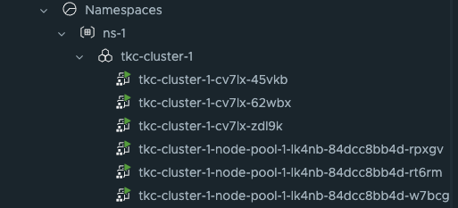
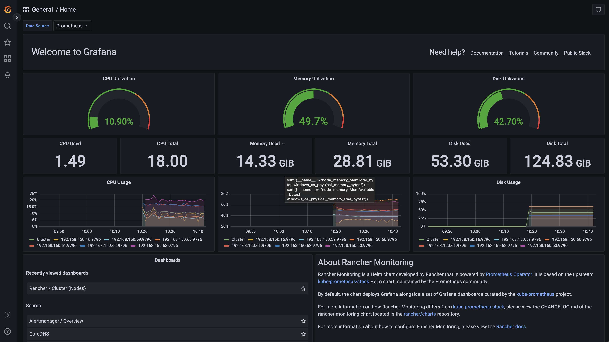

# Rancher by Suse - short introduction

From the offical Rancher [docs](https://ranchermanager.docs.rancher.com/getting-started/overview):

> Rancher is a container management platform built for organizations that deploy containers in production. Rancher makes it easy to run Kubernetes everywhere, meet IT requirements, and empower DevOps teams.

> **Run Kubernetes Everywhere**
>
> Kubernetes has become the container orchestration standard. Most cloud and virtualization vendors now offer it as standard infrastructure. Rancher users have the choice of creating Kubernetes clusters with Rancher Kubernetes Engine (RKE) or cloud Kubernetes services, such as GKE, AKS, and EKS. Rancher users can also import and manage their existing Kubernetes clusters created using any Kubernetes distribution or installer.
>
> **Meet IT Requirements**
>
> Rancher supports centralized authentication, access control, and monitoring for all Kubernetes clusters under its control. For example, you can:
>
> - Use your Active Directory credentials to access Kubernetes clusters hosted by cloud vendors, such as GKE.
> - Setup and enforce access control and security policies across all users, groups, projects, clusters, and clouds.
> - View the health and capacity of your Kubernetes clusters from a single-pane-of-glass.
>
> 


Rancher can manage already existing Kubernetes clusters by importing them into Rancher, but Rancher can also do fully automated deployments of complete Kubernetes clusters. 

The initial parts of this post will be focusing on getting Rancher itself deployed, then I will do some automated Kubernetes deployments from Rancher. The goal is to showcase how quick and easy it is to to deploy Kubernetes using Rancher. If it is not too obvious when reading these cluster creation chapters, trust me, deploying and managing Kubernetes cluster with Rancher is both fun and easy. After the initial chapters I will dive into some more technical topics. 

This post is not meant to be a comprehensive article on all features/configurations possible with Rancher, look at it more as an *unboxing* Rancher post. 

## My environments used in this post

In this post I will be using two platforms where I run and deploy my Kubernetes clusters. One platform is VMware vSphere the other is using Proxmox. Proxmox is running home in my lab, vSphere is running in another remote place and I am accessing it using IPsec VPN. In this post I will deploy Rancher in a Tanzu Kubernetes Cluster deployed in my vSphere lab. I already have Rancher running in one of my Kubernetes clusters in my Proxmox lab. The Rancher deployment in vSphere is just used to go through the installation of Rancher (I had already done the installation of Rancher before creating this post and didnt want to tear it down). The Rancher instance in my lab will be used for both importing existing Kubernetes clusters and the automated deployments of Kubernetes clusters on both the vSphere environment and Proxmox environment. 

In a very high level diagram it should look like this:


 

### Where Rancher sits 

As I will proceed through this post by adding and deploying Kubernetes clusters and using Rancher accessing these clusters, I think it will make sense to illustrate how this looks like. It may be beneficial to the overall understanding to have as much context as possible of whats going on and how things work when reading through the post. 

Running Rancher on Kubernetes makes Rancher Highly Available, it will be distributed across multiple Kubernetes worker nodes and also benefit from Kubernetes lifecycle management, self-healing etc. Rancher will become a critical endpoint so managing and ensuring availability to this endpoint is critical. Exposing the Rancher using a HA capable loadbalancer is something to consider. Loosing a singelton instance loadbalancer means loosing access to Rancher. To expose Rancher one can use VMware [Avi Loadbalancer](https://docs.vmware.com/en/VMware-NSX-Advanced-Load-Balancer/index.html) with its distributed architecture (several Service Engines in Active/Active) or one can use Traefik loadbalancer, HAProxy Nginx, just to name a few. Then of course the underlaying physical compute hosts should consist of more than one host ofcourse. 

One should thrive to make the Rancher API endpoint as robust as possible as this will be THE endpoint to use to access and manage the Rancher managed Kubernetes Clusters. 


As one can imagine, managing multiple clusters using Rancher there will be some requests to this endpoint. So performance and resilience is key. 


As soon as I have authenticated through Rancher I can access my Kubernetes clusters. Rancher will then work as a proxy and forward my requests to my respective Kubernetes clusters. 

```bash
{"kind":"Event","authorization.k8s.io/decision":"allow","authorization.k8s.io/reason":"RBAC: allowed by ClusterRoleBinding \"globaladmin-user-64t5q\" of ClusterRole \"cluster-admin\" to User \"user-64t5q\""}}
```


## Installing Rancher on an existing Kubernetes Cluster using Helm

Before I can start using Rancher I need to install it. Rancher can be deployed using Docker for poc/testing purposes and on (more or less any) Kubernetes platform for production use. *If one started out testing Rancher on Docker one can actually [migrate](https://ranchermanager.docs.rancher.com/getting-started/installation-and-upgrade/other-installation-methods) from Docker to Kubernetes at a later stage also.* In this post I will deploy Rancher on Kubernetes. I have already deployed a Kubernetes cluster I intend to deploy Rancher on. The Kubernetes cluster that will be used is provisioned by vSphere with Tanzu, running in my vSphere cluster using the method I describe in this [post](https://blog.andreasm.io/2024/02/04/argo-cd-vsphere-with-tanzu/). vSphere with Tanzu is also its own Kubernetes management platform ofcourse. I have deployed 3 control plane nodes and 3 worker nodes. All persistent storage will be handled by the the vSphere Cluster VSAN storage. Ingress will be taken care of by VMware Avi loadbalancer. 

Here is my TKC cluster I will install rancher on:



The cluster is ready with all the necessary backend services like the Avi loadbalancer providing loadbalancer services and Ingress rules. The first thing I need is to add the Helm repo for Rancher. 

```bash
# latest - recommended for testing the newest features
andreasm@linuxmgmt01:~$ helm repo add rancher-latest https://releases.rancher.com/server-charts/latest
"rancher-latest" has been added to your repositories

```

  Create a namespace for Rancher:

```bash
andreasm@linuxmgmt01:~$ kubectl create namespace cattle-system

namespace/cattle-system created
```

I will bring my own Certificate, so skipping Cert-Manager. This is my Rancher Helm value yaml:

```yaml
# Additional Trusted CAs.
# Enable this flag and add your CA certs as a secret named tls-ca-additional in the namespace.
# See README.md for details.
additionalTrustedCAs: false

antiAffinity: preferred
topologyKey: kubernetes.io/hostname

# Audit Logs https://rancher.com/docs/rancher/v2.x/en/installation/api-auditing/
# The audit log is piped to the console of the rancher-audit-log container in the rancher pod.
# https://rancher.com/docs/rancher/v2.x/en/installation/api-auditing/
# destination stream to sidecar container console or hostPath volume
# level: Verbosity of logs, 0 to 3. 0 is off 3 is a lot.
auditLog:
  destination: sidecar
  hostPath: /var/log/rancher/audit/
  level: 0
  maxAge: 1
  maxBackup: 1
  maxSize: 100

  # Image for collecting rancher audit logs.
  # Important: update pkg/image/export/resolve.go when this default image is changed, so that it's reflected accordingly in rancher-images.txt generated for air-gapped setups.
  image:
    repository: "rancher/mirrored-bci-micro"
    tag: 15.4.14.3
    # Override imagePullPolicy image
    # options: Always, Never, IfNotPresent
    pullPolicy: "IfNotPresent"

# As of Rancher v2.5.0 this flag is deprecated and must be set to 'true' in order for Rancher to start
addLocal: "true"

# Add debug flag to Rancher server
debug: false

# When starting Rancher for the first time, bootstrap the admin as restricted-admin
restrictedAdmin: false

# Extra environment variables passed to the rancher pods.
# extraEnv:
# - name: CATTLE_TLS_MIN_VERSION
#   value: "1.0"

# Fully qualified name to reach your Rancher server
hostname: rancher-01.my.domain.net

## Optional array of imagePullSecrets containing private registry credentials
## Ref: https://kubernetes.io/docs/tasks/configure-pod-container/pull-image-private-registry/
imagePullSecrets: []
# - name: secretName

### ingress ###
# Readme for details and instruction on adding tls secrets.
ingress:
  # If set to false, ingress will not be created
  # Defaults to true
  # options: true, false
  enabled: true
  includeDefaultExtraAnnotations: true
  extraAnnotations: {}
  ingressClassName: "avi-lb"
  # Certain ingress controllers will will require the pathType or path to be set to a different value.
  pathType: ImplementationSpecific
  path: "/"
  # backend port number
  servicePort: 80

  # configurationSnippet - Add additional Nginx configuration. This example statically sets a header on the ingress.
  # configurationSnippet: |
  #   more_set_input_headers "X-Forwarded-Host: {{ .Values.hostname }}";

  tls:
    # options: rancher, letsEncrypt, secret
    source: secret
    secretName: tls-rancher-ingress

### service ###
# Override to use NodePort or LoadBalancer service type - default is ClusterIP
service:
  type: ""
  annotations: {}

### LetsEncrypt config ###
# ProTip: The production environment only allows you to register a name 5 times a week.
#         Use staging until you have your config right.
letsEncrypt:
  # email: none@example.com
  environment: production
  ingress:
    # options: traefik, nginx
    class: ""
# If you are using certs signed by a private CA set to 'true' and set the 'tls-ca'
# in the 'rancher-system' namespace. See the README.md for details
privateCA: false

# http[s] proxy server passed into rancher server.
# proxy: http://<username>@<password>:<url>:<port>

# comma separated list of domains or ip addresses that will not use the proxy
noProxy: 127.0.0.0/8,10.0.0.0/8,172.16.0.0/12,192.168.0.0/16,.svc,.cluster.local

# Override rancher image location for Air Gap installs
rancherImage: rancher/rancher
# rancher/rancher image tag. https://hub.docker.com/r/rancher/rancher/tags/
# Defaults to .Chart.appVersion
# rancherImageTag: v2.0.7

# Override imagePullPolicy for rancher server images
# options: Always, Never, IfNotPresent
# Defaults to IfNotPresent
# rancherImagePullPolicy: <pullPolicy>

# Number of Rancher server replicas. Setting to negative number will dynamically between 0 and the abs(replicas) based on available nodes.
# of available nodes in the cluster
replicas: 3

# Set priorityClassName to avoid eviction
priorityClassName: rancher-critical

# Set pod resource requests/limits for Rancher.
resources: {}

#
# tls
#   Where to offload the TLS/SSL encryption
# - ingress (default)
# - external
tls: ingress

systemDefaultRegistry: ""

# Set to use the packaged system charts
useBundledSystemChart: false

# Certmanager version compatibility
certmanager:
  version: ""

# Rancher custom logos persistence
customLogos:
  enabled: false
  volumeSubpaths:
    emberUi: "ember"
    vueUi: "vue"
  ## Volume kind to use for persistence: persistentVolumeClaim, configMap
  volumeKind: persistentVolumeClaim
  ## Use an existing volume. Custom logos should be copied to the volume by the user
  # volumeName: custom-logos
  ## Just for volumeKind: persistentVolumeClaim
  ## To disables dynamic provisioning, set storageClass: "" or storageClass: "-"
  # storageClass: "-"
  accessMode: ReadWriteOnce
  size: 1Gi

# Rancher post-delete hook
postDelete:
  enabled: true
  image:
    repository: rancher/shell
    tag: v0.1.23
  namespaceList:
    - cattle-fleet-system
    - cattle-system
    - rancher-operator-system
  # Number of seconds to wait for an app to be uninstalled
  timeout: 120
  # by default, the job will fail if it fail to uninstall any of the apps
  ignoreTimeoutError: false

# Set a bootstrap password. If leave empty, a random password will be generated.
bootstrapPassword: "MyPassword"

livenessProbe:
  initialDelaySeconds: 60
  periodSeconds: 30
readinessProbe:
  initialDelaySeconds: 5
  periodSeconds: 30

global:
  cattle:
    psp:
      # will default to true on 1.24 and below, and false for 1.25 and above
      # can be changed manually to true or false to bypass version checks and force that option
      enabled: ""

# helm values to use when installing the rancher-webhook chart.
# helm values set here will override all other global values used when installing the webhook such as priorityClassName and systemRegistry settings.
webhook: ""

# helm values to use when installing the fleet chart.
# helm values set here will override all other global values used when installing the fleet chart.
fleet: ""
```


I choose secret under TLS, so before I install Rancher I can create the secret with my own certificate.

```bash
andreasm@linuxmgmt01:~$ k create secret -n cattle-system tls tls-rancher-ingress --cert=tls.crt --key=tls.key
secret/tls-rancher-ingress created
```

Now I can deploy Rancher with my value.yaml above.

~~~bash
helm install -n cattle-system rancher rancher-latest/rancher -f rancher.values.yaml
NAME: rancher
LAST DEPLOYED: Mon May  6 08:24:36 2024
NAMESPACE: cattle-system
STATUS: deployed
REVISION: 1
TEST SUITE: None
NOTES:
Rancher Server has been installed.

NOTE: Rancher may take several minutes to fully initialize. Please standby while Certificates are being issued, Containers are started and the Ingress rule comes up.

Check out our docs at https://rancher.com/docs/

If you provided your own bootstrap password during installation, browse to https://rancher-01.my-domain.net to get started.

If this is the first time you installed Rancher, get started by running this command and clicking the URL it generates:

```
echo https://rancher-01.my-domain.net/dashboard/?setup=$(kubectl get secret --namespace cattle-system bootstrap-secret -o go-template='{{.data.bootstrapPassword|base64decode}}')
```

To get just the bootstrap password on its own, run:

```
kubectl get secret --namespace cattle-system bootstrap-secret -o go-template='{{.data.bootstrapPassword|base64decode}}{{ "\n" }}'
```


Happy Containering!
~~~


Now its time to log into the the url mentioned above using the provided bootstrap password (if entered):


By entering the bootstrap password above will log you in. If logging out, next time it will look like this:


Before going to the next chapter, in my Kubernetes cluster now I will have some additional namespaces created, services and deployments. Below is some of them:

```bash
# Namespaces
NAME                                     STATUS   AGE
cattle-fleet-clusters-system             Active   3h9m
cattle-fleet-local-system                Active   3h8m
cattle-fleet-system                      Active   3h10m
cattle-global-data                       Active   3h10m
cattle-global-nt                         Active   3h10m
cattle-impersonation-system              Active   3h9m
cattle-provisioning-capi-system          Active   3h8m
cattle-system                            Active   3h24m
cluster-fleet-local-local-1a3d67d0a899   Active   3h8m
fleet-default                            Active   3h10m
fleet-local                              Active   3h10m
local                                    Active   3h10m
p-4s8sk                                  Active   3h10m
p-n8cmn                                  Active   3h10m
# Deployments and services
NAME                                   READY   STATUS      RESTARTS   AGE
pod/helm-operation-9bzv8               0/2     Completed   0          3m22s
pod/helm-operation-bvjrq               0/2     Completed   0          8m10s
pod/helm-operation-njvlg               0/2     Completed   0          8m22s
pod/rancher-5498b85476-bpfcn           1/1     Running     0          9m25s
pod/rancher-5498b85476-j6ggn           1/1     Running     0          9m25s
pod/rancher-5498b85476-xg247           1/1     Running     0          9m25s
pod/rancher-webhook-7d876fccc8-6m8tk   1/1     Running     0          8m7s

NAME                      TYPE        CLUSTER-IP     EXTERNAL-IP   PORT(S)          AGE
service/rancher           ClusterIP   10.10.227.75   <none>        80/TCP,443/TCP   9m26s
service/rancher-webhook   ClusterIP   10.10.81.6     <none>        443/TCP          8m8s

NAME                              READY   UP-TO-DATE   AVAILABLE   AGE
deployment.apps/rancher           3/3     3            3           9m27s
deployment.apps/rancher-webhook   1/1     1            1           8m9s

NAME                                         DESIRED   CURRENT   READY   AGE
replicaset.apps/rancher-5498b85476           3         3         3       9m26s
replicaset.apps/rancher-webhook-7d876fccc8   1         1         1       8m8s

NAME      CLASS    HOSTS                        ADDRESS          PORTS     AGE
rancher   avi-lb   rancher-01.my-domain.net   192.168.121.10   80, 443   9m47s
```


Rancher is ready to be used.

## Create and manage Kubernetes clusters

As soon as I have logged in the first thing I would like to do is to create a Kubernetes cluster. Rancher supports many methods of creating a Kubernetes cluster. Rancher can create clusters in a hosted Kubernetes provider such as Amazon EKS, Azure AKS, Google GKE and more. Rancher can create clusters and provision the nodes on Amazon EC2, Azure, DigitalOcean, Harvester, Linode, VMware vSphere and more. If you dont use any of them, it can create clusters on exisiting nodes like VMs deployed with a Linux (or even Windows..) OS waiting to be confgured to do something (I will go through that later) or using [Elemental](https://elemental.docs.rancher.com/) (more on that later also). 


Under drivers, see the list of possible Cluster Drivers and Node Drivers:


I happen to have vSphere as my virtualization platform which is natively supported by Rancher and will start by provisioning a Kubernetes cluster using the vSphere cloud. I also have another hypervisor platform running in my lab (Proxmox) which does not have a native driver for Rancher, instead I will make Rancher deploy Kubernetes on existing VM nodes. I will go through how I deploy Kubernetes clusters on vSphere and on Proxmox using the *Custom* "cloud" on existing nodes. 

### Rancher Kubernetes distributions

Rancher is fully capable of doing automated provisining of Kubernetes clusters, as I will go through in this post, as much as it can manage already exisiting Kubernetes clusters by importing them. 

When Rancher is doing automated provisions of Kubernetes on supported clouds or onto existing nodes it uses its own Kubernetes distribution. In Rancher one can choose between three distributions called RKE, RKE2 and K3s. In this post I will only use RKE2 which stands for Rancher Kubernetes Engine. RKE2 is Rancher's *next-generation* Kubernetes distribution. I may touch upon the K3s distribution also, as this is very much focued on edge use cases due to its lightweight. 

For more information on RKE2 head over [here](https://docs.rke2.io/)

For more information on K3s head over [here](https://www.rancher.com/products/k3s)

 At the current time of writing this post I am using Rancher 2.8.3 and the latest RKE2/Kubernetes release is 1.28.8 which is not so far away from Kubernetes upstream which is currently at v1.30.

## Create RKE2 clusters using vSphere

Using vSphere as the "cloud" in Rancher do have some benefits. From the docs

For Rancher to spin up and create RKE2 clusters on vSphere I need to create a VM template using the OS of choice in my vSphere cluster. According to the official RKE2 [documentation](https://docs.rke2.io/install/requirements#operating-systems) *RKE2 should work on any Linux distribution that uses systemd and iptables*. There is also a RKE2 Support Matrix for all OS versions that have been validated with RKE2 [here](https://www.suse.com/suse-rke2/support-matrix/all-supported-versions/rke2-v1-28/) (linked to v1.28 as this post uses 1.28 but v1.29 is already out at the time of writing this post).

I went with Ubuntu 22.04 as my Linux distribution

There is a couple of ways Rancher can utilize vSphere to manage the template. Below is a screenshot of the possible options of the time of writing this post:


In this section I will go through the two methods **Deploy from template: Content Library** and **deploy from template: Data Center**  

### Create Cloud Credentials

The first thing I will do before getting to the actual cluster creation is to create credentials for the user and connection information to my vCenter server. I will go to the Cluster Management and Cloud Credentials section in Rancher:


Click create in the top right corner and select VMware vSphere:


Fill in the relevant information about your vCenter server including the credentials with the right permissions (see permissions [here](https://ranchermanager.docs.rancher.com/how-to-guides/new-user-guides/launch-kubernetes-with-rancher/use-new-nodes-in-an-infra-provider/vsphere/create-credentials) using some very old screenshots from vCenter..):


### RKE2 clusters using vSphere Content Library template

I decided to start with the method of deploying RKE2 clusters using the Content Library method as I found that one to be the easiest and fastest method (its just about uploading the image to the content library and thats it). The concept behind this is to create a Content Library in your vCenter hosting a Cloud Image template for the OS of choice. This should be as minimal as possible, with zero to none configs. All the needed configs are done by Rancher when adding the nodes to your cluster later.   

As mentioned above, I went with Ubuntu Cloud image. Ubuntu Cloud images can be found [here](https://cloud-images.ubuntu.com/).


I will go with this OVA image (22.04 LTS Jammy Jellyfish):


In my vCenter I create a Content Library:


Local content library:


Select my datastore to host the content:


Finish:


Now I need to enter the content library by clicking on the name to add my desired Ubuntu Cloud Image version:


I will select Source File URL and paste the below URL:

https://cloud-images.ubuntu.com/jammy/current/jammy-server-cloudimg-amd64.ova


Click on Import and it will download the OVA from the URL

It may complain about SSL certificate being untruste.. Click Actions and Continue:


The template should be download now:


Thats it from the vCenter side. The cloud image is ready as a template for Rancher to use. Now I will head over to Rancher and create my RKE2 cluster on vSphere based on this template. 

I will go to Cluster Management using the top left menu or directy from the homepage clicking on manage

As I have done the preparations in vSphere I am now ready to create my RKE2 cluster on vSphere. Head to Clusters in the top left corner and click create in the top right corner then select VMware vSphere:


The cluster I want to create is one control-plane node and one worker node. 

Give the cluster a name and description if you want. Then select the roles, at a minium one have to deploy one node with all roles *etcd*, *Control Plane* and *Worker*. Give the pool a name, I will go with default values here. Machine count I will go with default 1 here also. I can scale it later :smile:. Then make sure to select the correct datacenter in your vCenter, select the Resource Pool. If you have resource pools, if not just select the correct cluster (sfo-m01-cl01)/Resources which will be the cluster resource pool (root). Then select the correct Datastore. Then I will left the other fields default except the Creation method and Network. Under creation method I have selected **Deploy from template: Content Library** the correct Content Library and the **jammy-server-cloudimg** template I have uploaded/downloaded to the Content Library. Click Add Network and select the correct vCenter Network Portgroup you want the node to be placed in. 


Thats it for pool-1. I will scroll a bit down, click on the + sign and add a second pool for the nodes to have only the role worker. 

I will repeat the steps above for pool-2. They will be identical execpt for the pool name and only role **Worker** selected.


For the sake of keeping it simple, I will leave all the other fields default and just click create. I will now sit back and enjoy Rancher creating my RKE2 cluster on vSphere. 


In vCenter:


And cluster is ready:


There was of course a bunch of option I elegantly skipped during the creation of this cluster. But the point, again, was to show how quickly and easily I could bring up a RKE2 cluster on vSphere. And so it was. 

**Supplemental information**


To make further customization of the Ubuntu Cloud Image one can use the #cloud-config ([cloud-init](https://cloud-init.io/)), and the vSphere vApp function. 


vApp:


 

When it comes to the Ubuntu Cloud Image it does not contain any default username and password. So how can I access SSH on them? Well, from the Rancher UI one can access SSH directly or download the SSH keys. One can even copy paste into the SSH shell from there. SSH through the UI is very neat feature. 

 

SSH Shell:


For IP allocation I have configured DHCP in my NSX-T environment for the segment my RKE2 nodes will be placed in and all nodes will use dynamically allocated IP addresses in that subnet. 

### RKE2 clusters using vSphere VM template

The other method of preparing a template for Rancher to use is to install the Ubuntu Server as a regular VM. That involves doing the necessary configs, power it down and convert it to template. I thought this would mean a very minimal config to be done. But not quite.

My first attempt did not go so well. I installed Ubuntu, then powered it down and converted it to a template. Tried to create a RKE2 cluster with it from Rancher, it cloned the amount of control plane nodes and worker nodes I had defined, but there it stopped. So I figured I must have missed something along the way. 

Then I found this post [here](https://dev.to/balajivedagiri/provisioning-an-rke2-cluster-on-vsphere-13mh) which elegantly described the things I need in my template before "handing" it over to Rancher. So below is what I did in my Ubuntu Template by following the blog [post](https://dev.to/balajivedagiri/provisioning-an-rke2-cluster-on-vsphere-13mh) above.  

In short, this is what I did following the post above.

On my template:

```bash
sudo apt-get install -y curl wget git net-tools unzip ca-certificates cloud-init cloud-guest-utils cloud-image-utils cloud-initramfs-growroot open-iscsi openssh-server open-vm-tools net-tools apparmor
```

and:

```bash
sudo dpkg-reconfigure cloud-init
```

Deselected everything except "NoCloud"


Then I ran the script:

```bash
#!/bin/bash
# Cleaning logs.
if [ -f /var/log/audit/audit.log ]; then
  cat /dev/null > /var/log/audit/audit.log
fi
if [ -f /var/log/wtmp ]; then
  cat /dev/null > /var/log/wtmp
fi
if [ -f /var/log/lastlog ]; then
  cat /dev/null > /var/log/lastlog
fi

# Cleaning udev rules.
if [ -f /etc/udev/rules.d/70-persistent-net.rules ]; then
  rm /etc/udev/rules.d/70-persistent-net.rules
fi

# Cleaning the /tmp directories
rm -rf /tmp/*
rm -rf /var/tmp/*

# Cleaning the SSH host keys
rm -f /etc/ssh/ssh_host_*

# Cleaning the machine-id
truncate -s 0 /etc/machine-id
rm /var/lib/dbus/machine-id
ln -s /etc/machine-id /var/lib/dbus/machine-id

# Cleaning the shell history
unset HISTFILE
history -cw
echo > ~/.bash_history
rm -fr /root/.bash_history

# Truncating hostname, hosts, resolv.conf and setting hostname to localhost
truncate -s 0 /etc/{hostname,hosts,resolv.conf}
hostnamectl set-hostname localhost

# Clean cloud-init
cloud-init clean -s -l
```

Powered off the VM, converted it to a template in vSphere. 


{}

Still after doing the steps described in the post linked to above my deployment failed. It turned out to be insufficient disk capacity. So I had to update my template in vSphere to use bigger disk. I was too conservative (or cheap) when I created it, I extended it to 60gb to be on the safe side. Could that have been a "no-issue" if I had read the official [documentation/requirements](https://docs.rke2.io/install/requirements), yes.  


{}

I saw that when I connected to the control plane and checked the cattle-cluster-agent (it never started):

```yaml
andreasm@linuxmgmt01:~/$ k --kubeconfig test-cluster.yaml describe pod -n cattle-system cattle-cluster-agent-5cc77b7988-dwrtj
Name:             cattle-cluster-agent-5cc77b7988-dwrtj
Namespace:        cattle-system
Events:
  Type     Reason                  Age                    From               Message
  ----     ------                  ----                   ----               -------
  Warning  Failed                  6m24s                  kubelet            Failed to pull image "rancher/rancher-agent:v2.8.3": failed to pull and unpack image "docker.io/rancher/rancher-agent:v2.8.3": failed to extract layer sha256:3a9df665b61dd3e00c0753ca43ca9a0828cb5592ec051048b4bbc1a3f4488e05: write /var/lib/rancher/rke2/agent/containerd/io.containerd.snapshotter.v1.overlayfs/snapshots/108/fs/var/lib/rancher-data/local-catalogs/v2/rancher-partner-charts/8f17acdce9bffd6e05a58a3798840e408c4ea71783381ecd2e9af30baad65974/.git/objects/pack/pack-3b07a8b347f63714781c345b34c0793ec81f2b86.pack: no space left on device: unknown
  Warning  Failed                  6m24s                  kubelet            Error: ErrImagePull
  Warning  FailedMount             4m15s (x5 over 4m22s)  kubelet            MountVolume.SetUp failed for volume "kube-api-access-cvwz2" : failed to fetch token: Post "https://127.0.0.1:6443/api/v1/namespaces/cattle-system/serviceaccounts/cattle/token": dial tcp 127.0.0.1:6443: connect: connection refused
  Normal   Pulling                 4m7s                   kubelet            Pulling image "rancher/rancher-agent:v2.8.3"
  Warning  Evicted                 3m59s                  kubelet            The node was low on resource: ephemeral-storage. Threshold quantity: 574385774, available: 108048Ki.

```


After doing the additional changes in my template I gave the RKE2 cluster creation another attempt.

From the Cluster Management, click Create


Select VMware vSphere:


I will start by defining "pool-1" as my 3 control plane nodes. Select vCenter Datacenter, Datastore and resource pool (if no resource pool is defined in vCenter, select just Resources which is "root"/cluster-level)

 

Then define the "pool-1" instance options like cpu, memory, disk, network and the created vm template:


Add a second pool by clicking on the + sign here:

 

Then confgure the amount of Machine count, roles (worker only) and vSphere placement as above (unless one have several clusters and want to spread the workers.. That is another discussion).


Configure the pool-2 instance cpu, memory, network, vm template etc.. Here one can define the workers to be a bit more beefier (resource wise) than the control plane nodes. 


Then it is the cluster config itself. There is a lot of details I will not cover now, will cover these a bit later. Now the sole purpose is to get a cluster up and running as easy and fast as possible. I will leave everything default, except pod CIDR and service CIDR. Will get into some more details later in the post. 


Pod CIDR and Service CIDR


When done, click create bottom right corner. 


From vCenter:


Here is my cluster starting to be built. 


Rancher cluster creation status


Thats it. Cluster is up and running. There was a couple of additional tasks that needed to be done, but it worked. If one does not have the option to use a Cloud Image, then this will also work. The experience using a Cloud Image was by far the easiest and most flexible approach. 

## Creating a RKE2 cluster on existing nodes - non native cloud provider

If I dont have a vSphere environment or other supported Cloud provider, but another platform for my virtalization needs, one alternative is then to prepare some VMs with my preferred operating system I can tell Rancher to deploy RKE2 on. The provisioning and managing of these VMs will be handled by OpenTofu. Lets see how that works. 

I have already a [post](https://blog.andreasm.io/2024/01/15/proxmox-with-opentofu-kubespray-and-kubernetes/) covering how I am deploying VMs and Kubernetes using OpenTofu and Kubespray on my Proxmox cluster. For this section I will use the OpenTofu part just to quickly deploy the VMs on Proxmox I need to build or bring up my Kubernetes (RKE2) cluster.

My OpenTofu project is already configured, it should deploy 6 VMs, 3 control plane nodes and 3 workers. I will kick that task off like this:

```bash
andreasm@linuxmgmt01:~/terraform/proxmox/rancher-cluster-1$ tofu apply plan
proxmox_virtual_environment_file.ubuntu_cloud_init: Creating...
proxmox_virtual_environment_file.ubuntu_cloud_init: Creation complete after 1s [id=local:snippets/ubuntu.cloud-config.yaml]
proxmox_virtual_environment_vm.rke2-worker-vms-cl01[0]: Creating...
proxmox_virtual_environment_vm.rke2-cp-vms-cl01[2]: Creating...
proxmox_virtual_environment_vm.rke2-cp-vms-cl01[1]: Creating...
proxmox_virtual_environment_vm.rke2-worker-vms-cl01[2]: Creating...
proxmox_virtual_environment_vm.rke2-worker-vms-cl01[1]: Creating...
proxmox_virtual_environment_vm.rke2-cp-vms-cl01[0]: Creating...
...
proxmox_virtual_environment_vm.rke2-cp-vms-cl01[2]: Creation complete after 1m37s [id=1023]

Apply complete! Resources: 7 added, 0 changed, 0 destroyed.
```

And my vms should start popping up in my Proxmox ui:


Now I have some freshly installed VMs running, it is time to hand them over to Rancher to do some magic on them. Lets head over to Rancher and create a Custom cluster. 

### Creating RKE2 cluster on existing nodes - "custom cloud"

In Rancher, go to Cluster Management or from the homepage, **create** and select **Custom**


Give the cluster a name, and change what you want according to your needs. I will only change the Container Network and the pod/services CIDR. 


Click create:


Now it will tell you to paste a registration command on the node you want to be the controlplane, etc and worker node.


Click on the cli command to get it into the clipboard. I will start by preparing the first node with all three roles *control-plane*, *etcd* and *worker*. Then I will continue with the next two. After my controlplane is ready and consist of three nodes I will change the parameter to only include worker node and do the last three nodes. 

Then go ahead and ssh into my intented control plane node and paste the command:

```bash
ubuntu@ubuntu:~$ curl -fL https://rancher-dev.my-domain.net/system-agent-install.sh | sudo  sh -s - --server https://rancher-dev.my-domain.net --label 'cattle.io/os=linux' --token p5fp6sv4qbskmhl7mmpksbxcgs9gk9dtsqkqg9q8q8ln5f56l5jlpb --etcd --controlplane --worker
  % Total    % Received % Xferd  Average Speed   Time    Time     Time  Current
                                 Dload  Upload   Total   Spent    Left  Speed
100 32228    0 32228    0     0   368k      0 --:--:-- --:--:-- --:--:--  370k
[INFO]  Label: cattle.io/os=linux
[INFO]  Role requested: etcd
[INFO]  Role requested: controlplane
[INFO]  Role requested: worker
[INFO]  Using default agent configuration directory /etc/rancher/agent
[INFO]  Using default agent var directory /var/lib/rancher/agent
[INFO]  Successfully tested Rancher connection
[INFO]  Downloading rancher-system-agent binary from https://rancher-dev.my-domain.net/assets/rancher-system-agent-amd64
[INFO]  Successfully downloaded the rancher-system-agent binary.
[INFO]  Downloading rancher-system-agent-uninstall.sh script from https://rancher-dev.my-doamin.net/assets/system-agent-uninstall.sh
[INFO]  Successfully downloaded the rancher-system-agent-uninstall.sh script.
[INFO]  Generating Cattle ID
[INFO]  Successfully downloaded Rancher connection information
[INFO]  systemd: Creating service file
[INFO]  Creating environment file /etc/systemd/system/rancher-system-agent.env
[INFO]  Enabling rancher-system-agent.service
Created symlink /etc/systemd/system/multi-user.target.wants/rancher-system-agent.service → /etc/systemd/system/rancher-system-agent.service.
[INFO]  Starting/restarting rancher-system-agent.service
ubuntu@ubuntu:~$
```


Now, lets just wait in the Rancher UI and monitor the progress. 


Repeat same operation for the two last control plane nodes.

For the worker nodes I will adjust the command to only deploy worker node role:


```bash
ubuntu@ubuntu:~$ curl -fL https://rancher-dev.my-domain.net/system-agent-install.sh | sudo  sh -s - --server https://rancher-dev.my-domain.net --label 'cattle.io/os=linux' --token jfjd5vwfdqxkszgg25m6w49hhm4l99kjk2xhrm2hp75dvwhrjnrt2d --worker
  % Total    % Received % Xferd  Average Speed   Time    Time     Time  Current
                                 Dload  Upload   Total   Spent    Left  Speed
100 32228    0 32228    0     0   370k      0 --:--:-- --:--:-- --:--:--  374k
[INFO]  Label: cattle.io/os=linux
[INFO]  Role requested: worker
[INFO]  Using default agent configuration directory /etc/rancher/agent
[INFO]  Using default agent var directory /var/lib/rancher/agent
[INFO]  Successfully tested Rancher connection
[INFO]  Downloading rancher-system-agent binary from https://rancher-dev.my-domain.net/assets/rancher-system-agent-amd64
[INFO]  Successfully downloaded the rancher-system-agent binary.
[INFO]  Downloading rancher-system-agent-uninstall.sh script from https://rancher-dev.my-doamin.net/assets/system-agent-uninstall.sh
[INFO]  Successfully downloaded the rancher-system-agent-uninstall.sh script.
[INFO]  Generating Cattle ID
[INFO]  Successfully downloaded Rancher connection information
[INFO]  systemd: Creating service file
[INFO]  Creating environment file /etc/systemd/system/rancher-system-agent.env
[INFO]  Enabling rancher-system-agent.service
Created symlink /etc/systemd/system/multi-user.target.wants/rancher-system-agent.service → /etc/systemd/system/rancher-system-agent.service.
[INFO]  Starting/restarting rancher-system-agent.service
```

Repeat for all the worker nodes needed. 

After some minutes, the cluster should be complete with all control plane nodes and worker nodes:


The whole process, two tasks really, from deploying my six VMs to a fully working Kubernetes cluster running was just shy of 10 minutes. All I had to do was to provison the VMs, go into Rancher create a RKE2 cluster, execute the registration command on each node. 

Deploying Kubernetes clusters couldn't be more fun actually.

## Import existing Kubernetes Clusters

As mentioned earlier, Rancher can also import existing Kubernetes clusters for central management. If one happen to have a bunch of Kubernetes clusters deployed, no central management of them, add them to Rancher. 

Here is how to import existing Kubernetes clusters. 

Head over to Cluster Management in the Rancher UI, go to Clusters and find the *Import Existing* button:


I will select Generic as I dont have any clusters running in Amazon, Azure nor Google.

Give the cluster a name (name as it will show in Rancher *and ignore my typo tanzuz*) and description. I am using the default admin account in Rancher.


Click create in the bottom right corner.

It will now show me how I can register my already existing cluster into Rancher:


Now I need to get into the context of the Kubernetes cluster I want to import and execute the following command:

```bash
kubectl apply -f https://rancher-dev.my-domain.net/v3/import/knkh9n4rvhgpkxxxk7c4rhblhkqxfjxcq82nm7zcgfdcgqsl7bqdg5_c-m-qxpbc6tp.yaml
```

In the correct context:

```bash
andreasm@linuxmgmt01:~$ kubectl apply -f https://rancher-dev.my-domain.net/v3/import/knkh9n4rvhgpkxxxk7c4rhblhkqxfjxcq82nm7zcgfdcgqsl7bqdg5_c-m-qxpbc6tp.yaml
clusterrole.rbac.authorization.k8s.io/proxy-clusterrole-kubeapiserver created
clusterrolebinding.rbac.authorization.k8s.io/proxy-role-binding-kubernetes-master created
Warning: resource namespaces/cattle-system is missing the kubectl.kubernetes.io/last-applied-configuration annotation which is required by kubectl apply. kubectl apply should only be used on resources created declaratively by either kubectl create --save-config or kubectl apply. The missing annotation will be patched automatically.
namespace/cattle-system configured
serviceaccount/cattle created
clusterrolebinding.rbac.authorization.k8s.io/cattle-admin-binding created
secret/cattle-credentials-603e85e created
clusterrole.rbac.authorization.k8s.io/cattle-admin created
Warning: spec.template.spec.affinity.nodeAffinity.requiredDuringSchedulingIgnoredDuringExecution.nodeSelectorTerms[0].matchExpressions[0].key: beta.kubernetes.io/os is deprecated since v1.14; use "kubernetes.io/os" instead
deployment.apps/cattle-cluster-agent created
service/cattle-cluster-agent created
```

In the Rancher UI:


It took a couple of seconds, and the cluster was imported. 

Now just having a look around. 


Nodes:


Doing kubectl from the UI:


## Navigating the Rancher UI

So far I have only created and imported clusters into Rancher. The current inventory in Rancher is a couple of clusters both imported and created by Rancher:


Its time to explore Rancher.

What is the information Rancher can give me on my new RKE2 cluster. Lets click around.

Click on *Explore*


### Rancher Cluster Dashboard

The first thing I get to when clicking on *Explore* is the Cluster Dashboard. It contains a brief status of the cluster like CPU and Memory usage, total resources, pods running (55 of 660?) and latest events. Very nice set of information.


But in the top right corner, what have we there? Install Monitoring and Add Cluster Badge. Lets try the Cluster Badge


I can customize the cluster badge.. Lets see how this looks like

It adds a color and initials on the cluster list on the left side menu, making it easy to distinguish and sort the different Kubernetes clusters.


Now, what about the Install Monitoring. 


A set of available monitoring tools, ready to be installed. This is really great, and qualifies for dedicated sections later in this post. 

On left side menu, there is additional information:


Pods:


What about executing directly into shell of a pod?


Nodes:


ConfigMaps:


I have an action menu on every object available in the left side menus, I can edit configMaps, secrets, drain node etc right there from the Rancher UI. 

If I know the object name, I can just search for it also:


So much information readily available directly after deploying the cluster. This was just a quick overview, there are several more fields to explore. 


### Accessing my new RKE2 cluster deployed on vSphere

Now that my clusters is up and running, how can I access it? SSH into one of the control plane nodes and grab the kubeconfig? Well that is possible, but is it a better way?

Yes it is...

Click on the three dots at the end of the cluster: 


Lets try the **Kubectl Shell**

 

Or just copy the KubeConfig to Clipboard, paste it in a file on your workstation and access your cluster like this:

```bash
andreasm@linuxmgmt01:~/$ k get nodes -owide
NAME                                  STATUS   ROLES                              AGE    VERSION          INTERNAL-IP       EXTERNAL-IP   OS-IMAGE             KERNEL-VERSION       CONTAINER-RUNTIME
rke2-cluster-1-pool1-47454a8f-6npvs   Ready    control-plane,etcd,master,worker   127m   v1.28.8+rke2r1   192.168.150.98    <none>        Ubuntu 22.04.4 LTS   5.15.0-105-generic   containerd://1.7.11-k3s2
rke2-cluster-1-pool1-47454a8f-9tv65   Ready    control-plane,etcd,master,worker   123m   v1.28.8+rke2r1   192.168.150.54    <none>        Ubuntu 22.04.4 LTS   5.15.0-105-generic   containerd://1.7.11-k3s2
rke2-cluster-1-pool1-47454a8f-xpjqf   Ready    control-plane,etcd,master,worker   121m   v1.28.8+rke2r1   192.168.150.32    <none>        Ubuntu 22.04.4 LTS   5.15.0-105-generic   containerd://1.7.11-k3s2
rke2-cluster-1-pool2-b5e2f49f-2mr5r   Ready    worker                             119m   v1.28.8+rke2r1   192.168.150.97    <none>        Ubuntu 22.04.4 LTS   5.15.0-105-generic   containerd://1.7.11-k3s2
rke2-cluster-1-pool2-b5e2f49f-9qnl2   Ready    worker                             119m   v1.28.8+rke2r1   192.168.150.99    <none>        Ubuntu 22.04.4 LTS   5.15.0-105-generic   containerd://1.7.11-k3s2
rke2-cluster-1-pool2-b5e2f49f-tfw2x   Ready    worker                             119m   v1.28.8+rke2r1   192.168.150.100   <none>        Ubuntu 22.04.4 LTS   5.15.0-105-generic   containerd://1.7.11-k3s2

andreasm@linuxmgmt01:~/$ k get pods -A
NAMESPACE             NAME                                                           READY   STATUS      RESTARTS   AGE
cattle-fleet-system   fleet-agent-595ff97fd6-vl9t4                                   1/1     Running     0          124m
cattle-system         cattle-cluster-agent-6bb5b4f9c6-br6lk                          1/1     Running     0          123m
cattle-system         cattle-cluster-agent-6bb5b4f9c6-t5822                          1/1     Running     0          123m
cattle-system         rancher-webhook-bcc8984b6-9ztqj                                1/1     Running     0          122m
kube-system           cloud-controller-manager-rke2-cluster-1-pool1-47454a8f-6npvs   1/1     Running     0          127m
kube-system           cloud-controller-manager-rke2-cluster-1-pool1-47454a8f-9tv65   1/1     Running     0          123m
kube-system           cloud-controller-manager-rke2-cluster-1-pool1-47454a8f-xpjqf   1/1     Running     0          120m
kube-system           etcd-rke2-cluster-1-pool1-47454a8f-6npvs                       1/1     Running     0          127m
kube-system           etcd-rke2-cluster-1-pool1-47454a8f-9tv65                       1/1     Running     0          123m
kube-system           etcd-rke2-cluster-1-pool1-47454a8f-xpjqf                       1/1     Running     0          120m
kube-system           helm-install-rke2-canal-4cxc6                                  0/1     Completed   0          127m
kube-system           helm-install-rke2-coredns-vxvpj                                0/1     Completed   0          127m
kube-system           helm-install-rke2-ingress-nginx-f5g88                          0/1     Completed   0          127m
kube-system           helm-install-rke2-metrics-server-66rff                         0/1     Completed   0          127m
kube-system           helm-install-rke2-snapshot-controller-crd-9ncn6                0/1     Completed   0          127m
kube-system           helm-install-rke2-snapshot-controller-rrhbw                    0/1     Completed   1          127m
kube-system           helm-install-rke2-snapshot-validation-webhook-jxgr5            0/1     Completed   0          127m
kube-system           kube-apiserver-rke2-cluster-1-pool1-47454a8f-6npvs             1/1     Running     0          127m
kube-system           kube-apiserver-rke2-cluster-1-pool1-47454a8f-9tv65             1/1     Running     0          123m
kube-system           kube-apiserver-rke2-cluster-1-pool1-47454a8f-xpjqf             1/1     Running     0          120m
kube-system           kube-controller-manager-rke2-cluster-1-pool1-47454a8f-6npvs    1/1     Running     0          127m
kube-system           kube-controller-manager-rke2-cluster-1-pool1-47454a8f-9tv65    1/1     Running     0          123m
kube-system           kube-controller-manager-rke2-cluster-1-pool1-47454a8f-xpjqf    1/1     Running     0          120m
kube-system           kube-proxy-rke2-cluster-1-pool1-47454a8f-6npvs                 1/1     Running     0          127m
kube-system           kube-proxy-rke2-cluster-1-pool1-47454a8f-9tv65                 1/1     Running     0          123m
kube-system           kube-proxy-rke2-cluster-1-pool1-47454a8f-xpjqf                 1/1     Running     0          120m
kube-system           kube-proxy-rke2-cluster-1-pool2-b5e2f49f-2mr5r                 1/1     Running     0          119m
kube-system           kube-proxy-rke2-cluster-1-pool2-b5e2f49f-9qnl2                 1/1     Running     0          119m
kube-system           kube-proxy-rke2-cluster-1-pool2-b5e2f49f-tfw2x                 1/1     Running     0          119m
kube-system           kube-scheduler-rke2-cluster-1-pool1-47454a8f-6npvs             1/1     Running     0          127m
kube-system           kube-scheduler-rke2-cluster-1-pool1-47454a8f-9tv65             1/1     Running     0          123m
kube-system           kube-scheduler-rke2-cluster-1-pool1-47454a8f-xpjqf             1/1     Running     0          120m
kube-system           rke2-canal-7lmxr                                               2/2     Running     0          119m
kube-system           rke2-canal-cmrm2                                               2/2     Running     0          123m
kube-system           rke2-canal-f9ztm                                               2/2     Running     0          119m
kube-system           rke2-canal-gptjt                                               2/2     Running     0          119m
kube-system           rke2-canal-p9dj4                                               2/2     Running     0          121m
kube-system           rke2-canal-qn998                                               2/2     Running     0          126m
kube-system           rke2-coredns-rke2-coredns-84b9cb946c-q7cjn                     1/1     Running     0          123m
kube-system           rke2-coredns-rke2-coredns-84b9cb946c-v2lq7                     1/1     Running     0          126m
kube-system           rke2-coredns-rke2-coredns-autoscaler-b49765765-lj6mp           1/1     Running     0          126m
kube-system           rke2-ingress-nginx-controller-24g4k                            1/1     Running     0          113m
kube-system           rke2-ingress-nginx-controller-9gncw                            1/1     Running     0          123m
kube-system           rke2-ingress-nginx-controller-h9slv                            1/1     Running     0          119m
kube-system           rke2-ingress-nginx-controller-p98mx                            1/1     Running     0          120m
kube-system           rke2-ingress-nginx-controller-rfvnm                            1/1     Running     0          125m
kube-system           rke2-ingress-nginx-controller-xlhd8                            1/1     Running     0          113m
kube-system           rke2-metrics-server-544c8c66fc-n8r9b                           1/1     Running     0          126m
kube-system           rke2-snapshot-controller-59cc9cd8f4-5twmc                      1/1     Running     0          126m
kube-system           rke2-snapshot-validation-webhook-54c5989b65-8fzx7              1/1     Running     0          126m

```

This goes for both Rancher automated deployed Kubernetes clusters and imported clusters. Same API endpoint to access them all. 

If I would access my Tanzu Kubernetes clusters I would have to use the *kubectl vsphere login* command and from there enter the correnct vSphere Namespace context to get to my TKC cluster. By just adding the Tanzu cluster to Rancher I can use the same endpoint to access this cluster two. Have a quick look at how the kubectl config:

```yaml
apiVersion: v1
kind: Config
clusters:
- name: "tanzuz-cluster-1"
  cluster:
    server: "https://rancher-dev.my-domain.net/k8s/clusters/c-m-qxpbc6tp"

users:
- name: "tanzuz-cluster-1"
  user:
    token: "kubeconfig-user-64t5qq4d67:l8mdcs55ggf8kz4zlrcpth8tk48j85kp9qjslk5zrcmjczw6nqr7fw"


contexts:
- name: "tanzuz-cluster-1"
  context:
    user: "tanzuz-cluster-1"
    cluster: "tanzuz-cluster-1"

current-context: "tanzuz-cluster-1"

```

I accessing my TKC cluster through Rancher API endpoint. 

## Managing Kubernetes clusters from Rancher

Though making Kubernetes cluster deployments an easy task is important, handling day two operations is even more important. Lets explore some typical administrative tasks that needs to be done on a Kubernetes cluster during its lifetime using Rancher.

### Scaling nodes horizontally - up and down

There will come a time when there is a need to scale the amount of worker nodes in a cluster. Lets see how we can do that in Rancher. 

If I manually want to scale the amount of worker nodes up, I will go to Cluster Management and Clusters, then click on the name of my cluster to be scaled:


By clicking on the cluster name it will take me directly to the Machine pools, on the right there is some obvious -/+ buttons. By clicking on the + sign once it will scale with 1 additional worker node in that pool. Lets test 


I will now scale my *rke2-cluster-2-vsphere* with from one worker node to two worker nodes. 


In my vCenter:


Cluster is now scaled with one additional worker node:


Manual autoscaling is not always sufficient as the cluster is too dynamic so Rancher does have support Node Autoscaling

Autoscaling:
https://github.com/kubernetes/autoscaler/blob/master/cluster-autoscaler/cloudprovider/rancher/README.md

### Scaling nodes vertically - add cpu, ram and disk

What if I need to change the cpu, memory and disk resources on the nodes? An unexpected change in the workload dictates the nodes to be handle to change that and scaling horizontally does not solve it. Then I need an easy way to change the current nodes resource. 

From the Cluster Manager and Clusters view, click on the name of the cluster that needs to have its nodes resources changed, and from there click *Config*:


Select the pool you want to change the resources on, I will select pool2 as thats where my worker nodes are residing. 


Then in the top right corner click on the three dots and select edit config to allow for the required fields to be edited. 

From there I will adjust the memory and cpu on the pool2 from 2 cpus to 4 and from 4096mb memory to 6144mb memory. Then click save.

 


This triggers a rollout of a new worker nodes until all nodes have been replace with new nodes using the new cpu and memory config:


Thats it


### Upgrading Kubernetes clusters 

This is probably one of the most important task maintaining a Kubernetes cluster, keeping pace with Kubernets updates and performing Kubernetes upgrades. New Kubernetes release is coming approximately every 3 months. 

So how can I upgrade my Kubernetes cluster using Rancher?

Almost same approach as above, but instead of changing any of the CPU and Memory resources I will scroll down and select the new Kubernetes version I want to upgrade to:


I have a cluster currently running version 1.27.12 and want to upgrade to 1.28.8.
I will now select the latest version available and then save:


Continue.

This will not trigger a rolling upgrade, instead it will do a in-line upgrade by cordon node by node and the upgrade the node. 


My control plane nodes has been upgrade to 1.28.8 already.

All nodes have been upgraded:


This took just a couple of seconds (I was suspecting that something was wrong actually), it really only just took a couple of seconds. Everything worked as it should afterwards, I must say a relatively smoth process.

  

### Installing another Ingress controller than the default Ngninx - Avi Kubernetes Operator

In my vSphere environment I already have Avi Loadbalancer running, Avi can also be extended into Kubernetes to automate K8s service creation and also Ingress and Gateway API. So in this section I will create a cluster with AKO as my Ingress controller. 

By default Rancher installs Nginx as the Ingress controller. To install my own Ingress controller, like AKO, I will deselect Nginx in the cluster creation wizard:


Deploy the cluster, wait for it be finished. 

Now that I have a cluster deployed without any ingressClasses or Ingress controller I can go on an deploy the ingress controller of my choice. As from my understanding there is currently no support for OCI Helm Chart repositories as of yet in Rancher I need to deploy  AKO using the cli approach. Otherwise I could just have added the AKO repo through the GUI and deploy it as an APP. 

From my linux machine, I have grabbed the context of my newly created K8s cluster without any Ingress installed. Then I will just follow the regular AKO installation instructions:

```bash
andreasm@linuxmgmt01:~/rancher$ k get ingressclasses.networking.k8s.io
No resources found
andreasm@linuxmgmt01:~/rancher$ k create ns avi-system
namespace/avi-system created
andreasm@linuxmgmt01:~/rancher$ helm show values oci://projects.registry.vmware.com/ako/helm-charts/ako --version 1.11.3 > values.yaml
Pulled: projects.registry.vmware.com/ako/helm-charts/ako:1.11.3
Digest: sha256:e4d0fcd80ae5b5377edf510d3d085211181a3f6b458a17c8b4a19d328e4cdfe6
# Will now edit the values.yaml file to accomodate my Avi config settings
# After edit I will deploy AKO
andreasm@linuxmgmt01:~/rancher$ helm install --generate-name oci://projects.registry.vmware.com/ako/helm-charts/ako --version 1.11.3 -f values.yaml -n avi-system
Pulled: projects.registry.vmware.com/ako/helm-charts/ako:1.11.3
Digest: sha256:e4d0fcd80ae5b5377edf510d3d085211181a3f6b458a17c8b4a19d328e4cdfe6
NAME: ako-1715330716
LAST DEPLOYED: Fri May 10 10:45:19 2024
NAMESPACE: avi-system
STATUS: deployed
REVISION: 1
TEST SUITE: None

# Check for pods and Ingress Classes
andreasm@linuxmgmt01:~/rancher$ k get pods -n avi-system
NAME    READY   STATUS    RESTARTS   AGE
ako-0   1/1     Running   0          39s
andreasm@linuxmgmt01:~/rancher$ k get ingressclasses.networking.k8s.io
NAME     CONTROLLER              PARAMETERS   AGE
avi-lb   ako.vmware.com/avi-lb   <none>       47s

```

Now I have an Ingress controller installed in my cluster. 

How about going back to the Rancher UI and create and Ingress using my newly deployed ingress controller?

I will go into my cluster, Service Discovery -> Ingresses


Now lets try to create an Ingress:


Target Service and Ports are selected from the dropdown lists as long as the services are available from within the same namespace as I create my Ingress. Thats really nice. 

Selecting my IngressClass from the dropdown. 


Then click Create:


```bash
andreasm@linuxmgmt01:~/rancher$ k get ingress -n fruit
NAME            CLASS    HOSTS                     ADDRESS          PORTS   AGE
fruit-ingress   avi-lb   fruit-1.my-domain.net   192.168.121.13   80      35s
```

In my Avi controller I should now have a new Virtual Service using the fqdn name:


## NeuVector

NeuVector is new for me, by having a quick look at what it does it did spark my interest. From the official [docs page](https://open-docs.neuvector.com/basics/overview):

> NeuVector provides a powerful end-to-end container security platform. This includes end-to-end vulnerability scanning and complete run-time protection for containers, pods and hosts, including:
>
> 1. CI/CD Vulnerability Management & Admission Control. Scan images with a Jenkins plug-in, scan registries, and enforce admission control rules for deployments into production.
> 2. Violation Protection. Discovers behavior and creates a whitelist based policy to detect violations of normal behavior.
> 3. Threat Detection. Detects common application attacks such as DDoS and DNS attacks on containers.
> 4. DLP and WAF Sensors. Inspect network traffic for Data Loss Prevention of sensitive data, and detect common OWASP Top10 WAF attacks.
> 5. Run-time Vulnerability Scanning. Scans registries, images and running containers orchestration platforms and hosts for common (CVE) as well as application specific vulnerabilities.
> 6. Compliance & Auditing. Runs Docker Bench tests and Kubernetes CIS Benchmarks automatically.
> 7. Endpoint/Host Security. Detects privilege escalations, monitors processes and file activity on hosts and within containers, and monitors container file systems for suspicious activity.
> 8. Multi-cluster Management. Monitor and manage multiple Kubernetes clusters from a single console.
>
> Other features of NeuVector include the ability to quarantine containers and to export logs through SYSLOG and webhooks, initiate packet capture for investigation, and integration with OpenShift RBACs, LDAP, Microsoft AD, and SSO with SAML. Note: Quarantine means that all network traffic is blocked. The container will remain and continue to run - just without any network connections. Kubernetes will not start up a container to replace a quarantined container, as the api-server is still able to reach the container.

If I head over to any of my clusters in Rancher under Apps -> Charts I will find a set of ready to install applications. There I also find NeuVector:


Lets try an installation of NeuVector. I will keep everything at default for now. As one can imagine there is some configurations that should be done if deploying it in production, like Ingress, Certificate, PVC etc. By just deploying with all default values it will be exposed using NodePort, selfsigned certificate and no PVC. 


```bash
> k get pods -A
NAMESPACE                 NAME                                                                   READY   STATUS      RESTARTS   AGE
cattle-neuvector-system   neuvector-controller-pod-5b8b6f7df-cctd7                               1/1     Running     0          53s
cattle-neuvector-system   neuvector-controller-pod-5b8b6f7df-ql5dz                               1/1     Running     0          53s
cattle-neuvector-system   neuvector-controller-pod-5b8b6f7df-tmb77                               1/1     Running     0          53s
cattle-neuvector-system   neuvector-enforcer-pod-lnsfl                                           1/1     Running     0          53s
cattle-neuvector-system   neuvector-enforcer-pod-m4gjp                                           1/1     Running     0          53s
cattle-neuvector-system   neuvector-enforcer-pod-wr5j4                                           1/1     Running     0          53s
cattle-neuvector-system   neuvector-manager-pod-779f9976f8-cmlh5                                 1/1     Running     0          53s
cattle-neuvector-system   neuvector-scanner-pod-797cc57f7d-8lztx                                 1/1     Running     0          53s
cattle-neuvector-system   neuvector-scanner-pod-797cc57f7d-8qhr7                                 1/1     Running     0          53s
cattle-neuvector-system   neuvector-scanner-pod-797cc57f7d-gcbr9                                 1/1     Running     0          53s
```

NeuVector is up and running.

Lets have a quick look inside NeuVector


Default password is *admin*

First glance:

Dashboard


Network Activity


Network Rules


Settings


For more information head over to the official NeuVector documentation page [here](https://open-docs.neuvector.com/navigation/navigation)


**Neuvector Rancher UI Extension**

Neuvector can also be installed as an extension in Rancher:


If I now head into the cluster I have deployed NeuVector, I will get a great overview from NeuVector directly in the Rancher UI:


That is very neat. And again, it was just one click to enable this extension.


## Monitoring

Keeping track of whats going on in the whole Kubernetes estate is crucial, everything from Audit logs, performance, troubleshooting.

I will try out the Monitoring app that is available under Monitoring tools, or Cluster tools here:


Again, using default values:


```bash
SUCCESS: helm upgrade --install=true --namespace=cattle-monitoring-system --timeout=10m0s --values=/home/shell/helm/values-rancher-monitoring-103.1.0-up45.31.1.yaml --version=103.1.0+up45.31.1 --wait=true rancher-monitoring /home/shell/helm/rancher-monitoring-103.1.0-up45.31.1.tgz
2024-05-11T08:19:06.403230781Z ---------------------------------------------------------------------
```


Now I suddenly can access it all from the Monitoring section within my cluster:


Notice the Active Alerts.

Lets see whats going on in and with my cluster:

**AlertManager**


**Grafana**



A bunch of provided dashboards:


## The Rancher API

One can interact with Rancher not only using the great Rancher UI, but using the CLI, kubectl and from external applications.

Lets start with the CLI. The binary for the CLI can be downloaded from the Rancher UI by going to *about* - here:


I download the tar file for mac, extract it using `tar -zxvf rancher-darwin-amd64-v2.8.3.tar.gz` and then copy/and move it to */user/local/bin/* folder. 

Before I can use th CLI to connect to my Rancher endpoint I need to create an api token here:


No Scopes as I want access to them all 


Now I need to copy these keys, so I have them. They will expire in 90 days. If I loose them I have to create new ones. 


```bash
andreasm@linuxmgmt01:~/rancher$ rancher login https://rancher-dev.my-domain.net --token token-m8k88:cr89kvdq4xfsl4pcnn4rh5xkdcw2rhvz46cxlrpw29qblqxbsnz
NUMBER    CLUSTER NAME             PROJECT ID             PROJECT NAME   PROJECT DESCRIPTION
1         rke2-cluster-3-ako       c-m-6h64tt4t:p-dt4qw   Default        Default project created for the cluster
2         rke2-cluster-3-ako       c-m-6h64tt4t:p-rpqhc   System         System project created for the cluster
3         rke2-cluster-1           c-m-d85dvj2l:p-gpczf   System         System project created for the cluster
4         rke2-cluster-1           c-m-d85dvj2l:p-l6cln   Default        Default project created for the cluster
5         rke2-cluster-2-vsphere   c-m-ddljkdhx:p-57cpk   Default        Default project created for the cluster
6         rke2-cluster-2-vsphere   c-m-ddljkdhx:p-fzdtp   System         System project created for the cluster
7         k8s-prod-cluster-2       c-m-pjl4pxfl:p-8gc9x   System         System project created for the cluster
8         k8s-prod-cluster-2       c-m-pjl4pxfl:p-f2kkb   Default        Default project created for the cluster
9         tanzuz-cluster-1         c-m-qxpbc6tp:p-mk49f   System         System project created for the cluster
10        tanzuz-cluster-1         c-m-qxpbc6tp:p-s428w   Default        Default project created for the cluster
11        rke2-cluster-proxmox-1   c-m-tllp6sd6:p-nrxgl   Default        Default project created for the cluster
12        rke2-cluster-proxmox-1   c-m-tllp6sd6:p-xsmbd   System         System project created for the cluster
13        local                    local:p-tqk2t          Default        Default project created for the cluster
14        local                    local:p-znt9n          System         System project created for the cluster
Select a Project:
```

Selecting project rke2-cluster-2-vsphere ID 5:

```bash
Select a Project:5
INFO[0123] Saving config to /Users/andreasm/.rancher/cli2.json
```

```bash
andreasm@linuxmgmt01:~/rancher$ rancher kubectl get pods -A
NAMESPACE                  NAME                                                                   READY   STATUS      RESTARTS      AGE
calico-system              calico-kube-controllers-7fdf877475-svqt8                               1/1     Running     0             22h
```

```bash
#Switch between contexts
andreasm@linuxmgmt01:~/rancher$ rancher context switch
NUMBER    CLUSTER NAME             PROJECT ID             PROJECT NAME   PROJECT DESCRIPTION
1         rke2-cluster-3-ako       c-m-6h64tt4t:p-dt4qw   Default        Default project created for the cluster
2         rke2-cluster-3-ako       c-m-6h64tt4t:p-rpqhc   System         System project created for the cluster
3         rke2-cluster-1           c-m-d85dvj2l:p-gpczf   System         System project created for the cluster
4         rke2-cluster-1           c-m-d85dvj2l:p-l6cln   Default        Default project created for the cluster
5         rke2-cluster-2-vsphere   c-m-ddljkdhx:p-57cpk   Default        Default project created for the cluster
6         rke2-cluster-2-vsphere   c-m-ddljkdhx:p-fzdtp   System         System project created for the cluster
7         k8s-prod-cluster-2       c-m-pjl4pxfl:p-8gc9x   System         System project created for the cluster
8         k8s-prod-cluster-2       c-m-pjl4pxfl:p-f2kkb   Default        Default project created for the cluster
9         tanzuz-cluster-1         c-m-qxpbc6tp:p-mk49f   System         System project created for the cluster
10        tanzuz-cluster-1         c-m-qxpbc6tp:p-s428w   Default        Default project created for the cluster
11        rke2-cluster-proxmox-1   c-m-tllp6sd6:p-nrxgl   Default        Default project created for the cluster
12        rke2-cluster-proxmox-1   c-m-tllp6sd6:p-xsmbd   System         System project created for the cluster
13        local                    local:p-tqk2t          Default        Default project created for the cluster
14        local                    local:p-znt9n          System         System project created for the cluster
Select a Project:
```

More information on the CLI reference page [here](https://ranchermanager.docs.rancher.com/reference-guides/cli-with-rancher/rancher-cli)

More information on the API [here](https://ranchermanager.docs.rancher.com/reference-guides/about-the-api)

**kubectl**

Using kubectl without the Rancher CLI is ofcourse possible, just grab the contexts from your different cluster you have access to from the Rancher UI, copy or download them and put into the .kube/config or point to them as below and interact with Rancher managed Kubernetes clusters as they were any other Kubernets cluster:


```bash
andreasm@linuxmgmt01:~/rancher$ k --kubeconfig rke-ako.yaml get pods -A
NAMESPACE             NAME                                                               READY   STATUS      RESTARTS   AGE
avi-system            ako-0                                                              1/1     Running     0          24h
calico-system         calico-kube-controllers-67f857444-qwtd7                            1/1     Running     0          25h
calico-system         calico-node-4k6kl                                                  1/1     Running     0          25h
calico-system         calico-node-wlzpt                                                  1/1     Running     0          25h
calico-system         calico-typha-75d7fbfc6c-bhgxj                                      1/1     Running     0          25h
cattle-fleet-system   fleet-agent-7cf5c7b6cb-kqgqm                                       1/1     Running     0          25h
cattle-system         cattle-cluster-agent-8548cbfbb7-b4t5f                              1/1     Running     0          25h
cattle-system         cattle-cluster-agent-8548cbfbb7-hvdcx                              1/1     Running     0          25h
cattle-system         rancher-webhook-7d57cd6cb8-gwvr4                                   1/1     Running     0          25h
cattle-system         system-upgrade-controller-6f86d6d4df-zg7lv                         1/1     Running     0          25h
fruit                 apple-app                                                          1/1     Running     0          24h
fruit                 banana-app                                                         1/1     Running     0          24h
kube-system           cloud-controller-manager-rke2-cluster-3-ako-pool1-b6cddca0-tf84w   1/1     Running     0          25h
kube-system           etcd-rke2-cluster-3-ako-pool1-b6cddca0-tf84w                       1/1     Running     0          25h
kube-system           helm-install-rke2-calico-crd-w2skj                                 0/1     Completed   0          25h
kube-system           helm-install-rke2-calico-lgcdp                                     0/1     Completed   1          25h
kube-system           helm-install-rke2-coredns-xlrtx                                    0/1     Completed   0          25h
kube-system           helm-install-rke2-metrics-server-rb7qj                             0/1     Completed   0          25h
kube-system           helm-install-rke2-snapshot-controller-crd-bhrq5                    0/1     Completed   0          25h
kube-system           helm-install-rke2-snapshot-controller-wlftf                        0/1     Completed   0          25h
kube-system           helm-install-rke2-snapshot-validation-webhook-jmnm2                0/1     Completed   0          25h
kube-system           kube-apiserver-rke2-cluster-3-ako-pool1-b6cddca0-tf84w             1/1     Running     0          25h
kube-system           kube-controller-manager-rke2-cluster-3-ako-pool1-b6cddca0-tf84w    1/1     Running     0          25h
kube-system           kube-proxy-rke2-cluster-3-ako-pool1-b6cddca0-tf84w                 1/1     Running     0          25h
kube-system           kube-proxy-rke2-cluster-3-ako-pool2-50bb46e0-tj2kp                 1/1     Running     0          25h
kube-system           kube-scheduler-rke2-cluster-3-ako-pool1-b6cddca0-tf84w             1/1     Running     0          25h
kube-system           rke2-coredns-rke2-coredns-84b9cb946c-jj2gk                         1/1     Running     0          25h
kube-system           rke2-coredns-rke2-coredns-84b9cb946c-wq4hs                         1/1     Running     0          25h
kube-system           rke2-coredns-rke2-coredns-autoscaler-b49765765-c86ps               1/1     Running     0          25h
kube-system           rke2-metrics-server-544c8c66fc-hkdh9                               1/1     Running     0          25h
kube-system           rke2-snapshot-controller-59cc9cd8f4-np4lt                          1/1     Running     0          25h
kube-system           rke2-snapshot-validation-webhook-54c5989b65-9zk7w                  1/1     Running     0          25h
tigera-operator       tigera-operator-779488d655-7x25x                                   1/1     Running     0          25h
```


## Authentication and RBAC with Rancher 

Rancher provides a robust Authentication and RBAC out of the box. For more information on authentication and RBAC in Rancher head over [here](https://ranchermanager.docs.rancher.com/how-to-guides/new-user-guides/authentication-permissions-and-global-configuration/authentication-config) [here](https://ranchermanager.docs.rancher.com/how-to-guides/new-user-guides/authentication-permissions-and-global-configuration/manage-role-based-access-control-rbac)

Rancher can integrate with the following external authentication services, in addition to local user authentication:

* Microsoft Active Directory
* Microsoft Azure AD
* Microsoft AD FS
* GitHub
* FreeIPA
* OpenLDAP
* PingIdentity
* KeyCloak (OIDC)
* KeyCloak ((SAML)
* Okta
* Google OAuth
* Shibboleth

RBAC is an important part in managing a Kubernets estate. I will cover RBAC in Rancher in more depth in another blog post. 

## Outro

My experiences with Rancher has been very positive, I would say way over the expectations I had before I started writing this post. It (Rancher) just feels like a well thought through product, solid and complete. It brings a lot of built-in features and tested applications, but its not limiting me to do things differently nor add my own "custom" things to it. Delivering a product with so many features out-of-the-box, without putting to many limitations on what I can do "outside-the-box" is not an easy achievement, but Rancher gives me the feeling they have acheived it. I feel like whatever feature I wanted, Rancher had it, at the same time many features I even haven't thought of, Rancher had it. 

A very powerful Kubernetes management platform. Its open-source and available.

Stay tuned for some follow-up posts where I deepdive into specific topics of Rancher. This will be fun.
