# NeuVector

After doing my post on Rancher [here](https://blog.andreasm.io/2024/05/05/taking-rancher-by-suse-for-a-spin/) I wrote that I would do a dedicated post on NeuVector, among other topics. So this post will be a more deep dive post covering some of the features in NeuVector and how to configure them. 

I have been working a lot with Kubernetes Network policies by utilizing the CNIs built-in network security features, especially Antrea Native Policies. I have also covered most of that in earlier posts in my blog. This time it will be a bit different angle and approach.

I will try to explain where the different enforcement points is when using NeuVector and CNI network policies, among many other things I will go through in this post. 

## NeuVector Architecture

From the official NeuVector documentation [page](https://open-docs.neuvector.com/basics/overview) they already provide a diagram of the NeuVector Architecture:


Short explanations of the components:

> **Controller**
>
> The Controller manages the NeuVector Enforcer container cluster. It also provides REST APIs for the management console. Although typical test deployments have one Controller, multiple Controllers in a high-availability configuration is recommended. 3 controllers is the default in the Kubernetes Production deployment sample yaml.
>
> **Enforcer**
>
> The Enforcer is a lightweight container that enforces the security policies. One enforcer should be deployed on each node (host), e.g. as a Daemon set.
>
> **Manager**
>
> The Manager is a stateless container that provides a web-UI (HTTPS only) console for users to manage the NeuVector security solution. More than one Manager container can be deployed as necessary.
>
> **All-in-One**
>
> The All-in-One container includes a Controller, an Enforcer and a Manager in one package. It's useful for easy installation in single-node or small-scale deployments.
>
> **Scanner**
>
> The Scanner is a container which performs the vulnerability and compliance scanning for images, containers and nodes. It is typically deployed as a replicaset and can be scaled up to as many parallel scanners as desired in order to increase the scanning performance. The Controller assigns scanning jobs to each available scanner in a round-robin fashion until all scans are completed. The scanner also contains the latest CVE database and is updated regularly by NeuVector.
>
> **Updater**
>
> The Updater is a container which when run, updates the CVE database for NeuVector. NeuVector regularly publishes new scanner images to include the latest CVE for vulnerability scans. The updater re-deploys all scanner pods by taking the deployment to zero and scaling it back up, forcing a pull of an updated scanner image.


## NeuVector installation

NeuVector can be deployed many ways and on many different platforms, for an extensive list of supported methods and platforms see [here](https://open-docs.neuvector.com/deploying). 

If you happen to use Rancher, installing NeuVector is just a click in the Rancher UI. Ofcourse there are some options that should be configured to ensure access (Ingress) and data-persistence. 

I will quickly go through the installation of NeuVector using Rancher. 

From the Cluster Dashboard for the cluster you want to deploy NeuVector in head to Apps - Charts and find NeuVector and click on it:

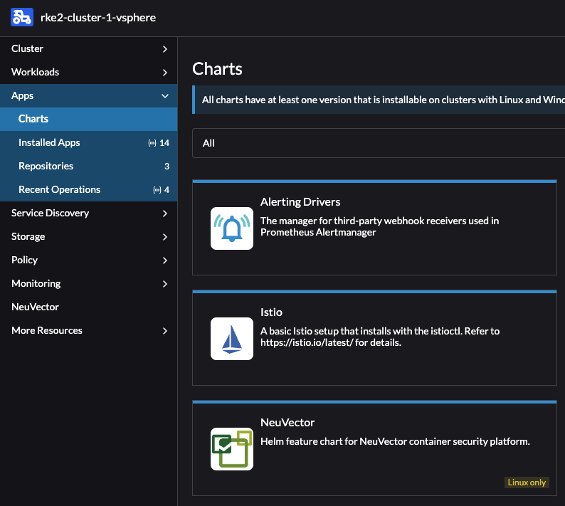

Then from the next window find the **Install** button in the top right corner:


Then in the next step select the Project and click Next:


In the next step I will leave everything at default except the Ingress. Here I will select Ingress for the Manager and enter my hostname then when I am done click Install:

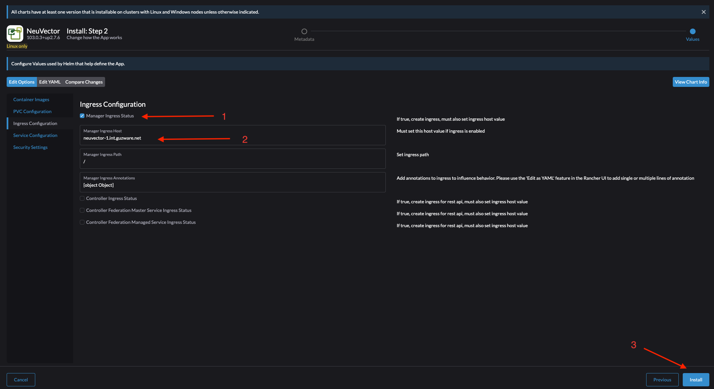

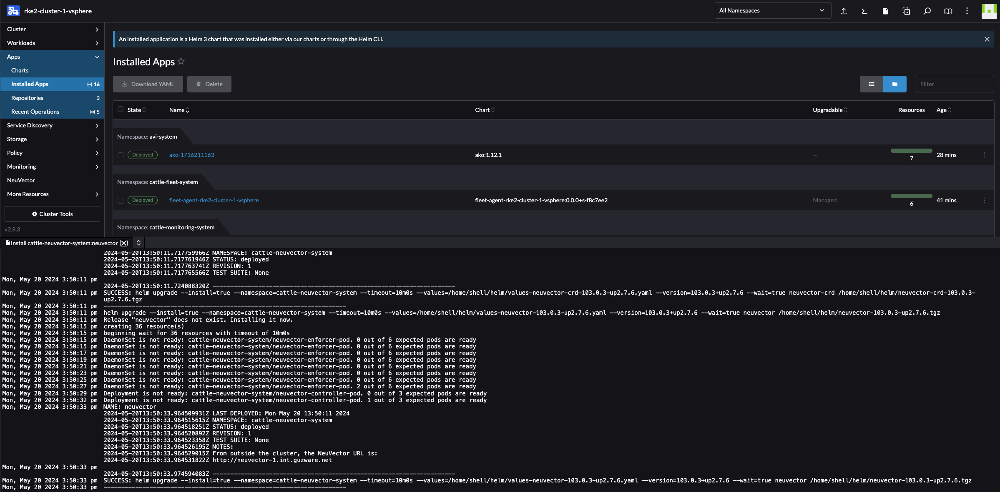

Done. 

Neuvector is now installed and I should be able to reach the ui by grabbing the IP from the Ingress object or from within the Rancher UI:

```bash
NAMESPACE                 NAME                      CLASS    HOSTS                         ADDRESS          PORTS   AGE
cattle-neuvector-system   neuvector-webui-ingress   avi-lb   neuvector-1.my-domain.net   192.168.121.12   80      68s
```

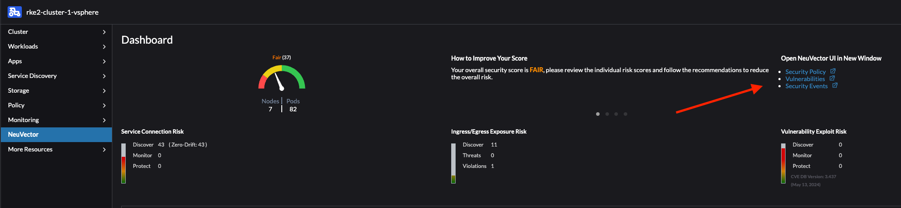

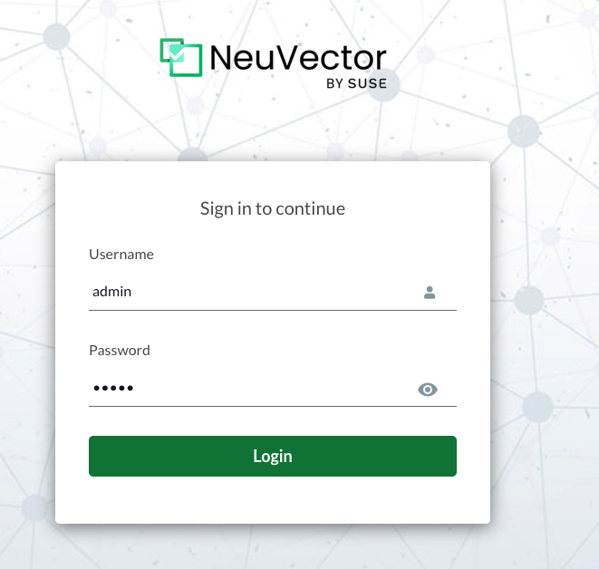


When logged in it will show the Dashboard providing a quick glance at the current state:

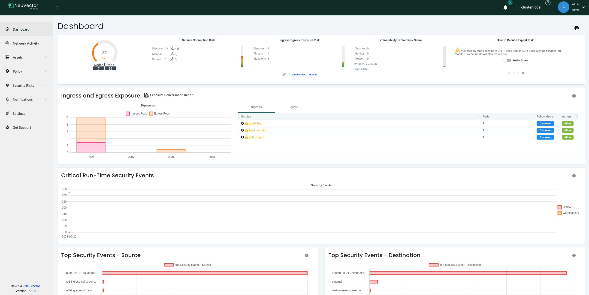


Now lets try out some of the features in NeuVector

## Security Policies

I wrote a post a while back using [Antrea Native Policies](https://blog.andreasm.io/2023/06/21/securing-kubernetes-clusters-with-antrea-network-policies/) to create a "zero trust" approach where all namespaces are per default not allowed to communicate with each other (zero-trust) and then I micro-segmented using Antrea policies a demo application called Yelb. I will follow the same approach here using Antrea policies to apply the foundation policies in my cluster then I will use NeuVector to further add security postures and explore what more I can do with NeuVector.

NeuVector comes with a rich set of security features such as L7 network rules, WAF, process rules, Network Threat signatures, Config Drift rules just to name a few. In additon to the vast visibility NeuVector provides one can imagine this post will be a very fun and interesting post to do. I will try to cover most of these features in the sub-sections below.

This post will start out using some Antrea Native polices to create a "minimum" foundation of security policies, then I will continue with the features of NeuVector.


### NeuVector Modes: Discover, Monitor and Protect

From the official NeuVector documentation:

##### 

> **[Discover](https://open-docs.neuvector.com/policy/modes#discover)**
>
> By default, NeuVector starts in Discover mode. In this mode, NeuVector:
>
> - Discovers your container infrastructure, including containers, nodes, and hosts.
> - Learns your applications and behaviors by observing conversations (network connections) between containers.
> - Identifies separate services and applications running.
> - Automatically builds a whitelist of Network Rules to protect normal application network behavior.
> - Baselines the processes running in containers for each service and creates whitelist Process Profile Rules.
>
> NOTE
>
> *To determine how long to run a service in Discover mode, run test traffic through the application and review all rules for completeness. Several hours should be sufficient, but some applications may require a few days to be fully exercised. When in doubt, switch to Monitor mode and check for violations, which can then be converted to whitelist rules before moving to Protect mode.*
>
> **[Monitor](https://open-docs.neuvector.com/policy/modes#monitor)**
>
> In Monitor mode NeuVector monitors conversations and detects run-time violations of your Security Policy. In this mode, no new rules are created by NeuVector, but rules can manually be added at any time.
>
> When violations are detected, they are visible in the Network Activity map visually by a red line. Violations are also logged and displayed in the Notifications tab. Process profile rule and file access violations are logged into Notifications -> Security Events.
>
> In the Network map you can click on any conversation (green, yellow, red line) to display more details about the type of connection and protocol last monitored. You can also use the Search and Filter by Group buttons in the lower right to narrow the display of your containers.
>
> **[Protect](https://open-docs.neuvector.com/policy/modes#protect)**
>
> In Protect mode, NeuVector enforcers will block (deny) any network violations and attacks detected. Violations are shown in the Network map with a red ‘x’ in them, meaning they have been blocked. Unauthorized processes and file access will also be blocked in Protect mode. DLP sensors which match will block network connections.

As I proceed with this post I will use a mix of all three modes, discover, monitor and protect, until I am satisfied and can enable protect on a global level.

### Network Rules

Before getting into NeuVector network rules I will start out applying my Antrea Native "base-policies" or foundation as the minimum set of security policies controlling what is allowed and not allowed inside my Kubernetes cluster. 

The initial plan is to achieve this, without impacting the Kubernetes cluster operation:

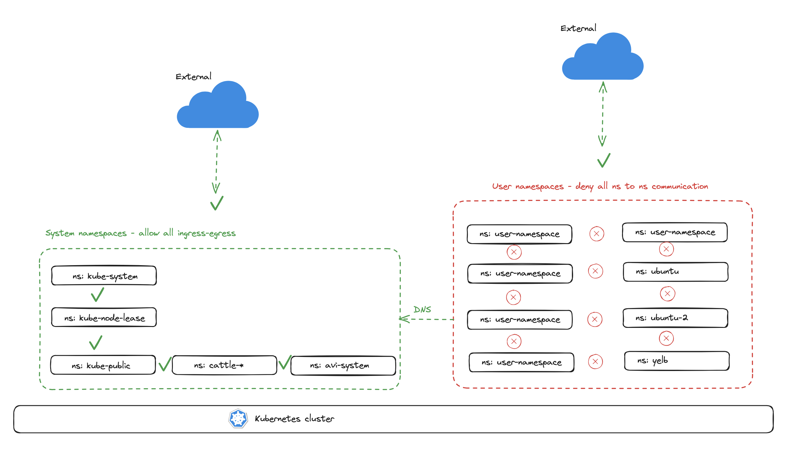

In the diagram above and with the two Antrea policies applied I will allow communication between all namespace I have defined as "system-namespaces" and will drop any communication between any created user namespaces, including from any user created namespaces to system namespaces, except CoreDNS. 

Below is the Antrea Policy I will apply to create the "zero-trust" between all user namespaces:

```yaml
apiVersion: crd.antrea.io/v1alpha1
kind: ClusterNetworkPolicy
metadata:
  name: strict-ns-isolation-except-system-ns
spec:
  priority: 9
  tier: securityops
  appliedTo:
    - namespaceSelector:          # Selects all non-system Namespaces in the cluster
        matchExpressions:
          - {key:  kubernetes.io/metadata.name, operator: NotIn, values: [default,avi-system,kube-node-lease,kube-public,kube-system,cattle-system,cattle-neuvector-system,cattle-monitoring-system,cattle-impersonation-system,cattle-fleet-system,cattle-dashboards]}
  ingress:
    - action: Pass
      from:
        - namespaces:
            match: Self           # Skip ACNP evaluation for traffic from Pods in the same Namespace
      name: PassFromSameNS
    - action: Drop
      from:
        - namespaceSelector: {}   # Drop from Pods from all other Namespaces
      name: DropFromAllOtherNS
  egress:
    - action: Pass
      to:
        - namespaces:
            match: Self           # Skip ACNP evaluation for traffic to Pods in the same Namespace
      name: PassToSameNS
    - action: Drop
      to:
        - namespaceSelector: {}   # Drop to Pods from all other Namespaces
      name: DropToAllOtherNS

```


Certain essential services such as CoreDNS is also needed and I will apply a policy to allow for that, below is the policy:

```yaml
apiVersion: crd.antrea.io/v1alpha1
kind: ClusterNetworkPolicy
metadata:
  name: allow-all-dns-service
spec:
  priority: 8
  tier: securityops
  appliedTo:
    - namespaceSelector: {}
  egress:
    - action: Allow
      toServices:
        - name: rke2-coredns-rke2-coredns
          namespace: kube-system
      ports:
        - protocol: TCP
          port: 53
        - protocol: UDP
          port: 53
      name: "allow-dns-service-from-any"

```


Applied:

```bash
andreasm@linuxmgmt01:~/rancher$ k get acnp
NAME                                   TIER          PRIORITY   DESIRED NODES   CURRENT NODES   AGE
allow-all-dns-service                  securityops   8          7               7               15m
strict-ns-isolation-except-system-ns   securityops   9          2               2               17m
```


Now its time to continue with NeuVector. 

One brilliant part of NeuVector is the Discover/Learned part. It will already provide me with a list of policies in Allow mode, based on findings it has done. 

My first task now is to microsegment my demo app Yelb already running in the cluster. Lets filter on the app Yelb and see what NeuVector has found:

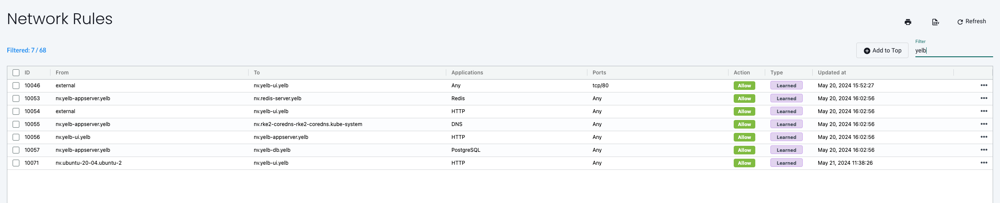

Well not bad, what I do miss though is the specific ports the different applications are using. I happen to know them as I know the application, but I suspect even NeuVector knows them, lets check Network Activity and filter on anything Yelb related:

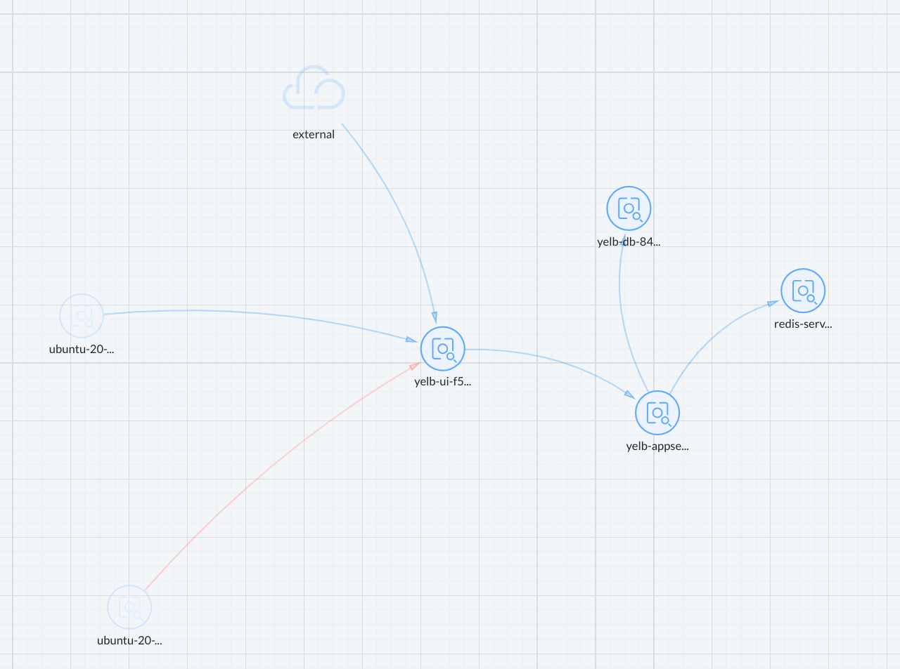

Lets click on the flows between the pods yelb-ui, yelb-db, yelb-appserver and redis-server. 

**yelb-ui to yelb-appserver**


**yelb-appserver to yelb-db**

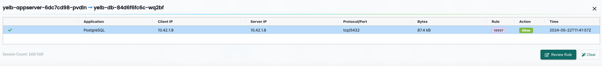

**yelb-appserver to redis-server**

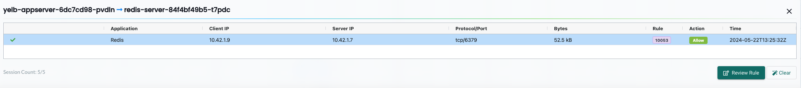

**The external to yelb-ui**

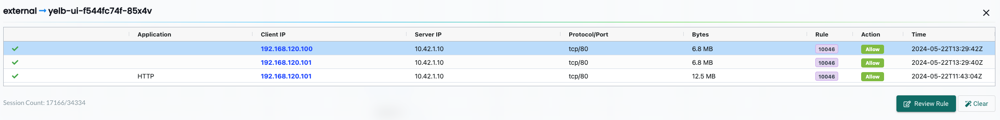

That happens to be my Avi Service Engines providing the ServiceType Loadbalancer service for my Yelb ui which is the only ip addresses that should have access to the Yelb-ui pods. 

Now that I have all the ports also, I can go ahead and create a more specific rule. And, all the ports discovered were correct as the application is using these ports:

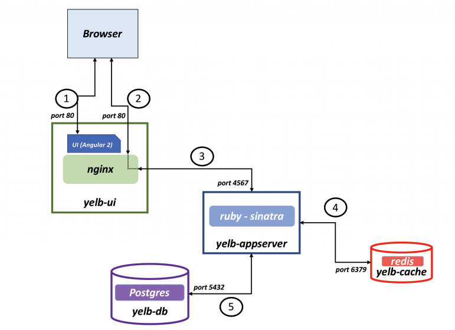


 


If I take a look at the rules created by NeuVector using its Discovery phase many of them do involve a lot of internal Kubernetes services, including NeuVector components itself. 

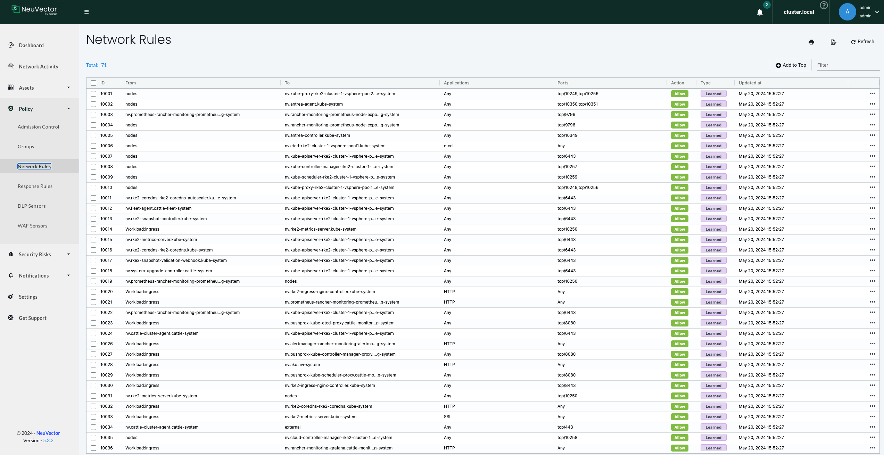

But I would like to tidy it a bit up. And in order to do that I will go ahead and create a group, where the membership criteria is based on the namespaces *cattle-*, *kube-system*, *avi-system*, *kube-public* and *kube-node-lease*.

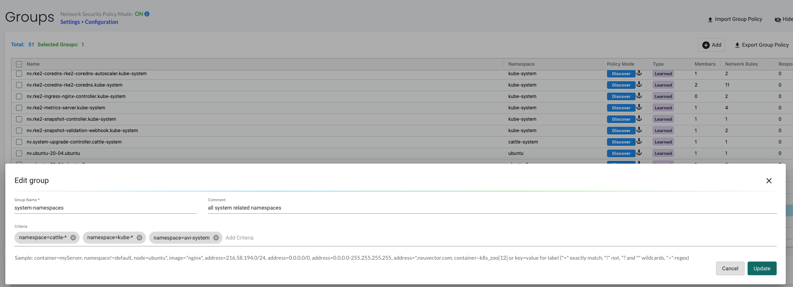


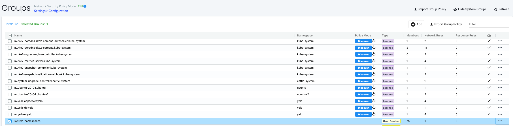


Now that I have this big group of system-namespaces I can go ahead and monitor it. 


There is a couple of approaches I could use to reach my "phase 1" goal illustrated above. I can use NeuVector's discovered flows and learned rules  


Drop SSH process, curl etc.. 


But as mentioned above, default NeuVector is in Discover mode and will not enforce any of my created policies. So I will have to make sure to set in in protect before my policy will be enforced. Until I do that I will ofcourse get alerts that my pods are violating the policy, but its not blocking it. 

Tightening down a Kubernetes cluster can be a tough task, especially when working in "blind". But NeuVector do provide a lot of information from its Discover phase. So that is a good start. 

Allow ping for troubleshooting purpose. 

Export and import configurations, template...


NeuVector does not enforce policies on the nodes themselves, so here one may have to look at Antrea Node Policies or NSX as a VM/node firewall solution. 


Automatic provision rules - using labels? GitOps? 


### Groups

Lets use the Discover process and see if I dont have to re-invent the wheel and use NeuVector's suggested policies. 

 

## Multiple Clusters
