# Arista Networks 

> Arista Networks is an industry leader in data-driven, client to cloud networking for large data center/AI, campus and routing environments. Arista’s award-winning platforms deliver availability, agility, automation, analytics and security through an advanced network operating stack

Source: Arista's [homepage](https://www.arista.com/en/company/company-overview).

Arista has some really great products and solutions, and in this post I will have a deeper look at using [Ansible Validated Design](https://avd.arista.com) automating the whole bringup process of a Spine-Leaf topology. I will also see how this can be used to make the network underlay more agile by adding changes "on-demand".

I have been working with network for many years, starting out with basic network configurations like VLAN, iSCSI setups and routing to support my vSphere implementations as a consultant many many years back. Then I started working with VMware NSX back in 2014/15 first as a consultant doing presale, design and implementation before joining VMware as a NSX specialist. Working with NSX, both as consultant and later as a VMware NSX solutions engineer, very much involved the physical network NSX was supposed to run "on top" of as the actual NSX design. One of NSX benefits was how easy it was to automate. 

What I have never been working with is automating the physical network. Automation is not only for easier deployment, handling dynamics in the datacenter more efficient, but also reducing/eliminate configuration issues. In this post I will go through how I make use of Arista vEOS and Arista's Ansible playbooks to deploy a full spine-leaf topology from zero to hero.

## Arista Extensible Operating System - EOS 

> Arista Extensible Operating System (EOS®) is the core of Arista cloud networking solutions for next-generation data centers and cloud networks. Cloud architectures built with Arista EOS scale to hundreds of thousands of compute and storage nodes with management and provisioning capabilities that work at scale. Through its programmability, EOS enables a set of software applications that deliver workflow automation, high availability, unprecedented network visibility and analytics and rapid integration with a wide range of third-party applications for virtualization, management, automation and orchestration services.

Source: [Arista](https://www.arista.com/en/products/eos)


## vEOS

vEOS is a virtual appliance making it possible to run EOS as a virtual machine in vSphere, KVM, Proxmox, VMware Workstation, Fusion, and VirtualBox just to name a few. For more information head over [here](https://arista.my.site.com/AristaCommunity/s/article/veos-running-eos-in-a-vm). 

With this it is absolutely possible to deploy/test Arista EOS with all kinds of functionality in the comfort of my own lab. So without further ado, lets jump in to it.  

### vEOS on Proxmox

The vEOS appliance consists of two files, the *aboot-veos-x.iso* and the *veos-lab-4-x.disk*. The *aboot-veos-x.iso* is mounted as a CD/DVD ISO and the disk file is the harddisk of your VM. I am running Proxmox in my lab that supports importing both VMDK and qcow2 disk files, but I will be using qcow2 as vEOS also includes this file. So here what I did to create a working vEOS VM in Proxmox:

- Upload the file aboot-veos.iso to a datastore on my Proxmox hosts I can store ISO files. 

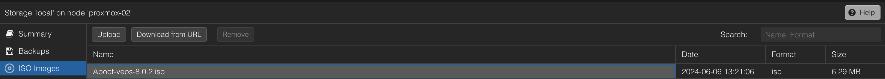

- Upload the qcow2 image/disk file to a temp folder on my Proxmox host. (e.g /tmp)

```bash
root@proxmox-02:/tmp# ls
vEOS64-lab-4.32.1F.qcow2
```

- Create a new VM like this:

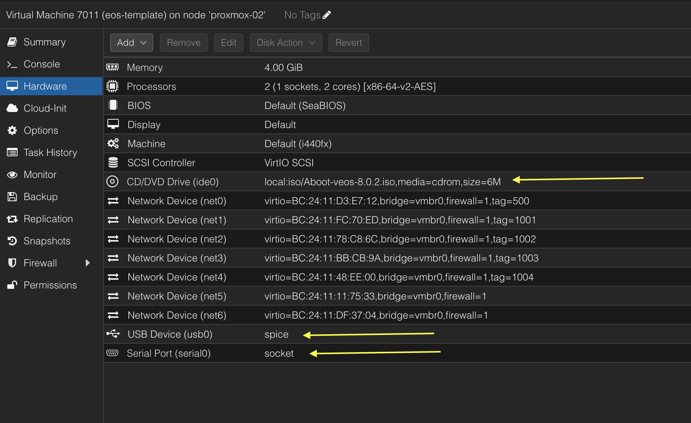

Add a Serial Port, a USB device and mount the *aboot-iso* on the CD/DVD drive, and select no hardisk in the wizard (delete the proposed harddisk). Operating system type is Linux 6.x. I chose to use x86-64-v2-AES CPU emulation. 

- Add the vEOS disk by utilizing the qm import command like this, where 7011 is the ID of my VM, raid-10-node02 is the disk where I want the qcow2 image to be imported/placed. 

```bash
root@proxmox-02:/tmp# qm importdisk 7011 vEOS64-lab-4.32.1F.qcow2 raid-10-node02 -format raw
importing disk 'vEOS64-lab-4.32.1F.qcow2' to VM 7011 ...
transferred 0.0 B of 4.0 GiB (0.00%)
transferred 50.9 MiB of 4.0 GiB (1.24%)
...
transferred 4.0 GiB of 4.0 GiB (100.00%)
Successfully imported disk as 'unused0:raid-10-node02:vm-7011-disk-0'
```

When this is done it will turn up as an unused disk in my VM. 

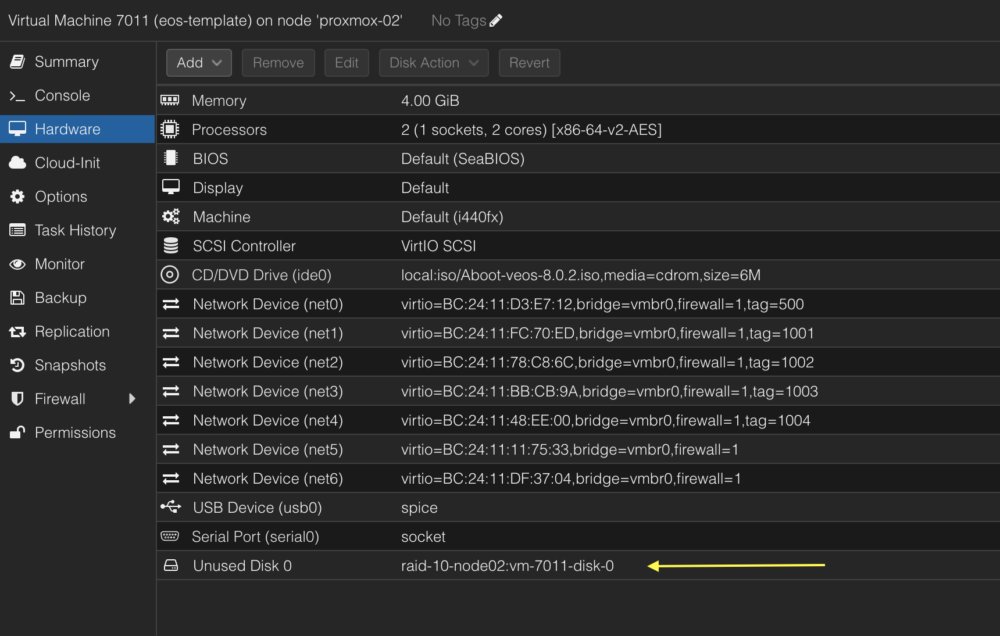

To add the unused disk I selected it, clicked edit and choose SATA and bus 0. This was the only way for the vEOS to successfully boot. This is not what is mentioned in the official documentation [here](https://arista.my.site.com/AristaCommunity/s/article/veos-running-eos-in-a-vm) *The Aboot-veos iso must be set as a CD-ROM image on the IDE bus, and the EOS vmdk must be a hard drive image on the same IDE bus. The simulated hardware cannot contain a SATA controller or vEOS will fail to fully boot.* 

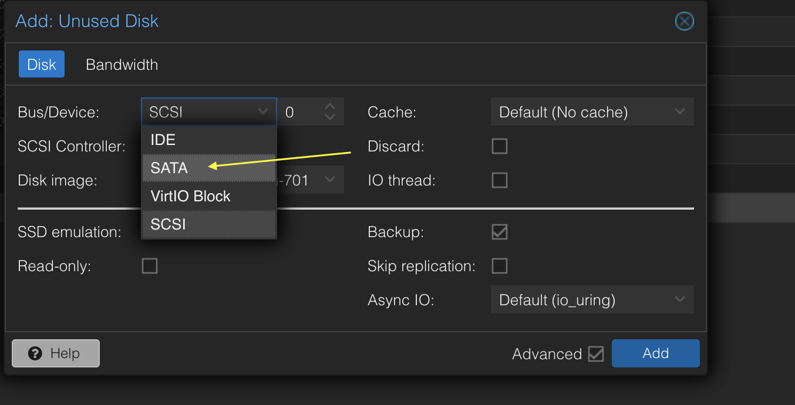

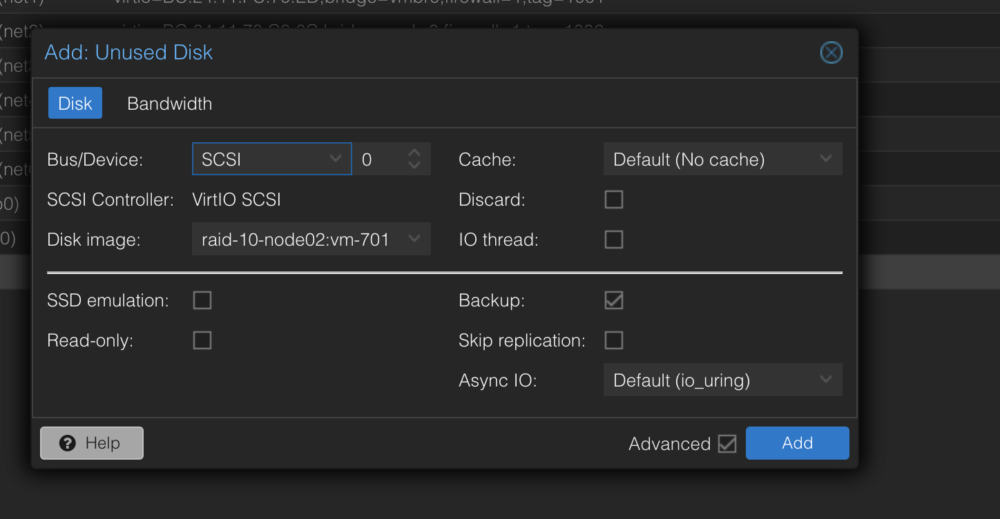

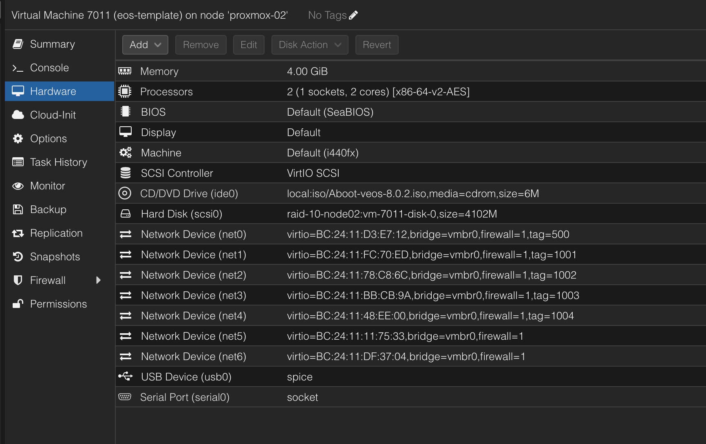

Now the disk has been added. One final note, I have added the network interfaces I need in my lab as seen above. The net0 will be used for dedicated oob management. 

Thats it, I can now power on my vEOS. 

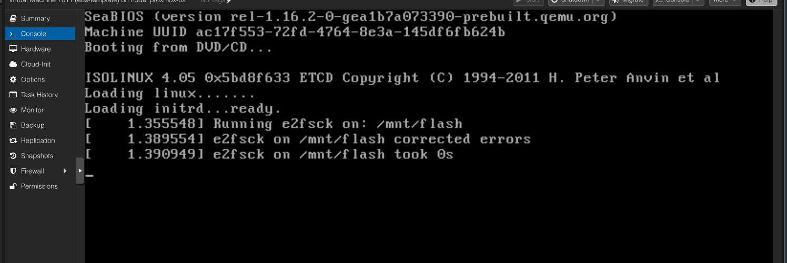

When its done booting, can take a couple of seconds, it will present you with the following screen:

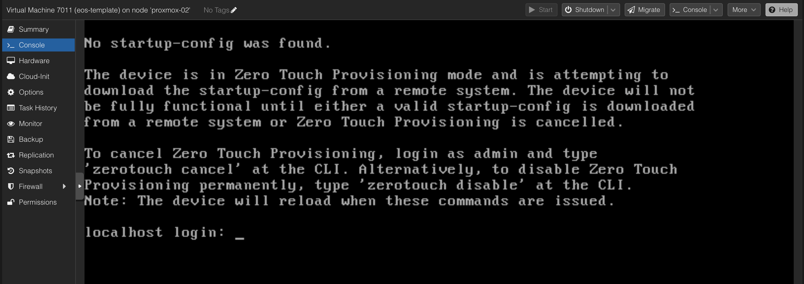

I can decide to log in and configure it manually by logging in with admin, disable Zero Touch Provisioning. But thats not what this post is about, it is about automating the whole process as much as possible. So this takes me to the next chapter. Zero Touch Provisioning. 

I can now power it off, clone this instance to the amount of vEOS appliances I need. I have created 5 instances to be used In the following parts of this post.

## ZTP - Zero Touch Provisioning

Now that I have created all my needed vEOS VMs I need some way to set the basic config like Management Interface IP and username password so I can hand them over to Ansible to automate the whole configuration.

EOS starts by default in ZTP mode, meaning it will do a DHCP request and acquire an IP address if there is a DHCP server that reply, this also means I can configure my DHCP server with a option to run a script from a TFTP server to do these initial configurations. 

For ZTP to work I must have a DHCP server with some specific settings, then a TFTP server. I decided to create a dedicated DHCP server for this purpose, and I also run the TFTPD instance on the same server as where I run the DHCPD server. The Linux distribution I am using is Ubuntu Server. 

Following the official documentation [here](https://arista.my.site.com/AristaCommunity/s/article/ztp-set-up-guide) I have configured my DHCP server with the following setting:

```bash
# ####GLOBAL Server config###
default-lease-time 7200;
max-lease-time 7200;
authoritative;
log-facility local7;
ddns-update-style none;
one-lease-per-client true;
deny duplicates;
option option-252 code 252 = text;
option domain-name "int.guzware.net";
option domain-name-servers 10.100.1.7,10.100.1.6;
option netbios-name-servers 10.100.1.7,10.100.1.6;
option ntp-servers 10.100.1.7;

# ###### Arista MGMT####
subnet 172.18.100.0 netmask 255.255.255.0 {
    pool {
    range 172.18.100.101 172.18.100.150;
    option domain-name "int.guzware.net";
    option domain-name-servers 10.100.1.7,10.100.1.6;
    option broadcast-address 10.100.1.255;
    option ntp-servers 10.100.1.7;
    option routers 172.18.100.2;
    get-lease-hostnames true;
    option subnet-mask 255.255.255.0;
  }
}


host s_lan_0 {
        hardware ethernet bc:24:11:7b:5d:e6;
        fixed-address 172.18.100.101;
        option bootfile-name "tftp://172.18.100.10/ztp-spine1-script";
     }

host s_lan_1 {
        hardware ethernet bc:24:11:04:f8:f8;
        fixed-address 172.18.100.102;
        option bootfile-name "tftp://172.18.100.10/ztp-spine2-script";
     }

host s_lan_2 {
        hardware ethernet bc:24:11:ee:53:83;
        fixed-address 172.18.100.103;
        option bootfile-name "tftp://172.18.100.10/ztp-leaf1-script";
     }

host s_lan_3 {
        hardware ethernet bc:24:11:b3:2f:74;
        fixed-address 172.18.100.104;
        option bootfile-name "tftp://172.18.100.10/ztp-leaf2-script";
     }

host s_lan_4 {
        hardware ethernet bc:24:11:f8:da:7f;
        fixed-address 172.18.100.105;
        option bootfile-name "tftp://172.18.100.10/ztp-borderleaf1-script";
     }
```

The 5 host entries corresponds with my 5 vEOS appliances mac addresses respectively and the *option bootfile-name* referes to a unique file for every vEOS appliance. 

The TFTP server has this configuration:

```bash
# /etc/default/tftpd-hpa

TFTP_USERNAME="tftp"
TFTP_DIRECTORY="/home/andreasm/arista/tftpboot"
TFTP_ADDRESS=":69"
TFTP_OPTIONS="--secure"
```

Then in the tftp_directory I have the following files:

```bash
andreasm@arista-dhcp:~/arista/tftpboot$ ll
total 48
drwxrwxr-x 2      777 nogroup  4096 Jun 10 08:59 ./
drwxrwxr-x 3 andreasm andreasm 4096 Jun 10 08:15 ../
-rw-r--r-- 1 root     root      838 Jun 10 08:55 borderleaf-1-startup-config
-rw-r--r-- 1 root     root      832 Jun 10 08:52 leaf-1-startup-config
-rw-r--r-- 1 root     root      832 Jun 10 08:53 leaf-2-startup-config
-rw-r--r-- 1 root     root      832 Jun 10 08:45 spine-1-startup-config
-rw-r--r-- 1 root     root      832 Jun 10 08:51 spine-2-startup-config
-rw-r--r-- 1 root     root      103 Jun 10 08:55 ztp-borderleaf1-script
-rw-r--r-- 1 root     root       97 Jun 10 08:53 ztp-leaf1-script
-rw-r--r-- 1 root     root       97 Jun 10 08:54 ztp-leaf2-script
-rw-r--r-- 1 root     root       98 Jun 10 08:39 ztp-spine1-script
-rw-r--r-- 1 root     root       98 Jun 10 08:51 ztp-spine2-script
```

The content of the *ztp-leaf1-script* file:

```bash
andreasm@arista-dhcp:~/arista/tftpboot$ cat ztp-leaf1-script
#!/usr/bin/Cli -p2

enable

copy tftp://172.18.100.10/leaf-1-startup-config flash:startup-config
```

The content of the *leaf-1-startup-config* file (taken from the Arista AVD repository [here](https://avd.arista.com/4.8/examples/single-dc-l3ls/index.html#basic-eos-config)):

```bash
andreasm@arista-dhcp:~/arista/tftpboot$ cat leaf-1-startup-config
hostname leaf-1
!
! Configures username and password for the ansible user
username ansible privilege 15 role network-admin secret sha512 $hash/
!
! Defines the VRF for MGMT
vrf instance MGMT
!
! Defines the settings for the Management1 interface through which Ansible reaches the device
interface Management1
   description oob_management
   no shutdown
   vrf MGMT
   ! IP address - must be set uniquely per device
   ip address 172.18.100.103/24
!
! Static default route for VRF MGMT
ip route vrf MGMT 0.0.0.0/0 172.18.100.2
!
! Enables API access in VRF MGMT
management api http-commands
   protocol https
   no shutdown
   !
   vrf MGMT
      no shutdown
!
end
!
! Save configuration to flash
copy running-config startup-config
```

Now I just need to make sure both my DHCP service and TFTP service is running:

```bash
# DHCP Server
andreasm@arista-dhcp:~/arista/tftpboot$ systemctl status isc-dhcp-server
● isc-dhcp-server.service - ISC DHCP IPv4 server
     Loaded: loaded (/lib/systemd/system/isc-dhcp-server.service; enabled; vendor preset: enabled)
     Active: active (running) since Mon 2024-06-10 09:02:08 CEST; 6h ago
       Docs: man:dhcpd(8)
   Main PID: 3725 (dhcpd)
      Tasks: 4 (limit: 4557)
     Memory: 4.9M
        CPU: 15ms
     CGroup: /system.slice/isc-dhcp-server.service
             └─3725 dhcpd -user dhcpd -group dhcpd -f -4 -pf /run/dhcp-server/dhcpd.pid -cf /etc/dhcp/dhcpd.co>

# TFTPD server
andreasm@arista-dhcp:~/arista/tftpboot$ systemctl status tftpd-hpa.service
● tftpd-hpa.service - LSB: HPA's tftp server
     Loaded: loaded (/etc/init.d/tftpd-hpa; generated)
     Active: active (running) since Mon 2024-06-10 08:17:55 CEST; 7h ago
       Docs: man:systemd-sysv-generator(8)
    Process: 2414 ExecStart=/etc/init.d/tftpd-hpa start (code=exited, status=0/SUCCESS)
      Tasks: 1 (limit: 4557)
     Memory: 408.0K
        CPU: 39ms
     CGroup: /system.slice/tftpd-hpa.service
             └─2422 /usr/sbin/in.tftpd --listen --user tftp --address :69 --secure /home/andreasm/arista/tftpb>


```

Thats it. If I have already powered on my vEOS appliance they will very soon get their new config and reboot with the desired config. If not, just reset or power them on and off again. Every time I deploy a new vEOS appliance I just have to update my DHCP server config to add the additional hosts mac addresses and corresponding config files. 

## Spine-Leaf - Desired Topology

> A spine-leaf topology is a two-layer network architecture commonly used in data centers. It is designed to provide high-speed, low-latency, and highly available network connectivity. This topology is favored for its scalability and performance, especially in environments requiring large amounts of east-west traffic (server-to-server).

In virtual environments, including Kubernetes environments, which is quite common today will have a large amount of east-west traffic. In this post will be using the Spine Leaf architecture. 

Before I did any automated provisioning using Arista Validated Design and Ansible I deployed my vEOS appliances configured them with the amount of network interfaces needed to support my intended use (below), then configured them all manually using CLI so I was sure I had a working configuration, and no issues in my lab. I wanted to make sure I could deploy a spine-leaf topology, create some vlans and attached some VMs to them and checked connectivity. Below was my desired topology:

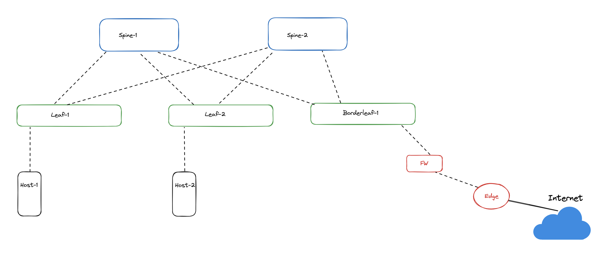

And here was the config I used on all switches respectively:

**Spine1**

```bash
no aaa root
!
username admin role network-admin secret sha512 $hash/
!
switchport default mode routed
!
transceiver qsfp default-mode 4x10G
!
service routing protocols model multi-agent
!
hostname spine-1
!
spanning-tree mode mstp
!
system l1
   unsupported speed action error
   unsupported error-correction action error
!
interface Ethernet1
   description spine-leaf-1-downlink-1
   mtu 9214
   no switchport
   ip address 192.168.0.0/31
!
interface Ethernet2
   description spine-leaf-1-downlink-2
   mtu 9214
   no switchport
   ip address 192.168.0.2/31
!
interface Ethernet3
   description spine-leaf-2-downlink-3
   mtu 9214
   no switchport
   ip address 192.168.0.4/31
!
interface Ethernet4
   description spine-leaf-2-downlink-4
   mtu 9214
   no switchport
   ip address 192.168.0.6/31
!
interface Ethernet5
   description spine-leaf-3-downlink-5
   mtu 9214
   no switchport
   ip address 192.168.0.8/31
!
interface Ethernet6
   description spine-leaf-3-downlink-6
   mtu 9214
   no switchport
   ip address 192.168.0.10/31
!
interface Loopback0
   description spine-1-evpn-lo
   ip address 10.0.0.1/32
!
interface Management1
   ip address 172.18.5.71/24
!
ip routing
!
ip prefix-list PL-LOOPBACKS
   seq 10 permit 10.0.0.0/24 eq 32
!
ip route 0.0.0.0/0 172.18.5.2
!
route-map RM-LOOPBACKS permit 10
   match ip address prefix-list PL-LOOPBACKS
!
router bgp 65000
   router-id 10.0.0.1
   maximum-paths 4 ecmp 4
   neighbor UNDERLAY peer group
   neighbor UNDERLAY allowas-in 1
   neighbor UNDERLAY ebgp-multihop 4
   neighbor UNDERLAY send-community extended
   neighbor UNDERLAY maximum-routes 12000
   neighbor 192.168.0.1 peer group UNDERLAY
   neighbor 192.168.0.1 remote-as 65001
   neighbor 192.168.0.1 description leaf-1-u1
   neighbor 192.168.0.3 peer group UNDERLAY
   neighbor 192.168.0.3 remote-as 65001
   neighbor 192.168.0.3 description leaf-1-u2
   neighbor 192.168.0.5 peer group UNDERLAY
   neighbor 192.168.0.5 remote-as 65002
   neighbor 192.168.0.5 description leaf-2-u1
   neighbor 192.168.0.7 peer group UNDERLAY
   neighbor 192.168.0.7 remote-as 65002
   neighbor 192.168.0.7 description leaf-2-u2
   neighbor 192.168.0.9 peer group UNDERLAY
   neighbor 192.168.0.9 remote-as 65003
   neighbor 192.168.0.9 description borderleaf-1-u1
   neighbor 192.168.0.11 peer group UNDERLAY
   neighbor 192.168.0.11 remote-as 65003
   neighbor 192.168.0.11 description borderleaf-1-u2
   !
   address-family ipv4
      neighbor UNDERLAY activate
!
end
```

**Spine2**

```bash
no aaa root
!
username admin role network-admin secret sha512 $hash/
!
switchport default mode routed
!
transceiver qsfp default-mode 4x10G
!
service routing protocols model multi-agent
!
hostname spine-2
!
spanning-tree mode mstp
!
system l1
   unsupported speed action error
   unsupported error-correction action error
!
interface Ethernet1
   description spine-leaf-1-downlink-1
   mtu 9214
   no switchport
   ip address 192.168.1.0/31
!
interface Ethernet2
   description spine-leaf-1-downlink-2
   mtu 9214
   no switchport
   ip address 192.168.1.2/31
!
interface Ethernet3
   description spine-leaf-2-downlink-3
   mtu 9214
   no switchport
   ip address 192.168.1.4/31
!
interface Ethernet4
   description spine-leaf-2-downlink-4
   mtu 9214
   no switchport
   ip address 192.168.1.6/31
!
interface Ethernet5
   description spine-leaf-3-downlink-5
   mtu 9214
   no switchport
   ip address 192.168.1.8/31
!
interface Ethernet6
   description spine-leaf-3-downlink-6
   mtu 9214
   no switchport
   ip address 192.168.1.10/31
!
interface Loopback0
   ip address 10.0.0.2/32
!
interface Management1
   ip address 172.18.5.72/24
   description spine-leaf-2-downlink-4
   mtu 9214
   no switchport
   ip address 192.168.1.6/31
!
interface Ethernet5
   description spine-leaf-3-downlink-5
   mtu 9214
   no switchport
   ip address 192.168.1.8/31
!
interface Ethernet6
   description spine-leaf-3-downlink-6
   mtu 9214
   no switchport
   ip address 192.168.1.10/31
!
interface Loopback0
   ip address 10.0.0.2/32
!
interface Management1
   ip address 172.18.5.72/24
!
ip routing
!
ip prefix-list PL-LOOPBACKS
   seq 10 permit 10.0.0.0/24 eq 32
!
ip route 0.0.0.0/0 172.18.5.2
!
route-map RM-LOOPBACKS permit 10
   match ip address prefix-list PL-LOOPBACKS
!
router bgp 65000
   router-id 10.0.0.2
   maximum-paths 4 ecmp 4
   neighbor UNDERLAY peer group
   neighbor UNDERLAY allowas-in 1
   neighbor UNDERLAY ebgp-multihop 4
   neighbor UNDERLAY send-community extended
   neighbor UNDERLAY maximum-routes 12000
   neighbor 192.168.1.1 peer group UNDERLAY
   neighbor 192.168.1.1 remote-as 65001
   neighbor 192.168.1.1 description leaf-1-u3
   neighbor 192.168.1.3 peer group UNDERLAY
   neighbor 192.168.1.3 remote-as 65001
   neighbor 192.168.1.3 description leaf-1-u4
   neighbor 192.168.1.5 peer group UNDERLAY
   neighbor 192.168.1.5 remote-as 65002
   neighbor 192.168.1.5 description leaf-2-u3
   neighbor 192.168.1.7 peer group UNDERLAY
   neighbor 192.168.1.7 remote-as 65002
   neighbor 192.168.1.7 description leaf-2-u4
   neighbor 192.168.1.9 peer group UNDERLAY
   neighbor 192.168.1.9 remote-as 65003
   neighbor 192.168.1.9 description borderleaf-1-u3
   neighbor 192.168.1.11 peer group UNDERLAY
   neighbor 192.168.1.11 remote-as 65003
   neighbor 192.168.1.11 description borderleaf-1-u4
   redistribute connected route-map RM-LOOPBACKS
   !
   address-family ipv4
      neighbor UNDERLAY activate
!
end
```

**Leaf-1**

```bash
no aaa root
!
username admin role network-admin secret sha512 $hash
!
switchport default mode routed
!
transceiver qsfp default-mode 4x10G
!
service routing protocols model multi-agent
!
hostname leaf-1
!
spanning-tree mode mstp
no spanning-tree vlan-id 4094
!
spanning-tree mst configuration
   instance 1 vlan  1-4094
!
system l1
   unsupported speed action error
   unsupported error-correction action error
!
vlan 1070
   name subnet-70
!
vlan 1071
   name subnet-71
!
aaa authorization exec default local
!
interface Ethernet1
   description leaf-spine-1-uplink-1
   mtu 9000
   no switchport
   ip address 192.168.0.1/31
!
interface Ethernet2
   description leaf-spine-1-uplink-2
   mtu 9000
   no switchport
   ip address 192.168.0.3/31
!
interface Ethernet3
   description leaf-spine-2-uplink-3
   mtu 9000
   no switchport
   ip address 192.168.1.1/31
!
interface Ethernet4
   description leaf-spine-2-uplink-4
   mtu 9000
   no switchport
   ip address 192.168.1.3/31
!
interface Ethernet5
   mtu 1500
   switchport access vlan 1071
   switchport
   spanning-tree portfast
!
interface Ethernet6
   no switchport
!
interface Loopback0
   description leaf-1-lo
   ip address 10.0.0.3/32
!
interface Management1
   ip address 172.18.5.73/24
!
interface Vlan1070
   description subnet-70
   ip address virtual 10.70.0.1/24
!
interface Vlan1071
   description subnet-71
   ip address virtual 10.71.0.1/24
!
interface Vxlan1
   vxlan source-interface Loopback0
   vxlan udp-port 4789
   vxlan vlan 1070-1071 vni 10070-10071
!
ip virtual-router mac-address 00:1c:73:ab:cd:ef
!
ip routing
!
ip prefix-list PL-LOOPBACKS
   seq 10 permit 10.0.0.0/24 eq 32
!
ip route 0.0.0.0/0 172.18.5.2
!
route-map RM-LOOPBACKS permit 10
   match ip address prefix-list PL-LOOPBACKS
!
router bgp 65001
   router-id 10.0.0.3
   maximum-paths 4 ecmp 4
   neighbor OVERLAY peer group
   neighbor OVERLAY ebgp-multihop 5
   neighbor OVERLAY send-community extended
   neighbor UNDERLAY peer group
   neighbor UNDERLAY allowas-in 1
   neighbor UNDERLAY ebgp-multihop 4
   neighbor UNDERLAY send-community extended
   neighbor UNDERLAY maximum-routes 12000
   neighbor 10.0.0.4 peer group OVERLAY
   neighbor 10.0.0.4 remote-as 65002
   neighbor 10.0.0.4 update-source Loopback0
   neighbor 10.0.0.5 peer group OVERLAY
   neighbor 10.0.0.5 remote-as 65003
   neighbor 192.168.0.0 peer group UNDERLAY
   neighbor 192.168.0.0 remote-as 65000
   neighbor 192.168.0.0 description spine-1-int-1
   neighbor 192.168.0.2 peer group UNDERLAY
   neighbor 192.168.0.2 remote-as 65000
   neighbor 192.168.0.2 description spine-1-int-2
   neighbor 192.168.1.0 peer group UNDERLAY
   neighbor 192.168.1.0 remote-as 65000
   neighbor 192.168.1.0 description spine-2-int-1
   neighbor 192.168.1.2 peer group UNDERLAY
   neighbor 192.168.1.2 remote-as 65000
   neighbor 192.168.1.2 description spine-2-int-2
   !
   vlan-aware-bundle V1070-1079
      rd 10.0.0.3:1070
      route-target both 10010:1
      redistribute learned
      vlan 1070-1079
   !
   address-family evpn
      neighbor OVERLAY activate
   !
   address-family ipv4
      neighbor UNDERLAY activate
      redistribute connected route-map RM-LOOPBACKS
!
end
```

**Leaf-2**

```bash
no aaa root
!
username admin role network-admin secret sha512 $hash
!
switchport default mode routed
!
transceiver qsfp default-mode 4x10G
!
service routing protocols model multi-agent
!
hostname leaf-2
!
spanning-tree mode mstp
no spanning-tree vlan-id 4094
!
spanning-tree mst configuration
   instance 1 vlan  1-4094
!
system l1
   unsupported speed action error
   unsupported error-correction action error
!
vlan 1070
   name subnet-70
!
vlan 1071
   name subnet-71
!
vlan 1072
!
aaa authorization exec default local
!
interface Ethernet1
   description leaf-spine-1-uplink-1
   mtu 9000
   no switchport
   ip address 192.168.0.5/31
!
interface Ethernet2
   description leaf-spine-1-uplink-2
   mtu 9000
   no switchport
   ip address 192.168.0.7/31
!
interface Ethernet3
   description leaf-spine-2-uplink-3
   mtu 9000
   no switchport
   ip address 192.168.1.5/31
!
interface Ethernet4
   description leaf-spine-2-uplink-4
   mtu 9000
   no switchport
   ip address 192.168.1.7/31
!
interface Ethernet5
   mtu 1500
   switchport access vlan 1070
   switchport
   spanning-tree portfast
!
interface Ethernet6
   no switchport
!
interface Loopback0
   ip address 10.0.0.4/32
!
interface Management1
   ip address 172.18.5.74/24
!
interface Vlan1070
   description subnet-70
   ip address virtual 10.70.0.1/24
!
interface Vlan1071
   description subnet-71
   ip address virtual 10.71.0.1/24
!
interface Vxlan1
   vxlan source-interface Loopback0
   vxlan udp-port 4789
   vxlan vlan 1070-1071 vni 10070-10071
!
ip virtual-router mac-address 00:1c:73:ab:cd:ef
!
ip routing
!
ip prefix-list PL-LOOPBACKS
   seq 10 permit 10.0.0.0/24 eq 32
!
ip route 0.0.0.0/0 172.18.5.2
!
route-map RM-LOOPBACKS permit 10
   match ip address prefix-list PL-LOOPBACKS
!
router bgp 65002
   router-id 10.0.0.4
   maximum-paths 4 ecmp 4
   neighbor OVERLAY peer group
   neighbor OVERLAY ebgp-multihop 5
   neighbor OVERLAY send-community extended
   neighbor UNDERLAY peer group
   neighbor UNDERLAY allowas-in 1
   neighbor UNDERLAY ebgp-multihop 4
   neighbor UNDERLAY send-community extended
   neighbor UNDERLAY maximum-routes 12000
   neighbor 10.0.0.3 peer group OVERLAY
   neighbor 10.0.0.3 remote-as 65001
   neighbor 10.0.0.3 update-source Loopback0
   neighbor 10.0.0.5 peer group OVERLAY
   neighbor 10.0.0.5 remote-as 65003
   neighbor 10.0.0.5 update-source Loopback0
   neighbor 192.168.0.4 peer group UNDERLAY
   neighbor 192.168.0.4 remote-as 65000
   neighbor 192.168.0.4 description spine-1-int-3
   neighbor 192.168.0.6 peer group UNDERLAY
   neighbor 192.168.0.6 remote-as 65000
   neighbor 192.168.0.6 description spine-1-int-4
   neighbor 192.168.1.4 peer group UNDERLAY
   neighbor 192.168.1.4 remote-as 65000
   neighbor 192.168.1.4 description spine-2-int-3
   neighbor 192.168.1.6 peer group UNDERLAY
   neighbor 192.168.1.6 remote-as 65000
   neighbor 192.168.1.6 description spine-2-int-4
   !
   vlan-aware-bundle V1070-1079
      rd 10.0.0.4:1070
      route-target both 10010:1
      redistribute learned
      vlan 1070-1079
   !
   address-family evpn
      neighbor OVERLAY activate
   !
   address-family ipv4
      neighbor UNDERLAY activate
      redistribute connected route-map RM-LOOPBACKS
!
end
```

**Borderleaf-1**

```bash
no aaa root
!
username admin role network-admin secret sha512 $hash
!
switchport default mode routed
!
transceiver qsfp default-mode 4x10G
!
service routing protocols model multi-agent
!
hostname borderleaf-1
!
spanning-tree mode mstp
no spanning-tree vlan-id 4094
!
spanning-tree mst configuration
   instance 1 vlan  1-4094
!
system l1
   unsupported speed action error
   unsupported error-correction action error
!
vlan 1079
   name subnet-wan
!
aaa authorization exec default local
!
interface Ethernet1
   description leaf-spine-1-uplink-1
   mtu 9214
   no switchport
   ip address 192.168.0.9/31
!
interface Ethernet2
   description leaf-spine-1-uplink-2
   mtu 9214
   no switchport
   ip address 192.168.0.11/31
!
interface Ethernet3
   description leaf-spine-2-uplink-3
   mtu 9214
   no switchport
   ip address 192.168.1.9/31
!
interface Ethernet4
   description leaf-spine-2-uplink-4
   mtu 9214
   no switchport
   ip address 192.168.1.11/31
!
interface Ethernet5
   switchport trunk allowed vlan 1070-1079
   switchport mode trunk
   switchport
!
interface Ethernet6
   no switchport
!
interface Loopback0
   ip address 10.0.0.5/32
!
interface Management1
   ip address 172.18.5.75/24
!
interface Vlan1079
   ip address virtual 10.79.0.1/24
!
interface Vxlan1
   vxlan source-interface Loopback0
   vxlan udp-port 4689
   vxlan vlan 1079 vni 10079
!
ip routing
!
ip prefix-list PL-LOOPBACKS
   seq 10 permit 10.0.0.0/24 eq 32
!
ip route 0.0.0.0/0 172.18.5.2
!
route-map RM-LOOPBACKS permit 10
   match ip address prefix-list PL-LOOPBACKS
!
router bgp 65003
   router-id 10.0.0.4
   maximum-paths 2 ecmp 2
   neighbor OVERLAY peer group
   neighbor OVERLAY ebgp-multihop 5
   neighbor OVERLAY send-community extended
   neighbor UNDERLAY peer group
   neighbor UNDERLAY allowas-in 1
   neighbor UNDERLAY ebgp-multihop 4
   neighbor UNDERLAY send-community extended
   neighbor UNDERLAY maximum-routes 12000
   neighbor 10.0.0.3 peer group OVERLAY
   neighbor 10.0.0.3 remote-as 65001
   neighbor 10.0.0.3 update-source Loopback0
   neighbor 10.0.0.4 peer group OVERLAY
   neighbor 10.0.0.4 remote-as 65002
   neighbor 10.0.0.4 update-source Loopback0
   neighbor 192.168.0.8 peer group UNDERLAY
   neighbor 192.168.0.8 remote-as 65000
   neighbor 192.168.0.8 description spine-1-int-5
   neighbor 192.168.0.10 peer group UNDERLAY
   neighbor 192.168.0.10 remote-as 65000
   neighbor 192.168.0.10 description spine-1-int-6
   neighbor 192.168.1.8 peer group UNDERLAY
   neighbor 192.168.1.8 remote-as 65000
   neighbor 192.168.1.8 description spine-2-int-5
   neighbor 192.168.1.10 peer group UNDERLAY
   neighbor 192.168.1.10 remote-as 65000
   neighbor 192.168.1.10 description spine-2-int-6
   !
   vlan-aware-bundle V1079
      rd 10.0.0.5:1079
      route-target both 10070:1
      redistribute learned
      vlan 1079
   !
   address-family evpn
      neighbor OVERLAY activate
   !
   address-family ipv4
      neighbor UNDERLAY activate
      redistribute connected route-map RM-LOOPBACKS
!
end
```

With the configurations above manually created, I had a working Spine-Leaf topology in my lab. These configs will also be very interesting to compare later on.

### My physical lab topology

I think it also make sense to quickly go over how my lab is configured. The diagram below illustrates my two Proxmox hosts 1 and 2 both connected to my physical switch on port 49, 51 and 50, 52 respectively. The reason I bring this up is because in certain scenarios I dont want certain vlans to be available on the trunk for both hosts. Like the downlinks from the the vEOS appliances to the attached test VMs, this will not be the case in real world either. This just confuses things. 

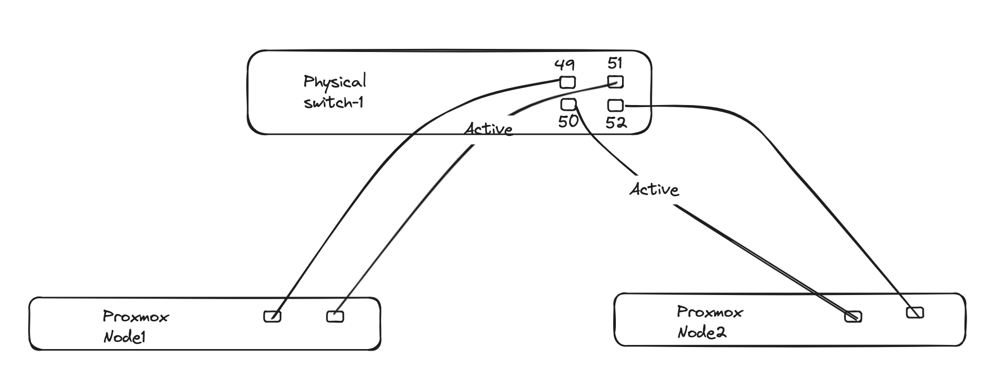

Below is how I interconnect all my vEOS appliances, separating all peer to peer connections on their own dedicated vlan. This is ofcourse not necessary in "real world", but again this is all virtual environment (including the vEOS switches). All the VLANs are configured on the above illustrated physical switch and made available on the trunks to respective Proxmox hosts using VLAN trunks. 

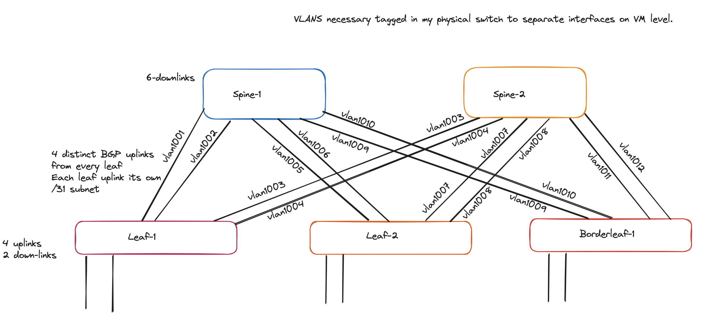

I have also separated the spines on each host and both leafs, as I have only two hosts the borderleaf-1 is placed on same host as leaf-2. 

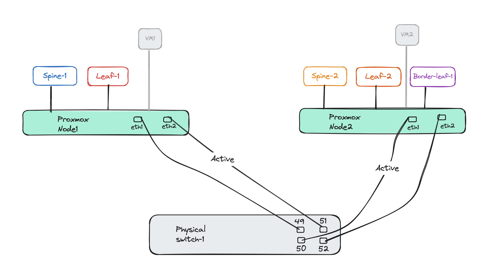

Below is the VLAN tag for each vEOS appliance:

**Spine-1**

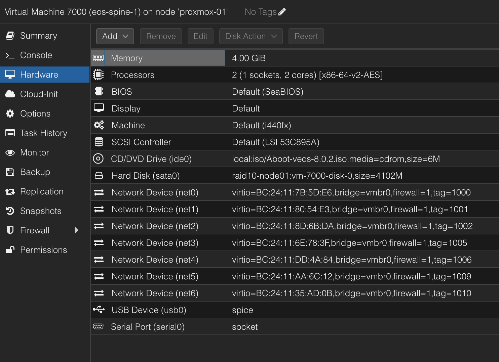

**Spine-2**

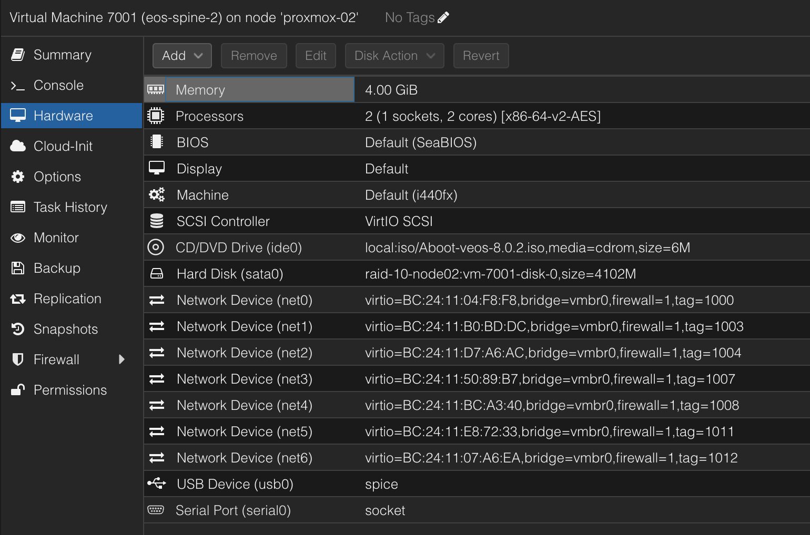

**Leaf-1**


For the leafs the last two network cards *net5* and *net6* are used as host downlinks and not involved in forming the spine/leaf.

**Leaf-2**

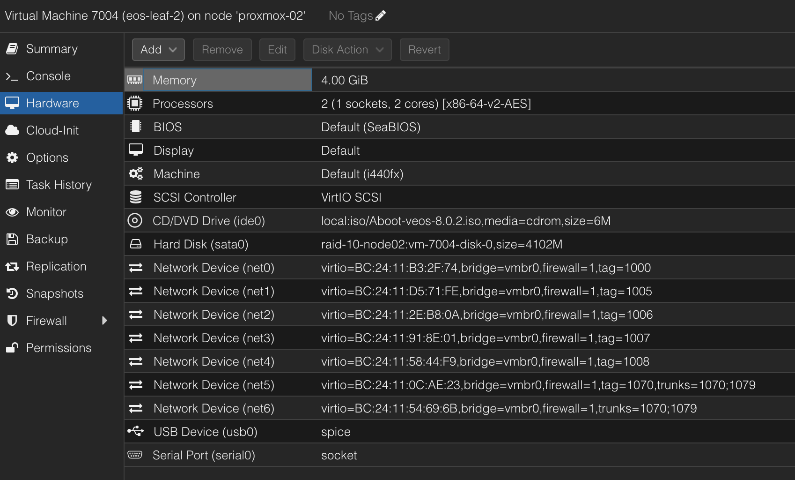

**Borderleaf-1**

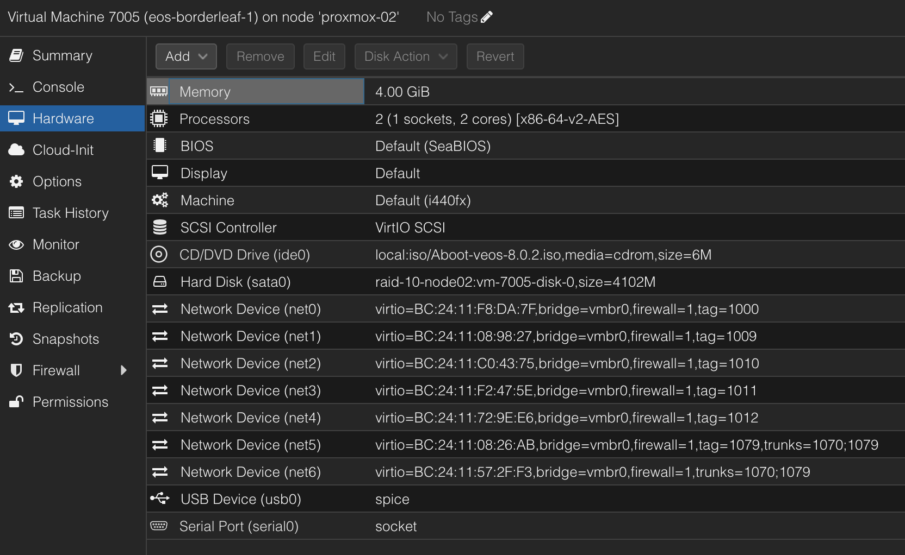

After verififying the above configs worked after manually configuring it, I reset all the switches back to factory settings. They will get the initial config set by Zero-Touch-Provisioning and ready to be configured again.

Now the next chapters is about automating the configuring of the vEOS switches to form a spine/leaf topology using Ansible. To get started I used Arista's very well documented Arista Validated Design [here](https://avd.arista.com/4.8/index.html). More on this in the coming chapters


## Arista Validated Designs (AVD)

> Arista Validated Designs (AVD) is an extensible data model that defines Arista’s Unified Cloud Network architecture as “code”.
>
> [Arista.avd](https://galaxy.ansible.com/arista/avd) is an Ansible collection for Arista Validated Designs. It’s maintained by Arista and accepts third-party contributions on GitHub at [aristanetworks/avd](https://github.com/aristanetworks/avd).
>
> While Ansible is the core automation engine, AVD is an Ansible Collection described above. It provides roles, modules, and plugins that allow the user to generate and deploy best-practice configurations to Arista based networks of various design types: Data Center, Campus and Wide Area Networks.

Source: Arista [https://avd.arista.com/](https://avd.arista.com/)

Arista Validated Design is a very well maintained project, and by having a quick look at their GitHub [repo](https://github.com/aristanetworks/avd) updates are done very frequently and latest release was 3 weeks ago.

*avd.arista.com* is a brilliant web page for their Validated Designs using Ansible where they document very well how to get started including some example designs like [Single DC L3LS](https://avd.arista.com/4.8/examples/single-dc-l3ls/index.html), [Dual DC L3LS](https://avd.arista.com/4.8/examples/dual-dc-l3ls/index.html), [L2LS Fabric](https://avd.arista.com/4.8/examples/l2ls-fabric/index.html), [Campus Fabric](https://avd.arista.com/4.8/examples/campus-fabric/index.html) and [ISIS-LDP IPVPN](https://avd.arista.com/4.8/examples/isis-ldp-ipvpn/index.html).

I will base my deployment on the *Single DC L3LS* example, with some modifications to achieve a similiar design as illustrated earlier. The major modifications I am doing is removing some of the leafs and no MLAG, keeping it as close to my initial design as possible.  

### Preparing my environment for AVD and AVD collection requirements

To get started using Ansible I find it best to create a dedicated Python Environment to keep all the different requirements isolated from other projects. This means I can run different versions and packages within their own dedicated virtual environments without them interfering with other environments. 


So before I install any of AVDs requirements I will start by creating a folder for my AVD project:

```bash
andreasm@linuxmgmt01:~$ mkdir arista_validated_design
andreasm@linuxmgmt01:~$ cd arista_validated_design/
andreasm@linuxmgmt01:~/arista_validated_design$
```

Then I will create my Python Virtual Environment.

```bash
andreasm@linuxmgmt01:~/arista_validated_design$ python3 -m venv avd-environment
andreasm@linuxmgmt01:~/arista_validated_design$ ls
avd-environment
andreasm@linuxmgmt01:~/arista_validated_design$ cd avd-environment/
andreasm@linuxmgmt01:~/arista_validated_design/avd-environment$ ls
bin  include  lib  lib64  pyvenv.cfg
```

This will create a subfolder with the name of the environment. Now all I need to to is to activate the environment so I can deploy the necessary requirements for AVD. 

```bash
andreasm@linuxmgmt01:~/arista_validated_design$ source avd-environment/bin/activate
(avd-environment) andreasm@linuxmgmt01:~/arista_validated_design$
```

Notice the (avd-environment) indicating I am now in my virtual environment called avd-environment. Now that I have a dedicated Python environment for this I am ready to install all the dependencies for the AVD Collection without running the risk of any conflict with other environments. Below is the AVD Collection Requirements:

- Python 3.9 or later
- ansible-core from 2.15.0 to 2.17.x
- arista.avd collection
- additional Python requirements: 

```bash
# PyAVD must follow the exact same version as the Ansible collection.
# For development this should be installed as an editable install as specified in requirement-dev.txt
pyavd==4.9.0-dev0
netaddr>=0.7.19
Jinja2>=3.0.0
treelib>=1.5.5
cvprac>=1.3.1
jsonschema>=4.10.3
referencing>=0.35.0
requests>=2.27.0
PyYAML>=6.0.0
deepmerge>=1.1.0
cryptography>=38.0.4
# No anta requirement until the eos_validate_state integration is out of preview.
# anta>=1.0.0
aristaproto>=0.1.1
```

-  Modify ansible.cfg to support jinja2 extensions.

### Install AVD Collection and requirements

From my newly created Python Environment I will install the necessary components to get started with AVD. 

The first requirement the Python version:

```bash
(avd-environment) andreasm@linuxmgmt01:~/arista_validated_design$ python --version
Python 3.12.1
```

Next requirement is installing ansible-core:

```bash
(avd-environment) andreasm@linuxmgmt01:~/arista_validated_design$ python3 -m pip install ansible
Collecting ansible
  Obtaining dependency information for ansible from https://files.pythonhosted.org/packages/28/7c/a5f708b7b033f068a8ef40db5c993bee4cfafadd985d48dfe44db8566fc6/ansible-10.0.1-py3-none-any.whl.metadata
  Using cached ansible-10.0.1-py3-none-any.whl.metadata (8.2 kB)
Collecting ansible-core~=2.17.0 (from ansible)
  Obtaining dependency information for ansible-core~=2.17.0 from https://files.pythonhosted.org/packages/2f/77/97fb1880abb485f1df31b36822c537330db86bea4105fdea6e1946084c16/ansible_core-2.17.0-py3-none-any.whl.metadata
  Using cached ansible_core-2.17.0-py3-none-any.whl.metadata (6.9 kB)
...
Installing collected packages: resolvelib, PyYAML, pycparser, packaging, MarkupSafe, jinja2, cffi, cryptography, ansible-core, ansible
Successfully installed MarkupSafe-2.1.5 PyYAML-6.0.1 ansible-10.0.1 ansible-core-2.17.0 cffi-1.16.0 cryptography-42.0.8 jinja2-3.1.4 packaging-24.1 pycparser-2.22 resolvelib-1.0.1
```

```bash
(avd-environment) andreasm@linuxmgmt01:~/arista_validated_design$ ansible --version
ansible [core 2.17.0]
```

The third requirement is to install the arista.avd collection:

```bash
(avd-environment) andreasm@linuxmgmt01:~/arista_validated_design$ ansible-galaxy collection install arista.avd
Starting galaxy collection install process
[WARNING]: Collection arista.cvp does not support Ansible version 2.17.0
Process install dependency map
Starting collection install process
Downloading https://galaxy.ansible.com/api/v3/plugin/ansible/content/published/collections/artifacts/arista-avd-4.8.0.tar.gz to /home/andreasm/.ansible/tmp/ansible-local-66927_qwu6ou1/tmp33cqptq7/arista-avd-4.8.0-p_88prjp
Installing 'arista.avd:4.8.0' to '/home/andreasm/.ansible/collections/ansible_collections/arista/avd'
arista.avd:4.8.0 was installed successfully
```

Then I need the fourth requirement installing the additional Python requirments:

```bash
(avd-environment) andreasm@linuxmgmt01:~/arista_validated_design$ export ARISTA_AVD_DIR=$(ansible-galaxy collection list arista.avd --format yaml | head -1 | cut -d: -f1)
(avd-environment) andreasm@linuxmgmt01:~/arista_validated_design$ pip3 install -r ${ARISTA_AVD_DIR}/arista/avd/requirements.txt
Collecting netaddr>=0.7.19 (from -r /home/andreasm/.ansible/collections/ansible_collections/arista/avd/requirements.txt (line 1))
```

By pointing to the requirements.txt it will grab all necessary requirements.

And the last requirement, modifying the ansible.cfg to support jinja2 extensions. I will get back to this in a second.
I will copy the AVD examples to my current folder first, the reason for this is that they already contain a ansible.cfg file in every example.

```bash
(avd-environment) andreasm@linuxmgmt01:~/arista_validated_design$ ansible-playbook arista.avd.install_examples
[WARNING]: No inventory was parsed, only implicit localhost is available
[WARNING]: provided hosts list is empty, only localhost is available. Note that the implicit localhost does not match 'all'

PLAY [Install Examples] *****************************************************************************************************************************************************************************************

TASK [Copy all examples to /home/andreasm/arista_validated_design] **********************************************************************************************************************************************
changed: [localhost]

PLAY RECAP ******************************************************************************************************************************************************************************************************
localhost                  : ok=1    changed=1    unreachable=0    failed=0    skipped=0    rescued=0    ignored=0
```

 Now lets have a look at the contents in my folder:

```bash
(avd-environment) andreasm@linuxmgmt01:~/arista_validated_design$ ll
total 32
drwxrwxr-x  8 andreasm andreasm 4096 Jun 12 06:08 ./
drwxr-xr-x 43 andreasm andreasm 4096 Jun 11 05:24 ../
drwxrwxr-x  5 andreasm andreasm 4096 Jun 11 06:02 avd-environment/
drwxrwxr-x  7 andreasm andreasm 4096 Jun 12 06:07 campus-fabric/
drwxrwxr-x  7 andreasm andreasm 4096 Jun 12 06:08 dual-dc-l3ls/
drwxrwxr-x  7 andreasm andreasm 4096 Jun 12 06:07 isis-ldp-ipvpn/
drwxrwxr-x  7 andreasm andreasm 4096 Jun 12 06:08 l2ls-fabric/
drwxrwxr-x  8 andreasm andreasm 4096 Jun 12 06:09 single-dc-l3ls/
```

And by taking a look inside the *single-dc-l3ls* folder (which I am basing my configuration on) I will see that there is already a ansible.cfg file:

```bash
(avd-environment) andreasm@linuxmgmt01:~/arista_validated_design/single-dc-l3ls$ ll
total 92
drwxrwxr-x 8 andreasm andreasm  4096 Jun 12 06:09 ./
drwxrwxr-x 8 andreasm andreasm  4096 Jun 12 06:08 ../
-rw-rw-r-- 1 andreasm andreasm   109 Jun 12 06:08 ansible.cfg # here
-rw-rw-r-- 1 andreasm andreasm   422 Jun 12 06:08 build.yml
drwxrwxr-x 2 andreasm andreasm  4096 Jun 12 06:09 config_backup/
-rw-rw-r-- 1 andreasm andreasm   368 Jun 12 06:08 deploy-cvp.yml
-rw-rw-r-- 1 andreasm andreasm   260 Jun 12 06:08 deploy.yml
drwxrwxr-x 4 andreasm andreasm  4096 Jun 12 06:09 documentation/
drwxrwxr-x 2 andreasm andreasm  4096 Jun 12 06:09 group_vars/
drwxrwxr-x 2 andreasm andreasm  4096 Jun 12 06:08 images/
drwxrwxr-x 4 andreasm andreasm  4096 Jun 12 06:09 intended/
-rw-rw-r-- 1 andreasm andreasm  1403 Jun 12 06:08 inventory.yml
-rw-rw-r-- 1 andreasm andreasm 36936 Jun 12 06:08 README.md
drwxrwxr-x 2 andreasm andreasm  4096 Jun 12 06:09 switch-basic-configurations/
```

Now to the last requirement, when I open the ansible.cfg file using *vim* I will notice this content:

```yaml
[defaults]
inventory=inventory.yml
jinja2_extensions = jinja2.ext.loopcontrols,jinja2.ext.do,jinja2.ext.i18n
```

It already contains the requirements. What I can add is the following, as recommended by AVD:

```yaml
[defaults]
inventory=inventory.yml
jinja2_extensions = jinja2.ext.loopcontrols,jinja2.ext.do,jinja2.ext.i18n
duplicate_dict_key=error # added this

```

Thats it for the preparations. Now it is time to do some networking automation.

For more details and instructions, head over to the [avd.arista.com](https://avd.arista.com) webpage as it is very well documented there.

### Preparing AVD example files

To get started with Arista Validated Design is quite easy as the necessary files are very well structured and easy to understand with already example information populated making it very easy to follow. In my *single-dc-l3ls* folder there is a couple of files inside the *group_cvars* folder I need to edit to my match my environment. When these have been edited its time to apply the task. But before getting there, I will go through the files, how I have edited them. 

As I mentioned above, I will base my deployment on the example *single-dc-l3ls" with some minor modifications by removing some leaf-switches, addings some uplinks etc. So by entering the folder *single-dc-l3ls* folder, which was created when I copied the collection over to my environment earlier, I will find the content related such an deployment. 

Below is the files I need to do some edits in, numbered in the order they are configured:

```bash
├── ansible.cfg # added the optional duplicate_dict_key  
├── group_vars/
│ ├── CONNECTED_ENDPOINTS.yml #### 7 ####
│ ├── DC1_L2_LEAVES.yml ### N/A ####
│ ├── DC1_L3_LEAVES.yml #### 3 ####
│ ├── DC1_SPINES.yml #### 2 ####
│ ├── DC1.yml #### 5 ####
│ ├── FABRIC.yml #### 4 ####
│ └── NETWORK_SERVICES.yml #### 6 ####
├── inventory.yml #### 1 ####
```


First out is the *inventory.yml*

This file contains a list over which hosts/switches that should be included in the configuration, in my environment it looks like this:

```yaml
---
all:
  children:
    FABRIC:
      children:
        DC1:
          children:
            DC1_SPINES:
              hosts:
                dc1-spine1:
                  ansible_host: 172.18.100.101
                dc1-spine2:
                  ansible_host: 172.18.100.102
            DC1_L3_LEAVES:
              hosts:
                dc1-leaf1:
                  ansible_host: 172.18.100.103
                dc1-leaf2:
                  ansible_host: 172.18.100.104
                dc1-borderleaf1:
                  ansible_host: 172.18.100.105

    NETWORK_SERVICES:
      children:
        DC1_L3_LEAVES:
    CONNECTED_ENDPOINTS:
      children:
        DC1_L3_LEAVES:
```

I have removed the L2 Leaves, as my plan is to deploy this design:


When done editing the inventory.yml I will *cd* into the *group_cvars* folder for the next files to be edited.

The first two files in this folder is the device type files *DC1_SPINES* and *DC1_L3_LEAVES.yml* which defines which "role" each device will have in the above topology (spine, l2 or l3 leaf). I will leave these with the default content. 

Next up is the FABRIC.yml which configures "global" settings on all devices:

```yaml
---
# Ansible connectivity definitions
# eAPI connectivity via HTTPS is specified (as opposed to CLI via SSH)
ansible_connection: ansible.netcommon.httpapi
# Specifies that we are indeed using Arista EOS
ansible_network_os: arista.eos.eos
# This user/password must exist on the switches to enable Ansible access
ansible_user: ansible
ansible_password: 774psurt
# User escalation (to enter enable mode)
ansible_become: true
ansible_become_method: enable
# Use SSL (HTTPS)
ansible_httpapi_use_ssl: true
# Do not try to validate certs
ansible_httpapi_validate_certs: false

# Common AVD group variables
fabric_name: FABRIC

# Define underlay and overlay routing protocol to be used
underlay_routing_protocol: ebgp
overlay_routing_protocol: ebgp

# Local users
local_users:
  # Define a new user, which is called "ansible"
  - name: ansible
    privilege: 15
    role: network-admin
    # Password set to "ansible". Same string as the device generates when configuring a username.
    sha512_password: $hash/
  - name: admin
    privilege: 15
    role: network-admin
    no_password: true

# BGP peer groups passwords
bgp_peer_groups:
  # all passwords set to "arista"
  evpn_overlay_peers:
    password: Q4fqtbqcZ7oQuKfuWtNGRQ==
  ipv4_underlay_peers:
    password: 7x4B4rnJhZB438m9+BrBfQ==

# P2P interfaces MTU, includes VLANs 4093 and 4094 that are over peer-link
# If you're running vEOS-lab or cEOS, you should use MTU of 1500 instead as shown in the following line
# p2p_uplinks_mtu: 9214
p2p_uplinks_mtu: 1500

# Set default uplink, downlink, and MLAG interfaces based on node type
default_interfaces:
  - types: [ spine ]
    platforms: [ default ]
    #uplink_interfaces: [ Ethernet1-2 ]
    downlink_interfaces: [ Ethernet1-6 ]
  - types: [ l3leaf ]
    platforms: [ default ]
    uplink_interfaces: [ Ethernet1-4 ]
    downlink_interfaces: [ Ethernet5-6 ]

# internal vlan reservation
internal_vlan_order:
  allocation: ascending
  range:
    beginning: 1100
    ending: 1300


# DNS Server
name_servers:
  - 10.100.1.7

# NTP Servers IP or DNS name, first NTP server will be preferred, and sourced from Management VRF
ntp_settings:
  server_vrf: use_mgmt_interface_vrf
  servers:
    - name: dns-bind-01.int.guzware.net
```

In the FABRIC.yml I have added this section:

```yaml
# internal vlan reservation
internal_vlan_order:
  allocation: ascending
  range:
    beginning: 1100
    ending: 1300
```

After editing the FABRIC.yml its time to edit the DC1.yml. This file will configure the unique BGP settings and map the specific uplinks/downlinks in the spine-leaf. As I have decided to use two distinct uplinks pr Leaf to the Spines I need to edit the DC1.yml accordingly:

```yaml
---
# Default gateway used for the management interface
mgmt_gateway: 172.18.100.2


# Spine switch group
spine:
  # Definition of default values that will be configured to all nodes defined in this group
  defaults:
    # Set the relevant platform as each platform has different default values in Ansible AVD
    platform: vEOS-lab
    # Pool of IPv4 addresses to configure interface Loopback0 used for BGP EVPN sessions
    loopback_ipv4_pool: 10.0.0.0/27
    # ASN to be used by BGP
    bgp_as: 65000

  # Definition of nodes contained in this group.
  # Specific configuration of device must take place under the node definition. Each node inherits all values defined under 'defaults'
  nodes:
    # Name of the node to be defined (must be consistent with definition in inventory)
    - name: dc1-spine1
      # Device ID definition. An integer number used for internal calculations (ie. IPv4 address of the loopback_ipv4_pool among others)
      id: 1
      # Management IP to be assigned to the management interface
      mgmt_ip: 172.18.100.101/24

    - name: dc1-spine2
      id: 2
      mgmt_ip: 172.18.100.102/24

# L3 Leaf switch group
l3leaf:
  defaults:
    # Set the relevant platform as each platform has different default values in Ansible AVD
    platform: vEOS-lab
    # Pool of IPv4 addresses to configure interface Loopback0 used for BGP EVPN sessions
    loopback_ipv4_pool: 10.0.0.0/27
    # Offset all assigned loopback IP addresses.
    # Required when the < loopback_ipv4_pool > is same for 2 different node_types (like spine and l3leaf) to avoid over-lapping IPs.
    # For example, set the minimum offset l3leaf.defaults.loopback_ipv4_offset: < total # spine switches > or vice versa.
    loopback_ipv4_offset: 2
    # Definition of pool of IPs to be used as Virtual Tunnel EndPoint (VXLAN origin and destination IPs)
    vtep_loopback_ipv4_pool: 10.255.1.0/27
    # Ansible hostname of the devices used to establish neighborship (IP assignments and BGP peering)
    uplink_interfaces: ['Ethernet1', 'Ethernet2', 'Ethernet3', 'Ethernet4', 'Ethernet5', 'Ethernet6', 'Ethernet1', 'Ethernet2', 'Ethernet3', 'Ethernet4', 'Ethernet5', 'Ethernet6']
    uplink_switches: ['dc1-spine1', 'dc1-spine1', 'dc1-spine2', 'dc1-spine2']
    # Definition of pool of IPs to be used in P2P links
    uplink_ipv4_pool: 192.168.0.0/26
    # Definition of pool of IPs to be used for MLAG peer-link connectivity
    #mlag_peer_ipv4_pool: 10.255.1.64/27
    # iBGP Peering between MLAG peers
    #mlag_peer_l3_ipv4_pool: 10.255.1.96/27
    # Virtual router mac for VNIs assigned to Leaf switches in format xx:xx:xx:xx:xx:xx
    virtual_router_mac_address: 00:1c:73:00:00:99
    spanning_tree_priority: 4096
    spanning_tree_mode: mstp

  # If two nodes (and only two) are in the same node_group, they will automatically form an MLAG pair
  node_groups:
    # Definition of a node group that will include two devices in MLAG.
    # Definitions under the group will be inherited by both nodes in the group
    - group: DC1_L3_LEAF1
      # ASN to be used by BGP for the group. Both devices in the MLAG pair will use the same BGP ASN
      bgp_as: 65001
      nodes:
        # Definition of hostnames under the node_group
        - name: dc1-leaf1
          id: 1
          mgmt_ip: 172.18.100.103/24
          # Definition of the port to be used in the uplink device facing this device.
          # Note that the number of elements in this list must match the length of 'uplink_switches' as well as 'uplink_interfaces'
          uplink_switch_interfaces:
            - Ethernet1
            - Ethernet2
            - Ethernet1
            - Ethernet2

    - group: DC1_L3_LEAF2
      bgp_as: 65002
      nodes:
        - name: dc1-leaf2
          id: 2
          mgmt_ip: 172.18.100.104/24
          uplink_switch_interfaces:
            - Ethernet3
            - Ethernet4
            - Ethernet3
            - Ethernet4

    - group: DC1_L3_BORDERLEAF1
      bgp_as: 65003
      nodes:
        - name: dc1-borderleaf1
          id: 3
          mgmt_ip: 172.18.100.105/24
          uplink_switch_interfaces:
            - Ethernet5
            - Ethernet6
            - Ethernet5
            - Ethernet6
```

When I am satisfied with the DC1.yml I will continue with the NETWORK_SERVICES.yml. This will configure the respective VRF VNI/VXLAN mappings and L2 VLANS.

```yaml
---
tenants:
  # Definition of tenants. Additional level of abstraction to VRFs
  - name: TENANT1
    # Number used to generate the VNI of each VLAN by adding the VLAN number in this tenant.
    mac_vrf_vni_base: 10000
    vrfs:
      # VRF definitions inside the tenant.
      - name: VRF10
        # VRF VNI definition.
        vrf_vni: 10
        # Enable VTEP Network diagnostics
        # This will create a loopback with virtual source-nat enable to perform diagnostics from the switch.
        vtep_diagnostic:
          # Loopback interface number
          loopback: 10
          # Loopback ip range, a unique ip is derived from this ranged and assigned
          # to each l3 leaf based on it's unique id.
          loopback_ip_range: 10.255.10.0/27
        svis:
          # SVI definitions.
          - id: 1072
            # SVI Description
            name: VRF10_VLAN1072
            enabled: true
            # IP anycast gateway to be used in the SVI in every leaf.
            ip_address_virtual: 10.72.10.1/24
          - id: 1073
            name: VRF10_VLAN1073
            enabled: true
            ip_address_virtual: 10.73.10.1/24
      - name: VRF11
        vrf_vni: 11
        vtep_diagnostic:
          loopback: 11
          loopback_ip_range: 10.255.11.0/27
        svis:
          - id: 1074
            name: VRF11_VLAN1074
            enabled: true
            ip_address_virtual: 10.74.11.1/24
          - id: 1075
            name: VRF11_VLAN1075
            enabled: true
            ip_address_virtual: 10.75.11.1/24

    l2vlans:
      # These are pure L2 vlans. They do not have a SVI defined in the l3leafs and they will be bridged inside the VXLAN fabric
      - id: 1070
        name: L2_VLAN1070
      - id: 1071
        name: L2_VLAN1071
```

And finally the CONNECTED_ENDPOINTS.yml. This will configure the actual physical access/trunk ports for host connections/endpoints.

```yaml
---
# Definition of connected endpoints in the fabric.
servers:
  # Name of the defined server.
  - name: dc1-leaf1-vm-server1
    # Definition of adapters on the server.
    adapters:
        # Name of the server interfaces that will be used in the description of each interface
      - endpoint_ports: [ VM1 ]
        # Device ports where the server ports are connected.
        switch_ports: [ Ethernet5 ]
        # Device names where the server ports are connected.
        switches: [ dc1-leaf1 ]
        # VLANs that will be configured on these ports.
        vlans: 1071
        # Native VLAN to be used on these ports.
        #native_vlan: 4092
        # L2 mode of the port.
        mode: access
        # Spanning tree portfast configuration on this port.
        spanning_tree_portfast: edge
        # Definition of the pair of ports as port channel.
        #port_channel:
          # Description of the port channel interface.
          #description: PortChannel dc1-leaf1-server1
          # Port channel mode for LACP.
          #mode: active

      - endpoint_ports: [ VM2 ]
        switch_ports: [ Ethernet6 ]
        switches: [ dc1-leaf1 ]
        vlans: 1072
        mode: access
        spanning_tree_portfast: edge

  - name: dc1-leaf2-server1
    adapters:
      - endpoint_ports: [ VM3 ]
        switch_ports: [ Ethernet5 ]
        switches: [ dc1-leaf ]
        vlans: 1070
        native_vlan: 4092
        mode: access
        spanning_tree_portfast: edge
        #port_channel:
        #  description: PortChannel dc1-leaf2-server1
        #  mode: active

      - endpoint_ports: [ VM4 ]
        switch_ports: [ Ethernet6 ]
        switches: [ dc1-leaf2 ]
        vlans: 1073
        mode: access
        spanning_tree_portfast: edge
```

Now that all the yml's have beed edited accordingly, its the time everyone has been waiting for... Applying the config above and see some magic happen.  

### Ansible build and deploy

Going one folder back up, I will find two files of interest (root of my chosen example folder *single-dc-l3ls*) called build.yml and deploy.yml.

Before sending the actual configuration to the devices, I will start by running the build.yml as a dry-run for error checking etc, but also building out the configuration for me to inspect before configuring the devices themselves. It will also create some dedicated files under the documentation folder (more on that later). 

Lets run the the build.yaml:

```bash
(arista_avd) andreasm@linuxmgmt01:~/arista/andreas-spine-leaf$ ansible-playbook build.yml

PLAY [Build Configurations and Documentation] *******************************************************************************************************************************************************************

TASK [arista.avd.eos_designs : Verify Requirements] *************************************************************************************************************************************************************
AVD version 4.8.0
Use -v for details.
[WARNING]: Collection arista.cvp does not support Ansible version 2.17.0
ok: [dc1-spine1 -> localhost]

TASK [arista.avd.eos_designs : Create required output directories if not present] *******************************************************************************************************************************
ok: [dc1-spine1 -> localhost] => (item=/home/andreasm/arista/andreas-spine-leaf/intended/structured_configs)
ok: [dc1-spine1 -> localhost] => (item=/home/andreasm/arista/andreas-spine-leaf/documentation/fabric)

TASK [arista.avd.eos_designs : Set eos_designs facts] ***********************************************************************************************************************************************************
ok: [dc1-spine1]

TASK [arista.avd.eos_designs : Generate device configuration in structured format] ******************************************************************************************************************************
ok: [dc1-borderleaf1 -> localhost]
ok: [dc1-spine1 -> localhost]
ok: [dc1-spine2 -> localhost]
ok: [dc1-leaf1 -> localhost]
ok: [dc1-leaf2 -> localhost]

TASK [arista.avd.eos_designs : Generate fabric documentation] ***************************************************************************************************************************************************
ok: [dc1-spine1 -> localhost]

TASK [arista.avd.eos_designs : Generate fabric point-to-point links summary in csv format.] *********************************************************************************************************************
ok: [dc1-spine1 -> localhost]

TASK [arista.avd.eos_designs : Generate fabric topology in csv format.] *****************************************************************************************************************************************
ok: [dc1-spine1 -> localhost]

TASK [arista.avd.eos_designs : Remove avd_switch_facts] *********************************************************************************************************************************************************
ok: [dc1-spine1]

TASK [arista.avd.eos_cli_config_gen : Verify Requirements] ******************************************************************************************************************************************************
skipping: [dc1-spine1]

TASK [arista.avd.eos_cli_config_gen : Create required output directories if not present] ************************************************************************************************************************
ok: [dc1-spine1 -> localhost] => (item=/home/andreasm/arista/andreas-spine-leaf/intended/structured_configs)
ok: [dc1-spine1 -> localhost] => (item=/home/andreasm/arista/andreas-spine-leaf/documentation)
ok: [dc1-spine1 -> localhost] => (item=/home/andreasm/arista/andreas-spine-leaf/intended/configs)
ok: [dc1-spine1 -> localhost] => (item=/home/andreasm/arista/andreas-spine-leaf/documentation/devices)

TASK [arista.avd.eos_cli_config_gen : Include device intended structure configuration variables] ****************************************************************************************************************
skipping: [dc1-spine1]
skipping: [dc1-spine2]
skipping: [dc1-leaf1]
skipping: [dc1-leaf2]
skipping: [dc1-borderleaf1]

TASK [arista.avd.eos_cli_config_gen : Generate eos intended configuration] **************************************************************************************************************************************
ok: [dc1-spine1 -> localhost]
ok: [dc1-spine2 -> localhost]
ok: [dc1-leaf2 -> localhost]
ok: [dc1-leaf1 -> localhost]
ok: [dc1-borderleaf1 -> localhost]

TASK [arista.avd.eos_cli_config_gen : Generate device documentation] ********************************************************************************************************************************************
ok: [dc1-spine2 -> localhost]
ok: [dc1-spine1 -> localhost]
ok: [dc1-borderleaf1 -> localhost]
ok: [dc1-leaf1 -> localhost]
ok: [dc1-leaf2 -> localhost]

PLAY RECAP ******************************************************************************************************************************************************************************************************
dc1-borderleaf1            : ok=3    changed=0    unreachable=0    failed=0    skipped=1    rescued=0    ignored=0
dc1-leaf1                  : ok=3    changed=0    unreachable=0    failed=0    skipped=1    rescued=0    ignored=0
dc1-leaf2                  : ok=3    changed=0    unreachable=0    failed=0    skipped=1    rescued=0    ignored=0
dc1-spine1                 : ok=11   changed=0    unreachable=0    failed=0    skipped=2    rescued=0    ignored=0
dc1-spine2                 : ok=3    changed=0    unreachable=0    failed=0    skipped=1    rescued=0    ignored=0
```

No errors, looking good. 
(PS! I have already run the build.yaml once, and as there was no changes, there is nothing for it to update/change hence the 0 in *changed*)

It has now created the individual config files under the folder *intented/configs* for my inspection and record. 

```bash
(arista_avd) andreasm@linuxmgmt01:~/arista/andreas-spine-leaf/intended/configs$ ll
total 48
drwxrwxr-x 2 andreasm andreasm 4096 Jun 10 11:49 ./
drwxrwxr-x 4 andreasm andreasm 4096 Jun 10 07:14 ../
-rw-rw-r-- 1 andreasm andreasm 6244 Jun 10 11:49 dc1-borderleaf1.cfg
-rw-rw-r-- 1 andreasm andreasm 6564 Jun 10 11:49 dc1-leaf1.cfg
-rw-rw-r-- 1 andreasm andreasm 6399 Jun 10 11:49 dc1-leaf2.cfg
-rw-rw-r-- 1 andreasm andreasm 4386 Jun 10 11:49 dc1-spine1.cfg
-rw-rw-r-- 1 andreasm andreasm 4390 Jun 10 11:49 dc1-spine2.cfg
```

Lets continue with the *deploy.yml* and send the configuration to the devices themselves:

```bash
(arista_avd) andreasm@linuxmgmt01:~/arista/andreas-spine-leaf$ ansible-playbook deploy.yml

PLAY [Deploy Configurations to Devices using eAPI] **************************************************************************************************************************************************************

TASK [arista.avd.eos_config_deploy_eapi : Verify Requirements] **************************************************************************************************************************************************
AVD version 4.8.0
Use -v for details.
[WARNING]: Collection arista.cvp does not support Ansible version 2.17.0
ok: [dc1-spine1 -> localhost]

TASK [arista.avd.eos_config_deploy_eapi : Create required output directories if not present] ********************************************************************************************************************
ok: [dc1-spine1 -> localhost] => (item=/home/andreasm/arista/andreas-spine-leaf/config_backup)
ok: [dc1-spine1 -> localhost] => (item=/home/andreasm/arista/andreas-spine-leaf/config_backup)

TASK [arista.avd.eos_config_deploy_eapi : Replace configuration with intended configuration] ********************************************************************************************************************
[DEPRECATION WARNING]: The `ansible.module_utils.compat.importlib.import_module` function is deprecated. This feature will be removed in version 2.19. Deprecation warnings can be disabled by setting
deprecation_warnings=False in ansible.cfg.
ok: [dc1-leaf1]
ok: [dc1-spine2]
ok: [dc1-spine1]
ok: [dc1-leaf2]
ok: [dc1-borderleaf1]

PLAY RECAP ******************************************************************************************************************************************************************************************************
dc1-borderleaf1            : ok=1    changed=0    unreachable=0    failed=0    skipped=0    rescued=0    ignored=0
dc1-leaf1                  : ok=1    changed=0    unreachable=0    failed=0    skipped=0    rescued=0    ignored=0
dc1-leaf2                  : ok=1    changed=0    unreachable=0    failed=0    skipped=0    rescued=0    ignored=0
dc1-spine1                 : ok=3    changed=0    unreachable=0    failed=0    skipped=0    rescued=0    ignored=0
dc1-spine2                 : ok=1    changed=0    unreachable=0    failed=0    skipped=0    rescued=0    ignored=0
```

Same here as with the build.yml action, I have already sent the config to the switches once, so no changes has been done to the exisitng devices (I will do a change further down). The configuration is written to the devices instantly and now configured as requested. 


In the next chapters I will go over what other benefits Arista Validated Design comes with.

### Automatically generated config files

As mentioned above, by just running the build.yml action it will automatically create all the devices configuration files. These files are placed under the folder intended/configs and includes the full configs for every devices defined in the *inventory.yml*. 

Having a look inside the *dc1-spine1.cfg* file shows me the exact config that will be deployed on the device when I run the deploy.yml:

```bash
!RANCID-CONTENT-TYPE: arista
!
vlan internal order ascending range 1100 1300
!
transceiver qsfp default-mode 4x10G
!
service routing protocols model multi-agent
!
hostname dc1-spine1
ip name-server vrf MGMT 10.100.1.7
!
ntp local-interface vrf MGMT Management1
ntp server vrf MGMT dns-bind-01.int.guzware.net prefer
!
spanning-tree mode none
!
no enable password
no aaa root
!
username admin privilege 15 role network-admin nopassword
username ansible privilege 15 role network-admin secret sha512 $hash/
!
vrf instance MGMT
!
interface Ethernet1
   description P2P_LINK_TO_DC1-LEAF1_Ethernet1
   no shutdown
   mtu 1500
   no switchport
   ip address 192.168.0.0/31
!
interface Ethernet2
   description P2P_LINK_TO_DC1-LEAF1_Ethernet2
   no shutdown
   mtu 1500
   no switchport
   ip address 192.168.0.2/31
!
interface Ethernet3
   description P2P_LINK_TO_DC1-LEAF2_Ethernet1
   no shutdown
   mtu 1500
   no switchport
   ip address 192.168.0.8/31
!
interface Ethernet4
   description P2P_LINK_TO_DC1-LEAF2_Ethernet2
   no shutdown
   mtu 1500
   no switchport
   ip address 192.168.0.10/31
!
interface Ethernet5
   description P2P_LINK_TO_DC1-BORDERLEAF1_Ethernet1
   no shutdown
   mtu 1500
   no switchport
   ip address 192.168.0.16/31
!
interface Ethernet6
   description P2P_LINK_TO_DC1-BORDERLEAF1_Ethernet2
   no shutdown
   mtu 1500
   no switchport
   ip address 192.168.0.18/31
!
interface Loopback0
   description EVPN_Overlay_Peering
   no shutdown
   ip address 10.0.0.1/32
!
interface Management1
   description oob_management
   no shutdown
   vrf MGMT
   ip address 172.18.100.101/24
!
ip routing
no ip routing vrf MGMT
!
ip prefix-list PL-LOOPBACKS-EVPN-OVERLAY
   seq 10 permit 10.0.0.0/27 eq 32
!
ip route vrf MGMT 0.0.0.0/0 172.18.100.2
!
route-map RM-CONN-2-BGP permit 10
   match ip address prefix-list PL-LOOPBACKS-EVPN-OVERLAY
!
router bfd
   multihop interval 300 min-rx 300 multiplier 3
!
router bgp 65000
   router-id 10.0.0.1
   maximum-paths 4 ecmp 4
   no bgp default ipv4-unicast
   neighbor EVPN-OVERLAY-PEERS peer group
   neighbor EVPN-OVERLAY-PEERS next-hop-unchanged
   neighbor EVPN-OVERLAY-PEERS update-source Loopback0
   neighbor EVPN-OVERLAY-PEERS bfd
   neighbor EVPN-OVERLAY-PEERS ebgp-multihop 3
   neighbor EVPN-OVERLAY-PEERS password 7 Q4fqtbqcZ7oQuKfuWtNGRQ==
   neighbor EVPN-OVERLAY-PEERS send-community
   neighbor EVPN-OVERLAY-PEERS maximum-routes 0
   neighbor IPv4-UNDERLAY-PEERS peer group
   neighbor IPv4-UNDERLAY-PEERS password 7 7x4B4rnJhZB438m9+BrBfQ==
   neighbor IPv4-UNDERLAY-PEERS send-community
   neighbor IPv4-UNDERLAY-PEERS maximum-routes 12000
   neighbor 10.0.0.3 peer group EVPN-OVERLAY-PEERS
   neighbor 10.0.0.3 remote-as 65001
   neighbor 10.0.0.3 description dc1-leaf1
   neighbor 10.0.0.4 peer group EVPN-OVERLAY-PEERS
   neighbor 10.0.0.4 remote-as 65002
   neighbor 10.0.0.4 description dc1-leaf2
   neighbor 10.0.0.5 peer group EVPN-OVERLAY-PEERS
   neighbor 10.0.0.5 remote-as 65003
   neighbor 10.0.0.5 description dc1-borderleaf1
   neighbor 192.168.0.1 peer group IPv4-UNDERLAY-PEERS
   neighbor 192.168.0.1 remote-as 65001
   neighbor 192.168.0.1 description dc1-leaf1_Ethernet1
   neighbor 192.168.0.3 peer group IPv4-UNDERLAY-PEERS
   neighbor 192.168.0.3 remote-as 65001
   neighbor 192.168.0.3 description dc1-leaf1_Ethernet2
   neighbor 192.168.0.9 peer group IPv4-UNDERLAY-PEERS
   neighbor 192.168.0.9 remote-as 65002
   neighbor 192.168.0.9 description dc1-leaf2_Ethernet1
   neighbor 192.168.0.11 peer group IPv4-UNDERLAY-PEERS
   neighbor 192.168.0.11 remote-as 65002
   neighbor 192.168.0.11 description dc1-leaf2_Ethernet2
   neighbor 192.168.0.17 peer group IPv4-UNDERLAY-PEERS
   neighbor 192.168.0.17 remote-as 65003
   neighbor 192.168.0.17 description dc1-borderleaf1_Ethernet1
   neighbor 192.168.0.19 peer group IPv4-UNDERLAY-PEERS
   neighbor 192.168.0.19 remote-as 65003
   neighbor 192.168.0.19 description dc1-borderleaf1_Ethernet2
   redistribute connected route-map RM-CONN-2-BGP
   !
   address-family evpn
      neighbor EVPN-OVERLAY-PEERS activate
   !
   address-family ipv4
      no neighbor EVPN-OVERLAY-PEERS activate
      neighbor IPv4-UNDERLAY-PEERS activate
!
management api http-commands
   protocol https
   no shutdown
   !
   vrf MGMT
      no shutdown
!
end
```

It is the full config it is intending to send to my spine1 device. So goes for all the other cfg files. If I dont have access to the devices, I just want to generate the config this is just perfect I can stop there and AVD has already provided the configuration files for me.


### Automated documentation

Everyone loves documentation, but not everyone loves documenting. Creating a full documentation and keeping it up to date after changes has been done is an important but time consuming thing. Regardless of loving to document or not, it is a very important component to have in place. 

When using Ansible Validated design, every time running the *build.yml* it will automatically create the documentation for every single device that has been configured. The documentation will be 


Guess what... It updates the documentation AUTOMATICALLY every time a new change has been added :smiley: :thumbsup:

Lets test that in the next chapter.. 

### Day 2 changes using AVD

Configuring VLANS and interfaces on the borderleaf-1


## Changing the yml files using UI...

And execute the playbooks from the ui

