# Arista CloudVision, AVD and Containerlab

This post will continue upon my previous post about [automated provisioning of EOS using Arista Validated Design](https://blog.andreasm.io/2024/06/10/arista-automated-configuration-using-ansible/). I will be using [Arista Validated Design](https://avd.arista.com/4.10/index.html) in combination with [Arista CloudVision](https://www.arista.com/en/products/eos/eos-cloudvision) for provisioning and configuration instead of sending the config directly to the switches. There are some differences (and many benefits) of using CloudVision, which I will quickly touch upon in the context of this post a bit further down. I will probably at a later stage create a dedicated post on Arista CloudVision as it is a very comprehensive management tool. 

Another difference in this post is that I will be using a containerized EOS (cEOS) instead of a virtual machine based EOS (vEOS). The benefit here is that I can make use of [Containerlab](https://containerlab.dev/) which takes care of the orchestrating of all the cEOS containers I need, and that in a very rapid way too. An absolute incredible tool to quickly facilitate a full blown lab with support for a vast set of scenarios and topologies.  

A summary of this post will be Containerlab providing the platform to deploy and run the cEOS switches, Arista Validated Design providing the automated config for my selected topology (spine-leaf, using same as in previous [post](https://blog.andreasm.io/2024/06/10/arista-automated-configuration-using-ansible/#spine-leaf---desired-topology)) and Arista CloudVision as the tool that handles and manages all my devices, pushing the config to the cEOS'es.  

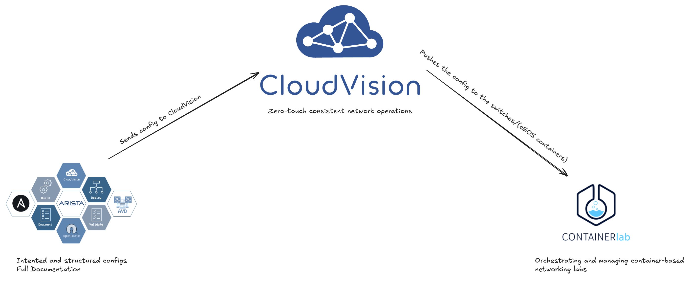


## Arista CloudVision

> CloudVision® is Arista’s modern, multi-domain management platform that leverages cloud networking principles to deliver a simplified NetOps experience. Unlike traditional domain-specific management solutions, CloudVision enables zero-touch network operations with consistent operations enterprise-wide, helping to break down the complexity of siloed management approaches.
>
> As Arista’s platform for Network as-a-Service, CloudVision is designed to bring OpEx efficiency through automation across the entire network lifecycle - from design, to operations, to support and ongoing maintenance.

Source: [Arista](https://www.arista.com/en/products/eos/eos-cloudvision)

As this post is not meant to focus on CloudVision (will be referred to as CVP throughout this post) alone I will just concentrate on the parts in CloudVision that are relevant and differs from my previous [post](https://blog.andreasm.io/2024/06/10/arista-automated-configuration-using-ansible/). 

### CloudVision configlets, containers, tasks and change control

When using CVP in combination with Arista Validated Design (will be referred to as AVD throughout this post) I have much more control on how and when configurations are being sent to my Arista EOS switches. Just to name one, change control and the ability to review and compare configs before approving and pushing the config to the devices. 

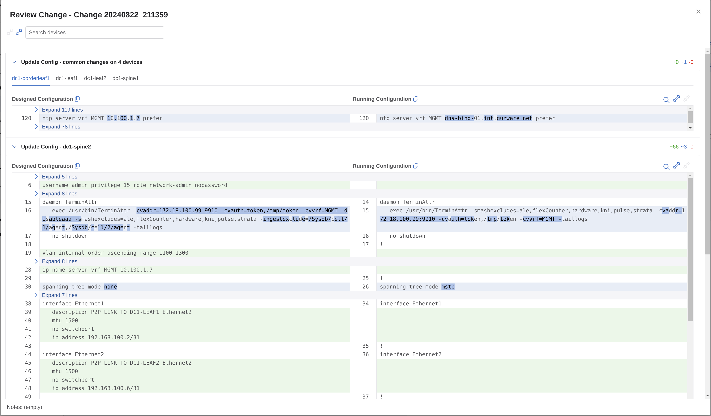


#### EOS in CVP inventory or not 

AVD in itself does not require any actual devices to send the configs to, as it can also be used to solely create configurations and documentation for a planned topology. This is also possible in combination with CVP as this will then create the necessary containers, configlets and tasks in CVP regardless of the devices being in CVPs inventory or not. For more reference on this using AVD see [here](https://avd.arista.com/4.10/roles/eos_config_deploy_cvp/index.html?h=present#ignore-devices-not-provisioned-in-cloudvision).

If I want to also push the config to the EOS switches as a full hands-off automated configuration using CVP and AVD I need to have the EOS switches already in CVPs inventory, otherwise there will be no devices for CVP to send the configs to (kind of obvious). What's not so obvious maybe is that one need to inform AVD whether the devices are already in CVPs inventory or not or else the AVD *playbook deploy-cvp* will fail. 

Adding the EOS switches to CVPs inventory can be done either through the Zero Touch Provisioning (ZTP from here on) of the EOS switches or manually add them to CVP after they have been initially configured. In this post I will be adding the EOS swtiches to the CVP inventory as part of the ZTP. 

#### Change Control and tasks

> The **Change Control** module selects and executes a group of tasks that you want to process simultaneously. Selecting tasks and creating Change Controls function similarly in **Change Control** and **Task Management** modules.
>
> Change Controls provides the following benefits:
>
> - Sequencing tasks
> - Adding unlimited snapshots to every device impacted by the Change Control execution
> - Adding custom actions
> - Pushing images via Multi-Chassis Link Aggregation (MLAG) In-Service Software Upgrade (ISSU) or Border Gateway Protocol (BGP) maintenance mode
> - Reviewing the entire set of changes to approve Change Controls


Even with the devices added to CVPs inventory I have a choice whether I want the config to be automatically approved and pushed to the devices when I run *playbook-ansible deploy-cvp.yml* or if I just want the task to be configured and wait for a change manager to review and approve before the config is pushed. This is a very useful and powerful feature in a production environment. 

To control how AVD is handling this is described [here](https://avd.arista.com/4.10/roles/eos_config_deploy_cvp/index.html?h=present#role-variables), the key *execute= false or true* in the *deploy-cvp.yaml*. If the latter is configured with false, AVD will instruct CVP to only create the configlets, containers and tasks. The tasks will be in a pending state until the change manager creates a task and approve or rejects it. 

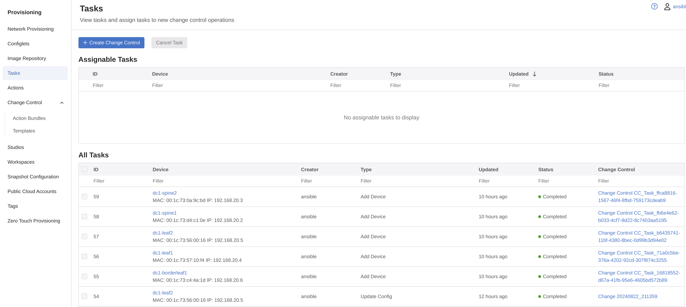

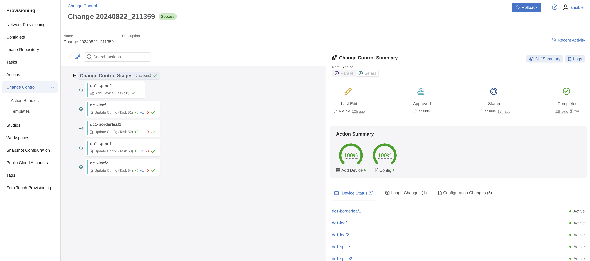


#### Containers and configlets

In CVP the switches can be put into respective containers. In combination with AVD these containers are being created automatically and the switches are moved into their container based on their group membership in the *inventory.yml*

```yaml
    FABRIC:
      children:
        DC1:
          children:
            DC1_SPINES:
              hosts:
                dc1-spine1:
                  ansible_host: 192.168.20.2
                dc1-spine2:
                  ansible_host: 192.168.20.3
            DC1_L3_LEAVES:
              hosts:
                dc1-leaf1:
                  ansible_host: 192.168.20.4
                dc1-leaf2:
                  ansible_host: 192.168.20.5
                dc1-borderleaf1:
                  ansible_host: 192.168.20.6

```

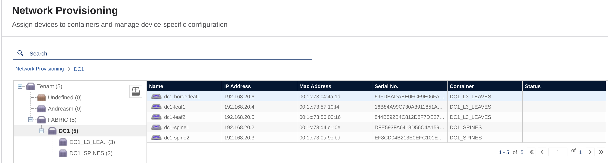

If the EOS switches are being added manually or as part of the ZTP they will be automatically placed in the *Undefined* container and when AVD creates the task and it is approved they will be moved from there to their container accordingly. 

AVD will create the intended configuration under Configlets:

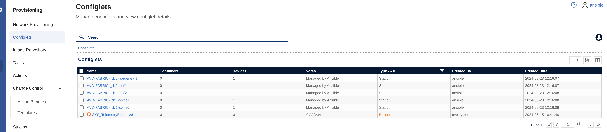

These contains the configs CVP will use to push to the respective devices, which can be easily inspected by just clicking on one of them:

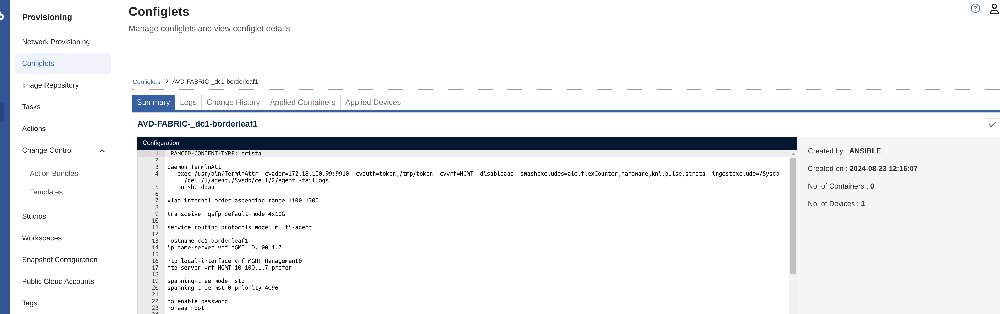


## Containerlab

Now onto the next gem in this post, [Containerlab](https://containerlab.dev/)

> With the growing number of containerized Network Operating Systems grows the demand to easily run them in the user-defined, versatile lab topologies.
>
> Unfortunately, container orchestration tools like docker-compose are not a good fit for that purpose, as they do not allow a user to easily create connections between the containers which define a topology.
>
> Containerlab provides a CLI for orchestrating and managing container-based networking labs. It starts the containers, builds a virtual wiring between them to create lab topologies of users choice and manages labs lifecycle.

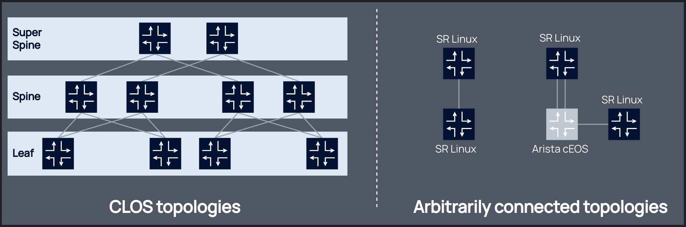

Source: [Containerlab](https://containerlab.dev/)

To get started with Containerlab couldn't be more simple. Probably one of the easiest project out there to get started with.

In my lab I have prepared a Ubuntu virtual machine with some disk, 8 CPU and 16GB of ram (this could probably be reduces to a much smaller spec, but I have the resources available for it). 

On my clean ubuntu machine, I just had to run this script provided by Containerlab to prepare and install everything needed (including Docker). 

```bash
curl -sL https://containerlab.dev/setup | sudo -E bash -s "all"
```

Thats it, after a couple of minutes it is ready. All I need now is to grab my cEOS image and upload it to my local Docker image registry (same host as Containerlab is installed).

Containerlab supports a bunch of network operating system containers, like cEOS, and there is ofcourse a lot of options, configuration possibilites and customization that can be done. I recommend Containerlab highly and the documentation provided on the page is very good. All the info I needed to get started was provided in the Containerlab documentation. 

## Getting the lab up and running

My intention is to deploy 5 cEOS containers to form my spine-leaf topology, like this:

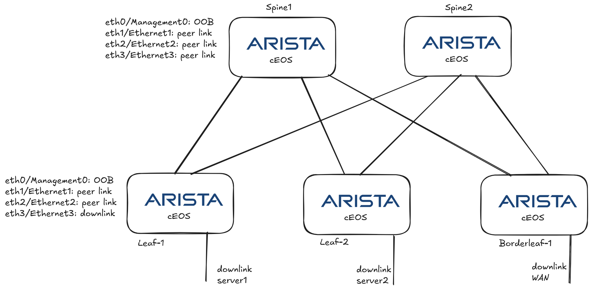


### Prepare Containerlab to deploy my cEOS containers and desired topology

To get started with cEOS in Containerlab I have to download the cEOS image to my VM running Containerlab. Then I need to upload it to the local Docker image registry. 

```bash
andreasm@containerlab:~$ docker import cEOS-lab-4.32.2F.tar.xz ceos:4.32.2F
andreasm@containerlab:~$ docker images
REPOSITORY   TAG       IMAGE ID       CREATED      SIZE
ceos         4.32.2F   deaae9fc39b3   3 days ago   2.09GB
```

When the image is available locally I can start creating my Containerlab Topology file:

```yaml
name: spine-leaf-borderleaf

mgmt:
  network: custom_mgmt                # management network name
  ipv4-subnet: 192.168.20.0/24       # ipv4 range

topology:
  nodes:
    node-1:
      kind: arista_ceos
      image: ceos:4.32.2F
      startup-config: node1-startup-config.cfg
      mgmt-ipv4: 192.168.20.2
    node-2:
      kind: arista_ceos
      image: ceos:4.32.2F
      startup-config: node2-startup-config.cfg
      mgmt-ipv4: 192.168.20.3
    node-3:
      kind: arista_ceos
      image: ceos:4.32.2F
      startup-config: node3-startup-config.cfg
      mgmt-ipv4: 192.168.20.4
    node-4:
      kind: arista_ceos
      image: ceos:4.32.2F
      startup-config: node4-startup-config.cfg
      mgmt-ipv4: 192.168.20.5
    node-5:
      kind: arista_ceos
      image: ceos:4.32.2F
      startup-config: node5-startup-config.cfg
      mgmt-ipv4: 192.168.20.6
    br-node-3:
      kind: bridge
    br-node-4:
      kind: bridge
    br-node-5:
      kind: bridge

  links:
    - endpoints: ["node-3:eth1", "node-1:eth1"]
    - endpoints: ["node-3:eth2", "node-2:eth1"]
    - endpoints: ["node-4:eth1", "node-1:eth2"]
    - endpoints: ["node-4:eth2", "node-2:eth2"]
    - endpoints: ["node-5:eth1", "node-1:eth3"]
    - endpoints: ["node-5:eth2", "node-2:eth3"]
    - endpoints: ["node-3:eth3", "br-node-3:n3-eth3"]
    - endpoints: ["node-4:eth3", "br-node-4:n4-eth3"]
    - endpoints: ["node-5:eth3", "br-node-5:n5-eth3"]

```

A short explanation to the above yaml. I define a custom management network for the cEOS oob Management0 interface, then I add all my nodes, defining a static management ip pr node. I also point to a startup config that provides the necessary minimum config for my cEOS'es. I will provide the output of the configs further down. Then I have added 3 bridges, these are being used for the downlinks on the leaves for client/server/vm connectivity later on. The links section defines how the cEOS "interconnect" with each other. This linking is taken care of by Containerlab. I only need to define which interfaces from which nodes that links to which interface on the other nodes. These links are my "peer-links". Then I have the *br-node* links that just links to these *br-node-x* bridges created in my os like this:

```bash
andreasm@containerlab:~$ sudo ip link add name br-node-3 type bridge
andreasm@containerlab:~$ sudo ip link set br-node-3 up
```

Below is my startup-config for each cEOS:

```bash
!
daemon TerminAttr
   exec /usr/bin/TerminAttr -cvaddr=172.18.100.99:9910 -cvauth=token,/tmp/token -cvvrf=MGMT -disableaaa -smashexcludes=ale,flexCounter,hardware,kni,pulse,strata -ingestexclude=/Sysdb/cell/1/agent,/Sysdb/cell/2/agent -taillogs
   no shutdown
!
hostname dc1-spine1
!
! Configures username and password for the ansible user
username ansible privilege 15 role network-admin secret sha512 $4$redacted/
!
! Defines the VRF for MGMT
vrf instance MGMT
!
! Defines the settings for the Management1 interface through which Ansible reaches the device
interface Management0 # Note the Management0 here.. not 1
   description oob_management
   no shutdown
   vrf MGMT
   ! IP address - must be set uniquely per device
   ip address 192.168.20.2/24
!
! Static default route for VRF MGMT
ip route vrf MGMT 0.0.0.0/0 192.168.20.1
!
! Enables API access in VRF MGMT
management api http-commands
   protocol https
   no shutdown
   !
   vrf MGMT
      no shutdown
!
end
!
! Save configuration to flash
copy running-config startup-config

```

The startup config above includes the config for adding them to my CVP inventory, *daemon TerminAttr*.

Now it is time to deploy my lab. Let see how this goes :smile:

```bash
andreasm@containerlab:~/containerlab/lab-spine-leaf-cvp$ sudo containerlab deploy -t spine-leaf-border.yaml 
INFO[0000] Containerlab v0.56.0 started                 
INFO[0000] Parsing & checking topology file: spine-leaf-border.yaml 
INFO[0000] Creating docker network: Name="custom_mgmt", IPv4Subnet="192.168.20.0/24", IPv6Subnet="", MTU=0 
INFO[0000] Creating lab directory: /home/andreasm/containerlab/lab-spine-leaf-cvp/clab-spine-leaf-borderleaf 
INFO[0000] Creating container: "node-1"                 
INFO[0000] Creating container: "node-5"                 
INFO[0000] Creating container: "node-3"                 
INFO[0000] Creating container: "node-4"                 
INFO[0000] Creating container: "node-2"                 
INFO[0001] Running postdeploy actions for Arista cEOS 'node-5' node 
INFO[0001] Created link: node-5:eth3 <--> br-node-5:n5-eth3 
INFO[0001] Created link: node-4:eth1 <--> node-1:eth2   
INFO[0001] Created link: node-3:eth1 <--> node-1:eth1   
INFO[0001] Created link: node-4:eth2 <--> node-2:eth2   
INFO[0001] Created link: node-3:eth2 <--> node-2:eth1   
INFO[0001] Created link: node-5:eth1 <--> node-1:eth3   
INFO[0001] Running postdeploy actions for Arista cEOS 'node-1' node 
INFO[0001] Created link: node-4:eth3 <--> br-node-4:n4-eth3 
INFO[0001] Running postdeploy actions for Arista cEOS 'node-4' node 
INFO[0001] Created link: node-3:eth3 <--> br-node-3:n3-eth3 
INFO[0001] Running postdeploy actions for Arista cEOS 'node-3' node 
INFO[0001] Created link: node-5:eth2 <--> node-2:eth3   
INFO[0001] Running postdeploy actions for Arista cEOS 'node-2' node 
INFO[0050] Adding containerlab host entries to /etc/hosts file 
INFO[0050] Adding ssh config for containerlab nodes     
INFO[0050] 🎉 New containerlab version 0.57.0 is available! Release notes: https://containerlab.dev/rn/0.57/
Run 'containerlab version upgrade' to upgrade or go check other installation options at https://containerlab.dev/install/ 
+---+-----------------------------------+--------------+--------------+-------------+---------+-----------------+--------------+
| # |               Name                | Container ID |    Image     |    Kind     |  State  |  IPv4 Address   | IPv6 Address |
+---+-----------------------------------+--------------+--------------+-------------+---------+-----------------+--------------+
| 1 | clab-spine-leaf-borderleaf-node-1 | 9947cd235370 | ceos:4.32.2F | arista_ceos | running | 192.168.20.2/24 | N/A          |
| 2 | clab-spine-leaf-borderleaf-node-2 | 2051bdcc81e6 | ceos:4.32.2F | arista_ceos | running | 192.168.20.3/24 | N/A          |
| 3 | clab-spine-leaf-borderleaf-node-3 | 0b6ef17f29e8 | ceos:4.32.2F | arista_ceos | running | 192.168.20.4/24 | N/A          |
| 4 | clab-spine-leaf-borderleaf-node-4 | f88bfe335603 | ceos:4.32.2F | arista_ceos | running | 192.168.20.5/24 | N/A          |
| 5 | clab-spine-leaf-borderleaf-node-5 | a1f6eff1bd18 | ceos:4.32.2F | arista_ceos | running | 192.168.20.6/24 | N/A          |
+---+-----------------------------------+--------------+--------------+-------------+---------+-----------------+--------------+
andreasm@containerlab:~/containerlab/lab-spine-leaf-cvp$ 

```

Wow, a new version of Containerlab is out...  

After a minute or two The cEOS containers are up and running it seems. Lets see if I can log into one of them. 

```bash
andreasm@containerlab:~/containerlab/lab-spine-leaf-cvp$ ssh ansible@192.168.20.2
(ansible@192.168.20.2) Password: 
dc1-spine1>
dc1-spine1>en
dc1-spine1#configure 
dc1-spine1(config)#show running-config 
! Command: show running-config
! device: dc1-spine1 (cEOSLab, EOS-4.32.2F-38195967.4322F (engineering build))
!
no aaa root
!
username ansible privilege 15 role network-admin secret sha512 $6redactedxMEEocchsdf/
!
management api http-commands
   no shutdown
   !
   vrf MGMT
      no shutdown
!
daemon TerminAttr
   exec /usr/bin/TerminAttr -cvaddr=172.18.100.99:9910 -cvauth=token,/tmp/token -cvvrf=MGMT -disableaaa -smashexcludes=ale,flexCounter,hardware,kni,pulse,strata -ingestexclude=/Sysdb/cell/1/agent,/Sysdb/cell/2/agent -taillogs
   no shutdown
!
no service interface inactive port-id allocation disabled
!
transceiver qsfp default-mode 4x10G
!
service routing protocols model multi-agent
!
hostname dc1-spine1
!
spanning-tree mode mstp
!
system l1
   unsupported speed action error
   unsupported error-correction action error
!
vrf instance MGMT
!
interface Ethernet1
!
interface Ethernet2
!
interface Ethernet3
!
interface Management0
   description oob_management
   vrf MGMT
   ip address 192.168.20.2/24
!
no ip routing
no ip routing vrf MGMT
!
ip route vrf MGMT 0.0.0.0/0 192.168.20.1
!
router multicast
   ipv4
      software-forwarding kernel
   !
   ipv6
      software-forwarding kernel
!
end
dc1-spine1(config)#

```

 This is really nice, now did something happen in my CVP?

Before I started my lab, this was the view in my CVP:

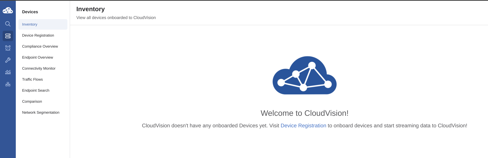

Now, lets go in and check again:

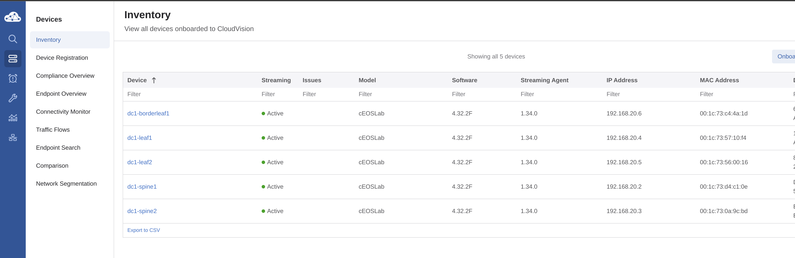

Alright, my lab is up. But I am missing the full config ofcourse. They have just been deployed, but no connections, peerings etc have been made. 

Back to Containerlab. There is one command I would like to test out, *containerlab graph -t topology.yml*. Lets see what this does:

```bash
andreasm@containerlab:~/containerlab/lab-spine-leaf-cvp$ sudo containerlab graph -t spine-leaf-border.yaml 
INFO[0000] Parsing & checking topology file: spine-leaf-border.yaml 
INFO[0000] Serving static files from directory: /etc/containerlab/templates/graph/nextui/static 
INFO[0000] Serving topology graph on http://0.0.0.0:50080 

```

Lets open my browser:

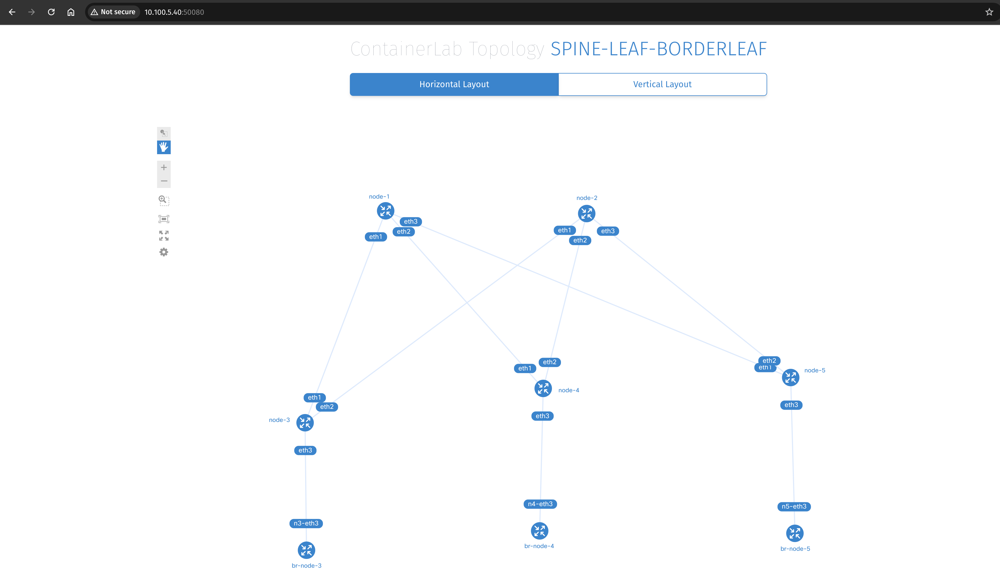

A full topology layout, including the bridge interfaces!!!! NICE


### Preparing Arista Validated Design to use CVP

I will not go through all the files I have edited in my AVD project folder as most of them are identical to my previous [post](https://blog.andreasm.io/2024/06/10/arista-automated-configuration-using-ansible/#preparing-avd-example-files) but will reflect upon the changes for using CVP instead of directly to the EOS switches in the relevant file. I have commented under which files needs to be updated, and provide my examples. The rest is not shown or done any changes on. 

Below is the files I need to edit in general for AVD to deploy my desired single DC L3LS spine-leaf topology. 

```bash
├── ansible.cfg
├── deploy-cvp.yml # execute false or true  
├── group_vars/
│ ├── CONNECTED_ENDPOINTS.yml # untouched
│ ├── DC1_L2_LEAVES.yml # untouched
│ ├── DC1_L3_LEAVES.yml # untouched
│ ├── DC1_SPINES.yml # untouched
│ ├── DC1.yml # added "mgmt_interface: Management0" and updated dict-of-dicts to list-of-dicts
│ ├── FABRIC.yml # This needs to reflect on my CVP endpoint
│ └── NETWORK_SERVICES.yml # untouched
├── inventory.yml # This needs to reflect my CVP configuration

```

In the *deploy-cvp.yml* I need to edit *execute_tasks* If I want to execute the tasks directly from AVD in CVP or not. I have disabled execution of the task (default) as I want to show how it looks like in CVP.

```yaml
---
- name: Deploy Configurations to Devices Using CloudVision Portal # (1)!
  hosts: CLOUDVISION
  gather_facts: false
  connection: local
  tasks:

    - name: Deploy Configurations to CloudVision # (2)!
      ansible.builtin.import_role:
        name: arista.avd.eos_config_deploy_cvp
      vars:
        cv_collection: v3 # (3)!
        fabric_name: FABRIC # (4)!
        execute_tasks: false

```

In the *inventory.yml* the CVP relevant section is added. (it is in there by default, but I removed it in previous post as I did not use it)

```yaml
---
all:
  children:
    CLOUDVISION:
      hosts:
        cvp:
          # Ansible variables used by the ansible_avd and ansible_cvp roles to push configuration to devices via CVP
          ansible_host: cvp-01.domain.net
          ansible_httpapi_host: cvp-01.domain.net
          ansible_user: ansible
          ansible_password: password
          ansible_connection: httpapi
          ansible_httpapi_use_ssl: true
          ansible_httpapi_validate_certs: false
          ansible_network_os: eos
          ansible_httpapi_port: 443
          ansible_python_interpreter: $(which python3)


    FABRIC:
      children:
        DC1:
          children:
            DC1_SPINES:
              hosts:
                dc1-spine1:
                  ansible_host: 192.168.20.2
                dc1-spine2:
                  ansible_host: 192.168.20.3
            DC1_L3_LEAVES:
              hosts:
                dc1-leaf1:
                  ansible_host: 192.168.20.4
                dc1-leaf2:
                  ansible_host: 192.168.20.5
                dc1-borderleaf1:
                  ansible_host: 192.168.20.6

    NETWORK_SERVICES:
      children:
        DC1_L3_LEAVES:
    CONNECTED_ENDPOINTS:
      children:
        DC1_L3_LEAVES:

```


DC1.yml is updated to reflect the coming deprecation of dict-of-dicts to list-of-dicts and added the *mgmt_interface: Management0*.

```yaml
---
# Default gateway used for the management interface
mgmt_gateway: 192.168.0.1
mgmt_interface: Management0


# Spine switch group
spine:
  # Definition of default values that will be configured to all nodes defined in this group
  defaults:
    # Set the relevant platform as each platform has different default values in Ansible AVD
    platform: cEOS-lab
    # Pool of IPv4 addresses to configure interface Loopback0 used for BGP EVPN sessions
    loopback_ipv4_pool: 192.168.0.0/27
    # ASN to be used by BGP
    bgp_as: 65100

  # Definition of nodes contained in this group.
  # Specific configuration of device must take place under the node definition. Each node inherits all values defined under 'defaults'
  nodes:
    # Name of the node to be defined (must be consistent with definition in inventory)
    - name: dc1-spine1
      # Device ID definition. An integer number used for internal calculations (ie. IPv4 address of the loopback_ipv4_pool among others)
      id: 1
      # Management IP to be assigned to the management interface
      mgmt_ip: 192.168.20.2/24

    - name: dc1-spine2
      id: 2
      mgmt_ip: 192.168.20.3/24

# L3 Leaf switch group
l3leaf:
  defaults:
    # Set the relevant platform as each platform has different default values in Ansible AVD
    platform: cEOS-lab
    # Pool of IPv4 addresses to configure interface Loopback0 used for BGP EVPN sessions
    loopback_ipv4_pool: 192.168.0.0/27
    # Offset all assigned loopback IP addresses.
    # Required when the < loopback_ipv4_pool > is same for 2 different node_types (like spine and l3leaf) to avoid over-lapping IPs.
    # For example, set the minimum offset l3leaf.defaults.loopback_ipv4_offset: < total # spine switches > or vice versa.
    loopback_ipv4_offset: 2
    # Definition of pool of IPs to be used as Virtual Tunnel EndPoint (VXLAN origin and destination IPs)
    vtep_loopback_ipv4_pool: 192.168.1.0/27
    # Ansible hostname of the devices used to establish neighborship (IP assignments and BGP peering)
    uplink_switches: ['dc1-spine1', 'dc1-spine2']
    # Definition of pool of IPs to be used in P2P links
    uplink_ipv4_pool: 192.168.100.0/26
    # Definition of pool of IPs to be used for MLAG peer-link connectivity
    #mlag_peer_ipv4_pool: 10.255.1.64/27
    # iBGP Peering between MLAG peers
    #mlag_peer_l3_ipv4_pool: 10.255.1.96/27
    # Virtual router mac for VNIs assigned to Leaf switches in format xx:xx:xx:xx:xx:xx
    virtual_router_mac_address: 00:1c:73:00:00:99
    spanning_tree_priority: 4096
    spanning_tree_mode: mstp

  # If two nodes (and only two) are in the same node_group, they will automatically form an MLAG pair
  node_groups:
    # Definition of a node group that will include two devices in MLAG.
    # Definitions under the group will be inherited by both nodes in the group
    - group: DC1_L3_LEAF1
      # ASN to be used by BGP for the group. Both devices in the MLAG pair will use the same BGP ASN
      bgp_as: 65101
      nodes:
        # Definition of hostnames under the node_group
        - name: dc1-leaf1
          id: 1
          mgmt_ip: 192.168.20.4/24
          # Definition of the port to be used in the uplink device facing this device.
          # Note that the number of elements in this list must match the length of 'uplink_switches' as well as 'uplink_interfaces'
          uplink_switch_interfaces:
            - Ethernet1
            - Ethernet1
    # Definition of a node group that will include two devices in MLAG.
    # Definitions under the group will be inherited by both nodes in the group
    - group: DC1_L3_LEAF2
      # ASN to be used by BGP for the group. Both devices in the MLAG pair will use the same BGP ASN
      bgp_as: 65102
      nodes:
        # Definition of hostnames under the node_group
        - name: dc1-leaf2
          id: 2
          mgmt_ip: 192.168.20.5/24
          uplink_switch_interfaces:
            - Ethernet2
            - Ethernet2
    # Definition of a node group that will include two devices in MLAG.
    # Definitions under the group will be inherited by both nodes in the group
    - group: DC1_L3_BORDERLEAF1
      # ASN to be used by BGP for the group. Both devices in the MLAG pair will use the same BGP ASN
      bgp_as: 65102
      nodes:
        # Definition of hostnames under the node_group
        - name: dc1-borderleaf1
          id: 3
          mgmt_ip: 192.168.20.6/24
          uplink_switch_interfaces:
            - Ethernet3
            - Ethernet3

```

That should be it. Now it is time to run two playbooks: build.yml to create the documentation and intended configs and any errors. Then I will execute the *deploy-cvp.yml* playbook to push the config and tasks to CVP. Lets see whats going to happen. 


<div style="border-left: 4px solid #2196F3; background-color: #E3F2FD; padding: 10px; margin: 10px 0; color: #0000FF;"> <strong>Info:</strong>
For AVD and CVP to reach my cEOS containers I have created a static route in my physical router like this: *ip route 192.168.0.0/24 10.100.5.40* (ip of my Containerlab host/vm) 
 </div>


<div style="border-left: 4px solid #2196F3; background-color: #E3F2FD; padding: 10px; margin: 10px 0; color: #0000FF;"> <strong>Info:</strong>
A note on the virtual network adapters for the cEOS appliances.The Management interface is Management0 not Management1, this needs to be reflected in the AVD configs by adding "mgmt_interface: Management0" in the DC1.yaml
</div>


Since my previous post, AVD has been upgraded to version 4.10, latest version in time of writing this post. I have also updated my *yamls* to accomodate this coming deprecation:

```bash
[DEPRECATION WARNING]: [dc1-spine1]: The input data model 'dict-of-dicts to list-of-dicts 
automatic conversion' is deprecated. See 'https://avd.arista.com/stable/docs/porting-
guides/4.x.x.html#data-model-changes-from-dict-of-dicts-to-list-of-dicts' for details. This 
feature will be removed from arista.avd.eos_designs in version 5.0.0. Deprecation warnings can be 
disabled by setting deprecation_warnings=False in ansible.cfg.

```


**build.yml**

```bash
(clab01) andreasm@linuxmgmt10:~/containerlab/clab01/single-dc-l3ls$ ansible-playbook build.yml 

PLAY [Build Configurations and Documentation] *****************************************************

TASK [arista.avd.eos_designs : Verify Requirements] ***********************************************
AVD version 4.10.0
Use -v for details.
ok: [dc1-spine1 -> localhost]

TASK [arista.avd.eos_designs : Create required output directories if not present] *****************
ok: [dc1-spine1 -> localhost] => (item=/home/andreasm/containerlab/clab01/single-dc-l3ls/intended/structured_configs)
ok: [dc1-spine1 -> localhost] => (item=/home/andreasm/containerlab/clab01/single-dc-l3ls/documentation/fabric)

TASK [arista.avd.eos_designs : Set eos_designs facts] *********************************************
ok: [dc1-spine1]

TASK [arista.avd.eos_designs : Generate device configuration in structured format] ****************
changed: [dc1-leaf2 -> localhost]
changed: [dc1-borderleaf1 -> localhost]
changed: [dc1-spine1 -> localhost]
changed: [dc1-spine2 -> localhost]
changed: [dc1-leaf1 -> localhost]

TASK [arista.avd.eos_designs : Generate fabric documentation] *************************************
changed: [dc1-spine1 -> localhost]

TASK [arista.avd.eos_designs : Generate fabric point-to-point links summary in csv format.] *******
changed: [dc1-spine1 -> localhost]

TASK [arista.avd.eos_designs : Generate fabric topology in csv format.] ***************************
changed: [dc1-spine1 -> localhost]

TASK [arista.avd.eos_designs : Remove avd_switch_facts] *******************************************
ok: [dc1-spine1]

TASK [arista.avd.eos_cli_config_gen : Verify Requirements] ****************************************
skipping: [dc1-spine1]

TASK [arista.avd.eos_cli_config_gen : Generate eos intended configuration and device documentation] ***
changed: [dc1-spine2 -> localhost]
changed: [dc1-spine1 -> localhost]
changed: [dc1-leaf2 -> localhost]
changed: [dc1-leaf1 -> localhost]
changed: [dc1-borderleaf1 -> localhost]

PLAY RECAP ****************************************************************************************
dc1-borderleaf1            : ok=2    changed=2    unreachable=0    failed=0    skipped=0    rescued=0    ignored=0   
dc1-leaf1                  : ok=2    changed=2    unreachable=0    failed=0    skipped=0    rescued=0    ignored=0   
dc1-leaf2                  : ok=2    changed=2    unreachable=0    failed=0    skipped=0    rescued=0    ignored=0   
dc1-spine1                 : ok=9    changed=5    unreachable=0    failed=0    skipped=1    rescued=0    ignored=0   
dc1-spine2                 : ok=2    changed=2    unreachable=0    failed=0    skipped=0    rescued=0    ignored=0   

```


This went well. Nothing has happened in CVP yet. Thats next...

Now it is time to run *deploy-cvp.yml*

**deploy-cvp.yml**

```bash
(clab01) andreasm@linuxmgmt10:~/containerlab/clab01/single-dc-l3ls$ ansible-playbook deploy-cvp.yml 

PLAY [Deploy Configurations to Devices Using CloudVision Portal] **********************************

TASK [arista.avd.eos_config_deploy_cvp : Create required output directories if not present] *******
ok: [cvp -> localhost] => (item=/home/andreasm/containerlab/clab01/single-dc-l3ls/intended/structured_configs/cvp)

TASK [arista.avd.eos_config_deploy_cvp : Verify Requirements] *************************************
AVD version 4.10.0
Use -v for details.
ok: [cvp -> localhost]

TASK [arista.avd.eos_config_deploy_cvp : Start creation/update process.] **************************
included: /home/andreasm/.ansible/collections/ansible_collections/arista/avd/roles/eos_config_deploy_cvp/tasks/v3/main.yml for cvp

TASK [arista.avd.eos_config_deploy_cvp : Generate intended variables] *****************************
ok: [cvp]

TASK [arista.avd.eos_config_deploy_cvp : Build DEVICES and CONTAINER definition for cvp] **********
changed: [cvp -> localhost]

TASK [arista.avd.eos_config_deploy_cvp : Start creation/update process.] **************************
included: /home/andreasm/.ansible/collections/ansible_collections/arista/avd/roles/eos_config_deploy_cvp/tasks/v3/present.yml for cvp

TASK [arista.avd.eos_config_deploy_cvp : Load CVP device information for cvp] *********************
ok: [cvp]

TASK [arista.avd.eos_config_deploy_cvp : Create configlets on CVP cvp.] ***************************
changed: [cvp]

TASK [arista.avd.eos_config_deploy_cvp : Execute any configlet generated tasks to update configuration on cvp] ***
skipping: [cvp]

TASK [arista.avd.eos_config_deploy_cvp : Building Containers topology on cvp] *********************
changed: [cvp]

TASK [arista.avd.eos_config_deploy_cvp : Execute pending tasks on cvp] ****************************
skipping: [cvp]

TASK [arista.avd.eos_config_deploy_cvp : Configure devices on cvp] ********************************
changed: [cvp]

TASK [arista.avd.eos_config_deploy_cvp : Execute pending tasks on cvp] ****************************
skipping: [cvp]

PLAY RECAP ****************************************************************************************
cvp                        : ok=10   changed=4    unreachable=0    failed=0    skipped=3    rescued=0    ignored=0   

```

That went without any issues. 

### Whats happening in CVP

Before I ran my playbook above, this was the content in the below sections:

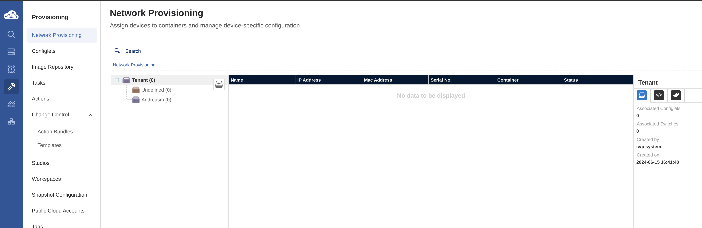

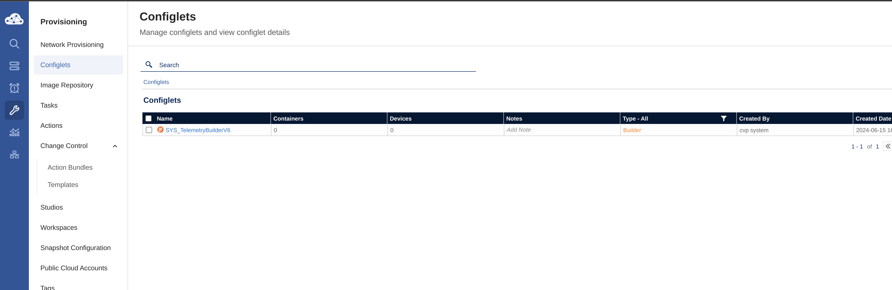

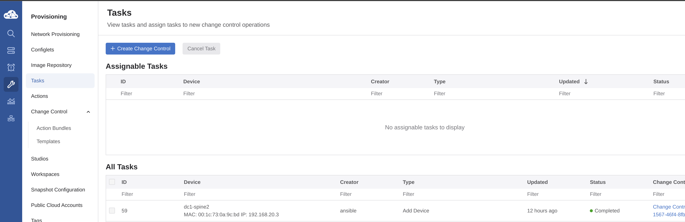

Now after I have ran my playbook:

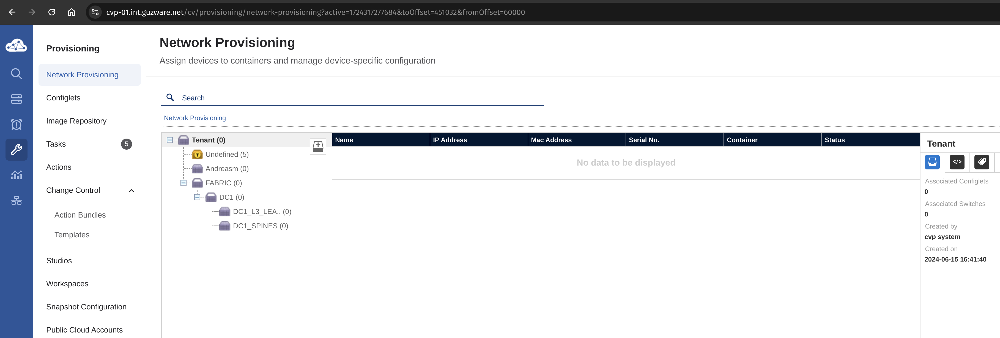

I can see some new containers, and 5 tasks

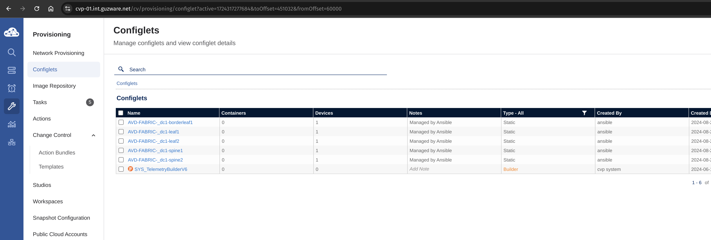

New configlets have been added. 

Lets have a look at the tasks.

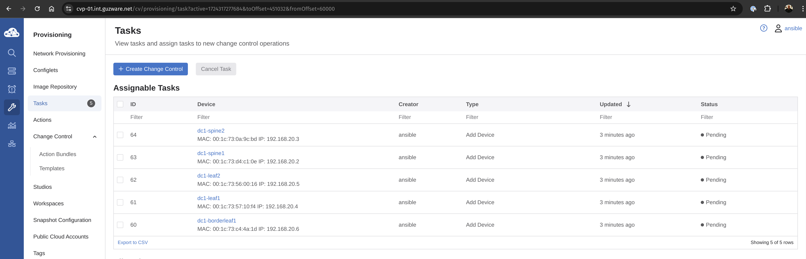

I have indeed 5 tasks pending. Let me inspect one of them before I decide to approve them or not. 

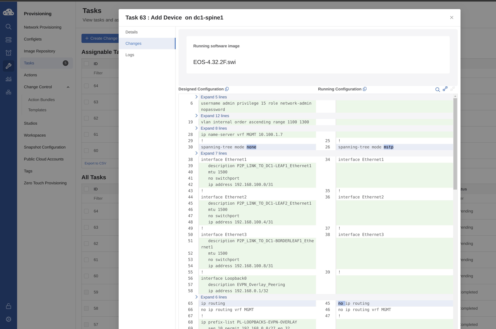

The Designed Configuration certainly looks more interesting than the Running Configuration. So I think I will approve these tasks indeed. 

I need to then create a Change Control, and to do it as simple as possible I will select all 5 tasks and create a single Change Control including all 5 tasks in same. 

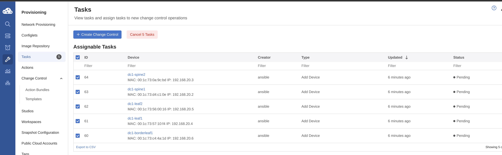

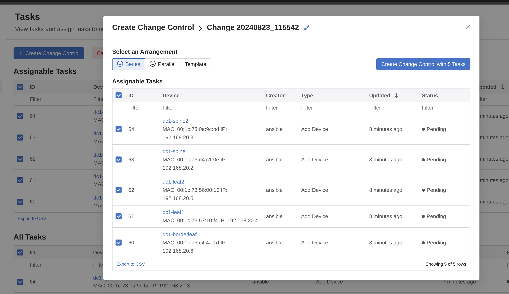

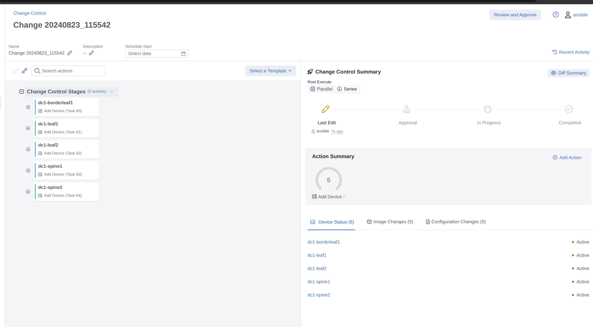

Let me review and hopefully approve

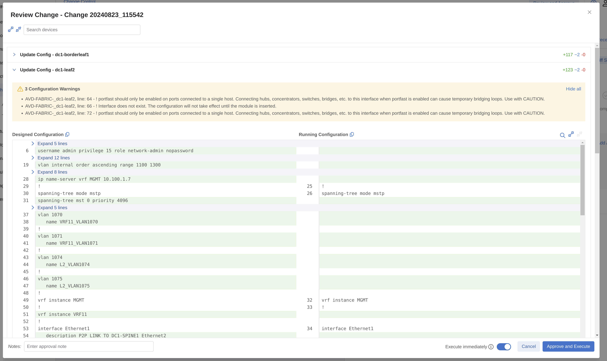

There is a warning there, but I think I will take my chances on those. 

Approve and Execute

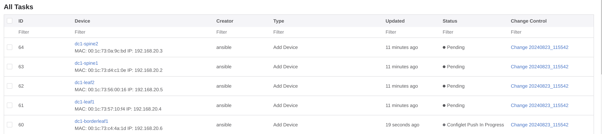

Now my cEOS switches should be getting their configuration. Lets check one of them when the task has been completed. 

All tasks completed, the switches has been placed in their respective containers:

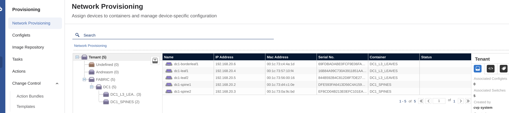

Lets check a switch for the config:


```bash
dc1-borderleaf1#show running-config 
! Command: show running-config
! device: dc1-borderleaf1 (cEOSLab, EOS-4.32.2F-38195967.4322F (engineering build))
!
no aaa root
!
username admin privilege 15 role network-admin nopassword
username ansible privilege 15 role network-admin secret sha512 $4$redactedxMEEoccYHS/
!
management api http-commands
   no shutdown
   !
   vrf MGMT
      no shutdown
!
daemon TerminAttr
   exec /usr/bin/TerminAttr -cvaddr=172.18.100.99:9910 -cvauth=token,/tmp/token -cvvrf=MGMT -disableaaa -smashexcludes=ale,flexCounter,hardware,kni,pulse,strata -ingestexclude=/Sysdb/cell/1/agent,/Sysdb/cell/2/agent -taillogs
   no shutdown
!
vlan internal order ascending range 1100 1300
!
no service interface inactive port-id allocation disabled
!
transceiver qsfp default-mode 4x10G
!
service routing protocols model multi-agent
!
hostname dc1-borderleaf1
ip name-server vrf MGMT 10.100.1.7
!
spanning-tree mode mstp
spanning-tree mst 0 priority 4096
!
system l1
   unsupported speed action error
   unsupported error-correction action error
!
vlan 1070
   name VRF11_VLAN1070
!
vlan 1071
   name VRF11_VLAN1071
!
vlan 1074
   name L2_VLAN1074
!
vlan 1075
   name L2_VLAN1075
!
vrf instance MGMT
!
vrf instance VRF11
!
interface Ethernet1
   description P2P_LINK_TO_DC1-SPINE1_Ethernet3
   mtu 1500
   no switchport
   ip address 192.168.100.9/31
!
interface Ethernet2
   description P2P_LINK_TO_DC1-SPINE2_Ethernet3
   mtu 1500
   no switchport
   ip address 192.168.100.11/31
!
interface Ethernet3
   description dc1-borderleaf1-wan1_WAN1
!
interface Loopback0
   description EVPN_Overlay_Peering
   ip address 192.168.0.5/32
!
interface Loopback1
   description VTEP_VXLAN_Tunnel_Source
   ip address 192.168.1.5/32
!
interface Loopback11
   description VRF11_VTEP_DIAGNOSTICS
   vrf VRF11
   ip address 192.168.11.5/32
!
interface Management0
   description oob_management
   vrf MGMT
   ip address 192.168.20.6/24
!
interface Vlan1070
   description VRF11_VLAN1070
   vrf VRF11
   ip address virtual 10.70.0.1/24
!
interface Vlan1071
   description VRF11_VLAN1071
   vrf VRF11
   ip address virtual 10.71.0.1/24
!
interface Vxlan1
   description dc1-borderleaf1_VTEP
   vxlan source-interface Loopback1
   vxlan udp-port 4789
   vxlan vlan 1070 vni 11070
   vxlan vlan 1071 vni 11071
   vxlan vlan 1074 vni 11074
   vxlan vlan 1075 vni 11075
   vxlan vrf VRF11 vni 11
!
ip virtual-router mac-address 00:1c:73:00:00:99
ip address virtual source-nat vrf VRF11 address 192.168.11.5
!
ip routing
no ip routing vrf MGMT
ip routing vrf VRF11
!
ip prefix-list PL-LOOPBACKS-EVPN-OVERLAY
   seq 10 permit 192.168.0.0/27 eq 32
   seq 20 permit 192.168.1.0/27 eq 32
!
ip route vrf MGMT 0.0.0.0/0 192.168.20.1
!
ntp local-interface vrf MGMT Management0
ntp server vrf MGMT 10.100.1.7 prefer
!
route-map RM-CONN-2-BGP permit 10
   match ip address prefix-list PL-LOOPBACKS-EVPN-OVERLAY
!
router bfd
   multihop interval 300 min-rx 300 multiplier 3
!
router bgp 65102
   router-id 192.168.0.5
   update wait-install
   no bgp default ipv4-unicast
   maximum-paths 4 ecmp 4
   neighbor EVPN-OVERLAY-PEERS peer group
   neighbor EVPN-OVERLAY-PEERS update-source Loopback0
   neighbor EVPN-OVERLAY-PEERS bfd
   neighbor EVPN-OVERLAY-PEERS ebgp-multihop 3
   neighbor EVPN-OVERLAY-PEERS password 7 Q4fqtbqcZ7oQuKfuWtNGRQ==
   neighbor EVPN-OVERLAY-PEERS send-community
   neighbor EVPN-OVERLAY-PEERS maximum-routes 0
   neighbor IPv4-UNDERLAY-PEERS peer group
   neighbor IPv4-UNDERLAY-PEERS password 7 7x4B4rnJhZB438m9+BrBfQ==
   neighbor IPv4-UNDERLAY-PEERS send-community
   neighbor IPv4-UNDERLAY-PEERS maximum-routes 12000
   neighbor 192.168.0.1 peer group EVPN-OVERLAY-PEERS
   neighbor 192.168.0.1 remote-as 65100
   neighbor 192.168.0.1 description dc1-spine1
   neighbor 192.168.0.2 peer group EVPN-OVERLAY-PEERS
   neighbor 192.168.0.2 remote-as 65100
   neighbor 192.168.0.2 description dc1-spine2
   neighbor 192.168.100.8 peer group IPv4-UNDERLAY-PEERS
   neighbor 192.168.100.8 remote-as 65100
   neighbor 192.168.100.8 description dc1-spine1_Ethernet3
   neighbor 192.168.100.10 peer group IPv4-UNDERLAY-PEERS
   neighbor 192.168.100.10 remote-as 65100
   neighbor 192.168.100.10 description dc1-spine2_Ethernet3
   redistribute connected route-map RM-CONN-2-BGP
   !
   vlan 1070
      rd 192.168.0.5:11070
      route-target both 11070:11070
      redistribute learned
   !
   vlan 1071
      rd 192.168.0.5:11071
      route-target both 11071:11071
      redistribute learned
   !
   vlan 1074
      rd 192.168.0.5:11074
      route-target both 11074:11074
      redistribute learned
   !
   vlan 1075
      rd 192.168.0.5:11075
      route-target both 11075:11075
      redistribute learned
   !
   address-family evpn
      neighbor EVPN-OVERLAY-PEERS activate
   !
   address-family ipv4
      no neighbor EVPN-OVERLAY-PEERS activate
      neighbor IPv4-UNDERLAY-PEERS activate
   !
   vrf VRF11
      rd 192.168.0.5:11
      route-target import evpn 11:11
      route-target export evpn 11:11
      router-id 192.168.0.5
      redistribute connected
!
router multicast
   ipv4
      software-forwarding kernel
   !
   ipv6
      software-forwarding kernel
!
end
dc1-borderleaf1# 

```

```bash
dc1-borderleaf1# show bgp summary 
BGP summary information for VRF default
Router identifier 192.168.0.5, local AS number 65102
Neighbor                AS Session State AFI/SAFI                AFI/SAFI State   NLRI Rcd   NLRI Acc
-------------- ----------- ------------- ----------------------- -------------- ---------- ----------
192.168.0.1          65100 Established   L2VPN EVPN              Negotiated              7          7
192.168.0.2          65100 Established   L2VPN EVPN              Negotiated              7          7
192.168.100.8        65100 Established   IPv4 Unicast            Negotiated              3          3
192.168.100.10       65100 Established   IPv4 Unicast            Negotiated              3          3
dc1-borderleaf1#show  ip bgp 
BGP routing table information for VRF default
Router identifier 192.168.0.5, local AS number 65102
Route status codes: s - suppressed contributor, * - valid, > - active, E - ECMP head, e - ECMP
                    S - Stale, c - Contributing to ECMP, b - backup, L - labeled-unicast
                    % - Pending best path selection
Origin codes: i - IGP, e - EGP, ? - incomplete
RPKI Origin Validation codes: V - valid, I - invalid, U - unknown
AS Path Attributes: Or-ID - Originator ID, C-LST - Cluster List, LL Nexthop - Link Local Nexthop

          Network                Next Hop              Metric  AIGP       LocPref Weight  Path
 * >      192.168.0.1/32         192.168.100.8         0       -          100     0       65100 i
 * >      192.168.0.2/32         192.168.100.10        0       -          100     0       65100 i
 * >Ec    192.168.0.3/32         192.168.100.8         0       -          100     0       65100 65101 i
 *  ec    192.168.0.3/32         192.168.100.10        0       -          100     0       65100 65101 i
 * >      192.168.0.5/32         -                     -       -          -       0       i
 * >Ec    192.168.1.3/32         192.168.100.8         0       -          100     0       65100 65101 i
 *  ec    192.168.1.3/32         192.168.100.10        0       -          100     0       65100 65101 i
 * >      192.168.1.5/32         -                     -       -          -       0       i
dc1-borderleaf1#show vxlan address-table 
          Vxlan Mac Address Table
----------------------------------------------------------------------

VLAN  Mac Address     Type      Prt  VTEP             Moves   Last Move
----  -----------     ----      ---  ----             -----   ---------
1300  001c.7357.10f4  EVPN      Vx1  192.168.1.3      1       0:03:22 ago
Total Remote Mac Addresses for this criterion: 1
dc1-borderleaf1#

```


All BGP neighbors are peering and connected, VXLAN is up and running. 

Job well done. When it comes to post-updates to the config they can continue to be performed (even should/must) as the changes will then come in to CVP, someone needs to review and approve before they are applied. And by using a declarative approach like AVD there is minimal risk of someone overwriting or overriding the config manually taking the human error out of the picture. 

Again, a note on CVP. There will be another post coming only focusing on CVP. So stay tuned for that one. 

## Connecting generic containers to the cEOS switches

Now that I have my full fabric up and running, I would like to test connectivity between two generic containers running Ubuntu connected to each of their Leaf L3 switch, each on their different VLAN. Containerlabs supports several ways to interact with the network nodes. I decided to go with an easy approach, spin a couple of generic docker containers.  

To deploy a generic Docker container, like Ubuntu, using Containerlab there were two ways I considered to do this. I could go ahead and just create a new Containerlab topology yaml (or several) where I add and define the amunt of nodes I need. Or just add additional nodes to my existing topology yaml with the *kind: linux*. As I already have my spine-leaf lab already running I just created a new topology yaml where I defined my "clients" and where they should be linked. Here is my "client" yaml:

```yaml
name: clients-attached
topology:
  nodes:
    client-1:
      kind: linux
      image: ubuntu:latest
    client-2:
      kind: linux
      image: ubuntu:latest
    br-node-4:
      kind: bridge
    br-node-3:
      kind: bridge
  links:
    - endpoints: ["client-1:eth1","br-node-3:eth4"]
    - endpoints: ["client-2:eth1","br-node-4:eth12"]


```

  If I had added these to my existing topology, I would also gain the benefit of viewing the connection diagram using *containerlab graph*.

Client 1 *eth1* is attached to *br-node-3* bridge eth4, that is the same bridge my *Leaf-1 Ethernet/3 is connected to. Client 2 *eth1* is attached to *br-node-4* bridge eth12, that is the same bridge my *Leaf-1 Ethernet/3 is connected to. The ethx in the bridge is just another free number. 

Then I deployed my new topology containing the two above linux nodes. 

As soon as they were up and running I exec into each and one of them and configured static IP addresses on both their *eth1* interfaces, adding a route on client-1 pointing to client-2s subnet using the eth1 as gateway (the reason is because they will come up with their managment interface eth0, I know it possible to disable that network.). 

Then I could ping from client-1 to client-2 and vice versa. Connectivity wise here is how they are now connected:

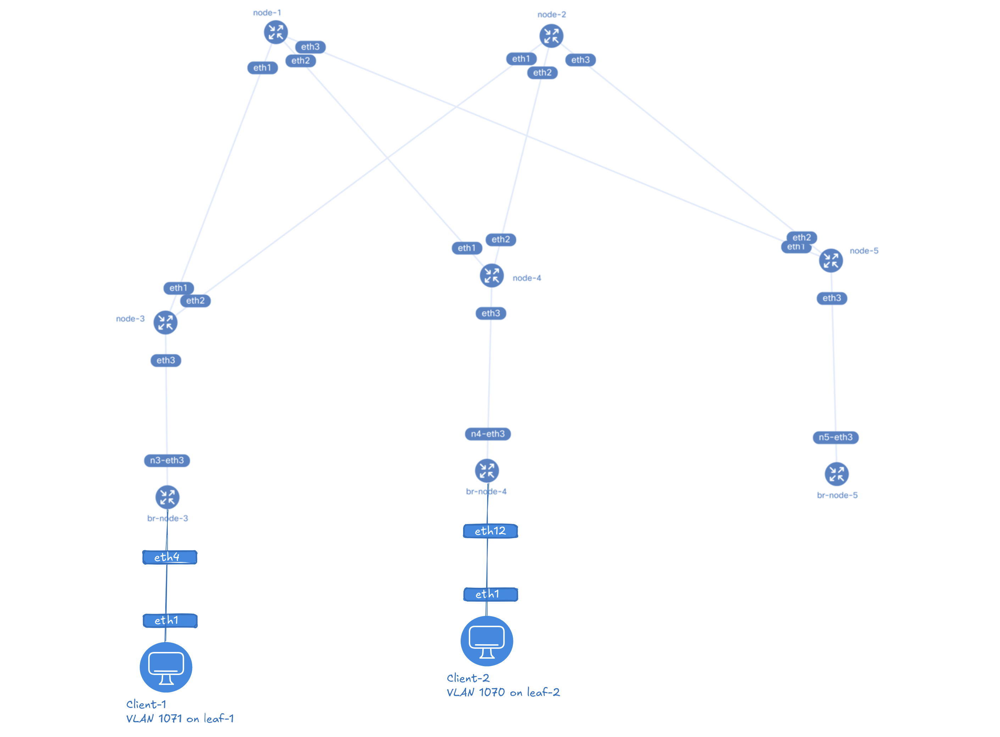

Client-1 is connected directly to Leaf-1 Ethernet/3 via Bridge br-node-3 and client-2 is connected directly to Leaf-2 Ethernet/3 via Bridge br-node-4. Client-1 is configured with a static ip of 10.71.0.11/24 and client-2 is configured with a static of 10.70.0.12/24. For these two clients to reach each other it has to go over VXLAN where both VLANs is encapsulated. A quick ping test from each client shows that this works:


```bash
## client 1 pinging client 2
root@client-1:/# ip addr
567: eth1@if568: <BROADCAST,MULTICAST,UP,LOWER_UP> mtu 9500 qdisc noqueue state UP group default 
    link/ether aa:c1:ab:18:8e:bb brd ff:ff:ff:ff:ff:ff link-netnsid 0
    inet 10.71.0.11/24 scope global eth1
       valid_lft forever preferred_lft forever
569: eth0@if570: <BROADCAST,MULTICAST,UP,LOWER_UP> mtu 1500 qdisc noqueue state UP group default 
    link/ether 02:42:ac:14:14:02 brd ff:ff:ff:ff:ff:ff link-netnsid 0
    inet 172.20.20.2/24 brd 172.20.20.255 scope global eth0
       valid_lft forever preferred_lft forever
root@client-1:/# ping 10.70.0.12
PING 10.70.0.12 (10.70.0.12) 56(84) bytes of data.
64 bytes from 10.70.0.12: icmp_seq=1 ttl=62 time=2.96 ms
64 bytes from 10.70.0.12: icmp_seq=2 ttl=62 time=2.66 ms
64 bytes from 10.70.0.12: icmp_seq=3 ttl=62 time=2.61 ms
64 bytes from 10.70.0.12: icmp_seq=4 ttl=62 time=3.05 ms
64 bytes from 10.70.0.12: icmp_seq=5 ttl=62 time=3.08 ms
64 bytes from 10.70.0.12: icmp_seq=6 ttl=62 time=3.03 ms
^C
--- 10.70.0.12 ping statistics ---
6 packets transmitted, 6 received, 0% packet loss, time 5007ms
rtt min/avg/max/mdev = 2.605/2.896/3.080/0.191 ms

# client 2 pinging client-1

root@client-2:~# ip add
571: eth1@if572: <BROADCAST,MULTICAST,UP,LOWER_UP> mtu 9500 qdisc noqueue state UP group default 
    link/ether aa:c1:ab:f7:d8:60 brd ff:ff:ff:ff:ff:ff link-netnsid 0
    inet 10.70.0.12/24 scope global eth1
       valid_lft forever preferred_lft forever
573: eth0@if574: <BROADCAST,MULTICAST,UP,LOWER_UP> mtu 1500 qdisc noqueue state UP group default 
    link/ether 02:42:ac:14:14:03 brd ff:ff:ff:ff:ff:ff link-netnsid 0
    inet 172.20.20.3/24 brd 172.20.20.255 scope global eth0
       valid_lft forever preferred_lft forever
root@client-2:~# ping  10.71.0.11
PING 10.71.0.11 (10.71.0.11) 56(84) bytes of data.
64 bytes from 10.71.0.11: icmp_seq=3 ttl=62 time=2.81 ms
64 bytes from 10.71.0.11: icmp_seq=4 ttl=62 time=2.49 ms
64 bytes from 10.71.0.11: icmp_seq=8 ttl=62 time=2.97 ms
64 bytes from 10.71.0.11: icmp_seq=9 ttl=62 time=2.56 ms
64 bytes from 10.71.0.11: icmp_seq=10 ttl=62 time=3.14 ms
64 bytes from 10.71.0.11: icmp_seq=11 ttl=62 time=2.82 ms
^C
--- 10.71.0.11 ping statistics ---
6 packets transmitted, 6 received, 0% packet loss, time 10013ms
rtt min/avg/max/mdev = 2.418/2.897/4.224/0.472 ms
root@client-2:~# 

```

And on both Leaf-1 and Leaf-2 I can see the arp correctly and VXLAN address-table:

```bash
## DC Leaf-1
dc1-leaf1(config)#show vxlan address-table 
          Vxlan Mac Address Table
----------------------------------------------------------------------

VLAN  Mac Address     Type      Prt  VTEP             Moves   Last Move
----  -----------     ----      ---  ----             -----   ---------
1070  aac1.abf7.d860  EVPN      Vx1  192.168.1.4      1       0:03:52 ago
1300  001c.7356.0016  EVPN      Vx1  192.168.1.4      1       7:44:07 ago
1300  001c.73c4.4a1d  EVPN      Vx1  192.168.1.5      1       7:44:07 ago
Total Remote Mac Addresses for this criterion: 3

dc1-leaf1(config)#show arp vrf VRF11
Address         Age (sec)  Hardware Addr   Interface
10.70.0.12              -  aac1.abf7.d860  Vlan1070, Vxlan1
10.71.0.11        0:04:00  aac1.ab18.8ebb  Vlan1071, Ethernet3
dc1-leaf1(config)#

## DC Leaf-2

dc1-leaf2(config)#show vxlan address-table 
          Vxlan Mac Address Table
----------------------------------------------------------------------

VLAN  Mac Address     Type      Prt  VTEP             Moves   Last Move
----  -----------     ----      ---  ----             -----   ---------
1071  aac1.ab18.8ebb  EVPN      Vx1  192.168.1.3      1       0:04:36 ago
1300  001c.7357.10f4  EVPN      Vx1  192.168.1.3      1       7:44:50 ago
Total Remote Mac Addresses for this criterion: 2
dc1-leaf2(config)#
dc1-leaf2(config)#show arp vrf VRF11 
Address         Age (sec)  Hardware Addr   Interface
10.70.0.12        0:04:36  aac1.abf7.d860  Vlan1070, Ethernet3
10.71.0.11              -  aac1.ab18.8ebb  Vlan1071, Vxlan1
dc1-leaf2(config)#


```


## Outro

The combination of Arista CloudVision, Arista Validated Design and Containerlab made this post such a joy to do. Spinning up a rather complex topology using Container suddenly became just so fun to do, and in seconds. If something breaks or fails, just do a destroy and deploy again. Minutes later up and running again. Using AVD to define and create the configuration for the topologies also turns a complex task to a easy and understandable thing to do at the same time as it eliminates the chance of doing human errors. Arista CloudVision is the cherry on the top with all its features, the vast set of information readily available from the same UI/dashboard and control mechanism like the Change Control. 

This concludes this post. 

Happy networking

