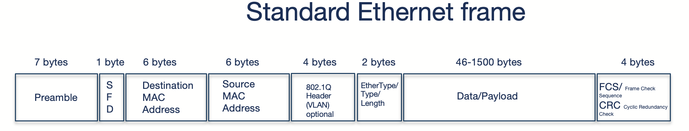

# Spine/Leaf with EVPN and VXLAN - underlay and overlay

In a typical datacenter today a common architecture is the Spine/Leaf design ([Clos](https://en.wikipedia.org/wiki/Clos_network)). This architecture comes with many benefits such as:

- Performance 
- Scalability 
- Redundancy
- High Availability
- Simplified Network Management
- Supports East-West


## Underlay

There are two ways to design a spine leaf fabric. We can do layer 2 designs and layer 3 designs. I will be focusing on the layer 3 design in this post as this is the most common design. Layer 3 scales and performs better, we dont need to consider STP (spanning tree) and we get Equal Cost Multi Path as a bonus. In a layer 3 design all switches in the fabric are connected using routed ports, which also means there is no layer 2 possibilities between the switches, unless we introduce some kind of layer on top that can carry this layer 2 over the layer 3 links. This layer is what this post will cover and is often referrred to as the overlay layer. Before going all in on overlay I need to also cover the underlay. The underlay in a spine leaf fabric is the physical ports configured as routed ports connecting the switches together. All switches in a layer 3 fabric is being connected to each other using routed ports. All leaves exchange routes/peers with the spines.

As everything is routed we need to add some routing information in the underlay to let all switches know where to go to reach certain destinations. This can in theory be any kind of routing protocols (even static routes) supported by the [IETF](https://www.ietf.org/) such as OSFP, ISIS and BGP.

In Arista the preferred and recommended routing protocol in both the underlay and overlay is BGP. Why? BGP is the most commonly used routing protocol, it is very robust, feature rich and customisable. It supports EVPN, and if you know you are going to use EVPN why consider a different routing protocol in the underlay. That just adds more complexity and management overhead. Using BGP in both the underlay and the overlay gives a much more consistent config and benefits like BGP does not need multicast. 

So if you read any Arista deployment recommendations, use Arista Validated Design, Arista's protocol of choice will always be BGP. It just makes everything so much easier. 

In a spine leaf fabric, all leaves peers with the spines. The leaves do not peer with the other leaves in the underlay, unless there is an mlag config between two [leaf pairs](https://www.arista.com/en/um-eos/eos-multi-chassis-link-aggregation). All leaves have their own BGP AS, the spines usually share the same BGP AS.  

A diagram of the fabric underlay:


In the above diagram I have confgured my underlay with layer 3 routing, BGP exhanges route information between the leaves. So far in my configuration I can not have two servers connected to different leaves on the same layer 2 subnet. Only if they are connected to the same leaf I can have layer 2 adjacency. So when server 1, connected to leaf1a, wants to talk to server 2, connected on leaf2a, it has to be over layer 3 and both servers needs to be in their own subnet. Leaf1a and leaf2a advertises its subnets to both spine1 and spine2, server 1 and 2 has been configured to use their connected leaf switches  as gateway respectively. This is fine, I can go home and rest, no one needs to use layer 2. Or... 

Having solved a well performing layer 3 fabric, the routing in the underlay does not help me if I want layer 2 mobility between servers, virtual machines etc connected to different layer 3 leafs. This is where the overlay part comes in to the rescue. And to make it a bit more interesting, I will add several overlay layers into the mix.  

## Overlay in the "underlay"

In a Spine/Leaf architecture **the** most used overlay protocol is [VXLAN](https://datatracker.ietf.org/doc/html/rfc7348) as the transport plane and BGP EVPN as the control plane. Why use overlay in the physical network you say? Well its the best way of moving L2 over L3, and in a "distributed world" as the services in the datacenter today mostly is we need to make sure this can be done in a controlled and effective way in our network. Doing pure L2 will not scale, L3 is the way. EVPN for multi-tenancy.

Adding VXLAN as the overlay protocol in my spine leaf fabric I can stretch my layer 2 networks across all my layer 3 leaves without worries. This means I can now suddenly have multiple servers physical as virtual in the same layer 2 subnet. To make that happen as effectively and with as low admin overhead as possible VXLAN will be the transport plane (overlay protocol) and again BGP will be used as the control plane. This means we now need to configure BGP in the overlay, on top of our BGP in the underlay. BGP EVPN will be used to create isolation and multi tenancy on top of the underlay. To quickly summarize, VXLAN is the transport protocol responsible of carrying the layer 2 subnets over any layer 3 link in the fabric. BGP and EVPN will be the control plane that always knows where things are located and can effectively inform where the traffic should go. This is stil all in the physical network fabric. As we will see a bit later, we can also introduce network overlay protocols in other parts of the infrastructure. 


In the diagram above all my leaf switches has become VTEPs, VXLAN Tunnel Endpoints. Meaning they are responsible of taking my ethernet packet coming from server 1, encapsulate it, send it over the layer 3 links in my fabric, to the destination leaf where server 2 is located. The BGP configured in the overlay here is using an EVPN address family to advertise mac addresses. If one have a look at the ethernet packet coming from server 1 and destined to server 2 we will see some differerent mac addresses, depending on where you capture the traffic of course. Lets quickly illustrate that.

The two switches in the diagram above that will be the best place to look at all packages using tcpdump will be the spine 1 and spine 2 as they are connecting everything together and there is no direct communication between any leaf, they have to go through spine 1 and spine 2. 

If I do a ping from server 1 to server 2, how will the ethernet packet look like when captured at spine1s ethernet interface 1 (the one connected to leaf1a)?

Looking at the tcpdump below from *spine 1* I can clearly see some additional information added to the packet. First I see two mac addresses where source `bc:24:11:1d:5f:a1` is my *leaf1a*  a the destination mac address, `bc:24:11:4a:9a:d0` is my *spine1* switch. The first two ip addresses `10.255.1.3` and `10.255.1.4` is *leaf1a* and *leaf1b* VXLAN loopback interfaces respectively with the corresponding mac addresses `bc:24:11:1d:5f:a1`and `bc:24:11:9b:8f:08`. Then I get to the actual payload itself, the ICMP, between my *server 1* and *server 2* where I can see the source and destination ip of the actual servers doing the ping. 

```yaml
15:44:33.125961 bc:24:11:1d:5f:a1 > bc:24:11:4a:9a:d0, ethertype IPv4 (0x0800), length 148: (tos 0x0, ttl 64, id 0, offset 0, flags [DF], proto UDP (17), length 134)
    10.255.1.3.53892 > 10.255.1.4.4789: VXLAN, flags [I] (0x08), vni 10
bc:24:11:1d:5f:a1 > bc:24:11:9b:8f:08, ethertype IPv4 (0x0800), length 98: (tos 0x0, ttl 63, id 6669, offset 0, flags [DF], proto ICMP (1), length 84)
    10.20.11.10 > 10.20.12.10: ICMP echo request, id 10, seq 108, length 64
```


A quick explanation on what we are looking at. The ICMP request comes in from *server 1* to *leaf1a* and before it sends it to its destination leaf1b (vtep) it  encapsulates the packet by removing  some headers and adding some headers. As seen above it is adding an outer header including the source and destination VTEP mac addresses (leaf1a and leaf1b). Spine1 knows of the mac and IP address for both leaf1a and leaf1b. More info on VXLAN encapsulation further down.

### TCPdump on Arista switches (EOS)

Doing tcpdump on Arista switches is straight forward. Its just one of the benefits Arista has as it uses its EOS operating system which is a pure Linux operating system. I can do tcpdump directly from bash or remote. Here I will show a couple of methods of doing tcpumps in EOS. 

***Locally on the switch in bash***

I will log in to the switch and be in my cli context, enter privilege mode (enable) then enter bash:

```bash
veos-dc1-leaf1a>enable
veos-dc1-leaf1a#bash

Arista Networks EOS shell

[ansible@veos-dc1-leaf1a ~]$
```

From here I have full access to the Linux operating system and can more or less use the exact same tools as I am used to in a regular Linux operating system. 

To list all available interfaces, type *ip link* as usual. 

Now I want to do a tcpdump in the interface where my Client 1 is connected and just have a quick look of whats going on:

```bash
[ansible@veos-dc1-leaf1a ~]$ tcpdump -i vmnicet5 -s 0 -c 2
tcpdump: verbose output suppressed, use -v[v]... for full protocol decode
listening on vmnicet5, link-type EN10MB (Ethernet), snapshot length 262144 bytes
15:14:18.343604 bc:24:11:44:85:95 (oui Unknown) > 00:1c:73:00:00:99 (oui Arista Networks), ethertype IPv4 (0x0800), length 98: 10.20.11.10 > 10.20.12.10: ICMP echo request, id 11, seq 1302, length 64
15:14:18.347329 bc:24:11:1d:5f:a1 (oui Unknown) > bc:24:11:44:85:95 (oui Unknown), ethertype IPv4 (0x0800), length 98: 10.20.12.10 > 10.20.11.10: ICMP echo reply, id 11, seq 1302, length 64
2 packets captured
3 packets received by filter
0 packets dropped by kernel
[ansible@veos-dc1-leaf1a ~]$
```

If I want to save a dump to a pcap file for Wireshark I can do the following:

```bash
[ansible@veos-dc1-leaf1a ~]$ tcpdump -i vmnicet5 -s 0 -c 2 -w wireshark.pcap
tcpdump: listening on vmnicet5, link-type EN10MB (Ethernet), snapshot length 262144 bytes
2 packets captured
39 packets received by filter
0 packets dropped by kernel
[ansible@veos-dc1-leaf1a ~]$ ll
total 4
-rw-r--r-- 1 ansible eosadmin 361 Nov 28 15:20 wireshark.pcap
[ansible@veos-dc1-leaf1a ~]$ pwd
/home/ansible
[ansible@veos-dc1-leaf1a ~]$
```

Now I need to copy this one out of my switch to open it in Wireshark on my laptop. To do that I can use SCP. I will initate the scp command from my laptop and initiate the scp session from my laptop to my Arista switch and grab the file.

I have configured my out of band interface in a MGMT vrf, so for me to be able to access the switch via that interface I need to put the bash session on the switch in the MGMT vrf context. So before going into bash I need to enter the VRF and then enter bash.

```bash
[ansible@veos-dc1-leaf1a ~]$ exit
logout
veos-dc1-leaf1a#cli vrf MGMT
veos-dc1-leaf1a(vrf:MGMT)#bash

Arista Networks EOS shell

[ansible@veos-dc1-leaf1a ~]$ pwd
/home/ansible
[ansible@veos-dc1-leaf1a ~]$ ls
wireshark.pcap
[ansible@veos-dc1-leaf1a ~]$
```

Now I have placed bash in the correct context and grab the file using SCP from my client:

<div style="border-left: 4px solid #2196F3; background-color: #E3F2FD; padding: 10px; margin: 10px 0; color: #0000FF;"> <strong>Info:</strong>
The user that logs into the switch needs to be allowed to log directly to Enable mode. This is done by adding the following:
AristaSwitch#aaa authorization exec default local 
** In configure mode ** 
 </div>


From my client where I have Wireshark installed I will execute scp to copy the pcap file from the switch (*I can also run scp from the switch and copy to any destination*):

```bash
➜  vxlan_dumps scp ansible@172.18.100.103:/home/ansible/wireshark.pcap .
(ansible@172.18.100.103) Password:
wireshark.pcap                                                                                           100%  361    46.1KB/s   00:00
➜  vxlan_dumps
```

Now I can open it in Wireshark


When done, I can go back to the Arista switch log out of bash and into default vrf again like this:

```bash
[ansible@veos-dc1-leaf1a ~]$ exit
logout
veos-dc1-leaf1a(vrf:MGMT)#cli vrf default
veos-dc1-leaf1a#
```


***TCPdump remotely on the switch***

The first approach introduced many steps to get hold of some tcpdumps. 

One can also trigger tcpdumps remotely and either show them in your own terminal session or dump to a pcap file. 
To trigger the tcpdump and show live in your session I will now from my own client execute the following command:

```bash
➜  vxlan_dumps ssh ansible@172.18.100.103 "bash tcpdump -s 0 -v -vv -w - -i vmnicet5 -c 4 icmp" | tshark -i -
(ansible@172.18.100.103) Password: Capturing on 'Standard input'

tcpdump: listening on vmnicet5, link-type EN10MB (Ethernet), snapshot length 262144 bytes
4 packets captured
4 packets received by filter
0 packets dropped by kernel
    1   0.000000  10.20.11.10 → 10.20.12.10  ICMP 98 Echo (ping) request  id=0x000b, seq=3558/58893, ttl=64
    2   0.003400  10.20.12.10 → 10.20.11.10  ICMP 98 Echo (ping) reply    id=0x000b, seq=3558/58893, ttl=62 (request in 1)
    3   1.001586  10.20.11.10 → 10.20.12.10  ICMP 98 Echo (ping) request  id=0x000b, seq=3559/59149, ttl=64
    4   1.005124  10.20.12.10 → 10.20.11.10  ICMP 98 Echo (ping) reply    id=0x000b, seq=3559/59149, ttl=62 (request in 3)
4 packets captured
```


If I want to write to a pcap file and save the content directly on my laptop:

```bash
➜  vxlan_dumps ssh ansible@172.18.100.103 "bash tcpdump -s 0 -v -vv -w - -i vmnicet5 icmp -c 2" > wireshark.pcap
(ansible@172.18.100.103) Password:
tcpdump: listening on vmnicet5, link-type EN10MB (Ethernet), snapshot length 262144 bytes
2 packets captured
2 packets received by filter
0 packets dropped by kernel
➜  vxlan_dumps
```

Now I can open it in Wireshark. All the different tcpdump options and variables is ofcourse options to play around with. It is the exact tcpdump tool you use in your everyday Linux operating system. Its not a Arista specific tcpdump tool. 


For more information using tcpdump and scp with Arista switches head over [here](https://arista.my.site.com/AristaCommunity/s/article/using-tcpdump-for-troubleshooting) and [here](https://arista.my.site.com/AristaCommunity/s/article/how-to-ftp-scp-winscp).


## Overlay in the compute stack

Up until now I have covered the underlay config briefly in a spine leaf, then the overlay in the spine leaf to overcome the layer 3 boundaries. But in the software or compute stack that is connecting to our fabric we can stumble upon other overlay protocols too. 

Even though VXLAN is the most common overlay protocol, there are other overlay protocols being used in the datacenter, like [Geneve](https://datatracker.ietf.org/doc/html/rfc8926), and even NVGre and STT. This blog will discuss some typical scenarios where we deal with "layers" of overlay protocols.

Yes, the services connecting to my network also happen to use some kind of overlay protocol, can I have encapsulation on top of encapsulation? Yes, why not? In some environments we may even end up with overlay on top of overlay on top of another overlay (three "layers" of overlay). That's not possible, you are pulling a joke here right? No I am not, yes that is fully possible and occurs very frequent. But I will loose all visibility!? Why? Using VXLAN or Geneve does not mean the traffic is being encrypted. For an network admin its not always obvious that such scenarios exist, but they do and should be something to be aware of in case something goes wrong or they suddenly discovers a new overlay protocol in their network.

In such scenarios though, like the movie Inception, it will be important to know how things fits together, where to monitor, how to monitor, what to think of making sure there is nothing in the way of the tunnels to be established. This is something I will try to go through in this post. How these thing fits together.  

One example of running overlay on top of overlay is in environments where VMware (by Broadcom) NSX is involved. VMware NSX is using Geneve[^1] to encapsulate their Layer2 NSX Segments over any fabric between their VTEPS (usually the ESXi host transport nodes, the NSX Edges is also considered TEPS in an NSX environment). If this is connected to a spine/leaf fabric we will have VXLAN and Geneve overlay protocols moving L2 segments between their own respective VTEPS (*VTEP for VXLAN, NSX just calls it TEP nowadays*). 


Below we have a spine leaf fabric using VXLAN and NSX in the compute layer using Geneve. All network segments created in NSX leaving and entering a ESXi host will be encapsulated using Geneve, and that also means all services ingressing the leafs from these ESXi hosts will get another round of encapsulation using VXLAN. I will describe this a bit better later, below is a very high level illustration.


But what if we are also running Kubernetes in our VMware NSX environment, which also happens to use some kind of overlay protocol (common CNIs supports VXLAN/Geneve/NVGre/STT) between the control and worker nodes. That will be hard to do right? Should we disable encapsulation in our Kubernetes clusters then? No, well it depends of course, but if you dont have any specific requirements to NOT use overlay (*like no-snat*) between your Kubernetes nodes then it makes your Kubernetes network connectivity (like pod to pod across nodes) so much easier. 

How will this look like then?


Doesn't look that bad? Now if I were Leonardo DiCaprio in Inception it would be a walk in the park. 

## Where is encapsulation and decapsulation done

It is important to know where the ethernet frames are being encapsulated and decapsulated so one can understand where things may go wrong. Lets start with the Spine/Leaf fabric. 

When traffic or the network services enters or ingresses on any of the leafs in the fabric its the leafs role to encapsulate and decapsulate the traffic. The leafs in a VXLAN spine/leaf fabric are considered our VTEP's (VXLAN Tunnel Endpoints). I have two servers connected to two different leafs, and also happens to be on two different VNIs (VXLAN Network Identifier), where server A needs to send a packet to server B the receiving leaf will encapsulate the ingress, then send it via any of the spines to the leaf where server B is connected and this leaf will then decapsulate the packet before its delivered to server B. See below:


How will this look if I add NSX into the mix? The below traffic flow will only be true if source and destination is not leaving the NSX "fabric", meaning it is traffic between two vms in same NSX segment or two different NSX segments. If traffic is destined to go outside the NSX fabric it will need to leave via the NSX edges which will "normalise" the traffic and decapsulate the traffic to regular MTU size 1500 if not adjusted in the Edge uplinks to use bigger mtu size than default 1500. 


What about Kubernetes as the third overlay layer?


When traffic egresses a Kubernetes nodes configured to use VXLAN or Geneve it will encapsulate the original header, if the Kubernetes nodes are running in a NSX segment the ESXi hosts currently holding the Kubernetes nodes will then add its encapsulation before egressing the packet, and finally this traffic will hit the physical Arista VTEPS/Leaf switches in the physical fabric which will also add its encapsulation before egressing to the spines. Then from the leaf to the esxi hosts to the pods the traffic will slowly but surely be decapsulated to finally arrive at the destination as the original ethernet frame stripped from any additional encapsulation headers. 

## Will it fit then?

A default ethernet frame size is 1500MTU (Maximum Transmission Unit). When encapsulating a standard ethernet frame using VXLAN some headers are removed from the original frame, and additional headers are being added. See illustration:



Standard Ethernet fram to a VXLAN encapsulated ethernet frame:


These additional headers requires some more room which makes the default size of 1500mtu too small. So in a very simple setup using VXLAN encapsulation we need to accomodate for this increase in size.  If this is not considered you will end up with nothing working. A general rule of thumb, VXLAN and Geneve will not handle fragmentation and will drop if it does not fit. A new buzzword will then become *its always MTU*.

Why is that? Imagine you have a rather big car and the road you are driving has a tunnel, this tunnel is not big enough to actually fit your car (One of the few times in your life, but assume its a monster truck you are driving). If you dont pay attention and just make a run for it, entering the tunnel will come to a hard stop. 


And if something should happen to come out on the other side of the tunnel it will most likely be fragments of the car. Which we dont like. We do like our cars whole, as we like our network packets whole.

If the tunnel is big enough to accommodate the biggest monster truck, then it should be fine.


The monster truck both enters and exits the tunnel safe and sound and in the exact same shape it entered. No pieces torn off or ripped off to fit the tunnel. 

If the tunnel will bearly fit the car, you can bet some pieces would be torn off, like side mirrors etc. This can be translated into dropped packets, which we dont want.

If the monster truck diagram is not depictive enough, lets try another illustration. Imagine you have two steel pipes of equal diameter and width and you want one pipe to be inserted into the other pipe to maybe extend the total length by combining the two. Pretty hard to do, welding is propably your best option here. But if one pipe had a smaller diameter so it could actually fit inside the other pipe, then it would slide in without any issue. 

 

Imagine the last pipe on the right is the Arista spine/leaf fabric. This should be the part of the infrastructure that must accommodate the biggest allowed MTU size. Then the green pipe will be the NSX environment which needs to tune their MTU setting on the TEP side (host profile) to fit the MTU size set in the Arista Fabric. Arista is default configured to use 9214 MTU. Then the Kubernetes cluster running in NSX segments also needs to adapt to the MTU size in the NSX environment.

This should be fairly easy to calculate as long as one know which overlay protocol being used, how much the additional headers will impose on the ethernet frame. See VXLAN above. Be aware that VXLAN has fixed headers so you will always know the exact MTU size, Geneve on the other hand (call it an VXLAN extension) is using dynamic headers and needs to be taken into consideration, it may need more room than VXLAN. 

For VLXLAN we need at least 50 additional bytes: 14b (outer ethernet header) + 20b (outer IP header) + 8b (outer udp header) + 8b (VXLAN header) = 50b

So, to summarize. As long as one are aware of these MTU requirements it should be fine to run multiple stacked overlay protocols.

### Monitor and troubleshoot mtu issues 

Everything has been configured but nothing works. Could it be MTU? Lets quickly go through how to check for MTU issues and if it is related to any overlay protocols being dropped due to defragmentation.

As more or less everything in your datacenter needs to traverse the spine leaf fabric (unless VM to VM traffic on same host within same VLAN or two different NSX segments but still on same host) to gather as much information of whats going on in as few places as possible I will start by capturing some information from my spines. Looking for defragmentation also depends on where the defragmentation happens in the infrastructure. 

**How to see if the traffic is double or even triple encapsulated?**

Connected to my spine leaf fabric I have a Kubernetes cluster where the nodes are connected over a VXLAN tunnel, already there I have double encapsulation. Then the pods have been configured to use another overlay tunnel using Geneve.  The Kubernetes nodes uses VXLAN as they are placed on different leaves and on different vlans/subnets. For the sake of this post I have confgured the nodes to simulate the additional overlay layer as a potential NSX environment would have (I dont have access to NSX any longer in my lab). 

 

See VXLAN packets, look for defragmentation. 

VXLAN ports and Geneve ports

How can I see that double encapsulation is the case, or even triple encapsulation?

How can I see fragmentation... Could something be seen in the stream coming from TerminAttr?

What about performance?

There is nothing denying that running only overlay in the Arista fabric would be far the most performant way of doing it. There is nothing denying that if switching is done by the part in your network that has this as its sole role we often refer to terms like line rate speed. This is because network switches are purpose built devices with some very efficient CPU (ASICS) to handle switching and routing. 


[^1]: *(Earlier version of VMware NSX called NSX-V used VXLAN too, for a period VMware had two NSX versions NSX-V and NSX-T where the latter used Geneve and is the current NSX product, NSX-V is obsolete and NSX-T now is the only product and is just called NSX.)*

