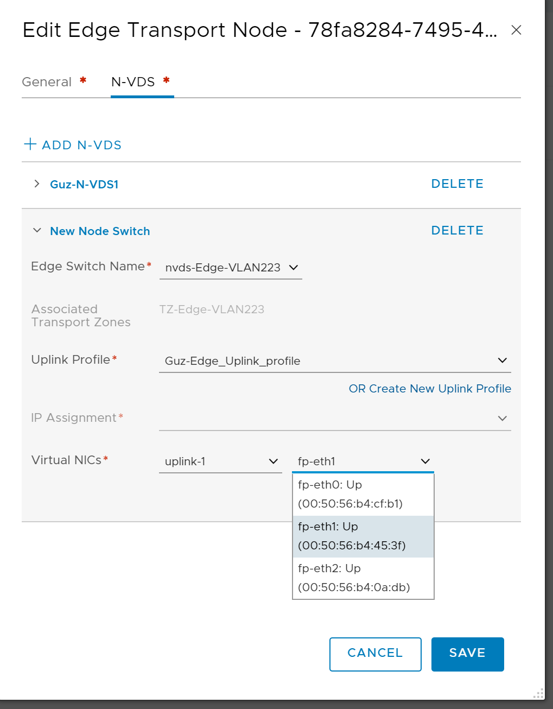
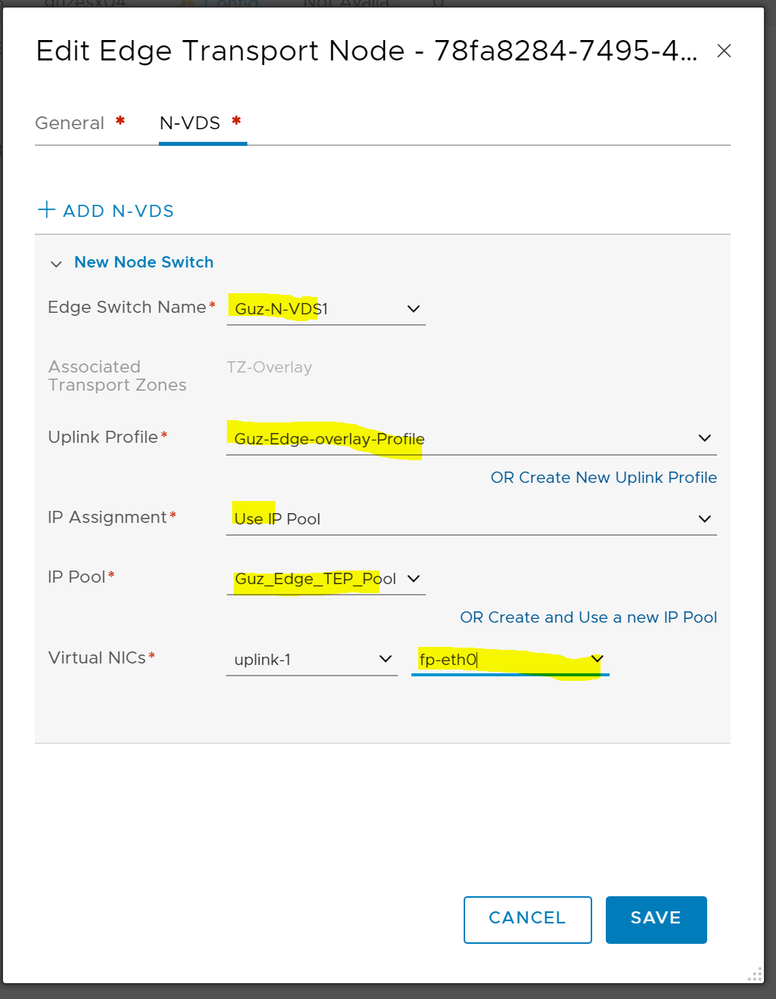
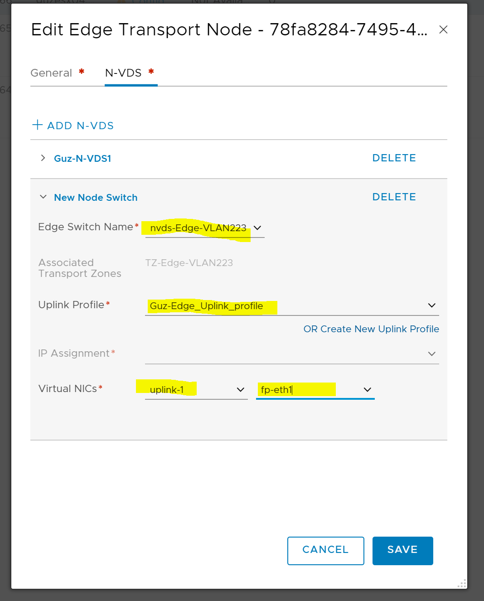

To be able to deploy an Edge node or nodes in your lab or other environment where you only have 2 physical nic you must be able to deploy it on a N-VDS switch as you have already migrated all your kernels etc to this one N-VDS switch.

But trying to do this from the NSX-T 2.4 manager GUI you will only have the option to deploy it to VSS or VDS portgroups, the N-VDS portgroups are not visible at all.

So, I followed this [blog](https://blogs.vmware.com/networkvirtualization/2018/10/flexible-deployment-options-for-nsx-t-edge-vm.html/) by [Amit Aneja](https://blogs.vmware.com/networkvirtualization/author/amit_aneja/ "Posts by Amit Aneja") which explains how this works.

So after I read this blog post I sat out to try this. I had to write down the api-script he used by hand because I could not find it when I searched for a example I could use. By using PostMan I filled out this:

```
{ "resource\_type": "EdgeNode",

"display\_name": "YourEdgevCenterInventoryName", "tags": \[\], "ip\_addresses": \[ "X.X.X.X"    (Your edge MGMT IP adress) \], "deployment\_config": { "vm\_deployment\_config": { "placement\_type": "VsphereDeploymentConfig", "vc\_id": "YourvCenterIDFromNSXTManager", "management\_network\_id": "YourLSPortGroupIDFromNSXTManager", "default\_gateway\_addresses": \[ "X.X.X.X" \], "compute\_id": "YourClusterIDFromNSXTManager", "allow\_ssh\_root\_login": true, "enable\_ssh": true, "hostname": "yourEdge\_FQDNName", "storage\_id": "YourDataStoreIDfromNSXTManager", "management\_port\_subnets": \[ { "ip\_addresses": \[ "YourEdgeIPMGMT\_AddressAgain" \], "prefix\_length": 24 } \],

"data\_network\_ids": \[ "This\_IS\_the\_ID\_of\_Your\_LS\_PortGroup\_for\_the\_Edge\_OverLayVLAN(NotTheHostOverlayVLAN)", "This\_IS\_the\_ID\_of\_Your\_LS\_PortGroup\_for\_the\_Edge\_VLANUplink1", "This\_IS\_the\_ID\_of\_Your\_LS\_PortGroup\_for\_the\_Edge\_VLANUplink1" \] }, "form\_factor": "SMALL",

"node\_user\_settings": { "cli\_username": "admin", "root\_password":"YourPasswordHere", "cli\_password":"YourPasswordHere"

} }

}

```

Then POST it to your NSX-T manager from Postman and after a short blink, the Edge is deployed, and you have to add it as a transport node in the NSX-T manager. Here it is important that you do this right at once, because (as I found out) this is a one-time config GUI where the first time you will be able to choose the right fp-eth nics. If you try to edit the edge deployment a second time it switches back to only showing the VDS/VSS portgroups. Then you have to redeploy.

 

Example screenshots:






 


Remember that the Uplink VLANs will belong to their own N-VDS (which you have already defined in their respective Transport Zone) which will not be created on the host, but the Edges. The first N-VDS are already in place on the Hosts. Its only the last two NICs which will be on their own Edge N-VDS switches.

 

 

I am not saying this is a best practice or the right way to do this, but it works in my lab environment so I can fully test out the latest NSX-T 2.4 and continue playing with PKS (when we get CNI plugins for NSX-T 2.4... are we there yet? are we there yet, are we there yet..... its hard to wait ;-) )
