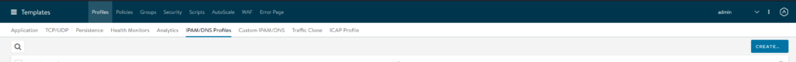
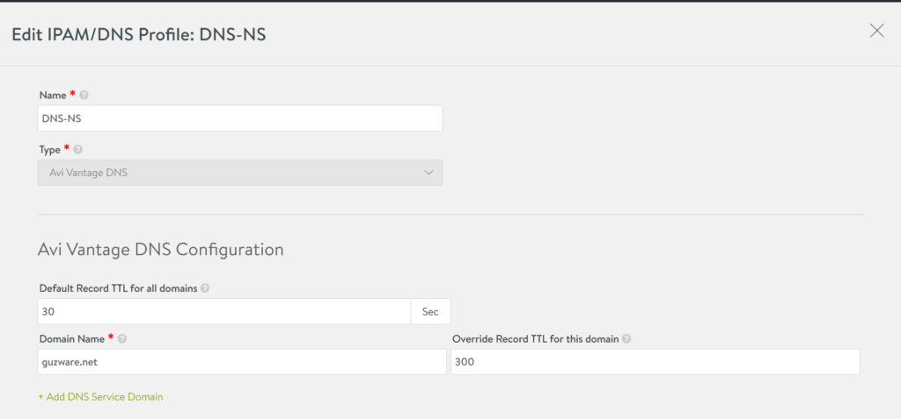
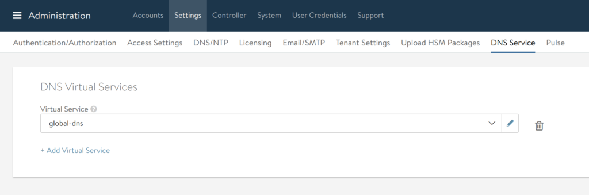
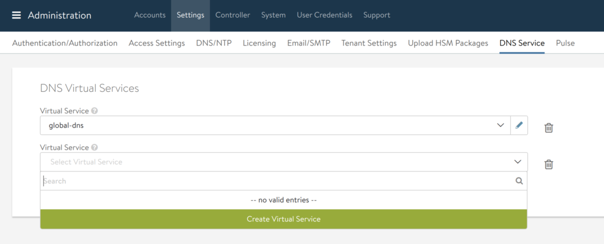
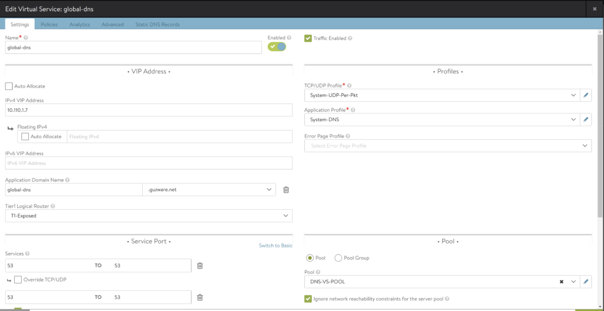
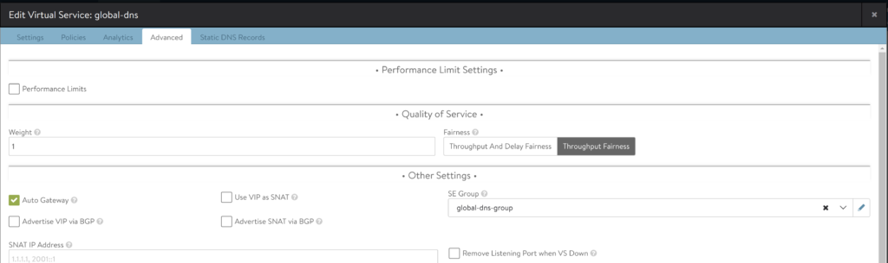
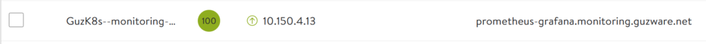
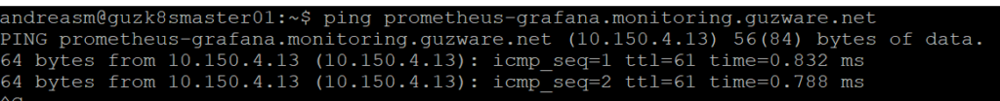

NSX ALB has a very useful feature built-in, to function as DNS server for your domains defined in your NSX-ALB environment. Meaning that all host-records will be automatically resolved by fqdn as soon as the service is created.

If you have followed my other post about how to configure the AKO (Avi Kubernetes Operator) [here](https://blog.andreasm.io/2020/10/08/nsx-advanced-loadbalancer-with-antrea-on-native-k8s/) you are familiar with creating DNS profiles in NSX-ALB. The first step in configuring NSX-ALB as DNS provider is to configure one or more domain names in NSX-ALB.  
Log in to the NSX-ALB controller GUI: -> Templates -> IPAM/DNS Profiles  
Create a profile (if you dont already have one) give it a name and add one or more domain names:  

After you have configured a DNS profile head over to -> Administration -> Settings -> DNS Service in the controller GUI to create the DNS Virtual Service:  

From here one can click "Add Virtual Service" and configure the DNS VS. Go to the empty drop-down list (if you don't already have DNS VS configured) and click Create Virtual Service. Choose your cloud and VRF context.  

One can also create a DNS VS directly from the Application menu, but by going this way some fields are automatically decided for the use of DNS Service.  

Give the service a name, and adjust accordingly. I have done some adjustment to the service in my environment such as Service port where I add 53 twice and choose Override TCP/UDP on the last one to get DNS on UDP port 53 also. I have also added my backend DNS servers as a pool to this VS to have them do lookup against those if the record is not found locally (not obligatory). Application-Domain-Name should have the same domain name as defined in your DNS Profile attached to your cloud.  

Leave Policies and Analytics as is. Under Advanced you choose your SE pool where your DNS VS should live. As a best practice the DNS SE should not be shared with other VS'es. So create a dedicated pool for the DNS-VS and if resources are scarce you can defined the SE group to only contain one SE (no redundancy for DNS VS though).  

In my environment I have also created a Conditional forwarder on my backend DNS servers to look for DNS records in my domains defined in the N-ALB environment. Using NSX-ALB DNS provider service is a brilliant feature as I don't have to manually register any applications/services created in N-ALB or from K8s through AKO as this is all handled by the DNS service in N-ALB. My K8s applications can be spun up/down, without having to care about their dns records as this is all handled automatically by the NSX-ALB.

Demo:  
Take an application created in NSX-ALB  

Ping the dns name  

That's it. Now NSX-ALB handles all your DNS records for you. If you want your backend DNS servers to forward the request to NSX-ALB head over to your DNS servers and either add a Conditional forwarder for your domains or add a Delegated zone as a sub-domain and point to your DNS-VS VIP.
