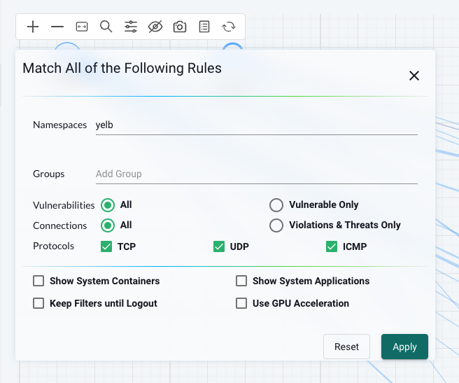
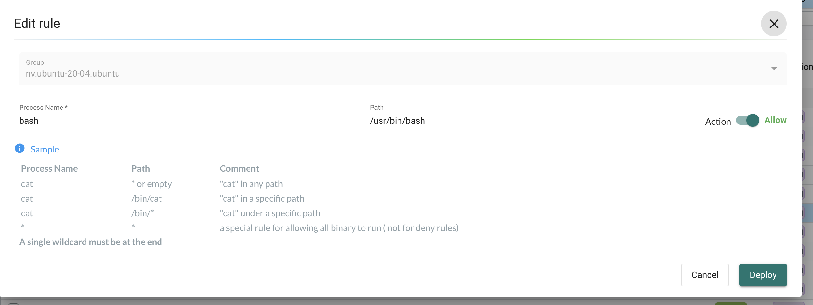

# NeuVector

After doing my post on Rancher [here](https://blog.andreasm.io/2024/05/05/taking-rancher-by-suse-for-a-spin/) I wrote that I would do a dedicated post on NeuVector, among other topics. So this post will be a more deep dive post covering some of the features in NeuVector and how to configure and use them. NeuVector is a comprehensive security solution with many features covering several aspects, so I decided to divide this post into a 2-series post instead of covering everything in one big post. 

I have been working a lot with Kubernetes Network policies by utilizing the CNIs built-in network security features, especially Antrea Native Policies. I have also covered most of that in earlier posts in my blog. This time it will be a bit different angle and approach.

Using Antrea Native Policies or Kubernetes Network policies is more on the network layer than on the application layer of a pod in a Kubernetes infrastructure. In this post I will focus more on the application layer (including network application aware rules) by using the NeuVector security features. Both Antrea Native Policies (using the CNIs built in security policies) and NeuVector policies/rules will be used as combining the two will contribute to a more secure platform. It is again not meant to be a comprehensive post covering best practices but may open up for some ideas and thinking around Kubernetes security. 

Having in mind that security is not just one place in the infrastructure, it needs to be everywhere. Its not sufficient to just focus on the network, we need visibility and security mechanisms in place in all areas of the infrastructure - end to end. In a Kubernetes environment this involves the build process to the registry where our images are hosted/uploaded. If that is not compliant we will potentially just push vulnerable images into our Kubernetes platform. It also involves what is allowed on the "wire" between nodes, pods, ingress and egress and whats going on inside the containers and nodes in form of processes, files, checking compliance and vulnerabilites on nodes and containers ++. NeuVector brings all these aspects together in one single management plane making it easier to manage security on all these entities.


## NeuVector Architecture

From the official NeuVector documentation [page](https://open-docs.neuvector.com/basics/overview) they already provide a diagram of the NeuVector Architecture:


Short explanations of the components:

> **Controller**
>
> The Controller manages the NeuVector Enforcer container cluster. It also provides REST APIs for the management console. Although typical test deployments have one Controller, multiple Controllers in a high-availability configuration is recommended. 3 controllers is the default in the Kubernetes Production deployment sample yaml.
>
> **Enforcer**
>
> The Enforcer is a lightweight container that enforces the security policies. One enforcer should be deployed on each node (host), e.g. as a Daemon set.
>
> **Manager**
>
> The Manager is a stateless container that provides a web-UI (HTTPS only) console for users to manage the NeuVector security solution. More than one Manager container can be deployed as necessary.
>
> **All-in-One**
>
> The All-in-One container includes a Controller, an Enforcer and a Manager in one package. It's useful for easy installation in single-node or small-scale deployments.
>
> **Scanner**
>
> The Scanner is a container which performs the vulnerability and compliance scanning for images, containers and nodes. It is typically deployed as a replicaset and can be scaled up to as many parallel scanners as desired in order to increase the scanning performance. The Controller assigns scanning jobs to each available scanner in a round-robin fashion until all scans are completed. The scanner also contains the latest CVE database and is updated regularly by NeuVector.
>
> **Updater**
>
> The Updater is a container which when run, updates the CVE database for NeuVector. NeuVector regularly publishes new scanner images to include the latest CVE for vulnerability scans. The updater re-deploys all scanner pods by taking the deployment to zero and scaling it back up, forcing a pull of an updated scanner image.


## NeuVector installation

NeuVector can be deployed many ways and on many different platforms, for an extensive list of supported methods and platforms see [here](https://open-docs.neuvector.com/deploying). 

If you happen to use Rancher, installing NeuVector is just a click in the Rancher UI. Ofcourse there are some options that should be configured to ensure access (Ingress) and data-persistence. 

I will quickly go through the installation of NeuVector using Rancher. 

From the Cluster Dashboard for the cluster you want to deploy NeuVector in head to Apps - Charts and find NeuVector and click on it:


Then from the next window find the **Install** button in the top right corner:


Then in the next step select the Project and click Next:


In the next step I will leave everything at default except the Ingress. Here I will select Ingress for the Manager and enter my hostname then when I am done click Install:


Done. 

Neuvector is now installed and I should be able to reach the ui by grabbing the IP from the Ingress object or from within the Rancher UI:

```bash
NAMESPACE                 NAME                      CLASS    HOSTS                         ADDRESS          PORTS   AGE
cattle-neuvector-system   neuvector-webui-ingress   avi-lb   neuvector-1.my-domain.net   192.168.121.12   80      68s
```


When logged in it will show the Dashboard providing a quick glance at the current state:


## Network Activity Dashboard 

Out of the box NeuVector provides a very useful and handy graphical map with container traffic flows. I found this dashboard to be pretty impressive and powerful in the process of securing my containers with network rules. Instead of using all kinds of tools to verify network rules being blocked or allowed, the Network Activity dashboard could show me exactly what was going on. It saved a lot of time and I could see what was going on. If I wanted to know if one of my applications were being blocked or allowed and what kind of communication was going on, in and out of my containers, the map showed me that. I didnt have to guess anymore. I also got the impression that as a soon as new flow occurred it was updated in the map, no delay there. I will quickly go through what kind of information that is provided in the dashboard. 


I will begin by having a look in the top left corner of the map:


Here I will find some useful settings to adjust the map to focus on what I will have a look at instead of the whole picture.
From the left:

- :heavy_plus_sign:  and :heavy_minus_sign: sign for zooming in and out the view
- <-> make everything fit to window
- :mag: search for a node by name
- :control_knobs: match a view to your area of interest (more on that later)
- :eye_speech_bubble: hide namespace, group or endpoint
- :camera: take a snapshot of the view
- :notebook_with_decorative_cover: show legend
- :arrows_counterclockwise: refresh view - to show any new flows immediately 


 I want to know whats going on with my demo application Yelb, that I have deployed in the namespace *yelb*. I will click on the parameters button :control_knobs: button. There I will enter the namespace yelb to filter only on the namespace of interest, leaving all else default. 

 

Click apply

This should now only show me the groups (*groups will be explained later*) in the namespace *yelb*:


Now the view may not be optimal to begin with, but I can drag the groups around the way I want them;


This gives me a better "logical" view of the groups in the namespace. The first thing I notice in this view is the direction of the flow. And this matches the exact behaviour of my application as I know it. But I only see the groups, not the containers. By right clicking on the group, eg yelb-ui in this case, I will be presented with a list of options. If I click details a get relevant information regarding which members are in the group, network and response rules this group have:


  I can select Expand and it will show me the individual containers.


This view is also useful if I have containers having conversations with each other in the same group and I want to see these flows, what type and action (allow/deny). 

I can now left click on one of the containers to focus the network flow going to/from it. I can also right click on it and it will provide me with another list of options:

 

Lets try a packet capture:


Now click the middle button indicated by the red arrow to reveal the download button:


This will allow me to download a pcap file I can load into Wireshark:


If I want to see details of the specific container I select details on the container:


When the group is expanded I can also see the unique sessions each container has, if any, like the example below:


While on the other container there is a different set of sessions:


Or any flows between the containers in the group:


If I just want to see the latest flows on a group I can click on the flow indicators:


This will tell me the application, client-ip/source, server-ip/destination, protocol/port and which rule id and action allow/deny.

By hovering over the flow indicator I can also see the observed application which in this case is *Redis*.

Finally the legend:


Now lets try out some of the security features in NeuVector, which will include the use of this map throughout the post.

## Security Policies

I wrote a post a while back using [Antrea Native Policies](https://blog.andreasm.io/2023/06/21/securing-kubernetes-clusters-with-antrea-network-policies/) to create a "zero trust" approach where all namespaces are per default not allowed to communicate with each other (zero-trust) and then I micro-segmented, using Antrea policies, a demo application called Yelb. I will follow the same approach here using Antrea policies to apply the foundation policies in my cluster then I will use NeuVector to further add security postures and explore what more I can do with NeuVector. 

NeuVector comes with a rich set of security features such as L7 network rules, WAF, Process Profile rules, Network Threat signatures, Config Drift rules just to name a few. In additon to the vast visibility NeuVector provides one can imagine this post will be a very fun and interesting post to do. I will try to cover most of these features in the sub-sections below.

This post will start by applying two Antrea Native polices to create a "minimum" foundation of security policies, then I will continue with the features of NeuVector.


### NeuVector Modes: Discover, Monitor and Protect

From the official NeuVector documentation:

> **[Discover](https://open-docs.neuvector.com/policy/modes#discover)**
>
> By default, NeuVector starts in Discover mode. In this mode, NeuVector:
>
> - Discovers your container infrastructure, including containers, nodes, and hosts.
> - Learns your applications and behaviors by observing conversations (network connections) between containers.
> - Identifies separate services and applications running.
> - Automatically builds a whitelist of Network Rules to protect normal application network behavior.
> - Baselines the processes running in containers for each service and creates whitelist Process Profile Rules.
>
> NOTE
>
> *To determine how long to run a service in Discover mode, run test traffic through the application and review all rules for completeness. Several hours should be sufficient, but some applications may require a few days to be fully exercised. When in doubt, switch to Monitor mode and check for violations, which can then be converted to whitelist rules before moving to Protect mode.*
>
> **[Monitor](https://open-docs.neuvector.com/policy/modes#monitor)**
>
> In Monitor mode NeuVector monitors conversations and detects run-time violations of your Security Policy. In this mode, no new rules are created by NeuVector, but rules can manually be added at any time.
>
> When violations are detected, they are visible in the Network Activity map visually by a red line. Violations are also logged and displayed in the Notifications tab. Process profile rule and file access violations are logged into Notifications -> Security Events.
>
> In the Network map you can click on any conversation (green, yellow, red line) to display more details about the type of connection and protocol last monitored. You can also use the Search and Filter by Group buttons in the lower right to narrow the display of your containers.
>
> **[Protect](https://open-docs.neuvector.com/policy/modes#protect)**
>
> In Protect mode, NeuVector enforcers will block (deny) any network violations and attacks detected. Violations are shown in the Network map with a red ‘x’ in them, meaning they have been blocked. Unauthorized processes and file access will also be blocked in Protect mode. DLP sensors which match will block network connections.

As I proceed with this post I will use a mix of all three modes, discover, monitor and protect, until I am satisfied and can enable protect on a global level.

<div style="border-left: 4px solid #2196F3; background-color: #E3F2FD; padding: 10px; margin: 10px 0; color: #0000FF;"> <strong>Info:</strong> 

Changing the three modes above can be done on a global level, for both "Process Profile" modes and Network Security Policy modes. The three modes can also be adjusted on a per group level, this will not affect any network rules, but group rules.  More on that later 

</div>

### Discovery to Monitor to Protect

I needed to add a dedicated section just for the Discover mode in NeuVector as I find this very useful. During the time I have been running NeuVector in my lab the Discover feature has helped me alot of understanding and telling me whats going on both inside and outside my containers. This includes network flows, from containers, nodes, external ip addresses to containers, nodes, external ip addresses and in and out of my Kubernetes cluster. In addition it also discovers files and processes inside my containers. I have a bunch of different test/demo containers in my lab and I am surprised how much actually going on inside them, many things I wasn't aware of. With NeuVector I am no longer fumbling in the blind when it comes to locking down the "unwanted" as NeuVector tells me exactly whats going on. This is very valuable and takes away the guesswork in securing the Kubernetes estate. This makes it very easy to follow the good known (hopefully) and stop chasing the unknown. Putting this information into the context of the Network Activity Dashboard provides a very good overview and easy to manage.

After NeuVector as done its Discovery phase I can move to Monitor (both network and processes/files or any of them) to wach any deviations. When I am satisfied I can move to Protect and ensure no new activities, processes/files are allowed. 


 

### Groups

From the official documentation [here](https://open-docs.neuvector.com/policy/groups)

> This menu is the key area to view and manage security rules and customize Groups for use in rules. It is also used to switch modes of Groups between Discover, Monitor, and Protect. Container Groups can have Process/File rules in a different mode than Network rules, as described [here](https://open-docs.neuvector.com/policy/modes#network-service-policy-mode).
>
> NeuVector automatically creates Groups from your running applications. These groups start with the prefix 'nv.' You can also manually add them using a CRD or the REST API and can be created in any mode, Discover, Monitor, or Protect. Network and Response Rules require these Group definitions. For automatically created Groups ('learned' groups starting with 'nv'), NeuVector will learn the network and process rules and add them while in Discover mode. Custom Groups will not auto-learn and populate rules. Note: 'nv.' groups start with [zero drift](https://open-docs.neuvector.com/policy/processrules#zero-drift-process-protection) enabled by default for process/file protections.


NeuVector discovers and create groups, but one can also define and create custom groups:


I will deploy a set of Ubuntu pods in the same namespace *ubuntu-3* using the same image, but different names. Let see how NeuVector discovers them:


I automatically get two new groups based on the name of the application/deployment. 

Groups are also used in Network Rules, both autocreated groups and custom groups.


### Settings -> change modes -> Discover, Monitor and Protect

If I go to settings -> configuration:


There is two settings that is valuable to be aware of. New Services Mode and Network Security Policy Mode controls two different layers, the first is whats going on inside an application, the other is whats going on in the network. So a short explanation of what these do. 

**New Services Mode** 

> If new services are discovered by NeuVector, for example a previously unknown container starts running, it can be set to a default mode. In Discover mode, NeuVector will start to learn its behavior and build Rules. In Monitor, a violation will be generated when connections to the new service are detected. In Protect, all connections to the new service will be blocked unless the rules have been created prior. 

[Source](https://open-docs.neuvector.com/policy/modes)

The setting **New Services Mode** can be set to either **Discover**, **Monitor**, or **Protect**, and will dictate which mode NeuVector will set autocreated groups to. For example, if I deploy a new application, and if it has a unique name and/or a new namespace, it will be discovered as a new group, and the mode will be set according to the mode chosen at the time of creation.

  


Notice above the three groups, they are created after the corresponding mode has been configured and reflects the mode at the time of discovery is done. Setting the mode to **Discover** it will allow the application to run everything it wants and NeuVector will just discover what it is doing and update the group inventory with discovered processes. By setting the mode to Monitor it will alert on any process rules being violated. By setting the mode to Protect for new services and one *really* wants zero-trust one can ensure no new services will be able to start at all as NeuVector has not been able to scan for any services and will just block all potential services. I will go through how this works later. 

Groups Policy Modes can also be manually changed, individually, by changing the mode here:


The mode on the Groups will not affect any Network rules defined. The mode on the Groups will only impact processes and files.


**Network Security Policy Mode**

> There is a global setting available in Settings -> Configuration to separately set the network protection mode for enforcement of network rules. Enabling this (default is disabled), causes all network rules to be in the protection mode selected (Discover, Monitor, Protect), while process/file rules remain in the protection mode for that Group, as displayed in the Policy -> Groups screen. In this way, network rules can be set to Protect (blocking), while process/file policy can be set to Monitor, or vice versa.

[Source](https://open-docs.neuvector.com/policy/modes)

This setting is controlling the network rules "layer". Default this setting is disabled, but by enabling it and starting with the Discover mode NeuVector will immediately start a discovery process for all network flows in and out of the Kubernetes estate. From there I will already have a good set of rules that will tell me whats going on and I can begin locking things down by using the information provided by NeuVector. 

So to reflect upon these to settings. The first setting, New Services Mode, will dictate group modes when discovered and can have some rules (like Process Profile rules) that is necessary to be in protect mode, while the other setting, Network Security Policy Mode, can to be in Discover, Monitor or Protect without impacting the first one.  


### Network Rules


Before getting into NeuVector network rules I have defined some Antrea Native policies as a minimum set of network security policies controlling what is allowed and not allowed inside my Kubernetes cluster, without impacting the Kubernetes cluster operation.


The two Antrea policies applied will allow communication between all namespace I have defined as "system-namespaces" and will drop any communication between any created user namespaces, including from any user created namespaces to system namespaces, except CoreDNS. 

Below is the Antrea Policy I will apply to create the "zero-trust" between all user namespaces:

```yaml
apiVersion: crd.antrea.io/v1alpha1
kind: ClusterNetworkPolicy
metadata:
  name: strict-ns-isolation-except-system-ns
spec:
  priority: 9
  tier: securityops
  appliedTo:
    - namespaceSelector:          # Selects all non-system Namespaces in the cluster
        matchExpressions:
          - {key:  kubernetes.io/metadata.name, operator: NotIn, values: [default,avi-system,kube-node-lease,kube-public,kube-system,cattle-system,cattle-neuvector-system,cattle-monitoring-system,cattle-impersonation-system,cattle-fleet-system,cattle-dashboards]}
  ingress:
    - action: Pass
      from:
        - namespaces:
            match: Self           # Skip ACNP evaluation for traffic from Pods in the same Namespace
      name: PassFromSameNS
    - action: Drop
      from:
        - namespaceSelector: {}   # Drop from Pods from all other Namespaces
      name: DropFromAllOtherNS
  egress:
    - action: Pass
      to:
        - namespaces:
            match: Self           # Skip ACNP evaluation for traffic to Pods in the same Namespace
      name: PassToSameNS
    - action: Drop
      to:
        - namespaceSelector: {}   # Drop to Pods from all other Namespaces
      name: DropToAllOtherNS

```


Certain essential services such as CoreDNS is also needed and I will apply a policy to allow for that, below is the policy:

```yaml
apiVersion: crd.antrea.io/v1alpha1
kind: ClusterNetworkPolicy
metadata:
  name: allow-all-dns-service
spec:
  priority: 8
  tier: securityops
  appliedTo:
    - namespaceSelector: {}
  egress:
    - action: Allow
      toServices:
        - name: rke2-coredns-rke2-coredns
          namespace: kube-system
      ports:
        - protocol: TCP
          port: 53
        - protocol: UDP
          port: 53
      name: "allow-dns-service-from-any"

```


Applied:

```bash
andreasm@linuxmgmt01:~/rancher$ k get acnp
NAME                                   TIER          PRIORITY   DESIRED NODES   CURRENT NODES   AGE
allow-all-dns-service                  securityops   8          7               7               15m
strict-ns-isolation-except-system-ns   securityops   9          2               2               17m
```


Now its time to continue with NeuVector. 

One brilliant part of NeuVector is the Discover/Learned part. It will already provide me with a list of policies in Allow mode, based on findings it has done. These policies may be used as is or as an initial suggestion to how the the application interacts. Some of the rules it has created:


I already have a demo application called Yelb running in the cluster. Lets filter on the app Yelb and see what NeuVector has found:


This looks to be a good starting point, what I do miss though is the specific ports the different pods/parts applications are using. I happen to know them as I know the application, but I suspect even NeuVector knows them, lets check Network Activity and filter on anything Yelb related:


Lets click on the flows between the pods *yelb-ui*, *yelb-db*, *yelb-appserver* and *redis-server*. 

**yelb-ui to yelb-appserver**


Yelb UI to Yelb Appserver is discovered using application HTTP on TCP/4567 - as the Appserver is running Ruby Sinatra lightweight web application.

**yelb-appserver to yelb-db**


Yelb Appserver to Yelb DB is  discovered using application PostgreSQL on port TCP/5432

**yelb-appserver to redis-server**


Yelb Appserver to Redis Server is discovered using application Redis on port TCP/6379

**The external to yelb-ui**


Then from *external* Neuvector has discovered the source IP addresses 192.168.120.100 and 192.168.120.101 is using application HTTP on port TCP/80 to my Yelb UI pod. These source addresses happens to be my Avi Service Engines providing the ServiceType Loadbalancer service for my Yelb ui which is the only ip addresses that should have access to the Yelb-ui pods in the first place. 

NeuVector discovers the correct applications and ports inside my Yelb demo application including the external access via the loadbalancer service. 

Now that I have all the ports also, I can go ahead and create a more specific rule. And, all the applications/ports discovered were correct as the application is using these ports:


Lets start by creating the new rules before enforcing anything (changing mode to *protect*):


After the first rule has been created I will continue add the rest below the first by clicking on the + sign like this:


After adding all rules:


I have only created the rules necessary for the application itself. I have not defined any external to ui policy, so if I enforce this I will loose access to the application from outside. And then it is the DNS service. I already have a Antrea Native policy that gives me access to DNS, but if I enforce it in NeuVector, will NeuVector drop DNS? Lets see

I will delete the rules created as part of the discovery process:


With only my three manually created rules in place, will NeuVector re-discover and create the other needed rules?


Yes, it re-discovers and re-creates the other rules as well.

DNS will also be blocked by NeuVector if not defined/discovered and allowed, regardless of the Antrea policies, so I will have to create such a rule also in NeuVector in addition to the external rule.

For the external part I will create a specific group where only the IP addresses from my Avi Service Engines is added. 


Now I can also be very specific what the external source is. 

This is how my Yelb network rules is looking right now:


Now that I am satisfied with the network rules for Yelb it is now time to change mode to protect to enable the default deny policy at the bottom of all my rules. This policy will drop anything that has not been defined earlier.

All the previous rules NeuVector has provided by Discovery not related to the Yelb application will be left as is as it will just ensure all the other systems will continue to work. 

Changing the global mode from Discover to Protect:


Select protect


Then *Submit*

I can verify that my Yelb application still works:

```bash
andreasm@linuxmgmt01:~/$ curl http://192.168.121.11
<!doctype html>
<html>
<head>
    <meta charset="utf-8">
    <title>Yelb</title>
    <base href="/">
    <meta name="viewport" content="width=device-width, initial-scale=1">
    <link rel="icon" type="image/x-icon" href="favicon.ico?v=2">
</head>
<body>
<yelb>Loading...</yelb>
<script type="text/javascript" src="inline.bundle.js"></script><script type="text/javascript" src="styles.bundle.js"></script><script type="text/javascript" src="scripts.bundle.js"></script><script type="text/javascript" src="vendor.bundle.js"></script><script type="text/javascript" src="main.bundle.js"></script></body>
</html>
```

Using NeuVector Network Activity dashboard is also very useful to see whats going on:


<div style="border-left: 4px solid #2196F3; background-color: #E3F2FD; padding: 10px; margin: 10px 0; color: #0000FF;"> <strong>Info:</strong> 

Using NeuVector's Network Activity dashboard is really powerful, its very instant, new flows are detected immediately and it provides vast information on whats going on. Lets dig into this dashboard later 

</div>


Some last verifcations that NeuVector actually enforces these rules, I will change the avi-se-vms to yelb-ui policy to drop:


Trying to connect to my Yelb app now:

```bash
andreasm@linuxmgmt01:~/$ curl http://192.168.121.11
curl: (56) Recv failure: Connection reset by peer
```

From the network activity dashboard now I see this:


What about between the pods in the Yelb namespace?

From yelb-ui


To verify that I will now exec into the *yelb-appserver* pod do a curl to the *yelb-ui* pod on different ports:

```bash
andreasm@linuxmgmt01:~/$ k exec -it -n yelb yelb-appserver-6dc7cd98-pvdln bash
kubectl exec [POD] [COMMAND] is DEPRECATED and will be removed in a future version. Use kubectl exec [POD] -- [COMMAND] instead.
root@yelb-appserver-6dc7cd98-pvdln:/app# curl 10.42.1.10
^C
root@yelb-appserver-6dc7cd98-pvdln:/app# curl 10.42.1.10:4567
^C
root@yelb-appserver-6dc7cd98-pvdln:/app# curl 10.42.1.10:5432
^C
```


And in network activity dashboard I will see this:


From *yelb-appserver* to *yelb-db* using other ports than the allowed tcp/5432:

```bash
andreasm@linuxmgmt01:~/$ k exec -it -n yelb yelb-appserver-6dc7cd98-pvdln bash
kubectl exec [POD] [COMMAND] is DEPRECATED and will be removed in a future version. Use kubectl exec [POD] -- [COMMAND] instead.
root@yelb-appserver-6dc7cd98-pvdln:/app# curl 10.42.1.8:4567
^C
```


This is looks pretty locked down for now. I have made sure there is no possibility for any of the pods in the Yelb namespace to have a conversation without using the *application-id* AND *port* they are allowed to use. 

If I scale the application, e.g the UI pod, to several pods after I have put NeuVector to Protect, will they *inherit* the same rules?

Lets test that. 

Scaling the *yelb-ui* to 4 pods in total:

```bash
andreasm@linuxmgmt01:~/$ k scale deployment -n yelb yelb-ui --replicas 4
deployment.apps/yelb-ui scaled
amarqvardsen@amarqvards1MD6T:~/github_repos/blog.local (main)$ k get pods -n yelb
NAME                            READY   STATUS              RESTARTS   AGE
redis-server-84f4bf49b5-t7pdc   1/1     Running             0          3d22h
yelb-appserver-6dc7cd98-pvdln   1/1     Running             0          3d22h
yelb-db-84d6f6fc6c-wq2bf        1/1     Running             0          3d22h
yelb-ui-f544fc74f-2zzlq         0/1     ContainerCreating   0          5s
yelb-ui-f544fc74f-85x4v         1/1     Running             0          3d22h
yelb-ui-f544fc74f-bj6n7         0/1     ContainerCreating   0          5s
yelb-ui-f544fc74f-ddwpd         0/1     ContainerCreating   0          5s
```


The additional yelb-ui pods will be added to the same group as I am using in the network rules below:


I am now confident my network rules controlling the Yelb application will keep it in control. The result should look something like this:


Whatever conversations the containers or pods in the Yelb application decides to do, they will be blocked unless they are using the application and ports that is allowed by the network rules. 

If I do scale the yelb-ui pods from 1 to many, the Network Rules will automatically ensure that there is possible way for the ui pods to have a conversation more than what is allowed. And looking at the rules I have create I have not defined any rule indicating that any pod of same type should be allowed to communicate, and certainly not the yelb-ui pods. This restriction limits the lateral movement if one of the web containers should be compromised.

I have simulated this behaviour by having to Ubuntu containers in the same namespace and used curl to access their web-service over tcp/80, then from the Network Activity dashboard:


 

NeuVector does not enforce policies on the nodes themselves, so here one may have to look at Antrea Node Policies or NSX as a VM/node firewall solution. I do covere some of that in this [post](https://blog.andreasm.io/2023/06/21/securing-kubernetes-clusters-with-antrea-network-policies/#different-layers-of-security-different-personas-different-enforcement-points) and this [post](https://blog.andreasm.io/2024/04/16/exploring-some-antrea-features/#node-networkpolicy-and-externalnode-policy).


Next I will look at processes going on inside the containers themselves... 


### Process Profile rules

This part is very interesting as it is capable of allowing or blocking the execution of processes inside a container. These rules are independent of any network rules and will only be enforced if the protect mode is set on the group level. 

If I dont know whats going on inside my container, I can start out by leaving the autocreated group in Discovery mode. When I am satsified with whats being discovered I can decide to drop or allow certain processes necessary for the container to do its job.

For the purpose of this post I will spin up a Ubuntu pod in the namespace *ubuntu*, and let NeuVector do its discovery of whats going on.


My pod is up and NeuVector has discovered a lot of interesting processes already:


This Ubntu container do contain a lot of stuff and does not represent a typical pod which is usually configured to one specific purpose in life. The Ubuntu container in my case here is my "swiss army" knife that contains a lot of tools out of the box, so it does not represent a typical container (and not something you would like to have running in production anyway). But it do work as a really good example of what NeuVector is able to discover as soon as the contaner is up and running. 

A typical container may look more like one of my Yelb pods, like the *yelb-db* below:


This looks more like a purpose built container. I know it should run Postgres, and the Pause process is there to keep the pod up and running. If I wanted to lock this group down, not allowing any other processes to run/executed in the container I can just switch mode to Protect on this group and I can rest assure no other processes than Postgres is allowed to run. 

This makes life much easier instead of chasing the unknown, I can protect the known and forget about all else.

Back to my Ubuntu container again. I want to block a bunch of services on it. Lets just try to set the group in protect mode as is with whats already discovered.  


Notice I am using Basic instead of Zero Drift, more on that later. 

I will execute into the Ubuntu container and do a SSH session to an external server:

```bash
andreasm@linuxmgmt01:~/$ k exec -it -n ubuntu ubuntu-20-04-7bb59fcd7f-sz7bj bash
kubectl exec [POD] [COMMAND] is DEPRECATED and will be removed in a future version. Use kubectl exec [POD] -- [COMMAND] instead.
root@ubuntu-20-04-7bb59fcd7f-sz7bj:/# ssh andreasm@192.168.100.99
bash: /usr/bin/ssh: Operation not permitted
```

Oops, that was not allowed. Let me check if SSH is on the list of allowed processes:


Its not there, so it will not be allowed. Only rules defining what is allowed is allowed, and apparently SSH has not been discovered. So let me create a rule for SSH. 


process name, path and action -> allow. . Thats it.


After clicking deploy I will try again:

```bash
root@ubuntu-20-04-7bb59fcd7f-sz7bj:/usr/bin# ssh andreasm@192.168.100.99
andreasm@192.168.100.99's password:
Welcome to Ubuntu 22.04.4 LTS (GNU/Linux 5.15.0-101-generic x86_64)

 * Documentation:  https://help.ubuntu.com
 * Management:     https://landscape.canonical.com
 * Support:        https://ubuntu.com/pro

```

Now I can SSH again. 

It is also possible to delete or edit the autocreated Process Profile Rules:




 Lets take one of the autocreated rules and change it from Allow to Deny. 


```bash
root@ubuntu-20-04-7dc874975d-c5t48:/# ls
bash: /usr/bin/ls: Operation not permitted
```

The change is instant. I dont have to go in and out of the bash session. Now I no longer can do *ls*. 

### Zero Drift vs Basic

This setting can be set either globally or per group individually


This setting is very nice to know about and understand the difference between Zero Drift and Basic.

Lets take a closer look at how this setting works. If I change mode on my nv.ubuntu-20-04 group to protect and leaving Zero Drift enabled, and making sure bash is allowed in the Process rules:

```bash
andreasm@linuxmgmt01:~/$ k exec -it -n ubuntu ubuntu-maintenance-7dc874975d-c5t48 bash
kubectl exec [POD] [COMMAND] is DEPRECATED and will be removed in a future version. Use kubectl exec [POD] -- [COMMAND] instead.
command terminated with exit code 137
```

 it will still block the bash access. Why is that? Lets have a look at the event:


The Process Parent Name is *runc* and I was expecting *bash*

And if I refer to the Zero Drift vs Basic config documentation:

**Zero-Drift**

> Zero-drift automatically allows only processes which originate from the parent process that is in the original container image, and does not allow file updates or new files to be installed. When in Discover or Monitor mode, zero-drift will alert on any suspicious process or file activity. In Protect mode, it will block such activity. Zero-drift does not require processes to be learned or added to an allow-list. Disabling zero-drift for a group will cause the process and file rules listed for the group to take effect instead.

The problem is because the process does not originate from any parent process defined in the container image, or process tree. Doing `kubectl exec -it -n ubuntu ubuntu-20-04 bash` starts a new process not originating from anything that should be expected in the container image. Zero Drift will consider this as an unexpected process and block that. 

If I compare the process tree in the *ubuntu-20-04* container and the *yelb-db* container: 

I see that bash is not a parent process, sleep is, and bash is not coming from the sleep process with pid1 in the *ubuntu-20-04* container.

```bash
andreasm@linuxmgmt01:~$ k exec -it -n ubuntu ubuntu-22-04-5f775c647b-x4q9x bash
kubectl exec [POD] [COMMAND] is DEPRECATED and will be removed in a future version. Use kubectl exec [POD] -- [COMMAND] instead.
root@ubuntu-22-04-5f775c647b-x4q9x:/app# ps -ef --forest
UID          PID    PPID  C STIME TTY          TIME CMD
root         321       0  0 10:11 pts/0    00:00:00 bash
root         333     321  0 10:11 pts/0    00:00:00  \_ ps -ef --forest
root           1       0  0 09:51 ?        00:00:00 sleep infinity
root@ubuntu-22-04-5f775c647b-x4q9x:/app#
```

In the *yelb-db* container the postgres process is the parent process, and this process is expected and have its origin in the container image. 

```bash
andreasm@linuxmgmt01:~$ k exec -it -n yelb yelb-db-84d6f6fc6c-wq2bf bash
kubectl exec [POD] [COMMAND] is DEPRECATED and will be removed in a future version. Use kubectl exec [POD] -- [COMMAND] instead.
root@yelb-db-84d6f6fc6c-wq2bf:/# ps -ef --forest
UID          PID    PPID  C STIME TTY          TIME CMD
root       17470       0  2 10:04 pts/0    00:00:00 bash
root       17476   17470  0 10:04 pts/0    00:00:00  \_ ps -ef --forest
postgres       1       0  0 May20 ?        00:00:21 postgres
postgres      68       1  0 May20 ?        00:00:00 postgres: checkpointer process
postgres      69       1  0 May20 ?        00:00:09 postgres: writer process
postgres      70       1  0 May20 ?        00:00:09 postgres: wal writer process
postgres      71       1  0 May20 ?        00:00:13 postgres: autovacuum launcher process
postgres      72       1  0 May20 ?        00:00:18 postgres: stats collector process
postgres      73       1  0 May20 ?        00:00:01 postgres: bgworker: logical replication launcher
root@yelb-db-84d6f6fc6c-wq2bf:/#
```


And if I take a look at the security event from the yelb-db container I will see that process parent name of *postgres* is *postgres*


Executing bash using *kubectl* will never be a parent process in my container and is clearly not a process that is supposed to have its origin from the container image itself. Hence, Zero Trust will never accept this behaviour. 


If I absolutely need bash access when in need of troubleshooting, I have the option to set the group in Basic mode instead of Zero-Drift. 

**Basic Mode**

> Zero-drift can be disabled, switching to Basic process protection. Basic protection enforces process/file activity based on the listed process and/or file rules for each Group. This means that there must be a list of process rules and/or file rules in place for protection to occur. Rules can be auto-created through Behavioral Learning while in Discover mode, manually created through the console or rest API, or programmatically created by applying a CRD. With Basic enabled if there are no rules in place, all activity will be alerted/blocked while in Monitor or Protect modes.


### Behavioral learning file access rules


If I want to see the typical file changes being done in a container, I can monitor that by create a file access rule in blocking state, and leave the group in Discover mode:


I want to monitor everything:


Deploy


Now do what you need to do in your container, and check if the rule is being updated with content:

By just executing bash on my container, NeuVector will automatically add allowed applications in the File Access Rules:


When I am satisifed with the learning "period" I can change the mode on my group to protection and set the File Access Rule to Monitor File Change. If needed adjust the filter to be much more specific.  


### Response rules

> Response Rules provide a flexible, customizable rule engine to automate responses to important security events. Triggers can include Security Events, Vulnerability Scan results, CIS Benchmarks, Admission Control events and general Events. Actions include container quarantine, webhooks, and suppression of alerts.

[Source](https://open-docs.neuvector.com/policy/responserules)

Let me quickly create a response rule to put my container in quarantine. 

I will head over to Response Rules on the menu on the left side:


Then I will click Add to Top to create my own custom Response Rule. I will define it as simple as possible just to get a reaction. 


The rule above will trigger as soon a container violates any of the allowed Process Profile rules.

In the group I selected in the rule above, I should now see the response rule:


Now lets see if I can trigger an action on this rule.

From the container ubuntu-22-04

```bash
andreasm@linuxmgmt01:~/$ k exec -it -n ubuntu ubuntu-22-04-54c4d6774b-v9n6p bash
kubectl exec [POD] [COMMAND] is DEPRECATED and will be removed in a future version. Use kubectl exec [POD] -- [COMMAND] instead.
root@ubuntu-22-04-54c4d6774b-v9n6p:/app# vim maintenance.sh
bash: /usr/bin/vim: Operation not permitted
```

I tried to open vim editor and thats it. It should be catched by the Response Rule and put into quarantine. *vim* editor is not an allowed process to run in the container according to my Process Profile rules so it will trigger an event.


My ubuntu container is now isolated completely from the network. I can still interact with it from a Kubernetes/kubectl perspective but its no longer able to communicate over the network. 

Lets see the event:


If I want to "un-quarantine" the pod I need to delete response rule that put it there in the first place:


Regardless of the group being in Monitor or Protect mode, the Response Rule will be in effect. 


> - Quarantine – container is quarantined. Note that Quarantine means that all network traffic is blocked. The container will remain and continue to run - just without any network connections. Kubernetes will not start up a container to replace a quarantined container, as the api-server is still able to reach the container.


## Registry scan

As mentioned in the beginning of this post, making sure the image registry is also being scanned for vulnerabilities and images being compliant or not is also an important part in the whole chain of securing the Kubernetes ecosystem. 

I use Harbor registry in my lab and will see how I can enable NeuVector to scan my registry. 

I will head over to the Assets -> Registries and click +Add

There I will fill in the relevant information for NeuVector to use to scan my registry:

I have selected Scan Layer, Periodic scan and added the filters ubuntu/* and yelb/* to only scan the images used in this post.


Now I will start a Scan by clicking on Scan here:


When the scan is done I will be presented with a list of images, including all versions/layers, with a corresponding vulnerabilities number:


Now lets click on the first image and see whats really going on here and if there is something I can do..


This brings up a very comprehensive list, sorted into three different tabs that clearly explains the issues and what I need to do. 

**Vulnerabilities**

Showing the vulnerabilities with the highest severity first and then descending into the medium and low vulnerabilities:


**Compliance**


**Modules**


I clearly have a lot of job to do to update my images to sort out the vulnerabilities, compliance and module issues. Very useful information. 

With Harbor there is also the option to use pluggable scanner interface, for more information head over [here](https://open-docs.neuvector.com/scanning/registry/harbor). This feature enables triggered scans on image push. 

## Outro

This concludes part 1 of this 2 post series on NeuVector. There is much more to cover. In this post I have only covered how NeuVector Discovery works, the more typical security features like network rules, process rules, file access rules, response rules and how to use the NeuVector Activity Dashboard and registry scanning.

In the next post (part 2) I will go more into automation, and the features I haven't covered so far like multiple cluster management, risk analysis, deep packet inspection, compliance, admission control, export/import, CRD,  etc.  

I was really looking forward to do do this post, and I am now even more looking forward to do the next post. It has been a joy to explore NeuVector so far and still there is much more to explore. See you in the next post :smile:

 

