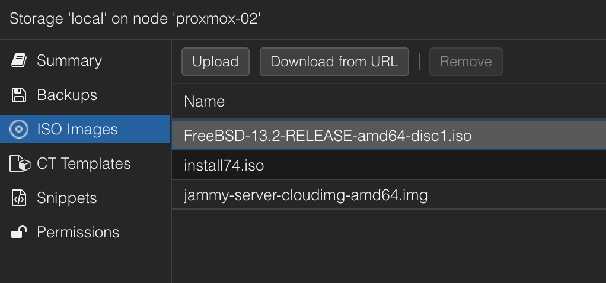
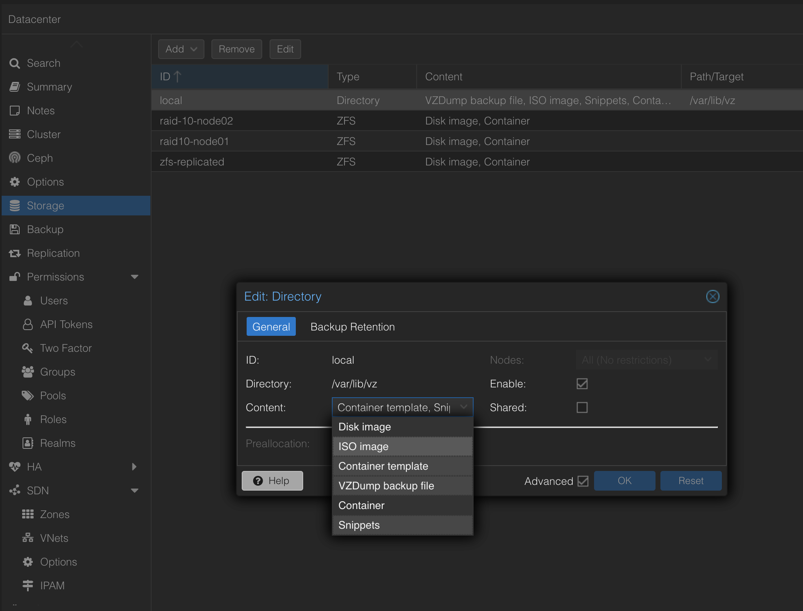
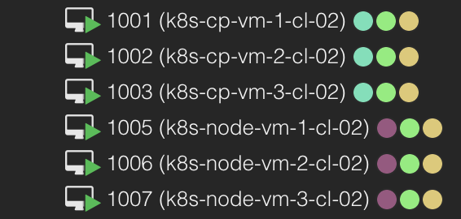

# I need a Kubernetes cluster, again

I am using a lot of my spare time playing around with my lab exploring different topics. Very much of that time again is spent with Kubernetes. It has been so many times have I deployed a new Kubernetes cluster, then after some time decommissioned it again. They way I have typically done it is using a Ubuntu template I have created, cloned it, manually adjusted all clones as needed, then manually installed Kubernetes. This takes a lot of time overall and it also stops me doing certain tasks as sometimes I just think nah.. not again. Maybe another day and I do something else instead. And, when a human being is set to do a repetive task it is destined to fail at some stage, forgot a setting, why is this one vm not working as the other vms and so on.  Now the time has come to automate these tasks with the following goal in mind:

- Reduce deployment time to a minum
- Eliminate human errors
- Consistent outcome every time
- Make it even more fun to deploy a Kubernetes cluster


I have been running Home Assistant for many years, there I have a bunch of automations automating all kinds of things in my home which just makes my everyday life a bit happier. Most of these automations just work in the background doing their stuff as a good automation should. Automating my lab deployments is something I have been thinking of getting into several times, and now I decided to get this show started. So, as usual, a lot of tinkering, trial and error until I managed to get something working the way I wanted. Probably room for improvement in several areas, that is something I will most likely use my time on "post" this blog post. Speaking of blog post, after using some time on this I had to create a blog post on it. My goal later on is a fully automated lab from VM creation, Kubernetes runtime, and applications. And when they are decommisioned I can easily spin up everything again with persistent data etc. Lets see.  

For now, this post will cover what I have done and configured so far to be able to automatically deploy the VMs for my Kubernetes clusters then the provisioning of Kubernetes itself. 

## My lab

My lab consists of two fairly spec'ed servers with a bunch of CPU cores, a lot of RAM, and a decent amount of SSDs. In regards to network they are using 10GB ethernet. In terms of power usage they are kind of friendly to my electricity bill with my "required" vms running on them, but can potentially ruin that if I throw a lot of stuff at them to chew on. 


*The total power usage above includes my switch, UPS and some other small devices. So its not that bad considering how much I can get out of it.* 

But with automation I can easily spin up some resources to be consumed for a certain period and delete again if not needed. My required VMs, that are always on, are things like Bind dns servers, PfSense, Truenas, Frigate, DCS server, a couple of linux "mgmt" vms,  Home Assistant, a couple of Kubernetes clusters hosting my Unifi controller, Traefik Proxy, Grafana etc.

For the virtualization layer on my two servers I am using Proxmox, one of the reason is that it supports PCI passthrough of my Coral TPU. I have been running Proxmox for many years and I find it to be a very decent alternative. It does what I want it to do and Proxmox has a great community!

Proxmox has been configured with these two servers as a cluster. I have not configured any VMs in HA, but with a Proxmox cluster I can easily migrate VMs between the hosts, even without shared storage, and single web-ui to manage both servers. To be "quorate" I have a cute little RPi3 with its beefy 32 GB SD card, 2GB RAM and 1GB ethernet as a [Qdevice](https://pve.proxmox.com/wiki/Cluster_Manager#_corosync_external_vote_support)

{}

On that note, one does not necessarily need have them in a cluster to do vm migration. I recently moved a bunch of VMs over two these two new servers and it was easy peasy using this command:

```bash
# executed on the source Proxmox node
qm remote-migrate <src vm_id> <dst vm_id> 'apitoken=PVEAPIToken=root@pam!migrate=<token>,host=<dst-host-ip>,fingerprint=<thumprint>' --target-bridge vmbr0 --target-storage 'raid10-node01' --online
```

I found this with the great help of the Proxmox community [here](https://forum.proxmox.com/threads/framework-for-remote-migration-to-cluster-external-proxmox-ve-hosts.118444/page-2) 

{}

Both Proxmox servers have their own local ZFS storage. In both of them I have created a dedicated zfs pool with identical name which I use for zfs replication for some of the more "critical" VMs, and  as a bonus it also reduces the migration time drastically for these VMs when I move them between my servers. The "cluster" network (vmbr1) is directly connected 2x 10GB ethernet (not through my physical switch). The other 2x 10GB interfaces are connected to my switch for all my other network needs like VM network (vmbr0) and Proxmox management. 

Throughout this post I will be using a dedicated linux vm for all my commands, interactions. So every time I install something, it is on this linux vm. 

But I am digressing, enough of the intro, get on with the automation part you were supposed to write about. Got it. 

In this post I will use the following products:

- Proxmox - [homepage](https://www.proxmox.com/en/)
- Ubuntu - [homepage](https://ubuntu.com/)
- OpenTofu - [homepage](https://opentofu.org/)
- bpg/proxmox terraform provider - [registry](https://registry.terraform.io/providers/bpg/proxmox/latest) and [github](https://github.com/bpg/terraform-provider-proxmox)
- Ansible - [homepage](https://www.ansible.com/community)
- Kubespray - [homepage](https://kubespray.io/#/) and [github](https://github.com/kubernetes-sigs/kubespray/tree/master)

## Provision VMs in Proxmox using OpenTofu

Terraform is something I have been involved in many times in my professional work, but never had the chance to actually use it myself other than know about it, and how the solutions I work with can work together with Terraform. I did notice even the Proxmox community had several post around using Terraform, so I decided to just go with Terraform. I already knew that HashiCorp had [announced](https://www.hashicorp.com/license-faq) their change of Terraform license from MPL to BSL and that [OpenTofu](https://opentofu.org/) is an OpenSource fork of Terraform. So instead of basing my automations using Terraform, I will be using OpenTofu. Read more about OpenTofu [here](https://opentofu.org/). For now OpenTofu is Terraform "compatible" and uses Terraform registries, so providers etc for Terraform works with OpenTofu. You will notice that further down, all my configs will be using terraform constructs. 


In OpenTofu/Terraform there are several concepts that one needs to know about, I will use some of them in this post like *providers*, *resources*, *provisioners* and *variables*. It is smart to read about them a bit more [here](https://opentofu.org/docs/cli/commands/) how and why to use them.

To get started with OpenTofu there are some preparations do be done. Lets start with these

### Install OpenTofu 

To get started with OpenTofu I deployed it on my linux machine using Snap, but several other alternatives is available. See more on the official OpenTofu [docs](https://opentofu.org/docs/intro/install/snap) page.

```bash
sudo snap install --classic opentofu
```

Now OpenTofu is installed and I can start using it. I also installed the bash autocompletion like this:

```bash
tofu -install-autocomplete # restart shell session...
```

 I decided to create a dedicated folder for my "projects" to live in so I have created a folder in my  home folder called *proxmox" where I have different subfolders depending on certain tasks or resources I will use OpenTofu for.

```bash
proxmox/
├── k8s-cluster-02
├── proxmox-images

```


### OpenTofu Proxmox provider

To be able to use OpenTofu with Proxmox I need a provider that can use the Proxmox API. I did some quick research on the different options out there and landed on this provider: [bpg/proxmox](https://registry.terraform.io/providers/bpg/proxmox). Seems very active and are recently updated (according to the git repo [here](https://github.com/bpg/terraform-provider-proxmox))

An OpenTofu/Terraform provider is being defined like this, and the example below is configured to install the bpg/proxmox provider I need to interact with Proxmox. 

```yaml
terraform {
  required_providers {
    proxmox = {
      source = "bpg/proxmox"
      version = "0.43.2"
    }
  }
}

provider "proxmox" {
  endpoint  = var.proxmox_api_endpoint
  api_token = var.proxmox_api_token
  insecure  = true
  ssh {
    agent    = true
    username = "root"
  }
}
```

I will save this content in a filed called *providers.tf*

First a short explanation of the two sections above. The *terraform* sections instructs OpenTofu/Terraform which provider to be downloaded and enabled. The *version* field defines a specific version to use, not the *latest* but this version. Using this field will make sure that your automation will not break if there is an update in the provider version that introduces some API changes. 

The *provider* section configures the proxmox provider how it should interact with Proxmox. Instead of using a regular username and password I have opted for using API token. Here I in the endpoint and api-token keys am using a variable value that are defined in another file called variables.tf and a credentials.auto.tfvars. There are also certain tasks in my automation that requires SSH interaction with Proxmox so I have also enabled that by configuring the *ssh* field. 

For more information on the bpg/proxmox provider, head over [here](https://registry.terraform.io/providers/bpg/proxmox/latest/docs)


### Prepare Proxmox with an API token for the OpenTofu bpg/proxmox provider

To be able to use the above configured provider with Proxmox I need to prepare Proxmox to use API token.
I followed the bpg/proxmox provider documentation [here](https://registry.terraform.io/providers/bpg/proxmox/latest/docs#api-token-authentication)  

On my "leader" Proxmox node:

```bash
# Create the user
sudo pveum user add terraform@pve
# Create a role for the user above
sudo pveum role add Terraform -privs "Datastore.Allocate Datastore.AllocateSpace Datastore.AllocateTemplate Datastore.Audit Pool.Allocate Sys.Audit Sys.Console Sys.Modify SDN.Use VM.Allocate VM.Audit VM.Clone VM.Config.CDROM VM.Config.Cloudinit VM.Config.CPU VM.Config.Disk VM.Config.HWType VM.Config.Memory VM.Config.Network VM.Config.Options VM.Migrate VM.Monitor VM.PowerMgmt User.Modify"
# Assign the terraform user to the above role
sudo pveum aclmod / -user terraform@pve -role Terraform
# Create the token
sudo pveum user token add terraform@pve provider --privsep=0

┌──────────────┬──────────────────────────────────────┐
│ key          │ value                                │
╞══════════════╪══════════════════════════════════════╡
│ full-tokenid │ terraform@pve!provider               │
├──────────────┼──────────────────────────────────────┤
│ info         │ {"privsep":"0"}                      │
├──────────────┼──────────────────────────────────────┤
│ value        │ <token>                               │
└──────────────┴──────────────────────────────────────┘
# make a backup of the token
    
```

Now I have create the API user to be used with my bpg/proxmox provider. Though it is not sufficient as I also need to define a ssh keypair on my Linux jumphost for passwordless SSH authentication which I will need to copy to my Proxmox nodes. This is done like this:

```bash
andreasm@linuxmgmt01:~$ ssh-copy-id -i id_rsa.pub root@172.18.5.102 # -i pointing to the pub key I want to use and specify the root user
```

Now, I can log into my Proxmox node using SSH without password from my Linux jumphost. But, when used in combination with opentofu its not sufficient. I need to load the key into the keystore. If I dont do that the automations that require SSH access will fail with this error message:

```bash
Error: failed to open SSH client: unable to authenticate user "root" over SSH to "172.18.5.102:22". Please verify that ssh-agent is correctly loaded with an authorized key via 'ssh-add -L' (NOTE: configurations in ~/.ssh/config are not considered by golang's ssh implementation). The exact error from ssh.Dial: ssh: handshake failed: ssh: unable to authenticate, attempted methods [none password], no supported methods remain
```

Ah, I can just configure the .ssh/config with this:

```bash
Host 172.18.5.102
    AddKeysToAgent yes
    IdentityFile ~/.ssh/id_rsa
```

Nope, cant do.. Look at the error message again:

```bash
(NOTE: configurations in ~/.ssh/config are not considered by golang's ssh implementation)
```

Ah, I can just do this then:

```bash
andreasm@linuxmgmt01:~$ eval `ssh-agent -s`
andreasm@linuxmgmt01:~$ ssh-add id_rsa
```

Yes, but that is not persistent between sessions, so you need to do this every time you log on to your Linux jumphost again. I couldnt figure out how to do this the "correct" way by following the expected Golang approach so instead I went with this approach.

```bash
# I added this in my .bashrc file
if [ -z "$SSH_AUTH_SOCK" ] ; then
 eval `ssh-agent -s`
 ssh-add ~/.ssh/id_rsa
fi
```

### OpenTofu variables and credentials

Instead of exposing username/tokens and other information directly in my provider/resource *.tf's I can refer to them by declaring them in a *variables.tf* and credentials in a *credentials.auto.tfvars*. The *variables.tf* defines the variables to use, and the credentials.auto.tfvars maps the value to a variable. I am using this content in my variable.tf 

```yaml
variable "proxmox_api_endpoint" {
  type = string
  description = "Proxmox cluster API endpoint https://proxmox-01.my-domain.net:8006"
}

variable "proxmox_api_token" {
  type = string
  description = "Proxmox API token bpg proxmox provider with ID and token"
}
```

 Then in my credentials.auto.tfvars file I have this content:

```bash
proxmox_api_endpoint = "https://proxmox-01.mu-domain.net:8006"
proxmox_api_token = "terraform@pve!provider=<token-from-earlier>"
```

To read more about these files head over [here](https://developer.hashicorp.com/terraform/language/values/variables). One can also use the varible.tf to generate prompts if I have created variables being referred to in any of my resources but do not map to a value (credentials.tfvars etc..). Then it will ask you to enter a value when doing a plan or apply.

## Prepare a Ubuntu cloud image - opentofu resource

In my automations with OpenTofu I will use a cloud image instead of a VM template in Proxmox. 

I have been using Ubuntu as my preferred Linux distribution for many years and dont see any reason to change that now. Ubuntu/Canonical do provide cloud images and they can be found [here](https://cloud-images.ubuntu.com/)

But I will not download them using my browser, instead I will be using OpenTofu with the bpg/proxmox provider to download and upload them to my Proxmox nodes. 

In my proxmox folder I have a dedicated folder for this project called *proxmox-images* 

```bash
proxmox/
├── proxmox-images

```

Inside that folder I will start by creating the following files: provider.tf file, variable.tf and credentials.auto.tfvars with the content described above. 

```bash
proxmox-images/
├── credentials.auto.tfvars
├── provider.tf
└── variables.tf

0 directories, 3 files
```

But these files dont to anything other than provides the relevant information to connect and interact with Proxmox. What I need is a OpenTofu resource with a task that needs to be done. So I will prepare a file called ubuntu_cloud_image.tf with the following content:

```yaml
resource "proxmox_virtual_environment_file" "ubuntu_cloud_image" {
  content_type = "iso"
  datastore_id = "local"
  node_name    = "proxmox-02"

  source_file {
    # you may download this image locally on your workstation and then use the local path instead of the remote URL
    path      = "https://cloud-images.ubuntu.com/jammy/current/jammy-server-cloudimg-amd64.img"

    # you may also use the SHA256 checksum of the image to verify its integrity
    checksum = "1d82c1db56e7e55e75344f1ff875b51706efe171ff55299542c29abba3a20823"
  }
}
```

 What this file does is instructing OpenTofu where to grab my Ubuntu cloud image from, then upload it to my Proxmox node 2 and a specific datastore on that node. So I have defined a *resource* to define this task. More info on this [here](https://github.com/bpg/terraform-provider-proxmox/tree/main/howtos/cloud-image).

Within this same .tf file I can define several resources to download several cloud images. I could have called the file cloud-images.tf instead and just defined all the images I wanted to download/upload to Proxmox. 
I have decided to keep this task as a separate project/folder. 

When I save this file I will now have 4 files in my *proxmox-image* folder:

```bash
proxmox-images/
├── credentials.auto.tfvars
├── provider.tf
├── ubuntu_cloud_image.tf
└── variables.tf

0 directories, 4 files
```

Thats all the files I need to start my first OpenTofu task/automation. 

Lets do a quick recap. The provider.tf instructs OpenTofu to download and enable the bpg/proxmox provider in this folder, and configure the provider to interact with my Proxmox nodes. 

Then it is the variables.tf and the credentials.auto.tfvars that provides keys and values to be used in the provider.tf. 
The ubuntu_cloud_image.tf contains the task I want OpenTofu to perform. 

So now I am ready to execute the first OpenTofu command *tofu init*.
This command initiates OpenTofu in the respective folder *proxmox-images*, downloads and enables the provider I have configured. More info [here](https://opentofu.org/docs/cli/commands/init).

So lets try it:

```bash
andreasm@linuxmgmt01:~/terraform/proxmox/proxmox-images$ tofu init

Initializing the backend...

Initializing provider plugins...
- Finding bpg/proxmox versions matching "0.43.2"...
- Installing bpg/proxmox v0.43.2...
- Installed bpg/proxmox v0.43.2 (signed, key ID DAA1958557A27403)

Providers are signed by their developers.
If you'd like to know more about provider signing, you can read about it here:
https://opentofu.org/docs/cli/plugins/signing/

OpenTofu has created a lock file .terraform.lock.hcl to record the provider
selections it made above. Include this file in your version control repository
so that OpenTofu can guarantee to make the same selections by default when
you run "tofu init" in the future.

OpenTofu has been successfully initialized!

You may now begin working with OpenTofu. Try running "tofu plan" to see
any changes that are required for your infrastructure. All OpenTofu commands
should now work.

If you ever set or change modules or backend configuration for OpenTofu,
rerun this command to reinitialize your working directory. If you forget, other
commands will detect it and remind you to do so if necessary.
```

Cool, now I have initialized my proxmox-image folder. Lets continue with creating a plan.

```bash
andreasm@linuxmgmt01:~/terraform/proxmox/proxmox-images$ tofu plan -out plan

OpenTofu used the selected providers to generate the following execution plan. Resource actions are indicated with the following symbols:
  + create

OpenTofu will perform the following actions:

  # proxmox_virtual_environment_file.ubuntu_cloud_image will be created
  + resource "proxmox_virtual_environment_file" "ubuntu_cloud_image" {
      + content_type           = "iso"
      + datastore_id           = "local"
      + file_modification_date = (known after apply)
      + file_name              = (known after apply)
      + file_size              = (known after apply)
      + file_tag               = (known after apply)
      + id                     = (known after apply)
      + node_name              = "proxmox-02"
      + overwrite              = true
      + timeout_upload         = 1800

      + source_file {
          + changed  = false
          + checksum = "1d82c1db56e7e55e75344f1ff875b51706efe171ff55299542c29abba3a20823"
          + insecure = false
          + path     = "https://cloud-images.ubuntu.com/jammy/current/jammy-server-cloudimg-amd64.img"
        }
    }

Plan: 1 to add, 0 to change, 0 to destroy.

──────────────────────────────────────────────────────────────────────────────────────────────────────────────────────────────────────────────────────────────────────────────────────────────────────────

Saved the plan to: plan

To perform exactly these actions, run the following command to apply:
    tofu apply "plan"
```

I am using the -out plan to just keep a record of the plan. It could be called whatever I wanted. Now OpenTofu tells me what its intention are, and if I am happy with the plan, I just need to apply it. 

So lets apply it:

```bash
andreasm@linuxmgmt01:~/terraform/proxmox/proxmox-images$ tofu apply plan
proxmox_virtual_environment_file.ubuntu_cloud_image: Creating...
proxmox_virtual_environment_file.ubuntu_cloud_image: Still creating... [10s elapsed]
proxmox_virtual_environment_file.ubuntu_cloud_image: Creation complete after 20s [id=local:iso/jammy-server-cloudimg-amd64.img]

Apply complete! Resources: 1 added, 0 changed, 0 destroyed.
```

And after 20 seconds I have my Ubuntu cloud image uploaded to my Proxmox node (*jammy-server-cloudimg-amd64.img*):



Thats great. Now I have my iso image to use for my VM deployments. 

Next up is to deploy a bunch of VMs to be used for a Kubernetes cluster

## Deploy VMs using OpenTofu and install Kubernetes using Ansible and Kubespray

In this section I will automate everything from deploying VMs to install Kubernetes on these VMs. This task will involve OpenTofu, Ansible and Kubespray. It will deploy 6 virtual machines, with two different resource configurations. It will deploy 3 vms intended to be used as Kubernetes controlplane nodes, and 3 vms intended to be Kubernetes worker nodes. Thats the task for OpenTofu, as soon as OpenTofu has done its part it will trigger an Ansible playbook to initiate Kubespray to install Kubernetes on all my nodes. This should then end up in a fully automated task from me just executing *tofu apply plan* to a ready Kubernetes cluster. 

I will start by creating another subfolder in my *proxmox* folder called *k8s-cluster-02*. In this folder I will reuse the following files:

```bash
k8s-cluster-02/
├── credentials.auto.tfvars
├── provider.tf
└── variables.tf

0 directories, 3 files
```

These files I will just copy from my *proxmox-images* folder. I will also need define and add a couple of other files. When I am ready with this task I will end up with these files:

```bash
k8s-cluster-02/
├── ansible.tf
├── credentials.auto.tfvars
├── k8s-cluster-02.tf
├── provider.tf
├── ubuntu_cloud_config.tf
└── variables.tf

0 directories, 7 files
```

I will go through all the files one by one. But there is still some preparations to be done to be able to complete this whole task. 

### Prepare OpenTofu to deploy my VMs

In addition to the three common files I have copied from the previous project, I will need to create two *proxmox_virtual_environment_vm* resource definitions (one for each VM type). The content of this file will be saved as *k8s-cluster-02.tf* and looks like this:

```yaml
resource "proxmox_virtual_environment_vm" "k8s-cp-vms-cl02" {
  count       = 3
  name        = "k8s-cp-vm-${count.index + 1}-cl-02"
  description = "Managed by Terraform"
  tags        = ["terraform", "ubuntu", "k8s-cp"]

  node_name = "proxmox-02"
  vm_id     = "100${count.index + 1}"


  cpu {
    cores = 2
    type = "host"
  }

  memory {
    dedicated = 2048
  }


  agent {
    # read 'Qemu guest agent' section, change to true only when ready
    enabled = true
  }

  startup {
    order      = "3"
    up_delay   = "60"
    down_delay = "60"
  }

  disk {
    datastore_id = "raid-10-node02"
    file_id      = "local:iso/jammy-server-cloudimg-amd64.img"
    interface    = "virtio0"
    iothread     = true
    discard      = "on"
    size         = 40
    file_format  = "raw"
  }


  initialization {
    dns {
      servers = ["10.100.1.7", "10.100.1.6"]
      domain = "my-domain.net"
    }
    ip_config {
      ipv4 {
        address = "10.160.1.2${count.index + 1}/24"
        gateway = "10.160.1.1"
      }
    }
    datastore_id = "raid-10-node02"

    user_data_file_id = proxmox_virtual_environment_file.ubuntu_cloud_init.id
  }

  network_device {
    bridge = "vmbr0"
    vlan_id = "216"
  }

  operating_system {
    type = "l26"
  }

  keyboard_layout = "no"

  lifecycle {
    ignore_changes = [
      network_device,
    ]
  }


}

resource "proxmox_virtual_environment_vm" "k8s-worker-vms-cl02" {
  count       = 3
  name        = "k8s-node-vm-${count.index + 1}-cl-02"
  description = "Managed by Terraform"
  tags        = ["terraform", "ubuntu", "k8s-node"]

  node_name = "proxmox-02"
  vm_id     = "100${count.index + 5}"


  cpu {
    cores = 4
    type = "host"
  }

  memory {
    dedicated = 4096
  }


  agent {
    # read 'Qemu guest agent' section, change to true only when ready
    enabled = true
  }

  startup {
    order      = "3"
    up_delay   = "60"
    down_delay = "60"
  }

  disk {
    datastore_id = "raid-10-node02"
    file_id      = "local:iso/jammy-server-cloudimg-amd64.img"
    interface    = "virtio0"
    iothread     = true
    discard      = "on"
    size         = 60
    file_format  = "raw"
  }


  initialization {
    dns {
      servers = ["10.100.1.7", "10.100.1.6"]
      domain = "my-domain.net"
    }
    ip_config {
      ipv4 {
        address = "10.160.1.2${count.index + 5}/24"
        gateway = "10.160.1.1"
      }
    }
    datastore_id = "raid-10-node02"

    user_data_file_id = proxmox_virtual_environment_file.ubuntu_cloud_init.id
  }

  network_device {
    bridge = "vmbr0"
    vlan_id = "216"
  }

  operating_system {
    type = "l26"
  }

  keyboard_layout = "no"

  lifecycle {
    ignore_changes = [
      network_device,
    ]
  }


}
```

In this file I have define two *proxmox_virtual_environment_vm* resources called *k8s-cp-vms-cl02* and *k8s-worker-vms-cl02* respectively.
I am using count.index in some of the fields where I need to automatically generate an increasing number. Like IP address, VM_ID, Name. It is also referring to my Ubuntu cloud image as installation source, then a *user_data_file_id* (will be shown next) to do a simple cloud-init on the VMs. 

Then I need to configure a *proxmox_virtual_environment_file* resource called *ubuntu_cloud_init* to trigger a cloud-init task to configure some basic initial config on my VMs. 

This is the content of this file:

```yaml
resource "proxmox_virtual_environment_file" "ubuntu_cloud_init" {
  content_type = "snippets"
  datastore_id = "local"
  node_name    = "proxmox-02"

  source_raw {
    data = <<EOF
#cloud-config
chpasswd:
  list: |
    ubuntu:ubuntu
  expire: false
packages:
  - qemu-guest-agent
timezone: Europe/Oslo

users:
  - default
  - name: ubuntu
    groups: sudo
    shell: /bin/bash
    ssh-authorized-keys:
      - ${trimspace("ssh-rsa <sha356> user@mail.com")}
    sudo: ALL=(ALL) NOPASSWD:ALL

power_state:
    delay: now
    mode: reboot
    message: Rebooting after cloud-init completion
    condition: true

EOF

    file_name = "ubuntu.cloud-config.yaml"
  }
}
```

This will be used by all my OpenTofu deployed VMs in this task. It will install the *qemu-guest-agent*, configure a timezone, copy my Linux jumphost public key so I can log in to them using SSH without password. Then a quick reboot after all task completed to get the qemu-agent to report correctly to Proxmox.  This will be uploaded to my Proxmox server as a Snippet. For Snippets to work. One need to enable this here under Datacenter -> Storage 



Now I can go ahead and perform *tofu init* in this folder, but I am still not ready. I Kubernetes to be deployed also remember. For that I will use Kubespray. 

### Install and configure Kubespray

If you have not heard about Kubespray before, head over [here](https://github.com/kubernetes-sigs/kubespray/tree/master) for more info. I have been following the guides from Kubespray to get it working, and its very well documented. 

Kubespray is a really powerful way to deploy Kubernetes with a lot of options and customizations. I just want to highlight Kubespray in this section as it does a really great job in automating Kubernetes deployment.

A quote from the Kubespray pages:

> # [Comparison](https://kubespray.io/#/docs/comparisons?id=comparison)
>
> ## [Kubespray vs Kops](https://kubespray.io/#/docs/comparisons?id=kubespray-vs-kops)
>
> Kubespray runs on bare metal and most clouds, using Ansible as its substrate for provisioning and orchestration. [Kops](https://github.com/kubernetes/kops) performs the provisioning and orchestration itself, and as such is less flexible in deployment platforms. For people with familiarity with Ansible, existing Ansible deployments or the desire to run a Kubernetes cluster across multiple platforms, Kubespray is a good choice. Kops, however, is more tightly integrated with the unique features of the clouds it supports so it could be a better choice if you know that you will only be using one platform for the foreseeable future.
>
> ## [Kubespray vs Kubeadm](https://kubespray.io/#/docs/comparisons?id=kubespray-vs-kubeadm)
>
> [Kubeadm](https://github.com/kubernetes/kubeadm) provides domain Knowledge of Kubernetes clusters' life cycle management, including self-hosted layouts, dynamic discovery services and so on. Had it belonged to the new [operators world](https://coreos.com/blog/introducing-operators.html), it may have been named a "Kubernetes cluster operator". Kubespray however, does generic configuration management tasks from the "OS operators" ansible world, plus some initial K8s clustering (with networking plugins included) and control plane bootstrapping.
>
> Kubespray has started using `kubeadm` internally for cluster creation since v2.3 in order to consume life cycle management domain knowledge from it and offload generic OS configuration things from it, which hopefully benefits both sides.

On my Linux jumphost I have done the following to prepare for Kubespray

```bash
# clone the Kubespray repo
andreasm@linuxmgmt01:~/terraform/proxmox$ git clone https://github.com/kubernetes-sigs/kubespray.git
# kubespray folder created under my proxmox folder
andreasm@linuxmgmt01:~/terraform/proxmox$ ls
k8s-cluster-02  kubespray  proxmox-images
# Python dependencies -  these I am not sure are needed but I installed them anyways.
sudo apt install software-properties-common
sudo add-apt-repository ppa:deadsnakes/ppa # used this repo to get a newer Python 3 than default repo
sudo apt update
sudo apt install python3.12 python3-pip python3-virtualenv


```

Don't try to install Ansible in the systemwide, it will not work. Follow the Kubespray documentation to install ansible in a Python Virtual Environment. 

```bash
andreasm@linuxmgmt01:~/terraform/proxmox$ VENVDIR=kubespray-venv
andreasm@linuxmgmt01:~/terraform/proxmox$ KUBESPRAYDIR=kubespray
andreasm@linuxmgmt01:~/terraform/proxmox$ python3 -m venv $VENVDIR
andreasm@linuxmgmt01:~/terraform/proxmox$ source $VENVDIR/bin/activate
(kubespray-venv) andreasm@linuxmgmt01:~/terraform/proxmox$ cd $KUBESPRAYDIR
(kubespray-venv) andreasm@linuxmgmt01:~/terraform/proxmox/kubespray$ pip install -U -r requirements.txt
```

To exit out of the python environment type *deactivate*. 

Now I have these subfolders under my *proxmox* folder:

```bash

andreasm@linuxmgmt01:~/terraform/proxmox$ tree -L 1
.
├── k8s-cluster-02
├── kubespray
├── kubespray-venv
├── proxmox-images

4 directories, 0 files
```

Next thing I need to do is to copy a sample folder inside the kubespray folder to a folder that reflects the kubernetes cluster name I am planning to deploy.

```bash
andreasm@linuxmgmt01:~/terraform/proxmox/kubespray$ cp -rfp inventory/sample inventory/k8s-cluster-02
```

This sample folder contains a couple of files and directories. The file I am interested in right now is the *inventory.ini* file. I need to populate this file with the nodes, including the control plane nodes, that will form my Kubernetes cluster.  This is how it looks like now, default:

```yaml
# ## Configure 'ip' variable to bind kubernetes services on a
# ## different ip than the default iface
# ## We should set etcd_member_name for etcd cluster. The node that is not a etcd member do not need to set the value, or can set the empty string value.
[all]
# node1 ansible_host=95.54.0.12  # ip=10.3.0.1 etcd_member_name=etcd1
# node2 ansible_host=95.54.0.13  # ip=10.3.0.2 etcd_member_name=etcd2
# node3 ansible_host=95.54.0.14  # ip=10.3.0.3 etcd_member_name=etcd3
# node4 ansible_host=95.54.0.15  # ip=10.3.0.4 etcd_member_name=etcd4
# node5 ansible_host=95.54.0.16  # ip=10.3.0.5 etcd_member_name=etcd5
# node6 ansible_host=95.54.0.17  # ip=10.3.0.6 etcd_member_name=etcd6

# ## configure a bastion host if your nodes are not directly reachable
# [bastion]
# bastion ansible_host=x.x.x.x ansible_user=some_user

[kube_control_plane]
# node1
# node2
# node3

[etcd]
# node1
# node2
# node3

[kube_node]
# node2
# node3
# node4
# node5
# node6

[calico_rr]

[k8s_cluster:children]
kube_control_plane
kube_node
calico_rr
```

This is just a sample, but nice to know how it should be defined. I will create a OpenTofu task to create this inventory file for me with the corresponding VMs I am deploying in the same task/project. This will autopopulate this *inventory.ini* file with all the necessary information. So I can just go ahead and delete the *inventory.ini* file that has been copied from the *sample* folder to my new *k8s-cluster-02* folder. The other folders and files contains several variables/settings I can adjust to my liking. Like different CNIs, Kubernetes version etc. But I will not cover these here, head over to the official Kubespray docs for more info on that. These are the files/folder:

```bash
andreasm@linuxmgmt01:~/terraform/proxmox/kubespray/inventory/k8s-cluster-02/group_vars$ tree -L 1
.
├── all
├── etcd.yml
└── k8s_cluster

2 directories, 1 file
```

I will deploy my Kubernetes cluster "stock" so these files are left untouched for now, except the *inventory.ini* file. 

Now Kubespray is ready to execute Ansible to configure my Kubernetes cluster as soon as my OpenTofu provisioned VMs has been deployed. The last step I need to do is to confgiure a new .tf file to create this *inventory.ini* file and kick of the Ansible command to fire up Kubespray. 

### Configure OpenTofu to kick off Kubespray

The last .tf file in my fully automated Kubernetes installation is the *ansible.tf* file that contains this information:

```yaml
# Generate inventory file
resource "local_file" "ansible_inventory" {
  filename = "/home/andreasm/terraform/proxmox/kubespray/inventory/k8s-cluster-02/inventory.ini"
  content = <<-EOF
  [all]
  ${proxmox_virtual_environment_vm.k8s-cp-vms-cl02[0].name} ansible_host=${proxmox_virtual_environment_vm.k8s-cp-vms-cl02[0].ipv4_addresses[1][0]}
  ${proxmox_virtual_environment_vm.k8s-cp-vms-cl02[1].name} ansible_host=${proxmox_virtual_environment_vm.k8s-cp-vms-cl02[1].ipv4_addresses[1][0]}
  ${proxmox_virtual_environment_vm.k8s-cp-vms-cl02[2].name} ansible_host=${proxmox_virtual_environment_vm.k8s-cp-vms-cl02[2].ipv4_addresses[1][0]}
  ${proxmox_virtual_environment_vm.k8s-worker-vms-cl02[0].name} ansible_host=${proxmox_virtual_environment_vm.k8s-worker-vms-cl02[0].ipv4_addresses[1][0]}
  ${proxmox_virtual_environment_vm.k8s-worker-vms-cl02[1].name} ansible_host=${proxmox_virtual_environment_vm.k8s-worker-vms-cl02[1].ipv4_addresses[1][0]}
  ${proxmox_virtual_environment_vm.k8s-worker-vms-cl02[2].name} ansible_host=${proxmox_virtual_environment_vm.k8s-worker-vms-cl02[2].ipv4_addresses[1][0]}

  [kube_control_plane]
  ${proxmox_virtual_environment_vm.k8s-cp-vms-cl02[0].name}
  ${proxmox_virtual_environment_vm.k8s-cp-vms-cl02[1].name}
  ${proxmox_virtual_environment_vm.k8s-cp-vms-cl02[2].name}

  [etcd]
  ${proxmox_virtual_environment_vm.k8s-cp-vms-cl02[0].name}
  ${proxmox_virtual_environment_vm.k8s-cp-vms-cl02[1].name}
  ${proxmox_virtual_environment_vm.k8s-cp-vms-cl02[2].name}

  [kube_node]
  ${proxmox_virtual_environment_vm.k8s-worker-vms-cl02[0].name}
  ${proxmox_virtual_environment_vm.k8s-worker-vms-cl02[1].name}
  ${proxmox_virtual_environment_vm.k8s-worker-vms-cl02[2].name}

  [k8s_cluster:children]
  kube_node
  kube_control_plane

  EOF
}

resource "null_resource" "ansible_command" {
  provisioner "local-exec" {
    command = "./kubespray.k8s-cluster-02.sh > k8s-cluster-02/ansible_output.log 2>&1"
    interpreter = ["/bin/bash", "-c"]
    working_dir = "/home/andreasm/terraform/proxmox"
    }
  depends_on = [proxmox_virtual_environment_vm.k8s-cp-vms-cl02, proxmox_virtual_environment_vm.k8s-worker-vms-cl02, local_file.ansible_inventory]
  }
```

 This will create the *inventory.ini* in the */proxmox/kubespray/inventory/k8s-cluster-02/* for Kubespray to use. Then it will fire a command refering to a bash script (more on that further down) to trigger the Ansible command:

```bash
ansible-playbook -i inventory/k8s-cluster-02/inventory.ini --become --become-user=root cluster.yml -u ubuntu
```

For this to work I had to create a bash script that activated the Kubespray virtual environment:

```bash
#!/bin/bash

# Set working directory
WORKING_DIR="/home/andreasm/terraform/proxmox"
cd "$WORKING_DIR" || exit

# Set virtual environment variables
VENVDIR="kubespray-venv"
KUBESPRAYDIR="kubespray"

# Activate virtual environment
source "$VENVDIR/bin/activate" || exit

# Change to Kubespray directory
cd "$KUBESPRAYDIR" || exit

# Run Ansible playbook
ansible-playbook -i inventory/k8s-cluster-02/inventory.ini --become --become-user=root cluster.yml -u ubuntu
```

I will create and save this file in my *proxmox* folder. 

This is now the content of my proxmox folder:

```bash
andreasm@linuxmgmt01:~/terraform/proxmox$ tree -L 1
.
├── k8s-cluster-02
├── kubespray
├── kubespray-venv
├── kubespray.k8s-cluster-02.sh
└── proxmox-images

4 directories, 1 file
```


And this is the content in the k8s-cluster-02 folder where I have my OpenTofu tasks defined:

```bash
andreasm@linuxmgmt01:~/terraform/proxmox/k8s-cluster-02$ tree -L 1
.
├── ansible.tf
├── credentials.auto.tfvars
├── k8s-cluster-02.tf
├── provider.tf
├── ubuntu_cloud_config.tf
└── variables.tf

0 directories, 6 files
```


Its time to put it all to a test

### A fully automated provisioning of Kubernetes on Proxmox using OpenTofu, Ansible and Kubespray

To get this show started, it is the same procedure as it was with my cloud image task. Need to run tofu init, then create a plan, check the output and finally approve it. So lets see how this goes. 

From within my *./proxmox/k8s-cluster-02* folder:

```bash
andreasm@linuxmgmt01:~/terraform/proxmox/k8s-cluster-02$ tofu init

Initializing the backend...

Initializing provider plugins...
- Finding latest version of hashicorp/null...
- Finding bpg/proxmox versions matching "0.43.2"...
- Finding latest version of hashicorp/local...
- Installing hashicorp/null v3.2.2...
- Installed hashicorp/null v3.2.2 (signed, key ID 0C0AF313E5FD9F80)
- Installing bpg/proxmox v0.43.2...
- Installed bpg/proxmox v0.43.2 (signed, key ID DAA1958557A27403)
- Installing hashicorp/local v2.4.1...
- Installed hashicorp/local v2.4.1 (signed, key ID 0C0AF313E5FD9F80)

Providers are signed by their developers.
If you'd like to know more about provider signing, you can read about it here:
https://opentofu.org/docs/cli/plugins/signing/

OpenTofu has created a lock file .terraform.lock.hcl to record the provider
selections it made above. Include this file in your version control repository
so that OpenTofu can guarantee to make the same selections by default when
you run "tofu init" in the future.

OpenTofu has been successfully initialized!

You may now begin working with OpenTofu. Try running "tofu plan" to see
any changes that are required for your infrastructure. All OpenTofu commands
should now work.

If you ever set or change modules or backend configuration for OpenTofu,
rerun this command to reinitialize your working directory. If you forget, other
commands will detect it and remind you to do so if necessary.
```


Then create the plan:

```bash
OpenTofu used the selected providers to generate the following execution plan. Resource actions are indicated with the following symbols:
  + create

OpenTofu will perform the following actions:

  # local_file.ansible_inventory will be created
  + resource "local_file" "ansible_inventory" {
      + content              = (known after apply)
      + content_base64sha256 = (known after apply)
      + content_base64sha512 = (known after apply)
      + content_md5          = (known after apply)
      + content_sha1         = (known after apply)
      + content_sha256       = (known after apply)
      + content_sha512       = (known after apply)
      + directory_permission = "0777"
      + file_permission      = "0777"
      + filename             = "/home/andreasm/terraform/proxmox/kubespray/inventory/k8s-cluster-02/inventory.ini"
      + id                   = (known after apply)
    }

  # null_resource.ansible_command will be created
  + resource "null_resource" "ansible_command" {
      + id = (known after apply)
    }

  # proxmox_virtual_environment_file.ubuntu_cloud_init will be created
  + resource "proxmox_virtual_environment_file" "ubuntu_cloud_init" {
      + content_type           = "snippets"
      + datastore_id           = "local"
      + file_modification_date = (known after apply)
      + file_name              = (known after apply)
      + file_size              = (known after apply)
      + file_tag               = (known after apply)
      + id                     = (known after apply)
      + node_name              = "proxmox-02"
      + overwrite              = true
      + timeout_upload         = 1800

<<redacted>>
Plan: 9 to add, 0 to change, 0 to destroy.

──────────────────────────────────────────────────────────────────────────────────────────────────────────────────────────────────────────────────────────────────────────────────────────────────────────

Saved the plan to: plan

To perform exactly these actions, run the following command to apply:
    tofu apply "plan"
```


It looks good to me, lets apply it:

```bash
andreasm@linuxmgmt01:~/terraform/proxmox/k8s-cluster-02$ tofu apply plan
proxmox_virtual_environment_file.ubuntu_cloud_init: Creating...
proxmox_virtual_environment_file.ubuntu_cloud_init: Creation complete after 1s [id=local:snippets/ubuntu.cloud-config.yaml]
proxmox_virtual_environment_vm.k8s-worker-vms-cl02[2]: Creating...
proxmox_virtual_environment_vm.k8s-worker-vms-cl02[1]: Creating...
proxmox_virtual_environment_vm.k8s-worker-vms-cl02[0]: Creating...
proxmox_virtual_environment_vm.k8s-cp-vms-cl02[1]: Creating...
proxmox_virtual_environment_vm.k8s-cp-vms-cl02[0]: Creating...
proxmox_virtual_environment_vm.k8s-cp-vms-cl02[2]: Creating...
proxmox_virtual_environment_vm.k8s-worker-vms-cl02[2]: Still creating... [10s elapsed]
proxmox_virtual_environment_vm.k8s-worker-vms-cl02[1]: Still creating... [10s elapsed]
proxmox_virtual_environment_vm.k8s-worker-vms-cl02[0]: Still creating... [10s elapsed]
proxmox_virtual_environment_vm.k8s-cp-vms-cl02[1]: Still creating... [10s elapsed]
proxmox_virtual_environment_vm.k8s-cp-vms-cl02[0]: Still creating... [10s elapsed]
proxmox_virtual_environment_vm.k8s-cp-vms-cl02[2]: Still creating... [10s elapsed]
<<redacted>>
proxmox_virtual_environment_vm.k8s-worker-vms-cl02[2]: Still creating... [1m30s elapsed]
proxmox_virtual_environment_vm.k8s-worker-vms-cl02[1]: Still creating... [1m30s elapsed]
proxmox_virtual_environment_vm.k8s-worker-vms-cl02[0]: Still creating... [1m30s elapsed]
proxmox_virtual_environment_vm.k8s-cp-vms-cl02[1]: Still creating... [1m30s elapsed]
proxmox_virtual_environment_vm.k8s-cp-vms-cl02[0]: Still creating... [1m30s elapsed]
proxmox_virtual_environment_vm.k8s-cp-vms-cl02[2]: Still creating... [1m30s elapsed]
proxmox_virtual_environment_vm.k8s-worker-vms-cl02[0]: Creation complete after 1m32s [id=1005]
proxmox_virtual_environment_vm.k8s-cp-vms-cl02[1]: Creation complete after 1m32s [id=1002]
proxmox_virtual_environment_vm.k8s-worker-vms-cl02[1]: Creation complete after 1m33s [id=1006]
proxmox_virtual_environment_vm.k8s-worker-vms-cl02[2]: Creation complete after 1m33s [id=1007]
proxmox_virtual_environment_vm.k8s-cp-vms-cl02[2]: Creation complete after 1m34s [id=1003]
proxmox_virtual_environment_vm.k8s-cp-vms-cl02[0]: Creation complete after 1m37s [id=1001]
```

1m37s to create my 6 VMs, ready for the Kubernetes installation.


And in Proxmox I have 6 new VMs with correct name, vm_id, tags and all:



Let me check if the *inventory.ini* file has been created correct:

```yaml
andreasm@linuxmgmt01:~/terraform/proxmox/kubespray/inventory/k8s-cluster-02$ cat inventory.ini
[all]
k8s-cp-vm-1-cl-02 ansible_host=10.160.1.21
k8s-cp-vm-2-cl-02 ansible_host=10.160.1.22
k8s-cp-vm-3-cl-02 ansible_host=10.160.1.23
k8s-node-vm-1-cl-02 ansible_host=10.160.1.25
k8s-node-vm-2-cl-02 ansible_host=10.160.1.26
k8s-node-vm-3-cl-02 ansible_host=10.160.1.27

[kube_control_plane]
k8s-cp-vm-1-cl-02
k8s-cp-vm-2-cl-02
k8s-cp-vm-3-cl-02

[etcd]
k8s-cp-vm-1-cl-02
k8s-cp-vm-2-cl-02
k8s-cp-vm-3-cl-02

[kube_node]
k8s-node-vm-1-cl-02
k8s-node-vm-2-cl-02
k8s-node-vm-3-cl-02

[k8s_cluster:children]
kube_node
kube_control_plane
```

Now the last task the ansible_command:

```bash
local_file.ansible_inventory: Creating...
local_file.ansible_inventory: Creation complete after 0s [id=1d19a8be76746178f26336defc9ce96c6e82a791]
null_resource.ansible_command: Creating...
null_resource.ansible_command: Provisioning with 'local-exec'...
null_resource.ansible_command (local-exec): Executing: ["/bin/bash" "-c" "./kubespray.k8s-cluster-02.sh > k8s-cluster-02/ansible_output.log 2>&1"]
null_resource.ansible_command: Still creating... [10s elapsed]
null_resource.ansible_command: Still creating... [20s elapsed]
null_resource.ansible_command: Still creating... [30s elapsed]
null_resource.ansible_command: Still creating... [40s elapsed]
null_resource.ansible_command: Still creating... [50s elapsed]
<<redacted>>
null_resource.ansible_command: Still creating... [16m50s elapsed]
null_resource.ansible_command: Still creating... [17m0s elapsed]
null_resource.ansible_command: Creation complete after 17m4s [id=5215143035945962122]

Apply complete! Resources: 9 added, 0 changed, 0 destroyed.
```

That took 17m4s to deploy a fully working Kubernetes cluster with no intervention from me at all. 

From the ansible_output.log:

```bash
PLAY RECAP *********************************************************************
k8s-cp-vm-1-cl-02          : ok=691  changed=139  unreachable=0    failed=0    skipped=1080 rescued=0    ignored=6
k8s-cp-vm-2-cl-02          : ok=646  changed=131  unreachable=0    failed=0    skipped=1050 rescued=0    ignored=3
k8s-cp-vm-3-cl-02          : ok=648  changed=132  unreachable=0    failed=0    skipped=1048 rescued=0    ignored=3
k8s-node-vm-1-cl-02        : ok=553  changed=93   unreachable=0    failed=0    skipped=840  rescued=0    ignored=1
k8s-node-vm-2-cl-02        : ok=509  changed=90   unreachable=0    failed=0    skipped=739  rescued=0    ignored=1
k8s-node-vm-3-cl-02        : ok=509  changed=90   unreachable=0    failed=0    skipped=739  rescued=0    ignored=1
localhost                  : ok=3    changed=0    unreachable=0    failed=0    skipped=0    rescued=0    ignored=0

Monday 15 January 2024  21:59:02 +0000 (0:00:00.288)       0:17:01.376 ********
===============================================================================
download : Download_file | Download item ------------------------------- 71.29s
download : Download_file | Download item ------------------------------- 36.04s
kubernetes/kubeadm : Join to cluster ----------------------------------- 19.06s
container-engine/containerd : Download_file | Download item ------------ 16.73s
download : Download_container | Download image if required ------------- 15.65s
container-engine/runc : Download_file | Download item ------------------ 15.53s
container-engine/nerdctl : Download_file | Download item --------------- 14.75s
container-engine/crictl : Download_file | Download item ---------------- 14.66s
download : Download_container | Download image if required ------------- 13.75s
container-engine/crictl : Extract_file | Unpacking archive ------------- 13.35s
kubernetes/control-plane : Kubeadm | Initialize first master ----------- 10.16s
container-engine/nerdctl : Extract_file | Unpacking archive ------------- 9.99s
kubernetes/preinstall : Install packages requirements ------------------- 9.93s
kubernetes/control-plane : Joining control plane node to the cluster. --- 9.21s
container-engine/runc : Download_file | Validate mirrors ---------------- 9.20s
container-engine/crictl : Download_file | Validate mirrors -------------- 9.15s
container-engine/nerdctl : Download_file | Validate mirrors ------------- 9.12s
container-engine/containerd : Download_file | Validate mirrors ---------- 9.06s
container-engine/containerd : Containerd | Unpack containerd archive ---- 8.99s
download : Download_container | Download image if required -------------- 8.19s
```

I guess I am gonna spin up a couple of Kubernetes clusters going forward :smile:

If something should fail I have configured the *ansible_command* to pipe the output to a file called *ansible_output.log* I can check. This pipes out the whole Kubespray operation. Some simple tests to do is also checking if Ansible can reach the VMs (after they have been deployed ofcourse). This command needs to be run within the python environment again. 

```bash
# activate the environment
andreasm@linuxmgmt01:~/terraform/proxmox$ source $VENVDIR/bin/activate
# ping all nodes
(kubespray-venv) andreasm@linuxmgmt01:~/terraform/proxmox$ ansible -i inventory/k8s-cluster-02/inventory.ini -m ping all -u ubuntu
```

Now let me log into one of the Kubernetes Control plane and check if there is a Kubernetes cluster ready or not:

```bash
root@k8s-cp-vm-1-cl-02:/home/ubuntu# kubectl get nodes
NAME                  STATUS   ROLES           AGE     VERSION
k8s-cp-vm-1-cl-02     Ready    control-plane   6m13s   v1.28.5
k8s-cp-vm-2-cl-02     Ready    control-plane   6m1s    v1.28.5
k8s-cp-vm-3-cl-02     Ready    control-plane   5m57s   v1.28.5
k8s-node-vm-1-cl-02   Ready    <none>          5m24s   v1.28.5
k8s-node-vm-2-cl-02   Ready    <none>          5m23s   v1.28.5
k8s-node-vm-3-cl-02   Ready    <none>          5m19s   v1.28.5
root@k8s-cp-vm-1-cl-02:/home/ubuntu# kubectl get pods -A
NAMESPACE     NAME                                        READY   STATUS    RESTARTS   AGE
kube-system   calico-kube-controllers-648dffd99-lr82q     1/1     Running   0          4m25s
kube-system   calico-node-b25gf                           1/1     Running   0          4m52s
kube-system   calico-node-h7lpr                           1/1     Running   0          4m52s
kube-system   calico-node-jdkb9                           1/1     Running   0          4m52s
kube-system   calico-node-vsgqq                           1/1     Running   0          4m52s
kube-system   calico-node-w6vrc                           1/1     Running   0          4m52s
kube-system   calico-node-x95mh                           1/1     Running   0          4m52s
kube-system   coredns-77f7cc69db-29t6b                    1/1     Running   0          4m13s
kube-system   coredns-77f7cc69db-2ph9d                    1/1     Running   0          4m10s
kube-system   dns-autoscaler-8576bb9f5b-8bzqp             1/1     Running   0          4m11s
kube-system   kube-apiserver-k8s-cp-vm-1-cl-02            1/1     Running   1          6m14s
kube-system   kube-apiserver-k8s-cp-vm-2-cl-02            1/1     Running   1          5m55s
kube-system   kube-apiserver-k8s-cp-vm-3-cl-02            1/1     Running   1          6m1s
kube-system   kube-controller-manager-k8s-cp-vm-1-cl-02   1/1     Running   2          6m16s
kube-system   kube-controller-manager-k8s-cp-vm-2-cl-02   1/1     Running   2          5m56s
kube-system   kube-controller-manager-k8s-cp-vm-3-cl-02   1/1     Running   2          6m1s
kube-system   kube-proxy-6jt89                            1/1     Running   0          5m22s
kube-system   kube-proxy-9w5f2                            1/1     Running   0          5m22s
kube-system   kube-proxy-k7l9g                            1/1     Running   0          5m22s
kube-system   kube-proxy-p7wqt                            1/1     Running   0          5m22s
kube-system   kube-proxy-qfmg5                            1/1     Running   0          5m22s
kube-system   kube-proxy-v6tcn                            1/1     Running   0          5m22s
kube-system   kube-scheduler-k8s-cp-vm-1-cl-02            1/1     Running   1          6m14s
kube-system   kube-scheduler-k8s-cp-vm-2-cl-02            1/1     Running   1          5m56s
kube-system   kube-scheduler-k8s-cp-vm-3-cl-02            1/1     Running   1          6m
kube-system   nginx-proxy-k8s-node-vm-1-cl-02             1/1     Running   0          5m25s
kube-system   nginx-proxy-k8s-node-vm-2-cl-02             1/1     Running   0          5m20s
kube-system   nginx-proxy-k8s-node-vm-3-cl-02             1/1     Running   0          5m20s
kube-system   nodelocaldns-4z72v                          1/1     Running   0          4m9s
kube-system   nodelocaldns-8wv4j                          1/1     Running   0          4m9s
kube-system   nodelocaldns-kl6fw                          1/1     Running   0          4m9s
kube-system   nodelocaldns-pqxpj                          1/1     Running   0          4m9s
kube-system   nodelocaldns-qmrq8                          1/1     Running   0          4m9s
kube-system   nodelocaldns-vqnbd                          1/1     Running   0          4m9s
root@k8s-cp-vm-1-cl-02:/home/ubuntu#
```

Nice nice nice. Now I can go ahead and grab the kubeconfig, configure my loadbalancer to loadbalance the Kubernetes API and start using my newly decomposable provisioned cluster. 

### Cleaning up

When I am done with my Kubernetes cluster its just about doing a *tofu destroy* command and everything is neatly cleaned up. I have not configured any persistent storage yet. So if I have deployed some apps on this cluster and decides to delete it any data that has been created I want to keep will be deleted. So its wise to look into how to keep certain data even after the deletion of my cluster.

There are two ways I can clean up. If I want to keep the nodes running but just reset the Kubernetes installation I can execute the following command:

```bash
# from the Kubespray environment
(kubespray-venv) andreasm@linuxmgmt01:~/terraform/proxmox/kubespray$ ansible-playbook -i inventory/k8s-cluster-02/hosts.yaml --become --become-user=root reset.yml -u ubuntu
```

Or a full wipe, including the deployed VMs:

```bash
# Inside the k8s-cluster-02 OpenTofu project folder
andreasm@linuxmgmt01:~/terraform/proxmox/k8s-cluster-02$ tofu destroy
Do you really want to destroy all resources?
  OpenTofu will destroy all your managed infrastructure, as shown above.
  There is no undo. Only 'yes' will be accepted to confirm.

  Enter a value:yes
null_resource.ansible_command: Destroying... [id=5215143035945962122]
null_resource.ansible_command: Destruction complete after 0s
local_file.ansible_inventory: Destroying... [id=1d19a8be76746178f26336defc9ce96c6e82a791]
local_file.ansible_inventory: Destruction complete after 0s
proxmox_virtual_environment_vm.k8s-cp-vms-cl02[1]: Destroying... [id=1002]
proxmox_virtual_environment_vm.k8s-cp-vms-cl02[2]: Destroying... [id=1003]
proxmox_virtual_environment_vm.k8s-worker-vms-cl02[0]: Destroying... [id=1005]
proxmox_virtual_environment_vm.k8s-worker-vms-cl02[2]: Destroying... [id=1007]
proxmox_virtual_environment_vm.k8s-worker-vms-cl02[1]: Destroying... [id=1006]
proxmox_virtual_environment_vm.k8s-cp-vms-cl02[0]: Destroying... [id=1001]
proxmox_virtual_environment_vm.k8s-worker-vms-cl02[0]: Destruction complete after 7s
proxmox_virtual_environment_vm.k8s-worker-vms-cl02[2]: Destruction complete after 7s
proxmox_virtual_environment_vm.k8s-worker-vms-cl02[1]: Destruction complete after 9s
proxmox_virtual_environment_vm.k8s-cp-vms-cl02[1]: Still destroying... [id=1002, 10s elapsed]
proxmox_virtual_environment_vm.k8s-cp-vms-cl02[2]: Still destroying... [id=1003, 10s elapsed]
proxmox_virtual_environment_vm.k8s-cp-vms-cl02[0]: Still destroying... [id=1001, 10s elapsed]
proxmox_virtual_environment_vm.k8s-cp-vms-cl02[0]: Destruction complete after 12s
proxmox_virtual_environment_vm.k8s-cp-vms-cl02[1]: Still destroying... [id=1002, 20s elapsed]
proxmox_virtual_environment_vm.k8s-cp-vms-cl02[2]: Still destroying... [id=1003, 20s elapsed]
proxmox_virtual_environment_vm.k8s-cp-vms-cl02[1]: Still destroying... [id=1002, 30s elapsed]
proxmox_virtual_environment_vm.k8s-cp-vms-cl02[2]: Still destroying... [id=1003, 30s elapsed]
proxmox_virtual_environment_vm.k8s-cp-vms-cl02[1]: Still destroying... [id=1002, 40s elapsed]
proxmox_virtual_environment_vm.k8s-cp-vms-cl02[2]: Still destroying... [id=1003, 40s elapsed]
proxmox_virtual_environment_vm.k8s-cp-vms-cl02[1]: Still destroying... [id=1002, 50s elapsed]
proxmox_virtual_environment_vm.k8s-cp-vms-cl02[2]: Still destroying... [id=1003, 50s elapsed]
proxmox_virtual_environment_vm.k8s-cp-vms-cl02[1]: Still destroying... [id=1002, 1m0s elapsed]
proxmox_virtual_environment_vm.k8s-cp-vms-cl02[2]: Still destroying... [id=1003, 1m0s elapsed]
proxmox_virtual_environment_vm.k8s-cp-vms-cl02[1]: Still destroying... [id=1002, 1m10s elapsed]
proxmox_virtual_environment_vm.k8s-cp-vms-cl02[2]: Still destroying... [id=1003, 1m10s elapsed]
proxmox_virtual_environment_vm.k8s-cp-vms-cl02[1]: Still destroying... [id=1002, 1m20s elapsed]
proxmox_virtual_environment_vm.k8s-cp-vms-cl02[2]: Still destroying... [id=1003, 1m20s elapsed]
proxmox_virtual_environment_vm.k8s-cp-vms-cl02[1]: Still destroying... [id=1002, 1m30s elapsed]
proxmox_virtual_environment_vm.k8s-cp-vms-cl02[2]: Still destroying... [id=1003, 1m30s elapsed]
proxmox_virtual_environment_vm.k8s-cp-vms-cl02[1]: Destruction complete after 1m37s
proxmox_virtual_environment_vm.k8s-cp-vms-cl02[2]: Destruction complete after 1m37s
proxmox_virtual_environment_file.ubuntu_cloud_init: Destroying... [id=local:snippets/ubuntu.cloud-config.yaml]
proxmox_virtual_environment_file.ubuntu_cloud_init: Destruction complete after 0s

Destroy complete! Resources: 9 destroyed.
```

Now all the VMs, everything that has been deployed with OpenTofu is gone again. And it takes a couple of seconds or minutes depending on whether I have configured the provider to do a shutdown or stop of the VMs on *tofu destroy*. I am currently using shutdown. 


## Preparing a bunch of hosts for Rancher RKE2 clusters

I decided to give Rancher a run in another post (post this post) and discovered I needed to solve hostnames in the VMs being created. RKE2 requires all nodes have unique hostnames, see [here](https://docs.rke2.io/install/requirements) Kubespray took care of that for me above, but if I just wanted to deploy a bunch of VMs with nothing more than the OS itself deployed, that means only provisioned using OpenTofu, I needed some way to also update the hostname inside the VMs also. Below is two updated resource that handles this for me. So now I can just deploy as many VMs I want, hostname is being taken care of by the OpenTofu deployment, and I can just hand them to Rancher to create my RKE2 clusters on. 

### Proxmox VM resource 

```yaml
resource "proxmox_virtual_environment_vm" "rke2-cp-vms-cl01" {
  count       = 3
  name        = "rke2-cp-vm-${count.index + 1}-cl-01"
  description = "Managed by Terraform"
  tags        = ["terraform", "ubuntu", "k8s-cp"]

  timeout_clone = 180
  timeout_create = 180
  timeout_migrate = 180
  timeout_reboot = 180
  timeout_shutdown_vm = 180
  timeout_start_vm = 180
  timeout_stop_vm = 180

  node_name = "proxmox-02"
  vm_id     = "102${count.index + 1}"

  cpu {
    cores = 4
    type = "host"
  }

  memory {
    dedicated = 6144
  }


  agent {
    # read 'Qemu guest agent' section, change to true only when ready
    enabled = true
  }

  startup {
    order      = "3"
    up_delay   = "60"
    down_delay = "60"
  }

  disk {
    datastore_id = "raid-10-node02"
    file_id      = "local:iso/jammy-server-cloudimg-amd64.img"
    interface    = "virtio0"
    iothread     = true
    discard      = "on"
    size         = 40
    file_format  = "raw"
  }


  initialization {
    dns {
      servers = ["10.100.1.7", "10.100.1.6"]
      domain = "my-domain.net"
    }
    ip_config {
      ipv4 {
        address = "10.170.0.1${count.index + 1}/24"
        gateway = "10.170.0.1"
      }
    }
    datastore_id = "raid-10-node02"

    user_data_file_id = proxmox_virtual_environment_file.rke2-cp-vms-cl01[count.index].id
  }

  network_device {
    bridge = "vmbr0"
    vlan_id = "217"
  }

  operating_system {
    type = "l26"
  }

  keyboard_layout = "no"


  lifecycle {
    ignore_changes = [
      network_device,
    ]
  }
  depends_on = [proxmox_virtual_environment_file.rke2-cp-vms-cl01]

}

resource "proxmox_virtual_environment_vm" "rke2-worker-vms-cl01" {
  count       = 3
  name        = "rke2-node-vm-${count.index + 1}-cl-01"
  description = "Managed by Terraform"
  tags        = ["terraform", "ubuntu", "k8s-node"]

  node_name = "proxmox-02"
  vm_id     = "102${count.index + 5}"


  timeout_clone = 180
  timeout_create = 180
  timeout_migrate = 180
  timeout_reboot = 180
  timeout_shutdown_vm = 180
  timeout_start_vm = 180
  timeout_stop_vm = 180

  cpu {
    cores = 4
    type = "host"
  }

  memory {
    dedicated = 6144
  }


  agent {
    # read 'Qemu guest agent' section, change to true only when ready
    enabled = true
  }

  startup {
    order      = "3"
    up_delay   = "60"
    down_delay = "60"
  }

  disk {
    datastore_id = "raid-10-node02"
    file_id      = "local:iso/jammy-server-cloudimg-amd64.img"
    interface    = "virtio0"
    iothread     = true
    discard      = "on"
    size         = 60
    file_format  = "raw"
  }


  initialization {
    dns {
      servers = ["10.100.1.7", "10.100.1.6"]
      domain = "my-domain.net"
    }
    ip_config {
      ipv4 {
        address = "10.170.0.1${count.index + 5}/24"
        gateway = "10.170.0.1"
      }
    }
    datastore_id = "raid-10-node02"

    user_data_file_id = proxmox_virtual_environment_file.rke2-worker-vms-cl01[count.index].id
  }

  network_device {
    bridge = "vmbr0"
    vlan_id = "217"
  }

  operating_system {
    type = "l26"
  }

  keyboard_layout = "no"


  lifecycle {
    ignore_changes = [
      network_device,
    ]
  }

  depends_on = [proxmox_virtual_environment_file.rke2-worker-vms-cl01]

}

resource "null_resource" "rke2-cp-vms-cl01" {
  count = 3

  provisioner "remote-exec" {
    inline = ["sudo hostnamectl set-hostname rke2-cp-vm-${count.index + 1}-cl-01.my-domain.net"]
    connection {
      type        = "ssh"
      user        = "ubuntu"  # or another user
      private_key = file("${var.private_key_path}")
      host        = element([for ip in flatten(proxmox_virtual_environment_vm.rke2-cp-vms-cl01[count.index].ipv4_addresses) : ip if ip != "127.0.0.1"], 0)
    }
  }
  depends_on = [proxmox_virtual_environment_vm.rke2-cp-vms-cl01]
}

resource "null_resource" "rke2-worker-vms-cl01" {
  count = 3

  provisioner "remote-exec" {
    inline = ["sudo hostnamectl set-hostname rke2-node-vm-${count.index + 1}-cl-01.my-domain.net"]
    connection {
      type        = "ssh"
      user        = "ubuntu"
      private_key = file("${var.private_key_path}")
      host = element([for ip in flatten(proxmox_virtual_environment_vm.rke2-worker-vms-cl01[count.index].ipv4_addresses) : ip if ip != "127.0.0.1"], 0)

    }
  }
  depends_on = [proxmox_virtual_environment_vm.rke2-worker-vms-cl01]
}

output "usable_cp_vm_ipv4_addresses" {
  value = [for ip in flatten(proxmox_virtual_environment_vm.rke2-cp-vms-cl01[*].ipv4_addresses) : ip if ip != "127.0.0.1"]
}

output "usable_worker_vm_ipv4_addresses" {
  value = [for ip in flatten(proxmox_virtual_environment_vm.rke2-worker-vms-cl01[*].ipv4_addresses) : ip if ip != "127.0.0.1"]
}
```

I have added a remote-exec resource to remotely log in to the provisioned VMs, execute the *hostname set-hostname* command. To get around cycle dependencies I had to add a "null_resource" before the remote-exec. I have also divided the vm resource config to separate the type of VMs from each other so I can configure them different from each other (control plane nodes and worker nodes). The two last entries was only added to verify if it could pick up the correct IP address from the VMs. 


###  Proxmox virtual environment file

```yaml
# CP VMs
resource "proxmox_virtual_environment_file" "rke2-cp-vms-cl01" {
  count = 3 # adjust pr total amount of VMs
  content_type = "snippets"
  datastore_id = "local"
  node_name    = "proxmox-02"

  source_raw {
    data = <<EOF
#cloud-config
chpasswd:
  list: |
    ubuntu:ubuntu
  expire: false
packages:
  - qemu-guest-agent
timezone: Europe/Oslo

users:
  - default
  - name: ubuntu
    groups: sudo
    shell: /bin/bash
    ssh-authorized-keys:
      - ${trimspace("ssh-rsa E8lMzi2QtaV6FbEGQG41sKUetP4IfQ9OKQb4n3pIleyuFySijxWS37krexsd9E2rkJFjz0rhh1idWb4vfzQH15lsBIaA1JpcYTqJWp6QwJ8oV2psQUi/knwVNfn3EckKrkNsGwUw6+d")}
    sudo: ALL=(ALL) NOPASSWD:ALL

power_state:
    delay: now
    mode: reboot
    message: Rebooting after cloud-init completion
    condition: true

EOF

    file_name = "rke2-cp-vms-${count.index + 1}-cl01.yaml"
  }
}

# Node VMs
resource "proxmox_virtual_environment_file" "rke2-worker-vms-cl01" {
  count = 3 # adjust pr total amount of VMs
  content_type = "snippets"
  datastore_id = "local"
  node_name    = "proxmox-02"

  source_raw {
    data = <<EOF
#cloud-config
chpasswd:
  list: |
    ubuntu:ubuntu
  expire: false
packages:
  - qemu-guest-agent
timezone: Europe/Oslo

users:
  - default
  - name: ubuntu
    groups: sudo
    shell: /bin/bash
    ssh-authorized-keys:
      - ${trimspace("ssh-rsa AAAAB3NxTSy6hioyUwiRpVUKYDf9zsU4P87zIqasRHMPfoj2PI0YCPihDpQj/e0VtkQaBhyfLoFuLa+zTEDjR5nYt1P0MRWPRuOxY/ls04VCpVvA9mUSYF8ftAXf2SXRY7sqQE3dg4Bav7FdHe1labQH4logd1N5ra9PS+bVGcBDstSH/t7Zkf/Na1EMqN75M5PKiFzHpde7xFnvaRbcVdzr64xTXP2vVj+jTlcMBRAoJQHIO4703jy3Ma2fJbYxipSsl1TGDgUFxf3rDjW/gKOWQhbCVheDMGC94")}
    sudo: ALL=(ALL) NOPASSWD:ALL

power_state:
    delay: now
    mode: reboot
    message: Rebooting after cloud-init completion
    condition: true

EOF

    file_name = "rke2-worker-vms-${count.index + 1}-cl01.yaml"
  }
}
```

In the cloud init environment resource I have also added to entries to separate the control plane nodes from the worker nodes so I can easier configure them differently. Every file_name created will accomodate the actual name of the node it belongs to. So the Proxmox snippets being created will now be 1 snippet pr VM created. They will be removed when the project is deleted by *tofu destroy*. 

## Summary

There is so much more that can be adjusted, improved and explored in general. But this post is just how I have done it now to solve a task I have been waiting to finally get some time to do. I will maybe do a follow up post where I do some improvements after some time using it and gained more experience on it. This includes improving the OpenTofu configs and Kubespray. 

