---

author: "Andreas M"
title: "Overlay on overlay - Arista in the underlay"
date: 2024-11-08T08:56:51+01:00 
description: "Going over some typical scenarios using overlay protocols in both the compute stack and network stack"
draft: false 
toc: true
#featureimage: ""
#thumbnail: "/images/1280px-Arista-networks-logo.svg.png" # Sets thumbnail image appearing inside card on homepage.
categories:
  - Networking
  - EOS
  - Arista
  - Overlay
  - Encapsulation
  - Topologies
tags:
  - Networking
  - EOS
  - Arista
  - Overlay
  - Encapsulation
  - Topologies

summary: Describing typical deployments where we end up with double encapsulation, how to monitor, troubleshoot
comment: false # Disable comment if false.
---


# Spine/Leaf with EVPN and VXLAN - underlay and overlay

In a typical datacenter today a common architecture is the Spine/Leaf design ([Clos](https://en.wikipedia.org/wiki/Clos_network)). This architecture comes with many benefits such as:

- Performance 
- Scalability 
- Redundancy
- High Availability
- Simplified Network Management
- Supports East-West


## Underlay

There are two ways to design a spine leaf fabric. We can do layer 2 designs and layer 3 designs. I will be focusing on the layer 3 design in this post as this is the most common design. Layer 3 scales and performs better, we dont need to consider STP (spanning tree) and we get Equal Cost Multi Path as a bonus. In a layer 3 design all switches in the fabric are connected using routed ports, which also means there is no layer 2 possibilities between the switches, unless we introduce some kind of layer on top that can carry this layer 2 over the layer 3 links. This layer is what this post will cover and is often referrred to as the overlay layer. Before going all in on overlay I need to also cover the underlay. The underlay in a spine leaf fabric is the physical ports configured as routed ports connecting the switches together. All switches in a layer 3 fabric is being connected to each other using routed ports. All leafs exchange routes/peers with the spines.

As everything is routed we need to add some routing information in the underlay to let all switches know where to go to reach certain destinations. This can in theory be any kind of routing protocols (even static routes) supported by the [IETF](https://www.ietf.org/) such as OSFP, ISIS and BGP.

In Arista the preferred and recommended routing protocol in both the underlay and overlay is BGP. Why? BGP is the most commonly used routing protocol, it is very robust, feature rich and customisable. It supports EVPN, and if you know you are going to use EVPN why consider a different routing protocol in the underlay. That just adds more complexity and management overhead. Using BGP in both the underlay and the overlay gives a much more consistent config and benefits like BGP does not need multicast. 

So if you read any Arista deployment recommendations, use Arista Validated Design, Arista's protocol of choice will always be BGP. It just makes everything so much easier. 

In a spine leaf fabric, all leafs peers with the spines. The leafs do not peer with the other leafs in the underlay, unless there is an mlag config between two [leaf pairs](https://www.arista.com/en/um-eos/eos-multi-chassis-link-aggregation). All leafs have their own BGP AS, the spines usually share the same BGP AS.  

A diagram of the fabric underlay:

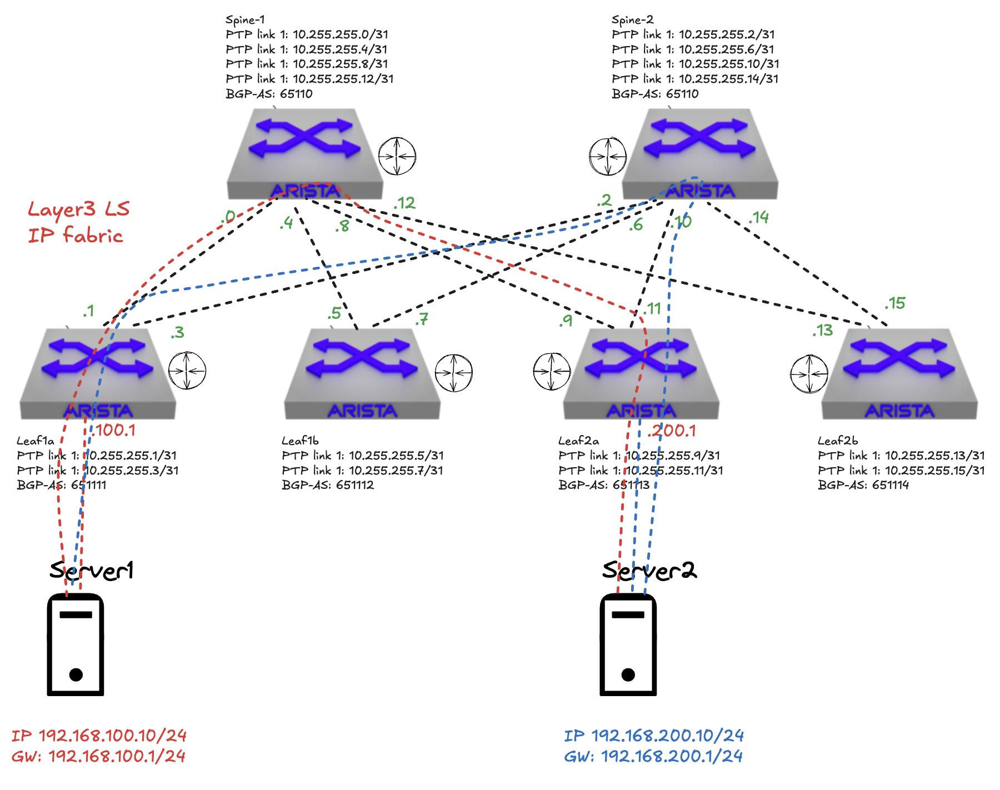

In the above diagram I have confgured my underlay with layer 3 routing, BGP exhanges route information between the leafs. So far in my configuration I can not have two servers connected to different leafs on the same layer 2 subnet. Only if they are connected to the same leaf I can have layer 2 adjacency. So when server 1, connected to leaf1a, wants to talk to server 2, connected on leaf2a, it has to be over layer 3 and both servers needs to be in their own subnet. Leaf1a and leaf2a advertises its subnets to both spine1 and spine2, server 1 and 2 has been configured to use their connected leaf switches  as gateway respectively. 

If I do a ping in the "underlay" how will it look like when I ping from leaf1a to leaf2a using loopback interface 0 on my leaf1a and leaf2a to just simulate layer 3 connectivity without any overlay protocol involved (*I dont have any servers connected to a routed interfaces in my lab on any of my leafs at the moment*).

Tcpdump on leaf1a on both its uplinks (the source of the icmp request):

```bash
[ansible@veos-dc1-leaf1a ~]$ tcpdump -i vmnicet1 -nnvvv -s 0 icmp -c2
tcpdump: listening on vmnicet1, link-type EN10MB (Ethernet), snapshot length 262144 bytes
13:41:41.626368 bc:24:11:4a:9a:d0 > bc:24:11:1d:5f:a1, ethertype IPv4 (0x0800), length 114: (tos 0x0, ttl 63, id 33961, offset 0, flags [none], proto ICMP (1), length 100)
    10.255.0.5 > 10.255.0.3: ICMP echo reply, id 53, seq 1, length 80
13:41:41.628659 bc:24:11:4a:9a:d0 > bc:24:11:1d:5f:a1, ethertype IPv4 (0x0800), length 114: (tos 0x0, ttl 63, id 33962, offset 0, flags [none], proto ICMP (1), length 100)
    10.255.0.5 > 10.255.0.3: ICMP echo reply, id 53, seq 2, length 80
2 packets captured
5 packets received by filter
0 packets dropped by kernel
[ansible@veos-dc1-leaf1a ~]$ tcpdump -i vmnicet2 -nnvvv -s 0 icmp -c2
tcpdump: listening on vmnicet2, link-type EN10MB (Ethernet), snapshot length 262144 bytes
13:41:51.177083 bc:24:11:1d:5f:a1 > bc:24:11:f5:c0:d2, ethertype IPv4 (0x0800), length 114: (tos 0x0, ttl 64, id 21419, offset 0, flags [none], proto ICMP (1), length 100)
    10.255.0.3 > 10.255.0.5: ICMP echo request, id 54, seq 1, length 80
13:41:51.179460 bc:24:11:1d:5f:a1 > bc:24:11:f5:c0:d2, ethertype IPv4 (0x0800), length 114: (tos 0x0, ttl 64, id 21420, offset 0, flags [none], proto ICMP (1), length 100)
    10.255.0.3 > 10.255.0.5: ICMP echo request, id 54, seq 2, length 80
2 packets captured
2 packets received by filter
0 packets dropped by kernel
```

Notice the change of direction on the MAC addresses.

Now if I do a tcpdump on both spine 1 and spine 2 - depending on which path my request takes:

Spine1 on downlinks to leaf1a and leaf2a :

```bash
[ansible@veos-dc1-spine1 ~]$ tcpdump -i vmnicet1 -nnvvv -s 0 icmp -c2
tcpdump: listening on vmnicet1, link-type EN10MB (Ethernet), snapshot length 262144 bytes
13:44:38.739492 bc:24:11:4a:9a:d0 > bc:24:11:1d:5f:a1, ethertype IPv4 (0x0800), length 114: (tos 0x0, ttl 63, id 39153, offset 0, flags [none], proto ICMP (1), length 100)
    10.255.0.5 > 10.255.0.3: ICMP echo reply, id 55, seq 1, length 80
13:44:38.741578 bc:24:11:4a:9a:d0 > bc:24:11:1d:5f:a1, ethertype IPv4 (0x0800), length 114: (tos 0x0, ttl 63, id 39154, offset 0, flags [none], proto ICMP (1), length 100)
    10.255.0.5 > 10.255.0.3: ICMP echo reply, id 55, seq 2, length 80
2 packets captured
5 packets received by filter
0 packets dropped by kernel

[ansible@veos-dc1-spine1 ~]$ tcpdump -i vmnicet3 -nnvvv -s 0 icmp -c2
tcpdump: listening on vmnicet3, link-type EN10MB (Ethernet), snapshot length 262144 bytes
13:44:57.720811 bc:24:11:31:35:db > bc:24:11:4a:9a:d0, ethertype IPv4 (0x0800), length 114: (tos 0x0, ttl 64, id 41546, offset 0, flags [none], proto ICMP (1), length 100)
    10.255.0.5 > 10.255.0.3: ICMP echo reply, id 57, seq 1, length 80
13:44:57.723117 bc:24:11:31:35:db > bc:24:11:4a:9a:d0, ethertype IPv4 (0x0800), length 114: (tos 0x0, ttl 64, id 41547, offset 0, flags [none], proto ICMP (1), length 100)
    10.255.0.5 > 10.255.0.3: ICMP echo reply, id 57, seq 2, length 80
2 packets captured
5 packets received by filter
0 packets dropped by kernel
[ansible@veos-dc1-spine1 ~]$
```

Spine2 on downlinks to leaf1a and leaf2a:

```bash
[ansible@veos-dc1-spine2 ~]$ tcpdump -i vmnicet1 icmp -nnvvv -s 0 -c 2
tcpdump: listening on vmnicet1, link-type EN10MB (Ethernet), snapshot length 262144 bytes
13:46:42.934823 bc:24:11:1d:5f:a1 > bc:24:11:f5:c0:d2, ethertype IPv4 (0x0800), length 114: (tos 0x0, ttl 64, id 64040, offset 0, flags [none], proto ICMP (1), length 100)
    10.255.0.3 > 10.255.0.5: ICMP echo request, id 58, seq 1, length 80
13:46:42.937184 bc:24:11:1d:5f:a1 > bc:24:11:f5:c0:d2, ethertype IPv4 (0x0800), length 114: (tos 0x0, ttl 64, id 64041, offset 0, flags [none], proto ICMP (1), length 100)
    10.255.0.3 > 10.255.0.5: ICMP echo request, id 58, seq 2, length 80
2 packets captured
5 packets received by filter
0 packets dropped by kernel
[ansible@veos-dc1-spine2 ~]$ tcpdump -i vmnicet3 icmp -nnvvv -s 0 -c 2
tcpdump: listening on vmnicet3, link-type EN10MB (Ethernet), snapshot length 262144 bytes
13:46:51.617532 bc:24:11:f5:c0:d2 > bc:24:11:31:35:db, ethertype IPv4 (0x0800), length 114: (tos 0x0, ttl 63, id 497, offset 0, flags [none], proto ICMP (1), length 100)
    10.255.0.3 > 10.255.0.5: ICMP echo request, id 59, seq 1, length 80
13:46:51.620311 bc:24:11:f5:c0:d2 > bc:24:11:31:35:db, ethertype IPv4 (0x0800), length 114: (tos 0x0, ttl 63, id 498, offset 0, flags [none], proto ICMP (1), length 100)
    10.255.0.3 > 10.255.0.5: ICMP echo request, id 59, seq 2, length 80
2 packets captured
5 packets received by filter
0 packets dropped by kernel
[ansible@veos-dc1-spine2 ~]$
```

And finally on leaf2a on both its uplinks:

```bash
[ansible@veos-dc1-leaf2a ~]$ tcpdump -i vmnicet1 -nnvvv -s 0 icmp -c2
tcpdump: listening on vmnicet1, link-type EN10MB (Ethernet), snapshot length 262144 bytes
13:50:01.166378 bc:24:11:31:35:db > bc:24:11:4a:9a:d0, ethertype IPv4 (0x0800), length 114: (tos 0x0, ttl 64, id 21154, offset 0, flags [none], proto ICMP (1), length 100)
    10.255.0.5 > 10.255.0.3: ICMP echo reply, id 60, seq 1, length 80
13:50:01.168794 bc:24:11:31:35:db > bc:24:11:4a:9a:d0, ethertype IPv4 (0x0800), length 114: (tos 0x0, ttl 64, id 21155, offset 0, flags [none], proto ICMP (1), length 100)
    10.255.0.5 > 10.255.0.3: ICMP echo reply, id 60, seq 2, length 80
2 packets captured
5 packets received by filter
0 packets dropped by kernel
[ansible@veos-dc1-leaf2a ~]$ tcpdump -i vmnicet2 -nnvvv -s 0 icmp -c2
tcpdump: listening on vmnicet2, link-type EN10MB (Ethernet), snapshot length 262144 bytes
13:50:07.251988 bc:24:11:f5:c0:d2 > bc:24:11:31:35:db, ethertype IPv4 (0x0800), length 114: (tos 0x0, ttl 63, id 31490, offset 0, flags [none], proto ICMP (1), length 100)
    10.255.0.3 > 10.255.0.5: ICMP echo request, id 61, seq 1, length 80
13:50:07.254459 bc:24:11:f5:c0:d2 > bc:24:11:31:35:db, ethertype IPv4 (0x0800), length 114: (tos 0x0, ttl 63, id 31491, offset 0, flags [none], proto ICMP (1), length 100)
    10.255.0.3 > 10.255.0.5: ICMP echo request, id 61, seq 2, length 80
2 packets captured
5 packets received by filter
0 packets dropped by kernel
[ansible@veos-dc1-leaf2a ~]$
```


If I take a tcpdump and open it in Wireshark, I can have a look at the protocols in the frame.

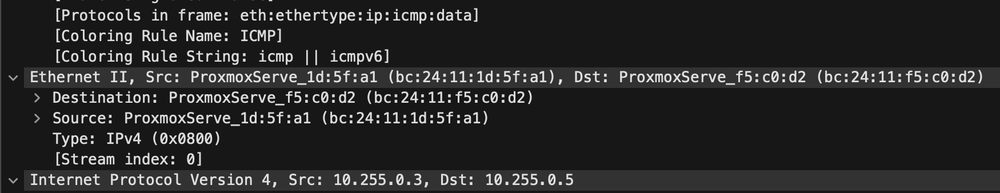

Something to have in the back of the mind to later in this post...

Depending on which path my traffic takes, via spine 1 or spine 2, (remember one of the bonuses with L3 is ECMP), I see the mac address of my leaf1a `bc:24:11:1d:5f:a1` as source and the destination spine2 mac address `bc:24:11:f5:c0:d2`. Then the source IP and destination IP of their respective loopback interfaces. Nothing special here. Why do I see the spine2's mac address as destination mac address? Remember that this is a pure layer 3 fabric which means leaf1a and leaf2a are not seeing each other directly, everything is routed over spine1 and spine2. So the destination mac will be either spine1 and spine2 as those are both intermediary. The packets IP header (source and destination IP address) on the other hand corresponds to the right source and destination ip address. Its only the layer 2 ethernet header thats is being updated along the hops: leaf1a  -> spine 1 or spine 2 -> leaf2a.

For reference I have my leaf1a, spine1, spine2 and leaf2a's mac and ip address below:

```bash
[ansible@veos-dc1-leaf1a ~]$ ip link show et1
29: et1: <BROADCAST,MULTICAST,UP,LOWER_UP> mtu 9194 qdisc pfifo_fast state UP mode DEFAULT group default qlen 1000
    link/ether bc:24:11:1d:5f:a1 brd ff:ff:ff:ff:ff:ff
[ansible@veos-dc1-leaf1a ~]$

veos-dc1-leaf1a#show interfaces loopback 0
Loopback0 is up, line protocol is up (connected)
  Hardware is Loopback
  Description: EVPN_Overlay_Peering
  Internet address is 10.255.0.3/32
  Broadcast address is 255.255.255.255
```

```bash
[ansible@veos-dc1-spine1 ~]$ ip link show et1
16: et1: <BROADCAST,MULTICAST,UP,LOWER_UP> mtu 9194 qdisc pfifo_fast state UP mode DEFAULT group default qlen 1000
    link/ether bc:24:11:4a:9a:d0 brd ff:ff:ff:ff:ff:ff
[ansible@veos-dc1-spine1 ~]$
```

```bash
[ansible@veos-dc1-spine2 ~]$ ip link show et1
22: et1: <BROADCAST,MULTICAST,UP,LOWER_UP> mtu 9194 qdisc pfifo_fast state UP mode DEFAULT group default qlen 1000
    link/ether bc:24:11:f5:c0:d2 brd ff:ff:ff:ff:ff:ff
[ansible@veos-dc1-spine2 ~]$
```


```bash
[ansible@veos-dc1-leaf2a ~]$ ip link show et1
26: et1: <BROADCAST,MULTICAST,UP,LOWER_UP> mtu 9194 qdisc pfifo_fast state UP mode DEFAULT group default qlen 1000
    link/ether bc:24:11:31:35:db brd ff:ff:ff:ff:ff:ff
[ansible@veos-dc1-leaf2a ~]$

veos-dc1-leaf2a#show interfaces loopback 0
Loopback0 is up, line protocol is up (connected)
  Hardware is Loopback
  Description: EVPN_Overlay_Peering
  Internet address is 10.255.0.5/32
  Broadcast address is 255.255.255.255
```


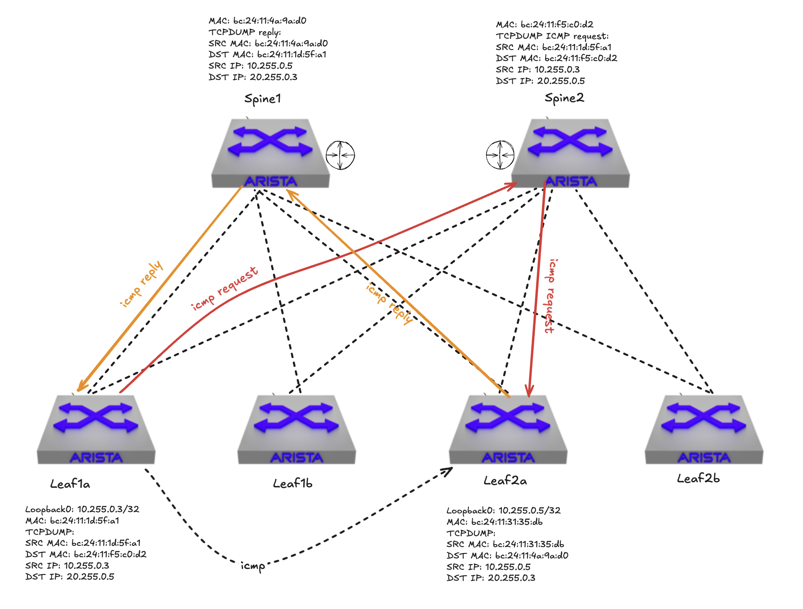

This is fine, I can go home and rest, no one needs to use layer 2. Or... Well it depends. 

Having solved a well performing layer 3 fabric, the routing in the underlay does not help me if I want layer 2 mobility between servers, virtual machines etc connected to different layer 3 leafs. This is where the overlay part comes in to the rescue. And to make it a bit more interesting, I will add several overlay layers into the mix.  

## Overlay in the "underlay"

In a Spine/Leaf architecture **the** most used overlay protocol is [VXLAN](https://datatracker.ietf.org/doc/html/rfc7348) as the transport plane and BGP EVPN as the control plane. Why use overlay in the physical network you say? Well its the best way of moving L2 over L3, and in a "distributed world" as the services in the datacenter today mostly is we need to make sure this can be done in a controlled and effective way in our network. Doing pure L2 will not scale, L3 is the way. EVPN for multi-tenancy.

Adding VXLAN as the overlay protocol in my spine leaf fabric I can stretch my layer 2 networks across all my layer 3 leafs without worries. This means I can now suddenly have multiple servers physical as virtual in the same layer 2 subnet. To make that happen as effectively and with as low admin overhead as possible VXLAN will be the transport plane (overlay protocol) and again BGP will be used as the control plane. This means we now need to configure BGP in the overlay, on top of our BGP in the underlay. BGP EVPN will be used to create isolation and multi tenancy on top of the underlay. To quickly summarize, VXLAN is the transport protocol responsible of carrying the layer 2 subnets over any layer 3 link in the fabric. BGP and EVPN will be the control plane that always knows where things are located and can effectively inform where the traffic should go. This is stil all in the physical network fabric. As we will see a bit later, we can also introduce network overlay protocols in other parts of the infrastructure. 

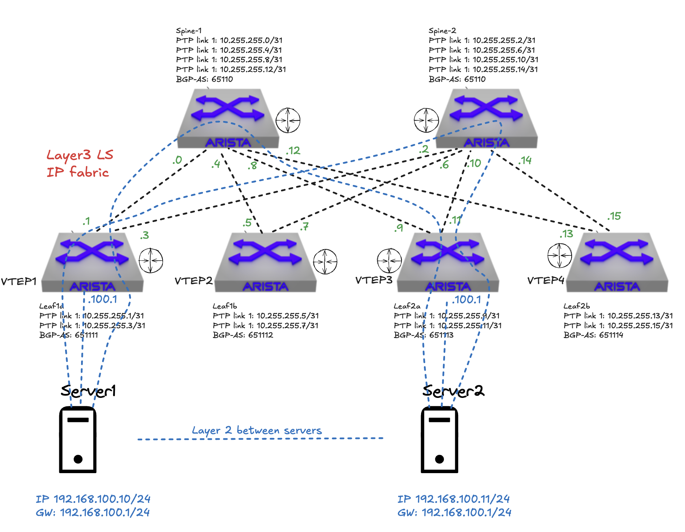

In the diagram above all my leaf switches has become VTEPs, VXLAN Tunnel Endpoints. Meaning they are responsible of taking my ethernet packet coming from server 1, encapsulate it, send it over the layer 3 links in my fabric, to the destination leaf where server 2 is located. The BGP configured in the overlay here is using an EVPN address family to advertise mac addresses. If one have a look at the ethernet packet coming from server 1 and destined to server 2 we will see some differerent mac addresses, depending on where you capture the traffic of course. Lets quickly illustrate that.

The two switches in the diagram above that will be the best place to look at all packages using tcpdump will be the spine 1 and spine 2 as they are connecting everything together and there is no direct communication between any leaf, they have to go through spine 1 and spine 2. 

If I do a ping from server 1 to server 2 going over my VXLAN tunnel, how will the ethernet packet look like when captured at spine1s ethernet interface 1 (the one connected to leaf1a)?

Looking at the tcpdump below from *spine 1* I can clearly see some additional information added to the packet. First I see two mac addresses where source `bc:24:11:1d:5f:a1` is my *leaf1a*  and the destination mac address, `bc:24:11:4a:9a:d0` is my *spine1* switch. The first two ip addresses `10.255.1.3` and `10.255.1.4` is *leaf1a* and *leaf1b* VXLAN loopback interfaces respectively with the corresponding mac addresses `bc:24:11:1d:5f:a1`and `bc:24:11:9b:8f:08`. Then I get to the actual payload itself, the ICMP, between my *server 1* and *server 2* where I can see the source and destination ip of the actual servers doing the ping. 

```yaml
15:44:33.125961 bc:24:11:1d:5f:a1 > bc:24:11:4a:9a:d0, ethertype IPv4 (0x0800), length 148: (tos 0x0, ttl 64, id 0, offset 0, flags [DF], proto UDP (17), length 134)
    10.255.1.3.53892 > 10.255.1.4.4789: VXLAN, flags [I] (0x08), vni 10
bc:24:11:1d:5f:a1 > bc:24:11:9b:8f:08, ethertype IPv4 (0x0800), length 98: (tos 0x0, ttl 63, id 6669, offset 0, flags [DF], proto ICMP (1), length 84)
    10.20.11.10 > 10.20.12.10: ICMP echo request, id 10, seq 108, length 64
```

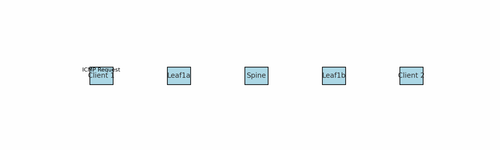

A quick explanation on what we are looking at. The ICMP request comes in from *server 1* to *leaf1a* and before it sends it to its destination leaf1b (vtep) it  encapsulates the packet by removing  some headers and adding some headers. As seen above it is adding an outer header including the source and destination VTEP mac addresses (leaf1a and leaf1b). Spine1 knows of the mac and IP address for both leaf1a and leaf1b. More info on VXLAN encapsulation further down.

Having a further look at a tcpdump in Wireshark captured at Spine1:

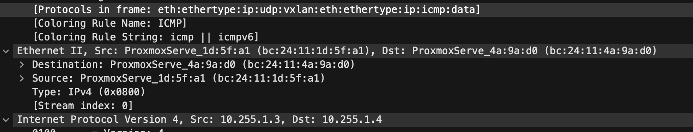

I now notice another protocol in the header, VXLAN. The "outer" source IP and destination IP addresses are now my leaf1a and leaf1b's VXLAN loopback interfaces. The inner source and destination IP addresses will still be my original frame, namely server 1 and server 2's ip addresses:

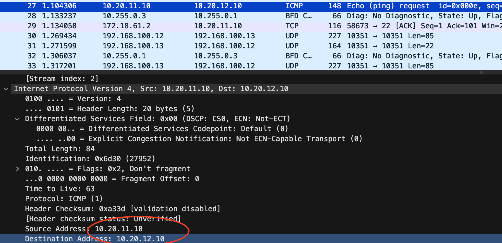


### TCPdump on Arista switches (EOS)

Doing tcpdump on Arista switches is straight forward. Its just one of the benefits Arista has as it uses its EOS operating system which is a pure Linux operating system. I can do tcpdump directly from bash or remote. Here I will show a couple of methods of doing tcpumps in EOS. 

<div style="border-left: 4px solid #2196F3; background-color: #E3F2FD; padding: 10px; margin: 10px 0; color: #0000FF;"> <strong>Info:</strong>
As I am using vEOS (the virtual machine based EOS) I can capture dataplane traffic directly with tcpdump by using the virtual machine nics (eg vmnicX). On an actual Arista switch using the etX interfaces only captures controlplane traffic. To capture dataplane traffic on an Arista switch you can use mirror to CPU or monitoring ports. See the two links below for more info ->    </div>

[here](https://arista.my.site.com/AristaCommunity/s/article/using-tcpdump-for-troubleshooting#Comm_Kna_ka0Uw0000005qxFIAQ_81) and [here](https://arista.my.site.com/AristaCommunity/s/article/using-tcpdump-for-troubleshooting#Comm_Kna_ka02I000000QqZmQAK_44)

***Locally on the switch in bash***

I will log in to the switch and be in my cli context, enter privilege mode (enable) then enter bash:

```bash
veos-dc1-leaf1a>enable
veos-dc1-leaf1a#bash

Arista Networks EOS shell

[ansible@veos-dc1-leaf1a ~]$
```

From here I have full access to the Linux operating system and can more or less use the exact same tools as I am used to in a regular Linux operating system. 

To list all available interfaces, type *ip link* as usual. 

Now I want to do a tcpdump in the interface where my Client 1 is connected and just have a quick look of whats going on:

```bash
[ansible@veos-dc1-leaf1a ~]$ tcpdump -i vmnicet5 -s 0 -c 2
tcpdump: verbose output suppressed, use -v[v]... for full protocol decode
listening on vmnicet5, link-type EN10MB (Ethernet), snapshot length 262144 bytes
15:14:18.343604 bc:24:11:44:85:95 (oui Unknown) > 00:1c:73:00:00:99 (oui Arista Networks), ethertype IPv4 (0x0800), length 98: 10.20.11.10 > 10.20.12.10: ICMP echo request, id 11, seq 1302, length 64
15:14:18.347329 bc:24:11:1d:5f:a1 (oui Unknown) > bc:24:11:44:85:95 (oui Unknown), ethertype IPv4 (0x0800), length 98: 10.20.12.10 > 10.20.11.10: ICMP echo reply, id 11, seq 1302, length 64
2 packets captured
3 packets received by filter
0 packets dropped by kernel
[ansible@veos-dc1-leaf1a ~]$
```

If I want to save a dump to a pcap file for Wireshark I can do the following:

```bash
[ansible@veos-dc1-leaf1a ~]$ tcpdump -i vmnicet5 -s 0 -c 2 -w wireshark.pcap
tcpdump: listening on vmnicet5, link-type EN10MB (Ethernet), snapshot length 262144 bytes
2 packets captured
39 packets received by filter
0 packets dropped by kernel
[ansible@veos-dc1-leaf1a ~]$ ll
total 4
-rw-r--r-- 1 ansible eosadmin 361 Nov 28 15:20 wireshark.pcap
[ansible@veos-dc1-leaf1a ~]$ pwd
/home/ansible
[ansible@veos-dc1-leaf1a ~]$
```

Now I need to copy this one out of my switch to open it in Wireshark on my laptop. To do that I can use SCP. I will initate the scp command from my laptop and initiate the scp session from my laptop to my Arista switch and grab the file.

I have configured my out of band interface in a MGMT vrf, so for me to be able to access the switch via that interface I need to put the bash session on the switch in the MGMT vrf context. So before going into bash I need to enter the VRF and then enter bash.

```bash
[ansible@veos-dc1-leaf1a ~]$ exit
logout
veos-dc1-leaf1a#cli vrf MGMT
veos-dc1-leaf1a(vrf:MGMT)#bash

Arista Networks EOS shell

[ansible@veos-dc1-leaf1a ~]$ pwd
/home/ansible
[ansible@veos-dc1-leaf1a ~]$ ls
wireshark.pcap
[ansible@veos-dc1-leaf1a ~]$
```

Now I have placed bash in the correct context and grab the file using SCP from my client:

<div style="border-left: 4px solid #2196F3; background-color: #E3F2FD; padding: 10px; margin: 10px 0; color: #0000FF;"> <strong>Info:</strong>
The user that logs into the switch needs to be allowed to log directly to Enable mode. This is done by adding the following:
AristaSwitch#aaa authorization exec default local 
** In configure mode ** 
 </div>


From my client where I have Wireshark installed I will execute scp to copy the pcap file from the switch (*I can also run scp from the switch and copy to any destination*):

```bash
➜  vxlan_dumps scp ansible@172.18.100.103:/home/ansible/wireshark.pcap .
(ansible@172.18.100.103) Password:
wireshark.pcap                                                                                           100%  361    46.1KB/s   00:00
➜  vxlan_dumps
```

Now I can open it in Wireshark

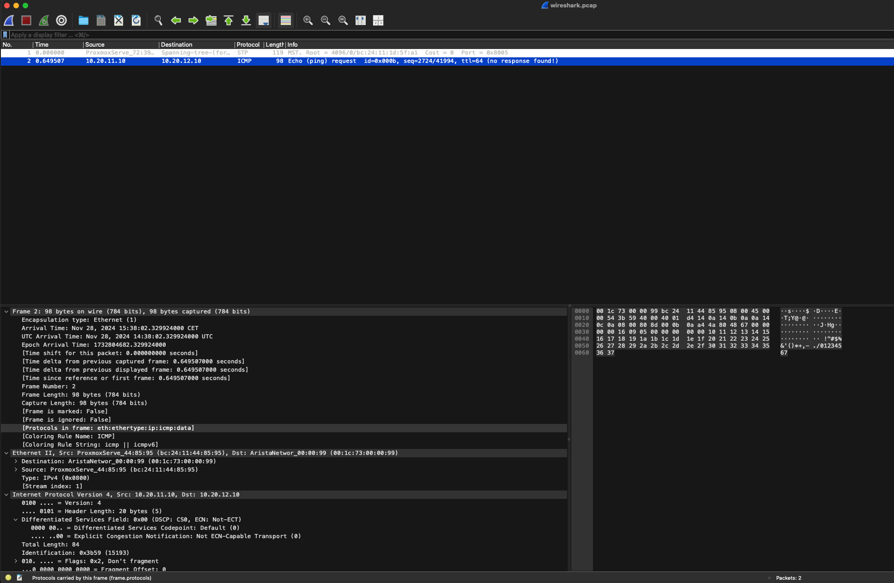

When done, I can go back to the Arista switch log out of bash and into default vrf again like this:

```bash
[ansible@veos-dc1-leaf1a ~]$ exit
logout
veos-dc1-leaf1a(vrf:MGMT)#cli vrf default
veos-dc1-leaf1a#
```


***TCPdump remotely on the switch***

The first approach introduced many steps to get hold of some tcpdumps. 

One can also trigger tcpdumps remotely and either show them in your own terminal session or dump to a pcap file. 
To trigger the tcpdump and show live in your session I will now from my own client execute the following command:

```bash
➜  vxlan_dumps ssh ansible@172.18.100.103 "bash tcpdump -s 0 -v -vv -w - -i vmnicet5 -c 4 icmp" | tshark -i -
(ansible@172.18.100.103) Password: Capturing on 'Standard input'

tcpdump: listening on vmnicet5, link-type EN10MB (Ethernet), snapshot length 262144 bytes
4 packets captured
4 packets received by filter
0 packets dropped by kernel
    1   0.000000  10.20.11.10 → 10.20.12.10  ICMP 98 Echo (ping) request  id=0x000b, seq=3558/58893, ttl=64
    2   0.003400  10.20.12.10 → 10.20.11.10  ICMP 98 Echo (ping) reply    id=0x000b, seq=3558/58893, ttl=62 (request in 1)
    3   1.001586  10.20.11.10 → 10.20.12.10  ICMP 98 Echo (ping) request  id=0x000b, seq=3559/59149, ttl=64
    4   1.005124  10.20.12.10 → 10.20.11.10  ICMP 98 Echo (ping) reply    id=0x000b, seq=3559/59149, ttl=62 (request in 3)
4 packets captured
```


If I want to write to a pcap file and save the content directly on my laptop:

```bash
➜  vxlan_dumps ssh ansible@172.18.100.103 "bash tcpdump -s 0 -v -vv -w - -i vmnicet5 icmp -c 2" > wireshark.pcap
(ansible@172.18.100.103) Password:
tcpdump: listening on vmnicet5, link-type EN10MB (Ethernet), snapshot length 262144 bytes
2 packets captured
2 packets received by filter
0 packets dropped by kernel
➜  vxlan_dumps
```

Now I can open it in Wireshark. All the different tcpdump options and variables is ofcourse options to play around with. It is the exact tcpdump tool you use in your everyday Linux operating system. Its not a Arista specific tcpdump tool. 


For more information using tcpdump and scp with Arista switches head over [here](https://arista.my.site.com/AristaCommunity/s/article/using-tcpdump-for-troubleshooting) and [here](https://arista.my.site.com/AristaCommunity/s/article/how-to-ftp-scp-winscp).


## Overlay in the compute stack

Up until now I have covered the underlay config briefly in a spine leaf, then the overlay in the spine leaf to overcome the layer 3 boundaries. But in the software or compute stack that is connecting to our fabric we can stumble upon other overlay protocols too. 

Even though VXLAN is the most common overlay protocol, there are other overlay protocols being used in the datacenter, like [Geneve](https://datatracker.ietf.org/doc/html/rfc8926), and even NVGre and STT. This blog will discuss some typical scenarios where we deal with "layers" of overlay protocols.

Yes, the services connecting to my network also happen to use some kind of overlay protocol, can I have encapsulation on top of encapsulation? Yes, why not? In some environments we may even end up with overlay on top of overlay on top of another overlay (three "layers" of overlay). That's not possible, you are pulling a joke here right? No I am not, yes that is fully possible and occurs very frequent. But I will loose all visibility!? Why? Using VXLAN or Geneve does not mean the traffic is being encrypted. For an network admin its not always obvious that such scenarios exist, but they do and should be something to be aware of in case something goes wrong or they suddenly discovers a new overlay protocol in their network.

In such scenarios though, like the movie Inception, it will be important to know how things fits together, where to monitor, how to monitor, what to think of making sure there is nothing in the way of the tunnels to be established. This is something I will try to go through in this post. How these thing fits together.  

One example of running overlay on top of overlay is in environments where VMware (by Broadcom) NSX is involved. VMware NSX is using Geneve[^1] to encapsulate their Layer2 NSX Segments over any fabric between their VTEPS (usually the ESXi host transport nodes, the NSX Edges is also considered TEPS in an NSX environment). If this is connected to a spine/leaf fabric we will have VXLAN and Geneve overlay protocols moving L2 segments between their own respective VTEPS (*VTEP for VXLAN, NSX just calls it TEP nowadays*). 


Below we have a spine leaf fabric using VXLAN and NSX in the compute layer using Geneve. All network segments created in NSX leaving and entering a ESXi host will be encapsulated using Geneve, and that also means all services ingressing the leafs from these ESXi hosts will get another round of encapsulation using VXLAN. I will describe this a bit better later, below is a very high level illustration.

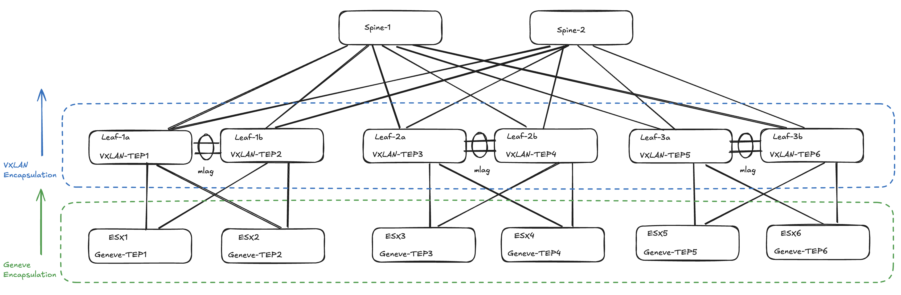

But what if we are also running Kubernetes in our VMware NSX environment, which also happens to use some kind of overlay protocol (common CNIs supports VXLAN/Geneve/NVGre/STT) between the control plane and worker nodes. That will be hard to do right? Should we disable encapsulation in our Kubernetes clusters then? No, well it depends of course, but if you dont have any specific requirements to NOT use overlay (*like no-snat*) between your Kubernetes nodes then it makes your Kubernetes network connectivity (like pod to pod across nodes) so much easier. 

How will this look like then?

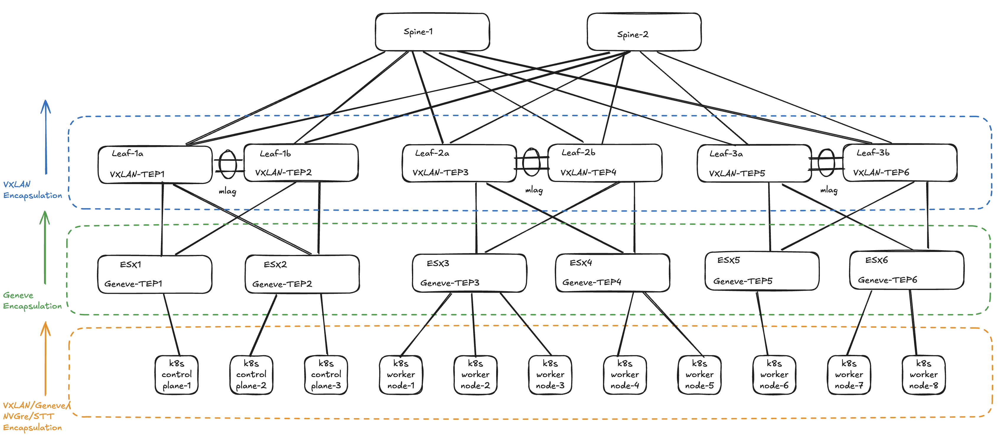

Doesn't look that bad? Now if I were Leonardo DiCaprio in Inception it would be a walk in the park. 

## Where is encapsulation and decapsulation done

It is important to know where the ethernet frames are being encapsulated and decapsulated so one can understand where things may go wrong. Lets start with the Spine/Leaf fabric. 

When traffic or the network services enters or ingresses on any of the leafs in the fabric its the leafs role to encapsulate and decapsulate the traffic. The leafs in a VXLAN spine/leaf fabric are considered our VTEP's (VXLAN Tunnel Endpoints). I have two servers connected to two different leafs, and also happens to be on two different VNIs (VXLAN Network Identifier), where server A needs to send a packet to server B the receiving leaf will encapsulate the ingress, then send it via any of the spines to the leaf where server B is connected and this leaf will then decapsulate the packet before its delivered to server B. See below:

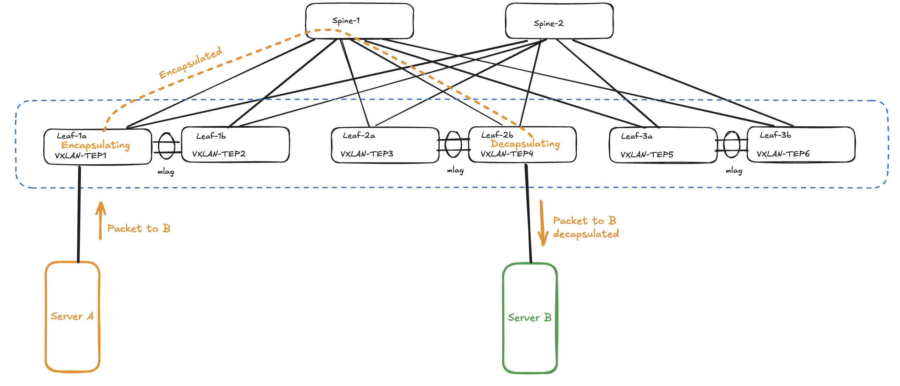

How will this look if I add NSX into the mix? The below traffic flow will only be true if source and destination is not leaving the NSX "fabric", meaning it is traffic between two vms in same NSX segment or two different NSX segments. If traffic is destined to go outside the NSX fabric it will need to leave via the NSX edges which will "normalise" the traffic and decapsulate the traffic to regular MTU size 1500 if not adjusted in the Edge uplinks to use bigger mtu size than default 1500. 

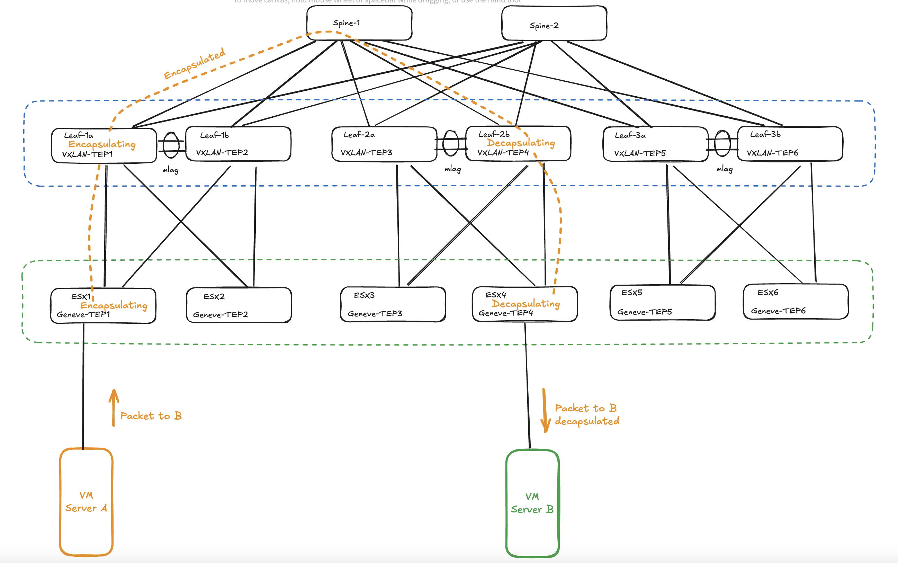

What about Kubernetes as the third overlay layer?

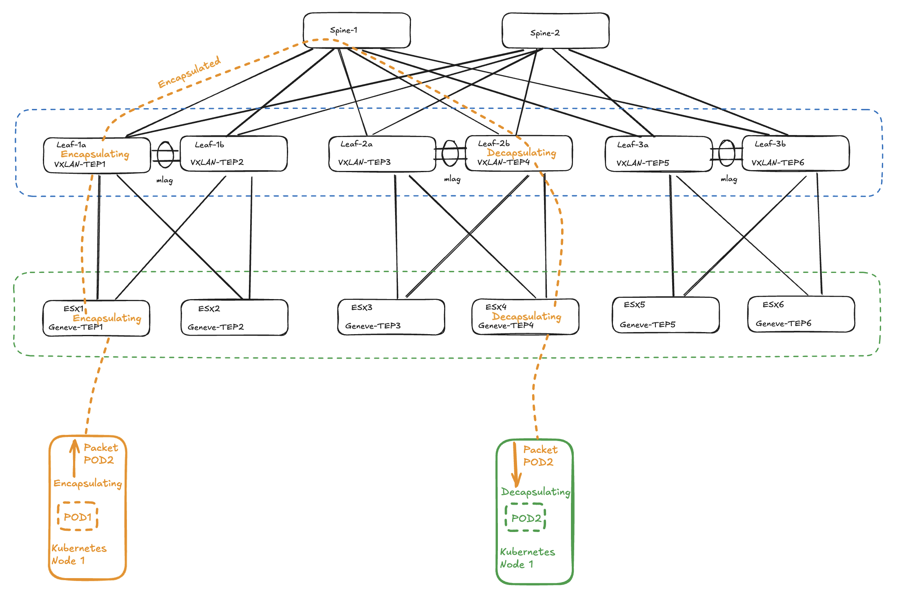

When traffic egresses a Kubernetes nodes configured to use VXLAN or Geneve it will encapsulate the original header, if the Kubernetes nodes are running in a NSX segment the ESXi hosts currently holding the Kubernetes nodes will then add its encapsulation before egressing the packet, and finally this traffic will hit the physical Arista VTEPS/Leaf switches in the physical fabric which will also add its encapsulation before egressing to the spines. Then from the leaf to the esxi hosts to the pods the traffic will slowly but surely be decapsulated to finally arrive at the destination as the original ethernet frame stripped from any additional encapsulation headers. 

## Will it fit then?

A default IP frame size is 1500MTU (Maximum Transmission Unit). When encapsulating a standard ethernet frame using VXLAN some headers are removed from the original frame, and additional headers are being added. See illustration:

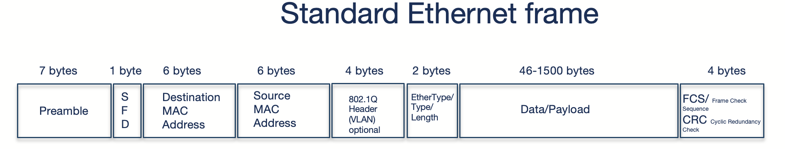

Standard Ethernet frame to a VXLAN encapsulated ethernet frame:

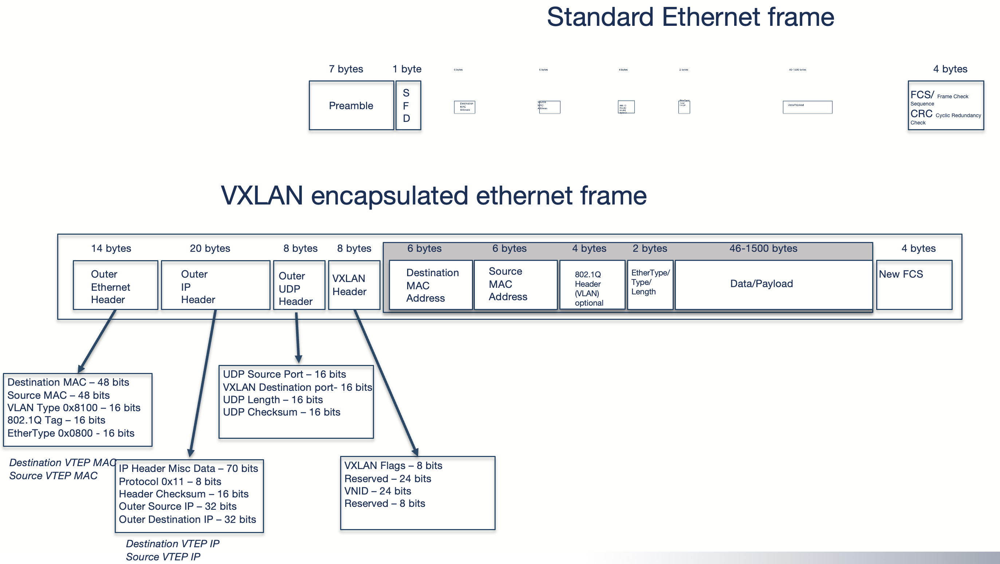

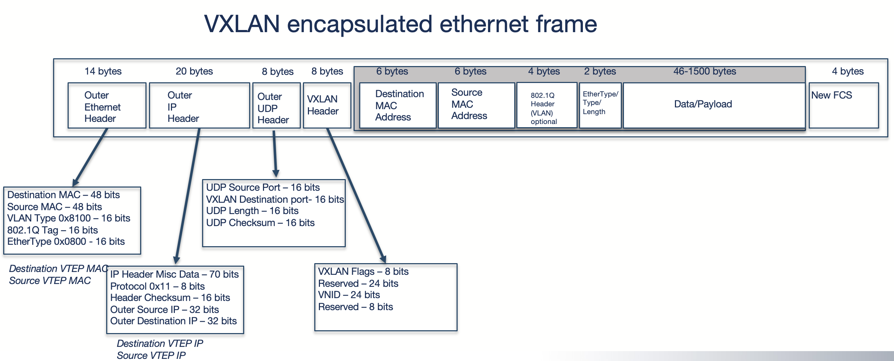


*See more explanation on ethernet mtu and ip mtu further down.*

These additional headers requires some more room which makes the default size of 1500mtu too small. So in a very simple setup using VXLAN encapsulation we need to accomodate for this increase in size.  If this is not considered you will end up with nothing working. A general rule of thumb, VXLAN and Geneve will not handle fragmentation and will drop if it does not fit. A new buzzword will then become *its always MTU*.

Why is that? Imagine you have a rather big car and the road you are driving has a tunnel, this tunnel is not big enough to actually fit your car (One of the few times in your life, but assume its a monster truck you are driving). If you dont pay attention and just make a run for it, entering the tunnel will come to a hard stop. 


And if something should happen to come out on the other side of the tunnel it will most likely be fragments of the car. Which we dont like. We do like our cars whole, as we like our network packets whole.

If the tunnel is big enough to accommodate the biggest monster truck, then it should be fine.


The monster truck both enters and exits the tunnel safe and sound and in the exact same shape it entered. No pieces torn off or ripped off to fit the tunnel. 

If the tunnel will bearly fit the car, you can bet some pieces would be torn off, like side mirrors etc. This can be translated into dropped packets, which we dont want.

If the monster truck diagram is not depictive enough, lets try another illustration. Imagine you have two steel pipes of equal diameter and width and you want one pipe to be inserted into the other pipe to maybe extend the total length by combining the two. Pretty hard to do, welding is propably your best option here. But if one pipe had a smaller diameter so it could actually fit inside the other pipe, then it would slide in without any issue. 

 

Imagine the last pipe on the right is the Arista spine/leaf fabric. This should be the part of the infrastructure that must accommodate the biggest allowed MTU size. Then the green pipe will be the NSX environment which needs to tune their MTU setting on the TEP side (host profile) to fit the MTU size set in the Arista Fabric. Arista is default configured to use 9214 MTU. Then the Kubernetes cluster running in NSX segments also needs to adapt to the MTU size in the NSX environment.

This should be fairly easy to calculate as long as one know which overlay protocol being used, how much the additional headers will impose on the ethernet frame. See VXLAN above. Be aware that VXLAN has fixed headers so you will always know the exact MTU size, Geneve on the other hand (call it an VXLAN extension) is using dynamic headers and needs to be taken into consideration, it may need more room than VXLAN. 

For VLXLAN we need at least 50 additional bytes: 14b (outer ethernet header) + 20b (outer IP header) + 8b (outer udp header) + 8b (VXLAN header) = 50b

So, to summarize. As long as one are aware of these MTU requirements it should be fine to run multiple stacked overlay protocols.

## Simulating an environment with triple encapsulation

I have configured in my lab a spine leaf fabric using Arista vEOS switches. It is a full spine leaf fabric using EVPN and VXLAN. The fabric has been configured with 3 VRFS. A dedicated oob mgmt vrf called MGMT. Then VRF 10 for vlan 11-13 and VRF 11 for vlan 21-23. Then I have attached three virtual machines on each of their leaf switches. Server 1 is attached to leaf1a, server 2 is attached to leaf1b and server 3 is attached to leaf2a. These three servers have been configured with two network cards each.

NIC1 (ens18) on all three have been configured and placed in VRF10 but in their own vlan, vlan 11-13 respectively for their "management" interface. VRF 10 is the only VRF that is configured to reach internet. NIC2 (ens19) on all three servers have been configured and placed in an another VRF, VRF11, also placed in their separate vlan (vlan 21-23) respectively. NIC2 (ens19) have been configured to use VXLAN via a bridge called br-vxlan on all three servers to span a common layer 2 subnet across these 3 servers. Kubernetes is installed and configured on these servers. The pod network is using the second nic interfaces over VXLAN and the CNI inside Kubernetes has been configured to provide its own overlay protocol which happens to be Geneve. So in this scenario I have 3 overlay protocols in motion. VXLAN configured in my Arista spine leaf, VXLAN in the Ubuntu operating system layer, then Geneve in the pod network stack. 
*The only reason I have chosen to use a dedicated management interface is just so I can have a network that is only encapsulated in my Arista fabric. Kubernetes can work perfectly well with just on network card, also most common config.* 

I have tried to illustrate my setup below, to get some more context. 


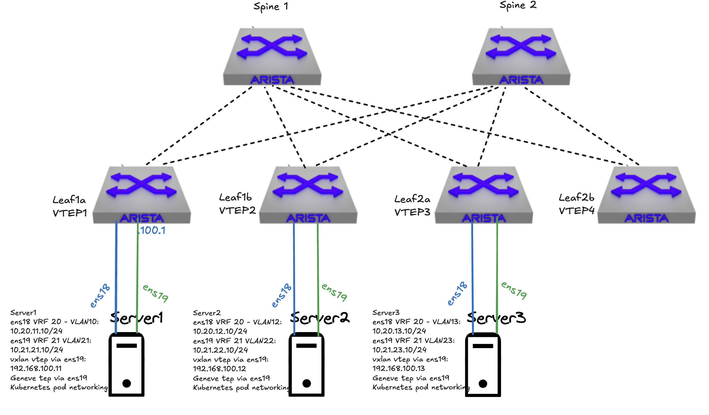

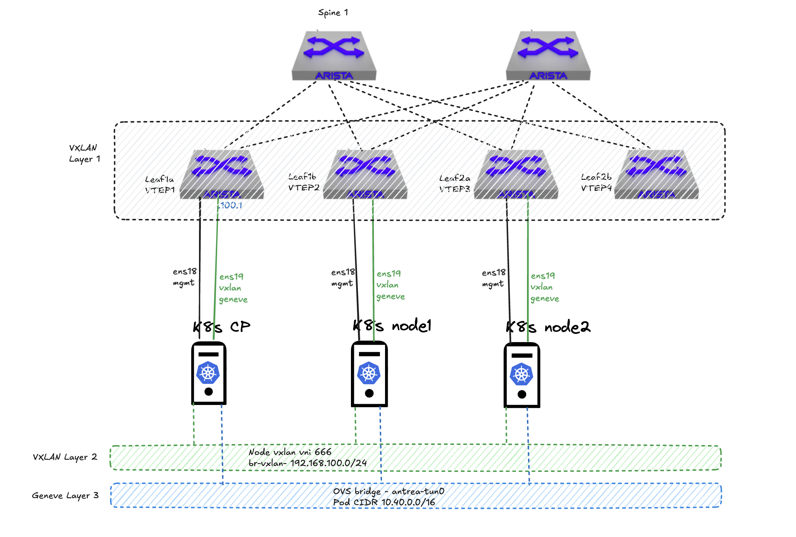

| Server 1                                             | Server 2                                             | Server 3                                             |
| ---------------------------------------------------- | ---------------------------------------------------- | ---------------------------------------------------- |
| ens18 - 10.20.11.10/24                               | ens18 - 10.20.12.10/24                               | ens18 - 10.20.13.10/24                               |
| ens19 - 10.21.21.10/24                               | ens19 - 10.21.22.10/24                               | ens19 - 10.21.23.10/24                               |
| br-vxlan (vxlan via ens19) - 192.168.100.11/24       | br-vxlan (vxlan via ens19) - 192.168.100.12/24       | br-vxlan (vxlan via ens19) - 192.168.100.13/24       |
| antrea-gw0 (interface mtu -50)                       | antrea-gw0 (interface mtu -50)                       | antrea-gw0 (interface mtu -50)                       |
| pod-cidr (Antrea geneve tun0 via ens19) 10.40.0.0/24 | pod-cidr (Antrea geneve tun0 via ens19) 10.40.1.0/24 | pod-cidr (Antrea geneve tun0 via ens19) 10.40.2.0/24 |

*K8s cluster pod cidr is 10.40.0.0/16, each node carves out pr default a /24.* 

When the 3 nodes communicate with each other using ens18 they will only be encapsulated once, but when using the br-vxlan interface it will be double encapsulated, first vxlan in the server, then in the Arista fabric. When the pods communicate between nodes I will end up with triple encapsulation, Geneve, VXLAN in the server then VXLAN in the Arista fabric. Now it starts to be interesting.
The Antrea CNI has been configured to use br-vxlan as pod transport interface:

```yaml
# traffic across Nodes.
transportInterface: "br-vxlan"
```

*A note on the Antrea CNI geneve tunnel. When Antrea is deployed in the cluster it will automatically adjust the MTU based on the interfaces it is selected to use a transport interface. It does that by reading the current MTU, if it is 1500 on the transport interface it will create a Antrea GW interface -50 MTU. If br-vxlan as above is 1500MTU Antrea GW will then be 1450MTU. If I happen to adjust this MTU at a later stage to either a higher or lower MTU I just need to restart the Antrea Agents and the respective Antrea GW interfaces should automatically adjust to the new MTU again. So in theory the Antrea GW should not be making any headaches in regards to MTU issues, but one never know and it should be something to be aware of.* 

### Let see some triple encapsulation in action

I have two pods deployed called *ubuntu-1* and *ubuntu-2* with one Ubuntu container instance in each pod, these two are running on ther own Kubernetes node 1 and 2. So they have to egress the nodes to communicate. How will this look like if I do a TCP dump on leaf1b (source), where node1 is connected, if I initiate a ping from pod ubuntu-1 and ubuntu-2?

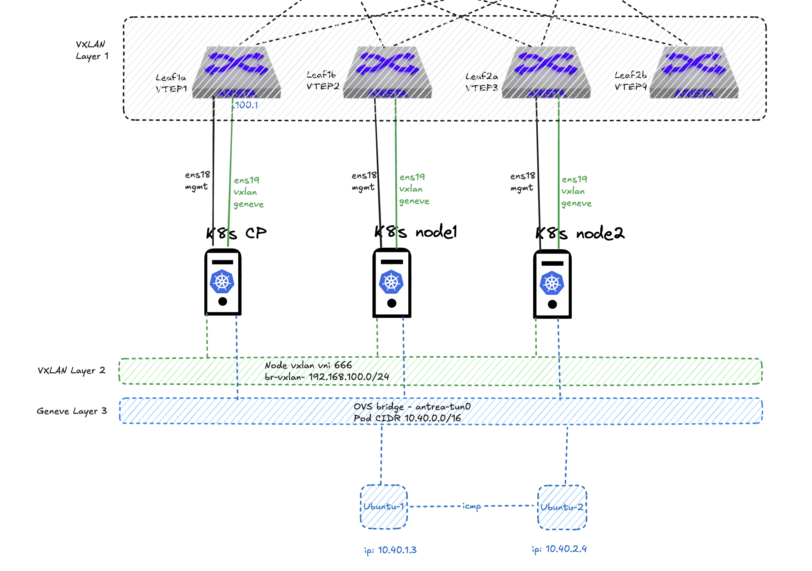

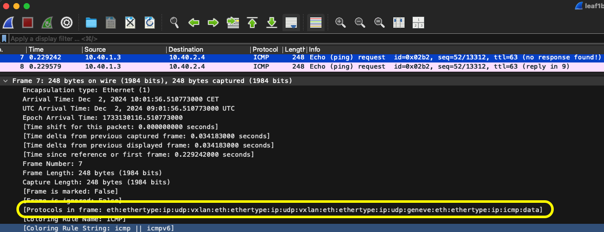

Protocols in frame: vxlan, vxlan and geneve - look at that. Lets break it down further, layer by layer.

As there is some encapsulation going on for sure, at different layers, it can be a good excercise to a layer by layer breakdown:

```bash
    [Protocols in frame: eth:ethertype:ip:udp:vxlan:eth:ethertype:ip:udp:vxlan:eth:ethertype:ip:udp:geneve:eth:ethertype:ip:icmp:data]
```


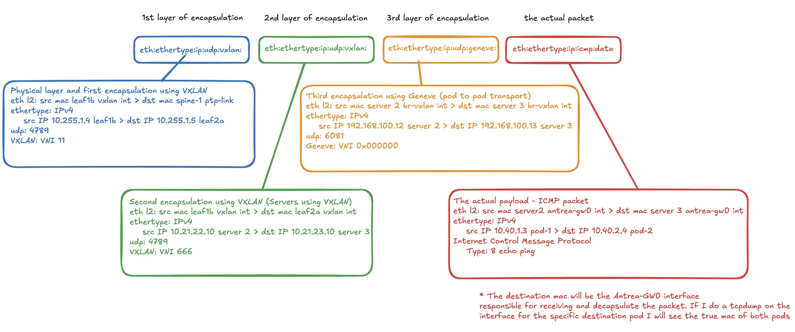

In total 4 pairs of source > destination ip addresses, including the actual payload ICMP packet between the two pods. 

Full dump for reference below.

```bash
Frame 7: 248 bytes on wire (1984 bits), 248 bytes captured (1984 bits)
    Encapsulation type: Ethernet (1)
    Arrival Time: Dec  2, 2024 10:01:56.510773000 CET
    UTC Arrival Time: Dec  2, 2024 09:01:56.510773000 UTC
    Epoch Arrival Time: 1733130116.510773000
    [Time shift for this packet: 0.000000000 seconds]
    [Time delta from previous captured frame: 0.034183000 seconds]
    [Time delta from previous displayed frame: 0.034183000 seconds]
    [Time since reference or first frame: 0.229242000 seconds]
    Frame Number: 7
    Frame Length: 248 bytes (1984 bits)
    Capture Length: 248 bytes (1984 bits)
    [Frame is marked: False]
    [Frame is ignored: False]
    [Protocols in frame: eth:ethertype:ip:udp:vxlan:eth:ethertype:ip:udp:vxlan:eth:ethertype:ip:udp:geneve:eth:ethertype:ip:icmp:data]
    [Coloring Rule Name: ICMP]
    [Coloring Rule String: icmp || icmpv6]
Ethernet II, Src: ProxmoxServe_9b:8f:08 (bc:24:11:9b:8f:08), Dst: ProxmoxServe_4a:9a:d0 (bc:24:11:4a:9a:d0)
    Destination: ProxmoxServe_4a:9a:d0 (bc:24:11:4a:9a:d0)
    Source: ProxmoxServe_9b:8f:08 (bc:24:11:9b:8f:08)
    Type: IPv4 (0x0800)
    [Stream index: 0]
Internet Protocol Version 4, Src: 10.255.1.4, Dst: 10.255.1.5
    0100 .... = Version: 4
    .... 0101 = Header Length: 20 bytes (5)
    Differentiated Services Field: 0x00 (DSCP: CS0, ECN: Not-ECT)
        0000 00.. = Differentiated Services Codepoint: Default (0)
        .... ..00 = Explicit Congestion Notification: Not ECN-Capable Transport (0)
    Total Length: 234
    Identification: 0x0000 (0)
    010. .... = Flags: 0x2, Don't fragment
    ...0 0000 0000 0000 = Fragment Offset: 0
    Time to Live: 64
    Protocol: UDP (17)
    Header Checksum: 0x21fd [validation disabled]
    [Header checksum status: Unverified]
    Source Address: 10.255.1.4
    Destination Address: 10.255.1.5
    [Stream index: 4]
User Datagram Protocol, Src Port: 64509, Dst Port: 4789
    Source Port: 64509
    Destination Port: 4789
    Length: 214
    Checksum: 0x0000 [zero-value ignored]
    [Stream index: 7]
    [Stream Packet Number: 1]
    [Timestamps]
    UDP payload (206 bytes)
Virtual eXtensible Local Area Network
    Flags: 0x0800, VXLAN Network ID (VNI)
    Group Policy ID: 0
    VXLAN Network Identifier (VNI): 11
    Reserved: 0
Ethernet II, Src: ProxmoxServe_9b:8f:08 (bc:24:11:9b:8f:08), Dst: ProxmoxServe_31:35:db (bc:24:11:31:35:db)
    Destination: ProxmoxServe_31:35:db (bc:24:11:31:35:db)
    Source: ProxmoxServe_9b:8f:08 (bc:24:11:9b:8f:08)
    Type: IPv4 (0x0800)
    [Stream index: 3]
Internet Protocol Version 4, Src: 10.21.22.10, Dst: 10.21.23.10
    0100 .... = Version: 4
    .... 0101 = Header Length: 20 bytes (5)
    Differentiated Services Field: 0x00 (DSCP: CS0, ECN: Not-ECT)
        0000 00.. = Differentiated Services Codepoint: Default (0)
        .... ..00 = Explicit Congestion Notification: Not ECN-Capable Transport (0)
    Total Length: 184
    Identification: 0x0de9 (3561)
    000. .... = Flags: 0x0
    ...0 0000 0000 0000 = Fragment Offset: 0
    Time to Live: 63
    Protocol: UDP (17)
    Header Checksum: 0x2c0f [validation disabled]
    [Header checksum status: Unverified]
    Source Address: 10.21.22.10
    Destination Address: 10.21.23.10
    [Stream index: 5]
User Datagram Protocol, Src Port: 56889, Dst Port: 4789
    Source Port: 56889
    Destination Port: 4789
    Length: 164
    Checksum: 0x91c6 [unverified]
    [Checksum Status: Unverified]
    [Stream index: 8]
    [Stream Packet Number: 1]
    [Timestamps]
    UDP payload (156 bytes)
Virtual eXtensible Local Area Network
    Flags: 0x0800, VXLAN Network ID (VNI)
    Group Policy ID: 0
    VXLAN Network Identifier (VNI): 666
    Reserved: 0
Ethernet II, Src: 0e:a9:a0:1b:df:4b (0e:a9:a0:1b:df:4b), Dst: a6:58:bc:c5:47:62 (a6:58:bc:c5:47:62)
    Destination: a6:58:bc:c5:47:62 (a6:58:bc:c5:47:62)
    Source: 0e:a9:a0:1b:df:4b (0e:a9:a0:1b:df:4b)
    Type: IPv4 (0x0800)
    [Stream index: 2]
Internet Protocol Version 4, Src: 192.168.100.12, Dst: 192.168.100.13
    0100 .... = Version: 4
    .... 0101 = Header Length: 20 bytes (5)
    Differentiated Services Field: 0x00 (DSCP: CS0, ECN: Not-ECT)
        0000 00.. = Differentiated Services Codepoint: Default (0)
        .... ..00 = Explicit Congestion Notification: Not ECN-Capable Transport (0)
    Total Length: 134
    Identification: 0x8e54 (36436)
    010. .... = Flags: 0x2, Don't fragment
    ...0 0000 0000 0000 = Fragment Offset: 0
    Time to Live: 64
    Protocol: UDP (17)
    Header Checksum: 0x62a8 [validation disabled]
    [Header checksum status: Unverified]
    Source Address: 192.168.100.12
    Destination Address: 192.168.100.13
    [Stream index: 3]
User Datagram Protocol, Src Port: 19380, Dst Port: 6081
    Source Port: 19380
    Destination Port: 6081
    Length: 114
    Checksum: 0x0000 [zero-value ignored]
    [Stream index: 9]
    [Stream Packet Number: 1]
    [Timestamps]
    UDP payload (106 bytes)
Generic Network Virtualization Encapsulation, VNI: 0x000000
Ethernet II, Src: ce:7f:43:8a:0e:3c (ce:7f:43:8a:0e:3c), Dst: aa:bb:cc:dd:ee:ff (aa:bb:cc:dd:ee:ff)
    Destination: aa:bb:cc:dd:ee:ff (aa:bb:cc:dd:ee:ff)
    Source: ce:7f:43:8a:0e:3c (ce:7f:43:8a:0e:3c)
    Type: IPv4 (0x0800)
    [Stream index: 4]
Internet Protocol Version 4, Src: 10.40.1.3, Dst: 10.40.2.4
    0100 .... = Version: 4
    .... 0101 = Header Length: 20 bytes (5)
    Differentiated Services Field: 0x00 (DSCP: CS0, ECN: Not-ECT)
        0000 00.. = Differentiated Services Codepoint: Default (0)
        .... ..00 = Explicit Congestion Notification: Not ECN-Capable Transport (0)
    Total Length: 84
    Identification: 0x54ad (21677)
    010. .... = Flags: 0x2, Don't fragment
    ...0 0000 0000 0000 = Fragment Offset: 0
    Time to Live: 63
    Protocol: ICMP (1)
    Header Checksum: 0xcfa5 [validation disabled]
    [Header checksum status: Unverified]
    Source Address: 10.40.1.3
    Destination Address: 10.40.2.4
    [Stream index: 6]
Internet Control Message Protocol
    Type: 8 (Echo (ping) request)
    Code: 0
    Checksum: 0xf1a5 [correct]
    [Checksum Status: Good]
    Identifier (BE): 690 (0x02b2)
    Identifier (LE): 45570 (0xb202)
    Sequence Number (BE): 52 (0x0034)
    Sequence Number (LE): 13312 (0x3400)
    [No response seen]
    Timestamp from icmp data: Dec  2, 2024 10:01:56.508523000 CET
    [Timestamp from icmp data (relative): 0.002250000 seconds]
    Data (40 bytes)

```


### Monitor and troubleshoot 

Everything has been configured but nothing works. Could it be MTU? There is a high probability it is MTU as both VXLAN and Geneve will not tolerate fragmentation. Lets quickly go through how to check for MTU issues and if it is related to any overlay protocols being dropped due to defragmentation.

### Ethernet MTU and IP MTU

A quick note on MTU. MTU can be referred to as Ethernet MTU and IP MTU. This can be important to be aware of as these numbers are quite different and operate at two different levels: the Data Link Layer and Network Layer. 

The Ethernet MTU is the maximum payload in bytes an Ethernet frame can carry. This refers to the Layer 2 Data Link Layer size limit. What does that mean then? Well an ethernet MTU only considers the the size of the actual packet, it does not include the ethernet frame headers MAC addresses, ether type, and fcs. Remember the ethernet frame explanation above:

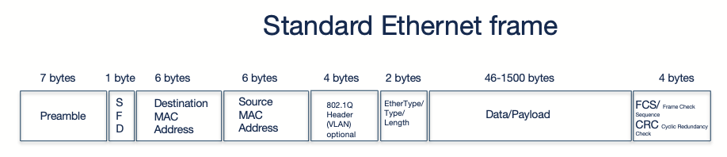

The IP MTU on the other hand is the maximum size in bytes of the IP packet than can be transmitted. This operates at the Layer 3 Network layer and includes the entire IP packet, ip header, and transport payload (tcp/udp headers and application data). The IP MTU must fit within the Ethernet MTU. The IP packet is encapsulated in the Ethernet payload.

```lua
+--------------------+--------------------+
| Ethernet Frame (1518 bytes)            |
| 14B Header + 1500B Payload + 4B Trailer|
+----------------------------------------+
| IP Packet (1500 bytes max)             |
| 20B IP Header + 1480B Payload          |
+----------------------------------------+

```


### Verifying everything in the Arista fabric

**Underly links**
To do this as "methodically" as possible I will first start by checking mtu in the Arista fabric. This will be the ptp links between the spines and leafs. They should be configured with the highest supported MTU in EOS. 

<div style="border-left: 4px solid #2196F3; background-color: #E3F2FD; padding: 10px; margin: 10px 0; color: #0000FF;"> <strong>Info:</strong>
This is all done in my lab using vEOS (virtual machines running on my hypervisor). The max MTU I can use in my lab is 9194 in vEOS. In a real physical Arista switch it is 9214MTU. So the numbers I am operating with is not representative to the real products </div>

As soon as I have verified the mtu size there, I also need to verify that there is no issues with the VXLAN tunnel. 

 From *leaf1b* uplink 1 and 2 to spine 1 and 2:

```bash
veos-dc1-leaf1b#ping 10.255.255.4 source 10.255.255.5 df-bit size 9194
PING 10.255.255.4 (10.255.255.4) from 10.255.255.5 : 9166(9194) bytes of data.
9174 bytes from 10.255.255.4: icmp_seq=1 ttl=64 time=1.50 ms
9174 bytes from 10.255.255.4: icmp_seq=2 ttl=64 time=0.836 ms
9174 bytes from 10.255.255.4: icmp_seq=3 ttl=64 time=0.549 ms
9174 bytes from 10.255.255.4: icmp_seq=4 ttl=64 time=0.558 ms
9174 bytes from 10.255.255.4: icmp_seq=5 ttl=64 time=0.556 ms

--- 10.255.255.4 ping statistics ---
5 packets transmitted, 5 received, 0% packet loss, time 5ms
rtt min/avg/max/mdev = 0.549/0.800/1.503/0.367 ms, ipg/ewma 1.255/1.134 ms
```

If I try one byte too high it should tell me:

```bash
veos-dc1-leaf1b#ping 10.255.255.4 source 10.255.255.5 df-bit size 9195
PING 10.255.255.4 (10.255.255.4) from 10.255.255.5 : 9167(9195) bytes of data.
ping: local error: message too long, mtu=9194
ping: local error: message too long, mtu=9194
ping: local error: message too long, mtu=9194
ping: local error: message too long, mtu=9194
ping: local error: message too long, mtu=9194

--- 10.255.255.4 ping statistics ---
5 packets transmitted, 0 received, +5 errors, 100% packet loss, time 41ms
```

Ok, MTU in the ptp links are good. How is the status of the VXLAN tunnel:

```bash
veos-dc1-leaf1b#show int vx1
Vxlan1 is up, line protocol is up (connected)
  Hardware is Vxlan
  Description: veos-dc1-leaf1b_VTEP
  Source interface is Loopback1 and is active with 10.255.1.4
  Listening on UDP port 4789
  Replication/Flood Mode is headend with Flood List Source: EVPN
  Remote MAC learning via EVPN
  VNI mapping to VLANs
  Static VLAN to VNI mapping is
    [11, 10011]       [12, 10012]       [13, 10013]       [21, 10021]
    [22, 10022]       [23, 10023]       [1079, 11079]     [3401, 13401]
    [3402, 13402]
  Dynamic VLAN to VNI mapping for 'evpn' is
    [4097, 11]        [4098, 10]
  Note: All Dynamic VLANs used by VCS are internal VLANs.
        Use 'show vxlan vni' for details.
  Static VRF to VNI mapping is
   [VRF20, 10]
   [VRF21, 11]
  Headend replication flood vtep list is:
    11 10.255.1.6      10.255.1.3      10.255.1.5
    12 10.255.1.6      10.255.1.3      10.255.1.5
    13 10.255.1.6      10.255.1.3      10.255.1.5
    21 10.255.1.6      10.255.1.3      10.255.1.5
    22 10.255.1.6      10.255.1.3      10.255.1.5
    23 10.255.1.6      10.255.1.3      10.255.1.5
  1079 10.255.1.6      10.255.1.3      10.255.1.5
  3401 10.255.1.6      10.255.1.3      10.255.1.5
  3402 10.255.1.6      10.255.1.3      10.255.1.5
  Shared Router MAC is 0000.0000.0000
```


```bash
veos-dc1-leaf1b#show vxlan config-sanity detail
Category                            Result
---------------------------------- --------
Local VTEP Configuration Check        OK
  Loopback IP Address                 OK
  VLAN-VNI Map                        OK
  Flood List                          OK
  Routing                             OK
  VNI VRF ACL                         OK
  Decap VRF-VNI Map                   OK
  VRF-VNI Dynamic VLAN                OK
Remote VTEP Configuration Check       OK
  Remote VTEP                         OK
Platform Dependent Check              OK
  VXLAN Bridging                      OK
  VXLAN Routing                       OK
CVX Configuration Check               OK
  CVX Server                          OK
MLAG Configuration Check              OK
  Peer VTEP IP                        OK
  MLAG VTEP IP                        OK
  Peer VLAN-VNI                       OK
  Virtual VTEP IP                     OK
  MLAG Inactive State                 OK

Detail
--------------------------------------------------

Not in controller client mode
Run 'show mlag config-sanity' to verify MLAG config
MLAG peer is not connected


```


**Downlinks to connected endpoints and VLAN interfaces**

So my underlay links are in good shape, but I also need to have a look at the downlinks to my servers including the respective vlan interfaces whether they have been configured to also support jumbo frames. This is needed as they will be configured with jumbo frames too to accommodate their overlay tunnels. 
To verify that the MTU is correct there I can use one of my leafs and do some ping tests using higher mtu payload. From my *leaf1b* I start by verifying the default MTU on the ethernet interface 6 which is connected to server 2:

```bash
veos-dc1-leaf1b(config)#interface ethernet 6
veos-dc1-leaf1b(config-if-Et6)#show active
interface Ethernet6
   description dc1-leaf1b-client2-vxlan_CLIENT2-VXLAN
   switchport trunk native vlan 22
   switchport trunk allowed vlan 11-13,21-23
   switchport mode trunk
veos-dc1-leaf1b(config-if-Et6)#show interfaces ethernet 6
Ethernet6 is up, line protocol is up (connected)
  Hardware is Ethernet, address is bc24.117e.e982 (bia bc24.117e.e982)
  Description: dc1-leaf1b-client2-vxlan_CLIENT2-VXLAN
  Ethernet MTU 9194 bytes, BW 1000000 kbit
  Full-duplex, 1Gb/s, auto negotiation: off, uni-link: n/a
  Up 9 days, 10 hours, 40 minutes, 10 seconds
  Loopback Mode : None
  2 link status changes since last clear
  Last clearing of "show interface" counters never
  5 minutes input rate 6.34 kbps (0.0% with framing overhead), 5 packets/sec
  5 minutes output rate 7.01 kbps (0.0% with framing overhead), 6 packets/sec
     3517540 packets input, 614301075 bytes
     Received 35 broadcasts, 459 multicast
     0 runts, 0 giants
     0 input errors, 0 CRC, 0 alignment, 0 symbol, 0 input discards
     0 PAUSE input
     3913885 packets output, 625341082 bytes
     Sent 526 broadcasts, 427958 multicast
     0 output errors, 0 collisions
     0 late collision, 0 deferred, 0 output discards
     0 PAUSE output
```


<div style="border-left: 4px solid #2196F3; background-color: #E3F2FD; padding: 10px; margin: 10px 0; color: #0000FF;"> <strong>Info:</strong>
A note on MTU in Arista EOS. By default all Layer 2 ports are default 9214, while layer 3/routed ports are default 1500. </div>

Then I will need to verify the MTU size on the VLAN interface I am using for VXLAN in my servers, vlan interfaces 21,22 and 23.

```bash
veos-dc1-leaf1b(config-if-Et6)#interface vlan 22
veos-dc1-leaf1b(config-if-Vl22)#show active
interface Vlan22
   description VRF11_VLAN22
   mtu 9194
   vrf VRF21
   ip address virtual 10.21.22.1/24
veos-dc1-leaf1b(config-if-Vl22)#show interfaces vlan 22
Vlan22 is up, line protocol is up (connected)
  Hardware is Vlan, address is bc24.119b.8f08 (bia bc24.119b.8f08)
  Description: VRF11_VLAN22
  Internet address is virtual 10.21.22.1/24
  Broadcast address is 255.255.255.255
  IP MTU 9194 bytes
  Up 9 days, 10 hours, 42 minutes, 23 seconds
```

Now I would like to see it with my own eyes that I can actually use this MTU to the server (server2) connected. I will use ping as the tool to set a payload size of 9194 which is the switch interface mtu size that is connected to server 2. Server 2 nic has been configured with a MTU of 9000. The last ping is just 1 byte more than allowed. 

```bash
veos-dc1-leaf1b#ping vrf VRF21 10.21.22.10 source 10.21.21.1 size 9194 df-bit
PING 10.21.22.10 (10.21.22.10) from 10.21.21.1 : 9166(9194) bytes of data.
9174 bytes from 10.21.22.10: icmp_seq=1 ttl=64 time=1.71 ms
9174 bytes from 10.21.22.10: icmp_seq=2 ttl=64 time=1.55 ms
9174 bytes from 10.21.22.10: icmp_seq=3 ttl=64 time=1.29 ms
9174 bytes from 10.21.22.10: icmp_seq=4 ttl=64 time=1.41 ms
9174 bytes from 10.21.22.10: icmp_seq=5 ttl=64 time=1.15 ms

--- 10.21.22.10 ping statistics ---
5 packets transmitted, 5 received, 0% packet loss, time 8ms
rtt min/avg/max/mdev = 1.149/1.422/1.707/0.194 ms, ipg/ewma 2.001/1.552 ms
veos-dc1-leaf1b#ping vrf VRF21 10.21.22.10 source 10.21.21.1 size 9195 df-bit
PING 10.21.22.10 (10.21.22.10) from 10.21.21.1 : 9167(9195) bytes of data.
ping: local error: message too long, mtu=9194
ping: local error: message too long, mtu=9194
ping: local error: message too long, mtu=9194
ping: local error: message too long, mtu=9194
ping: local error: message too long, mtu=9194
^C
--- 10.21.22.10 ping statistics ---
5 packets transmitted, 0 received, +5 errors, 100% packet loss, time 41ms
```

 

There is also some other nifty tools in EOS that can be used to check if  fragmentation is going on, *show kernel ip counters*:

```bash
veos-dc1-leaf2a#show kernel ip counters vrf VRF21 | grep -A1 "ICMP output"
    ICMP output histogram:
        destination unreachable: 285
```


And *netstat -s* from EOS bash:

```
Arista Networks EOS shell

[ansible@veos-dc1-leaf2a ~]$ netstat -s
Ip:
    Forwarding: 2
    372 total packets received
    367 forwarded
    0 incoming packets discarded
    5 incoming packets delivered
    657 requests sent out
Icmp:
    5 ICMP messages received
    0 input ICMP message failed
    ICMP input histogram:
        echo replies: 5
    290 ICMP messages sent
    0 ICMP messages failed
    ICMP output histogram:
        destination unreachable: 285
        echo requests: 5
IcmpMsg:
        InType0: 5
        OutType3: 285
        OutType8: 5
Tcp:
    0 active connection openings
    0 passive connection openings
    0 failed connection attempts
    0 connection resets received
    0 connections established
    0 segments received
    0 segments sent out
    0 segments retransmitted
    0 bad segments received
    0 resets sent
Udp:
    0 packets received
    0 packets to unknown port received
    0 packet receive errors
    0 packets sent
    0 receive buffer errors
    0 send buffer errors
UdpLite:
TcpExt:
    0 packet headers predicted
IpExt:
    InOctets: 47155
    OutOctets: 139570
    InNoECTPkts: 372
Arista:
[ansible@veos-dc1-leaf2a ~]$
```

*netstat -s* will also be used in the compute stack later on. 

### Verifying MTU in the compute stack

To make it a bit easier to follow I will refer to the table below again with relevant information on the differents servers in my compute stack:

| Server 1                                                     | Server 2                                                     | Server 3                                                     |
| ------------------------------------------------------------ | ------------------------------------------------------------ | ------------------------------------------------------------ |
| ens18 - 10.20.11.10/24 MTU 1500                              | ens18 - 10.20.12.10/24 - MTU 1500                            | ens18 - 10.20.13.10/24 - MTU 1500                            |
| ens19 - 10.21.21.10/24 - MTU 9000                            | ens19 - 10.21.22.10/24 - MTU 9000                            | ens19 - 10.21.23.10/24 - MTU 9000                            |
| vxlan10: MTU 1500 VNI: 666                                   | vxlan10: MTU 1500 VNI: 666                                   | vxlan10: MTU 1500 VNI: 666                                   |
| br-vxlan (vxlan via ens19) - 192.168.100.11/24 - MTU 1500    | br-vxlan (vxlan via ens19) - 192.168.100.12/24 - MTU 1500    | br-vxlan (vxlan via ens19) - 192.168.100.13/24 - MTU 1500    |
| antrea-gw0 (interface mtu -50)                               | antrea-gw0 (interface mtu -50)                               | antrea-gw0 (interface mtu -50)                               |
| pod-cidr (Antrea geneve tun0 via ens19) 10.40.0.0/24 - MTU 1450 (auto adapts to br-vxlan) | pod-cidr (Antrea geneve tun0 via ens19) 10.40.1.0/24 - MTU 1450 (auto adapts to br-vxlan) | pod-cidr (Antrea geneve tun0 via ens19) 10.40.2.0/24 - MTU 1450 (auto adapts to br-vxlan) |
| ens18 > leaf1a ethernet 5 - mtu1500 > mtu9194                | ens18 > leaf1b ethernet 5 - mtu1500 > mtu9194                | ens18 > leaf2a ethernet 5 - mtu1500 > mtu9194                |
| ens19 > leaf1a ethernet 6 - mtu9000 > mtu9194                | ens19 > leaf1b ethernet 6 - mtu9000 > mtu9194                | ens19 > leaf2a ethernet 6 - mtu9000 > mtu9194                |


My first test will be to verify that I can do a max IP MTU of 8972 using the ens19 interface between server 2 and server 3. The reason for that is because interface ens19 will be the uplink that vxlan in my compute stack will use, so I need to make sure it can handle bigger than 1500 mtu.

```bash
andreasm@eos-client-2:~$ ping -I ens19 10.21.23.10 -M do -s 8972 -c 4
PING 10.21.23.10 (10.21.23.10) 8972(9000) bytes of data.
8980 bytes from 10.21.23.10: icmp_seq=1 ttl=62 time=3.89 ms
8980 bytes from 10.21.23.10: icmp_seq=2 ttl=62 time=4.36 ms
8980 bytes from 10.21.23.10: icmp_seq=3 ttl=62 time=4.70 ms
8980 bytes from 10.21.23.10: icmp_seq=4 ttl=62 time=4.17 ms

--- 10.21.23.10 ping statistics ---
4 packets transmitted, 4 received, 0% packet loss, time 3006ms
rtt min/avg/max/mdev = 3.889/4.278/4.697/0.293 ms
```


That went fine. Now I have verified the mtu between my servers running on top of my Arista fabrics that they can actually handle the additional overhead by using VXLAN between my hosts. 

Next test is trying to ping using the overlay subnet configured on a bridge called br-vxlan:

```bash
andreasm@eos-client-2:~$ ping -I br-vxlan 192.168.100.13 -M do -s 1472 -c 4
PING 192.168.100.13 (192.168.100.13) from 192.168.100.12 br-vxlan: 1472(1500) bytes of data.
1480 bytes from 192.168.100.13: icmp_seq=1 ttl=64 time=3.52 ms
1480 bytes from 192.168.100.13: icmp_seq=2 ttl=64 time=4.24 ms
1480 bytes from 192.168.100.13: icmp_seq=3 ttl=64 time=4.04 ms
1480 bytes from 192.168.100.13: icmp_seq=4 ttl=64 time=3.97 ms

--- 192.168.100.13 ping statistics ---
4 packets transmitted, 4 received, 0% packet loss, time 3004ms
rtt min/avg/max/mdev = 3.515/3.939/4.242/0.265 ms
```

This is for now only confgured to use an mtu of 1500. 

To verify the vxlan tunnel status:

```bash
andreasm@eos-client-2:~$ bridge fdb show
33:33:00:00:00:01 dev ens18 self permanent
01:00:5e:00:00:01 dev ens18 self permanent
33:33:ff:ca:c7:03 dev ens18 self permanent
01:80:c2:00:00:00 dev ens18 self permanent
01:80:c2:00:00:03 dev ens18 self permanent
01:80:c2:00:00:0e dev ens18 self permanent
01:00:5e:00:00:01 dev ens19 self permanent
33:33:00:00:00:01 dev ens19 self permanent
33:33:ff:b8:13:63 dev ens19 self permanent
01:80:c2:00:00:00 dev ens19 self permanent
01:80:c2:00:00:03 dev ens19 self permanent
01:80:c2:00:00:0e dev ens19 self permanent
33:33:00:00:00:01 dev ovs-system self permanent
33:33:00:00:00:01 dev genev_sys_6081 self permanent
01:00:5e:00:00:01 dev genev_sys_6081 self permanent
33:33:ff:b9:ce:70 dev genev_sys_6081 self permanent
01:00:5e:00:00:01 dev antrea-gw0 self permanent
33:33:00:00:00:01 dev antrea-gw0 self permanent
33:33:ff:4f:1c:f0 dev antrea-gw0 self permanent
33:33:00:00:00:01 dev antrea-egress0 self permanent
a6:58:bc:c5:47:62 dev vxlan10 master br-vxlan
42:87:fd:bd:57:63 dev vxlan10 master br-vxlan
1a:f1:cc:65:97:37 dev vxlan10 vlan 1 master br-vxlan permanent
1a:f1:cc:65:97:37 dev vxlan10 master br-vxlan permanent
00:00:00:00:00:00 dev vxlan10 dst 10.21.21.10 self permanent
00:00:00:00:00:00 dev vxlan10 dst 10.21.23.10 self permanent
33:33:00:00:00:01 dev br-vxlan self permanent
01:00:5e:00:00:6a dev br-vxlan self permanent
33:33:00:00:00:6a dev br-vxlan self permanent
01:00:5e:00:00:01 dev br-vxlan self permanent
33:33:ff:1b:df:4b dev br-vxlan self permanent
0e:a9:a0:1b:df:4b dev br-vxlan vlan 1 master br-vxlan permanent
0e:a9:a0:1b:df:4b dev br-vxlan master br-vxlan permanent
33:33:00:00:00:01 dev ubuntu-2-ce6914 self permanent
01:00:5e:00:00:01 dev ubuntu-2-ce6914 self permanent
33:33:ff:8f:cf:b7 dev ubuntu-2-ce6914 self permanent
```

Its also possible to see some increasing statistics here:

```bash
andreasm@eos-client-2:~$ cat /sys/class/net/vxlan10/statistics/tx_packets
82088
andreasm@eos-client-2:~$ cat /sys/class/net/vxlan10/statistics/tx_packets
82100
andreasm@eos-client-2:~$ cat /sys/class/net/vxlan10/statistics/tx_packets
82102
andreasm@eos-client-2:~$ cat /sys/class/net/vxlan10/statistics/tx_packets
82104
andreasm@eos-client-2:~$ cat /sys/class/net/vxlan10/statistics/rx_packets
81016
andreasm@eos-client-2:~$ cat /sys/class/net/vxlan10/statistics/rx_packets
81035
```

If I want to allow for higher mtu I will need to adjust both the vxlan interface and br-vxlan bridge interface. Lets try by just raising the MTU on the br-vxlan interface:

```bash
andreasm@eos-client-2:~$ sudo ip link set mtu 8000 dev br-vxlan
[sudo] password for andreasm:
andreasm@eos-client-2:~$ ping -I br-vxlan 192.168.100.13 -M do -s 1600 -c 4
PING 192.168.100.13 (192.168.100.13) from 192.168.100.12 br-vxlan: 1600(1628) bytes of data.

--- 192.168.100.13 ping statistics ---
4 packets transmitted, 0 received, 100% packet loss, time 3062ms
```

Thats not promising.. Remember the monster truck? Thats just what I did now. I came with a car too big to fit the tunnel. The *br-vxlan* interface had a higher MTU than the *VXLAN* interface which is still at 1500

Reverting *br-vxlan* back to MTU1500 again. I will now set the mtu to 100 on the vlan interfaces where my server 2 ens19 interface is connected, I will hit the same scenario as above, but can I see it somehow in my Arista  fabric, and the server itself?

```bash
veos-dc1-leaf1b(config-if-Vl22)#show active
interface Vlan22
   description VRF11_VLAN22
   mtu 100
   vrf VRF21
   ip address virtual 10.21.22.1/24
```

Using netstat -s on my affected server 2 I can notice an increase in *destination unreachable*:

```bash
andreasm@eos-client-2:~/vxlan$ netstat -s | grep -A 10 -E "^Icmp:"
Icmp:
    5420 ICMP messages received
    216 input ICMP message failed
    ICMP input histogram:
        destination unreachable: 3452
        echo requests: 619
        echo replies: 1349
    7111 ICMP messages sent
    0 ICMP messages failed
    ICMP output histogram:
        destination unreachable: 3152
andreasm@eos-client-2:~/vxlan$
andreasm@eos-client-2:~/vxlan$ netstat -s | grep -A 10 -E "^Icmp:"
Icmp:
    5455 ICMP messages received
    216 input ICMP message failed
    ICMP input histogram:
        destination unreachable: 3453
        echo requests: 619
        echo replies: 1383
    7179 ICMP messages sent
    0 ICMP messages failed
    ICMP output histogram:
        destination unreachable: 3152
```

Doing tcpdump on interface ethernet 6 on my leaf1b switch I can see a whole bunch of Fragmented IP protocol:

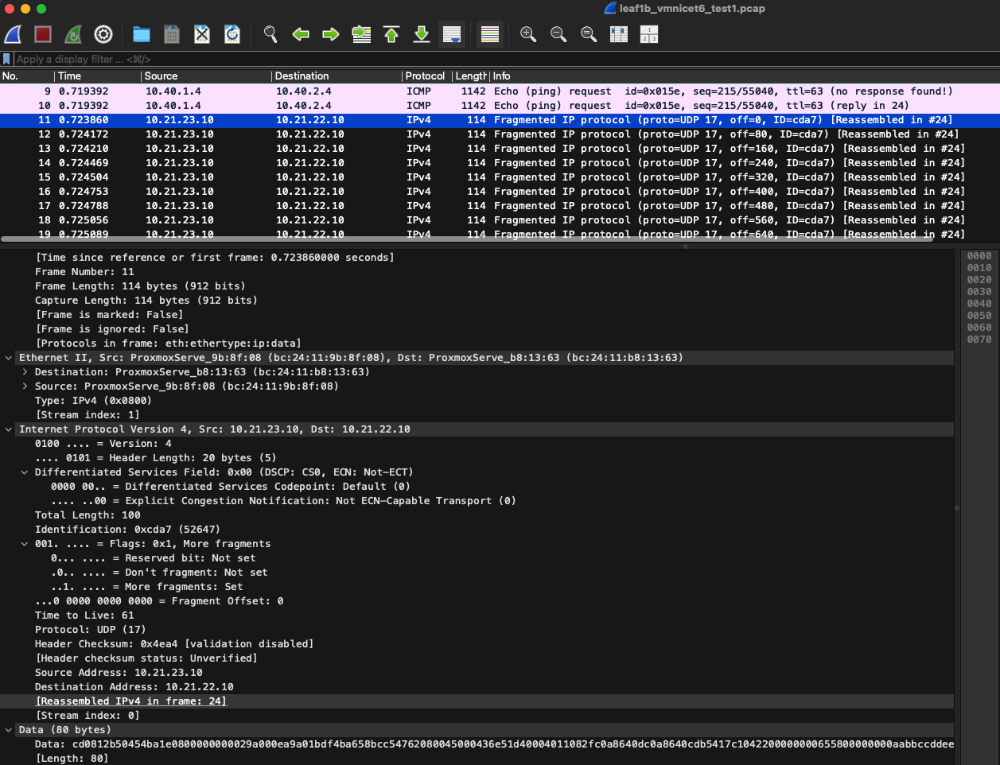

The same is seen on my server 2 ens19 interface:

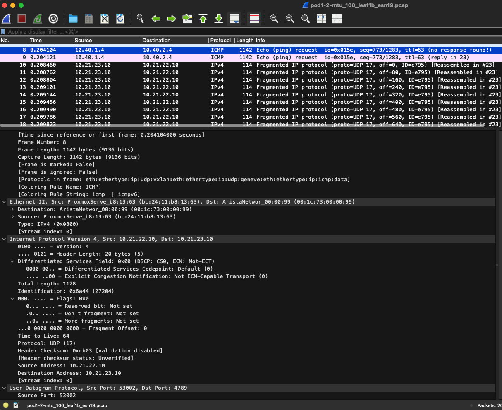


Doing tcpdump directly on server 2 itself I see a lots of *bytes missing!*:

```bash
andreasm@eos-client-2:~/tcpdump/mtu_issues$ sudo tcpdump -i ens19 -c 100  -vvv
tcpdump: listening on ens19, link-type EN10MB (Ethernet), snapshot length 262144 bytes
10:47:43.473406 IP (tos 0x0, ttl 61, id 48283, offset 0, flags [+], proto UDP (17), length 100)
    10.21.23.10.43221 > eos-client-2.4789: VXLAN, flags [I] (0x08), vni 666
IP truncated-ip - 63 bytes missing! (tos 0x0, ttl 64, id 43823, offset 0, flags [DF], proto UDP (17), length 113)
    192.168.100.13.10351 > 192.168.100.11.10351: UDP, length 85
10:47:43.473407 IP (tos 0x0, ttl 61, id 48283, offset 80, flags [none], proto UDP (17), length 83)
    10.21.23.10 > eos-client-2: udp
10:47:43.476149 IP (tos 0x0, ttl 62, id 11890, offset 0, flags [none], proto UDP (17), length 100)
    10.21.21.10.55208 > eos-client-2.4789: [udp sum ok] VXLAN, flags [I] (0x08), vni 666
IP (tos 0x0, ttl 64, id 33812, offset 0, flags [DF], proto UDP (17), length 50)
    192.168.100.11.10351 > 192.168.100.13.10351: [udp sum ok] UDP, length 22
10:47:43.709133 IP (tos 0x0, ttl 61, id 48311, offset 0, flags [+], proto UDP (17), length 100)
    10.21.23.10.35009 > eos-client-2.4789: VXLAN, flags [I] (0x08), vni 666
IP truncated-ip - 978 bytes missing! (tos 0x0, ttl 64, id 0, offset 0, flags [DF], proto ICMP (1), length 1028)
```


Reverting back to the correct mtu size on the vlan interface on leaf1b again, I should no longer see any fragments or missing bytes:

```bash
andreasm@eos-client-2:~/tcpdump/mtu_issues$ sudo tcpdump -i ens19 -c 100  -vvv
tcpdump: listening on ens19, link-type EN10MB (Ethernet), snapshot length 262144 bytes
09:29:38.728403 IP (tos 0x0, ttl 64, id 36841, offset 0, flags [none], proto UDP (17), length 1128)
    eos-client-2.53002 > 10.21.23.10.4789: [udp sum ok] VXLAN, flags [I] (0x08), vni 666
IP (tos 0x0, ttl 64, id 39910, offset 0, flags [DF], proto UDP (17), length 1078)
    eos-client-2.34860 > 192.168.100.13.6081: [no cksum] Geneve, Flags [none], vni 0x0
	IP (tos 0x0, ttl 63, id 0, offset 0, flags [DF], proto ICMP (1), length 1028)
    10.40.1.4 > 10.40.2.4: ICMP echo request, id 350, seq 1369, length 1008
09:29:38.728444 IP (tos 0x0, ttl 64, id 21433, offset 0, flags [none], proto UDP (17), length 1128)
    eos-client-2.53002 > 10.21.21.10.4789: [udp sum ok] VXLAN, flags [I] (0x08), vni 666
IP (tos 0x0, ttl 64, id 39910, offset 0, flags [DF], proto UDP (17), length 1078)
    eos-client-2.34860 > 192.168.100.13.6081: [no cksum] Geneve, Flags [none], vni 0x0
	IP (tos 0x0, ttl 63, id 0, offset 0, flags [DF], proto ICMP (1), length 1028)
    10.40.1.4 > 10.40.2.4: ICMP echo request, id 350, seq 1369, length 1008
```

 

## Summary

It is not unusual to end up with double or even triple encapsulation. Its just a matter of having control of the MTU at the different levels. They physical fabric needs to accommodate the highest MTU as thats where all traffic needs to traverse. Then the next encapsulation layer also needs to adjust according to the physical MTU configuration. If a third encapsulation layer is deployed this needs to be adjusted to the second encapsulation layers MTU configuration. The third encapsulation layer in my environment above comes from the Kubernetes CNI Antrea, which handles this automatically, but should still be something to be aware of in case of performance or any issues thats needs to be looked into. 

If one follow the MTU sizing accordingly it shouldn't be any issues, but if it does it is good to know where to look? 

If using tcpdump and manual cli commands is cumbersome, there may be another more elegant way to monitor such things. I will create a follow up post on this at a later stage.

I will end this post with a simple diagram.

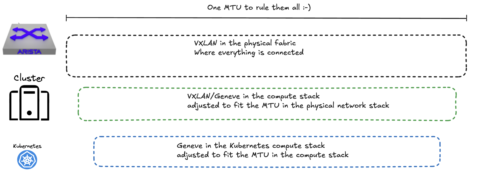

[^1]: *(Earlier version of VMware NSX called NSX-V used VXLAN too, for a period VMware had two NSX versions NSX-V and NSX-T where the latter used Geneve and is the current NSX product, NSX-V is obsolete and NSX-T now is the only product and is just called NSX.)*

