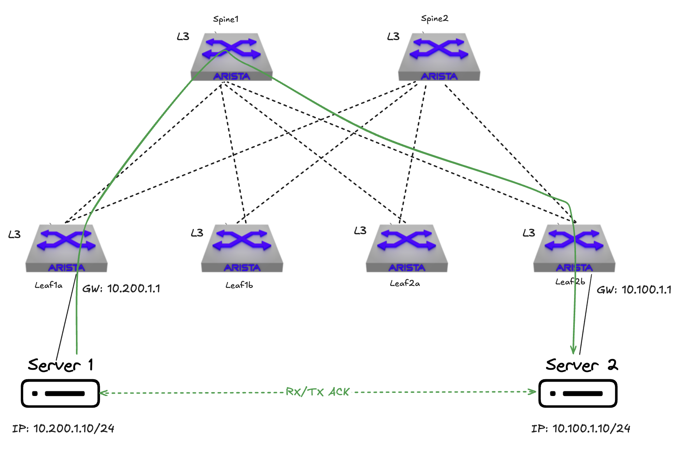
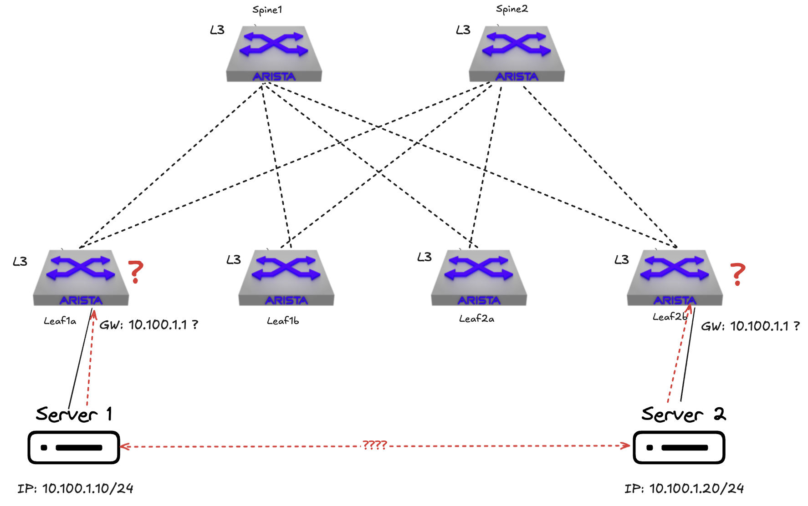
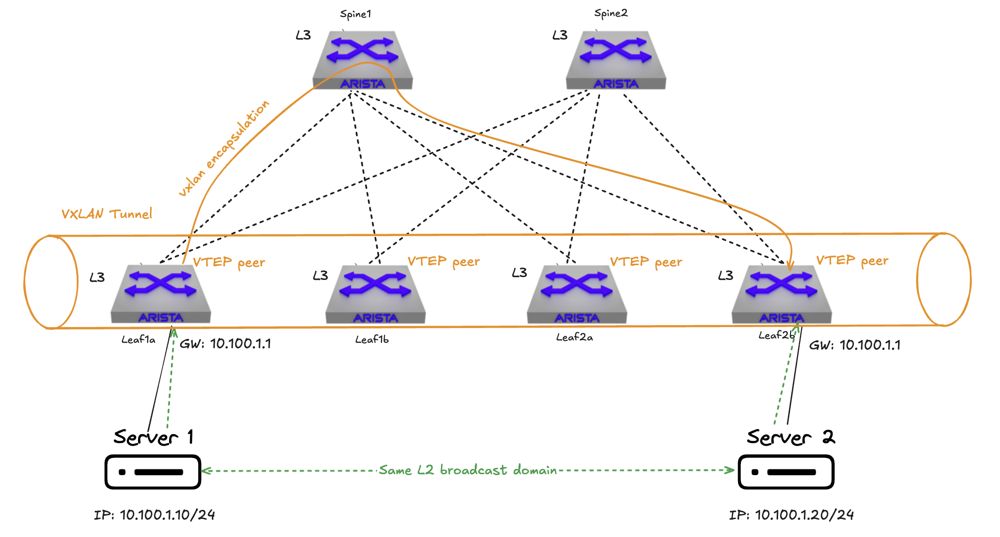
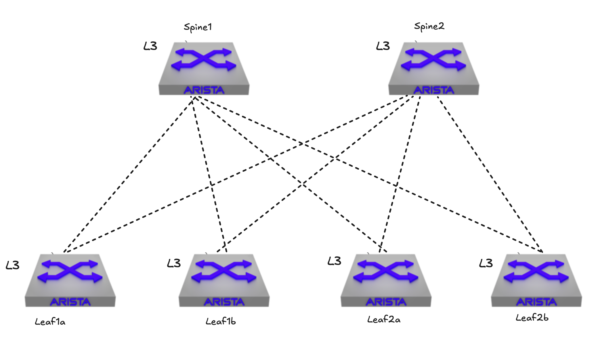
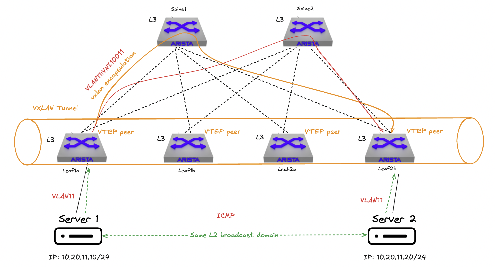
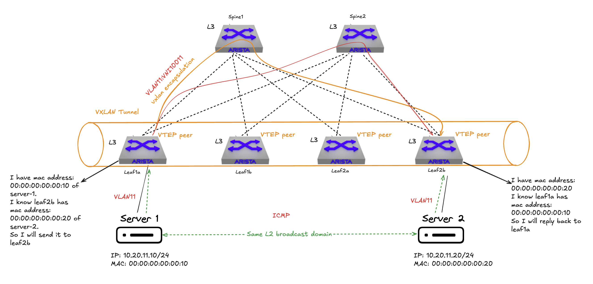
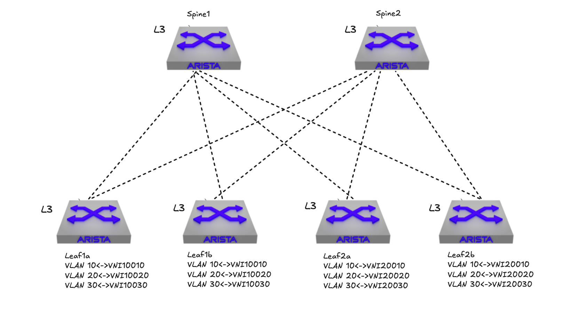
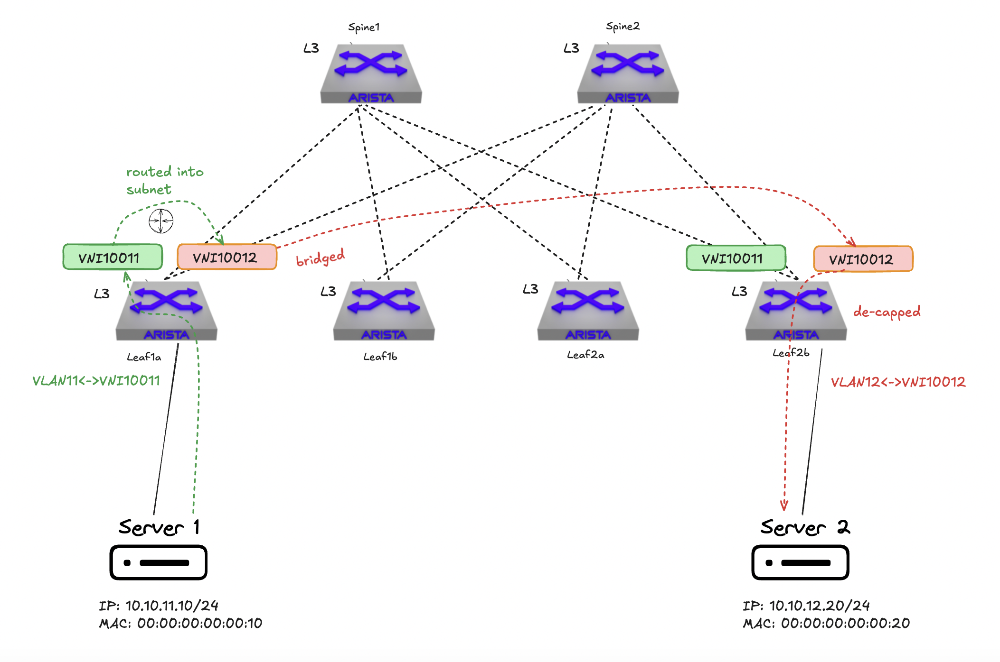
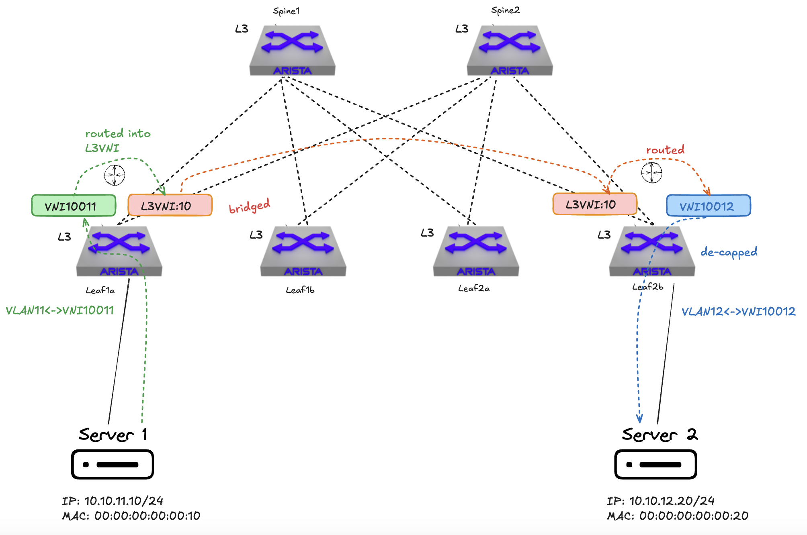

# Ethernet Virtual Private Network

This post marks the begining of a series I am covering on EVPN. The first informational RFC([RFC7209](https://datatracker.ietf.org/doc/rfc7209/)) for EVPN was posted May 2014. It is just a coincidence that EVPN is now on its 10th year and I am writing this blog series. As I have the pleasure of working together with some of the best in the industry, which is motivating on its own, I highly encourage everyone to have a look at this [video](https://youtu.be/QIfClRUl3Bg?si=0I_bhpR3S05iwTp9) from my colleague Johan where he takes us brilliantly through EVPN's 10 year history. 

As this blog series will evolve I will cover EVPN and its different Route Types and EVPN gateways to get a better understanding of what they are, and why they are needed. But first, a quick introduction to EVPN in general. What is EVPN, what is EVPN's responsibilities in the datacenter, and why EVPN. Lets go ahead and try to cast some light on this.

## Layer 2 over layer 3

As the datacenter networking (and campus to a certain degree) has evolved from the traditional core, distribution and access topology to the much more scalable layer 3 spine-leaf topology, the need for layer 2 did not disappear. MAC mobility/vMotion of virtual machines, application requirements like cluster services, iot devices etc are examples that rely on layer 2 reachability. The move away from large broadcast domains in the networks to IP fabric solved a lot of challenges in terms of scalability, performance and resilience. In its own it was a case closed for any loops, broadcast storms scenarios and poor utilization. Though many services in your network still relies on layer 2 though, so how to solve that in a pure layer 3 IP fabric like spine-leaf? 

Existing services as VPLS and Ethernet L2VPN existed, but had its limitations.

To quote the RFC7209:

>    The widespread adoption of Ethernet L2VPN services and the advent of
>    new applications for the technology (e.g., data center interconnect)
>    have culminated in a new set of requirements that are not readily
>    addressable by the current Virtual Private LAN Service (VPLS)
>    solution.  In particular, multihoming with all-active forwarding is
>    not supported, and there's no existing solution to leverage
>    Multipoint-to-Multipoint (MP2MP) Label Switched Paths (LSPs) for
>    optimizing the delivery of multi-destination frames.  Furthermore,
>    the provisioning of VPLS, even in the context of BGP-based auto-
>    discovery, requires network operators to specify various network
>    parameters on top of the access configuration.  This document
>    specifies the requirements for an Ethernet VPN (EVPN) solution, which
>    addresses the above issues.


## EVPN, BGP and Network Virtualization Overlay - control plane vs dataplane

What is EVPN? The short answer is that EVPN is an extension to BGP. But that doesn't help much does it? Lets see if I can go a bit deeper. 

In a spine-leaf fabric all switches are connected using layer 3 links. If all the services connected to the fabric can do fine with layer 3 and be in their own IP subnet, I am fine. Traffic is routed as needed and full reachability is taken care of.



If I need to extend layer 2 beyond any leaf I am not so fine. 



Without any form of mechanisms like overlay control-/and dataplane I am not able to extend my layer 2 network beyond a single leaf. So if I need layer 2 reachability across leafs in the same fabric I need mechanisms that can handle layer 2 over layer 3. The first thing we need is a protocol to create overlay networks that can tunnel, or simulate, layer 2 subnets over layer 3, this can be VXLAN as an example. 



By having protocols like VXLAN to create overlay networks in place it provides the ability to extend my layer 2 subnets across my layer 3 fabric. Managing this at scale though can be hard if not the right mechanisms is in place to accommodate a very dynamic environment such as vm sprawl, multiple tenants etc, we need something that can manage the reachability information in a clever, controlled and scalable way and something that understands network virtualization overlay.  

I can use static routes then? Well, in theory, I could, but that would defeat the purpose of scalability and simpler management, leaving no reason to build a spine-leaf fabric to begin with.

BGP? Yes, it is a very good start. But I cant use regular BGP. 

Regular BGP ([RFC4271](https://datatracker.ietf.org/doc/html/rfc4271)):

> The only three pieces of information carried by BGP-4 [BGP-4] that
>    are IPv4 specific are (a) the NEXT_HOP attribute (expressed as an
>    IPv4 address), (b) AGGREGATOR (contains an IPv4 address), and (c)
>    NLRI (expressed as IPv4 address prefixes).

Source: https://datatracker.ietf.org/doc/html/rfc4760

As regular BGP can only handle IP addresses and IP prefixes it is not sufficient. We need something that can handle a richer set of reachability information, to be able to handle network reachability information when using overlay protocols like VXLAN.

In a spine-leaf fabric these layer 2 networks can be referred to as tenants, virtualized network segments or VPN instances. The need for multiple tenants could be to allow several layer 2 networks sharing the same physical underlay fabric, multiple customers and services sharing the same fabric and even overlapping layer 2 subnets. EVPN allows for these tenants to be configured and isloated in the shared fabric as it enables BGP to have MAC addresses and MAC plus IP addresses as routing entries. In a regular layer 2 switch network, the switches learn how to forward traffic by looking at the Ethernet Frame's MAC headers. An Ethernet Frame consists of a source MAC header and destination MAC header. With an overlay protocol like VXLAN, the standard Ethernet frame is encapsulated adding some additional headers including the source and destination mac address per hop in the underlay, see short explanation below:

```bash
# Ping between two clients attached to two separate leaf switches leaf1a and leaf2a - mac src and mac dst
1st hop (leaf1a): mac src leaf1a -> mac dst spine2
2nd hop (spine2): mac src spine2 -> mac dst leaf2a
```

And the source and destination IP in the vxlan header will be the source and destination ip of the VTEPS:

```bash
# Ping between two clients attached to two separate leaf switches leaf1a and leaf2a - src IP and dst IP
1st hop (leaf1a): src IP vxlan loopback interface leaf1a -> dst IP vxlan loopback interface leaf2a
2nd hop (spine2): src IP vxlan loopback interface leaf1a -> dst IP vxlan loopback interface leaf2a
```

 For more explanation: see my [previous post on overlay](https://blog.andreasm.io/2024/11/08/overlay-on-overlay-arista-in-the-underlay/#let-see-some-triple-encapsulation-in-action)

With EVPN we have a way to capture this additional information and add it to the routing table dynamically allowing the VXLAN tunnels to be established to relevant peers (VTEPS). The peers in VXLAN are called VTEPs, VXLAN Tunnel End Points. 

After the first informational [RFC7209](https://datatracker.ietf.org/doc/rfc7209/) that specified the intention and requirements with EVPN, just under a year later, the initial EVPN standard [RFC7432](https://datatracker.ietf.org/doc/rfc7432/) was posted. The initial EVPN standard (RFC7432) was written with MPLS in mind, however some years later (2018) the [RFC8365](https://datatracker.ietf.org/doc/rfc8365/) was posted describing how EVPN can be used as a network virtualization overlay in combinaton with various encapsulation options like VXLAN, NVGRE, MPLS over GRE and even Geneve. Now why do I mention these RFCs in addtion to the initial RFC7209 from 2014? Well stay tuned to get some clarity on this point.  

First, EVPN stands for Ethernet VPN. EVPN is capable of managing both layer 2 (Ethernet MAC) and IP (layer 3) reachability information. That means EVPN is **not** the carrier of the actual ethernet frames or IP packets, it just informs the interested parties whats the source and destination. And to do that, it uses BGP or rather MP-BGP (Multi-Protocol BGP [RFC4760](https://datatracker.ietf.org/doc/html/rfc4760) an extension to the regular BGP). One of the benefits of BGP is that it does not rely on flood-and-learn in the dataplane, but uses instead a control-plane based learning allowing to restrict who learns what and the ability to apply policies. This reduces unnecessary flooding and is much more scalable. Wasn't this a post about EVPN? Well EVPN uses BGP as its control plane, and the extension to BGP, MP-BGP, makes BGP capable of handle the advertising of additional EVPN routes. Suddenly there is MP-BGP into the mix? 

### MP-BGP

Yes, it is. MP-BGP extends BGP to carry multiple address families, which is needed to handle overlay encapsulation that comes with the use of e.g VXLAN.

>    To provide backward compatibility, as well as to simplify
>    introduction of the multiprotocol capabilities into BGP-4, this
>    document uses two new attributes, Multiprotocol Reachable NLRI
>    (MP_REACH_NLRI) and Multiprotocol Unreachable NLRI (MP_UNREACH_NLRI).
>    The first one (MP_REACH_NLRI) is used to carry the set of reachable
>    destinations together with the next hop information to be used for
>    forwarding to these destinations.  The second one (MP_UNREACH_NLRI)
>    is used to carry the set of unreachable destinations.  Both of these
>    attributes are optional and non-transitive.  This way, a BGP speaker
>    that doesn't support the multiprotocol capabilities will just ignore
>    the information carried in these attributes and will not pass it to
>    other BGP speakers.


> Multiprotocol Reachable NLRI - MP_REACH_NLRI (Type Code 14):
>
> This is an optional non-transitive attribute that can be used for the
> following purposes:
>
> (a) to advertise a feasible route to a peer
>
> (b) to permit a router to advertise the Network Layer address of the
>     router that should be used as the next hop to the destinations
>     listed in the Network Layer Reachability Information field of the
>     MP_NLRI attribute.
>
> The attribute is encoded as shown below:

Source: https://datatracker.ietf.org/doc/html/rfc4760

```bash
        MP-BGP Reachable NLRI
        +---------------------------------------------------------+
        | Address Family Identifier (2 octets)                    |
        +---------------------------------------------------------+
        | Subsequent Address Family Identifier (1 octet)          |
        +---------------------------------------------------------+
        | Length of Next Hop Network Address (1 octet)            |
        +---------------------------------------------------------+
        | Network Address of Next Hop (variable)                  |
        +---------------------------------------------------------+
        | Reserved (1 octet)                                      |
        +---------------------------------------------------------+
        | Network Layer Reachability Information (variable)       |
        +---------------------------------------------------------+
```


EVPN will use MP-BGP to add new BGP Network Layer Reachability Information (NLRI), the EVPN NLRI. This is where we will get a set of different EVPN route types, which I will cover in separate posts later. 
The EVPN NLRI is carried in BGP using MP-BGP with an Address Family Identifier of 25 (L2VPN) and a Subsequent Address Family Identifier of 70 (EVPN).

The different route types of EVPN will be covered in detail in their own as part of this EVPN blog post series. 

I will just quickly use EVPN route type 2, MAC/IP advertisement, as an example for clarification of how this fits in.

This is how a EVPN MAC/IP, route type 2, advertisement specific NLRI consists of (scroll down inside code viewer to see all):

```bash
                +---------------------------------------+
                |  RD (8 octets)                        |
                +---------------------------------------+
                |Ethernet Segment Identifier (10 octets)|
                +---------------------------------------+
                |  Ethernet Tag ID (4 octets)           |
                +---------------------------------------+
                |  MAC Address Length (1 octet)         |
                +---------------------------------------+
                |  MAC Address (6 octets)               |
                +---------------------------------------+
                |  IP Address Length (1 octet)          |
                +---------------------------------------+
                |  IP Address (0, 4, or 16 octets)      |
                +---------------------------------------+
                |  MPLS Label1 (3 octets)               |
                +---------------------------------------+
                |  MPLS Label2 (0 or 3 octets)          |
                +---------------------------------------+
```

 


All fields above are necessary to describe the complete EVPN route, though the fields Ethernet Segment Identifier, MPLS Label 1 and MPLS Label 2 are all in the NLRI, but not part of the route prefix used for route uniqueness. If reading the RFC7432:

>    **For the purpose of BGP route key processing, only the Ethernet Tag*
>    *ID, MAC Address Length, MAC Address, IP Address Length, and IP*
>    *Address fields are considered to be part of the prefix in the NLRI.*
>    *The Ethernet Segment Identifier, MPLS Label1, and MPLS Label2 fields*
>    *are to be treated as route attributes as opposed to being part of the*
>    "route".  Both the IP and MAC address lengths are in bits.*

This can be a bit confusing. In terms of BGP they are not to be seen as attributes in a traditional "BGP sense" like AS_PATH or COMMUNITY etc. 
Note: Even though there are two fields called MPLS Label 1 and 2 does not mean EVPN is not multi-protocol aware. Overlay related information like VNI is carried through EVPN extended communities defined here:

>    In order to indicate which type of data-plane encapsulation (i.e.,
>    VXLAN, NVGRE, MPLS, or MPLS in GRE) is to be used, the BGP
>    Encapsulation Extended Community defined in [RFC5512] is included
>    with all EVPN routes (i.e., MAC Advertisement, Ethernet A-D per EVI,
>    Ethernet A-D per ESI, IMET, and Ethernet Segment) advertised by an
>    egress PE.  Five new values have been assigned by IANA to extend the
>    list of encapsulation types defined in [RFC5512]; they are listed in
>    Section 11.

Now the RFC5512 referred to above has been updated with RFC9012:

>    This document defines a BGP path attribute known as the "Tunnel
>    Encapsulation attribute", which can be used with BGP UPDATEs of
>    various Subsequent Address Family Identifiers (SAFIs) to provide
>    information needed to create tunnels and their corresponding
>    encapsulation headers.  It provides encodings for a number of tunnel
>    types, along with procedures for choosing between alternate tunnels
>    and routing packets into tunnels.


 

So EVPN just solved extending layer 2 networks its own? Well no. I mentioned the RFC7432 and RFC8365 earlier.  EVPN is not the "carrier" of the layer 2 networks, EVPN is the control-plane, the single control-plane for multiple network virtualization overlays (VXLAN, MPLS over GRE, Geneve). We also need something that can transport these networks. We need something that creates a tunnel for our layer 2 ethernet frames, to be able to actually transport these layer 2 networks over layer 3. This can be VXLAN (RFC8365) or MPLS over GRE ([RFC4023](https://datatracker.ietf.org/doc/html/rfc4023)). EVPN may also be referred to as EVPN-VXLAN, EVPN-MPLS or BGP-EVPN. I have already covered VXLAN to some extent in this [post](https://blog.andreasm.io/2024/11/08/overlay-on-overlay-arista-in-the-underlay/#overlay-in-the-underlay). But a quick section on VXLAN will probably make sense. *I will mainly focus on EVPN-VXLAN in this blog series.* 

### VXLAN - the dataplane


Now we understand what EVPN does right? Not quite. 
TL;DR: 
Well it has the ability to segment and isolate tenants (layer 2) effectively using a single control plane, BGP, in a shared layer 3 spine-leaf fabric and VXLAN (or Geneve, NVGRE) as the dataplane creating the tunnels between the involved VTEPS (leafs). This allows for an effective, scalable and controllable way to transport layer 2 over layer 3.


## How is EVPN configured with Arista EOS

To configure EVPN with VXLAN in Arista switches in a spine leaf there are two distinctions that needs to be made. First we have the underlay, that is where all the peer to peer links (routed interfaces) between the spines and leafs are configured. These are the carriers for whatever communication goes between any leaf in the fabric. The second is the overlay, this is where we will have our overlay networks configured, carrying all our layer 2 networks over the layer 3 peer to peer links configured in the underlay. Common for both the underlay and the overlay is BGP, as BGP is configured in both underlay and overlay. This could also be OSPF but why have two different routing protocols when one can just one to handle both the underlay and overlay for simpler management. For this section I have 2 spines and 4 leafs that I will configure EVPN and VXLAN on. 




Lets start by configuring the underlay in a fabric consisting of 2 spines and 4 leafs.

### The underlay

In the underlay I need to configure both the ptp links, but also the underlay BGP configuration, starting with the peer to peer links for my BGP in the underlay to have something to peer with. 

#### Peer to Peer links

As I have 6 switches in total, I need to allocate 16 ipv4 addresses for the ptp links. There will be one uplink from every leaf to every spine. To save on IP addresses I will define the submask for these links as small as possible and it should only make room for 2 ip addresses per link (1 for the leaf uplink and 1 for the spine downlink to respective leaf (spine leaf "pair")), and that should be a /31 netmask. It may make sense to reserve a range for all the potential future expansion in the same range for several reasons. As in my example below I will be using 10.255.255.x/31 for each ptp interface, this may again be carved out of a bigger /24 subnet giving me a total of 256 addresses. 256 addresses? 0 and 255 are broadcast aren't it? Arista EOS supports the [RFC3021](https://datatracker.ietf.org/doc/rfc3021/) which states the following:  

>    With ever-increasing pressure to conserve IP address space on the
>    Internet, it makes sense to consider where relatively minor changes
>    can be made to fielded practice to improve numbering efficiency.  One
>    such change, proposed by this document, is to halve the amount of
>    address space assigned to point-to-point links (common throughout the
>    Internet infrastructure) by allowing the use of 31-bit subnet masks
>    in a very limited way.

This means I can perfectly well use .0 as a useable address as long as it is a /31 submask wich gives me exactly two useable addresses, perfect fit for a peer to peer link. 

Each interface on every switch used for these peer to peer links should look like this, from my spine-1:

```bash
interface Ethernet1
   description P2P_LINK_TO_VEOS-DC1-LEAF1A_Ethernet1
   mtu 9214
   no switchport
   ip address 10.255.255.0/31
!
interface Ethernet2
   description P2P_LINK_TO_VEOS-DC1-LEAF1B_Ethernet1
   mtu 9214
   no switchport
   ip address 10.255.255.4/31
!
interface Ethernet3
   description P2P_LINK_TO_VEOS-DC1-LEAF2A_Ethernet1
   mtu 9214
   no switchport
   ip address 10.255.255.8/31
!
interface Ethernet4
   description P2P_LINK_TO_VEOS-DC1-LEAF2B_Ethernet1
   mtu 9214
   no switchport
   ip address 10.255.255.12/31
!
```

*Notice the .0 in Ethernet1?*

The same config is done on my spine 2 using other ip addresses obviously. For the leafs the peer to peer links looks like this:

```bash
interface Ethernet1
   description P2P_LINK_TO_VEOS-DC1-SPINE1_Ethernet1
   mtu 9214
   no switchport
   ip address 10.255.255.1/31
!
interface Ethernet2
   description P2P_LINK_TO_VEOS-DC1-SPINE2_Ethernet1
   mtu 9214
   no switchport
   ip address 10.255.255.3/31
!
```

The same is done on the remaing leafs accordingly. 

Here is the ip table for all the PTP links I am using:

| Type   | Node            | Node Interface | Leaf IP Address  | Peer Type | Peer Node       | Peer Interface | Peer IP Address  |
| ------ | --------------- | -------------- | ---------------- | --------- | --------------- | -------------- | ---------------- |
| l3leaf | veos-dc1-leaf1a | Ethernet1      | 10.255.255.1/31  | spine     | veos-dc1-spine1 | Ethernet1      | 10.255.255.0/31  |
| l3leaf | veos-dc1-leaf1a | Ethernet2      | 10.255.255.3/31  | spine     | veos-dc1-spine2 | Ethernet1      | 10.255.255.2/31  |
| l3leaf | veos-dc1-leaf1b | Ethernet1      | 10.255.255.5/31  | spine     | veos-dc1-spine1 | Ethernet2      | 10.255.255.4/31  |
| l3leaf | veos-dc1-leaf1b | Ethernet2      | 10.255.255.7/31  | spine     | veos-dc1-spine2 | Ethernet2      | 10.255.255.6/31  |
| l3leaf | veos-dc1-leaf2a | Ethernet1      | 10.255.255.9/31  | spine     | veos-dc1-spine1 | Ethernet3      | 10.255.255.8/31  |
| l3leaf | veos-dc1-leaf2a | Ethernet2      | 10.255.255.11/31 | spine     | veos-dc1-spine2 | Ethernet3      | 10.255.255.10/31 |
| l3leaf | veos-dc1-leaf2b | Ethernet1      | 10.255.255.13/31 | spine     | veos-dc1-spine1 | Ethernet4      | 10.255.255.12/31 |
| l3leaf | veos-dc1-leaf2b | Ethernet2      | 10.255.255.15/31 | spine     | veos-dc1-spine2 | Ethernet4      | 10.255.255.14/31 |


#### BGP in the underlay

Next up is the BGP part that is responsible for exchanging routes in the underlay. This BGP configuration is quite straightforward and minimal.  

On the spine my underlay BGP configuration looks like this:

```bash
!
interface Loopback0
   description EVPN_Overlay_Peering
   ip address 10.255.0.1/32
!
ip prefix-list PL-LOOPBACKS-EVPN-OVERLAY
   seq 10 permit 10.255.0.0/27 eq 32
!
route-map RM-CONN-2-BGP permit 10
   match ip address prefix-list PL-LOOPBACKS-EVPN-OVERLAY
!
router bgp 65110
   router-id 10.255.0.1
   no bgp default ipv4-unicast
   maximum-paths 4 ecmp 4
   neighbor IPv4-UNDERLAY-PEERS peer group
   neighbor IPv4-UNDERLAY-PEERS password 7 7x4B4rnJhZB438m9+BrBfQ==
   neighbor IPv4-UNDERLAY-PEERS send-community
   neighbor IPv4-UNDERLAY-PEERS maximum-routes 12000
   neighbor 10.255.255.1 peer group IPv4-UNDERLAY-PEERS
   neighbor 10.255.255.1 remote-as 65111
   neighbor 10.255.255.1 description veos-dc1-leaf1a_Ethernet1
   neighbor 10.255.255.5 peer group IPv4-UNDERLAY-PEERS
   neighbor 10.255.255.5 remote-as 65112
   neighbor 10.255.255.5 description veos-dc1-leaf1b_Ethernet1
   neighbor 10.255.255.9 peer group IPv4-UNDERLAY-PEERS
   neighbor 10.255.255.9 remote-as 65113
   neighbor 10.255.255.9 description veos-dc1-leaf2a_Ethernet1
   neighbor 10.255.255.13 peer group IPv4-UNDERLAY-PEERS
   neighbor 10.255.255.13 remote-as 65114
   neighbor 10.255.255.13 description veos-dc1-leaf2b_Ethernet1
   redistribute connected route-map RM-CONN-2-BGP
   !
   address-family ipv4
      neighbor IPv4-UNDERLAY-PEERS activate
```

And similarly on my leaf1a:

```bash
interface Loopback0
   description EVPN_Overlay_Peering
   ip address 10.255.0.3/32
!
ip prefix-list PL-LOOPBACKS-EVPN-OVERLAY
   seq 10 permit 10.255.0.0/27 eq 32
!
route-map RM-CONN-2-BGP permit 10
   match ip address prefix-list PL-LOOPBACKS-EVPN-OVERLAY
!
router bgp 65111
   router-id 10.255.0.3
   no bgp default ipv4-unicast
   maximum-paths 4 ecmp 4
   neighbor IPv4-UNDERLAY-PEERS peer group
   neighbor IPv4-UNDERLAY-PEERS password 7 7x4B4rnJhZB438m9+BrBfQ==
   neighbor IPv4-UNDERLAY-PEERS send-community
   neighbor IPv4-UNDERLAY-PEERS maximum-routes 12000
   neighbor 10.255.255.0 peer group IPv4-UNDERLAY-PEERS
   neighbor 10.255.255.0 remote-as 65110
   neighbor 10.255.255.0 description veos-dc1-spine1_Ethernet1
   neighbor 10.255.255.2 peer group IPv4-UNDERLAY-PEERS
   neighbor 10.255.255.2 remote-as 65110
   neighbor 10.255.255.2 description veos-dc1-spine2_Ethernet1
   redistribute connected route-map RM-CONN-2-BGP
   !
   address-family ipv4
      neighbor IPv4-UNDERLAY-PEERS activate
```

The added Loopback0 interface is used for BGP EVPN sessions as we will see a bit later in the BGP summary and routes. Then the IP prefix is created and mapped to the route map telling BGP only redistribute the EVPN overlay loopback interfaces subnet. There is no need to redistribute the underlay peer to peer links as they are directly connected. The sole reason for using BGP also in the underlay (plus all the benefits of using BGP, scalability, robustness, less management overhead) is to achieve reachability of Loopback0 as a stable endpoint for EVPN BGP sessions.  

Later on I will add another Loopback interface (Loopback1) for VXLAN and a corresponding prefix-list on my leaf switches, which is also part of the underlay configuration. I have not added it yet as I want to add it in the VXLAN section. This additional Loopback interface is part of the BGP in the underlay and being redistributed there. 

AS table:

| Device  | AS       |
| ------- | -------- |
| Spine 1 | AS 65110 |
| Spine 2 | AS 65110 |
| Leaf1a  | AS 65111 |
| Leaf1b  | AS 65112 |
| Leaf2a  | AS 65113 |
| Leaf2b  | AS 65114 |

When configured in all my switches lets have a look at the BGP status from my spine 1:

```bash
veos-dc1-spine1#show bgp summary
BGP summary information for VRF default
Router identifier 10.255.0.1, local AS number 65110
Neighbor               AS Session State AFI/SAFI                AFI/SAFI State   NLRI Rcd   NLRI Acc
------------- ----------- ------------- ----------------------- -------------- ---------- ----------
10.255.255.1        65111 Established   IPv4 Unicast            Negotiated              2          2
10.255.255.5        65112 Established   IPv4 Unicast            Negotiated              2          2
10.255.255.9        65113 Established   IPv4 Unicast            Negotiated              2          2
10.255.255.13       65114 Established   IPv4 Unicast            Negotiated              2          2
```

Thats it for the underlay configurations. Next up is the overlay parts.

### The overlay

Now the more interesting parts are up, BGP in the overlay, loopback interfaces and VXLAN configurations. 

#### BGP in the overlay

Configuring BGP in the overlay will just build on top of already existing BGP config, I do not need to create any additional BGP router AS'es. Its all about adding the necessary overlay config to support EVPN.

On my spine 1 I have added these configurations, in addition to the already configured BGP settings:

```bash
!
interface Loopback0
   description EVPN_Overlay_Peering
   ip address 10.255.0.1/32
!
ip prefix-list PL-LOOPBACKS-EVPN-OVERLAY
   seq 10 permit 10.255.0.0/27 eq 32
!
route-map RM-CONN-2-BGP permit 10
   match ip address prefix-list PL-LOOPBACKS-EVPN-OVERLAY
!
router bgp 65110
   neighbor EVPN-OVERLAY-PEERS peer group #Added
   neighbor EVPN-OVERLAY-PEERS next-hop-unchanged #Added
   neighbor EVPN-OVERLAY-PEERS update-source Loopback0 #Added
   neighbor EVPN-OVERLAY-PEERS bfd #Added
   neighbor EVPN-OVERLAY-PEERS ebgp-multihop 3 #Added
   neighbor EVPN-OVERLAY-PEERS password 7 Q4fqtbqcZ7oQuKfuWtNGRQ== #Added
   neighbor EVPN-OVERLAY-PEERS send-community #Added
   neighbor EVPN-OVERLAY-PEERS maximum-routes 0 #Added
   neighbor 10.255.0.3 peer group EVPN-OVERLAY-PEERS
   neighbor 10.255.0.3 remote-as 65111
   neighbor 10.255.0.3 description veos-dc1-leaf1a
   neighbor 10.255.0.4 peer group EVPN-OVERLAY-PEERS
   neighbor 10.255.0.4 remote-as 65112
   neighbor 10.255.0.4 description veos-dc1-leaf1b
   neighbor 10.255.0.5 peer group EVPN-OVERLAY-PEERS
   neighbor 10.255.0.5 remote-as 65113
   neighbor 10.255.0.5 description veos-dc1-leaf2a
   neighbor 10.255.0.6 peer group EVPN-OVERLAY-PEERS
   neighbor 10.255.0.6 remote-as 65114
   neighbor 10.255.0.6 description veos-dc1-leaf2b
   redistribute connected route-map RM-CONN-2-BGP
   !
   address-family evpn #Added
      neighbor EVPN-OVERLAY-PEERS activate #Added
   !
   address-family ipv4
      no neighbor EVPN-OVERLAY-PEERS activate
!
```

A short explanation of what is added:

All the *EVPN-OVERLAY-PEERS* are added to BGP using their respective Loopback interfaces added in the "BGP underlay section" and AS numbers accordingly. Then the EVPN address family is added and the EVPN-OVERLAY-PEERS group is added. The same group is negated under the address family ipv4. 

The complete BGP related config on spine 1 looks like this now:

```bash
interface Loopback0
   description EVPN_Overlay_Peering
   ip address 10.255.0.1/32
!
ip prefix-list PL-LOOPBACKS-EVPN-OVERLAY
   seq 10 permit 10.255.0.0/27 eq 32
!
route-map RM-CONN-2-BGP permit 10
   match ip address prefix-list PL-LOOPBACKS-EVPN-OVERLAY
!
router bgp 65110
   router-id 10.255.0.1
   no bgp default ipv4-unicast
   maximum-paths 4 ecmp 4
   neighbor EVPN-OVERLAY-PEERS peer group
   neighbor EVPN-OVERLAY-PEERS next-hop-unchanged
   neighbor EVPN-OVERLAY-PEERS update-source Loopback0
   neighbor EVPN-OVERLAY-PEERS bfd
   neighbor EVPN-OVERLAY-PEERS ebgp-multihop 3
   neighbor EVPN-OVERLAY-PEERS password 7 Q4fqtbqcZ7oQuKfuWtNGRQ==
   neighbor EVPN-OVERLAY-PEERS send-community
   neighbor EVPN-OVERLAY-PEERS maximum-routes 0
   neighbor IPv4-UNDERLAY-PEERS peer group
   neighbor IPv4-UNDERLAY-PEERS password 7 7x4B4rnJhZB438m9+BrBfQ==
   neighbor IPv4-UNDERLAY-PEERS send-community
   neighbor IPv4-UNDERLAY-PEERS maximum-routes 12000
   neighbor 10.255.0.3 peer group EVPN-OVERLAY-PEERS
   neighbor 10.255.0.3 remote-as 65111
   neighbor 10.255.0.3 description veos-dc1-leaf1a
   neighbor 10.255.0.4 peer group EVPN-OVERLAY-PEERS
   neighbor 10.255.0.4 remote-as 65112
   neighbor 10.255.0.4 description veos-dc1-leaf1b
   neighbor 10.255.0.5 peer group EVPN-OVERLAY-PEERS
   neighbor 10.255.0.5 remote-as 65113
   neighbor 10.255.0.5 description veos-dc1-leaf2a
   neighbor 10.255.0.6 peer group EVPN-OVERLAY-PEERS
   neighbor 10.255.0.6 remote-as 65114
   neighbor 10.255.0.6 description veos-dc1-leaf2b
   neighbor 10.255.255.1 peer group IPv4-UNDERLAY-PEERS
   neighbor 10.255.255.1 remote-as 65111
   neighbor 10.255.255.1 description veos-dc1-leaf1a_Ethernet1
   neighbor 10.255.255.5 peer group IPv4-UNDERLAY-PEERS
   neighbor 10.255.255.5 remote-as 65112
   neighbor 10.255.255.5 description veos-dc1-leaf1b_Ethernet1
   neighbor 10.255.255.9 peer group IPv4-UNDERLAY-PEERS
   neighbor 10.255.255.9 remote-as 65113
   neighbor 10.255.255.9 description veos-dc1-leaf2a_Ethernet1
   neighbor 10.255.255.13 peer group IPv4-UNDERLAY-PEERS
   neighbor 10.255.255.13 remote-as 65114
   neighbor 10.255.255.13 description veos-dc1-leaf2b_Ethernet1
   redistribute connected route-map RM-CONN-2-BGP
   !
   address-family evpn
      neighbor EVPN-OVERLAY-PEERS activate
   !
   address-family ipv4
      no neighbor EVPN-OVERLAY-PEERS activate
      neighbor IPv4-UNDERLAY-PEERS activate
```


Similarly on my leaf1a the additional BGP config:

```bash
interface Loopback0
   description EVPN_Overlay_Peering
   ip address 10.255.0.3/32
!
ip prefix-list PL-LOOPBACKS-EVPN-OVERLAY
   seq 10 permit 10.255.0.0/27 eq 32
!
route-map RM-CONN-2-BGP permit 10
   match ip address prefix-list PL-LOOPBACKS-EVPN-OVERLAY
!
router bgp 65111
   neighbor EVPN-OVERLAY-PEERS peer group
   neighbor EVPN-OVERLAY-PEERS update-source Loopback0
   neighbor EVPN-OVERLAY-PEERS bfd
   neighbor EVPN-OVERLAY-PEERS ebgp-multihop 3
   neighbor EVPN-OVERLAY-PEERS password 7 Q4fqtbqcZ7oQuKfuWtNGRQ==
   neighbor EVPN-OVERLAY-PEERS send-community
   neighbor EVPN-OVERLAY-PEERS maximum-routes 0
   neighbor 10.255.0.1 peer group EVPN-OVERLAY-PEERS
   neighbor 10.255.0.1 remote-as 65110
   neighbor 10.255.0.1 description veos-dc1-spine1
   neighbor 10.255.0.2 peer group EVPN-OVERLAY-PEERS
   neighbor 10.255.0.2 remote-as 65110
   neighbor 10.255.0.2 description veos-dc1-spine2
   redistribute connected route-map RM-CONN-2-BGP
   !
   address-family evpn
      neighbor EVPN-OVERLAY-PEERS activate
   !
   address-family ipv4
      no neighbor EVPN-OVERLAY-PEERS activate
      neighbor IPv4-UNDERLAY-PEERS activate
```

Then the full BGP related config on my leaf1a:

```bash
interface Loopback0
   description EVPN_Overlay_Peering
   ip address 10.255.0.3/32
!
ip prefix-list PL-LOOPBACKS-EVPN-OVERLAY
   seq 10 permit 10.255.0.0/27 eq 32
!
route-map RM-CONN-2-BGP permit 10
   match ip address prefix-list PL-LOOPBACKS-EVPN-OVERLAY
!
router bgp 65111
   router-id 10.255.0.3
   no bgp default ipv4-unicast
   maximum-paths 4 ecmp 4
   neighbor EVPN-OVERLAY-PEERS peer group
   neighbor EVPN-OVERLAY-PEERS update-source Loopback0
   neighbor EVPN-OVERLAY-PEERS bfd
   neighbor EVPN-OVERLAY-PEERS ebgp-multihop 3
   neighbor EVPN-OVERLAY-PEERS password 7 Q4fqtbqcZ7oQuKfuWtNGRQ==
   neighbor EVPN-OVERLAY-PEERS send-community
   neighbor EVPN-OVERLAY-PEERS maximum-routes 0
   neighbor IPv4-UNDERLAY-PEERS peer group
   neighbor IPv4-UNDERLAY-PEERS password 7 7x4B4rnJhZB438m9+BrBfQ==
   neighbor IPv4-UNDERLAY-PEERS send-community
   neighbor IPv4-UNDERLAY-PEERS maximum-routes 12000
   neighbor 10.255.0.1 peer group EVPN-OVERLAY-PEERS
   neighbor 10.255.0.1 remote-as 65110
   neighbor 10.255.0.1 description veos-dc1-spine1
   neighbor 10.255.0.2 peer group EVPN-OVERLAY-PEERS
   neighbor 10.255.0.2 remote-as 65110
   neighbor 10.255.0.2 description veos-dc1-spine2
   neighbor 10.255.255.0 peer group IPv4-UNDERLAY-PEERS
   neighbor 10.255.255.0 remote-as 65110
   neighbor 10.255.255.0 description veos-dc1-spine1_Ethernet1
   neighbor 10.255.255.2 peer group IPv4-UNDERLAY-PEERS
   neighbor 10.255.255.2 remote-as 65110
   neighbor 10.255.255.2 description veos-dc1-spine2_Ethernet1
   redistribute connected route-map RM-CONN-2-BGP
   !
   address-family evpn
      neighbor EVPN-OVERLAY-PEERS activate
   !
   address-family ipv4
      no neighbor EVPN-OVERLAY-PEERS activate
      neighbor IPv4-UNDERLAY-PEERS activate
```

The BGP EVPN loopback0 interfaces on all my devices for context and reference:

```bash
### Loopback Interfaces (BGP EVPN Peering)

| Loopback Pool | Available Addresses | Assigned addresses | Assigned Address % |
| ------------- | ------------------- | ------------------ | ------------------ |
| 10.255.0.0/27 | 32 | 6 | 18.75 % |

### Loopback0 Interfaces Node Allocation

| POD | Node | Loopback0 |
| --- | ---- | --------- |
| VEOS_FABRIC | veos-dc1-leaf1a | 10.255.0.3/32 |
| VEOS_FABRIC | veos-dc1-leaf1b | 10.255.0.4/32 |
| VEOS_FABRIC | veos-dc1-leaf2a | 10.255.0.5/32 |
| VEOS_FABRIC | veos-dc1-leaf2b | 10.255.0.6/32 |
| VEOS_FABRIC | veos-dc1-spine1 | 10.255.0.1/32 |
| VEOS_FABRIC | veos-dc1-spine2 | 10.255.0.2/32 |
```

When showing ip bgp summary on spine 1 after all switches are configured:

```bash
veos-dc1-spine1#show ip bgp summary
BGP summary information for VRF default
Router identifier 10.255.0.1, local AS number 65110
Neighbor Status Codes: m - Under maintenance
  Description              Neighbor      V AS           MsgRcvd   MsgSent  InQ OutQ  Up/Down State   PfxRcd PfxAcc
  veos-dc1-leaf1a_Ethernet 10.255.255.1  4 65111          45087     45068    0    0   26d15h Estab   2      2
  veos-dc1-leaf1b_Ethernet 10.255.255.5  4 65112          45139     45097    0    0   16d23h Estab   2      2
  veos-dc1-leaf2a_Ethernet 10.255.255.9  4 65113          45046     45081    0    0   26d15h Estab   2      2
  veos-dc1-leaf2b_Ethernet 10.255.255.13 4 65114          45096     45138    0    0   26d14h Estab   2      2
```

And on leaf1a:

```bash
veos-dc1-leaf1a#show ip bgp summary
BGP summary information for VRF default
Router identifier 10.255.0.3, local AS number 65111
Neighbor Status Codes: m - Under maintenance
  Description              Neighbor     V AS           MsgRcvd   MsgSent  InQ OutQ  Up/Down State   PfxRcd PfxAcc
  veos-dc1-spine1_Ethernet 10.255.255.0 4 65110          45056     45078    0    0   26d15h Estab   7      7
  veos-dc1-spine2_Ethernet 10.255.255.2 4 65110          45056     45080    0    0   26d15h Estab   7      7
```


Now the BGP is configured in both the underlay and the overlay and the EVPN address family is activated. Next up is VXLAN and some networks in the overlay.

#### VXLAN configurations

Now it is time to configure the dataplane, where my layer 2 networks reside. For that I need to configure VXLAN. The VXLAN configurations will only involve the leaf switches as they are the only VTEPs being configured in my spine/leaf fabric. 

On my leaf1a switch I have added the following VXLAN configuration:

```bash
!
interface Loopback1
   description VTEP_VXLAN_Tunnel_Source
   ip address 10.255.1.3/32
!
ip prefix-list PL-LOOPBACKS-EVPN-OVERLAY
   seq 20 permit 10.255.1.0/27 eq 32
!
interface Vxlan1
   description veos-dc1-leaf1a_VTEP
   vxlan source-interface Loopback1
   vxlan udp-port 4789
```

I have added another loopback interface (Loopback1) which will serve as the VTEP IP address, then the general VXLAN configuration, description, source-interface and udp-port. Note also that I have added another prefix to my route map PL-LOOPBACKS-EVPN-OVERLAY to distribute the VTEP IP addresses in the underlay. As mentioned above these Loopback interfaces are considered part of the underlay configuration. 

I could have achieved the same with just one loopback interface for both EVPN and VXLAN but best practice is to have a dedicated loopback for EVPN and a dedicated loopback for VXLAN. 

The VXLAN loopback1 interface for all my leaf switches for reference:

```bash
### VTEP Loopback VXLAN Tunnel Source Interfaces (VTEPs Only)

| VTEP Loopback Pool | Available Addresses | Assigned addresses | Assigned Address % |
| --------------------- | ------------------- | ------------------ | ------------------ |
| 10.255.1.0/27 | 32 | 4 | 12.5 % |

### VTEP Loopback Node allocation

| POD | Node | Loopback1 |
| --- | ---- | --------- |
| VEOS_FABRIC | veos-dc1-leaf1a | 10.255.1.3/32 |
| VEOS_FABRIC | veos-dc1-leaf1b | 10.255.1.4/32 |
| VEOS_FABRIC | veos-dc1-leaf2a | 10.255.1.5/32 |
| VEOS_FABRIC | veos-dc1-leaf2b | 10.255.1.6/32 |
```

The same configuration is applied to the rest of the leaf switches accordingly (except for loopback1 ip address, which is unique).

The VXLAN configuration is done, but I have not added any networks. Next up is adding networks, or overlay networks and informing EVPN about them

#### Adding layer 2 networks using VXLAN

Now that VXLAN is configured, I need to create some networks. When creating layer 2 subnets using VXLAN they are often referred to as virtualized layer 2 or simply overlay subnets. In VXLAN these layer 2 subnets are placed in segments or VXLAN segments where VNI (VXLAN Network Identifier) is used as the identifier for the respective segment, not VLAN. VXLAN provides a 24-bit VNI meaning we can have a total of 16 million segments in a VXLAN fabric. This does not mean 16 million per VTEP, but across different VTEPS in the same fabric. The reason for this is because there is a 1:1 mapping between VLAN and VNI (more info on this later). So to create a layer 2 network I will have to map a VLAN to a VNI. Lets have a look at my configuration below:

```bash
!
vlan 11
   name VRF10_VLAN11
!
interface Vxlan1
   description veos-dc1-leaf1b_VTEP
   vxlan source-interface Loopback1
   vxlan udp-port 4789
   vxlan vlan 11 vni 10011
```

To keep it very simple I have in my config above added one vlan, *VLAN 11*. Then in my VXLAN configuration I am doing a VLAN to VNI mapping:

```bash
   vxlan vlan 11 vni 10011
```

The VNI number can be anything from 1 to 16777215. The VLAN to VNI mappings are called L2VNI. There is no SVI (Switch Virtual Interface) configured, no gateway so a pure layer 2 and reachability is isolated inside this broadcast domain. 

If I take a look at my VLAN 11 on leaf1a after the VLAN to VNI mapping:

```bash
veos-dc1-leaf1a#show vlan 11
VLAN  Name                             Status    Ports
----- -------------------------------- --------- -------------------------------
11    VRF10_VLAN11                     active    Cpu, Et5, Et6, Vx1 # notice the Vx1 
```

The vxlan1 interface has been added. 

When a server is attached to *leaf1a* in VLAN 11 in subnet 10.20.11.0/24 and this VLAN is mapped to VNI 10011 and it wants to do an ICMP request to another server attached to *leaf2b* using the same VLAN , same subnet and same VNI mapping they are in the same layer 2 broadcast domain and there will be no routing in the overlay. In the underlay there will ofcourse be some routing done as explained earlier. The responsibility of VXLAN in this case is encapsulating the ethernet frame on leaf1a (source or ingress vtep) and decapsulate it on leaf2b (destination or egress vtep) before it is delivered to server 2, also called *bridging*.




But will this work? How does the VTEP leaf1a know that I do have a server 2 on the same subnet on leaf2b? Well here is where the control plane comes into play, BGP. BGP advertises the Loopback0 and Loopback1 (EVPN and VXLAN) in the underlay for reachability.

```bash
veos-dc1-leaf1a#show vxlan vtep detail
Remote VTEPS for Vxlan1:

VTEP             Learned Via         MAC Address Learning       Tunnel Type(s)
---------------- ------------------- -------------------------- --------------
10.255.1.4       control plane       control plane              flood, unicast
10.255.1.5       control plane       control plane              flood, unicast
10.255.1.6       control plane       control plane              flood, unicast

Total number of remote VTEPS:  3
```

That is why I dont configure any static peering in my VXLAN configuration, BGP is handling this in the control plane. Right now though, my VLAN 11 is not being advertised anywhere so it will not be possible for Server 1 and Server 2 to reach each other. I need to configure BGP to advertise the VLAN 11 to VNI 10011 mapping in my overlay so the VTEPs can form a tunnel and span this layer 2 subnet across my layer 3 spine leaf fabric.

```bash
 router bgp 65111
   router-id 10.255.0.3
<----redacted--->
   !
   vlan 11
      rd 10.255.0.3:10011
      route-target both 10011:10011
      redistribute learned
   !
```

The tunnel between leaf1a and leaf2b is established dynamically meaning its not only until any VTEP is advertising the same VNI in BGP and there is an ARP request from a source to another destination in the same VNI (L2VNI) the VXLAN tunnel is established. No flood and learn, but MAC addresses learnt locally are advertised to EVPN peers.




*I mentioned that VNI uses 24-bit and can create 16777215 segments. The maximum number of VLANs on a single switch is 4094, even less if factoring in VLANS that are system/internally reserved. So to be able to achieve  4094< (max 16777215) VNIs or VXLAN segments it is fully possible to map different same VLAN to a different VNI, but this cant be done on the same switch or VTEP. In a spine leaf fabric with several leafs and every leaf is a VTEP they can have a different range of VNI mapped to same VLAN individually, creating their own layer 2 broadcast domains. In the illustration below I have 4 leafs where each "pair" of leafs have been configured using a set of VLAN to VNI mappings. Leaf pair leaf1a and leaf1b maps VLAN 10,20 and 30 to VNIs 10010, 10020 and 10030 while the other leaf pair leaf2a and leaf2b maps VLAN 10,20 and 30 to VNIs 20010, 20020 and 20030:*




Thats it for L2VNI, but what if I want to route between L2VNIs? 

#### Integrated routing and bridging (IRB)

In a traditional network with a lot of north south traffic it made sense to have a "nortbound" centralized gateway to both maintain isolation and apply policies. In todays modern datacenter that traffic pattern has changed to become dominantly east-west due to the distributed nature of the applications like virtual machines and containers (e.g Kubernetes clusters). There is no longer one big server handling many roles at the same time, but instead many virtual machines and often a huge amount of containers must work together to provide the "full" application. This change is a natural evolution in the datacenter where scalability, performance and management is key. For these VMs and containers to "interact" network is critical in both performance and reliability. Having a centralized router/gateway such a scenario may not be so optimal. Therefore we need to have a solution that can provide "de-centralized" routing or distributed routing.

Distributed routing means in this case that all my switches with VTEPS can become a default gateway for my VXLAN segments, where routing is done between L2VNIs (inter-subnet routing) without exiting the VXLAN fabric at line-rate and in the first hop, close to my application. 

With VXLAN it is possible to configure exactly this behavior, instead of just doing regular L2VNIs it is also possible to do L3VNI using an extension in VXLAN called Integrated Routing and Bridging ([IETF draft](https://datatracker.ietf.org/doc/html/draft-sajassi-l2vpn-evpn-inter-subnet-forwarding-05)). Integrated Routing and Bridging can be configured two ways, asymmetric IRB or symmetric IRB. 

##### Asymmetric IRB

In asymmetric IRB, the ingress VTEP performs both the routing and bridging tasks. When a packet moves between subnets, the ingress VTEP routes the packet to the destination subnet and then encapsulates it with the corresponding VXLAN VNI. The egress VTEP simply decapsulates the packet and forwards it based on layer 2 information. Each VTEP must maintain information about all tenant hosts, including their MAC and IP bindings. This necessitates that every VTEP be a member of all tenant subnets/VNIs and have associated SVIs with anycast IPs for each subnet. That is the only way for VXLAN to route L2VNIs withouth a L3VNI.



Due to the need for each VTEP to handle all tenant subnets, asymmetric IRB can face scalability challenges, especially in large multi-tenant environments.

##### Symmetric IRB

In symmetric IRB both ingress and egress VTEPs participate in routing. When a packet traverses subnets, the ingress VTEP routes the packet from the source subnet to an intermediate IP-VRF. The packet is then VXLAN encapsulated and sent to the egress VTEP, which routes it from the IP-VRF to the destination subnet. With an L3VNI configured, I no longer need to have all the other VTEPs VNIs configured across all VTEPS, it can route from eg, VNI10010 to VNI 10020 located on a remote tep using the L3VNI (VRF).

VTEPs need to be configured with an IP-VRF that interconnects all subnets. This model allows for better scalability as each VTEP doesn't need to maintain complete information about all tenant hosts.



Symmetric IRB offers improved scalability and flexibility, making it more suitable for large-scale deployments with multiple tenants.

<div style="border-left: 4px solid #2196F3; background-color: #E3F2FD; padding: 10px; margin: 10px 0; color: #0000FF;"> <strong>Info:</strong>
Arista supports both asymmetric and symmetric IRB!
 </div>


For more information on how this works in Arista EOS see [here](https://www.arista.com/en/um-eos/eos-integrated-routing-and-bridging)


In my lab I am using symmetrical IRB. I have two VRFs mapped to their own unique VNI (L3VNIs). VRF20 is mapped to VNI:10 and VRF21 is mapped to VNI:11. Almost all VLANs and VNIs (L2VNIs) are configured on all leafs, except VLAN14 which is only configured on leaf2b (in VRF20). I am not prone to scaling issues in my lab when it comes to the amount VNIs and mac address tables, and even though most or all VNIs are represented on my leafs I still use symmetrical IRB due to the nature of having L3VNIs (VRF) configured. Without a L3VNI it has to do asymmetric IRB (ingress vtep does all the routing and bridging). Anycast gateway is configured and VLAN to VNI mapping is done and added to my BGP configuration.  

See the config below for leaf1a and leaf2b.

Leaf1a:

```bash
!
vlan 11
   name VRF10_VLAN11
!
vlan 12-13
   name VRF10_VLAN12
!
vlan 21
   name VRF11_VLAN21
!
vlan 22
   name VRF11_VLAN22
!
vlan 23
   name VRF11_VLAN23
!
vlan 1079
   name VRF10_VLAN1079_WAN
!
vlan 3401
   name L2_VLAN3401
!
vlan 3402
   name L2_VLAN3402
!
vrf instance VRF20
!
vrf instance VRF21
!
interface Vlan11
   description VRF10_VLAN11
   vrf VRF20
   ip address virtual 10.20.11.1/24
!
interface Vlan12
   description VRF10_VLAN12
   vrf VRF20
   ip address virtual 10.20.12.1/24
!
interface Vlan13
   description VRF10_VLAN12
   vrf VRF20
   ip address virtual 10.20.13.1/24
!
interface Vlan21
   description VRF11_VLAN21
   mtu 9194
   vrf VRF21
   ip address virtual 10.21.21.1/24
!
interface Vlan22
   description VRF11_VLAN22
   mtu 9194
   vrf VRF21
   ip address virtual 10.21.22.1/24
!
interface Vlan23
   description VRF11_VLAN23
   mtu 9194
   vrf VRF21
   ip address virtual 10.21.23.1/24
!
interface Vlan1079
   description VRF10_VLAN1079_WAN
   vrf VRF20
!
interface Vxlan1
   description veos-dc1-leaf1b_VTEP
   vxlan source-interface Loopback1
   vxlan udp-port 4789
   vxlan vlan 11 vni 10011
   vxlan vlan 12 vni 10012
   vxlan vlan 13 vni 10013
   vxlan vlan 21 vni 10021
   vxlan vlan 22 vni 10022
   vxlan vlan 23 vni 10023
   vxlan vlan 1079 vni 11079
   vxlan vlan 3401 vni 13401
   vxlan vlan 3402 vni 13402
   vxlan vrf VRF20 vni 10
   vxlan vrf VRF21 vni 11
!
ip virtual-router mac-address 00:1c:73:00:00:99
ip address virtual source-nat vrf VRF20 address 10.255.10.4
ip address virtual source-nat vrf VRF21 address 10.255.11.4
!
ip routing
no ip routing vrf MGMT
ip routing vrf VRF20
ip routing vrf VRF21
```


Leaf2b:

```bash
vlan 11
   name VRF10_VLAN11
!
vlan 12-13
   name VRF10_VLAN12
!
vlan 14
   name VRF10_VLAN14
!
vlan 21
   name VRF11_VLAN21
!
vlan 22
   name VRF11_VLAN22
!
vlan 23
   name VRF11_VLAN23
!
vlan 1079
   name VRF10_VLAN1079_WAN
!
vlan 3401
   name L2_VLAN3401
!
vlan 3402
   name L2_VLAN3402
!
vrf instance VRF20
!
vrf instance VRF21
!
interface Ethernet1
   description P2P_LINK_TO_VEOS-DC1-SPINE1_Ethernet4
   mtu 9194
   no switchport
   ip address 10.255.255.13/31
!
interface Ethernet2
   description P2P_LINK_TO_VEOS-DC1-SPINE2_Ethernet4
   mtu 9194
   no switchport
   ip address 10.255.255.15/31
!
interface Ethernet5
   description dc1-leaf2b-client4_CLIENT4
   switchport trunk native vlan 14
   switchport trunk allowed vlan 11-14,21-22
   switchport mode trunk
!
interface Ethernet6
   description leaf2b-wan-u1_u1-vrf10
   mtu 1500
   switchport trunk allowed vlan 1079
   switchport mode trunk
!
interface Loopback0
   description EVPN_Overlay_Peering
   ip address 10.255.0.6/32
!
interface Loopback1
   description VTEP_VXLAN_Tunnel_Source
   ip address 10.255.1.6/32
!
interface Loopback10
   description VRF20_VTEP_DIAGNOSTICS
   vrf VRF20
   ip address 10.255.10.6/32
!
interface Loopback11
   description VRF21_VTEP_DIAGNOSTICS
   vrf VRF21
   ip address 10.255.11.6/32
!
interface Vlan11
   description VRF10_VLAN11
   vrf VRF20
   ip address virtual 10.20.11.1/24
!
interface Vlan12
   description VRF10_VLAN12
   vrf VRF20
   ip address virtual 10.20.12.1/24
!
interface Vlan13
   description VRF10_VLAN12
   vrf VRF20
   ip address virtual 10.20.13.1/24
!
interface Vlan14
   description VRF10_VLAN14
   vrf VRF20
   ip address virtual 10.20.14.1/24
!
interface Vlan21
   description VRF11_VLAN21
   mtu 9194
   vrf VRF21
   ip address virtual 10.21.21.1/24
!
interface Vlan22
   description VRF11_VLAN22
   mtu 9194
   vrf VRF21
   ip address virtual 10.21.22.1/24
!
interface Vlan23
   description VRF11_VLAN23
   mtu 9194
   vrf VRF21
   ip address virtual 10.21.23.1/24
!
interface Vlan1079
   description VRF10_VLAN1079_WAN
   vrf VRF20
   ip address 10.179.0.2/29
!
interface Vxlan1
   description veos-dc1-leaf2b_VTEP
   vxlan source-interface Loopback1
   vxlan udp-port 4789
   vxlan vlan 11 vni 10011
   vxlan vlan 12 vni 10012
   vxlan vlan 13 vni 10013
   vxlan vlan 14 vni 10014
   vxlan vlan 21 vni 10021
   vxlan vlan 22 vni 10022
   vxlan vlan 23 vni 10023
   vxlan vlan 1079 vni 11079
   vxlan vlan 3401 vni 13401
   vxlan vlan 3402 vni 13402
   vxlan vrf VRF20 vni 10
   vxlan vrf VRF21 vni 11
!
ip virtual-router mac-address 00:1c:73:00:00:99
ip address virtual source-nat vrf VRF20 address 10.255.10.6
ip address virtual source-nat vrf VRF21 address 10.255.11.6
!
ip routing
ip routing vrf VRF20
ip routing vrf VRF21
!
ip prefix-list PL-LOOPBACKS-EVPN-OVERLAY
   seq 10 permit 10.255.0.0/27 eq 32
   seq 20 permit 10.255.1.0/27 eq 32
!
route-map RM-CONN-2-BGP permit 10
   match ip address prefix-list PL-LOOPBACKS-EVPN-OVERLAY
!
router bfd
   multihop interval 300 min-rx 300 multiplier 3
!
router bgp 65114
   router-id 10.255.0.6
   no bgp default ipv4-unicast
   maximum-paths 4 ecmp 4
   neighbor EVPN-OVERLAY-PEERS peer group
   neighbor EVPN-OVERLAY-PEERS update-source Loopback0
   neighbor EVPN-OVERLAY-PEERS bfd
   neighbor EVPN-OVERLAY-PEERS ebgp-multihop 3
   neighbor EVPN-OVERLAY-PEERS password 7 Q4fqtbqcZ7oQuKfuWtNGRQ==
   neighbor EVPN-OVERLAY-PEERS send-community
   neighbor EVPN-OVERLAY-PEERS maximum-routes 0
   neighbor IPv4-UNDERLAY-PEERS peer group
   neighbor IPv4-UNDERLAY-PEERS password 7 7x4B4rnJhZB438m9+BrBfQ==
   neighbor IPv4-UNDERLAY-PEERS send-community
   neighbor IPv4-UNDERLAY-PEERS maximum-routes 12000
   neighbor 10.255.0.1 peer group EVPN-OVERLAY-PEERS
   neighbor 10.255.0.1 remote-as 65110
   neighbor 10.255.0.1 description veos-dc1-spine1
   neighbor 10.255.0.2 peer group EVPN-OVERLAY-PEERS
   neighbor 10.255.0.2 remote-as 65110
   neighbor 10.255.0.2 description veos-dc1-spine2
   neighbor 10.255.255.12 peer group IPv4-UNDERLAY-PEERS
   neighbor 10.255.255.12 remote-as 65110
   neighbor 10.255.255.12 description veos-dc1-spine1_Ethernet4
   neighbor 10.255.255.14 peer group IPv4-UNDERLAY-PEERS
   neighbor 10.255.255.14 remote-as 65110
   neighbor 10.255.255.14 description veos-dc1-spine2_Ethernet4
   redistribute connected route-map RM-CONN-2-BGP
   !
   vlan 11
      rd 10.255.0.6:10011
      route-target both 10011:10011
      redistribute learned
   !
   vlan 12
      rd 10.255.0.6:10012
      route-target both 10012:10012
      redistribute learned
   !
   vlan 13
      rd 10.255.0.6:10013
      route-target both 10013:10013
      redistribute learned
   !
   vlan 14
      rd 10.255.0.6:10014
      route-target both 10014:10014
      redistribute learned
   !
   vlan 21
      rd 10.255.0.6:10021
      route-target both 10021:10021
      redistribute learned
   !
   vlan 22
      rd 10.255.0.6:10022
      route-target both 10022:10022
      redistribute learned
   !
   vlan 23
      rd 10.255.0.6:10023
      route-target both 10023:10023
      redistribute learned
   !
   vlan 1079
      rd 10.255.0.6:11079
      route-target both 11079:11079
      redistribute learned
   !
   vlan 3401
      rd 10.255.0.6:13401
      route-target both 13401:13401
      redistribute learned
   !
   vlan 3402
      rd 10.255.0.6:13402
      route-target both 13402:13402
      redistribute learned
   !
   address-family evpn
      neighbor EVPN-OVERLAY-PEERS activate
   !
   address-family ipv4
      no neighbor EVPN-OVERLAY-PEERS activate
      neighbor IPv4-UNDERLAY-PEERS activate
      neighbor pfsense01 activate
   !
   vrf VRF20
      rd 10.255.0.6:10
      route-target import evpn 10:10
      route-target export evpn 10:10
      router-id 10.255.0.6
      redistribute connected
   !
   vrf VRF21
      rd 10.255.0.6:11
      route-target import evpn 11:11
      route-target export evpn 11:11
      router-id 10.255.0.6
      redistribute connected
!
```


### Complete configurations

Below I will provide the full relevant configuration for spine-1 and leaf1a for easier reference:

spine-1:

```bash
interface Ethernet1
   description P2P_LINK_TO_VEOS-DC1-LEAF1A_Ethernet1
   mtu 9194
   no switchport
   ip address 10.255.255.0/31
!
interface Ethernet2
   description P2P_LINK_TO_VEOS-DC1-LEAF1B_Ethernet1
   mtu 9194
   no switchport
   ip address 10.255.255.4/31
!
interface Ethernet3
   description P2P_LINK_TO_VEOS-DC1-LEAF2A_Ethernet1
   mtu 9194
   no switchport
   ip address 10.255.255.8/31
!
interface Ethernet4
   description P2P_LINK_TO_VEOS-DC1-LEAF2B_Ethernet1
   mtu 9194
   no switchport
   ip address 10.255.255.12/31
!
interface Loopback0
   description EVPN_Overlay_Peering
   ip address 10.255.0.1/32
!
ip prefix-list PL-LOOPBACKS-EVPN-OVERLAY
   seq 10 permit 10.255.0.0/27 eq 32
!
route-map RM-CONN-2-BGP permit 10
   match ip address prefix-list PL-LOOPBACKS-EVPN-OVERLAY
!
router bfd
   multihop interval 300 min-rx 300 multiplier 3
!
router bgp 65110
   router-id 10.255.0.1
   no bgp default ipv4-unicast
   maximum-paths 4 ecmp 4
   neighbor EVPN-OVERLAY-PEERS peer group
   neighbor EVPN-OVERLAY-PEERS next-hop-unchanged
   neighbor EVPN-OVERLAY-PEERS update-source Loopback0
   neighbor EVPN-OVERLAY-PEERS bfd
   neighbor EVPN-OVERLAY-PEERS ebgp-multihop 3
   neighbor EVPN-OVERLAY-PEERS password 7 Q4fqtbqcZ7oQuKfuWtNGRQ==
   neighbor EVPN-OVERLAY-PEERS send-community
   neighbor EVPN-OVERLAY-PEERS maximum-routes 0
   neighbor IPv4-UNDERLAY-PEERS peer group
   neighbor IPv4-UNDERLAY-PEERS password 7 7x4B4rnJhZB438m9+BrBfQ==
   neighbor IPv4-UNDERLAY-PEERS send-community
   neighbor IPv4-UNDERLAY-PEERS maximum-routes 12000
   neighbor 10.255.0.3 peer group EVPN-OVERLAY-PEERS
   neighbor 10.255.0.3 remote-as 65111
   neighbor 10.255.0.3 description veos-dc1-leaf1a
   neighbor 10.255.0.4 peer group EVPN-OVERLAY-PEERS
   neighbor 10.255.0.4 remote-as 65112
   neighbor 10.255.0.4 description veos-dc1-leaf1b
   neighbor 10.255.0.5 peer group EVPN-OVERLAY-PEERS
   neighbor 10.255.0.5 remote-as 65113
   neighbor 10.255.0.5 description veos-dc1-leaf2a
   neighbor 10.255.0.6 peer group EVPN-OVERLAY-PEERS
   neighbor 10.255.0.6 remote-as 65114
   neighbor 10.255.0.6 description veos-dc1-leaf2b
   neighbor 10.255.255.1 peer group IPv4-UNDERLAY-PEERS
   neighbor 10.255.255.1 remote-as 65111
   neighbor 10.255.255.1 description veos-dc1-leaf1a_Ethernet1
   neighbor 10.255.255.5 peer group IPv4-UNDERLAY-PEERS
   neighbor 10.255.255.5 remote-as 65112
   neighbor 10.255.255.5 description veos-dc1-leaf1b_Ethernet1
   neighbor 10.255.255.9 peer group IPv4-UNDERLAY-PEERS
   neighbor 10.255.255.9 remote-as 65113
   neighbor 10.255.255.9 description veos-dc1-leaf2a_Ethernet1
   neighbor 10.255.255.13 peer group IPv4-UNDERLAY-PEERS
   neighbor 10.255.255.13 remote-as 65114
   neighbor 10.255.255.13 description veos-dc1-leaf2b_Ethernet1
   redistribute connected route-map RM-CONN-2-BGP
   !
   address-family evpn
      neighbor EVPN-OVERLAY-PEERS activate
   !
   address-family ipv4
      no neighbor EVPN-OVERLAY-PEERS activate
      neighbor IPv4-UNDERLAY-PEERS activate
```

 Leaf1a configuration:

```bash
vlan 11
   name VRF10_VLAN11
!
vlan 12-13
   name VRF10_VLAN12
!
vlan 21
   name VRF11_VLAN21
!
vlan 22
   name VRF11_VLAN22
!
vlan 23
   name VRF11_VLAN23
!
vlan 1079
   name VRF10_VLAN1079_WAN
!
vlan 3401
   name L2_VLAN3401
!
vlan 3402
   name L2_VLAN3402
!
vrf instance VRF20
!
vrf instance VRF21
!
interface Ethernet1
   description P2P_LINK_TO_VEOS-DC1-SPINE1_Ethernet1
   mtu 9194
   no switchport
   ip address 10.255.255.1/31
!
interface Ethernet2
   description P2P_LINK_TO_VEOS-DC1-SPINE2_Ethernet1
   mtu 9194
   no switchport
   ip address 10.255.255.3/31
!
interface Ethernet5
   description dc1-leaf1a-client1_CLIENT1
   switchport trunk native vlan 11
   switchport trunk allowed vlan 11-13,21-22
   switchport mode trunk
!
interface Ethernet6
   description dc1-leaf1a-client1-vxlan_CLIENT1-VXLAN
   switchport trunk native vlan 21
   switchport trunk allowed vlan 11-13,21-23
   switchport mode trunk
!
interface Loopback0
   description EVPN_Overlay_Peering
   ip address 10.255.0.3/32
!
interface Loopback1
   description VTEP_VXLAN_Tunnel_Source
   ip address 10.255.1.3/32
!
interface Loopback10
   description VRF20_VTEP_DIAGNOSTICS
   vrf VRF20
   ip address 10.255.10.3/32
!
interface Loopback11
   description VRF21_VTEP_DIAGNOSTICS
   vrf VRF21
   ip address 10.255.11.3/32
!
interface Vlan11
   description VRF10_VLAN11
   vrf VRF20
   ip address virtual 10.20.11.1/24
!
interface Vlan12
   description VRF10_VLAN12
   vrf VRF20
   ip address virtual 10.20.12.1/24
!
interface Vlan13
   description VRF10_VLAN12
   vrf VRF20
   ip address virtual 10.20.13.1/24
!
interface Vlan21
   description VRF11_VLAN21
   mtu 9194
   vrf VRF21
   ip address virtual 10.21.21.1/24
!
interface Vlan22
   description VRF11_VLAN22
   mtu 9194
   vrf VRF21
   ip address virtual 10.21.22.1/24
!
interface Vlan23
   description VRF11_VLAN23
   mtu 9194
   vrf VRF21
   ip address virtual 10.21.23.1/24
!
interface Vlan1079
   description VRF10_VLAN1079_WAN
   vrf VRF20
!
interface Vxlan1
   description veos-dc1-leaf1a_VTEP
   vxlan source-interface Loopback1
   vxlan udp-port 4789
   vxlan vlan 11 vni 10011
   vxlan vlan 12 vni 10012
   vxlan vlan 13 vni 10013
   vxlan vlan 21 vni 10021
   vxlan vlan 22 vni 10022
   vxlan vlan 23 vni 10023
   vxlan vlan 1079 vni 11079
   vxlan vlan 3401 vni 13401
   vxlan vlan 3402 vni 13402
   vxlan vrf VRF20 vni 10
   vxlan vrf VRF21 vni 11
!
ip virtual-router mac-address 00:1c:73:00:00:99
ip address virtual source-nat vrf VRF20 address 10.255.10.3
ip address virtual source-nat vrf VRF21 address 10.255.11.3
!
ip routing
ip routing vrf VRF20
ip routing vrf VRF21
!
ip prefix-list PL-LOOPBACKS-EVPN-OVERLAY
   seq 10 permit 10.255.0.0/27 eq 32
   seq 20 permit 10.255.1.0/27 eq 32
!
route-map RM-CONN-2-BGP permit 10
   match ip address prefix-list PL-LOOPBACKS-EVPN-OVERLAY
!
router bfd
   multihop interval 300 min-rx 300 multiplier 3
!
router bgp 65111
   router-id 10.255.0.3
   no bgp default ipv4-unicast
   maximum-paths 4 ecmp 4
   neighbor EVPN-OVERLAY-PEERS peer group
   neighbor EVPN-OVERLAY-PEERS update-source Loopback0
   neighbor EVPN-OVERLAY-PEERS bfd
   neighbor EVPN-OVERLAY-PEERS ebgp-multihop 3
   neighbor EVPN-OVERLAY-PEERS password 7 Q4fqtbqcZ7oQuKfuWtNGRQ==
   neighbor EVPN-OVERLAY-PEERS send-community
   neighbor EVPN-OVERLAY-PEERS maximum-routes 0
   neighbor IPv4-UNDERLAY-PEERS peer group
   neighbor IPv4-UNDERLAY-PEERS password 7 7x4B4rnJhZB438m9+BrBfQ==
   neighbor IPv4-UNDERLAY-PEERS send-community
   neighbor IPv4-UNDERLAY-PEERS maximum-routes 12000
   neighbor 10.255.0.1 peer group EVPN-OVERLAY-PEERS
   neighbor 10.255.0.1 remote-as 65110
   neighbor 10.255.0.1 description veos-dc1-spine1
   neighbor 10.255.0.2 peer group EVPN-OVERLAY-PEERS
   neighbor 10.255.0.2 remote-as 65110
   neighbor 10.255.0.2 description veos-dc1-spine2
   neighbor 10.255.255.0 peer group IPv4-UNDERLAY-PEERS
   neighbor 10.255.255.0 remote-as 65110
   neighbor 10.255.255.0 description veos-dc1-spine1_Ethernet1
   neighbor 10.255.255.2 peer group IPv4-UNDERLAY-PEERS
   neighbor 10.255.255.2 remote-as 65110
   neighbor 10.255.255.2 description veos-dc1-spine2_Ethernet1
   redistribute connected route-map RM-CONN-2-BGP
   !
   vlan 11
      rd 10.255.0.3:10011
      route-target both 10011:10011
      redistribute learned
   !
   vlan 12
      rd 10.255.0.3:10012
      route-target both 10012:10012
      redistribute learned
   !
   vlan 13
      rd 10.255.0.3:10013
      route-target both 10013:10013
      redistribute learned
   !
   vlan 21
      rd 10.255.0.3:10021
      route-target both 10021:10021
      redistribute learned
   !
   vlan 22
      rd 10.255.0.3:10022
      route-target both 10022:10022
      redistribute learned
   !
   vlan 23
      rd 10.255.0.3:10023
      route-target both 10023:10023
      redistribute learned
   !
   vlan 1079
      rd 10.255.0.3:11079
      route-target both 11079:11079
      redistribute learned
   !
   vlan 3401
      rd 10.255.0.3:13401
      route-target both 13401:13401
      redistribute learned
   !
   vlan 3402
      rd 10.255.0.3:13402
      route-target both 13402:13402
      redistribute learned
   !
   address-family evpn
      neighbor EVPN-OVERLAY-PEERS activate
   !
   address-family ipv4
      no neighbor EVPN-OVERLAY-PEERS activate
      neighbor IPv4-UNDERLAY-PEERS activate
   !
   vrf VRF20
      rd 10.255.0.3:10
      route-target import evpn 10:10
      route-target export evpn 10:10
      router-id 10.255.0.3
      redistribute connected
   !
   vrf VRF21
      rd 10.255.0.3:11
      route-target import evpn 11:11
      route-target export evpn 11:11
      router-id 10.255.0.3
      redistribute connected
!
```


### Verify configurations and a quick look at the routes

Below I will provide some commands to verify BGP-EVPN and VXLAN configurations. Then have a quick look at the routes being advertised.

Show vxlan interface:

```bash
veos-dc1-leaf1a#show interfaces vxlan 1
Vxlan1 is up, line protocol is up (connected)
  Hardware is Vxlan
  Description: veos-dc1-leaf1a_VTEP
  Source interface is Loopback1 and is active with 10.255.1.3
  Listening on UDP port 4789
  Replication/Flood Mode is headend with Flood List Source: EVPN
  Remote MAC learning via EVPN
  VNI mapping to VLANs
  Static VLAN to VNI mapping is
    [11, 10011]       [12, 10012]       [13, 10013]       [21, 10021]
    [22, 10022]       [23, 10023]       [1079, 11079]     [3401, 13401]
    [3402, 13402]
  Dynamic VLAN to VNI mapping for 'evpn' is
    [4097, 10]        [4098, 11]
  Note: All Dynamic VLANs used by VCS are internal VLANs.
        Use 'show vxlan vni' for details.
  Static VRF to VNI mapping is
   [VRF20, 10]
   [VRF21, 11]
  Headend replication flood vtep list is:
    11 10.255.1.6      10.255.1.5      10.255.1.4
    12 10.255.1.6      10.255.1.5      10.255.1.4
    13 10.255.1.6      10.255.1.5      10.255.1.4
    21 10.255.1.6      10.255.1.5      10.255.1.4
    22 10.255.1.6      10.255.1.5      10.255.1.4
    23 10.255.1.6      10.255.1.5      10.255.1.4
  1079 10.255.1.6      10.255.1.5      10.255.1.4
  3401 10.255.1.6      10.255.1.5      10.255.1.4
  3402 10.255.1.6      10.255.1.5      10.255.1.4
  Shared Router MAC is 0000.0000.0000
```

VNI to VLAN mapping leaf1a:

```bash
veos-dc1-leaf1a#show vxlan vni
VNI to VLAN Mapping for Vxlan1
VNI         VLAN       Source       Interface       802.1Q Tag
----------- ---------- ------------ --------------- ----------
10011       11         static       Ethernet5       11
                                    Ethernet6       11
                                    Vxlan1          11
10012       12         static       Ethernet5       12
                                    Ethernet6       12
                                    Vxlan1          12
10013       13         static       Ethernet5       13
                                    Ethernet6       13
                                    Vxlan1          13
10021       21         static       Ethernet5       21
                                    Ethernet6       21
                                    Vxlan1          21
10022       22         static       Ethernet5       22
                                    Ethernet6       22
                                    Vxlan1          22
10023       23         static       Ethernet6       23
                                    Vxlan1          23
11079       1079       static       Vxlan1          1079
13401       3401       static       Vxlan1          3401
13402       3402       static       Vxlan1          3402

VNI to dynamic VLAN Mapping for Vxlan1
VNI       VLAN       VRF         Source
--------- ---------- ----------- ------------
10        4097       VRF20       evpn
11        4098       VRF21       evpn
```

Show vxlan flood vtep:

```bash
veos-dc1-leaf1a#show vxlan flood vtep
          VXLAN Flood VTEP Table
--------------------------------------------------------------------------------

VLANS                            Ip Address
-----------------------------   ------------------------------------------------
11-13,21-23,1079,3401-3402      10.255.1.4      10.255.1.5      10.255.1.6
```

Show vxlan address-table:

```bash
veos-dc1-leaf1a#show vxlan address-table
          Vxlan Mac Address Table
----------------------------------------------------------------------

VLAN  Mac Address     Type      Prt  VTEP             Moves   Last Move
----  -----------     ----      ---  ----             -----   ---------
  12  22f5.d0e1.1e17  EVPN      Vx1  10.255.1.4       1       0:03:57 ago
  12  bc24.11ca.c703  EVPN      Vx1  10.255.1.4       1       37 days, 19:47:32 ago
  13  bc24.116d.964b  EVPN      Vx1  10.255.1.5       1       45 days, 18:31:55 ago
  22  bc24.11b8.1363  EVPN      Vx1  10.255.1.4       1       37 days, 19:57:39 ago
  23  bc24.115f.7497  EVPN      Vx1  10.255.1.5       1       45 days, 14:03:13 ago
1079  bc24.110b.c61f  EVPN      Vx1  10.255.1.6       1       46 days, 22:22:27 ago
Total Remote Mac Addresses for this criterion: 6
```

Show arp for vxlan interface:

```bash
veos-dc1-leaf1a#show arp interface vxlan 1
Address         Age (sec)  Hardware Addr   Interface
veos-dc1-leaf1a#show arp vrf VRF20 interface vxlan 1
Address         Age (sec)  Hardware Addr   Interface
10.20.12.10             -  bc24.11ca.c703  Vlan12, Vxlan1
10.20.13.10             -  bc24.116d.964b  Vlan13, Vxlan1
veos-dc1-leaf1a#show arp vrf VRF21 interface vxlan 1
Address         Age (sec)  Hardware Addr   Interface
10.21.22.10             -  bc24.11b8.1363  Vlan22, Vxlan1
10.21.23.10             -  bc24.115f.7497  Vlan23, Vxlan1
```

Show ip route to a remote destination IP:

```bash
veos-dc1-leaf1a#show ip route vrf VRF20 10.20.14.11

VRF: VRF20
Source Codes:
       C - connected, S - static, K - kernel,
       O - OSPF, IA - OSPF inter area, E1 - OSPF external type 1,
       E2 - OSPF external type 2, N1 - OSPF NSSA external type 1,
       N2 - OSPF NSSA external type2, B - Other BGP Routes,
       B I - iBGP, B E - eBGP, R - RIP, I L1 - IS-IS level 1,
       I L2 - IS-IS level 2, O3 - OSPFv3, A B - BGP Aggregate,
       A O - OSPF Summary, NG - Nexthop Group Static Route,
       V - VXLAN Control Service, M - Martian,
       DH - DHCP client installed default route,
       DP - Dynamic Policy Route, L - VRF Leaked,
       G  - gRIBI, RC - Route Cache Route,
       CL - CBF Leaked Route

 B E      10.20.14.11/32 [200/0]
           via VTEP 10.255.1.6 VNI 10 router-mac bc:24:11:5e:4a:59 local-interface Vxlan1
```

Show bgp evpn detail:

```bash
veos-dc1-leaf1a#show bgp evpn detail
BGP routing table information for VRF default
Router identifier 10.255.0.3, local AS number 65111
BGP routing table entry for ip-prefix 10.20.14.0/24, Route Distinguisher: 10.255.0.6:10
 Paths: 2 available
  65110 65114
    10.255.1.6 from 10.255.0.2 (10.255.0.2)
      Origin IGP, metric -, localpref 100, weight 0, tag 0, valid, external, ECMP head, ECMP, best, ECMP contributor
      Extended Community: Route-Target-AS:10:10 TunnelEncap:tunnelTypeVxlan EvpnRouterMac:bc:24:11:5e:4a:59
      VNI: 10
  65110 65114
    10.255.1.6 from 10.255.0.1 (10.255.0.1)
      Origin IGP, metric -, localpref 100, weight 0, tag 0, valid, external, ECMP, ECMP contributor
      Extended Community: Route-Target-AS:10:10 TunnelEncap:tunnelTypeVxlan EvpnRouterMac:bc:24:11:5e:4a:59
      VNI: 10
```


In the next posts I will cover the different EVPN route types.

```bash
veos-dc1-leaf1a#show bgp evpn route-type ?
  auto-discovery    Filter by Ethernet auto-discovery (A-D) route (type 1)
  count             Route-type based path count
  ethernet-segment  Filter by Ethernet segment route (type 4)
  imet              Filter by inclusive multicast Ethernet tag route (type 3)
  ip-prefix         Filter by IP prefix route (type 5)
  join-sync         Filter by multicast join sync route (type 7)
  leave-sync        Filter by multicast leave sync route (type 8)
  mac-ip            Filter by MAC/IP advertisement route (type 2)
  smet              Filter by selective multicast Ethernet tag route (type 6)
  spmsi             Filter by selective PMSI auto discovery route (type 10)
```


## Sources

- IETF RFC7209 https://datatracker.ietf.org/doc/rfc7209/
- IETF RFC7432 https://datatracker.ietf.org/doc/rfc7432/
- IETF RFC8365 https://datatracker.ietf.org/doc/rfc8365/
- IETF RFC9012 https://datatracker.ietf.org/doc/rfc9012/
- IETF RFC4760 https://datatracker.ietf.org/doc/html/rfc4760
- IETF RFC9014 https://datatracker.ietf.org/doc/rfc9014/
- IETF draft-ietf-bess-evpn-geneve-08 https://datatracker.ietf.org/doc/html/draft-ietf-bess-evpn-geneve-08
- IETF RFC2858 https://datatracker.ietf.org/doc/html/rfc2858
- IETF RFC4271 https://datatracker.ietf.org/doc/html/rfc4271
- IETF RFC4023 https://datatracker.ietf.org/doc/html/rfc4023
- IETF RFC7348 https://datatracker.ietf.org/doc/html/rfc7348
- IETF RFC3021 https://datatracker.ietf.org/doc/rfc3021/
- Arista Networks https://www.arista.com/en/um-eos/eos-evpn-overview
- Arista Networks https://www.arista.com/en/um-eos/eos-integrated-routing-and-bridging

