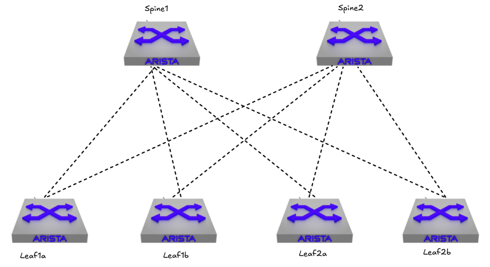
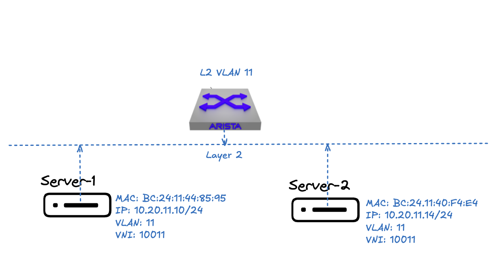
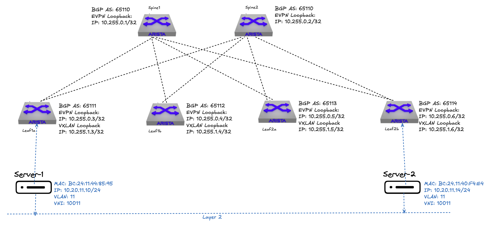
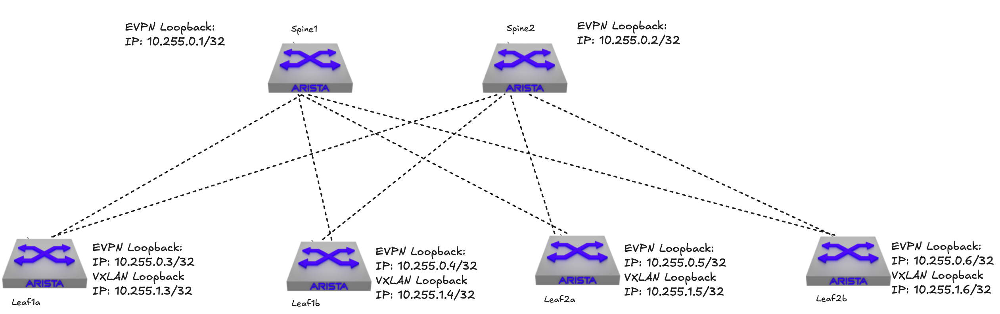
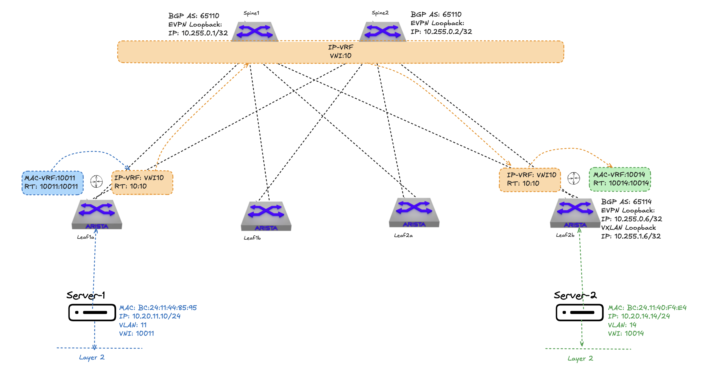

# EVPN Route Types

As promised in my previous post [EVPN Introduction](https://blog.andreasm.io/2024/12/09/evpn-introduction/) I will now go into the different route types in EVPN, what they do and when they are used. In the previous post I mention that EVPN depends on [MP-BGP](https://blog.andreasm.io/2024/12/09/evpn-introduction/#mp-bgp) to add specific EVPN BGP NLRI, aka EVPN route types. The different EVPN route types if I ask Arista EOS:

```bash
veos-dc1-leaf1a#show bgp evpn route-type ?
  auto-discovery    Filter by Ethernet auto-discovery (A-D) route (type 1)
  count             Route-type based path count
  ethernet-segment  Filter by Ethernet segment route (type 4)
  imet              Filter by inclusive multicast Ethernet tag route (type 3)
  ip-prefix         Filter by IP prefix route (type 5)
  join-sync         Filter by multicast join sync route (type 7)
  leave-sync        Filter by multicast leave sync route (type 8)
  mac-ip            Filter by MAC/IP advertisement route (type 2)
  smet              Filter by selective multicast Ethernet tag route (type 6)
  spmsi             Filter by selective PMSI auto discovery route (type 10)
```

 Where in this post I will cover route type 2 (MAC/IP advertisement route) and route type 3 (inclusive multicast ethernet tag route).

In this post I will build upon the same environment and topology as in previous post, already configured with EVPN and VXLAN.




## Route Type 3 - inclusive multicast Ethernet tag route

Why start with route type 3 and 2? Not because I wanted to do it in a chronological order, because then I would start with route type 1. Route type 2 and 3 are the most common route types in an EVPN VXLAN fabric and both are kind of necessary together. Hopefully in this post I shed some light on why that is.

In my previous post I covered how we can use BGP to configure EVPN and VXLAN so they can create vpn tunnels between them and how they find each other. 

I have not covered how the VTEPS advertise to the other VTEP peers which VNIs (or broadcast domains) they are interested in or participating in. It may not come as a surprise, but this will involve route type 3. 

Below is the diagram illustrating how servers in the same broadcast domain think they are connected in a L3 spine-leaf. 

They think they are connected like this:



But in reality they are connected like this:



For these two connected servers to find each other, the first thing they do is sending out an ARP request, which is broadcast traffic and thus part of a BUM packet (Broadcast Unknown Unicast Multicast), to figure out how to get the mac of the server to get the specific ip address. This BUM is sent using "ingress replication" as default from local VTEP to remote VTEPs, encapsulated into a VXLAN-packet for the respective VTEP destination. BUM may also be sent using EVPN multicast which is something I will get back to in a later post. If the request comes from Server 1 on VLAN 11 leaf1a will forward this BUM packet to all local ports configured with VLAN 11, if the server 2 is not there it needs to forward this BUM to the other VTEP peers where Server 2 may be connected.  I know where they are connected, but how do the VTEPs know where the servers are connected in my fabric so they can forward this BUM packet to the other VTEPs? 

In short, route type 3 will be used by the VTEPs to advertise their participation in a broadcast domain (VLAN-VNI mapping). Leaf1a hosts Server 1 connected to VLAN 11 and if this server needs to reach Server 2 also at VLAN 11, but hosted at leaf2b leaf1a and leaf2b must form a tunnel for the same broadcast domain (layer 2). By using route type 3 this is advertised when I configure the VLAN to VNI mapping on both VTEPS. This way the source VTEP will only send BUM packets to remote VTEPS participating in the same VXLAN segment. 

Without EVPN route type 3 there will be no connectivity between the hosts connected to same VLAB but on different VTEPS. 

Lets have a look at how this route type.

First the inclusive multicast ethernet tag route EVPN NRLI:

```bash
               +---------------------------------------+
               |  RD (8 octets)                        |
               +---------------------------------------+
               |  Ethernet Tag ID (4 octets)           |
               +---------------------------------------+
               |  IP Address Length (1 octet)          |
               +---------------------------------------+
               |  Originating Router's IP Address      |
               |          (4 or 16 octets)             |
               +---------------------------------------+
```

Then from my leaf1a and leaf2b I will run the command *show bgp evpn route-type imet vni 10011* (filtering for 10011).

leaf1a:

```bash
veos-dc1-leaf1a(config-if-Vx1)#show bgp evpn route-type imet vni 10011
BGP routing table information for VRF default
Router identifier 10.255.0.3, local AS number 65111
Route status codes: * - valid, > - active, S - Stale, E - ECMP head, e - ECMP
                    c - Contributing to ECMP, % - Pending best path selection
Origin codes: i - IGP, e - EGP, ? - incomplete
AS Path Attributes: Or-ID - Originator ID, C-LST - Cluster List, LL Nexthop - Link Local Nexthop

          Network                Next Hop              Metric  LocPref Weight  Path
 * >      RD: 10.255.0.3:10011 imet 10.255.1.3
                                 -                     -       -       0       i
 * >Ec    RD: 10.255.0.4:10011 imet 10.255.1.4
                                 10.255.1.4            -       100     0       65110 65112 i
 *  ec    RD: 10.255.0.4:10011 imet 10.255.1.4
                                 10.255.1.4            -       100     0       65110 65112 i
 * >Ec    RD: 10.255.0.5:10011 imet 10.255.1.5
                                 10.255.1.5            -       100     0       65110 65113 i
 *  ec    RD: 10.255.0.5:10011 imet 10.255.1.5
                                 10.255.1.5            -       100     0       65110 65113 i
 * >Ec    RD: 10.255.0.6:10011 imet 10.255.1.6
                                 10.255.1.6            -       100     0       65110 65114 i
 *  ec    RD: 10.255.0.6:10011 imet 10.255.1.6
                                 10.255.1.6            -       100     0       65110 65114 i
```

leaf2b:

```bash
veos-dc1-leaf2b#show bgp evpn route-type imet vni 10011
BGP routing table information for VRF default
Router identifier 10.255.0.6, local AS number 65114
Route status codes: * - valid, > - active, S - Stale, E - ECMP head, e - ECMP
                    c - Contributing to ECMP, % - Pending best path selection
Origin codes: i - IGP, e - EGP, ? - incomplete
AS Path Attributes: Or-ID - Originator ID, C-LST - Cluster List, LL Nexthop - Link Local Nexthop

          Network                Next Hop              Metric  LocPref Weight  Path
 * >Ec    RD: 10.255.0.3:10011 imet 10.255.1.3
                                 10.255.1.3            -       100     0       65110 65111 i
 *  ec    RD: 10.255.0.3:10011 imet 10.255.1.3
                                 10.255.1.3            -       100     0       65110 65111 i
 * >Ec    RD: 10.255.0.4:10011 imet 10.255.1.4
                                 10.255.1.4            -       100     0       65110 65112 i
 *  ec    RD: 10.255.0.4:10011 imet 10.255.1.4
                                 10.255.1.4            -       100     0       65110 65112 i
 * >Ec    RD: 10.255.0.5:10011 imet 10.255.1.5
                                 10.255.1.5            -       100     0       65110 65113 i
 *  ec    RD: 10.255.0.5:10011 imet 10.255.1.5
                                 10.255.1.5            -       100     0       65110 65113 i
 * >      RD: 10.255.0.6:10011 imet 10.255.1.6
                                 -                     -       -       0       i
```

The first thing I notice is that all my leafs (VTEPS) are participating in VNI10011, the next hops are the respective VXLAN loopback interfaces (see earlier in this post for interfaces reference). I can see the RD: 10.255.0.x:10011, which represents the leafs EVPN loopback interfaces and the respective VNI. What I do not see here is any mac or mac-ip entries. 

Now what more do I see if I add some more details to the output of the above command *show bgp evpn route-type imet vni 10011 detail* (I will only take a snippet of the output to keep it a bit shorter, its local and leaf1a and leaf2b respectively):

leaf1a:

```bash
veos-dc1-leaf1a(config-if-Vx1)#show bgp evpn route-type imet vni 10011 detail
BGP routing table information for VRF default
Router identifier 10.255.0.3, local AS number 65111
BGP routing table entry for imet 10.255.1.3, Route Distinguisher: 10.255.0.3:10011
 Paths: 1 available
  Local
    - from - (0.0.0.0)
      Origin IGP, metric -, localpref -, weight 0, tag 0, valid, local, best
      Extended Community: Route-Target-AS:10011:10011 TunnelEncap:tunnelTypeVxlan
      VNI: 10011
      PMSI Tunnel: Ingress Replication, MPLS Label: 10011, Leaf Information Required: false, Tunnel ID: 10.255.1.3
BGP routing table entry for imet 10.255.1.6, Route Distinguisher: 10.255.0.6:10011
 Paths: 2 available
  65110 65114
    10.255.1.6 from 10.255.0.2 (10.255.0.2)
      Origin IGP, metric -, localpref 100, weight 0, tag 0, valid, external, ECMP head, ECMP, best, ECMP contributor
      Extended Community: Route-Target-AS:10011:10011 TunnelEncap:tunnelTypeVxlan
      VNI: 10011
      PMSI Tunnel: Ingress Replication, MPLS Label: 10011, Leaf Information Required: false, Tunnel ID: 10.255.1.6
  65110 65114
    10.255.1.6 from 10.255.0.1 (10.255.0.1)
      Origin IGP, metric -, localpref 100, weight 0, tag 0, valid, external, ECMP, ECMP contributor
      Extended Community: Route-Target-AS:10011:10011 TunnelEncap:tunnelTypeVxlan
      VNI: 10011
      PMSI Tunnel: Ingress Replication, MPLS Label: 10011, Leaf Information Required: false, Tunnel ID: 10.255.1.6
```

leaf2b:

```bash
veos-dc1-leaf2b#show bgp evpn route-type imet vni 10011 detail
BGP routing table information for VRF default
Router identifier 10.255.0.6, local AS number 65114
BGP routing table entry for imet 10.255.1.3, Route Distinguisher: 10.255.0.3:10011
 Paths: 2 available
  65110 65111
    10.255.1.3 from 10.255.0.2 (10.255.0.2)
      Origin IGP, metric -, localpref 100, weight 0, tag 0, valid, external, ECMP head, ECMP, best, ECMP contributor
      Extended Community: Route-Target-AS:10011:10011 TunnelEncap:tunnelTypeVxlan
      VNI: 10011
      PMSI Tunnel: Ingress Replication, MPLS Label: 10011, Leaf Information Required: false, Tunnel ID: 10.255.1.3
  65110 65111
    10.255.1.3 from 10.255.0.1 (10.255.0.1)
      Origin IGP, metric -, localpref 100, weight 0, tag 0, valid, external, ECMP, ECMP contributor
      Extended Community: Route-Target-AS:10011:10011 TunnelEncap:tunnelTypeVxlan
      VNI: 10011
      PMSI Tunnel: Ingress Replication, MPLS Label: 10011, Leaf Information Required: false, Tunnel ID: 10.255.1.3
BGP routing table entry for imet 10.255.1.6, Route Distinguisher: 10.255.0.6:10011
 Paths: 1 available
  Local
    - from - (0.0.0.0)
      Origin IGP, metric -, localpref -, weight 0, tag 0, valid, local, best
      Extended Community: Route-Target-AS:10011:10011 TunnelEncap:tunnelTypeVxlan
      VNI: 10011
      PMSI Tunnel: Ingress Replication, MPLS Label: 10011, Leaf Information Required: false, Tunnel ID: 10.255.1.6
```

The additional and required information that differs from the detailed output of route type 2 is this:

*PMSI Tunnel: Ingress Replication, MPLS Label: 10011, Leaf Information Required: false, Tunnel ID: 10.255.1.6*

PMSI Tunnel - Provider Multicast Service Interface - Ingress replication

MPLS Label - 10011 VNI ID

Tunnel ID -  VTEP VXLAN loopback interface


To sum up route type 3:

- Advertising their participation in specific broadcast domains between the VTEPS in the fabric 
- EVPN route type 3 is not about advertising host routes nor ip-subnets, but VNI participation. 
- BUM is only forward to those that are interested or require it. 


## Route Type 2 - MAC/IP advertisement route

 EVPN route type 2's main purpose is to advertise hosts mac addresses "over" BGP and optionally hosts ip addresses in a /32 format (host routes) to all interested VTEP peers. BGP will be used to dynamically update the VTEP peers about the network reachability of hosts attached in the configured overlay networks so they can reach each other. Having a host connected to Leaf1a and another host connected to Leaf2a in the same Layer 2 broadcast domain (VLAN), when they interact, they use MAC addresses to communicate, as a result of ARP. How these mac-addresses and ip addresses are advertised and why this is needed is something I will try to explain and cover here.


In the previous [post](https://blog.andreasm.io/2024/12/09/evpn-introduction/) I covered how the EVPN peers (all the leafs and spines) were advertised using BGP in the underlay to establish a secure BGP connection between all the peers. Similarily BGP is used to advertise the VTEP peers themselves in the fabric (the leafs). This configuration is done so the VTEPs can discover each other in the fabric and are able to encapsulate and forward VXLAN traffic between them using stateless tunnels. VXLAN uses a shim header inserted between the IP/UDP headers and the inner Ethernet frame, allowing Layer 2 frames to be tunneled over a Layer 3 network without establishing stateful tunnels. Why I mention a secure connection is because I am using authentication between all the peers in the fabric, including the spines. One cant just add a new BGP peer in the fabric without the correct authentication, these will be dropped, this to minimize unwanted BGP peers. One can probably do more to secure the BGP connection like ACLs, additional prefix lists etc. Not in the scope for this post. Using BGP instead of static routes brings a whole lot more flexibility, and as it removes any flood and learn across the fabric, or between the vteps, the network is much more optimised and scale better. Now as this is an EVPN/VXLAN fabric stretching layer 2 over a layer 3 fabric, I need BGP to also advertise layer 2 mac addresses between the VTEPS. This is where EVPN route type 2 comes into play. 

To get some more context below is my topology with their respective leafs loopback interfaces:



Lets have a look at the bgp neighbors and routing table in the underlay from spine1 and leaf1a (10.255.255.x/x are the P2P links):

```bash
veos-dc1-spine1#show bgp summary
BGP summary information for VRF default
Router identifier 10.255.0.1, local AS number 65110
Neighbor               AS Session State AFI/SAFI                AFI/SAFI State   NLRI Rcd   NLRI Acc
------------- ----------- ------------- ----------------------- -------------- ---------- ----------
10.255.0.3          65111 Established   L2VPN EVPN              Negotiated             21         21
10.255.0.4          65112 Established   L2VPN EVPN              Negotiated             21         21
10.255.0.5          65113 Established   L2VPN EVPN              Negotiated             21         21
10.255.0.6          65114 Established   L2VPN EVPN              Negotiated             77         77
10.255.255.1        65111 Established   IPv4 Unicast            Negotiated              2          2
10.255.255.5        65112 Established   IPv4 Unicast            Negotiated              2          2
10.255.255.9        65113 Established   IPv4 Unicast            Negotiated              2          2
10.255.255.13       65114 Established   IPv4 Unicast            Negotiated              2          2
```

In the bgp routing table we can see both the EVPN and VXLAN loopback interfaces. Note that I only have 4 VTEP entries as I only configure VXLAN on the leafs. Next hop is the respective switches P2P interfaces. 

```bash
veos-dc1-spine1#show ip bgp
BGP routing table information for VRF default
Router identifier 10.255.0.1, local AS number 65110
Route status codes: s - suppressed contributor, * - valid, > - active, E - ECMP head, e - ECMP
                    S - Stale, c - Contributing to ECMP, b - backup, L - labeled-unicast
                    % - Pending best path selection
Origin codes: i - IGP, e - EGP, ? - incomplete
RPKI Origin Validation codes: V - valid, I - invalid, U - unknown
AS Path Attributes: Or-ID - Originator ID, C-LST - Cluster List, LL Nexthop - Link Local Nexthop

          Network                Next Hop              Metric  AIGP       LocPref Weight  Path
 * >      10.255.0.1/32          -                     -       -          -       0       i
 * >      10.255.0.3/32          10.255.255.1          0       -          100     0       65111 i
 * >      10.255.0.4/32          10.255.255.5          0       -          100     0       65112 i
 * >      10.255.0.5/32          10.255.255.9          0       -          100     0       65113 i
 * >      10.255.0.6/32          10.255.255.13         0       -          100     0       65114 i
 * >      10.255.1.3/32          10.255.255.1          0       -          100     0       65111 i
 * >      10.255.1.4/32          10.255.255.5          0       -          100     0       65112 i
 * >      10.255.1.5/32          10.255.255.9          0       -          100     0       65113 i
 * >      10.255.1.6/32          10.255.255.13         0       -          100     0       65114 i
```

This is just to verify that all my peers are advertised as they should, now if I add an overlay network like this:


I have configured an overlay network with two hosts connected to each their leaf, they are in the same layer 2 network, they can reach each other as it was a regular VLAN between two switches using layer 2 links. The hosts or servers themselves are not aware of any VXLAN configuration, spine leaf or layer 3 links, as far as they are concerned they think they are connected to the same vlan or broadcast domain.  They think they are connected like this:


Using the information from Route Type 3, the ARP request from server 1 is sent as BUM traffic to all relevant VTEPs in the VXLAN segment, including the VTEP hosting server 2. When server 2 responds, its VTEP advertises a Route Type 2 with the MAC/IP mapping. This allows future unicast traffic from server 1 to go directly to the correct VTEP without any further flooding.

Lets have a look at the bgp evpn route type 2 at both leaf1a and leaf2b below (sorted on the VNI 10011):

Leaf1a:

```bash
veos-dc1-leaf1a#show bgp evpn route-type mac-ip vni 10011
BGP routing table information for VRF default
Router identifier 10.255.0.3, local AS number 65111
Route status codes: * - valid, > - active, S - Stale, E - ECMP head, e - ECMP
                    c - Contributing to ECMP, % - Pending best path selection
Origin codes: i - IGP, e - EGP, ? - incomplete
AS Path Attributes: Or-ID - Originator ID, C-LST - Cluster List, LL Nexthop - Link Local Nexthop

          Network                Next Hop              Metric  LocPref Weight  Path
 * >Ec    RD: 10.255.0.6:10011 mac-ip bc24.1140.f4e4
                                 10.255.1.6            -       100     0       65110 65114 i
 *  ec    RD: 10.255.0.6:10011 mac-ip bc24.1140.f4e4
                                 10.255.1.6            -       100     0       65110 65114 i
 * >      RD: 10.255.0.3:10011 mac-ip bc24.1144.8595
                                 -                     -       -       0       i
```

Leaf2b:

```bash
veos-dc1-leaf2b#show bgp evpn route-type mac-ip vni 10011
BGP routing table information for VRF default
Router identifier 10.255.0.6, local AS number 65114
Route status codes: * - valid, > - active, S - Stale, E - ECMP head, e - ECMP
                    c - Contributing to ECMP, % - Pending best path selection
Origin codes: i - IGP, e - EGP, ? - incomplete
AS Path Attributes: Or-ID - Originator ID, C-LST - Cluster List, LL Nexthop - Link Local Nexthop

          Network                Next Hop              Metric  LocPref Weight  Path
 * >      RD: 10.255.0.6:10011 mac-ip bc24.1140.f4e4
                                 -                     -       -       0       i
 * >Ec    RD: 10.255.0.3:10011 mac-ip bc24.1144.8595
                                 10.255.1.3            -       100     0       65110 65111 i
 *  ec    RD: 10.255.0.3:10011 mac-ip bc24.1144.8595
                                 10.255.1.3            -       100     0       65110 65111 i
```

By using the command *show bgp evpn route-type mac-ip vni 10011* (filtering for the specific VNI) to list the route type 2 entries on my leaf1a and leaf2b I can see the entries in the bgp routing table reflecting the mac-addresses of both the connected servers 1 and 2 in this VNI.   

At first glance they look very similar except some "opposite" information, we can see the mac addresses of *Server 1* and *Server 2* respectively. *Leaf1a* contains a single entry of the mac address information of *Server 1* as it is locally present on leaf1a and two entries of the mac address information of *Server 2*, while *leaf2b* contains the exact opposite.

Leaf1a has the VNI 10011 locally configured, so do leaf2b. Leaf1a will advertise server 1's mac address in BGP using itself as a Route Distinguisher while it receives the mac address information for server 2 from leaf2b, RD 10.255.0.6:10011. There are two entries for server 2 because it contains two potential paths (via my two spines) using ECMP. The current active path is indicated with >Ec (ECMP head). 

If I have configured an anycast gateway (IRB) on the VLAN interface, (see [here](https://blog.andreasm.io/2024/12/09/evpn-introduction/#integrated-routing-and-bridging-irb)), additional entries in BGP will be installed combining the mac+ip as a host route (/32). The reason for /32 routes (host routes) is because an anycast gateway is a distributed router and exists on more than one leaf I cant have a /24 advertised on all gateways as they dont know where to forward the traffic if the destination is not local. 

Having a look at the bgp evpn route type 2 entries for server 1 and server 2 with anycast configured:

Leaf1a:

```bash
veos-dc1-leaf1a#show bgp evpn route-type mac-ip vni 10011
BGP routing table information for VRF default
Router identifier 10.255.0.3, local AS number 65111
Route status codes: * - valid, > - active, S - Stale, E - ECMP head, e - ECMP
                    c - Contributing to ECMP, % - Pending best path selection
Origin codes: i - IGP, e - EGP, ? - incomplete
AS Path Attributes: Or-ID - Originator ID, C-LST - Cluster List, LL Nexthop - Link Local Nexthop

          Network                Next Hop              Metric  LocPref Weight  Path
 * >Ec    RD: 10.255.0.6:10011 mac-ip bc24.1140.f4e4
                                 10.255.1.6            -       100     0       65110 65114 i
 *  ec    RD: 10.255.0.6:10011 mac-ip bc24.1140.f4e4
                                 10.255.1.6            -       100     0       65110 65114 i
 * >Ec    RD: 10.255.0.6:10011 mac-ip bc24.1140.f4e4 10.20.11.14
                                 10.255.1.6            -       100     0       65110 65114 i
 *  ec    RD: 10.255.0.6:10011 mac-ip bc24.1140.f4e4 10.20.11.14
                                 10.255.1.6            -       100     0       65110 65114 i
 * >      RD: 10.255.0.3:10011 mac-ip bc24.1144.8595
                                 -                     -       -       0       i
 * >      RD: 10.255.0.3:10011 mac-ip bc24.1144.8595 10.20.11.10
                                 -                     -       -       0       i
```


Leaf2b:

```bash
veos-dc1-leaf2b#show bgp evpn route-type mac-ip vni 10011
BGP routing table information for VRF default
Router identifier 10.255.0.6, local AS number 65114
Route status codes: * - valid, > - active, S - Stale, E - ECMP head, e - ECMP
                    c - Contributing to ECMP, % - Pending best path selection
Origin codes: i - IGP, e - EGP, ? - incomplete
AS Path Attributes: Or-ID - Originator ID, C-LST - Cluster List, LL Nexthop - Link Local Nexthop

          Network                Next Hop              Metric  LocPref Weight  Path
 * >      RD: 10.255.0.6:10011 mac-ip bc24.1140.f4e4
                                 -                     -       -       0       i
 * >      RD: 10.255.0.6:10011 mac-ip bc24.1140.f4e4 10.20.11.14
                                 -                     -       -       0       i
 * >Ec    RD: 10.255.0.3:10011 mac-ip bc24.1144.8595
                                 10.255.1.3            -       100     0       65110 65111 i
 *  ec    RD: 10.255.0.3:10011 mac-ip bc24.1144.8595
                                 10.255.1.3            -       100     0       65110 65111 i
 * >Ec    RD: 10.255.0.3:10011 mac-ip bc24.1144.8595 10.20.11.10
                                 10.255.1.3            -       100     0       65110 65111 i
 *  ec    RD: 10.255.0.3:10011 mac-ip bc24.1144.8595 10.20.11.10
                                 10.255.1.3            -       100     0       65110 65111 i
```

Now in additon to just the mac address of my servers 1 and 2 I also have the mac+ip entries with the same amount of paths. 

With anycast configured EVPN route-type 2 will advertise both mac and mac-ip.

*Throughout this post the expressions L2VNI and L3VNI will be used. A VNI is a VNI, a VNI can be mapped to a VLAN and a VRF. But to differenciate between a VNI that is mapped to a VLAN or VRF the expressions above is used.*

To get more details on the routing table on my leaf1a for the entry of my remote *Server 2* I can get that by typing *show bgp evp detail* 


```bash
veos-dc1-leaf1a#show bgp evpn detail
BGP routing table information for VRF default
Router identifier 10.255.0.3, local AS number 65111
BGP routing table entry for mac-ip bc24.1140.f4e4, Route Distinguisher: 10.255.0.6:10011
 Paths: 2 available
  65110 65114
    10.255.1.6 from 10.255.0.1 (10.255.0.1)
      Origin IGP, metric -, localpref 100, weight 0, tag 0, valid, external, ECMP head, ECMP, best, ECMP contributor
      Extended Community: Route-Target-AS:10011:10011 TunnelEncap:tunnelTypeVxlan
      VNI: 10011 ESI: 0000:0000:0000:0000:0000
  65110 65114
    10.255.1.6 from 10.255.0.2 (10.255.0.2)
      Origin IGP, metric -, localpref 100, weight 0, tag 0, valid, external, ECMP, ECMP contributor
      Extended Community: Route-Target-AS:10011:10011 TunnelEncap:tunnelTypeVxlan
      VNI: 10011 ESI: 0000:0000:0000:0000:0000
BGP routing table entry for mac-ip bc24.1140.f4e4 10.20.11.14, Route Distinguisher: 10.255.0.6:10011
 Paths: 2 available
  65110 65114
    10.255.1.6 from 10.255.0.2 (10.255.0.2)
      Origin IGP, metric -, localpref 100, weight 0, tag 0, valid, external, ECMP head, ECMP, best, ECMP contributor
      Extended Community: Route-Target-AS:10:10 Route-Target-AS:10011:10011 TunnelEncap:tunnelTypeVxlan EvpnRouterMac:bc:24:11:5e:4a:59
      VNI: 10011 L3 VNI: 10 ESI: 0000:0000:0000:0000:0000
  65110 65114
    10.255.1.6 from 10.255.0.1 (10.255.0.1)
      Origin IGP, metric -, localpref 100, weight 0, tag 0, valid, external, ECMP, ECMP contributor
      Extended Community: Route-Target-AS:10:10 Route-Target-AS:10011:10011 TunnelEncap:tunnelTypeVxlan EvpnRouterMac:bc:24:11:5e:4a:59
      VNI: 10011 L3 VNI: 10 ESI: 0000:0000:0000:0000:0000
```

This gives me some additional information, if needed, including the mac addresses of the remote leaf (leaf2b). Notice the L3 VNI: 10 which is my VRF20 mapped to VNI 10 (L3VNI/IP-VRF).

Now lets try to map that with the EVPN NLRI of a route type 2:

```bash
+----------------------------------------+
| RD (8 octets)                          | -> 10.255.0.6:10011
+----------------------------------------+
| Ethernet Segment Identifier (10 octets)| -> 0000:0000:0000:0000:0000
+----------------------------------------+
| Ethernet Tag ID (4 octets)             | -> 0 (using VXLAN)
+----------------------------------------+
| MAC Address Length (1 octet)           | -> 6
+----------------------------------------+
| MAC Address (6 octets)                 | -> bc.24.11.40.f4.e4
+----------------------------------------+
| IP Address Length (1 octet)            | -> 4
+----------------------------------------+
| IP Address (0, 4, or 16 octets)        | -> 10.20.11.14
+----------------------------------------+
| MPLS Label1 (3 octets)                 |
+----------------------------------------+
| MPLS Label2 (0 or 3 octets)            |
+----------------------------------------+

```


#### MAC-VRF vs IP-VRF

Sometimes the expressions mac-vrf and ip-vrf are being used without any explanation of what they are or what they do. So I decided to just quickly try to explain what these two are.

First some basics which these two build upon. 

   A VLAN is a way to create layer 2, or broadcast domain, isolation in the network, I can have overlapping mac-addresses between vlans. Every VLAN has its own mac address table. A VLAN is at the data link layer (OSI 2) and uses MAC addresses which is broadcasted in the same VLAN to find its "peers" MAC addresses it needs to communicate with. There is no sence of IP addresses within the same VLAN, it only comes into play if I need to communicate across VLANS, using layer 3.

   A VRF (Virtual Routing and Forwarding) is an isolated routing instance with its own isolated routing table, allowing multiple routing tables to coexist on a single device. IP addresses and IP prefixes within a VRF are separate from those in other VRFs, allowing for overlapping IP address spaces. VRF is primarily concerned with IP routing and is at the network layer (Layer 3) in the OSI model (OSI 3). In a physical network, VRFs can create isolated routing domains to maintain separation of routing decisions, such as for multi-tenancy. By default, there is no reachability between network segments in different VRFs, meaning network A in VRF A cannot reach network B in VRF B unless explicitly configured with inter-VRF routing or if traffic is routed in a firewall and rules to allow between the VRFs are in place.  

> - **MAC-VRF:** A Virtual Routing and Forwarding table for storing Media Access Control (MAC) addresses on a VTEP for a specific tenant.

Source: https://www.arista.com/en/um-eos/eos-evpn-overview

Why is mac-vrf good to know about in this context? MAC-vrf is the forwarding table for mac addresses, like BGP is maintaining regular ip address forwarding table BGP-EVPN can also maintain mac address forwarding table. These tables will be used by the VTEPS to know where the different mac-addresses are located, which VTEP currently has this mac-address. As seen above the mac address *bc24.1140.f4e4* is currently local to VTEP or Route Distinguisher 10.255.0.6 which is *leaf2b* which is then advertised to the other VTEP members through BGP. By enabling EVPN (using MP-BGP) we use BGP to maintain this mac address routing table instead of using flood and learn which would not work either as these l2 networks is not part of the underlay so even with flood and learn they would not learn anything from any of the other leafs, as described in the EVPN introduction post. In a layer 3 spine leaf without any use of overlay or network virtualization the l2 segments/or broadcast domains will be isolated to their local leaf.  In this context the VLAN which is mapped to a VNI and then configured in BGP for mac-advertisement is my MAC-VRF.

> An **IP VRF** is used on a PE router for each Layer 3 overlay. VRF IP routes are exported into the EVPN BGP table and advertised to remote VTEPs as type 5 routes.

Source: https://www.arista.com/en/um-eos/eos-evpn-overview

Why is IP VRF good to know about in this context? As mentioned in my previous [post](https://blog.andreasm.io/2024/12/09/evpn-introduction/#integrated-routing-and-bridging-irb) under the topic *"integrated routing and bridging"* to achieve a scalable configuration without having all the leafs being members of all subnets/VNIs the recommended approach is symmetric irb. In EVPN VXLAN, each VLAN mapped to a VNI represents a MAC-VRF. Instead of advertising all those mac-addresses to all leafs in the same VXLAN fabric a more efficient way is to advertise ip-prefixes or host-routes only. By mapping a VNI to a VRF to create a L3VNI and defining that VRF in BGP with a Route Destinguisher and Route Target accordingly I create an intermediate IP-VRF that will be used as connectivity between local subnets an non-local subnets (exists on remote VTEPs). Via this IP-VRF I can exhange routes between VTEPS for networks that is part of the same VRF. I can have multiple IP-VRFs defined to maintain isolated routing instances across my VXLAN fabric.

 


In the illustration above I am using IP-VRF to advertise reachability between two VTEPS configured with two distinct VLANs (mac-vrfs), Server-1 uses the NLRI over the intermediate IP-VRF VN10 to reach Server-2. In BGP I can see the routes for both servers in both leafs like this:

```bash
leaf1a:
BGP routing table entry for mac-ip bc24.1140.f4e4, Route Distinguisher: 10.255.0.6:10014
 Paths: 2 available
  65110 65114
    10.255.1.6 from 10.255.0.1 (10.255.0.1)
      Origin IGP, metric -, localpref 100, weight 0, tag 0, valid, external, ECMP head, ECMP, best, ECMP contributor
      Extended Community: Route-Target-AS:10014:10014 TunnelEncap:tunnelTypeVxlan
      VNI: 10014 ESI: 0000:0000:0000:0000:0000
  65110 65114
    10.255.1.6 from 10.255.0.2 (10.255.0.2)
      Origin IGP, metric -, localpref 100, weight 0, tag 0, valid, external, ECMP, ECMP contributor
      Extended Community: Route-Target-AS:10014:10014 TunnelEncap:tunnelTypeVxlan
      VNI: 10014 ESI: 0000:0000:0000:0000:0000
BGP routing table entry for mac-ip bc24.1140.f4e4 10.20.14.14, Route Distinguisher: 10.255.0.6:10014
 Paths: 2 available
  65110 65114
    10.255.1.6 from 10.255.0.1 (10.255.0.1)
      Origin IGP, metric -, localpref 100, weight 0, tag 0, valid, external, ECMP head, ECMP, best, ECMP contributor
      Extended Community: Route-Target-AS:10:10 Route-Target-AS:10014:10014 TunnelEncap:tunnelTypeVxlan EvpnRouterMac:bc:24:11:5e:4a:59
      VNI: 10014 L3 VNI: 10 ESI: 0000:0000:0000:0000:0000
  65110 65114
    10.255.1.6 from 10.255.0.2 (10.255.0.2)
      Origin IGP, metric -, localpref 100, weight 0, tag 0, valid, external, ECMP, ECMP contributor
      Extended Community: Route-Target-AS:10:10 Route-Target-AS:10014:10014 TunnelEncap:tunnelTypeVxlan EvpnRouterMac:bc:24:11:5e:4a:59
      VNI: 10014 L3 VNI: 10 ESI: 0000:0000:0000:0000:0000
```


```bash
leaf2b:
BGP routing table entry for mac-ip bc24.1144.8595, Route Distinguisher: 10.255.0.3:10011
 Paths: 2 available
  65110 65111
    10.255.1.3 from 10.255.0.1 (10.255.0.1)
      Origin IGP, metric -, localpref 100, weight 0, tag 0, valid, external, ECMP head, ECMP, best, ECMP contributor
      Extended Community: Route-Target-AS:10011:10011 TunnelEncap:tunnelTypeVxlan
      VNI: 10011 ESI: 0000:0000:0000:0000:0000
  65110 65111
    10.255.1.3 from 10.255.0.2 (10.255.0.2)
      Origin IGP, metric -, localpref 100, weight 0, tag 0, valid, external, ECMP, ECMP contributor
      Extended Community: Route-Target-AS:10011:10011 TunnelEncap:tunnelTypeVxlan
      VNI: 10011 ESI: 0000:0000:0000:0000:0000
BGP routing table entry for mac-ip bc24.1144.8595 10.20.11.10, Route Distinguisher: 10.255.0.3:10011
 Paths: 2 available
  65110 65111
    10.255.1.3 from 10.255.0.1 (10.255.0.1)
      Origin IGP, metric -, localpref 100, weight 0, tag 0, valid, external, ECMP head, ECMP, best, ECMP contributor
      Extended Community: Route-Target-AS:10:10 Route-Target-AS:10011:10011 TunnelEncap:tunnelTypeVxlan EvpnRouterMac:bc:24:11:1d:5f:a1
      VNI: 10011 L3 VNI: 10 ESI: 0000:0000:0000:0000:0000
  65110 65111
    10.255.1.3 from 10.255.0.2 (10.255.0.2)
      Origin IGP, metric -, localpref 100, weight 0, tag 0, valid, external, ECMP, ECMP contributor
      Extended Community: Route-Target-AS:10:10 Route-Target-AS:10011:10011 TunnelEncap:tunnelTypeVxlan EvpnRouterMac:bc:24:11:1d:5f:a1
      VNI: 10011 L3 VNI: 10 ESI: 0000:0000:0000:0000:0000
```

If I check the mac-address table for VLAN 14 on leaf1a:

```bash
veos-dc1-leaf1a#show mac address-table vlan 14
          Mac Address Table
------------------------------------------------------------------

Vlan    Mac Address       Type        Ports      Moves   Last Move
----    -----------       ----        -----      -----   ---------
Total Mac Addresses for this criterion: 0

          Multicast Mac Address Table
------------------------------------------------------------------

Vlan    Mac Address       Type        Ports
----    -----------       ----        -----
Total Mac Addresses for this criterion: 0
```

Empty

If I check the mac-address table for VLAN 11 on leaf2b:

```bash
veos-dc1-leaf2b(config-if-Et4)#show mac address-table vlan 11
          Mac Address Table
------------------------------------------------------------------

Vlan    Mac Address       Type        Ports      Moves   Last Move
----    -----------       ----        -----      -----   ---------
  11    bc24.1144.8595    DYNAMIC     Vx1        1       21 days, 20:54:50 ago ## Server1
Total Mac Addresses for this criterion: 4

          Multicast Mac Address Table
------------------------------------------------------------------

Vlan    Mac Address       Type        Ports
----    -----------       ----        -----
Total Mac Addresses for this criterion: 0
```

Not so empty... Why is that?
If the mac-vrf exists (VLAN) on the receiving VTEP it will install the mac-address in the mac-vrf (corresponding vlan) and the mac+ip host route will be installed in the IP-VRF. If the mac-vrf does not exist on the receiving VTEP only the mac+ip host route is installed. This saves space by not installing mac entries that are not present locally, but relies on BGP host routes to reach those remote mac entries.

But still the mac-address route will be installed in the BGP table of the receiving leaf when the mac-vrf/vlan doesn't exist.  

In large environments scalability is critical and wasting space with unnecessary information is not a good idea. Symmetric IRB is optimal in large scale environments as it does not mandate having all VNIs configured on all leafs, and saves mac address table space. But as we have seen so far even with symmetric IRB the mac-address routes are installed in BGP on leafs where the VNI is not present. This may seem unnecessary. To easily accommodate for that there is an address-family called *rt-membership*.

#### Constrained Route Distribution - RFC 4684

The [RFC 4684](https://datatracker.ietf.org/doc/html/rfc4684) introduces procedures for BGP speakers to exchange Route Target (RT) reachability information across BGP/MPLS VPNs, allowing more controlled distribution of VPN routing information. The approach helps limit the number of routes carried by inter-AS or inter-cluster routers, improving scalability and efficiency. In short, it is used to reduce the number of routes advertised in the EVPN fabric.

This must be configured on both the sending and receiving devices, which in my case means all the leafs and spines. 

Before configuring the rt-membership address family lets have quick refresh on how the routes on leaf1a are advertised for VNI 10014 which is only configured on leaf2b.

On leaf1a:

```bash
veos-dc1-leaf1a(config-if-Vl11)#show bgp evpn route-type mac-ip vni 10014
BGP routing table information for VRF default
Router identifier 10.255.0.3, local AS number 65111
Route status codes: * - valid, > - active, S - Stale, E - ECMP head, e - ECMP
                    c - Contributing to ECMP, % - Pending best path selection
Origin codes: i - IGP, e - EGP, ? - incomplete
AS Path Attributes: Or-ID - Originator ID, C-LST - Cluster List, LL Nexthop - Link Local Nexthop

          Network                Next Hop              Metric  LocPref Weight  Path
 * >Ec    RD: 10.255.0.6:10014 mac-ip bc24.1140.f4e4
                                 10.255.1.6            -       100     0       65110 65114 i
 *  ec    RD: 10.255.0.6:10014 mac-ip bc24.1140.f4e4
                                 10.255.1.6            -       100     0       65110 65114 i
 * >Ec    RD: 10.255.0.6:10014 mac-ip bc24.1140.f4e4 10.20.14.14
                                 10.255.1.6            -       100     0       65110 65114 i
 *  ec    RD: 10.255.0.6:10014 mac-ip bc24.1140.f4e4 10.20.14.14
                                 10.255.1.6            -       100     0       65110 65114 i
```

I see both the mac-address and mac+ip entries.

After having the address familiy configured I can have a look at my routing table again and see if I notice any difference:

```bash
veos-dc1-leaf1a(config-if-Vl11)#show bgp evpn route-type mac-ip vni 10014
BGP routing table information for VRF default
Router identifier 10.255.0.3, local AS number 65111
Route status codes: * - valid, > - active, S - Stale, E - ECMP head, e - ECMP
                    c - Contributing to ECMP, % - Pending best path selection
Origin codes: i - IGP, e - EGP, ? - incomplete
AS Path Attributes: Or-ID - Originator ID, C-LST - Cluster List, LL Nexthop - Link Local Nexthop

          Network                Next Hop              Metric  LocPref Weight  Path
 * >Ec    RD: 10.255.0.6:10014 mac-ip bc24.1140.f4e4 10.20.14.14
                                 10.255.1.6            -       100     0       65110 65114 i
 *  ec    RD: 10.255.0.6:10014 mac-ip bc24.1140.f4e4 10.20.14.14
                                 10.255.1.6            -       100     0       65110 65114 i
```

I now only see the host routes, mac+ip.

To configure this is straight forward, in your BGP configuration add these lines:

```bash
   address-family rt-membership
      neighbor EVPN-OVERLAY-PEERS activate # EVPN loopback interfaces group
```

If using AVD (Arista Validated Design) one can add this in your *fabric* config:

```yaml
# Enable Route Target Membership Constraint Address Family on EVPN overlay BGP peerings (Min. EOS 4.25.1F).
# Requires use eBGP as overlay protocol.
evpn_overlay_bgp_rtc: true
```

Link to the section in AVD [here](https://avd.arista.com/5.1/roles/eos_designs/docs/input-variables.html?h=evpn_overlay_bgp_rtc#evpn-settings)


For more information on *rt-membership* see the following [RFC4684](https://datatracker.ietf.org/doc/html/rfc4684).


To sum up the main responsibilites of BGP EVPN route type 2:

- Advertise the hosts mac-addresses between the VTEPS
- Advertise the hosts mac-ip host routes between the VTEPS
- ARP suppression - remote hosts mac-ip is known and VTEPs reply to ARP requests from locally connected hosts instead of going over the fabric to get it.  
  - Handling ARP advertisements efficiently, reducing ARP broadcasts and flooding. In environments with dynamic workloads like virtual machines being moved between physical hosts it handles updates efficiently, including GARP updates. Ensures ARP tables are refreshed and ip-to-mac mappings are correctly propagated. 


## Egress

EVPN route type 2 is responsible for advertising mac-addresses and associated ip addresses (host routes) between VTEPS.

EVPN route type 3 advertises VTEPS participation in broadcast domains.

Now we know what EVPN route type 2 and 3 does, and why it is the two most common EVPN route types. 

