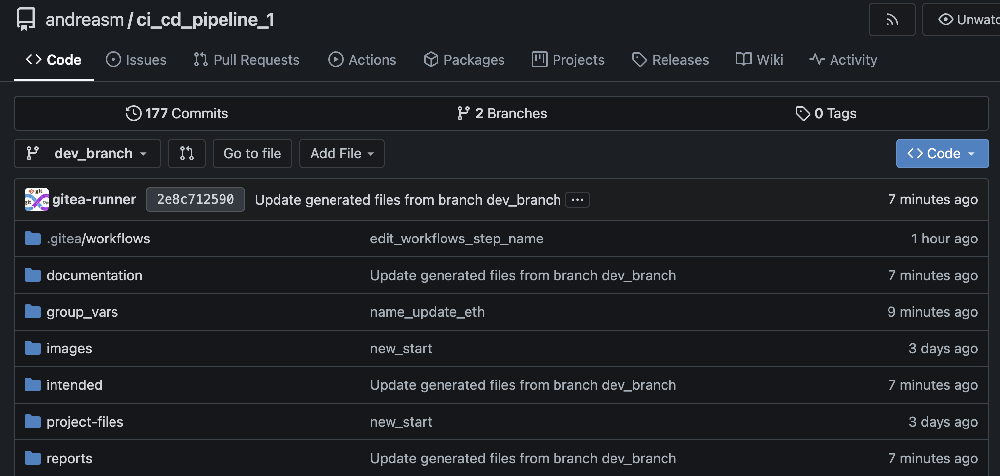
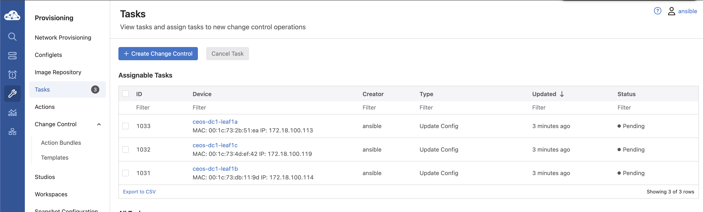
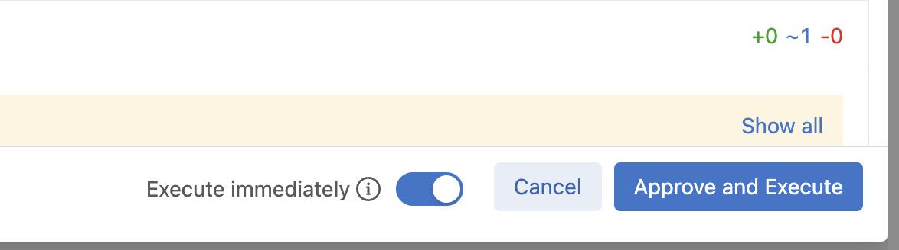

# CI/CD pipeline

What is a CI/CD pipeline, and what is CI and CD? To quickly start with the latter, CI and CD, before explaining the CI/CP pipeline.

CI stands for Continuous Integration, and CD stands for Continuous Delivery or Continuous Deployment. The key difference between Continuous Delivery and Continuous Deployment is how the integrated code is delivered to production. In Continuous Delivery, the code is tested, validated, and kept in a deployable state but requires manual approval before being pushed into production. In Continuous Deployment, the code is automatically pushed into production after being tested and validated, without any manual intervention.

Continuous Integration refers to the practice of regularly integrating code changes into the shared codebase. Developers merge their changes into the main code, and automated tests are run to ensure that the new code does not break the existing functionality. 

A **CI/CD pipeline** is a series of automated steps that software goes through from the moment a developer commits code to the point it gets deployed to production. The pipeline is designed to automate the processes of **building**, **testing**, and **deploying** code changes, ensuring faster and more reliable delivery.

The CI/CD pipeline helps automate repetitive tasks, making development, testing, and deployment more efficient, faster, and less error-prone. It’s an essential part of modern DevOps practices.

In software development, CI/CD is a common practice today, but applying similar practices to managing network infrastructure is still not as widespread. For many organizations, making the shift can be a steep learning curve, but the benefits are significant and ultimately outweigh the challenges involved in adopting CI/CD for infrastructure.

In this post I will go through how to get started with CI/CD managing network infrastructure.

To create a CI/CD pipeline for network automation, several tools needs to be involved, including Git, GitHub Actions, Arista Validated Design, Arista CloudVision, code syntax checking tools (in addition to those already built into Arista Validated Design), and the network testing tool Arista Network Test Automation.

In the end of this post we should have something that looks like this:


So buckle up this will be exciting! At least this is what I think it is.

## Pre-requirements and Preparations

To make this post as focused as possible on the CI/CD pipeline for network automation I will have to assume some tools are already configured and in place. Otherwise it will be yet another lengthy post by me. Then I will cover the steps how to prepare the rest in this post

### Pre-requirements

* Git cli installed on a Linux machine
* Access to a Github account or Gitea hosted locally, with a runner configured (this is what I am using) [Gitea Docs](https://docs.gitea.com/)
* A Github/Gitea Repository ready and initialized from the Linux machine and Actions enabled (Default in Github).
* Arista CloudVision
* Containerlab with x instances of Arista cEOS (see this [post](https://blog.andreasm.io/2024/08/22/arista-cloudvision-and-avd-using-containerlab/))
* Arista Validated Design installed on a Linux machine to grab an example just to get started (See this [post](https://avd.arista.com/5.2/docs/installation/collection-installation.html))
* Knowledge about Arista Validated Design


## Preparing my Git repo

I am using Gitea, a Github compatible self hosted alternative. In Gitea I have created my respository called *ci_cd_pipeline_1* for this use case here:


I have configured a ssh key on the computer I will be using to interact with the repository above like this:

```bash
ssh-keygen -t ed25519 -C "your_email@example.com"
```

The public key is copy and pasted in Gitea so I can interact using SSH without username and password. In Gitea that is done here:


The above repo is empty for now, and I want to initialize it from my local cli. To initialize and connect to my remote repo (created above) I follow these steps:

```bash
touch README.md # Will be overwritten by the AVD content later
git init
git checkout -b main
git add README.md # could be just git add .
git commit -m "first commit"
git remote add origin git@gitea-01.my-domain.net:andreasm/ci_cd_pipeline2.git
git push -u origin main
```


Now my git repo is connected to my remote repo in Gitea and I can start populate it. The first thing I will do is to copy the content from the AVD examples called "Single DC L3LS" into my folder where I have initialized my Git repo. 

The content should look like this now:

```bash
➜  ci_cd_pipeline_1.clab git:(main) ll
total 224
-rw-r--r--@  1 am  staff    36K 10 feb 11:43 README.md
-rw-r--r--@  1 am  staff   109B 10 feb 11:42 ansible.cfg
-rw-r--r--@  1 am  staff   337B 10 feb 11:42 anta.yml
-rw-r--r--@  1 am  staff   8,0K 10 feb 11:42 app-anta-with-graph.py
-rw-r--r--@  1 am  staff   5,7K 10 feb 11:42 app-anta.py
-rw-r--r--@  1 am  staff   422B 10 feb 11:42 build.yml
-rw-r--r--@  1 am  staff   1,4K 10 feb 11:42 cv-deploy.yml
-rw-r--r--@  1 am  staff   368B 10 feb 11:42 deploy-cvp.yml
-rw-r--r--@  1 am  staff   260B 10 feb 11:42 deploy.yml
drwxr-xr-x@  4 am  staff   128B 10 feb 20:07 documentation
-rw-r--r--@  1 am  staff   8,3K 10 feb 11:42 graph-ok-rest-fail.py
drwxr-xr-x@  9 am  staff   288B 11 feb 13:09 group_vars
drwxr-xr-x@  6 am  staff   192B 10 feb 11:42 images
drwxr-xr-x@  4 am  staff   128B 10 feb 20:07 intended
-rw-r--r--@  1 am  staff   1,7K 10 feb 11:42 inventory.yml
drwxr-xr-x@  7 am  staff   224B 10 feb 11:42 project-files
drwxr-xr-x@  2 am  staff    64B 10 feb 11:47 reports
drwxr-xr-x@  3 am  staff    96B 10 feb 11:42 static
drwxr-xr-x@ 14 am  staff   448B 10 feb 11:42 templates
-rw-r--r--@  1 am  staff    13K 10 feb 11:42 web-avd-anta-w-topology.py
```

Now I just need to do a "*git add .*", "*commit -s -m "avd-contents*" and "*git push*" to get this pushed to my remote repo. 

Which should then be reflected in the Gitea UI:


Now I have my base repo ready and I can begin configure AVD for my needs. But by just having AVD in Git does not really help me that much in terms of CI/CD, I need something to trigger automatically when I push new changes. This is up next. 

## Github Actions 

GitHub Actions is a tool that automates workflows directly within GitHub. It allows you to create custom automation for tasks like building, testing, and deploying your code whenever certain events (like pushing code or creating pull requests) occur in your repository. This is what I need, I need something that can automatically do something when something is pushed in my repository or when there is a merge/pull request. 

Lets see how we can do this. To get started with Github actions there are a couple of thing that is needed: A workflow - a file containing the tasks or jobs to be executed on certain criterias. Then a runner to perform these tasks. In Github a runner can be a virtual machine, Ubuntu Linux, MS Windows and MacOS. Github also supports hosting your own runner. For more info read [here](https://docs.github.com/en/actions/about-github-actions/understanding-github-actions). I am using Gitea so I will be using a Docker container as my runner. 

Lets start by defining my workflows

### Workflow

In my environment I have decided the follow two scenarios: 

1. In any branch except main, when a push is done AVD needs to build the config and documentation 
2. If a branch is accepted and merged or a pull request is created into main AVD needs to send the configs to my Arista CloudVision.

Thats it. Now I may need to explain this a bit more. But it may also explain itself as I proceed in this post.  So stay tuned. 

In Gitea I need to create a folder called *.gitea/workflows* (in Github it is *.github/workflows*) in the root of my repository from my local machine where I have a local cache of the repo. 

Inside that folder I will place my two workflows files:

```bash
➜  workflows git:(main) ls
run_ansible_build.yaml      run_ansible_deploy-cvp.yaml
➜  workflows git:(main)
```

The content of each of these files:

*run_ansible_build.yaml*:

```yaml
name: 'CI Runner ansible build - all except main'

on:
  push:
    branches:
      - '*'
      - '!main'
    paths:
      - 'group_vars/*'

jobs:

  run-avd-build:
    runs-on: ubuntu-latest
    container:
      image: "registry.mydomain.net/avd/avd-5.2:v2"

    steps:


      - name: Checkout Repository
        uses: actions/checkout@v4

      - name: Build Configurations and Documentation
        run: |
          . /workspace/ansible-venv/bin/activate
          ansible-playbook -i inventory.yml build.yml

      - name: Commit and Push Generated Files
        run: |
          # Make sure any generated files are added to Git
          if [ -d "documentation" ]; then
            git add documentation/
          fi

          if [ -d "intended" ]; then
            git add intended/
          fi

          git config user.name "gitea-runner"
          git config user.email "user.mail@mail.com"
          # Get the current branch name dynamically
          CURRENT_BRANCH=$(git rev-parse --abbrev-ref HEAD)
          git commit -s -m "Update generated files from branch $CURRENT_BRANCH" || echo "No changes to commit"

          # Push changes to the current branch
          git push origin $CURRENT_BRANCH

```

This file is triggered only when there is a push on any branches that are not main. And only on changes done in the files under the folder *group_vars*.

```yaml
on:
  push:
    branches:
      - '*'
      - '!main'
    paths:
      - 'group_vars/*'
```

The job is called *run-avd-build* and runs on my runner labeled ubuntu-latest, which in turn starts my own provided container called avd-5.2:v2, hosted at my local image registry. Will go through this later. 

```yaml
jobs:

  run-avd-build:
    runs-on: ubuntu-latest
    container:
      image: "registry.mydomain.net/avd/avd-5.2:v2"
```

Under steps I define what I want to be done:

- *name: Checkout Repository* - This step allows the workflow to access the the code in this specific branch/repo so the next steps can do something with it. 
- *name: Build Configurations and Documentation* - This runs my command ansible-playbook build.yaml using the inventory.yml specified with -i. Build.yaml only generates the configuration and documentation. It does not push anything to either CloudVision or any of my EOS switches.
- *name: Commit and Push Generated Files* - this step commits and pushes back to the current branch the AVD generated documentation and configs. 


*run_ansible_deploy-cvp.yaml*: 

```yaml
name: 'CI Runner ansible deploy-cvp - in main'

on:
  push:
    branches:
      - 'main'
    paths:
      - 'group_vars/*'

jobs:

  run-avd-build:
    runs-on: ubuntu-latest
    container:
      image: "registry.maydomain.net/avd/avd-5.2:v2"

    steps:

      - name: Checkout Repository
        uses: actions/checkout@v4

      - name: Build Configurations and Documentation
        run: |
          . /workspace/ansible-venv/bin/activate
          ansible-playbook -i inventory.yml deploy-cvp.yml


```

This is a very simple workflow. It will only trigger on push on the main branch, opposite to the first one, though same subfolder.

Appart from the checkout step this workflow will only run one additional step and that is running the playbook deploy-cvp.yaml.

Both workflows run the ansible playbooks in a python environment, notice the '.' before the command. 

### Runner

For this repository I decided to make and maintain my own container image with the necessary tools pre-installed. To save time on exection, and also getting around some dependencies for my AVD playbooks to run without hassle. To create a docker image is quite straightforward. Below I will provide the Dockerfile used to create my image:

```Bash
# Use Ubuntu 22.04 as the base image
FROM ubuntu:22.04

# Set environment variables to non-interactive to avoid some prompts during package installation
ENV DEBIAN_FRONTEND=noninteractive

# Install dependencies, Node.js, Python, and related packages
RUN apt-get update && apt-get install -y \
    curl \
    python3-venv \
    python3-pip \
    git \
    && rm -rf /var/lib/apt/lists/*

# Install the latest stable version of Node.js from NodeSource
RUN curl -fsSL https://deb.nodesource.com/setup_16.x | bash - \
    && apt-get install -y nodejs

# Set up the working directory
WORKDIR /workspace

# Set up Python virtual environment
RUN python3 -m venv ansible-venv \
    && . ansible-venv/bin/activate

# Install pyavd[ansible] using pip
RUN . ansible-venv/bin/activate && pip install "pyavd[ansible]"

# Install Arista AVD using ansible-galaxy
RUN . ansible-venv/bin/activate && ansible-galaxy collection install arista.avd
```

The Dockerfile itself is kind of self-explanatory. 

In Gitea one can decide to deploy the runners on other servers than where Gitea is hosted to overcome resource constraints and performance impacts. I am just running this in my small lab so I decided to keep it simple and have the runners on the same host. 


### Linting - automatically checking code for potential errors

Part of my pipeline is also verifying the code, checking the AVD yaml files for structural errors, in combination with the built in syntax checking AVD is doing itself (schema validation).  

To enable linting as part of my pipeline I need to prepare my git repository with an additional file, a "*.pre-commit-config.yaml*" in the root of my repo containing some specific parts I want to have a look at in my yaml files before they are passed and merged. 

The content of the *.pre-commit-config.yaml*:

```yaml
# .pre-commit-config.yaml
# See https://pre-commit.com for more information
# See https://pre-commit.com/hooks.html for more hooks
repos:
  - repo: https://github.com/pre-commit/pre-commit-hooks
    rev: v4.4.0
    hooks:
      - id: trailing-whitespace
        files: group_vars/

      - id: end-of-file-fixer
        exclude_types: [svg, json]
        files: group_vars/

      - id: check-yaml
        files: group_vars/
```

The file above has three hooks configured 

- trailing-whitespace -  Will look for unnecessary spaces in my yaml files located in group_vars
- end-of-file-fixer - makes sure files end in a newline and only a newline.
- check-yaml - Attempts to load all yaml files to verify syntax.


*Thanks to my collegue Emil for providing this file, and pointing me in the right direction* 

After adding this file I need to add, commit and push in my main branch:

```zsh
➜  ci_cd_pipeline_1.clab git:(main) ✗ git add .
➜  ci_cd_pipeline_1.clab git:(main) ✗ git commit -s -m "pre-commit"
[main 641ffe7] pre-commit
 1 files changed, 42 insertions(+)
 create mode 100644 .pre-commit-config.yaml
 ➜  ci_cd_pipeline_1.clab git:(main) git push
Enumerating objects: 9, done.
Counting objects: 100% (9/9), done.
Delta compression using up to 12 threads
Compressing objects: 100% (5/5), done.
Writing objects: 100% (6/6), 995 bytes | 995.00 KiB/s, done.
Total 6 (delta 1), reused 0 (delta 0), pack-reused 0
remote: . Processing 1 references
remote: Processed 1 references in total
To gitea-01.mydomain.net:andreasm/ci_cd_pipeline_1.git
   0164054..168cc4a  main -> main
➜  ci_cd_pipeline_1.clab git:(main)
```

For this file to have any effect I also need to install pre-commit locally on my machine where I will be interacting with my git repo. 

```zsh
# Create a python environment, I do this in folder before my git repo as it may be reused for several other repos
python3 -m venv pre-commit
# Activate the environment
source pre-commit/bin/activate
# Install pre-commit
pip3 install pre-commit
#The content of the pre-commit folder
(pre-commit) ➜  pre-commit ls
bin        include    lib        pyvenv.cfg
```

From now on I need to stay in the *pre-commit* environment. What will now happens is everytime I do a commit the *.pre-commit-config.yaml* will trigger pre-commit to do a check in my files located under *group_vars*

Will see this in action later. 

### Digital Twin -  Where I can deploy my dev code/config

As I am doing this in my lab and dont have access to that many, or any, physical Arista switches I will just re-use my Containerlab topology to spin up an identical environment, just with other management ip addresses. To be able to do that I will need a second copy of my AVD inventory.yml reflecting this. I will call this inventory file *dev-inventory.yml* and place it in my git repo. To be able to get around the fact that I am using different management ip addreses I need to adjust my group_var file *DC1.yml* to include variables so the management ip addresses is fetched from the inventory.yml keys.

*Again thanks to my colleague Emil for helping out with this*

 Here is the modified DC1.yml where the variables are added:

```yaml
#Heavily redacted for clarity
---
# Default gateway used for the management interface
# mgmt_gateway: x.x.x.x
mgmt_interface: Management0
mgmt_interface_description: oob_management

# Spine switch group
spine:
  defaults:
  nodes:
    - name: ceos-dc1-spine1
      # Management IP to be assigned to the management interface
      mgmt_ip: "{{ ansible_host }}/24"
    - name: ceos-dc1-spine2
      id: 2
      mgmt_ip: "{{ ansible_host }}/24"

# L3 Leaf switch group
l3leaf:
  defaults:
  node_groups:
    - group: DC1_L3_LEAF1
      nodes:
        - name: ceos-dc1-leaf1a
          id: 1
          mgmt_ip: "{{ ansible_host }}/24"
        - name: ceos-dc1-leaf1b
          id: 2
          mgmt_ip: "{{ ansible_host }}/24"

    - group: DC1_L3_LEAF2
      nodes:
        - name: ceos-dc1-leaf2a
          id: 3
          mgmt_ip: "{{ ansible_host }}/24"
        - name: ceos-dc1-leaf2b
          id: 4
          mgmt_ip: "{{ ansible_host }}/24"
          
    - group: DC1_L3_LEAF3
      bgp_as: 65103
      nodes:
        - name: ceos-dc1-leaf3a
          id: 5
          mgmt_ip: "{{ ansible_host }}/24"          
        - name: ceos-dc1-leaf3b
          id: 6
          mgmt_ip: "{{ ansible_host }}/24"

# L2 Leaf switch group
l2leaf:
  defaults:

  node_groups:
    - group: DC1_L2_LEAF1
      nodes:
        - name: ceos-dc1-leaf1c
          id: 1
          mgmt_ip: "{{ ansible_host }}/24"

    - group: DC1_L2_LEAF2
      nodes:
        - name: ceos-dc1-leaf2c
          id: 2
          mgmt_ip: "{{ ansible_host }}/24"

```

To remediate that I remove the *mgmt_gateway* key:value in DC1.yml I have added this in the inventory.yml file instead like this:

```yaml
    FABRIC:
      children:
        DC1:
          vars: # Added
            mgmt_gateway: 172.18.100.2 # Added
          children:
            DC1_SPINES:
```

So now I have two inventory.yml's in my repo and I can select which environment AVD will use by pointing to the respective inventory.yml whether it is production or development. Smooth. 

In my build workflow I have added this additional step to also deploy the generated config to my development environment:

```yaml
...
      - name: Build Dev Configurations and Documentation
        run: |
          . /workspace/ansible-venv/bin/activate
          ansible-playbook -i dev-inventory.yml build.yml #modified to use dev-inventory.yml

      - name: Deploy to Dev digital-twin # added
        run: |
          . /workspace/ansible-venv/bin/activate
          ansible-playbook -i dev-inventory.yml deploy.yml
...
```

So whenever I am doing a merge from a branch with updates in the config AVD will also apply this configuration to my test/dev environment. This will not deploy any configurations to my CloudVision instance, only directly to the switches themselves.

### Arista Network Test Automation (ANTA) Framework

Another important part in my CI/CD pipeline is the actual network testing of  the fabric after a proposed change is applied. For this I will use Arista Network Test Automation framework. For more information read [here](https://anta.arista.com/stable/) and [here](https://avd.arista.com/5.2/ansible_collections/arista/avd/roles/eos_validate_state/index.html?h=)

ANTA In short:

> ANTA is Python framework that automates tests for Arista devices.
>
> - ANTA provides a [set of tests](https://anta.arista.com/stable/api/tests/) to validate the state of your network
> - ANTA can be used to:
> - Automate NRFU (Network Ready For Use) test on a preproduction network
> - Automate tests on a live network (periodically or on demand)
> - ANTA can be used with:
> - As a [Python library](https://anta.arista.com/stable/advanced_usages/as-python-lib/) in your own application
> - The [ANTA CLI](https://anta.arista.com/stable/cli/overview/)

Source: https://anta.arista.com/stable/

I have already laid the groundwork to enable this as part of my pipeline, it is just adding another step in my workflow pointing to a "*anta.yml*" I have created and saved in the root of my repo to run a set of tests based on the fabric I have deployed. The content of my anta.yaml:

```yaml
---
- name: validate states on EOS devices using ANTA
  hosts: FABRIC
  gather_facts: false
  tasks:
    - name: validate states on EOS devices
      ansible.builtin.import_role:
        name: arista.avd.eos_validate_state
      vars:
        # To enable ANTA
        use_anta: true
        # To save catalogs
        save_catalog: true
```

This yaml is called upon by using ansible-playbook i "inventory.yml" anta.yml. So I need to add that as a step in my workflow using my *dev-inventory.yml*. See below for my updated build workflow:

```yaml
      - name: Run Automated Network Testing in Dev # Added using the dev-inventory.yml
        run: |
          . /workspace/ansible-venv/bin/activate
          ansible-playbook -i dev-inventory.yml anta.yml

      - name: Commit and Push Generated Files # updated to reflect an additional folder created by anta, reports
        run: |
          # Make sure any generated files are added to Git
          if [ -d "documentation" ]; then
            git add documentation/
          fi

          if [ -d "intended" ]; then
            git add intended/
          fi

          if [ -d "reports" ]; then
            git add reports/
          fi

          git config user.name "gitea-runner"
          git config user.email "andreas.lastname@gmail.com"
          # Get the current branch name dynamically
          CURRENT_BRANCH=$(git rev-parse --abbrev-ref HEAD)
          git commit -s -m "Update generated files from branch $CURRENT_BRANCH" || echo "No changes to commit"

          # Push changes to the current branch
          git push origin $CURRENT_BRANCH
```

When I do a push from any branch except main now my workflow will include the step of running ANTA to test my fabric and give me a full report of the tests performed. 

## How it is intended to work - from zero to hero with CI/CD

Now that all preparations is done, it is time to test the workflows and see if it does whats expected. 

The whole idea is that when a branch is merged or a pull request is approved the code is good to continue to next step. That means my main repo contains a valid and approved code ready for production. The last step is simply to get the code from main pushed to CVP for its last approval either manually or automatic in CVP. There should never be any code changes directly in main, especially related to the folder *group_vars/*. The only way to get code approved in main is via a "dev" branch. When merged, its good to go. In CVP we have additional mechanisms to verify and check the config, such as verifying if the config is suitable for the switch its being applied to (feature validation), other validations such as warnings or errors if config will break something when it is applied.  

Without further ado, lets interact with my pipeline and follow the steps being done. 

The context here is that I have two separate environments running, already applied with working configurations. The development environment is an exact copy of my production environment. My two environments are running in their own instance in Containerlab. So no physical switches will be involved in this exercise.

In my terminal I have placed myself in the folder where I have cloned my git repo and are checkout to the *main* branch, I have activated the Python environment for *pre-commit*:

```bash
(pre-commit) ➜  ci_cd_pipeline_1.clab git:(main)
```

 Now as a "developer" I need to add a simple change to an Ethernet port on three of my switches. The name is wrong. The first thing I need to do is create a new branch:

```zsh
(pre-commit) ➜  ci_cd_pipeline_1.clab git:(main) git checkout -b dev_branch
Switched to a new branch 'dev_branch'
```

Now I can update the AVD yaml file related to this Ethernet port, which is found under *group_vars/CONNECTED_ENDPOINT.yml*

```zsh
(pre-commit) ➜  ci_cd_pipeline_1.clab git:(dev_branch) vim group_vars/CONNECTED_ENDPOINTS.yml
```


There I will change the name of a server connected to this port:

```yaml
---
servers:
  - name: dc1-leaf1-server1-anta # change this 
  
---
servers:
  - name: dc1-leaf1-server1-production # to this
```

Write & save

Now I need to tell git about this change, commit:

```zsh
(pre-commit) ➜  ci_cd_pipeline_1.clab git:(dev_branch) ✗ git add .
(pre-commit) ➜  ci_cd_pipeline_1.clab git:(dev_branch) ✗ git commit -s -m "name_update_eth"
trim trailing whitespace.................................................Passed
fix end of files.........................................................Passed
check yaml...............................................................Passed
[dev_branch e2ccc2d] name_update_eth
 1 file changed, 1 insertion(+), 1 deletion(-)
```

It passed my linting check. If it had failed on any of the three it would auto-correct and I just need to do a new git add and commit. 

And now push from the branch *dev-branch*:

```zsh
(pre-commit) ➜  ci_cd_pipeline_1.clab git:(dev_branch) git push origin dev_branch
Enumerating objects: 7, done.
Counting objects: 100% (7/7), done.
Delta compression using up to 12 threads
Compressing objects: 100% (4/4), done.
Writing objects: 100% (4/4), 393 bytes | 393.00 KiB/s, done.
Total 4 (delta 3), reused 0 (delta 0), pack-reused 0
remote:
remote: Create a new pull request for 'dev_branch':
remote:   https://gitea.mydomain.net/andreasm/ci_cd_pipeline_1/compare/main...dev_branch
remote:
remote: . Processing 1 references
remote: Processed 1 references in total
To gitea-01.int.mydomain.net:andreasm/ci_cd_pipeline_1.git
 * [new branch]      dev_branch -> dev_branch
```

Instantly an action is started in my git repo:


The steps that run are defined in my *run_ansible_build.yaml* workflow. Now I can have check in my dev-branch what the config looks like, did the network testing pass, how does it look like in my test-environment. Let see.

First I will check my digital twin environment, so I will log into dev-leaf1a and check:

```bash
andreasm@linuxmgmt10:~/containerlab/$ ssh ansible@172.18.101.113
ceos-dc1-leaf1a>enable
ceos-dc1-leaf1a#show running-config
!
interface Ethernet5
   description SERVER_dc1-leaf1-server1-production_PCI1 #There it is!!
   switchport trunk native vlan 4092
   switchport trunk allowed vlan 11-12,21-22
   switchport mode trunk
```

**NOTE** My test/dev environment used 172.18.101.x/24 for the management subnet while my production environment uses 172.18.100.x/24

Lets have a look at the files generated in my dev-branch under documentation, intended and reports:




What about my ANTA tests?


2 failed out 466... Not bad. I know what caused the two failed tests and that is two interfaces I have on purpose disconnected to not interfere with my production environment. 

I am very satisfied with this. I will approve this pull request and do a merge. 


I can instantly see the diff and check before I actually approve. 


Merge and delete the branch. Not needed anymore. 


Now my second workflow kicks in and runs some tasks.


Completed. 

Again, this workflow will now merge the changes into main, then AVD will take the new config and push that to my CloudVision instance. As this run was successful, lets log in to CloudVision and see whats waiting for me there:

In CloudVision:




Review change:


Approve:



Now my production environment is applied with the new config. 

Back to the terminal I need to checkout from my dev-branch and into main. Then delete dev-branch and do a git pull in main to get the latest configs/updates generated there. 

```zsh
(pre-commit) ➜  ci_cd_pipeline_1.clab git:(dev_branch) git checkout main
Switched to branch 'main'
Your branch is up to date with 'origin/main'.
(pre-commit) ➜  ci_cd_pipeline_1.clab git:(main) git pull
remote: Enumerating objects: 172, done.
remote: Counting objects: 100% (124/124), done.
remote: Compressing objects: 100% (74/74), done.
remote: Total 74 (delta 62), reused 0 (delta 0), pack-reused 0
Unpacking objects: 100% (74/74), 9.22 KiB | 95.00 KiB/s, done.
From gitea-01.mydomain.net:andreasm/ci_cd_pipeline_1
   102326a..ac560a6  main       -> origin/main
Updating 102326a..ac560a6
Fast-forward
 documentation/devices/ceos-dc1-leaf1a.md           |  4 ++--
 documentation/devices/ceos-dc1-leaf1b.md           |  4 ++--
 documentation/devices/ceos-dc1-leaf1c.md           |  4 ++--
 group_vars/CONNECTED_ENDPOINTS.yml                 |  2 +-
 intended/configs/ceos-dc1-leaf1a.cfg               |  2 +-
 intended/configs/ceos-dc1-leaf1b.cfg               |  2 +-
 intended/configs/ceos-dc1-leaf1c.cfg               |  2 +-
 intended/structured_configs/ceos-dc1-leaf1a.yml    |  4 ++--
 intended/structured_configs/ceos-dc1-leaf1b.yml    |  4 ++--
 intended/structured_configs/ceos-dc1-leaf1c.yml    |  4 ++--
 intended/test_catalogs/ceos-dc1-leaf1a-catalog.yml |  3 ++-
 intended/test_catalogs/ceos-dc1-leaf1b-catalog.yml |  3 ++-
 intended/test_catalogs/ceos-dc1-leaf1c-catalog.yml |  3 ++-
 reports/FABRIC-state.csv                           | 26 +++++++++++++-------------
 reports/FABRIC-state.md                            | 60 +++++++++++++++++++++++++-----------------------------------
 reports/test_results/ceos-dc1-leaf1a-results.json  |  7 ++-----
 reports/test_results/ceos-dc1-leaf1b-results.json  |  7 ++-----
 reports/test_results/ceos-dc1-leaf1c-results.json  |  7 ++-----
 reports/test_results/ceos-dc1-leaf2a-results.json  |  5 +----
 reports/test_results/ceos-dc1-leaf2b-results.json  |  5 +----
 reports/test_results/ceos-dc1-leaf2c-results.json  |  5 +----
 reports/test_results/ceos-dc1-leaf3a-results.json  |  5 +----
 reports/test_results/ceos-dc1-leaf3b-results.json  |  5 +----
 reports/test_results/ceos-dc1-spine1-results.json  |  5 +----
 reports/test_results/ceos-dc1-spine2-results.json  |  5 +----
 25 files changed, 73 insertions(+), 110 deletions(-)
(pre-commit) ➜  ci_cd_pipeline_1.clab git:(main) git branch -D dev_branch
Deleted branch dev_branch (was e2ccc2d).
```

Ofcource this would have been much more interesting if seen live, in a video etc. But I just have to say this is awesome!!

To refresh our memory of what I just did, below is my before mentioned pipeline:


## Workflow files used in my git repo

I have two files still in my .gitea/workflows:

```zsh
(pre-commit) ➜  ci_cd_pipeline_1.clab git:(main) ls .gitea/workflows
run_ansible_build.yaml            run_ansible_build_deploy-cvp.yaml
```

And the full content respectively:

*run_ansible_build.yaml*: (runs only when push on any other branches than main)

```yaml
name: 'CI Runner ansible build - all except main'

on:
  push:
    branches:
      - '*'
      - '!main'
    paths:
      - 'group_vars/*'


jobs:

  run-avd-build:
    runs-on: ubuntu-latest
    container:
      image: "registry.mydomain.net/avd/avd-5.2:v2"

    steps:

      - name: Checkout Repository
        uses: actions/checkout@v4

      - name: Build Dev Configurations and Documentation
        run: |
          . /workspace/ansible-venv/bin/activate
          ansible-playbook -i dev-inventory.yml build.yml

      - name: Deploy to Dev digital-twin
        run: |
          . /workspace/ansible-venv/bin/activate
          ansible-playbook -i dev-inventory.yml deploy.yml

      - name: Run Automated Network Testing in Dev
        run: |
          . /workspace/ansible-venv/bin/activate
          ansible-playbook -i dev-inventory.yml anta.yml

      - name: Commit and Push Generated Files
        run: |
          # Make sure any generated files are added to Git
          if [ -d "documentation" ]; then
            git add documentation/
          fi

          if [ -d "intended" ]; then
            git add intended/
          fi

          if [ -d "reports" ]; then
            git add reports/
          fi

          git config user.name "gitea-runner"
          git config user.email "andreas.lastname@gmail.com"
          # Get the current branch name dynamically
          CURRENT_BRANCH=$(git rev-parse --abbrev-ref HEAD)
          git commit -s -m "Update generated files from branch $CURRENT_BRANCH" || echo "No changes to commit"

          # Push changes to the current branch
          git push origin $CURRENT_BRANCH

```


*run_ansible_build_deploy-cvp.yaml*: (runs only on main)

```yaml
name: 'CI Runner ansible deploy-cvp - in main'

on:
  push:
    branches:
      - 'main'
    paths:
      - 'group_vars/*'

jobs:

  run-avd-build:
    runs-on: ubuntu-latest
    container:
      image: "registry.mydomain.net/avd/avd-5.2:v2"

    steps:

      - name: Checkout Repository
        uses: actions/checkout@v4

      - name: Build Prod Configurations and Documentation
        run: |
          . /workspace/ansible-venv/bin/activate
          ansible-playbook -i inventory.yml build.yml

      - name: Commit and Push Generated Files
        run: |
          # Make sure any generated files are added to Git
          if [ -d "documentation" ]; then
            git add documentation/
          fi

          if [ -d "intended" ]; then
            git add intended/
          fi

          if [ -d "reports" ]; then
            git add reports/
          fi

          git config user.name "gitea-runner"
          git config user.email "andreas.lastname@gmail.com"
          # Get the current branch name dynamically
          CURRENT_BRANCH=$(git rev-parse --abbrev-ref HEAD)
          git commit -s -m "Update generated files from branch $CURRENT_BRANCH" || echo "No changes to commit"

          # Push changes to the current branch
          git push origin $CURRENT_BRANCH


      - name: Deploy changes to CloudVision
        run: |
          . /workspace/ansible-venv/bin/activate
          ansible-playbook -i inventory.yml deploy-cvp.yml


```

