# Netbox as part of my pipeline

In my previous [post](https://blog.andreasm.io/2025/02/11/ci/cd-with-arista-validated-design/) I described a CI/CD pipeline with much focus on Arista AVD as the source of truth by updating AVD directly to trigger my workflows. In this post I will quickly go through the same pipeline but instead of updating AVD directly I will use Netbox to trigger changes in AVD. This will not impact my pipeline other than just adding Netbox to it. The whole idea is that my pipeline should be as modular as possible making it easy to add or even remove components in it without breaking it, not only for added functionality, but also less functionality. It should be modular to cover the absolute needs as there is no "one-size fits all". Some use Netbox, some dont use Cloudvision, some only use Arista Validated Design etc. It all depends on where the absolute need are and where one are in the automation journey of managing the network.


Much of the groundwork for this post has already been laid in the previous post, which will result in this post not being too long (lets see). 

After I have added Netbox and a webhook receiver, my pipeline looks like this: 

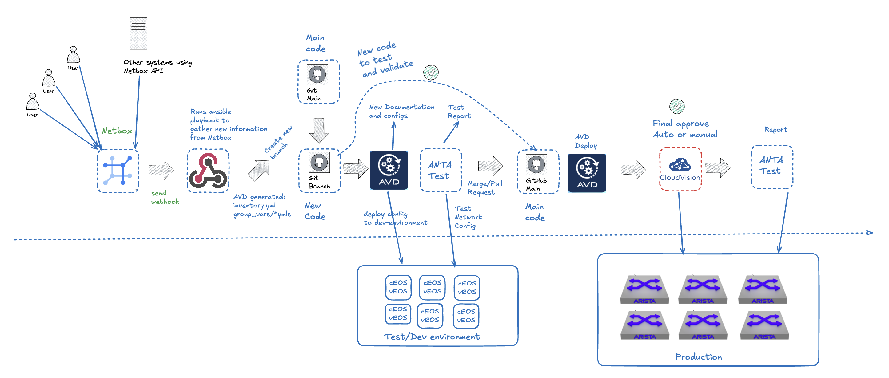

With the addition of Netbox I can move the user input from AVD to Netbox, and other systems I may want to integrate using API against Netbox. The other component I have added is a webhook server to receive hooks from Netbox to trigger my workflows.
I am using Gitea as my hosted git platform, it do not support dispatch yet, and therefore I cant send webhooks directly to my AVD repo. To solve this I have a dedicated webhook server instead receiving hooks from Netbox. Instead of automatically trigger a webhook every time I do an update in Netbox I have a custom script that sends a webhook to my webhook server that it is time to gather updates from Netbox and update AVD and start my workflow so it can generate new documentation, configurations and updated test reports all the way to Cloudvision to eventually be deployed into production (if all steps are "approved"). Everytime my webhook server is triggered it will checkout a branch (as in my previous [pipeline](https://blog.andreasm.io/2025/02/11/ci/cd-with-arista-validated-design/)) with these new "proposed" configuration changes.

In this post I will quickly explain how I can use Netbox as my source of truth and how AVD can interact with Netbox to generate updated configuration based on the latest changes in Netbox. Netbox will now become the one place where I do configurations such as adding interfaces, vlan, devices etc and should always reflect the current state of production environment. 

> [!NOTE]
>
> There are many ways to Rome, I have chosen this approach


## Netbox preparations

The first thing I need in Netbox is something that resembles my actual network fabric, all the devices (switches), interfaces, vlans, ip prefixes, ip addresses and VRFs. To get there as fast as possible I deployed my environment using AVD from my previous pipeline, then imported all the above using a python script into Netbox. It creates all objects in the correct site I have "pre-"defined in Netbox. 

This should give this in inventory under devices in Netbox:

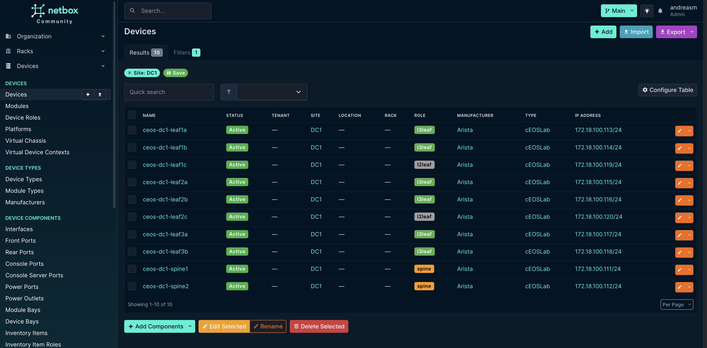

The script uses the structured config files AVD creates, so I dont even have to deploy the config to any actual device. I can just define my config in AVD and run the "build" playbook. 

Addtional information in Netbox that are created and mapped by the script:

- Device roles: spine, l3leaf and l2leaf
- Manufacturers: Arista
- Device Type: cEOSLab
- Platform: eos
- Sites: DC1
- VLANs (bound to site DC1 and VLAN groups)
- VLAN Groups (scoped to site DC1)
- VRFs (Bound to tenants below)
- Prefixes (Bound to VRF, tenant and VLAN)
- IP addresses (Bound to respective prefix)
- Tenants: dc1-production-anycast, dc1-production-mgmt, dc1-production-system, dc1-production-underlay, dc1-production-vrf10, dc1-production-vrf11, TENANT1

Now that I have an inventory to work with I can go ahead and prepare some playbooks to get AVD up to date into whats going on in Netbox. 

## Webhook

To get around the limit in Gitea not being able to receive webhooks I have create a simple webhook script using python to listen for webhooks from Netbox. I have chosen to just listen to any webhook from Netbox and it should start a series of playbooks after that. I am not at the moment sending these webhooks automatically everytime I create, delete or update an object in Netbox, instead I will trigger this webhook when I am ready by using a custom script in Netbox to do this.

On a linux machine where I have cloned my git repo I will run this python script to act as my webhook server:

```python
import subprocess
import os
import hmac
import hashlib
from flask import Flask, request, jsonify
from rich import print
from rich.console import Console
from datetime import datetime
import threading
import time
from waitress import serve  # Replace Flask's app.run with Waitress

# Flask app setup
app = Flask(__name__)
console = Console()

# Webhook Configuration
WEBHOOK_SECRET = "a_random_key"

# Ansible and Git Configuration
ENV_FILE = "/home/andreasm/environment/netbox-env.sh"
REPO_PATH = "/home/andreasm/netbox_avd_integration"
PLAYBOOKS = [
    f"{REPO_PATH}/1-playbook-update_inventory.yml",
    f"{REPO_PATH}/2-playbook-update_dc1_yml_according_to_inventory.yml",
    f"{REPO_PATH}/3-playbook-update_network_services.yml",
    f"{REPO_PATH}/4-playbook-update_connected_endpoints.yml"
]

# Cool startup sequence
def print_startup_sequence():
    # ASCII art banner
    ascii_art = """
    [bold cyan]
       ____  ____  ____  ____  ____  ____  
      /    \/    \/    \/    \/    \/    \ 
     /__________/\__________/\__________/\ 
     |  NETBOX-AVD SYNC WEBHOOK SERVER  | 
     |__________________________________|
    [/bold cyan]
    """
    console.print(ascii_art)
    console.print("[bold yellow]Powered by .... ... a ... Python Script[/bold yellow]")

    # Boot-up animation
    for i in range(3):
        console.print(f"\r[bold magenta]Initializing systems {3 - i}...[/bold magenta]", end="")
        time.sleep(1)

    # Custom server startup message
    console.print("\r[bold green]🚀 SERVER ONLINE![/bold green]")
    console.print("[bold cyan]====================================[/bold cyan]")
    console.print("[bold white]🔥 Running on all addresses (0.0.0.0)[/bold white]")
    console.print("[bold white]🌐 Local: http://127.0.0.1:5000[/bold white]")
    console.print("[bold white]🌍 Network: http://10.100.5.11:5000[/bold white]")
    console.print("[bold cyan]====================================[/bold cyan]")
    console.print("[bold red]Press CTRL+C to shut down the galaxy![/bold red]")

# Rest of your functions (run_ansible_playbooks, create_branch_and_push, handle_webhook)
def run_ansible_playbooks():
    """Runs the list of Ansible playbooks in order."""
    for playbook in PLAYBOOKS:
        try:
            playbook_name = os.path.basename(playbook)
            print(f"[bold blue]🚀 Running Ansible Playbook: {playbook_name}[/bold blue]")
            command = f"source {ENV_FILE} && ansible-playbook {playbook}"

            result = subprocess.run(
                ["bash", "-c", command],
                cwd=REPO_PATH,
                capture_output=True,
                text=True
            )

            if result.returncode == 0:
                print(f"[bold green]✔️ Playbook {playbook_name} executed successfully[/bold green]")
                console.print(f"[bold green]📜 {playbook_name} Output:[/bold green]", style="green")
                console.print(result.stdout, style="cyan")
            else:
                print(f"[bold red]❌ Playbook {playbook_name} failed:[/bold red] {result.stderr}")
                return False

        except subprocess.CalledProcessError as e:
            print(f"[bold red]❌ Error executing playbook {playbook_name}:[/bold red] {e.stderr}")
            return False
    return True

def create_branch_and_push():
    """Creates a new branch with date-time name, runs playbooks, commits changes, and pushes it."""
    branch_name = datetime.now().strftime("sync-%Y%m%d-%H%M%S")
    print(f"[bold blue]🔀 Preparing branch: {branch_name}[/bold blue]")

    try:
        os.chdir(REPO_PATH)

        # Check if there are uncommitted changes in main
        status_result = subprocess.run(
            ["git", "status", "--porcelain"],
            capture_output=True,
            text=True,
            check=True
        )
        if status_result.stdout.strip():
            print("[bold red]❌ Main branch has uncommitted changes. Please commit or stash them manually.[/bold red]")
            return False

        # Fetch latest updates from origin
        subprocess.run(["git", "fetch", "origin"], check=True)

        # Create and checkout new branch from main
        print(f"[bold green]✔️ Creating new branch: {branch_name}[/bold green]")
        subprocess.run(["git", "checkout", "-b", branch_name, "origin/main"], check=True)

        # Run all playbooks in order
        if not run_ansible_playbooks():
            print("[bold red]❌ One or more playbooks failed, aborting Git operations[/bold red]")
            subprocess.run(["git", "checkout", "main"], check=True)
            subprocess.run(["git", "branch", "-D", branch_name], check=True)
            return False

        # Add all changes
        subprocess.run(["git", "add", "."], check=True)

        # Commit changes if there are any
        commit_result = subprocess.run(
            ["git", "commit", "-m", f"Auto-sync triggered at {branch_name}"],
            capture_output=True,
            text=True
        )

        if "nothing to commit" in commit_result.stdout.lower():
            print(f"[bold yellow]⚠️ No changes detected, skipping push.[/bold yellow]")
            subprocess.run(["git", "checkout", "main"], check=True)
            subprocess.run(["git", "branch", "-D", branch_name], check=True)
            print(f"[bold green]✔️ Deleted branch '{branch_name}'[/bold green]")
            return False

        # Push changes
        print(f"[bold green]⬆️ Pushing branch: {branch_name} to remote[/bold green]")
        subprocess.run(["git", "push", "origin", branch_name], check=True)

        print(f"[bold green]✔️ Successfully pushed branch {branch_name}[/bold green]")
        subprocess.run(["git", "checkout", "main"], check=True)
        return True

    except subprocess.CalledProcessError as e:
        print(f"[bold red]❌ Git process failed: {e}[/bold red]")
        subprocess.run(["git", "checkout", "main"], check=True)
        return False

@app.route('/webhook', methods=['POST'])
def handle_webhook():
	    print("[bold blue]ℹ️ Webhook received...[/bold blue]")

    raw_data = request.get_data(as_text=True)
    try:
        data = request.get_json()
    except Exception as e:
        print(f"[bold red]❌ Error parsing JSON:[/bold red] {str(e)}")
        return jsonify({"error": "Invalid JSON"}), 400

    # Verify Webhook Secret
    received_secret = request.headers.get('X-Hook-Signature')
    expected_secret = hmac.new(
        WEBHOOK_SECRET.encode('utf-8'),
        raw_data.encode('utf-8'),
        hashlib.sha512
    ).hexdigest()

    if not received_secret or received_secret != expected_secret:
        print("[bold red]❌ Invalid or missing webhook secret[/bold red]")
        return jsonify({"error": "Invalid or missing webhook secret"}), 403

    # Minimal validation
    if data.get('event') != "manual_sync":
        print("[bold red]❌ Invalid event type[/bold red]")
        return jsonify({"error": "Invalid event type"}), 400

    print(f"[bold blue]🔄 Processing manual sync triggered at {data.get('timestamp')}[/bold blue]")

    # Run the task in a background thread
    thread = threading.Thread(target=create_branch_and_push)
    thread.start()

    # Respond immediately
    return jsonify({"message": "Webhook received, processing started in the background"}), 202

if __name__ == "__main__":
    print_startup_sequence()
    serve(app, host="0.0.0.0", port=5000)  # Use Waitress instead of app.run
```

 A short explanation of what this webhook server does when it receives a webhook from Netbox:

- Creates a branch in my git repo named sync-"date-time". This branch will be committed and pushed if it detects any changes, otherwise it will be deleted
- Then it runs through a series of playbooks in the right order. Playbooks will be explained in chapter below.

## Ansible playbooks, jinja templates and python scripts

The whole idea here is that if I add or remove objects like devices, interfaces, vlans with or without SVIs AVD should pick up these changes as they are created or when I tell AVD about it. That is the major difference between my previous post and this that I no longer edit this kind of information in AVD directly, AVD gets it from Netbox. Beyond that my pipeline is identical. So to get this interaction in place I need to create some Ansible playbooks, jinja templates and python scripts to make this happen. Below I will go through this step by step. There is proably many ways to achieve this with Netbox and AVD, but this is the approach I have chosen.  

### Environment file

All the scripts and playbooks rely on a "environment" file that includes url to Netbox and Cloudvision and username password. The file is called netbox_env.sh and includes this:

```bash
# netbox_env.sh
export NETBOX_URL="http://localhost"
export NETBOX_TOKEN=""
export CVP_HOST="ip/fqdn"
export CVP_USER="user"
export CVP_PASSWORD="password"
```


### 1-playbook-update_inventory.yml - get device inventory and update AVD inventory.yml

The first playbook the webhook server runs, 1-playbook-update_inventory.yml, will fetch device information from Netbox and regenerate the AVD inventory.yml file according to their role (spine, l3leaf and l2leaf) in site DC1. Below is the following playbook, which is dependent on a python script and jinja template used to generate the inventory.yml.

The playbook:

```yaml
---
- name: Update AVD Inventory from NetBox
  hosts: localhost
  gather_facts: no
  tasks:
    - name: Ensure required Python packages are installed
      pip:
        name:
          - requests
          - jinja2
          - PyYAML
        state: present

    - name: Source environment file and run inventory update script
      shell: |
        . {{ playbook_dir }}/netbox_env.sh && python3 {{ playbook_dir }}/scripts/update_inventory.py
      args:
        chdir: "{{ playbook_dir }}"
      environment:
        PATH: "{{ ansible_env.PATH }}"
      register: script_result
      changed_when: script_result.rc == 1
      failed_when: script_result.rc not in [0, 1]

    - name: Read inventory.yml content
      slurp:
        src: "{{ playbook_dir }}/inventory.yml"
      register: inventory_content
      when: script_result.rc == 0
      
    - name: Update subnet and remove CLOUDVISION section
      copy:
        dest: "{{ playbook_dir }}/dev-inventory.yml"
        content: |
          
          
          
          {{ before_cloudvision }}FABRIC:{{ after_cloudvision }}
        force: yes
      when: script_result.rc == 0
```

The last section of the playbook is used to create the second inventory.yml (dev-inventory.yml) used for my digital twin environment to change mgmt ip address and remove the Cloudvision section as this is not used for that environment. 

The python script this playbook uses:

```python
	#!/usr/bin/env python3

import os
import requests
import yaml
from jinja2 import Environment, FileSystemLoader

# NetBox Configuration
NETBOX_URL = os.environ["NETBOX_URL"]
NETBOX_TOKEN = os.environ["NETBOX_TOKEN"]
HEADERS = {"Authorization": f"Token {NETBOX_TOKEN}"}

# CVP Configuration
CVP_HOST = os.environ["CVP_HOST"]
CVP_USER = os.environ["CVP_USER"]
CVP_PASSWORD = os.environ["CVP_PASSWORD"]

def get_netbox_devices(role_slug):
    """Fetch devices from NetBox based on role slug and site 'dc1'."""
    url = f"{NETBOX_URL}/api/dcim/devices/?role={role_slug}&site=dc1"
    response = requests.get(url, headers=HEADERS)
    response.raise_for_status()
    return response.json()["results"]

def main():
    # Check for required environment variables
    required_vars = ["NETBOX_URL", "NETBOX_TOKEN", "CVP_HOST", "CVP_USER", "CVP_PASSWORD"]
    missing_vars = [var for var in required_vars if var not in os.environ]
    if missing_vars:
        raise ValueError(f"Missing required environment variables: {', '.join(missing_vars)}")

    # Fetch devices by role slugs
    spines = [
        {"name": device["name"], "ip": device["primary_ip"]["address"].split("/")[0] if device["primary_ip"] else "0.0.0.0"}
        for device in get_netbox_devices("spine")
    ]
    l3_leaves = [
        {"name": device["name"], "ip": device["primary_ip"]["address"].split("/")[0] if device["primary_ip"] else "0.0.0.0"}
        for device in get_netbox_devices("l3leaf")
    ]
    l2_leaves = [
        {"name": device["name"], "ip": device["primary_ip"]["address"].split("/")[0] if device["primary_ip"] else "0.0.0.0"}
        for device in get_netbox_devices("l2leaf")
    ]

    # Prepare data for template
    template_data = {
        "cvp_host": CVP_HOST,
        "cvp_user": CVP_USER,
        "cvp_password": CVP_PASSWORD,
        "spines": spines,
        "l3_leaves": l3_leaves,
        "l2_leaves": l2_leaves
    }

    # Render template
    env = Environment(loader=FileSystemLoader("templates"))
    template = env.get_template("inventory.yml.j2")
    rendered_inventory = template.render(template_data)

    # Check if inventory.yml exists and compare content
    inventory_file = "inventory.yml"
    if os.path.exists(inventory_file):
        with open(inventory_file, "r") as f:
            current_content = f.read()
        if current_content == rendered_inventory:
            print("No changes detected in inventory.yml")
            exit(0)  # Exit with 0 to indicate no change

			    # Write to inventory.yml if there’s a change
    with open(inventory_file, "w") as f:
        f.write(rendered_inventory)


if __name__ == "__main__":
    main()
```

And the accompanying jinja template for the inventory.yml:

```jinja2
---
all:
  children:
    CLOUDVISION:
      hosts:
        cvp:
          ansible_host: {{ cvp_host }}
          ansible_httpapi_host: {{ cvp_host }}
          ansible_user: {{ cvp_user }}
          ansible_password: {{ cvp_password }}
          ansible_connection: httpapi
          ansible_httpapi_use_ssl: true
          ansible_httpapi_validate_certs: false
          ansible_network_os: eos
          ansible_httpapi_port: 443
          ansible_python_interpreter: $(which python3)
    FABRIC:
      children:
        DC1:
          vars:
            mgmt_gateway: 172.18.100.2
          children:
            DC1_SPINES:
              hosts:
                {{ spine.name }}:
                  ansible_host: {{ spine.ip }}
            DC1_L3_LEAVES:
              hosts:
                {{ leaf.name }}:
                  ansible_host: {{ leaf.ip }}
            DC1_L2_LEAVES:
              hosts:
                {{ leaf.name }}:
                  ansible_host: {{ leaf.ip }}

    NETWORK_SERVICES:
      children:
        DC1_L3_LEAVES:
        DC1_L2_LEAVES:
    CONNECTED_ENDPOINTS:
      children:
        DC1_L3_LEAVES:
        DC1_L2_LEAVES:
```

### 2-playbook-update_dc1_yml_according_to_inventory.yml

This playbook does what its called, namely updating my AVD group_vars/DC1.yml file to match any updates done in the inventory.yml file accordingly. The playbook is dependent on the Jinja2 template "update_dc1.j2" under under the folder templates. 

The playbook:

```yaml
---
- name: Update DC1.yml based on inventory.yml
  hosts: localhost
  gather_facts: no
  vars:
    inventory_file: "inventory.yml"
    dc1_file: "group_vars/ST1_DC1.yml"
    
  tasks:
    - name: Read inventory.yml
      ansible.builtin.slurp:
        src: "{{ inventory_file }}"
      register: inventory_content

    - name: Read existing ST1_DC1.yml
      ansible.builtin.slurp:
        src: "{{ dc1_file }}"
      register: dc1_content

    - name: Process inventory and update DC1 configuration
      ansible.builtin.template:
        src: templates/update_dc1.j2
        dest: "{{ dc1_file }}"
        mode: '0644'
        backup: no
      vars:
        inventory_data: "{{ inventory_content.content | b64decode | from_yaml }}"
        current_dc1: "{{ dc1_content.content | b64decode | from_yaml }}"
```

The corresponding Jinja2 template:

```jinja2
---
mgmt_interface: Management0
mgmt_interface_description: oob_management

spine:
  defaults:
    platform: cEOS-lab
    loopback_ipv4_pool: 10.255.0.0/27
    bgp_as: 65100
  nodes:

  
    - name: {{ host.key }}
      id: {{ loop.index }}
      mgmt_ip: "{{ '{{ ansible_host }}/24' }}"


l3leaf:
  defaults:
    platform: cEOS-lab
    loopback_ipv4_pool: 10.255.0.0/27
    loopback_ipv4_offset: 2
    vtep_loopback_ipv4_pool: 10.255.1.0/27
    uplink_interfaces: ['Ethernet1', 'Ethernet2']
    uplink_switches: ['ceos-dc1-spine1', 'ceos-dc1-spine2']
    uplink_ipv4_pool: 10.255.255.0/26
    mlag_peer_ipv4_pool: 10.255.1.64/27
    mlag_peer_l3_ipv4_pool: 10.255.1.96/27
    virtual_router_mac_address: 00:1c:73:00:00:99
    spanning_tree_priority: 4096
    spanning_tree_mode: mstp
  node_groups:



  
  
  
  
    
  
  



    - group: {{ group_name }}
      bgp_as: {{ group_data.bgp_as }}
      nodes:



        - name: {{ node.name }}
          id: {{ (group_index - 1) * 2 + loop.index }}
          mgmt_ip: "{{ '{{ ansible_host }}/24' }}"
          uplink_switch_interfaces:
            - Ethernet{{ (group_index - 1) * 2 + loop.index }}
            - Ethernet{{ (group_index - 1) * 2 + loop.index }}



l2leaf:
  defaults:
    platform: cEOS-lab
    spanning_tree_mode: mstp
  node_groups:



  
  
  
  
    
  
  



    - group: {{ group_name }}
      uplink_switches: {{ group_data.uplink_switches }}
      nodes:



        - name: {{ node.name }}
          id: {{ group_index }}
          mgmt_ip: "{{ '{{ ansible_host }}/24' }}"
          uplink_switch_interfaces:
            - Ethernet6
            - Ethernet6


```

This will make sure my DC1.yml matches the updates done in inventory.yml.

### 3-playbook-update_network_services.yml

This playbook will fetch all VLANS in site DC1. This playbook requires two vlan roles defined in Netbox: L2 and L3. 

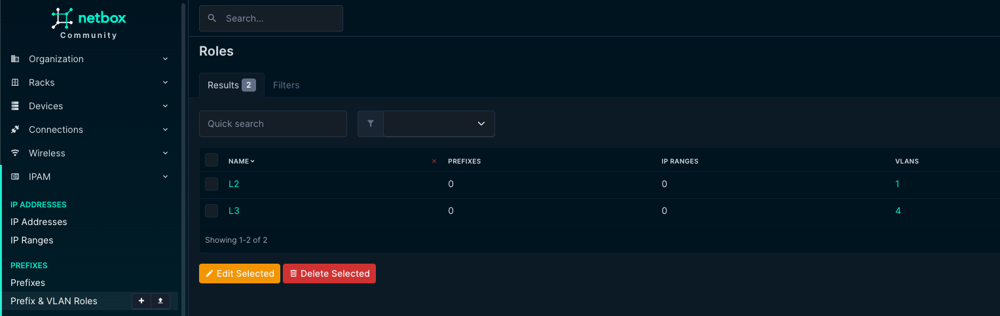

With these two rules in place the playbook can differ on whether its just a regular vlan with no corresponding vlan interface. If a VLAN has the role L3 it assumes it has a corresponding vlan interface with an Anycast ip address defined and created under "svis" in the NETWORK_SERVICES.yml. The corresponding vlan interface ip address must have the IP role Anycast defined. The IP address is defined in a prefix and it will find the correct VRF from the prefix.

See snippet from NETWORK_SERVICES.yml:

```yaml
        svis:
          - id: 11
            name: VRF10_VLAN11
            enabled: true
            ip_address_virtual: 10.10.11.1/24
          - id: 12
            name: VRF10_VLAN12
            enabled: true
            ip_address_virtual: 10.10.12.1/24
```

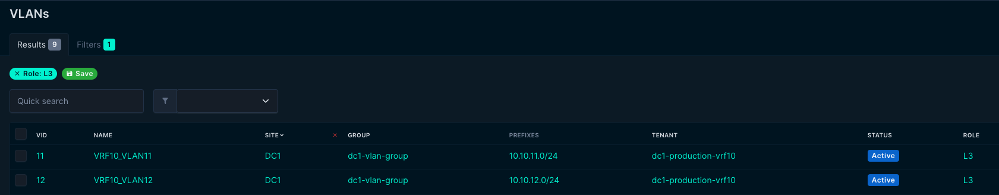

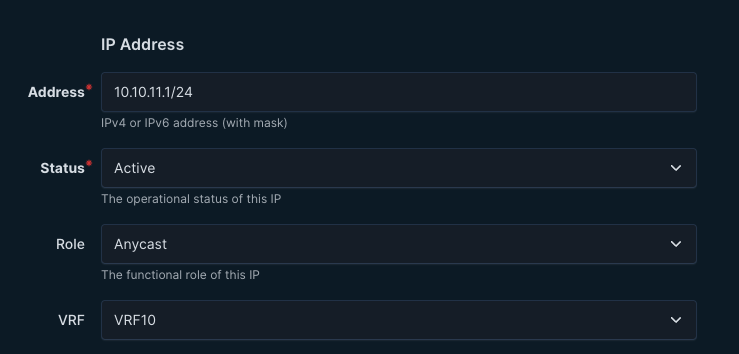 

If the VLAN has the role L2 it will be placed under the l2vlans section:

```yaml
    l2vlans:
      - id: 3401
        name: L2_VLAN3401
      - id: 3402
        name: L2_VLAN3402
```

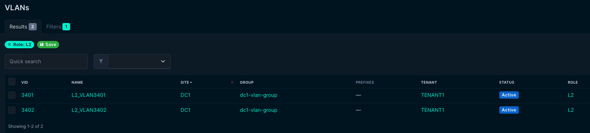

The playbook:

```yaml
---
- name: Sync L2 and L3 VLANs and SVIs from NetBox to AVD for site dc1
  hosts: localhost
  connection: local
  vars:
    output_file: "group_vars/NETWORK_SERVICES.yml"
    template_file: "templates/network_services.j2"
    env_file: "{{ playbook_dir }}/netbox_env.sh"
  tasks:
    - name: Check if netbox_env.sh exists
      ansible.builtin.stat:
        path: "{{ env_file }}"
      register: env_file_stat
      failed_when: not env_file_stat.stat.exists

    - name: Source netbox_env.sh and set environment variables
      ansible.builtin.shell: |
        . {{ env_file }} && env
      register: env_output
      changed_when: false

    - name: Parse environment variables from shell output
      ansible.builtin.set_fact:
        netbox_url: "{{ (env_output.stdout | regex_search('NETBOX_URL=(.+)', '\\1') | first) }}"
        netbox_token: "{{ (env_output.stdout | regex_search('NETBOX_TOKEN=(.+)', '\\1') | first) }}"
      changed_when: false

    - name: Query L2 VLANs from NetBox for site dc1
      ansible.builtin.uri:
        url: "{{ netbox_url }}/api/ipam/vlans/?site=dc1&role=l2"
        method: GET
        headers:
          Authorization: "Token {{ netbox_token }}"
          Accept: "application/json"
        validate_certs: no
        return_content: yes
      register: vlan_l2_response

    - name: Set L2 VLAN list
      ansible.builtin.set_fact:
        vlan_list_raw_l2: "{{ vlan_l2_response.json.results | default([]) }}"

    - name: Query L3 VLANs from NetBox for site dc1
      ansible.builtin.uri:
        url: "{{ netbox_url }}/api/ipam/vlans/?site=dc1&role=l3"
        method: GET
        headers:
          Authorization: "Token {{ netbox_token }}"
          Accept: "application/json"
        validate_certs: no
        return_content: yes
      register: vlan_l3_response

    - name: Set L3 VLAN list
      ansible.builtin.set_fact:
        vlan_list_raw_l3: "{{ vlan_l3_response.json.results | default([]) }}"

    - name: Combine L2 and L3 VLAN lists
      ansible.builtin.set_fact:
        vlan_list: "{{ vlan_list_raw_l2 + vlan_list_raw_l3 }}"

    - name: Query prefixes for all VLANs
      ansible.builtin.uri:
        url: "{{ netbox_url }}/api/ipam/prefixes/?vlan_id={{ item.id }}"
        method: GET
        headers:
          Authorization: "Token {{ netbox_token }}"
          Accept: "application/json"
        validate_certs: no
        return_content: yes
      register: prefix_response
      loop: "{{ vlan_list }}"
      when: vlan_list | length > 0
      no_log: true  # Suppress item-by-item output

    - name: Extract prefix list from raw response
      ansible.builtin.set_fact:
        prefix_list: "{{ prefix_response.results | map(attribute='json.results') | flatten | reject('undefined') | list }}"

    - name: Query all VRFs to get custom fields
      ansible.builtin.uri:
        url: "{{ netbox_url }}/api/ipam/vrfs/"
        method: GET
        headers:
          Authorization: "Token {{ netbox_token }}"
          Accept: "application/json"
        validate_certs: no
        return_content: yes
      register: vrf_response

    - name: Set VRF list
      ansible.builtin.set_fact:
        vrf_list: "{{ vrf_response.json.results | default([]) }}"

    - name: Query all anycast IP addresses
      ansible.builtin.uri:
        url: "{{ netbox_url }}/api/ipam/ip-addresses/?role=anycast&limit=1000"
        method: GET
        headers:
          Authorization: "Token {{ netbox_token }}"
          Accept: "application/json"
        validate_certs: no
        return_content: yes
        status_code: [200]
      register: ip_response
      failed_when: ip_response.status != 200

    - name: Extract IP list from raw response
      ansible.builtin.set_fact:
        ip_list: "{{ ip_response.json.results | default([]) }}"

    - name: Query l3leaf devices in site dc1
      ansible.builtin.uri:
        url: "{{ netbox_url }}/api/dcim/devices/?site=dc1&role=l3leaf"
        method: GET
        headers:
          Authorization: "Token {{ netbox_token }}"
          Accept: "application/json"
        validate_certs: no
        return_content: yes
      register: device_response

    - name: Set l3leaf device list
      ansible.builtin.set_fact:
        l3leaf_devices: "{{ device_response.json.results | default([]) }}"

    - name: Query interfaces for l3leaf devices
      ansible.builtin.uri:
        url: "{{ netbox_url }}/api/dcim/interfaces/?device_id={{ item.id }}"
        method: GET
        headers:
          Authorization: "Token {{ netbox_token }}"
          Accept: "application/json"
        validate_certs: no
        return_content: yes
      register: interface_response
      loop: "{{ l3leaf_devices }}"
      no_log: true  # Suppress item-by-item output

    - name: Extract interface list from raw response
      ansible.builtin.set_fact:
        interface_list: "{{ interface_response.results | map(attribute='json.results') | flatten | reject('undefined') | list }}"

    - name: Render and write updated NETWORK_SERVICES.yml
      ansible.builtin.copy:
        content: "{{ lookup('template', template_file, template_vars={'vlan_list': vlan_list, 'prefix_list': prefix_list, 'ip_list': ip_list, 'vrf_list': vrf_list, 'l3leaf_devices': l3leaf_devices, 'interface_list': interface_list}) }}"
        dest: "{{ output_file }}"
        backup: no
```

The corresponding jinja2 template:

```jinja2
---
tenants:
  - name: "TENANT1"
    mac_vrf_vni_base: 10000
    vrfs:





      - name: {{ vrf.name }}
        vrf_vni: {{ vrf.custom_fields.vrf_vni | default(vrf.id) }}
        vtep_diagnostic:
          loopback: {{ vrf.custom_fields.vrf_vni | default(vrf.id) }}
          loopback_ip_range: 10.255.{{ vrf.custom_fields.vrf_vni | default(vrf.id) }}.0/27
        svis:








          - id: {{ vlan.vid }}
            name: {{ vlan.name | default('VLAN_' ~ vlan.vid) }}
            enabled: true

            ip_address_virtual: {{ (vlan_anycast_ips | first).address }}

            nodes:


              - node: {{ ip.assigned_object.device.name }}
                ip_address: {{ ip.address }}







    l2vlans:

      - id: {{ vlan.vid }}
        name: {{ vlan.name | default('VLAN_' ~ vlan.vid) }}

```

This will regenerate the NETWORK_SERVICES.yml everytime to make sure there is no "stale" vlans, vrfs or svis. It should always be true to what it finds in Netbox. 

### 4-playbook-update_connected_endpoints.yml

This playbook will generate the CONNECTED_ENDPOINTS.yml if any interface in site DC1 has the tag "endpoint" or both "endpoint" and "merged". I went with this approach to easily control which interfaces in Netbox that are connected to servers, clients, other devices so my playbook could filter on this and create the CONNECTED_ENDPOINTS.yml accordingly. If an interface only has the the tag "endpoint" it will be created as a single entry in CONNECTED_ENDPOINTS.yml. If an interface has both "endpoint" and "merged" it will created it as a combined entry in CONNECTED_ENDPOINTS.yml. See difference below:

```yaml
---
# Definition of connected endpoints in the fabric.
servers:
  - name: leaf3a-sw01-u1
    adapters:
      - endpoint_ports: ["PCI1"]
        switch_ports: ["Ethernet5"]
        switches: ["ceos-dc1-leaf3a"]
        vlans: "352"
        mode: trunk
  - name: leaf3b-sw01-u2
    adapters:
      - endpoint_ports: ["PCI1"]
        switch_ports: ["Ethernet5"]
        switches: ["ceos-dc1-leaf3b"]
        vlans: "352"
        mode: trunk
  - name: dc1-leaf1-server1-nlogic
    adapters:
      - endpoint_ports: ["PCI1", "PCI2"]
        switch_ports: ["Ethernet5", "Ethernet5"]
        switches: ["ceos-dc1-leaf1a", "ceos-dc1-leaf1b"]
        vlans: "11,12,21,22"
        mode: trunk
```

Name of the interfaces comes from the the description field in Netbox, whether the interfaces is switchport mode trunk or access comes from the interface configuration in Netbox:


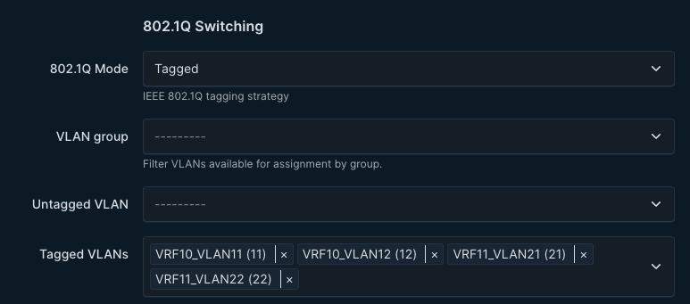

The logic is also able to handle if you put an untagged vlan on the interface, it becomes native_vlan: xxx

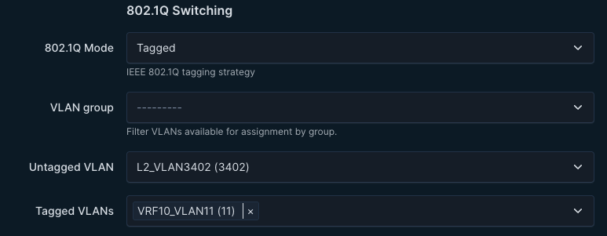

In the CONNECTED_ENDPOINTS.yml:

```yaml
  - name: SERVER_dc1-leaf2-server1_PCI1
    adapters:
      - endpoint_ports: ["PCI1"]
        switch_ports: ["Ethernet5"]
        switches: ["ceos-dc1-leaf2a"]
        vlans: "11"
        mode: trunk
        native_vlan: 3402
```

The playbook:

```yaml
---
- name: Update CONNECTED_ENDPOINTS.yml from NetBox for dc1 site endpoints
  hosts: localhost
  gather_facts: no

  tasks:
    # Task 0: Load environment variables from netbox_env.sh
    - name: Parse netbox_env.sh into environment variables
      ansible.builtin.set_fact:
        env_vars: "{{ parsed_env }}"
      vars:
        parsed_env: "{{ dict(lookup('file', playbook_dir + '/netbox_env.sh') | split('\n') | select('match', '.*=.*') | map('regex_replace', '^export\\s+([^=]+)=\"([^\"]+)\"$', '\\1=\\2') | map('split', '=') | list) }}"

    # Task 1: Set environment for playbook
    - name: Set environment for playbook
      ansible.builtin.set_fact:
        netbox_url: "{{ env_vars.NETBOX_URL }}/api"
        netbox_token: "{{ env_vars.NETBOX_TOKEN }}"
        avd_group_vars_dir: "{{ playbook_dir }}/group_vars"
        site_slug: "dc1"

    # Task 2: Get all devices in the dc1 site
    - name: Fetch devices from NetBox for site dc1
      ansible.builtin.uri:
        url: "{{ netbox_url }}/dcim/devices/?site={{ site_slug }}"
        method: GET
        headers:
          Authorization: "Token {{ netbox_token }}"
          Accept: "application/json"
        return_content: yes
      register: netbox_devices

    # Debug devices
    - name: Debug fetched devices
      ansible.builtin.debug:
        var: netbox_devices.json.results
      when: netbox_devices.json.results is defined

    # Task 3: Fetch interfaces with tag "endpoint" for all devices
    - name: Fetch interfaces with tag "endpoint" for all devices
      ansible.builtin.uri:
        url: "{{ netbox_url }}/dcim/interfaces/?device={{ item.name }}&tag=endpoint"
        method: GET
        headers:
          Authorization: "Token {{ netbox_token }}"
          Accept: "application/json"
        return_content: yes
      loop: "{{ netbox_devices.json.results | default([]) }}"
      register: netbox_interfaces_per_device
      when: netbox_devices.json.results is defined and netbox_devices.json.results | length > 0
      no_log: true

    # Task 4: Collect adapter data
    - name: Initialize raw_adapters
      ansible.builtin.set_fact:
        raw_adapters: []

    - name: Collect adapter data from interfaces
      ansible.builtin.set_fact:
        raw_adapters: "{{ raw_adapters + [adapter_data] }}"
      loop: "{{ netbox_interfaces_per_device.results | default([]) | map(attribute='json') | map(attribute='results') | flatten }}"
      loop_control:
        loop_var: interface
      when:
        - interface.tags | selectattr('slug', 'equalto', 'endpoint') | list | length > 0
      vars:
        vlan_list: "{{ interface.tagged_vlans | map(attribute='vid') | list }}"
        vlan_string: "{{ vlan_list | join(',') }}"
        port_number: "{{ raw_adapters | default([]) | selectattr('name', 'equalto', interface.description) | length + 1 }}"
        adapter_data:
          name: "{{ interface.description }}"
          merge_group: "{{ 'merged' if interface.tags | selectattr('slug', 'equalto', 'merged') | list | length > 0 else interface.id }}"
          endpoint_port: "PCI{{ port_number }}"
          switch_port: "{{ interface.name }}"
          switch: "{{ interface.device.name }}"
          vlans: "{{ vlan_string if vlan_string else interface.untagged_vlan.vid | default('') }}"
          mode: "{{ 'trunk' if interface.tagged_vlans else 'access' }}"
          native_vlan: "{{ interface.untagged_vlan.vid | default('') if interface.tagged_vlans and interface.untagged_vlan else '' }}"

    # Debug collected raw adapters
    - name: Debug raw adapters
      ansible.builtin.debug:
        var: raw_adapters

    # Task 5: Group and merge adapters
    - name: Initialize endpoint_dict
      ansible.builtin.set_fact:
        endpoint_dict: {}

    - name: Group and merge adapters
      ansible.builtin.set_fact:
        endpoint_dict: "{{ endpoint_dict | combine({ item.0: {'adapters': grouped_adapters, 'name': item.1[0].name} }) }}"
      loop: "{{ raw_adapters | default([]) | groupby('merge_group') }}"
      vars:
        grouped_adapters:
          - endpoint_ports: "{{ item.1 | map(attribute='endpoint_port') | list }}"
            switch_ports: "{{ item.1 | map(attribute='switch_port') | list }}"
            switches: "{{ item.1 | map(attribute='switch') | list }}"
            vlans: "{{ item.1[0].vlans }}"
            mode: "{{ item.1[0].mode }}"
            native_vlan: "{{ item.1[0].native_vlan | default(omit) }}"

    # Debug grouped adapters
    - name: Debug grouped adapters
      ansible.builtin.debug:
        var: endpoint_dict

    # Task 6: Convert aggregated data to list
    - name: Convert aggregated data to list
      ansible.builtin.set_fact:
        new_endpoints: "{{ endpoint_dict | dict2items | map(attribute='value') | list }}"

    # Debug transformed endpoint list
    - name: Debug transformed endpoint list
      ansible.builtin.debug:
        var: new_endpoints

    # Task 7: Render CONNECTED_ENDPOINTS.yml with NetBox data
    - name: Render CONNECTED_ENDPOINTS.yml with NetBox data
      ansible.builtin.template:
        src: "templates/connected_endpoints.j2"
        dest: "{{ avd_group_vars_dir }}/CONNECTED_ENDPOINTS.yml"
        mode: '0644'
      vars:
        servers: "{{ new_endpoints | default([]) }}"

    # Task 8: Validate the YAML syntax
    - name: Validate updated YAML
      ansible.builtin.command: "yamllint {{ avd_group_vars_dir }}/CONNECTED_ENDPOINTS.yml"
      register: yaml_validation
      failed_when: yaml_validation.rc != 0 and 'error' in yaml_validation.stdout and 'empty-lines' not in yaml_validation.stdout
```

The corresponding Jinja2 template:

```jinja2
---
# Definition of connected endpoints in the fabric.
servers:

  - name: {{ server.name }}
    adapters:

      - endpoint_ports: {{ adapter.endpoint_ports | to_json }}
        switch_ports: {{ adapter.switch_ports | to_json }}
        switches: {{ adapter.switches | to_json }}
        vlans: "{{ adapter.vlans }}"
        mode: {{ adapter.mode }}

        native_vlan: {{ adapter.native_vlan }}



```

Jinja template dynamic template just for config diff and visualisation. I dont use for anything else. 


## Netbox Config Templates 

In my Netbox environment I have created a simple jinja template to reflect only on the objects I have in Netbox that is sent to AVD. I have not implemented any BGP configurations, nor VXLAN configurations and other stuff. I have focused solely on VLANs, Interfaces, IP addresses and Devices. In a next post I will maybe consider to also handle BGP and VXLAN configurations from Netbox. But for now I leave that to AVD to configure. Below is the jinja template that reflects on the actual configuration being managed by Netbox and sent to AVD to reconcile:

```jinja2
! Arista EOS Configuration Generated by NetBox
hostname {{ device.name }}

ip name-server vrf MGMT {{ device.custom_field_data["name_server"] }}
!


clock timezone {{ device.custom_field_data["clock_timezone"] }}
!




vlan {{ vlan.vid }}
   name {{ vlan.name }}
   trunk group MLAG
!



 








vrf instance {{ vrf.name }}
!




interface {{ interface.name }}

   description {{ interface.description }}


   vrf {{ interface.vrf.name }}


   mtu {{ interface.mtu }}


   switchport mode access
   switchport access vlan {{ interface.untagged_vlan.vid }}

   switchport mode trunk

   switchport trunk native vlan {{ interface.untagged_vlan.vid }}


   switchport trunk allowed vlan {{ vlan.vid }},




   ip address {{ ip.address }}


!


! VLAN Configuration
vlan database

   vlan {{ vlan.vid }}
   name {{ vlan.name }}

exit
!

end
```

 This gives me a valid EOS config if I click in Render Config in Netbox:

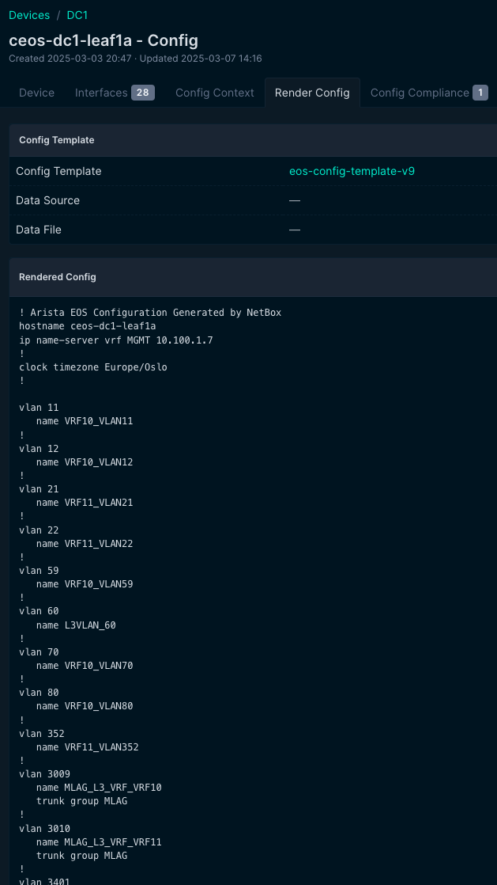

This may be used to compare the config, or just give you a quick glance of what the configuration looks like. 

If using the plugin [Netbox Config Diff](https://github.com/miaow2/netbox-config-diff) it may also be used to compare diff in real time, just need to add some exclusion regexes. 


## Netbox Branching

As any changes in my pipeline is always created in a branch I feel I have very good control of what and when I allow any changes into my main branch. When I do a pull request on the changes coming from Netbox after verifying the changes it will then be forwarded to my Cloudvision instance for a last approval. Netbox on the other hand will have the changes directly. But what if I want to use the same approach in Netbox? There is a plugin for that too. 

The plugin [Netbox Branching](https://github.com/netboxlabs/netbox-branching/) allows you to create a branch in Netbox, do your changes and then sync the config to AVD. If any changes is being declined along the way it is very easy to just revert back or discard the changes also in Netbox. So the process should very well respect added configurations as well as delete them or discard "non accepted attempts". 

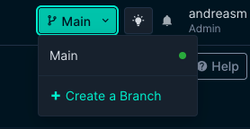


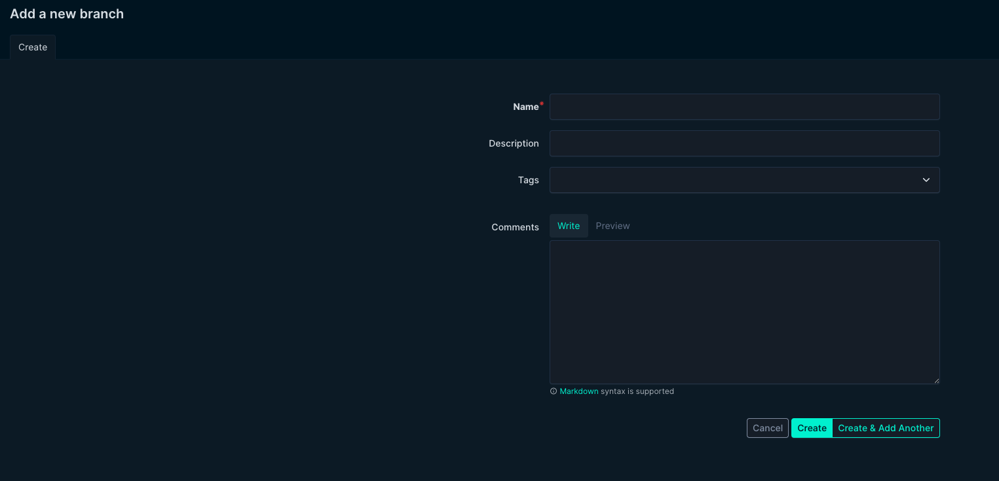

 


## Demo of the playbooks in action

Below I have created a short video showcasing end to end my pipeline including Netbox. In the video I create a VLAN 80 with a corresponding SVI on all L3 leafs using a custom script in Netbox. 

```youtube

```


## Outro


There are some moving parts used in my pipeline, but not all have to be used. This is not an absolute best practice or THE way to do it, but it maybe opens up for some ideas of how elegant we can manage and provision Arista fabrics using the brilliant tools like Arista Validated Design and Cloudvision combined with several standard open source tools. Some modules in the pipeline may be removed to keep it simpler, while loosing out on some functionality, add more modules for more features. Its all about finding the way that suits you. 
