# Arista MSS - Multi-Domain Segmentation Services


Before I dive into how I configured and tested Arista MSS in my lab, I feel its kind of necessary to do a short introduction of MSS. What is it?

On a very high level, Arista Multi-Domain Segmentation Services is a solution to help you achieve Zero-Trust by allowing you to create microsegmention policies in your network fabric. This is regardless whether it is in your Campus, Datacenter or Branch/Edge. 

From Arista's offical MSS [web-page](https://www.arista.com/en/products/multi-domain-segmentation):

> Arista MSS offers a switch-based microperimeter technology stack that preserves the best attributes of switch-based and host-based firewall micro-segmentation technologies and, at the same time, overcomes their main limitations while delivering a consistent, unified segmentation architecture end-to-end across multiple domains (from the campus/branch to the data center).


> The following key principles of the Arista MSS architecture make it stand out compared to all other solutions in the market: 
>
> 1. Consistent architecture across multiple network domains (campus, branch, data center) predicated on a single EOS binary, common across all switching platforms, a single Arista CloudVision™ policy orchestration platform, and an aggregated Network Data Lake (Arista EOS NetDL™) infrastructure for state management and monitoring. 
> 2. The only microperimeter (tag-based) segmentation solution in the industry that is both network and endpoint agnostic: it has no dependency on any network data plane or control plane protocols and at the same time it does not require any software agents on the endpoints. 
> 3. A unified framework for micro- as well as macro-segmentation policies enabling security rules to be built around microperimeter objects as well as traditional network objects (subnets, VRFs), with the ability to enforce policies in the network or redirect traffic to any traditional security gateways. 
> 4. Arista MSS offers a switch-based microperimeter technology stack that preserves the best attributes of switch-based and host-based firewall micro-segmentation technologies and, at the same time, overcomes their main limitations while delivering a consistent, unified segmentation architecture end-to-end across multiple domains (from the campus/branch to the data center).

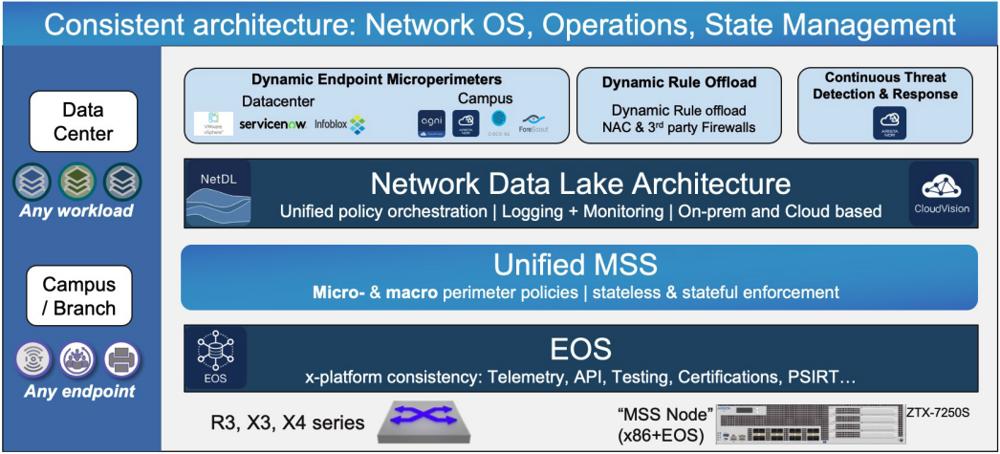


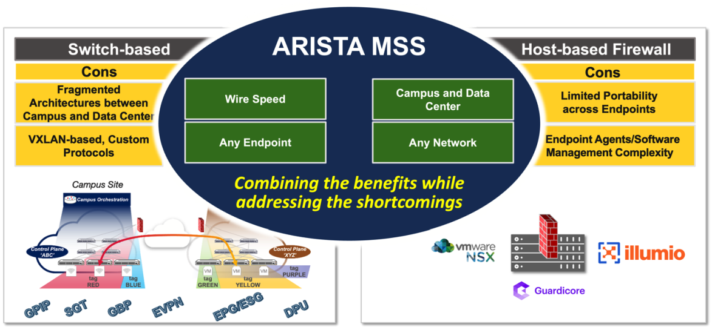


In my previous role at a software vendor as a Solution Engineer for many years helping customers with microsegmentation, zero-trust and microsegmentation is nothing new but an important security solution in todays IT landscape. I find the Arista MSS solution very interesting. The biggest differentiator with MSS is where the enforcement is done and how easy it is to get started and manage. In contrast to other solutions out there MSS will allow you to cover all needs from Campus, Datacenter all the way to the Branch/Edge, not leaving any gaps. MSS enforcement point is your switches, not an agent, not a software layer but right there where the traffic is and on the devices that are responsible for switching and routing your precious data, regardless of what kind and in which part of the network it is. Then there is performance, when using MSS it is actually line-rate performance which means no performance penalty when enabling an important security solution in your fabric. 

So how does it work? Lets dig in and find out.

## What is needed to get started with MSS?

This blog will only cover three components needed to run MSS, a supported Arista Switch, the ZTX appliance and Arista CloudVision. I will not cover things such as license requirements. For more detailed list of requirements and features see the MSS Data Sheet [here](https://www.arista.com/assets/data/pdf/Datasheets/Multi-Domain-Segmentation-Services-for-Zero-Trust-Networking.pdf) (page 5 for hardware and license requirements). Things like Data Sources will not be covered as I dont have things like vSphere (vCenter with VDS) and Arista AGNI (yet) available in my lab.


### The ZTX appliance (monitor node)

> The primary purpose of a Multi-domain Segmentation Services (MSS) Monitor Node is to provide visibility into app-to-app traffic in the network, and to develop non-intrusive MSS policies that are aligned with applications requirements. It is a baseline capability for any micro or macro segmentation solution and is a practical way to build and deploy policies. Configuring policies in terms of groups of end-points or prefixes is essential to simplify policy management and secure Data Center and Campus environments. The ZTX monitor node provides visibility into existing traffic needed to build such policies.

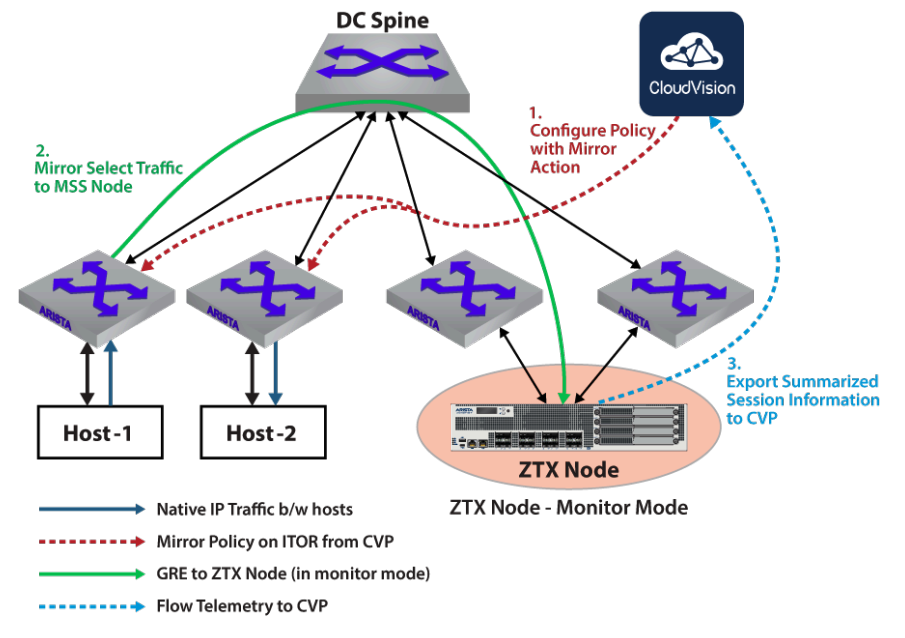

Source: [arista.com](https://www.arista.com/assets/data/pdf/user-manual/um-books/MSS-Deployment-Guide.pdf)

The ZTX monitor comes in two flavours, a physical appliance (ZTX-7250S-16S) and a virtual appliance. I will use the virtual appliance, vZTX, in my lab. vZTX can run on ESXi or KVM. In my lab I am using Proxmox which is KVM. Choosing between the physical or virtual in a production environment comes down to scale and performance. 

*For more information on the ZTX deployment head over [here](https://www.arista.com/assets/data/pdf/ZTX-7250S-Deployment-Guide.pdf), it covers both the ZTX and vZTX and includes different supported toplogies.*


There are some initial configurations that needs to be in place for the ZTX to work as intended, the steps below will go through these steps. Here are the things that needs to be done:

- Create the virtual machine in Proxmox with correct configuration so the CloudEOS image will boot
- Moving the CloudEOS image into monitor mode
- Basic configurations like username/password for SSH access and management
- Out of Band Management interface
- Peer to Peer link betwen the vZTX appliance and TOR switches (in my case my only 720XP).
- Loopback interface
- Some static routes (dynamic routing is also possible see [this](https://www.arista.com/assets/data/pdf/ZTX-7250S-Deployment-Guide.pdf)) for the loopback addresses between vZTX and TOR switch
- DNS
- NTP & Timezone
- Onboarding the vZTX to CloudVision. Several of the step above can be configured and provisioned by CloudVision.

#### Creating the virtual machine in Proxmox

To get started with the vZTX appliance I have downloaded the **CloudEOS64-4.35.0F.qcow2** image and **Aboot-veos-serial-8.0.2.iso** from arista.com and uploaded the qcow2 image to my Proxmox /tmp folder and the iso image to my ISO Images storage.

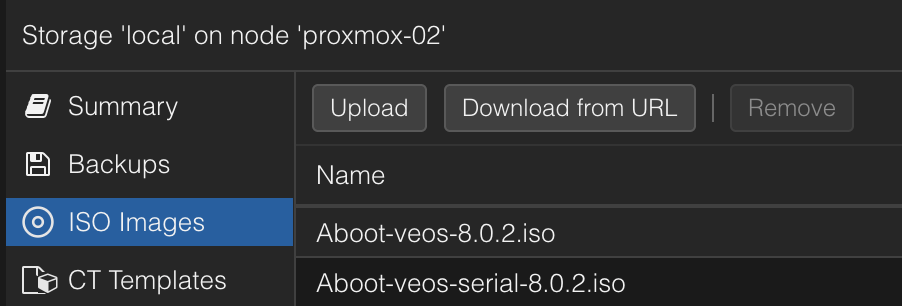

 

Then I created a virtual machine in Proxmox with the following configurations *(I dont use more than two of the nics. 1 for mgmt and 1 for dataplane)*.

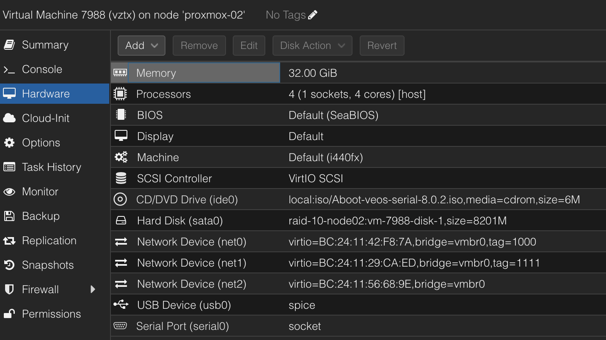

Notice the Serial Port, this must be added to the VM otherwise it will not boot. 

The harddisk was imported using the following command:

```bash
qm importdisk 7988 /tmp/CloudEOS64-4.35.0F.qcow2 raid-10-node02 -format raw
```

*raid-10-node02 is my storage*



This is a lab, if using the vZTX in production there are some requirements that needs to be in place:

SR-IOV is a MUST in production (not supported otherwise), but in my lab I did not have any free NICs for this purpose so I had to use VIRTIO. Again, this is in my lab, and performance is not an absolute must. Unless I do something that limits my Internet speed, then I will have some explaining to do for my kids :smile:



#### Moving the CloudEOS to Monitor Mode

When the vZTX has been configured in Proxmox its time to power it up. It will boot up with a very simple config. Username defaults to admin, and there is no password or was the password admin? Dont remember.

Before I can use the CloudEOS image as my ZTX appliance the first thing that needs to be done is to move the CloudEOS into monitor mode after first boot. This is done by running the following commands:

```bash
# Verify the veos-config before
vZTX# bash cat /mnt/flash/veos-config
MODE=sfe
vZTX#
```

Now perform the configuration:

```bash
vZTX# configure
vZTX(config)# firewall distributed instance
vZTX(config-firewall-distributed-instance)# no disabled
vZTX(config-firewall-distributed-instance)# end
vZTX# write
vZTX# reload
```

When the switch boots back up login again and verify veos-config after the config above:

```bash
# Verify the veos-config after
vZTX# bash cat /mnt/flash/veos-config
MODE=sfe
platformRuby=True
maxDatapathCores=2
vZTX# 
```

Thats it.

#### Basic configurations - Management1-p2p link-loopback

Now I can proceed to do the other configurations like mgmt interface, hostname, DNS, NTP and p2p link to my 720XP switch. See below for my running-config:

```bash
andreas-ztx1#show running-config
! Command: show running-config
! device: andreas-ztx1 (CloudEOS, EOS-4.35.0F-cloud)
!
! boot system flash:/CloudEOS.swi
!
no aaa root
!
username admin privilege 15 role network-admin secret sha512 <hash-redacted>
!
management api http-commands
   no shutdown
   !
   vrf MGMT
      no shutdown
!
daemon TerminAttr
   exec /usr/bin/TerminAttr -smashexcludes=ale,flexCounter,hardware,kni,pulse,strata -cvaddr=URL -cvauth=token-secure,/tmp/cv-onboarding-token -taillogs -cvvrf=MGMT -cvsourceintf=Management1
   no shutdown
!
switchport default mode routed
!
no service interface inactive port-id allocation disabled
!
transceiver qsfp default-mode 4x10G
!
service routing protocols model multi-agent
!
kernel software forwarding ecmp
!
hostname andreas-ztx1
ip name-server vrf MGMT 10.100.1.7
ip name-server vrf default 10.100.1.7
!
spanning-tree mode mstp
!
system l1
   unsupported speed action error
   unsupported error-correction action error
!
clock timezone Europe/Oslo
!
vrf instance MGMT
!
interface Ethernet1
   no switchport
   ip address 172.18.111.2/24
!
interface Ethernet2
   no switchport
!
interface Loopback0
   ip address 10.255.1.11/32
!
interface Management1
   description management
   vrf MGMT
   ip address 172.18.100.201/24
!
firewall distributed instance
   no disabled
!
ip routing
no ip routing vrf MGMT
!
ip route 0.0.0.0/0 172.18.111.1
ip route vrf MGMT 0.0.0.0/0 172.18.100.2
!
arp aging timeout default 180
!
ntp local-interface vrf MGMT Management1
ntp server vrf MGMT 10.100.1.7 prefer
!
end
```

Before onboarding the vZTX to CloudVision I did all the above configurations except:

```bash
!
daemon TerminAttr
   exec /usr/bin/TerminAttr -smashexcludes=ale,flexCounter,hardware,kni,pulse,strata -cvaddr=URL -cvauth=token-secure,/tmp/cv-onboarding-token -taillogs -cvvrf=MGMT -cvsourceintf=Management1
   no shutdown
!
```

The TerminAttr config will be done as part of the CloudVision onboarding process. Just follow the guide in CloudVision.

The documentation is not stating that the Management interface MUST be in the default VRF, I created a dedicated MGMT vrf and placed it there. That is the only VRF I have configured. Then I configured interface Ethernet1 as the p2p link to my Arista 720XP switch, and a Loopback0 interface. This loopback interface will be used later when I configure MSS Monitor object in CloudVision later. Then a default route in the default VRF using my 720XP p2p link as gateway. I used a /24 subnet for these p2p links which is unnecessary. 

Now my vZTX is ready configured with its necessary configuration and I can onboard it to CloudVision. 

#### Onboarding the vZTX to CloudVision

Go to Device and Inventory in Cloudvision and click on *+ Onboard Device*.

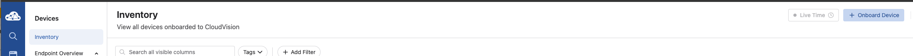

Then follow the steps outlined there:

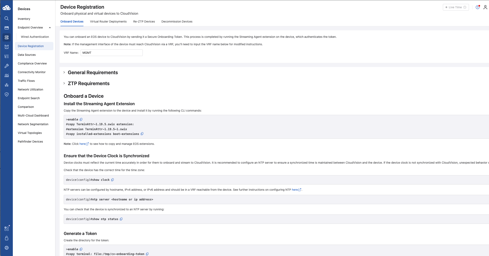

This may also be done using your preferred ZTP/bootstrap approach. 

*Under the General Requirements it says: *Have the Streaming Agent extension installed (minimum version 1.19.5). Click [here](https://www.arista.com/en/support/software-download) to download the Streaming Agent extension. If you already have the right minimum terminattr version on your EOS this can be skipped*

My vZTX onboarded to CloudVision together with my 720XP:

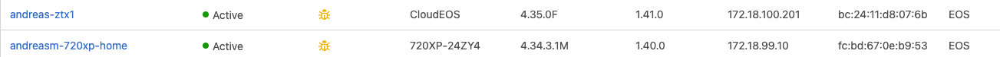

 

### My Arista 720XP switch

On my Arista 720XP there is very little to do except to configure the necessary connectivity between the vZTX and the 720XP switch. For that I created a vlan interface using VLAN 1111:

```bash
interface Vlan1111
   description vZTX_tunnel_interface
   ip address 172.18.111.1/24
!
interface Loopback0
   description vZTX_tunnel
   ip address 10.255.1.10/32
!
ip route 10.255.1.11/32 172.18.111.2
```

A Loopback0 interface, a static route pointing to the vZTX Loopback0 interface (Dynamic routing is also possible). Thats it for the actual switch configuration needed on the 720XP. 



I got this error when I tried to apply certain rules in MSS on my 720XP:

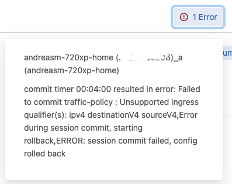

After some more reading in this [doc](https://www.arista.com/assets/data/pdf/user-manual/um-books/MSS-Deployment-Guide.pdf) on page 13, one need to add this config:

```bash
traffic-policies
   transforms interface prefix common source-destination

```

This can easily be added as part of your static configs in CloudVision. It will not be overwritten by MSS. It will be preserved.



Next up is CloudVision preparations


#### Connection between vZTX and my 720XP

With the above configurations done on both the vZTX and my 720XP it looks like this:


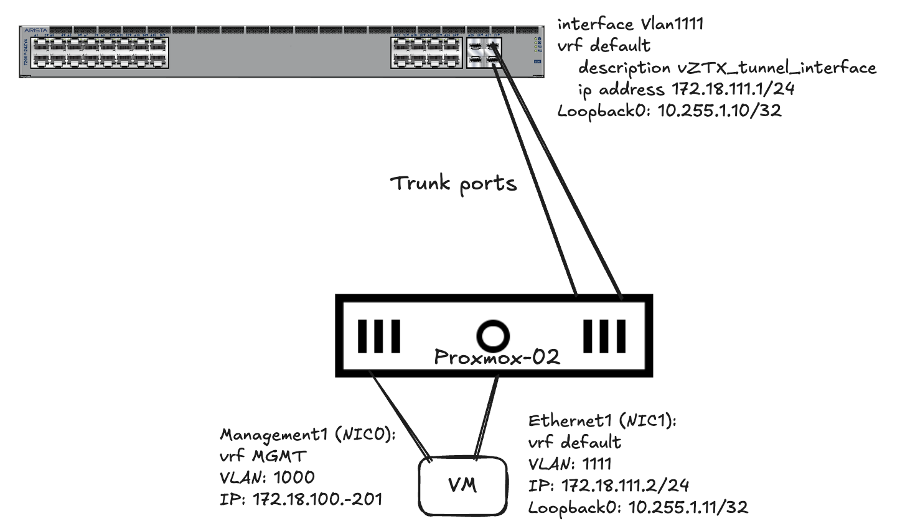

```bash
#vZTX config:
interface Ethernet1
   no switchport
   ip address 172.18.111.2/24
!
interface Loopback0
   ip address 10.255.1.11/32
!
ip route 0.0.0.0/0 172.18.111.1

#Arista 720XP switch:
interface Vlan1111
   description vZTX_tunnel_interface
   ip address 172.18.111.1/24
!
interface Loopback0
   description vZTX_tunnel
   ip address 10.255.1.10/32
!
ip route 10.255.1.11/32 172.18.111.2

```


### CloudVision preparations

The necessary MSS specific configurations on both my vZTX appliance and Arista 720XP switch will be taken care of by the MSS Service Studio. I just need to follow some initial steps to get the devices onboarded to be "MSS ready" with the MSS Service Studio.

Everything MSS related is managed by Studios and Workspaces. When the initial config has been done with the MSS Studio, the rest can be done from the Network Security section in CloudVision:

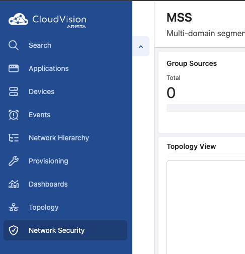

To make sure all the MSS related features in CloudVision is readily available in the UI they may have to be enabled. Head over to settings in CloudVision and Features and enable the following features:

- Network Security- MSS
- Network Security - Fine-Grained Policy Monitor Loading
- Workspace Island - optional

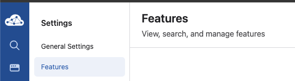

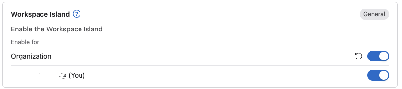

Workspace Island is very useful when there are many changes that needs to be made, building, rebuilding and quickly see changes in your workspace is always there in the bottom of the screen. Readily available when you need to see what impact your changes has done etc.

Screenshot of the Island...


Then of course the MSS related features in CloudVision (if not already enabled). 

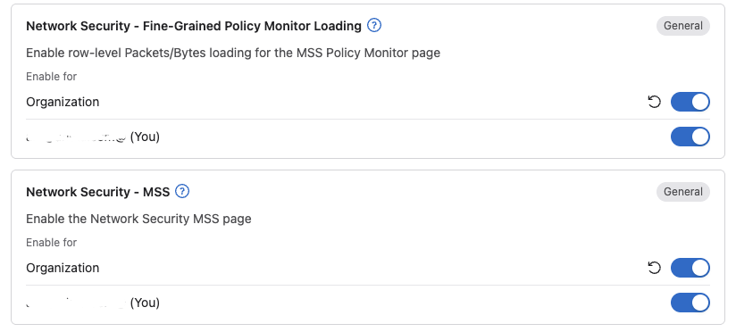


I have already onboarded my 720XP switch into CloudVision and I have also onboarded my vZTX appliance into CloudVision with minimal (but necessary) configurations done (see previous chapter on preparing the vZTX). 

I have decided to put all MGMT relevant stuff in a separate MGMT vrf. 


Now I need to do the initial config to make my vZTX and 720XP MSS "ready". This involves the Studio called "MSS Service" under Provisioning. 



*As I am sharing the CvaaS instance with my colleagues I like to clone the Studios to my "own" Studios. Then I can do all the changes in my own Studios with my own selected devices without disrupting any of their studios and devices.* 

*With the MSS Service Studio, this will not work.* 



Select the default "MSS Studio" and complete the two tasks needed there:

1. Add a Security Domain
2. Add a Monitor Object

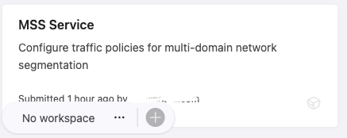

#### Security Domain and Monitor Object

The first that needs to be added to the Studio is the device selection. Add your devices (in my case my one 720XP) here under Device Selection:

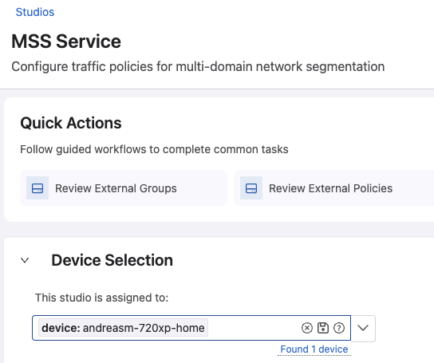


Then add a Security Domain: click *+Add Security Domain*


Then type in the name of the domain and click plus to create:

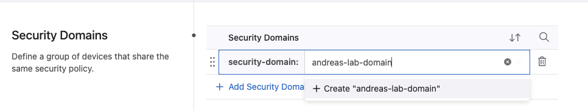

We need to click the > to add the devices we want to be part of the Security Domain. The Security Domain is the collection of switches that you want to enable a set of shared rules and policies on. This can be a site, building, branch, edge or datacenter. We can have several security domains, assigned to different sets of switches.

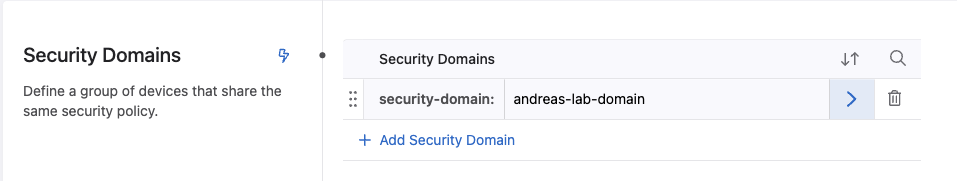


Click on the Security Domain name: security-domain:andreas-lab-domain and select the device from the dropdown menu:

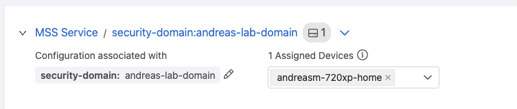

Go back by clicking at MSS Service in the blue text.

Next step is to add a Monitor Object:

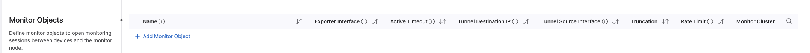

Click + Add Monitor Object. This is quite straightforward. It will use the loopback interfaces configured on both the vZTX appliance but also the TOR switches that is part of the Security Domain. So in my lab I will use this information:

- Name: andreas-vztx
- Exporter Interface: loopback0
- Active Timeout: Default 1800000
- Tunnel Destination IP: 10.255.1.11 (the loopback0 interface ip of my vZTX)
- Tunnel Source Interface: looback0 (the loopback interface configured on all the tor switches in the security domain. Must be same interface on all)
- Rate Limit: Default 100000

Then under Monitor Cluster Click "View" and add the Monitor Node: 

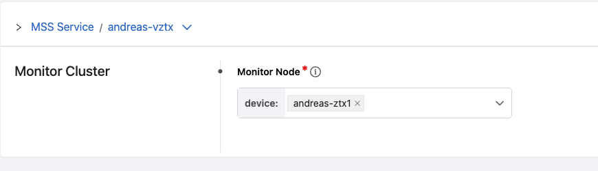


Go back by clicking on MSS Service in the blue text.

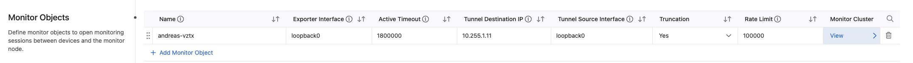

Now a very important task. When you are back in the MSS Studio. Go all the way upp and look for the blue lightning symbol.

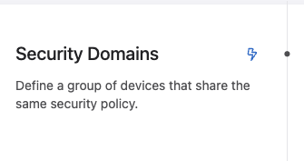

Click it! ( I assure you, its not dangerous)

It will start a wheel for a couple of seconds and a green notification will update you when it is ready.

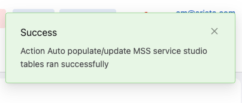


Do a *build* on the Workspace Island:

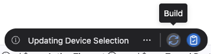


Then do a *Review*:

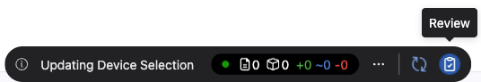

Submit the Workspace:

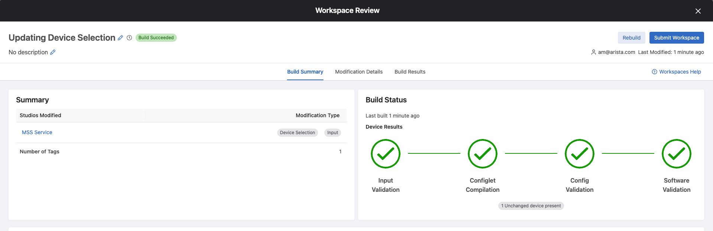


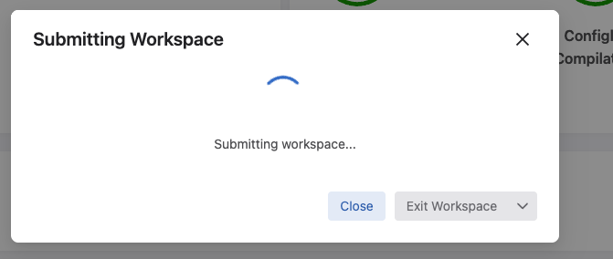


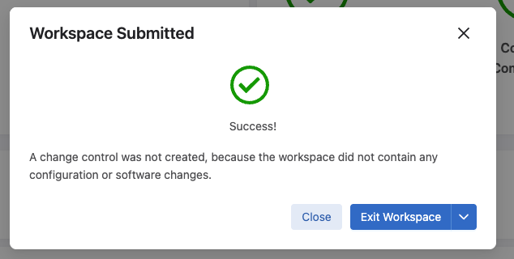


Now, one can head over to Network Security and start work some magic with MSS

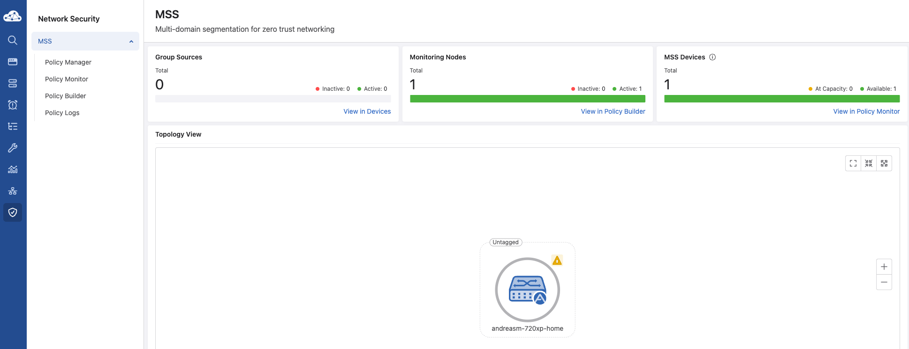

Its now the fun begins.


### My lab

For better context, below is how my lab environment looks like.

My lab consists of two Proxmox servers forming a cluster using a qdevice (RPi) to form a quorom. These servers are both connected to the same Arista 720XP switch. My perimeter firewall is a virtual PfSense running as a virtual machine on the Proxmox servers. 

The Arista 720XP holds all my VLANs, it does routing when routing is needed between VLANs, where gateway of last resort is my PfSense firewall. I dont do much filtering between my vlans through the PfSense except a wifi guest network. 

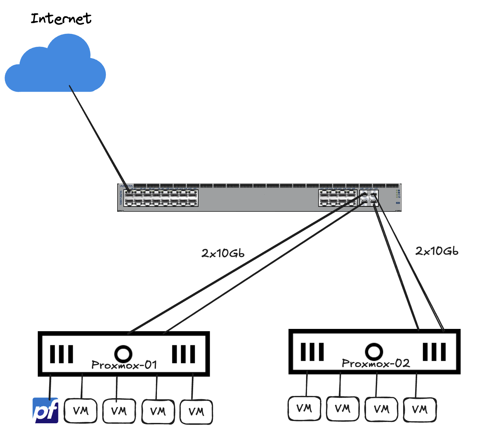

That means I have a bunch of virtual machines placed in different vlans serving different needs, they are free to communicate with each other, within the same VLAN but also VLAN to VLAN. In addition to the virtual machines, I also have a bunch of physical devices like wired devices and wifi devices that also freely communicate through my 720XP switch. 

This is something MSS can be tasked to do something about.

## Network Security in CloudVision

There is a dedicated section for MSS in CloudVision called *Network Security*. This is where most tasks related to MSS like creating policies, rules, services, groups, monitor policies and devices are administered. When entering *Network Security* section in CloudVision I will be greeted by the MSS Dashboard. This will give me a quick glimpse of my MSS "estate". From the amount of registered Monitoring Nodes and MSS Devices (MSS "enabled" switches) to events and policies related to these devices:

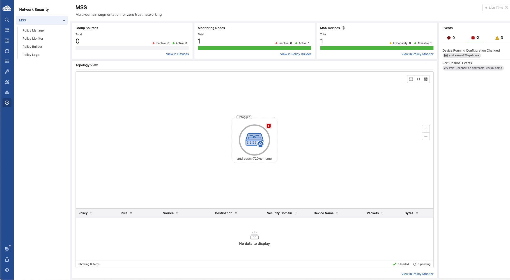


I can go into Policy Manager to find more relevant details about my MSS Devices and Monitor Nodes. 

Under Domains I find my Security Domain *andreas-lab-domain* with my device selected:

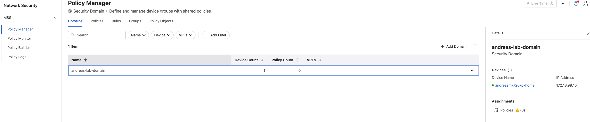

And under Policy Manager, Policy Objects I find my Monitor Object with my vZTX appliance assigned as Monitor Node:

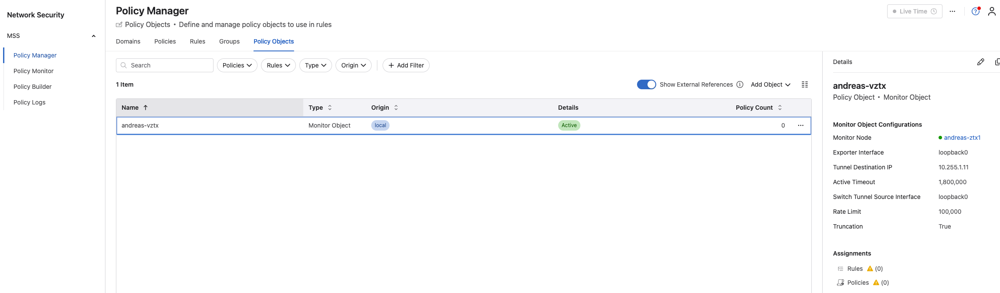

But no rules and policies yet.

Let me quickly go over the different things in the Network Security view and explain what they are. 


### Policy Manager

In the Policy Manager there are several sections:

- Domains
- Policies
- Rules
- Groups
- Policy Objects

#### Domains

Under *Domains* I can view my Security Domains, see details of the Security Domains which devices are part of the domain and any Policy assignements.

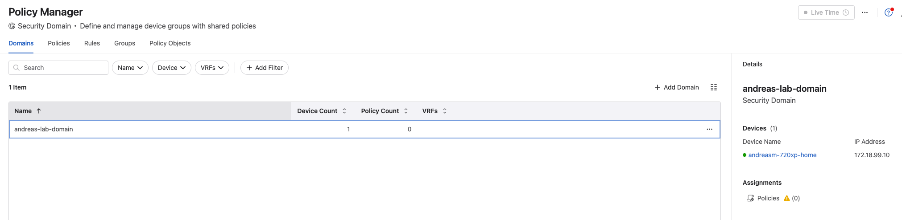

#### Policies

In *Policies* is where we define our rules to be applied. I can have many policies, but I can also have many rules in a policy.  A policy is a section where we define the rules should be "applied to", what objects the rules involve. Like one do under NSX, a policy section in the distributed firewall is where the rules for an application or infrastructure services are defined. This is the same. A policy is a section where I define where I want the rules to be applied. A policy is typically named after what its intention is, eg *application A* or *infrastructure_services*. The only difference here with MSS Policy is I define the Policy per **VRF**. 

From the NSX-T manager:

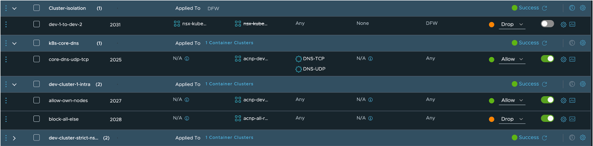

 When I create a policy in MSS, I give it a name, a description and map it which security domain and respective VRF in that domain. 

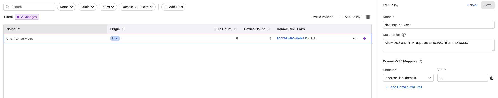

But there are still no rules yet. 

#### Rules

Under the Rules section is where I create and define the rules I want. When the rule has been created I can also assign the rule(s) to a policy, which is done under the Policy section.

A rule can look like this:

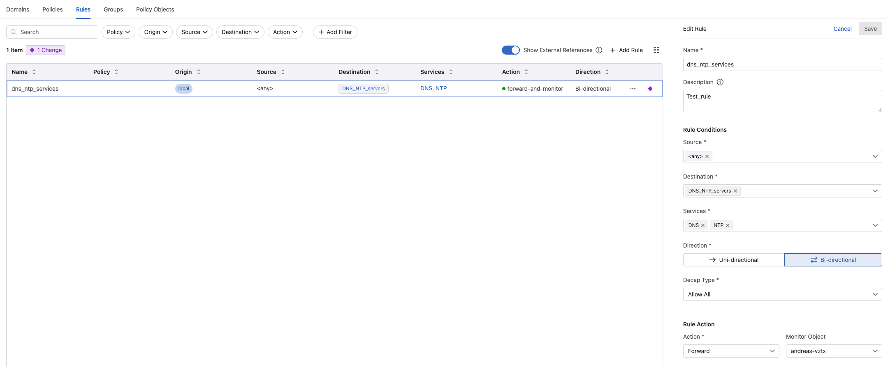

I give the rule a meaningful name, a description. Then I define what the *Source* is, which could be static ip-groups, dynamic groups from 3rd party sources like vCenter, ServiceNow etc. The same is true for the *Destination*. Then *Services* which services should this rule involve. These are ports and protocols created and defined under Policy Objects (later). Which *Direction* you are interested in, *Uni-directional* or *Bi-directional*. Then it is *Decap Type*:

- **Decap Type**: This configuration determines how VXLAN encapsulated traffic is decapsulated, or has its VXLAN header removed. Select from the available options.:
  - **Allow All**: Applies to traffic after its VXLAN header is removed, enabling full visibility into the original workload data
  - **VXLAN Decap Only**: Dictates that traffic must be decapsulated of its VXLAN header before further processing, revealing the original workload data
  - **No VXLAN Decap**: Applies to traffic without removing its VXLAN header, limiting visibility to outer network details

** *Source: CloudVision Help Center*

Under *Rule Action* I can select Drop, Forward or Redirect. 

Under Monitor Object I can tell MSS to create a "monitor" rule which will mirror the traffic to my vZTX for visibility but also rule recommendations. 

When I have created a rule I can go to Policies and assign the rule to a policy like this:

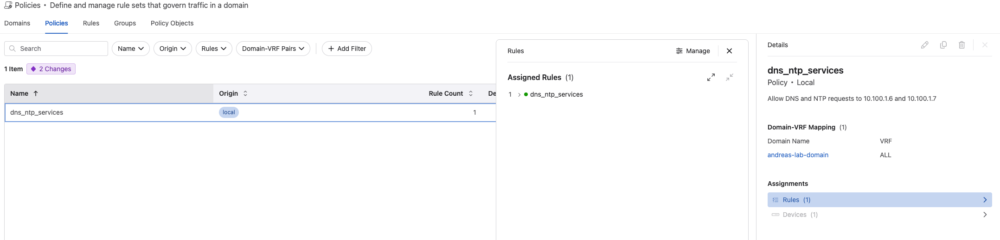


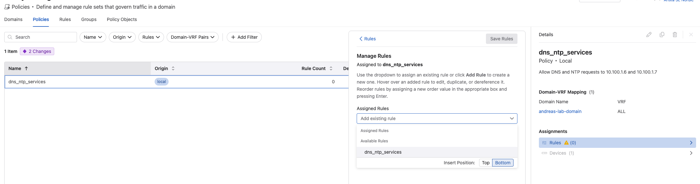


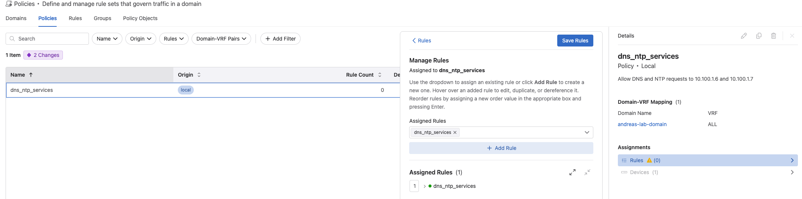


#### Groups

Under *Groups" I can add my static IP groups. Subnets, host ip addresses that I can use in my rules.

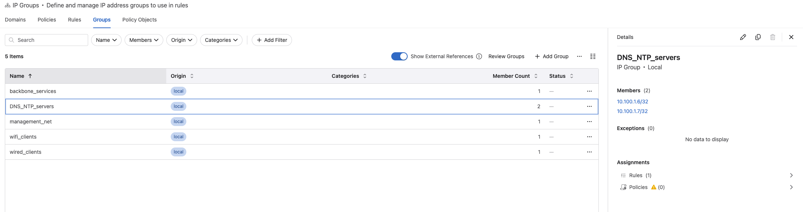

I only have static groups, but MSS do support dynamic groups generated from sources like vCenter, ServiceNow etc. When I have created my groups, I can assign them to categories. This will improve how the rule recommendation creation later is done. To create categories and assign them click here:

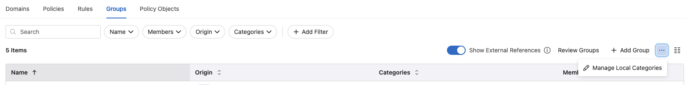

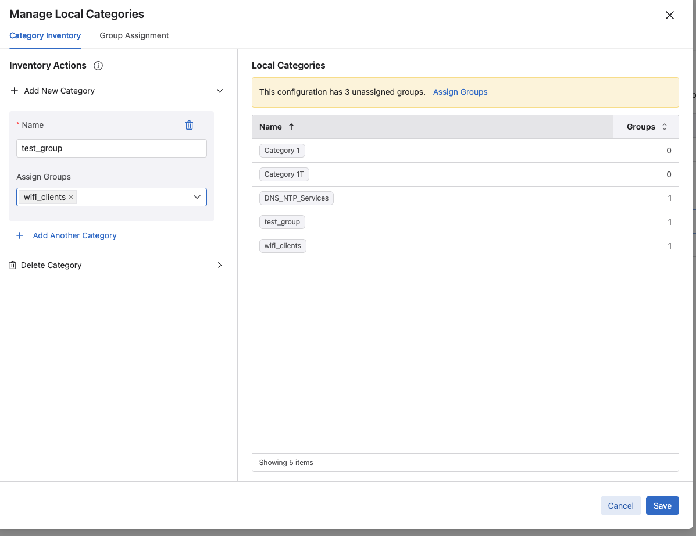

I created two categories and assigned them to their ip group respectively:

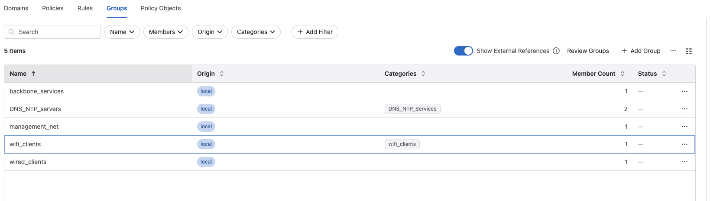


#### Policy Objects

Under Policy Objects is where I can add and define my services, redirect object (external firewall) to be used in my rules. 

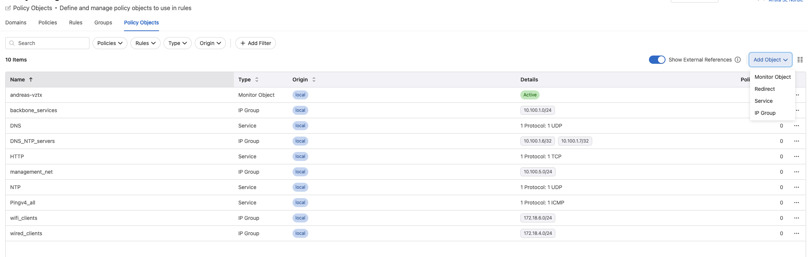

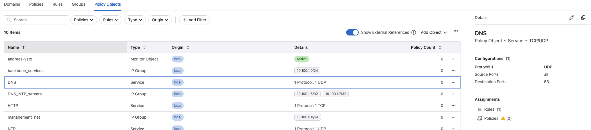


### Policy Monitor

In the Policy Monitor view I can get the status of my defined policies, but also the state of my MSS enabled devices and utilization:  

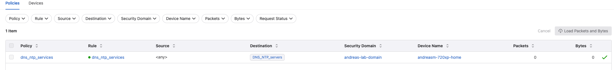

Monitor devices:

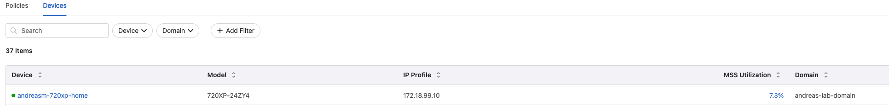

### Policy Builder

If have created a rule with a Monitor Object, I can view the policies being analyzed in here. 

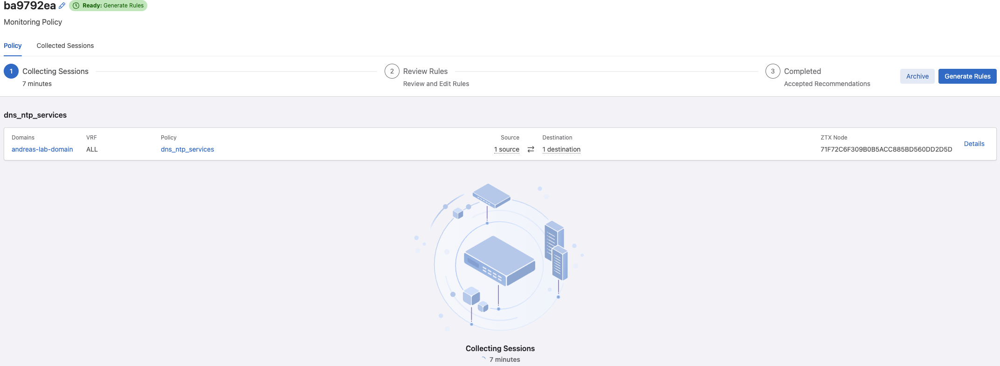

This is a really neat feature as it can recommend rules based on the discoveries. If I have a look at the Collected Sessions for my one policy:

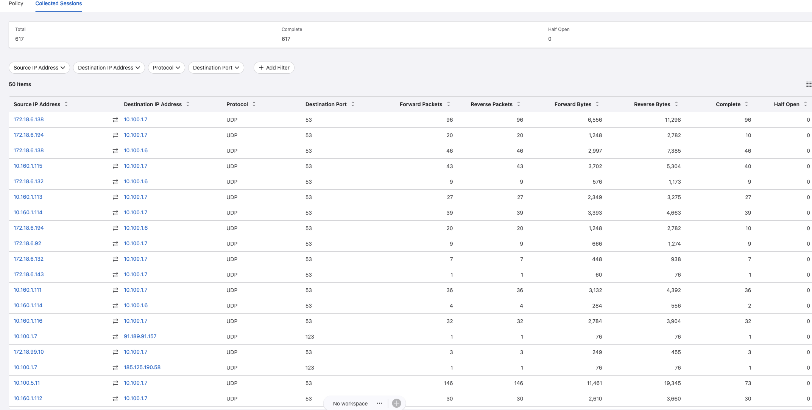

It does a really good job discovering both DNS and NTP requests to my two backed servers hosting DNS and NTP. This collection process should go for a while to discover as much as possible, and if I am satisfied I can go back to the Policy View again and let it create some rule recommendations.

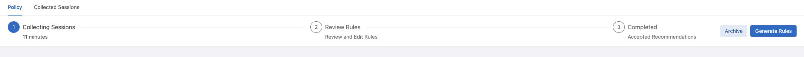

Below is just a quick suggestion of what it has discovered. More on this later

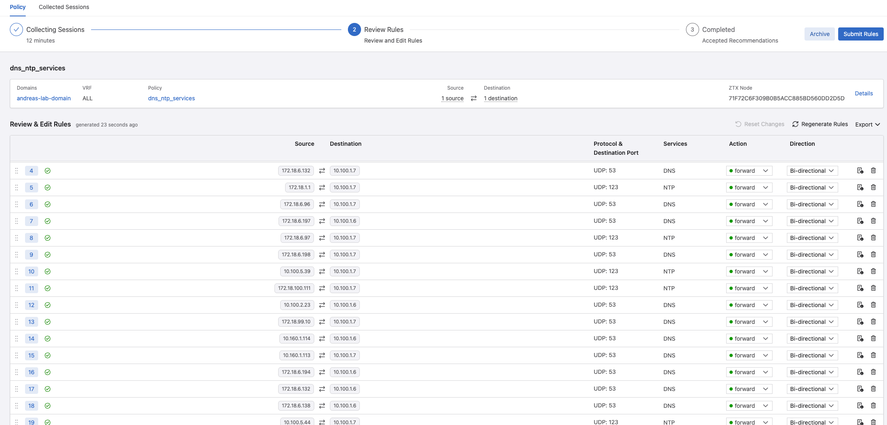

I can even have a look at the collected session per flow:

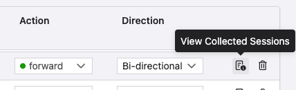

To see what it has based this rule on per flow.

Now I can click submit rules and it will create a workspace with the suggested configurations to be sent to my switches. 


## Creating network policies and rules

Now that I have gone through how things work with MSS and CloudVision, I can finally create some policies. 

I will focus on doing it simple to begin with and create two policies. One policy where I allow DNS and NTP from a specific subnet to my two DNS,NTP servers and let the Policy Builder generate a rule for that. 

My second policy will be focused on a simple http service running on two different  linux VMs, an application server on another VM the webserver are depending on. I will create a monitor policy to discover what they are doing between themselves and let Policy Builder generate some recommended rules. I will block unnecessary traffic between them.

Then I will also showcase that Arista MSS can even be used to isolate Virtual Machines hosted on the same physical hypervisor on the same VLAN. In my case I am using Proxmox with Linux Bridge. 

### First rules - DNS and NTP policy

From the Policy Manager, Policies view I have created this Policy:

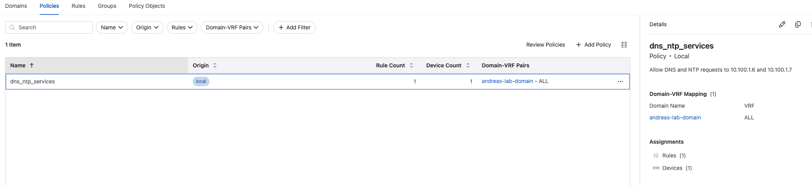

I have created this rule under the Rules view and assigned it to my above policy:

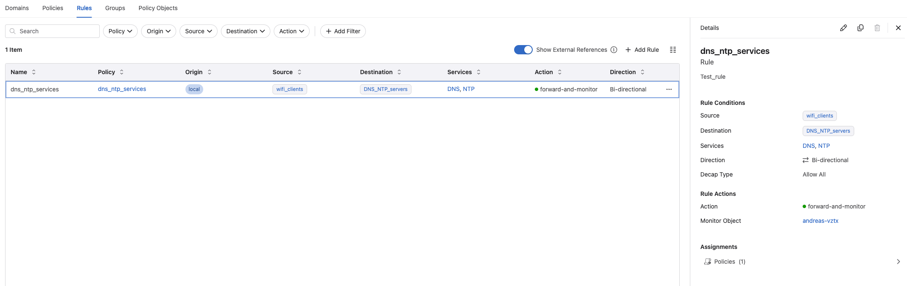

In this rule I using the following services and groups I have created under Policy Objects:

- Source: Static IP group *wifi-clients* = 172.18.6.0/24
- Destination: Static IP group *DNS_NTP_servers* = 10.100.1.6/32, 10.100.1.7/32
- Servic DNS: Protocol UDP, destination port 53, source port all
- Service NTP: Protocl UDP, destination port 123, source port all
- action is forward
- monitor object is my vZTX appliance. 

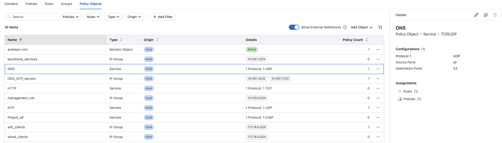

So far no configuration has been done on my switch, nor my vZTX monitor node. The only traffic policy configuration is my *transform interface prefix common source-destination*. 

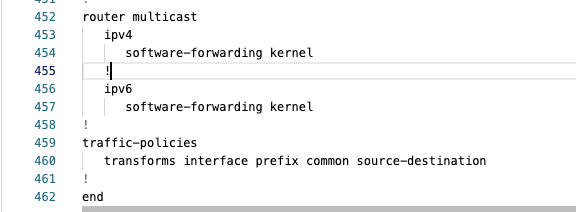

Now I can go ahead and use the Worspace Island to build the configuration for me and have a look at what the changes will be.

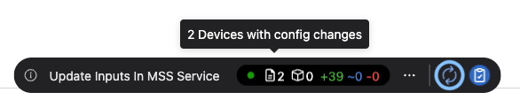

There are 2 devices with proposed config changes. Lets build this workspace and see what these changes are:


The vZTX gets some new configuration, the gre tunnel to my 720XP switch. 

My 720XP gets these configurations:

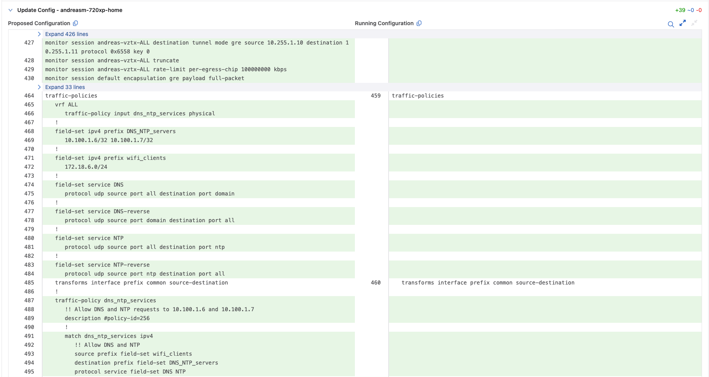

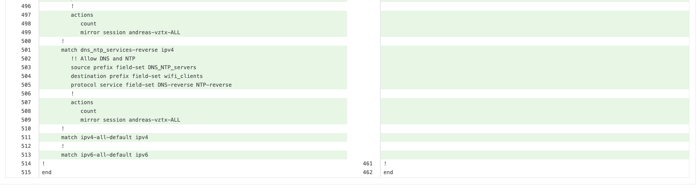

And above is the configurations it proposes for my 720XP. Ok lets submit this workspace and run the automatically created change control. 

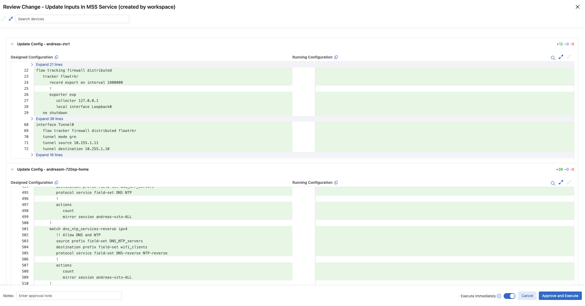

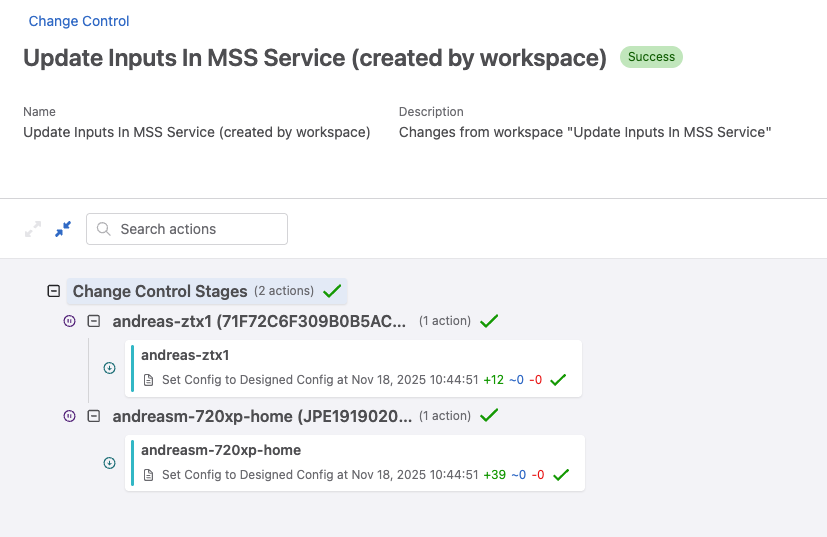

Now lets head over to the Policy Builder and monitor the collected sessions:


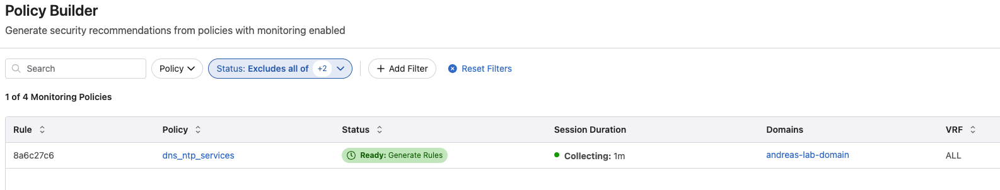

It has already captured both NTP and DNS requests:

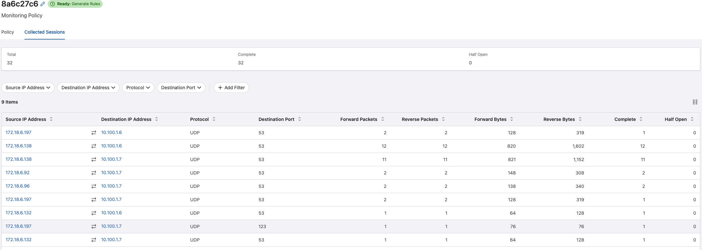

Looking good. Now I cant wait anymore. Let Policy Builder generate some rules


When clicking on the Generate button I can now select which categories it should base it rule generation on. I already have created my two categories which involves my source group and destination group. 

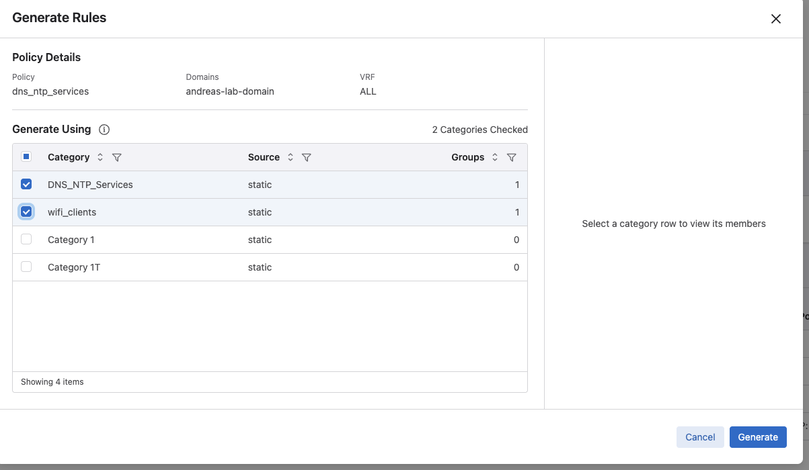

By selecting these two relevant categories, the rule proposal will be much more optimized in how it creates the rules. Lets have a look:

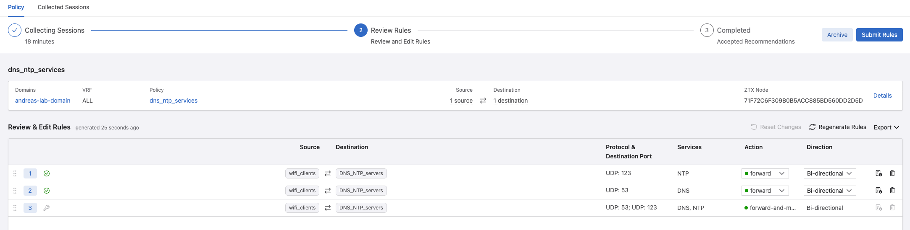

Yes, it no longer proposes a rule based on every IP it discovers, but the groups assigned to the categories. 

Lets see what these rules will look like in terms of configuration changes on my switch. Click submit and then build on the Workspace Island:

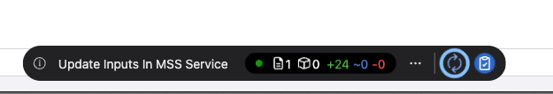

24 lines added to the config. That is a lot more effecient than several hundreds of lines if going by every source IP. 

Lets have a look at the review:

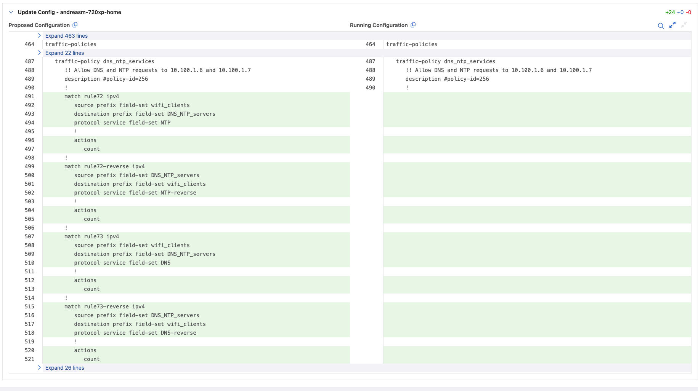

These are the changes. Submit and Approve the Change Control job.

In Policy Builder my two rule recommendations:

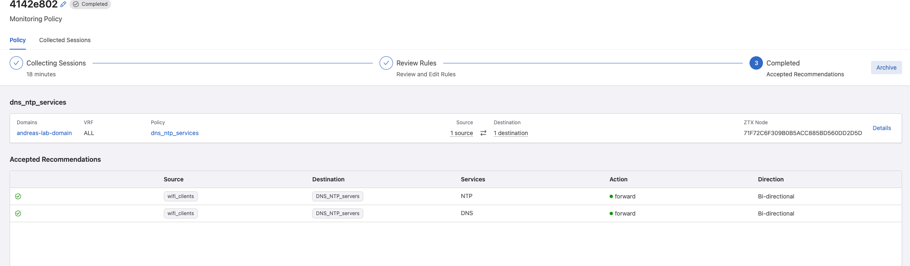

But there, there is a but. I noticed it added these two rules in addition to my manually create monitor rule, see the last rule. 


I can make it much more optimized in terms of the number of configuration lines on my switch by going back to Rules under Policy Manager, remove it from my policy and delete it:

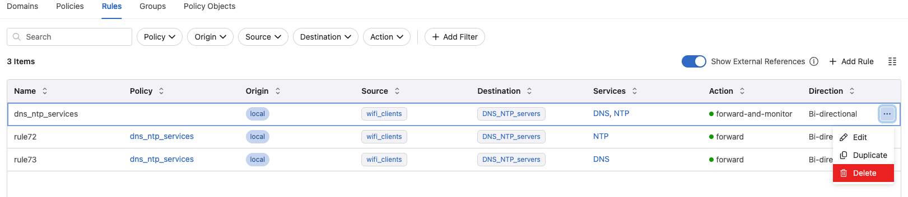

This removes further 20 lines, why? Because I also remove the monitor rule. If I still want to monitor the newly created rules i need to add a monitor to them. 


When it comes to the name of the rules, there seems to be no option to name them manually except going back and rename them after they have been applied created. 

Lets see the changes:

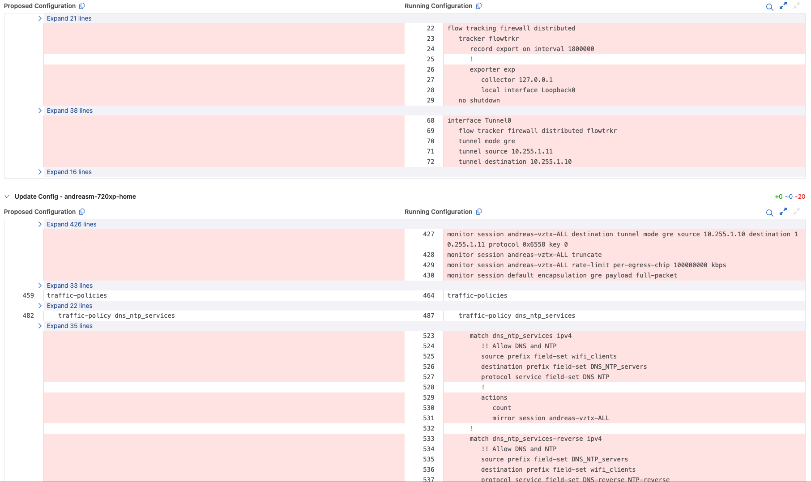

 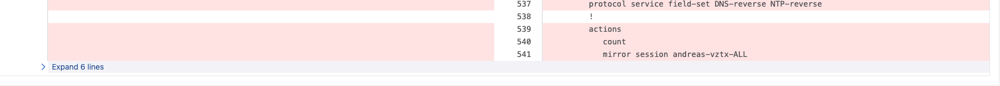


In my switch now I have this configuration:

```bash
traffic-policies
   vrf ALL
      traffic-policy input dns_ntp_services physical
   !
   field-set ipv4 prefix DNS_NTP_servers
      10.100.1.6/32 10.100.1.7/32
   !
   field-set ipv4 prefix wifi_clients
      172.18.6.0/24
   !
   field-set service DNS
      protocol udp source port all destination port domain
   !
   field-set service DNS-reverse
      protocol udp source port domain destination port all
   !
   field-set service NTP
      protocol udp source port all destination port ntp
   !
   field-set service NTP-reverse
      protocol udp source port ntp destination port all
   transforms interface prefix common source-destination
   !
   traffic-policy dns_ntp_services
      !! Allow DNS and NTP requests to 10.100.1.6 and 10.100.1.7
      description #policy-id=256
      !
      match rule72 ipv4
         source prefix field-set wifi_clients
         destination prefix field-set DNS_NTP_servers
         protocol service field-set NTP
         !
         actions
            count
      !
      match rule72-reverse ipv4
         source prefix field-set DNS_NTP_servers
         destination prefix field-set wifi_clients
         protocol service field-set NTP-reverse
         !
         actions
            count
      !
      match rule73 ipv4
         source prefix field-set wifi_clients
         destination prefix field-set DNS_NTP_servers
         protocol service field-set DNS
         !
         actions
            count
      !
      match rule73-reverse ipv4
         source prefix field-set DNS_NTP_servers
         destination prefix field-set wifi_clients
         protocol service field-set DNS-reverse
         !
         actions
            count
```

Now, I do not have any drop rules in place. So my above rules did not make it more strict in my environment. Lets create some drop rules too. For that I will use another environment involving three virtual machines where two of them works as a web-servers hosting a simple webpage and the third as the application server serving the web-pages. 

### Application Policy - Web and Application Servers

In this scenario I will create an "application" focused policy. It will involve the three above mentioned virtual machines. I will apply rules allowing all of them to reach DNS and NTP, the clients will be allowed to reach the two web-servers only on HTTP while the two web-servers are not allowed to communicate with each other at all. But both web servers are allowed to reach the appserver1 on TCP:4567. All else is dropped.

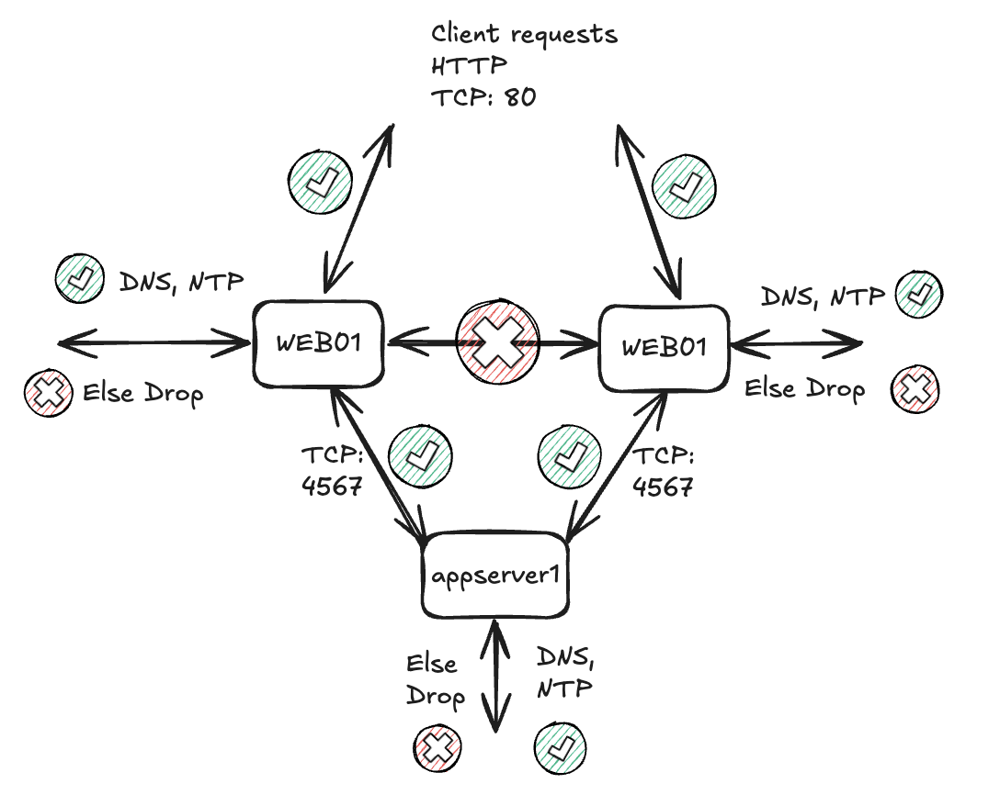


Before I start microsegmenting the web-application I have created a simple monitor rule to catch whats going on, presuming I dont know anything about the application and its dependencies:

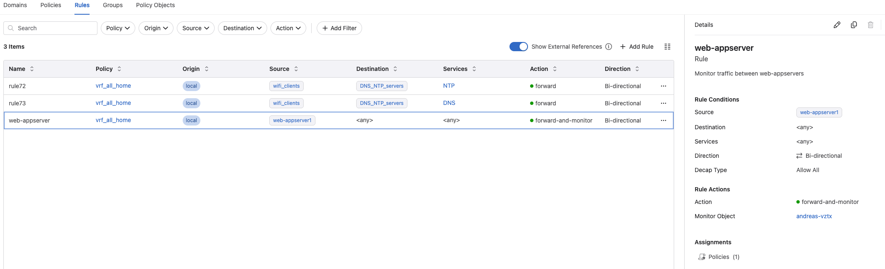

This rule is very simple, it selects the three servers web01, web02 and appserver1 as source, destination and services are both any any.

Lets see what the Policy Builder discovers:

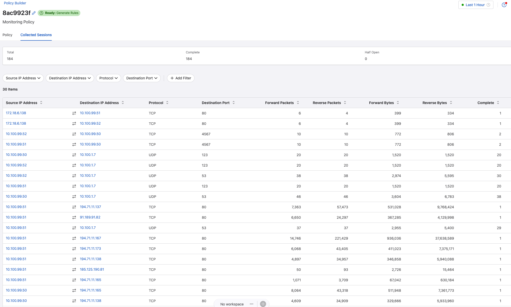

I can see they are doing NTP and DNS requests to my my DNS servers, HTTP requests coming from a wifi client, both the web-servers requests the appserver1 over tcp 4567 and some HTTP to the internet, Ubuntu repositories for updates. Will I allow that? Not now, they can stay offline at the moment. They are too fragile to be connected to the big Internet anyways. 

Okay, lets lock things down.

Based on the collected sessions I am pretty sure what this application needs, so I will create rules supporting that. Below is the rules I have created:

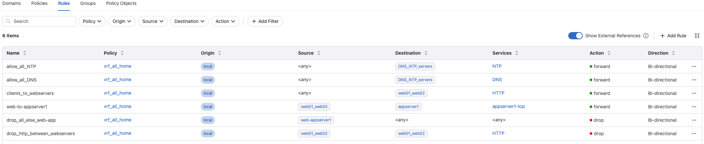

And the order they are placed and enforced:

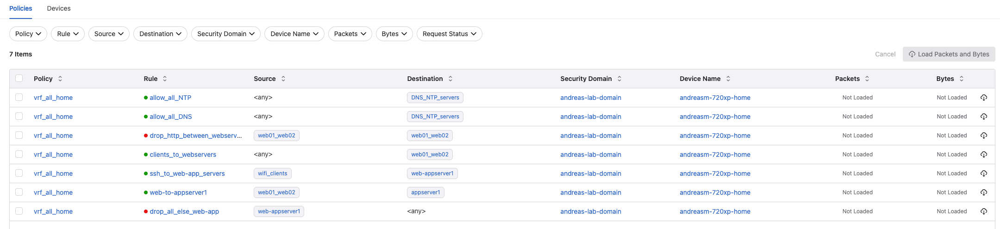

In the following groups:

- web01_web02 = *10.100.99.51/32* & *10.100.99.52/32* (web01 and web02)
- appserver1 = 10.100.99.50/32 (appserver1)
- Web-appserver1 = *10.100.99.51/32*, *10.100.99.52/32* (web01, web02) and 10.100.99.50/32 (appserver1)

Now lets see if the rules works as intended. As I only have allowed HTTP to the web servers, and nothing to the appserver1, except http the application specific TCP port from the web server to the application server I have no option to do SSH to the servers. Only way to reach them now is through console. 

 

```bash
#SSH to Web02
➜  ~ ssh andreasm@10.100.99.52
ssh: connect to host 10.100.99.52 port 22: Operation timed out
```

Well that was a first test.. It is not possible to SSH to any of the 3 involved servers. 

Lets create an allow rule only for SSH to all 3 servers to make it more comfortable to manage and access instead of console. 

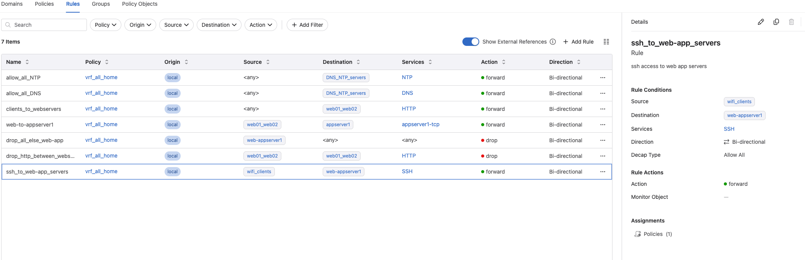

Adding this rule, I am allowing my laptop which is on wifi to connect directly to the web01, web02 and appserver1 via SSH.

Now some tests:

Can I reach any of the three servers from any other subnet than my wifi-client subnet?

```bash
# From my linux management server in subnet 10.100.5.0/24
andreasm@linuxmgmt10:~$ ssh 10.100.99.50 #appserver1
ssh: connect to host 10.100.99.50 port 22: Connection timed out
# From my laptop
➜  ~ ssh andreasm@10.100.99.51
andreasm@10.100.99.51's password:
Welcome to Ubuntu 22.04.3 LTS (GNU/Linux 5.15.0-87-generic x86_64)

 * Documentation:  https://help.ubuntu.com
 * Management:     https://landscape.canonical.com
 * Support:        https://ubuntu.com/advantage

  System information as of Wed Nov 19 01:30:16 PM CET 2025

  System load:  0.0                Processes:              112
  Usage of /:   45.6% of 14.66GB   Users logged in:        0
  Memory usage: 7%                 IPv4 address for ens18: 10.100.99.51
  Swap usage:   0%


Expanded Security Maintenance for Applications is not enabled.

255 updates can be applied immediately.
177 of these updates are standard security updates.
To see these additional updates run: apt list --upgradable

Enable ESM Apps to receive additional future security updates.
See https://ubuntu.com/esm or run: sudo pro status

Failed to connect to https://changelogs.ubuntu.com/meta-release-lts. Check your Internet connection or proxy settings


Last login: Wed Nov 19 10:39:59 2025
andreasm@web01:~$
```

By following the rules above, will I be able to reach the webpage on port 80 on both web01 and web02 from my laptop?

```bash
#From my laptop using ip 172.18.6.138
➜  ~ curl http://10.100.99.52 #web02
<h1>SUCCESS: Data retrieved from App Server (appserver1)</h1>
➜  ~ curl http://10.100.99.51 #web01 
<h1>SUCCESS: Data retrieved from App Server (appserver1)</h1>

```

 Yes, it seems so. And I can clearly see that both the webservers are allowed to reach the appserver1 over TCP 4567.

Can my laptop reach the appserver on TCP 4567?

```bash
# From my laptop
➜  ~ curl http://10.100.99.50:4567 #appserver1
curl: (28) Failed to connect to 10.100.99.50 port 4567 after 75003 ms: Couldn't connect to server
```

Can any of the three servers reach the internet?

```bash
# From appserver1
andreasm@appserver1:~$ ping 8.8.8.8
PING 8.8.8.8 (8.8.8.8) 56(84) bytes of data.
^C
--- 8.8.8.8 ping statistics ---
2 packets transmitted, 0 received, 100% packet loss, time 1021ms
# From web01
andreasm@web01:~$ ping 8.8.8.8
PING 8.8.8.8 (8.8.8.8) 56(84) bytes of data.
^C
--- 8.8.8.8 ping statistics ---
8 packets transmitted, 0 received, 100% packet loss, time 7172ms
```

 No, they cant.

Can they resolve?

```bash
# From appserver1
andreasm@appserver1:~$ dig nrk.no @10.100.1.7

; <<>> DiG 9.18.18-0ubuntu0.22.04.1-Ubuntu <<>> nrk.no @10.100.1.7
;; global options: +cmd
;; Got answer:
;; ->>HEADER<<- opcode: QUERY, status: NOERROR, id: 29638
;; flags: qr rd ra; QUERY: 1, ANSWER: 2, AUTHORITY: 0, ADDITIONAL: 1

;; OPT PSEUDOSECTION:
; EDNS: version: 0, flags:; udp: 1232
; COOKIE: 8b47dddfe7bae8dc01000000691dbd6fc58a61aa810fe209 (good)
;; QUESTION SECTION:
;nrk.no.				IN	A

;; ANSWER SECTION:
nrk.no.			20	IN	A	213.136.45.8
nrk.no.			20	IN	A	213.136.45.10

;; Query time: 40 msec
;; SERVER: 10.100.1.7#53(10.100.1.7) (UDP)
;; WHEN: Wed Nov 19 13:51:59 CET 2025
;; MSG SIZE  rcvd: 95
```

Yes, they can.

Can I do SSH from any of the web servers to the appserver1?

```bash
andreasm@web01:~$ ssh 10.100.99.50 #appserver1
ssh: connect to host 10.100.99.50 port 22: Connection timed out
```

No, that is not possible. But can I do SSH or TCP 80 between the web01 and web02?

```bash
andreasm@web01:~$ ssh 10.100.99.52
andreasm@10.100.99.52's password:
Welcome to Ubuntu 22.04.3 LTS (GNU/Linux 5.15.0-87-generic x86_64)

  System information as of Wed Nov 19 01:56:56 PM CET 2025

  System load:  0.0                Processes:              118
  Usage of /:   45.2% of 14.66GB   Users logged in:        1
  Memory usage: 8%                 IPv4 address for ens18: 10.100.99.52
  Swap usage:   0%


255 updates can be applied immediately.
177 of these updates are standard security updates.
To see these additional updates run: apt list --upgradable

Last login: Wed Nov 19 12:23:26 2025 from 172.18.6.138
andreasm@web02:~$
```

SSH was allowed between web01 and web02.. Ooooops. 
What about port 80 beween? Were they not supposed to be completely isolated?

```bash
andreasm@web01:~$ curl http://10.100.99.52
<h1>SUCCESS: Data retrieved from App Server (appserver1)</h1>
```

Ooops, again. Lets investigate why that happens

### Virtual machines - same host - same vlan

What happens is the following: If I happen to have multiple virtual machines on the same host in the same vlan, for vSphere hosts that is the same vDS portgroup, for Proxmox that is a Linux bridge or OVS switch, they will reach each other within the same switch as it is just layer 2. There is no need for them to exit the host to reach each other, it is done directly on the host. Well that is an issue when I have my rules enforced on the physical switch? My Arista switch will never see this traffic, and my policies will not be enforced. But have no fear, there is a way around it. 

**The solution**

On vSphere with vDS one can use PVLAN. A Linux bridge do not support PVLAN, or at least does not have the concept of PVLAN. I have not investigated which possibilities there are within OVS. 

If using Linux bridge as I am using in my Proxmox environment there is a simple solution to this. It is not involving PVLAN at all. I need to tell my bridge to isolate the ports for my respective nics on my respective virtual machines.
Port isolation on a Linux bridge is a strict rule where traffic cannot flow directly from one isolated port to another isolated port.

In Proxmox there are two ways to configure port isolation on a Linux bridge. 

**Manually configure the bridge ports using cli, not preserved across vm reboots or host reboots:**

Find the ports you want to isolate, then execute a command to isolate the bridge:

```bash
root@proxmox-02:/# bridge link show
10: bond0: <BROADCAST,MULTICAST,MASTER,UP,LOWER_UP> mtu 9000 master vmbr0 state forwarding priority 32 cost 100
13: bond1: <BROADCAST,MULTICAST,MASTER,UP,LOWER_UP> mtu 1500 master vmbr1 state forwarding priority 32 cost 100
147: tap1503i0: <BROADCAST,MULTICAST,PROMISC,UP,LOWER_UP> mtu 1500 master vmbr2vnet state forwarding priority 32 cost 2
149: vmbr0.299@vmbr0: <BROADCAST,MULTICAST,UP,LOWER_UP> mtu 9000 master vlan299 state forwarding priority 32 cost 100
152: tap1510i0: <BROADCAST,MULTICAST,PROMISC,UP,LOWER_UP> mtu 9000 master vlan299 state forwarding priority 32 cost 2
153: tap1501i0: <BROADCAST,MULTICAST,PROMISC,UP,LOWER_UP> mtu 9000 master vlan299 state forwarding priority 32 cost 2
154: tap1502i0: <BROADCAST,MULTICAST,PROMISC,UP,LOWER_UP> mtu 9000 master vlan299 state forwarding priority 32 cost 2
155: tap7988i0: <BROADCAST,MULTICAST,PROMISC,UP,LOWER_UP> mtu 9000 master vmbr0 state forwarding priority 32 cost 2
156: tap7988i1: <BROADCAST,MULTICAST,PROMISC,UP,LOWER_UP> mtu 9000 master vmbr0 state forwarding priority 32 cost 2
157: tap7988i2: <BROADCAST,MULTICAST,PROMISC,UP,LOWER_UP> mtu 9000 master vmbr0 state forwarding priority 32 cost 2
158: tap5999i0: <BROADCAST,MULTICAST,PROMISC,UP,LOWER_UP> mtu 9000 master vmbr0 state forwarding priority 32 cost 2
160: tap5997i0: <BROADCAST,MULTICAST,PROMISC,UP,LOWER_UP> mtu 9000 master vmbr0 state forwarding priority 32 cost 2
```

The tap is the ports you are looking for, unless you have enabled the firewall on the VM Nic. Then it is called *fwprXXXX@fwln@@@* instead. The number behind tap is the VM id. So if your VM has id 1502, then it should have an tap id like tap1502i0. The last digit "0" is the NIC number on the VM, you can have multiple nics, which will then be tap1502i1, tap1502i2 etc. 

Now I can run the command to isolate this port:

```bash
root@proxmox-02:/# bridge link set dev tap5999i0 isolated on #web01
root@proxmox-02:/# bridge link set dev tap5997i0 isolated on #web02
```

Now I have isolated web1 and web02 on my Linux bridge. This blocks any attempt to communicate within the same bridge. The only way they can communicate now is out of the physical nic of my Proxmox host. This works fine, but there are some issues with that approach. The CLI approach is tedious and not permanent unless a startup script is made. Easy to use just for temporarily tests though.

**Using Proxmox SDN to enable port isolation via the GUI**

There is a graphical approach to achieve the same as above using Proxmox SDN. Proxmox SDN will use already existing bridges, you just need to configure a VLAN Zone, referring to your existing bridge:

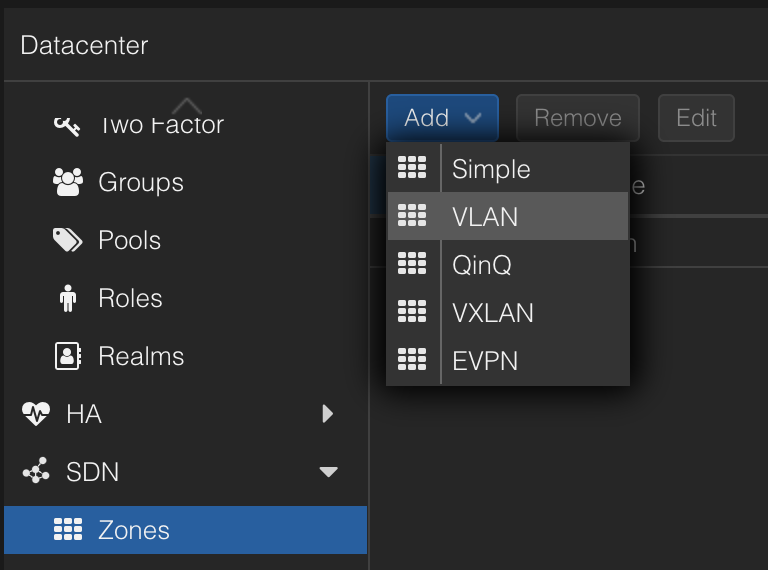

Then a VNET using the above created Zone and a VLAN tag:


If you notice here, the VNET has the option to "globally" Isolate all ports within the same VLAN using this VNET by selecting "Isolate Ports". 

Now I can just update my VMs to use this network instead:

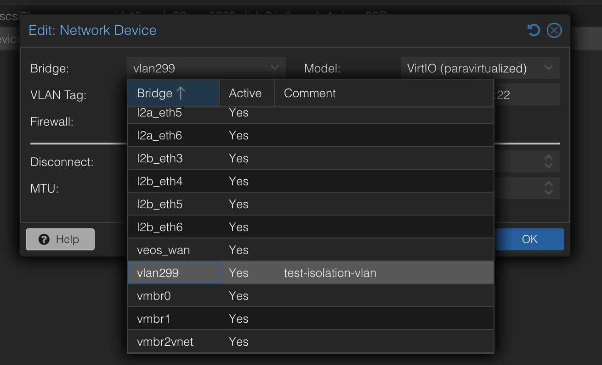

No need to enter the VLAN Tag as the VNET already carries the tag. 

This approach is much easier and better to manage.



When enabling port-isolation on Proxmox I noticed some degradation in performance in my Ubuntu VMs and you may want to tune the OS by disabling offload packet segmentation to get it back up to speed. Below are some things to adjust:

Disable offload packet segmentation on the VMs:

```bash
sudo ethtool -K ens18 tso off gso off gro off
```

With offloading disabled, it becomes more CPU reliant. Edit the VM Hardware and populate Multiqueue = amount of vCPUs.

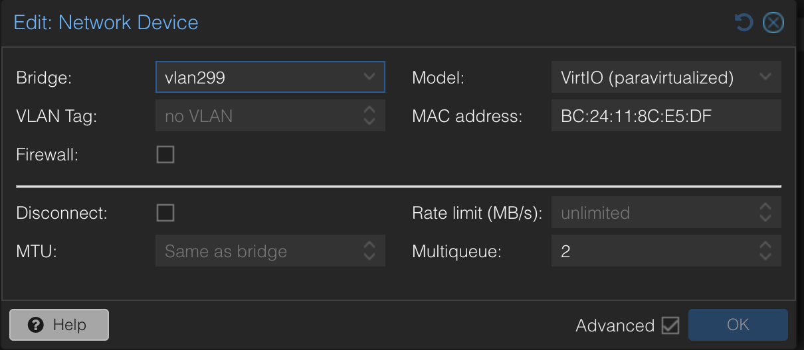




Now that I have solved how to isolate and force virtual machines on same VLAN to exit via the physical nic. What happens if web01 and web02 lives on the same physical host, on the same L2 VLAN (broadcast domain), and has been isolated on the bridge and must "talk" to each other? The only way to to that is through the physical switch. It will be dropped. Why?

Lets discuss such a scenario below: 

#### ARP scenario with port-isolation

When using **Port Isolation** on the Proxmox Linux bridge it blocks web01 from talking directly to web02.

- web01 shouts (ARP): *"Who has IP address B?"*
- The bridge blocks this shout from going to web02.
- However, the bridge **does allow** the shout to go out the "Uplink" port to my physical Arista switch.

But when this ARP request is received on my pysical switch it is being dropped due to a rule of never forwarding a frame back out the same port it entered on.
My Arista switch sees the request and thinks, *"Well I am not sending the frame using the same interface I received it on atleast, so if they need to find each other they have to do it without me involved. I can send it out on other ports in the vlan"* The frame is never received. Result: Silence. Connection fails.

The solution: **local-proxy-arp**

Meet my helpful neighbour, my Arista switch 

Now the Arista switch receives the ARP request from VM A asking for VM B's MAC address.

- **With `local-proxy-arp`:** The Arista switch sees the request and "lies." It says: *"I will handle this. Send the traffic to me."*. It will use its own mac-address to reply with.

The "Hairpin" Detour:

Because my Arista switch responded with its *own* MAC address, the traffic takes a detour outside the server and back in.

1. **web01** sends the data destined for web02.
2. The data leaves Proxmox, goes up the cable to my **Arista Switch**.
3. My Arista switch receives the packet, looks at the destination IP (web02), and realizes it needs to go back out the **same interface** it came in on.
4. My Arista switch routes the packet back down the cable to Proxmox.
5. Proxmox receives it and delivers it to **web02**.


### Application Policy - Web and Application Servers

Now where were we.. Ah yes.. Is the web01 and web02 now isolated? Lets test. In the meantime I have added the "ip local-proxy-arp" on the VLAN interface 299 on my Arista switch. 

```bash
interface Vlan299
   description test-isolation-vlan
   vrf ALL
   ip address 10.100.99.1/24
   ip local-proxy-arp
```

Lets test if the web01 and web02 are now being enforced by the MSS rules.

```bash
# From web01 to web02 SSH and HTTP
andreasm@web01:~$ ssh 10.100.99.52
ssh: connect to host 10.100.99.52 port 22: Connection timed out
andreasm@web01:~$ curl http://10.100.99.52
curl: (28) Failed to connect to 10.100.99.52 port 80 after 130774 ms: Connection timed out
# From web02 to web01 SSH and HTTP

andreasm@web02:~$ curl http://10.100.99.51
curl: (28) Failed to connect to 10.100.99.51 port 80 after 129257 ms: Connection timed out
```

Now they are being restricted by the rules on my Arista switch. 

For reference, this is how my traffic-policies configuration looks like on my 720XP switch:

```bash
traffic-policies
   vrf ALL
      traffic-policy input vrf_all_home physical
   !
   field-set ipv4 prefix DNS_NTP_servers
      10.100.1.6/32 10.100.1.7/32
   !
   field-set ipv4 prefix appserver1
      10.100.99.50/32
   !
   field-set ipv4 prefix web-appserver1
      10.100.99.50/32 10.100.99.51/32 10.100.99.52/32
   !
   field-set ipv4 prefix web01_web02
      10.100.99.51/32 10.100.99.52/32
   !
   field-set ipv4 prefix wifi_clients
      172.18.6.0/24
   !
   field-set service DNS
      protocol udp source port all destination port domain
   !
   field-set service DNS-reverse
      protocol udp source port domain destination port all
   !
   field-set service HTTP
      protocol tcp source port all destination port www
   !
   field-set service HTTP-reverse
      protocol tcp source port www destination port all
   !
   field-set service NTP
      protocol udp source port all destination port ntp
   !
   field-set service NTP-reverse
      protocol udp source port ntp destination port all
   !
   field-set service SSH
      protocol tcp source port all destination port ssh
   !
   field-set service SSH-reverse
      protocol tcp source port ssh destination port all
   !
   field-set service appserver1-tcp
      protocol tcp source port all destination port 4567
   !
   field-set service appserver1-tcp-reverse
      protocol tcp source port 4567 destination port all
   transforms interface prefix common source-destination
   !
   traffic-policy vrf_all_home
      !! Allow DNS and NTP requests to 10.100.1.6 and 10.100.1.7
      description #policy-id=256
      !
      match allow_all_NTP ipv4
         destination prefix field-set DNS_NTP_servers
         protocol service field-set NTP
         !
         actions
            count
      !
      match allow_all_NTP-reverse ipv4
         source prefix field-set DNS_NTP_servers
         protocol service field-set NTP-reverse
         !
         actions
            count
      !
      match allow_all_DNS ipv4
         destination prefix field-set DNS_NTP_servers
         protocol service field-set DNS
         !
         actions
            count
      !
      match allow_all_DNS-reverse ipv4
         source prefix field-set DNS_NTP_servers
         protocol service field-set DNS-reverse
         !
         actions
            count
      !
      match drop_http_between_webservers ipv4
         !! drop HTTP
         source prefix field-set web01_web02
         destination prefix field-set web01_web02
         protocol service field-set HTTP
         !
         actions
            count
            drop
      !
      match drop_http_between_webservers-reverse ipv4
         !! drop HTTP
         source prefix field-set web01_web02
         destination prefix field-set web01_web02
         protocol service field-set HTTP-reverse
         !
         actions
            count
            drop
      !
      match clients_to_webservers ipv4
         !! HTTP to webservers
         destination prefix field-set web01_web02
         protocol service field-set HTTP
         !
         actions
            count
      !
      match clients_to_webservers-reverse ipv4
         !! HTTP to webservers
         source prefix field-set web01_web02
         protocol service field-set HTTP-reverse
         !
         actions
            count
      !
      match ssh_to_web-app_servers ipv4
         !! ssh access to web app servers
         source prefix field-set wifi_clients
         destination prefix field-set web-appserver1
         protocol service field-set SSH
         !
         actions
            count
      !
      match ssh_to_web-app_servers-reverse ipv4
         !! ssh access to web app servers
         source prefix field-set web-appserver1
         destination prefix field-set wifi_clients
         protocol service field-set SSH-reverse
         !
         actions
            count
      !
      match web-to-appserver1 ipv4
         !! allow webservers to appserver1
         source prefix field-set web01_web02
         destination prefix field-set appserver1
         protocol service field-set appserver1-tcp
         !
         actions
            count
      !
      match web-to-appserver1-reverse ipv4
         !! allow webservers to appserver1
         source prefix field-set appserver1
         destination prefix field-set web01_web02
         protocol service field-set appserver1-tcp-reverse
         !
         actions
            count
      !
      match drop_all_else_web-app ipv4
         !! Drop_all_else
         source prefix field-set web-appserver1
         !
         actions
            count
            drop
      !
      match drop_all_else_web-app-reverse ipv4
         !! Drop_all_else
         destination prefix field-set web-appserver1
         !
         actions
            count
            drop
      !
```

Lets just display a diagram how how my VMs are interacting with each other in combination with the hardware they are running on.

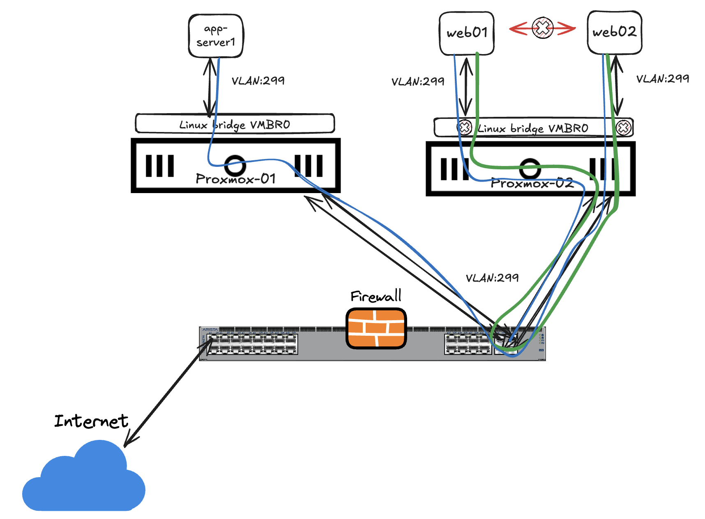


On Proxmox02 the linux bridge on vlan 299 is not involved other than block all intra traffic and forcing all traffic out to my switch where the MSS policies are in place.


### Monitor for potential allow rules I have missed

What if I have been in a rush and forgot something? The app does not work after all.

Lets enable monitoring on the "drop else rule" and let it tell me whats going on.

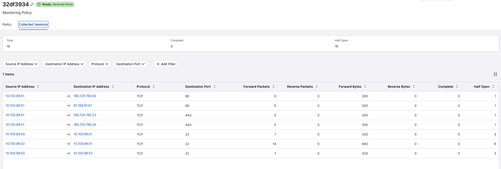

I can clearly see the SSH and HTTP attempts beings stopped (as expected) but also that my poor VMs are trying desperately to go to Internet and fetch some needed updates, but they are being stopped. Is there a way to help them out?


Redirect rules, I did mention aboive what if the VMs needs to go to the internet?


## Some useful CLI commands

In this section I will quickly list some useful CLI command in relation to MSS. 

### On the vZTX monitor

```bash
andreas-ztx1#show interfaces status
Port       Name       Status       Vlan     Duplex Speed  Type         Flags Encapsulation
Et1                   connected    routed   full   unconf 10/100/1000
Et2                   connected    routed   full   unconf 10/100/1000
Ma1        management connected    routed   a-full a-1G   10/100/1000

```

```bash
andreas-ztx1#show interfaces tunnel 0
Tunnel0 is up, line protocol is up (connected)
  Hardware is Tunnel, address is 0000.0000.0000
  Tunnel source 10.255.1.11, destination 10.255.1.10
  Tunnel protocol/transport GRE/IP
  Hardware forwarding enabled
  Tunnel transport MTU 1476 bytes (default)
  Tunnel underlay VRF "default"
  Don't Fragment bit: copied from inner header
  Up 2 minutes, 11 seconds
```

```bash
andreas-ztx1#show flow tracking firewall distributed
Flow Tracking Status
  Type: Distributed Firewall
  Running: yes, enabled by the 'flow tracking firewall distributed' command
  Tracker: flowtrkr
    Active interval: 1800000 ms
    Inactive timeout: 15000 ms
    Groups: ICMPv4, IPv4
    Exporter: exp
      VRF: default
      Local interface: Loopback0 (10.255.1.11)
      Export format: IPFIX version 10, MTU 9152
      DSCP: 0
      Template interval: 3600000 ms
      Collectors:
        127.0.0.1 port 4739
    Active Ingress Interfaces:
      Tu0
```

```bash
andreas-ztx1#show firewall distributed instance session-table
Legend
eph - Ephemeral port

Sessions: 75
VRF     Proto    Source/              Fwd/Rev         Fwd/Rev         Fwd/Rev Complete Half-Open          Start Time
                 Destination          Src VTEP IP        Pkts           Bytes
------- -------- -------------------- ------------ ---------- --------------- -------- --------- --------------------
default UDP      10.160.1.115:43538   10.255.1.10           1              87        0         1 2025-11-19 18:53:40
                 10.100.1.7:53        10.255.1.10           1             141
default UDP      172.18.199.202:51841 10.255.1.10           1              71        0         1 2025-11-19 18:53:45
                 10.100.1.7:53        10.255.1.10           1             155
default UDP      172.18.4.220:eph     10.255.1.10          13             904       12         0 2025-11-19 18:52:49
                 10.100.1.6:53        10.255.1.10          13            1628
default UDP      172.18.199.202:63375 10.255.1.10           1              71        0         1 2025-11-19 18:53:49
                 10.100.1.7:53        10.255.1.10           1             155
default UDP      172.18.199.202:61817 10.255.1.10           1              71        0         1 2025-11-19 18:53:43
                 10.100.1.7:53        10.255.1.10           1             155
default UDP      10.160.1.113:43726   10.255.1.10           1              87        0         1 2025-11-19 18:53:36
                 10.100.1.7:53        10.255.1.10           1             103
default UDP      172.18.199.202:51217 10.255.1.10           1              71        0         1 2025-11-19 18:53:45
                 10.100.1.7:53        10.255.1.10           1             155
default UDP      172.18.199.202:50857 10.255.1.10           1              71        0         1 2025-11-19 18:53:45
                 10.100.1.7:53        10.255.1.10           1             155
default UDP      172.18.199.202:51406 10.255.1.10           1              71        0         1 2025-11-19 18:53:50
                 10.100.1.7:53        10.255.1.10           1             155
default UDP      10.160.1.115:48036   10.255.1.10           1              87        0         1 2025-11-19 18:53:40
                 10.100.1.7:53        10.255.1.10           1             103
default UDP      172.18.6.138:48785   10.255.1.10           1              60        0         1 2025-11-19 18:53:43
                 10.100.1.7:53        10.255.1.10           1              76
```

```bash
andreas-ztx1#show platform sfe counters | nz
Name                                                  Owner                             Counter Type Unit    Count
----------------------------------------------------- --------------------------------- ------------ ------- ---------
IPv4_Flow_Cache_Inserts                               -                                 module       flows   23846
Tx_PMD_et2-q_out_pkts-6                               Tx_PMD_et2                        module       packets 12363
Tx_PMD_et2-q_out_bytes-6                              Tx_PMD_et2                        module       bytes   2633319
Tx_VKNI_et2-q_out_pkts-0                              Tx_VKNI_et2                       module       packets 182338
Tx_VKNI_et2-q_out_bytes-0                             Tx_VKNI_et2                       module       bytes   21662140
Tx_VKNI_et2-q_out_pkts-3                              Tx_VKNI_et2                       module       packets 2839244
Tx_VKNI_et2-q_out_bytes-3                             Tx_VKNI_et2                       module       bytes   181712832
L2Classify_Ethernet2-Ingress_Hdr_Check_Drop_Pkts      L2Classify_Ethernet2              module       packets 38063
L2Classify_Ethernet2-In_Runt_Pkts                     L2Classify_Ethernet2              module       packets 145
L2Classify_Ethernet2-Vlan_Drop_Pkts                   L2Classify_Ethernet2              module       packets 8868886
L2Classify_Ethernet2-Bad_Router_Mac_Pkts              L2Classify_Ethernet2              module       packets 27949
Tx_PMD_et1-q_out_pkts-1                               Tx_PMD_et1                        module       packets 119
Tx_PMD_et1-q_out_bytes-1                              Tx_PMD_et1                        module       bytes   11590
Tx_PMD_et1-q_out_pkts-6                               Tx_PMD_et1                        module       packets 16943
Tx_PMD_et1-q_out_bytes-6                              Tx_PMD_et1                        module       bytes   2825679
Tx_VKNI_et1-q_out_pkts-2                              Tx_VKNI_et1                       module       packets 117
Tx_VKNI_et1-q_out_bytes-2                             Tx_VKNI_et1                       module       bytes   14688
Tx_VKNI_et1-q_out_pkts-3                              Tx_VKNI_et1                       module       packets 4578
Tx_VKNI_et1-q_out_bytes-3                             Tx_VKNI_et1                       module       bytes   274680
Tunnel-Global-tun_decap_drop_pkts                     Ip4TunDemux                       module       packets 133
Tunnel-0-in_ucast_pkts                                Ip4TunDemux                       module       packets 1858
Tunnel-0-in_bytes                                     Ip4TunDemux                       module       bytes   200714
IpfixFt-NoFcMdPkts                                    IpfixFtIngress_tu0                module       packets 231
IpfixFt-NewFcUd                                       IpfixFtIngress_tu0                module       packets 858
IpfixFt-DropModePkts                                  IpfixFtIngress_tu0                module       packets 1858
```

```bash
andreas-ztx1#show agent sfe threads flow cache scan counters
Purged count: 23849
IPFIX export count: 8351
IPFIX failed export count: 0
```

```bash
andreas-ztx1#bash bessctl show flow-cache stats
Flow Count:      97
Num Buckets:     1048576
Max Keys:        1048576
Permanent Keys:  0
Purgeable Keys:   97
Ephemeral Keys:   47
Ephemeral Summary Keys:   22
Ephemeral Purge Timeout(sec):   65
Ephemeral Source Starting Port:   49152
Ephemeral Destination Starting Port:   49152
Low Memory Mode: False
Purge Timeout(sec): 10
Tcp Half-Open Purge Timeout(sec): 10
Tcp Idle Purge Timeout(sec): 60
```


### On the MSS Switches

```bash
andreasm-720xp-home(config)#show traffic-policy ?
  WORD       Traffic policy name
  field-set  Traffic policy field set
  interface  Policy applied on interface
  protocol   protocol
  vlan       Policy applied on VLAN
```

```bash
andreasm-720xp-home(config)#show traffic-policy vlan detail
Traffic policy vrf_all_home
   Configured on VLANs:
   Applied on VLANs for IPv4 traffic:
   Applied on VLANs for IPv6 traffic:
   Total number of rules configured: 16
      match allow_all_NTP ipv4
         Destination prefix: field-set DNS_NTP_servers (Prefixes: 2, Except prefixes: 0)
         Service: field-set NTP (Protocols: 1)
         Actions: Count: 0 packets
      match allow_all_NTP-reverse ipv4
         Source prefix: field-set DNS_NTP_servers (Prefixes: 2, Except prefixes: 0)
         Service: field-set NTP-reverse (Protocols: 1)
         Actions: Count: 0 packets
      match allow_all_DNS ipv4
         Destination prefix: field-set DNS_NTP_servers (Prefixes: 2, Except prefixes: 0)
         Service: field-set DNS (Protocols: 1)
         Actions: Count: 0 packets
                  Mirror session andreas-vztx-ALL
      match allow_all_DNS-reverse ipv4
         Source prefix: field-set DNS_NTP_servers (Prefixes: 2, Except prefixes: 0)
         Service: field-set DNS-reverse (Protocols: 1)
         Actions: Count: 0 packets
                  Mirror session andreas-vztx-ALL
      match drop_http_between_webservers ipv4
         Source prefix: field-set web01_web02 (Prefixes: 2, Except prefixes: 0)
         Destination prefix: field-set web01_web02 (Prefixes: 2, Except prefixes: 0)
         Service: field-set HTTP (Protocols: 1)
         Actions: Drop
                  Count: 0 packets
```

```bash
andreasm-720xp-home(config)#show traffic-policy interface summary
Traffic policy vrf_all_home
   description #policy-id=256
   Configured on input for VRFs: ALL
   Applied on input for IPv4 traffic in VRFs: ALL
   Applied on input for IPv6 traffic in VRFs: ALL
   Configured on input of interfaces:
   Applied on input of interfaces for IPv4 traffic:
   Applied on input of interfaces for IPv6 traffic:
   Total number of rules configured: 16
      match allow_all_NTP ipv4
      match allow_all_NTP-reverse ipv4
      match allow_all_DNS ipv4
      match allow_all_DNS-reverse ipv4
      match drop_http_between_webservers ipv4
      match drop_http_between_webservers-reverse ipv4
      match clients_to_webservers ipv4
      match clients_to_webservers-reverse ipv4
      match ssh_to_web-app_servers ipv4
      match ssh_to_web-app_servers-reverse ipv4
      match web-to-appserver1 ipv4
      match web-to-appserver1-reverse ipv4
      match drop_all_else_web-app ipv4
      match drop_all_else_web-app-reverse ipv4
      match ipv4-all-default ipv4
      match ipv6-all-default ipv6
```

 


## Outro

This has been a very interesting experience. MSS is easy to get started with. It is more or less there just waiting for you to enable it. A big benefit, apart from easy administration, is the idea that I can cover my whole estate with policies, across the board with no gaps. In the DC, in the Campus, different Campus', Branch offices all from same management UI (CloudVision). Instead of bringing the traffic into my DC I can police the traffic at the edge, where it is. I have to do a follow up post when I also get some Arista Wifi in the house. Then I hopefully can utilize the integration of AGNI in MSS too. MSS also supports redirect rules to 3rd party firewalls for further inspection which I did not have the time to look at this time.  If MSS is in place, there is no place to hide. It will be enforced by the traffic-policies on the Arista switches. Performance wise there is no better place to enforce it than on the switches themselves. They are made for it and at line-rate performance.. Well it cant really be any better.  

Recommend material to have a look at:

Arists MSS on [YouTube](https://www.youtube.com/watch?v=WyR3oqnCu4w)


### Sources

- [Arista Multi-Domain Segmentaton - homepage](https://www.arista.com/en/products/multi-domain-segmentation/)
- [Arista Multi-Domain Segmentation - literature](https://www.arista.com/en/products/multi-domain-segmentation/literature)
- [ZTX Deployment Guide](https://www.arista.com/assets/data/pdf/ZTX-7250S-Deployment-Guide.pdf)
- [MSS Deployment Guide](https://www.arista.com/assets/data/pdf/user-manual/um-books/MSS-Deployment-Guide.pdf)
- [MSS Data-Sheet](https://www.arista.com/assets/data/pdf/Datasheets/Multi-Domain-Segmentation-Services-for-Zero-Trust-Networking.pdf)
- [MSS Whitepaper](https://www.arista.com/assets/data/pdf/Whitepapers/MSS-Segmentation-Technical-WP.pdf)


